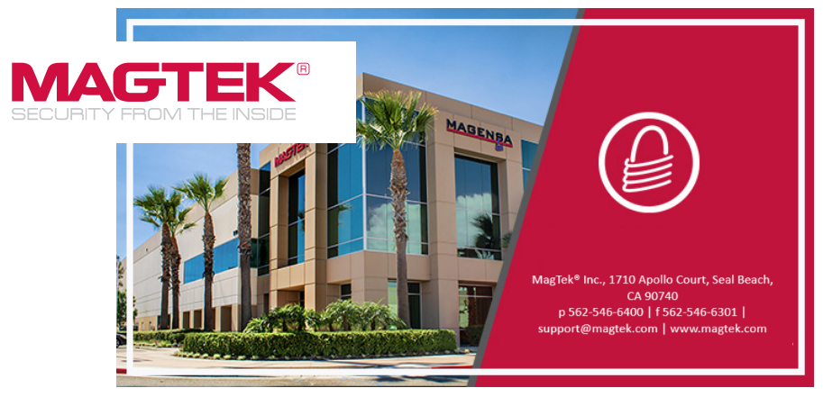

Contact Us:
# MagTek  1710 Apollo Court I Seal Beach, CA 90740  
**Phone:** (562) 546-6400  
**Technical Support:** (562) 546-6800  
[www.magtek.com](http://www.magtek.com)  

**About MagTek:**

Founded in 1972, MagTek is a leading manufacturer of electronic systems for the reliable issuance, reading, transmission, and security of cards, barcodes, checks, PINs, and identification documents. Leading with innovation and engineering excellence, MagTek is known for quality and dependability. Its products include secure card reader/authenticators, Qwantum secure cards, token generators; EMV Contact Chip, EMV Contactless, barcode and NFC reading devices; encrypting check scanners, PIN pads, and credential personalization systems. These products are used worldwide by financial institutions, retailers, payment processors, and ISVs to provide efficient and private electronic transactions.

**MagTek is headquartered in Seal Beach, CA. For more information, please visit [www.magtek.com](http://www.magtek.com)**.

**Subscribe** or **Unsubscribe** to our [**Mailing List**](https://www.magtek.com/about/contact)