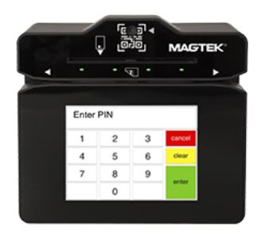
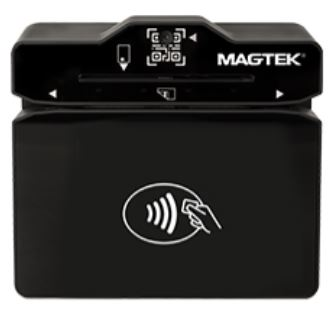
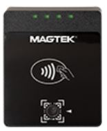
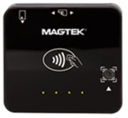

# MMS Dyna Devices Master Programmer's Manual
MMS Dyna Devices Master Programmer's Manual 

  
 
                                                                                                                                                                      |                                          
 
 Confidential This document contains the proprietary information of MagTek. Its receipt or possession does not convey any rights to reproduce or disclose its contents or to manufacture, use or sell anything it may describe. Reproduction, disclosure or use without specific written authorization of MagTek is strictly forbidden.  Unpublished – All Rights Reserved June 2025  Document Number: D100005000-102  REGISTERED TO ISO 9001:2015 

Copyright © 2006 - 2025 MagTek, Inc.

Printed in the United States of America

information in this publication is subject to change without notice. MagTek
cannot be held liable for any use of the contents of this document. Any changes
or improvements made to this product will be included in the next publication
release. If you have questions about specific features and functions or when
they will become available, please contact your MagTek representative.

MagTek®, MagnePrint®, and MagneSafe® are registered trademarks of MagTek, Inc.

Magensa™ is a trademark of MagTek, Inc.

AAMVA™ is a trademark of AAMVA.

American Express® and EXPRESSPAY FROM AMERICAN EXPRESS® are registered
trademarks of American Express Marketing & Development Corp.

D-PAYMENT APPLICATION SPECIFICATION® is a registered trademark of Discover
Financial Services CORPORATION

MasterCard® is a registered trademark and PayPass™ and Tap & Go™ are trademarks
of MasterCard International Incorporated.

Visa® and Visa payWave® are registered trademarks of Visa International Service
Association.

ANSI®, the ANSI logo, and numerous other identifiers containing "ANSI" are
registered trademarks, service marks, and accreditation marks of the American
National Standards Institute (ANSI).

ISO® is a registered trademark of the International Organization for
Standardization.

UL™ and the UL logo are trademarks of UL LLC.

PCI Security Standards Council® is a registered trademark of the PCI Security
Standards Council, LLC.

EMV® is a registered trademark in the U.S. and other countries and an
unregistered trademark elsewhere. The EMV trademark is owned by EMVCo, LLC. The
Contactless Indicator mark, consisting of four graduating arcs, is a trademark
owned by and used with permission of EMVCo, LLC.

The *Bluetooth®*® word mark and logos are registered trademarks owned by
Bluetooth® SIG, Inc. and any use of such marks by MagTek is under license.

Google Play™ store, Google Wallet™ payment service, and Android™ platform are
trademarks of Google LLC.

Apple Pay®, iPhone®, iPod®, Mac®, and OS X® are registered trademarks of Apple
Inc., registered in the U.S. and other countries. iPad™ is a trademark of Apple.
Inc. App StoreSM is a service mark of Apple Inc., registered in the U.S. and
other countries. IOS is a trademark or registered trademark of Cisco in the U.S.
and other countries and is used by Apple Inc. under license.

Microsoft®, Windows®, and .NET® are registered trademarks of Microsoft
Corporation.

MIFARE, the MIFARE logo, MIFARE Ultralight, MIFARE Plus, MIFARE Classic, MIFARE
FleX, DESFire, and MIFARE4Mobile are registered trademarks of NXP B.V.

All other system names and product names are the property of their respective
owners.

Table 1 - Revisions

| Rev Number | Date               | Notes                                                                                                                                                                                                                                                                                                                                                                                                                                                                                                                                                                                                                                                                                                                                                                                                                                                                                                                                                                                                                                                                                                                                                                                                                                                                                                                                                                                                                                                                                                                                                                                                                                                                                                                                                                                                                                                                                                                                                                                                                                                                                                                                                                                                                                                                                                                                                                                                                                                                                                                                                                                                                                                                                                                                                                                                                                                                                                                                                                                                                                                                                                                                                                                                                                                                                                                                                                                                                                                                                                                                                                                                                                                                                                                                                                                                                                                                                                                                                                                                                                                                                                                                                                                                                                                                                                                                                                                                                                                                                                                                                                                                                                                                                                                                                                                                                                                                                                                                                                                                                                                                                                                                                                                                                                                                                                                                                                                                                                                                                                                                                                                                                                                                                                                                                                                                                                                                                                                                                                                                                                                                                                                                                                                                                                                                                                                                                                                                                                                                                                                                             |
|------------|--------------------|---------------------------------------------------------------------------------------------------------------------------------------------------------------------------------------------------------------------------------------------------------------------------------------------------------------------------------------------------------------------------------------------------------------------------------------------------------------------------------------------------------------------------------------------------------------------------------------------------------------------------------------------------------------------------------------------------------------------------------------------------------------------------------------------------------------------------------------------------------------------------------------------------------------------------------------------------------------------------------------------------------------------------------------------------------------------------------------------------------------------------------------------------------------------------------------------------------------------------------------------------------------------------------------------------------------------------------------------------------------------------------------------------------------------------------------------------------------------------------------------------------------------------------------------------------------------------------------------------------------------------------------------------------------------------------------------------------------------------------------------------------------------------------------------------------------------------------------------------------------------------------------------------------------------------------------------------------------------------------------------------------------------------------------------------------------------------------------------------------------------------------------------------------------------------------------------------------------------------------------------------------------------------------------------------------------------------------------------------------------------------------------------------------------------------------------------------------------------------------------------------------------------------------------------------------------------------------------------------------------------------------------------------------------------------------------------------------------------------------------------------------------------------------------------------------------------------------------------------------------------------------------------------------------------------------------------------------------------------------------------------------------------------------------------------------------------------------------------------------------------------------------------------------------------------------------------------------------------------------------------------------------------------------------------------------------------------------------------------------------------------------------------------------------------------------------------------------------------------------------------------------------------------------------------------------------------------------------------------------------------------------------------------------------------------------------------------------------------------------------------------------------------------------------------------------------------------------------------------------------------------------------------------------------------------------------------------------------------------------------------------------------------------------------------------------------------------------------------------------------------------------------------------------------------------------------------------------------------------------------------------------------------------------------------------------------------------------------------------------------------------------------------------------------------------------------------------------------------------------------------------------------------------------------------------------------------------------------------------------------------------------------------------------------------------------------------------------------------------------------------------------------------------------------------------------------------------------------------------------------------------------------------------------------------------------------------------------------------------------------------------------------------------------------------------------------------------------------------------------------------------------------------------------------------------------------------------------------------------------------------------------------------------------------------------------------------------------------------------------------------------------------------------------------------------------------------------------------------------------------------------------------------------------------------------------------------------------------------------------------------------------------------------------------------------------------------------------------------------------------------------------------------------------------------------------------------------------------------------------------------------------------------------------------------------------------------------------------------------------------------------------------------------------------------------------------------------------------------------------------------------------------------------------------------------------------------------------------------------------------------------------------------------------------------------------------------------------------------------------------------------------------------------------------------------------------------------------------------------------------------------------------------------------------------------|
| 10         | Sep 3, 2020        | Initial release                                                                                                                                                                                                                                                                                                                                                                                                                                                                                                                                                                                                                                                                                                                                                                                                                                                                                                                                                                                                                                                                                                                                                                                                                                                                                                                                                                                                                                                                                                                                                                                                                                                                                                                                                                                                                                                                                                                                                                                                                                                                                                                                                                                                                                                                                                                                                                                                                                                                                                                                                                                                                                                                                                                                                                                                                                                                                                                                                                                                                                                                                                                                                                                                                                                                                                                                                                                                                                                                                                                                                                                                                                                                                                                                                                                                                                                                                                                                                                                                                                                                                                                                                                                                                                                                                                                                                                                                                                                                                                                                                                                                                                                                                                                                                                                                                                                                                                                                                                                                                                                                                                                                                                                                                                                                                                                                                                                                                                                                                                                                                                                                                                                                                                                                                                                                                                                                                                                                                                                                                                                                                                                                                                                                                                                                                                                                                                                                                                                                                                                                   |
| 12         | Oct 13, 2020       | Prepare for general availability.                                                                                                                                                                                                                                                                                                                                                                                                                                                                                                                                                                                                                                                                                                                                                                                                                                                                                                                                                                                                                                                                                                                                                                                                                                                                                                                                                                                                                                                                                                                                                                                                                                                                                                                                                                                                                                                                                                                                                                                                                                                                                                                                                                                                                                                                                                                                                                                                                                                                                                                                                                                                                                                                                                                                                                                                                                                                                                                                                                                                                                                                                                                                                                                                                                                                                                                                                                                                                                                                                                                                                                                                                                                                                                                                                                                                                                                                                                                                                                                                                                                                                                                                                                                                                                                                                                                                                                                                                                                                                                                                                                                                                                                                                                                                                                                                                                                                                                                                                                                                                                                                                                                                                                                                                                                                                                                                                                                                                                                                                                                                                                                                                                                                                                                                                                                                                                                                                                                                                                                                                                                                                                                                                                                                                                                                                                                                                                                                                                                                                                                 |
| 14         | Dec 17, 2020       | Remove Command 0x1011 - Get Transaction Data and related content; **4.4** clarify DFDF52 value 0x03 is reserved; Add **Command 0x1802 - Report Cardholder Selection** and add related notification details to **Notification 0x1803 - User Interface Host Action Request**; Add **Command 0x1F02 - Set Notification Subscriptions**; Add **Command 0x1803 - Display Message**; **Command 0x1001 - Start Transaction**, add description of how to implement host-driven fallback, add device-driven fallback feature, add optional parameters to suppress “THANK YOU” message and override the final display message; Add **Property 1.2.2.2.1.1 Reduce Power During USB Suspend**; Add **Property 2.1.2.6.1.1 Firmware Git and Build information (MAGTEK INTERNAL ONLY)**; Add note in **Command 0x1001 - Start Transaction** regarding transaction amount when in Quick Chip mode; **Table 30** clarify possible values for Signature Status; Misc. clarifications and corrections.                                                                                                                                                                                                                                                                                                                                                                                                                                                                                                                                                                                                                                                                                                                                                                                                                                                                                                                                                                                                                                                                                                                                                                                                                                                                                                                                                                                                                                                                                                                                                                                                                                                                                                                                                                                                                                                                                                                                                                                                                                                                                                                                                                                                                                                                                                                                                                                                                                                                                                                                                                                                                                                                                                                                                                                                                                                                                                                                                                                                                                                                                                                                                                                                                                                                                                                                                                                                                                                                                                                                                                                                                                                                                                                                                                                                                                                                                                                                                                                                                                                                                                                                                                                                                                                                                                                                                                                                                                                                                                                                                                                                                                                                                                                                                                                                                                                                                                                                                                                                                                                                                                                                                                                                                                                                                                                                                                                                                                                                                                                                                              |
| 16         | Jan 28. 2021       | Command 0x1001 - Start Transaction Table 70 add signature bypass control parameter and Transaction Timeout parameter, update event sequence to change message from USE CHIP CARD to TRY AGAIN and add information about device-driven signature capture, clarify device-driven fallback sequence; Notification 0x0105 - Transaction Operation Complete Table 322 update possible value for Signature Status; Add **Property 1.2.1.1.2.1 Signature Capture Control**; Add **Property 1.2.1.1.2.2 Include Signature Data in EMV Batch Data**; Misc. clarifications and corrections.                                                                                                                                                                                                                                                                                                                                                                                                                                                                                                                                                                                                                                                                                                                                                                                                                                                                                                                                                                                                                                                                                                                                                                                                                                                                                                                                                                                                                                                                                                                                                                                                                                                                                                                                                                                                                                                                                                                                                                                                                                                                                                                                                                                                                                                                                                                                                                                                                                                                                                                                                                                                                                                                                                                                                                                                                                                                                                                                                                                                                                                                                                                                                                                                                                                                                                                                                                                                                                                                                                                                                                                                                                                                                                                                                                                                                                                                                                                                                                                                                                                                                                                                                                                                                                                                                                                                                                                                                                                                                                                                                                                                                                                                                                                                                                                                                                                                                                                                                                                                                                                                                                                                                                                                                                                                                                                                                                                                                                                                                                                                                                                                                                                                                                                                                                                                                                                                                                                                                                 |
| 18         | Mar 4, 2021        | Add **Property 2.3.1.2.1.1 Device Operational Status**; Add **Property 2.3.1.2.1.2 Offline Status Detail**; Add **Property 2.3.1.1.2.1 Real Time Clock Enabled**; Add **Property 2.3.1.1.2.2 Tamper Sensors Activated**; Add **Property 2.3.1.1.2.3 Tamper Sensor Tampered**; Add **Command 0x1004 - Resume Transaction**; **Notification 0x0105 - Transaction Operation Complete** add notification codes for Quick Chip signature capture; Add **Property 1.2.1.1.2.3 Signature Timing Window (Touch Only)** and update **Command 0x1001 - Start Transaction** to provide information about host-driven signature capture; Misc. clarifications and corrections.                                                                                                                                                                                                                                                                                                                                                                                                                                                                                                                                                                                                                                                                                                                                                                                                                                                                                                                                                                                                                                                                                                                                                                                                                                                                                                                                                                                                                                                                                                                                                                                                                                                                                                                                                                                                                                                                                                                                                                                                                                                                                                                                                                                                                                                                                                                                                                                                                                                                                                                                                                                                                                                                                                                                                                                                                                                                                                                                                                                                                                                                                                                                                                                                                                                                                                                                                                                                                                                                                                                                                                                                                                                                                                                                                                                                                                                                                                                                                                                                                                                                                                                                                                                                                                                                                                                                                                                                                                                                                                                                                                                                                                                                                                                                                                                                                                                                                                                                                                                                                                                                                                                                                                                                                                                                                                                                                                                                                                                                                                                                                                                                                                                                                                                                                                                                                                                                                |
| 20         | Jul 1, 2021        | **4.1** change data type “TC” to “T” and remove “TP” which is better defined by other primitive data types; Repurpose “Notification Group 0x10nn - Notifications from Hardware” to become **Notification Source 0x10nn - Notifications from Device** and populate **Notification 0x1001 - Device Information Update**; Sections **•** and **7**, expand explanation of how to find documentation for a given notification message; Add **Property 1.1.2.2.1.6 PAN MOD 10 Check Digit Validation**; Change name of **Property 1.2.1.1.2.1 Signature Capture Control** and clarify behavior throughout the document; **Property 1.2.1.1.2.3 Signature Timing Window (Touch Only)** change default value from 3 seconds to 1 second; Add **Property 1.2.3.2.1.1 System Volume Control**; Add **Property 1.2.7.1.1.1 Device Reset Occurred Notification Control**; Add **Property 1.2.7.1.1.2 Device Reset Occurred Notification Acknowledged**; Add **Property 1.2.7.1.1.3 Device Reset Will Occur Soon Notification Control**; Add **Property 1.2.7.1.2.1 User Event Notification Controls Enable**; Add **Property 1.2.7.1.2.2 User Event Notification MSR Data Timeout (MSR Only)**; Add **Property 2.3.1.1.2.4 Tamper Configuration Revision (MAGTEK INTERNAL ONLY)**; **Notification 0x0105 - Transaction Operation Complete** change description in end of transaction notifications from Decline, Quick Chip to Quick Chip Deferred; Add Manual Card Entry to **Command 0x1001 - Start Transaction**, **Notification 0x0101 - Transaction Information Update**, **Notification 0x0105 - Transaction Operation Complete**; Add retrieval of multiple properties to **Command 0xD101 - Get Property**; Add section **4.2 About Track Data**; Switch **TR-31 Key Block Type** and **Command 0xF017 - Establish Ephemeral KBPK** to include in published manuals; Update copyright page and regulatory / compliance information from Installation and Operation Manual; Misc. clarifications and corrections.                                                                                                                                                                                                                                                                                                                                                                                                                                                                                                                                                                                                                                                                                                                                                                                                                                                                                                                                                                                                                                                                                                                                                                                                                                                                                                                                                                                                                                                                                                                                                                                                                                                                                                                                                                                                                                                                                                                                                                                                                                                                                                                                                                                                                                                                                                                                                                                                                                                                                                                                                                                                                                                                                                                                                                                                                                                                                                                                                                                                                                                                                                                                                                                                                                                                                                                                                                                                                                                                                                                                                                                                                                                                                                                                                                                                                                                                                                                                                                                                                                                                                                                                                                                                                                                                                                                                                                                                                                                                                                                                     |
| 30         | Nov 9, 2021        | Update cover page photos to show latest trade dress; Replace product boilerplate material with Error! Reference source not found.; Throughout, add references to DynaProx; 0 add features MCE and BCR and throughout document add corresponding feature tags; In Notification 0x0101 - Transaction Information Update add barcode reader functions; Add [Command 0x1804 - Read Barcode](#command-0x1804---read-barcode-bcr-only); Command 0x1822 - Show QR Code, Command 0x1823 - Show Bitmap Image, , In End of Notification Message found on page **64** Notification 0x1805 - User Interface Operation Complete, add Banking Functions notification codes, PIN Verify Failed Error code to Table 351, add In Command 0x1F02 - Set Notification Subscriptions add UART option; Publish Command 0x1004 - Resume Transaction; Publish EMV ARPC Type, add response codes for Request Online PIN and Switch Interface, add Issuer Referral code, clarify tags 71 and 72; add another available orientation; In **Notification 0x0105 - Transaction Operation Complete** add Declined codes for ICC and PICC to differentiate from a Quick Chip Deferred case, update MSR notification codes to be consistent with ICC/PICC codes, add host follow up advised actions throughout; In **Command 0xF016 - Activate Device Security (MAGTEK INTERNAL ONLY)** add BCR entry in Hardware Configuration Profile, add value 0x02 for Audio/Sound, and add version 0x02; Add **Property 1.1.1.1.1.5 ARPC Receive Timeout** and **Property 1.1.1.1.1.6 ARPC Retry Attempts**; Add **Encryption Type** section and use as common reference throughout; In **Command 0x1001 - Start Transaction** add support for EMV Transaction Flow and improve parameter descriptions; Misc. clarifications and corrections.                                                                                                                                                                                                                                                                                                                                                                                                                                                                                                                                                                                                                                                                                                                                                                                                                                                                                                                                                                                                                                                                                                                                                                                                                                                                                                                                                                                                                                                                                                                                                                                                                                                                                                                                                                                                                                                                                                                                                                                                                                                                                                                                                                                                                                                                                                                                                                                                                                                                                                                                                                                                                                                                                                                                                                                                                                                                                                                                                                                                                                                                                                                                                                                                                                                                                                                                                                                                                                                                                                                                                                                                                                                                                                                                                                                                                                                                                                                                                                                                                                                                                                                                                                                                                                                                                                                                                                                                                                                                                                                                                                                                                                                                                                                                                |
| 40         | Dec 9, 2021        | Add **Command 0x1F03 - Extend Session**; In **Notification 0x1001 - Device Information Update** add Session Expiring Soon; In **Command 0xF016 - Activate Device Security (MAGTEK INTERNAL ONLY)** add optional WLAN SoftAP MagTek Password parameter; Add **Notification Source 0x02nn - Notifications from Banking Functions (Banking Functions Only)** and **Command Group 0x20nn - Banking Functions**; Add sections **2.5** and **2.6** for RS-232 and SLIP support; Misc. clarifications and corrections.                                                                                                                                                                                                                                                                                                                                                                                                                                                                                                                                                                                                                                                                                                                                                                                                                                                                                                                                                                                                                                                                                                                                                                                                                                                                                                                                                                                                                                                                                                                                                                                                                                                                                                                                                                                                                                                                                                                                                                                                                                                                                                                                                                                                                                                                                                                                                                                                                                                                                                                                                                                                                                                                                                                                                                                                                                                                                                                                                                                                                                                                                                                                                                                                                                                                                                                                                                                                                                                                                                                                                                                                                                                                                                                                                                                                                                                                                                                                                                                                                                                                                                                                                                                                                                                                                                                                                                                                                                                                                                                                                                                                                                                                                                                                                                                                                                                                                                                                                                                                                                                                                                                                                                                                                                                                                                                                                                                                                                                                                                                                                                                                                                                                                                                                                                                                                                                                                                                                                                                                                                   |
| 50         | January 27, 2022   | Add **Command 0xEF02 – Generate CSR keys (WLAN Only)**; Add **Notification 0x1001 - Device Information Update** category key management; Add **Command 0xEF03 – Generate CSR (WLAN Only)**; Add certificate and CSR file types to Table 201; Add Section 4.25 **Common File Structure**; Add **Certificate File Types**; Add **Certificate Signing Request (CSR) File Types**; In **Notification 0x1001 - Device Information Update** add Low Battery Warning and Low Battery Power Down; Add **Property 1.1.1.1.1.5 ARPC Receive Timeout** and **Property 1.1.1.1.1.6 ARPC Retry Attempts**; Add **Property 1.2.2.1.1.A Maximum Client Connections** and **Property 2.1.2.5.6.4 Active Client Connections**.; Clarify how session management works when more than one WLAN active client connection is active.; Updated Device Family ID parameter in **Command 0xD101 - Get Property** and **Command 0xD111 - Set Property**; Add **Property 1.2.2.1.1.B Certificate Expiring Soon Notification Threshold** and **Notification 0x1001 - Device Information Update** category Key management, reason Certificate Expiring Soon; Added PIN Block format options in **Command 0x1001 - Start Transaction** ; Misc. clarifications and corrections. Add Apollo and Customer trust certificate identifiers to Table 201 - File Types; Made Apollo root CA certificate loadable instead of hardcoded; Add Trust configuration file toTable 201 - File Types**;** Add support for IP addresses in **Command 0xEF03 – Generate CSR (WLAN Only)** SANs parameter and change default values for Subject and SANs parameters ; Add DF71-ISO PIN Block Format tag under F5-Encrypted PIN Container in **Table 20 - EMV ARQC (DynaPro Format) DFDF59 Decrypted Contents** and **Padding to ensure the length of data, starting with the message** length at the very beginning, and ending with any additional padding, is a multiple of 8 bytes for TDES, or 16 bytes for AES. This is a requirement of using the CBC-MAC algorithm. Four-byte CBC-MAC. The host should calculate the CBC-MAC and verify that it matches. For details about calculating a CBC-MAC, see About Message Authentication Codes (MAC).   Table 28 – EMV Batch Data (DynaPro Format) DFDF59 Decrypted Contents , set **7.1.2 Notification 0x0103 - Transaction Host Action Request (MAGTEK INTERNAL ONLY FOR NOW)** as MAGTEK INTERNAL ONLY FOR NOW; Added missing response codes in **The General group 0x00 contains operation status** detail codes related to the platform that do not originate from a specific functional module. • Subgroup 0x00 = General  **The Message Handler** group 0x01 contains operation status detail codes related to parsing and validating messages. Subgroup 0x01 = Device issues that prevent Message Processing (e.g., Critical Battery, Pending Reset, System Failure, System Busy).  **The Request Handler** group 0x02 contains operation status detail codes related to starting actual command requests. • Subgroup 0x01 = Data issues (bad, missing, unknown…) • Subgroup 0x02 = Security / permission problems • Subgroup 0x03 = Device state issues (busy, not permitted, tampered, low battery) • Subgroup 0x04 = Device issues (missing hardware or features) • Subgroup 0x05 = TR31 Errors  Table 13 - Operation Status Detail Codes , added ability to report TR31 error codes; Updated **Property Subgroup 2.1.2.3.nn EMV Firmware Information** adding the description of properties to retrieve each supported kernel’s ID, part number and checksum ; Add **Sections 4.18.1-4.18-6** DUKPT Key Mapping.  Add 7 OIDs, from **Property 1.1.2.4.1.1 Key Mapping of PIN-TDES** to **Property 1.1.2.4.1.7 Key Mapping of PIN-AES**. Add **Property 2.3.1.1.1.1 Device Key Status**. Add **Property 2.3.1.1.1.2 Transaction Key Status**. Add **Property 1.2.2.1.1.3 Security Mode**. Add **Property 1.2.2.1.1.C Username**, Add **Property 1.2.2.1.1.4 Static IP Address** ; **Property 1.2.2.1.1.5 Use DHCP** ; **Property 1.2.2.1.1.6 Static IP Netmask ; Property 1.2.2.1.1.7 Static IP Gateway**  ; Add back Batch Data for contactless in **Table 308 - Notification Detail Codes**   ; Add **Property 2.1.2.5.3.1 WLAN Firmware Version**, ; Add **Property 2.1.2.5.6.2 WLAN WiFi RSSI** ; **Property 2.1.2.5.6.3 WLAN Dynamic IP Address** ; **Property 1.2.2.1.1.D SoftAP IP Address** ; **Property 1.2.2.1.1.1 SSID** ; **Property 1.2.2.1.1.2 Password**; Add **Property 2.1.2.1.2.2 Boot0 Firmware Version**. Added Boot1 and WiFi modules to [**Command 0xD801 - Load Firmware File**](#command-0xd801--load-firmware-file); Add [**Property 2.1.2.5.3.1 WLAN Firmware Version**](#property-212531-wlan-firmware-version) and [**Property 2.1.2.5.3.2 WLAN WiFi Module Build Hash (MAGTEK INTERAL ONLY)**](#property-212532-wlan-wifi-module-build-hash-magtek-interal-only). Add [**8.4.1 Property Subgroup 2.1.1.1.nn MainApp Firmware Information**](#841-property-subgroup-2111nn-mainapp-firmware-information). Add [**8.3.2.1 Property 1.2.2.1.1.1 SSID**](#8321-property-122111-ssid). Add [**8.3.2.8 Property 1.2.2.1.1.8 Device Name**](#8328-property-122118-device-name). Add [**8.5.5.7 Property 2.1.2.5.6.5 Server Certificate Chain Select**](#8557-property-212565-server-certificate-chain-select). Add [**8.5.5.8 Property 2.1.2.5.6.6 Security Protocol**](#8558-property-212566-security-protocol)**. Update** [**2.2 How to Use Wireless LAN (WLAN) Connections**](#22-how-to-use-wireless-lan-wlan-connections)**.** Add **Appendix C for Demo Mode.** Add **Property 1.2.2.1.1.9 Wireless Heartbeat Time;** Removed “MagTek Internal Only for now” from WLAN connection type **How to Use Wireless LAN (WLAN) Connections (WLAN Only);** Set Banking Features to ‘Y” on device features table **Table 3 - Device** Features**.**   Misc. clarifications and corrections.                                                                                                                                                                                                                                                                                                                                                                                                                                                                                                                                                                                                                                  |
| 60         | February 21, 2023  | Add **Web App Enabled**; Add **Property 1.2.2.1.1.F Web App Port**; Add content to **How to Use Bluetooth® LE Connections (Bluetooth® LE Only**; **Add Property Subgroup 1.2.2.3.nn Bluetooth® LE Settings (Bluetooth® LE Only)** **Add Property Subgroup 2.1.2.7.nn Bluetooth® LE Information (Bluetooth® LE Only, MAGTEK INTERNAL ONLY FOR NOW)** Add **Property 2.1.2.3.9.1 Apple VAS Kernel ID**; Add **Command 0x1F04 – Terminate Bluetooth® LE Connection (Bluetooth® LE Only)**, **Command 0x1F05 – Erase All Bluetooth® LE Bonds (Bluetooth® LE Only)**, **Property 2.1.2.7.2.2 Bluetooth® LE Connection Status** and **Property 2.1.2.7.2.3 Bluetooth® LE Number of Bondings**; Add BCR operation note when using UART interface in **2.5 How to Use RS-232/UART Connections (SLIP Only)**; Add Encrypted MagnePrint container FF73 in **Table 20 - EMV ARQC (DynaPro Format) DFDF59 Decrypted Contents** and **Padding to ensure the length of data, starting with the message** length at the very beginning, and ending with any additional padding, is a multiple of 8 bytes for TDES, or 16 bytes for AES. This is a requirement of using the CBC-MAC algorithm. Four-byte CBC-MAC. The host should calculate the CBC-MAC and verify that it matches. For details about calculating a CBC-MAC, see About Message Authentication Codes (MAC).   Table 28 – EMV Batch Data (DynaPro Format) DFDF59 Decrypted Contents**.** Add **Barcode Reader Symbologies;** update **Table 300 - Request Data for Command 0xF016 - Activate Device Security (MAGTEK INTERNAL ONLY), with WLAN Sequence Number;** Add **7.3.3  Notification 0x0907 - Firmware is Up to** Date**;** Add **Property 1.2.2.1.1.10 Firmware Authentication Hash (MAGTEK INTERNAL ONLY)**; Add **Property 2.1.2.5.3.3 WLAN Firmware Sequence Number (MAGTEK INTERNAL ONLY)**; Update How to Use Bluetooth® LE Connections (Bluetooth® LE Only**,** Property 1.2.2.3.1.4 Bluetooth® LE Desired Slave Latency and Property 1.2.2.3.1.6 Bluetooth® LE Connection Parameter Update Request Control**; Add Property 2.1.2.7.2.4 Bluetooth® LE MTU Size;** Update **Command 0xD101 - Get Property** and **Command 0xD111 - Set Property –** Modified byte 2 of Device Family ID, changed 0x03 to DynaFlex II PED and added 0x04 to DynaFlex II; Misc. clarifications and corrections.                                                                                                                                                                                                                                                                                                                                                                                                                                                                                                                                                                                                                                                                                                                                                                                                                                                                                                                                                                                                                                                                                                                                                                                                                                                                                                                                                                                                                                                                                                                                                                                                                                                                                                                                                                                                                                                                                                                                                                                                                                                                                                                                                                                                                                                                                                                                                                                                                                                                                                                                                                                                                                                                                                                                                                                                                                                                                                                                                                                                                                                                                                                                                                                                                                                                                                                                                                                                                                                                                                                                                                                                                                                                                                                                                                                                                                                                                                                                                                                                                                                                                                                                                                                          |
| 61         | March 16, 2023     | Add **Property 1.2.2.3.1.9 Bluetooth® LE Passkey**; Add **Property 1.2.2.3.1.A Bluetooth® LE Never Advertise**; Add **Property 1.2.2.3.1.B Bluetooth® LE FCC Test Control (MAGTEK INTERNAL ONLY)**; Add option to display amount in quick chip mode in **Command 0x1001 - Start Transaction** ;Update on **Table 322 - Notification Detail Codes** to clarify transaction cancellation reason ; Removed MAGTEK INTERNAL ONLY tag on **EMV Terminal Configuration File Type; EMV Processing Configuration File Type ;**  **Additional instances of the AID Delimiter** Container parameter, one per Application Identifier (AID) the device should support.  EMV Entry Point Configuration File Type  ;Misc. clarifications and corrections.                                                                                                                                                                                                                                                                                                                                                                                                                                                                                                                                                                                                                                                                                                                                                                                                                                                                                                                                                                                                                                                                                                                                                                                                                                                                                                                                                                                                                                                                                                                                                                                                                                                                                                                                                                                                                                                                                                                                                                                                                                                                                                                                                                                                                                                                                                                                                                                                                                                                                                                                                                                                                                                                                                                                                                                                                                                                                                                                                                                                                                                                                                                                                                                                                                                                                                                                                                                                                                                                                                                                                                                                                                                                                                                                                                                                                                                                                                                                                                                                                                                                                                                                                                                                                                                                                                                                                                                                                                                                                                                                                                                                                                                                                                                                                                                                                                                                                                                                                                                                                                                                                                                                                                                                                                                                                                                                                                                                                                                                                                                                                                                                                                                                                                                                                                                                       |
| 62         | April 7, 2023      | Updated **The General** group 0x00 contains operation status detail codes related to the platform that do not originate from a specific functional module. • Subgroup 0x00 = General  **The Message Handler** group 0x01 contains operation status detail codes related to parsing and validating messages. Subgroup 0x01 = Device issues that prevent Message Processing (e.g., Critical Battery, Pending Reset, System Failure, System Busy).  **The Request Handler** group 0x02 contains operation status detail codes related to starting actual command requests. • Subgroup 0x01 = Data issues (bad, missing, unknown…) • Subgroup 0x02 = Security / permission problems • Subgroup 0x03 = Device state issues (busy, not permitted, tampered, low battery) • Subgroup 0x04 = Device issues (missing hardware or features) • Subgroup 0x05 = TR31 Errors  Table 13 Request Operation Failed, Modified value of DFDF1B in **Table 27 – EMV Batch Data (DynaPro Format) Type** ; Update DF1B Example Value in **Table 34** Updated Table 79 - Response Example**,** Table 83 - Response Example**, Update Request and Response examples in** Command 0xD111 - Set Property**, Add note “For additional support, please contact MagTek Support.” To sections 6.7.3, 6.7.4, 6.7.5, 6.7.6, 6.8.1, 6.10.2, 6.10.3, 6.10.6, 6.11.5;** updated set response example in **8.3.7.1 Property 1.2.7.1.1.1 Device Reset Occurred Notification Control,** Updated Set Request/Response examples in **8.3.7.3** Property 1.2.7.1.1.3 Device Reset Will Occur Soon Notification Control**,** **Add Appendix E Erasing EMV Configurations,** Updated **The General group 0x00 contains operation status** detail codes related to the platform that do not originate from a specific functional module. • Subgroup 0x00 = General  **The Message Handler** group 0x01 contains operation status detail codes related to parsing and validating messages. Subgroup 0x01 = Device issues that prevent Message Processing (e.g., Critical Battery, Pending Reset, System Failure, System Busy).  **The Request Handler** group 0x02 contains operation status detail codes related to starting actual command requests. • Subgroup 0x01 = Data issues (bad, missing, unknown…) • Subgroup 0x02 = Security / permission problems • Subgroup 0x03 = Device state issues (busy, not permitted, tampered, low battery) • Subgroup 0x04 = Device issues (missing hardware or features) • Subgroup 0x05 = TR31 Errors  Table 13 - Operation Status Detail Codes with 02 Requested Operation Failed; Change examples in **Command 0xD101 - Get Property** and **Command 0xD111 - Set Property** Add **Property 1.2.2.3.1.C Bluetooth® LE Sleep Enabled ;** Misc. clarifications and corrections                                                                                                                                                                                                                                                                                                                                                                                                                                                                                                                                                                                                                                                                                                                                                                                                                                                                                                                                                                                                                                                                                                                                                                                                                                                                                                                                                                                                                                                                                                                                                                                                                                                                                                                                                                                                                                                                                                                                                                                                                                                                                                                                                                                                                                                                                                                                                                                                                                                                                                                                                                                                                                                                                                                                                                                                                                                                                                                                                                                                                                                                                                                                                                                                                                                                                                                                                                                                                                                                                                                                                                                                                                                                                                                                                                       |
| 63         | May 16, 2023       | Added definition of 00 03 00 00 in **7.4.1 Notification 0x1001 - Device Information Update** ; Added NFC UID support in **4.17 NFC UID Type (EMV Contactless Only) , Table 308 - Notification Detail Codes** , **Table 309 - Notification Payload for Data Update, ARQC Update (Quick Chip), Data Attached** **, Table 322 - Notification Detail Codes;** add detection and removal user event notification in **7.4.1 Notification 0x1001 - Device Information Update** [; Add **Property 2.3.1.2.1.5 Battery Charger Status**](#property-231215-battery-charger-status)  Update tables for FW Update, Table 202 - Request Data for Command 0xD801 - Load Firmware File. Table 227 - Request Data for Command 0xD901 - Commit Firmware from File; Updated Message Length from 60 to 61 in **Table 6 - Multi-Packet Middle Format** ; Clarified Message size in **Table 5 - Multi-Packet Head Format** ; Add DynaFlex II Go USB PID and Get/Set Property command, Device Family ID, Product ID; Updated notification code for Battery Charge complete to 00 02 02 00 in **Table 332 - Notification Detail Codes** ; updated **Table 332 - Notification Detail Codes** to distinguish 1K or 4K MIFARE Classic cards; Add DynaFlex II Go on page 1; Add NFC pass through flow description in **Command 0x1001 - Start Transaction**; Add BCR encryption bit to [**8.3.6.4 Property 1.2.7.1.2.1 User Event Notification Controls Enable**](#8364-property-127121-user-event-notification-controls-enable)**;** Updated NFC Removal Code from -x50 to 0x05 in **Table 322 - Notification Detail Codes** , **Table 90 - Request Example (Get Version)**, **Table 91 - Response Example (Get Version**), **Table 332 - Notification Detail Codes**, Add **Table 344 - Notification Payload for UID**, **End** **of Notification Message found on page 64** Table 345 – Notification Payload for UID Example; Misc. clarifications and corrections;                                                                                                                                                                                                                                                                                                                                                                                                                                                                                                                                                                                                                                                                                                                                                                                                                                                                                                                                                                                                                                                                                                                                                                                                                                                                                                                                                                                                                                                                                                                                                                                                                                                                                                                                                                                                                                                                                                                                                                                                                                                                                                                                                                                                                                                                                                                                                                                                                                                                                                                                                                                                                                                                                                                                                                                                                                                                                                                                                                                                                                                                                                                                                                                                                                                                                                                                                                                                                                                                                                                                                                                                                                                                                                                                                                                                                                                                                                                                                                                                                                                                                                                                                                                                                                                                                                                                                                                                                                                                                                                                                                                                           |
| 64         | September 28, 2023 | Update **Table 84 - Request Data for** ; Add tags 82 and 9F6E in the clear text portion of the ARQC Message - **EMV ARQC (DynaPro Format) Type** ; Removed Tag 84 on these payloads message to match firmware **Table 347, End of** **Notification Message** found on page **64.** Table 349**, End of** **Notification Message** found on page **64** Table 350 ; Add **24 Hour Automatic Reset PCI Requirement** and **Property 1.2.7.1.1.4 Auto Reset Configuration**; Misc. clarifications and corrections.                                                                                                                                                                                                                                                                                                                                                                                                                                                                                                                                                                                                                                                                                                                                                                                                                                                                                                                                                                                                                                                                                                                                                                                                                                                                                                                                                                                                                                                                                                                                                                                                                                                                                                                                                                                                                                                                                                                                                                                                                                                                                                                                                                                                                                                                                                                                                                                                                                                                                                                                                                                                                                                                                                                                                                                                                                                                                                                                                                                                                                                                                                                                                                                                                                                                                                                                                                                                                                                                                                                                                                                                                                                                                                                                                                                                                                                                                                                                                                                                                                                                                                                                                                                                                                                                                                                                                                                                                                                                                                                                                                                                                                                                                                                                                                                                                                                                                                                                                                                                                                                                                                                                                                                                                                                                                                                                                                                                                                                                                                                                                                                                                                                                                                                                                                                                                                                                                                                                                                                                                                   |
| 65         | October 5, 2023    | Add Extended AID Selection Feature - **7.5.2 Notification 0x1803 - User Interface Host Action Request and 8.3.1.2 Property 1.2.1.1.1.2 Application Selection Behavior**;  Add support for MIFARE Classic 1K and 4K - **6.2.2 Command 0x1101 – Pass Through Command for MIFARE Classic** ; Add Tip Feature **6.1.1 Command 0x1001 - Start Transaction** ; Update Key Injection Sequence in **Command 0xEF01 - Load Key Using TR-31** added **Table 243 - Device Key ID / Slot**; Add PED Only description to **1.1 About This Document**, Added reference to Device Features Table to **1.2 About Terminology**, Remove Bluetooth® LE sections tagged as TBD, Update **Table 59 - SRED Data IDs and OIDs** and **Table 63 - Allowed Key Mapping Table with PED ONLY tags for** PIN-TDES and PIN-AES and MSR ONLY for Magneprint, Add Display Only Tag to **6.5 Command Group 0x20nn - Banking Functions (Touch/Display Only)**, Add Touch Only tags to **Property** **1.1.2.4.1.1 Key Mapping of PIN-TDES (Touch Only)**and **Property 1.1.2.4.1.7 Key Mapping of PIN-AES (Touch Only),** add MSR Only Tag **to Property 1.1.2.4.1.4 Key Mapping of Magneprint (MSR Only)**, add Contactless Only tag to **Property 1.2.1.1.1.2 Application Selection Behavior (Contactless Only), Property 2.1.2.3.5.1 Mastercard MCL Kernel ID (Contactless Only),Property 2.1.2.3.5.2 Mastercard MCL Kernel Firmware Part Number (Contactless Only), Property 2.1.2.3.6.1 Visa payWave Kernel ID (Contactless Only), Property 2.1.2.3.6.2 Visa payWave Kernel Firmware Part Number (Contactless Only), Property 2.1.2.3.6.3 Visa payWave Kernel Checksum (Contactless Only), Property 2.1.2.3.7.2 Discover D-PAS Kernel Firmware Part Number (Contactless Only), Property 2.1.2.3.7.3 Discover D-PAS Kernel Checksum (Contactless Only), Property 2.1.2.3.8.1 American Express Expresspay Kernel ID (Contactless Only), Property 2.1.2.3.8.2 American Express Expresspay Kernel Firmware Part Number (Contactless Only), Property 2.1.2.3.8.3 American Express Expresspay Kernel Checksum (Contactless Only),** Misc. clarifications and corrections                                                                                                                                                                                                                                                                                                                                                                                                                                                                                                                                                                                                                                                                                                                                                                                                                                                                                                                                                                                                                                                                                                                                                                                                                                                                                                                                                                                                                                                                                                                                                                                                                                                                                                                                                                                                                                                                                                                                                                                                                                                                                                                                                                                                                                                                                                                                                                                                                                                                                                                                                                                                                                                                                                                                                                                                                                                                                                                                                                                                                                                                                                                                                                                                                                                                                                                                                                                                                                                                                                                                                                                                                                                                                                                                                                                                                                                                                                                                                                                                                                                                                                                                                                                                                                                                                                                                                                                                            |
| 66         | October 31, 2023   | Add Section **8.5.1.4 Property 2.1.2.1.2.4 Boot0 Firmware Part** Number; Update section **4.3 Display Strings** to include missing strings. Add reference to **Command 0xE001 - Get Challenge** to **Command 0xEF01 - Load Key Using TR-31,** Update Table 58 - Key Slot IDs, change ID from 200x to 0x2000 to 0x201F , Update **0 DUKPT Slot IDs** with TR31 Module support from 16 to 32 and Slot IDs to 0x2000 to 0x201F, Update **Table 1219 - Property 2.3.1.1.1.2 Transaction Key Status** with updated Valid Values, Add [**Property 2.3.1.2.1.6 Device Temperature**](#property-231216-device-temperature). Add [**Property 1.2.7.1.4.1 Device Low Temperature Notification Level**](#property-127141-device-low-temperature-notification-level). Add [**Property 1.2.7.1.4.2 Device High Temperature Notification Level**](#property-127142-device-high-temperature-notification-level). Add [**Property 1.2.7.1.4.3 Device Temperature Notification Repeat Interval**](#property-127143-device-temperature-notification-repeat-interval). Add **Section 6.2.3 Command 0x1102 – Pass Through Command for MIFARE DESFire, Type 4**, Update section **7.1.1 Notification 0x0101 - Transaction Information Update** to include MIFARE DESfire info, Update section **7.4.1 Notification 0x1001 - Device Information Update** to include MIFARE DESFire info, Add [**Property 1.1.1.1.1.10 Google Smart Tap Collector ID Slot 1**](#property-1111110-google-smart-tap-collector-id-slot-1) through [**Property 1.1.1.1.1.15 Google Smart Tap Collector ID Slot 6**](#property-1111115-google-smart-tap-collector-id-slot-6). Add Capabilities. Add Google Smart Tap to [**Notification 0x0101 – Transaction Information Update**](#notification-0x0101--transaction-information-update). Add Google Smart Tap data to [**EMV ARQC Type**](#emv-arqc-type) and [**EMV Batch Data Type**](#emv-batch-data-type). Add **Property** 1.2.2.2.1.2 USB Configuration Type; Changed **Property 1.2.2.3.1.1 Bluetooth® LE Device Name** default value; Add **Property 1.1.1.1.1.D Apple iAP2 AppBundleID** Add **Command 0xF014 - Read Log (MAGTEK INTERNAL ONLY);** Add **Property 1.2.2.3.1.D Bluetooth® LE Debug Mode Enabled** ; Update **Table 300 - Request Data for Command 0xF016 - Activate Device Security (MAGTEK INTERNAL ONLY)** by adding an additional option for buttons type; Revised **5.1.1 MACs for EMV Data** to add AES method and simplified TDES MACing spec by referencing ANSI x9.24; Add **Command 0x1805 - Buzzer** and update **End of Notification Message found on page** **64** Notification 0x1805 - User Interface Operation Complete to include Buzzer result info, add **Property 1.2.1.1.3.1 Contactless Low Power Card Detect (Contactless Only),** Clarified max number of leading unmasked characters **Property 1.1.2.2.1.3 PAN Number of Leading Unmasked Characters** ; Added [**Appendix G - Physical Button (DynaFlex Only)**](#appendix-g--physical-button-dynaflex-only)**;** Added low battery error to Table 3.2-4 in [**Response Message**](#response-message); Added event notifications are disabled when battery is 5% or less in [**Property 1.2.7.1.2.1 User Event Notification Controls Enable**](#property-127121-user-event-notification-controls-enable); Changed **Property 1.2.2.3.1.C Bluetooth® LE Sleep Enabled** default to enabled, made it customer facing and added more related documentation; Added note that firmware can not be updated when the batter charge is less than or equal to 5 percent in [**Command 0xD801 - Load Firmware File**](#command-0xd801--load-firmware-file); Add definition of Tag DF29 in **Table 20 - EMV ARQC (DynaPro Format) DFDF59 Decrypted Contents** and **Padding to ensure the length of data, starting with the message** length at the very beginning, and ending with any additional padding, is a multiple of 8 bytes for TDES, or 16 bytes for AES. This is a requirement of using the CBC-MAC algorithm. Four-byte CBC-MAC. The host should calculate the CBC-MAC and verify that it matches. For details about calculating a CBC-MAC, see About Message Authentication Codes (MAC).   Table 28 – EMV Batch Data (DynaPro Format) DFDF59 Decrypted Contents ; Misc. clarifications and corrections; Added buzzing in progress error to Table 3.2-4 in [**Response Message**](#response-message); add **Property 2.1.2.7.1.2 Bluetooth® LE Firmware Sequence Number, Update 6.10.5 Command 0xEF03 – Generate CSR (WLAN Only)**Remove default setting: -mt.test from CN (Subject) and DNS (Subject Alternate Names), Update Table 201 - File Types Add: Request file from MagTek services Set: No, Removed “The Device must have a WLAN interface” from **Command 0x1001 - Start Transaction,** Update **Property 1.2.2.1.1.3 Security Mode** to indicate which properties must be set, Add [**Property 2.1.2.3.A.1 JCB Kernel ID (Contactless Only)**](#property-2123a1-jcb-kernel-id-contactless-only), Add [**Property 2.1.2.3.A.2 JCB Kernel Firmware Part Number (Contactless Only)**](#property-2123a2-jcb-kernel-firmware-part-number-contactless-only), Add [**Property 2.1.2.3.A.3 JCB Kernel Checksum (Contactless Only)**](#property-2123a3-jcb-kernel-checksum-contactless-only), Add [**Property 2.1.2.3.A.4 Reader Core Checksum (Contactless Only)**](#property-2123a4-reader-core-checksum-contactless-only), Add [**Property 2.1.2.3.B.1 China Union Pay Kernel ID (Contactless Only)**](#property-2123b1-china-union-pay-kernel-id-contactless-only), Add [**Property 2.1.2.3.B.2 China Union Pay Kernel Firmware Part Number (Contactless Only)**](#property-2123b2-china-union-pay-kernel-firmware-part-number-contactless-only), Add [**Property 2.1.2.3.B.3 China Union Pay Kernel Checksum (Contactless Only)**](#property-2123b3-china-union-pay-kernel-checksum-contactless-only), Add [**Property 2.1.2.3.C.1 Interact Flash Kernel ID (Contactless Only)**](#property-2123c1-interact-flash-kernel-id-contactless-only), Add [**Property 2.1.2.3.C.2 Interact Flash Kernel Firmware Part Number (Contactless Only)**](#property-2123c2-interact-flash-kernel-firmware-part-number-contactless-only), Add [**Property 2.1.2.3.C.3 Interact Flash Kernel Checksum (Contactless Only)**](#property-2123c3-interact-flash-kernel-checksum-contactless-only),  |
| 100        | June 17, 2024      | Add Apple VAS and GWST in **Table 3 - Device Features**; Add bit definitions to enable Apple / Google VAS in **Command 0x1001 - Start Transaction**; Add tag /83 to **Table 70 - Request Data for Command 0x1001 - Start Transaction**; Add  **Table 355 – Default User Interface String IDs and Strings**; Update Table 201 - File Types with UI configuration description; Add **Property 1.1.1.1.4.1 EMV Configuration Filename**; Add **Property 1.1.1.1.4.2 CA Public Key Configuration Filename**; Add **Property Subgroup 2.1.2.8.nn Custom** UI**;**;6.3.9.1 UI Page Option 0x00 Layout; 6.3.9.2 UI Page Option 0x01 and 0x02 Layout; 6.3.9.3 UI Page Option 0x03 Layout Add NFC Tag Support Flow and Audio Transducer Beep Flow to **6.1.1 Command 0x1001 - Start Transaction;** Update references for Tag 81 in Table **84 - Request Data for Command 0x1100 – Pass Through Command For NTag/MIFARE Ultralight, Type 2.**; Update table caption to “NTag Commands” in **End of any wrappers**, at minimum including Request Message found on page 58 Table 85 – NTag Commands; Add **Table 86 – MIFARE Ultralight EV1 Commands** and **Table 87 – MIFARE Ultralight C Commands**, Add **6.2.1.1 Encrypted Data Format** and **6.2.2.1 Encrypted Data Format** and **6.2.3.1 Encrypted Data Format**; Add **8.3.1.7 Property 1.2.1.1.4.1 MIFARE Ultralight C 2keys3DES**; Update Notification detail codes to include Ntag/MIFARE Ultralight in **Table 308 - Notification Detail Codes** and **Table 332 - Notification Detail Codes**, add **Table 72 - Response Example for Command 0x1001 – Start Transaction Command not executed due to Battery Charge State**, Update **Table 12 - Response Message Format** with **Table 204 - Response Example for Command 0xD801 Battery Charge State** battery Charge Status content, Update **Table 14 - Notification Message Format** with battery charge status content, add **G.1Battery Charge Status** ; added **4.17** **NFC UID Type (EMV Contactless Only)** , add notification for GPO Response in **7.1.1Notification 0x0101 - Transaction Information Update**, add additional note on Tag 85 regarding GPO Response = 6985 on **Table 347 - Notification Payload for Display Message Request Notifications (No Display Only):** Add **Table 87 – MIFARE Ultralight C Commands, Table 86 – MIFARE Ultralight EV1 Commands, Table 88 – MIFARE Ultralight AES Commands,** Add **Property 1.2.1.1.4.2 MIFARE Ultralight AES DataProtKey. Property 1.2.1.1.4.3 MIFARE Ultralight AES UIDRetrKey. Property 1.2.1.1.4.4 MIFARE Ultralight AES OriginalityKey.** Add note for random ID. Add **6.7.7 Command 0xD831 – Delete File from Device.** Add **8.2.2.17 Property 1.1.2.6.1.1 Selectable Card Data Encryption Enable (MAGTEK INTERNAL ONLY)**,Add **Command 0xD112 - Set Property (Secured)**, Add **2.7 How to Use Apple iAP2 Connections (iAP2 Only);** update **Table 19 - EMV ARQC (DynaPro Format) Type** with encrypted card data content; Add **Padding to force DFDF59 plus padding to be a multiple of** 8 bytes  **Table 21 - EMV ARQC (DynaPro Format) DFDFDF37 Decrypted Contents**; Update Table 2 - Device Connection Types / Data Formats to include iAP2; add **2.7 How to Use Apple iAP2 Connections (iAP2 Only);** Add MIFARE Mini to **6.2.2 Command 0x1101 – Pass Through Command for MIFARE Classic/MINI®/Plus SL1** (Security Level 1), Type 2 **Update** Table 610 - Property 1.1.2.6.1.1 Selectable Card Data Encryption Enable (MAGTEK INTERNAL ONLY) **Update** Padding to force DFDF59 plus padding to be a multiple of 8 bytes  **Table 21 - EMV ARQC (DynaPro Format) DFDFDF37 Decrypted Contents Add a new OID, Update the MCE description in** Command 0x1001 - Start Transaction**.** Update the MCE description in **Table 70 - Request Data for Command 0x1001 - Start Transaction**, Corrected MSR notification code from 128 to 80 in **Table 322 - Notification Detail Codes**.                                                                                                                                                                                                                                                                                                                                                                                                                                                                                                                                                                                                                                                                                                                                                                                                                                                                                                                                                                                                                                                                                                                                                                                                                                                                                                                                                                                                                                                                                                                                                                                                                                                                                                                                                                                                                                                                                                                                                                                                                                                                                                                                                                                                                                                                                                                                                                                                                                                                                                                                                              |
| 101        | January 24, 2025   | Updated HW configuration values for USB/iAP2. Add [**Property 2.1.2.5.6.7 Available Access Points**](#property-212567-available-access-points) ; Add support for CUP, JCB and Interac in - **EMV Processing Configuration File Type** and  **Additional instances of the AID Delimiter** Container parameter, one per Application Identifier (AID) the device should support.  EMV Entry Point Configuration File Type ;  Misc. clarifications and corrections; Add **Command 0x1103 – Pass Through Command for MIFARE Plus, Type 2**; updated **Notification 0x0101 - Transaction Information Update** and **Notification 0x1001 - Device Information Update** to support MIFARE Plus. Add tags to [**ARQC**](#arqc) (cleartext):  0xDF2A – Tip Mode Sale Amount Entered 0xDF2B – Tip Mode Total Amount Add tag to [**OID property 1.1.1.1.3.4 – Other TLV**](#oid-property-111134--other-tlv): 0x9F02 – Default Amount for Quickchip Add to CA revocation list, exception file list and DPAS data storage to **Table 201 - File Types**; Delete **Command 0xD112 - Set Property (Secured)** request data, response data and example; Add [**Property 2.1.2.3.6.5 Entry Point Checksum**](#property-212365-entry-point-checksum) and [**Property 2.1.2.3.A.5 Entry Point Checksum**](#property-2123a5-entry-point-checksum)**.** Added [**Table 4.5 9 – Fleet Data Container Payload**](#table-45-9--fleet-data-container-payload)**.;** Removed Enhanced ARQC section; Removed Enhanced Batch Data Section; Add “common kernel only” tag to Fleet, JCB, CUP and Interac OIDs. ; Add **Device Lock Feature ;** Add **Command 0xEF04 – Load LTPK Protection Key (MAGTEK INTERNAL ONLY FOR NOW)**and **Command 0xEF05 – Load Encrypted LTPK and Version (MAGTEK INTERNAL ONLY FOR NOW)**, replaced radar mode with updated terminology changed to Proximity Detection Mode; Add **Command 0xEF08 – Reset Device Lock Passcode (MAGTEK INTERNAL ONLY FOR NOW)** and **Property 1.2.3.1.1.2 Custom Idle Page Image Device Locked (Display Only);** Update Notification Detail codes in **Notification 0x0905 - Firmware Update Successful, Notification 0x0906 - Firmware Update Failed, Notification 0x0907 - Firmware is Up to Date.** Add error code 0x12 (Pass-through command not Activated). Update **7.5.2Notification 0x1803 - User Interface Host Action Request** to include Enhanced Application Select Message for Contact; Update **Command 0xD801 - Load Firmware File** with updated step 5 sequence; Update **Table 202 - Request Data for Command 0xD801 - Load Firmware File** with Tag 88, replaced content for **4.21 Firmware File Type (MAGTEK INTERNAL ONLY)** with reference to D100006342.                                                                                                                                                                                                                                                                                                                                                                                                                                                                                                                                                                                                                                                                                                                                                                                                                                                                                                                                                                                                                                                                                                                                                                                                                                                                                                                                                                                                                                                                                                                                                                                                                                                                                                                                                                                                                                                                                                                                                                                                                                                                                                                                                                                                                                                                                                                                                                                                                                                                                                                                                                                                                                                                                                                                                                                                                                                                                                                                                                                                                                                                                                                                                                                                                                                                                                                                                                                                                                                                                                                                                                                                                                                                                                                                                                |
| 102        | February 20, 2025  | Make **Device Lock Feature** customer facing; Add **Property 1.1.1.1.2.6 Tip Mode Enable Submit on Amount Button Press**; Add response codes to group 2 subgroup 3: **Attempt to display Flexible UI page while touchscreen UI notifications enabled** and Request is invalid while card emulation is in progress to in **The General group 0x00 contains operation status** detail codes related to the platform that do not originate from a specific functional module. • Subgroup 0x00 = General  **The Message Handler** group 0x01 contains operation status detail codes related to parsing and validating messages. Subgroup 0x01 = Device issues that prevent Message Processing (e.g., Critical Battery, Pending Reset, System Failure, System Busy).  **The Request Handler** group 0x02 contains operation status detail codes related to starting actual command requests. • Subgroup 0x01 = Data issues (bad, missing, unknown…) • Subgroup 0x02 = Security / permission problems • Subgroup 0x03 = Device state issues (busy, not permitted, tampered, low battery) • Subgroup 0x04 = Device issues (missing hardware or features) • Subgroup 0x05 = TR31 Errors  Table 13 - Operation Status Detail Codes**;** Updated **Property 1.2.3.2.1.1 System Volume Control** to allow value of 0 (no sound); Added Apollo client cert support; Fix **Property 2.1.2.5.6.5 Server Certificate Chain Select** description; Add Card Emulation to **Table 3 - Device Features**; Add **Card Emulation**; add **Command 0x1840 – Card Emulation,** add Module 0x06 Card Emulation to **Table 351 - Notification Detail Codes**. Update **Command 0x1821 - Show Image (Display Only)** and **Command 0x1823 - Show Bitmap Image (Display Only)** to include display options to cover/uncover the top status bar; Update **Command 0x1102 – Pass Through Command for MIFARE DESFire, Type 4** to include MIFARE DESFire EV1/EV2/EV3; Update **Command 0x1102 – Pass Through Command for MIFARE DESFire, Type 4** to include MIFARE Plus EV1/EV2/SE/X SL1 (Security Level 1) commands; Update **Command 0x1103 – Pass Through Command for MIFARE Plus, Type 2** to include MIFARE Plus EV1/EV2/SE/X SL3 (Security Level 3) commands; Update **Notification 0x0101 - Transaction Information Update** and **Notification 0x1001 - Device Information Update** to include MIFARE DESFire EV1/EV2/EV3; Add **Property 1.2.1.1.4.5 MIFARE Plus AES_Key1. Property 1.2.1.1.4.6 MIFARE Plus AES_Key2.** **Property 1.2.1.1.4.7 MIFARE Plus AES_Key3. Property 1.2.1.1.4.8 MIFARE Plus AES_Key4. Property 1.2.1.1.4.9 MIFARE Plus AES_Key5. Property 1.2.1.1.4.A MIFARE Plus AES_Key6.** Update **Command 0x1100 – Pass Through Command For NTag/MIFARE Ultralight, Type 2** to include an option for READ command to do a fast read, Add MQTT and Websocket content to **Table 201 - File Types**, Add **Property 1.2.2.1.1.11 WLAN Protocol**, **Property 1.2.2.1.2.1 MQTT Broker Address**, **Property 1.2.2.1.2.2 MQTT Port**, **Property 1.2.2.1.2.3 MQTT QoS Quality of Service**, **Property 1.2.2.1.2.4 MQTT Subscribe Topic**, **Property 1.2.2.1.2.5 MQTT Publish Topic**, **Property 1.2.2.1.2.6 MQTT Client ID**, **Property 1.2.2.1.2.7 MQTT Username**, **Property 1.2.2.1.2.8 MQTT Password**, **Property 1.2.2.1.2.8 MQTT Peer Common Name,** **Property 1.2.2.1.2.A MQTT Keep Alive;**                                                                                                                                                                                                                                                                                                                                                                                                                                                                                                                                                                                                                                                                                                                                                                                                                                                                                                                                                                                                                                                                                                                                                                                                                                                                                                                                                                                                                                                                                                                                                                                                                                                                                                                                                                                                                                                                                                                                                                                                                                                                                                                                                                                                                                                                                                                                                                                                                                                                                                                                                                                                                                                                                                                                                                                                                                                                                                                                                                                                                                                                                                                                                |
| 103        | TBD                | Fix **Property 2.3.1.2.1.5 Battery Charger Status** No external power supplied value; Updated MIFARE Plus EV1/EV2 at SL3, after the 1st Read/Write/Value operation, the Device will not auto detect an error from the MIFARE Tag that has been removed to end the pass-through session. Add **Property 1.1.1.1.1.1B Interac Contact Card Terminal Capability ONLINE PIN Support Disable**; added new file ID to Table 201 - File Types; Add **Command 0xEF09 – Encrypt User Data;** Add **Table 46 - Encrypted Signature Capture File Type** and **Table 47 - Encrypted Signature Capture File Type (after decryption)**; Update **Table 116 - Request Data for Command 0x1801 - Request Cardholder Signature (Touch Only)** with encrypted user tags**,** Add Flexible UI Gen. 2 sections to [**Command 0x1830 - Display Flexible UI Pages (Display Only)**](#command-0x1830--display-flexible-ui-pages-display-only), Add **Property 1.2.3.2.2.1 Touch Keypress Beep Enable**; add note “Enable NFC only when non-payment tags are to be detected.” in parameter /83 Contactless Reader Mode of **Command 0x1001 - Start Transaction**; updated link in byte 2 of parameter /84 Manual Card Entry of **Command 0x1001 - Start Transaction** . Add documentation for Flexible UI Gen. 2 to [**Command 0x1830 - Display Flexible UI Pages (Display Only)**](#command-0x1830--display-flexible-ui-pages-display-only) Add MagTek signed image file to **Table 201 - File Types.** Add documentation for Report All Available Tags Feature: **Property 1.1.1.1.5.1 Report All Available Tags Enable**, **Property 1.1.1.1.5.2 Encrypted Sensitive Tag List**, and **Property 1.1.1.1.5.3 MSR Cleartext Tag List**. Update the tables in **Command 0xEF09 – Encrypt User Data**. Update the tables in **Table 45 - Signature Capture File Type**, **Table 46 - Encrypted Signature Capture File Type,** **Table 47 - Encrypted Signature Capture File Type** (after decryption).