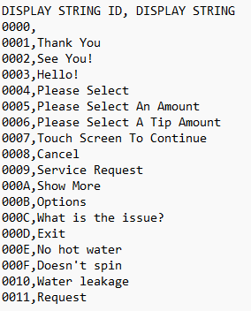
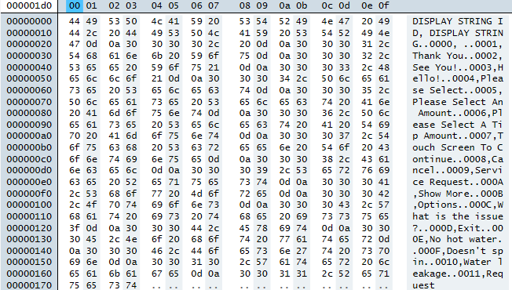

# Data Types and Shared TLV Data Objects
Data Types and Shared TLV Data Objects

This section describes the primitive and composed data types referred to
throughout this document.

## Primitive Data Types

TLV data objects use the following primitive data types:

-   A = Alphabetic (string, no numbers).
-   AN = Alphanumeric (string).
-   B = Binary value, which includes bit combinations (“OR” types).
-   CN = Compressed numeric, as defined by **EMV 4.3 Book 3**, section **Data
    Element Format Conventions**.
-   N = Numeric, as defined by **EMV 4.3 Book 3**, section **Data Element Format
    Conventions**.
-   T = TLV **Constructed** data object (TLV Value contains additional layers of
    TLV-encoded data the parser should continue to process).

## About Track Data

After the host receives and decrypts **EMV ARQC Type** data or **Merchant Data
Container** data from the device, it may need to parse each track into
individual values embedded in the tracks. The device can read multiple card
formats, which vary even between different issuers and payment brands using the
same underlying standards. Describing all possible formats is beyond the scope
of this document, but this section describes how to parse data from tracks 1, 2,
and 3 in a generic ISO/ABA compliant format as an example.

**Table 17** shows an example of ISO/ABA track data the device sends to the
host, using unmasked placeholder numbers to make it easier to see the relative
positions of the values embedded in the track data. It is important to note that
some cards do not include Track 3 data. Manually entered data does not include
Track 3.

Table 17 - Example Generic ISO/ABA Track Data Format

| Generic ISO/ABA Track Data Format |                                                             |
|-----------------------------------|-------------------------------------------------------------|
| Track 1 Data                      | %75555555555555555\^CARDHOLDER NAME/\^33338880004444000006? |
| Track 2 Data                      | ;5555555555555555=33338880004444006?                        |
| Track 3 Data                      | ;5555555555555555=333388800044440000006?                    |

The example track data in **Table 17** can be interpreted as follows:

-   The **%**, **?**, and **;** are Sentinels / delimiters, and are taken
    directly from the data on the card.
-   The **7** at the beginning of Track 1 data is the card format code. For
    swiped credit / debit cards, this comes from the card and is generally
    **B**. Manually entered data uses **M**.
-   The string of **5**s is the Account Number / License Number / PAN.
-   The carets **\^** are a standard ISO track 1 delimiter surrounding the
    Cardholder Name.
-   **CARDHOLDER NAME/** is the Cardholder Name. Manually entered data uses
    string literal **MANUAL ENTRY/**.
-   The string of **3**s is the Expiration Date (YYMM).
-   The string of **8**s is the Service Code. For swiped credit / debit cards,
    this comes from the card. Manually entered data uses **000**.
-   The remaining characters (**0**s, **4**s, and **6**) are Discretionary Data.
    For swiped debit / credit cards this data is of varying length and content
    and comes from the card, and must be interpreted according to the standards
    established by issuers, payment brands, and so on. Manually entered track
    data uses a MagTek standard for Discretionary Data as follows:
    -   The string of **4**s is the CVV2 a cardholder or operator entered on the
        keypad. This may be 3 or 4 characters long and is not padded, so the
        host software must find it by using the fixed-length padding and
        sentinels that surround it.
    -   The strings of **0**s are literals of fixed length: Track 1 has three
        zeroes after the Service Code, and five zeroes after the CVV2; Track 2
        has three zeroes after the Service Code, and two zeroes after CVV2.
    -   The **6** contains either a 0 or a 1. This Field Option tells what data
        is included in the track data, where **0 = Acct, Date, CVV** and **1 =
        Name on Card, Acct, Date, CVV**.

## Display Strings

The Display Strings type provides a pre-defined set of messages by string ID
that the host and device use for various user interface features.

Table 18 - Display String IDs and Strings

| Display String ID | Display String (en-US)               |
|-------------------|--------------------------------------|
| 0x00              | Reserved, do not use.                |
| 0x01              | “AMOUNT”                             |
| 0x02              | “AMOUNT OK?”                         |
| 0x03              | “APPROVED”                           |
| 0x04              | “CALL YOUR BANK”                     |
| 0x05              | “CANCEL OR ENTER”                    |
| 0x06              | “CARD ERROR”                         |
| 0x07              | “DECLINED”                           |
| 0x08              | “ENTER AMOUNT”                       |
| 0x09              | Reserved, do not use.                |
| 0x0A              | Reserved, do not use.                |
| 0x0B              | “INSERT CARD”                        |
| 0x0C              | “NOT ACCEPTED”                       |
| 0x0D              | Reserved, do not use.                |
| 0x0E              | “PLEASE WAIT”                        |
| 0x0F              | “PROCESSING ERROR”                   |
| 0x10              | “REMOVE CARD”                        |
| 0x11              | “USE CHIP READER”                    |
| 0x12              | “USE MAGSTRIPE”                      |
| 0x13              | “TRY AGAIN”                          |
| 0x14              | “WELCOME”                            |
| 0x15              | “PRESENT CARD”                       |
| 0x16              | “PROCESSING”                         |
| 0x17              | “CARD READ OK - REMOVE CARD”         |
| 0x18              | “INSERT OR SWIPE CARD”               |
| 0x19              | “PRESENT ONE CARD ONLY”              |
| 0x1A              | “APPROVED PLEASE SIGN”               |
| 0x1B              | “AUTHORIZING PLEASE WAIT”            |
| 0x1C              | “INSERT, SWIPE, OR TRY ANOTHER CARD” |
| 0x1D              | “PLEASE INSERT CARD”                 |
| 0x1E              | Null prompt (empty screen)           |
| 0x1F              | Reserved, do not use.                |
| 0x20              | “SEE PHONE”                          |
| 0x21              | “PRESENT CARD AGAIN”                 |
| 0x22              | “INSERT/SWIPE/TRY OTHER CARD”        |
| 0x23              | “TAP or SWIPE CARD”                  |
| 0x24              | “TAP or INSERT CARD”                 |
| 0x25              | “TAP, INSERT or SWIPE CARD”          |
| 0x26              | “TAP CARD”                           |
| 0x27              | “TIMEOUT”                            |
| 0x28              | “TRANSACTION TERMINATED”             |
| 0x29              | “USE CHIP READER or MAGSTRIPE”       |
| 0x2A              | “SCAN BARCODE”                       |
| 0x2B              | “BARCODE READ SUCCESSFULLY”          |
| 0x2C              | “CANCELED”                           |
| 0x2D              | “SWIPE CARD or SCAN BARCODE”         |
| 0x2E              | “INSERT CARD or SCAN BARCODE”        |
| 0x2F              | “INSERT, SWIPE or SCAN BARCODE”      |
| 0x30              | “TAP CARD or SCAN BARCODE”           |
| 0x31              | “TAP, SWIPE or SCAN BARCODE”         |
| 0x32              | “TAP, INSERT or SCAN BARCODE”        |
| 0x33              | “TAP, INSERT, SWIPE or SCAN BARCODE” |
| 0x34              | “TRY ANOTHER INTERFACE”              |
| 0x35              | “NFC TAG DETECTED”                   |
| 0x36              | “ERROR REMOVE CARD”                  |
| 0x37              | “MIFARE CLASSIC 1K DETECTED”         |
| 0x38              | “MIFARE CLASSIC 4K DETECTED”         |
| 0x39              | “MIFARE DESFIRE DETECTED”            |

## Encryption Type

The Encryption Type provides the key type, variant, and other information the
host can use to decrypt encrypted data included in various payloads. The
possible values are an ORed bitmask using the following elements:

-   0xxx xxxx = Fixed Key (Not used)
-   1xxx xxxx = DUKPT Key
-   xx00 xxxx = TDES
-   xx01 xxxx = AES128
-   xx10 xxxx = AES256
-   xxxx 0000 = Data Encrypt/Decrypt Variant
-   xxxx 0001 = PIN Variant
-   xxxx 0010 = MAC Variant
-   xxxx 0011 = Data, Encrypt Variant
-   xxxx 0100 = MAC Verify Variant
-   xxxx 0101 = RESERVED
-   xxxx 0110 = RESERVED
-   xxxx 0111 = AES PIN Encrypt
-   xxxx 1000 = AES MAC Generate
-   xxxx 1001 = AES MAC Verify
-   xxxx 1010 = AES MAC Generate/Verify
-   xxxx 1011 = AES Data Encrypt
-   xxxx 1100 = AES Data Decrypt
-   xxxx 1101 = AES Data Encrypt/Decrypt
-   xxxx 1110 = RESERVED
-   xxxx 1111 = RESERVED

## EMV ARQC Type

The device formats ARQC messages as shown in **Table 19**. The default is an EMV
standard list of ARQC message tags. The host may also customize the contents of
ARQC messages by setting **Property 1.1.1.1.1.2 EMV ARQC Message Tag List**.

### EMV ARQC (DynaPro Format) Type

2-byte MSB message length excluding padding and CBC-MAC

Table 19 - EMV ARQC (DynaPro Format) Type

| Tag          | Len | Value / Description                                                                                                                                                                                                                                                                                                                                                                                                                 | Typ | Req | Default |
|--------------|-----|-------------------------------------------------------------------------------------------------------------------------------------------------------------------------------------------------------------------------------------------------------------------------------------------------------------------------------------------------------------------------------------------------------------------------------------|-----|-----|---------|
| F9           | var | Container for MAC structure and generic data                                                                                                                                                                                                                                                                                                                                                                                        | T   | R   |         |
| /DFDF54      | var | MAC KSN                                                                                                                                                                                                                                                                                                                                                                                                                             | B   | R   |         |
| /DFDF55      | 01  | MAC Encryption Type See section **4.4 Encryption Type** for a list of valid values.                                                                                                                                                                                                                                                                                                                                                 | B   | R   |         |
| /DFDF25      | var | Device Serial Number (IFD Serial Number)                                                                                                                                                                                                                                                                                                                                                                                            | B   | R   |         |
| /FA          | var | Container for generic data                                                                                                                                                                                                                                                                                                                                                                                                          | T   | R   |         |
| //70         | var | Container for ARQC                                                                                                                                                                                                                                                                                                                                                                                                                  | T   | R   |         |
| ///82        | 02  | Application Interchange Profile  Available on: DynaProx FW Ver A8 or newer DynaFlex II FW Ver A6 or newer                                                                                                                                                                                                                                                                                                                           | B   | O   |         |
| ///9F6E      | var | Third Party Data  Available on: DynaProx FW Ver A8 or newer DynaFlex II FW Ver A6 or newer                                                                                                                                                                                                                                                                                                                                          | B   | O   |         |
| ///DFDF53    | 01  | Fallback Indicator 0x00 = No Fallback 0x01 = Technical Fallback 0x81 = MSR Fallback                                                                                                                                                                                                                                                                                                                                                 | B   | R   |         |
| ///DFDF33    | var | Masked Track 2 MSR Data If the payment method presented by the cardholder provides it                                                                                                                                                                                                                                                                                                                                               | AN  | O   |         |
| ///DFDF4D    | var | Masked Track 2 ICC Data If the payment method presented by the cardholder provides it                                                                                                                                                                                                                                                                                                                                               | AN  | O   |         |
| ///DFDF52    | 01  | Card Type 0x00 = Other 0x01 = Magnetic Stripe ISO/ABA Financial (MSR) 0x02 = Magnetic Stripe AAMVA (MSR) 0x03 = Manual Entry 0x04 = Unknown 0x05 = Contact Chip Card (ICC) 0x06 = Contactless Chip Card (PICC), EMV 0x07 = MSR Financial and Contact Chip Card (ICC) 0x08 = Contactless PICC, Magnetic Stripe Data (MSD)                                                                                                            | B   | R   |         |
| ///FF42      | var | Container for Selectable Encrypted Card Data Set up OID 1.1.2.6.1.1 to enable this container.                                                                                                                                                                                                                                                                                                                                       | T   | O   |         |
| ////DFDFDF37 | var | Selectable Encrypted Data Primitive Decrypt the value of this TLV data object using the algorithm and variant specified in the **Selectable Encrypted Data KSN** parameter and the **Selectable Encrypted Data Encryption Type** parameter. See **Table 21 - EMV ARQC (DynaPro Format) DFDFDF37 Decrypted Contents** for the data structure as it should appear after decryption.  (This item will be present if 0xFF42 is enabled) | B   | O   |         |
| ////DFDFDF38 | 0C  | Selectable Encrypted Data KSN (This item will be present if 0xFF42 is enabled)                                                                                                                                                                                                                                                                                                                                                      | B   | O   |         |
| ////DFDFDF39 | 01  | Selectable Encrypted Data Encryption Type (This item will be present if 0xFF42 is enabled)                                                                                                                                                                                                                                                                                                                                          | B   | O   |         |
| ///DF2A      | 06  | Tip Mode Sale Amount Entered                                                                                                                                                                                                                                                                                                                                                                                                        | B   | O   |         |
| ///DF2B      | 06  | Tip Mode Total Amount                                                                                                                                                                                                                                                                                                                                                                                                               | B   | O   |         |
| ///DF5D      | 06  | Tip Amount                                                                                                                                                                                                                                                                                                                                                                                                                          | B   | O   |         |
| ///DF5E      | 06  | Tax Amount                                                                                                                                                                                                                                                                                                                                                                                                                          | B   | O   |         |
| ///F8        | var | Container for Encrypted Data                                                                                                                                                                                                                                                                                                                                                                                                        | T   | R   |         |
| ////DFDF59   | var | Encrypted Data Primitive Decrypt the value of this TLV data object using the algorithm and variant specified in the **Encrypted Transaction Data KSN** parameter and the **Encrypted Transaction Data Encryption Type** parameter to read its contents. See **Table 20** on page **73** for the data structure as it should appear after decryption.                                                                                | B   | R   |         |
| ////DFDF56   | var | Encrypted Transaction Data KSN                                                                                                                                                                                                                                                                                                                                                                                                      | B   | R   |         |
| ////DFDF57   | 01  | Encrypted Transaction Data Encryption Type See section **4.4 Encryption Type** for a list of valid values.                                                                                                                                                                                                                                                                                                                          | B   | R   |         |
| ////DFDF58   | 01  | Number of Padding Bytes Number of bytes added to DFDF59 value to force its length to a multiple of 8 bytes for TDES, or 16 bytes for AES.                                                                                                                                                                                                                                                                                           | B   | R   |         |
| /FE          | Var | VAS Data Container See **Table 25 – VAS Data Container Payload**                                                                                                                                                                                                                                                                                                                                                                    | T   | O   |         |
| /FF40        | Var | Fleet Data Container (Common Kernel Only) See [**Table 4.5 9 – Fleet Data Container Payload**](#table-45-9--fleet-data-container-payload)                                                                                                                                                                                                                                                                                                                              | T   | O   |         |

Padding to ensure the length of data, starting with the message length at the
very beginning, and ending with any additional padding, is a multiple of 8 bytes
for TDES, or 16 bytes for AES. This is a requirement of using the CBC-MAC
algorithm.

Four-byte CBC-MAC. The host should calculate the CBC-MAC and verify that it
matches. For details about calculating a CBC-MAC, see About Message
Authentication Codes (MAC).

The device encrypts the value inside the **Encrypted Data Primitive** container
using the **Encrypted Transaction Data Encryption Type** parameter and working
key associated with the keyset number currently active in the device’s
configuration. As a requirement for using DUKPT encryption algorithms, the
device pads it so the length of its value is a multiple of 8 bytes for TDES, or
16 bytes for AES. The device uses container DFDF58 to report how many bytes of
data object DFDF59 are padding. Data object DFDF59 itself is formatted like
**Table 20** after the host decrypts it.

Table 20 - EMV ARQC (DynaPro Format) DFDF59 Decrypted Contents

| Tag      | Len | Value / Description                                                                                                                                                                                                                                                                                                                                                                                                                                                                                                                                                                                                                                                                                                                                                                                                                                                                                                                        | Typ | Req | Default |
|----------|-----|--------------------------------------------------------------------------------------------------------------------------------------------------------------------------------------------------------------------------------------------------------------------------------------------------------------------------------------------------------------------------------------------------------------------------------------------------------------------------------------------------------------------------------------------------------------------------------------------------------------------------------------------------------------------------------------------------------------------------------------------------------------------------------------------------------------------------------------------------------------------------------------------------------------------------------------------|-----|-----|---------|
| FC       | var | Decrypted Data Container Inside this container, the device inserts all EMV TLV data objects specified by the setting in **Property 1.1.1.1.1.2 EMV ARQC Message Tag List**. The remainder of this table shows the basic structure and content of MagTek custom tags. For definitions of all other standard EMV tags that can be included directly under container FC, see **EMV 4.3 Book 3**.                                                                                                                                                                                                                                                                                                                                                                                                                                                                                                                                              | T   | R   |         |
| /DF29    | 08  | Only if tag DF29 is included in **Property 1.1.1.1.1.2 EMV ARQC Message Tag List**.   Outcome Parameter Set  Byte 1 - Outcome 0x10 = Approved 0x20 = Declined 0x30 = Online Request 0x40 = End Application 0x50 = Select Next Application 0x60 = Try Another Interface 0x70 = Try Again 0xF0 = N/A  Byte 2 – Entry Point Start 0x00 = Start A 0x10 = Start B 0x20 = Start C 0x30 = Start D 0xF0 = N/A  Byte 3 – Entry Point Online Response  0x00 = EMV Data 0x10 = Any 0xF0 = N/A  Byte 4 – CVM 0x00 = No CVM 0x10 = Obtain Signature 0x20 = Online PIN 0x30 = Confirmation Code Verified 0xF0 = N/A  Byte 5 – UI/Data/Receipt 0x80 = UI Request on Outcome Present 0x40 = UI Request on Restart Present 0x20 = Data Record Present 0x10 = Discretionary Data Present 0x08 = Provide Receipt  Byte 6 – Alternate Interface Preference 0x10 = Contact 0x20 = MSR 0xF0 = N/A  Byte 7 – Field Off Request FF = N/A  Byte 8 – Removal Timeout | B   | O   |         |
| /F4      | var | Container for encrypted MSR data (MSR Only)                                                                                                                                                                                                                                                                                                                                                                                                                                                                                                                                                                                                                                                                                                                                                                                                                                                                                                | T   | O   |         |
| //DFDF36 | 01  | Encrypted Track 1 Status (MSR Only) 0x00 = OK 0x01 = Empty 0x02 = Error 0x03 = Disabled                                                                                                                                                                                                                                                                                                                                                                                                                                                                                                                                                                                                                                                                                                                                                                                                                                                    | B   | O   |         |
| //DFDF37 | var | Encrypted Track 1 Data (MSR Only)                                                                                                                                                                                                                                                                                                                                                                                                                                                                                                                                                                                                                                                                                                                                                                                                                                                                                                          | B   | O   |         |
| //DFDF38 | 01  | Encrypted Track 2 Status (MSR Only) 0x00 = OK 0x01 = Empty 0x02 = Error 0x03 = Disabled                                                                                                                                                                                                                                                                                                                                                                                                                                                                                                                                                                                                                                                                                                                                                                                                                                                    | B   | O   |         |
| //DFDF39 | var | Encrypted Track 2 Data (MSR Only)                                                                                                                                                                                                                                                                                                                                                                                                                                                                                                                                                                                                                                                                                                                                                                                                                                                                                                          | B   | O   |         |
| //DFDF3A | 01  | Encrypted Track 3 Status (MSR Only) 0x00 = OK 0x01 = Empty 0x02 = Error 0x03 = Disabled                                                                                                                                                                                                                                                                                                                                                                                                                                                                                                                                                                                                                                                                                                                                                                                                                                                    | B   | O   |         |
| //DFDF3B | var | Encrypted Track 3 Data (MSR Only)                                                                                                                                                                                                                                                                                                                                                                                                                                                                                                                                                                                                                                                                                                                                                                                                                                                                                                          | B   | O   |         |
| //DFDF3C | var | Encrypted MagnePrint Data (MSR Only) Only included for MSR swipe transactions and when Track Data and Magneprint are using the same KSN.                                                                                                                                                                                                                                                                                                                                                                                                                                                                                                                                                                                                                                                                                                                                                                                                   | B   | O   |         |
| //DFDF43 | 04  | MagnePrint Status Data (MSR Only) Only included for MSR swipe transactions and when Track Data and Magneprint are using the same KSN. Bit 0 = MagnePrint Capable Flag 0 = Device is not MagnePrint capable 1 = Device is MagnePrint capable Bits 1 through 3 = Mode 0 = Standard MagnePrint 1 = Extended MagnePrint Bits 4 through 15 = ASIC Revision Bit 16 = Reserved Bit 17 = Reserved  Bit 18 = Swipe too slow Bit 19 = Swipe too fast Bit 20 = Reserved Bit 21 = Card swipe direction 0 = Forward 1 = Reverse Bits 22..31 = Reserved                                                                                                                                                                                                                                                                                                                                                                                                  | B   | O   |         |
| //DFDF50 | var | MSR KSN Data (MSR Only) Key Serial Number for the key the host should use to decrypt **Encrypted Track 1 Data**, **Encrypted Track 2 Data**, **Encrypted Track 3 Data** and **Encrypted MagnePrint Data**.                                                                                                                                                                                                                                                                                                                                                                                                                                                                                                                                                                                                                                                                                                                                 | B   | O   |         |
| //DFDF51 | 01  | MSR Encryption Type (MSR Only) See section **4.4 Encryption Type** for a list of valid values.                                                                                                                                                                                                                                                                                                                                                                                                                                                                                                                                                                                                                                                                                                                                                                                                                                             | B   | O   |         |
| /FF73    | var | Container for Encrypted MagnePrint Data (MSR Only) Only included when Track Data and MagnePrint encryption keys are using different KSN                                                                                                                                                                                                                                                                                                                                                                                                                                                                                                                                                                                                                                                                                                                                                                                                    | T   | O   |         |
| //DFDF3C | var | Encrypted MagnePrint Data (MSR Only) Only included for MSR swipe transactions.                                                                                                                                                                                                                                                                                                                                                                                                                                                                                                                                                                                                                                                                                                                                                                                                                                                             | B   | O   |         |
| //DFDF43 | 04  | MagnePrint Status Data (MSR Only) Only included for MSR swipe transactions. Bit 0 = MagnePrint Capable Flag 0 = Device is not MagnePrint capable 1 = Device is MagnePrint capable Bits 1 through 3 = Mode 0 = Standard MagnePrint 1 = Extended MagnePrint Bits 4 through 15 = ASIC Revision Bit 16 = Reserved Bit 17 = Reserved  Bit 18 = Swipe too slow Bit 19 = Swipe too fast Bit 20 = Reserved Bit 21 = Card swipe direction 0 = Forward 1 = Reverse Bits 22..31 = Reserved                                                                                                                                                                                                                                                                                                                                                                                                                                                            | B   | O   |         |
| //DFDF50 | var | MSR KSN Data (MSR Only) Key Serial Number for the key the host should use to decrypt **Encrypted MagnePrint Data**.                                                                                                                                                                                                                                                                                                                                                                                                                                                                                                                                                                                                                                                                                                                                                                                                                        | B   | O   |         |
| //DFDF51 | 01  | MSR Encryption Type (MSR Only) See section **4.4 Encryption Type** for a list of valid values.                                                                                                                                                                                                                                                                                                                                                                                                                                                                                                                                                                                                                                                                                                                                                                                                                                             | B   | O   |         |
| /F5      | var | Container for Encrypted PIN Data (Touch Only) Contains ISO PIN Block formatted data in the nested **Encrypted PIN Data** object, plus supporting information to decrypt it. The host should use the current PIN DUKPT working key specified in the supporting information.                                                                                                                                                                                                                                                                                                                                                                                                                                                                                                                                                                                                                                                                 | T   | O   |         |
| //DF71   | 01  | PIN Block Format (Touch Only) 0x00 = ISO Format 0 0x01 = ISO Format 1 0x03 = ISO Format 3 0x04 = ISO Format 4                                                                                                                                                                                                                                                                                                                                                                                                                                                                                                                                                                                                                                                                                                                                                                                                                              | B   | O   |         |
| //99     | 08  | Encrypted PIN Data (Touch Only)                                                                                                                                                                                                                                                                                                                                                                                                                                                                                                                                                                                                                                                                                                                                                                                                                                                                                                            | B   | O   |         |
| //DFDF41 | var | PIN KSN Data (Touch Only)                                                                                                                                                                                                                                                                                                                                                                                                                                                                                                                                                                                                                                                                                                                                                                                                                                                                                                                  | B   | O   |         |
| //DFDF42 | 01  | PIN Encryption Type (Touch Only) See section **4.4 Encryption Type** for a list of valid values.                                                                                                                                                                                                                                                                                                                                                                                                                                                                                                                                                                                                                                                                                                                                                                                                                                           | B   | O   |         |

Padding to force DFDF59 plus padding to be a multiple of 8 bytes

**Table 21 - EMV ARQC (DynaPro Format) DFDFDF37 Decrypted Contents**

| Tag   | Len    | Value / Description                                                                                                                                                                                                                                                                                        | Typ    | Req | Default |
|-------|--------|------------------------------------------------------------------------------------------------------------------------------------------------------------------------------------------------------------------------------------------------------------------------------------------------------------|--------|-----|---------|
| FC    | var    | Decrypted Data Container Inside this container, the device inserts EMV TLV data objects specified by the setting in Property 1.1.1.1.1.2 EMV ARQC Message Tag List. If the data is not available for a given selected card data, the tag will still get transmitted with a length of ‘1’ and value = ‘\*’. | T      | R   |         |
| /5F20 | var    | Only if Byte 0 – Bit 0 is set in Property 1.1.2.6.1.1 Selectable Card Data Encryption Enable.   Cardholder Name                                                                                                                                                                                            | an     | O   |         |
| /5F24 | 02/ 03 | Only if Byte 0 – Bit 2 is set in Property 1.1.2.6.1.1 Selectable Card Data Encryption Enable.   Expiration Date, YYMM or YYMMDD                                                                                                                                                                            | n4/ n6 | O   |         |
| /5F30 | 02     | Only if Byte 0 – Bit 3 is set in Property 1.1.2.6.1.1 Selectable Card Data Encryption Enable.   Service Code                                                                                                                                                                                               | n3     | O   |         |
| /9F1F | var    | Only if Byte 0 – Bit 4 is set in Property 1.1.2.6.1.1 Selectable Card Data Encryption Enable.   T1 Discretionary Data                                                                                                                                                                                      | an     | O   |         |
| /9F20 | var    | Only if Byte 0 – Bit 5 is set in Property 1.1.2.6.1.1 Selectable Card Data Encryption Enable.   T2 Discretionary Data                                                                                                                                                                                      | cn     | O   |         |

Padding to force DFDFDF37 plus padding to be a multiple of 16 bytes for AES
encryption.

Table 22 – EMV ARQC Enhanced DFDF59 Decrypted Contents for EMV Data

| Tag | Len | Value / Description                                                                                                              | Typ | Req | Default |
|-----|-----|----------------------------------------------------------------------------------------------------------------------------------|-----|-----|---------|
| FC  | var | Decrypted Data Container This contains all EMV TLV data objects specified in **Property 1.1.1.1.1.2 EMV ARQC Message Tag List**. | T   | R   |         |
| /FE | Var | VAS Data Container See **Table 25 – VAS Data Container Payload**                                                                 | T   | O   |         |

Padding to ensure the length of data, starting with the message length at the
very beginning, and ending with any additional padding, is a multiple of 8 bytes
for TDES, or 16 bytes for AES. This is a requirement of using the CBC-MAC
algorithm.

Table 23 – EMV ARQC Enhanced DFDF59 Decrypted Contents for MSR and MagnePrint
Data

| Tag     | Len | Value / Description                                                                                                                                                                                                                                                                                                                                                                                                                                                                                                                                                                                                                                                                                                                                                                                                                 | Typ | Req | Default |
|---------|-----|-------------------------------------------------------------------------------------------------------------------------------------------------------------------------------------------------------------------------------------------------------------------------------------------------------------------------------------------------------------------------------------------------------------------------------------------------------------------------------------------------------------------------------------------------------------------------------------------------------------------------------------------------------------------------------------------------------------------------------------------------------------------------------------------------------------------------------------|-----|-----|---------|
| FC      | var | Decrypted Data Container Inside this container, the device inserts all EMV TLV data objects specified by the setting in **Property 1.1.1.1.1.2 EMV ARQC Message Tag List**. The remainder of this table shows the basic structure and content of MagTek custom tags. For definitions of all other standard EMV tags that can be included directly under container FC, see **EMV 4.3 Book 3**.                                                                                                                                                                                                                                                                                                                                                                                                                                       | T   | R   |         |
| /9F41   | 04  | Transaction Counter Starts at 00000000 each time the device powers up or resets, increments for each transaction.                                                                                                                                                                                                                                                                                                                                                                                                                                                                                                                                                                                                                                                                                                                   | B   | R   |         |
| /DFDF36 | 01  | MSR Track 1 Status 0x00 = OK 0x01 = Empty 0x02 = Error 0x03 = Disabled                                                                                                                                                                                                                                                                                                                                                                                                                                                                                                                                                                                                                                                                                                                                                              | B   | O   |         |
| /DF41   | var | MSR Track 1 Clear Text                                                                                                                                                                                                                                                                                                                                                                                                                                                                                                                                                                                                                                                                                                                                                                                                              | AN  | O   |         |
| /DFDF38 | 01  | MSR Track 2 Status 0x00 = OK 0x01 = Empty 0x02 = Error 0x03 = Disabled                                                                                                                                                                                                                                                                                                                                                                                                                                                                                                                                                                                                                                                                                                                                                              | B   | O   |         |
| /DF42   | var | MSR Track 2 Clear Text                                                                                                                                                                                                                                                                                                                                                                                                                                                                                                                                                                                                                                                                                                                                                                                                              | AN  | O   |         |
| /DFDF3A | 01  | MSR Track 3 Status 0x00 = OK 0x01 = Empty 0x02 = Error 0x03 = Disabled                                                                                                                                                                                                                                                                                                                                                                                                                                                                                                                                                                                                                                                                                                                                                              | B   | O   |         |
| /DF43   | var | MSR Track 3 Clear Text                                                                                                                                                                                                                                                                                                                                                                                                                                                                                                                                                                                                                                                                                                                                                                                                              | AN  | O   |         |
| /DFDF43 | 04  | MagnePrint Status The device only includes this if MSR and MagnePrint data are both included in the transaction and the device is configured to encrypt them using the same key, to avoid consuming two DUKPT keys encrypting separate containers. If the device is configured to encrypt MSR and MagnePrint data using different keys, it provides MagnePrint data in the **Container for Encrypted MagnePrint Data** instead. Bit 0 = MagnePrint Capable Flag 0 = Device is not MagnePrint capable 1 = Device is MagnePrint capable Bits 1 through 3 = Mode 0 = Standard MagnePrint 1 = Extended MagnePrint Bits 4 through 15 = ASIC Revision Bit 16 = Reserved Bit 17 = Reserved  Bit 18 = Swipe too slow Bit 19 = Swipe too fast Bit 20 = Reserved Bit 21 = Card swipe direction 0 = Forward 1 = Reverse Bits 22..31 = Reserved | B   | O   |         |
| /DF44   | var | MagnePrint Data The device only includes this if MSR and MagnePrint data are both included in the transaction and the device is configured to encrypt them using the same key. The host can use this data in conjunction with Magensa services to determine whether the swiped card is authentic.                                                                                                                                                                                                                                                                                                                                                                                                                                                                                                                                   | B   | O   |         |
| /FE     | Var | VAS Data Container See **Table 25 – VAS Data Container Payload**                                                                                                                                                                                                                                                                                                                                                                                                                                                                                                                                                                                                                                                                                                                                                                    | T   | O   |         |

Padding to ensure the length of data, starting with the message length at the
very beginning, and ending with any additional padding, is a multiple of 8 bytes
for TDES, or 16 bytes for AES. This is a requirement of using the CBC-MAC
algorithm.

Table 24 – EMV ARQC Enhanced DFDF59 Decrypted Contents for MagnePrint Data

| Tag     | Len | Value / Description                                                                                                                                                                                                                                                                                                                                                                                                                                                                                                                   | Typ | Req | Default |
|---------|-----|---------------------------------------------------------------------------------------------------------------------------------------------------------------------------------------------------------------------------------------------------------------------------------------------------------------------------------------------------------------------------------------------------------------------------------------------------------------------------------------------------------------------------------------|-----|-----|---------|
| FC      | var | Decrypted Data Container                                                                                                                                                                                                                                                                                                                                                                                                                                                                                                              | T   | R   |         |
| /DFDF43 | var | MagnePrint Status The device only includes this when MSR and MagnePrint data are included in the transaction, but the device is configured to encrypt them using a different key. Bit 0 = MagnePrint Capable Flag 0 = Device is not MagnePrint capable 1 = Device is MagnePrint capable Bits 1..15 = Product revision & mode Bit 16 = Reserved Bit 17 = Reserved for noise measurement Bit 18 = Swipe too slow Bit 19 = Swipe too fast Bit 20 = Reserved Bit 21 = Card swipe direction 0 = Forward 1 = Reverse Bits 22..31 = Reserved | B   | R   |         |
| /DF44   | var | MagnePrint Data The host can use this data in conjunction with Magensa services to determine whether the swiped card is authentic.                                                                                                                                                                                                                                                                                                                                                                                                    | B   | R   |         |
| /DF4B   | var | MSR PAN                                                                                                                                                                                                                                                                                                                                                                                                                                                                                                                               | B   | R   |         |
| /FE     | Var | VAS Data Container See **Table 25 – VAS Data Container Payload**                                                                                                                                                                                                                                                                                                                                                                                                                                                                      | T   | O   |         |

Padding to ensure the length of data, starting with the message length at the
very beginning, and ending with any additional padding, is a multiple of 8 bytes
for TDES, or 16 bytes for AES. This is a requirement of using the CBC-MAC
algorithm.

Table 25 – VAS Data Container Payload

| Tag      | Len | Value / Description                  | Typ | Req | Default |
|----------|-----|--------------------------------------|-----|-----|---------|
| /FE      | var | VAS Data Container                   | T   | O   |         |
| //FF01   | var | Apple VAS Container Slot 1 Container | B   | O   |         |
| ///9F27  | var | VAS Data Up to 128 bytes.            | B   | O   |         |
| ///9F2A  | var | Mobile Token Up to 36 bytes.         | B   | O   |         |
| //FF02   | var | Apple VAS Container Slot 2 Container | B   | O   |         |
| ///9F27  | var | VAS Data Up to 128 bytes.            | B   | O   |         |
| ///9F2A  | var | Mobile Token Up to 36 bytes.         | B   | O   |         |
| //FF03   | var | Apple VAS Container Slot 3 Container | B   | O   |         |
| ///9F27  | var | VAS Data Up to 128 bytes.            | B   | O   |         |
| ///9F2A  | var | Mobile Token Up to 36 bytes.         | B   | O   |         |
| //FF04   | var | Apple VAS Container Slot 4 Container | B   | O   |         |
| ///9F27  | var | VAS Data Up to 128 bytes.            | B   | O   |         |
| ///9F2A  | var | Mobile Token Up to 36 bytes.         | B   | O   |         |
| //FF05   | var | Apple VAS Container Slot 5 Container | B   | O   |         |
| ///9F27  | var | VAS Data Up to 128 bytes.            | B   | O   |         |
| ///9F2A  | var | Mobile Token Up to 36 bytes.         | B   | O   |         |
| //FF06   | var | Apple VAS Container Slot 6 Container | B   | O   |         |
| ///9F27  | var | VAS Data Up to 128 bytes.            | B   | O   |         |
| ///9F2A  | var | Mobile Token Up to 36 bytes.         | B   | O   |         |
| //FF41   | var | Google Smart Tap Container           | B   | O   |         |
| ///FF01  | var | Collector ID Slot 1 Container        | B   | O   |         |
| ////DF7B | var | Service Response NDEF Record         | B   | O   |         |
| ///FF02  | var | Collector ID Slot 2 Container        | B   | O   |         |
| ////DF7B | var | Service Response NDEF Record         | B   | O   |         |
| ///FF03  | var | Collector ID Slot 3 Container        | B   | O   |         |
| ////DF7B | var | Service Response NDEF Record         | B   | O   |         |
| ///FF04  | var | Collector ID Slot 4 Container        | B   | O   |         |
| ////DF7B | var | Service Response NDEF Record         | B   | O   |         |
| ///FF05  | var | Collector ID Slot 5 Container        | B   | O   |         |
| ////DF7B | var | Service Response NDEF Record         | B   | O   |         |
| ///FF06  | var | Collector ID Slot 6 Container        | B   | O   |         |
| ////DF7B | var | Service Response NDEF Record         | B   | O   |         |

Table 4.59 – Fleet Data Container Payload (Common Kernel Only)

| Tag             |   | Len | Value / Description                             | Typ | Req | Default |
|-----------------|---|-----|-------------------------------------------------|-----|-----|---------|
| /FF40           |   | var | Fleet Data Container                            | T   | O   |         |
| //DF30          |   | var | Prompting                                       | B   | O   |         |
| //DF32          |   | var | Purchase Restrictions                           | B   | O   |         |
| //DF33          |   | var |                                                 | B   | O   |         |
| //DF34          |   | var | Chip Offline purchase Restrictions for Fuel     | B   | O   |         |
| //DF35          |   | var | Chip Offline purchase Restrictions for Non-fuel | B   | O   |         |
| //DF36          |   | var | Relationship Codes                              | B   | O   |         |
| //DF37          |   | var | 3rd Party Reference Data Generation 2           | B   | O   |         |
| //DF38          |   | var | Loyalty ID                                      | B   | O   |         |
| //DF39          |   | var | Purchase Device Sequence Number                 | B   | O   |         |
| //DF40          |   | var | Generic Tag                                     | B   | O   |         |
| //DF41          |   | var | Vehicle/Trailer Number                          | B   | O   |         |
| //DF42          |   | var | Vehicle Tag                                     | B   | O   |         |
| //DF43          |   | var | Driver ID                                       | B   | O   |         |
| //DF44          |   | var | Driver’s License Number                         | B   | O   |         |
| //DF45          |   | var | Driver’s License State/Province Abbreviation    | B   | O   |         |
| //DF46          |   | var | Driver’s License Name Abbreviation              | B   | O   |         |
| //DF47          |   | var | Date of Birth                                   | B   | O   |         |
| //DF48          |   | var | Zip/Postal Code                                 | B   | O   |         |
| //DF49 – //DF51 |   | var | IFSR Reserved for Future Use                    | B   | O   |         |
| //DF52          |   | var | Trailer Number                                  | B   | O   |         |
| //DF53          |   | var | Employee Number                                 | B   | O   |         |
| //DF54          |   | var | Work Order / Purchase Order Number              | B   | O   |         |
| //DF55          |   | var | Additional Prompted Data 1                      | B   | O   |         |
| //DF56          |   | var | Additional Prompted Data 2                      | B   | O   |         |
| //DF57          |   | var | Proprietary Data                                | B   | O   |         |
| //9F5A          |   | var |                                                 | B   | O   |         |
| //9F0A          |   | var | ASRPD                                           | B   | O   |         |
| //9F6E          |   | var | M/C Fleet                                       | B   | O   |         |
| //9FD4          |   | var |                                                 | B   | O   |         |
| //9F50          |   | var |                                                 | B   | O   |         |

## EMV ARPC Type

Table 26 – EMV ARPC Data

| Tag     | Len | Value / Description                                                                                                                                                                                                                                    | Typ | Req | Default |
|---------|-----|--------------------------------------------------------------------------------------------------------------------------------------------------------------------------------------------------------------------------------------------------------|-----|-----|---------|
| FF74    | var | Container for non-MAC ARPC                                                                                                                                                                                                                             | T   | R   |         |
| /DFDF25 | var | Device Serial Number (IFD Serial Number)                                                                                                                                                                                                               | B   | R   |         |
| /FA     | var | Container for generic data                                                                                                                                                                                                                             | T   | R   |         |
| //70    | var | Container for ARPC                                                                                                                                                                                                                                     | T   | R   |         |
| ///8A   | 02  | Authorization Response Code ‘00’ = Approved ‘01’ = Issuer Referral ‘05’ = Declined ‘12’ = Switch Interface ‘13’ = Request Online PIN                                                                                                                   | AN  | R   |         |
| ///91   | var | Issuer Authentication Data As defined in **EMV Integrated Circuit Card Specifications for Payment Systems 4.3**                                                                                                                                        | B   | O   |         |
| ///71   | var | Issuer Script Template 1 As defined in **EMV Integrated Circuit Card Specifications for Payment Systems 4.3**. **The host may include as many instances of this parameter as needed, up to a maximum length of 128 bytes including Tags and Lengths.** | B   | O   |         |
| ///72   | var | Issuer Script Template 2 As defined in **EMV Integrated Circuit Card Specifications for Payment Systems 4.3**. **The host may include as many instances of this parameter as needed, up to a maximum length of 128 bytes including Tags and Lengths.** | B   | O   |         |

## EMV Batch Data Type

The device formats EMV batch data, such as merchant data and pre-defined EMV
batch data tags, using the format shown in **Table 27**. The default is an EMV
standard list of batch data message tags. The host may also customize the
contents of batch data messages by setting **Property 1.1.1.1.1.3 EMV Batch Data
Tag List**.

(EMV Contact Only) For unsuccessful transactions, this data object can contain
additional pre-defined reversal data. It is normally used by the host for data
capture. The default is an EMV standard list of reversal data message tags. The
host may also customize the contents of reversal data messages by setting
**Property 1.1.1.1.1.4 EMV Reversal Data Tag List**.

As part of successful completion of **Command 0x1001 - Start Transaction**, this
data structure contains the results of the transaction. The set of tags used
during a given EMV transaction is a combination of the tags defined in the EMV
specification and the tags that are specific to the kernel being used for the
transaction.

### EMV Batch Data (DynaPro Format) Type

Table 27 – EMV Batch Data (DynaPro Format) Type

2-byte MSB message length excluding padding and CBC-MAC

| Tag        | Len | Value / Description                                                                                                                                                                                                                                                                                                                                                                                                                                                                                      | Typ | Req | Default |
|------------|-----|----------------------------------------------------------------------------------------------------------------------------------------------------------------------------------------------------------------------------------------------------------------------------------------------------------------------------------------------------------------------------------------------------------------------------------------------------------------------------------------------------------|-----|-----|---------|
| F9         | var | Container for MAC structure and generic data                                                                                                                                                                                                                                                                                                                                                                                                                                                             | T   | R   |         |
| /DFDF54    | var | MAC KSN                                                                                                                                                                                                                                                                                                                                                                                                                                                                                                  | B   | R   |         |
| /DFDF55    | 01  | MAC Encryption Type See section **4.4 Encryption Type** for a list of valid values.                                                                                                                                                                                                                                                                                                                                                                                                                      | B   | R   |         |
| /DFDF25    | var | Device Serial Number (IFD Serial Number)                                                                                                                                                                                                                                                                                                                                                                                                                                                                 | B   | R   |         |
| /FA        | var | Container for Generic Data                                                                                                                                                                                                                                                                                                                                                                                                                                                                               | T   | R   |         |
| //F0       | var | Transaction Results                                                                                                                                                                                                                                                                                                                                                                                                                                                                                      | T   | R   |         |
| ///F1      | var | Container for Status Data                                                                                                                                                                                                                                                                                                                                                                                                                                                                                | T   | R   |         |
| ////DFDF1A | 01  | Transaction Status 0x00 = Accept 0x01 = Decline 0x02 = Error                                                                                                                                                                                                                                                                                                                                                                                                                                             | B   | R   |         |
| ////DFDF1B | 01  | Additional Transaction Information 0x00  (MAGTEK INTERNAL ONLY FOR NOW) 0x00 = No additional information 0x31 = EMV Application not selected  0x32 = Error transaction in progress 0x33 = Error invalid PSE format  0x34 = EMV Terminal application list is empty 0x35 = Candidate list is empty  0x36 = No transaction 0x37 = No common EMV applications 0x38 = Transaction canceled 0x39 = Aid parse error  0x3A = Code table index not found 0x3B = Error no more record 0x3C = EMV e overflow [sic.] | B   | R   |         |
| ///F8      | var | Container for Encrypted Data                                                                                                                                                                                                                                                                                                                                                                                                                                                                             | T   | R   |         |
| ////DFDF59 | var | Encrypted Data Primitive Decrypt the value of this TLV data object according to the **Encrypted Transaction Data KSN** parameter and the **Encrypted Transaction Data Encryption Type** parameter to read its contents. See **Table 28** on page **84** for the data structure as it should appear after decryption.  Use the data variant of the current MSR DUKPT working key used in the relevant transaction.                                                                                        | B   | R   |         |
| ////DFDF56 | var | Encrypted Transaction Data KSN                                                                                                                                                                                                                                                                                                                                                                                                                                                                           | B   | R   |         |
| ////DFDF57 | 01  | Encrypted Transaction Data Encryption Type See section **4.4 Encryption Type** for a list of valid values.                                                                                                                                                                                                                                                                                                                                                                                               | B   | R   |         |
| ////DFDF58 | 01  | Number of padding bytes added to DFDF59 value to force length to a multiple of 8 bytes                                                                                                                                                                                                                                                                                                                                                                                                                   | B   | R   |         |
| ///F7      | var | Merchant Data This contains an instance of **Merchant Data Container**.                                                                                                                                                                                                                                                                                                                                                                                                                                  | T   | R   |         |
| /FE        | Var | VAS Data Container See **Table 25 – VAS Data Container Payload**                                                                                                                                                                                                                                                                                                                                                                                                                                         | T   | O   |         |

Padding to ensure the length of data, starting with the message length at the
very beginning, and ending with any additional padding, is a multiple of 8 bytes
for TDES, or 16 bytes for AES. This is a requirement of using the CBC-MAC
algorithm.

Four-byte CBC-MAC. The host should calculate the CBC-MAC and verify that it
matches. For details about calculating a CBC-MAC, see About Message
Authentication Codes (MAC).

Table 28 – EMV Batch Data (DynaPro Format) DFDF59 Decrypted Contents

| Tag      | Len   | Value / Description                                                                                                                                                                                                                                                                                                                                                                                                                                                                                                                                                                                                                                                                                                                                                                                                                                                                                                                   | Typ | Req | Default |
|----------|-------|---------------------------------------------------------------------------------------------------------------------------------------------------------------------------------------------------------------------------------------------------------------------------------------------------------------------------------------------------------------------------------------------------------------------------------------------------------------------------------------------------------------------------------------------------------------------------------------------------------------------------------------------------------------------------------------------------------------------------------------------------------------------------------------------------------------------------------------------------------------------------------------------------------------------------------------|-----|-----|---------|
| FC       | var   | Decrypted Data Container                                                                                                                                                                                                                                                                                                                                                                                                                                                                                                                                                                                                                                                                                                                                                                                                                                                                                                              | T   |     |         |
| /F2      | var   | Container for Batch Data This data object contains the set of EMV TLV data objects specified in **Property 1.1.1.1.1.3 EMV Batch Data Tag List**.                                                                                                                                                                                                                                                                                                                                                                                                                                                                                                                                                                                                                                                                                                                                                                                     | T   |     |         |
| //DF29   | 08    | Only if tag DF29 is included in **Property 1.1.1.1.1.3 EMV Batch Data Tag List**  Outcome Parameter Set Byte 1 - Outcome 0x10 = Approved 0x20 = Declined 0x30 = Online Request 0x40 = End Application 0x50 = Select Next Application 0x60 = Try Another Interface 0x70 = Try Again 0xF0 = N/A  Byte 2 – Entry Point Start 0x00 = Start A 0x10 = Start B 0x20 = Start C 0x30 = Start D 0xF0 = N/A  Byte 3 – Entry Point Online Response  0x00 = EMV Data 0x10 = Any 0xF0 = N/A  Byte 4 – CVM 0x00 = No CVM 0x10 = Obtain Signature 0x20 = Online PIN 0x30 = Confirmation Code Verified 0xF0 = N/A  Byte 5 – UI/Data/Receipt 0x80 = UI Request on Outcome Present 0x40 = UI Request on Restart Present 0x20 = Data Record Present 0x10 = Discretionary Data Present 0x08 = Provide Receipt  Byte 6 – Alternate Interface Preference 0x10 = Contact 0x20 = MSR 0xF0 = N/A  Byte 7 – Field Off Request FF = N/A  Byte 8 – Removal Timeout | B   | O   |         |
| /F3      | var   | (EMV Contact Only) Container for Reversal Data, if any This data object contains the set of EMV TLV data objects specified in **Property 1.1.1.1.1.4 EMV Reversal Data Tag List**.                                                                                                                                                                                                                                                                                                                                                                                                                                                                                                                                                                                                                                                                                                                                                    | T   | O   | null    |
| /F4      | var   | Container for encrypted MSR data (MSR Only)                                                                                                                                                                                                                                                                                                                                                                                                                                                                                                                                                                                                                                                                                                                                                                                                                                                                                           | T   | O   |         |
| //DFDF36 | 01    | Encrypted Track 1 Status (MSR Only) 0x00 = OK 0x01 = Empty 0x02 = Error 0x03 = Disabled [**Property 1.1.2.5.1.2 Track 1 Enable (MSR Only)** set to **Disabled**]                                                                                                                                                                                                                                                                                                                                                                                                                                                                                                                                                                                                                                                                                                                                                                      | B   | O   |         |
| //DFDF37 | var   | Encrypted Track 1 Data (MSR Only)                                                                                                                                                                                                                                                                                                                                                                                                                                                                                                                                                                                                                                                                                                                                                                                                                                                                                                     | B   | O   |         |
| //DFDF38 | 01    | Encrypted Track 2 Status (MSR Only) 0x00 = OK 0x01 = Empty 0x02 = Error 0x03 = Disabled [**Property 1.1.2.5.1.3 Track 2 Enable (MSR Only)** set to **Disabled**]                                                                                                                                                                                                                                                                                                                                                                                                                                                                                                                                                                                                                                                                                                                                                                      | B   | O   |         |
| //DFDF39 | var   | Encrypted Track 2 Data (MSR Only)                                                                                                                                                                                                                                                                                                                                                                                                                                                                                                                                                                                                                                                                                                                                                                                                                                                                                                     | B   | O   |         |
| //DFDF3A | 01    | Encrypted Track 3 Status (MSR Only) 0x00 = OK 0x01 = Empty 0x02 = Error 0x03 = Disabled [**Property 1.1.2.5.1.4 Track 3 Enable (MSR Only)** set to **Disabled**]                                                                                                                                                                                                                                                                                                                                                                                                                                                                                                                                                                                                                                                                                                                                                                      | B   | O   |         |
| //DFDF3B | var   | Encrypted Track 3 Data (MSR Only)                                                                                                                                                                                                                                                                                                                                                                                                                                                                                                                                                                                                                                                                                                                                                                                                                                                                                                     | B   | O   |         |
| //DFDF3C | var   | Encrypted MagnePrint Data (MSR Only) Only included for MSR swipe transactions and when Track Data and Magneprint are using the same KSN.                                                                                                                                                                                                                                                                                                                                                                                                                                                                                                                                                                                                                                                                                                                                                                                              | B   | O   |         |
| //DFDF43 | 04    | MagnePrint Status Data (MSR Only) Only included for MSR swipe transactions and when Track Data and Magneprint are using the same KSN.                                                                                                                                                                                                                                                                                                                                                                                                                                                                                                                                                                                                                                                                                                                                                                                                 | B   | O   |         |
| //DFDF50 | var   | MSR KSN Data (MSR Only)                                                                                                                                                                                                                                                                                                                                                                                                                                                                                                                                                                                                                                                                                                                                                                                                                                                                                                               | B   | O   |         |
| //DFDF51 | 01    | MSR Encryption Type (MSR Only) See section **4.4 Encryption Type** for a list of valid values.                                                                                                                                                                                                                                                                                                                                                                                                                                                                                                                                                                                                                                                                                                                                                                                                                                        | B   | O   |         |
| /FF73    | var   | Container for Encrypted MagnePrint Data (MSR Only) Only included when Track Data and MagnePrint encryption keys are using different KSN                                                                                                                                                                                                                                                                                                                                                                                                                                                                                                                                                                                                                                                                                                                                                                                               | T   | O   |         |
| //DFDF3C | var   | Encrypted MagnePrint Data (MSR Only) Only included for MSR swipe transactions.                                                                                                                                                                                                                                                                                                                                                                                                                                                                                                                                                                                                                                                                                                                                                                                                                                                        | B   | O   |         |
| //DFDF43 | 04    | MagnePrint Status Data (MSR Only) Only included for MSR swipe transactions. Bit 0 = MagnePrint Capable Flag 0 = Device is not MagnePrint capable 1 = Device is MagnePrint capable Bits 1 through 3 = Mode 0 = Standard MagnePrint 1 = Extended MagnePrint Bits 4 through 15 = ASIC Revision Bit 16 = Reserved Bit 17 = Reserved  Bit 18 = Swipe too slow Bit 19 = Swipe too fast Bit 20 = Reserved Bit 21 = Card swipe direction 0 = Forward 1 = Reverse Bits 22..31 = Reserved                                                                                                                                                                                                                                                                                                                                                                                                                                                       | B   | O   |         |
| //DFDF50 | var   | MSR KSN Data (MSR Only) Key Serial Number for the key the host should use to decrypt **Encrypted MagnePrint Data**.                                                                                                                                                                                                                                                                                                                                                                                                                                                                                                                                                                                                                                                                                                                                                                                                                   | B   | O   |         |
| //DFDF51 | 01    | MSR Encryption Type (MSR Only) See section **4.4 Encryption Type** for a list of valid values.                                                                                                                                                                                                                                                                                                                                                                                                                                                                                                                                                                                                                                                                                                                                                                                                                                        | B   | O   |         |
| /F5      | 00    | Container for Encrypted PIN Data (Touch Only)                                                                                                                                                                                                                                                                                                                                                                                                                                                                                                                                                                                                                                                                                                                                                                                                                                                                                         | T   | O   |         |
| //DF71   | 00    | PIN Block Format (Touch Only) 0x00 = ISO Format 0 0x01 = ISO Format 1 0x03 = ISO Format 3 0x04 = ISO Format 4                                                                                                                                                                                                                                                                                                                                                                                                                                                                                                                                                                                                                                                                                                                                                                                                                         | B   | O   |         |
| //99     | 00    | Encrypted PIN Data (Touch Only)                                                                                                                                                                                                                                                                                                                                                                                                                                                                                                                                                                                                                                                                                                                                                                                                                                                                                                       | B   | O   |         |
| //DFDF41 | 00    | PIN KSN Data (Touch Only)                                                                                                                                                                                                                                                                                                                                                                                                                                                                                                                                                                                                                                                                                                                                                                                                                                                                                                             | B   | O   |         |
| //DFDF42 | 00    | PIN Encryption Type (Touch Only) See section **4.4 Encryption Type** for a list of valid values.                                                                                                                                                                                                                                                                                                                                                                                                                                                                                                                                                                                                                                                                                                                                                                                                                                      | B   | O   |         |
| null     | (var) | Padding to force DFDF59 plus padding to be a multiple of 8 bytes                                                                                                                                                                                                                                                                                                                                                                                                                                                                                                                                                                                                                                                                                                                                                                                                                                                                      | B   |     |         |

Table 29 - EMV Batch Data (DynaPro Format) DFDF59 Decrypted Contents

| Tag  | Len   | Value / Description                                                                                                                                             | Typ | Req | Default |
|------|-------|-----------------------------------------------------------------------------------------------------------------------------------------------------------------|-----|-----|---------|
| FC   | var   | Decrypted Data Container                                                                                                                                        | T   |     |         |
| /F2  | var   | Container for Batch Data This data object contains the set of EMV TLV data objects specified in **Property 1.1.1.1.1.3 EMV Batch Data Tag List**.               | T   |     |         |
| /F3  | var   | Container for Reversal Data, if any This data object contains the set of EMV TLV data objects specified in **Property 1.1.1.1.1.4 EMV Reversal Data Tag List**. | T   | O   | null    |
| null | (var) | Padding to force DFDF59 plus padding to be a multiple of 8 bytes or 16 bytes depending on the cipher block size of the algorithm being used.                    | B   |     |         |
| /FE  | Var   | VAS Data Container See **Table 25 – VAS Data Container Payload**                                                                                                | T   | O   | /FE     |

### Merchant Data Container

Merchant Data is normally used by the host for receipt printing. The contents of
this container are not customizable.

Table 30 - Merchant Data Container

| Tag    | Description                                                                                                                                                                                                                                                                     | Source | Format | Length  |
|--------|---------------------------------------------------------------------------------------------------------------------------------------------------------------------------------------------------------------------------------------------------------------------------------|--------|--------|---------|
| DFDF30 | Masked Track 1 Status (MSR Only) 0x00 = OK 0x01 = Empty 0x02 = Error 0x03 = Disabled                                                                                                                                                                                            | Device | b      | 1       |
| DFDF31 | Masked Track 1 Data (MSR Only)                                                                                                                                                                                                                                                  | Device | b      | var     |
| DFDF32 | Masked Track 2 Status (MSR Only) 0x00 = OK 0x01 = Empty 0x02 = Error 0x03 = Disabled                                                                                                                                                                                            | Device | b      | 1       |
| DFDF33 | Masked Track 2 Data (MSR Only)                                                                                                                                                                                                                                                  | Device | b      | var     |
| DFDF34 | Masked Track 3 Status (MSR Only) 0x00 = OK 0x01 = Empty 0x02 = Error 0x03 = Disabled                                                                                                                                                                                            | Device | b      | 1       |
| DFDF35 | Masked Track 3 Data (MSR Only)                                                                                                                                                                                                                                                  | Device | b      | var     |
| DFDF40 | Signature Status 0x00 = Signature Not Required 0x01 = Signature Required 0x02 = Signature Available 0x03 = Signature Succeeded 0x04 = Signature Failed                                                                                                                          | Device | b      | 1       |
| DFDF3E | Signature Capture Data (Touch Only) This is a blob that consists of a raw list of point coordinates representing the signature. Each coordinate is 2 bytes long, where the first byte is the X coordinate of that point, and the second byte is the Y coordinate of that point. | Device | b      | 0..2000 |
| 5F25   | EMV Application Effective Date                                                                                                                                                                                                                                                  | Card   | n6     | 3       |
| 5F24   | EMV Application Expiration Date                                                                                                                                                                                                                                                 | Card   | n6     | 3       |
| 89     | Authorization Code                                                                                                                                                                                                                                                              | Device | b      | 6       |
| 5F2A   | Transaction Currency Code                                                                                                                                                                                                                                                       | Card   | n3     | 2       |
| 9F02   | Amount, authorized                                                                                                                                                                                                                                                              | Device | n12    | 6       |
| 9F03   | Amount, other                                                                                                                                                                                                                                                                   | Device | n12    | 6       |
| 9F06   | AID - terminal                                                                                                                                                                                                                                                                  | Device | b      | 5..16   |
| 9F12   | EMV Application Preferred Name                                                                                                                                                                                                                                                  | Card   | ans    | 1..16   |
| 9F1C   | Terminal ID                                                                                                                                                                                                                                                                     | Device | an 8   | 8       |
| 9F39   | POS Entry Mode                                                                                                                                                                                                                                                                  | Device | n2     | 1       |
| 9C     | Transaction Type                                                                                                                                                                                                                                                                | Device | n2     | 1       |
| 9F34   | Indicates the results of the last CVM performed                                                                                                                                                                                                                                 | Device | b      | 3       |
| 5F57   | Account Type                                                                                                                                                                                                                                                                    | Device | n2     | 1       |
| 5F34   | PAN Sequence Number                                                                                                                                                                                                                                                             | Card   | n2     | 1       |
| DFDF4D | Masked ICC Track 2 Data                                                                                                                                                                                                                                                         | Card   | ans    | 30..38  |

## EMV Terminal Configuration File Type

The host uses **Command 0xD812 - Start Send File to Device (Unsecured)** to load
this file type to control the behavior of the device’s EMV contact kernel. The
configuration loaded using this file type must be designed to work together with
all instances of **EMV Processing Configuration File Type**  and **EMV Entry
Point Configuration File Type**  the host loads into the device.

MagTek provides tools that allow these settings to be loaded using a Microsoft
Excel spreadsheet for more convenient authoring, review, and change tracking.
For a reference sample spreadsheet that contains EMVCo approved configurations,
contact MagTek Support Services.

This document shows one example of the available Contact Level 2 certified
configurations (**DynaFlex C01, Merchant, Attended, ODA**). To see which
configurations are supported on the devices you are using, see the list of
**Vendor Config IDs** in the device’s **Letter of Approval for Contact Level 2**
posted in the list of **Approved / Evaluated** products on the EMVCo web site.
For detailed descriptions of the tags included in this file type, including
possible valid values and their effects on device behavior, see **EMV Integrated
Circuit Card Specifications for Payment Systems v4.3**.

Table 31 - EMV Configuration Terminal File Type

| File Type Version One byte indicating the version of the file type format being used. 0xAA |
|--------------------------------------------------------------------------------------------|
| SHA-1 Hash 20-byte hash of all values that follow.                                         |

| Tag  | Len | Value / Description                                     | Typ | Req | Example        |
|------|-----|---------------------------------------------------------|-----|-----|----------------|
| 9F1A | 02  | Terminal Country Code                                   | B   | R   | 08 40          |
| DF79 | 01  | Cardholder Confirmation                                 | B   | R   | 01             |
| 9F35 | 01  | Terminal Type                                           | B   | R   | 21             |
| DF0A | 01  | EMV Contact Supported                                   | B   | R   | 01             |
| 9F33 | 03  | Terminal Capabilities                                   | B   | R   | E0 28 C8       |
| 9F40 | 05  | Additional Terminal Capabilities                        | B   | R   | EF 80 F0 A0 01 |
| DF55 | 01  | EMV Contactless Supported                               | B   | R   | 01             |
| DF0B | 01  | Magnetic Stripe Supported                               | B   | R   | 01             |
| DF27 | 01  | Time allocated to enter a PIN                           | B   | R   | 0A             |
| DF06 | 01  | Batch / Online Data Capture managed                     | B   | R   | 01             |
| DF08 | 00  | Advice Managed                                          | B   | R   | 00             |
| DF7A | 01  | PSE Supported                                           | B   | R   | 01             |
| DF0D | 00  | AutoRun Mode                                            | B   | R   | 00             |
| DF10 | 03  | Predefined amount for AutoRun mode                      | B   | R   | 00 00 00       |
| DF7B | 01  | PIN Bypass Supported                                    | B   | R   | 00             |
| DF07 | 01  | Referral Managed                                        | B   | R   | 01             |
| DF09 | 01  | Default TAC supported when regular TACs are not present | B   | R   | 01             |
| DF73 | 05  | Default TAC default                                     | B   | R   | 00 00 00 00 00 |
| DF74 | 05  | Default TAC denial                                      | B   | R   | 00 00 00 00 00 |
| DF75 | 05  | Default TAC online                                      | B   | R   | 00 00 00 00 00 |
| DF53 | 01  | Random Transaction Selection not supported              | B   | R   | 00             |
| DF54 | 01  | Velocity Checking not supported                         | B   | R   | 00             |
| DF7C | 01  | CDA Mode                                                | B   | R   | 01             |

## EMV Processing Configuration File Type

The host uses **Command 0xD812 - Start Send File to Device (Unsecured)** to load
this file type to control the behavior of the device’s EMV kernels. The host
must compile a single instance of this file type containing multiple instances
of the **AID Delimiter Container**, one for each contact or contactless AID the
device should support. For each instance of the **AID Delimiter Container**
where tag 9F01 is set to a contactless AID, the host must load a corresponding
instance of an Entry Point Table when it loads the **EMV Entry Point
Configuration File Type** .

Table 32 - EMV Configuration Processing File Type

File Type Version

One byte indicating the version of the file type format being used.

-   0xAA

SHA-1 Hash

20-byte hash of all values that follow.

| Tag   | Len     | Value / Description                                                                                                                                                                                                                                                                                                                                                                                                                                                                                                                                                                                 | Typ | Req | Example              |
|-------|---------|-----------------------------------------------------------------------------------------------------------------------------------------------------------------------------------------------------------------------------------------------------------------------------------------------------------------------------------------------------------------------------------------------------------------------------------------------------------------------------------------------------------------------------------------------------------------------------------------------------|-----|-----|----------------------|
| FF33  | var     | AID Delimiter Container There can be multiple instances of this in sequence. The contents of the first instance are loaded into Processing Table Slot 1, the contents of the second are loaded into Processing Table Slot 2, etc.                                                                                                                                                                                                                                                                                                                                                                   | T   | R   |                      |
| /9F01 | 06      | Payment Brand Identifier This serves as supporting information to clarify whether this instance of the AID Delimiter Container is for Contact or Contactless.  Byte 1 upper nibble must be set to a value flagging that it corresponds to a Contactless AID, generally by using 0xC0 or 0xF0. For Contact AID, the value of Byte 1 is 00.  Byte 1 lower nibble: 0 = Contact 1 = Interac (Common Kernel Only) 2 = Mastercard Contactless 3 = Visa payWave 4 = Expresspay 5 = JCB (Common Kernel Only) 6 = Discover D-PAS 7 = China UnionPay (Common Kernel Only)  Bytes 2..5 Reserved for future use | B   | R   | F2 00 00 00 00 00    |
| /4F   | 0..16   | Application Identifier (AID)                                                                                                                                                                                                                                                                                                                                                                                                                                                                                                                                                                        | B   | R   | A0 00 00 00 04 10 10 |
| /DF7E | 01      | ASI                                                                                                                                                                                                                                                                                                                                                                                                                                                                                                                                                                                                 | B   | R   | 01                   |
| /9F09 | 02      | Application Version Only applies when Payment Brand Identifier indicates Contact.                                                                                                                                                                                                                                                                                                                                                                                                                                                                                                                   | B   | R   | 00 00                |
| /DF11 | 01      | Skip TAC/IAC default supported Only applies when Payment Brand Identifier indicates Contact.                                                                                                                                                                                                                                                                                                                                                                                                                                                                                                        | B   | R   | 00                   |
| /DF12 | 01      | Random transaction selection supported Only applies when Payment Brand Identifier indicates Contact.                                                                                                                                                                                                                                                                                                                                                                                                                                                                                                | B   | R   | 00                   |
| /DF13 | 01      | Velocity checking supported Only applies when Payment Brand Identifier indicates Contact.                                                                                                                                                                                                                                                                                                                                                                                                                                                                                                           | B   | R   | 00                   |
| /DF14 | 01      | Floor limit checking supported Only applies when Payment Brand Identifier indicates Contact.                                                                                                                                                                                                                                                                                                                                                                                                                                                                                                        | B   | R   | 00                   |
| /DF15 | 01      | TAC supported Only applies when Payment Brand Identifier indicates Contact.                                                                                                                                                                                                                                                                                                                                                                                                                                                                                                                         | B   | R   | 00                   |
| /DF20 | 05      | TAC default Only applies when Payment Brand Identifier indicates Contact.                                                                                                                                                                                                                                                                                                                                                                                                                                                                                                                           | B   | R   | 00 00 00 00 00       |
| /DF21 | 05      | TAC denial Only applies when Payment Brand Identifier indicates Contact.                                                                                                                                                                                                                                                                                                                                                                                                                                                                                                                            | B   | R   | 00 00 00 00 00       |
| /DF22 | 05      | TAC online Only applies when Payment Brand Identifier indicates Contact.                                                                                                                                                                                                                                                                                                                                                                                                                                                                                                                            | B   | R   | 00 00 00 00 00       |
| /9F1B | 04      | Floor limit Only applies when Payment Brand Identifier indicates Contact.                                                                                                                                                                                                                                                                                                                                                                                                                                                                                                                           | B   | R   | 00 00 00 00          |
| /DF70 | 01      | Target percentage Only applies when Payment Brand Identifier indicates Contact.                                                                                                                                                                                                                                                                                                                                                                                                                                                                                                                     | B   | R   | 00                   |
| /DF6E | 03      | Threshold value Only applies when Payment Brand Identifier indicates Contact.                                                                                                                                                                                                                                                                                                                                                                                                                                                                                                                       | B   | R   | 00 00 00             |
| /DF6F | 01      | Maximum target percentage Only applies when Payment Brand Identifier indicates Contact.                                                                                                                                                                                                                                                                                                                                                                                                                                                                                                             | B   | R   | 00                   |
| /DF01 | 01      | Default DDOL supported Only applies when Payment Brand Identifier indicates Contact.                                                                                                                                                                                                                                                                                                                                                                                                                                                                                                                | B   | R   | 00                   |
| /DF71 | 0.. FC  | DDOL Only applies when Payment Brand Identifier indicates Contact.                                                                                                                                                                                                                                                                                                                                                                                                                                                                                                                                  | B   | R   |                      |
| /DF02 | 01      | Default TDOL supported Only applies when Payment Brand Identifier indicates Contact.                                                                                                                                                                                                                                                                                                                                                                                                                                                                                                                | B   | R   | 00                   |
| /DF72 | 0.. 252 | TDOL Only applies when Payment Brand Identifier indicates Contact.                                                                                                                                                                                                                                                                                                                                                                                                                                                                                                                                  | B   | R   |                      |
| /5F2A | 02      | Currency Code Only applies when Payment Brand Identifier indicates Contact.                                                                                                                                                                                                                                                                                                                                                                                                                                                                                                                         | B   | R   | 00 00                |
| /5F36 | 01      | Transaction currency exponent Only applies when Payment Brand Identifier indicates Contact.                                                                                                                                                                                                                                                                                                                                                                                                                                                                                                         | B   | R   | 00                   |

Additional instances of the AID Delimiter Container parameter, one per
Application Identifier (AID) the device should support.

## EMV Entry Point Configuration File Type

The host uses **Command 0xD812 - Start Send File to Device (Unsecured)** to load
this file type to control the behavior of the device’s EMV kernels.

Table 33 - EMV Entry Point Configuration File Type Header

| File Type Version One byte indicating the version of the file type format being used. 0xAA                                                                                                                                                                                                                                                                                                                                                                                                                                                                                                                                                                                                                                                                                                                                                              |
|---------------------------------------------------------------------------------------------------------------------------------------------------------------------------------------------------------------------------------------------------------------------------------------------------------------------------------------------------------------------------------------------------------------------------------------------------------------------------------------------------------------------------------------------------------------------------------------------------------------------------------------------------------------------------------------------------------------------------------------------------------------------------------------------------------------------------------------------------------|
| SHA-1 Hash 20-byte hash of all values that follow                                                                                                                                                                                                                                                                                                                                                                                                                                                                                                                                                                                                                                                                                                                                                                                                       |
| One or more instances of the following: **4.10.1 Mastercard MCL Entry Point** Table **4.10.2 Visa payWave Entry Point** Table ** ** **4.10.3 American Express Expresspay Entry** Point Table **4.10.4 Discover D-PAS Entry Point** Table **4.10.5 China Unionpay Entry Point Table (Common Kernel** Only) **4.10.6 JCB Entry Point Table (Common Kernel** Only) **4.10.7 Interac Flash Entry Point Table (Common Kernel** Only)  The host should include an Entry Point Table for each transaction type to be supported by each contactless payment brand Application Identifier (AID) listed in the loaded **EMV Processing Configuration File Type** . For example, if the device should support three transaction types across each of four payment brands, it would combine 12 total Entry Point Tables into a single file instance before loading. |

### Mastercard MCL Entry Point Table

Table 34 - Mastercard MCL Entry Point Table

| Tag    | Len | Value / Description                                                                                                                                                                                                                                                                                                                                                         | Typ | Req | Example           |
|--------|-----|-----------------------------------------------------------------------------------------------------------------------------------------------------------------------------------------------------------------------------------------------------------------------------------------------------------------------------------------------------------------------------|-----|-----|-------------------|
| FF35   | var | AID Delimiter Container There can be multiple instances of this in sequence. The contents of the first instance are loaded into Entry Point Table Slot 1, the contents of the second are loaded into Entry Point Table Slot 2, etc.                                                                                                                                         | T   | R   |                   |
| /DF0E  | 03  | Kernel ID, Processing Slot, Transaction Type Byte 1 Kernel ID 0x02 = MasterCard Contactless (MCL)  Byte 2 Processing Slot to Use See the **AID Delimiter Container** parameter in **EMV Processing Configuration File Type**  for information about how to identify slots.  Byte 3 Transaction Type 0x00 = Purchase 0x01 = Cash 0x02 = Purchase with cashback 0x03 = Refund | B   | R   | 02 01 00          |
| /DF0F  | var | Payload Delimiter Container Include only one of these containers inside each **AID Delimiter Container**.                                                                                                                                                                                                                                                                   | T   | R   |                   |
| //9F1A | 02  | Terminal Country Code                                                                                                                                                                                                                                                                                                                                                       | B   | R   | 08 40             |
| //9F35 | 01  | Terminal Type                                                                                                                                                                                                                                                                                                                                                               | B   | R   | 21                |
| //9F40 | 05  | Additional Terminal Capabilities                                                                                                                                                                                                                                                                                                                                            | B   | R   | 00 00 00 00 00    |
| //9F7E | 01  | Mobile Support Indicator                                                                                                                                                                                                                                                                                                                                                    | B   | R   | 01                |
| //DF0C | 01  | Kernel ID                                                                                                                                                                                                                                                                                                                                                                   | B   | R   | 02                |
| //DF1B | 01  | Kernel Configuration Bit 8 = MSD Mode Not Supported ( Not Used, kernel does not support MSD, always set to 0) Bit 7 = EMV Mode contactless transaction not supported (Always set to 0) Bit 6 = On-Device-CVM Supported Bit 5 = Relay Resistance Protocol Supported Bit 4..1 = Reserved for future use                                                                       | B   | R   | 20                |
| //DF2D | 03  | Message Hold Time (100 of ms)                                                                                                                                                                                                                                                                                                                                               | B   | R   | 00 00 0D          |
| //9F6D | 02  | Magnetic Stripe Application Version Number This value only applies when the Kernel Configuration parameter is set to support MSD. The device ignores this value.                                                                                                                                                                                                            | B   | R   | 00 01             |
| //DF1A | 03  | Magnetic Stripe Default UDOL This value only applies when the Kernel Configuration parameter is set to support MSD. The device ignores this value.                                                                                                                                                                                                                          | B   | R   | 9F 6A 04          |
| //DF1E | 01  | CVM Capability - CVM Required This value only applies when the Kernel Configuration parameter is set to support MSD. The device ignores this value. Bits 8..5: 0000 = No CVM 0001 = Obtain Signature 0010 = Online PIN Others = Reserved for future use Bits 4..1 = Reserved for future use                                                                                 | B   | R   | 00                |
| //DF2C | 01  | CVM Capability - No CVM Required This value only applies when the Kernel Configuration parameter is set to support MSD. The device ignores this value. Bits 8..5: 0000 = No CVM 0001 = Obtain Signature 0010 = Online PIN Others = Reserved for future use Bits 4..1 = Reserved for future use                                                                              | B   | R   | 00                |
| //9F09 | 02  | EMV Application Version Number                                                                                                                                                                                                                                                                                                                                              | B   | R   | 00 02             |
| //DF03 | 01  | Security Capabilities Bit 8 = SDA Bit 7 = DDA Bit 6 = Card Capture Bit 5 = Reserved for future use Bit 4 = CDA Bits 3..1 = Reserved for future use                                                                                                                                                                                                                          | B   | R   | 08                |
| //DF17 | 01  | Card Data Input Capabilities Bit 8 = Manual Key Entry Bit 7 = MSR Bit 6 = ICC Bits 5..1 = Reserved for future use                                                                                                                                                                                                                                                           | B   | R   | 60                |
| //DF18 | 01  | CVM Capability - CVM Required Bit 8 = Offline Plaintext PIN Bit 7 = Enciphered Online PIN Bit 6 = Signature Bit 5 = Enciphered Offline PIN Bit 4 = No CVM Bits 3..1 = Reserved for future use                                                                                                                                                                               | B   | R   | 28                |
| //DF19 | 01  | CVM Capability - No CVM Required Bit 8 = Offline Plaintext PIN Bit 7 = Enciphered Online PIN Bit 6 = Signature Bit 5 = Enciphered Offline PIN Bit 4 = No CVM Bits 3..1 = Reserved for future use                                                                                                                                                                            | B   | R   | 08                |
| //DF1C | 02  | Max Lifetime Torn Transaction(s)                                                                                                                                                                                                                                                                                                                                            | B   | R   | 01 2C             |
| //DF1D | 01  | Max Number Torn Transaction                                                                                                                                                                                                                                                                                                                                                 | B   | R   | 00                |
| //DF20 | 05  | Terminal Action Code - Default                                                                                                                                                                                                                                                                                                                                              | B   | R   | 00 00 00 00 00    |
| //DF21 | 05  | Terminal Action Code - Denial                                                                                                                                                                                                                                                                                                                                               | B   | R   | 00 00 00 00 00    |
| //DF22 | 05  | Terminal Action Code - Online                                                                                                                                                                                                                                                                                                                                               | B   | R   | 00 00 00 00 00    |
| //DF04 | 0   | Balance Read Before GenAC                                                                                                                                                                                                                                                                                                                                                   | B   | R   |                   |
| //DF05 | 0   | Balance Read After GenAC                                                                                                                                                                                                                                                                                                                                                    | B   | R   |                   |
| //DF23 | 06  | Reader Contactless Floor Limit                                                                                                                                                                                                                                                                                                                                              | B   | R   | 00 00 00 01 00 00 |
| //DF24 | 06  | Reader Contactless Transaction Limit (No On-Device CVM)                                                                                                                                                                                                                                                                                                                     | B   | R   | 00 00 00 03 00 00 |
| //DF25 | 06  | Reader Contactless Transaction Limit (On-Device CVM)                                                                                                                                                                                                                                                                                                                        | B   | R   | 00 00 00 05 00 00 |
| //DF26 | 06  | Reader CVM Required Limit                                                                                                                                                                                                                                                                                                                                                   | B   | R   | 00 00 00 00 10 00 |
| //DF27 | 02  | Timeout Value (ms)                                                                                                                                                                                                                                                                                                                                                          | B   | R   | 13 88             |
| //DF30 | 01  | Hold time value before field off (100 of ms)                                                                                                                                                                                                                                                                                                                                | B   | R   | 0D                |
| //DF32 | 02  | Minimum Relay Resistance Grace Period (100 of micro sec)                                                                                                                                                                                                                                                                                                                    | B   | R   | 00 14             |
| //DF33 | 02  | Maximum Relay Resistance Grace Period (100 of micro seconds)                                                                                                                                                                                                                                                                                                                | B   | R   | 00 32             |
| //DF34 | 02  | Terminal Expected Transmission Time for Relay Resistance C-APDU (100 of micro seconds)                                                                                                                                                                                                                                                                                      | B   | R   | 00 12             |
| //DF35 | 02  | Terminal Expected Transmission Time for Relay Resistance R-APDU (100 of micro seconds)                                                                                                                                                                                                                                                                                      | B   | R   | 00 18             |
| //DF36 | 02  | Relay Resistance Accuracy Threshold (100 of micro seconds)                                                                                                                                                                                                                                                                                                                  | B   | R   | 01 2C             |
| //DF37 | 01  | Relay Resistance Transmission Time Mismatch Threshold (%)                                                                                                                                                                                                                                                                                                                   | B   | R   | 32                |

### Visa payWave Entry Point Table

Table 35 - Visa payWave Entry Point Table

| Tag    | Len | Value / Description                                                                                                                                                                                                                                                                                                                                                                                                                                                                                                                       | Typ | Req | Example           |
|--------|-----|-------------------------------------------------------------------------------------------------------------------------------------------------------------------------------------------------------------------------------------------------------------------------------------------------------------------------------------------------------------------------------------------------------------------------------------------------------------------------------------------------------------------------------------------|-----|-----|-------------------|
| FF35   | var | AID Delimiter Container There can be multiple instances of this in sequence. The contents of the first instance are loaded into Entry Point Table Slot 1, the contents of the second are loaded into Entry Point Table Slot 2, etc.                                                                                                                                                                                                                                                                                                       | T   | R   |                   |
| /DF0E  | 03  | Kernel ID, Processing Slot, Transaction Type Byte 1 Kernel ID 0x03 = Visa payWave  Byte 2 Processing Slot to Use See the **AID Delimiter Container** parameter in **EMV Processing Configuration File Type**  for information about how to identify slots.  Byte 3 Transaction Type 0x00 = Purchase 0x01 = Cash 0x02 = Purchase with cashback 0x03 = Refund                                                                                                                                                                               | B   | R   | 03 05 00          |
| /DF0F  | var | Payload Delimiter Container Include only one of these containers inside each **AID Delimiter Container**.                                                                                                                                                                                                                                                                                                                                                                                                                                 | T   | R   |                   |
| //9F35 | 01  | Terminal Type                                                                                                                                                                                                                                                                                                                                                                                                                                                                                                                             | B   | R   | 21                |
| //9F1A | 02  | Terminal Country Code                                                                                                                                                                                                                                                                                                                                                                                                                                                                                                                     | B   | R   | 08 40             |
| //9F33 | 03  | Terminal Capabilities                                                                                                                                                                                                                                                                                                                                                                                                                                                                                                                     | B   | R   | 00 00 00          |
| //9F40 | 05  | Additional Terminal Capabilities                                                                                                                                                                                                                                                                                                                                                                                                                                                                                                          | B   | R   | 00 00 00 00 00    |
| //9F66 | 04  | Terminal Transaction Qualifier                                                                                                                                                                                                                                                                                                                                                                                                                                                                                                            | B   | R   | 22 00 40 00       |
| //DF1B | 03  | Kernel Configuration Byte 1 Bit 8 = CVN17 fallback to MSD legacy (Not supported) Bit 7 = Enable MSD and CVN17 (Not supported) Bit 6 = MSD Formatting Track 2 Data (Not supported) Bit 5 = MSD Formatting Track 1 Data (Not supported) Bits 4..3 = Reserved for future use Bit 2 = Force Online if Online Only terminal and with cash back transaction Bit 1 = UL2 \#23 Errata S.79/5.80 Performed  Byte 2 Bit 8 = DRL Set Bit 7 = TVR not reset Bit 6 = TSI not reset Bits 5..1 = Reserved for future use  Byte 3 Reserved for future use | B   | R   | 00 00 06          |
| //DF2D | 03  | Message Hold Time (100 of ms)                                                                                                                                                                                                                                                                                                                                                                                                                                                                                                             | B   | R   | 00 00 0F          |
| //9F09 | 02  | EMV Application Version Number                                                                                                                                                                                                                                                                                                                                                                                                                                                                                                            | B   | R   | 00 01             |
| //DF30 | 01  | Bitmap Entry Point Bit 8 = Status Check Support Flag Bit 7= Zero Amount Allowed Flag Bit 6= Reader Contactless Transaction Limit Bit 5 = Reader Contactless Floor Limit Bit 4 = Reader CVM Required Limit Bits 3..1 = Reserved for future use                                                                                                                                                                                                                                                                                             | B   | R   | F8                |
| //DF32 | 01  | Status Zero Amount Allowed Flag 0x01 = Option 1, Online Cryptogram Request 0x02 = Option 2, Not Allowed                                                                                                                                                                                                                                                                                                                                                                                                                                   | B   | R   | 02                |
| //9F1B | 04  | Terminal Floor Limit                                                                                                                                                                                                                                                                                                                                                                                                                                                                                                                      | B   | R   | 00 00 00 00       |
| //DF23 | 06  | Reader Contactless Floor Limit                                                                                                                                                                                                                                                                                                                                                                                                                                                                                                            | B   | R   | 00 00 00 00 20 00 |
| //DF24 | 06  | Reader Contactless Transaction Limit                                                                                                                                                                                                                                                                                                                                                                                                                                                                                                      | B   | R   | 00 00 00 00 50 00 |
| //DF26 | 06  | Reader CVM Required Limit                                                                                                                                                                                                                                                                                                                                                                                                                                                                                                                 | B   | R   | 00 00 00 00 10 00 |

### American Express Expresspay Entry Point Table

Table 36 - American Express Expresspay Entry Point Table

| Tag    | Len | Value / Description                                                                                                                                                                                                                                                                                                                                                                                                                                                                                                                                                                                                                                                                                                                                                                             | Typ | Req | Example           |
|--------|-----|-------------------------------------------------------------------------------------------------------------------------------------------------------------------------------------------------------------------------------------------------------------------------------------------------------------------------------------------------------------------------------------------------------------------------------------------------------------------------------------------------------------------------------------------------------------------------------------------------------------------------------------------------------------------------------------------------------------------------------------------------------------------------------------------------|-----|-----|-------------------|
| FF35   | var | AID Delimiter Container There can be multiple instances of this in sequence. The contents of the first instance are loaded into Entry Point Table Slot 1, the contents of the second are loaded into Entry Point Table Slot 2, etc.                                                                                                                                                                                                                                                                                                                                                                                                                                                                                                                                                             | T   | R   |                   |
| /DF0E  | 03  | Kernel ID, Processing Slot, Transaction Type Byte 1 Kernel ID 0x04 = Expresspay  Byte 2 Processing Slot to Use See the **AID Delimiter Container** parameter in **EMV Processing Configuration File Type**  for information about how to identify slots.  Byte 3 Transaction Type 0x00 = Purchase 0x01 = Cash 0x02 = Purchase with cashback 0x03 = Refund                                                                                                                                                                                                                                                                                                                                                                                                                                       | B   | R   | 04 04 00          |
| /DF0F  | var | Payload Delimiter Container Include only one of these containers inside each **AID Delimiter Container**.                                                                                                                                                                                                                                                                                                                                                                                                                                                                                                                                                                                                                                                                                       | T   | R   |                   |
| //9F09 | 02  | EMV Application Version Number                                                                                                                                                                                                                                                                                                                                                                                                                                                                                                                                                                                                                                                                                                                                                                  | B   | R   | 00 01             |
| //9F1A | 02  | Terminal Country Code                                                                                                                                                                                                                                                                                                                                                                                                                                                                                                                                                                                                                                                                                                                                                                           | B   | R   | 08 40             |
| //9F33 | 03  | Terminal Capabilities                                                                                                                                                                                                                                                                                                                                                                                                                                                                                                                                                                                                                                                                                                                                                                           | B   | R   | 60 28 00          |
| //9F35 | 01  | Terminal Type                                                                                                                                                                                                                                                                                                                                                                                                                                                                                                                                                                                                                                                                                                                                                                                   | B   | R   | 21                |
| //9F40 | 05  | Additional Terminal Capabilities                                                                                                                                                                                                                                                                                                                                                                                                                                                                                                                                                                                                                                                                                                                                                                | B   | R   | 00 00 00 00 00    |
| //9F6D | 01  | Contactless Reader Capability Bits 8..7 00 = Expresspay 1.0 01 = Expresspay 2.0 and Expresspay \>= 3.x (MSD) 11 = Expresspay \>= 3.x(MSD)  Bits 6..1 = 0 (Reserved, not to be configured)                                                                                                                                                                                                                                                                                                                                                                                                                                                                                                                                                                                                       | B   | R   | C0                |
| //DF1B | 06  | Kernel Configuration Byte 1 Seed for UN for MSD mode  Byte 2 Bit 8 = DRL Set Bit 7 = EMVCo Entry Point Bit 6 = Use TAC and IAC Bit 5 = Not EMV Consistency Check Bit 4 = Patch ODA Applied Bit 3 = Consistency Check as per EMV Bit 2 = Delay authorization Bit 1 = Unable to go online support  Byte 3 Hold Time for ‘See Phone’ cases  Byte 4 No holding time on Approve and Decline  Byte 5 Bit 8 = XP 3.0 activated Bit 7 = Start D managed in EMV Mode Bit 6 = Disable Discretionary Data Bit 5 = Display delayed message Bit 4 = Check CDOL2 Presence Bit 3 = CVM Mobile Supported Bit 2 = Terminal exempt of No CVM checks Bit 1 = Transit Terminal  Byte 6 Bit 8 = Display PROCESSING Message Bit 7 = Only EMV Mode Bits 6..4 = Reserved for future use Bits 3..1 = C-4 Kernel Version  | B   | R   | 31 01 00 00 00 00 |
| //DF27 | 01  | Timeout, Field off request (100 of ms)                                                                                                                                                                                                                                                                                                                                                                                                                                                                                                                                                                                                                                                                                                                                                          | B   | R   | 20                |
| //DF2D | 03  | Message Hold Time (100 of ms)                                                                                                                                                                                                                                                                                                                                                                                                                                                                                                                                                                                                                                                                                                                                                                   | B   | R   | 00 00 0F          |
| //DF30 | 01  | Bitmap Entry Point Bit 8 = Status Check Support Flag Bit 7= Zero Amount Allowed Flag Bit 6= Reader Contactless Transaction Limit Bit 5 = Reader Contactless Floor Limit Bit 4 = Reader CVM Required Limit Bits 3..1 = Reserved for future use                                                                                                                                                                                                                                                                                                                                                                                                                                                                                                                                                   | B   | R   | F8                |
| //DF32 | 01  | Status Zero Amount Allowed 0x01 = Option 1, Online Cryptogram Request 0x02 = Option 2, Not Allowed                                                                                                                                                                                                                                                                                                                                                                                                                                                                                                                                                                                                                                                                                              | B   | R   | 01                |
| //DF20 | 05  | Terminal Action Code - Default                                                                                                                                                                                                                                                                                                                                                                                                                                                                                                                                                                                                                                                                                                                                                                  | B   | R   | 00 00 00 00 00    |
| //DF21 | 05  | Terminal Action Code - Denial                                                                                                                                                                                                                                                                                                                                                                                                                                                                                                                                                                                                                                                                                                                                                                   | B   | R   | 00 00 00 00 00    |
| //DF22 | 05  | Terminal Action Code - Online                                                                                                                                                                                                                                                                                                                                                                                                                                                                                                                                                                                                                                                                                                                                                                   | B   | R   | 00 00 00 00 00    |
| //DF23 | 06  | Reader Contactless Floor Limit                                                                                                                                                                                                                                                                                                                                                                                                                                                                                                                                                                                                                                                                                                                                                                  | B   | R   | 00 00 00 00 20 00 |
| //DF24 | 06  | Reader Contactless Transaction Limit                                                                                                                                                                                                                                                                                                                                                                                                                                                                                                                                                                                                                                                                                                                                                            | B   | R   | 00 00 00 01 00 00 |
| //DF26 | 06  | Reader CVM Required Limit                                                                                                                                                                                                                                                                                                                                                                                                                                                                                                                                                                                                                                                                                                                                                                       | B   | R   | 00 00 00 01 00 00 |

### Discover D-PAS Entry Point Table

Table 37 - Discover D-PAS Entry Point Table

| Tag    | Len | Value / Description                                                                                                                                                                                                                                                                                                                                                                                                                                                                                                                                                                                                                        | Typ | Req | Example           |
|--------|-----|--------------------------------------------------------------------------------------------------------------------------------------------------------------------------------------------------------------------------------------------------------------------------------------------------------------------------------------------------------------------------------------------------------------------------------------------------------------------------------------------------------------------------------------------------------------------------------------------------------------------------------------------|-----|-----|-------------------|
| FF35   | var | AID Delimiter Container There can be multiple instances of this in sequence. The contents of the first instance are loaded into Entry Point Table Slot 1, the contents of the second are loaded into Entry Point Table Slot 2, etc.                                                                                                                                                                                                                                                                                                                                                                                                        | T   | R   |                   |
| /DF0E  | 03  | Kernel ID, Processing Slot, Transaction Type Byte 1 Kernel ID 0x06 = Discover D-PAS  Byte 2 Processing Slot to Use See the **AID Delimiter Container** parameter in **EMV Processing Configuration File Type**  for information about how to identify slots.  Byte 3 Transaction Type 0x00 = Purchase 0x01 = Cash 0x02 = Purchase with cashback 0x03 = Refund                                                                                                                                                                                                                                                                              | B   | R   | 06 06 00          |
| /DF0F  | var | Payload Delimiter Container Include only one of these containers inside each **AID Delimiter Container**.                                                                                                                                                                                                                                                                                                                                                                                                                                                                                                                                  | T   | R   |                   |
| //9F09 | 02  | EMV Application Version Number                                                                                                                                                                                                                                                                                                                                                                                                                                                                                                                                                                                                             | B   | R   | 00 01             |
| //9F1A | 02  | Terminal Country Code                                                                                                                                                                                                                                                                                                                                                                                                                                                                                                                                                                                                                      | B   | R   | 08 40             |
| //9F33 | 03  | Terminal Capabilities                                                                                                                                                                                                                                                                                                                                                                                                                                                                                                                                                                                                                      | B   | R   | 00 00 00          |
| //9F35 | 01  | Terminal Type                                                                                                                                                                                                                                                                                                                                                                                                                                                                                                                                                                                                                              | B   | R   | 21                |
| //9F66 | 04  | Terminal Transaction Qualifier                                                                                                                                                                                                                                                                                                                                                                                                                                                                                                                                                                                                             | B   | R   | B6 00 C0 00       |
| //DF1B | 01  | Kernel Configuration Bit 8 = Exception List Supported Bit 7 = Check PID Limit Bit 6 = Extended Selection Support Bit 5 = RFU Bit 4 = Kernel Supports Do Not Fix Track Bit 3 = Online PIN allowed after going online Bits 2..1 = Reserved for future use                                                                                                                                                                                                                                                                                                                                                                                    | B   | R   | 60                |
| //DF1B | 02  | Kernel Configuration (Common Kernel Only)  Byte 1 Bit 8 = Exception List Supported Bit 7 = Check PID Limit Bit 6 = Extended Selection Support Bit 5 = RFU Bit 4 = Kernel Supports Do Not Fix Track Bit 3 = Online PIN allowed after going online Bits 2..1 = Reserved for future use Byte 2 Bit 8 = RFU Bit 7 = RFU Bit 6 = RFU Bit 5 = Deferred Authorization Bit 4 = Data Storage Supported (MAGTEK INTERNAL ONLY FOR NOW) Bit 3 = Torn Transaction Supported (MAGTEK INTERNAL ONLY FOR NOW) Bit 2 = Extended Logging Supported (MAGTEK INTERNAL ONLY FOR NOW) Bit 1 = Do Not Display Processing Message (MAGTEK INTERNAL ONLY FOR NOW)  | B   | R   | 60 00             |
| //DF30 | 02  | Bitmap Entry Point Bit 8 = Status Check Support Flag Bit 7= Zero Amount Allowed Flag Bit 6= Reader Contactless Transaction Limit Bit 5 = Reader Contactless Floor Limit Bit 4 = Reader CVM Required Limit Bits 3..1 = Reserved for future use                                                                                                                                                                                                                                                                                                                                                                                              | B   | R   | F8                |
| //DF32 | 01  | Status Zero Amount Allowed Flag 0x01 = Option 1, Online Cryptogram Request 0x02 = Option 2, Not Allowed                                                                                                                                                                                                                                                                                                                                                                                                                                                                                                                                    | B   | R   | 01                |
| //9F1B | 06  | Terminal Floor Limit                                                                                                                                                                                                                                                                                                                                                                                                                                                                                                                                                                                                                       | B   | R   | 00 00 00 00       |
| //DF23 | 06  | Reader Contactless Floor Limit                                                                                                                                                                                                                                                                                                                                                                                                                                                                                                                                                                                                             | B   | R   | 00 00 00 01 50 00 |
| //DF24 | 06  | Reader Contactless Transaction Limit                                                                                                                                                                                                                                                                                                                                                                                                                                                                                                                                                                                                       | B   | R   | 00 00 00 03 00 00 |
| //DF26 | 06  | Reader CVM Required Limit                                                                                                                                                                                                                                                                                                                                                                                                                                                                                                                                                                                                                  | B   | R   | 00 00 00 00 20 00 |

### China Unionpay Entry Point Table (Common Kernel Only)

Table 38 – China Unionpay Entry Point Table

| Tag    | Len | Value / Description                                                                                                                                                                                                                                                                                                                                           | Typ | Req | Example           |
|--------|-----|---------------------------------------------------------------------------------------------------------------------------------------------------------------------------------------------------------------------------------------------------------------------------------------------------------------------------------------------------------------|-----|-----|-------------------|
| FF35   | var | AID Delimiter Container There can be multiple instances of this in sequence. The contents of the first instance are loaded into Entry Point Table Slot 1, the contents of the second are loaded into Entry Point Table Slot 2, etc.                                                                                                                           | T   | R   |                   |
| /DF0E  | 03  | Kernel ID, Processing Slot, Transaction Type Byte 1 Kernel ID 0x07 = China Unionpay  Byte 2 Processing Slot to Use See the **AID Delimiter Container** parameter in **EMV Processing Configuration File Type**  for information about how to identify slots.  Byte 3 Transaction Type 0x00 = Purchase 0x01 = Cash 0x02 = Purchase with cashback 0x03 = Refund | B   | R   | 07 05 00          |
| /DF0F  | var | Payload Delimiter Container Include only one of these containers inside each **AID Delimiter Container**.                                                                                                                                                                                                                                                     | T   | R   |                   |
| //9F09 | 02  | EMV Application Version Number                                                                                                                                                                                                                                                                                                                                | B   | R   | 00 30             |
| //9F1A | 02  | Terminal Country Code                                                                                                                                                                                                                                                                                                                                         | B   | R   | 01 56             |
| //9F33 | 03  | Terminal Capabilities                                                                                                                                                                                                                                                                                                                                         | B   | R   | 60 08 00          |
| //9F35 | 01  | Terminal Type                                                                                                                                                                                                                                                                                                                                                 | B   | R   | 21                |
| //9F66 | 04  | Terminal Transaction Qualifier                                                                                                                                                                                                                                                                                                                                | B   | R   | 36 00 00 80       |
| //DF1B | 02  | Kernel Configuration Byte1:  → b8..b2: RFU → b1: Display PROCESSING Message Byte2:  → b8: C7 Outcome  → b7: TVR Not Reset  → b6: 9F27 Always Raised  → b5: Not Forced Online  → b4: Standard UICS DT/CT Application Flow Supported  → b3: Always DD  → b2: Not Decline On Transit Debit AID ONLINE PIN Case  → b1: Transit Terminal                           | B   | R   | 00 00             |
| //DF20 | 05  | Terminal Action Code - Default                                                                                                                                                                                                                                                                                                                                | B   | R   | 00 00 00 00 00    |
| //DF21 | 05  | Terminal Action Code - Denial                                                                                                                                                                                                                                                                                                                                 | B   | R   | 00 00 00 00 00    |
| //DF22 | 05  | Terminal Action Code - Online                                                                                                                                                                                                                                                                                                                                 | B   | R   | 00 00 00 00 00    |
| //DF23 | 06  | Reader Contactless Floor Limit                                                                                                                                                                                                                                                                                                                                | B   | R   | 00 00 00 01 50 00 |
| //DF24 | 06  | Reader Contactless Transaction Limit                                                                                                                                                                                                                                                                                                                          | B   | R   | 00 00 00 03 00 00 |
| //DF26 | 06  | Reader CVM Required Limit                                                                                                                                                                                                                                                                                                                                     | B   | R   | 00 00 00 01 20 00 |
| //DF30 | 01  | Bitmap Entry Point Bit 8 = Status Check Support Flag Bit 7= Zero Amount Allowed Flag Bit 6= Reader Contactless Transaction Limit Bit 5 = Reader Contactless Floor Limit Bit 4 = Reader CVM Required Limit Bits 3..1 = Reserved for future use                                                                                                                 | B   | R   | 78                |
| 9F1B   | 04  | Terminal Floor Limit                                                                                                                                                                                                                                                                                                                                          | B   | R   | 00 00 3a 98       |

### JCB Entry Point Table (Common Kernel Only)

Table 39 - JCB Entry Point Table

| Tag    | Len | Value / Description                                                                                                                                                                                                                                                                                                                                                                                                                                                                                                                                                        | Typ | Req | Example                                        |
|--------|-----|----------------------------------------------------------------------------------------------------------------------------------------------------------------------------------------------------------------------------------------------------------------------------------------------------------------------------------------------------------------------------------------------------------------------------------------------------------------------------------------------------------------------------------------------------------------------------|-----|-----|------------------------------------------------|
| FF35   | var | AID Delimiter Container There can be multiple instances of this in sequence. The contents of the first instance are loaded into Entry Point Table Slot 1, the contents of the second are loaded into Entry Point Table Slot 2, etc.                                                                                                                                                                                                                                                                                                                                        | T   | R   |                                                |
| /DF0E  | 03  | Kernel ID, Processing Slot, Transaction Type Byte 1 Kernel ID 0x05 = JCB  Byte 2 Processing Slot to Use See the **AID Delimiter Container** parameter in **EMV Processing Configuration File Type**  for information about how to identify slots.  Byte 3 Transaction Type 0x00 = Purchase 0x01 = Cash 0x02 = Purchase with cashback 0x03 = Refund                                                                                                                                                                                                                         | B   | R   | 05 06 00                                       |
| /DF0F  | var | Payload Delimiter Container Include only one of these containers inside each **AID Delimiter Container**.                                                                                                                                                                                                                                                                                                                                                                                                                                                                  | T   | R   |                                                |
| //9F01 | 06  | Acquirer Identifier                                                                                                                                                                                                                                                                                                                                                                                                                                                                                                                                                        | B   | R   | 00 00 00 00 00 01                              |
| //9F15 | 02  | Merchant Category Code                                                                                                                                                                                                                                                                                                                                                                                                                                                                                                                                                     | B   | R   | 70 32                                          |
| //9F09 | 02  | EMV Application Version Number                                                                                                                                                                                                                                                                                                                                                                                                                                                                                                                                             | B   | R   | 00 01                                          |
| //9F1A | 02  | Terminal Country Code                                                                                                                                                                                                                                                                                                                                                                                                                                                                                                                                                      | B   | R   | 03 92                                          |
| //9F33 | 03  | Terminal Capability                                                                                                                                                                                                                                                                                                                                                                                                                                                                                                                                                        | B   | R   | 60 68 08                                       |
| //9F35 | 01  | Terminal Type                                                                                                                                                                                                                                                                                                                                                                                                                                                                                                                                                              | B   | R   | 21                                             |
| //9F4E | var | Merchant Name and Location                                                                                                                                                                                                                                                                                                                                                                                                                                                                                                                                                 | B   | R   | 5858204D45524348414E54205959204C4F434154494F4E |
| //DF1B | 03  | Kernel Configuration Byte1 (reflects Combination Options):  → b8: RFU  → b7: Status Check Supported  → b6: ODA Supported  → b5: Exception File Supported  → b4: Random Transaction Selection Supported  → b3: MagStripe Mode Supported (see here) → b2: EMV Mode Supported (see here) → b1: Legacy Mode Supported (see here) Byte2 (reflects Combination Options):  → b8..b1: RFU  Byte3:  → b8: On Device CVM  → b7: Transit Reader Supported  → b6: Issuer Update Supported  → b5..b3: RFU  → b2: Do Not Display PROCESSING message → b1: TVR with Online Pin for Legacy | B   | R   | 7B 00 80                                       |
| //DF20 | 05  | Terminal Action Code - Default                                                                                                                                                                                                                                                                                                                                                                                                                                                                                                                                             | B   | R   | 90 40 20 80 20                                 |
| //DF21 | 05  | Terminal Action Code - Denial                                                                                                                                                                                                                                                                                                                                                                                                                                                                                                                                              | B   | R   | 04 10 20 20 20                                 |
| //DF22 | 05  | Terminal Action Code - Online                                                                                                                                                                                                                                                                                                                                                                                                                                                                                                                                              | B   | R   | 90 60 20 90 20                                 |
| //DF23 | 06  | Reader Contactless Floor Limit                                                                                                                                                                                                                                                                                                                                                                                                                                                                                                                                             | B   | R   | 00 00 00 01 50 00                              |
| //DF24 | 06  | Reader Contactless Transaction Limit                                                                                                                                                                                                                                                                                                                                                                                                                                                                                                                                       | B   | R   | 00 00 00 03 00 00                              |
| //DF25 | 06  | On Device CVM Contactless Transaction Limit                                                                                                                                                                                                                                                                                                                                                                                                                                                                                                                                | B   | R   | 00 00 00 02 50 00                              |
| //DF26 | 06  | Reader CVM Required Limit                                                                                                                                                                                                                                                                                                                                                                                                                                                                                                                                                  | B   | R   | 00 00 00 01 20 00                              |
| //9F1B | 04  | Terminal Floor Limit                                                                                                                                                                                                                                                                                                                                                                                                                                                                                                                                                       | B   | R   | 00 00 3a 98                                    |

### Interac Flash Entry Point Table (Common Kernel Only)

Table 40 – Interac Flash Entry Point Table

| Tag    | Len | Value / Description                                                                                                                                                                                                                                                                                                                                          | Typ | Req | Example           |
|--------|-----|--------------------------------------------------------------------------------------------------------------------------------------------------------------------------------------------------------------------------------------------------------------------------------------------------------------------------------------------------------------|-----|-----|-------------------|
| FF35   | var | AID Delimiter Container There can be multiple instances of this in sequence. The contents of the first instance are loaded into Entry Point Table Slot 1, the contents of the second are loaded into Entry Point Table Slot 2, etc.                                                                                                                          | T   | R   |                   |
| /DF0E  | 03  | Kernel ID, Processing Slot, Transaction Type Byte 1 Kernel ID 0x41 = Interac Flash  Byte 2 Processing Slot to Use See the **AID Delimiter Container** parameter in **EMV Processing Configuration File Type**  for information about how to identify slots.  Byte 3 Transaction Type 0x00 = Purchase 0x01 = Cash 0x02 = Purchase with cashback 0x03 = Refund | B   | R   | 41 05 00          |
| /DF0F  | var | Payload Delimiter Container Include only one of these containers inside each **AID Delimiter Container**.                                                                                                                                                                                                                                                    | T   | R   |                   |
| //9F09 | 02  | EMV Application Version Number                                                                                                                                                                                                                                                                                                                               | B   | R   | 00 02             |
| //9F1A | 02  | Terminal Country Code                                                                                                                                                                                                                                                                                                                                        | B   | R   | 01 24             |
| //9F33 | 03  | Terminal Capabilities                                                                                                                                                                                                                                                                                                                                        | B   | R   | 60 68 08          |
| //9F35 | 01  | Terminal Type                                                                                                                                                                                                                                                                                                                                                | B   | R   | 21                |
| //9F40 | 05  | Additional Terminal Capabilities                                                                                                                                                                                                                                                                                                                             | B   | R   | E0 00 E0 F0 01    |
| //9F58 | 01  | Merchant Type Indicator                                                                                                                                                                                                                                                                                                                                      | B   | R   | 03                |
| //9F5D | 06  | Receipt Limit                                                                                                                                                                                                                                                                                                                                                | B   | R   | 00 00 00 00 50 00 |
| //9F5E | 02  | Terminal Option Status  Byte1:  → b8: Use Interface If Different Currency  → b7: Use Interface If Different Country Code → b6: Use Interface If Domestic Transaction With Different Currency  → b5..b1: RFU  Byte2: → b8..b1: RFU                                                                                                                            | B   | R   | E0 00             |
| //9F5F | 06  | Reader Contactless Floor Limit                                                                                                                                                                                                                                                                                                                               | B   | R   | 00 00 00 01 00 00 |
| //DF1B | 02  | Kernel Configuration  Byte1:  Max Retry Byte2: → b8: Interac Contact  → b7: Interac on Other Terminal  → b6: Mobile NFC  → b5: Contactless Card  → b4: Legacy Floor Limit  → b3: Always DD  → b2: Terminal v1.4 → b1: Processing Message Disabled                                                                                                            | B   | R   | 02 34             |
| //DF20 | 05  | Terminal Action Code - Default                                                                                                                                                                                                                                                                                                                               | B   | R   | 00 00 00 00 00    |
| //DF21 | 05  | Terminal Action Code - Denial                                                                                                                                                                                                                                                                                                                                | B   | R   | 00 00 00 00 00    |
| //DF22 | 05  | Terminal Action Code - Online                                                                                                                                                                                                                                                                                                                                | B   | R   | 00 00 00 00 00    |
| //9F1B | 04  | Terminal Floor Limit                                                                                                                                                                                                                                                                                                                                         | B   | R   | 00 00 1F 40       |

## EMV Configuration CA Public Keys File Type

The host can load this file type to control the behavior of the device’s EMV
contact and contactless kernels when the device should support Offline Data
Authentication (ODA). Populate all values from information provided by each
payment brand that should be supported by the device. The host can load this
file using **Command 0xD812 - Start Send File to Device (Unsecured)**.

MagTek provides tools that allow these settings to be loaded using a Microsoft
Excel spreadsheet in xlsx format for more convenient authoring, review, and
change tracking. For a reference sample spreadsheet, contact MagTek Support
Services. The MagTek tools expect the spreadsheet to be formatted format as
shown in **Table 41**. Each CA Key to be supported is defined in a tab of the
Excel file.

Table 41 - EMV Configuration CA Keys File Type

| Tag    | Len      | Value / Description             | Typ | Req | Example                                                     |
|--------|----------|---------------------------------|-----|-----|-------------------------------------------------------------|
| DFDF79 | 05       | Registered Application ID (RID) | B   | R   | A0 00 00 00 04                                              |
| DFDF7A | 01       | CA Public Key Index             | B   | R   | 05                                                          |
| DFDF7B | var      | CA Public key Modulus           | B   | R   | B8 04 8A … D5 97                                            |
| DFDF7C | 01 or 03 | CA Public Key Exponent          | B   | R   | 03                                                          |
| DFDF7D | 14       | CA Public Key Checksum          | B   | R   | EB FA 0D 5D 06 D8 CE 70 2D A3 EA E8 90 70 1D 45 E2 74 C8 45 |

The MagTek tool converts the spreadsheet data into the format shown in **Table
42**.

Table 42 - CA Keys Raw Format

| CA Keys Raw Format                                                 |
|--------------------------------------------------------------------|
| RID (5 Bytes) As defined by the payment brand.                     |
| Index (1 Byte) As defined by the payment brand.                    |
| Exponent Length (1 Byte) 0x01 0x03                                 |
| Key Length (1 Byte), Max of 248 bytes per EMVCo specifications     |
| Exponent (1 or 3 Bytes) 0x03 0x010001                              |
| Modulus As defined by the payment brand.                           |
| Additional CA Keys, repeating from RID through Modulus, as needed. |
| SHA-1 hash of all data in the file                                 |

## EMV American Express DRL Configuration File Type (Not Supported on Expresspay 4.x)

The host can load this file type to control the behavior of the device’s
American Express contactless kernel when the card sends tag 9F70 and one or more
DRL is defined.

The host can load it using **Command 0xD812 - Start Send File to Device
(Unsecured)**. See the **Expresspay 4.0.2** specification for functional
details.

MagTek provides tools that allow these settings to be loaded using a Microsoft
Excel spreadsheet in xlsx format for more convenient authoring, review, and
change tracking. For a reference sample spreadsheet, contact MagTek Support
Services. The MagTek tools expect the spreadsheet to be formatted as shown in
**Table 43**. Each DRL to be supported is defined in a tab of the Excel file.

Table 43 - EMV Configuration American Express DRL Set File Type

| Tag  | Len | Value / Description                  | Typ | Req | Example           |
|------|-----|--------------------------------------|-----|-----|-------------------|
| DF23 | 06  | Reader Contactless Floor Limit       | B   | R   | 00 00 00 00 15 00 |
| DF24 | 06  | Reader Contactless Transaction Limit | B   | R   | 00 00 00 00 05 00 |
| DF26 | 06  | Reader CVM Required Limit            | B   | R   | 00 00 00 00 10 00 |

The MagTek tool converts the spreadsheet data into the raw format shown in
**Table 44**.

Table 44 -Raw EMV Configuration American Express DRL Set File Type

| File Type Version One byte indicating the version of the file type format being used. 0xAA |
|--------------------------------------------------------------------------------------------|
| SHA-1 Hash 20 byte hash of all values that follow                                          |

| Tag    | Len | Value / Description                  | Typ | Req | Example           |
|--------|-----|--------------------------------------|-----|-----|-------------------|
| FF37   | var | DRL Configuration Container          | T   | R   |                   |
| /FF36  | var | DRL Set Container                    | T   | R   |                   |
| //DF23 | 06  | Reader Contactless Floor Limit       | B   | R   | 00 00 00 00 15 00 |
| //DF24 | 06  | Reader Contactless Transaction Limit | B   | R   | 00 00 00 00 05 00 |
| //DF26 | 06  | Reader CVM Required Limit            | B   | R   | 00 00 00 00 10 00 |

Additional instances of DRL Set Container as needed

## Signature Capture File Type (Touch Only)

The signature capture file type produced when the host invokes **Command 0x1801
\- Request Cardholder Signature (Touch Only)** is a TLV data object in the format
below. If the encryption is enabled in Command 0x1801, please refer to Encrypted
Signature Capture File Type below.

Table 45 - Signature Capture File Type

| Tag | Len | Value / Description                                                                                                                                                                                                                                                                 | Typ | Req | Default                                                        |
|-----|-----|-------------------------------------------------------------------------------------------------------------------------------------------------------------------------------------------------------------------------------------------------------------------------------------|-----|-----|----------------------------------------------------------------|
| 81  | 08  | Signature Window Width and Height Bytes 0..1 = Left edge (minimum value of all X coordinates) Bytes 2..3 = Right edge (maximum value of all X coordinates) Bytes 4..5 = Top edge (minimum value of all Y coordinates) Bytes 6..7 = Bottom edge (maximum value of all Y coordinates) | B   | R   | 0000 00FD 0000 0078 (landscape) 0000 00C8 0000 00B9 (portrait) |
| 82  | var | Signature Coordinate Values List This is a blob that consists of a raw list of point coordinates representing the signature. Each coordinate is 4 bytes long, where the first 2 bytes are the X coordinate of that point and the second 2 bytes are the Y coordinate of that point. | B   | O   |                                                                |

Table 46 - Encrypted Signature Capture File Type

| Tag      | Len | Value / Description                                                                                                                                                                                                                       | Typ | Req | Default |
|----------|-----|-------------------------------------------------------------------------------------------------------------------------------------------------------------------------------------------------------------------------------------------|-----|-----|---------|
| F9       | var | Container for MAC structure and generic data, length excludes MAC padding and MAC checksum                                                                                                                                                | T   | R   |         |
| /DFDF54  | var | MAC KSN                                                                                                                                                                                                                                   | B   | R   |         |
| /DFDF55  | var | MAC Encryption Type                                                                                                                                                                                                                       | B   | R   |         |
| /F8      | var | Container for Encrypted Data                                                                                                                                                                                                              | T   | R   |         |
| //DFDF59 | var | Encrypted Data Primitive ( length includes padding) Decrypt the value of this TLV data object using the algorithm and variant specified in the Encrypted Data KSN parameter and the Encryption Type parameter below to read its contents. | B   | R   |         |
| //DFDF56 | var | Encrypted Data KSN                                                                                                                                                                                                                        | B   | R   |         |
| //DFDF57 | 01  | Encrypted Data Encryption Type See section **4.4 Encryption Type** for a list of valid values.                                                                                                                                            | B   | R   |         |

PKCS7 padding for MAC calculation, maximum 16 bytes, minimum 1 byte

Four-byte MAC checksum. The host should calculate the MAC and verify that it
matches.

Table 47 - Encrypted Signature Capture File Type (after decryption)

| Tag      | Len | Value / Description                                                                                                    | Typ | Req | Default |
|----------|-----|------------------------------------------------------------------------------------------------------------------------|-----|-----|---------|
| F9       | var | Container for MAC structure and generic data, length excludes MAC padding and MAC checksum                             | T   | R   |         |
| /DFDF54  | var | MAC KSN                                                                                                                | B   | R   |         |
| /DFDF55  | var | MAC Encryption Type                                                                                                    | B   | R   |         |
| /F8      | var | Container for Encrypted Data                                                                                           | T   | R   |         |
| //DFDF59 | var | Encrypted Data Primitive, length includes padding                                                                      | T   | R   |         |
| ///FC    | var | Decrypted Data Container, length excludes padding                                                                      | T   | R   |         |
| ////A1   | var | Signature file container, maximum 4,000 bytes                                                                          | T   | R   |         |
| /////81  | 08  | Signature Window Width and Height, refer to **Table 45 - Signature Capture File Type.**                                | B   | R   |         |
| /////82  | var | Signature Coordinate Values List, refer to **Table 45 - Signature Capture File Type.**                                 | B   | R   |         |
| ////81   | 04  | Real Time Clock, Epoch Time in seconds, unsigned 32 bits. The date and time shall be Universal Time Coordinated (UTC). | B   | R   |         |
| ////82   | 04  | Device Serial Number                                                                                                   | B   | R   |         |
| ////A3   | var | User data parameters for item \#0 to item \#3. The maximum total size of 0xA3 TLV is 4,000 bytes.                      | T   | O   |         |
| /////81  | var | User data item \#0, optional                                                                                           | B   | O   |         |
| /////82  | var | User data item \#1, optional                                                                                           | B   | O   |         |
| /////83  | var | User data item \#2, optional                                                                                           | B   | O   |         |
| /////84  | var | User data item \#3, optional                                                                                           | B   | O   |         |
| //DFDF56 | var | Encrypted Data KSN                                                                                                     | B   | R   |         |
| //DFDF57 | 01  | Encrypted Data Encryption Type See section **4.4 Encryption Type** for a list of valid values.                         | B   | R   |         |

PKCS7 padding for encryption, maximum 16 bytes, minimum 1 byte

PKCS7 padding for MAC calculation, maximum 16 bytes, minimum 1 byte

Four-byte MAC checksum. The host should calculate the MAC and verify that it
matches.

## Security Operation Type

This non-TLV data structure consists of four or five bytes that describes a
security operation, including the algorithms and methods to be used in that
operation.

Table 48 - Security Operation Type

| Offset | Description                                                                                                                                                                                                                                                                                                                                                                                                                                                                                                                                                                                                                                                                                                                                                                                                                                                                                                                                        | Typ | Req | Default |
|--------|----------------------------------------------------------------------------------------------------------------------------------------------------------------------------------------------------------------------------------------------------------------------------------------------------------------------------------------------------------------------------------------------------------------------------------------------------------------------------------------------------------------------------------------------------------------------------------------------------------------------------------------------------------------------------------------------------------------------------------------------------------------------------------------------------------------------------------------------------------------------------------------------------------------------------------------------------|-----|-----|---------|
| 0      | Operation Type 0x01 = Key Agreement 0x02 = Command Authorization Using Signature 0x03 = Command Authorization Using MAC 0x05 = Data Authentication Using MAC 0x07 = Data Encryption 0x10 = Data Signature                                                                                                                                                                                                                                                                                                                                                                                                                                                                                                                                                                                                                                                                                                                                          | B   | R   |         |
| 1      | Operation Algorithm  If **Operation Type** is Key Agreement type: 0x01 = ECDHE  If **Operation Type** is a Signature type: 0x01 = ECDSA (indeterministic)  If **Operation Type** is a MAC type: 0x01 = HMAC 0x02 = CBC-MAC 0x03 = CMAC  If **Operation Type** is an Encryption type: 0x01 = DEA 0x02 = 2TDEA 0x03 = 3TDEA 0x04 = AES-128 0x05 = AES-192 0x06 = AES-256                                                                                                                                                                                                                                                                                                                                                                                                                                                                                                                                                                             | B   | R   |         |
| 2      | Operation Curve/Mode/Hash/Cipher  If **Operation Type** is a Key Agreement type, this specifies the Curve: 0x01 = P192 0x02 = P224 0x03 = P256 0x04 = P384 0x05 = P521  If **Operation Type** is a Signature type, this specifies the Hash: 0x01 = MD5 0x02 = SHA-1 0x03 = SHA-224 0x04 = SHA-256 0x05 = SHA-384 0x06 = SHA-512 0x07 = SHA-512/224 0x08 = SHA-512/256 0x09 = SHA3-224 0x0A = SHA3-256 0x0B = SHA3-384 0x0C = SHA3-512  If **Operation Type** is a MAC type, this specifies the Encryption Algorithm: 0x01 = DEA 0x02 = 2TDEA 0x03 = 3TDEA 0x04 = AES-128 0x05 = AES-192 0x06 = AES-256  If **Operation Type** is an Encryption type, this specifies the Mode: 0x01 = ECB (Block) 0x02 = CBC (Block) 0x03 = CFB (Stream) 0x04 = OFB (Stream) 0x05 = CTR (Stream)                                                                                                                                                                    | B   | R   |         |
| 3      | KDF/Curve/Padding  If **Operation Type** is a Key Agreement type, this specifies the KDF: 0x01 = SP800-56A / X9.63  If **Operation Type** is a Signature type, this specifies the Curve: 0x01 = P192 0x02 = P224 0x03 = P256 0x04 = P384 0x05 = P521  If **Operation Type** is a MAC type, this specifies the Padding: 0x00 = None (for streaming modes) 0x01 = Zeros (ISO 9797 Padding Method 1) 0x02 = One and zeros (ISO 9797 Method 2) 0x03 = Length + zeros (ISO 9797 Method 3) 0x10 = PKCS7 (pad \# = pad length) 0x11 = X9.23 (random + pad length) 0x20 = Random (when length is known)  If **Operation Type** is an Encryption type, this specifies the Padding: 0x00 = None (for streaming modes) 0x01 = Zeros (ISO 9797 Padding Method 1) 0x02 = One and zeros (ISO 9797 Method 2) 0x03 = Length + zeros (ISO 9797 Method 3) 0x10 = PKCS7 (pad \# = pad length) 0x11 = X9.23 (random + pad length) 0x20 = Random (when length is known) | B   | R   |         |
| 4      | MAC Block Size  If **Operation Type** is a MAC type, this specifies the data to be MACed must be padded to a multiple of this many bytes.  For all other Operation Types, do not include this byte.                                                                                                                                                                                                                                                                                                                                                                                                                                                                                                                                                                                                                                                                                                                                                | B   | O   |         |

## Security Parameters Type

Table 49 - Security Parameters Type

| Tag | Len | Value / Description                                                                                                                                                          | Typ | Req | Default |
|-----|-----|------------------------------------------------------------------------------------------------------------------------------------------------------------------------------|-----|-----|---------|
| 81  | var | Operation This contains an instance of a **Encrypted Signature Capture File Type** structure specifying the operation to be performed.                                       | B   | R   |         |
| 84  | var | Data Reserved for future use. Do not include this parameter. It is reserved for Initialization Vector or nonce, if needed.                                                   | B   | O   |         |
| 85  | var | Extra Data Item Reserved for future use. Do not include.                                                                                                                     | B   | O   |         |
| A8  | var | Key Information This specifies the key used in the operation. Populate with a **Key Information Type** TLV data object. For ECDSA operations, do not include this parameter. | T   | O   |         |
| A9  | var | Second Key Information (Reserved, do not include) This specifies a second key used in the operation. If needed, populate with a **Key Information Type** TLV data object.    | T   | O   |         |

## Key Information Type

Table 50 - Key Information Type

| Tag | Len | Value / Description                                                                                      | Typ | Req | Default |
|-----|-----|----------------------------------------------------------------------------------------------------------|-----|-----|---------|
| 81  | 02  | Key Slot ID Identifies the key being used for operation. See **Table 58 - Key Slot IDs**.                | B   | R   |         |
| 82  | var | Key Label The label that indicates the key type. For example, **DEVTK**.                                 | AN  | O   |         |
| 86  | var | Key Derivation Details Use Key Serial Number (KSN) in requests, Key Derivation Information in responses. | B   | O   |         |
| 88  | var | Additional Information Reserved for future use. Do not include.                                          | B   | O   |         |

## NFC UID Type (EMV Contactless Only)

Table 51 – NFC UID Type

| Tag  | Len | Value / Description | Typ | Req | Default |
|------|-----|---------------------|-----|-----|---------|
| DF79 | var | NFC UID             | B   | R   |         |

## GPO Response Type (EMV Contactless Only)

Table 52 – NFC UID Type

| Tag | Len | Value / Description | Typ | Req | Default |
|-----|-----|---------------------|-----|-----|---------|
| 81  | var | GPO Response        | B   | R   |         |

## TR-31 Key Block Type

A **TR-31** (**X9.143**) key block consists of three parts:

The **Key Block Header** (KBH) which contains attribute information about the
key and the key block and is not encrypted. It is always treated as ASCII.

-   The first section is 16 bytes with a fixed format defined below.
-   The second section is optional within the standard, but required for current
    products.

The **Confidential Data**, which is encrypted and always binary.

-   Two bytes indicating the key length (in bits, AES-128 is 128 bits, so length
    will be 0080).
-   The secret key and/or sensitive data.
-   Padding as required (random bytes 0x00 to 0xFF).

The **MAC**, which is of varying length as follows:

-   64 bits if the TDEA key derivation method is used (typically not used for
    this device).
-   128 bits if the AES key derivation method is used.

Symmetric keys are padded with **Block Padding** to the maximum length for the
algorithm, 192 bits for TDEA or 256 bits for AES, to hide the true length of
short keys.

The data to be encrypted and the MAC are always binary for calculation purposes.
The encrypted data and the MAC are converted to ASCII hex as the last step.

Date and time strings specified within the TR-31 block are represented according
to the rules described in **ISO 8601** and **TR-31**. Year is 4 digits. Time
uses UTC 24 hour clock. Some functions like ‘toISOString()’ will produce a
string of format **yyyy-mm-ddThh:mm:ss.fffZ** where fff is a decimal fraction of
a second, Z is UTC time zone. The device ignores ‘Z’ and ‘.fff’ if they are
present. Seconds ‘:ss’ are optional. Date, hours, and minutes are required. For
example, March 23, 2020 4:19PM is encoded as **2020-03-23T16:19** at minimum,
but could also be **2020-03-23T16:19:00.000Z**.

Table 53 - TR-31 Block Fixed Header

| Offset | Name             | Fixed Value | Variable                                                                                                      |
|--------|------------------|-------------|---------------------------------------------------------------------------------------------------------------|
| 0      | Key Block V ID   | ‘D’         |                                                                                                               |
| 1..4   | Key Block Length |             | Calculated (in decimal, e.g. 138 bytes shown as ‘0138’                                                        |
| 5..6   | Usage            |             | Look up the desired **Key Type** in **Table 54 below** and select this value from the **Usage** column.       |
| 7      | Algorithm        |             | Look up the desired **Key Type** in **Table 54 below** and select this value from the **Algorithm** column.   |
| 8      | Mode of Use      |             | Look up the desired **Key Type** in **Table 54 below** and select this value from the **Mode of Use** column. |
| 9..10  | Key Version \#   | ‘00’        | Always ‘00’                                                                                                   |
| 11     | Exportability    | ‘N’         | Always no export allowed                                                                                      |
| 12..13 | \# option blocks |             | Calculated                                                                                                    |
| 14..15 | Reserved         | ‘00’        |                                                                                                               |

Table 54 - TR-31 Key Type Table - Usage/Algorithm/Mode

| Key Type          | Usage | Algorithm AES/TDEA | Mode of Use (Both, To, From) |
|-------------------|-------|--------------------|------------------------------|
| Transport (KBPK)  | ‘K1’  | ‘A’ / ‘T’          | ‘D’                          |
| Initial DUKPT Key | ‘B1’  | ‘A’ / ‘T’          | ‘X’                          |
| Fixed MAC (CMAC)  | ‘M6’  | ‘A’ / ‘T’          | (‘C’, ’G’, ’V’)              |
| Fixed Encrypt     | ‘D0’  | ‘A’ / ‘T’          | (‘B’, ‘E’, ‘D’)              |

Table 55 - TR-31 Optional Blocks

| ID   | Purpose                                                                                 |
|------|-----------------------------------------------------------------------------------------|
| ‘IK’ | DUKPT KSID                                                                              |
| ‘KS’ | Key Set Identifier (e.g. data used by host to find and/or derive this key).             |
| ‘KC’ | Key Check Value (KCV) (Legacy or CMAC)                                                  |
| ‘PB’ | Padding Field                                                                           |
| ‘TS’ | Current Time Stamp (optional) see description in previous section.                      |
| ‘KP’ | KCV of KBPK that created this Key Block (optional-preferred)                            |
| ‘21’ | MagTek Additional Key Info From **Table 56 - MagTek Custom TR-31 Small Optional Block** |

Table 56 - MagTek Custom TR-31 Small Optional Block

| Offset | Name           | Value           | Variable                                                             |
|--------|----------------|-----------------|----------------------------------------------------------------------|
| 0..1   | Block ID       | ‘21’            | MagTek Added Key Info Block                                          |
| 2..3   | Block Length   | var             | ASCII Hex (Length 01-FF from offset 0)                               |
| 4..7   | Owner Tag      | ‘MGTK’          | Avoid collision with others using Block ID ‘21’                      |
| 8..9   | Data Tag       | ‘10’            | Field ID                                                             |
| 10..11 | Data Len       | ‘01’            | Field Length (ASCII Hex 00-FF)                                       |
| 12     | Data           | ‘T’,’P’, or ‘0’ | Field Data for Key Environment T = Test P = Production 0 = Erase Key |
| 13…    | Added elements |                 | More Fields (Tags, Lengths, and Data)                                |

Table 57 - MagTek Custom Key Data Fields

| Field ID | Length      | Purpose                                                                                      |
|----------|-------------|----------------------------------------------------------------------------------------------|
| ‘10’     | ‘01’        | Key Environment T = Test P = Production 0 = Erase Key                                        |
| ‘11’     | ‘04’        | Key Slot ID See **Table 58 - Key Slot ID**.                                                  |
| ‘12’     | ‘04’        | Key Slot ID of Transport Key                                                                 |
| ‘20’     | --          | Reserved                                                                                     |
| ‘21’     | ‘04’        | DUKPT Data Type Restriction Bitmask This is for Transport Keys and DUKPT keys. Default to 0. |
| ‘31’     | ‘07’        | Device Serial Number                                                                         |
| ‘32’     | ‘10’        | Challenge Token 10h = 16 characters                                                          |
| ‘33’     | ‘10’ ..‘18’ | Expiration Date/Time This is in UTC format, use short form if possible. Reserved.            |

Table 58 - Key Slot IDs

| ID               | Label             | Description                                            | Load Transport Key                                                       | TR31-F |
|------------------|-------------------|--------------------------------------------------------|--------------------------------------------------------------------------|--------|
| 10xx             |                   | Transport Keys (KBPK)                                  |                                                                          |        |
| 1000             | TMPTK             | Temporary KBPK                                         | Key agreement process from **Command 0xF017 - Establish Ephemeral KBPK** | N/A    |
| 1001             | MTK               | Master Transport Key                                   | TMPTK                                                                    | K1AD   |
| 1002             | DEVTK             | Device Master Transport Key                            | MTK                                                                      | K1AD   |
| 1003             | FINTK             | Financial Master Transport Key                         | MTK                                                                      | K1AD   |
| 1021             | PRODTK            | (MAGTEK INTERNAL ONLY) Production Transport Key        | DEVTK                                                                    | K1AD   |
| 1022             | MFGTK             | (MAGTEK INTERNAL ONLY) Manufacturing Transport Key     | DEVTK                                                                    | K1AD   |
| 1081             | MKIFTK            | MagTek KIF Financial Transport Keys                    | FINTK                                                                    | K1AD   |
| 1101             | FREQMK            | Factory Request MAC Key                                | PRODTK                                                                   | M6AV   |
| 1102             | MREQMK            | Manufacturer Device Request MAC Key                    | MFGTK                                                                    | M6AV   |
| 1111             | MFRQMK            | Manufacturer Financial Request MAC (Configuration) Key | MKIFTK                                                                   | M6AV   |
| 0x2000 to 0x201F | DKPTM0 to DKPTM1F | DUKPT Initial Keys,                                    | MKIFTK                                                                   | B1TX   |

### DUKPT Key Mapping

#### Terms and Definitions

**DUKPT –** Derived Unique Key Per Transaction

**OID** – Object Identifier

**SRED** - Secure Reading and Exchange of Data

There are 7 new OIDs defined for these 7 SRED Data IDs.

Each OID value contains a two-byte DUKPT slot ID and a one-byte transformation
ID.

Table 59 - SRED Data IDs and OIDs

| **SRED Data ID**                                   | **OID**        | **OID Size** |
|----------------------------------------------------|----------------|--------------|
| 0: Not assigned                                    | N/A            | N/A          |
| 1: PIN-TDES (supported on PED devices Only)        | 0x010102040101 | 3            |
| 2: Account Data                                    | 0x010102040102 | 3            |
| 3: MAC                                             | 0x010102040103 | 3            |
| 4: Magneprint (supported on devices with MSR Only) | 0x010102040104 | 3            |
| 5: MagTek Token                                    | 0x010102040105 | 3            |
| 6: User Data 1                                     | 0x010102040106 | 3            |
| 7: PIN-AES (supported on PED devices Only)         | 0x010102040107 | 3            |

##### DUKPT Slot IDs

The existing TR31 Module supports 32 MagTek DUKPT Slot IDs, from 0x2000 to
0x201F.

The Key Injection Software Tool shall inject DUKPT keys through these DUKPT Slot
IDs.

##### Transformation IDs

This is the list of DUKPT transformations defined in both the Legacy and AES
specifications.

### Restrictions of a DUKPT Slot ID

Table 60 - Transformation IDs for DUKPT Legacy and AES

| **Transformation** **ID \#** | **Usage Name**      | **Type** | **Data for calculation** |
|------------------------------|---------------------|----------|--------------------------|
| 0                            | Reserved            |          |                          |
| 1                            | PIN Encryption      | Legacy   | 00 00 00 00 00 00 00 FF  |
| 2                            | MAC Generate/Verify | Legacy   | 00 00 00 00 00 00 FF 00  |
| 3                            | MAC Verify          | Legacy   | 00 00 00 00 FF 00 00 00  |
| 4                            | Data Enc/Decryption | Legacy   | 00 00 00 00 00 FF 00 00  |
| 5                            | Data Encryption     | Legacy   | 00 00 00 FF 00 00 00 00  |
| 6                            | Reserved            |          |                          |
| 7                            | PIN Encryption      | AES      | 0x1000                   |
| 8                            | MAC Generate        | AES      | 0x2000                   |
| 9                            | MAC Verify          | AES      | 0x2001                   |
| A                            | MAC Generate/Verify | AES      | 0x2002                   |
| B                            | Data Encryption     | AES      | 0x3000                   |
| C                            | Data Decryption     | AES      | 0x3001                   |
| D                            | Data Enc/Decryption | AES      | 0x3002                   |

Table 61 - The definition of Restriction bit map

| **Bit \#**    | **5**           | **4**       | **3**      | **2** | **1**        | **0** |
|---------------|-----------------|-------------|------------|-------|--------------|-------|
| **Data Type** | User Data (RFU) | Token (RFU) | Magneprint | MAC   | Account Data | PIN   |

During TR31 Key Injection, each DUKPT Slot ID contains a parameter indicates the
purpose of a Key Set.

Example 1: The restriction value is 0x3F

This Key Set can be used for all purposes.

Example 2: The restriction value is 0x3E

This Key Set can be used for all purposes, except PIN Encryption.

Example 3: The restriction value is 0x01

This Key Set can be used for PIN Encryption only.

### The Rules of Key Mapping

SRED Data ID map configuration values (Slot ID and Transformation ID) must be
checked and rejected if they don’t meet the following conditions.

a). The DUKPT Slot ID must be loaded. (**Table 62**)

b). The loaded DUKPT Slot ID must allows this type of SRED Data ID. (Table
61**)**

c). The transformation must be allowed by **Table 63**.

### The settings of DUKPT Slot IDs injected through TR31

Here is the list of parameters of 4 DUKPT Slot IDs based on the existing Key
Injection Tool.

Table 62 - Settings of Injected DUKPT Slot IDs

| DUKPT Slot ID  | Key Type | Restrictions |
|----------------|----------|--------------|
| DKPTM0-2000    | TDES     | 0x3E         |
| DKPTM2-2002    | AES-128  | 0x3F         |
| DKPTM3-2003    | AES-256  | 0x3F         |
| DKPTM7-2007    | TDES     | 0x3F         |

### The Allowed Key Mapping Table

Table 63 - Allowed Key Mapping Table

| SRED Data ID | Data Type (Working Key Purpose)                 | Allowed Legacy DUKPT Transforms | Allowed AES DUKPT Transforms |
|--------------|-------------------------------------------------|---------------------------------|------------------------------|
| 0            | Not assigned                                    | -                               | -                            |
| 1            | PIN-TDES (supported on PED devices Only)        | 01                              | Not allowed                  |
| 2            | Account Data                                    | 01, 04, 05                      | 0B, 0D                       |
| 3            | Transaction MAC                                 | 02                              | 08, 0A                       |
| 4            | MagnePrint (supported on devices with MSR Only) | 01, 04, 05                      | 0B, 0D                       |
| 5            | MagTek Token (RFU)                              | RFU                             | RFU                          |
| 6            | User Data \#1 (RFU)                             | RFU                             | RFU                          |
| 7            | PIN-AES (supported on PED devices Only)         | Not allowed                     | 07                           |
| …            | RFU                                             | -                               | -                            |

Note: If SRED Data ID 2 and 4 are mapped to the same Key Set, then they must
have the same Transformation ID.

If the Transformation ID of the latest key mapping request is different, then
the original OID setting of the other SRED Data ID will be forced to match the
latest OID setting. For example, SRED Data ID 2 has been mapped to 0x2007 0x04,
user wants to map SRED Data ID 4 to 0x2007 0x05, then the OID setting of SRED
Data ID 2 will be forced to 0x2007 0x05.

#### Examples of Key Mapping

The following OID Values indicate that:

1.  200701: Map PIN-TDES to DKPTM7-2007 PIN Encryption Variant.
2.  20020B: Map Account Data to DKPTM2-2002 Data Encryption Usage.
3.  200702: Map MAC to DKPTM7-2007 MAC Generate/Verify Variant.
4.  20030B: Map MangePrint to DKPTM3-2003 Data Encryption Usage.
5.  000004: MagTek Token is RFU, 0000 ID does not exist (this is default value).
6.  000004: User Data is RFU, 0000 ID does not exist (this is default value).
7.  200207: Map PIN-AES to DKPTM2-2002 PIN Encryption Usage.

Figure 4.191 - Configuration Usage Values

## Miniature Certificate Type (MAGTEK INTERNAL ONLY)

Table 64 - Miniature Certificate Type

| Tag                                              | Len | Value / Description                                                   | Typ | Req | Example                       |
|--------------------------------------------------|-----|-----------------------------------------------------------------------|-----|-----|-------------------------------|
| **FF01** = Start Of Miniature Certificate Marker |     |                                                                       |     |     |                               |
| 81                                               | 08  | Miniature Certificate Info and ID                                     | B   | R   | 81 08 50 01 01 00 C2 C2 C2 C2 |
| 83                                               | 02  | Public Key Info                                                       | B   | R   | 83 02 10 04                   |
| 84                                               | 40  | Public Key, 64 bytes for ECDSA Curve P-256                            | B   | R   | 84 40 then 64 bytes           |
| 86                                               | 00  | Reserved for RSA cipher                                               | B   | O   | 86 00                         |
| 90                                               | 04  | Signing Miniature Certificate ID Signed by Base Miniature Certificate | B   | R   | 90 04 CA CA CA CA             |
| 91                                               | 01  | Signing Algorithm SHA-256, ECDSA Curve P-256                          | B   | R   | 91 01 01                      |
| 9E                                               | 40  | Signature  (64 bytes for ECDSA P-256)                                 | B   | R   | 9E 40 then 64 bytes           |

Padding

Pad with 0xCA to make the total length of the data object 512 bytes.

## Firmware File Type (MAGTEK INTERNAL ONLY)

Please refer to **D100006342 DYNAFLEX, DYNAPROX, DYNAFLEX II GO FAMILY EMV
CONTACTLESS/NFC CARD READER AND WRITER DEVICE FIRMWARE UPDATE PROCESS,** for
more information on Firmware File Types.

## TrackType Type (MAGTEK INTERNAL ONLY FOR NOW)

The **TrackType** TLV data object is used to define magnetic stripe data and
variations thereof.

Table 65 - Response Track Type

| Tag   | Len | Value / Description                                                                                                                               | Typ | Req | Default |
|-------|-----|---------------------------------------------------------------------------------------------------------------------------------------------------|-----|-----|---------|
| 81    | 04  | Track Data Descriptor                                                                                                                             |     | R   |         |
| /null | (1) | Track ID 0x00 = Reserved 0x01 = Track 1 0x02 = Track 2 0x03 = Track 3                                                                             | B   | R   |         |
| /null | (1) | Track Status 0x00 = OK 0x01 = Empty 0x02 = Disabled 0x81 = No Start Sentinel 0x82 = No End Sentinel 0x83 = Bad Parity 0x84 = Bad LRC              | B   | R   |         |
| /null | (1) | Track Encoding 0x05 = 5-bit Encoding 0x07 = 7-bit Encoding                                                                                        | B   | R   |         |
| /null | (1) | Track Data Format (ORed bits) OR 0b00000001 = No Start Sentinel OR 0b00000010 = No End Sentinel OR 0b00000100 = No LRC OR 0b00001000 = No Masking | B   | R   |         |
| 84    | var | Track Data ASCII characters, no null at end                                                                                                       | B   | O   |         |

## CardData Type (MAGTEK INTERNAL ONLY FOR NOW)

The **CardData** TLV data object is used to contain all available information
about non-EMV cards.

Table 66 - Response Card Data Type (wip)

| Tag   | Len | Value / Description                                                    | Typ | Req | Default    |
|-------|-----|------------------------------------------------------------------------|-----|-----|------------|
| 81    | 04  | Card Data Descriptor                                                   |     | R   | See below. |
| /null | (1) | Status 0x00 = OK 0x80 = No Data (occurs when send track errors needed) |     | R   |            |
| /null | (1) | Source 0x01 = Swipe                                                    | B   | R   |            |
| /null | (1) | Card Type 0x00 = Unknown 0x01 = ISO 0x02 = AAMVA 0x03 = Other          | B   | R   |            |
| /null | (1) | Reserved, set to 0x00                                                  | B   | R   |            |
| A4    |     | List of Track Types                                                    | B   | O   |            |
| /A0   |     | Track x                                                                | \*  | O   |            |
| /A0   |     | Track y                                                                |     |     |            |
| /A0   |     | Track z                                                                |     |     |            |
| A6    |     | List of Encrypted Block Types - SRED + TBD                             |     |     |            |
| /80   |     | Enc Block 1                                                            | \*  |     |            |
| /80   |     | Enc Block ..n                                                          |     |     |            |

P5 List of Encrypted Blocks

-   List elements are each tagged with P0.
-   The assumption is that data using the same crypto info would exist in one
    block.
-   An example of multiple blocks encrypted under different keys would be track
    data vs MagnePrint.

EncryptedBlockType - tbd

-   P1 - Encrypt Info
    -   P1 - Algorithm
    -   P2 - Padding method (default to PKCS7)
    -   P3 - KSN or Key ID
    -   P4 - IV
-   P2 - List of encrypted elements
    -   IV?
    -   Unencrypted Length
    -   Data elements ID
    -   Encrypted Data

## TagsType Type (MAGTEK INTERNAL ONLY FOR NOW)

The **TagsType** TLV data object is used to contain unstructured lists of
tag/value pairs, for example, for reading or writing the contents of tag
databases used to configure EMV terminal and application settings.

## TLVType Type (MAGTEK INTERNAL ONLY FOR NOW)

The **TLVType** data object is used to contain structured TLV objects, for
example, for conveying the data used in processing EMV transactions.

## Common File Structure

Some files types conform to the common file structure format that follows.

The following is a list of file types that conform to this format.

1.  EMV file types
2.  **Certificate File Types**
3.  **Certificate Signing Request (CSR) File Types**

Table 67 - Common File Structure

MGTKAP10 = Start Of File Marker

| Tag | Len | Value / Description                                                                                    | Typ | Req | Default |
|-----|-----|--------------------------------------------------------------------------------------------------------|-----|-----|---------|
| C1  | 4   | File Type See Table 201                                                                                | B   | R   | N/A     |
| CE  | var | File Payload See the “File Type” subsections of section **4 Data Types and Shared TLV Data Objects**.  | B   | R   | N/A     |

## Certificate File Types

These file types are listed in Table 201.

These file types conform to the **Common File Structure** format.

The File Payload of these files contain a certificate in PEM format.

Certificates must be loaded into the device in the order of trust starting with
the root CA, next intermediate CA(s) and ending with the leaf (server or client
for example) so that the device can verify the signature of each certificate. If
the certificates are not loaded in order, they will be rejected.

When loading a server cert, the associated key pair must already exist in the
device as the CSR keys or as the existing server or client cert and will be used
to verify that the public key contained in the certificate is correct. If the
keys don’t match the certificate will be rejected. If the certificate is
associated with the CSR keys, the CSR keys will be associated with the
certificate and will no longer be available for other certificates until
re-generated.

Initial server or client certificates can not be loaded until the respective CSR
keys and CSR is generated.

To generate a CSR see **Command 0xEF03 – Generate CSR (WLAN Only)**.

## Certificate Signing Request (CSR) File Types

These file types are listed in Table 201.

These file types conform to the **Common File Structure** format.

The File Payload of these files contain a certificate signing request in PEM
format.

To generate a CSR see **Command 0xEF03 – Generate CSR (WLAN Only)**.

The device will erase the CSR file from volatile memory after the host fetches
it with **Command 0xD821 - Start Get File from Device**. After fetching the CSR,
the keys used to generate the CSR will still exist in non-volatile memory
associated with a CSR and can be used to generate a new CSR if needed.

## UI Configuration File Type (MAGTEK INTERNAL ONLY, TOUCH ONLY)

The UI configuration file will be in the following 3 file format during it’s
life time:

1.  Text or .csv file.
2.  TLV binary file.
3.  Signed UI configuration file.

The UI Configuration file may contain maximum 300 items (valid String IDs from
0x0000 to 0x012B, and maximum String length is 30 characters).

The MagTek software tool will convert the “Text or .csv file” to the “TLV binary
file”, and then sign the “TLV binary file” into “Signed UI configuration file”.

An example of a Text file displayed in ASCII format. (file name:
CFG0006869-100.xxx)

DISPLAY STRING ID, DISPLAY STRING

0000,

0000,Thank You

0002,See You!

0003,Hello!

0004,Please Select

0005,Please Select An Amount

0006,Please Select A Tip Amount

0007,Touch Screen To Continue

0008,Cancel

0009,Service Request

000A,Show More

000B,Options

000C,What is the issue?

000D,Exit

000E,No hot water

000F,Doesn’t spin

0010,Water leakage

0011,Request

The Text file below is displayed in Hex format.

****

The MagTek software tool will convert the above Text file into “TLV binary
file”.

This Text file has 18 items, each item contains a two-byte Tag, one-byte Length,
and variable-length of Value.

For example, the first TLV item is 00 00 01 20.

00 00 01 20 00 01 09 54 68 61 6e 6b 20 59 6f 75

00 02 08 53 65 65 20 59 6f 75 21 00 03 06 48 65

6c 6c 6f 21 00 04 0d 50 6c 65 61 73 65 20 53 65

6c 65 63 74 00 05 17 50 6c 65 61 73 65 20 53 65

6c 65 63 74 20 41 6e 20 41 6d 6f 75 6e 74 00 06

1a 50 6c 65 61 73 65 20 53 65 6c 65 63 74 20 41

20 54 69 70 20 41 6d 6f 75 6e 74 00 07 18 54 6f

75 63 68 20 53 63 72 65 65 6e 20 54 6f 20 43 6f

6e 74 69 6e 75 65 00 08 06 43 61 6e 63 65 6c 00

09 0f 53 65 72 76 69 63 65 20 52 65 71 75 65 73

74 00 0a 09 53 68 6f 77 20 4d 6f 72 65 00 0b 07

4f 70 74 69 6f 6e 73 00 0c 12 57 68 61 74 20 69

73 20 74 68 65 20 69 73 73 75 65 3f 00 0d 04 45

78 69 74 00 0e 0c 4e 6f 20 68 6f 74 20 77 61 74

65 72 00 0f 0c 44 6f 65 73 6e 27 74 20 73 70 69

6e 00 10 0d 57 61 74 65 72 20 6c 65 61 6b 61 67

65 00 11 07 52 65 71 75 65 73 74

The MagTek software tool will generate a secure header and sign the “TLV binary
file” (the payload) into the

“Signed UI configuration file”. The format of the “Signed UI configuration file”
is shown in Table 68 - Format of a Signed UI Configuration File.

### Process UI Configuration File

#### Step 1: Convert Text File Into a Binary File

| THE LEFT HAND SIDE DISPLAYS THE CONTENTS                                                                              | THE RIGHT HAND SIDE DISPLAYS THE HEX VALUES OF THE TEXT FILE GENERATED BY EDIT.                                    |
|-----------------------------------------------------------------------------------------------------------------------|--------------------------------------------------------------------------------------------------------------------|
|  | **** |

Note: Please be aware of the fact that Item ID 0000 has the content of 0x20
(space)

##### Example \#1

Text Input (ASCII): 0001,Thank You

Text Input (Binary): 30303031215468616E6B20596F750D0A

Binary Output: 0001095468616E6B20596F75

09 is the number of bytes in the message string.

5468616E6B20596F75 is the ASCII code of Thank You.

##### Example \#2:

Text Input (ASCII): 0002,See You!

Text Input (Binary): 303030322153656520596F75210D0A

Binary Output: 00020853656520596F7521

08 is the number of bytes in the message string.

53656520596F7521 is the ASCII code of See You!.

##### Example \#3:

Text Input (ASCII): 0001,Thank You

0002,See You!

Binary Output: 0001095468616E6B20596F7500020853656520596F7521

If the text file only contains 2 items, then the above Binary Output is the
payload for signing.

A UI Configuration file may contain maximum 300 items.

**Note**: For each iteam, ID has 2 bytes, Length has 1 byte, Message String has
\<= 30 bytes.

Test file in Hex values:

30 30 30 30 2c 20 0d 0a

30 30 30 31 2c 54 68 61 6e 6b 20 59 6f 75 0d 0a

30 30 30 32 2c 53 65 65 20 59 6f 75 21 0d 0a

30 30 30 33 2c 48 65 6c 6c 6f 21 0d 0a

30 30 30 34 2c 50 6c 65 61 73 65 20 53 65 6c 65 63 74 0d 0a

30 30 30 35 2c 50 6c 65 61 73 65 20 53 65 6c 65 63 74 20 41 6e 20 41 6d 6f 75 6e
74 0d 0a

30 30 30 36 2c 50 6c 65 61 73 65 20 53 65 6c 65 63 74 20 41 20 54 69 70 20 41 6d
6f 75 6e 74 0d 0a

30 30 30 37 2c 54 6f 75 63 68 20 53 63 72 65 65 6e 20 54 6f 20 43 6f 6e 74 69 6e
75 65 0d 0a

30 30 30 38 2c 43 61 6e 63 65 6c 0d 0a

30 30 30 39 2c 53 65 72 76 69 63 65 20 52 65 71 75 65 73 74 0d 0a

30 30 30 41 2c 53 68 6f 77 20 4d 6f 72 65 0d 0a

30 30 30 42 2c 4f 70 74 69 6f 6e 73 0d 0a

30 30 30 43 2c 57 68 61 74 20 69 73 20 74 68 65 20 69 73 73 75 65 3f 0d 0a

30 30 30 44 2c 45 78 69 74 0d 0a

30 30 30 45 2c 4e 6f 20 68 6f 74 20 77 61 74 65 72 0d 0a

30 30 30 46 2c 44 6f 65 73 6e 27 74 20 73 70 69 6e 0d 0a

30 30 31 30 2c 57 61 74 65 72 20 6c 65 61 6b 61 67 65 0d 0a

30 30 31 31 2c 52 65 71 75 65 73 74

The Text file has been converted into binary file: (.bin):

00 00 01 20 00 01 09 54 68 61 6e 6b 20 59 6f 75

00 02 08 53 65 65 20 59 6f 75 21 00 03 06 48 65

6c 6c 6f 21 00 04 0d 50 6c 65 61 73 65 20 53 65

6c 65 63 74 00 05 17 50 6c 65 61 73 65 20 53 65

6c 65 63 74 20 41 6e 20 41 6d 6f 75 6e 74 00 06

1a 50 6c 65 61 73 65 20 53 65 6c 65 63 74 20 41

20 54 69 70 20 41 6d 6f 75 6e 74 00 07 18 54 6f

75 63 68 20 53 63 72 65 65 6e 20 54 6f 20 43 6f

6e 74 69 6e 75 65 00 08 06 43 61 6e 63 65 6c 00

09 0f 53 65 72 76 69 63 65 20 52 65 71 75 65 73

74 00 0a 09 53 68 6f 77 20 4d 6f 72 65 00 0b 07

4f 70 74 69 6f 6e 73 00 0c 12 57 68 61 74 20 69

73 20 74 68 65 20 69 73 73 75 65 3f 00 0d 04 45

78 69 74 00 0e 0c 4e 6f 20 68 6f 74 20 77 61 74

65 72 00 0f 0c 44 6f 65 73 6e 27 74 20 73 70 69

6e 00 10 0d 57 61 74 65 72 20 6c 65 61 6b 61 67

65 00 11 07 52 65 71 75 65 73 74

#### Step 2: Sign the Binary Output File

This signing process is very similar to the Image Signing process.

Assume the Text file name is CFG0006869-100.xxx, then CFG0006869-100 (in ASCII
format) will be placed in the Required String 1. And, CFG0006869 is the part
number, 100 is the revision number.

The Host App may retrieve this information (CFG0006869-100) from OID
0x020102080101.

Table 68 - Format of a Signed UI Configuration File

| Tag | Len   | Description                                                                                    | Value (example)                 | Offset             |
|-----|-------|------------------------------------------------------------------------------------------------|---------------------------------|--------------------|
| N/A | 8     | Apollo File Marker:  ‘MGTKAP10’                                                                | 4D 47 54 4B 41 50 31 30         | 0000 - 0007        |
| C1  | 4     | File ID                                                                                        | C1 04 06 00 00 00               | 0008 – 000D        |
| E3  | sum   | File Description Strings Required String 1: CFG0006869-100 Optional String 2 Optional String 3 | E3 14 81 0E 14bytes 82 00 83 00 | 000E – 0023        |
| E5  | sum   | File Manifest                                                                                  | E5 1A                           | 0024 – 0025        |
| 81  | 4     | Product/Module Type 00 00: UI Config File  02 00: Main App                                     | 81 04 00 00  02 00              | 0026 – 002B        |
| 82  | 2     | Payload Type 0000: uncompressed                                                                | 82 02 00 00                     | 002C – 002F        |
| 83  | 4     | Payload Offset Offset is 0x00000200                                                            | 83 04 00 00 02 00               | 0030 - 0035        |
| 86  | 4     | Customer ID                                                                                    | 86 04 00 00 00 00               | 0036 – 003B        |
| A8  | v     | Constraints                                                                                    | A8 00                           | 003C – 003D        |
| A9  | v     | Extra Operations                                                                               | A9 00                           | 003E – 003F        |
| E7  | sum   | File Security                                                                                  | E7 81 DF                        | 0040 – 0042        |
| 81  | 4     | Sequence Number \# = 0xnm                                                                      | 81 04 00 00 00 nm               | 0043 – 0048        |
| 82  | 4     | Time Stamp                                                                                     | 82 04 5f 18 88 10               | 0049 – 004E        |
| 84  | 1     | Hash Algorithm 0x04 = SHA-256                                                                  | 84 01 04                        | 004F - 0051        |
| 85  | 4     | Payload Length                                                                                 | 85 04 00 00 WX YZ               | 0052 - 0057        |
| 86  | 32    | Payload Hash Checksum (Note 1)                                                                 | 86 20 plus 32 bytes             | 0058 – 0079        |
| 88  | 159   | Signing mini-cert 159 bytes of Certificate, see 4.20 Miniature Certificate Type.               | 88 81 9F plus 159 bytes         | 007A – 011B        |
| 89  | 4     | Signature OP,  Data Sig + ECDSA + P256 + SHA256 (Note 2)                                       | 89 04 10 01 03 04               | 011C - 0121        |
| CC  | 64    | Signature  64 bytes of signature                                                               | CC 40 plus 64 bytes             | 0122 – 0163        |
|     |       | 512-byte Alignment                                                                             | File up 0xFF                    |                    |
|     |       | Payload  (TLV binary file)                                                                     | 0xWXYZ bytes                    | 0200 – End of File |

Note 1: “Payload Hash Checksum” include all the bytes of the “TLV binary file”.

Note 2: Hash Checksum for the signature include the bytes starts from 0x0000 to
0x121.

Host application sends the “Signed UI configuration file” to the device with
0xD812 command

File ID for UI Configuration File is 0x06000000.

Table 69 - Format of an UI Configuration File Signing Mini-cert Signed by the
Base Mini-cert

| Tag  | Len | Description                                     | Value (example)                | Offset      |
|------|-----|-------------------------------------------------|--------------------------------|-------------|
| FF01 | N/A | Mini-cert Marker                                | FF,91                          | 0000 - 0001 |
| 81   | 8   | Mini-cert Info and ID                           | 81,08, 50,01,01,00 C2,C2,C2,C2 | 0002 – 000B |
| 83   | 2   | Public Key Info                                 | 83,02,10,04                    | 000C – 000F |
| 84   | 64  | Public Key, 64 bytes for ECDSA Curve P-256      | 84,40, 64 bytes                | 0010 – 0051 |
| 86   | 0   | Reserved for RSA cipher                         | 86,00                          | 0052 – 0053 |
| 90   | 4   | Signing Mini-cert ID (signed by Base mini-cert) | 90,04, CA,CA,CA,CA             | 0054 – 0059 |
| 91   | 1   | Signing Algorithm SHA-256, ECDSA Curve P-256    | 91,01, 01                      | 005A – 005C |
| 9E   | 64  | Signature  (64 bytes for ECDSA P-256)           | 9E,40, 64 bytes                | 005D – 009E |

#### Step 3: Send the Signed UI Configuration File to the Device with 0xd812 Command

File ID for UI Configuration File is 0x06000000.

Send the signed UI Configuration File to the device with MagTek DTE App.

### Authenticate and Save the signed UI configuration file

**The Device Will Verify the Mini cert in the Signed UI Configuration File as
Follows:**

-   Step \#1: Fetch the Base mini-cert Public Key from the Base mini-cert
    resides in the Boot-0 image.
-   Step \#2: Hash the Signing mini-cert (exclude the Signature TLV) into
    sha_cksum[32], it is a 32-byte array holds the result of SHA-256 operation.
    These Hash operation parameters are derived from the Signing mini-cert in
    the secure header of the signed UI configuration file.
-   Step \#3: Initialize ECDSA context.
-   Step \#4: Load NIST EC Curve P-256 parameters into ECDSA context.
-   Step \#5: Load Base mini-cert Public Key fetched in Step \#1 into ECDSA
    context.
-   Step \#6: Load sha_cksum[32] and signature into ECDSA context. These
    signature validation parameters are derived from the Signing mini-cert in
    the secure header of the signed UI configuration file.
-   Step \#7: Validate the signature per SECG – SEC1 Elliptic Curve
    Cryptography, Version 2.0, Section 4.1.4. (SECG = Standards for Efficient
    Cryptography Group)

**Verify the Signature of the Signed UI Configuration File:**

-   Step \#1: Hash the payload into sha_cksum[32], it is a 32-byte array holds
    the result of SHA-256 operation on the payload. These Hash operation
    parameters are derived from the secure header of the signed UI configuration
    file, such as Signature Algorithm, Payload Offset, Payload Size, and the
    Payload.
-   Step \#2: Verify the contents of sha_cksum[32] from Step \#1 match the
    contents of Payload Hash Checksum in the secure header.
-   Step \#3: Hash the secure header (exclude the signature TLV) into
    sha_cksum[32].
-   Step \#4: Initialize ECDSA context.
-   Step \#5: Load NIST EC Curve P-256 parameters into ECDSA context.
-   Step \#6: Get the UI configuration file Authentication Public Key from the
    Signing mini-cert in the secure header, load this Key into ECDSA context.
-   Step \#7: Get the signature from the secure header, load sha_cksum[32] and
    signature into ECDSA context. These signature validation parameters are
    derived from the secure header of the signed UI configuration file, such as
    Signature Algorithm, Signature Offset, Signature Size, and the Signature.
-   Step \#8: Validate the signature per SECG – SEC1 Elliptic Curve
    Cryptography, Version 2.0, Section 4.1.4. (SECG = Standards for Efficient
    Cryptography Group)

Save the signed UI configuration file and the Part Number and Revision to the
file system.

### Self-Authenticate the Saved UI Configuration File

During power-up, the device will retrieve and authenticate the saved UI
configuration file. The device will read the signed UI configuration file, and
then authenticate the file the same way as described **Step 3: Send the Signed
UI Configuration File to the Device with 0xd812 Command.**

## Card Emulation

### Card Emulation Overview

Card emulation enables a DynaFlex/DynaProx device to simulate a Type 4 smart
card. The emulated card has the following characteristics:

-   Compliance: Card emulation conforms to ISO/IEC 14443 Type-A and NFC Forum
    Type 4 standards.
-   Passive Operation: The emulated card functions in passive mode. The phone is
    responsible for generating the magnetic field required to activate the
    simulated card.
-   Read-Only: The emulated card is read-only and does not support writing.
-   Supported Data Type: Supports the URI (URL) data type.

### Device Compatibility

-   iPhone Support: NFC card reading was introduced on Apple iPhones starting
    with the iPhone 7.
-   Android Support: Android added NFC support in 2012; however, compatibility
    depends on the specific phone model and hardware capabilities. Most Android
    phones released since 2016 support NFC. Verify with the phone’s manufacturer
    to confirm compatibility.
-   Google Pay Indicator: If a phone supports Google Pay, it is likely capable
    of reading NFC tags.