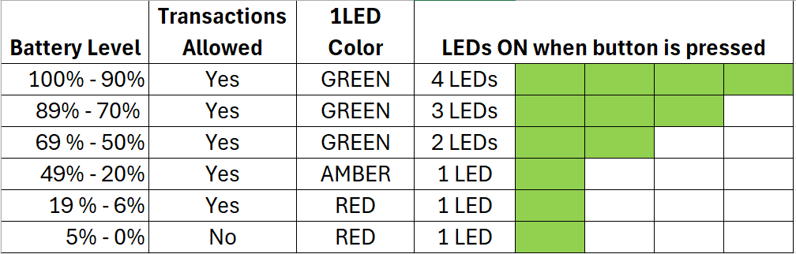

<button class="btn js-toggle-dark-mode">Preview dark color scheme</button>

  <strong>On this page</strong>
  <ul id="toc-list"></ul>

# MMS Dyna Devices Master Programmer's Manual 

  
 
                                                                                                                                                                      |                                          
 
 Confidential This document contains the proprietary information of MagTek. Its receipt or possession does not convey any rights to reproduce or disclose its contents or to manufacture, use or sell anything it may describe. Reproduction, disclosure or use without specific written authorization of MagTek is strictly forbidden.  Unpublished – All Rights Reserved June 2025  Document Number: D100005000-102  REGISTERED TO ISO 9001:2015 

Copyright © 2006 - 2025 MagTek, Inc.

Printed in the United States of America

information in this publication is subject to change without notice. MagTek
cannot be held liable for any use of the contents of this document. Any changes
or improvements made to this product will be included in the next publication
release. If you have questions about specific features and functions or when
they will become available, please contact your MagTek representative.

MagTek®, MagnePrint®, and MagneSafe® are registered trademarks of MagTek, Inc.

Magensa™ is a trademark of MagTek, Inc.

AAMVA™ is a trademark of AAMVA.

American Express® and EXPRESSPAY FROM AMERICAN EXPRESS® are registered
trademarks of American Express Marketing & Development Corp.

D-PAYMENT APPLICATION SPECIFICATION® is a registered trademark of Discover
Financial Services CORPORATION

MasterCard® is a registered trademark and PayPass™ and Tap & Go™ are trademarks
of MasterCard International Incorporated.

Visa® and Visa payWave® are registered trademarks of Visa International Service
Association.

ANSI®, the ANSI logo, and numerous other identifiers containing "ANSI" are
registered trademarks, service marks, and accreditation marks of the American
National Standards Institute (ANSI).

ISO® is a registered trademark of the International Organization for
Standardization.

UL™ and the UL logo are trademarks of UL LLC.

PCI Security Standards Council® is a registered trademark of the PCI Security
Standards Council, LLC.

EMV® is a registered trademark in the U.S. and other countries and an
unregistered trademark elsewhere. The EMV trademark is owned by EMVCo, LLC. The
Contactless Indicator mark, consisting of four graduating arcs, is a trademark
owned by and used with permission of EMVCo, LLC.

The *Bluetooth®*® word mark and logos are registered trademarks owned by
Bluetooth® SIG, Inc. and any use of such marks by MagTek is under license.

Google Play™ store, Google Wallet™ payment service, and Android™ platform are
trademarks of Google LLC.

Apple Pay®, iPhone®, iPod®, Mac®, and OS X® are registered trademarks of Apple
Inc., registered in the U.S. and other countries. iPad™ is a trademark of Apple.
Inc. App StoreSM is a service mark of Apple Inc., registered in the U.S. and
other countries. IOS is a trademark or registered trademark of Cisco in the U.S.
and other countries and is used by Apple Inc. under license.

Microsoft®, Windows®, and .NET® are registered trademarks of Microsoft
Corporation.

MIFARE, the MIFARE logo, MIFARE Ultralight, MIFARE Plus, MIFARE Classic, MIFARE
FleX, DESFire, and MIFARE4Mobile are registered trademarks of NXP B.V.

All other system names and product names are the property of their respective
owners.

Table 1 - Revisions

| Rev Number | Date               | Notes                                                                                                                                                                                                                                                                                                                                                                                                                                                                                                                                                                                                                                                                                                                                                                                                                                                                                                                                                                                                                                                                                                                                                                                                                                                                                                                                                                                                                                                                                                                                                                                                                                                                                                                                                                                                                                                                                                                                                                                                                                                                                                                                                                                                                                                                                                                                                                                                                                                                                                                                                                                                                                                                                                                                                                                                                                                                                                                                                                                                                                                                                                                                                                                                                                                                                                                                                                                                                                                                                                                                                                                                                                                                                                                                                                                                                                                                                                                                                                                                                                                                                                                                                                                                                                                                                                                                                                                                                                                                                                                                                                                                                                                                                                                                                                                                                                                                                                                                                                                                                                                                                                                                                                                                                                                                                                                                                                                                                                                                                                                                                                                                                                                                                                                                                                                                                                                                                                                                                                                                                                                                                                                                                                                                                                                                                                                                                                                                                                                                                                                                             |
|------------|--------------------|---------------------------------------------------------------------------------------------------------------------------------------------------------------------------------------------------------------------------------------------------------------------------------------------------------------------------------------------------------------------------------------------------------------------------------------------------------------------------------------------------------------------------------------------------------------------------------------------------------------------------------------------------------------------------------------------------------------------------------------------------------------------------------------------------------------------------------------------------------------------------------------------------------------------------------------------------------------------------------------------------------------------------------------------------------------------------------------------------------------------------------------------------------------------------------------------------------------------------------------------------------------------------------------------------------------------------------------------------------------------------------------------------------------------------------------------------------------------------------------------------------------------------------------------------------------------------------------------------------------------------------------------------------------------------------------------------------------------------------------------------------------------------------------------------------------------------------------------------------------------------------------------------------------------------------------------------------------------------------------------------------------------------------------------------------------------------------------------------------------------------------------------------------------------------------------------------------------------------------------------------------------------------------------------------------------------------------------------------------------------------------------------------------------------------------------------------------------------------------------------------------------------------------------------------------------------------------------------------------------------------------------------------------------------------------------------------------------------------------------------------------------------------------------------------------------------------------------------------------------------------------------------------------------------------------------------------------------------------------------------------------------------------------------------------------------------------------------------------------------------------------------------------------------------------------------------------------------------------------------------------------------------------------------------------------------------------------------------------------------------------------------------------------------------------------------------------------------------------------------------------------------------------------------------------------------------------------------------------------------------------------------------------------------------------------------------------------------------------------------------------------------------------------------------------------------------------------------------------------------------------------------------------------------------------------------------------------------------------------------------------------------------------------------------------------------------------------------------------------------------------------------------------------------------------------------------------------------------------------------------------------------------------------------------------------------------------------------------------------------------------------------------------------------------------------------------------------------------------------------------------------------------------------------------------------------------------------------------------------------------------------------------------------------------------------------------------------------------------------------------------------------------------------------------------------------------------------------------------------------------------------------------------------------------------------------------------------------------------------------------------------------------------------------------------------------------------------------------------------------------------------------------------------------------------------------------------------------------------------------------------------------------------------------------------------------------------------------------------------------------------------------------------------------------------------------------------------------------------------------------------------------------------------------------------------------------------------------------------------------------------------------------------------------------------------------------------------------------------------------------------------------------------------------------------------------------------------------------------------------------------------------------------------------------------------------------------------------------------------------------------------------------------------------------------------------------------------------------------------------------------------------------------------------------------------------------------------------------------------------------------------------------------------------------------------------------------------------------------------------------------------------------------------------------------------------------------------------------------------------------------------------------------------------------------|
| 10         | Sep 3, 2020        | Initial release                                                                                                                                                                                                                                                                                                                                                                                                                                                                                                                                                                                                                                                                                                                                                                                                                                                                                                                                                                                                                                                                                                                                                                                                                                                                                                                                                                                                                                                                                                                                                                                                                                                                                                                                                                                                                                                                                                                                                                                                                                                                                                                                                                                                                                                                                                                                                                                                                                                                                                                                                                                                                                                                                                                                                                                                                                                                                                                                                                                                                                                                                                                                                                                                                                                                                                                                                                                                                                                                                                                                                                                                                                                                                                                                                                                                                                                                                                                                                                                                                                                                                                                                                                                                                                                                                                                                                                                                                                                                                                                                                                                                                                                                                                                                                                                                                                                                                                                                                                                                                                                                                                                                                                                                                                                                                                                                                                                                                                                                                                                                                                                                                                                                                                                                                                                                                                                                                                                                                                                                                                                                                                                                                                                                                                                                                                                                                                                                                                                                                                                                   |
| 12         | Oct 13, 2020       | Prepare for general availability.                                                                                                                                                                                                                                                                                                                                                                                                                                                                                                                                                                                                                                                                                                                                                                                                                                                                                                                                                                                                                                                                                                                                                                                                                                                                                                                                                                                                                                                                                                                                                                                                                                                                                                                                                                                                                                                                                                                                                                                                                                                                                                                                                                                                                                                                                                                                                                                                                                                                                                                                                                                                                                                                                                                                                                                                                                                                                                                                                                                                                                                                                                                                                                                                                                                                                                                                                                                                                                                                                                                                                                                                                                                                                                                                                                                                                                                                                                                                                                                                                                                                                                                                                                                                                                                                                                                                                                                                                                                                                                                                                                                                                                                                                                                                                                                                                                                                                                                                                                                                                                                                                                                                                                                                                                                                                                                                                                                                                                                                                                                                                                                                                                                                                                                                                                                                                                                                                                                                                                                                                                                                                                                                                                                                                                                                                                                                                                                                                                                                                                                 |
| 14         | Dec 17, 2020       | Remove Command 0x1011 - Get Transaction Data and related content; **4.4** clarify DFDF52 value 0x03 is reserved; Add **Command 0x1802 - Report Cardholder Selection** and add related notification details to **Notification 0x1803 - User Interface Host Action Request**; Add **Command 0x1F02 - Set Notification Subscriptions**; Add **Command 0x1803 - Display Message**; **Command 0x1001 - Start Transaction**, add description of how to implement host-driven fallback, add device-driven fallback feature, add optional parameters to suppress “THANK YOU” message and override the final display message; Add **Property 1.2.2.2.1.1 Reduce Power During USB Suspend**; Add **Property 2.1.2.6.1.1 Firmware Git and Build information (MAGTEK INTERNAL ONLY)**; Add note in **Command 0x1001 - Start Transaction** regarding transaction amount when in Quick Chip mode; **Table 30** clarify possible values for Signature Status; Misc. clarifications and corrections.                                                                                                                                                                                                                                                                                                                                                                                                                                                                                                                                                                                                                                                                                                                                                                                                                                                                                                                                                                                                                                                                                                                                                                                                                                                                                                                                                                                                                                                                                                                                                                                                                                                                                                                                                                                                                                                                                                                                                                                                                                                                                                                                                                                                                                                                                                                                                                                                                                                                                                                                                                                                                                                                                                                                                                                                                                                                                                                                                                                                                                                                                                                                                                                                                                                                                                                                                                                                                                                                                                                                                                                                                                                                                                                                                                                                                                                                                                                                                                                                                                                                                                                                                                                                                                                                                                                                                                                                                                                                                                                                                                                                                                                                                                                                                                                                                                                                                                                                                                                                                                                                                                                                                                                                                                                                                                                                                                                                                                                                                                                                                              |
| 16         | Jan 28. 2021       | Command 0x1001 - Start Transaction Table 70 add signature bypass control parameter and Transaction Timeout parameter, update event sequence to change message from USE CHIP CARD to TRY AGAIN and add information about device-driven signature capture, clarify device-driven fallback sequence; Notification 0x0105 - Transaction Operation Complete Table 322 update possible value for Signature Status; Add **Property 1.2.1.1.2.1 Signature Capture Control**; Add **Property 1.2.1.1.2.2 Include Signature Data in EMV Batch Data**; Misc. clarifications and corrections.                                                                                                                                                                                                                                                                                                                                                                                                                                                                                                                                                                                                                                                                                                                                                                                                                                                                                                                                                                                                                                                                                                                                                                                                                                                                                                                                                                                                                                                                                                                                                                                                                                                                                                                                                                                                                                                                                                                                                                                                                                                                                                                                                                                                                                                                                                                                                                                                                                                                                                                                                                                                                                                                                                                                                                                                                                                                                                                                                                                                                                                                                                                                                                                                                                                                                                                                                                                                                                                                                                                                                                                                                                                                                                                                                                                                                                                                                                                                                                                                                                                                                                                                                                                                                                                                                                                                                                                                                                                                                                                                                                                                                                                                                                                                                                                                                                                                                                                                                                                                                                                                                                                                                                                                                                                                                                                                                                                                                                                                                                                                                                                                                                                                                                                                                                                                                                                                                                                                                                 |
| 18         | Mar 4, 2021        | Add **Property 2.3.1.2.1.1 Device Operational Status**; Add **Property 2.3.1.2.1.2 Offline Status Detail**; Add **Property 2.3.1.1.2.1 Real Time Clock Enabled**; Add **Property 2.3.1.1.2.2 Tamper Sensors Activated**; Add **Property 2.3.1.1.2.3 Tamper Sensor Tampered**; Add **Command 0x1004 - Resume Transaction**; **Notification 0x0105 - Transaction Operation Complete** add notification codes for Quick Chip signature capture; Add **Property 1.2.1.1.2.3 Signature Timing Window (Touch Only)** and update **Command 0x1001 - Start Transaction** to provide information about host-driven signature capture; Misc. clarifications and corrections.                                                                                                                                                                                                                                                                                                                                                                                                                                                                                                                                                                                                                                                                                                                                                                                                                                                                                                                                                                                                                                                                                                                                                                                                                                                                                                                                                                                                                                                                                                                                                                                                                                                                                                                                                                                                                                                                                                                                                                                                                                                                                                                                                                                                                                                                                                                                                                                                                                                                                                                                                                                                                                                                                                                                                                                                                                                                                                                                                                                                                                                                                                                                                                                                                                                                                                                                                                                                                                                                                                                                                                                                                                                                                                                                                                                                                                                                                                                                                                                                                                                                                                                                                                                                                                                                                                                                                                                                                                                                                                                                                                                                                                                                                                                                                                                                                                                                                                                                                                                                                                                                                                                                                                                                                                                                                                                                                                                                                                                                                                                                                                                                                                                                                                                                                                                                                                                                                |
| 20         | Jul 1, 2021        | **4.1** change data type “TC” to “T” and remove “TP” which is better defined by other primitive data types; Repurpose “Notification Group 0x10nn - Notifications from Hardware” to become **Notification Source 0x10nn - Notifications from Device** and populate **Notification 0x1001 - Device Information Update**; Sections **•** and **7**, expand explanation of how to find documentation for a given notification message; Add **Property 1.1.2.2.1.6 PAN MOD 10 Check Digit Validation**; Change name of **Property 1.2.1.1.2.1 Signature Capture Control** and clarify behavior throughout the document; **Property 1.2.1.1.2.3 Signature Timing Window (Touch Only)** change default value from 3 seconds to 1 second; Add **Property 1.2.3.2.1.1 System Volume Control**; Add **Property 1.2.7.1.1.1 Device Reset Occurred Notification Control**; Add **Property 1.2.7.1.1.2 Device Reset Occurred Notification Acknowledged**; Add **Property 1.2.7.1.1.3 Device Reset Will Occur Soon Notification Control**; Add **Property 1.2.7.1.2.1 User Event Notification Controls Enable**; Add **Property 1.2.7.1.2.2 User Event Notification MSR Data Timeout (MSR Only)**; Add **Property 2.3.1.1.2.4 Tamper Configuration Revision (MAGTEK INTERNAL ONLY)**; **Notification 0x0105 - Transaction Operation Complete** change description in end of transaction notifications from Decline, Quick Chip to Quick Chip Deferred; Add Manual Card Entry to **Command 0x1001 - Start Transaction**, **Notification 0x0101 - Transaction Information Update**, **Notification 0x0105 - Transaction Operation Complete**; Add retrieval of multiple properties to **Command 0xD101 - Get Property**; Add section **4.2 About Track Data**; Switch **TR-31 Key Block Type** and **Command 0xF017 - Establish Ephemeral KBPK** to include in published manuals; Update copyright page and regulatory / compliance information from Installation and Operation Manual; Misc. clarifications and corrections.                                                                                                                                                                                                                                                                                                                                                                                                                                                                                                                                                                                                                                                                                                                                                                                                                                                                                                                                                                                                                                                                                                                                                                                                                                                                                                                                                                                                                                                                                                                                                                                                                                                                                                                                                                                                                                                                                                                                                                                                                                                                                                                                                                                                                                                                                                                                                                                                                                                                                                                                                                                                                                                                                                                                                                                                                                                                                                                                                                                                                                                                                                                                                                                                                                                                                                                                                                                                                                                                                                                                                                                                                                                                                                                                                                                                                                                                                                                                                                                                                                                                                                                                                                                                                                                                                                                                                                                                                                                                                                                                     |
| 30         | Nov 9, 2021        | Update cover page photos to show latest trade dress; Replace product boilerplate material with Error! Reference source not found.; Throughout, add references to DynaProx; 0 add features MCE and BCR and throughout document add corresponding feature tags; In Notification 0x0101 - Transaction Information Update add barcode reader functions; Add [Command 0x1804 - Read Barcode](#command-0x1804---read-barcode-bcr-only); Command 0x1822 - Show QR Code, Command 0x1823 - Show Bitmap Image, , In End of Notification Message found on page **64** Notification 0x1805 - User Interface Operation Complete, add Banking Functions notification codes, PIN Verify Failed Error code to Table 351, add In Command 0x1F02 - Set Notification Subscriptions add UART option; Publish Command 0x1004 - Resume Transaction; Publish EMV ARPC Type, add response codes for Request Online PIN and Switch Interface, add Issuer Referral code, clarify tags 71 and 72; add another available orientation; In **Notification 0x0105 - Transaction Operation Complete** add Declined codes for ICC and PICC to differentiate from a Quick Chip Deferred case, update MSR notification codes to be consistent with ICC/PICC codes, add host follow up advised actions throughout; In **Command 0xF016 - Activate Device Security (MAGTEK INTERNAL ONLY)** add BCR entry in Hardware Configuration Profile, add value 0x02 for Audio/Sound, and add version 0x02; Add **Property 1.1.1.1.1.5 ARPC Receive Timeout** and **Property 1.1.1.1.1.6 ARPC Retry Attempts**; Add **Encryption Type** section and use as common reference throughout; In **Command 0x1001 - Start Transaction** add support for EMV Transaction Flow and improve parameter descriptions; Misc. clarifications and corrections.                                                                                                                                                                                                                                                                                                                                                                                                                                                                                                                                                                                                                                                                                                                                                                                                                                                                                                                                                                                                                                                                                                                                                                                                                                                                                                                                                                                                                                                                                                                                                                                                                                                                                                                                                                                                                                                                                                                                                                                                                                                                                                                                                                                                                                                                                                                                                                                                                                                                                                                                                                                                                                                                                                                                                                                                                                                                                                                                                                                                                                                                                                                                                                                                                                                                                                                                                                                                                                                                                                                                                                                                                                                                                                                                                                                                                                                                                                                                                                                                                                                                                                                                                                                                                                                                                                                                                                                                                                                                                                                                                                                                                                                                                                                                                |
| 40         | Dec 9, 2021        | Add **Command 0x1F03 - Extend Session**; In **Notification 0x1001 - Device Information Update** add Session Expiring Soon; In **Command 0xF016 - Activate Device Security (MAGTEK INTERNAL ONLY)** add optional WLAN SoftAP MagTek Password parameter; Add **Notification Source 0x02nn - Notifications from Banking Functions (Banking Functions Only)** and **Command Group 0x20nn - Banking Functions**; Add sections **2.5** and **2.6** for RS-232 and SLIP support; Misc. clarifications and corrections.                                                                                                                                                                                                                                                                                                                                                                                                                                                                                                                                                                                                                                                                                                                                                                                                                                                                                                                                                                                                                                                                                                                                                                                                                                                                                                                                                                                                                                                                                                                                                                                                                                                                                                                                                                                                                                                                                                                                                                                                                                                                                                                                                                                                                                                                                                                                                                                                                                                                                                                                                                                                                                                                                                                                                                                                                                                                                                                                                                                                                                                                                                                                                                                                                                                                                                                                                                                                                                                                                                                                                                                                                                                                                                                                                                                                                                                                                                                                                                                                                                                                                                                                                                                                                                                                                                                                                                                                                                                                                                                                                                                                                                                                                                                                                                                                                                                                                                                                                                                                                                                                                                                                                                                                                                                                                                                                                                                                                                                                                                                                                                                                                                                                                                                                                                                                                                                                                                                                                                                                                                   |
| 50         | January 27, 2022   | Add **Command 0xEF02 – Generate CSR keys (WLAN Only)**; Add **Notification 0x1001 - Device Information Update** category key management; Add **Command 0xEF03 – Generate CSR (WLAN Only)**; Add certificate and CSR file types to Table 201; Add Section 4.25 **Common File Structure**; Add **Certificate File Types**; Add **Certificate Signing Request (CSR) File Types**; In **Notification 0x1001 - Device Information Update** add Low Battery Warning and Low Battery Power Down; Add **Property 1.1.1.1.1.5 ARPC Receive Timeout** and **Property 1.1.1.1.1.6 ARPC Retry Attempts**; Add **Property 1.2.2.1.1.A Maximum Client Connections** and **Property 2.1.2.5.6.4 Active Client Connections**.; Clarify how session management works when more than one WLAN active client connection is active.; Updated Device Family ID parameter in **Command 0xD101 - Get Property** and **Command 0xD111 - Set Property**; Add **Property 1.2.2.1.1.B Certificate Expiring Soon Notification Threshold** and **Notification 0x1001 - Device Information Update** category Key management, reason Certificate Expiring Soon; Added PIN Block format options in **Command 0x1001 - Start Transaction** ; Misc. clarifications and corrections. Add Apollo and Customer trust certificate identifiers to Table 201 - File Types; Made Apollo root CA certificate loadable instead of hardcoded; Add Trust configuration file toTable 201 - File Types**;** Add support for IP addresses in **Command 0xEF03 – Generate CSR (WLAN Only)** SANs parameter and change default values for Subject and SANs parameters ; Add DF71-ISO PIN Block Format tag under F5-Encrypted PIN Container in **Table 20 - EMV ARQC (DynaPro Format) DFDF59 Decrypted Contents** and **Padding to ensure the length of data, starting with the message** length at the very beginning, and ending with any additional padding, is a multiple of 8 bytes for TDES, or 16 bytes for AES. This is a requirement of using the CBC-MAC algorithm. Four-byte CBC-MAC. The host should calculate the CBC-MAC and verify that it matches. For details about calculating a CBC-MAC, see About Message Authentication Codes (MAC).   Table 28 – EMV Batch Data (DynaPro Format) DFDF59 Decrypted Contents , set **7.1.2 Notification 0x0103 - Transaction Host Action Request (MAGTEK INTERNAL ONLY FOR NOW)** as MAGTEK INTERNAL ONLY FOR NOW; Added missing response codes in **The General group 0x00 contains operation status** detail codes related to the platform that do not originate from a specific functional module. • Subgroup 0x00 = General  **The Message Handler** group 0x01 contains operation status detail codes related to parsing and validating messages. Subgroup 0x01 = Device issues that prevent Message Processing (e.g., Critical Battery, Pending Reset, System Failure, System Busy).  **The Request Handler** group 0x02 contains operation status detail codes related to starting actual command requests. • Subgroup 0x01 = Data issues (bad, missing, unknown…) • Subgroup 0x02 = Security / permission problems • Subgroup 0x03 = Device state issues (busy, not permitted, tampered, low battery) • Subgroup 0x04 = Device issues (missing hardware or features) • Subgroup 0x05 = TR31 Errors  Table 13 - Operation Status Detail Codes , added ability to report TR31 error codes; Updated **Property Subgroup 2.1.2.3.nn EMV Firmware Information** adding the description of properties to retrieve each supported kernel’s ID, part number and checksum ; Add **Sections 4.18.1-4.18-6** DUKPT Key Mapping.  Add 7 OIDs, from **Property 1.1.2.4.1.1 Key Mapping of PIN-TDES** to **Property 1.1.2.4.1.7 Key Mapping of PIN-AES**. Add **Property 2.3.1.1.1.1 Device Key Status**. Add **Property 2.3.1.1.1.2 Transaction Key Status**. Add **Property 1.2.2.1.1.3 Security Mode**. Add **Property 1.2.2.1.1.C Username**, Add **Property 1.2.2.1.1.4 Static IP Address** ; **Property 1.2.2.1.1.5 Use DHCP** ; **Property 1.2.2.1.1.6 Static IP Netmask ; Property 1.2.2.1.1.7 Static IP Gateway**  ; Add back Batch Data for contactless in **Table 308 - Notification Detail Codes**   ; Add **Property 2.1.2.5.3.1 WLAN Firmware Version**, ; Add **Property 2.1.2.5.6.2 WLAN WiFi RSSI** ; **Property 2.1.2.5.6.3 WLAN Dynamic IP Address** ; **Property 1.2.2.1.1.D SoftAP IP Address** ; **Property 1.2.2.1.1.1 SSID** ; **Property 1.2.2.1.1.2 Password**; Add **Property 2.1.2.1.2.2 Boot0 Firmware Version**. Added Boot1 and WiFi modules to [**Command 0xD801 - Load Firmware File**](#command-0xd801---load-firmware-file); Add [**Property 2.1.2.5.3.1 WLAN Firmware Version**](#property-212531-wlan-firmware-version) and [**Property 2.1.2.5.3.2 WLAN WiFi Module Build Hash (MAGTEK INTERAL ONLY)**](#property-212532-wlan-wifi-module-build-hash-magtek-internal-only). Add [**8.4.1 Property Subgroup 2.1.1.1.nn MainApp Firmware Information**](#841-property-subgroup-2111nn-mainapp-firmware-information). Add [**8.3.2.1 Property 1.2.2.1.1.1 SSID**](#property-122111-ssid). Add [**8.3.2.8 Property 1.2.2.1.1.8 Device Name**](#property-122118-device-name). Add [**8.5.5.7 Property 2.1.2.5.6.5 Server Certificate Chain Select**](#property-212565-server-certificate-chain-select). Add [**8.5.5.8 Property 2.1.2.5.6.6 Security Protocol**](#property-212566-security-protocol)**. Update** [**2.2 How to Use Wireless LAN (WLAN) Connections**](#how-to-use-wireless-lan-wlan-connections-wlan-only)**.** Add **Appendix C for Demo Mode.** Add **Property 1.2.2.1.1.9 Wireless Heartbeat Time;** Removed “MagTek Internal Only for now” from WLAN connection type **How to Use Wireless LAN (WLAN) Connections (WLAN Only);** Set Banking Features to ‘Y” on device features table **Table 3 - Device** Features**.**   Misc. clarifications and corrections.                                                                                                                                                                                                                                                                                                                                                                                                                                                                                                                                                                                                                                  |
| 60         | February 21, 2023  | Add **Web App Enabled**; Add **Property 1.2.2.1.1.F Web App Port**; Add content to **How to Use Bluetooth® LE Connections (Bluetooth® LE Only**; **Add Property Subgroup 1.2.2.3.nn Bluetooth® LE Settings (Bluetooth® LE Only)** **Add Property Subgroup 2.1.2.7.nn Bluetooth® LE Information (Bluetooth® LE Only, MAGTEK INTERNAL ONLY FOR NOW)** Add **Property 2.1.2.3.9.1 Apple VAS Kernel ID**; Add **Command 0x1F04 – Terminate Bluetooth® LE Connection (Bluetooth® LE Only)**, **Command 0x1F05 – Erase All Bluetooth® LE Bonds (Bluetooth® LE Only)**, **Property 2.1.2.7.2.2 Bluetooth® LE Connection Status** and **Property 2.1.2.7.2.3 Bluetooth® LE Number of Bondings**; Add BCR operation note when using UART interface in **2.5 How to Use RS-232/UART Connections (SLIP Only)**; Add Encrypted MagnePrint container FF73 in **Table 20 - EMV ARQC (DynaPro Format) DFDF59 Decrypted Contents** and **Padding to ensure the length of data, starting with the message** length at the very beginning, and ending with any additional padding, is a multiple of 8 bytes for TDES, or 16 bytes for AES. This is a requirement of using the CBC-MAC algorithm. Four-byte CBC-MAC. The host should calculate the CBC-MAC and verify that it matches. For details about calculating a CBC-MAC, see About Message Authentication Codes (MAC).   Table 28 – EMV Batch Data (DynaPro Format) DFDF59 Decrypted Contents**.** Add **Barcode Reader Symbologies;** update **Table 300 - Request Data for Command 0xF016 - Activate Device Security (MAGTEK INTERNAL ONLY), with WLAN Sequence Number;** Add **7.3.3  Notification 0x0907 - Firmware is Up to** Date**;** Add **Property 1.2.2.1.1.10 Firmware Authentication Hash (MAGTEK INTERNAL ONLY)**; Add **Property 2.1.2.5.3.3 WLAN Firmware Sequence Number (MAGTEK INTERNAL ONLY)**; Update How to Use Bluetooth® LE Connections (Bluetooth® LE Only**,** Property 1.2.2.3.1.4 Bluetooth® LE Desired Slave Latency and Property 1.2.2.3.1.6 Bluetooth® LE Connection Parameter Update Request Control**; Add Property 2.1.2.7.2.4 Bluetooth® LE MTU Size;** Update **Command 0xD101 - Get Property** and **Command 0xD111 - Set Property –** Modified byte 2 of Device Family ID, changed 0x03 to DynaFlex II PED and added 0x04 to DynaFlex II; Misc. clarifications and corrections.                                                                                                                                                                                                                                                                                                                                                                                                                                                                                                                                                                                                                                                                                                                                                                                                                                                                                                                                                                                                                                                                                                                                                                                                                                                                                                                                                                                                                                                                                                                                                                                                                                                                                                                                                                                                                                                                                                                                                                                                                                                                                                                                                                                                                                                                                                                                                                                                                                                                                                                                                                                                                                                                                                                                                                                                                                                                                                                                                                                                                                                                                                                                                                                                                                                                                                                                                                                                                                                                                                                                                                                                                                                                                                                                                                                                                                                                                                                                                                                                                                                                                                                                                                                          |
| 61         | March 16, 2023     | Add **Property 1.2.2.3.1.9 Bluetooth® LE Passkey**; Add **Property 1.2.2.3.1.A Bluetooth® LE Never Advertise**; Add **Property 1.2.2.3.1.B Bluetooth® LE FCC Test Control (MAGTEK INTERNAL ONLY)**; Add option to display amount in quick chip mode in **Command 0x1001 - Start Transaction** ;Update on **Table 322 - Notification Detail Codes** to clarify transaction cancellation reason ; Removed MAGTEK INTERNAL ONLY tag on **EMV Terminal Configuration File Type; EMV Processing Configuration File Type ;**  **Additional instances of the AID Delimiter** Container parameter, one per Application Identifier (AID) the device should support.  EMV Entry Point Configuration File Type  ;Misc. clarifications and corrections.                                                                                                                                                                                                                                                                                                                                                                                                                                                                                                                                                                                                                                                                                                                                                                                                                                                                                                                                                                                                                                                                                                                                                                                                                                                                                                                                                                                                                                                                                                                                                                                                                                                                                                                                                                                                                                                                                                                                                                                                                                                                                                                                                                                                                                                                                                                                                                                                                                                                                                                                                                                                                                                                                                                                                                                                                                                                                                                                                                                                                                                                                                                                                                                                                                                                                                                                                                                                                                                                                                                                                                                                                                                                                                                                                                                                                                                                                                                                                                                                                                                                                                                                                                                                                                                                                                                                                                                                                                                                                                                                                                                                                                                                                                                                                                                                                                                                                                                                                                                                                                                                                                                                                                                                                                                                                                                                                                                                                                                                                                                                                                                                                                                                                                                                                                                                       |
| 62         | April 7, 2023      | Updated **The General** group 0x00 contains operation status detail codes related to the platform that do not originate from a specific functional module. • Subgroup 0x00 = General  **The Message Handler** group 0x01 contains operation status detail codes related to parsing and validating messages. Subgroup 0x01 = Device issues that prevent Message Processing (e.g., Critical Battery, Pending Reset, System Failure, System Busy).  **The Request Handler** group 0x02 contains operation status detail codes related to starting actual command requests. • Subgroup 0x01 = Data issues (bad, missing, unknown…) • Subgroup 0x02 = Security / permission problems • Subgroup 0x03 = Device state issues (busy, not permitted, tampered, low battery) • Subgroup 0x04 = Device issues (missing hardware or features) • Subgroup 0x05 = TR31 Errors  Table 13 Request Operation Failed, Modified value of DFDF1B in **Table 27 – EMV Batch Data (DynaPro Format) Type** ; Update DF1B Example Value in **Table 34** Updated Table 79 - Response Example**,** Table 83 - Response Example**, Update Request and Response examples in** Command 0xD111 - Set Property**, Add note “For additional support, please contact MagTek Support.” To sections 6.7.3, 6.7.4, 6.7.5, 6.7.6, 6.8.1, 6.10.2, 6.10.3, 6.10.6, 6.11.5;** updated set response example in **8.3.7.1 Property 1.2.7.1.1.1 Device Reset Occurred Notification Control,** Updated Set Request/Response examples in **8.3.7.3** Property 1.2.7.1.1.3 Device Reset Will Occur Soon Notification Control**,** **Add Appendix E Erasing EMV Configurations,** Updated **The General group 0x00 contains operation status** detail codes related to the platform that do not originate from a specific functional module. • Subgroup 0x00 = General  **The Message Handler** group 0x01 contains operation status detail codes related to parsing and validating messages. Subgroup 0x01 = Device issues that prevent Message Processing (e.g., Critical Battery, Pending Reset, System Failure, System Busy).  **The Request Handler** group 0x02 contains operation status detail codes related to starting actual command requests. • Subgroup 0x01 = Data issues (bad, missing, unknown…) • Subgroup 0x02 = Security / permission problems • Subgroup 0x03 = Device state issues (busy, not permitted, tampered, low battery) • Subgroup 0x04 = Device issues (missing hardware or features) • Subgroup 0x05 = TR31 Errors  Table 13 - Operation Status Detail Codes with 02 Requested Operation Failed; Change examples in **Command 0xD101 - Get Property** and **Command 0xD111 - Set Property** Add **Property 1.2.2.3.1.C Bluetooth® LE Sleep Enabled ;** Misc. clarifications and corrections                                                                                                                                                                                                                                                                                                                                                                                                                                                                                                                                                                                                                                                                                                                                                                                                                                                                                                                                                                                                                                                                                                                                                                                                                                                                                                                                                                                                                                                                                                                                                                                                                                                                                                                                                                                                                                                                                                                                                                                                                                                                                                                                                                                                                                                                                                                                                                                                                                                                                                                                                                                                                                                                                                                                                                                                                                                                                                                                                                                                                                                                                                                                                                                                                                                                                                                                                                                                                                                                                                                                                                                                                                                                                                                                                                       |
| 63         | May 16, 2023       | Added definition of 00 03 00 00 in **7.4.1 Notification 0x1001 - Device Information Update** ; Added NFC UID support in **4.17 NFC UID Type (EMV Contactless Only) , Table 308 - Notification Detail Codes** , **Table 309 - Notification Payload for Data Update, ARQC Update (Quick Chip), Data Attached** **, Table 322 - Notification Detail Codes;** add detection and removal user event notification in **7.4.1 Notification 0x1001 - Device Information Update** [; Add **Property 2.3.1.2.1.5 Battery Charger Status**](#property-231215-battery-charger-status)  Update tables for FW Update, Table 202 - Request Data for Command 0xD801 - Load Firmware File. Table 227 - Request Data for Command 0xD901 - Commit Firmware from File; Updated Message Length from 60 to 61 in **Table 6 - Multi-Packet Middle Format** ; Clarified Message size in **Table 5 - Multi-Packet Head Format** ; Add DynaFlex II Go USB PID and Get/Set Property command, Device Family ID, Product ID; Updated notification code for Battery Charge complete to 00 02 02 00 in **Table 332 - Notification Detail Codes** ; updated **Table 332 - Notification Detail Codes** to distinguish 1K or 4K MIFARE Classic cards; Add DynaFlex II Go on page 1; Add NFC pass through flow description in **Command 0x1001 - Start Transaction**; Add BCR encryption bit to [**8.3.6.4 Property 1.2.7.1.2.1 User Event Notification Controls Enable**](#property-127121-user-event-notification-controls-enable)**;** Updated NFC Removal Code from -x50 to 0x05 in **Table 322 - Notification Detail Codes** , **Table 90 - Request Example (Get Version)**, **Table 91 - Response Example (Get Version**), **Table 332 - Notification Detail Codes**, Add **Table 344 - Notification Payload for UID**, **End** **of Notification Message found on page 64** Table 345 – Notification Payload for UID Example; Misc. clarifications and corrections;                                                                                                                                                                                                                                                                                                                                                                                                                                                                                                                                                                                                                                                                                                                                                                                                                                                                                                                                                                                                                                                                                                                                                                                                                                                                                                                                                                                                                                                                                                                                                                                                                                                                                                                                                                                                                                                                                                                                                                                                                                                                                                                                                                                                                                                                                                                                                                                                                                                                                                                                                                                                                                                                                                                                                                                                                                                                                                                                                                                                                                                                                                                                                                                                                                                                                                                                                                                                                                                                                                                                                                                                                                                                                                                                                                                                                                                                                                                                                                                                                                                                                                                                                                                                                                                                                                                                                                                                                                                                                                                                                                                                           |
| 64         | September 28, 2023 | Update **Table 84 - Request Data for** ; Add tags 82 and 9F6E in the clear text portion of the ARQC Message - **EMV ARQC (DynaPro Format) Type** ; Removed Tag 84 on these payloads message to match firmware **Table 347, End of** **Notification Message** found on page **64.** Table 349**, End of** **Notification Message** found on page **64** Table 350 ; Add **24 Hour Automatic Reset PCI Requirement** and **Property 1.2.7.1.1.4 Auto Reset Configuration**; Misc. clarifications and corrections.                                                                                                                                                                                                                                                                                                                                                                                                                                                                                                                                                                                                                                                                                                                                                                                                                                                                                                                                                                                                                                                                                                                                                                                                                                                                                                                                                                                                                                                                                                                                                                                                                                                                                                                                                                                                                                                                                                                                                                                                                                                                                                                                                                                                                                                                                                                                                                                                                                                                                                                                                                                                                                                                                                                                                                                                                                                                                                                                                                                                                                                                                                                                                                                                                                                                                                                                                                                                                                                                                                                                                                                                                                                                                                                                                                                                                                                                                                                                                                                                                                                                                                                                                                                                                                                                                                                                                                                                                                                                                                                                                                                                                                                                                                                                                                                                                                                                                                                                                                                                                                                                                                                                                                                                                                                                                                                                                                                                                                                                                                                                                                                                                                                                                                                                                                                                                                                                                                                                                                                                                                   |
| 65         | October 5, 2023    | Add Extended AID Selection Feature - **7.5.2 Notification 0x1803 - User Interface Host Action Request and 8.3.1.2 Property 1.2.1.1.1.2 Application Selection Behavior**;  Add support for MIFARE Classic 1K and 4K - **6.2.2 Command 0x1101 – Pass Through Command for MIFARE Classic** ; Add Tip Feature **6.1.1 Command 0x1001 - Start Transaction** ; Update Key Injection Sequence in **Command 0xEF01 - Load Key Using TR-31** added **Table 243 - Device Key ID / Slot**; Add PED Only description to **1.1 About This Document**, Added reference to Device Features Table to **1.2 About Terminology**, Remove Bluetooth® LE sections tagged as TBD, Update **Table 59 - SRED Data IDs and OIDs** and **Table 63 - Allowed Key Mapping Table with PED ONLY tags for** PIN-TDES and PIN-AES and MSR ONLY for Magneprint, Add Display Only Tag to **6.5 Command Group 0x20nn - Banking Functions (Touch/Display Only)**, Add Touch Only tags to **Property** **1.1.2.4.1.1 Key Mapping of PIN-TDES (Touch Only)**and **Property 1.1.2.4.1.7 Key Mapping of PIN-AES (Touch Only),** add MSR Only Tag **to Property 1.1.2.4.1.4 Key Mapping of Magneprint (MSR Only)**, add Contactless Only tag to **Property 1.2.1.1.1.2 Application Selection Behavior (Contactless Only), Property 2.1.2.3.5.1 Mastercard MCL Kernel ID (Contactless Only),Property 2.1.2.3.5.2 Mastercard MCL Kernel Firmware Part Number (Contactless Only), Property 2.1.2.3.6.1 Visa payWave Kernel ID (Contactless Only), Property 2.1.2.3.6.2 Visa payWave Kernel Firmware Part Number (Contactless Only), Property 2.1.2.3.6.3 Visa payWave Kernel Checksum (Contactless Only), Property 2.1.2.3.7.2 Discover D-PAS Kernel Firmware Part Number (Contactless Only), Property 2.1.2.3.7.3 Discover D-PAS Kernel Checksum (Contactless Only), Property 2.1.2.3.8.1 American Express Expresspay Kernel ID (Contactless Only), Property 2.1.2.3.8.2 American Express Expresspay Kernel Firmware Part Number (Contactless Only), Property 2.1.2.3.8.3 American Express Expresspay Kernel Checksum (Contactless Only),** Misc. clarifications and corrections                                                                                                                                                                                                                                                                                                                                                                                                                                                                                                                                                                                                                                                                                                                                                                                                                                                                                                                                                                                                                                                                                                                                                                                                                                                                                                                                                                                                                                                                                                                                                                                                                                                                                                                                                                                                                                                                                                                                                                                                                                                                                                                                                                                                                                                                                                                                                                                                                                                                                                                                                                                                                                                                                                                                                                                                                                                                                                                                                                                                                                                                                                                                                                                                                                                                                                                                                                                                                                                                                                                                                                                                                                                                                                                                                                                                                                                                                                                                                                                                                                                                                                                                                                                                                                                                                                                                                                                                            |
| 66         | October 31, 2023   | Add Section **8.5.1.4 Property 2.1.2.1.2.4 Boot0 Firmware Part** Number; Update section **4.3 Display Strings** to include missing strings. Add reference to **Command 0xE001 - Get Challenge** to **Command 0xEF01 - Load Key Using TR-31,** Update Table 58 - Key Slot IDs, change ID from 200x to 0x2000 to 0x201F , Update **0 DUKPT Slot IDs** with TR31 Module support from 16 to 32 and Slot IDs to 0x2000 to 0x201F, Update **Table 1219 - Property 2.3.1.1.1.2 Transaction Key Status** with updated Valid Values, Add [**Property 2.3.1.2.1.6 Device Temperature**](#property-231216-device-temperature). Add [**Property 1.2.7.1.4.1 Device Low Temperature Notification Level**](#property-127142-device-high-temperature-notification-level). Add [**Property 1.2.7.1.4.2 Device High Temperature Notification Level**](#_Property_1.2.7.1.4.2_Device). Add [**Property 1.2.7.1.4.3 Device Temperature Notification Repeat Interval**](#property-127143-device-temperature-notification-repeat-interval). Add **Section 6.2.3 Command 0x1102 – Pass Through Command for MIFARE DESFire, Type 4**, Update section **7.1.1 Notification 0x0101 - Transaction Information Update** to include MIFARE DESfire info, Update section **7.4.1 Notification 0x1001 - Device Information Update** to include MIFARE DESFire info, Add [**Property 1.1.1.1.1.10 Google Smart Tap Collector ID Slot 1**](#property-1111110-google-smart-tap-collector-id-slot-1) through [**Property 1.1.1.1.1.15 Google Smart Tap Collector ID Slot 6**](#property-1111115-google-smart-tap-collector-id-slot-6). Add Capabilities. Add Google Smart Tap to [**Notification 0x0101 – Transaction Information Update**](#notification-0x0101---transaction-information-update). Add Google Smart Tap data to [**EMV ARQC Type**](#emv-arqc-type) and [**EMV Batch Data Type**](#emv-batch-data-type). Add **Property** 1.2.2.2.1.2 USB Configuration Type; Changed **Property 1.2.2.3.1.1 Bluetooth® LE Device Name** default value; Add **Property 1.1.1.1.1.D Apple iAP2 AppBundleID** Add **Command 0xF014 - Read Log (MAGTEK INTERNAL ONLY);** Add **Property 1.2.2.3.1.D Bluetooth® LE Debug Mode Enabled** ; Update **Table 300 - Request Data for Command 0xF016 - Activate Device Security (MAGTEK INTERNAL ONLY)** by adding an additional option for buttons type; Revised **5.1.1 MACs for EMV Data** to add AES method and simplified TDES MACing spec by referencing ANSI x9.24; Add **Command 0x1805 - Buzzer** and update **End of Notification Message found on page** **64** Notification 0x1805 - User Interface Operation Complete to include Buzzer result info, add **Property 1.2.1.1.3.1 Contactless Low Power Card Detect (Contactless Only),** Clarified max number of leading unmasked characters **Property 1.1.2.2.1.3 PAN Number of Leading Unmasked Characters** ; Added [**Appendix G - Physical Button (DynaFlex Only)**](#physical-button-dynaflex-only)**;** Added low battery error to Table 3.2-4 in [**Response Message**](#response-message); Added event notifications are disabled when battery is 5% or less in [**Property 1.2.7.1.2.1 User Event Notification Controls Enable**](#property-127121-user-event-notification-controls-enable); Changed **Property 1.2.2.3.1.C Bluetooth® LE Sleep Enabled** default to enabled, made it customer facing and added more related documentation; Added note that firmware can not be updated when the batter charge is less than or equal to 5 percent in [**Command 0xD801 - Load Firmware File**](#command-0xd801---load-firmware-file); Add definition of Tag DF29 in **Table 20 - EMV ARQC (DynaPro Format) DFDF59 Decrypted Contents** and **Padding to ensure the length of data, starting with the message** length at the very beginning, and ending with any additional padding, is a multiple of 8 bytes for TDES, or 16 bytes for AES. This is a requirement of using the CBC-MAC algorithm. Four-byte CBC-MAC. The host should calculate the CBC-MAC and verify that it matches. For details about calculating a CBC-MAC, see About Message Authentication Codes (MAC).   Table 28 – EMV Batch Data (DynaPro Format) DFDF59 Decrypted Contents ; Misc. clarifications and corrections; Added buzzing in progress error to Table 3.2-4 in [**Response Message**](#response-message); add **Property 2.1.2.7.1.2 Bluetooth® LE Firmware Sequence Number, Update 6.10.5 Command 0xEF03 – Generate CSR (WLAN Only)**Remove default setting: -mt.test from CN (Subject) and DNS (Subject Alternate Names), Update Table 201 - File Types Add: Request file from MagTek services Set: No, Removed “The Device must have a WLAN interface” from **Command 0x1001 - Start Transaction,** Update **Property 1.2.2.1.1.3 Security Mode** to indicate which properties must be set, Add [**Property 2.1.2.3.A.1 JCB Kernel ID (Contactless Only)**](#property-2123a1-jcb-kernel-id-contactless-only-common-kernel-only), Add [**Property 2.1.2.3.A.2 JCB Kernel Firmware Part Number (Contactless Only)**](#property-2123a2-jcb-kernel-firmware-part-number-contactless-only-common-kernel-only), Add [**Property 2.1.2.3.A.3 JCB Kernel Checksum (Contactless Only)**](#property-2123a3-jcb-kernel-checksum-contactless-only-common-kernel-only), Add [**Property 2.1.2.3.A.4 Reader Core Checksum (Contactless Only)**](#property-2123a4-reader-core-checksum-contactless-only-common-kernel-only), Add [**Property 2.1.2.3.B.1 China Union Pay Kernel ID (Contactless Only)**](#property-2123a5-entry-point-checksum-contactless-only-common-kernel-only), Add [**Property 2.1.2.3.B.2 China Union Pay Kernel Firmware Part Number (Contactless Only)**](#property-2123b2-china-union-pay-kernel-firmware-part-number-contactless-only-common-kernel-only), Add [**Property 2.1.2.3.B.3 China Union Pay Kernel Checksum (Contactless Only)**](#property-2123b3-china-union-pay-kernel-checksum-contactless-only-common-kernel-only), Add [**Property 2.1.2.3.C.1 Interact Flash Kernel ID (Contactless Only)**](#property-2123c1-interact-flash-kernel-id-contactless-only-common-kernel-only), Add [**Property 2.1.2.3.C.2 Interact Flash Kernel Firmware Part Number (Contactless Only)**](#property-2123c2-interact-flash-kernel-firmware-part-number-contactless-only-common-kernel-only), Add [**Property 2.1.2.3.C.3 Interact Flash Kernel Checksum (Contactless Only)**](#property-2123c3-interact-flash-kernel-checksum-contactless-only-common-kernel-only),  |
| 100        | June 17, 2024      | Add Apple VAS and GWST in **Table 3 - Device Features**; Add bit definitions to enable Apple / Google VAS in **Command 0x1001 - Start Transaction**; Add tag /83 to **Table 70 - Request Data for Command 0x1001 - Start Transaction**; Add  **Table 355 – Default User Interface String IDs and Strings**; Update Table 201 - File Types with UI configuration description; Add **Property 1.1.1.1.4.1 EMV Configuration Filename**; Add **Property 1.1.1.1.4.2 CA Public Key Configuration Filename**; Add **Property Subgroup 2.1.2.8.nn Custom** UI**;**;6.3.9.1 UI Page Option 0x00 Layout; 6.3.9.2 UI Page Option 0x01 and 0x02 Layout; 6.3.9.3 UI Page Option 0x03 Layout Add NFC Tag Support Flow and Audio Transducer Beep Flow to **6.1.1 Command 0x1001 - Start Transaction;** Update references for Tag 81 in Table **84 - Request Data for Command 0x1100 – Pass Through Command For NTag/MIFARE Ultralight, Type 2.**; Update table caption to “NTag Commands” in **End of any wrappers**, at minimum including Request Message found on page 58 Table 85 – NTag Commands; Add **Table 86 – MIFARE Ultralight EV1 Commands** and **Table 87 – MIFARE Ultralight C Commands**, Add **6.2.1.1 Encrypted Data Format** and **6.2.2.1 Encrypted Data Format** and **6.2.3.1 Encrypted Data Format**; Add **8.3.1.7 Property 1.2.1.1.4.1 MIFARE Ultralight C 2keys3DES**; Update Notification detail codes to include Ntag/MIFARE Ultralight in **Table 308 - Notification Detail Codes** and **Table 332 - Notification Detail Codes**, add **Table 72 - Response Example for Command 0x1001 – Start Transaction Command not executed due to Battery Charge State**, Update **Table 12 - Response Message Format** with **Table 204 - Response Example for Command 0xD801 Battery Charge State** battery Charge Status content, Update **Table 14 - Notification Message Format** with battery charge status content, add **G.1Battery Charge Status** ; added **4.17** **NFC UID Type (EMV Contactless Only)** , add notification for GPO Response in **7.1.1Notification 0x0101 - Transaction Information Update**, add additional note on Tag 85 regarding GPO Response = 6985 on **Table 347 - Notification Payload for Display Message Request Notifications (No Display Only):** Add **Table 87 – MIFARE Ultralight C Commands, Table 86 – MIFARE Ultralight EV1 Commands, Table 88 – MIFARE Ultralight AES Commands,** Add **Property 1.2.1.1.4.2 MIFARE Ultralight AES DataProtKey. Property 1.2.1.1.4.3 MIFARE Ultralight AES UIDRetrKey. Property 1.2.1.1.4.4 MIFARE Ultralight AES OriginalityKey.** Add note for random ID. Add **6.7.7 Command 0xD831 – Delete File from Device.** Add **8.2.2.17 Property 1.1.2.6.1.1 Selectable Card Data Encryption Enable (MAGTEK INTERNAL ONLY)**,Add **Command 0xD112 - Set Property (Secured)**, Add **2.7 How to Use Apple iAP2 Connections (iAP2 Only);** update **Table 19 - EMV ARQC (DynaPro Format) Type** with encrypted card data content; Add **Padding to force DFDF59 plus padding to be a multiple of** 8 bytes  **Table 21 - EMV ARQC (DynaPro Format) DFDFDF37 Decrypted Contents**; Update Table 2 - Device Connection Types / Data Formats to include iAP2; add **2.7 How to Use Apple iAP2 Connections (iAP2 Only);** Add MIFARE Mini to **6.2.2 Command 0x1101 – Pass Through Command for MIFARE Classic/MINI®/Plus SL1** (Security Level 1), Type 2 **Update** Table 610 - Property 1.1.2.6.1.1 Selectable Card Data Encryption Enable (MAGTEK INTERNAL ONLY) **Update** Padding to force DFDF59 plus padding to be a multiple of 8 bytes  **Table 21 - EMV ARQC (DynaPro Format) DFDFDF37 Decrypted Contents Add a new OID, Update the MCE description in** Command 0x1001 - Start Transaction**.** Update the MCE description in **Table 70 - Request Data for Command 0x1001 - Start Transaction**, Corrected MSR notification code from 128 to 80 in **Table 322 - Notification Detail Codes**.                                                                                                                                                                                                                                                                                                                                                                                                                                                                                                                                                                                                                                                                                                                                                                                                                                                                                                                                                                                                                                                                                                                                                                                                                                                                                                                                                                                                                                                                                                                                                                                                                                                                                                                                                                                                                                                                                                                                                                                                                                                                                                                                                                                                                                                                                                                                                                                                                                                                                                                                                              |
| 101        | January 24, 2025   | Updated HW configuration values for USB/iAP2. Add [**Property 2.1.2.5.6.7 Available Access Points**](#property-212567-available-access-points) ; Add support for CUP, JCB and Interac in - **EMV Processing Configuration File Type** and  **Additional instances of the AID Delimiter** Container parameter, one per Application Identifier (AID) the device should support.  EMV Entry Point Configuration File Type ;  Misc. clarifications and corrections; Add **Command 0x1103 – Pass Through Command for MIFARE Plus, Type 2**; updated **Notification 0x0101 - Transaction Information Update** and **Notification 0x1001 - Device Information Update** to support MIFARE Plus. Add tags to [**ARQC**](#emv-arqc-dynapro-format-type) (cleartext):  0xDF2A – Tip Mode Sale Amount Entered 0xDF2B – Tip Mode Total Amount Add tag to [**OID property 1.1.1.1.3.4 – Other TLV**](#property-111134-other-tlv-touch-only): 0x9F02 – Default Amount for Quickchip Add to CA revocation list, exception file list and DPAS data storage to **Table 201 - File Types**; Delete **Command 0xD112 - Set Property (Secured)** request data, response data and example; Add [**Property 2.1.2.3.6.5 Entry Point Checksum**](#property-212365-entry-point-checksum-contactless-onlycommon-kernel-only) and [**Property 2.1.2.3.A.5 Entry Point Checksum**](#property-2123a5-entry-point-checksum-contactless-only-common-kernel-only)**.** Added [**Table 4.5 9 – Fleet Data Container Payload**](#Fleet)**.;** Removed Enhanced ARQC section; Removed Enhanced Batch Data Section; Add “common kernel only” tag to Fleet, JCB, CUP and Interac OIDs. ; Add **Device Lock Feature ;** Add **Command 0xEF04 – Load LTPK Protection Key (MAGTEK INTERNAL ONLY FOR NOW)**and **Command 0xEF05 – Load Encrypted LTPK and Version (MAGTEK INTERNAL ONLY FOR NOW)**, replaced radar mode with updated terminology changed to Proximity Detection Mode; Add **Command 0xEF08 – Reset Device Lock Passcode (MAGTEK INTERNAL ONLY FOR NOW)** and **Property 1.2.3.1.1.2 Custom Idle Page Image Device Locked (Display Only);** Update Notification Detail codes in **Notification 0x0905 - Firmware Update Successful, Notification 0x0906 - Firmware Update Failed, Notification 0x0907 - Firmware is Up to Date.** Add error code 0x12 (Pass-through command not Activated). Update **7.5.2Notification 0x1803 - User Interface Host Action Request** to include Enhanced Application Select Message for Contact; Update **Command 0xD801 - Load Firmware File** with updated step 5 sequence; Update **Table 202 - Request Data for Command 0xD801 - Load Firmware File** with Tag 88, replaced content for **4.21 Firmware File Type (MAGTEK INTERNAL ONLY)** with reference to D100006342.                                                                                                                                                                                                                                                                                                                                                                                                                                                                                                                                                                                                                                                                                                                                                                                                                                                                                                                                                                                                                                                                                                                                                                                                                                                                                                                                                                                                                                                                                                                                                                                                                                                                                                                                                                                                                                                                                                                                                                                                                                                                                                                                                                                                                                                                                                                                                                                                                                                                                                                                                                                                                                                                                                                                                                                                                                                                                                                                                                                                                                                                                                                                                                                                                                                                                                                                                                                                                                                                                                                                                                                                                                                                                                                                                                |
| 102        | February 20, 2025  | Make **Device Lock Feature** customer facing; Add **Property 1.1.1.1.2.6 Tip Mode Enable Submit on Amount Button Press**; Add response codes to group 2 subgroup 3: **Attempt to display Flexible UI page while touchscreen UI notifications enabled** and Request is invalid while card emulation is in progress to in **The General group 0x00 contains operation status** detail codes related to the platform that do not originate from a specific functional module. • Subgroup 0x00 = General  **The Message Handler** group 0x01 contains operation status detail codes related to parsing and validating messages. Subgroup 0x01 = Device issues that prevent Message Processing (e.g., Critical Battery, Pending Reset, System Failure, System Busy).  **The Request Handler** group 0x02 contains operation status detail codes related to starting actual command requests. • Subgroup 0x01 = Data issues (bad, missing, unknown…) • Subgroup 0x02 = Security / permission problems • Subgroup 0x03 = Device state issues (busy, not permitted, tampered, low battery) • Subgroup 0x04 = Device issues (missing hardware or features) • Subgroup 0x05 = TR31 Errors  Table 13 - Operation Status Detail Codes**;** Updated **Property 1.2.3.2.1.1 System Volume Control** to allow value of 0 (no sound); Added Apollo client cert support; Fix **Property 2.1.2.5.6.5 Server Certificate Chain Select** description; Add Card Emulation to **Table 3 - Device Features**; Add **Card Emulation**; add **Command 0x1840 – Card Emulation,** add Module 0x06 Card Emulation to **Table 351 - Notification Detail Codes**. Update **Command 0x1821 - Show Image (Display Only)** and **Command 0x1823 - Show Bitmap Image (Display Only)** to include display options to cover/uncover the top status bar; Update **Command 0x1102 – Pass Through Command for MIFARE DESFire, Type 4** to include MIFARE DESFire EV1/EV2/EV3; Update **Command 0x1102 – Pass Through Command for MIFARE DESFire, Type 4** to include MIFARE Plus EV1/EV2/SE/X SL1 (Security Level 1) commands; Update **Command 0x1103 – Pass Through Command for MIFARE Plus, Type 2** to include MIFARE Plus EV1/EV2/SE/X SL3 (Security Level 3) commands; Update **Notification 0x0101 - Transaction Information Update** and **Notification 0x1001 - Device Information Update** to include MIFARE DESFire EV1/EV2/EV3; Add **Property 1.2.1.1.4.5 MIFARE Plus AES_Key1. Property 1.2.1.1.4.6 MIFARE Plus AES_Key2.** **Property 1.2.1.1.4.7 MIFARE Plus AES_Key3. Property 1.2.1.1.4.8 MIFARE Plus AES_Key4. Property 1.2.1.1.4.9 MIFARE Plus AES_Key5. Property 1.2.1.1.4.A MIFARE Plus AES_Key6.** Update **Command 0x1100 – Pass Through Command For NTag/MIFARE Ultralight, Type 2** to include an option for READ command to do a fast read, Add MQTT and Websocket content to **Table 201 - File Types**, Add **Property 1.2.2.1.1.11 WLAN Protocol**, **Property 1.2.2.1.2.1 MQTT Broker Address**, **Property 1.2.2.1.2.2 MQTT Port**, **Property 1.2.2.1.2.3 MQTT QoS Quality of Service**, **Property 1.2.2.1.2.4 MQTT Subscribe Topic**, **Property 1.2.2.1.2.5 MQTT Publish Topic**, **Property 1.2.2.1.2.6 MQTT Client ID**, **Property 1.2.2.1.2.7 MQTT Username**, **Property 1.2.2.1.2.8 MQTT Password**, **Property 1.2.2.1.2.8 MQTT Peer Common Name,** **Property 1.2.2.1.2.A MQTT Keep Alive;**                                                                                                                                                                                                                                                                                                                                                                                                                                                                                                                                                                                                                                                                                                                                                                                                                                                                                                                                                                                                                                                                                                                                                                                                                                                                                                                                                                                                                                                                                                                                                                                                                                                                                                                                                                                                                                                                                                                                                                                                                                                                                                                                                                                                                                                                                                                                                                                                                                                                                                                                                                                                                                                                                                                                                                                                                                                                                                                                                                                                                                                                                                                                                |
| 103        | TBD                | Fix **Property 2.3.1.2.1.5 Battery Charger Status** No external power supplied value; Updated MIFARE Plus EV1/EV2 at SL3, after the 1st Read/Write/Value operation, the Device will not auto detect an error from the MIFARE Tag that has been removed to end the pass-through session. Add **Property 1.1.1.1.1.1B Interac Contact Card Terminal Capability ONLINE PIN Support Disable**; added new file ID to Table 201 - File Types; Add **Command 0xEF09 – Encrypt User Data;** Add **Table 46 - Encrypted Signature Capture File Type** and **Table 47 - Encrypted Signature Capture File Type (after decryption)**; Update **Table 116 - Request Data for Command 0x1801 - Request Cardholder Signature (Touch Only)** with encrypted user tags**,** Add Flexible UI Gen. 2 sections to [**Command 0x1830 - Display Flexible UI Pages (Display Only)**](#_Command_0x1830_-), Add **Property 1.2.3.2.2.1 Touch Keypress Beep Enable**; add note “Enable NFC only when non-payment tags are to be detected.” in parameter /83 Contactless Reader Mode of **Command 0x1001 - Start Transaction**; updated link in byte 2 of parameter /84 Manual Card Entry of **Command 0x1001 - Start Transaction** . Add documentation for Flexible UI Gen. 2 to [**Command 0x1830 - Display Flexible UI Pages (Display Only)**](#_Command_0x1830_-) Add MagTek signed image file to **Table 201 - File Types.** Add documentation for Report All Available Tags Feature: **Property 1.1.1.1.5.1 Report All Available Tags Enable**, **Property 1.1.1.1.5.2 Encrypted Sensitive Tag List**, and **Property 1.1.1.1.5.3 MSR Cleartext Tag List**. Update the tables in **Command 0xEF09 – Encrypt User Data**. Update the tables in **Table 45 - Signature Capture File Type**, **Table 46 - Encrypted Signature Capture File Type,** **Table 47 - Encrypted Signature Capture File Type** (after decryption).                                                                                                                                                                                                                                                                                                                                                                                                                                                                                                                                                                                                                                                                                                                                                                                                                                                                                                                                                                                                                                                                                                                                                                                                                                                                                                                                                                                                                                                                                                                                                                                                                                                                                                                                                                                                                                                                                                                                                                                                                                                                                                                                                                                                                                                                                                                                                                                                                                                                                                                                                                                                                                                                                                                                                                                                                                                                                                                                                                                                                                                                                                                                                                                                                                                                                                                                                                                                                                                                                                                                                                                                                                                                                                                                                                                                                                                                                                                                                                                                                                                                                                                                                                                                                                                                                                                                                                                                                                                                                                                                                                                                                                             

# Introduction

## About This Document

This document describes how to communicate with Secure Card Reader Authenticator
(SCRA) devices which implement MagTek Messaging Schema (MMS) and the DynaFlex
family, DynaFlex II Go and DynaProx system architecture.

This document also describes how to communicate with PIN Entry Devices (PED)
which implement MagTek Messaging Schema (MMS) and the DynaFlex/DynaProx family
system architecture. (PED ONLY)

The document uses **bold face** to:

-   Highlight terms / concepts being formally defined in the current sentence /
    paragraph
-   Highlight important distinguishing keywords in sentences
-   Indicate hyperlinks to other sections / tables

The document uses a small number of annotation standards that are important to
understand:

-   Hexadecimal values are prefixed with **0x** unless the context clearly
    indicates an un-prefixed number is hexadecimal (for example, TLV tags,
    lengths, and values are always assumed to be hex).
-   Binary values are prefixed with **0b** unless the context clearly indicates
    the value is binary.
-   Decimal values are not prefixed unless required for clarity, in which case
    the prefix is **0d**.

The standard documented by this document makes extensive use of Tag-Length-Value
encoding. Section **3.2.1 Tag-Length-Value (TLV) Encoding** describes how to
encode and decode TLV, and how to read the tables in this document that describe
TLV data objects.

## About Terminology

The general terms “device” and “host” are used in different, often incompatible
ways in a multitude of specifications and contexts. For instance, the term
"host" can signify different things depending on the context—such as USB
communication versus networked financial transaction processing. In this
document, "device" and "host" are defined specifically as follows:

-   **Device** refers to the Secure Card Reader Authenticator (SCRA) or PIN
    Entry Device (PED) that receives and responds to the command set specified
    in this document. Refer to **Table 3 - Device Features**, to determine a
    device’s specific capabilities, not all devices support PIN entry. Devices
    include DynaFlex, DynaProx, DynaFlex II, and so on.
-   **Host** refers to the piece of general-purpose electronic equipment the
    device is connected or paired to, which can send data to and receive data
    from the device. Host types include PC and Mac computers/laptops, tablets,
    smartphones, teletype terminals, and even test harnesses. In many cases the
    host may have custom software installed on it that communicates with the
    device. When “host” must be used differently, it is qualified as something
    specific, such as “acquirer host” or “USB host.”

Similarly, the word “user” is used in different ways in different contexts. This
document separates users into more descriptive categories:

-   The **cardholder**
-   The **operator** (such as a cashier, bank teller, customer service
    representative, or server), and
-   The **developer** or the **administrator** (such as an integrator
    configuring the device for the first time).

Because some connection types, payment brands, and other vocabulary name spaces
(notably Bluetooth® LE, EMV, smart phones, and more recent versions of Windows)
use very specific meanings for the term “Application,” this document favors the
term **host software** to refer to software on the host that provides a user
interface for the operator.

The combination of device(s), host(s), host software, device firmware, device
configuration settings, physical mounting and environment, user experience, and
documentation is referred to as the **solution**.

## About SDKs and Sample Code

MagTek provides convenient SDKs and corresponding documentation for many
programming languages and operating systems. The API libraries included in the
SDKs wrap the details of the connection in an interface that conceptually
parallels the device’s internal operation, freeing software developers to focus
on the business logic, without having to deal with the complexities of platform
APIs for connecting to the various available connection types, communicating
using the various available protocols, and parsing the various available data
formats. Information about using MagTek wrapper APIs is available in separate
documentation, including:

-   **D998200380 MagTek Universal SDK Programmer’s Manual (Microsoft .NET)**
-   **D998200381 MagTek Universal SDK Programmer’s Manual (Microsoft C++ )**
-   **D998200385 MagTek Universal SDK Programmer’s Manual (Java)**
-   **D998200386 MagTek Universal SDK Programmer’s Manual (iOS)**
-   **D998200387 MagTek Universal SDK Programmer’s Manual (Android)**
-   **D998200388 MagTek Universal SDK Programmer’s Manual (macOS)**

The documentation is bundled with the SDKs themselves, which include:

-   **1000007351 MagTek Universal SDK for MMS Devices (Windows)**
-   **1000007352 MagTek Universal SDK for MMS Devices (Android)**
-   **1000007353 MagTek Universal SDK for MMS Devices (iOS)**
-   **1000007354 MagTek Universal SDK for MMS Devices (macOS)**

The SDKs and corresponding documentation include:

-   Functions for sending the direct commands described in this manual
-   Wrappers for commonly used commands that further simplify development
-   Sample source code to demonstrate how to communicate with the device using
    the direct commands described in this manual

To download the SDKs and documentation, search
[www.MagTek.com](http://www.magtek.com) for “SDK” and select the SDK and
documentation for the programming languages and platforms you need or contact
MagTek Support Services for assistance.

Software developers also have the option to revert to direct communication with
the device using libraries available in the chosen development framework. For
example, custom software written in Visual Basic or visual C++ may make API
calls to the standard Windows USB HID driver. This document provides information
and support for developing host software using that method.

MagTek has also developed sample software that demonstrates direct communication
with the device, which software developers can use to test the device and which
provides a starting point for developing other software. For more information,
see the MagTek web site, or contact your reseller or MagTek Support Services.

## About Connections and Data Formats

MMS products transmit data using a set of common data formats across a variety
of physical connection layers, which can include universal serial bus (USB)
acting as a vendor-defined HID device (“USB HID”), wireless LAN (WLAN),
Bluetooth®, Bluetooth® Low Energy (“Bluetooth® LE”), RS-232, Apple Lightning,
and so on. The set of available physical connection types and the data formats
available on each connection type is device dependent. **Table 2** shows the
physical connection types available on each product, and the data formats
supported on each connection type for that device. Details about connection
types and formats can be found in section **2 Connection Types**. Section
headings in this document include tags that indicate which connection types
and/or data formats they apply to.

Table 2 - Device Connection Types / Data Formats

| Product / Connection                                           | Bluetooth® LE GATT | RS232 / UART | USB HID | WLAN  | iAP2     | Ethernet |
|----------------------------------------------------------------|--------------------|--------------|---------|-------|----------|----------|
| DynaFlex with USB Only                                         |                    |              | HID     |       |          |          |
| DynaFlex w/Bluetooth® LE (MAGTEK INTERNAL ONLY FOR NOW)        | GATT               |              | HID     |       |          |          |
| DynaFlex Pro with USB Only                                     |                    |              | HID     |       |          |          |
| DynaFlex Pro w/Bluetooth® LE (MAGTEK INTERNAL ONLY FOR NOW)    | GATT               |              | HID     |       |          |          |
| DynaFlex Pro w/WLAN                                            |                    |              | HID     | WLAN  |          |          |
| DynaFlex Pro w/Ethernet (MAGTEK INTERNAL ONLY FOR NOW)         |                    |              | HID     |       |          | Ethernet |
| DynaProx                                                       |                    | SLIP         | HID     |       | iAP2-USB |          |
| DynaFlex II with USB Only                                      |                    |              | HID     |       |          |          |
| DynaFlex II w/Bluetooth® LE (MAGTEK INTERNAL ONLY FOR NOW)     | GATT               |              | HID     |       |          |          |
| DynaFlex II PED with USB Only                                  |                    |              | HID     |       |          |          |
| DynaFlex II PED w/Bluetooth® LE (MAGTEK INTERNAL ONLY FOR NOW) | GATT               |              | HID     |       |          |          |
| DynaFlex II PED w/WLAN                                         |                    |              | HID     | WLAN  |          |          |
| DynaFlex II PED w/Ethernet (MAGTEK INTERNAL ONLY FOR NOW)      |                    |              | HID     |       |          | Ethernet |
| DynaFlex II Go with USB Only                                   |                    |              | HID     |       | iAP2-USB |          |
| DynaFlex II Go w/Bluetooth® LE                                 | GATT               |              | HID     |       | iAP2-USB |          |

## About Device Features

Much of the information in this document is applicable to multiple devices. When
developing solutions that use a specific device or set of devices, integrators
must be aware of each device’s connection types, data formats, features, and
configuration options, which affect the availability and behavior of some
commands. **Table 3** provides a list of device features that may impact command
availability and behavior. All section headings in this document include tags
that indicate which features they apply to.

Table 3 - Device Features

| Feature / Product       | DynaFlex II GO | DynaFlex with USB Only | DynaFlex w/Bluetooth® LE | DynaFlex Pro with USB Only | DynaFlex Pro with Bluetooth® LE | DynaFlex Pro with WLAN | DynaFlex Pro with Ethernet | DynaProx | DynaFlex II with USB Only | DynaFlex II w/Bluetooth® LE | DynaFlex II PED with USB Only | DynaFlex II PED with Bluetooth® LE | DynaFlex II PED with WLAN | DynaFlex II PED with Ethernet |
|-------------------------|----------------|------------------------|--------------------------|----------------------------|---------------------------------|------------------------|----------------------------|----------|---------------------------|-----------------------------|-------------------------------|------------------------------------|---------------------------|-------------------------------|
| MSR                     | Y              | Y                      | Y                        | Y                          | Y                               | Y                      | Y                          | N        | Y                         | Y                           | Y                             | Y                                  | Y                         | Y                             |
| EMV Contact             | Y              | Y                      | Y                        | Y                          | Y                               | Y                      | Y                          | N        | Y                         | Y                           | Y                             | Y                                  | Y                         | Y                             |
| EMV Contactless         | Y              | Y                      | Y                        | Y                          | Y                               | Y                      | Y                          | Y        | Y                         | Y                           | Y                             | Y                                  | Y                         | Y                             |
| MCE (Manual Card Entry) | N              | N                      | N                        | Y                          | Y                               | Y                      | Y                          | N        | N                         | N                           | Y                             | Y                                  | Y                         | Y                             |
| BCR (Barcode Reader)    | Y              | Y                      | Y                        | Y                          | Y                               | Y                      | Y                          | Y        | Y                         | Y                           | Y                             | Y                                  | Y                         | Y                             |
| LED RGBx4               | 1              | Y                      | Y                        | Y                          | Y                               | Y                      | Y                          | N        | Y                         | Y                           | Y                             | Y                                  | Y                         | Y                             |
| LED Monox4              | Y              | N                      | N                        | N                          | N                               | N                      | N                          | Y        | N                         | N                           | N                             | N                                  | N                         | N                             |
| Touch                   | N              | N                      | N                        | Y                          | Y                               | Y                      | Y                          | N        | N                         | N                           | Y                             | Y                                  | Y                         | Y                             |
| No Touch                | Y              | Y                      | Y                        | N                          | N                               | N                      | N                          | Y        | Y                         | Y                           | N                             | N                                  | N                         | N                             |
| Display                 | N              | N                      | N                        | Y                          | Y                               | Y                      | Y                          | N        | N                         | N                           | Y                             | Y                                  | Y                         | Y                             |
| No Display              | Y              | Y                      | Y                        | N                          | N                               | N                      | N                          | Y        | Y                         | Y                           | N                             | N                                  | N                         | N                             |
| Battery Power           | Y              | N                      | Y                        | N                          | Y                               | Y                      | Y                          | N        | N                         | Y                           | N                             | Y                                  | Y                         | Y                             |
| Banking Functions       | N              | N                      | N                        | Y                          | Y                               | Y                      | Y                          | N        | N                         | N                           | Y                             | Y                                  | Y                         | Y                             |
| Session Management      | N              | N                      | N                        | N                          | N                               | Y                      | N                          | N        | N                         | N                           | N                             | N                                  | Y                         | N                             |
| Apple VAS               | Y              | N                      | N                        | N                          | N                               | N                      | N                          | Y        | Y                         | Y                           | Y                             | Y                                  | Y                         | Y                             |
| Google Wallet Smart Tap | Y              | N                      | N                        | N                          | N                               | N                      | N                          | Y        | Y                         | Y                           | Y                             | Y                                  | Y                         | Y                             |
| Flexible UI             | N              | N                      | N                        | N                          | N                               | N                      | N                          | N        | N                         | N                           | Y                             | Y                                  | Y                         | Y                             |
| Common Kernel           | Y              | N                      | N                        | N                          | N                               | N                      | N                          | Y        | Y                         | Y                           | Y                             | Y                                  | Y                         | Y                             |
| Card Emulation          | Y              | Y                      | Y                        | Y                          | Y                               | Y                      | Y                          | Y        | Y                         | Y                           | Y                             | Y                                  | Y                         | Y                             |

# Connection Types

**Table 2** on page **36** includes a list of connection types available for
each device. The following subsections provide details developers will need to
communicate with the device using each connection type.

## How to Use USB Connections (USB Only)

These USB devices conform to the USB specification revision 1.1. They also
conform to the Human Interface Device (HID) class specification version 1.1.
This document assumes the audience is familiar with USB HID class
specifications, which are available at [**www.usb.org**](http://www.usb.org).
MagTek strongly recommends becoming familiar with that standard before trying to
communicate with the device directly via USB.

These devices are full-speed, high-powered USB devices that draw power from the
USB bus they are connected to. They enter and wake up from Suspend mode when
directed to do so by the USB host. They do not support remote wakeup.

When connecting via USB, MMS devices connect to the USB host as a
**vendor-defined** Human Interface Device. MMS devices identify themselves to
the host with MagTek’s vendor ID **0x0801**. DynaFlex products report as Product
ID (PID) **0x2020**, DynaProx products report as Product ID (PID) **0x2023 and
DynaFlex II Go report as Product ID (PID) 0x2024**.

Details for exchanging messages with the device are provided in the sections
that follow.

### About USB Reports, Usages, Usage Pages, and Usage IDs

All USB HID devices send and receive data using **Reports**. Each report may
contain several sections, called **Usages**, each of which has its own unique
four-byte (32-bit) identifier. The two most significant bytes of a usage are
called the **usage page**, and the two least significant bytes are called the
**usage ID**. Vendor-defined HID device usages must have a usage page in the
range **0xFF00 - 0xFFFF**, and it is common practice for related usage IDs share
the same usage page. For these reasons, all usages for MMS devices use
vendor-defined usage page **0xFF00**, **Magnetic Stripe Reader**.

HID reports used by the host can be divided into two types:

-   **Output Reports**, which the host uses to send messages (such as commands)
    to the device.
-   **Input Reports**, which the device uses to send messages (such as responses
    and unsolicited notifications) to the host.

For information about using output reports to send command messages to / receive
response messages from the device, see section **2.1.3 How to Send Command
Requests Using the USB Connection**. For information about receiving unsolicited
data from the device, see section **2.1.4 How to Receive Data Using the USB
Connection (HID Only)**.

### How to Connect to a Device Using the USB Connection

The steps for a host to connect to the device using the USB connector are the
same as connecting to any USB HID device, and are platform specific. The general
steps regardless of platform are as follows:

-   Enumerate the USB devices connected to the host.
-   Locate the desired device by PID.
-   Open the USB connection.
-   Read the report descriptor.
-   Begin listening for incoming reports, and sending data using outgoing
    reports.

### How to Send Command Requests Using the USB Connection

MMS communication between the host and the device consists of **Messages**,
which are independent of connection type and are documented in section **2.7**.
This section focuses specifically on how to use the device’s USB HID connection
to transmit a **Command** to the host by composing and sending a **Request
Message**, then listening for and interpreting the corresponding **Response
Message**.

When the device is connected to the host via USB, the host sends one or more
**Output Reports** to the device to send the requests for commands, and listens
/ waits for the device to send one or more **Input Reports** containing a
response (see section **2.1.1**). All reports use Usage Page **0xFF00**, Usage
ID **0x20**, and no Report ID (which some platform libraries present to the
calling software as Report ID 0x00).

The host may send Output Reports by using either the default **Control** pipe or
the Interrupt OUT pipe using a blocking call to the platform’s USB libraries.
The device ACKs all Output Reports immediately. Upon detecting the ACK for the
last Output Report in the message stream, the host software can immediately
begin listening for one or more follow-up Input Reports containing the device’s
response.

Some messages defined in section **2.7** may exceed the maximum packet length
allowed by USB HID. For this reason, MMS implements a packetizing scheme the
host must use when it composes Output Reports to send commands, and when it
decomposes Input Reports to receive responses. The host should follow this
general sequence to send a request and receive a response:

1.  Choose the command to invoke from section **6 Commands**.
2.  Construct the command request message using the **Request** table in the
    command documentation. For a deeper explanation of the contents of request
    tables, see section **2.7**.
3.  .
4.  Determine the complete length of the command request message.
5.  Examine the device’s **Report Descriptor** to determine what payload length
    the device expects for an Output Report (operating system libraries may
    refer to this length as the “Report Length” or “Report Count”). MMS devices
    using USB HID generally use a payload length of 64 bytes.
    1.  If the message length fits the **Single Packet** payload length of 62
        bytes, wrap the message in the Single Packet format shown in **Table
        4**.
    2.  If the message length does not fit the Single Packet payload length,
        wrap the message in the format of a single **Multi-Packet Head**,
        followed by zero or more **Multi-Packet Middles** as necessary, followed
        by one **Multi-Packet Tail**, as shown in **Table 5**, **Table 6**, and
        **Table 7**. If necessary, the host can cancel in the middle of a
        Multi-Packet message using the **Multi-Packet Cancel** packet shown in
        **Table 8**.
6.  For each packet, send an Output Report to the device, and wait for the
    device to ACK the output report USB packet. Upon ACK, either send the next
    packet in the sequence (if any), or begin listening for an Input Report
    containing the device’s response message [see section **2.1.4 How to Receive
    Data Using the USB Connection (HID Only)**]. If an ACK does not arrive, time
    out and assume the command needs to be started again.
7.  Strip wrappers off the device’s response in exactly the same way you
    constructed the command (using either Single Packet format or Multi-Packet
    format), and recompose the response message. Be sure to assemble the packets
    in the correct order using **Packet Number**, and to truncate the padding
    based on **Message Length** or **Remaining Message Length**.
8.  Parse the final response message using the Response table in the
    documentation for the command.

Table 4 - Single Packet Format

| Byte Offset | Field Name         | Field Value                          |
|-------------|--------------------|--------------------------------------|
| 0           | Packet Type        | 0x00 = Single Packet                 |
| 1           | Message Length     | Message length, denoted as **N**     |
| 2..N+1      | Message            | Message exactly from section **2.7** |
| N+2..63     | Padding, if needed | 0x00                                 |

Table 5 - Multi-Packet Head Format

| Byte Offset | Field Name     | Field Value                                                                                                      |
|-------------|----------------|------------------------------------------------------------------------------------------------------------------|
| 0           | Packet Type    | 0x01 = Multi-packet Head                                                                                         |
| 1..4        | Message Length | Total message length before decomposing into packets, denoted as **N**. If 62 or less, use Single Packet Format. |
| 5..63       | Message Part   | First 59 bytes of message from section **2.7**                                                                   |

Table 6 - Multi-Packet Middle Format

| Byte Offset | Field Name    | Field Value                                                                              |
|-------------|---------------|------------------------------------------------------------------------------------------|
| 0           | Packet Type   | 0x02 = Multi-Packet Middle                                                               |
| 1..2        | Packet Number | 0x0001 = First Multi-Packet Middle 0x0002 = Second Multi-Packet Middle Etc. up to 0xFFFF |
| 3..63       | Message Part  | Next 61 bytes of message from section **2.7**                                            |

Table 7 - Multi-Packet Tail Format

| Byte Offset | Field Name               | Field Value                                                                                       |
|-------------|--------------------------|---------------------------------------------------------------------------------------------------|
| 0           | Packet Type              | 0x03 = Multi-Packet Tail                                                                          |
| 1           | Remaining Message Length | Number of bytes of the message that are being transmitted in this final packet, denoted as **n**. |
| 2..n+1      | Message Part             | Final n bytes of message exactly as described in section **2.7**                                  |
| n+2..63     | Padding, if needed       | 0x00                                                                                              |

Table 8 - Multi-Packet Cancel Format

| Byte Offset | Field Name        | Field Value                |
|-------------|-------------------|----------------------------|
| 0           | Packet Type       | 0x04 = Multi-Packet Cancel |
| 1..2        | Reason for Cancel | 0x0000 = General           |
| 3..63       | Padding           | 0x00                       |

### How to Receive Data Using the USB Connection (HID Only)

MMS devices use the same mechanism to send **Response** messages to host
commands and to send unsolicited **Notifications** to the host when events
occur, such as device state changes or user interactions.

When the device communicates with the host as a vendor-defined HID device, it
sends messages to the host via an Input Report, which it sends to the host using
the **USB Interrupt IN** pipe. Per the USB HID standard, the host polls the
device on a regular Polling Interval to see if the device has input reports
available to send. If the device does not, it responds to the host’s poll with a
USB NAK.

The host software should always be listening for **Input Reports** from the
device containing notification messages and command response messages.
Assembling and parsing the incoming message is the same in both cases, but
notification messages, which are generally unpredictable, need to be routed to
different handlers than responses, which are generally anticipated after sending
a command. All input reports use Usage Page **0xFF00**, Usage ID **0x20**.
Because MMS devices only implement one input report, the input report they send
to the host does not include an Input Report ID (which some operating system
libraries present to the calling software as Input Report ID 0x00), in
accordance with the USB HID specification.

Some response and notification messages defined in section **2.7** may exceed
the maximum packet length allowed by USB HID. If the message can’t fit into one
packet, the device sends multiple packets, each containing partial message data
using the same message packet structures described in section **2.1.3**, **Table
4**, **Table 5**, **Table 6**, **Table 7**, **Table 8**.

Upon receiving an input report, the host can determine the size of message
packet Input Reports by looking at the HID report descriptor. The host can
locate a specific data element in the report by finding the corresponding Usage
and interpreting its contents as binary data. Because MMS devices use a single
usage to hold the Input Report contents, unlike devices that divide the Input
Report contents into length-delimited Usages, the host software can hard-code
its method of finding the packet data; it is not necessary for the host software
to examine the Report Descriptor for information about separate data elements’
offsets upon receiving a packet.

The host should follow this general sequence to process incoming Input Reports:

1.  Register a listener with the operating system USB library to have the
    relevant Input Reports routed to the host software for processing.
2.  When an Input Report arrives, knowing from section **2.1.1** that the device
    uses **Usage Page 0xFF00**, and knowing the desired data is found in the
    usage with **Usage ID 0x0020**, call the platform’s USB SDK to retrieve the
    data from **Usage 0xFF000020** in the input report.
3.  Interpret the blob of data according to tables in section **2.1.3** to
    determine whether the incoming message is in single packet format or
    multi-packet format. If it is using multi-packet format:
    1.  Continue buffering the message and processing incoming packets until the
        last packet of the message arrives.
    2.  Assemble the full message. Be sure to assemble the packets in the
        correct order using the Packet Number, and to truncate the padding based
        on **Message Length** or **Remaining Message Length**.
4.  Determine the message type and message ID and parse it according to the
    corresponding Response table or Notification table in section **2.7**.
5.  Route the fully composed message to the appropriate handler.

## How to Use Wireless LAN (WLAN) Connections (WLAN Only)

### About Wireless LAN (WLAN) Connections

This section provides information about developing software for a host to
communicate via a TCP/IP network with MMS products connected to a wireless LAN
access point. In this arrangement, the host and device exchange messages as
peers using the bidirectional **WebSocket** protocol. For details about the
WebSocket Protocol, formally **IETF RFC 6455**, see
<https://tools.ietf.org/html/rfc6455> and <http://websocket.org>.

For information about SDKs and sample code that can wrap the protocol and speed
up development, see section **1.4 About SDKs and Sample Code**.

### How to Connect to a Device Using the Wireless LAN (WLAN) Connection

Before the device and host can communicate using the wireless LAN (WLAN)
connection, the device must first be configured to connect to a WLAN access
point. For details about configuring the device, see the device’s **Installation
and Operation Manual** or supporting documentation included with the device.

After the device has been successfully configured for WLAN communication,
whenever the device powers on or resets, it attempts to connect to the
configured access point. If it is configured to use DHCP, it contacts a DHCP
server to acquire a dynamic IP address and register its Hostname to the DNS
server, otherwise it uses its configured static IP address. It then opens a
WebSocket server listener port, and waits for a host to establish a connection
using a WebSocket handshake. If any notification events occur before the host
completes the handshake and establishes a connection, the device does not send
the corresponding notifications, and it does not buffer while it waits for a
host to establish a connection.

If you wish to test the device’s network connection before writing any code, you
may choose to use the echo tool at <https://www.websocket.org/echo.html>, which
allows a WebSocket capable browser to connect directly to a local IP address and
port to perform a simple echo operation.

To connect to the device, the host software must follow these steps:

1.  Know the WebSocket connection / handshake parameters:
    1.  /host/ is the device’s IP address or IP name (if DNS is in use). By
        default, when using DHCP, the device registers its Hostname as its IP
        name. Suggest using the Hostname df-device serial number to keep each
        server unique. See the serial number label on the back of the device.
    2.  /port/ is the port the device’s WebSocket server is listening on. Per
        the WebSocket standard, if the host does not specify a port, the
        connection assumes the default (port 80 for non-secure WebSocket, port
        443 for secure WebSocket). For these devices, use the default port.
    3.  /resource name/, /protocols/, and /extensions/ are not required because
        the device only communicates with a single host and uses binary
        WebSocket frames.
    4.  /origin/ is not required per the WebSocket standard, because the host
        software is not a web browser.
    5.  /secure/ is recommended .
2.  As a WebSocket server, the device can be configured to accept up to four
    client connections at a time.
3.  Establish a connection using a standard WebSocket handshake.
4.  Leave the connection open to listen for incoming WebSocket messages as
    binary WebSocket frames.
5.  The device will automatically disconnect from the client at the end of a
    session. See **Command 0x1F03 - Extend Session (Session Management Only)**
    for more details.
6.  Spawn a process to send a WebSocket **ping** across the connection on a
    reasonable interval (such as 5 seconds) to make sure the connection is still
    alive. Note that WebSocket protocol keeps ping / pong and binary message
    traffic separate, so there is not a risk of collision between MMS messages
    and a ping. Upon detecting the connection is no longer functioning (such as
    during power interruptions, wireless interference or out-of-range, network
    outage, etc.), take appropriate action such as:
    1.  Resetting the state of all host-side operations in process
    2.  Reporting the connection state and recommended troubleshooting
        procedures to the operator
    3.  Attempting to re-establish the connection

### How to Send Commands Using the Wireless LAN (WLAN) Connection

To send a command to the device using the WLAN connection:

1.  Make sure there is an open WebSocket connection. See section **2.2.2 How to
    Connect to a Device Using the Wireless LAN (**WLAN) Connection for details.
2.  Choose the command to invoke from section **6 Commands**.
3.  Construct the command request message using the **Request** table in the
    command documentation. For a deeper explanation of the contents of request
    tables, see section **2.7**.
4.  Transmit the full command request using the binary WebSocket message type
    (binary frames).
5.  Listen for the device’s response, which will also come in as a binary
    WebSocket message type.
6.  Make sure the incoming message is the expected response, not an asynchronous
    notification.
7.  Parse the final response message using the Response table in the
    documentation for the command.

### How to Receive Data Using the Wireless LAN (WLAN) Connection

MMS devices use the same mechanism to send **Response** messages to host
commands and to send unsolicited **Notifications** to the host when events
occur, such as device state changes or user interactions.

The host software should always be listening for notification messages, and
should listen for command response messages after sending a command. Receiving
the incoming message is the same in both cases, but notification messages, which
are generally unpredictable, need to be routed to different handlers than
responses, which are generally anticipated after sending a command.

The host should follow this general sequence to process notification messages
incoming via WebSocket protocol:

1.  Make sure there is an open WebSocket connection. See section **2.2.2 How to
    Connect to a Device Using the Wireless LAN (**WLAN) Connection for details.
2.  After a WebSocket message arrives, determine the message type and message ID
    and route / parse it according to the corresponding Response table or
    Notification table in section **2.7**.

## How to Use Ethernet Connections (Ethernet Only, MAGTEK INTERNAL ONLY FOR NOW)

### About Ethernet Connections

### How to Connect to a Device Using the Ethernet Connection

### How to Send Commands Using the Ethernet Connection

### How to Receive Data Using the Ethernet Connection

## How to Use Bluetooth® LE Connections (Bluetooth® LE Only)

This section provides information about developing software for a Bluetooth®
LE-capable host that needs to communicate with the device using Bluetooth® Low
Energy (Bluetooth® LE). The device acts as a Bluetooth® LE server/peripheral,
and the host acts as a client/central.

### About GATT Characteristics

Messages are exchanged with the device using a service named “DynaFlex”. The
UUID for this service is 0c ba 14 b7 ff 24 47 b0 be 09 26 44 05 38 53 0c in big
endian order. This service contains the following characteristics.

Messages are sent to the device using a characteristic named “Message From
Host”. The UUID for this service is 47 f0 5f fa 59 09 49 69 bc 57 25 0d 47 e8 74
e5 in big endian order. This characteristic supports the Write Request Attribute
PDU Method. The value of this characteristic has a variable length. The maximum
length is 244 bytes. The host must have performed secure connections pairing
with the device before the device will allow it to write to this characteristic.

Messages are sent to the host using a characteristic named “Message To Host”.
The UUID for this service is fe d4 91 18 c7 e2 4a 61 9e d5 e6 dd 65 c3 07 1b in
big endian order. This characteristic only supports the Handle Value
Notification Attribute PDU Method. The value of this characteristic has a
variable length. The maximum length is 244 bytes. The host must have secure
connections pairing with the device before the device will send notifications on
this characteristic. The host must also enable notifications to be sent from
this characteristic before the device will start sending messages on it.

Messages are exchanged with these characteristics using the DynaFlex Bluetooth®
LE protocol. This protocol is described in the next section.

### DynaFlex Bluetooth® LE protocol

This protocol was designed to meet the following goals.

1.  Exchange messages with the device.
2.  Maximize throughput.
3.  Allow the side receiving a message to detect if a message is partially or
    completely dropped.

Bluetooth® LE attribute protocol transmits data in protocol data units (PDUs).
The maximum size of a PDU is determined by the maximum transmission unit (MTU)
agreed on between the host and the device. The MTU is typically set to the
minimum of the host and device’s ATT_MTU size. DynaFlex’s ATT_MTU size is 247
bytes. Most host’s ATT_MTU sizes are larger than 247 bytes, so the MTU size
agreed on between most hosts and DynaFlex’s is 247 bytes. Since application
messages can be much larger than 247 bytes, application messages need to be able
to be sent using multiple PDUs. Note that the minimum ATT_MTU allowed for all
hosts and devices is 23 bytes. To maximize throughput, all messages should be
sent using the maximum MTU size possible. This protocol allows large application
messages to be sent using multiple PDUs. The protocol format for sending and
receiving messages is the same for both the host and device. The only difference
is the characteristic used. Since the attribute opcode and attribute handle use
3 bytes of the MTU size the attribute value length for the message from host and
message to host characteristics is limited to 247 - 3 = 244 bytes.

When a PDU is received in the application layer, it is guaranteed to be correct
since Bluetooth® LE does error detection and retries in the lower layers.
However, PDUs can be completely dropped if the device goes out of range of the
host or bad interference occurs. So host applications should be written with
appropriate error detection and handling to account for these potential drops.

The following is the definition of each byte of a characteristic’s value for the
DynaFlex Bluetooth® LE protocol:

The first byte of the characteristic value is the message counter for every PDU.
The message counter should be zero for the first message sent after every new
BLE connection is established and should increase by one after sending every
message. If its’ value is 0xff before it increments, it should have a value of
zero after incrementing. All PDUs of a single message should have the same value
for the message counter. The side receiving the message can use this counter to
help detect if some PDUs of a message or if an entire message is dropped. The
message counter for the message from host direction should be completely
independent from the message counter for the message to host direction.

The second byte of the characteristic value is the PDU counter for every PDU.
The PDU counter should be zero for the first PDU of a message sent and should
increase by one after sending every PDU of that message. If its’ value is 0xff
before it increments, it should have a value of one instead of zero after
incrementing. This is because the value of zero is reserved to always be used
for the first PDU of a message. If the device receives a PDU counter of zero
while it is still expecting more PDUs for an existing message, it shall discard
any message that it is currently receiving and start receiving the new message.
The first PDU of a message has a different protocol format than the remaining
PDUs. The side receiving the message shall use this counter to help detect if
some PDUs of a message are dropped. The PDU counter for the message from host
direction should be completely independent from the PDU counter for the message
to host direction.

If the PDU counter is zero indicating that this is the first PDU of a message,
then the following paragraphs define the remaining bytes of the PDU, otherwise
the remaining bytes of the PDU starting with the third byte contain the next
portion of the application message.

If the PDU counter is zero indicating that this is the first PDU of a message,
then the third byte of the PDU contains the protocol control byte (PCB). The
protocol control byte is reserved and should always be set to zero. This byte
may be used in the future to extend the protocol.

If the PDU counter is zero indicating that this is the first PDU of a message,
then the fourth, fifth, sixth and seventh byte of the PDU contain the message
length in big endian order. This is the length of the entire message not just
the portion contained in the current PDU. The receiver of the message shall use
this value to determine when it has received all the PDUs of a message.

If the PDU counter is zero indicating that this is the first PDU of a message,
the remaining bytes of the PDU starting with the eighth byte contain the first
portion of the application message. If the entire application message fits into
one PDU then it contains all the application message.

The following is an example of sending two application messages in a row where
the first 9-byte message fits into a single PDU and the second 512-byte message
requires 3 PDUs.

| Message Counter | PDU Counter | PCB | Message Length | Message Portion |
|-----------------|-------------|-----|----------------|-----------------|
| 00              | 00          | 00  | 00 00 00 09    | 9 bytes         |

| Message Counter | PDU Counter | PCB | Message Length          | Message Portion |
|-----------------|-------------|-----|-------------------------|-----------------|
| 01              | 00          | 00  | 00 00 02 00 (512 bytes) | 237 bytes       |

| Message Counter | PDU Counter | Message Portion |
|-----------------|-------------|-----------------|
| 01              | 01          | 242 bytes       |

| Message Counter | PDU Counter | Message Portion |
|-----------------|-------------|-----------------|
| 01              | 02          | 33 bytes        |

Protocol implementation recommendations:

1.  To optimize throughput, split large messages into the minimum number of PDUs
    by making all PDUs the agreed upon MTU size long (ideally 247 bytes) except
    for possibly the last PDU.
2.  Implement error detection that as a minimum detects and discards incomplete
    messages.
3.  If the device detects an incomplete message, it should be able to continue
    to receive new complete messages.
4.  Use the message counter, PDU counter and message length fields to detect
    incomplete messages.
5.  When receiving a multiple PDU message and expecting more PDUs, if the next
    PDU has a PDU counter of zero discard the previous message and start
    receiving the new one.
6.  When looking for the first PDU of a message, if a PDU arrives that does not
    have a PDU counter of zero discard it.
7.  If the message counter advances by more than one between two messages,
    assume a message has been dropped. The device should ignore this situation.
    The host can ignore this situation too or implement error handling of its
    choice.

## How to Use RS-232/UART Connections (SLIP Only)

To connect the host to the device using a serial connection such as RS-232 UART,
configure the host’s serial port to use 115200 Baud, 8 Bit, No-parity,1 Stop
bit, and No flow control.

When using these connections, the host and device use SLIP format to send and
receive MMS messages. For details, see section **2.6 How to Use SLIP Format
(SLIP Only)**. The host software should always be ready to receive notification
messages and command response messages from the device.

(BCR Only) When using the UART interface and the device is configured to be
enable user action event notifications using **Property 1.2.7.1.2.1 User Event
Notification Controls Enable**, the device cannot determine if it is connected
to a host or not, therefore the device will continue reading barcode data even
when not connected to a host.

## How to Use SLIP Format (SLIP Only)

For connection types that do not include error detection and correction, such as
serial protocols, which provides a means for the host and device to
re-synchronize in the case of connection errors by watching for specifically
reserved frame delimiters marking the start and end of a message. The MMS SLIP
wrapper is defined in **Table 9**.

All messages start with SLIP’s frame delimiter **C0**, and must consider SLIP
escape sequences that deal with occurrences of C0 inside the SLIP data frame:

-   If an outbound message contains the byte value **C0**, software should
    encode it into SLIP as **DB DC**.
-   If an inbound message contains the byte sequence **DB DC**, software should
    decode it to **C0**.
-   If an outbound message contains the byte value **DB**, software should
    encode it into SLIP as **DB DD**.
-   If an inbound message contains the byte sequence **DB DD**, software should
    decode it to **DB**.

**Message Info** indicates the direction of the message (such as **Direction
Host to Device** for **Commands**, **Direction Device to Host** for
**Notifications**). If the host has sent the device a command that exceeds the
device’s incoming message buffer capacity, the device responds with a brief
message indicating **Hardware Capability Exceeded**, and populates **Length of
MMS Message** with the maximum possible message length the device can process,
followed by a zero length **MMS Message** and the closing **SLIP Frame
Delimiter**.

For general information about messages, see section **2.7**.

For specific messages, see sections **6 Commands** and **7 Notifications**.

Table 9 - MMS SLIP Wrapper

| Offset     | Value                                                                                                            |
|------------|------------------------------------------------------------------------------------------------------------------|
| Byte 0     | SLIP Frame Delimiter = 0xC0                                                                                      |
| Byte 1     | Message Info 0x00 = Direction Host to Device 0x02 = Direction Device to Host 0x03 = Hardware Capability Exceeded |
| Bytes 2..5 | Length of MMS Message Use big endian order                                                                       |
| Bytes 6..n | MMS Message                                                                                                      |
| Byte n+1   | SLIP Frame Delimiter = 0xC0                                                                                      |

For further reference, see the definition of the SLIP format in Part D, Section
3 of **Specification of the Bluetooth® System, Host Controller Interface, Volume
4**, which is available at
<https://www.bluetooth.org/Technical/Specifications/adopted.htm>. Note the
reference to bluetooth.org is intentional, and the specification does indeed
apply to other device connection types.

## How to Use Apple iAP2 Connections (iAP2 Only)

This section provides information about developing an iOS app that interfaces
with the device via the USB connector using iPod Accessory Protocol (iAP2). For
sample code and other supporting materials, see **1000007353 MAGTEK UNIVERSAL
SDK FOR MMS DEVICES ( iOS )**, available from MagTek.

To develop host software for an iOS host that connects to the device, you must
know the following device properties, which are specified by the purchaser when
ordering, and loaded by the manufacturer:

-   Apple iAP2 AppBundleID, also known as the SDK Protocol, usually in the form
    of a reverse DNS string unique to the host software developer or the device
    purchaser.

The host software should initiate a connection to the device using the iOS SDK’s
**ExternalAccessory** Framework (for sample code, see Apple’s **EADemo** app).
Upon establishing the connection, the host can begin exchanging data with the
device.

# Messages (Requests, Responses, Notifications, and Files)

This section describes the general format of messages exchanged between hosts
and devices that are using the common MMS message framework.

Documentation about the specific messages supported by a given device is
provided in section **6 Commands**.

## About Messages

The host and the device communicate with each other by exchanging blocks of data
called **Messages**, which are standardized wrappers containing a **payload**
that is either a command **Request**, a command **Response**, an unsolicited
**Notification**, or a **File**. For example, the host may send a command
**request** message to the device to change a configuration setting, and the
device may send a command **response** message to indicate the command was
successful; when a cardholder inserts a card, the device may send a
**notification** message to the host that a cardholder has initiated a
transaction; the host may send the device a **file** message to load firmware.

Messages can be nested. For example, a top-level secure wrapper request from the
host to the device may contain an encrypted or signed command request for the
device to unpack, validate, and execute.

**Requests and Responses.** Requests and responses are two of the message
payload types the host and device exchange inside messages. The combination of a
message that contains a **request** payload and a message that contains the
corresponding **response** payload is referred to generally in this document as
a **Command**. The device can only service one command request at a time, and
sends each command response within a pre-determined finite amount of time after
receiving the request. After sending a command request, the host must wait until
the device returns a response before sending another request, or until the
request is unanswered after a reasonable host-defined timeout period passes.

**Notifications.** Notifications are a message payload type the host and device
exchange inside messages. The device sends notification messages to the host if
the device’s state changes or if an external event occurs, such as a cardholder
inserting a card. The device can send a notification at any time, and does not
expect a response or any specific action from the host. By default, the device
sends all notifications to the USB interface. To configure the device to send
notifications on additional connections, use **Command 0x1F02 - Set Notification
Subscriptions**.

**Data Files**. Data Files are a message payload type the host and device
exchange inside messages. The device handles them as a stream, in that it begins
storing the payload of the message before it has received the final packet of
the message, allowing for much larger payloads than standard requests. This is
made possible by restricting the function of the message to just transferring a
file, which means restricting the message payload to primitive data only; it
cannot contain composed TLV data objects.

Regardless of connection type, all MMS devices use the same schema for sending
and receiving messages, which is documented in section **3.2 Message Format**.
For information about transmitting and receiving messages using specific
connection types, which involves following connection-specific rules for
breaking messages down into transmittable **Message Streams**, see section **2
Connection Types**.

## Message Format

### Tag-Length-Value (TLV) Encoding

#### About TLV Encoding

All messages exchanged between the host and the device are formatted using the
tag-length-value **Distinguished Encoding Rules** (DER) defined in **ITU-T
X.680\|ISO/IEC 8824-1** and **ITU-T X.690\|ISO/IEC 8825-1**. A subset of these
standards is also used in **EMV Integrated Circuit Card Specifications for
Payment Systems 4.3, Part IV, Annex B Rules for BER-TLV Data Objects**, so the
latter can serve as a useful point of reference, especially for developers who
are familiar with systems that exchange blocks of EMV data.

Summarizing those specifications, each TLV data object follows these basic
rules:

-   The DER standard designates the least significant bit of a byte as **bit
    1**, and the most significant bit of a byte as **bit 8**. This is different
    from the remainder of the MMS standard, which indexes bit numbers starting
    at 0 to be consistent with each bit position number representing that bit’s
    power of 2.
-   The **Tag** or **Identifier** portion of a TLV data object identifies the
    TLV data object. This standard assigns the **tag** (identifier) portion of
    TLV data objects according to the DER format as follows:
    -   Bits 8 and 7 specify whether the TLV data object is universal,
        application-defined, context-specific, or private. Most messages in this
        standard contain **context-specific** tags (bits 8 and 7 = **10**),
        meaning different messages reuse the same tags, and the tags represent
        sequentially numbered parameters passed in any message. The contents of
        each context-specific tag (parameter) are described for each message in
        section **6 Commands**.
    -   Bit 6 specifies whether the tag is **primitive** (bit 6=**0**), meaning
        it contains its values directly, or **constructed** (bit 6=**1**),
        meaning the TLV data object contains more TLV data objects.
    -   Bits 5 to 1 specify a unique tag number, with 11111 reserved to mean:
        -   The tag is not a single byte long
        -   Bits 7 to 1 of subsequent bytes with bit 8 set to 1 are also part of
            the tag identifier with the most significant of the whole tag number
            in bit 7
        -   Bits 7 to 1 of the final byte with bit 8 set to 0 is also part of
            the tag identifier
-   The **Length** portion is calculated as the total length of the Data portion
    that follows it: Lengths can be either short form or long form:
    -   **Short form** means the length is one byte long in the range 0x00 to
        0x7F.
    -   **Long form** means the length is multiple bytes long, starting with
        one-byte 0x80 or greater, where the lower 7 bits specify how many
        subsequent bytes are used to indicate the length. For example, in the
        case of length 8201C3, 0x82 is greater than 0x7F, and the lower 7 bits
        equal 0x02, so the next 2 bytes 0x01C3 give the total length of the data
        block, 451 bytes.
    -   DER format stipulates all TLV data objects should be encoded using the
        smallest length required to fit the data.
-   The **Value** or **Data** portion is the actual payload of the TLV data
    object.

This document provides message definitions in hexadecimal format; when the host
constructs or interprets a message, if no additional encode / decode filtering
or translation is in place at the platform layer, it should expect each
hexadecimal value shown in this document to be represented as binary bytes in
the message stream, not as string literals. For example, FF is a single byte
with all bits set to 1, not the two-byte string literal “FF.”

#### TLV Example

Below is a brief example of a TLV-encoded request and response for **Command
0xDF01 - Echo**, wrapped in the standard message format documented in section
**3.2.2 Message Structure**.

The host sends the device a binary byte stream
AA0081040101DF018407DF018103010203, which breaks down as follows:

-   AA00 = Standard **Start of Message** / **API Framework Version** (not TLV)
-   81, 04, 0101DF01
    -   Tag 81 = Request Message Parameter 1, **Message Information**
    -   Length 04
    -   Value 0101DF01
        -   01 = Request from host to device
        -   01 = Message reference number
        -   DF01 = **Command 0xDF01 - Echo**
-   84, 07, DF018103010203
    -   Tag 84 = Request Message Parameter 4, **Request Payload**
    -   Length 07
    -   Value DF018103010203
        -   DF01 = Payload format is for Request **Command 0xDF01 - Echo** (not
            TLV)
        -   Tag 81 = Payload Parameter 1, **Value to Echo**
        -   Length 03
        -   Value 010203 = Value to Echo 010203

In response, the device sends the host a binary byte stream
AA0081048201DF018204000000008407DF018103010203, which breaks down as follows:

-   AA00 = Standard **Start of Message** / **API Framework Version** (not TLV)
-   81, 04, 8201DF01
    -   Tag 81 = Response Message Parameter 1, **Message Information**
    -   Length 04
    -   Value 8201DF01
        -   82 = Response from device to host
        -   01 = Message reference number
        -   DF01 = **Command 0xDF01 - Echo**
-   82, 04, 00000000
    -   Tag 82 = Response Message Parameter 2, **Response Status** (one byte
        **Operation Status Summary**, three bytes **Operation Status Detail**)
    -   Length 04
    -   Value 00, 000000 = OK / Done, General / All Good / Requested operation
        was successful
-   84, 07, DF018103010203
    -   Tag 84 = Response Message Parameter 4 for **Response Payload**
    -   Length 07
    -   Value DF018103010203
        -   DF01 = Payload format is for Response **Command 0xDF01 - Echo** (not
            TLV)
        -   Tag 81 = Payload Parameter 1, **Value to Echo**
        -   Length 03
        -   Value 010203 = Value to Echo 010203

#### How to Read TLV Tables

Throughout this document, tables that show TLV data objects use some number of
slashes in front of the **Tag** identifier to indicate that object’s *relative*
level of nesting / containment within other TLV data objects *in the same
table*. These levels should not be assumed to be absolute levels, because a
given TLV data object may be nested within other TLV data objects at any level.
The slash notation saves table space compared to whitespace indenting and is
easier to read than a separate “Nesting Level” column, which can be difficult to
notice.

For example:

-   **Earth** contains
-   **/North America**, which contains
-   **//United States**, which contains
-   **///California**.

Although **Earth** is a *relative* root within the context of the objects above,
it is not an *absolute* root, because the nested objects starting with the
**Earth** relative root could be wrapped inside another object representing
**Sol Solar System**, and that could be wrapped in **Milky Way Galaxy**, and so
on.

In tables that show TLV data objects, a Length of **var** means the length is
variable, and the device or host must calculate it based on whatever is nested
inside the TLV data object.

See **Table 10 below** for an example.

Table 10 - TLV Table Example

| Tag    | Len | Value / Description                                                                                                                                                                                                                                                                                                                    | Typ | Req | Default  |
|--------|-----|----------------------------------------------------------------------------------------------------------------------------------------------------------------------------------------------------------------------------------------------------------------------------------------------------------------------------------------|-----|-----|----------|
| A1     | var | TLV data object **A1** contains four directly nested TLV data objects: 81, 82, A3, and 84 for short, or more precisely A1/81, A1/82, A1/A3, and A1/84. A1/82 is optional (Req = **O**), so the length of A1 will vary depending on whether or not A1/82 is included (Len = **var**) or excluded / left implicit.                       | T   | R   |          |
| /81    | 01  | TLV data object A1/81 contains one byte and is required. It has no default value because it must be explicitly included.                                                                                                                                                                                                               | B   | R   |          |
| /82    | 03  | TLV data object A1/82 contains three bytes but is optional. If it is not included in this object, the device (or host) assumes the default value 0x4D6F6D.                                                                                                                                                                             | B   | O   | 0x4D6F6D |
| /A3    | 08  | TLV data object A1/A3 contains two TLV data objects: 81 and 82, or more precisely, A1/A3/81 and A1/A3/82. Its length is the combined length of its two nested objects: 5 bytes for 81 (tag **81**, length **03**, value **xx xx xx**) and 3 bytes for 82 (tag **82**, length **01**, value **xx**).                                    | T   | R   |          |
| //81   | 03  | TLV data object A1/A3/81 contains three bytes and is required.                                                                                                                                                                                                                                                                         | B   | R   |          |
| //82   | 01  | TLV data object A1/A3/82 contains one byte and is required.                                                                                                                                                                                                                                                                            | B   | R   |          |
| /84    | 03  | TLV data object A1/84 contains three bytes that represent distinct values, but to save space, they are length-delimited directly inside A1/84, instead of being assigned their own individual nested TLV data objects. The length of A1/84 is simply the combination of three single bytes.                                            | B   | R   |          |
| //null | (1) | This is just a raw byte inside 84. As a simple byte, it has no tag-length-value structure of its own, so its Tag is shown here as **/null**, and its length is in parentheses to indicate it is not encoded as a TLV data object, it is simply a byte count that can be used to “slice apart” the contents of 84 into separate values. | B   | R   |          |
| //null | (1) | This is another byte contained by 84.                                                                                                                                                                                                                                                                                                  | B   | R   |          |
| //null | (1) | This is another byte contained by 84.                                                                                                                                                                                                                                                                                                  | B   | R   |          |

### Message Structure

Each message type follow a specific structure, detailed in the subsections
below.

#### Request Message

One byte standard Start of Message constant, not in TLV format.

-   0xAA = Standard start of message byte

One-byte standard API Framework Version constant, not in TLV format, used for
tracking version compatibility. Devices that implement higher (newer) versions
of the API framework are designed to be reasonably compatible with current and
previous (lower) versions:

-   0x00 = Pre-production development (limited breaking changes). At minimum,
    every device MagTek ever produces using the MMS framework will accept this
    value.
-   0x01 = First Production release (no breaking changes)
-   0x02 = Second Production release
-   Etc.

Table 11 - Request Message Format

| Tag   | Len   | Value / Description                                                                                                                                                                                                                                                                                                                                                                                                                                                                                                                                                                                                                                                | Typ | Req | Default |
|-------|-------|--------------------------------------------------------------------------------------------------------------------------------------------------------------------------------------------------------------------------------------------------------------------------------------------------------------------------------------------------------------------------------------------------------------------------------------------------------------------------------------------------------------------------------------------------------------------------------------------------------------------------------------------------------------------|-----|-----|---------|
| 81    | var   | Message Information                                                                                                                                                                                                                                                                                                                                                                                                                                                                                                                                                                                                                                                | B   | R   |         |
| /null | (1)   | Message Type & Direction 0x01 = Request from host to device 0x81 = Request from device to host (Reserved)                                                                                                                                                                                                                                                                                                                                                                                                                                                                                                                                                          | B   | R   |         |
| /null | (1)   | Message Reference Number The host can use any value in this byte to help match responses with their corresponding requests. The device includes the same number in the corresponding response(s). MagTek recommends using a simple incrementing counter per request the host sends during a session.                                                                                                                                                                                                                                                                                                                                                               | B   | R   |         |
| /null | (2)   | Command ID The fully qualified Command number as defined in section **6 Commands**. The first byte is the Command Group number, which groups functionally related requests, and the second byte is the Command number within that group. If the **Request Payload** in the message contains wrappers, the host should specify the command it is invoking at the core of the request after all wrappers have been removed. This value is included primarily for performance and key conservation; the device simply uses it to make sure it is in a mode where it is capable of processing the desired command before it begins processing the **Request Payload**. | B   | R   |         |
| /null | (var) | Reserved                                                                                                                                                                                                                                                                                                                                                                                                                                                                                                                                                                                                                                                           |     | O   |         |
| 84    | var   | Request Payload As documented in the message’s Request table in section **6 Commands**.                                                                                                                                                                                                                                                                                                                                                                                                                                                                                                                                                                            | B   | R   |         |
| 9E    | var   | Reserved                                                                                                                                                                                                                                                                                                                                                                                                                                                                                                                                                                                                                                                           | B   | O   |         |

#### Response Message

One byte standard Start of Message constant, not in TLV format.

-   0xAA = Standard start of message byte

One-byte standard API Framework Version constant, not in TLV format, used for
tracking version compatibility. Devices that implement higher (newer) versions
of the API framework are designed to be reasonably compatible with current and
previous (lower) versions:

-   0x00 = Pre-production development (limited breaking changes). At minimum,
    every device MagTek ever produces using the MMS framework will accept this
    value.
-   0x01 = First Production release (no breaking changes)
-   0x02 = Second Production release
-   Etc.

Table 12 - Response Message Format

| Tag   | Len   | Value / Description                                                                                                                                                                                                                                                                      | Typ | Req | Default |
|-------|-------|------------------------------------------------------------------------------------------------------------------------------------------------------------------------------------------------------------------------------------------------------------------------------------------|-----|-----|---------|
| 81    | 4     | Message Information                                                                                                                                                                                                                                                                      | B   | R   |         |
| /null | (1)   | Message Type & Direction 0x02 = Response from host to device (Reserved) 0x82 = Response from device to host                                                                                                                                                                              |     | R   |         |
| /null | (1)   | Message Reference Number The device echoes back whatever value the host populated in the Message Reference Number when it made the corresponding request. The host can use this value to match responses with their corresponding requests.                                              |     | R   |         |
| /null | (2)   | Response ID Matches the fully qualified Command number from the corresponding Command Request message, as defined in section **6.1 Command Group 0x10nn - Transactions**. 0x1001 – Start Transaction                                                                                     |     | R   |         |
| /null | (var) | Reserved                                                                                                                                                                                                                                                                                 |     | O   |         |
| 82    | 04    | Response Status                                                                                                                                                                                                                                                                          | B   | R   |         |
| /null | (1)   | Operation Status Summary 0x00 = OK, Done 0x01 = OK, Started / Running 0x40 = OK, Done with Warnings 0x41 = OK, Started / Running with Warnings 0x80 = Failed to start operation (missing parameters, etc.) 0x81 = Failed during operation                                                | B   | R   |         |
| /null | (1)   | Operation Status Detail (Group) Operation Status Detail **Group**, **Subgroup**, and **Status Code** combine to provide a more detailed report than the Operation Status Summary. See **Table 13 - Operation Status Detail Codes** on page **60**. 0x02 = Security / Permission Problems | B   | R   |         |
| /null | (1)   | Operation Status Detail (Subgroup) Operation Status Detail **Group**, **Subgroup**, and **Status Code** combine to provide a more detailed report than the Operation Status Summary. See **Table 13 - Operation Status Detail Codes** on page **60**. 0x03 = Device State Issue          | B   | R   |         |
| /null | (1)   | Operation Status Detail (Status Code) Operation Status Detail **Group**, **Subgroup**, and **Status Code** combine to provide a more detailed report than the Operation Status Summary. See **Table 13 - Operation Status Detail Codes** on page **60**. 0x16 = Low Battery (5% or less) | B   | R   |         |
| 83    | var   | Additional Details If provided, use this value to help isolate the problem such as the specific parameter number or EMV tag. See the Command definition in section **6 Commands** for command-specific Additional Details.                                                               |     | O   |         |
| 84    | var   | Response Payload As documented in the message’s Response table in section **6 Commands**.                                                                                                                                                                                                | B   | O   |         |
| 9E    | var   | Reserved                                                                                                                                                                                                                                                                                 | B   | O   |         |

**The General** group 0x00 contains operation status detail codes related to the
platform that do not originate from a specific functional module.

• Subgroup 0x00 = General

**The Message Handler** group 0x01 contains operation status detail codes
related to parsing and validating messages.

-   Subgroup 0x01 = Device issues that prevent Message Processing (e.g.,
    Critical Battery, Pending Reset, System Failure, System Busy).

**The Request Handler** group 0x02 contains operation status detail codes
related to starting actual command requests.

• Subgroup 0x01 = Data issues (bad, missing, unknown…)

• Subgroup 0x02 = Security / permission problems

• Subgroup 0x03 = Device state issues (busy, not permitted, tampered, low
battery)

• Subgroup 0x04 = Device issues (missing hardware or features)

• Subgroup 0x05 = TR31 Errors

Table 13 - Operation Status Detail Codes

| Source              | Grp | Sub | Cde | Meaning                                                                                                                                                    |
|---------------------|-----|-----|-----|------------------------------------------------------------------------------------------------------------------------------------------------------------|
| General             | 00  | 00  | 00  | All good / requested operation was successful.                                                                                                             |
| General             | 00  | 00  | 02  | Requested Operation Failed                                                                                                                                 |
| General             | 00  | 00  | 10  | Setting up RTC data and time failure                                                                                                                       |
| General             | 00  | 00  | 11  | Setting up RTC alarm failure                                                                                                                               |
| General             | 00  | 00  | 12  | Key generation failure                                                                                                                                     |
| General             | 00  | 00  | 13  | Tamper setting is locked, can’t be changed                                                                                                                 |
| General             | 00  | 00  | 14  | Tamper setting requires system reset to continue                                                                                                           |
| General             | 00  | 00  | 15  | Tamper status can’t be cleared, failure                                                                                                                    |
| General             | 00  | 00  | 16  | Device has been tampered, need attention                                                                                                                   |
| General             | 00  | 00  | 17  | Tamper module failed for other cases                                                                                                                       |
| General             | 00  | 00  | 18  | Setting WLAN SoftAP password failure                                                                                                                       |
| Message             | 01  | 01  | 01  | Generic Failure.                                                                                                                                           |
| Message             | 01  | 01  | 02  | Bad message parameter. The host has sent a message to the device that is not constructed properly.                                                         |
| Message             | 01  | 01  | 09  | Device offline, can not process messages. For example, the device returns this detail code when it does not have keys injected or has registered a tamper. |
| Message             | 01  | 01  | 10  | PIN Key Not Mapped.                                                                                                                                        |
| Message             | 01  | 01  | 13  | Feature Not Available                                                                                                                                      |
| Request Handler     | 02  | 00  | 00  | Reserved                                                                                                                                                   |
| Request Handler     | 02  | 01  | 00  | Reserved                                                                                                                                                   |
| Request Handler     | 02  | 01  | 01  | Generic Failure                                                                                                                                            |
| Request Handler     | 02  | 01  | 02  | Bad Message Parameter                                                                                                                                      |
| Request Handler     | 02  | 01  | 03  | Response Payload too big                                                                                                                                   |
| Request Handler     | 02  | 01  | 07  | Internal FW Failure                                                                                                                                        |
| Request Handler     | 02  | 01  | 0A  | Image Failure                                                                                                                                              |
| Request Handler     | 02  | 01  | 19  | Key does not exist                                                                                                                                         |
| Request Handler     | 02  | 01  | 1A  | Not Secured                                                                                                                                                |
| Request Handler     | 02  | 01  | 1B  | Passcode validation failed                                                                                                                                 |
| Request Handler     | 02  | 01  | 1C  | Device is locked                                                                                                                                           |
| Request Handler     | 02  | 02  | 00  | Reserved                                                                                                                                                   |
| Request Handler     | 02  | 03  | 04  | Failed, device state issue, no transaction.                                                                                                                |
| Request Handler     | 02  | 03  | 05  | Failed, device state issue, cannot cancel.                                                                                                                 |
| Request Handler     | 02  | 03  | 08  | Failed, device state, Transaction in Progress.                                                                                                             |
| Request Handler     | 02  | 03  | 0C  | Failed, device state, Signature Not allowed                                                                                                                |
| Request Handler     | 02  | 03  | 0D  | Failed, device state, Wrong Transaction State                                                                                                              |
| Request Handler     | 02  | 03  | 0E  | Failed, device state, Invalid PIN Entry State                                                                                                              |
| Request Handler     | 02  | 03  | 0F  | Failed, device state, PIN Entry in Session.                                                                                                                |
| Request Handler     | 02  | 03  | 11  | Failed, device state, Barcode Read in Progress.                                                                                                            |
| Request Handler     | 02  | 03  | 12  | Failed, device state, Pass-through command Not Activated.                                                                                                  |
| Request Handler     | 02  | 03  | 14  | Failed, device state, UI Settings in Progress.                                                                                                             |
| Request Handler     | 02  | 03  | 15  | Failed, device state, Buzzer in Progress                                                                                                                   |
| Request Handler     | 02  | 03  | 16  | Failed, device state, Low Battery (5% or less)                                                                                                             |
| Request Handler     | 02  | 03  | 18  | Request is invalid while card emulation is in progress                                                                                                     |
| Request Handler     | 02  | 04  | 13  | Failed, BCR hardware not found.                                                                                                                            |
| Request Handler     | 02  | 05  | 01  | Invalid TR31parameter                                                                                                                                      |
| Request Handler     | 02  | 05  | 02  | Invalid AES length                                                                                                                                         |
| Request Handler     | 02  | 05  | 03  | Invalid 16-Byte Boundary                                                                                                                                   |
| Request Handler     | 02  | 05  | 04  | Invalid Length in Message                                                                                                                                  |
| Request Handler     | 02  | 05  | 05  | Invalid number of optional KBH                                                                                                                             |
| Request Handler     | 02  | 05  | 06  | Error in conversion of data type                                                                                                                           |
| Request Handler     | 02  | 05  | 07  | Invalid KCV algorithm                                                                                                                                      |
| Request Handler     | 02  | 05  | 08  | Invalid KCV length                                                                                                                                         |
| Request Handler     | 02  | 05  | 09  | Invalid Optional KBH ID                                                                                                                                    |
| Request Handler     | 02  | 05  | 0A  | Invalid KBH ID                                                                                                                                             |
| Request Handler     | 02  | 05  | 0B  | Invalid algorithm used in KBH                                                                                                                              |
| Request Handler     | 02  | 05  | 0C  | Invalid KBH usage                                                                                                                                          |
| Request Handler     | 02  | 05  | 0D  | Invalid KBH length                                                                                                                                         |
| Request Handler     | 02  | 05  | 0E  | Invalid version ID for key derivation                                                                                                                      |
| Request Handler     | 02  | 05  | 0F  | Invalid KBH mode of use                                                                                                                                    |
| Request Handler     | 02  | 05  | 10  | TR31 engine not installed                                                                                                                                  |
| Request Handler     | 02  | 05  | 11  | Invalid Cryptographic operation                                                                                                                            |
| Request Handler     | 02  | 05  | 12  | MAC Verification Failed                                                                                                                                    |
| Request Handler     | 02  | 05  | 13  | Error in Decrypting Key data                                                                                                                               |
| Request Handler     | 02  | 05  | 14  | Error in computing MAC over entire message                                                                                                                 |
| Request Handler     | 02  | 05  | 15  | Invalid MAC length                                                                                                                                         |
| Request Handler     | 02  | 05  | 16  | KDF Error                                                                                                                                                  |
| Request Handler     | 02  | 05  | 17  | Buffer Insufficient                                                                                                                                        |
| Request Handler     | 02  | 05  | 18  | Invalid Storage KPM                                                                                                                                        |
| Request Handler     | 02  | 05  | 19  | Invalid Storage Secure RAM                                                                                                                                 |
| Request Handler     | 02  | 05  | 1A  | Invalid Key ID specified in option block                                                                                                                   |
| Request Handler     | 02  | 05  | 1B  | Unsupported Key ID specified in option block                                                                                                               |
| Request Handler     | 02  | 05  | 1C  | Invalid Key ID Relationship                                                                                                                                |
| Request Handler     | 02  | 05  | 1D  | Protection Key ID not loaded                                                                                                                               |
| Request Handler     | 02  | 05  | 1E  | Invalid Data Tag MagTek Custom option block                                                                                                                |
| Request Handler     | 02  | 05  | 1F  | Invalid Kcv                                                                                                                                                |
| Request Handler     | 02  | 05  | 20  | Invalid Data                                                                                                                                               |
| Request Handler     | 02  | 05  | 21  | Invalid DUKPT key derivation                                                                                                                               |
| Request Handler     | 02  | 05  | 22  | Invalid Exportability                                                                                                                                      |
| Request Handler     | 02  | 05  | 23  | Invalid Key Class                                                                                                                                          |
| Request Handler     | 02  | 05  | 24  | Invalid DSN                                                                                                                                                |
| Request Handler     | 02  | 05  | 25  | Invalid Challenge                                                                                                                                          |
| Request Handler     | 02  | 05  | 26  | Key Undeletable                                                                                                                                            |
| Request Handler     | 02  | 05  | 27  | Key not present                                                                                                                                            |
| Request Handler     | 02  | 05  | 28  | Unsupported Keyset ID                                                                                                                                      |
| Request Handler     | 02  | 05  | 29  | KPM Error                                                                                                                                                  |
| Request Handler     | 02  | 05  | 2A  | Secure RAM Error                                                                                                                                           |
| Request Handler     | 02  | 05  | 2B  | Duplicated Key                                                                                                                                             |
| Request Handler     | 02  | 05  | 2C  | Invalid Key Usage Rule                                                                                                                                     |
| Request Handler     | 02  | 05  | 2D  | Selftest Key Corrupted                                                                                                                                     |
| Request Handler     | 02  | 05  | 2E  | Selftest System Key Bitmap Corrupted                                                                                                                       |
| Request Handler     | 02  | 05  | 2F  | Selftest System Key Missing                                                                                                                                |
| Request Handler     | 02  | 05  | 30  | Selftest System Key Not Loaded                                                                                                                             |
| Request Handler     | 02  | 05  | 31  | Invalid Key Storage Limit                                                                                                                                  |
| Request Handler     | 02  | 05  | 32  | Duplicated Key set                                                                                                                                         |
| Request Handler     | 02  | 05  | 33  | Key Restriction                                                                                                                                            |
| Request Handler     | 02  | 05  | 34  | Key Transported by Weaker key                                                                                                                              |
| Request Handler     | 02  | 05  | 35  | Repeat Key Agreement                                                                                                                                       |
| Request Handler     | 02  | 05  | 36  | Security not activated                                                                                                                                     |
| Request Handler     | 02  | 05  | 37  | Selftest key relocated                                                                                                                                     |
| Request Handler     | 02  | 05  | 38  | Invalid Selftest Scanned Versus Saved Bitmap                                                                                                               |
| EMV Tag Processing  | 03  | 00  | 00  | Reserved                                                                                                                                                   |
| Keys/Crypto Handler | 04  | 00  | 00  | Reserved                                                                                                                                                   |
| Configuration       | 05  | 00  | 00  | Reserved                                                                                                                                                   |

-   (MAGTEK INTERNAL ONLY FOR NOW, not used) The EMV Tag Processing group 0x03
    contains operation status detail codes related to…
-   (MAGTEK INTERNAL ONLY FOR NOW, not used)
-   The Keys / Cryptographic Handler group 0x04 contains operation status detail
    codes related to…
-   (MAGTEK INTERNAL ONLY FOR NOW, not used)
-   The Kernel Set ‘A’ group 0xF0 contains operation status detail codes from a
    subset of vendor-supplied libraries / modules used by the device’s firmware.
    These detail codes are not specifically enumerated here, they simply provide
    a standard, controlled channel to report messages controlled by third
    parties.
-   Please report occurrences of this type of failure to MagTek Support
    Services.
-   (MAGTEK INTERNAL ONLY FOR NOW, not used)
-   The Kernel Set ‘I’ group 0xF1 contains operation status detail codes from a
    subset of vendor-supplied libraries / modules used by the device’s firmware.
    These detail codes are not specifically enumerated here, they simply provide
    a standard, controlled channel to report messages controlled by third
    parties.
-   Please report occurrences of this type of failure to MagTek Support
    Services.

#### Notification Message

Table 14 - Notification Message Format

| One-byte standard **Start of Message** constant, not in TLV format. 0xAA = Standard start of message byte                                                                                                                                                                                                                                                                                                                                                                                                                          |
|------------------------------------------------------------------------------------------------------------------------------------------------------------------------------------------------------------------------------------------------------------------------------------------------------------------------------------------------------------------------------------------------------------------------------------------------------------------------------------------------------------------------------------|
| One-byte standard **API Framework Version** constant, not in TLV format, used for tracking version compatibility. Devices that implement higher (newer) versions of the API framework are designed to be reasonably compatible with current and previous (lower) versions: 0x00 = Pre-production development (limited breaking changes). At minimum, every device MagTek ever produces using the MMS framework will accept this value. 0x01 = First Production release (no breaking changes) 0x02 = Second Production release Etc. |

| Tag   | Len   | Value / Description                                                                                                                                                                                                                                                                                                                                                                                                                                                                                    | Typ | Req | Default |
|-------|-------|--------------------------------------------------------------------------------------------------------------------------------------------------------------------------------------------------------------------------------------------------------------------------------------------------------------------------------------------------------------------------------------------------------------------------------------------------------------------------------------------------------|-----|-----|---------|
| 81    | 4     | Message Information                                                                                                                                                                                                                                                                                                                                                                                                                                                                                    | B   | R   |         |
| /null | (1)   | Message Type & Direction 0x03 = Notification from host to device (Reserved) 0x83 = Notification from device to host                                                                                                                                                                                                                                                                                                                                                                                    |     | R   |         |
| /null | (1)   | Reserved, set to 0x00                                                                                                                                                                                                                                                                                                                                                                                                                                                                                  |     | R   |         |
| /null | (1)   | Notification Source This byte and the **Notification Type** form the first two bytes of a unique six-byte Notification ID. Use this byte to look up the **Notification Group** subsection in **7 Notifications**. 0x01 = Transaction 0x09 = Firmware Update 0x10 = Device 0x18 = User Interface                                                                                                                                                                                                        |     | R   |         |
| /null | (1)   | Notification Type Append this byte to **Notification Source** to look up the **Notification 0xNNNN** subsection in the Notification Group subsection to find the documentation for the notification. 0x01 = Information Update 0x02 = Warning (e.g. low battery, reset soon) 0x03 = Action Request (device is asking the host to take action) 0x04 = Callback (request for action from host, device waits before continuing the related operation) 0x05 = Operation Complete (either success or error) |     | R   |         |
| /null | (var) | Reserved                                                                                                                                                                                                                                                                                                                                                                                                                                                                                               |     | O   |         |
| 82    | (4)   | Notification Detail Code These four bytes, when combined with **Notification Source** and **Notification Type**, form a six-byte unique ID for the notification. Each six-byte combination has a specific meaning and represents a different call to action for the host. See section **7 Notifications** for **Notification Detail Codes** tables containing information about the notification.                                                                                                      | B   | R   |         |
| /null | 1     | Category 0x00 = Power/Reset                                                                                                                                                                                                                                                                                                                                                                                                                                                                            | B   | R   |         |
| /null | 1     | Reason 0x02 = Battery                                                                                                                                                                                                                                                                                                                                                                                                                                                                                  | B   | R   |         |
| /null | 1     | Reason Detail (Subgroup) 0x01 = Power Down Imminent                                                                                                                                                                                                                                                                                                                                                                                                                                                    | B   | R   |         |
| /null | 1     | Reserved, set to 0x00                                                                                                                                                                                                                                                                                                                                                                                                                                                                                  | B   | R   |         |
| 83    | var   | Additional Detail See the notification definition in section **7 Notifications** for notification-specific Additional Details.                                                                                                                                                                                                                                                                                                                                                                         |     | O   |         |
| 84    | var   | Notification Payload As documented in the message’s Notification table in section **7 Notifications**.                                                                                                                                                                                                                                                                                                                                                                                                 | B   | O   |         |
| 9E    | var   | Reserved                                                                                                                                                                                                                                                                                                                                                                                                                                                                                               | B   | O   |         |

#### Data File Message

This message type is used exclusively for transferring larger blocks of data
that can overwhelm the standard message queue. The payload data for each message
is always be treated as an individual file. This message is only valid after a
successful invocation of **Command 0xD811 - Start Send File to Device
(Secured)**, **Command 0xD812 - Start Send File to Device (Unsecured)**, or
**Command 0xD821 - Start Get File from Device**.

Table 15 - Data File Message Format

| Tag   | Len | Value / Description                                                                                                                                                                                                                                                                                  | Typ | Req | Default |
|-------|-----|------------------------------------------------------------------------------------------------------------------------------------------------------------------------------------------------------------------------------------------------------------------------------------------------------|-----|-----|---------|
| 81    | 08  | Message Information                                                                                                                                                                                                                                                                                  | B   | R   |         |
| /null | (1) | Message Type & Direction 0x04 = Data file from host to device 0x84 = Data file from device to host                                                                                                                                                                                                   | B   | R   |         |
| /null | (1) | Message Reference Number The host can use any value in this byte to help match responses with their corresponding requests. The device includes the same number in the corresponding response(s). MagTek recommends using a simple incrementing counter per request the host sends during a session. | B   | R   |         |
| /null | (2) | Command Number that prompted this message to be sent, as documented in **Command Group 0xD8nn - File Operations**.                                                                                                                                                                                   | B   | R   |         |
| /null | (4) | File Type The file type as defined in **Command Group 0xD8nn - File Operations**                                                                                                                                                                                                                     | B   | R   |         |
| 84    | var | File Payload As documented in section **6.7.1 About Files**.                                                                                                                                                                                                                                         | B   | R   |         |

Table 16 - Data File Message Example

| Example (Hex)                                                                                                                                                                                                                             |
|-------------------------------------------------------------------------------------------------------------------------------------------------------------------------------------------------------------------------------------------|
| AA 00 81 08 84 08 D8 21 00 00 00 01 84 40 00 01 02 03 04 05 06 07 08 09 0A 0B 0C 0D 0E 0F 10 11 12 13 14 15 16 17 18 19 1A 1B 1C 1D 1E 1F 20 21 22 23 24 25 26 27 28 29 2A 2B 2C 2D 2E 2F 30 31 32 33 34 35 36 37 38 39 3A 3B 3C 3D 3E 3F |

# Data Types and Shared TLV Data Objects

This section describes the primitive and composed data types referred to
throughout this document.

## Primitive Data Types

TLV data objects use the following primitive data types:

-   A = Alphabetic (string, no numbers).
-   AN = Alphanumeric (string).
-   B = Binary value, which includes bit combinations (“OR” types).
-   CN = Compressed numeric, as defined by **EMV 4.3 Book 3**, section **Data
    Element Format Conventions**.
-   N = Numeric, as defined by **EMV 4.3 Book 3**, section **Data Element Format
    Conventions**.
-   T = TLV **Constructed** data object (TLV Value contains additional layers of
    TLV-encoded data the parser should continue to process).

## About Track Data

After the host receives and decrypts **EMV ARQC Type** data or **Merchant Data
Container** data from the device, it may need to parse each track into
individual values embedded in the tracks. The device can read multiple card
formats, which vary even between different issuers and payment brands using the
same underlying standards. Describing all possible formats is beyond the scope
of this document, but this section describes how to parse data from tracks 1, 2,
and 3 in a generic ISO/ABA compliant format as an example.

**Table 17** shows an example of ISO/ABA track data the device sends to the
host, using unmasked placeholder numbers to make it easier to see the relative
positions of the values embedded in the track data. It is important to note that
some cards do not include Track 3 data. Manually entered data does not include
Track 3.

Table 17 - Example Generic ISO/ABA Track Data Format

| Generic ISO/ABA Track Data Format |                                                             |
|-----------------------------------|-------------------------------------------------------------|
| Track 1 Data                      | %75555555555555555\^CARDHOLDER NAME/\^33338880004444000006? |
| Track 2 Data                      | ;5555555555555555=33338880004444006?                        |
| Track 3 Data                      | ;5555555555555555=333388800044440000006?                    |

The example track data in **Table 17** can be interpreted as follows:

-   The **%**, **?**, and **;** are Sentinels / delimiters, and are taken
    directly from the data on the card.
-   The **7** at the beginning of Track 1 data is the card format code. For
    swiped credit / debit cards, this comes from the card and is generally
    **B**. Manually entered data uses **M**.
-   The string of **5**s is the Account Number / License Number / PAN.
-   The carets **\^** are a standard ISO track 1 delimiter surrounding the
    Cardholder Name.
-   **CARDHOLDER NAME/** is the Cardholder Name. Manually entered data uses
    string literal **MANUAL ENTRY/**.
-   The string of **3**s is the Expiration Date (YYMM).
-   The string of **8**s is the Service Code. For swiped credit / debit cards,
    this comes from the card. Manually entered data uses **000**.
-   The remaining characters (**0**s, **4**s, and **6**) are Discretionary Data.
    For swiped debit / credit cards this data is of varying length and content
    and comes from the card, and must be interpreted according to the standards
    established by issuers, payment brands, and so on. Manually entered track
    data uses a MagTek standard for Discretionary Data as follows:
    -   The string of **4**s is the CVV2 a cardholder or operator entered on the
        keypad. This may be 3 or 4 characters long and is not padded, so the
        host software must find it by using the fixed-length padding and
        sentinels that surround it.
    -   The strings of **0**s are literals of fixed length: Track 1 has three
        zeroes after the Service Code, and five zeroes after the CVV2; Track 2
        has three zeroes after the Service Code, and two zeroes after CVV2.
    -   The **6** contains either a 0 or a 1. This Field Option tells what data
        is included in the track data, where **0 = Acct, Date, CVV** and **1 =
        Name on Card, Acct, Date, CVV**.

## Display Strings

The Display Strings type provides a pre-defined set of messages by string ID
that the host and device use for various user interface features.

Table 18 - Display String IDs and Strings

| Display String ID | Display String (en-US)               |
|-------------------|--------------------------------------|
| 0x00              | Reserved, do not use.                |
| 0x01              | “AMOUNT”                             |
| 0x02              | “AMOUNT OK?”                         |
| 0x03              | “APPROVED”                           |
| 0x04              | “CALL YOUR BANK”                     |
| 0x05              | “CANCEL OR ENTER”                    |
| 0x06              | “CARD ERROR”                         |
| 0x07              | “DECLINED”                           |
| 0x08              | “ENTER AMOUNT”                       |
| 0x09              | Reserved, do not use.                |
| 0x0A              | Reserved, do not use.                |
| 0x0B              | “INSERT CARD”                        |
| 0x0C              | “NOT ACCEPTED”                       |
| 0x0D              | Reserved, do not use.                |
| 0x0E              | “PLEASE WAIT”                        |
| 0x0F              | “PROCESSING ERROR”                   |
| 0x10              | “REMOVE CARD”                        |
| 0x11              | “USE CHIP READER”                    |
| 0x12              | “USE MAGSTRIPE”                      |
| 0x13              | “TRY AGAIN”                          |
| 0x14              | “WELCOME”                            |
| 0x15              | “PRESENT CARD”                       |
| 0x16              | “PROCESSING”                         |
| 0x17              | “CARD READ OK - REMOVE CARD”         |
| 0x18              | “INSERT OR SWIPE CARD”               |
| 0x19              | “PRESENT ONE CARD ONLY”              |
| 0x1A              | “APPROVED PLEASE SIGN”               |
| 0x1B              | “AUTHORIZING PLEASE WAIT”            |
| 0x1C              | “INSERT, SWIPE, OR TRY ANOTHER CARD” |
| 0x1D              | “PLEASE INSERT CARD”                 |
| 0x1E              | Null prompt (empty screen)           |
| 0x1F              | Reserved, do not use.                |
| 0x20              | “SEE PHONE”                          |
| 0x21              | “PRESENT CARD AGAIN”                 |
| 0x22              | “INSERT/SWIPE/TRY OTHER CARD”        |
| 0x23              | “TAP or SWIPE CARD”                  |
| 0x24              | “TAP or INSERT CARD”                 |
| 0x25              | “TAP, INSERT or SWIPE CARD”          |
| 0x26              | “TAP CARD”                           |
| 0x27              | “TIMEOUT”                            |
| 0x28              | “TRANSACTION TERMINATED”             |
| 0x29              | “USE CHIP READER or MAGSTRIPE”       |
| 0x2A              | “SCAN BARCODE”                       |
| 0x2B              | “BARCODE READ SUCCESSFULLY”          |
| 0x2C              | “CANCELED”                           |
| 0x2D              | “SWIPE CARD or SCAN BARCODE”         |
| 0x2E              | “INSERT CARD or SCAN BARCODE”        |
| 0x2F              | “INSERT, SWIPE or SCAN BARCODE”      |
| 0x30              | “TAP CARD or SCAN BARCODE”           |
| 0x31              | “TAP, SWIPE or SCAN BARCODE”         |
| 0x32              | “TAP, INSERT or SCAN BARCODE”        |
| 0x33              | “TAP, INSERT, SWIPE or SCAN BARCODE” |
| 0x34              | “TRY ANOTHER INTERFACE”              |
| 0x35              | “NFC TAG DETECTED”                   |
| 0x36              | “ERROR REMOVE CARD”                  |
| 0x37              | “MIFARE CLASSIC 1K DETECTED”         |
| 0x38              | “MIFARE CLASSIC 4K DETECTED”         |
| 0x39              | “MIFARE DESFIRE DETECTED”            |

## Encryption Type

The Encryption Type provides the key type, variant, and other information the
host can use to decrypt encrypted data included in various payloads. The
possible values are an ORed bitmask using the following elements:

-   0xxx xxxx = Fixed Key (Not used)
-   1xxx xxxx = DUKPT Key
-   xx00 xxxx = TDES
-   xx01 xxxx = AES128
-   xx10 xxxx = AES256
-   xxxx 0000 = Data Encrypt/Decrypt Variant
-   xxxx 0001 = PIN Variant
-   xxxx 0010 = MAC Variant
-   xxxx 0011 = Data, Encrypt Variant
-   xxxx 0100 = MAC Verify Variant
-   xxxx 0101 = RESERVED
-   xxxx 0110 = RESERVED
-   xxxx 0111 = AES PIN Encrypt
-   xxxx 1000 = AES MAC Generate
-   xxxx 1001 = AES MAC Verify
-   xxxx 1010 = AES MAC Generate/Verify
-   xxxx 1011 = AES Data Encrypt
-   xxxx 1100 = AES Data Decrypt
-   xxxx 1101 = AES Data Encrypt/Decrypt
-   xxxx 1110 = RESERVED
-   xxxx 1111 = RESERVED

## EMV ARQC Type

The device formats ARQC messages as shown in **Table 19**. The default is an EMV
standard list of ARQC message tags. The host may also customize the contents of
ARQC messages by setting **Property 1.1.1.1.1.2 EMV ARQC Message Tag List**.

### EMV ARQC (DynaPro Format) Type

2-byte MSB message length excluding padding and CBC-MAC

Table 19 - EMV ARQC (DynaPro Format) Type

| Tag          | Len | Value / Description                                                                                                                                                                                                                                                                                                                                                                                                                 | Typ | Req | Default |
|--------------|-----|-------------------------------------------------------------------------------------------------------------------------------------------------------------------------------------------------------------------------------------------------------------------------------------------------------------------------------------------------------------------------------------------------------------------------------------|-----|-----|---------|
| F9           | var | Container for MAC structure and generic data                                                                                                                                                                                                                                                                                                                                                                                        | T   | R   |         |
| /DFDF54      | var | MAC KSN                                                                                                                                                                                                                                                                                                                                                                                                                             | B   | R   |         |
| /DFDF55      | 01  | MAC Encryption Type See section **4.4 Encryption Type** for a list of valid values.                                                                                                                                                                                                                                                                                                                                                 | B   | R   |         |
| /DFDF25      | var | Device Serial Number (IFD Serial Number)                                                                                                                                                                                                                                                                                                                                                                                            | B   | R   |         |
| /FA          | var | Container for generic data                                                                                                                                                                                                                                                                                                                                                                                                          | T   | R   |         |
| //70         | var | Container for ARQC                                                                                                                                                                                                                                                                                                                                                                                                                  | T   | R   |         |
| ///82        | 02  | Application Interchange Profile  Available on: DynaProx FW Ver A8 or newer DynaFlex II FW Ver A6 or newer                                                                                                                                                                                                                                                                                                                           | B   | O   |         |
| ///9F6E      | var | Third Party Data  Available on: DynaProx FW Ver A8 or newer DynaFlex II FW Ver A6 or newer                                                                                                                                                                                                                                                                                                                                          | B   | O   |         |
| ///DFDF53    | 01  | Fallback Indicator 0x00 = No Fallback 0x01 = Technical Fallback 0x81 = MSR Fallback                                                                                                                                                                                                                                                                                                                                                 | B   | R   |         |
| ///DFDF33    | var | Masked Track 2 MSR Data If the payment method presented by the cardholder provides it                                                                                                                                                                                                                                                                                                                                               | AN  | O   |         |
| ///DFDF4D    | var | Masked Track 2 ICC Data If the payment method presented by the cardholder provides it                                                                                                                                                                                                                                                                                                                                               | AN  | O   |         |
| ///DFDF52    | 01  | Card Type 0x00 = Other 0x01 = Magnetic Stripe ISO/ABA Financial (MSR) 0x02 = Magnetic Stripe AAMVA (MSR) 0x03 = Manual Entry 0x04 = Unknown 0x05 = Contact Chip Card (ICC) 0x06 = Contactless Chip Card (PICC), EMV 0x07 = MSR Financial and Contact Chip Card (ICC) 0x08 = Contactless PICC, Magnetic Stripe Data (MSD)                                                                                                            | B   | R   |         |
| ///FF42      | var | Container for Selectable Encrypted Card Data Set up OID 1.1.2.6.1.1 to enable this container.                                                                                                                                                                                                                                                                                                                                       | T   | O   |         |
| ////DFDFDF37 | var | Selectable Encrypted Data Primitive Decrypt the value of this TLV data object using the algorithm and variant specified in the **Selectable Encrypted Data KSN** parameter and the **Selectable Encrypted Data Encryption Type** parameter. See **Table 21 - EMV ARQC (DynaPro Format) DFDFDF37 Decrypted Contents** for the data structure as it should appear after decryption.  (This item will be present if 0xFF42 is enabled) | B   | O   |         |
| ////DFDFDF38 | 0C  | Selectable Encrypted Data KSN (This item will be present if 0xFF42 is enabled)                                                                                                                                                                                                                                                                                                                                                      | B   | O   |         |
| ////DFDFDF39 | 01  | Selectable Encrypted Data Encryption Type (This item will be present if 0xFF42 is enabled)                                                                                                                                                                                                                                                                                                                                          | B   | O   |         |
| ///DF2A      | 06  | Tip Mode Sale Amount Entered                                                                                                                                                                                                                                                                                                                                                                                                        | B   | O   |         |
| ///DF2B      | 06  | Tip Mode Total Amount                                                                                                                                                                                                                                                                                                                                                                                                               | B   | O   |         |
| ///DF5D      | 06  | Tip Amount                                                                                                                                                                                                                                                                                                                                                                                                                          | B   | O   |         |
| ///DF5E      | 06  | Tax Amount                                                                                                                                                                                                                                                                                                                                                                                                                          | B   | O   |         |
| ///F8        | var | Container for Encrypted Data                                                                                                                                                                                                                                                                                                                                                                                                        | T   | R   |         |
| ////DFDF59   | var | Encrypted Data Primitive Decrypt the value of this TLV data object using the algorithm and variant specified in the **Encrypted Transaction Data KSN** parameter and the **Encrypted Transaction Data Encryption Type** parameter to read its contents. See **Table 20** on page **73** for the data structure as it should appear after decryption.                                                                                | B   | R   |         |
| ////DFDF56   | var | Encrypted Transaction Data KSN                                                                                                                                                                                                                                                                                                                                                                                                      | B   | R   |         |
| ////DFDF57   | 01  | Encrypted Transaction Data Encryption Type See section **4.4 Encryption Type** for a list of valid values.                                                                                                                                                                                                                                                                                                                          | B   | R   |         |
| ////DFDF58   | 01  | Number of Padding Bytes Number of bytes added to DFDF59 value to force its length to a multiple of 8 bytes for TDES, or 16 bytes for AES.                                                                                                                                                                                                                                                                                           | B   | R   |         |
| /FE          | Var | VAS Data Container See **Table 25 – VAS Data Container Payload**                                                                                                                                                                                                                                                                                                                                                                    | T   | O   |         |
| /FF40        | Var | Fleet Data Container (Common Kernel Only) See [**Table 4.5 9 – Fleet Data Container Payload**](#Fleet)                                                                                                                                                                                                                                                                                                                              | T   | O   |         |

Padding to ensure the length of data, starting with the message length at the
very beginning, and ending with any additional padding, is a multiple of 8 bytes
for TDES, or 16 bytes for AES. This is a requirement of using the CBC-MAC
algorithm.

Four-byte CBC-MAC. The host should calculate the CBC-MAC and verify that it
matches. For details about calculating a CBC-MAC, see About Message
Authentication Codes (MAC).

The device encrypts the value inside the **Encrypted Data Primitive** container
using the **Encrypted Transaction Data Encryption Type** parameter and working
key associated with the keyset number currently active in the device’s
configuration. As a requirement for using DUKPT encryption algorithms, the
device pads it so the length of its value is a multiple of 8 bytes for TDES, or
16 bytes for AES. The device uses container DFDF58 to report how many bytes of
data object DFDF59 are padding. Data object DFDF59 itself is formatted like
**Table 20** after the host decrypts it.

Table 20 - EMV ARQC (DynaPro Format) DFDF59 Decrypted Contents

| Tag      | Len | Value / Description                                                                                                                                                                                                                                                                                                                                                                                                                                                                                                                                                                                                                                                                                                                                                                                                                                                                                                                        | Typ | Req | Default |
|----------|-----|--------------------------------------------------------------------------------------------------------------------------------------------------------------------------------------------------------------------------------------------------------------------------------------------------------------------------------------------------------------------------------------------------------------------------------------------------------------------------------------------------------------------------------------------------------------------------------------------------------------------------------------------------------------------------------------------------------------------------------------------------------------------------------------------------------------------------------------------------------------------------------------------------------------------------------------------|-----|-----|---------|
| FC       | var | Decrypted Data Container Inside this container, the device inserts all EMV TLV data objects specified by the setting in **Property 1.1.1.1.1.2 EMV ARQC Message Tag List**. The remainder of this table shows the basic structure and content of MagTek custom tags. For definitions of all other standard EMV tags that can be included directly under container FC, see **EMV 4.3 Book 3**.                                                                                                                                                                                                                                                                                                                                                                                                                                                                                                                                              | T   | R   |         |
| /DF29    | 08  | Only if tag DF29 is included in **Property 1.1.1.1.1.2 EMV ARQC Message Tag List**.   Outcome Parameter Set  Byte 1 - Outcome 0x10 = Approved 0x20 = Declined 0x30 = Online Request 0x40 = End Application 0x50 = Select Next Application 0x60 = Try Another Interface 0x70 = Try Again 0xF0 = N/A  Byte 2 – Entry Point Start 0x00 = Start A 0x10 = Start B 0x20 = Start C 0x30 = Start D 0xF0 = N/A  Byte 3 – Entry Point Online Response  0x00 = EMV Data 0x10 = Any 0xF0 = N/A  Byte 4 – CVM 0x00 = No CVM 0x10 = Obtain Signature 0x20 = Online PIN 0x30 = Confirmation Code Verified 0xF0 = N/A  Byte 5 – UI/Data/Receipt 0x80 = UI Request on Outcome Present 0x40 = UI Request on Restart Present 0x20 = Data Record Present 0x10 = Discretionary Data Present 0x08 = Provide Receipt  Byte 6 – Alternate Interface Preference 0x10 = Contact 0x20 = MSR 0xF0 = N/A  Byte 7 – Field Off Request FF = N/A  Byte 8 – Removal Timeout | B   | O   |         |
| /F4      | var | Container for encrypted MSR data (MSR Only)                                                                                                                                                                                                                                                                                                                                                                                                                                                                                                                                                                                                                                                                                                                                                                                                                                                                                                | T   | O   |         |
| //DFDF36 | 01  | Encrypted Track 1 Status (MSR Only) 0x00 = OK 0x01 = Empty 0x02 = Error 0x03 = Disabled                                                                                                                                                                                                                                                                                                                                                                                                                                                                                                                                                                                                                                                                                                                                                                                                                                                    | B   | O   |         |
| //DFDF37 | var | Encrypted Track 1 Data (MSR Only)                                                                                                                                                                                                                                                                                                                                                                                                                                                                                                                                                                                                                                                                                                                                                                                                                                                                                                          | B   | O   |         |
| //DFDF38 | 01  | Encrypted Track 2 Status (MSR Only) 0x00 = OK 0x01 = Empty 0x02 = Error 0x03 = Disabled                                                                                                                                                                                                                                                                                                                                                                                                                                                                                                                                                                                                                                                                                                                                                                                                                                                    | B   | O   |         |
| //DFDF39 | var | Encrypted Track 2 Data (MSR Only)                                                                                                                                                                                                                                                                                                                                                                                                                                                                                                                                                                                                                                                                                                                                                                                                                                                                                                          | B   | O   |         |
| //DFDF3A | 01  | Encrypted Track 3 Status (MSR Only) 0x00 = OK 0x01 = Empty 0x02 = Error 0x03 = Disabled                                                                                                                                                                                                                                                                                                                                                                                                                                                                                                                                                                                                                                                                                                                                                                                                                                                    | B   | O   |         |
| //DFDF3B | var | Encrypted Track 3 Data (MSR Only)                                                                                                                                                                                                                                                                                                                                                                                                                                                                                                                                                                                                                                                                                                                                                                                                                                                                                                          | B   | O   |         |
| //DFDF3C | var | Encrypted MagnePrint Data (MSR Only) Only included for MSR swipe transactions and when Track Data and Magneprint are using the same KSN.                                                                                                                                                                                                                                                                                                                                                                                                                                                                                                                                                                                                                                                                                                                                                                                                   | B   | O   |         |
| //DFDF43 | 04  | MagnePrint Status Data (MSR Only) Only included for MSR swipe transactions and when Track Data and Magneprint are using the same KSN. Bit 0 = MagnePrint Capable Flag 0 = Device is not MagnePrint capable 1 = Device is MagnePrint capable Bits 1 through 3 = Mode 0 = Standard MagnePrint 1 = Extended MagnePrint Bits 4 through 15 = ASIC Revision Bit 16 = Reserved Bit 17 = Reserved  Bit 18 = Swipe too slow Bit 19 = Swipe too fast Bit 20 = Reserved Bit 21 = Card swipe direction 0 = Forward 1 = Reverse Bits 22..31 = Reserved                                                                                                                                                                                                                                                                                                                                                                                                  | B   | O   |         |
| //DFDF50 | var | MSR KSN Data (MSR Only) Key Serial Number for the key the host should use to decrypt **Encrypted Track 1 Data**, **Encrypted Track 2 Data**, **Encrypted Track 3 Data** and **Encrypted MagnePrint Data**.                                                                                                                                                                                                                                                                                                                                                                                                                                                                                                                                                                                                                                                                                                                                 | B   | O   |         |
| //DFDF51 | 01  | MSR Encryption Type (MSR Only) See section **4.4 Encryption Type** for a list of valid values.                                                                                                                                                                                                                                                                                                                                                                                                                                                                                                                                                                                                                                                                                                                                                                                                                                             | B   | O   |         |
| /FF73    | var | Container for Encrypted MagnePrint Data (MSR Only) Only included when Track Data and MagnePrint encryption keys are using different KSN                                                                                                                                                                                                                                                                                                                                                                                                                                                                                                                                                                                                                                                                                                                                                                                                    | T   | O   |         |
| //DFDF3C | var | Encrypted MagnePrint Data (MSR Only) Only included for MSR swipe transactions.                                                                                                                                                                                                                                                                                                                                                                                                                                                                                                                                                                                                                                                                                                                                                                                                                                                             | B   | O   |         |
| //DFDF43 | 04  | MagnePrint Status Data (MSR Only) Only included for MSR swipe transactions. Bit 0 = MagnePrint Capable Flag 0 = Device is not MagnePrint capable 1 = Device is MagnePrint capable Bits 1 through 3 = Mode 0 = Standard MagnePrint 1 = Extended MagnePrint Bits 4 through 15 = ASIC Revision Bit 16 = Reserved Bit 17 = Reserved  Bit 18 = Swipe too slow Bit 19 = Swipe too fast Bit 20 = Reserved Bit 21 = Card swipe direction 0 = Forward 1 = Reverse Bits 22..31 = Reserved                                                                                                                                                                                                                                                                                                                                                                                                                                                            | B   | O   |         |
| //DFDF50 | var | MSR KSN Data (MSR Only) Key Serial Number for the key the host should use to decrypt **Encrypted MagnePrint Data**.                                                                                                                                                                                                                                                                                                                                                                                                                                                                                                                                                                                                                                                                                                                                                                                                                        | B   | O   |         |
| //DFDF51 | 01  | MSR Encryption Type (MSR Only) See section **4.4 Encryption Type** for a list of valid values.                                                                                                                                                                                                                                                                                                                                                                                                                                                                                                                                                                                                                                                                                                                                                                                                                                             | B   | O   |         |
| /F5      | var | Container for Encrypted PIN Data (Touch Only) Contains ISO PIN Block formatted data in the nested **Encrypted PIN Data** object, plus supporting information to decrypt it. The host should use the current PIN DUKPT working key specified in the supporting information.                                                                                                                                                                                                                                                                                                                                                                                                                                                                                                                                                                                                                                                                 | T   | O   |         |
| //DF71   | 01  | PIN Block Format (Touch Only) 0x00 = ISO Format 0 0x01 = ISO Format 1 0x03 = ISO Format 3 0x04 = ISO Format 4                                                                                                                                                                                                                                                                                                                                                                                                                                                                                                                                                                                                                                                                                                                                                                                                                              | B   | O   |         |
| //99     | 08  | Encrypted PIN Data (Touch Only)                                                                                                                                                                                                                                                                                                                                                                                                                                                                                                                                                                                                                                                                                                                                                                                                                                                                                                            | B   | O   |         |
| //DFDF41 | var | PIN KSN Data (Touch Only)                                                                                                                                                                                                                                                                                                                                                                                                                                                                                                                                                                                                                                                                                                                                                                                                                                                                                                                  | B   | O   |         |
| //DFDF42 | 01  | PIN Encryption Type (Touch Only) See section **4.4 Encryption Type** for a list of valid values.                                                                                                                                                                                                                                                                                                                                                                                                                                                                                                                                                                                                                                                                                                                                                                                                                                           | B   | O   |         |

Padding to force DFDF59 plus padding to be a multiple of 8 bytes

**Table 21 - EMV ARQC (DynaPro Format) DFDFDF37 Decrypted Contents**

| Tag   | Len    | Value / Description                                                                                                                                                                                                                                                                                        | Typ    | Req | Default |
|-------|--------|------------------------------------------------------------------------------------------------------------------------------------------------------------------------------------------------------------------------------------------------------------------------------------------------------------|--------|-----|---------|
| FC    | var    | Decrypted Data Container Inside this container, the device inserts EMV TLV data objects specified by the setting in Property 1.1.1.1.1.2 EMV ARQC Message Tag List. If the data is not available for a given selected card data, the tag will still get transmitted with a length of ‘1’ and value = ‘\*’. | T      | R   |         |
| /5F20 | var    | Only if Byte 0 – Bit 0 is set in Property 1.1.2.6.1.1 Selectable Card Data Encryption Enable.   Cardholder Name                                                                                                                                                                                            | an     | O   |         |
| /5F24 | 02/ 03 | Only if Byte 0 – Bit 2 is set in Property 1.1.2.6.1.1 Selectable Card Data Encryption Enable.   Expiration Date, YYMM or YYMMDD                                                                                                                                                                            | n4/ n6 | O   |         |
| /5F30 | 02     | Only if Byte 0 – Bit 3 is set in Property 1.1.2.6.1.1 Selectable Card Data Encryption Enable.   Service Code                                                                                                                                                                                               | n3     | O   |         |
| /9F1F | var    | Only if Byte 0 – Bit 4 is set in Property 1.1.2.6.1.1 Selectable Card Data Encryption Enable.   T1 Discretionary Data                                                                                                                                                                                      | an     | O   |         |
| /9F20 | var    | Only if Byte 0 – Bit 5 is set in Property 1.1.2.6.1.1 Selectable Card Data Encryption Enable.   T2 Discretionary Data                                                                                                                                                                                      | cn     | O   |         |

Padding to force DFDFDF37 plus padding to be a multiple of 16 bytes for AES
encryption.

Table 22 – EMV ARQC Enhanced DFDF59 Decrypted Contents for EMV Data

| Tag | Len | Value / Description                                                                                                              | Typ | Req | Default |
|-----|-----|----------------------------------------------------------------------------------------------------------------------------------|-----|-----|---------|
| FC  | var | Decrypted Data Container This contains all EMV TLV data objects specified in **Property 1.1.1.1.1.2 EMV ARQC Message Tag List**. | T   | R   |         |
| /FE | Var | VAS Data Container See **Table 25 – VAS Data Container Payload**                                                                 | T   | O   |         |

Padding to ensure the length of data, starting with the message length at the
very beginning, and ending with any additional padding, is a multiple of 8 bytes
for TDES, or 16 bytes for AES. This is a requirement of using the CBC-MAC
algorithm.

Table 23 – EMV ARQC Enhanced DFDF59 Decrypted Contents for MSR and MagnePrint
Data

| Tag     | Len | Value / Description                                                                                                                                                                                                                                                                                                                                                                                                                                                                                                                                                                                                                                                                                                                                                                                                                 | Typ | Req | Default |
|---------|-----|-------------------------------------------------------------------------------------------------------------------------------------------------------------------------------------------------------------------------------------------------------------------------------------------------------------------------------------------------------------------------------------------------------------------------------------------------------------------------------------------------------------------------------------------------------------------------------------------------------------------------------------------------------------------------------------------------------------------------------------------------------------------------------------------------------------------------------------|-----|-----|---------|
| FC      | var | Decrypted Data Container Inside this container, the device inserts all EMV TLV data objects specified by the setting in **Property 1.1.1.1.1.2 EMV ARQC Message Tag List**. The remainder of this table shows the basic structure and content of MagTek custom tags. For definitions of all other standard EMV tags that can be included directly under container FC, see **EMV 4.3 Book 3**.                                                                                                                                                                                                                                                                                                                                                                                                                                       | T   | R   |         |
| /9F41   | 04  | Transaction Counter Starts at 00000000 each time the device powers up or resets, increments for each transaction.                                                                                                                                                                                                                                                                                                                                                                                                                                                                                                                                                                                                                                                                                                                   | B   | R   |         |
| /DFDF36 | 01  | MSR Track 1 Status 0x00 = OK 0x01 = Empty 0x02 = Error 0x03 = Disabled                                                                                                                                                                                                                                                                                                                                                                                                                                                                                                                                                                                                                                                                                                                                                              | B   | O   |         |
| /DF41   | var | MSR Track 1 Clear Text                                                                                                                                                                                                                                                                                                                                                                                                                                                                                                                                                                                                                                                                                                                                                                                                              | AN  | O   |         |
| /DFDF38 | 01  | MSR Track 2 Status 0x00 = OK 0x01 = Empty 0x02 = Error 0x03 = Disabled                                                                                                                                                                                                                                                                                                                                                                                                                                                                                                                                                                                                                                                                                                                                                              | B   | O   |         |
| /DF42   | var | MSR Track 2 Clear Text                                                                                                                                                                                                                                                                                                                                                                                                                                                                                                                                                                                                                                                                                                                                                                                                              | AN  | O   |         |
| /DFDF3A | 01  | MSR Track 3 Status 0x00 = OK 0x01 = Empty 0x02 = Error 0x03 = Disabled                                                                                                                                                                                                                                                                                                                                                                                                                                                                                                                                                                                                                                                                                                                                                              | B   | O   |         |
| /DF43   | var | MSR Track 3 Clear Text                                                                                                                                                                                                                                                                                                                                                                                                                                                                                                                                                                                                                                                                                                                                                                                                              | AN  | O   |         |
| /DFDF43 | 04  | MagnePrint Status The device only includes this if MSR and MagnePrint data are both included in the transaction and the device is configured to encrypt them using the same key, to avoid consuming two DUKPT keys encrypting separate containers. If the device is configured to encrypt MSR and MagnePrint data using different keys, it provides MagnePrint data in the **Container for Encrypted MagnePrint Data** instead. Bit 0 = MagnePrint Capable Flag 0 = Device is not MagnePrint capable 1 = Device is MagnePrint capable Bits 1 through 3 = Mode 0 = Standard MagnePrint 1 = Extended MagnePrint Bits 4 through 15 = ASIC Revision Bit 16 = Reserved Bit 17 = Reserved  Bit 18 = Swipe too slow Bit 19 = Swipe too fast Bit 20 = Reserved Bit 21 = Card swipe direction 0 = Forward 1 = Reverse Bits 22..31 = Reserved | B   | O   |         |
| /DF44   | var | MagnePrint Data The device only includes this if MSR and MagnePrint data are both included in the transaction and the device is configured to encrypt them using the same key. The host can use this data in conjunction with Magensa services to determine whether the swiped card is authentic.                                                                                                                                                                                                                                                                                                                                                                                                                                                                                                                                   | B   | O   |         |
| /FE     | Var | VAS Data Container See **Table 25 – VAS Data Container Payload**                                                                                                                                                                                                                                                                                                                                                                                                                                                                                                                                                                                                                                                                                                                                                                    | T   | O   |         |

Padding to ensure the length of data, starting with the message length at the
very beginning, and ending with any additional padding, is a multiple of 8 bytes
for TDES, or 16 bytes for AES. This is a requirement of using the CBC-MAC
algorithm.

Table 24 – EMV ARQC Enhanced DFDF59 Decrypted Contents for MagnePrint Data

| Tag     | Len | Value / Description                                                                                                                                                                                                                                                                                                                                                                                                                                                                                                                   | Typ | Req | Default |
|---------|-----|---------------------------------------------------------------------------------------------------------------------------------------------------------------------------------------------------------------------------------------------------------------------------------------------------------------------------------------------------------------------------------------------------------------------------------------------------------------------------------------------------------------------------------------|-----|-----|---------|
| FC      | var | Decrypted Data Container                                                                                                                                                                                                                                                                                                                                                                                                                                                                                                              | T   | R   |         |
| /DFDF43 | var | MagnePrint Status The device only includes this when MSR and MagnePrint data are included in the transaction, but the device is configured to encrypt them using a different key. Bit 0 = MagnePrint Capable Flag 0 = Device is not MagnePrint capable 1 = Device is MagnePrint capable Bits 1..15 = Product revision & mode Bit 16 = Reserved Bit 17 = Reserved for noise measurement Bit 18 = Swipe too slow Bit 19 = Swipe too fast Bit 20 = Reserved Bit 21 = Card swipe direction 0 = Forward 1 = Reverse Bits 22..31 = Reserved | B   | R   |         |
| /DF44   | var | MagnePrint Data The host can use this data in conjunction with Magensa services to determine whether the swiped card is authentic.                                                                                                                                                                                                                                                                                                                                                                                                    | B   | R   |         |
| /DF4B   | var | MSR PAN                                                                                                                                                                                                                                                                                                                                                                                                                                                                                                                               | B   | R   |         |
| /FE     | Var | VAS Data Container See **Table 25 – VAS Data Container Payload**                                                                                                                                                                                                                                                                                                                                                                                                                                                                      | T   | O   |         |

Padding to ensure the length of data, starting with the message length at the
very beginning, and ending with any additional padding, is a multiple of 8 bytes
for TDES, or 16 bytes for AES. This is a requirement of using the CBC-MAC
algorithm.

Table 25 – VAS Data Container Payload

| Tag      | Len | Value / Description                  | Typ | Req | Default |
|----------|-----|--------------------------------------|-----|-----|---------|
| /FE      | var | VAS Data Container                   | T   | O   |         |
| //FF01   | var | Apple VAS Container Slot 1 Container | B   | O   |         |
| ///9F27  | var | VAS Data Up to 128 bytes.            | B   | O   |         |
| ///9F2A  | var | Mobile Token Up to 36 bytes.         | B   | O   |         |
| //FF02   | var | Apple VAS Container Slot 2 Container | B   | O   |         |
| ///9F27  | var | VAS Data Up to 128 bytes.            | B   | O   |         |
| ///9F2A  | var | Mobile Token Up to 36 bytes.         | B   | O   |         |
| //FF03   | var | Apple VAS Container Slot 3 Container | B   | O   |         |
| ///9F27  | var | VAS Data Up to 128 bytes.            | B   | O   |         |
| ///9F2A  | var | Mobile Token Up to 36 bytes.         | B   | O   |         |
| //FF04   | var | Apple VAS Container Slot 4 Container | B   | O   |         |
| ///9F27  | var | VAS Data Up to 128 bytes.            | B   | O   |         |
| ///9F2A  | var | Mobile Token Up to 36 bytes.         | B   | O   |         |
| //FF05   | var | Apple VAS Container Slot 5 Container | B   | O   |         |
| ///9F27  | var | VAS Data Up to 128 bytes.            | B   | O   |         |
| ///9F2A  | var | Mobile Token Up to 36 bytes.         | B   | O   |         |
| //FF06   | var | Apple VAS Container Slot 6 Container | B   | O   |         |
| ///9F27  | var | VAS Data Up to 128 bytes.            | B   | O   |         |
| ///9F2A  | var | Mobile Token Up to 36 bytes.         | B   | O   |         |
| //FF41   | var | Google Smart Tap Container           | B   | O   |         |
| ///FF01  | var | Collector ID Slot 1 Container        | B   | O   |         |
| ////DF7B | var | Service Response NDEF Record         | B   | O   |         |
| ///FF02  | var | Collector ID Slot 2 Container        | B   | O   |         |
| ////DF7B | var | Service Response NDEF Record         | B   | O   |         |
| ///FF03  | var | Collector ID Slot 3 Container        | B   | O   |         |
| ////DF7B | var | Service Response NDEF Record         | B   | O   |         |
| ///FF04  | var | Collector ID Slot 4 Container        | B   | O   |         |
| ////DF7B | var | Service Response NDEF Record         | B   | O   |         |
| ///FF05  | var | Collector ID Slot 5 Container        | B   | O   |         |
| ////DF7B | var | Service Response NDEF Record         | B   | O   |         |
| ///FF06  | var | Collector ID Slot 6 Container        | B   | O   |         |
| ////DF7B | var | Service Response NDEF Record         | B   | O   |         |

Table 4.59 – Fleet Data Container Payload (Common Kernel Only)

| Tag             |   | Len | Value / Description                             | Typ | Req | Default |
|-----------------|---|-----|-------------------------------------------------|-----|-----|---------|
| /FF40           |   | var | Fleet Data Container                            | T   | O   |         |
| //DF30          |   | var | Prompting                                       | B   | O   |         |
| //DF32          |   | var | Purchase Restrictions                           | B   | O   |         |
| //DF33          |   | var |                                                 | B   | O   |         |
| //DF34          |   | var | Chip Offline purchase Restrictions for Fuel     | B   | O   |         |
| //DF35          |   | var | Chip Offline purchase Restrictions for Non-fuel | B   | O   |         |
| //DF36          |   | var | Relationship Codes                              | B   | O   |         |
| //DF37          |   | var | 3rd Party Reference Data Generation 2           | B   | O   |         |
| //DF38          |   | var | Loyalty ID                                      | B   | O   |         |
| //DF39          |   | var | Purchase Device Sequence Number                 | B   | O   |         |
| //DF40          |   | var | Generic Tag                                     | B   | O   |         |
| //DF41          |   | var | Vehicle/Trailer Number                          | B   | O   |         |
| //DF42          |   | var | Vehicle Tag                                     | B   | O   |         |
| //DF43          |   | var | Driver ID                                       | B   | O   |         |
| //DF44          |   | var | Driver’s License Number                         | B   | O   |         |
| //DF45          |   | var | Driver’s License State/Province Abbreviation    | B   | O   |         |
| //DF46          |   | var | Driver’s License Name Abbreviation              | B   | O   |         |
| //DF47          |   | var | Date of Birth                                   | B   | O   |         |
| //DF48          |   | var | Zip/Postal Code                                 | B   | O   |         |
| //DF49 – //DF51 |   | var | IFSR Reserved for Future Use                    | B   | O   |         |
| //DF52          |   | var | Trailer Number                                  | B   | O   |         |
| //DF53          |   | var | Employee Number                                 | B   | O   |         |
| //DF54          |   | var | Work Order / Purchase Order Number              | B   | O   |         |
| //DF55          |   | var | Additional Prompted Data 1                      | B   | O   |         |
| //DF56          |   | var | Additional Prompted Data 2                      | B   | O   |         |
| //DF57          |   | var | Proprietary Data                                | B   | O   |         |
| //9F5A          |   | var |                                                 | B   | O   |         |
| //9F0A          |   | var | ASRPD                                           | B   | O   |         |
| //9F6E          |   | var | M/C Fleet                                       | B   | O   |         |
| //9FD4          |   | var |                                                 | B   | O   |         |
| //9F50          |   | var |                                                 | B   | O   |         |

## EMV ARPC Type

Table 26 – EMV ARPC Data

| Tag     | Len | Value / Description                                                                                                                                                                                                                                    | Typ | Req | Default |
|---------|-----|--------------------------------------------------------------------------------------------------------------------------------------------------------------------------------------------------------------------------------------------------------|-----|-----|---------|
| FF74    | var | Container for non-MAC ARPC                                                                                                                                                                                                                             | T   | R   |         |
| /DFDF25 | var | Device Serial Number (IFD Serial Number)                                                                                                                                                                                                               | B   | R   |         |
| /FA     | var | Container for generic data                                                                                                                                                                                                                             | T   | R   |         |
| //70    | var | Container for ARPC                                                                                                                                                                                                                                     | T   | R   |         |
| ///8A   | 02  | Authorization Response Code ‘00’ = Approved ‘01’ = Issuer Referral ‘05’ = Declined ‘12’ = Switch Interface ‘13’ = Request Online PIN                                                                                                                   | AN  | R   |         |
| ///91   | var | Issuer Authentication Data As defined in **EMV Integrated Circuit Card Specifications for Payment Systems 4.3**                                                                                                                                        | B   | O   |         |
| ///71   | var | Issuer Script Template 1 As defined in **EMV Integrated Circuit Card Specifications for Payment Systems 4.3**. **The host may include as many instances of this parameter as needed, up to a maximum length of 128 bytes including Tags and Lengths.** | B   | O   |         |
| ///72   | var | Issuer Script Template 2 As defined in **EMV Integrated Circuit Card Specifications for Payment Systems 4.3**. **The host may include as many instances of this parameter as needed, up to a maximum length of 128 bytes including Tags and Lengths.** | B   | O   |         |

## EMV Batch Data Type

The device formats EMV batch data, such as merchant data and pre-defined EMV
batch data tags, using the format shown in **Table 27**. The default is an EMV
standard list of batch data message tags. The host may also customize the
contents of batch data messages by setting **Property 1.1.1.1.1.3 EMV Batch Data
Tag List**.

(EMV Contact Only) For unsuccessful transactions, this data object can contain
additional pre-defined reversal data. It is normally used by the host for data
capture. The default is an EMV standard list of reversal data message tags. The
host may also customize the contents of reversal data messages by setting
**Property 1.1.1.1.1.4 EMV Reversal Data Tag List**.

As part of successful completion of **Command 0x1001 - Start Transaction**, this
data structure contains the results of the transaction. The set of tags used
during a given EMV transaction is a combination of the tags defined in the EMV
specification and the tags that are specific to the kernel being used for the
transaction.

### EMV Batch Data (DynaPro Format) Type

Table 27 – EMV Batch Data (DynaPro Format) Type

2-byte MSB message length excluding padding and CBC-MAC

| Tag        | Len | Value / Description                                                                                                                                                                                                                                                                                                                                                                                                                                                                                      | Typ | Req | Default |
|------------|-----|----------------------------------------------------------------------------------------------------------------------------------------------------------------------------------------------------------------------------------------------------------------------------------------------------------------------------------------------------------------------------------------------------------------------------------------------------------------------------------------------------------|-----|-----|---------|
| F9         | var | Container for MAC structure and generic data                                                                                                                                                                                                                                                                                                                                                                                                                                                             | T   | R   |         |
| /DFDF54    | var | MAC KSN                                                                                                                                                                                                                                                                                                                                                                                                                                                                                                  | B   | R   |         |
| /DFDF55    | 01  | MAC Encryption Type See section **4.4 Encryption Type** for a list of valid values.                                                                                                                                                                                                                                                                                                                                                                                                                      | B   | R   |         |
| /DFDF25    | var | Device Serial Number (IFD Serial Number)                                                                                                                                                                                                                                                                                                                                                                                                                                                                 | B   | R   |         |
| /FA        | var | Container for Generic Data                                                                                                                                                                                                                                                                                                                                                                                                                                                                               | T   | R   |         |
| //F0       | var | Transaction Results                                                                                                                                                                                                                                                                                                                                                                                                                                                                                      | T   | R   |         |
| ///F1      | var | Container for Status Data                                                                                                                                                                                                                                                                                                                                                                                                                                                                                | T   | R   |         |
| ////DFDF1A | 01  | Transaction Status 0x00 = Accept 0x01 = Decline 0x02 = Error                                                                                                                                                                                                                                                                                                                                                                                                                                             | B   | R   |         |
| ////DFDF1B | 01  | Additional Transaction Information 0x00  (MAGTEK INTERNAL ONLY FOR NOW) 0x00 = No additional information 0x31 = EMV Application not selected  0x32 = Error transaction in progress 0x33 = Error invalid PSE format  0x34 = EMV Terminal application list is empty 0x35 = Candidate list is empty  0x36 = No transaction 0x37 = No common EMV applications 0x38 = Transaction canceled 0x39 = Aid parse error  0x3A = Code table index not found 0x3B = Error no more record 0x3C = EMV e overflow [sic.] | B   | R   |         |
| ///F8      | var | Container for Encrypted Data                                                                                                                                                                                                                                                                                                                                                                                                                                                                             | T   | R   |         |
| ////DFDF59 | var | Encrypted Data Primitive Decrypt the value of this TLV data object according to the **Encrypted Transaction Data KSN** parameter and the **Encrypted Transaction Data Encryption Type** parameter to read its contents. See **Table 28** on page **84** for the data structure as it should appear after decryption.  Use the data variant of the current MSR DUKPT working key used in the relevant transaction.                                                                                        | B   | R   |         |
| ////DFDF56 | var | Encrypted Transaction Data KSN                                                                                                                                                                                                                                                                                                                                                                                                                                                                           | B   | R   |         |
| ////DFDF57 | 01  | Encrypted Transaction Data Encryption Type See section **4.4 Encryption Type** for a list of valid values.                                                                                                                                                                                                                                                                                                                                                                                               | B   | R   |         |
| ////DFDF58 | 01  | Number of padding bytes added to DFDF59 value to force length to a multiple of 8 bytes                                                                                                                                                                                                                                                                                                                                                                                                                   | B   | R   |         |
| ///F7      | var | Merchant Data This contains an instance of **Merchant Data Container**.                                                                                                                                                                                                                                                                                                                                                                                                                                  | T   | R   |         |
| /FE        | Var | VAS Data Container See **Table 25 – VAS Data Container Payload**                                                                                                                                                                                                                                                                                                                                                                                                                                         | T   | O   |         |

Padding to ensure the length of data, starting with the message length at the
very beginning, and ending with any additional padding, is a multiple of 8 bytes
for TDES, or 16 bytes for AES. This is a requirement of using the CBC-MAC
algorithm.

Four-byte CBC-MAC. The host should calculate the CBC-MAC and verify that it
matches. For details about calculating a CBC-MAC, see About Message
Authentication Codes (MAC).

Table 28 – EMV Batch Data (DynaPro Format) DFDF59 Decrypted Contents

| Tag      | Len   | Value / Description                                                                                                                                                                                                                                                                                                                                                                                                                                                                                                                                                                                                                                                                                                                                                                                                                                                                                                                   | Typ | Req | Default |
|----------|-------|---------------------------------------------------------------------------------------------------------------------------------------------------------------------------------------------------------------------------------------------------------------------------------------------------------------------------------------------------------------------------------------------------------------------------------------------------------------------------------------------------------------------------------------------------------------------------------------------------------------------------------------------------------------------------------------------------------------------------------------------------------------------------------------------------------------------------------------------------------------------------------------------------------------------------------------|-----|-----|---------|
| FC       | var   | Decrypted Data Container                                                                                                                                                                                                                                                                                                                                                                                                                                                                                                                                                                                                                                                                                                                                                                                                                                                                                                              | T   |     |         |
| /F2      | var   | Container for Batch Data This data object contains the set of EMV TLV data objects specified in **Property 1.1.1.1.1.3 EMV Batch Data Tag List**.                                                                                                                                                                                                                                                                                                                                                                                                                                                                                                                                                                                                                                                                                                                                                                                     | T   |     |         |
| //DF29   | 08    | Only if tag DF29 is included in **Property 1.1.1.1.1.3 EMV Batch Data Tag List**  Outcome Parameter Set Byte 1 - Outcome 0x10 = Approved 0x20 = Declined 0x30 = Online Request 0x40 = End Application 0x50 = Select Next Application 0x60 = Try Another Interface 0x70 = Try Again 0xF0 = N/A  Byte 2 – Entry Point Start 0x00 = Start A 0x10 = Start B 0x20 = Start C 0x30 = Start D 0xF0 = N/A  Byte 3 – Entry Point Online Response  0x00 = EMV Data 0x10 = Any 0xF0 = N/A  Byte 4 – CVM 0x00 = No CVM 0x10 = Obtain Signature 0x20 = Online PIN 0x30 = Confirmation Code Verified 0xF0 = N/A  Byte 5 – UI/Data/Receipt 0x80 = UI Request on Outcome Present 0x40 = UI Request on Restart Present 0x20 = Data Record Present 0x10 = Discretionary Data Present 0x08 = Provide Receipt  Byte 6 – Alternate Interface Preference 0x10 = Contact 0x20 = MSR 0xF0 = N/A  Byte 7 – Field Off Request FF = N/A  Byte 8 – Removal Timeout | B   | O   |         |
| /F3      | var   | (EMV Contact Only) Container for Reversal Data, if any This data object contains the set of EMV TLV data objects specified in **Property 1.1.1.1.1.4 EMV Reversal Data Tag List**.                                                                                                                                                                                                                                                                                                                                                                                                                                                                                                                                                                                                                                                                                                                                                    | T   | O   | null    |
| /F4      | var   | Container for encrypted MSR data (MSR Only)                                                                                                                                                                                                                                                                                                                                                                                                                                                                                                                                                                                                                                                                                                                                                                                                                                                                                           | T   | O   |         |
| //DFDF36 | 01    | Encrypted Track 1 Status (MSR Only) 0x00 = OK 0x01 = Empty 0x02 = Error 0x03 = Disabled [**Property 1.1.2.5.1.2 Track 1 Enable (MSR Only)** set to **Disabled**]                                                                                                                                                                                                                                                                                                                                                                                                                                                                                                                                                                                                                                                                                                                                                                      | B   | O   |         |
| //DFDF37 | var   | Encrypted Track 1 Data (MSR Only)                                                                                                                                                                                                                                                                                                                                                                                                                                                                                                                                                                                                                                                                                                                                                                                                                                                                                                     | B   | O   |         |
| //DFDF38 | 01    | Encrypted Track 2 Status (MSR Only) 0x00 = OK 0x01 = Empty 0x02 = Error 0x03 = Disabled [**Property 1.1.2.5.1.3 Track 2 Enable (MSR Only)** set to **Disabled**]                                                                                                                                                                                                                                                                                                                                                                                                                                                                                                                                                                                                                                                                                                                                                                      | B   | O   |         |
| //DFDF39 | var   | Encrypted Track 2 Data (MSR Only)                                                                                                                                                                                                                                                                                                                                                                                                                                                                                                                                                                                                                                                                                                                                                                                                                                                                                                     | B   | O   |         |
| //DFDF3A | 01    | Encrypted Track 3 Status (MSR Only) 0x00 = OK 0x01 = Empty 0x02 = Error 0x03 = Disabled [**Property 1.1.2.5.1.4 Track 3 Enable (MSR Only)** set to **Disabled**]                                                                                                                                                                                                                                                                                                                                                                                                                                                                                                                                                                                                                                                                                                                                                                      | B   | O   |         |
| //DFDF3B | var   | Encrypted Track 3 Data (MSR Only)                                                                                                                                                                                                                                                                                                                                                                                                                                                                                                                                                                                                                                                                                                                                                                                                                                                                                                     | B   | O   |         |
| //DFDF3C | var   | Encrypted MagnePrint Data (MSR Only) Only included for MSR swipe transactions and when Track Data and Magneprint are using the same KSN.                                                                                                                                                                                                                                                                                                                                                                                                                                                                                                                                                                                                                                                                                                                                                                                              | B   | O   |         |
| //DFDF43 | 04    | MagnePrint Status Data (MSR Only) Only included for MSR swipe transactions and when Track Data and Magneprint are using the same KSN.                                                                                                                                                                                                                                                                                                                                                                                                                                                                                                                                                                                                                                                                                                                                                                                                 | B   | O   |         |
| //DFDF50 | var   | MSR KSN Data (MSR Only)                                                                                                                                                                                                                                                                                                                                                                                                                                                                                                                                                                                                                                                                                                                                                                                                                                                                                                               | B   | O   |         |
| //DFDF51 | 01    | MSR Encryption Type (MSR Only) See section **4.4 Encryption Type** for a list of valid values.                                                                                                                                                                                                                                                                                                                                                                                                                                                                                                                                                                                                                                                                                                                                                                                                                                        | B   | O   |         |
| /FF73    | var   | Container for Encrypted MagnePrint Data (MSR Only) Only included when Track Data and MagnePrint encryption keys are using different KSN                                                                                                                                                                                                                                                                                                                                                                                                                                                                                                                                                                                                                                                                                                                                                                                               | T   | O   |         |
| //DFDF3C | var   | Encrypted MagnePrint Data (MSR Only) Only included for MSR swipe transactions.                                                                                                                                                                                                                                                                                                                                                                                                                                                                                                                                                                                                                                                                                                                                                                                                                                                        | B   | O   |         |
| //DFDF43 | 04    | MagnePrint Status Data (MSR Only) Only included for MSR swipe transactions. Bit 0 = MagnePrint Capable Flag 0 = Device is not MagnePrint capable 1 = Device is MagnePrint capable Bits 1 through 3 = Mode 0 = Standard MagnePrint 1 = Extended MagnePrint Bits 4 through 15 = ASIC Revision Bit 16 = Reserved Bit 17 = Reserved  Bit 18 = Swipe too slow Bit 19 = Swipe too fast Bit 20 = Reserved Bit 21 = Card swipe direction 0 = Forward 1 = Reverse Bits 22..31 = Reserved                                                                                                                                                                                                                                                                                                                                                                                                                                                       | B   | O   |         |
| //DFDF50 | var   | MSR KSN Data (MSR Only) Key Serial Number for the key the host should use to decrypt **Encrypted MagnePrint Data**.                                                                                                                                                                                                                                                                                                                                                                                                                                                                                                                                                                                                                                                                                                                                                                                                                   | B   | O   |         |
| //DFDF51 | 01    | MSR Encryption Type (MSR Only) See section **4.4 Encryption Type** for a list of valid values.                                                                                                                                                                                                                                                                                                                                                                                                                                                                                                                                                                                                                                                                                                                                                                                                                                        | B   | O   |         |
| /F5      | 00    | Container for Encrypted PIN Data (Touch Only)                                                                                                                                                                                                                                                                                                                                                                                                                                                                                                                                                                                                                                                                                                                                                                                                                                                                                         | T   | O   |         |
| //DF71   | 00    | PIN Block Format (Touch Only) 0x00 = ISO Format 0 0x01 = ISO Format 1 0x03 = ISO Format 3 0x04 = ISO Format 4                                                                                                                                                                                                                                                                                                                                                                                                                                                                                                                                                                                                                                                                                                                                                                                                                         | B   | O   |         |
| //99     | 00    | Encrypted PIN Data (Touch Only)                                                                                                                                                                                                                                                                                                                                                                                                                                                                                                                                                                                                                                                                                                                                                                                                                                                                                                       | B   | O   |         |
| //DFDF41 | 00    | PIN KSN Data (Touch Only)                                                                                                                                                                                                                                                                                                                                                                                                                                                                                                                                                                                                                                                                                                                                                                                                                                                                                                             | B   | O   |         |
| //DFDF42 | 00    | PIN Encryption Type (Touch Only) See section **4.4 Encryption Type** for a list of valid values.                                                                                                                                                                                                                                                                                                                                                                                                                                                                                                                                                                                                                                                                                                                                                                                                                                      | B   | O   |         |
| null     | (var) | Padding to force DFDF59 plus padding to be a multiple of 8 bytes                                                                                                                                                                                                                                                                                                                                                                                                                                                                                                                                                                                                                                                                                                                                                                                                                                                                      | B   |     |         |

Table 29 - EMV Batch Data (DynaPro Format) DFDF59 Decrypted Contents

| Tag  | Len   | Value / Description                                                                                                                                             | Typ | Req | Default |
|------|-------|-----------------------------------------------------------------------------------------------------------------------------------------------------------------|-----|-----|---------|
| FC   | var   | Decrypted Data Container                                                                                                                                        | T   |     |         |
| /F2  | var   | Container for Batch Data This data object contains the set of EMV TLV data objects specified in **Property 1.1.1.1.1.3 EMV Batch Data Tag List**.               | T   |     |         |
| /F3  | var   | Container for Reversal Data, if any This data object contains the set of EMV TLV data objects specified in **Property 1.1.1.1.1.4 EMV Reversal Data Tag List**. | T   | O   | null    |
| null | (var) | Padding to force DFDF59 plus padding to be a multiple of 8 bytes or 16 bytes depending on the cipher block size of the algorithm being used.                    | B   |     |         |
| /FE  | Var   | VAS Data Container See **Table 25 – VAS Data Container Payload**                                                                                                | T   | O   | /FE     |

### Merchant Data Container

Merchant Data is normally used by the host for receipt printing. The contents of
this container are not customizable.

Table 30 - Merchant Data Container

| Tag    | Description                                                                                                                                                                                                                                                                     | Source | Format | Length  |
|--------|---------------------------------------------------------------------------------------------------------------------------------------------------------------------------------------------------------------------------------------------------------------------------------|--------|--------|---------|
| DFDF30 | Masked Track 1 Status (MSR Only) 0x00 = OK 0x01 = Empty 0x02 = Error 0x03 = Disabled                                                                                                                                                                                            | Device | b      | 1       |
| DFDF31 | Masked Track 1 Data (MSR Only)                                                                                                                                                                                                                                                  | Device | b      | var     |
| DFDF32 | Masked Track 2 Status (MSR Only) 0x00 = OK 0x01 = Empty 0x02 = Error 0x03 = Disabled                                                                                                                                                                                            | Device | b      | 1       |
| DFDF33 | Masked Track 2 Data (MSR Only)                                                                                                                                                                                                                                                  | Device | b      | var     |
| DFDF34 | Masked Track 3 Status (MSR Only) 0x00 = OK 0x01 = Empty 0x02 = Error 0x03 = Disabled                                                                                                                                                                                            | Device | b      | 1       |
| DFDF35 | Masked Track 3 Data (MSR Only)                                                                                                                                                                                                                                                  | Device | b      | var     |
| DFDF40 | Signature Status 0x00 = Signature Not Required 0x01 = Signature Required 0x02 = Signature Available 0x03 = Signature Succeeded 0x04 = Signature Failed                                                                                                                          | Device | b      | 1       |
| DFDF3E | Signature Capture Data (Touch Only) This is a blob that consists of a raw list of point coordinates representing the signature. Each coordinate is 2 bytes long, where the first byte is the X coordinate of that point, and the second byte is the Y coordinate of that point. | Device | b      | 0..2000 |
| 5F25   | EMV Application Effective Date                                                                                                                                                                                                                                                  | Card   | n6     | 3       |
| 5F24   | EMV Application Expiration Date                                                                                                                                                                                                                                                 | Card   | n6     | 3       |
| 89     | Authorization Code                                                                                                                                                                                                                                                              | Device | b      | 6       |
| 5F2A   | Transaction Currency Code                                                                                                                                                                                                                                                       | Card   | n3     | 2       |
| 9F02   | Amount, authorized                                                                                                                                                                                                                                                              | Device | n12    | 6       |
| 9F03   | Amount, other                                                                                                                                                                                                                                                                   | Device | n12    | 6       |
| 9F06   | AID - terminal                                                                                                                                                                                                                                                                  | Device | b      | 5..16   |
| 9F12   | EMV Application Preferred Name                                                                                                                                                                                                                                                  | Card   | ans    | 1..16   |
| 9F1C   | Terminal ID                                                                                                                                                                                                                                                                     | Device | an 8   | 8       |
| 9F39   | POS Entry Mode                                                                                                                                                                                                                                                                  | Device | n2     | 1       |
| 9C     | Transaction Type                                                                                                                                                                                                                                                                | Device | n2     | 1       |
| 9F34   | Indicates the results of the last CVM performed                                                                                                                                                                                                                                 | Device | b      | 3       |
| 5F57   | Account Type                                                                                                                                                                                                                                                                    | Device | n2     | 1       |
| 5F34   | PAN Sequence Number                                                                                                                                                                                                                                                             | Card   | n2     | 1       |
| DFDF4D | Masked ICC Track 2 Data                                                                                                                                                                                                                                                         | Card   | ans    | 30..38  |

## EMV Terminal Configuration File Type

The host uses **Command 0xD812 - Start Send File to Device (Unsecured)** to load
this file type to control the behavior of the device’s EMV contact kernel. The
configuration loaded using this file type must be designed to work together with
all instances of **EMV Processing Configuration File Type**  and **EMV Entry
Point Configuration File Type**  the host loads into the device.

MagTek provides tools that allow these settings to be loaded using a Microsoft
Excel spreadsheet for more convenient authoring, review, and change tracking.
For a reference sample spreadsheet that contains EMVCo approved configurations,
contact MagTek Support Services.

This document shows one example of the available Contact Level 2 certified
configurations (**DynaFlex C01, Merchant, Attended, ODA**). To see which
configurations are supported on the devices you are using, see the list of
**Vendor Config IDs** in the device’s **Letter of Approval for Contact Level 2**
posted in the list of **Approved / Evaluated** products on the EMVCo web site.
For detailed descriptions of the tags included in this file type, including
possible valid values and their effects on device behavior, see **EMV Integrated
Circuit Card Specifications for Payment Systems v4.3**.

Table 31 - EMV Configuration Terminal File Type

| File Type Version One byte indicating the version of the file type format being used. 0xAA |
|--------------------------------------------------------------------------------------------|
| SHA-1 Hash 20-byte hash of all values that follow.                                         |

| Tag  | Len | Value / Description                                     | Typ | Req | Example        |
|------|-----|---------------------------------------------------------|-----|-----|----------------|
| 9F1A | 02  | Terminal Country Code                                   | B   | R   | 08 40          |
| DF79 | 01  | Cardholder Confirmation                                 | B   | R   | 01             |
| 9F35 | 01  | Terminal Type                                           | B   | R   | 21             |
| DF0A | 01  | EMV Contact Supported                                   | B   | R   | 01             |
| 9F33 | 03  | Terminal Capabilities                                   | B   | R   | E0 28 C8       |
| 9F40 | 05  | Additional Terminal Capabilities                        | B   | R   | EF 80 F0 A0 01 |
| DF55 | 01  | EMV Contactless Supported                               | B   | R   | 01             |
| DF0B | 01  | Magnetic Stripe Supported                               | B   | R   | 01             |
| DF27 | 01  | Time allocated to enter a PIN                           | B   | R   | 0A             |
| DF06 | 01  | Batch / Online Data Capture managed                     | B   | R   | 01             |
| DF08 | 00  | Advice Managed                                          | B   | R   | 00             |
| DF7A | 01  | PSE Supported                                           | B   | R   | 01             |
| DF0D | 00  | AutoRun Mode                                            | B   | R   | 00             |
| DF10 | 03  | Predefined amount for AutoRun mode                      | B   | R   | 00 00 00       |
| DF7B | 01  | PIN Bypass Supported                                    | B   | R   | 00             |
| DF07 | 01  | Referral Managed                                        | B   | R   | 01             |
| DF09 | 01  | Default TAC supported when regular TACs are not present | B   | R   | 01             |
| DF73 | 05  | Default TAC default                                     | B   | R   | 00 00 00 00 00 |
| DF74 | 05  | Default TAC denial                                      | B   | R   | 00 00 00 00 00 |
| DF75 | 05  | Default TAC online                                      | B   | R   | 00 00 00 00 00 |
| DF53 | 01  | Random Transaction Selection not supported              | B   | R   | 00             |
| DF54 | 01  | Velocity Checking not supported                         | B   | R   | 00             |
| DF7C | 01  | CDA Mode                                                | B   | R   | 01             |

## EMV Processing Configuration File Type

The host uses **Command 0xD812 - Start Send File to Device (Unsecured)** to load
this file type to control the behavior of the device’s EMV kernels. The host
must compile a single instance of this file type containing multiple instances
of the **AID Delimiter Container**, one for each contact or contactless AID the
device should support. For each instance of the **AID Delimiter Container**
where tag 9F01 is set to a contactless AID, the host must load a corresponding
instance of an Entry Point Table when it loads the **EMV Entry Point
Configuration File Type** .

Table 32 - EMV Configuration Processing File Type

File Type Version

One byte indicating the version of the file type format being used.

-   0xAA

SHA-1 Hash

20-byte hash of all values that follow.

| Tag   | Len     | Value / Description                                                                                                                                                                                                                                                                                                                                                                                                                                                                                                                                                                                 | Typ | Req | Example              |
|-------|---------|-----------------------------------------------------------------------------------------------------------------------------------------------------------------------------------------------------------------------------------------------------------------------------------------------------------------------------------------------------------------------------------------------------------------------------------------------------------------------------------------------------------------------------------------------------------------------------------------------------|-----|-----|----------------------|
| FF33  | var     | AID Delimiter Container There can be multiple instances of this in sequence. The contents of the first instance are loaded into Processing Table Slot 1, the contents of the second are loaded into Processing Table Slot 2, etc.                                                                                                                                                                                                                                                                                                                                                                   | T   | R   |                      |
| /9F01 | 06      | Payment Brand Identifier This serves as supporting information to clarify whether this instance of the AID Delimiter Container is for Contact or Contactless.  Byte 1 upper nibble must be set to a value flagging that it corresponds to a Contactless AID, generally by using 0xC0 or 0xF0. For Contact AID, the value of Byte 1 is 00.  Byte 1 lower nibble: 0 = Contact 1 = Interac (Common Kernel Only) 2 = Mastercard Contactless 3 = Visa payWave 4 = Expresspay 5 = JCB (Common Kernel Only) 6 = Discover D-PAS 7 = China UnionPay (Common Kernel Only)  Bytes 2..5 Reserved for future use | B   | R   | F2 00 00 00 00 00    |
| /4F   | 0..16   | Application Identifier (AID)                                                                                                                                                                                                                                                                                                                                                                                                                                                                                                                                                                        | B   | R   | A0 00 00 00 04 10 10 |
| /DF7E | 01      | ASI                                                                                                                                                                                                                                                                                                                                                                                                                                                                                                                                                                                                 | B   | R   | 01                   |
| /9F09 | 02      | Application Version Only applies when Payment Brand Identifier indicates Contact.                                                                                                                                                                                                                                                                                                                                                                                                                                                                                                                   | B   | R   | 00 00                |
| /DF11 | 01      | Skip TAC/IAC default supported Only applies when Payment Brand Identifier indicates Contact.                                                                                                                                                                                                                                                                                                                                                                                                                                                                                                        | B   | R   | 00                   |
| /DF12 | 01      | Random transaction selection supported Only applies when Payment Brand Identifier indicates Contact.                                                                                                                                                                                                                                                                                                                                                                                                                                                                                                | B   | R   | 00                   |
| /DF13 | 01      | Velocity checking supported Only applies when Payment Brand Identifier indicates Contact.                                                                                                                                                                                                                                                                                                                                                                                                                                                                                                           | B   | R   | 00                   |
| /DF14 | 01      | Floor limit checking supported Only applies when Payment Brand Identifier indicates Contact.                                                                                                                                                                                                                                                                                                                                                                                                                                                                                                        | B   | R   | 00                   |
| /DF15 | 01      | TAC supported Only applies when Payment Brand Identifier indicates Contact.                                                                                                                                                                                                                                                                                                                                                                                                                                                                                                                         | B   | R   | 00                   |
| /DF20 | 05      | TAC default Only applies when Payment Brand Identifier indicates Contact.                                                                                                                                                                                                                                                                                                                                                                                                                                                                                                                           | B   | R   | 00 00 00 00 00       |
| /DF21 | 05      | TAC denial Only applies when Payment Brand Identifier indicates Contact.                                                                                                                                                                                                                                                                                                                                                                                                                                                                                                                            | B   | R   | 00 00 00 00 00       |
| /DF22 | 05      | TAC online Only applies when Payment Brand Identifier indicates Contact.                                                                                                                                                                                                                                                                                                                                                                                                                                                                                                                            | B   | R   | 00 00 00 00 00       |
| /9F1B | 04      | Floor limit Only applies when Payment Brand Identifier indicates Contact.                                                                                                                                                                                                                                                                                                                                                                                                                                                                                                                           | B   | R   | 00 00 00 00          |
| /DF70 | 01      | Target percentage Only applies when Payment Brand Identifier indicates Contact.                                                                                                                                                                                                                                                                                                                                                                                                                                                                                                                     | B   | R   | 00                   |
| /DF6E | 03      | Threshold value Only applies when Payment Brand Identifier indicates Contact.                                                                                                                                                                                                                                                                                                                                                                                                                                                                                                                       | B   | R   | 00 00 00             |
| /DF6F | 01      | Maximum target percentage Only applies when Payment Brand Identifier indicates Contact.                                                                                                                                                                                                                                                                                                                                                                                                                                                                                                             | B   | R   | 00                   |
| /DF01 | 01      | Default DDOL supported Only applies when Payment Brand Identifier indicates Contact.                                                                                                                                                                                                                                                                                                                                                                                                                                                                                                                | B   | R   | 00                   |
| /DF71 | 0.. FC  | DDOL Only applies when Payment Brand Identifier indicates Contact.                                                                                                                                                                                                                                                                                                                                                                                                                                                                                                                                  | B   | R   |                      |
| /DF02 | 01      | Default TDOL supported Only applies when Payment Brand Identifier indicates Contact.                                                                                                                                                                                                                                                                                                                                                                                                                                                                                                                | B   | R   | 00                   |
| /DF72 | 0.. 252 | TDOL Only applies when Payment Brand Identifier indicates Contact.                                                                                                                                                                                                                                                                                                                                                                                                                                                                                                                                  | B   | R   |                      |
| /5F2A | 02      | Currency Code Only applies when Payment Brand Identifier indicates Contact.                                                                                                                                                                                                                                                                                                                                                                                                                                                                                                                         | B   | R   | 00 00                |
| /5F36 | 01      | Transaction currency exponent Only applies when Payment Brand Identifier indicates Contact.                                                                                                                                                                                                                                                                                                                                                                                                                                                                                                         | B   | R   | 00                   |

Additional instances of the AID Delimiter Container parameter, one per
Application Identifier (AID) the device should support.

## EMV Entry Point Configuration File Type

The host uses **Command 0xD812 - Start Send File to Device (Unsecured)** to load
this file type to control the behavior of the device’s EMV kernels.

Table 33 - EMV Entry Point Configuration File Type Header

| File Type Version One byte indicating the version of the file type format being used. 0xAA                                                                                                                                                                                                                                                                                                                                                                                                                                                                                                                                                                                                                                                                                                                                                              |
|---------------------------------------------------------------------------------------------------------------------------------------------------------------------------------------------------------------------------------------------------------------------------------------------------------------------------------------------------------------------------------------------------------------------------------------------------------------------------------------------------------------------------------------------------------------------------------------------------------------------------------------------------------------------------------------------------------------------------------------------------------------------------------------------------------------------------------------------------------|
| SHA-1 Hash 20-byte hash of all values that follow                                                                                                                                                                                                                                                                                                                                                                                                                                                                                                                                                                                                                                                                                                                                                                                                       |
| One or more instances of the following: **4.10.1 Mastercard MCL Entry Point** Table **4.10.2 Visa payWave Entry Point** Table ** ** **4.10.3 American Express Expresspay Entry** Point Table **4.10.4 Discover D-PAS Entry Point** Table **4.10.5 China Unionpay Entry Point Table (Common Kernel** Only) **4.10.6 JCB Entry Point Table (Common Kernel** Only) **4.10.7 Interac Flash Entry Point Table (Common Kernel** Only)  The host should include an Entry Point Table for each transaction type to be supported by each contactless payment brand Application Identifier (AID) listed in the loaded **EMV Processing Configuration File Type** . For example, if the device should support three transaction types across each of four payment brands, it would combine 12 total Entry Point Tables into a single file instance before loading. |

### Mastercard MCL Entry Point Table

Table 34 - Mastercard MCL Entry Point Table

| Tag    | Len | Value / Description                                                                                                                                                                                                                                                                                                                                                         | Typ | Req | Example           |
|--------|-----|-----------------------------------------------------------------------------------------------------------------------------------------------------------------------------------------------------------------------------------------------------------------------------------------------------------------------------------------------------------------------------|-----|-----|-------------------|
| FF35   | var | AID Delimiter Container There can be multiple instances of this in sequence. The contents of the first instance are loaded into Entry Point Table Slot 1, the contents of the second are loaded into Entry Point Table Slot 2, etc.                                                                                                                                         | T   | R   |                   |
| /DF0E  | 03  | Kernel ID, Processing Slot, Transaction Type Byte 1 Kernel ID 0x02 = MasterCard Contactless (MCL)  Byte 2 Processing Slot to Use See the **AID Delimiter Container** parameter in **EMV Processing Configuration File Type**  for information about how to identify slots.  Byte 3 Transaction Type 0x00 = Purchase 0x01 = Cash 0x02 = Purchase with cashback 0x03 = Refund | B   | R   | 02 01 00          |
| /DF0F  | var | Payload Delimiter Container Include only one of these containers inside each **AID Delimiter Container**.                                                                                                                                                                                                                                                                   | T   | R   |                   |
| //9F1A | 02  | Terminal Country Code                                                                                                                                                                                                                                                                                                                                                       | B   | R   | 08 40             |
| //9F35 | 01  | Terminal Type                                                                                                                                                                                                                                                                                                                                                               | B   | R   | 21                |
| //9F40 | 05  | Additional Terminal Capabilities                                                                                                                                                                                                                                                                                                                                            | B   | R   | 00 00 00 00 00    |
| //9F7E | 01  | Mobile Support Indicator                                                                                                                                                                                                                                                                                                                                                    | B   | R   | 01                |
| //DF0C | 01  | Kernel ID                                                                                                                                                                                                                                                                                                                                                                   | B   | R   | 02                |
| //DF1B | 01  | Kernel Configuration Bit 8 = MSD Mode Not Supported ( Not Used, kernel does not support MSD, always set to 0) Bit 7 = EMV Mode contactless transaction not supported (Always set to 0) Bit 6 = On-Device-CVM Supported Bit 5 = Relay Resistance Protocol Supported Bit 4..1 = Reserved for future use                                                                       | B   | R   | 20                |
| //DF2D | 03  | Message Hold Time (100 of ms)                                                                                                                                                                                                                                                                                                                                               | B   | R   | 00 00 0D          |
| //9F6D | 02  | Magnetic Stripe Application Version Number This value only applies when the Kernel Configuration parameter is set to support MSD. The device ignores this value.                                                                                                                                                                                                            | B   | R   | 00 01             |
| //DF1A | 03  | Magnetic Stripe Default UDOL This value only applies when the Kernel Configuration parameter is set to support MSD. The device ignores this value.                                                                                                                                                                                                                          | B   | R   | 9F 6A 04          |
| //DF1E | 01  | CVM Capability - CVM Required This value only applies when the Kernel Configuration parameter is set to support MSD. The device ignores this value. Bits 8..5: 0000 = No CVM 0001 = Obtain Signature 0010 = Online PIN Others = Reserved for future use Bits 4..1 = Reserved for future use                                                                                 | B   | R   | 00                |
| //DF2C | 01  | CVM Capability - No CVM Required This value only applies when the Kernel Configuration parameter is set to support MSD. The device ignores this value. Bits 8..5: 0000 = No CVM 0001 = Obtain Signature 0010 = Online PIN Others = Reserved for future use Bits 4..1 = Reserved for future use                                                                              | B   | R   | 00                |
| //9F09 | 02  | EMV Application Version Number                                                                                                                                                                                                                                                                                                                                              | B   | R   | 00 02             |
| //DF03 | 01  | Security Capabilities Bit 8 = SDA Bit 7 = DDA Bit 6 = Card Capture Bit 5 = Reserved for future use Bit 4 = CDA Bits 3..1 = Reserved for future use                                                                                                                                                                                                                          | B   | R   | 08                |
| //DF17 | 01  | Card Data Input Capabilities Bit 8 = Manual Key Entry Bit 7 = MSR Bit 6 = ICC Bits 5..1 = Reserved for future use                                                                                                                                                                                                                                                           | B   | R   | 60                |
| //DF18 | 01  | CVM Capability - CVM Required Bit 8 = Offline Plaintext PIN Bit 7 = Enciphered Online PIN Bit 6 = Signature Bit 5 = Enciphered Offline PIN Bit 4 = No CVM Bits 3..1 = Reserved for future use                                                                                                                                                                               | B   | R   | 28                |
| //DF19 | 01  | CVM Capability - No CVM Required Bit 8 = Offline Plaintext PIN Bit 7 = Enciphered Online PIN Bit 6 = Signature Bit 5 = Enciphered Offline PIN Bit 4 = No CVM Bits 3..1 = Reserved for future use                                                                                                                                                                            | B   | R   | 08                |
| //DF1C | 02  | Max Lifetime Torn Transaction(s)                                                                                                                                                                                                                                                                                                                                            | B   | R   | 01 2C             |
| //DF1D | 01  | Max Number Torn Transaction                                                                                                                                                                                                                                                                                                                                                 | B   | R   | 00                |
| //DF20 | 05  | Terminal Action Code - Default                                                                                                                                                                                                                                                                                                                                              | B   | R   | 00 00 00 00 00    |
| //DF21 | 05  | Terminal Action Code - Denial                                                                                                                                                                                                                                                                                                                                               | B   | R   | 00 00 00 00 00    |
| //DF22 | 05  | Terminal Action Code - Online                                                                                                                                                                                                                                                                                                                                               | B   | R   | 00 00 00 00 00    |
| //DF04 | 0   | Balance Read Before GenAC                                                                                                                                                                                                                                                                                                                                                   | B   | R   |                   |
| //DF05 | 0   | Balance Read After GenAC                                                                                                                                                                                                                                                                                                                                                    | B   | R   |                   |
| //DF23 | 06  | Reader Contactless Floor Limit                                                                                                                                                                                                                                                                                                                                              | B   | R   | 00 00 00 01 00 00 |
| //DF24 | 06  | Reader Contactless Transaction Limit (No On-Device CVM)                                                                                                                                                                                                                                                                                                                     | B   | R   | 00 00 00 03 00 00 |
| //DF25 | 06  | Reader Contactless Transaction Limit (On-Device CVM)                                                                                                                                                                                                                                                                                                                        | B   | R   | 00 00 00 05 00 00 |
| //DF26 | 06  | Reader CVM Required Limit                                                                                                                                                                                                                                                                                                                                                   | B   | R   | 00 00 00 00 10 00 |
| //DF27 | 02  | Timeout Value (ms)                                                                                                                                                                                                                                                                                                                                                          | B   | R   | 13 88             |
| //DF30 | 01  | Hold time value before field off (100 of ms)                                                                                                                                                                                                                                                                                                                                | B   | R   | 0D                |
| //DF32 | 02  | Minimum Relay Resistance Grace Period (100 of micro sec)                                                                                                                                                                                                                                                                                                                    | B   | R   | 00 14             |
| //DF33 | 02  | Maximum Relay Resistance Grace Period (100 of micro seconds)                                                                                                                                                                                                                                                                                                                | B   | R   | 00 32             |
| //DF34 | 02  | Terminal Expected Transmission Time for Relay Resistance C-APDU (100 of micro seconds)                                                                                                                                                                                                                                                                                      | B   | R   | 00 12             |
| //DF35 | 02  | Terminal Expected Transmission Time for Relay Resistance R-APDU (100 of micro seconds)                                                                                                                                                                                                                                                                                      | B   | R   | 00 18             |
| //DF36 | 02  | Relay Resistance Accuracy Threshold (100 of micro seconds)                                                                                                                                                                                                                                                                                                                  | B   | R   | 01 2C             |
| //DF37 | 01  | Relay Resistance Transmission Time Mismatch Threshold (%)                                                                                                                                                                                                                                                                                                                   | B   | R   | 32                |

### Visa payWave Entry Point Table

Table 35 - Visa payWave Entry Point Table

| Tag    | Len | Value / Description                                                                                                                                                                                                                                                                                                                                                                                                                                                                                                                       | Typ | Req | Example           |
|--------|-----|-------------------------------------------------------------------------------------------------------------------------------------------------------------------------------------------------------------------------------------------------------------------------------------------------------------------------------------------------------------------------------------------------------------------------------------------------------------------------------------------------------------------------------------------|-----|-----|-------------------|
| FF35   | var | AID Delimiter Container There can be multiple instances of this in sequence. The contents of the first instance are loaded into Entry Point Table Slot 1, the contents of the second are loaded into Entry Point Table Slot 2, etc.                                                                                                                                                                                                                                                                                                       | T   | R   |                   |
| /DF0E  | 03  | Kernel ID, Processing Slot, Transaction Type Byte 1 Kernel ID 0x03 = Visa payWave  Byte 2 Processing Slot to Use See the **AID Delimiter Container** parameter in **EMV Processing Configuration File Type**  for information about how to identify slots.  Byte 3 Transaction Type 0x00 = Purchase 0x01 = Cash 0x02 = Purchase with cashback 0x03 = Refund                                                                                                                                                                               | B   | R   | 03 05 00          |
| /DF0F  | var | Payload Delimiter Container Include only one of these containers inside each **AID Delimiter Container**.                                                                                                                                                                                                                                                                                                                                                                                                                                 | T   | R   |                   |
| //9F35 | 01  | Terminal Type                                                                                                                                                                                                                                                                                                                                                                                                                                                                                                                             | B   | R   | 21                |
| //9F1A | 02  | Terminal Country Code                                                                                                                                                                                                                                                                                                                                                                                                                                                                                                                     | B   | R   | 08 40             |
| //9F33 | 03  | Terminal Capabilities                                                                                                                                                                                                                                                                                                                                                                                                                                                                                                                     | B   | R   | 00 00 00          |
| //9F40 | 05  | Additional Terminal Capabilities                                                                                                                                                                                                                                                                                                                                                                                                                                                                                                          | B   | R   | 00 00 00 00 00    |
| //9F66 | 04  | Terminal Transaction Qualifier                                                                                                                                                                                                                                                                                                                                                                                                                                                                                                            | B   | R   | 22 00 40 00       |
| //DF1B | 03  | Kernel Configuration Byte 1 Bit 8 = CVN17 fallback to MSD legacy (Not supported) Bit 7 = Enable MSD and CVN17 (Not supported) Bit 6 = MSD Formatting Track 2 Data (Not supported) Bit 5 = MSD Formatting Track 1 Data (Not supported) Bits 4..3 = Reserved for future use Bit 2 = Force Online if Online Only terminal and with cash back transaction Bit 1 = UL2 \#23 Errata S.79/5.80 Performed  Byte 2 Bit 8 = DRL Set Bit 7 = TVR not reset Bit 6 = TSI not reset Bits 5..1 = Reserved for future use  Byte 3 Reserved for future use | B   | R   | 00 00 06          |
| //DF2D | 03  | Message Hold Time (100 of ms)                                                                                                                                                                                                                                                                                                                                                                                                                                                                                                             | B   | R   | 00 00 0F          |
| //9F09 | 02  | EMV Application Version Number                                                                                                                                                                                                                                                                                                                                                                                                                                                                                                            | B   | R   | 00 01             |
| //DF30 | 01  | Bitmap Entry Point Bit 8 = Status Check Support Flag Bit 7= Zero Amount Allowed Flag Bit 6= Reader Contactless Transaction Limit Bit 5 = Reader Contactless Floor Limit Bit 4 = Reader CVM Required Limit Bits 3..1 = Reserved for future use                                                                                                                                                                                                                                                                                             | B   | R   | F8                |
| //DF32 | 01  | Status Zero Amount Allowed Flag 0x01 = Option 1, Online Cryptogram Request 0x02 = Option 2, Not Allowed                                                                                                                                                                                                                                                                                                                                                                                                                                   | B   | R   | 02                |
| //9F1B | 04  | Terminal Floor Limit                                                                                                                                                                                                                                                                                                                                                                                                                                                                                                                      | B   | R   | 00 00 00 00       |
| //DF23 | 06  | Reader Contactless Floor Limit                                                                                                                                                                                                                                                                                                                                                                                                                                                                                                            | B   | R   | 00 00 00 00 20 00 |
| //DF24 | 06  | Reader Contactless Transaction Limit                                                                                                                                                                                                                                                                                                                                                                                                                                                                                                      | B   | R   | 00 00 00 00 50 00 |
| //DF26 | 06  | Reader CVM Required Limit                                                                                                                                                                                                                                                                                                                                                                                                                                                                                                                 | B   | R   | 00 00 00 00 10 00 |

### American Express Expresspay Entry Point Table

Table 36 - American Express Expresspay Entry Point Table

| Tag    | Len | Value / Description                                                                                                                                                                                                                                                                                                                                                                                                                                                                                                                                                                                                                                                                                                                                                                             | Typ | Req | Example           |
|--------|-----|-------------------------------------------------------------------------------------------------------------------------------------------------------------------------------------------------------------------------------------------------------------------------------------------------------------------------------------------------------------------------------------------------------------------------------------------------------------------------------------------------------------------------------------------------------------------------------------------------------------------------------------------------------------------------------------------------------------------------------------------------------------------------------------------------|-----|-----|-------------------|
| FF35   | var | AID Delimiter Container There can be multiple instances of this in sequence. The contents of the first instance are loaded into Entry Point Table Slot 1, the contents of the second are loaded into Entry Point Table Slot 2, etc.                                                                                                                                                                                                                                                                                                                                                                                                                                                                                                                                                             | T   | R   |                   |
| /DF0E  | 03  | Kernel ID, Processing Slot, Transaction Type Byte 1 Kernel ID 0x04 = Expresspay  Byte 2 Processing Slot to Use See the **AID Delimiter Container** parameter in **EMV Processing Configuration File Type**  for information about how to identify slots.  Byte 3 Transaction Type 0x00 = Purchase 0x01 = Cash 0x02 = Purchase with cashback 0x03 = Refund                                                                                                                                                                                                                                                                                                                                                                                                                                       | B   | R   | 04 04 00          |
| /DF0F  | var | Payload Delimiter Container Include only one of these containers inside each **AID Delimiter Container**.                                                                                                                                                                                                                                                                                                                                                                                                                                                                                                                                                                                                                                                                                       | T   | R   |                   |
| //9F09 | 02  | EMV Application Version Number                                                                                                                                                                                                                                                                                                                                                                                                                                                                                                                                                                                                                                                                                                                                                                  | B   | R   | 00 01             |
| //9F1A | 02  | Terminal Country Code                                                                                                                                                                                                                                                                                                                                                                                                                                                                                                                                                                                                                                                                                                                                                                           | B   | R   | 08 40             |
| //9F33 | 03  | Terminal Capabilities                                                                                                                                                                                                                                                                                                                                                                                                                                                                                                                                                                                                                                                                                                                                                                           | B   | R   | 60 28 00          |
| //9F35 | 01  | Terminal Type                                                                                                                                                                                                                                                                                                                                                                                                                                                                                                                                                                                                                                                                                                                                                                                   | B   | R   | 21                |
| //9F40 | 05  | Additional Terminal Capabilities                                                                                                                                                                                                                                                                                                                                                                                                                                                                                                                                                                                                                                                                                                                                                                | B   | R   | 00 00 00 00 00    |
| //9F6D | 01  | Contactless Reader Capability Bits 8..7 00 = Expresspay 1.0 01 = Expresspay 2.0 and Expresspay \>= 3.x (MSD) 11 = Expresspay \>= 3.x(MSD)  Bits 6..1 = 0 (Reserved, not to be configured)                                                                                                                                                                                                                                                                                                                                                                                                                                                                                                                                                                                                       | B   | R   | C0                |
| //DF1B | 06  | Kernel Configuration Byte 1 Seed for UN for MSD mode  Byte 2 Bit 8 = DRL Set Bit 7 = EMVCo Entry Point Bit 6 = Use TAC and IAC Bit 5 = Not EMV Consistency Check Bit 4 = Patch ODA Applied Bit 3 = Consistency Check as per EMV Bit 2 = Delay authorization Bit 1 = Unable to go online support  Byte 3 Hold Time for ‘See Phone’ cases  Byte 4 No holding time on Approve and Decline  Byte 5 Bit 8 = XP 3.0 activated Bit 7 = Start D managed in EMV Mode Bit 6 = Disable Discretionary Data Bit 5 = Display delayed message Bit 4 = Check CDOL2 Presence Bit 3 = CVM Mobile Supported Bit 2 = Terminal exempt of No CVM checks Bit 1 = Transit Terminal  Byte 6 Bit 8 = Display PROCESSING Message Bit 7 = Only EMV Mode Bits 6..4 = Reserved for future use Bits 3..1 = C-4 Kernel Version  | B   | R   | 31 01 00 00 00 00 |
| //DF27 | 01  | Timeout, Field off request (100 of ms)                                                                                                                                                                                                                                                                                                                                                                                                                                                                                                                                                                                                                                                                                                                                                          | B   | R   | 20                |
| //DF2D | 03  | Message Hold Time (100 of ms)                                                                                                                                                                                                                                                                                                                                                                                                                                                                                                                                                                                                                                                                                                                                                                   | B   | R   | 00 00 0F          |
| //DF30 | 01  | Bitmap Entry Point Bit 8 = Status Check Support Flag Bit 7= Zero Amount Allowed Flag Bit 6= Reader Contactless Transaction Limit Bit 5 = Reader Contactless Floor Limit Bit 4 = Reader CVM Required Limit Bits 3..1 = Reserved for future use                                                                                                                                                                                                                                                                                                                                                                                                                                                                                                                                                   | B   | R   | F8                |
| //DF32 | 01  | Status Zero Amount Allowed 0x01 = Option 1, Online Cryptogram Request 0x02 = Option 2, Not Allowed                                                                                                                                                                                                                                                                                                                                                                                                                                                                                                                                                                                                                                                                                              | B   | R   | 01                |
| //DF20 | 05  | Terminal Action Code - Default                                                                                                                                                                                                                                                                                                                                                                                                                                                                                                                                                                                                                                                                                                                                                                  | B   | R   | 00 00 00 00 00    |
| //DF21 | 05  | Terminal Action Code - Denial                                                                                                                                                                                                                                                                                                                                                                                                                                                                                                                                                                                                                                                                                                                                                                   | B   | R   | 00 00 00 00 00    |
| //DF22 | 05  | Terminal Action Code - Online                                                                                                                                                                                                                                                                                                                                                                                                                                                                                                                                                                                                                                                                                                                                                                   | B   | R   | 00 00 00 00 00    |
| //DF23 | 06  | Reader Contactless Floor Limit                                                                                                                                                                                                                                                                                                                                                                                                                                                                                                                                                                                                                                                                                                                                                                  | B   | R   | 00 00 00 00 20 00 |
| //DF24 | 06  | Reader Contactless Transaction Limit                                                                                                                                                                                                                                                                                                                                                                                                                                                                                                                                                                                                                                                                                                                                                            | B   | R   | 00 00 00 01 00 00 |
| //DF26 | 06  | Reader CVM Required Limit                                                                                                                                                                                                                                                                                                                                                                                                                                                                                                                                                                                                                                                                                                                                                                       | B   | R   | 00 00 00 01 00 00 |

### Discover D-PAS Entry Point Table

Table 37 - Discover D-PAS Entry Point Table

| Tag    | Len | Value / Description                                                                                                                                                                                                                                                                                                                                                                                                                                                                                                                                                                                                                        | Typ | Req | Example           |
|--------|-----|--------------------------------------------------------------------------------------------------------------------------------------------------------------------------------------------------------------------------------------------------------------------------------------------------------------------------------------------------------------------------------------------------------------------------------------------------------------------------------------------------------------------------------------------------------------------------------------------------------------------------------------------|-----|-----|-------------------|
| FF35   | var | AID Delimiter Container There can be multiple instances of this in sequence. The contents of the first instance are loaded into Entry Point Table Slot 1, the contents of the second are loaded into Entry Point Table Slot 2, etc.                                                                                                                                                                                                                                                                                                                                                                                                        | T   | R   |                   |
| /DF0E  | 03  | Kernel ID, Processing Slot, Transaction Type Byte 1 Kernel ID 0x06 = Discover D-PAS  Byte 2 Processing Slot to Use See the **AID Delimiter Container** parameter in **EMV Processing Configuration File Type**  for information about how to identify slots.  Byte 3 Transaction Type 0x00 = Purchase 0x01 = Cash 0x02 = Purchase with cashback 0x03 = Refund                                                                                                                                                                                                                                                                              | B   | R   | 06 06 00          |
| /DF0F  | var | Payload Delimiter Container Include only one of these containers inside each **AID Delimiter Container**.                                                                                                                                                                                                                                                                                                                                                                                                                                                                                                                                  | T   | R   |                   |
| //9F09 | 02  | EMV Application Version Number                                                                                                                                                                                                                                                                                                                                                                                                                                                                                                                                                                                                             | B   | R   | 00 01             |
| //9F1A | 02  | Terminal Country Code                                                                                                                                                                                                                                                                                                                                                                                                                                                                                                                                                                                                                      | B   | R   | 08 40             |
| //9F33 | 03  | Terminal Capabilities                                                                                                                                                                                                                                                                                                                                                                                                                                                                                                                                                                                                                      | B   | R   | 00 00 00          |
| //9F35 | 01  | Terminal Type                                                                                                                                                                                                                                                                                                                                                                                                                                                                                                                                                                                                                              | B   | R   | 21                |
| //9F66 | 04  | Terminal Transaction Qualifier                                                                                                                                                                                                                                                                                                                                                                                                                                                                                                                                                                                                             | B   | R   | B6 00 C0 00       |
| //DF1B | 01  | Kernel Configuration Bit 8 = Exception List Supported Bit 7 = Check PID Limit Bit 6 = Extended Selection Support Bit 5 = RFU Bit 4 = Kernel Supports Do Not Fix Track Bit 3 = Online PIN allowed after going online Bits 2..1 = Reserved for future use                                                                                                                                                                                                                                                                                                                                                                                    | B   | R   | 60                |
| //DF1B | 02  | Kernel Configuration (Common Kernel Only)  Byte 1 Bit 8 = Exception List Supported Bit 7 = Check PID Limit Bit 6 = Extended Selection Support Bit 5 = RFU Bit 4 = Kernel Supports Do Not Fix Track Bit 3 = Online PIN allowed after going online Bits 2..1 = Reserved for future use Byte 2 Bit 8 = RFU Bit 7 = RFU Bit 6 = RFU Bit 5 = Deferred Authorization Bit 4 = Data Storage Supported (MAGTEK INTERNAL ONLY FOR NOW) Bit 3 = Torn Transaction Supported (MAGTEK INTERNAL ONLY FOR NOW) Bit 2 = Extended Logging Supported (MAGTEK INTERNAL ONLY FOR NOW) Bit 1 = Do Not Display Processing Message (MAGTEK INTERNAL ONLY FOR NOW)  | B   | R   | 60 00             |
| //DF30 | 02  | Bitmap Entry Point Bit 8 = Status Check Support Flag Bit 7= Zero Amount Allowed Flag Bit 6= Reader Contactless Transaction Limit Bit 5 = Reader Contactless Floor Limit Bit 4 = Reader CVM Required Limit Bits 3..1 = Reserved for future use                                                                                                                                                                                                                                                                                                                                                                                              | B   | R   | F8                |
| //DF32 | 01  | Status Zero Amount Allowed Flag 0x01 = Option 1, Online Cryptogram Request 0x02 = Option 2, Not Allowed                                                                                                                                                                                                                                                                                                                                                                                                                                                                                                                                    | B   | R   | 01                |
| //9F1B | 06  | Terminal Floor Limit                                                                                                                                                                                                                                                                                                                                                                                                                                                                                                                                                                                                                       | B   | R   | 00 00 00 00       |
| //DF23 | 06  | Reader Contactless Floor Limit                                                                                                                                                                                                                                                                                                                                                                                                                                                                                                                                                                                                             | B   | R   | 00 00 00 01 50 00 |
| //DF24 | 06  | Reader Contactless Transaction Limit                                                                                                                                                                                                                                                                                                                                                                                                                                                                                                                                                                                                       | B   | R   | 00 00 00 03 00 00 |
| //DF26 | 06  | Reader CVM Required Limit                                                                                                                                                                                                                                                                                                                                                                                                                                                                                                                                                                                                                  | B   | R   | 00 00 00 00 20 00 |

### China Unionpay Entry Point Table (Common Kernel Only)

Table 38 – China Unionpay Entry Point Table

| Tag    | Len | Value / Description                                                                                                                                                                                                                                                                                                                                           | Typ | Req | Example           |
|--------|-----|---------------------------------------------------------------------------------------------------------------------------------------------------------------------------------------------------------------------------------------------------------------------------------------------------------------------------------------------------------------|-----|-----|-------------------|
| FF35   | var | AID Delimiter Container There can be multiple instances of this in sequence. The contents of the first instance are loaded into Entry Point Table Slot 1, the contents of the second are loaded into Entry Point Table Slot 2, etc.                                                                                                                           | T   | R   |                   |
| /DF0E  | 03  | Kernel ID, Processing Slot, Transaction Type Byte 1 Kernel ID 0x07 = China Unionpay  Byte 2 Processing Slot to Use See the **AID Delimiter Container** parameter in **EMV Processing Configuration File Type**  for information about how to identify slots.  Byte 3 Transaction Type 0x00 = Purchase 0x01 = Cash 0x02 = Purchase with cashback 0x03 = Refund | B   | R   | 07 05 00          |
| /DF0F  | var | Payload Delimiter Container Include only one of these containers inside each **AID Delimiter Container**.                                                                                                                                                                                                                                                     | T   | R   |                   |
| //9F09 | 02  | EMV Application Version Number                                                                                                                                                                                                                                                                                                                                | B   | R   | 00 30             |
| //9F1A | 02  | Terminal Country Code                                                                                                                                                                                                                                                                                                                                         | B   | R   | 01 56             |
| //9F33 | 03  | Terminal Capabilities                                                                                                                                                                                                                                                                                                                                         | B   | R   | 60 08 00          |
| //9F35 | 01  | Terminal Type                                                                                                                                                                                                                                                                                                                                                 | B   | R   | 21                |
| //9F66 | 04  | Terminal Transaction Qualifier                                                                                                                                                                                                                                                                                                                                | B   | R   | 36 00 00 80       |
| //DF1B | 02  | Kernel Configuration Byte1:  → b8..b2: RFU → b1: Display PROCESSING Message Byte2:  → b8: C7 Outcome  → b7: TVR Not Reset  → b6: 9F27 Always Raised  → b5: Not Forced Online  → b4: Standard UICS DT/CT Application Flow Supported  → b3: Always DD  → b2: Not Decline On Transit Debit AID ONLINE PIN Case  → b1: Transit Terminal                           | B   | R   | 00 00             |
| //DF20 | 05  | Terminal Action Code - Default                                                                                                                                                                                                                                                                                                                                | B   | R   | 00 00 00 00 00    |
| //DF21 | 05  | Terminal Action Code - Denial                                                                                                                                                                                                                                                                                                                                 | B   | R   | 00 00 00 00 00    |
| //DF22 | 05  | Terminal Action Code - Online                                                                                                                                                                                                                                                                                                                                 | B   | R   | 00 00 00 00 00    |
| //DF23 | 06  | Reader Contactless Floor Limit                                                                                                                                                                                                                                                                                                                                | B   | R   | 00 00 00 01 50 00 |
| //DF24 | 06  | Reader Contactless Transaction Limit                                                                                                                                                                                                                                                                                                                          | B   | R   | 00 00 00 03 00 00 |
| //DF26 | 06  | Reader CVM Required Limit                                                                                                                                                                                                                                                                                                                                     | B   | R   | 00 00 00 01 20 00 |
| //DF30 | 01  | Bitmap Entry Point Bit 8 = Status Check Support Flag Bit 7= Zero Amount Allowed Flag Bit 6= Reader Contactless Transaction Limit Bit 5 = Reader Contactless Floor Limit Bit 4 = Reader CVM Required Limit Bits 3..1 = Reserved for future use                                                                                                                 | B   | R   | 78                |
| 9F1B   | 04  | Terminal Floor Limit                                                                                                                                                                                                                                                                                                                                          | B   | R   | 00 00 3a 98       |

### JCB Entry Point Table (Common Kernel Only)

Table 39 - JCB Entry Point Table

| Tag    | Len | Value / Description                                                                                                                                                                                                                                                                                                                                                                                                                                                                                                                                                        | Typ | Req | Example                                        |
|--------|-----|----------------------------------------------------------------------------------------------------------------------------------------------------------------------------------------------------------------------------------------------------------------------------------------------------------------------------------------------------------------------------------------------------------------------------------------------------------------------------------------------------------------------------------------------------------------------------|-----|-----|------------------------------------------------|
| FF35   | var | AID Delimiter Container There can be multiple instances of this in sequence. The contents of the first instance are loaded into Entry Point Table Slot 1, the contents of the second are loaded into Entry Point Table Slot 2, etc.                                                                                                                                                                                                                                                                                                                                        | T   | R   |                                                |
| /DF0E  | 03  | Kernel ID, Processing Slot, Transaction Type Byte 1 Kernel ID 0x05 = JCB  Byte 2 Processing Slot to Use See the **AID Delimiter Container** parameter in **EMV Processing Configuration File Type**  for information about how to identify slots.  Byte 3 Transaction Type 0x00 = Purchase 0x01 = Cash 0x02 = Purchase with cashback 0x03 = Refund                                                                                                                                                                                                                         | B   | R   | 05 06 00                                       |
| /DF0F  | var | Payload Delimiter Container Include only one of these containers inside each **AID Delimiter Container**.                                                                                                                                                                                                                                                                                                                                                                                                                                                                  | T   | R   |                                                |
| //9F01 | 06  | Acquirer Identifier                                                                                                                                                                                                                                                                                                                                                                                                                                                                                                                                                        | B   | R   | 00 00 00 00 00 01                              |
| //9F15 | 02  | Merchant Category Code                                                                                                                                                                                                                                                                                                                                                                                                                                                                                                                                                     | B   | R   | 70 32                                          |
| //9F09 | 02  | EMV Application Version Number                                                                                                                                                                                                                                                                                                                                                                                                                                                                                                                                             | B   | R   | 00 01                                          |
| //9F1A | 02  | Terminal Country Code                                                                                                                                                                                                                                                                                                                                                                                                                                                                                                                                                      | B   | R   | 03 92                                          |
| //9F33 | 03  | Terminal Capability                                                                                                                                                                                                                                                                                                                                                                                                                                                                                                                                                        | B   | R   | 60 68 08                                       |
| //9F35 | 01  | Terminal Type                                                                                                                                                                                                                                                                                                                                                                                                                                                                                                                                                              | B   | R   | 21                                             |
| //9F4E | var | Merchant Name and Location                                                                                                                                                                                                                                                                                                                                                                                                                                                                                                                                                 | B   | R   | 5858204D45524348414E54205959204C4F434154494F4E |
| //DF1B | 03  | Kernel Configuration Byte1 (reflects Combination Options):  → b8: RFU  → b7: Status Check Supported  → b6: ODA Supported  → b5: Exception File Supported  → b4: Random Transaction Selection Supported  → b3: MagStripe Mode Supported (see here) → b2: EMV Mode Supported (see here) → b1: Legacy Mode Supported (see here) Byte2 (reflects Combination Options):  → b8..b1: RFU  Byte3:  → b8: On Device CVM  → b7: Transit Reader Supported  → b6: Issuer Update Supported  → b5..b3: RFU  → b2: Do Not Display PROCESSING message → b1: TVR with Online Pin for Legacy | B   | R   | 7B 00 80                                       |
| //DF20 | 05  | Terminal Action Code - Default                                                                                                                                                                                                                                                                                                                                                                                                                                                                                                                                             | B   | R   | 90 40 20 80 20                                 |
| //DF21 | 05  | Terminal Action Code - Denial                                                                                                                                                                                                                                                                                                                                                                                                                                                                                                                                              | B   | R   | 04 10 20 20 20                                 |
| //DF22 | 05  | Terminal Action Code - Online                                                                                                                                                                                                                                                                                                                                                                                                                                                                                                                                              | B   | R   | 90 60 20 90 20                                 |
| //DF23 | 06  | Reader Contactless Floor Limit                                                                                                                                                                                                                                                                                                                                                                                                                                                                                                                                             | B   | R   | 00 00 00 01 50 00                              |
| //DF24 | 06  | Reader Contactless Transaction Limit                                                                                                                                                                                                                                                                                                                                                                                                                                                                                                                                       | B   | R   | 00 00 00 03 00 00                              |
| //DF25 | 06  | On Device CVM Contactless Transaction Limit                                                                                                                                                                                                                                                                                                                                                                                                                                                                                                                                | B   | R   | 00 00 00 02 50 00                              |
| //DF26 | 06  | Reader CVM Required Limit                                                                                                                                                                                                                                                                                                                                                                                                                                                                                                                                                  | B   | R   | 00 00 00 01 20 00                              |
| //9F1B | 04  | Terminal Floor Limit                                                                                                                                                                                                                                                                                                                                                                                                                                                                                                                                                       | B   | R   | 00 00 3a 98                                    |

### Interac Flash Entry Point Table (Common Kernel Only)

Table 40 – Interac Flash Entry Point Table

| Tag    | Len | Value / Description                                                                                                                                                                                                                                                                                                                                          | Typ | Req | Example           |
|--------|-----|--------------------------------------------------------------------------------------------------------------------------------------------------------------------------------------------------------------------------------------------------------------------------------------------------------------------------------------------------------------|-----|-----|-------------------|
| FF35   | var | AID Delimiter Container There can be multiple instances of this in sequence. The contents of the first instance are loaded into Entry Point Table Slot 1, the contents of the second are loaded into Entry Point Table Slot 2, etc.                                                                                                                          | T   | R   |                   |
| /DF0E  | 03  | Kernel ID, Processing Slot, Transaction Type Byte 1 Kernel ID 0x41 = Interac Flash  Byte 2 Processing Slot to Use See the **AID Delimiter Container** parameter in **EMV Processing Configuration File Type**  for information about how to identify slots.  Byte 3 Transaction Type 0x00 = Purchase 0x01 = Cash 0x02 = Purchase with cashback 0x03 = Refund | B   | R   | 41 05 00          |
| /DF0F  | var | Payload Delimiter Container Include only one of these containers inside each **AID Delimiter Container**.                                                                                                                                                                                                                                                    | T   | R   |                   |
| //9F09 | 02  | EMV Application Version Number                                                                                                                                                                                                                                                                                                                               | B   | R   | 00 02             |
| //9F1A | 02  | Terminal Country Code                                                                                                                                                                                                                                                                                                                                        | B   | R   | 01 24             |
| //9F33 | 03  | Terminal Capabilities                                                                                                                                                                                                                                                                                                                                        | B   | R   | 60 68 08          |
| //9F35 | 01  | Terminal Type                                                                                                                                                                                                                                                                                                                                                | B   | R   | 21                |
| //9F40 | 05  | Additional Terminal Capabilities                                                                                                                                                                                                                                                                                                                             | B   | R   | E0 00 E0 F0 01    |
| //9F58 | 01  | Merchant Type Indicator                                                                                                                                                                                                                                                                                                                                      | B   | R   | 03                |
| //9F5D | 06  | Receipt Limit                                                                                                                                                                                                                                                                                                                                                | B   | R   | 00 00 00 00 50 00 |
| //9F5E | 02  | Terminal Option Status  Byte1:  → b8: Use Interface If Different Currency  → b7: Use Interface If Different Country Code → b6: Use Interface If Domestic Transaction With Different Currency  → b5..b1: RFU  Byte2: → b8..b1: RFU                                                                                                                            | B   | R   | E0 00             |
| //9F5F | 06  | Reader Contactless Floor Limit                                                                                                                                                                                                                                                                                                                               | B   | R   | 00 00 00 01 00 00 |
| //DF1B | 02  | Kernel Configuration  Byte1:  Max Retry Byte2: → b8: Interac Contact  → b7: Interac on Other Terminal  → b6: Mobile NFC  → b5: Contactless Card  → b4: Legacy Floor Limit  → b3: Always DD  → b2: Terminal v1.4 → b1: Processing Message Disabled                                                                                                            | B   | R   | 02 34             |
| //DF20 | 05  | Terminal Action Code - Default                                                                                                                                                                                                                                                                                                                               | B   | R   | 00 00 00 00 00    |
| //DF21 | 05  | Terminal Action Code - Denial                                                                                                                                                                                                                                                                                                                                | B   | R   | 00 00 00 00 00    |
| //DF22 | 05  | Terminal Action Code - Online                                                                                                                                                                                                                                                                                                                                | B   | R   | 00 00 00 00 00    |
| //9F1B | 04  | Terminal Floor Limit                                                                                                                                                                                                                                                                                                                                         | B   | R   | 00 00 1F 40       |

## EMV Configuration CA Public Keys File Type

The host can load this file type to control the behavior of the device’s EMV
contact and contactless kernels when the device should support Offline Data
Authentication (ODA). Populate all values from information provided by each
payment brand that should be supported by the device. The host can load this
file using **Command 0xD812 - Start Send File to Device (Unsecured)**.

MagTek provides tools that allow these settings to be loaded using a Microsoft
Excel spreadsheet in xlsx format for more convenient authoring, review, and
change tracking. For a reference sample spreadsheet, contact MagTek Support
Services. The MagTek tools expect the spreadsheet to be formatted format as
shown in **Table 41**. Each CA Key to be supported is defined in a tab of the
Excel file.

Table 41 - EMV Configuration CA Keys File Type

| Tag    | Len      | Value / Description             | Typ | Req | Example                                                     |
|--------|----------|---------------------------------|-----|-----|-------------------------------------------------------------|
| DFDF79 | 05       | Registered Application ID (RID) | B   | R   | A0 00 00 00 04                                              |
| DFDF7A | 01       | CA Public Key Index             | B   | R   | 05                                                          |
| DFDF7B | var      | CA Public key Modulus           | B   | R   | B8 04 8A … D5 97                                            |
| DFDF7C | 01 or 03 | CA Public Key Exponent          | B   | R   | 03                                                          |
| DFDF7D | 14       | CA Public Key Checksum          | B   | R   | EB FA 0D 5D 06 D8 CE 70 2D A3 EA E8 90 70 1D 45 E2 74 C8 45 |

The MagTek tool converts the spreadsheet data into the format shown in **Table
42**.

Table 42 - CA Keys Raw Format

| CA Keys Raw Format                                                 |
|--------------------------------------------------------------------|
| RID (5 Bytes) As defined by the payment brand.                     |
| Index (1 Byte) As defined by the payment brand.                    |
| Exponent Length (1 Byte) 0x01 0x03                                 |
| Key Length (1 Byte), Max of 248 bytes per EMVCo specifications     |
| Exponent (1 or 3 Bytes) 0x03 0x010001                              |
| Modulus As defined by the payment brand.                           |
| Additional CA Keys, repeating from RID through Modulus, as needed. |
| SHA-1 hash of all data in the file                                 |

## EMV American Express DRL Configuration File Type (Not Supported on Expresspay 4.x)

The host can load this file type to control the behavior of the device’s
American Express contactless kernel when the card sends tag 9F70 and one or more
DRL is defined.

The host can load it using **Command 0xD812 - Start Send File to Device
(Unsecured)**. See the **Expresspay 4.0.2** specification for functional
details.

MagTek provides tools that allow these settings to be loaded using a Microsoft
Excel spreadsheet in xlsx format for more convenient authoring, review, and
change tracking. For a reference sample spreadsheet, contact MagTek Support
Services. The MagTek tools expect the spreadsheet to be formatted as shown in
**Table 43**. Each DRL to be supported is defined in a tab of the Excel file.

Table 43 - EMV Configuration American Express DRL Set File Type

| Tag  | Len | Value / Description                  | Typ | Req | Example           |
|------|-----|--------------------------------------|-----|-----|-------------------|
| DF23 | 06  | Reader Contactless Floor Limit       | B   | R   | 00 00 00 00 15 00 |
| DF24 | 06  | Reader Contactless Transaction Limit | B   | R   | 00 00 00 00 05 00 |
| DF26 | 06  | Reader CVM Required Limit            | B   | R   | 00 00 00 00 10 00 |

The MagTek tool converts the spreadsheet data into the raw format shown in
**Table 44**.

Table 44 -Raw EMV Configuration American Express DRL Set File Type

| File Type Version One byte indicating the version of the file type format being used. 0xAA |
|--------------------------------------------------------------------------------------------|
| SHA-1 Hash 20 byte hash of all values that follow                                          |

| Tag    | Len | Value / Description                  | Typ | Req | Example           |
|--------|-----|--------------------------------------|-----|-----|-------------------|
| FF37   | var | DRL Configuration Container          | T   | R   |                   |
| /FF36  | var | DRL Set Container                    | T   | R   |                   |
| //DF23 | 06  | Reader Contactless Floor Limit       | B   | R   | 00 00 00 00 15 00 |
| //DF24 | 06  | Reader Contactless Transaction Limit | B   | R   | 00 00 00 00 05 00 |
| //DF26 | 06  | Reader CVM Required Limit            | B   | R   | 00 00 00 00 10 00 |

Additional instances of DRL Set Container as needed

## Signature Capture File Type (Touch Only)

The signature capture file type produced when the host invokes **Command 0x1801
\- Request Cardholder Signature (Touch Only)** is a TLV data object in the format
below. If the encryption is enabled in Command 0x1801, please refer to Encrypted
Signature Capture File Type below.

Table 45 - Signature Capture File Type

| Tag | Len | Value / Description                                                                                                                                                                                                                                                                 | Typ | Req | Default                                                        |
|-----|-----|-------------------------------------------------------------------------------------------------------------------------------------------------------------------------------------------------------------------------------------------------------------------------------------|-----|-----|----------------------------------------------------------------|
| 81  | 08  | Signature Window Width and Height Bytes 0..1 = Left edge (minimum value of all X coordinates) Bytes 2..3 = Right edge (maximum value of all X coordinates) Bytes 4..5 = Top edge (minimum value of all Y coordinates) Bytes 6..7 = Bottom edge (maximum value of all Y coordinates) | B   | R   | 0000 00FD 0000 0078 (landscape) 0000 00C8 0000 00B9 (portrait) |
| 82  | var | Signature Coordinate Values List This is a blob that consists of a raw list of point coordinates representing the signature. Each coordinate is 4 bytes long, where the first 2 bytes are the X coordinate of that point and the second 2 bytes are the Y coordinate of that point. | B   | O   |                                                                |

Table 46 - Encrypted Signature Capture File Type

| Tag      | Len | Value / Description                                                                                                                                                                                                                       | Typ | Req | Default |
|----------|-----|-------------------------------------------------------------------------------------------------------------------------------------------------------------------------------------------------------------------------------------------|-----|-----|---------|
| F9       | var | Container for MAC structure and generic data, length excludes MAC padding and MAC checksum                                                                                                                                                | T   | R   |         |
| /DFDF54  | var | MAC KSN                                                                                                                                                                                                                                   | B   | R   |         |
| /DFDF55  | var | MAC Encryption Type                                                                                                                                                                                                                       | B   | R   |         |
| /F8      | var | Container for Encrypted Data                                                                                                                                                                                                              | T   | R   |         |
| //DFDF59 | var | Encrypted Data Primitive ( length includes padding) Decrypt the value of this TLV data object using the algorithm and variant specified in the Encrypted Data KSN parameter and the Encryption Type parameter below to read its contents. | B   | R   |         |
| //DFDF56 | var | Encrypted Data KSN                                                                                                                                                                                                                        | B   | R   |         |
| //DFDF57 | 01  | Encrypted Data Encryption Type See section **4.4 Encryption Type** for a list of valid values.                                                                                                                                            | B   | R   |         |

PKCS7 padding for MAC calculation, maximum 16 bytes, minimum 1 byte

Four-byte MAC checksum. The host should calculate the MAC and verify that it
matches.

Table 47 - Encrypted Signature Capture File Type (after decryption)

| Tag      | Len | Value / Description                                                                                                    | Typ | Req | Default |
|----------|-----|------------------------------------------------------------------------------------------------------------------------|-----|-----|---------|
| F9       | var | Container for MAC structure and generic data, length excludes MAC padding and MAC checksum                             | T   | R   |         |
| /DFDF54  | var | MAC KSN                                                                                                                | B   | R   |         |
| /DFDF55  | var | MAC Encryption Type                                                                                                    | B   | R   |         |
| /F8      | var | Container for Encrypted Data                                                                                           | T   | R   |         |
| //DFDF59 | var | Encrypted Data Primitive, length includes padding                                                                      | T   | R   |         |
| ///FC    | var | Decrypted Data Container, length excludes padding                                                                      | T   | R   |         |
| ////A1   | var | Signature file container, maximum 4,000 bytes                                                                          | T   | R   |         |
| /////81  | 08  | Signature Window Width and Height, refer to **Table 45 - Signature Capture File Type.**                                | B   | R   |         |
| /////82  | var | Signature Coordinate Values List, refer to **Table 45 - Signature Capture File Type.**                                 | B   | R   |         |
| ////81   | 04  | Real Time Clock, Epoch Time in seconds, unsigned 32 bits. The date and time shall be Universal Time Coordinated (UTC). | B   | R   |         |
| ////82   | 04  | Device Serial Number                                                                                                   | B   | R   |         |
| ////A3   | var | User data parameters for item \#0 to item \#3. The maximum total size of 0xA3 TLV is 4,000 bytes.                      | T   | O   |         |
| /////81  | var | User data item \#0, optional                                                                                           | B   | O   |         |
| /////82  | var | User data item \#1, optional                                                                                           | B   | O   |         |
| /////83  | var | User data item \#2, optional                                                                                           | B   | O   |         |
| /////84  | var | User data item \#3, optional                                                                                           | B   | O   |         |
| //DFDF56 | var | Encrypted Data KSN                                                                                                     | B   | R   |         |
| //DFDF57 | 01  | Encrypted Data Encryption Type See section **4.4 Encryption Type** for a list of valid values.                         | B   | R   |         |

PKCS7 padding for encryption, maximum 16 bytes, minimum 1 byte

PKCS7 padding for MAC calculation, maximum 16 bytes, minimum 1 byte

Four-byte MAC checksum. The host should calculate the MAC and verify that it
matches.

## Security Operation Type

This non-TLV data structure consists of four or five bytes that describes a
security operation, including the algorithms and methods to be used in that
operation.

Table 48 - Security Operation Type

| Offset | Description                                                                                                                                                                                                                                                                                                                                                                                                                                                                                                                                                                                                                                                                                                                                                                                                                                                                                                                                        | Typ | Req | Default |
|--------|----------------------------------------------------------------------------------------------------------------------------------------------------------------------------------------------------------------------------------------------------------------------------------------------------------------------------------------------------------------------------------------------------------------------------------------------------------------------------------------------------------------------------------------------------------------------------------------------------------------------------------------------------------------------------------------------------------------------------------------------------------------------------------------------------------------------------------------------------------------------------------------------------------------------------------------------------|-----|-----|---------|
| 0      | Operation Type 0x01 = Key Agreement 0x02 = Command Authorization Using Signature 0x03 = Command Authorization Using MAC 0x05 = Data Authentication Using MAC 0x07 = Data Encryption 0x10 = Data Signature                                                                                                                                                                                                                                                                                                                                                                                                                                                                                                                                                                                                                                                                                                                                          | B   | R   |         |
| 1      | Operation Algorithm  If **Operation Type** is Key Agreement type: 0x01 = ECDHE  If **Operation Type** is a Signature type: 0x01 = ECDSA (indeterministic)  If **Operation Type** is a MAC type: 0x01 = HMAC 0x02 = CBC-MAC 0x03 = CMAC  If **Operation Type** is an Encryption type: 0x01 = DEA 0x02 = 2TDEA 0x03 = 3TDEA 0x04 = AES-128 0x05 = AES-192 0x06 = AES-256                                                                                                                                                                                                                                                                                                                                                                                                                                                                                                                                                                             | B   | R   |         |
| 2      | Operation Curve/Mode/Hash/Cipher  If **Operation Type** is a Key Agreement type, this specifies the Curve: 0x01 = P192 0x02 = P224 0x03 = P256 0x04 = P384 0x05 = P521  If **Operation Type** is a Signature type, this specifies the Hash: 0x01 = MD5 0x02 = SHA-1 0x03 = SHA-224 0x04 = SHA-256 0x05 = SHA-384 0x06 = SHA-512 0x07 = SHA-512/224 0x08 = SHA-512/256 0x09 = SHA3-224 0x0A = SHA3-256 0x0B = SHA3-384 0x0C = SHA3-512  If **Operation Type** is a MAC type, this specifies the Encryption Algorithm: 0x01 = DEA 0x02 = 2TDEA 0x03 = 3TDEA 0x04 = AES-128 0x05 = AES-192 0x06 = AES-256  If **Operation Type** is an Encryption type, this specifies the Mode: 0x01 = ECB (Block) 0x02 = CBC (Block) 0x03 = CFB (Stream) 0x04 = OFB (Stream) 0x05 = CTR (Stream)                                                                                                                                                                    | B   | R   |         |
| 3      | KDF/Curve/Padding  If **Operation Type** is a Key Agreement type, this specifies the KDF: 0x01 = SP800-56A / X9.63  If **Operation Type** is a Signature type, this specifies the Curve: 0x01 = P192 0x02 = P224 0x03 = P256 0x04 = P384 0x05 = P521  If **Operation Type** is a MAC type, this specifies the Padding: 0x00 = None (for streaming modes) 0x01 = Zeros (ISO 9797 Padding Method 1) 0x02 = One and zeros (ISO 9797 Method 2) 0x03 = Length + zeros (ISO 9797 Method 3) 0x10 = PKCS7 (pad \# = pad length) 0x11 = X9.23 (random + pad length) 0x20 = Random (when length is known)  If **Operation Type** is an Encryption type, this specifies the Padding: 0x00 = None (for streaming modes) 0x01 = Zeros (ISO 9797 Padding Method 1) 0x02 = One and zeros (ISO 9797 Method 2) 0x03 = Length + zeros (ISO 9797 Method 3) 0x10 = PKCS7 (pad \# = pad length) 0x11 = X9.23 (random + pad length) 0x20 = Random (when length is known) | B   | R   |         |
| 4      | MAC Block Size  If **Operation Type** is a MAC type, this specifies the data to be MACed must be padded to a multiple of this many bytes.  For all other Operation Types, do not include this byte.                                                                                                                                                                                                                                                                                                                                                                                                                                                                                                                                                                                                                                                                                                                                                | B   | O   |         |

## Security Parameters Type

Table 49 - Security Parameters Type

| Tag | Len | Value / Description                                                                                                                                                          | Typ | Req | Default |
|-----|-----|------------------------------------------------------------------------------------------------------------------------------------------------------------------------------|-----|-----|---------|
| 81  | var | Operation This contains an instance of a **Encrypted Signature Capture File Type** structure specifying the operation to be performed.                                       | B   | R   |         |
| 84  | var | Data Reserved for future use. Do not include this parameter. It is reserved for Initialization Vector or nonce, if needed.                                                   | B   | O   |         |
| 85  | var | Extra Data Item Reserved for future use. Do not include.                                                                                                                     | B   | O   |         |
| A8  | var | Key Information This specifies the key used in the operation. Populate with a **Key Information Type** TLV data object. For ECDSA operations, do not include this parameter. | T   | O   |         |
| A9  | var | Second Key Information (Reserved, do not include) This specifies a second key used in the operation. If needed, populate with a **Key Information Type** TLV data object.    | T   | O   |         |

## Key Information Type

Table 50 - Key Information Type

| Tag | Len | Value / Description                                                                                      | Typ | Req | Default |
|-----|-----|----------------------------------------------------------------------------------------------------------|-----|-----|---------|
| 81  | 02  | Key Slot ID Identifies the key being used for operation. See **Table 58 - Key Slot IDs**.                | B   | R   |         |
| 82  | var | Key Label The label that indicates the key type. For example, **DEVTK**.                                 | AN  | O   |         |
| 86  | var | Key Derivation Details Use Key Serial Number (KSN) in requests, Key Derivation Information in responses. | B   | O   |         |
| 88  | var | Additional Information Reserved for future use. Do not include.                                          | B   | O   |         |

## NFC UID Type (EMV Contactless Only)

Table 51 – NFC UID Type

| Tag  | Len | Value / Description | Typ | Req | Default |
|------|-----|---------------------|-----|-----|---------|
| DF79 | var | NFC UID             | B   | R   |         |

## GPO Response Type (EMV Contactless Only)

Table 52 – NFC UID Type

| Tag | Len | Value / Description | Typ | Req | Default |
|-----|-----|---------------------|-----|-----|---------|
| 81  | var | GPO Response        | B   | R   |         |

## TR-31 Key Block Type

A **TR-31** (**X9.143**) key block consists of three parts:

The **Key Block Header** (KBH) which contains attribute information about the
key and the key block and is not encrypted. It is always treated as ASCII.

-   The first section is 16 bytes with a fixed format defined below.
-   The second section is optional within the standard, but required for current
    products.

The **Confidential Data**, which is encrypted and always binary.

-   Two bytes indicating the key length (in bits, AES-128 is 128 bits, so length
    will be 0080).
-   The secret key and/or sensitive data.
-   Padding as required (random bytes 0x00 to 0xFF).

The **MAC**, which is of varying length as follows:

-   64 bits if the TDEA key derivation method is used (typically not used for
    this device).
-   128 bits if the AES key derivation method is used.

Symmetric keys are padded with **Block Padding** to the maximum length for the
algorithm, 192 bits for TDEA or 256 bits for AES, to hide the true length of
short keys.

The data to be encrypted and the MAC are always binary for calculation purposes.
The encrypted data and the MAC are converted to ASCII hex as the last step.

Date and time strings specified within the TR-31 block are represented according
to the rules described in **ISO 8601** and **TR-31**. Year is 4 digits. Time
uses UTC 24 hour clock. Some functions like ‘toISOString()’ will produce a
string of format **yyyy-mm-ddThh:mm:ss.fffZ** where fff is a decimal fraction of
a second, Z is UTC time zone. The device ignores ‘Z’ and ‘.fff’ if they are
present. Seconds ‘:ss’ are optional. Date, hours, and minutes are required. For
example, March 23, 2020 4:19PM is encoded as **2020-03-23T16:19** at minimum,
but could also be **2020-03-23T16:19:00.000Z**.

Table 53 - TR-31 Block Fixed Header

| Offset | Name             | Fixed Value | Variable                                                                                                      |
|--------|------------------|-------------|---------------------------------------------------------------------------------------------------------------|
| 0      | Key Block V ID   | ‘D’         |                                                                                                               |
| 1..4   | Key Block Length |             | Calculated (in decimal, e.g. 138 bytes shown as ‘0138’                                                        |
| 5..6   | Usage            |             | Look up the desired **Key Type** in **Table 54 below** and select this value from the **Usage** column.       |
| 7      | Algorithm        |             | Look up the desired **Key Type** in **Table 54 below** and select this value from the **Algorithm** column.   |
| 8      | Mode of Use      |             | Look up the desired **Key Type** in **Table 54 below** and select this value from the **Mode of Use** column. |
| 9..10  | Key Version \#   | ‘00’        | Always ‘00’                                                                                                   |
| 11     | Exportability    | ‘N’         | Always no export allowed                                                                                      |
| 12..13 | \# option blocks |             | Calculated                                                                                                    |
| 14..15 | Reserved         | ‘00’        |                                                                                                               |

Table 54 - TR-31 Key Type Table - Usage/Algorithm/Mode

| Key Type          | Usage | Algorithm AES/TDEA | Mode of Use (Both, To, From) |
|-------------------|-------|--------------------|------------------------------|
| Transport (KBPK)  | ‘K1’  | ‘A’ / ‘T’          | ‘D’                          |
| Initial DUKPT Key | ‘B1’  | ‘A’ / ‘T’          | ‘X’                          |
| Fixed MAC (CMAC)  | ‘M6’  | ‘A’ / ‘T’          | (‘C’, ’G’, ’V’)              |
| Fixed Encrypt     | ‘D0’  | ‘A’ / ‘T’          | (‘B’, ‘E’, ‘D’)              |

Table 55 - TR-31 Optional Blocks

| ID   | Purpose                                                                                 |
|------|-----------------------------------------------------------------------------------------|
| ‘IK’ | DUKPT KSID                                                                              |
| ‘KS’ | Key Set Identifier (e.g. data used by host to find and/or derive this key).             |
| ‘KC’ | Key Check Value (KCV) (Legacy or CMAC)                                                  |
| ‘PB’ | Padding Field                                                                           |
| ‘TS’ | Current Time Stamp (optional) see description in previous section.                      |
| ‘KP’ | KCV of KBPK that created this Key Block (optional-preferred)                            |
| ‘21’ | MagTek Additional Key Info From **Table 56 - MagTek Custom TR-31 Small Optional Block** |

Table 56 - MagTek Custom TR-31 Small Optional Block

| Offset | Name           | Value           | Variable                                                             |
|--------|----------------|-----------------|----------------------------------------------------------------------|
| 0..1   | Block ID       | ‘21’            | MagTek Added Key Info Block                                          |
| 2..3   | Block Length   | var             | ASCII Hex (Length 01-FF from offset 0)                               |
| 4..7   | Owner Tag      | ‘MGTK’          | Avoid collision with others using Block ID ‘21’                      |
| 8..9   | Data Tag       | ‘10’            | Field ID                                                             |
| 10..11 | Data Len       | ‘01’            | Field Length (ASCII Hex 00-FF)                                       |
| 12     | Data           | ‘T’,’P’, or ‘0’ | Field Data for Key Environment T = Test P = Production 0 = Erase Key |
| 13…    | Added elements |                 | More Fields (Tags, Lengths, and Data)                                |

Table 57 - MagTek Custom Key Data Fields

| Field ID | Length      | Purpose                                                                                      |
|----------|-------------|----------------------------------------------------------------------------------------------|
| ‘10’     | ‘01’        | Key Environment T = Test P = Production 0 = Erase Key                                        |
| ‘11’     | ‘04’        | Key Slot ID See **Table 58 - Key Slot ID**.                                                  |
| ‘12’     | ‘04’        | Key Slot ID of Transport Key                                                                 |
| ‘20’     | --          | Reserved                                                                                     |
| ‘21’     | ‘04’        | DUKPT Data Type Restriction Bitmask This is for Transport Keys and DUKPT keys. Default to 0. |
| ‘31’     | ‘07’        | Device Serial Number                                                                         |
| ‘32’     | ‘10’        | Challenge Token 10h = 16 characters                                                          |
| ‘33’     | ‘10’ ..‘18’ | Expiration Date/Time This is in UTC format, use short form if possible. Reserved.            |

Table 58 - Key Slot IDs

| ID               | Label             | Description                                            | Load Transport Key                                                       | TR31-F |
|------------------|-------------------|--------------------------------------------------------|--------------------------------------------------------------------------|--------|
| 10xx             |                   | Transport Keys (KBPK)                                  |                                                                          |        |
| 1000             | TMPTK             | Temporary KBPK                                         | Key agreement process from **Command 0xF017 - Establish Ephemeral KBPK** | N/A    |
| 1001             | MTK               | Master Transport Key                                   | TMPTK                                                                    | K1AD   |
| 1002             | DEVTK             | Device Master Transport Key                            | MTK                                                                      | K1AD   |
| 1003             | FINTK             | Financial Master Transport Key                         | MTK                                                                      | K1AD   |
| 1021             | PRODTK            | (MAGTEK INTERNAL ONLY) Production Transport Key        | DEVTK                                                                    | K1AD   |
| 1022             | MFGTK             | (MAGTEK INTERNAL ONLY) Manufacturing Transport Key     | DEVTK                                                                    | K1AD   |
| 1081             | MKIFTK            | MagTek KIF Financial Transport Keys                    | FINTK                                                                    | K1AD   |
| 1101             | FREQMK            | Factory Request MAC Key                                | PRODTK                                                                   | M6AV   |
| 1102             | MREQMK            | Manufacturer Device Request MAC Key                    | MFGTK                                                                    | M6AV   |
| 1111             | MFRQMK            | Manufacturer Financial Request MAC (Configuration) Key | MKIFTK                                                                   | M6AV   |
| 0x2000 to 0x201F | DKPTM0 to DKPTM1F | DUKPT Initial Keys,                                    | MKIFTK                                                                   | B1TX   |

### DUKPT Key Mapping

#### Terms and Definitions

**DUKPT –** Derived Unique Key Per Transaction

**OID** – Object Identifier

**SRED** - Secure Reading and Exchange of Data

There are 7 new OIDs defined for these 7 SRED Data IDs.

Each OID value contains a two-byte DUKPT slot ID and a one-byte transformation
ID.

Table 59 - SRED Data IDs and OIDs

| **SRED Data ID**                                   | **OID**        | **OID Size** |
|----------------------------------------------------|----------------|--------------|
| 0: Not assigned                                    | N/A            | N/A          |
| 1: PIN-TDES (supported on PED devices Only)        | 0x010102040101 | 3            |
| 2: Account Data                                    | 0x010102040102 | 3            |
| 3: MAC                                             | 0x010102040103 | 3            |
| 4: Magneprint (supported on devices with MSR Only) | 0x010102040104 | 3            |
| 5: MagTek Token                                    | 0x010102040105 | 3            |
| 6: User Data 1                                     | 0x010102040106 | 3            |
| 7: PIN-AES (supported on PED devices Only)         | 0x010102040107 | 3            |

##### DUKPT Slot IDs

The existing TR31 Module supports 32 MagTek DUKPT Slot IDs, from 0x2000 to
0x201F.

The Key Injection Software Tool shall inject DUKPT keys through these DUKPT Slot
IDs.

##### Transformation IDs

This is the list of DUKPT transformations defined in both the Legacy and AES
specifications.

### Restrictions of a DUKPT Slot ID

Table 60 - Transformation IDs for DUKPT Legacy and AES

| **Transformation** **ID \#** | **Usage Name**      | **Type** | **Data for calculation** |
|------------------------------|---------------------|----------|--------------------------|
| 0                            | Reserved            |          |                          |
| 1                            | PIN Encryption      | Legacy   | 00 00 00 00 00 00 00 FF  |
| 2                            | MAC Generate/Verify | Legacy   | 00 00 00 00 00 00 FF 00  |
| 3                            | MAC Verify          | Legacy   | 00 00 00 00 FF 00 00 00  |
| 4                            | Data Enc/Decryption | Legacy   | 00 00 00 00 00 FF 00 00  |
| 5                            | Data Encryption     | Legacy   | 00 00 00 FF 00 00 00 00  |
| 6                            | Reserved            |          |                          |
| 7                            | PIN Encryption      | AES      | 0x1000                   |
| 8                            | MAC Generate        | AES      | 0x2000                   |
| 9                            | MAC Verify          | AES      | 0x2001                   |
| A                            | MAC Generate/Verify | AES      | 0x2002                   |
| B                            | Data Encryption     | AES      | 0x3000                   |
| C                            | Data Decryption     | AES      | 0x3001                   |
| D                            | Data Enc/Decryption | AES      | 0x3002                   |

Table 61 - The definition of Restriction bit map

| **Bit \#**    | **5**           | **4**       | **3**      | **2** | **1**        | **0** |
|---------------|-----------------|-------------|------------|-------|--------------|-------|
| **Data Type** | User Data (RFU) | Token (RFU) | Magneprint | MAC   | Account Data | PIN   |

During TR31 Key Injection, each DUKPT Slot ID contains a parameter indicates the
purpose of a Key Set.

Example 1: The restriction value is 0x3F

This Key Set can be used for all purposes.

Example 2: The restriction value is 0x3E

This Key Set can be used for all purposes, except PIN Encryption.

Example 3: The restriction value is 0x01

This Key Set can be used for PIN Encryption only.

### The Rules of Key Mapping

SRED Data ID map configuration values (Slot ID and Transformation ID) must be
checked and rejected if they don’t meet the following conditions.

a). The DUKPT Slot ID must be loaded. (**Table 62**)

b). The loaded DUKPT Slot ID must allows this type of SRED Data ID. (Table
61**)**

c). The transformation must be allowed by **Table 63**.

### The settings of DUKPT Slot IDs injected through TR31

Here is the list of parameters of 4 DUKPT Slot IDs based on the existing Key
Injection Tool.

Table 62 - Settings of Injected DUKPT Slot IDs

| DUKPT Slot ID  | Key Type | Restrictions |
|----------------|----------|--------------|
| DKPTM0-2000    | TDES     | 0x3E         |
| DKPTM2-2002    | AES-128  | 0x3F         |
| DKPTM3-2003    | AES-256  | 0x3F         |
| DKPTM7-2007    | TDES     | 0x3F         |

### The Allowed Key Mapping Table

Table 63 - Allowed Key Mapping Table

| SRED Data ID | Data Type (Working Key Purpose)                 | Allowed Legacy DUKPT Transforms | Allowed AES DUKPT Transforms |
|--------------|-------------------------------------------------|---------------------------------|------------------------------|
| 0            | Not assigned                                    | -                               | -                            |
| 1            | PIN-TDES (supported on PED devices Only)        | 01                              | Not allowed                  |
| 2            | Account Data                                    | 01, 04, 05                      | 0B, 0D                       |
| 3            | Transaction MAC                                 | 02                              | 08, 0A                       |
| 4            | MagnePrint (supported on devices with MSR Only) | 01, 04, 05                      | 0B, 0D                       |
| 5            | MagTek Token (RFU)                              | RFU                             | RFU                          |
| 6            | User Data \#1 (RFU)                             | RFU                             | RFU                          |
| 7            | PIN-AES (supported on PED devices Only)         | Not allowed                     | 07                           |
| …            | RFU                                             | -                               | -                            |

Note: If SRED Data ID 2 and 4 are mapped to the same Key Set, then they must
have the same Transformation ID.

If the Transformation ID of the latest key mapping request is different, then
the original OID setting of the other SRED Data ID will be forced to match the
latest OID setting. For example, SRED Data ID 2 has been mapped to 0x2007 0x04,
user wants to map SRED Data ID 4 to 0x2007 0x05, then the OID setting of SRED
Data ID 2 will be forced to 0x2007 0x05.

#### Examples of Key Mapping

The following OID Values indicate that:

1.  200701: Map PIN-TDES to DKPTM7-2007 PIN Encryption Variant.
2.  20020B: Map Account Data to DKPTM2-2002 Data Encryption Usage.
3.  200702: Map MAC to DKPTM7-2007 MAC Generate/Verify Variant.
4.  20030B: Map MangePrint to DKPTM3-2003 Data Encryption Usage.
5.  000004: MagTek Token is RFU, 0000 ID does not exist (this is default value).
6.  000004: User Data is RFU, 0000 ID does not exist (this is default value).
7.  200207: Map PIN-AES to DKPTM2-2002 PIN Encryption Usage.

Figure 4.191 - Configuration Usage Values

## Miniature Certificate Type (MAGTEK INTERNAL ONLY)

Table 64 - Miniature Certificate Type

| Tag                                              | Len | Value / Description                                                   | Typ | Req | Example                       |
|--------------------------------------------------|-----|-----------------------------------------------------------------------|-----|-----|-------------------------------|
| **FF01** = Start Of Miniature Certificate Marker |     |                                                                       |     |     |                               |
| 81                                               | 08  | Miniature Certificate Info and ID                                     | B   | R   | 81 08 50 01 01 00 C2 C2 C2 C2 |
| 83                                               | 02  | Public Key Info                                                       | B   | R   | 83 02 10 04                   |
| 84                                               | 40  | Public Key, 64 bytes for ECDSA Curve P-256                            | B   | R   | 84 40 then 64 bytes           |
| 86                                               | 00  | Reserved for RSA cipher                                               | B   | O   | 86 00                         |
| 90                                               | 04  | Signing Miniature Certificate ID Signed by Base Miniature Certificate | B   | R   | 90 04 CA CA CA CA             |
| 91                                               | 01  | Signing Algorithm SHA-256, ECDSA Curve P-256                          | B   | R   | 91 01 01                      |
| 9E                                               | 40  | Signature  (64 bytes for ECDSA P-256)                                 | B   | R   | 9E 40 then 64 bytes           |

Padding

Pad with 0xCA to make the total length of the data object 512 bytes.

## Firmware File Type (MAGTEK INTERNAL ONLY)

Please refer to **D100006342 DYNAFLEX, DYNAPROX, DYNAFLEX II GO FAMILY EMV
CONTACTLESS/NFC CARD READER AND WRITER DEVICE FIRMWARE UPDATE PROCESS,** for
more information on Firmware File Types.

## TrackType Type (MAGTEK INTERNAL ONLY FOR NOW)

The **TrackType** TLV data object is used to define magnetic stripe data and
variations thereof.

Table 65 - Response Track Type

| Tag   | Len | Value / Description                                                                                                                               | Typ | Req | Default |
|-------|-----|---------------------------------------------------------------------------------------------------------------------------------------------------|-----|-----|---------|
| 81    | 04  | Track Data Descriptor                                                                                                                             |     | R   |         |
| /null | (1) | Track ID 0x00 = Reserved 0x01 = Track 1 0x02 = Track 2 0x03 = Track 3                                                                             | B   | R   |         |
| /null | (1) | Track Status 0x00 = OK 0x01 = Empty 0x02 = Disabled 0x81 = No Start Sentinel 0x82 = No End Sentinel 0x83 = Bad Parity 0x84 = Bad LRC              | B   | R   |         |
| /null | (1) | Track Encoding 0x05 = 5-bit Encoding 0x07 = 7-bit Encoding                                                                                        | B   | R   |         |
| /null | (1) | Track Data Format (ORed bits) OR 0b00000001 = No Start Sentinel OR 0b00000010 = No End Sentinel OR 0b00000100 = No LRC OR 0b00001000 = No Masking | B   | R   |         |
| 84    | var | Track Data ASCII characters, no null at end                                                                                                       | B   | O   |         |

## CardData Type (MAGTEK INTERNAL ONLY FOR NOW)

The **CardData** TLV data object is used to contain all available information
about non-EMV cards.

Table 66 - Response Card Data Type (wip)

| Tag   | Len | Value / Description                                                    | Typ | Req | Default    |
|-------|-----|------------------------------------------------------------------------|-----|-----|------------|
| 81    | 04  | Card Data Descriptor                                                   |     | R   | See below. |
| /null | (1) | Status 0x00 = OK 0x80 = No Data (occurs when send track errors needed) |     | R   |            |
| /null | (1) | Source 0x01 = Swipe                                                    | B   | R   |            |
| /null | (1) | Card Type 0x00 = Unknown 0x01 = ISO 0x02 = AAMVA 0x03 = Other          | B   | R   |            |
| /null | (1) | Reserved, set to 0x00                                                  | B   | R   |            |
| A4    |     | List of Track Types                                                    | B   | O   |            |
| /A0   |     | Track x                                                                | \*  | O   |            |
| /A0   |     | Track y                                                                |     |     |            |
| /A0   |     | Track z                                                                |     |     |            |
| A6    |     | List of Encrypted Block Types - SRED + TBD                             |     |     |            |
| /80   |     | Enc Block 1                                                            | \*  |     |            |
| /80   |     | Enc Block ..n                                                          |     |     |            |

P5 List of Encrypted Blocks

-   List elements are each tagged with P0.
-   The assumption is that data using the same crypto info would exist in one
    block.
-   An example of multiple blocks encrypted under different keys would be track
    data vs MagnePrint.

EncryptedBlockType - tbd

-   P1 - Encrypt Info
    -   P1 - Algorithm
    -   P2 - Padding method (default to PKCS7)
    -   P3 - KSN or Key ID
    -   P4 - IV
-   P2 - List of encrypted elements
    -   IV?
    -   Unencrypted Length
    -   Data elements ID
    -   Encrypted Data

## TagsType Type (MAGTEK INTERNAL ONLY FOR NOW)

The **TagsType** TLV data object is used to contain unstructured lists of
tag/value pairs, for example, for reading or writing the contents of tag
databases used to configure EMV terminal and application settings.

## TLVType Type (MAGTEK INTERNAL ONLY FOR NOW)

The **TLVType** data object is used to contain structured TLV objects, for
example, for conveying the data used in processing EMV transactions.

## Common File Structure

Some files types conform to the common file structure format that follows.

The following is a list of file types that conform to this format.

1.  EMV file types
2.  **Certificate File Types**
3.  **Certificate Signing Request (CSR) File Types**

Table 67 - Common File Structure

MGTKAP10 = Start Of File Marker

| Tag | Len | Value / Description                                                                                    | Typ | Req | Default |
|-----|-----|--------------------------------------------------------------------------------------------------------|-----|-----|---------|
| C1  | 4   | File Type See Table 201                                                                                | B   | R   | N/A     |
| CE  | var | File Payload See the “File Type” subsections of section **4 Data Types and Shared TLV Data Objects**.  | B   | R   | N/A     |

## Certificate File Types

These file types are listed in Table 201.

These file types conform to the **Common File Structure** format.

The File Payload of these files contain a certificate in PEM format.

Certificates must be loaded into the device in the order of trust starting with
the root CA, next intermediate CA(s) and ending with the leaf (server or client
for example) so that the device can verify the signature of each certificate. If
the certificates are not loaded in order, they will be rejected.

When loading a server cert, the associated key pair must already exist in the
device as the CSR keys or as the existing server or client cert and will be used
to verify that the public key contained in the certificate is correct. If the
keys don’t match the certificate will be rejected. If the certificate is
associated with the CSR keys, the CSR keys will be associated with the
certificate and will no longer be available for other certificates until
re-generated.

Initial server or client certificates can not be loaded until the respective CSR
keys and CSR is generated.

To generate a CSR see **Command 0xEF03 – Generate CSR (WLAN Only)**.

## Certificate Signing Request (CSR) File Types

These file types are listed in Table 201.

These file types conform to the **Common File Structure** format.

The File Payload of these files contain a certificate signing request in PEM
format.

To generate a CSR see **Command 0xEF03 – Generate CSR (WLAN Only)**.

The device will erase the CSR file from volatile memory after the host fetches
it with **Command 0xD821 - Start Get File from Device**. After fetching the CSR,
the keys used to generate the CSR will still exist in non-volatile memory
associated with a CSR and can be used to generate a new CSR if needed.

## UI Configuration File Type (MAGTEK INTERNAL ONLY, TOUCH ONLY)

The UI configuration file will be in the following 3 file format during it’s
life time:

1.  Text or .csv file.
2.  TLV binary file.
3.  Signed UI configuration file.

The UI Configuration file may contain maximum 300 items (valid String IDs from
0x0000 to 0x012B, and maximum String length is 30 characters).

The MagTek software tool will convert the “Text or .csv file” to the “TLV binary
file”, and then sign the “TLV binary file” into “Signed UI configuration file”.

An example of a Text file displayed in ASCII format. (file name:
CFG0006869-100.xxx)

DISPLAY STRING ID, DISPLAY STRING

0000,

0000,Thank You

0002,See You!

0003,Hello!

0004,Please Select

0005,Please Select An Amount

0006,Please Select A Tip Amount

0007,Touch Screen To Continue

0008,Cancel

0009,Service Request

000A,Show More

000B,Options

000C,What is the issue?

000D,Exit

000E,No hot water

000F,Doesn’t spin

0010,Water leakage

0011,Request

The Text file below is displayed in Hex format.

****

The MagTek software tool will convert the above Text file into “TLV binary
file”.

This Text file has 18 items, each item contains a two-byte Tag, one-byte Length,
and variable-length of Value.

For example, the first TLV item is 00 00 01 20.

00 00 01 20 00 01 09 54 68 61 6e 6b 20 59 6f 75

00 02 08 53 65 65 20 59 6f 75 21 00 03 06 48 65

6c 6c 6f 21 00 04 0d 50 6c 65 61 73 65 20 53 65

6c 65 63 74 00 05 17 50 6c 65 61 73 65 20 53 65

6c 65 63 74 20 41 6e 20 41 6d 6f 75 6e 74 00 06

1a 50 6c 65 61 73 65 20 53 65 6c 65 63 74 20 41

20 54 69 70 20 41 6d 6f 75 6e 74 00 07 18 54 6f

75 63 68 20 53 63 72 65 65 6e 20 54 6f 20 43 6f

6e 74 69 6e 75 65 00 08 06 43 61 6e 63 65 6c 00

09 0f 53 65 72 76 69 63 65 20 52 65 71 75 65 73

74 00 0a 09 53 68 6f 77 20 4d 6f 72 65 00 0b 07

4f 70 74 69 6f 6e 73 00 0c 12 57 68 61 74 20 69

73 20 74 68 65 20 69 73 73 75 65 3f 00 0d 04 45

78 69 74 00 0e 0c 4e 6f 20 68 6f 74 20 77 61 74

65 72 00 0f 0c 44 6f 65 73 6e 27 74 20 73 70 69

6e 00 10 0d 57 61 74 65 72 20 6c 65 61 6b 61 67

65 00 11 07 52 65 71 75 65 73 74

The MagTek software tool will generate a secure header and sign the “TLV binary
file” (the payload) into the

“Signed UI configuration file”. The format of the “Signed UI configuration file”
is shown in Table 68 - Format of a Signed UI Configuration File.

### Process UI Configuration File

#### Step 1: Convert Text File Into a Binary File

| THE LEFT HAND SIDE DISPLAYS THE CONTENTS                                                                              | THE RIGHT HAND SIDE DISPLAYS THE HEX VALUES OF THE TEXT FILE GENERATED BY EDIT.                                    |
|-----------------------------------------------------------------------------------------------------------------------|--------------------------------------------------------------------------------------------------------------------|
|  | **** |

Note: Please be aware of the fact that Item ID 0000 has the content of 0x20
(space)

##### Example \#1

Text Input (ASCII): 0001,Thank You

Text Input (Binary): 30303031215468616E6B20596F750D0A

Binary Output: 0001095468616E6B20596F75

09 is the number of bytes in the message string.

5468616E6B20596F75 is the ASCII code of Thank You.

##### Example \#2:

Text Input (ASCII): 0002,See You!

Text Input (Binary): 303030322153656520596F75210D0A

Binary Output: 00020853656520596F7521

08 is the number of bytes in the message string.

53656520596F7521 is the ASCII code of See You!.

##### Example \#3:

Text Input (ASCII): 0001,Thank You

0002,See You!

Binary Output: 0001095468616E6B20596F7500020853656520596F7521

If the text file only contains 2 items, then the above Binary Output is the
payload for signing.

A UI Configuration file may contain maximum 300 items.

**Note**: For each iteam, ID has 2 bytes, Length has 1 byte, Message String has
\<= 30 bytes.

Test file in Hex values:

30 30 30 30 2c 20 0d 0a

30 30 30 31 2c 54 68 61 6e 6b 20 59 6f 75 0d 0a

30 30 30 32 2c 53 65 65 20 59 6f 75 21 0d 0a

30 30 30 33 2c 48 65 6c 6c 6f 21 0d 0a

30 30 30 34 2c 50 6c 65 61 73 65 20 53 65 6c 65 63 74 0d 0a

30 30 30 35 2c 50 6c 65 61 73 65 20 53 65 6c 65 63 74 20 41 6e 20 41 6d 6f 75 6e
74 0d 0a

30 30 30 36 2c 50 6c 65 61 73 65 20 53 65 6c 65 63 74 20 41 20 54 69 70 20 41 6d
6f 75 6e 74 0d 0a

30 30 30 37 2c 54 6f 75 63 68 20 53 63 72 65 65 6e 20 54 6f 20 43 6f 6e 74 69 6e
75 65 0d 0a

30 30 30 38 2c 43 61 6e 63 65 6c 0d 0a

30 30 30 39 2c 53 65 72 76 69 63 65 20 52 65 71 75 65 73 74 0d 0a

30 30 30 41 2c 53 68 6f 77 20 4d 6f 72 65 0d 0a

30 30 30 42 2c 4f 70 74 69 6f 6e 73 0d 0a

30 30 30 43 2c 57 68 61 74 20 69 73 20 74 68 65 20 69 73 73 75 65 3f 0d 0a

30 30 30 44 2c 45 78 69 74 0d 0a

30 30 30 45 2c 4e 6f 20 68 6f 74 20 77 61 74 65 72 0d 0a

30 30 30 46 2c 44 6f 65 73 6e 27 74 20 73 70 69 6e 0d 0a

30 30 31 30 2c 57 61 74 65 72 20 6c 65 61 6b 61 67 65 0d 0a

30 30 31 31 2c 52 65 71 75 65 73 74

The Text file has been converted into binary file: (.bin):

00 00 01 20 00 01 09 54 68 61 6e 6b 20 59 6f 75

00 02 08 53 65 65 20 59 6f 75 21 00 03 06 48 65

6c 6c 6f 21 00 04 0d 50 6c 65 61 73 65 20 53 65

6c 65 63 74 00 05 17 50 6c 65 61 73 65 20 53 65

6c 65 63 74 20 41 6e 20 41 6d 6f 75 6e 74 00 06

1a 50 6c 65 61 73 65 20 53 65 6c 65 63 74 20 41

20 54 69 70 20 41 6d 6f 75 6e 74 00 07 18 54 6f

75 63 68 20 53 63 72 65 65 6e 20 54 6f 20 43 6f

6e 74 69 6e 75 65 00 08 06 43 61 6e 63 65 6c 00

09 0f 53 65 72 76 69 63 65 20 52 65 71 75 65 73

74 00 0a 09 53 68 6f 77 20 4d 6f 72 65 00 0b 07

4f 70 74 69 6f 6e 73 00 0c 12 57 68 61 74 20 69

73 20 74 68 65 20 69 73 73 75 65 3f 00 0d 04 45

78 69 74 00 0e 0c 4e 6f 20 68 6f 74 20 77 61 74

65 72 00 0f 0c 44 6f 65 73 6e 27 74 20 73 70 69

6e 00 10 0d 57 61 74 65 72 20 6c 65 61 6b 61 67

65 00 11 07 52 65 71 75 65 73 74

#### Step 2: Sign the Binary Output File

This signing process is very similar to the Image Signing process.

Assume the Text file name is CFG0006869-100.xxx, then CFG0006869-100 (in ASCII
format) will be placed in the Required String 1. And, CFG0006869 is the part
number, 100 is the revision number.

The Host App may retrieve this information (CFG0006869-100) from OID
0x020102080101.

Table 68 - Format of a Signed UI Configuration File

| Tag | Len   | Description                                                                                    | Value (example)                 | Offset             |
|-----|-------|------------------------------------------------------------------------------------------------|---------------------------------|--------------------|
| N/A | 8     | Apollo File Marker:  ‘MGTKAP10’                                                                | 4D 47 54 4B 41 50 31 30         | 0000 - 0007        |
| C1  | 4     | File ID                                                                                        | C1 04 06 00 00 00               | 0008 – 000D        |
| E3  | sum   | File Description Strings Required String 1: CFG0006869-100 Optional String 2 Optional String 3 | E3 14 81 0E 14bytes 82 00 83 00 | 000E – 0023        |
| E5  | sum   | File Manifest                                                                                  | E5 1A                           | 0024 – 0025        |
| 81  | 4     | Product/Module Type 00 00: UI Config File  02 00: Main App                                     | 81 04 00 00  02 00              | 0026 – 002B        |
| 82  | 2     | Payload Type 0000: uncompressed                                                                | 82 02 00 00                     | 002C – 002F        |
| 83  | 4     | Payload Offset Offset is 0x00000200                                                            | 83 04 00 00 02 00               | 0030 - 0035        |
| 86  | 4     | Customer ID                                                                                    | 86 04 00 00 00 00               | 0036 – 003B        |
| A8  | v     | Constraints                                                                                    | A8 00                           | 003C – 003D        |
| A9  | v     | Extra Operations                                                                               | A9 00                           | 003E – 003F        |
| E7  | sum   | File Security                                                                                  | E7 81 DF                        | 0040 – 0042        |
| 81  | 4     | Sequence Number \# = 0xnm                                                                      | 81 04 00 00 00 nm               | 0043 – 0048        |
| 82  | 4     | Time Stamp                                                                                     | 82 04 5f 18 88 10               | 0049 – 004E        |
| 84  | 1     | Hash Algorithm 0x04 = SHA-256                                                                  | 84 01 04                        | 004F - 0051        |
| 85  | 4     | Payload Length                                                                                 | 85 04 00 00 WX YZ               | 0052 - 0057        |
| 86  | 32    | Payload Hash Checksum (Note 1)                                                                 | 86 20 plus 32 bytes             | 0058 – 0079        |
| 88  | 159   | Signing mini-cert 159 bytes of Certificate, see 4.20 Miniature Certificate Type.               | 88 81 9F plus 159 bytes         | 007A – 011B        |
| 89  | 4     | Signature OP,  Data Sig + ECDSA + P256 + SHA256 (Note 2)                                       | 89 04 10 01 03 04               | 011C - 0121        |
| CC  | 64    | Signature  64 bytes of signature                                                               | CC 40 plus 64 bytes             | 0122 – 0163        |
|     |       | 512-byte Alignment                                                                             | File up 0xFF                    |                    |
|     |       | Payload  (TLV binary file)                                                                     | 0xWXYZ bytes                    | 0200 – End of File |

Note 1: “Payload Hash Checksum” include all the bytes of the “TLV binary file”.

Note 2: Hash Checksum for the signature include the bytes starts from 0x0000 to
0x121.

Host application sends the “Signed UI configuration file” to the device with
0xD812 command

File ID for UI Configuration File is 0x06000000.

Table 69 - Format of an UI Configuration File Signing Mini-cert Signed by the
Base Mini-cert

| Tag  | Len | Description                                     | Value (example)                | Offset      |
|------|-----|-------------------------------------------------|--------------------------------|-------------|
| FF01 | N/A | Mini-cert Marker                                | FF,91                          | 0000 - 0001 |
| 81   | 8   | Mini-cert Info and ID                           | 81,08, 50,01,01,00 C2,C2,C2,C2 | 0002 – 000B |
| 83   | 2   | Public Key Info                                 | 83,02,10,04                    | 000C – 000F |
| 84   | 64  | Public Key, 64 bytes for ECDSA Curve P-256      | 84,40, 64 bytes                | 0010 – 0051 |
| 86   | 0   | Reserved for RSA cipher                         | 86,00                          | 0052 – 0053 |
| 90   | 4   | Signing Mini-cert ID (signed by Base mini-cert) | 90,04, CA,CA,CA,CA             | 0054 – 0059 |
| 91   | 1   | Signing Algorithm SHA-256, ECDSA Curve P-256    | 91,01, 01                      | 005A – 005C |
| 9E   | 64  | Signature  (64 bytes for ECDSA P-256)           | 9E,40, 64 bytes                | 005D – 009E |

#### Step 3: Send the Signed UI Configuration File to the Device with 0xd812 Command

File ID for UI Configuration File is 0x06000000.

Send the signed UI Configuration File to the device with MagTek DTE App.

### Authenticate and Save the signed UI configuration file

**The Device Will Verify the Mini cert in the Signed UI Configuration File as
Follows:**

-   Step \#1: Fetch the Base mini-cert Public Key from the Base mini-cert
    resides in the Boot-0 image.
-   Step \#2: Hash the Signing mini-cert (exclude the Signature TLV) into
    sha_cksum[32], it is a 32-byte array holds the result of SHA-256 operation.
    These Hash operation parameters are derived from the Signing mini-cert in
    the secure header of the signed UI configuration file.
-   Step \#3: Initialize ECDSA context.
-   Step \#4: Load NIST EC Curve P-256 parameters into ECDSA context.
-   Step \#5: Load Base mini-cert Public Key fetched in Step \#1 into ECDSA
    context.
-   Step \#6: Load sha_cksum[32] and signature into ECDSA context. These
    signature validation parameters are derived from the Signing mini-cert in
    the secure header of the signed UI configuration file.
-   Step \#7: Validate the signature per SECG – SEC1 Elliptic Curve
    Cryptography, Version 2.0, Section 4.1.4. (SECG = Standards for Efficient
    Cryptography Group)

**Verify the Signature of the Signed UI Configuration File:**

-   Step \#1: Hash the payload into sha_cksum[32], it is a 32-byte array holds
    the result of SHA-256 operation on the payload. These Hash operation
    parameters are derived from the secure header of the signed UI configuration
    file, such as Signature Algorithm, Payload Offset, Payload Size, and the
    Payload.
-   Step \#2: Verify the contents of sha_cksum[32] from Step \#1 match the
    contents of Payload Hash Checksum in the secure header.
-   Step \#3: Hash the secure header (exclude the signature TLV) into
    sha_cksum[32].
-   Step \#4: Initialize ECDSA context.
-   Step \#5: Load NIST EC Curve P-256 parameters into ECDSA context.
-   Step \#6: Get the UI configuration file Authentication Public Key from the
    Signing mini-cert in the secure header, load this Key into ECDSA context.
-   Step \#7: Get the signature from the secure header, load sha_cksum[32] and
    signature into ECDSA context. These signature validation parameters are
    derived from the secure header of the signed UI configuration file, such as
    Signature Algorithm, Signature Offset, Signature Size, and the Signature.
-   Step \#8: Validate the signature per SECG – SEC1 Elliptic Curve
    Cryptography, Version 2.0, Section 4.1.4. (SECG = Standards for Efficient
    Cryptography Group)

Save the signed UI configuration file and the Part Number and Revision to the
file system.

### Self-Authenticate the Saved UI Configuration File

During power-up, the device will retrieve and authenticate the saved UI
configuration file. The device will read the signed UI configuration file, and
then authenticate the file the same way as described **Step 3: Send the Signed
UI Configuration File to the Device with 0xd812 Command.**

## Card Emulation

### Card Emulation Overview

Card emulation enables a DynaFlex/DynaProx device to simulate a Type 4 smart
card. The emulated card has the following characteristics:

-   Compliance: Card emulation conforms to ISO/IEC 14443 Type-A and NFC Forum
    Type 4 standards.
-   Passive Operation: The emulated card functions in passive mode. The phone is
    responsible for generating the magnetic field required to activate the
    simulated card.
-   Read-Only: The emulated card is read-only and does not support writing.
-   Supported Data Type: Supports the URI (URL) data type.

### Device Compatibility

-   iPhone Support: NFC card reading was introduced on Apple iPhones starting
    with the iPhone 7.
-   Android Support: Android added NFC support in 2012; however, compatibility
    depends on the specific phone model and hardware capabilities. Most Android
    phones released since 2016 support NFC. Verify with the phone’s manufacturer
    to confirm compatibility.
-   Google Pay Indicator: If a phone supports Google Pay, it is likely capable
    of reading NFC tags.

# Security

## About Message Authentication Codes (MAC)

“MAC” is an abbreviation of Message Authentication Code, which is a string of
bytes included in a message that can be used to provide reasonable assurance
that the message originated from a trusted source and has not been modified.

### MACs for EMV Data

This section describes how to calculate MACs for EMV ARQC and EMV Batch Data.

The key and variant used to calculate the MAC is determined by how the  **DUKPT
Key Mapping** is mapped, this can be set-up for TDES or AES mode.

The key used to calculate the MAC is normally the same key used to encrypt the
encrypted data included as part of the same data structure. For TDES MAC, the
key variant is always **Message Authentication, Request or Both Ways**. For AES
MAC, this can be AES-128 or AES-256, the valid usages are: 0x08=MAC Generate,
0x0A=MAC Generate/Verify.

For TDES MAC:

ANSI X9.24-3-2017

The MAC operations follow the CBC procedure described in ISO 16609 Section C.4
using padding method 1 defined in ISO 9797 section 6.1.1.

For AES CMAC:

NIST Special Publication 800-38B

Section 6.2 MAC Generation

The data structure for both EMV ARQC and EMV Batch Data has the following format
related to MACing:

AAAA /\* 2-byte MSB message length excluding padding and CBC-MAC \*/

F9\<len\> /\* container for MAC structure and generic data \*/

DFDF54(MAC KSN)\<len\>\<val\>

DFDF55(MAC Encryption Type)\<len\>\<val\>

DFDF25(IFD Serial Number)\<len\>\<val\>

\<Nested TLV data objects specific to the message\>

\<Padding to force the 2-byte MSB message length plus F9 plus padding to be a
multiple of 8 bytes\>

\<Four byte CBC-MAC of all data starting with the 2-byte MSB message length and
ending with the last byte of padding (if any)\>

## About Key Serial Numbers (KSNs)

The device can use two different types of keys: Triple Data Encryption Standard
(TDES) DUKPT Keys and AES DUKPT Keys. The Key Serial Number (KSN) format is
slightly different depending on which type of key is injected into the key slot
that is being used by the operation being performed or the data being passed.

When the device and host are using TDES keys, the Key Serial Number (KSN) is an
80-bit value. The rightmost 21 bits are the current value of the encryption
counter associated with that key. The leftmost 59 bits are the **Initial KSN**
for that key, which is specified during key injection and is a combination of
the **Key Set ID** that identifies the Base Derivation Key (BDK) injected into
the device during manufacture, and the device’s serial number (DSN); how those
two values are combined into the 59 bit Initial KSN is defined by a convention
the customer defines when architecting the solution, with support from MagTek.
For example, one common scheme is to concatenate a 7 hex digit (28 bit) Key Set
ID, a 7 hex digit (28 bit) Device Serial Number, and a 3 bit **Initial Key Load
Counter** the injecting host increments each time the same key is re-loaded into
the device. In these cases, the key can be referenced by an 8-digit MagTek part
number (“key ID”) consisting of the 7 hex digit Key Set ID plus a trailing “0.”

## About Encryption and Decryption

Some data exchanged between the device and the host is encrypted. This includes
parts of the **EMV ARQC Type** and the **EMV Batch Data Type**. To decrypt this
data, the host must first determine what key to use, then decrypt the data. The
following sections explain each of those steps in detail.

## How to Determine the Key

When the device and the host are using TDES DUKPT key and the device is
encrypting data, the host software must do the following to generate a key (the
“derived key”) to use for decryption:

1.  **Determine the value of the Initial Key loaded into the device**. The
    lookup methods the host software uses depend on the overall solution
    architecture, and are outside the scope of this document. However, most
    solutions do this in one of two ways, both of which use the Initial Key
    Serial Number that arrives with the encrypted data:
    1.  Look up the value of the Base Derivation Key using the Initial KSN
        portion of the current KSN as an index value, then use TDES DUKPT
        algorithms to calculate the value of the Initial Key; or
    2.  Look up the value of the Initial Key directly, using the Initial KSN
        portion of the current KSN as an index value.
2.  **Derive the current key**. Apply TDES DUKPT algorithms to the Initial Key
    value and the encryption counter portion of the KSN that arrives with the
    encrypted data.
3.  **Determine which variant of the current key the device used to encrypt**.
    The variants are defined in **ANS X9.24-1:2009 Annex A**, which programmers
    of host software must be familiar with. Which variant the host should use
    depends on the type of data the host is decrypting. The encrypted portions
    of EMV ARQC and EMV Batch Data both use the *Data Encryption, Request or
    Both Ways* variant.
4.  Use the variant algorithm with the current key to calculate that variant.
5.  Decrypt the data according to the steps in section **5.5 How to Decrypt
    Data**.

## How to Decrypt Data

For EMV ARQC and EMV Batch Data, the device begins by TDES encrypting the first
8 bytes of clear text data. The 8-byte result of this encryption is placed in an
encrypted data buffer. The process continues using the TDES CBC (Cipher Block
Chaining) method with the encrypted 8 bytes XORed with the next 8 bytes of clear
text. That result is placed in next 8 bytes of the encrypted data buffer, and
the device continues until all clear text bytes have been encrypted. If the
final block of clear text contains fewer than 8 bytes, the device pads the end
of the block to make 8 bytes. After the final clear text block is XORed with the
prior 8 bytes of encrypted data, the device encrypts it and places it in the
encrypted data value. No Initial Vector is used in the process.

The host must decrypt the data in 8 byte blocks, ignoring any final unused bytes
in the last block. When a value consists of more than one block, the host should
use the CBC method to decrypt the data by following these steps:

1.  Start decryption on the last block of 8 bytes (call it block N) using the
    key.
2.  XOR the result of the decryption with the next-last block of 8 bytes (block
    N-1).
3.  Repeat until reaching the first block.
4.  Do not XOR the first block with anything.
5.  Concatenate all blocks.
6.  Determine the expected length of the decrypted data. For EMV ARQC and EMV
    Batch Data this information is included as part of the unencrypted data
    structure.
7.  Truncate the end of the decrypted data block to the expected data length,
    which discards the padding at the end.

## 24 Hour Automatic Reset PCI Requirement

Due to Payment Card Industry (PCI) certification requirements, the device must
automatically reset at least once every 24 hours. This is required for security
purposes, so that the device can reinitialize memory and perform a self-test.
Host software developers and potentially end users should be aware of this.

By default, the device will automatically reset 23 hours after it boots up and
it will attempt to send a warning notification message to the host 3 minutes
before the reset occurs.

The default behavior is adjustable. See the following for more information.

**Property 1.2.7.1.1.4 Auto Reset Configuration**

**Property 1.2.7.1.1.3 Device Reset Will Occur Soon Notification Control**

Device Reset Will Occur Soon notification in **Notification 0x1001 - Device
Information Update**

One way the host software could handle receiving a device reset will occur
notification would be as follows.

1.  Cancel any operation that is in process like a transaction if it is unlikely
    to end before the reset.
2.  Optionally send **Command 0x1F01 - Reset Device** instead of waiting for the
    automatic reset to occur.
3.  Re-connect with the device and re-start any operation that was in process.

## Device Lock Feature

The purpose of locking a device is to disable most of the device’s functionality
for use cases that need this extra layer of security. When a device is locked,
it will reject all commands except for a few. This locks the majority of the
device’s functionality. Use of the device lock feature is optional. It is not
required by PCI.

The device lock state can be either unlocked or locked. The device lock state
can be retrieved by getting a property.

The device lock state can be changed by setting a secure property or it can be
changed with a command that requires knowledge of the device lock passcode.

The device can be configured to always have the device lock state set to locked
after a reset or power cycle by setting a property.

If the device has a display and the device is locked, the welcome screen will
display “WELCOME” “Device is Locked”. This screen can be customized.

The device lock passcode can be changed by setting a secure property or it can
be changed with a command that requires knowledge of the current device lock
passcode.

The following commands and properties can be used to manage the device lock
feature:

**Command 0xEF06 – Change Device Lock State**

**Command 0xEF07 – Change Device Lock Passcode**

**Command 0xEF08 – Reset Device Lock Passcode (MAGTEK INTERNAL ONLY FOR NOW)**

**Property 1.2.3.1.1.2 Custom Idle Page Image Device Locked (Display Only)**

**Property 1.2.5.2.1.1 Device Lock State**

**Property 1.2.5.2.1.2 Device Lock State After Reset**

**Property 1.2.5.2.1.3 Device Lock Passcode**

Only the following commands are allowed when the device lock state is set to
locked:

**Command 0x1F01 - Reset Device**

**Command 0x1F03 - Extend Session (Session Management Only)**

**Command 0x1F04 – Terminate Bluetooth® LE Connection (Bluetooth® LE Only)**

**Command 0xD101 - Get Property**

**Command 0xD112 - Set Property (Secured)**

**Command 0xDF01 - Echo**

**Command 0xE001 - Get Challenge**

**Command 0xEF06 – Change Device Lock State**

**Command 0xEF08 – Reset Device Lock Passcode (MAGTEK INTERNAL ONLY FOR NOW)**

**Command 0xEF09 – Encrypt User Data**

**Command 0xEEEE - Send Secured Command to Device**

**  
**

# Commands

## Command Group 0x10nn - Transactions

### Command 0x1001 - Start Transaction

The host uses this command to start a payment transaction.

The sequence of events for transactions with card readers enabled is roughly as
follows.

**(MCE Only)** The sequence for Manual Entry Mode is provided further below.

1.  If the device is configured to enable user action event notifications using
    **Property 1.2.7.1.2.1 User Event Notification Controls Enable**, the
    cardholder may present a card or payment device before the host calls this
    command, and the device sends **Notification 0x1001 - Device Information
    Update** to the host to indicate it should call this command to start a
    transaction.
    1.  **(MSR Only)** In the case where the cardholder has swiped before the
        transaction started, the device temporarily stores the card swipe data
        for the period of time specified by **Property 1.2.7.1.2.2 User Event
        Notification MSR Data Timeout (MSR Only)** to make it available during
        the transaction. Later in this sequence, when the device would
        ordinarily prompt the cardholder to swipe, insert, or tap, the device
        briefly displays the same cardholder prompt, then automatically proceeds
        with the transaction using the temporarily stored card data. The
        cardholder does not have to swipe again.
    2.  **(EMV Contact Only \| EMV Contactless Only)** In the case where the
        cardholder has inserted or tapped before the transaction started, the
        host should call this command as quickly as possible while the card is
        still in the slot, or while the card or contactless payment device is
        still within tap range. The device does not begin contact or contactless
        reads until after the host invokes this command and does not store any
        data from the cardholder action event before the transaction is in
        process.
2.  The host composes a command request in the format below, and sends it to the
    device. It may cancel the transaction in process by calling **Command 0x1008
    \- Cancel Transaction**.
3.  The device sends a response in the format below, and waits for the
    cardholder to present payment using one of the enabled payment technologies.
4.  **(BCR Only)** If the cardholder scans a barcode, the device sends
    **Notification 0x0101 - Transaction Information Update** to report Barcode /
    Barcode Event / Type / Data Attached with the barcode data attached and
    terminates the transaction.
5.  After the cardholder presents payment, the device sends **Notification
    0x0101 - Transaction Information Update** to report the payment technology
    being used / **Card Event**.
6.  **(MSR Only)** If **Property 1.2.1.1.1.1 Device-Driven Fallback Behavior
    (MSR Only)** is configured so the device automatically performs fallback
    operations, it performs them at this time following roughly the same
    sequence of steps as host-driven fallback described below. Device-driven
    fallback occurs at this point in the sequence within one iteration of this
    command, whereas host-driven fallback requires the host to re-send this
    command for each retry attempt.
7.  **(EMV Contact Only)** If the cardholder has inserted a chip card and there
    is more than one application the device and card mutually support:
    1.  **(Display Only)** The device prompts the cardholder to select the
        application to use.
    2.  **(No Display Only)** The device sends **Notification 0x1803 - User
        Interface Host Action Request** to report **Cardholder Selection
        Request**/ **Notification Payload** to prompt the cardholder to select
        the application to use. The host should respond by showing the prompt,
        receiving input from the cardholder, and calling **Command 0x1802 -
        Report Cardholder Selection** to report the selection result to the
        device.
8.  The device sends **Notification 0x0101 - Transaction Information Update** to
    report the payment technology being used / **Data Update / ARQC Update /
    Data Attached**.
9.  If the host specified **Quick Chip Transaction Flow** in the **Transaction
    Flow** parameter:
    1.  The device immediately constructs its own internal ARPC Response, with
        tag 8A set to ‘Z3’ to coordinate the transaction with the card or other
        payment method, and sends the host **Notification 0x0105 - Transaction
        Operation Complete** to report the payment technology being used /
        **Kernel Outcome** / **Quick Chip Deferred** /outcome detail. A
        Transaction Option parameter can be set to display on amount or not.
    2.  **(Display Only)** The device shows the message **REMOVE CARD** to
        notify the cardholder the card can be removed.
    3.  **(No Display only)** The device sends the host **Notification 0x1803 -
        User Interface Host Action Request** to report **Display**/**Display
        Message**/**Data Attached** with message **REMOVE CARD** to notify the
        cardholder the card can be removed.
    4.  The host should then process the ARQC Message data, including replacing
        the default amount with the final transaction amount, and should
        coordinate with the transaction processor to retrieve a final
        transaction result. Because in this case the device is not involved in
        determining the final transaction result, it does not send a
        notification to the host to show **APPROVED** or **DECLINED**.
        1.  **(Display Only)** Instead, the host should call **Command 0x1803 -
            Display Message (Display Only)** to show an appropriate message to
            the cardholder, such as **APPROVED** or **DECLINED**, based on the
            final transaction result.
        2.  **(No Display Only)** Instead, the host should use its local display
            to show an appropriate message to the cardholder, such as
            **APPROVED** or **DECLINED**, based on the final transaction result.
10. If the host specified **EMV Transaction Flow** in the **Transaction Flow**
    parameter:
    1.  The host processes the ARQC Message data and uses it to coordinate with
        the transaction processor to receive an ARPC Response, which it
        processes and sends to the device using **Command 0x1004 - Resume
        Transaction**.
    2.  The device waits for the period of time specified in **Property
        1.1.1.1.1.5 ARPC Receive Timeout**. If an ARPC timeout occurs, the
        device sends the ARQC again based on the setting in **Property
        1.1.1.1.1.6 ARPC Retry Attempts**.
    3.  **(EMV Contact Only)** If the cardholder inserted a contact chip card,
        the device communicates with the card to determine whether to approve or
        decline the transaction.
    4.  The device sends the host **Notification 0x0105 - Transaction Operation
        Complete** to report the payment technology being used / **Kernel
        Outcome** / **Approved** or **Declined** /outcome.
    5.  **(Display Only)** The device shows **APPROVED** or **DECLINED** to
        notify the cardholder of the transaction result.
    6.  **(No Display Only)** The device sends the host **Notification 0x1803 -
        User Interface Host Action Request** to report **Display**/**Display
        Message**/**Data Attached** with message **APPROVED** or **DECLINED** to
        notify the cardholder of the transaction result.
11. **(Touch Only)** If the card requires a signature, and if **Property
    1.2.1.1.2.1 Signature Capture Control** is set to **Device-driven Signature
    Capture**, and if the **Signature Capture Control (MSR Only)** command
    parameter does not apply to the current transaction, the device prompts the
    cardholder to sign.
12. The device sends **Notification 0x0101 - Transaction Information Update** to
    report the payment technology used / **Data Update / Batch Data / Data
    Attached**. **(Touch Only)** Depending on the setting in **Property
    1.2.1.1.2.2 Include Signature Data in EMV Batch Data (Touch Only)**, the
    device includes any acquired signature data with the batch data.
13. The device sends **Notification 0x0105 - Transaction Operation Complete** to
    report the payment technology used / **Outcome** / the final result of the
    transaction.
14. **(MSR Only)** If **Property 1.2.1.1.1.1 Device-Driven Fallback Behavior
    (MSR Only)** is configured so the device does not perform fallback
    operations, and if the solution design requires payment brand fallback
    logic, the host may use the contents of the notifications above to implement
    fallback flow according to the following rules, which mimic the automatic
    fallback behaviors the device implements during a single invocation of this
    command. The primary difference is that the host must keep track of its own
    final **Fallback Indicator** instead of receiving it from the device in the
    **EMV ARQC Type**:
    1.  If the transaction was successful and the notification indicates Payment
        Technology is **EMV Contact** or **EMV Contactless**, there is no need
        to perform fallback-related operations.
    2.  If the transaction was successful and the notification indicates Payment
        Technology is **Magnetic Stripe Reader**, the host should check the
        contents of the **Card Type** tag DFDF52 in the **EMV ARQC Type** from
        the notification. Per payment brand fallback rules:
        1.  If **Card Type** is NOT **MSR Financial and Contact Chip Card
            (ICC)**, the host may continue with the current transaction attempt
            using the magnetic stripe data. There is no need to perform
            fallback-related operations.
        2.  If **Card Type** is **MSR Financial and Contact Chip Card (ICC)**,
            and the host has restarted the same transaction because a previous
            attempt failed with the notification indicating **MSR Fallback**,
            the chip card and the device communicated during the previous
            invocation of this command, and determined they are not compatible.
            The host may continue the current transaction using the magnetic
            stripe data.
        3.  If **Card Type** is **MSR Financial and Contact Chip Card (ICC)**
            and the host has NOT restarted the same transaction three times and
            failed with the notification indicating **Technical Fallback**, the
            card has a chip the cardholder should use so the transaction will be
            more secure. The host should guide the cardholder to use the chip
            card interface by sending **Command 0x1803 - Display Message** to
            direct the device to display **USE CHIP READER**, then repeat
            **Command 0x1001 - Start Transaction** and arm the device with the
            contact interface enabled. The host may opt to also arm the
            contactless interface.
        4.  If **Card Type** is **MSR Financial and Contact Chip Card (ICC)**
            and the host has restarted the same transaction three times and
            failed with the notification indicating **Technical Fallback**, the
            host may continue the current transaction using the magnetic stripe
            data.
    3.  If the transaction has failed and the notification indicates Payment
        Technology is **None**, something went wrong at the very beginning of
        the transaction (for example, the host canceled), and the host may
        simply end all attempts at performing the transaction, or it may opt to
        repeat the original transaction with the same payment technologies
        enabled.
    4.  If the transaction has failed and the notification indicates Payment
        Technology is **EMV Contact**, the host should examine the contents of
        the notification. Per payment brand fallback rules:
        1.  If the notification indicates **MSR Fallback**, the chip card and
            the device have communicated and have determined they are not
            compatible. The host should guide the cardholder to use the magnetic
            stripe interface by sending **Command 0x1803 - Display Message** to
            direct the device to display **USE MAGSTRIPE**, then repeat
            **Command 0x1001 - Start Transaction** and arm the device with the
            Magnetic Stripe Reader interface enabled. The host may opt to also
            arm the contactless interface.
        2.  If the host has NOT restarted the same transaction three times and
            failed with the notification indicating a **Technical Fallback**,
            the host should guide the cardholder to re-insert the chip card by
            sending **Command 0x1803 - Display Message** to direct the device to
            display **TRY AGAIN**, then repeat **Command 0x1001 - Start
            Transaction** and arm the device with the contact interface enabled.
            The host may opt to also arm the contactless interface.
        3.  If the host has restarted the same transaction three times and
            failed with the notification reporting **Technical Fallback**, the
            host should guide the cardholder to use the magnetic stripe reader
            by sending **Command 0x1803 - Display Message** to direct the device
            to display **USE MAGSTRIPE**, then repeat **Command 0x1001 - Start
            Transaction** and arm the device with the Magnetic Stripe Reader
            interface enabled. The host may opt to also arm the contactless
            interface.
15. (Touch Only) If **Property 1.2.1.1.2.1 Signature Capture Control** is set to
    **Host-driven Signature Capture** and the card requires a signature, the
    host should perform host-driven signature capture at this time. The device
    waits for the time period specified by **1.2.1.1.2.3 Signature Timing Window
    (Touch Only)**, providing a time window for the host to end the transaction
    by sending **Command 0x1801 - Request Cardholder Signature**. At the end of
    that time window, if the host has not called that command, the device
    returns to the idle state.
16. **(EMV Contactless Only)** For NFC Tag, the flow is as follows:
17. Use Start Transaction command with the NFC enabled in Contactless Reader
    Mode
18. If an NFC Tag is Detected
    1.  the terminal will send a notification that identifies the NFC card type,
        see **Notification 0x0101 - Transaction Information Update**
    2.  the terminal will send another notification with the UID as a payload,
        see **Table 309 - Notification Payload for Data Update, ARQC Update
        (Quick Chip), Data Attached**. If a card is configured with a random ID,
        its value will be changed every time the card gets detected. The host is
        responsible to retrieve the real UID.
19. No ARQC or BATCH data will be sent
20. The host application can continue interfacing with the NFC tag by sending
    pass-through commands
21. When an NFC Tag gets out of the field, the terminal sends **Notification
    0x0105 – 20 05 00 00 (PICC, NFC Tag, Tag Removed, Reserved)** indicating
    that the Tag has been removed.
22. **(MCE Only)** For manual card entry, the sequence of events is as follows:
23. The host composes a command request in the format below with **Manual Entry
    Mode** parameters defined and other reader modes empty and sends it to the
    device. The host may cancel the transaction in process by calling **Command
    0x1008 - Cancel Transaction**. The device presents a sequence of pages based
    on the setting of **Property 1.2.1.1.4.5 MIFARE Plus AES_Key1.**
24. The device creates Track 1 and 2 data based on the entered values.
25. The device sends instances of **Notification 0x0101 - Transaction
    Information Update** to report each of the following:
    1.  Manual Card Entry, Card Event, Data Entered, Reserved
        1.  Manual Card Entry, Data Update, ARQC Update, Data Attached
            1.  Manual Card Entry, Data Update, Batch Update, Data Attached
26. The device sends **Notification 0x0105 - Transaction Operation Complete** to
    report **Manual Card Entry, Transaction Completed, Reserved, Reserved**.
18. Tip Feature **(Touch Only)**

Tip Operation Use Case Mode 1A

1.  Use Tag A4 for Tip and Tax Options
2.  Use Byte 1 of Tag 81 under A4 to specify Tip mode
    1.  0x01 = Use % mode
    2.  0x02 = Use Amount mode
3.  Bytes 2 through 31 of Tag 81 specifies the % or \$ value to show for Buttons
    1 thru 6. There is a button mode to control whether the button is going to
    show \$/%, CUSTOM, NO TIP, or is disabled.
4.  Tag 82 is the Tax Amount to Display
5.  DF5D = Tip Amount, DF5E = Tax Amount are used for reporting back to the host
    application.
6.  If available, tags DF5D and DF5E will be sent in the ARQC Data, see **Table
    19 - EMV ARQC (DynaPro Format) Type** .
7.  The value of Tag 9F02 provided in command 0x1001 will be updated by the
    Device by adding TIP and TAX before passing that value to the kernels.
8.  See **Tip & Tax Display Limits (Touch Only)** for display limitations.

Tip Operation Use Case Mode 1B

1.  If **Property 1.1.1.1.1.1B Interac Contact Card Terminal Capability ONLINE
    PIN Support Disable** is Enabled, and there is a socket connection with the
    host, the device will show the **START SALE** button.
2.  When the cardholder touches the **START SALE** button, the device will
    automatically start a transaction by asking cardholder to enter the
    transaction amount. The device will show the **CUSTOM AMOUN**T screen. Press
    **ENTER** to set transaction amount. The Start Transaction parameters are
    taken from the settings of these properties
    1.  **Property 1.1.1.1.2.2 Tip Mode(Touch Only)**
    2.  Property 1.1.1.1.2.6 Tip Mode Enable Submit on Amount Button Press
    3.  **Property 1.1.1.1.3.2 Reader Options (Touch Only)**
    4.  **Property 1.1.1.1.3.3 Transaction Options (Touch Only)**
3.  The Device automatically sends a Notification – Transaction Information
    Update that a transaction has started, **Table 308 - Notification Detail
    Codes**.
4.  If the **CANCEL** button is touched, the device automatically sends a
    Notification – Transaction Information Update that a transaction is
    canceled, **Table 308 - Notification Detail Codes**.
5.  After amount is entered, device checks **Property 1.1.1.1.2.2 Tip Mode(Touch
    Only)** to determine if TIP mode is enabled, as well as the TIP parameters.
    The Device will show the **TIP SCREEN** or **CUSTOM AMT** screen per
    cardholder selection. Press **SUBMIT** to set TIP amount.
6.  The device checks **Property 1.1.1.1.2.3 Tax Rate (Touch Only**) to
    determine if taxes need to be calculated. If enabled, device calculates the
    Taxes per the tax rate specified in the property.
7.  If tax function is enabled, the device checks **Property 1.1.1.1.2.4 Display
    Tax or Surcharge (Touch Only)** to determine how to show the label, tax or
    surcharge in the **SUMMARY SCREEN**
8.  Tax is only calculated on the amount entered, excluding TIP.
9.  Total Amount = Amount + Tip + Tax Total Amount is the value that will be
    used for Tag 9F02 of the transaction flow.
10. See **Tip & Tax Display Limits (Touch Only)** for display limitations.
11. Audio Transducer Beep Flow:
12. Upon NFC tag detection, notify HOST
13. Host sends 0x1001 to Start Transaction
14. After NFC is activated - No Beep
15. Host goes thru several Pass-Through commands to R/W NFC
16. A parameter will be added to the Pass-Through command API to indicate if
    this is the last command
17. If this is the last command, Device -\> Single Beep to indicate CARD CAN BE
    REMOVED. Turn-Off RF to shut down-card.
18. If an error condition is detected, the device will end session, double-beep,
    Turn-Off RF to shut down the card.
20. Command 0x1001 – Start a Payment Transaction with an option to show
    functional button Right **(Display Only)**

The host uses this command to start a payment transaction with an option to
display a **Present a Card** page and a green functional button Right (e.g.
Service Request button).

When the cardholder presses the **Service Request** button, the device will send
a notification, show **PLEASE WAIT** and await the next command from the host.

The host uses **Command 0x1001** to start a payment transaction. If the battery
charge is five percent or less, a response is returned indicating that the
command has not been executed. See **Table 72 - Response Example for Command
0x1001 – Start Transaction Command not executed due to Battery Charge State**.

Table 70 - Request Data for Command 0x1001 - Start Transaction

Beginning of any wrappers, at minimum including **Request Message** found on
page **58**

1001 = Command 0x1001 - Start Transaction

| Tag | Len | Value / Description                                                                                                                                                                                                                                                                                                                                                                                                                                                                                                                                                                                                                                                                                                                                                                                                                                                                                                                                                                                                                                                                                                                                                                                                                                                                                                                                                                                                                                                                                                                                                                                                                                                                                                                                                                                                                                                                                                                                                                                                                                                                                                                                                                                                                                                                                                                                                                                                                                                                                                                                                                                                                                                                                                                                                                                                       | Typ | Req | Default |
|-----|-----|---------------------------------------------------------------------------------------------------------------------------------------------------------------------------------------------------------------------------------------------------------------------------------------------------------------------------------------------------------------------------------------------------------------------------------------------------------------------------------------------------------------------------------------------------------------------------------------------------------------------------------------------------------------------------------------------------------------------------------------------------------------------------------------------------------------------------------------------------------------------------------------------------------------------------------------------------------------------------------------------------------------------------------------------------------------------------------------------------------------------------------------------------------------------------------------------------------------------------------------------------------------------------------------------------------------------------------------------------------------------------------------------------------------------------------------------------------------------------------------------------------------------------------------------------------------------------------------------------------------------------------------------------------------------------------------------------------------------------------------------------------------------------------------------------------------------------------------------------------------------------------------------------------------------------------------------------------------------------------------------------------------------------------------------------------------------------------------------------------------------------------------------------------------------------------------------------------------------------------------------------------------------------------------------------------------------------------------------------------------------------------------------------------------------------------------------------------------------------------------------------------------------------------------------------------------------------------------------------------------------------------------------------------------------------------------------------------------------------------------------------------------------------------------------------------------------------|-----|-----|---------|
| 81  | 01  | Reserved                                                                                                                                                                                                                                                                                                                                                                                                                                                                                                                                                                                                                                                                                                                                                                                                                                                                                                                                                                                                                                                                                                                                                                                                                                                                                                                                                                                                                                                                                                                                                                                                                                                                                                                                                                                                                                                                                                                                                                                                                                                                                                                                                                                                                                                                                                                                                                                                                                                                                                                                                                                                                                                                                                                                                                                                                  |     | O   |         |
| 82  | 01  | Transaction Timeout, in seconds This parameter defines how long the device waits for the cardholder to take action on any cardholder input, for example, when waiting for the cardholder to present payment after the host starts the transaction. 0x00 = No timeout 0x01 to 0xFF = 1 to 255 seconds                                                                                                                                                                                                                                                                                                                                                                                                                                                                                                                                                                                                                                                                                                                                                                                                                                                                                                                                                                                                                                                                                                                                                                                                                                                                                                                                                                                                                                                                                                                                                                                                                                                                                                                                                                                                                                                                                                                                                                                                                                                                                                                                                                                                                                                                                                                                                                                                                                                                                                                      | B   | R   |         |
| A3  | var | Reader Options The parameters inside this TLV data object allow the host to enable and disable the various payment method interfaces.                                                                                                                                                                                                                                                                                                                                                                                                                                                                                                                                                                                                                                                                                                                                                                                                                                                                                                                                                                                                                                                                                                                                                                                                                                                                                                                                                                                                                                                                                                                                                                                                                                                                                                                                                                                                                                                                                                                                                                                                                                                                                                                                                                                                                                                                                                                                                                                                                                                                                                                                                                                                                                                                                     | T   | O   |         |
| /81 | 01  | Magnetic Stripe Reader Mode (MSR Only) 0x00 = Disabled 0x01 = EMV 0x80 = Non-EMV (disables other readers) (MAGTEK INTERNAL ONLY FOR NOW)                                                                                                                                                                                                                                                                                                                                                                                                                                                                                                                                                                                                                                                                                                                                                                                                                                                                                                                                                                                                                                                                                                                                                                                                                                                                                                                                                                                                                                                                                                                                                                                                                                                                                                                                                                                                                                                                                                                                                                                                                                                                                                                                                                                                                                                                                                                                                                                                                                                                                                                                                                                                                                                                                  | B   | O   | 0x01    |
| /82 | 01  | Contact Reader Mode (EMV Contact Only) 0x00 = Disabled 0x01 = EMV                                                                                                                                                                                                                                                                                                                                                                                                                                                                                                                                                                                                                                                                                                                                                                                                                                                                                                                                                                                                                                                                                                                                                                                                                                                                                                                                                                                                                                                                                                                                                                                                                                                                                                                                                                                                                                                                                                                                                                                                                                                                                                                                                                                                                                                                                                                                                                                                                                                                                                                                                                                                                                                                                                                                                         | B   | O   | 0x01    |
| /83 | 01  | Contactless Reader Mode (EMV Contactless Only) 0x00 = Disabled 0x01 = EMV 0x02 = NFC 0x03 = EMV and NFC Enable NFC only when non-payment tags are to be detected.                                                                                                                                                                                                                                                                                                                                                                                                                                                                                                                                                                                                                                                                                                                                                                                                                                                                                                                                                                                                                                                                                                                                                                                                                                                                                                                                                                                                                                                                                                                                                                                                                                                                                                                                                                                                                                                                                                                                                                                                                                                                                                                                                                                                                                                                                                                                                                                                                                                                                                                                                                                                                                                         | B   | O   | 0x01    |
| /84 | 03  | Manual Entry Mode (Touch Only) Populate this parameter to enable manual card entry. When using this feature, all other Reader Mode parameters must be set to **Disabled**.  Byte 1 Card Number Valid Format 0x00 = PAN min 8, max 21 digits  Byte 2 User Interface Sequence 0x00 = Based on the setting of **Property 1.2.1.1.5.1 MCE Mode Setting**  Byte 3 Beeper Feedback 0x00 = On keypress sound disabled 0x01 = On keypress sound enabled                                                                                                                                                                                                                                                                                                                                                                                                                                                                                                                                                                                                                                                                                                                                                                                                                                                                                                                                                                                                                                                                                                                                                                                                                                                                                                                                                                                                                                                                                                                                                                                                                                                                                                                                                                                                                                                                                                                                                                                                                                                                                                                                                                                                                                                                                                                                                                           | B   | O   |         |
| /85 | 02  | Barcode Reader Mode (BCR Only) Populate this parameter to enable the device’s barcode reader. This feature can be enabled alongside all other reader modes except Manual Entry Mode.  Byte 1 Barcode Reader Enable 0x00 = Disabled 0x01 = Enabled  Byte 2 Encrypt Non-EMV Barcode Data 0x00 = Disabled 0x01 = Enabled                                                                                                                                                                                                                                                                                                                                                                                                                                                                                                                                                                                                                                                                                                                                                                                                                                                                                                                                                                                                                                                                                                                                                                                                                                                                                                                                                                                                                                                                                                                                                                                                                                                                                                                                                                                                                                                                                                                                                                                                                                                                                                                                                                                                                                                                                                                                                                                                                                                                                                     | B   | O   | 0x0000  |
| /86 | 01  | PIN Block Format (Touch Only) 0x00 = ISO Format 0 0x03 = ISO Format 3 0x04 = ISO Format 4                                                                                                                                                                                                                                                                                                                                                                                                                                                                                                                                                                                                                                                                                                                                                                                                                                                                                                                                                                                                                                                                                                                                                                                                                                                                                                                                                                                                                                                                                                                                                                                                                                                                                                                                                                                                                                                                                                                                                                                                                                                                                                                                                                                                                                                                                                                                                                                                                                                                                                                                                                                                                                                                                                                                 | B   | O   | 0x00    |
| A4  | var | Tip and Tax Options                                                                                                                                                                                                                                                                                                                                                                                                                                                                                                                                                                                                                                                                                                                                                                                                                                                                                                                                                                                                                                                                                                                                                                                                                                                                                                                                                                                                                                                                                                                                                                                                                                                                                                                                                                                                                                                                                                                                                                                                                                                                                                                                                                                                                                                                                                                                                                                                                                                                                                                                                                                                                                                                                                                                                                                                       | B   | O   |         |
| /81 | 1F  | Byte 1 Tip Mode 0x00 – Disable Tip Mode 0x01 – Show Tip GUI immediately using % value 0x02 – Show Tip GUI immediately using \$ amount  0x11 - Enable Read Channel(s), with +Tip Button, %value 0x12 - Enable Read Channel(s), with +Tip Button, \$ Amount  For Tip Modes 0x01 and 0x02, the Tip GUI is shown immediately with selected read channels disabled. They get enabled after the Tip information are entered.  For Tip Modes 0x11 and 0x12, the read channels are enabled and “+Tip” button is shown. If no tip is desired, just present the card. If “+Tip” button is selected, read channels are first disabled, then show the Tip GUI.  Byte 2, Display Mode for Button1 0 - % or Amount 1 – Display Custom 2 – Display NO TIP 3 – Disabled (An OID controls whether the button is blank, grayed out or not showing, see **Property 1.1.1.1.2.5 Disabled Tip Button Display Mode (Touch Only)**)  Bytes 3 to 6 Value in % or Amount for Button 1, if applicable  Byte 7, Display Mode for Button 2 (See Byte 2 for Details) Bytes 8 to 11 Value in % or Amount for Button 2, if applicable  Byte 12, Display Mode for Button 3 (See Byte 2 for Details) Bytes 13 to 16 Value in % or Amount for Button 3, if applicable  Byte 17, Display Mode for Button 4 (See Byte 2 for Details) Bytes 18 to 21 Value in % or Amount for Button 4, if applicable  Byte 22, Display Mode for Button 5 (See Byte 2 for Details) Bytes 23 to 26 Value in % or Amount for Button 5, if applicable  Byte 27, Display Mode for Button 6 (See Byte 2 for Details) Bytes 28 to 31 Value in % or Amount for Button 6, if applicable  **See Property 1.1.1.1.2.2 Tip Mode(Touch Only) for a suggested default value**                                                                                                                                                                                                                                                                                                                                                                                                                                                                                                                                                                                                                                                                                                                                                                                                                                                                                                                                                                                                                                                                                                               | B   | O   |         |
| /82 | 06  | Tax or Surcharge Amount to Display See **Property 1.1.1.1.2.4 Display Tax or Surcharge (Touch Only)** to configure display Tax or Surcharge                                                                                                                                                                                                                                                                                                                                                                                                                                                                                                                                                                                                                                                                                                                                                                                                                                                                                                                                                                                                                                                                                                                                                                                                                                                                                                                                                                                                                                                                                                                                                                                                                                                                                                                                                                                                                                                                                                                                                                                                                                                                                                                                                                                                                                                                                                                                                                                                                                                                                                                                                                                                                                                                               | B   | O   |         |
| 84  | 02  | Transaction Options This parameter is a bitmask (ORed bits) that sets various device behaviors that change the transaction flow or the way the device reports transaction results, as follows:  Byte 1 Apple VAS Mode (**Apple / Google VAS Only, set to 0 if not supported**)  Bits 0, 1 0x00 = **Apple/Google VAS Support Disabled** 0x01 = **VAS App OR Payment Mode (Single Mode)**. The device reads only Apple/Google VAS data from a tapped smartphone, or reads EMV payment data from a tapped card. When the device sends ARQC to conclude the transaction, it only includes either EMV payment data in container FC for cards, or includes VAS data in container FE for smartphones 0x02 = **VAS App and Payment Mode (Dual Mode)**. The device reads both Apple/Google VAS data and EMV payment data from a tapped smartphone, or reads EMV payment data from a tapped card. When device sends ARQC to the host to conclude the transaction, it includes EMV payment data in container FC and includes VAS data, if available, in container FE 0x03 = **VAS App Only Mode (VAS Mode)**. The device reads only Apple/Google VAS data from a tapped smartphone, and does not read data from a tapped card. If the tapped smartphone does not support VAS, the device does not detect or read from the smartphone. When the device send ARQC to conclude the transaction, it includes VAS data in container FE and does not include EMV payment data in container FC 0x04 = **Payment Only Mode (Payment Mode)**. The device operates the same as EMV mode (01). It reads only EMV payment data from a tapped smartphone or a tapped card. When the device sends ARQC to conclude the transaction, it includes EMV payment data in container FC and does not include VAS data in container FE.   Bits 4, 5, 6 Wallet Mode 4 -Apple 5 - Google 6 - Reserved 0x000 = Wallet Support Disabled 0x001 = Apple VAS Enable  0x002 = Google VAS Enabled  0x003 = –Apple and Google VAS Enabled  Bit 7 Apple VAS Protocol Mode o Value 0 – URL VAS Protocol o Value 1 – FULL VAS Protocol  Byte 2 Transaction Flow Control Bit 0 Transaction Flow Value 1 = Quick Chip Transaction Flow Value 0 = EMV Transaction Flow Bit 1 Response Format Value 1 = DynaPro Response Format. For sending ARQC data and batch data, the device uses **EMV ARQC (DynaPro Format) Type** and **EMV Batch Data (DynaPro Format) Type**. Value 0 = Reserved. Bit 2 Signature Capture Control (MSR Only). Value 1 = Skip Signature Capture On Service Code. The device skips signature capture during an MSR-only transaction if the card’s service code indicates it is a chip card.  Value 0 = Do Not Skip Signature Capture. Bit 3 Display Amount for Quick Chip Transaction Flow Value 1 = Display Amount Value 0 = Do not Display Amount | B   | O   | 0x0003  |
| 86  | var | Transaction TLV This is a list of self-contained TLV data objects that defines the basic parameters for the transaction. It may contain any of the following tags in the formats defined in the **EMV 4.3** specification or payment brand specifications, but at minimum it must contain 9C and 9F02, plus 9F03 if the transaction includes cash back. This parameter is optional for Manual Card Entry; to show a transaction amount when using Manual Card Entry, include 9F02 and 5F2A: 9C Transaction Type 9F02 Amount Authorized. If the **Transaction Flow** parameter specifies **Quick Chip Transaction Flow**, the host must specify a non-zero amount. 9F03 Amount Other 9F7C Merchant Custom Data 5F2A Transaction Currency Code 5F36 Transaction Currency Exponent 9F53 Transaction Category Code 9F15 Merchant Category Code 9F16 Merchant ID                                                                                                                                                                                                                                                                                                                                                                                                                                                                                                                                                                                                                                                                                                                                                                                                                                                                                                                                                                                                                                                                                                                                                                                                                                                                                                                                                                                                                                                                                                                                                                                                                                                                                                                                                                                                                                                                                                                                                               | B   | R/O |         |
| A8  | 00  | (MAGTEK INTERNAL ONLY FOR NOW) Tag Lists                                                                                                                                                                                                                                                                                                                                                                                                                                                                                                                                                                                                                                                                                                                                                                                                                                                                                                                                                                                                                                                                                                                                                                                                                                                                                                                                                                                                                                                                                                                                                                                                                                                                                                                                                                                                                                                                                                                                                                                                                                                                                                                                                                                                                                                                                                                                                                                                                                                                                                                                                                                                                                                                                                                                                                                  |     | O   |         |
| 8A  |     | (MAGTEK INTERNAL ONLY FOR NOW) Notification Options ??                                                                                                                                                                                                                                                                                                                                                                                                                                                                                                                                                                                                                                                                                                                                                                                                                                                                                                                                                                                                                                                                                                                                                                                                                                                                                                                                                                                                                                                                                                                                                                                                                                                                                                                                                                                                                                                                                                                                                                                                                                                                                                                                                                                                                                                                                                                                                                                                                                                                                                                                                                                                                                                                                                                                                                    |     |     |         |
| AC  | var | User Interface Options                                                                                                                                                                                                                                                                                                                                                                                                                                                                                                                                                                                                                                                                                                                                                                                                                                                                                                                                                                                                                                                                                                                                                                                                                                                                                                                                                                                                                                                                                                                                                                                                                                                                                                                                                                                                                                                                                                                                                                                                                                                                                                                                                                                                                                                                                                                                                                                                                                                                                                                                                                                                                                                                                                                                                                                                    | T   | O   | null    |
| /81 | 00  | Suppress Thank You Message By default, devices with a display signal the end of a transaction by briefly showing “THANK YOU,” then “WELCOME.” The host can include this parameter to direct the device to suppress the “THANK YOU” message during this transaction.                                                                                                                                                                                                                                                                                                                                                                                                                                                                                                                                                                                                                                                                                                                                                                                                                                                                                                                                                                                                                                                                                                                                                                                                                                                                                                                                                                                                                                                                                                                                                                                                                                                                                                                                                                                                                                                                                                                                                                                                                                                                                                                                                                                                                                                                                                                                                                                                                                                                                                                                                       | T   | O   | null    |
| /82 | 01  | Override Final Transaction Message By default, devices with a display signal the end of a transaction by returning to the idle page and showing “WELCOME.” The host can include this parameter to direct the device to show a different message, chosen from the list of available Display String IDs in section **4.3 Display Strings**. This option completely overrides the device’s idle page behavior until the next transaction, power cycle, or other similar state change.                                                                                                                                                                                                                                                                                                                                                                                                                                                                                                                                                                                                                                                                                                                                                                                                                                                                                                                                                                                                                                                                                                                                                                                                                                                                                                                                                                                                                                                                                                                                                                                                                                                                                                                                                                                                                                                                                                                                                                                                                                                                                                                                                                                                                                                                                                                                        | B   | O   | null    |
| /83 | 02  | Functional button Right option. String ID = Enable the present card page with a green functional button Right – label with a String ID associates with a configured String message. See  **Table 354 – Default User Interface String IDs and Strings.** This button can fit about 15 characters. When user presses this button, device sends notification to the host to indicate the present card functional button Right is pressed. See **Notification 0x1803 - User Interface Host Action Request**  If host wants to disable this button, do not include this tag.                                                                                                                                                                                                                                                                                                                                                                                                                                                                                                                                                                                                                                                                                                                                                                                                                                                                                                                                                                                                                                                                                                                                                                                                                                                                                                                                                                                                                                                                                                                                                                                                                                                                                                                                                                                                                                                                                                                                                                                                                                                                                                                                                                                                                                                   | B   | O   | null    |

End of any wrappers, at minimum including Request Message found on page 58

Table 71 - Response Data for Command 0x1001 - Start Transaction

| Beginning of any wrappers, at minimum including **Response Message** found on page **58** |
|-------------------------------------------------------------------------------------------|
| 1001 = **Command 0x1001 - Start Transaction**                                             |
| No parameters.                                                                            |
| End of any wrappers, at minimum including **Response Message** found on page **58**       |

Table 72 - Response Example for Command 0x1001 – Start Transaction Command not
executed due to Battery Charge State

| Example (Hex)                             |
|-------------------------------------------|
| AA 00 81 04 82 01 10 01 82 04 80 02 03 16 |

If the request started successfully, the Request Status in the message wrapper
is **OK, Started / Running, All good / requested operation was successful**.

Table 73 - Request Example (MSR, Contact, and Contactless Only)

| Example (Hex)                                                                                                                                                                                                        |
|----------------------------------------------------------------------------------------------------------------------------------------------------------------------------------------------------------------------|
| AA 00 81 04 01 00 10 01 84 3D 10 01 82 01 3C A3 09 81 01 01 82 01 01 83 01 01 84 02 00 03 86 27 9C 01 00 9F 02 06 00 00 00 00 01 00 9F 03 06 00 00 00 00 00 00 5F 2A 02 08 40 5F 36 01 02 9F 15 02 00 00 9F 53 01 00 |

Table 74 - Request Example (Contactless Only)

| Example (Hex)                                                                                                                                                                                                        |
|----------------------------------------------------------------------------------------------------------------------------------------------------------------------------------------------------------------------|
| AA 00 81 04 01 00 10 01 84 3D 10 01 82 01 3C A3 09 81 01 00 82 01 00 83 01 01 84 02 00 03 86 27 9C 01 00 9F 02 06 00 00 00 00 01 00 9F 03 06 00 00 00 00 00 00 5F 2A 02 08 40 5F 36 01 02 9F 15 02 00 00 9F 53 01 00 |

Table 75 - Response Example

| Example (Hex)                             |
|-------------------------------------------|
| AA 00 81 04 82 01 10 01 82 04 01 00 00 00 |

### Command 0x1002 - Continue Transaction (MAGTEK INTERNAL ONLY FOR NOW)

Reserved for future use in operations where **Command 0x1001 - Start
Transaction** must suspend for some reason, e.g., waiting for an ARPC response,
waiting for a host-driven application selection, etc.

### Command 0x1003 - Finalize (MAGTEK INTERNAL ONLY FOR NOW)

### Command 0x1004 - Resume Transaction

The host uses this command to provide the device with additional / modified data
to resume a transaction that is currently paused.

Table 76 - Request Data for Command 0x1004 - Resume Transaction

Beginning of any wrappers, at minimum including Request Message found on page 58

1004 = **Command 0x1004 - Resume Transaction**

| Tag | Len | Value / Description                                                                             | Typ | Req | Default |
|-----|-----|-------------------------------------------------------------------------------------------------|-----|-----|---------|
| 81  | 01  | Resume Code Indicates the pause state the transaction will resume from: 0x00 = Waiting for ARPC | B   | R   |         |
| 83  | var | Reserved                                                                                        | B   | O   |         |
| 84  | var | ARPC Data This contains an **EMV ARPC Type**.                                                   | B   | R   |         |
| 86  | var | Transaction TLV Update  Not applicable when Resume Code = **Waiting for ARPC**                  | B   | O   |         |

End of any wrappers, at minimum including **Request Message** found on page
**58**

Table 77 - Response Data for Command 0x1004 - Resume Transaction

| Beginning of any wrappers, at minimum including **Response Message** found on page **58** |
|-------------------------------------------------------------------------------------------|
| 1004 = **Command 0x1004 - Resume Transaction**                                            |
| No parameters.                                                                            |
| End of any wrappers, at minimum including **Response Message** found on page **58**       |

If the request started successfully, the Request Status in the message wrapper
is **OK, Started / Running, All good / requested operation was successful**.

Table 78 - Request Example

| Example (Hex)                                                                                                                    |
|----------------------------------------------------------------------------------------------------------------------------------|
| AA 00 81 04 01 00 10 04 84 21 10 04 81 01 00 82 01 78 84 17 FF 74 14 DF DF 25 08 99 26 90 E1 16 12 07 10 FA 06 70 04 8A 02 30 30 |

Table 79 - Response Example

| Example (Hex)                                         |
|-------------------------------------------------------|
| AA 00 81 04 82 06 10 04 82 04 00 00 00 00 84 02 10 04 |

### Command 0x1008 - Cancel Transaction

The host can use this command to cancel a transaction in progress that it
initiated using **Command 0x1001 - Start Transaction**.

The sequence of events is as follows:

1.  The host has already called **Command 0x1001 - Start Transaction** and the
    transaction is still in process.
2.  The host constructs the command request in the format below.
3.  The host sends the command request to the device.
4.  The device sends a response in the format below to the host.
    1.  If the transaction is in a state where it can not be canceled, the
        device’s response returns operation status detail **Failed, Device State
        Issue, Cannot Cancel**.
    2.  If there is no transaction in progress, the device’s response returns
        operation status detail codes **Failed, Device State Issue, No
        Transaction**.
5.  If the device successfully cancels the transaction, the device’s response
    returns operation status detail **All Good, Requested Operation Was
    Successful**, shows **CANCELED** on the display (if any), and returns to the
    idle state.

Table 80 - Request Data for Command 0x1008 - Cancel Transaction

| Beginning of any wrappers, at minimum including **Request Message** found on page **58** |
|------------------------------------------------------------------------------------------|
| 1008 = **Command 0x1008 - Cancel Transaction**                                           |
| No parameters.                                                                           |
| End of any wrappers, at minimum including **Request Message** found on page **58**       |

Table 81 - Response Data for Command 0x1008 - Cancel Transaction

| Beginning of any wrappers, at minimum including **Response Message** found on page **58** |
|-------------------------------------------------------------------------------------------|
| 1008 = **Command 0x1008 - Cancel Transaction**                                            |
| No parameters.                                                                            |
| End of any wrappers, at minimum including **Response Message** found on page **58**       |

Table 82 - Request Example

| Example (Hex)                       |
|-------------------------------------|
| AA 00 81 04 01 13 10 08 84 02 10 08 |

Table 83 - Response Example

| Example (Hex)                             |
|-------------------------------------------|
| AA 00 81 04 82 13 10 08 82 04 00 00 00 00 |

### Command 0x1009 - Close / Clear Transaction (MAGTEK INTERNAL ONLY FOR NOW)

Reserved for future use per Dave.

### Command 0x1014 - Get Transaction Status (MAGTEK INTERNAL ONLY FOR NOW)

Reserved for future use per Dave.

### Command 0x1041 - Set Payment Parameters (MAGTEK INTERNAL ONLY FOR NOW)

Reserved for future use per Dave. MAC.

### Command 0x1042 - Get Payment Parameters (MAGTEK INTERNAL ONLY FOR NOW)

Reserved for future use per Dave.

## Command Group 0x11nn - NFC/MIFARE Pass Through Commands (Contactless Only)

### Command 0x1100 – Pass Through Command For NTag/MIFARE Ultralight, Type 2

After an NTag/MIFARE Ultralight is activated, the host uses this command to send
commands and receive responses to and from a Ntag/MIFARE Ultralight. Do not
change the address 0x00 for read protection of Ultralight C/AES card because the
device will fail to access the card if the address 0x00 is read protected.

Table 84 - Request Data for Command 0x1100 – Pass Through Command For
NTag/MIFARE Ultralight, Type 2.

Beginning of any wrappers, at minimum including **Request Message** found on
page 58

1100 = **Command 0x1100 – Pass Through Command For NTag/MIFARE Ultralight,
Type** 2

| Tag | Len | Value / Description                                                                                                                                                                                                                                                                                                                    | Typ | Req | Default |
|-----|-----|----------------------------------------------------------------------------------------------------------------------------------------------------------------------------------------------------------------------------------------------------------------------------------------------------------------------------------------|-----|-----|---------|
| 81  | var | Command to Send. See **Table 85 – NTag Commands** See **Table 86 – MIFARE Ultralight EV1 Commands** See **Table 87 – MIFARE Ultralight C Commands** See **Table 88 – MIFARE Ultralight AES Commands**                                                                                                                                  | B   | R   |         |
| 82  | 01  | 00 – No Encrypt 01 - Encrypt                                                                                                                                                                                                                                                                                                           | B   | R   |         |
| 83  | 01  | 00 – Expect More Commands 01 – FF (Last Command) If the pass-through command is the last successful command, the device will end the transaction with a single beep, indicating success. If an error arises, the device will end the transaction but will sound two beeps to indicate the error. The user should then remove the card. | B   | R   |         |

End of any wrappers, at minimum including Request Message found on page 58

Table 85 – NTag Commands

| Command             | Length | Field Value                                                                                                                                                                                                                                                                                                                                                                                                                                                                                                                                                                                                                                                                                                                                                                                                                                                                                         |
|---------------------|--------|-----------------------------------------------------------------------------------------------------------------------------------------------------------------------------------------------------------------------------------------------------------------------------------------------------------------------------------------------------------------------------------------------------------------------------------------------------------------------------------------------------------------------------------------------------------------------------------------------------------------------------------------------------------------------------------------------------------------------------------------------------------------------------------------------------------------------------------------------------------------------------------------------------|
| Get Version         | 1      | The GET_VERSION command is used to retrieve information on the NTAG family, the product version, storage size and other product data required to identify the specific NTAG21x.  Byte 0 = 0x60                                                                                                                                                                                                                                                                                                                                                                                                                                                                                                                                                                                                                                                                                                      |
| Read                | 2-3    | The READ command requires a start page address, and returns the 16 bytes of four NTAG21x pages. For example, if address is 03h then pages 03h, 04h, 05h, 06h are returned. Special conditions apply if the READ command address is near the end of the accessible memory area. The special conditions also apply if at least part of the addressed pages is within a password protected area.  The READ command with an option of end page address returns the all n\*4 bytes of the addressed pages. For example if the start address is 03h and the end address is 07h then pages 03h, 04h, 05h, 06h and 07h are returned.  Byte 0 = 0x30 Byte 1 = Start Page Address Byte 2 = (optional) End Page Address                                                                                                                                                                                        |
| Fast Read           | 3      | The FAST_READ command requires a start page address and an end page address and returns the all n\*4 bytes of the addressed pages. For example, if the start address is 03h and the end address is 07h then pages 03h, 04h, 05h, 06h and 07h are returned.  Byte 0 = 0x3A Byte 2 = Start Page Address Byte 3 = End Page Address                                                                                                                                                                                                                                                                                                                                                                                                                                                                                                                                                                     |
| Write               | 6      | The WRITE command requires a block address, and writes 4 bytes of data into the addressed NTAG21x page.  Byte 0 = 0xA2 Byte 1 = Address to Write Byte 2 to 5 = 4 Bytes of Data to Write                                                                                                                                                                                                                                                                                                                                                                                                                                                                                                                                                                                                                                                                                                             |
| Compatibility Write | 18     | The COMPATIBILITY_WRITE command is implemented to guarantee interoperability with the established MIFARE Classic PCD infrastructure, in case of coexistence of ticketing and NFC applications. Even though 16 bytes are transferred to NTAG21x, only the least significant 4 bytes (bytes 0 to 3) are written to the specified address. Set all the remaining bytes, 04h to 0Fh, to logic 00h.  Byte 0 = 0xA0 Byte 1 = Address to Write Byte 2 to 17 = 16 Bytes of Data to Write (only least significant 4 bytes are written)  Note: This command is sent in 2 steps, which the Firmware will handle \<CMD\>\<Address to Write\>\<CRCH\>\<CRCL\> \<16 Bytes of Data to Write\>\<CRCH\>\<CRCL\>                                                                                                                                                                                                      |
| READ_CNT            | 2      | The READ_CNT command is used to read out the current value of the NFC one-way counter of the NTAG213, NTAG215 and NTAG216. The command has a single argument specifying the counter number and returns the 24-bit counter value of the corresponding counter. If the NFC_CNT_PWD_PROT bit is set to 1b the counter is password protected and can only be read with the READ_CNT command after a previous valid password authentication  Byte 0 = 0x39 Byte 1 = 0x02 (NFC Counter Address)                                                                                                                                                                                                                                                                                                                                                                                                           |
| PWD_AUTH            | 5      | A protected memory area can be accessed only after a successful password verification using the PWD_AUTH command. The AUTH0 configuration byte defines the protected area. It specifies the first page that the password mechanism protects. The level of protection can be configured using the PROT bit either for write protection or read/write protection. The PWD_AUTH command takes the password as parameter and, if successful, returns the password authentication acknowledge, PACK. By setting the AUTHLIM configuration bits to a value larger than 000b, the number of unsuccessful password verifications can be limited. Each unsuccessful authentication is then counted in a counter featuring anti-tearing support. After reaching the limit of unsuccessful attempts, the memory access specified in PROT, is no longer possible.  Byte 0 = 0x1B Byte 1..4 = password (4 bytes) |
| READ_SIG            | 2      | The READ_SIG command returns an IC specific, 32-byte ECC signature, to verify NXP Semiconductors as the silicon vendor. The signature is programmed at chip production and cannot be changed afterwards.  Byte 0 = 0x3C Byte 1 = 0x00, RFU                                                                                                                                                                                                                                                                                                                                                                                                                                                                                                                                                                                                                                                          |

Table 86 – MIFARE Ultralight EV1 Commands

| Command             | Length | Field Value                                                                                                                                                                                                                                                                                                                                                                                                                                                                                                                                                                                                                                                                                                                                                                                                                                                                                          |
|---------------------|--------|------------------------------------------------------------------------------------------------------------------------------------------------------------------------------------------------------------------------------------------------------------------------------------------------------------------------------------------------------------------------------------------------------------------------------------------------------------------------------------------------------------------------------------------------------------------------------------------------------------------------------------------------------------------------------------------------------------------------------------------------------------------------------------------------------------------------------------------------------------------------------------------------------|
| Get Version         | 1      | The GET_VERSION command is used to retrieve information on the MIFARE family, product version, storage size and other product data required to identify the MF0ULx1.  Byte 0 = 0x60                                                                                                                                                                                                                                                                                                                                                                                                                                                                                                                                                                                                                                                                                                                  |
| Read                | 2-3    | The READ command requires a start page address, and returns the 16 bytes of four MIFARE Ultralight pages. For example if address (Addr) is 03h then pages 03h, 04h, 05h, 06h are returned. A rollover mechanism is implemented if the READ command address is near the end of the accessible memory area. This rollover mechanism is also used when at least part of the addressed pages is within a password protected area.  The READ command with an option of end page address returns the all n\*4 bytes of the addressed pages. For example if the start address is 03h and the end address is 07h then pages 03h, 04h, 05h, 06h and 07h are returned.  Byte 0 = 0x30 Byte 1 = Start Page Address Byte 2 = (optional) End Page Address                                                                                                                                                         |
| Fast Read           | 3      | The FAST_READ command requires a start page address and an end page address and returns the all n\*4 bytes of the addressed pages. For example if the start address is 03h and the end address is 07h then pages 03h, 04h, 05h, 06h and 07h are returned.   Byte 0 = 0x3A Byte 2 = Start Page Address Byte 3 = End Page Address                                                                                                                                                                                                                                                                                                                                                                                                                                                                                                                                                                      |
| Write               | 6      | The WRITE command requires a block address, and writes 4 bytes of data into the addressed MIFARE Ultralight EV1 page.  Byte 0 = 0xA2 Byte 1 = Address to Write Byte 2 to 5 = 4 Bytes of Data to Write                                                                                                                                                                                                                                                                                                                                                                                                                                                                                                                                                                                                                                                                                                |
| Compatibility Write | 18     | The COMPATIBILITY_WRITE command is implemented to accommodate the established MIFARE Classic PCD infrastructure. Even though 16 bytes are transferred to the MF0ULx1, only the least significant 4 bytes (bytes 0 to 3) are written to the specified address. Set all the remaining bytes, 04h to 0Fh, to logic 00h  Byte 0 = 0xA0 Byte 1 = Address to Write Byte 2 to 17 = 16 Bytes of Data to Write (only least significant 4 bytes are written)  Note: This command is sent in 2 steps, which the Firmware will handle \<CMD\>\<Address to Write\>\<CRCH\>\<CRCL\> \<16 Bytes of Data to Write\>\<CRCH\>\<CRCL\>                                                                                                                                                                                                                                                                                  |
| READ_CNT            | 2      | The READ_CNT command is used to read out the current value of one of the 3 one-way counters of the MF0ULx1. The command has a single argument specifying the counter number and returns the 24-bit counter value of the corresponding counter. The counters are always readable, independent on the password protection settings.  Byte 0 = 0x39 Byte 1 = 0x00..0x02 (counter number from 0x00 to 0x02)                                                                                                                                                                                                                                                                                                                                                                                                                                                                                              |
| INCR_CNT            | 6      | The INCR_CNT command is used to increment one of the 3 one-way counters of the MF0ULx1. The two arguments are the counter number and the increment value.  Byte 0 = 0xA5 Byte 1 = 0x00..0x02 (counter number from 0x00 to 0x02) Byte 2 to 5 = 4 bytes increment value (only the 3 least significant bytes are relevant)                                                                                                                                                                                                                                                                                                                                                                                                                                                                                                                                                                              |
| PWD_AUTH            | 5      | A protected memory area can be accessed only after a successful password verification using the PWD_AUTH command. The AUTH0 configuration byte defines the protected area. It specifies the first page that the password mechanism protects. The level of protection can be configured using the PROT bit either for write protection or read/ write protection. The PWD_AUTH command takes the password as parameter and, if successful, returns the password authentication acknowledge, PACK. By setting the AUTHLIM configuration bits to a value larger than 000b, the number of unsuccessful password verifications can be limited. Each unsuccessful authentication is then counted in a counter featuring anti-tearing support. After reaching the limit of unsuccessful attempts, the memory access specified in PROT, is no longer possible.  Byte 0 = 0x1B Byte 1..4 = password (4 bytes) |
| READ_SIG            | 2      | The READ_SIG command returns an IC specific, 32-byte ECC signature, to verify NXP Semiconductors as the silicon vendor. The signature is programmed at chip production and cannot be changed afterwards.  Byte 0 = 0x3C Byte 1 = 0x00, RFU                                                                                                                                                                                                                                                                                                                                                                                                                                                                                                                                                                                                                                                           |
| CHECK TEARING_EVENT | 2      | The CHECK_TEARING_EVENT command enables the application to identify if a tearing event happened on a specified counter element. It takes the counter number as single argument and returns a specified valid flag for this counter. If the returned valid flag is not equal to the predefined value, a tearing event happened. Note, although a tearing event might have happened on the counter, a valid value corresponding to the last valid counter status is still available using the READ_CNT command.  Byte 0 = 0x3E Byte 1 = 0x00..0x02 (counter number from 0x00 to 0x02)                                                                                                                                                                                                                                                                                                                  |
| VCSL                | 21     | The VCSL command is used to enable a unique identification and selection process across different MIFARE product-based cards and card implementations on mobile devices. The command requires a 16-byte installation identifier IID and a 4-byte PCD capability value as parameters. The parameters are present to support compatibility to other MIFARE product-based devices but are not used or checked inside the MF0ULx1. Nevertheless, the number of bytes is checked for correctness. The answer to the VCSL command is the virtual card type identifier VCTID. This identifier indicates the type of card or ticket. Using this information, the reader can decide whether the ticket belongs to the installation or not.  Byte 0 = 0x4B Byte 1 to 16 = 16-byte IID (installation identifier, can be any number) Byte 17 to 20 = 4-byte PCDCAPS (PCD capabilities, can be any number)        |

Table 87 – MIFARE Ultralight C Commands

| Command             | Length | Field Value                                                                                                                                                                                                                                                                                                                                                                                                                                                                                                                                                                                                                                                                                                                                                                                                                                                                                                                                                                                                                                                                                                                                                                                                                                                                                                                                                                                     |
|---------------------|--------|-------------------------------------------------------------------------------------------------------------------------------------------------------------------------------------------------------------------------------------------------------------------------------------------------------------------------------------------------------------------------------------------------------------------------------------------------------------------------------------------------------------------------------------------------------------------------------------------------------------------------------------------------------------------------------------------------------------------------------------------------------------------------------------------------------------------------------------------------------------------------------------------------------------------------------------------------------------------------------------------------------------------------------------------------------------------------------------------------------------------------------------------------------------------------------------------------------------------------------------------------------------------------------------------------------------------------------------------------------------------------------------------------|
| Read                | 2-3    | The READ command takes the page address as a parameter. Only addresses 00h to 2Bh are decoded. For higher addresses the MF0ICU2 returns a NAK. The MF0ICU2 responds to the READ command by sending 16 bytes starting from the page address defined in the command (e.g. if ADR is 03h, pages 03h, 04h, 05h, 06h are returned)  A roll-over mechanism is implemented to continue reading from page 00h once the end of the accessible memory is reached. For example, reading from address 29h on a MF0ICU2 results in pages 29h, 2Ah, 2Bh and 00h being returned.  The following conditions apply if part of the memory is protected by the 3DES authentication for read access: • if the MF0ICU2 is in the ACTIVE state – addressing a page which is equal or higher than AUTH0 results in a NAK response – addressing a page lower than AUTH0 results in data being returned with the roll-over mechanism occurring just before the AUTH0 defined page  • if the MF0ICU2 is in the AUTHENTICATED state – the READ command behaves like on a MF0ICU2 without access protection.  The READ command with an option of end page address returns the all n\*4 bytes of the addressed pages. For example if the start address is 03h and the end address is 07h then pages 03h, 04h, 05h, 06h and 07h are returned.  Byte 0 = 0x30 Byte 1 = Start Page Address Byte 2 = (optional) End Page Address |
| Write               | 6      | The WRITE command is used to program the lock bytes in page 02h, the OTP bytes in page 03h, data bytes in pages 04h to 27h, configuration data from page 28h to 2B and keys from page 2Ch to 2Fh. A WRITE command is performed page-wise, programming 4 bytes in a page.  Byte 0 = 0xA2 Byte 1 = Address to Write Byte 2 to 5 = 4 Bytes of Data to Write                                                                                                                                                                                                                                                                                                                                                                                                                                                                                                                                                                                                                                                                                                                                                                                                                                                                                                                                                                                                                                        |
| Compatibility Write | 18     | The COMPATIBILITY WRITE command was implemented to accommodate the established MIFARE PCD infrastructure. Even though 16 bytes are transferred to the MF0ICU2, only the least significant 4 bytes (bytes 0 to 3) will be written to the specified address. It is recommended to set the remaining bytes 4 to 15 to all 0.  Byte 0 = 0xA0 Byte 1 = Address to Write Byte 2 to 17 = 16 Bytes of Data to Write (only least significant 4 bytes are written)  Note: This command is sent in 2 steps, which the Firmware will handle \<CMD\>\<Address to Write\>\<CRCH\>\<CRCL\> \<16 Bytes of Data to Write\>\<CRCH\>\<CRCL\>                                                                                                                                                                                                                                                                                                                                                                                                                                                                                                                                                                                                                                                                                                                                                                       |
| AUTHENTICATE        | 2      | The AUTHENTICATE command is used to authenticate the MF0ICU2 using 2 keys 3DES encryption in Cipher-Block Chaining (CBC) mode as described in ISO/IEC 10116. The 16-byte of the 2keys 3DES are programmed to card memory pages from 2Ch to 2Fh. The key itself can be written during personalization or at any later stage using the WRITE or COMPATIBILITY WRITE with Byte 0 is always sent first. On example of Key1 = 0001020304050607h and Key2 = 08090A0B0C0D0E0Fh, the command sequence needed for key programming with WRITE command is: • A2 2C 07 06 05 04 • A2 2D 03 02 01 00  • A2 2E 0F 0E 0D 0C • A2 2F 0B 0A 09 08 The 16-byte of the same 2keys 3DES are programed to the Device using **Property 1.2.1.1.4.1 MIFARE Ultralight C 2keys3DES**  Byte 0 = 0x1A Byte 1 = 0x00                                                                                                                                                                                                                                                                                                                                                                                                                                                                                                                                                                                                       |

Table 88 – MIFARE Ultralight AES Commands

| Command      | Length | Field Value                                                                                                                                                                                                                                                                                                                                                                                                                                                                                                                                                                                                                                                                                                                                                                                                                                                                                                                                                                                                                                                                                                                                                                                                                                                                                                                                                                                                                                                                                                                                                                                                                                                                                                                                                                                                                                                                                                                                                                                                                                                                                                                                                                               |
|--------------|--------|-------------------------------------------------------------------------------------------------------------------------------------------------------------------------------------------------------------------------------------------------------------------------------------------------------------------------------------------------------------------------------------------------------------------------------------------------------------------------------------------------------------------------------------------------------------------------------------------------------------------------------------------------------------------------------------------------------------------------------------------------------------------------------------------------------------------------------------------------------------------------------------------------------------------------------------------------------------------------------------------------------------------------------------------------------------------------------------------------------------------------------------------------------------------------------------------------------------------------------------------------------------------------------------------------------------------------------------------------------------------------------------------------------------------------------------------------------------------------------------------------------------------------------------------------------------------------------------------------------------------------------------------------------------------------------------------------------------------------------------------------------------------------------------------------------------------------------------------------------------------------------------------------------------------------------------------------------------------------------------------------------------------------------------------------------------------------------------------------------------------------------------------------------------------------------------------|
| Get Version  | 1      | The GET_VERSION command is used to retrieve information on the MIFARE family, product version, storage size and other product data required to identify the MIFARE Ultralight AES.  Byte 0 = 0x60                                                                                                                                                                                                                                                                                                                                                                                                                                                                                                                                                                                                                                                                                                                                                                                                                                                                                                                                                                                                                                                                                                                                                                                                                                                                                                                                                                                                                                                                                                                                                                                                                                                                                                                                                                                                                                                                                                                                                                                         |
| Read         | 2-3    | The READ command requires a start page address, and returns the 16 bytes of four pages. For example, if address (Addr) is 03h then pages 03h, 04h, 05h, 06h are returned. So called roll-over mechanism (described later) applies if the READ command address is near the end of the accessible memory area. Same mechanism applies if at least part of the addressed pages is within an authentication protected area  In the default state of MIFARE Ultralight AES, all memory pages in the range from 00h to 3Bh are allowed as Addr parameter to the READ command. Addressing a memory page above the limit results in a NAK response. A roll-over mechanism is implemented to continue reading from page 00h once the end of the accessible memory is reached if at least first addressed page is within allowed limit.   **Remark**: AES key values can never be directly read out of the memory. When reading from the pages holding key values, all 00h bytes are returned.  The READ command with an option of end page address returns the all n\*4 bytes of the addressed pages. For example if the start address is 03h and the end address is 07h then pages 03h, 04h, 05h, 06h and 07h are returned.  Byte 0 = 0x30 Byte 1 = Start Page Address Byte 2 = (optional) End Page Address                                                                                                                                                                                                                                                                                                                                                                                                                                                                                                                                                                                                                                                                                                                                                                                                                                                                                       |
| Fast Read    | 3      | The FAST_READ command requires a start page address and an end page address and returns bytes of addressed pages. For example if the start address is 03h and the end address is 07h then pages 03h, 04h, 05h, 06h, and 07h are returned. If either start or end address is outside accessible area, then MIFARE Ultralight AES replies with a NAK.  Byte 0 = 0x3A Byte 2 = Start Page Address Byte 3 = End Page Address                                                                                                                                                                                                                                                                                                                                                                                                                                                                                                                                                                                                                                                                                                                                                                                                                                                                                                                                                                                                                                                                                                                                                                                                                                                                                                                                                                                                                                                                                                                                                                                                                                                                                                                                                                  |
| Write        | 6      | The WRITE command requires a block address, and writes 4 bytes of data into the addressed MIFARE Ultralight AES page.  Byte 0 = 0xA2 Byte 1 = Address to Write Byte 2 to 5 = 4 Bytes of Data to Write                                                                                                                                                                                                                                                                                                                                                                                                                                                                                                                                                                                                                                                                                                                                                                                                                                                                                                                                                                                                                                                                                                                                                                                                                                                                                                                                                                                                                                                                                                                                                                                                                                                                                                                                                                                                                                                                                                                                                                                     |
| READ_CNT     | 2      | The READ_CNT command is used to read out the current value of one of the 3 one-way counters of MIFARE Ultralight AES. The command has a single argument specifying the counter number and returns the 24-bit counter value of the corresponding counter. Counters are always readable, except in case of the counter "0x02" with the optional AES authentication protection enabled. In that case, the counter 0x02 is readable only in the AUTHENTICATE state.  Byte 0 = 0x39 Byte 1 = 0x00..0x02 (counter number from 0x00 to 0x02)                                                                                                                                                                                                                                                                                                                                                                                                                                                                                                                                                                                                                                                                                                                                                                                                                                                                                                                                                                                                                                                                                                                                                                                                                                                                                                                                                                                                                                                                                                                                                                                                                                                     |
| INCR_CNT     | 6      | The INCR_CNT command is used to increment one of the 3x one-way counters of the MIFARE Ultralight AES. Two arguments are the counter number and the increment value. Counters are always incrementable, except in case of the counter "0x02" with the optional AES authentication protection enabled. In that case, the counter 0x02 can be incremented only in the AUTHENTICATE state.  Byte 0 = 0xA5 Byte 1 = 0x00..0x02 (counter number from 0x00 to 0x02) Byte 2 to 5 = 4 bytes increment value (only the 3 least significant bytes are relevant)                                                                                                                                                                                                                                                                                                                                                                                                                                                                                                                                                                                                                                                                                                                                                                                                                                                                                                                                                                                                                                                                                                                                                                                                                                                                                                                                                                                                                                                                                                                                                                                                                                     |
| READ_SIG     | 2      | The READ_SIG command returns an IC-specific, 48-byte ECC signature. The originality signature can be changed if it has been unlocked with the LOCK_SIG command.  Byte 0 = 0x3C Byte 1 = 0x00, RFU                                                                                                                                                                                                                                                                                                                                                                                                                                                                                                                                                                                                                                                                                                                                                                                                                                                                                                                                                                                                                                                                                                                                                                                                                                                                                                                                                                                                                                                                                                                                                                                                                                                                                                                                                                                                                                                                                                                                                                                         |
| WRITE_SIG    | 6      | The WRITE_SIG command allows the writing of a customized originality signature into the dedicated originality signature memory. The WRITE_SIG command requires an originality signature block address, and writes 4 bytes of data into the addressed originality signature block.  In the initial state of MIFARE Ultralight AES, the following originality signature blocks 00h to 0Bh are valid Addr parameters to the WRITE_SIG command. Addressing a memory block beyond the limits above results in a NAK response from MIFARE Ultralight AES.  If the originality signature is locked or permanently locked, a WRITE_SIG command results in a NAK response from the MIFARE Ultralight AES.  Byte 0 = 0xA9 Byte 1 = signature block address Byte 2 to 5 = signature bytes to be written                                                                                                                                                                                                                                                                                                                                                                                                                                                                                                                                                                                                                                                                                                                                                                                                                                                                                                                                                                                                                                                                                                                                                                                                                                                                                                                                                                                              |
| LOCK_SIG     | 2      | The LOCK_SIG command allows the user to unlock, lock or permanently lock the dedicated originality signature memory.   The originality signature can only be unlocked, if the originality signature is not permanently locked.   There is no command to unlock the originality signature, if the originality signature is permanently locked.  Byte 0 = 0xAC Byte 1 = lock option 0x00 = unlock 0x01 = lock 0x02 = permanently lock                                                                                                                                                                                                                                                                                                                                                                                                                                                                                                                                                                                                                                                                                                                                                                                                                                                                                                                                                                                                                                                                                                                                                                                                                                                                                                                                                                                                                                                                                                                                                                                                                                                                                                                                                       |
| VCSL         | 21     | The VCSL command is used to enable a unique identification and selection process across different physical MIFARE product-based cards and virtual MIFARE implementations. The command requires a 16-byte installation identifier IID and a 4-byte PCD capability value as parameters. The parameters are present to support compatibility to other MIFARE product-based devices, but are not used or checked inside the MIFARE Ultralight AES. Nevertheless, the number of bytes is checked for correctness. The answer to the VCSL command is the VCTID value stored in the user configuration segment. This identifier indicates the type of card or ticket. Using this information, the contactless reader can decide whether the ticket belongs to the installation or not.  Byte 0 = 0x4B Byte 1 to 16 = 16-byte IID (installation identifier, can be any number) Byte 17 to 20 = 4-byte PCDCAPS (PCD capabilities, can be any number)                                                                                                                                                                                                                                                                                                                                                                                                                                                                                                                                                                                                                                                                                                                                                                                                                                                                                                                                                                                                                                                                                                                                                                                                                                               |
| AUTHENTICATE | 2      | The AUTHENTICATE command is used to authenticate with a 3-pass mutual authentication the MIFARE Ultralight AES and PCD. The cryptographic method is based on AES in Cipher-Block chaining (CBC) mode according to NIST Special Publication 800-38A. The used key is a 128-bit AES Key. Remark: To reduce the risk on card-only side channel attack to the AES keys, a failed authentication limit (AUTH_LIM) can be set. The 16 bytes of the AES [DataProtKey] are programmed to memory pages from 30h to 33h. Keys themselves can be written during personalization or at any later stage in a secure environment, as long as the key is not locked for update in the user configuration segment. AES [UIDRetrKey] is stored in memory addresses from 34h until 37h. In case keys are not locked, MIFARE Ultralight AES allows to change AES-keys without authentication as long as AUTH0 is not set to a page address before or at page address where keys bytes are stored. Otherwise MIFARE Ultralight AES requires to be in the AUTHENTICATED state to allow to write AES keys. The key itself can be written using the WRITE with Byte 0 is always sent first. On example of AES [DataProtKey] = 000102030405060708090A0B0C0D0E0Fh, the command sequence needed for key programming with WRITE command is: • A2 30 0F 0E 0D 0C • A2 31 0B 0A 09 08 • A2 32 07 06 05 04 • A2 33 03 02 01 00 On example of AES [UIDRetrKey] = 000102030405060708090A0B0C0D0E0Fh, the command sequence needed for key programming with WRITE command is: • A2 34 0F 0E 0D 0C • A2 35 0B 0A 09 08 • A2 36 07 06 05 04 • A2 37 03 02 01 00 The 16-byte of the same AES [DataProtKey] are programed to the Device using **Property 1.2.1.1.4.2 MIFARE Ultralight AES DataProtKey**. The 16-byte of the same AES [UIDRetrKey] are programed to the Device using **Property 1.2.1.1.4.3 MIFARE Ultralight AES UIDRetrKey**. The 16-byte of the AES [OriginalityKey] are programed to the Device using **Property 1.2.1.1.4.4 MIFARE Ultralight AES OriginalityKey.** This key value is only known by NXP.  Byte 0 = 0x1A Byte 1 = Key option  0x00 = DataProtKey   0x01 = UIDRetrKey  0x02 = OriginalityKey |

Table 89 - Response Data for Command 0x1100 – Pass Through Command For
NTag/MIFARE Ultralight, Type 2

Beginning of any wrappers, at minimum including Response Message found on page
**58**

1100 = Command 0x1100 – Pass Through Command For NTag/MIFARE Ultralight, Type 2
Command For NFC Tag

| Tag | Len | Value / Description                                                                                                                              | Typ | Req | Default |
|-----|-----|--------------------------------------------------------------------------------------------------------------------------------------------------|-----|-----|---------|
| 81  | 01  | Tag Response Code 0x00 = Success 0x01 = Failed                                                                                                   | B   | R   | N/A     |
| 82  | var | Encryption Control If encrypted, see Table 92 - Payload for Encrypted NFC/MIFARE Data  If unencrypted see Table 93 – Unencrypted NFC/MIFARE Data | B   | O   | N/A     |

If the request started successfully, the Request Status in the message wrapper
is **OK, Started / Running, All good / requested operation was successful**.

Table 90 - Request Example (Get Version)

| Example (Hex)                                                  |
|----------------------------------------------------------------|
| AA 00 81 04 01 39 11 00 84 0B 11 00 81 01 60 82 01 00 83 01 00 |

Table 91 - Response Example (Get Version)

| Example (Hex)                                                                                               |
|-------------------------------------------------------------------------------------------------------------|
| AA 00 81 04 82 39 11 00 82 04 01 00 00 00 84 14 11 00 81 01 00 82 0D FC 0B DF 7A 08 01 02 03 04 05 06 07 08 |

#### Encrypted Data Format

Table 92 - Payload for Encrypted NFC/MIFARE Data

| Tag     | Len | Value / Description                                                                                                                                                                                                                                                                                                       | Typ | Req | Default |
|---------|-----|---------------------------------------------------------------------------------------------------------------------------------------------------------------------------------------------------------------------------------------------------------------------------------------------------------------------------|-----|-----|---------|
| /DFDF59 | var | Encrypted Data Primitive  Decrypt the value of this TLV data object using the algorithm and variant specified in the **Encrypted Data KSN** parameter and the **Encrypted Data Encryption Type** parameter to read its contents. The format of the decrypted data is shown in **Table 93 – Unencrypted NFC/MIFARE** Data. | B   | R   |         |
| /DFDF50 | var | Encrypted Data KSN                                                                                                                                                                                                                                                                                                        | B   | R   |         |
| /DFDF51 | 01  | Encrypted Data Encryption Type See section 4.4 Encryption Type for a list of valid values.                                                                                                                                                                                                                                | B   | R   |         |

Table 93 – Unencrypted NFC/MIFARE Data

| Tag   | Len | Value / Description | Typ | Req | Default |
|-------|-----|---------------------|-----|-----|---------|
| FC    | var | NFC Data Container  | T   | R   |         |
| /DF7A | var | NFC Data            | B   | O   |         |

### Command 0x1101 – Pass Through Command for MIFARE Classic/MINI®/Plus SL1 (Security Level 1), Type 2

After a MIFARE Tag is activated, the host uses this command to send commands and
receive responses to and from a MIFARE tag.

For MIFARE Plus EV1/EV2/SE/X at SL1 (Security Level 1), the tag is discovered as
MIFARE Classic, and can use the same functionality as MIFARE Classic 1K/4K
commands in **Table 95 – MIFARE Classic/MINI**® Commands**.** Furthermore, an
additional optional AES authentication is available in this level without
affecting the MIFARE Classic 1K/4K functionality. The authenticity of the card
can be proven using strong cryptographic means with this additional
functionality. In addition to the backwards compatibility mode, MIFARE Plus card
can be switched to higher security levels. After MIFARE Plus is authenticated
with AES Security Level 1 Key, the Device doesn’t auto detect an error from the
MIFARE Tag has been removed to end the pass-through session. To end the
pass-through session, the Host application can send the last command, CANCEL
command (0xFF), or receive error response from the MIFARE Tag.

Table 94 - Request Data for Command 0x1101 - Pass Through Command for MIFARE
Classic/MINI®/Plus SL1 (Security Level 1)

Beginning of any wrappers, at minimum including **Request Message** found on
page 58

1101 = **Command 0x1101 – Pass Through Command for MIFARE Classic/MINI®/Plus SL1
(Security Level 1), Type 2**

| Tag | Len | Value / Description                                                                                                                                                                                | Typ | Req | Default |
|-----|-----|----------------------------------------------------------------------------------------------------------------------------------------------------------------------------------------------------|-----|-----|---------|
| 81  | var | Command to Send. See **Table 95 – MIFARE Classic/MINI**® Commands See **Table 96 – MIFARE Plus EV1/EV2/SE/X SL1 (Security Level 1)** Commands                                                      | B   | R   |         |
| 82  | 01  | 00 – No Encrypt 01 - Encrypt                                                                                                                                                                       |     |     |         |
| 83  | 01  | 00 – Expect More Commands 01 – FF (Last Command)   If last command, Device will provide a single beep after receiving a successful response from tag, otherwise, device will provide a double beep | B   | R   |         |

End of any wrappers, at minimum including Request Message found on page **58**

Table 95 – MIFARE Classic/MINI® Commands

| Command          | Length | Field Value                                                                                                                                                                                                                                 |
|------------------|--------|---------------------------------------------------------------------------------------------------------------------------------------------------------------------------------------------------------------------------------------------|
| MIFARE Read      |        | Byte 0 – 0x30 – Read Command Byte 1- Sector Number to Read  Byte 2 – Start Block Number Byte 3 – End Block Number Byte 4 – Key Type, 0 = A, 1 = B Byte 5 to 10 = 6 Byte Key                                                                 |
| MIFARE Write     |        | Byte 0 – 0xA0 – Write Command Byte 1- Sector Number to Write  Byte 2 – Start Block Number Byte 3 – End Block Number Byte 4 – Key Type 0 = A, 1 = B Byte 5 to 10 = 6 Byte Key  Byte 11 to x = Variable length Byte Data (16 bytes per block) |
| MIFARE Increment |        | Byte 0 – 0xC1 – Increment Command Byte 1 – Source Sector Number Byte 2- Source Block number  Byte 3 – Key Type 0 = A, 1 = B Byte 4 to 9 = 6 Byte Key  Byte 10 to 13 = 4 Byte Operand                                                        |
| MIFARE Decrement |        | Byte 0 – 0xC0 – Decrement Command Byte 1 – Source Sector Number Byte 2- Source Block number  Byte 3 – Key Type 0 = A, 1 = B Byte 4 to 9 = 6 Byte Key  Byte 10 to 13 = 4 Byte Operand                                                        |
| MIFARE Restore   |        | Byte 0 – 0xC2 – Restore Command Byte 1 – Source Sector Number Byte 2 - Source Block number  Byte 3 – Key Type 0 = A, 1 = B Byte 4 to 9 = 6 Byte Key                                                                                         |
| MIFARE Transfer  |        | Byte 0 – 0xB0 – Write the value from the Transfer Buffer into destination block number Byte 1 – Destination Sector Number Byte 2 - Destination Block number  Byte 3 – Key Type 0 = A, 1 = B Byte 4 to 9 = 6 Byte Key                        |

Table 96 – MIFARE Plus EV1/EV2/SE/X SL1 (Security Level 1) Commands

| Command                                  | Length | Field Value                                                                                                                                                                                                                                                                                                                                                                                                                                                                                                                                                                                                                                                                                                                                                                                                                                                                                                                                                                                                                                                                                                                                                                           | EV1 | EV2 | SE | X |
|------------------------------------------|--------|---------------------------------------------------------------------------------------------------------------------------------------------------------------------------------------------------------------------------------------------------------------------------------------------------------------------------------------------------------------------------------------------------------------------------------------------------------------------------------------------------------------------------------------------------------------------------------------------------------------------------------------------------------------------------------------------------------------------------------------------------------------------------------------------------------------------------------------------------------------------------------------------------------------------------------------------------------------------------------------------------------------------------------------------------------------------------------------------------------------------------------------------------------------------------------------|-----|-----|----|---|
| First Authenticate (part1 and part2)     | 3      | First Authenticate. Use this command to switch to higher security levels. This command is behaved as the last command. Device will provide a single beep after receiving a successful response from a card, otherwise, device will provide a double beep.  Byte 0 = 0x70 Byte 1-2 = Level 2 Switch Key (MIFARE Plus X only), or Level 3 Switch Key. See NXP doc ds206234, table 113. Byte 3 = MIFARE Plus AES_Key\# 0x01 = AES_Key1 = 16 bytes value stored in **Property 1.2.1.1.4.5 MIFARE Plus AES_Key1.** 0x02 = AES_Key2 = 16 bytes value stored in **Property 1.2.1.1.4.6 MIFARE Plus AES_Key2.** 0x03 = AES_Key3 = 16 bytes value stored in **Property 1.2.1.1.4.7 MIFARE Plus AES_Key3.** 0x04 = AES_Key4 = 16 bytes values stored in **Property 1.2.1.1.4.8 MIFARE Plus AES_Key4.** 0x05 = AES_Key5 = 16 bytes values stored in **Property 1.2.1.1.4.9 MIFARE Plus AES_Key5.** 0x06 = AES_Key6 = 16 bytes values stored in **Property 1.2.1.1.4.A MIFARE Plus AES_Key6.**                                                                                                                                                                                                    | Y   | Y   | Y  | Y |
| Following Authenticate (part1 and part2) | 3      | Following Authenticate. Use this command for an option to put the NFC tag in Security Level 1 AES Authenticated before sending MIFARE Classic commands.  Byte 0 = 0x76 Byte 1-2 = Security Level 1 Card Authentication Key. See NXP doc ds206234, table 113. Byte 3 = MIFARE Plus AES_Key\# 0x01 = AES_Key1 = 16 bytes value stored in **Property 1.2.1.1.4.5 MIFARE Plus AES_Key1.** 0x02 = AES_Key2 = 16 bytes value stored in **Property 1.2.1.1.4.6 MIFARE Plus AES_Key2.** 0x03 = AES_Key3 = 16 bytes value stored in **Property 1.2.1.1.4.7 MIFARE Plus AES_Key3.** 0x04 = AES_Key4 = 16 bytes values stored in **Property 1.2.1.1.4.8 MIFARE Plus AES_Key4.** 0x05 = AES_Key5 = 16 bytes values stored in **Property 1.2.1.1.4.9 MIFARE Plus AES_Key5.** 0x06 = AES_Key6 = 16 bytes values stored in **Property 1.2.1.1.4.A MIFARE Plus AES_Key6.**                                                                                                                                                                                                                                                                                                                            | Y   | Y   | Y  | Y |
| READ_SIG                                 | 2      | The READ_SIG command returns an IC-specific, 48-byte ECC originality check signature.   Byte 0 = 0x3C Byte 1 = 0x00, RFU                                                                                                                                                                                                                                                                                                                                                                                                                                                                                                                                                                                                                                                                                                                                                                                                                                                                                                                                                                                                                                                              | Y   | Y   | N  | N |
| Personalize UID                          | 2      | Set anti-collision, selection and authentication behavior. The execution of this command requires an authentication to MF Classic sector 0 (use MIFARE Read command sector 0 from **Table 95 – MIFARE Classic/MINI® Commands**).  Once this command has been issued and accepted by the PICC, the configuration is automatically locked. A subsequently issued ‘Personalize UID Usage’ command is not executed and fails.  Byte 0 = 0x40 Byte 1 = Encoded type of UID usage:  0x00 = UIDF0 = anti-collision and selection with the double size UID (7-byte) according to ISO/IEC14443-3  0x40 = UIDF1 = anti-collision and selection with the double size UID (7-byte) according to ISO/IEC 14443-3 and optional usage of a selection process shortcut  0x20 = UIDF2 = anti-collision and selection with a single size random ID (4-byte) according to ISO/IEC14443-3. After the card is configured with random ID, it won’t be able perform any MF Classic authentication since MF Classic authentication requires UID.  0x60 = UIDF3 = anti-collision and selection with a single size NUID (4-byte) according to ISO/IEC14443-3 where the NUID is calculated out of the 7-byte UID | Y   | Y   | N  | N |
| CANCEL                                   | 1      | This command is used to terminate the pass-through command session.  Byte 0 = 0xFF                                                                                                                                                                                                                                                                                                                                                                                                                                                                                                                                                                                                                                                                                                                                                                                                                                                                                                                                                                                                                                                                                                    | Y   | Y   | Y  | Y |

Table 97 - Response Data for Command 0x1101 – Pass Through Command for MIFARE
Classic/MINI®/Plus SL1 (Security Level 1), Type 2

| Beginning of any wrappers, at minimum including Response Message found on page **58**                         |
|---------------------------------------------------------------------------------------------------------------|
| 1101 = **Command 0x1101 – Pass Through Command for MIFARE Classic/MINI®/Plus SL1 (Security Level 1), Type 2** |

| Tag | Len | Value / Description                                                                                                                                      | Typ | Req | Default |
|-----|-----|----------------------------------------------------------------------------------------------------------------------------------------------------------|-----|-----|---------|
|     |     |                                                                                                                                                          |     |     |         |
|     |     |                                                                                                                                                          |     |     |         |
| 81  | var | Tag Response Code Byte 0 = 0x00 = Success  Byte 0 = 0x01 = I/O Failed  Byte 0 = 0x02 Authentication Failed Byte 1 = 0x01 = Block that Failed (optional)  | B   | R   | N/A     |
| 82  | var | Encryption Control If encrypted, see **Table 92 - Payload for Encrypted NFC/MIFARE** Data  If unencrypted see **Table 93 – Unencrypted NFC/MIFARE** Data | B   | O   | N/A     |

End of any wrappers, at minimum including Response Message found on page **58**

If the request started successfully, the Request Status in the message wrapper
is **OK, Started / Running, All good / requested operation was successful**.

Table 98 - Request Example (Read Sector 0, Block Number Start 0 - End 0, KeyType
A, Key = FFFFFFFFFFFF)

| Example (Hex)                                                                                |
|----------------------------------------------------------------------------------------------|
| AA 00 81 04 01 19 11 01 84 15 11 01 81 0B 30 00 00 00 00 FF FF FF FF FF FF 82 01 00 83 01 00 |

Table 99 - Response Example (Read Sector 0, Block Number Start 0 - End 0,
KeyType A, Key = FFFFFFFFFFFF)

| Example (Hex)                                                                                                                       |
|-------------------------------------------------------------------------------------------------------------------------------------|
| AA 00 81 04 82 19 11 01 82 04 01 00 00 00 84 1C 11 01 81 01 00 82 15 FC 13 DF 7A 10 A4 FB 0D 3E 6C 08 04 00 03 0D C0 90 EE BF BB 1D |

#### Encrypted Data Format

Table 100 - Payload for Encrypted NFC/MIFARE Data

| Tag     | Len | Value / Description                                                                                                                                                                                                                                                                          | Typ | Req | Default |
|---------|-----|----------------------------------------------------------------------------------------------------------------------------------------------------------------------------------------------------------------------------------------------------------------------------------------------|-----|-----|---------|
| /DFDF59 | var | Encrypted Data Primitive  Decrypt the value of this TLV data object using the algorithm and variant specified in the **Encrypted Data KSN** parameter and the **Encrypted Data Encryption Type** parameter to read its contents. The format of the decrypted data is shown in **Table 353**. | B   | R   |         |
| /DFDF50 | var | Encrypted Data KSN                                                                                                                                                                                                                                                                           | B   | R   |         |
| /DFDF51 | 01  | Encrypted Data Encryption Type See section 4.4 Encryption Type for a list of valid values.                                                                                                                                                                                                   | B   | R   |         |

End of any wrappers, at minimum including Response Message found on page **58**

Table 101 – Unencrypted NFC/MIFARE Data

| Tag   | Len | Value / Description       | Typ | Req | Default |
|-------|-----|---------------------------|-----|-----|---------|
| FC    | var | NFC/MIFARE Data Container | T   | R   |         |
| /DF7A | var | NFC/MIFARE Data           | B   | O   |         |

### Command 0x1102 – Pass Through Command for MIFARE DESFire, Type 4

After a MIFARE DESFire Light/EV1/EV2/EV3 Tag is activated, the host uses this
command to send commands and receive responses to and from a MIFARE DESFire Tag.

There will be a fixed 30 second timeout for commands that require multiple
command/responses.

Table 102 - Request Data for Command 0x1102 – Pass Through Command for MIFARE
DESFire, Type 4

| Tag                                                                                  | Len | Value / Description                                                                                                                                                                                | Typ | Req | Default |
|--------------------------------------------------------------------------------------|-----|----------------------------------------------------------------------------------------------------------------------------------------------------------------------------------------------------|-----|-----|---------|
| Beginning of any wrappers, at minimum including **Request Message** found on page 58 |     |                                                                                                                                                                                                    |     |     |         |
| 1102 **=** **Command 0x1102 – Pass Through Command for MIFARE DESFire, Type 4**      |     |                                                                                                                                                                                                    |     |     |         |
| 81                                                                                   | var | Command to Send. See DESFire Data Sheet (MF2DLHX0) Should follow ISO 7816-4 APDU format C-APDU CLA INS P1 P2 Lc Data Le                                                                            | B   | R   |         |
| 82                                                                                   | 01  | 00 – No Encrypt 01 - Encrypt                                                                                                                                                                       |     |     |         |
| 83                                                                                   | 01  | 00 – Expect More Commands 01 – FF (Last Command)   If last command, Device will provide a single beep after receiving a successful response from tag, otherwise, device will provide a double beep | B   | R   |         |
| End of any wrappers, at minimum including Request Message found on page **58**       |     |                                                                                                                                                                                                    |     |     |         |

Table 103 - Response Data for Command 0x1102 – Pass Through Command for MIFARE
DESFire, Type 4

| Tag                                                                                   | Len | Value / Description                                                                                                                                                               | Typ | Req | Default |
|---------------------------------------------------------------------------------------|-----|-----------------------------------------------------------------------------------------------------------------------------------------------------------------------------------|-----|-----|---------|
| Beginning of any wrappers, at minimum including Response Message found on page **58** |     |                                                                                                                                                                                   |     |     |         |
| 1102 = **Command 0x1102 – Pass Through Command for MIFARE DESFire, Type 4**           |     |                                                                                                                                                                                   |     |     |         |
| 81                                                                                    | 02  | Tag Response (SW1 SW2) See DESFire Data Sheet (MF2DLHX0) Should follow ISO 7816-4 APDU format SW1 and SW2 of R-APDU  If card is not able to respond: SW1 = 0x64, SW2 = 0x00       | B   | R   | N/A     |
| 82                                                                                    | var | Tag Data Data of R-APDU  Encryption Control If encrypted, see **Table 92 - Payload for Encrypted NFC/MIFARE** Data  If unencrypted see **Table 93 – Unencrypted NFC/MIFARE** Data | B   | O   | N/A     |
| End of any wrappers, at minimum including Response Message found on page **58**       |     |                                                                                                                                                                                   |     |     |         |

If the request started successfully, the Request Status in the message wrapper
is **OK, Started / Running, All good / requested operation was successful**.

Table 104 - Request Example (Get Version Part 1)

| Example (Hex)                                                              |
|----------------------------------------------------------------------------|
| AA 00 81 04 01 13 11 02 84 0F 11 02 81 05 90 60 00 00 00 82 01 00 83 01 00 |

Table 105 - Response Example (Get Version Part 1)

| Example (Hex)                                                                                               |
|-------------------------------------------------------------------------------------------------------------|
| AA 00 81 04 82 13 11 02 82 04 01 00 00 00 84 14 11 02 81 02 91 AF 82 0C FC 0A DF 7A 07 04 08 01 30 00 13 05 |

#### Encrypted Data Format

Table 106 - Payload for Encrypted NFC/MIFARE Data

| Tag                                              | Len | Value / Description                                                                                                                                                                                                                                                                          | Typ | Req | Default |
|--------------------------------------------------|-----|----------------------------------------------------------------------------------------------------------------------------------------------------------------------------------------------------------------------------------------------------------------------------------------------|-----|-----|---------|
| /DFDF59                                          | var | Encrypted Data Primitive  Decrypt the value of this TLV data object using the algorithm and variant specified in the **Encrypted Data KSN** parameter and the **Encrypted Data Encryption Type** parameter to read its contents. The format of the decrypted data is shown in **Table 353**. | B   | R   |         |
| /DFDF50                                          | var | Encrypted Data KSN                                                                                                                                                                                                                                                                           | B   | R   |         |
| /DFDF51                                          | 01  | Encrypted Data Encryption Type See section **4.4 Encryption Type** for a list of valid values.                                                                                                                                                                                               | B   | R   |         |
| End of Notification Message found on page **64** |     |                                                                                                                                                                                                                                                                                              |     |     |         |

Table 107 – Unencrypted NFC/MIFARE Data

| Tag   | Len | Value / Description       | Typ | Req | Default |
|-------|-----|---------------------------|-----|-----|---------|
| FC    | var | NFC/MIFARE Data Container | T   | R   |         |
| /DF7A | var | NFC/MIFARE Data           | B   | O   |         |

### Command 0x1103 – Pass Through Command for MIFARE Plus, Type 2

After a MIFARE Plus EV1/EV2/SE/X Tag is activated, the Host uses this command to
send commands and receive responses to and from a MIFARE Plus tag.

For MIFARE Plus SE/X, the Device will not auto detect an error from the MIFARE
Tag that has been removed to end the pass-through session. To end the
pass-through session, the Host application can send the last command, CANCEL
command (0xFF), or receive error response from the MIFARE Tag.

For MIFARE Plus EV1/EV2 at Security Level 3, after the first Read/Write/Value
operation, the Device will not auto detect an error from the MIFARE Tag that has
been removed to end the pass-through session. To end the pass-through session,
the Host application can send the last command, CANCEL command (0xFF), or
receive error response from the MIFARE Tag.

After the card is configured to successfully switch to Security Level 1, the
card will be discovered as MIFARE Classic 1K/4K and can use the same
functionality as MIFARE Classic 1K/4K commands.

For more details, please refer to NXP NDA documentation ds206234-Product data
sheet MIFARE Plus Functionality of implementations on smart card controllers
(3.4)

Table 108 - Command 0x1103 – Pass Through Command for MIFARE Plus, Type 2

| Beginning of any wrappers, at minimum including **Request Message** found on page 58 |
|--------------------------------------------------------------------------------------|
| **1103 = Command 0x1103 – Pass Through Command for MIFARE Plus, Type 2**             |

| Tag | Len | Value / Description                                                                                                                                                                                                        | Typ | Req | Default |
|-----|-----|----------------------------------------------------------------------------------------------------------------------------------------------------------------------------------------------------------------------------|-----|-----|---------|
|     |     |                                                                                                                                                                                                                            |     |     |         |
|     |     |                                                                                                                                                                                                                            |     |     |         |
| 81  | var | Command to Send. See **Table 109 - MIFARE Plus EV1/EV2/SE/X SL0 (Security Level 0) Commands** See **Table 110 – MIFARE Plus EV1/EV2/SE/X SL3 (Security Level 3) Commands**                                                 | B   | R   |         |
| 82  | 01  | 00 – No Encrypt 01 - Encrypt                                                                                                                                                                                               |     |     |         |
| 83  | 01  | 00 – Expect More Commands 01 – FF (Last Command)   If this is the last command, the Device will provide a single beep after receiving a successful response from the tag, otherwise, the device will provide a double beep | B   | R   |         |

End of any wrappers, at minimum including Request Message found on page 58

Table 109 - MIFARE Plus EV1/EV2/SE/X SL0 (Security Level 0) Commands

| Command      | Length | Field Value                                                                                                                                                                                                                                                                                                                                                                                                                                                                                                                                                                                                                                                                                                                                                                                                                                                                                                                                                                                                                                                                                                                                                                                                                                                                                                                                                                                                                                                                                                                                | EV1 | EV2 | SE | X |
|--------------|--------|--------------------------------------------------------------------------------------------------------------------------------------------------------------------------------------------------------------------------------------------------------------------------------------------------------------------------------------------------------------------------------------------------------------------------------------------------------------------------------------------------------------------------------------------------------------------------------------------------------------------------------------------------------------------------------------------------------------------------------------------------------------------------------------------------------------------------------------------------------------------------------------------------------------------------------------------------------------------------------------------------------------------------------------------------------------------------------------------------------------------------------------------------------------------------------------------------------------------------------------------------------------------------------------------------------------------------------------------------------------------------------------------------------------------------------------------------------------------------------------------------------------------------------------------|-----|-----|----|---|
| GET_VERSION  | 1      | The GET_VERSION command is used to retrieve manufacturing related data of the MIFARE Plus EV1/EV2 cards  Byte 0 = 0x60                                                                                                                                                                                                                                                                                                                                                                                                                                                                                                                                                                                                                                                                                                                                                                                                                                                                                                                                                                                                                                                                                                                                                                                                                                                                                                                                                                                                                     | Y   | Y   | N  | N |
| READ_SIG     | 2      | The READ_SIG command returns an IC-specific, 48-byte ECC originality check signature of MIFARE Plus EV1/EV2 cards.  Byte 0 = 0x3C Byte 1 = 0x00, RFU                                                                                                                                                                                                                                                                                                                                                                                                                                                                                                                                                                                                                                                                                                                                                                                                                                                                                                                                                                                                                                                                                                                                                                                                                                                                                                                                                                                       | Y   | Y   | N  | N |
| WRITE_PERSO  | 19     | The WRITE_PERSO command is used to pre-personalize AES keys and data from the initial delivery configuration to a customer specific value.  Byte 0 = 0xA8 Byte 1-2 = Number of Block or Key to be written to (MSB first). See NXP doc ds206234, table 113. Byte 3 to 18 = 16 bytes value of the key or data which shall be written (in plain)                                                                                                                                                                                                                                                                                                                                                                                                                                                                                                                                                                                                                                                                                                                                                                                                                                                                                                                                                                                                                                                                                                                                                                                              | Y   | Y   | Y  | Y |
| COMMIT_PERSO | 2      | The COMMIT_PERSO command is used to finalize the personalization and switch up to security level 1 or security level 3.  For MIFARE Plus EV1/EV2, the following mandatory AES keys must be written using the WRITE_PERSO command before it can be switched to security level 1 or security level 3. Card Configuration Key Card Master Key Level 2 Switch Key Level 3 Switch Key  For MIFARE Plus SE, the following mandatory AES keys must be written using the WRITE_PERSO command before it can be switched to security level 1 (for L1 card) or security level 3 (for L3 card). Card Configuration Key Card Master Key Level 3 Switch Key  For MIFARE Plus X, the following mandatory AES keys must be written using the WRITE_PERSO command before it can be switched to security level 1 (for L1 card) or security level 3 (for L3 card). Card Configuration Key Card Master Key Level 2 Switch Key (for L1 card) Level 3 Switch Key (for L1 card)  Byte 0 = 0xAA Byte 1 = Security Level Option for EV1 and EV2 cards 0x01 = Security Level 1 0x03 = Security Level 3 Other values = Invalid. Device will return error.  Byte 1 = 0x00 for SE and X cards. The Device will return error for other values.  It is also highly recommended to change all sector AES keys as well as the data within this security level in a secure environment.  This command is behaved as the last command. The Device will provide a single beep after receiving a successful response from a card, otherwise, device will provide a double beep. | Y   | Y   | Y  | Y |
| CANCEL       | 1      | This command is used to terminate the pass-through command session.  Byte 0 = 0xFF                                                                                                                                                                                                                                                                                                                                                                                                                                                                                                                                                                                                                                                                                                                                                                                                                                                                                                                                                                                                                                                                                                                                                                                                                                                                                                                                                                                                                                                         | Y   | Y   | Y  | Y |

Table 110 – MIFARE Plus EV1/EV2/SE/X SL3 (Security Level 3) Commands

| Command                                  | Length   | Field Value                                                                                                                                                                                                                                                                                                                                                                                                                                                                                                                                                                                                                                                                                                                                                                          | EV1 | EV2 | SE | X |
|------------------------------------------|----------|--------------------------------------------------------------------------------------------------------------------------------------------------------------------------------------------------------------------------------------------------------------------------------------------------------------------------------------------------------------------------------------------------------------------------------------------------------------------------------------------------------------------------------------------------------------------------------------------------------------------------------------------------------------------------------------------------------------------------------------------------------------------------------------|-----|-----|----|---|
| **MIFARE Plus Authenticate commands**    |          |                                                                                                                                                                                                                                                                                                                                                                                                                                                                                                                                                                                                                                                                                                                                                                                      |     |     |    |   |
| First Authenticate (part1 and part2)     | 3        | First Authenticate Byte 0 = 0x70 Byte 1-2 = Key Number of the key to be authenticated (MSB first). See NXP doc ds206234, table 113. Byte 3 = MIFARE Plus AES_Key\# 0x01 = AES_Key1 = 16 bytes value stored in **Property 1.2.1.1.4.5 MIFARE Plus AES_Key1.** 0x02 = AES_Key2 = 16 bytes value stored in **Property 1.2.1.1.4.6 MIFARE Plus AES_Key2.** 0x03 = AES_Key3 = 16 bytes value stored in **Property 1.2.1.1.4.7 MIFARE Plus AES_Key3.** 0x04 = AES_Key4 = 16 bytes values stored in **Property 1.2.1.1.4.8 MIFARE Plus AES_Key4.** 0x05 = AES_Key5 = 16 bytes values stored in **Property 1.2.1.1.4.9 MIFARE Plus AES_Key5.** 0x06 = AES_Key6 = 16 bytes values stored in **Property 1.2.1.1.4.A MIFARE Plus AES_Key6.**                                                    | Y   | Y   | Y  | Y |
| Following Authenticate (part1 and part2) | 3        | Following Authenticate Byte 0 = 0x76 Byte 1-2 = Key Number of the key to be authenticated (MSB first). See NXP doc ds206234, table 113. Byte 3 = MIFARE Plus AES_Key\# 0x01 = AES_Key1 = 16 bytes value stored in **Property 1.2.1.1.4.5 MIFARE Plus AES_Key1.** 0x02 = AES_Key2 = 16 bytes value stored in **Property 1.2.1.1.4.6 MIFARE Plus AES_Key2.** 0x03 = AES_Key3 = 16 bytes value stored in **Property 1.2.1.1.4.7 MIFARE Plus AES_Key3.** 0x04 = AES_Key4 = 16 bytes values stored in **Property 1.2.1.1.4.8 MIFARE Plus AES_Key4.** 0x05 = AES_Key5 = 16 bytes values stored in **Property 1.2.1.1.4.9 MIFARE Plus AES_Key5.** 0x06 = AES_Key6 = 16 bytes values stored in **Property 1.2.1.1.4.A MIFARE Plus AES_Key6.**                                                | Y   | Y   | Y  | Y |
| ResetAuth                                | 1        | Reset the authentication Byte 0 = 0x78                                                                                                                                                                                                                                                                                                                                                                                                                                                                                                                                                                                                                                                                                                                                               | Y   | Y   | Y  | Y |
| **READ commands**                        |          |                                                                                                                                                                                                                                                                                                                                                                                                                                                                                                                                                                                                                                                                                                                                                                                      |     |     |    |   |
| Read                                     | 4        | Reading encrypted, no MAC on response, MAC on command. This command offers the possibility to read the data from one or multiple blocks in an encrypted way. A MAC is only used on the command sent to the PICC, no MAC is attached to the response.  Byte 0 = 0x30 Byte 1-2 = Block number of the 1st block to be read (MSB first). See NXP doc ds206234, table 113. Byte 3 = 0x01 – 0x0F = Number of blocks to be read. Sector Trailers do not count if Byte 3 \> 1. Use Byte 3 = 1 for reading Sector Trailer.                                                                                                                                                                                                                                                                    | Y   | Y   | Y  | Y |
| Read MACed                               | 4        | Reading encrypted, MAC on response, MAC on Command. This command offers the possibility to read the data from one or multiple blocks in an encrypted way. A MAC is used on the command sent to the PICC and on the response received.  Byte 0 = 0x31 Byte 1-2 = Block number of the 1st block to be read (MSB first). See NXP doc ds206234, table 113. Byte 3 = 0x01 – 0x0F = Number of blocks to be read. Sector Trailers do not count if Byte 3 \> 1. Use Byte 3 = 1 for reading Sector Trailer.                                                                                                                                                                                                                                                                                   | Y   | Y   | Y  | Y |
| Read Plain                               | 4        | Reading in plain, no MAC on response, MAC on command. This command offers the possibility to read the data in plain from one or multiple blocks. A MAC is used on the command and not on the response.  Byte 0 = 0x32 Byte 1-2 = Block number of the 1st block to be read (MSB first). See NXP doc ds206234, table 113. Byte 3 = 0x01 – 0x0F = Number of blocks to be read. Sector Trailers do not count if Byte 3 \> 1. Use Byte 3 = 1 for reading Sector Trailer.                                                                                                                                                                                                                                                                                                                  | Y   | Y   | Y  | Y |
| Read Plain MACed                         | 4        | Reading in plain, MAC on response, MAC on command. This command offers the possibility to read the data in plain from one or multiple blocks. A MAC is used on the command and the response.  Byte 0 = 0x33 Byte 1-2 = Block number of the 1st block to be read (MSB first). See NXP doc ds206234, table 113. Byte 3 = 0x01 – 0x0F = Number of blocks to be read. Sector Trailers do not count if Byte 3 \> 1. Use Byte 3 = 1 for reading Sector Trailer.                                                                                                                                                                                                                                                                                                                            | Y   | Y   | Y  | Y |
| Read UnMACed                             | 4        | Reading encrypted, no MAC on response, no MAC on command This command offers the possibility to read the data from one or multiple blocks in an encrypted way. By default, Read with MAC on command is required. To Read with no MAC on command, needs to modify the card MFP Configuration Block.  Byte 0 = 0x34 Byte 1-2 = Block number of the 1st block to be read (MSB first). See NXP doc ds206234, table 113. Byte 3 = 0x01 – 0x0F = Number of blocks to be read. Sector Trailers do not count if Byte 3 \> 1. Use Byte 3 = 1 for reading Sector Trailer.                                                                                                                                                                                                                      | Y   | Y   | Y  | Y |
| Read UnMACed, Response MACed             | 4        | Reading encrypted, MAC on response, no MAC on command This command offers the possibility to read the data from one or multiple blocks in an encrypted way. A MAC is used only on the response received. By default, Read with MAC on command is required. To Read with no MAC on command, needs to modify the card MFP Configuration Block.  Byte 0 = 0x35 Byte 1-2 = Block number of the 1st block to be read (MSB first). See NXP doc ds206234, table 113. Byte 3 = 0x01 – 0x0F = Number of blocks to be read. Sector Trailers do not count if Byte 3 \> 1. Use Byte 3 = 1 for reading Sector Trailer.                                                                                                                                                                            | Y   | Y   | Y  | Y |
| Read Plain UnMACed                       | 4        | Reading in plain, no MAC on response, no MAC on command. This command offers the possibility to read the data in plain from one or multiple blocks. AMAC is not used on the response and not on the command. By default, Read with MAC on command is required. To Read with no MAC on command, needs to modify the card MFP Configuration Block.  Byte 0 = 0x36 Byte 1-2 = Block number of the 1st block to be read (MSB first). See NXP doc ds206234, table 113. Byte 3 = 0x01 – 0x0F = Number of blocks to be read. Sector Trailers do not count if Byte 3 \> 1. Use Byte 3 = 1 for reading Sector Trailer.                                                                                                                                                                        | Y   | Y   | Y  | Y |
| Read Plain UnMACed, Response MACed       | 4        | Reading in plain, MAC on response, no MAC on command This command offers the possibility to read the data in plain from one or multiple blocks. A MAC is used on the response and not on the command. By default, Read with MAC on command is required. To Read with no MAC on command, needs to modify the card MFP Configuration Block.   Byte 0 = 0x37 Byte 1-2 = Block number of the 1st block to be read (MSB first). See NXP doc ds206234, table 113. Byte 3 = 0x01 – 0x0F = Number of blocks to be read. Sector Trailers do not count if Byte 3 \> 1. Use Byte 3 = 1 for reading Sector Trailer.                                                                                                                                                                              | Y   | Y   | Y  | Y |
| **WRITE commands**                       |          |                                                                                                                                                                                                                                                                                                                                                                                                                                                                                                                                                                                                                                                                                                                                                                                      | Y   | Y   | Y  | Y |
| Write                                    | 20/36/52 | Writing encrypted, no MAC on response, MAC on Command. This command offers the possibility to write the data to up to three blocks in an encrypted way. MAC is only used on the command sent to the PICC.  Byte 0 = 0xA0 Byte 1-2 = Block number of the 1st to be written block (MSB first). See NXP doc ds206234, table 113. Byte 3 = 0x01/0x02/0x03 = number of blocks (16 byte) of the data to be written Byte 4 – n = Data to be written, equal to number of blocks \* 16.                                                                                                                                                                                                                                                                                                       | Y   | Y   | Y  | Y |
| Write MACed                              | 20/36/52 | Writing encrypted, MAC on response, MAC on command. This command offers the possibility to write the data to up to three blocks in an encrypted way. A MAC is used on the command sent to the PICC and on the response received from the PICC.  Byte 0 = 0xA1 Byte 1-2 = Block number of the 1st to be written block (MSB first). See NXP doc ds206234, table 113. Byte 3 = 0x01/0x02/0x03 = number of blocks (16 byte) of the data to be written Byte 4 – n = Data to be written, equal to number of blocks \* 16.                                                                                                                                                                                                                                                                  | Y   | Y   | Y  | Y |
| Write Plain                              | 20/36/52 | Writing in plain, no MAC on response, MAC on command This command offers the possibility to write the data to up to three blocks in plain. A MAC is only used on the command sent to the PICC.  Byte 0 = 0xA2 Byte 1-2 = Block number of the 1st to be written block (MSB first). See NXP doc ds206234, table 113. Byte 3 = 0x01/0x02/0x03 = number of blocks (16 byte) of the data to be written Byte 4 – n = Data to be written, equal to number of blocks \* 16.                                                                                                                                                                                                                                                                                                                  | Y   | Y   | Y  | Y |
| Write Plain MACed                        | 20/36/52 | Writing in plain, MAC on response, MAC on command. This command offers the possibility to write the data to up to three blocks in plain. A MAC is used on the command sent to the PICC as well as on the response from the PICC  Byte 0 = 0xA3 Byte 1-2 = Block number of the 1st to be written block (MSB first). See NXP doc ds206234, table 113. Byte 3 = 0x01/0x02/0x03 = number of blocks (16 byte) of the data to be written Byte 4 – n = Data to be written, equal to number of blocks \* 16.                                                                                                                                                                                                                                                                                 | Y   | Y   | Y  | Y |
| **VALUE operations**                     |          |                                                                                                                                                                                                                                                                                                                                                                                                                                                                                                                                                                                                                                                                                                                                                                                      |     |     |    |   |
| Increment                                | 7        | Increment encrypted, no MAC on response, MAC on command This command offers the possibility to increment a value block where the command is secured by a MAC calculated, but not on the response.  Byte 0 = 0xB0 Byte 1-2 = Source Block number. Block Number of the block to be incremented (MSB first). See NXP doc ds206234, table 113. Byte 3-6 = The 4 bytes value to be incremented in LSB order. For example, if the value to be incremented by 1, then the value will be 0x01 00 00 00                                                                                                                                                                                                                                                                                       | Y   | Y   | Y  | Y |
| Increment MACed                          | 7        | Increment encrypted, MAC on response, MAC on command. This command offers the possibility to increment a value block where the command is secured by a MAC calculated, but not on the response.  Byte 0 = 0xB1 Byte 1-2 = Source Block number. Block Number of the block to be incremented (MSB first). See NXP doc ds206234, table 113. Byte 3-6 = The 4 bytes value to be incremented in LSB order. For example, if the value to be incremented by 1, then the value will be 0x01 00 00 00                                                                                                                                                                                                                                                                                         | Y   | Y   | Y  | Y |
| Decrement                                | 7        | Decrement encrypted, no MAC on response, MAC on command. This command offers the possibility to decrement a value block where the command is secured by a MAC calculated, but not on the response.  Byte 0 = 0xB2 Byte 1-2 = Source Block number. Block Number of the block to be decremented (MSB first). See NXP doc ds206234, table 113. Byte 3-6 = The 4 bytes value to be decremented in LSB order. For example, if the value to be decremented by 1, then the value will be 0x01 00 00 00                                                                                                                                                                                                                                                                                      | Y   | Y   | Y  | Y |
| Decrement MACed                          | 7        | Decrement encrypted, MAC on response, MAC on command This command offers the possibility to decrement a value block where the command is secured by a MAC calculated, as well as on the response.  Byte 0 = 0xB3 Byte 1-2 = Source Block number. Block Number of the block to be decremented (MSB first). See NXP doc ds206234, table 113. Byte 3-6 = The 4 bytes value to be decremented in LSB order. For example, if the value to be decremented by 1, then the value will be 0x01 00 00 00                                                                                                                                                                                                                                                                                       | Y   | Y   | Y  | Y |
| Transfer                                 | 3        | Transfer, no MAC on response, MAC on command. The Transfer command stores the content of the Transfer Buffer to the specified address. The Transfer command can be applied to any block. The Transfer command can only be executed after an Increment, Decrement, IncrementTransfer, DecrementTransfer or Restore command has been successfully executed since the latest authentication. The command is secured by a MAC on a command. No MAC is calculated on the response.  Byte 0 = 0xB4 Byte 1-2 = Destination Block number, whose content is to be replaced by the content of the Transfer Buffer (MSB first). See NXP doc ds206234, table 113.                                                                                                                                | Y   | Y   | Y  | Y |
| Transfer MACed                           | 3        | Transfer, MAC on response, MAC on command. The Transfer command stores the content of the Transfer Buffer to the specified address. The Transfer command can be applied to any block. The Transfer command can only be executed after an Increment, Decrement, IncrementTransfer, DecrementTransfer or Restore command has been successfully executed since the latest authentication. The command is secured by a MAC on a command. A MAC is calculated on the response.  Byte 0 = 0xB5 Byte 1-2 = Destination Block number, whose content is to be replaced by the content of the Transfer Buffer (MSB first). See NXP doc ds206234, table 113.                                                                                                                                    | Y   | Y   | Y  | Y |
| Increment Transfer                       | 9        | Increment Transfer encrypted, no MAC on response, MAC on Command. This command offers the possibility to make a combined increment and transfer within one command on a value block where the command is secured by a MAC calculated, no MAC on the response. The command updates the Transfer Buffer in the same way as if a separate Increment and Transfer commands were given  Byte 0 = 0xB6 Byte 1-2 = Source Block number. Block Number of the block to be incremented. Byte 3-4 = Destination Block number, whose content is to be replaced by the content of the Transfer Buffer. Byte 5-8 = The 4 bytes value to be incremented in LSB order.  For example, if the value to be incremented by 1, then the value will be 0x01 00 00 00                                       | Y   | Y   | Y  | Y |
| Increment Transfer MACed                 | 9        | Increment Transfer encrypted, MAC on response, MAC on command. This command offers the possibility to make a combined increment and transfer within one command on a value block where the command is secured by a MAC calculated, and as well as a MAC on the response.  The command updates the Transfer Buffer in the same way as if a separate Increment and Transfer commands were given.  Byte 0 = 0xB7 Byte 1-2 = Source Block number. Block Number of the block to be incremented (MSB first). Byte 3-4 = Destination Block number, whose content is to be replaced by the content of the Transfer Buffer (MSB first). Byte 5-8 = The 4 bytes value to be incremented in LSB order.  For example, if the value to be incremented by 1, then the value will be 0x01 00 00 00. | Y   | Y   | Y  | Y |
| Decrement Transfer                       | 9        | Decrement Transfer encrypted, no MAC on response, MAC on command This command offers the possibility to make a combined decrement and transfer within one command on a value block where the command is secured by a MAC, but no MAC on the response. The command updates the Transfer Buffer in the same way as if a separate Decrement and Transfer commands were given.  Byte 0 = 0xB8 Byte 1-2 = Source Block number. Block Number of the block to be decremented (MSB first). Byte 3-4 = Destination Block number, whose content is to be replaced by the content of the Transfer Buffer (MSB first). Byte 5-8 = The 4 bytes value to be incremented in LSB order.  For example, if the value to be decremented by 1, then the value will be 0x01 00 00 00.                     | Y   | Y   | Y  | Y |
| Decrement Transfer MACed                 | 9        | Decrement Transfer encrypted, MAC on response, MAC on Command This command offers the possibility to make a combined decrement and transfer within one command on a value block where both the command and the response are secured by a MAC.  The command updates the Transfer Buffer in the same way as if a separate Decrement and Transfer commands were given.  Byte 0 = 0xB9 Byte 1-2 = Source Block number. Block Number of the block to be decremented (MSB first). Byte 3-4 = Destination Block number, whose content is to be replaced by the content of the Transfer Buffer (MSB first). Byte 5-8 = The 4 bytes value to be incremented in LSB order.  For example, if the value to be decremented by 1, then the value will be 0x01 00 00 00.                            | Y   | Y   | Y  | Y |
| Restore                                  | 3        | Restore encrypted, no MAC on response, MAC on command The Restore command copies the Content found in the Value Block at the given address to the Transfer Buffer. The Restore command can only be applied to value blocks. The command is secured by a MAC on a command, no MAC is calculated on the response.  Byte 0 = 0xC2 Byte 1-2 = Source Block number. Block Number of the block which content is to be copied to the Transfer Buffer.                                                                                                                                                                                                                                                                                                                                       | Y   | Y   | Y  | Y |
| Restore MACed                            | 3        | Restore encrypted, MAC on response, MAC on command. The Restore command copies the Content found in the Value Block at the given address to the Transfer Buffer. The Restore command can only be performed to value blocks. The command is secured by a MAC on a command and a MAC is calculated on the response.  Byte 0 = 0xC3 Byte 1-2 = Source Block number. Block Number of the block which content is to be copied to the Transfer Buffer.                                                                                                                                                                                                                                                                                                                                     | Y   | Y   | Y  | Y |
| **Others**                               |          |                                                                                                                                                                                                                                                                                                                                                                                                                                                                                                                                                                                                                                                                                                                                                                                      |     |     |    |   |
| GET_VERSION                              | 1        | The GET_VERSION command is used to retrieve manufacturing related data of the MIFARE Plus EV1/EV2 cards. This command can be sent before Read/Write/Value commands.  Byte 0 = 0x60                                                                                                                                                                                                                                                                                                                                                                                                                                                                                                                                                                                                   | Y   | Y   | N  | N |
| READ_SIG                                 | 2        | The READ_SIG command returns an IC-specific, 48-byte ECC originality check signature of MIFARE Plus EV1/EV2 cards. This command can be sent before Read/Write/Value commands.  Byte 0 = 0x3C Byte 1 = 0x00, RFU                                                                                                                                                                                                                                                                                                                                                                                                                                                                                                                                                                      | Y   | Y   | N  | N |
| CANCEL                                   | 1        | This command is used to terminate the pass-through command session.  Byte 0 = 0xFF                                                                                                                                                                                                                                                                                                                                                                                                                                                                                                                                                                                                                                                                                                   | Y   | Y   | Y  | Y |

Table 111 - Response Data for Command 0x1103 – Pass Through Command for MIFARE
Plus, Type 2

| Beginning of any wrappers, at minimum including Response Message found on page **58** |
|---------------------------------------------------------------------------------------|
| 1103 = **Command 0x1103 – Pass Through Command for MIFARE Plus, Type 2**              |

| Tag | Len  | Value / Description                                                                                                                                       | Typ | Req | Default |
|-----|------|-----------------------------------------------------------------------------------------------------------------------------------------------------------|-----|-----|---------|
| 81  | 01   | Tag Response Code  0x00 = Success  0x01 = Failed                                                                                                          | B   | R   | N/A     |
| 82  | Var  | Encryption Control  If encrypted, see **Table 92 - Payload for Encrypted NFC/MIFARE** Data  If unencrypted see **Table 93 – Unencrypted NFC/MIFARE** Data | B   | O   | N/A     |

End of any wrappers, at minimum including Response Message found on page **58**

If the request started successfully, the Request Status in the message wrapper
is **OK, Started / Running, All good / requested operation was successful**.

Table 112 - Request Example (Get Version)

| Example (Hex)                                                  |
|----------------------------------------------------------------|
| AA 00 81 04 01 DA 11 03 84 0B 11 03 81 01 60 82 01 00 83 01 00 |

Table 113 - Response Example (Get Version)

| Example (Hex)                                                                                                                                                           |
|-------------------------------------------------------------------------------------------------------------------------------------------------------------------------|
| AA 00 81 04 82 DA 11 03 82 04 01 00 00 00 84 28 11 03 81 01 00 82 21 FC 1F DF 7A 1C 04 02 01 11 00 16 04 04 02 01 01 01 16 04 04 4D 59 5A 3E 18 90 CF 8D 15 61 51 21 23 |

#### Encrypted Data Format

Table 114 - Payload for Encrypted NFC/MIFARE Data

| Tag     | Len | Value / Description                                                                                                                                                                                                                                                                          | Typ | Req | Default |
|---------|-----|----------------------------------------------------------------------------------------------------------------------------------------------------------------------------------------------------------------------------------------------------------------------------------------------|-----|-----|---------|
| /DFDF59 | var | Encrypted Data Primitive  Decrypt the value of this TLV data object using the algorithm and variant specified in the **Encrypted Data KSN** parameter and the **Encrypted Data Encryption Type** parameter to read its contents. The format of the decrypted data is shown in **Table 353**. | B   | R   |         |
| /DFDF50 | var | Encrypted Data KSN                                                                                                                                                                                                                                                                           | B   | R   |         |
| /DFDF51 | 01  | Encrypted Data Encryption Type See section **4.4 Encryption Type** for a list of valid values.                                                                                                                                                                                               | B   | R   |         |

End of Notification Message found on page **64**

Table 115 – Unencrypted NFC/MIFARE Data

| Tag   | Len | Value / Description       | Typ | Req | Default |
|-------|-----|---------------------------|-----|-----|---------|
| FC    | var | NFC/MIFARE Data Container | T   | R   |         |
| /DF7A | var | NFC/MIFARE Data           | B   | O   |         |

## Command Group 0x18nn - User Interface

### Command 0x1801 - Request Cardholder Signature (Touch Only)

The host uses this command to prompt a cardholder for a signature.

The sequence of events is as follows:

1.  The device completes a transaction after the host invokes **Command 0x1001 -
    Start Transaction**. At the end of the transaction, the device has provided
    data to the host in **Notification 0x0105 - Transaction Operation
    Complete**. The host may send Command 0x1801 to the device to get a
    signature file without doing a transaction. The signature file can be
    encrypted if enabled.
2.  The host decides whether to request a signature from the cardholder. For
    example:
    1.  If the Notification Detail in **Notification 0x0105 - Transaction
        Operation Complete** indicates Signature Capture Requested.
    2.  If an application-specific rule requires requesting a signature.
3.  If the host determines it should request a signature, it composes a command
    request in the format below.
4.  The device presents a signature capture interface to the cardholder on the
    display.
5.  The device sends **Notification 0x1805 - User Interface Operation Complete**
    to the host to report data available, timeout, or hardware failure.
6.  If the device reported data available, the host uses **Command 0xD821 -
    Start Get File from Device** to request file type **Signature Capture File**
    to retrieve the data as a **Signature Capture File Type**.

Table 116 - Request Data for Command 0x1801 - Request Cardholder Signature
(Touch Only)

| Beginning of any wrappers, at minimum including **Request Message** found on page **58** |
|------------------------------------------------------------------------------------------|
| 1801 = **Command 0x1801 - Request Cardholder Signature (Touch Only)**                    |

| Tag | Len | Value / Description                                                                                                                                   | Typ | Req | Default |
|-----|-----|-------------------------------------------------------------------------------------------------------------------------------------------------------|-----|-----|---------|
| 81  | 01  | Timeout Timeout in seconds that the device should wait for the cardholder to sign and confirm completion.                                             | B   | R   |         |
| 82  | 01  | Encryption on signature and user data 0=disabled, 1=enabled.                                                                                          | B   | O   | 0       |
| A3  | var | User data parameters for item \#0 to item \#3. The maximum total size of 0xA3 TLV is 4,000 bytes. This TLV may present only if encryption is enabled. | T   | O   |         |
| /81 | var | User data item \#0, optional                                                                                                                          | B   | O   |         |
| /82 | var | User data item \#1, optional                                                                                                                          | B   | O   |         |
| /83 | var | User data item \#2, optional                                                                                                                          | B   | O   |         |
| /84 | var | User data item \#3, optional                                                                                                                          | B   | O   |         |

End of any wrappers, at minimum including **Request Message** found on page
**58**

Table 117 - Response Data for Command 0x1801 - Request Cardholder Signature
(Touch Only)

| Beginning of any wrappers, at minimum including **Response Message** found on page **58** |
|-------------------------------------------------------------------------------------------|
| 1801 = **Command 0x1801 - Request Cardholder Signature (Touch Only)**                     |
| No parameters.                                                                            |
| End of any wrappers, at minimum including **Response Message** found on page **58**       |

If the request started successfully, the Request Status in the message wrapper
is **OK, Started / Running, All good / requested operation was successful**.

Table 118 - Request Example

| Example (Hex)                                |
|----------------------------------------------|
| AA 00 81 04 01 00 18 01 84 05 18 01 81 01 1E |

Table 119 - Response Example

| Example (Hex)                             |
|-------------------------------------------|
| AA 00 81 04 82 00 18 01 82 04 01 00 00 00 |

### Command 0x1802 - Report Cardholder Selection

The host uses this command to provide a cardholder selection to the device when
the device itself does not have a display or inputs to prompt the cardholder for
a selection.

The sequence of events is as follows:

1.  The host has already invoked **Command 0x1001 - Start Transaction** and the
    transaction is still in process.
2.  During the transaction, if the device does not have a display or touchscreen
    but needs to show information to the cardholder or needs the cardholder to
    make a selection, it sends the host **Notification 0x1803 - User Interface
    Host Action Request** to report Display / Cardholder Selection and
    supporting information.
3.  The host uses its user interface to request a selection from the cardholder
    based on the information and selectable items provided by the notification
    message.
4.  The host sends the user selection to the device by sending the command in
    the format below.

Table 120 - Request Data for Command 0x1802 - Report Cardholder Selection

| Beginning of any wrappers, at minimum including **Request Message** found on page **58** |
|------------------------------------------------------------------------------------------|
| 1802 = **Command 0x1802 - Report Cardholder Selection**                                  |

| Tag | Len | Value / Description                                                                                                                                                                                                                                                     | Typ | Req | Default |
|-----|-----|-------------------------------------------------------------------------------------------------------------------------------------------------------------------------------------------------------------------------------------------------------------------------|-----|-----|---------|
| 81  | 01  | Cardholder Selection Request Status 0x00 = Cardholder Selection Request completed, see Selection Result parameter. 0x01 = Cardholder Selection Request canceled by cardholder, Transaction Aborted. 0x02 = Cardholder Selection Request timed out, Transaction Aborted. | B   | R   |         |
| 82  | 01  | Selection Result Menu item index the cardholder selected. If the cardholder made no selection or the operation terminated abnormally, the device does not include this parameter.                                                                                       | B   | O   |         |

End of any wrappers, at minimum including Request Message found on page 58

Table 121 - Response Data for Command 0x1802 - Report Cardholder Selection

| Beginning of any wrappers, at minimum including **Response Message** found on page **58** |
|-------------------------------------------------------------------------------------------|
| 1802 = **Command 0x1802 - Report Cardholder Selection**                                   |
| No parameters.                                                                            |
| End of any wrappers, at minimum including **Response Message** found on page **58**       |

If the request started successfully, the Request Status in the message wrapper
is **OK, Started / Running, All good / requested operation was successful**.

Table 122 - Request Example

| Example (Hex)                                         |
|-------------------------------------------------------|
| AA 00 81 04 01 00 18 02 84 08 18 02 81 01 00 82 01 00 |

Table 123 - Response Example

| Example (Hex)                             |
|-------------------------------------------|
| AA 00 81 04 82 00 18 02 82 04 01 00 00 00 |

### Command 0x1803 - Display Message (Display Only)

The host uses this command to request that the device display a message for the
cardholder.

The sequence of events is as follows:

1.  The host ensures the device is not currently running another command, for
    example, that it is not running a transaction using **Command 0x1001 - Start
    Transaction**.
2.  The host selects the message it wants to display from the list of available
    pre-determined strings.
3.  The host composes a command request in the format below, and sends it to the
    device.
4.  The device displays the requested message.
    1.  If the Timeout parameter is set to Infinite, the device returns a
        command response message with Response Status, Operation Status Summary
        byte set to 0x00 (OK, Done) after which the host is free to send further
        commands.
    2.  If the timeout parameter is not set to Infinite:
        1.  The device returns a command response message with its Response
            Status, Operation Status Summary byte set to 0x01 (OK, Started /
            Running).
        2.  While the host is waiting for the timeout to expire, it should not
            send any commands to the device, because the device is busy
            processing the current command.
        3.  After the timeout period expires, the device blanks the display and
            sends **Notification 0x1805 - User Interface Operation Complete** to
            inform the host.

Table 124 - Request Data for Command 0x1803 - Display Message (Display Only)

| Beginning of any wrappers, at minimum including **Request Message** found on page **58** |
|------------------------------------------------------------------------------------------|
| 1803 = **Command 0x1803 - Display Message (Display Only)**                               |

| Tag | Len | Value / Description                                                                                                                                                                         | Typ | Req | Default |
|-----|-----|---------------------------------------------------------------------------------------------------------------------------------------------------------------------------------------------|-----|-----|---------|
| 81  | 01  | Timeout 0x00 = Infinite. Device leaves the requested message on the display until the host initiates a change. All other values = Timeout in seconds for the device to display the message. | B   | O   | 0x00    |
| 82  | 01  | Message ID Specify a Display String ID from section **4.3 Display Strings**.                                                                                                                | B   | O   | 0x14    |

End of any wrappers, at minimum including **Request Message** found on page
**58**

Table 125 - Response Data for Command 0x1803 - Display Message (Display Only)

| Beginning of any wrappers, at minimum including **Response Message** found on page **58** |
|-------------------------------------------------------------------------------------------|
| 1803 = **Command 0x1803 - Display Message (Display Only)**                                |
| No parameters.                                                                            |
| End of any wrappers, at minimum including **Response Message** found on page **58**       |

Table 126 - Request Example

| Example (Hex)                             |
|-------------------------------------------|
| AA00 810401551803 8408 1803 810102 820116 |

Table 127 - Response Example

| Example (Hex)                           |
|-----------------------------------------|
| AA00 810482551803 820401000000 84021803 |

### Command 0x1804 - Read Barcode (BCR Only)

The host uses this command to direct the device to arm or disarm the barcode
reader for reading a barcode outside the scope of a transaction. This is an
immediate directive. To read barcodes within the scope of a transaction, use
**Command 0x1001 - Start Transaction** and its barcode reader parameters
instead.

The sequence of events is as follows:

1.  The host ensures the device is not currently running another command, for
    example, that it is not running a transaction using **Command 0x1001 - Start
    Transaction**.
2.  The host composes a command request in the format below and sends it to the
    device.
3.  If the device has a display, it shows a prompt **SCAN BARCODE**.
4.  The device enables the barcode reader.
    1.  If the **Timeout** parameter is set to **Infinite**:
        1.  The device returns a command response message with Response Status,
            Operation Status Summary byte set to 0x00 (OK, Done) after which the
            host is free to send further commands.
        2.  The host may end the barcode reading session by calling this command
            again with the **Enable** parameter set to **Disable**.
    2.  If the **Timeout** parameter is set to a value other than **Infinite**:
        1.  The device returns a command response message with its Response
            Status, Operation Status Summary byte set to 0x01 (OK, Started /
            Running).
        2.  While the host is waiting for the timeout to expire, it should not
            send any commands to the device, because the device is busy
            processing the current command.
        3.  After the device reads a barcode or the timeout period expires, the
            device sends **Notification 0x1805 - User Interface Operation
            Complete** to report Barcode Reader / Read Barcode Result and
            additional supporting information.

Table 128 - Request Data for Command 0x1804 - Read Barcode (BCR Only)

| Beginning of any wrappers, at minimum including **Request Message** found on page **58** |
|------------------------------------------------------------------------------------------|
| 1804 = **Command 0x1804 - Read Barcode (BCR Only)**                                      |

| Tag | Len | Value / Description                                                                                                                                                                                                                                                                                                                                                                                                                                    | Typ | Req | Default |
|-----|-----|--------------------------------------------------------------------------------------------------------------------------------------------------------------------------------------------------------------------------------------------------------------------------------------------------------------------------------------------------------------------------------------------------------------------------------------------------------|-----|-----|---------|
| 81  | 01  | Enable 0x00 = Disable. The device disables the barcode reader. In this case, the device ignores all other parameters. 0x01 = Enable. The device enables the barcode reader.                                                                                                                                                                                                                                                                            | B   | R   | 0x00    |
| 82  | 01  | Timeout 0x00 = Infinite. The device leaves the barcode reader enabled until it reads a barcode, or until the host sends this command again to disable the barcode reader. All other values = Timeout in seconds for the device to leave the barcode reader enabled without reading a barcode.                                                                                                                                                          | B   | O   | 0x00    |
| 83  | 01  | Encrypt Barcode Data 0x00 = Do Not Encrypt. The device does not encrypt the barcode data when it sends **Notification 0x1805 - User Interface Operation Complete**. 0x01 = Encrypt. The device encrypts the barcode data when it sends **Notification 0x1805 - User Interface Operation Complete**.                                                                                                                                                    | B   | O   | 0x00    |
| 99  | var | (MAGTEK INTERNAL ONLY) Send Command to Barcode Reader The device sends the command to the barcode reader. The host can use these commands to change the reader’s internal configuration. See **UM10089_NLS-N1_User_Guide** for command details.  If tag 0x99 is included in the command, the device ignores all other tags.  **Do not change communication settings with this feature. Changes may result is loss of communications with the reader.** | B   | O   |         |

Table 129 - Response Data for Command 0x1804 - Read Barcode (BCR Only)

| Tag                                                                                       | Len | Value / Description | Typ | Req | Default |
|-------------------------------------------------------------------------------------------|-----|---------------------|-----|-----|---------|
| Beginning of any wrappers, at minimum including **Response Message** found on page **58** |     |                     |     |     |         |
| 1804 = **Command 0x1804 - Read Barcode (BCR Only)**                                       |     |                     |     |     |         |
| No parameters.                                                                            |     |                     |     |     |         |
| End of any wrappers, at minimum including **Response Message** found on page **58**       |     |                     |     |     |         |

Table 130 - Request Example

| Example (Hex)                                    |
|--------------------------------------------------|
| AA00 810401031804 840B 1804 810101 82010F 830101 |

Table 131 - Response Example

| Example (Hex)                  |
|--------------------------------|
| AA00 810482031804 820401000000 |

### Command 0x1805 - Buzzer

The host uses this command to start a buzzer for playing a sequence of tones.
Each sequence can have a minimum of 1 to maximum of 10 tones.

The sequence of events is as follows:

1.  The host ensures the device is not currently running another command, for
    example, that it is not running a transaction using **Command 0x1001 - Start
    Transaction**.
2.  The host composes a command request in the format below and sends it to the
    device.
3.  The device plays a specific tone sequence as the command specified. After
    finish, the device sends **Notification 0x1805 - User Interface Operation
    Complete** to report Buzzer/Buzzer Result.

    The host should wait for **Notification 0x1805 - User Interface Operation
    Complete** before sending another command.

    If the buzzer is current playing a sequence of tones and any transaction
    that uses the buzzer to make a sound is started, the device will stop the
    buzzer for that transaction to take over.

Table 132 - Request Data for Command 0x1805 - Buzzer

| Beginning of any wrappers, at minimum including **Request Message** found on page **58** |
|------------------------------------------------------------------------------------------|
| 1805 = **Command 0x1805 - Buzzer**                                                       |

| Tag | Len  | Value / Description                                                                                                                                                                                                                                                                                                                                                                      | Typ | Req | Default |
|-----|------|------------------------------------------------------------------------------------------------------------------------------------------------------------------------------------------------------------------------------------------------------------------------------------------------------------------------------------------------------------------------------------------|-----|-----|---------|
| 81  | N\*4 | N = Number of tones 0x01 – Min (1 tone) 0x0A – Max (10 tones)  4 = 4 bytes data parameter for each tone in the sequence Byte0-Byte1 – Frequency in units of 1 Hz 0x0000..0x0031 (\< 50 Hz, Silent) 0x0032 - Min (50 Hz) 0x0FA0 - Max (4000 Hz) 0x0FA1..0xFFFF (\> 4000 Hz, Error) Byte 2-Byte3 – Duration of tone in units of 1 millisecond 0x0001 – Min (1 ms) 0xFFFF – Max (65535 ms)  | B   | R   |         |

Table 133 - Response Data for Command 0x1805 - Buzzer

| Beginning of any wrappers, at minimum including **Response Message** found on page **58** |
|-------------------------------------------------------------------------------------------|
| 1805 = **Command 0x1805 - Buzzer**                                                        |
| No parameters.                                                                            |
| End of any wrappers, at minimum including **Response Message** found on page **58**       |

Table 134 - Request Example for a sequence of 5 tones

| Example (Hex)                                                                      |
|------------------------------------------------------------------------------------|
| AA00 810401031805 8418 1805 8114 00C8 01F4 0190 01F4 0258 01F4 0190 01F4 00C8 01F4 |

Table 135 - Response Example

| Example (Hex)                  |
|--------------------------------|
| AA00 810482031805 820401000000 |

### Command 0x1821 - Show Image (Display Only)

The host uses this command to trigger the device to immediately show a
pre-loaded image on the display, provided the device is not in a mode that has
exclusive use of the display (such as during a transaction). This is an
immediate and temporary directive. For a solution that affects the device’s idle
page behavior on a more permanent basis, see **Property 1.2.3.1.1.1 Custom Idle
Page Image**. This command is different from **Command 0x1823 - Show Bitmap
Image** in that the bitmaps are pre-loaded and persistently stored in the device
and can not be composited with each other.

The sequence of events is as follows:

1.  The host makes sure it has loaded the image into at least one of the
    device’s Custom Idle Page Image slots using **Command 0xD812 - Start Send
    File to Device (Unsecured)**.
2.  The host makes sure the device is in Active/Idle state (meaning the display
    is fully powered on and is not in a mode that has exclusive use of the
    display, such as processing a transaction).
3.  The host calls this command to show the image loaded into the desired slot
    number.
4.  The device shows the specified image on the display until the device is no
    longer in Active/Idle.

Table 136 - Request Data for Command 0x1821 - Show Image (Display Only)

| Beginning of any wrappers, at minimum including **Request Message** found on page **58** |
|------------------------------------------------------------------------------------------|
| 1821 = **Command 0x1821 - Show Image (Display Only)**                                    |

| Tag | Len | Value / Description                                                                                                                                                                                                                                                                                                                                                                                                                                                                                         | Typ | Req | Default |
|-----|-----|-------------------------------------------------------------------------------------------------------------------------------------------------------------------------------------------------------------------------------------------------------------------------------------------------------------------------------------------------------------------------------------------------------------------------------------------------------------------------------------------------------------|-----|-----|---------|
| 81  | 01  | Custom Idle Page Image Number 0x01 = Show custom image 1 0x02 = Show custom image 2 0x03 = Show custom image 3 0x04 = Show custom image 4                                                                                                                                                                                                                                                                                                                                                                   | B   | R   |         |
| 82  | 01  | Display Option 0x00 = Default to cover/uncover the top status bar depends on the current status of the display. If the current display shows the top status bar, the Show Image command won’t cover the top status bar. If the current display doesn’t show the top status bar, the Show Image command will cover the top status bar. 0x01 = Cover the top status bar regardless of the current status of the display. 0x02 = Not cover the top status bar regardless of the current status of the display. | B   | O   | 0       |
| 83  | 01  | Display Time 0x00 = Show image until device changes state                                                                                                                                                                                                                                                                                                                                                                                                                                                   | B   | O   | 0       |

End of any wrappers, at minimum including Request Message found on page 58

Table 137 - Response Data for Command 0x1821 - Show Image (Display Only)

| Beginning of any wrappers, at minimum including **Response Message** found on page **58** |
|-------------------------------------------------------------------------------------------|
| 1821 = **Command 0x1821 - Show Image (Display Only)**                                     |
| No parameters.                                                                            |
| End of any wrappers, at minimum including **Response Message** found on page **58**       |

If the request started successfully, the Request Status in the message wrapper
is **All Good, Requested Operation Was Successful**.

Table 138 - Request Example

| Example (Hex)                                         |
|-------------------------------------------------------|
| AA 00 81 04 01 2C 18 21 84 08 18 21 81 01 03 83 01 00 |

Table 139 - Response Example

| Example (Hex)                             |
|-------------------------------------------|
| AA 00 81 04 82 2C 18 21 82 04 00 00 00 00 |

### Command 0x1822 - Show QR Code (Display Only)

The host uses this command to direct the device to immediately show a QR code on
the display, provided the device is not in a mode that has exclusive use of the
display (such as during a transaction).

The sequence of events is as follows:

1.  The host ensures the device is not currently running another command, for
    example, that it is not running a transaction using **Command 0x1001 - Start
    Transaction**.
2.  The host selects the data for the QR code it wants to display.
3.  The host composes a command request in the format below and sends it to the
    device.
4.  The device generates and displays the QR code.
    1.  If the **Display Time** parameter is set to **Indefinite**, the device
        returns a command response message with Response Status, Operation
        Status Summary byte set to 0x00 (OK, Done) after which the host is free
        to send further commands.
    2.  If the **Display Time** parameter is set to a number of seconds:
        1.  The device returns a command response message with its Response
            Status, Operation Status Summary byte set to 0x01 (OK, Started /
            Running).
        2.  While the host is waiting for the timeout to expire, it should not
            send any commands to the device, because the device is busy
            processing the current command.
        3.  After the timeout period expires, the device unlocks to allow other
            commands and sends **Notification 0x1805 - User Interface Operation
            Complete** to report **Display** / **Display Message** / **Timed
            Out** / **Reserved**.

Table 140 - Request Data for Command 0x1822 - Show QR Code (Display Only)

| Beginning of any wrappers, at minimum including **Request Message** found on page **58** |
|------------------------------------------------------------------------------------------|
| 1822 = Command 0x1822 - Show QR Code (Display Only)                                      |

| Tag | Len | Value / Description                                                                                                                                                                                                                                                                                                                                                                                                                                 | Typ | Req | Default          |
|-----|-----|-----------------------------------------------------------------------------------------------------------------------------------------------------------------------------------------------------------------------------------------------------------------------------------------------------------------------------------------------------------------------------------------------------------------------------------------------------|-----|-----|------------------|
| 81  | 01  | Display Time 0x00 = Indefinite 0x01 to 0xFF = 1 to 255 seconds                                                                                                                                                                                                                                                                                                                                                                                      | B   | O   | 0x00             |
| 82  | var | Data to Encode See **ISO/IEC 18004:2015**                                                                                                                                                                                                                                                                                                                                                                                                           | B   | R   |                  |
| 83  | 01  | Error Correction 0x00 = Low 0x01 = Medium 0x02 = Quartile 0x03 = High See **ISO/IEC 18004:2015**                                                                                                                                                                                                                                                                                                                                                    | B   | O   | 0x00             |
| 84  | 01  | Mask Pattern 0x00 to 0x07 = Mask Pattern 0xFF = Device Select Optimal Mask Pattern See **ISO/IEC 18004:2015**                                                                                                                                                                                                                                                                                                                                       | B   | O   | 0xFF             |
| 85  | 01  | Minimum Version Must be less than or equal to Maximum Version 0x01 to 0x28 = Version 1 to Version 40 See **ISO/IEC 18004:2015**                                                                                                                                                                                                                                                                                                                     | B   | O   | 0x01             |
| 86  | 01  | Maximum Version Must be greater than or equal to Minimum Version 0x01 to 0x28 = Version 1 to Version 40 See **ISO/IEC 18004:2015**                                                                                                                                                                                                                                                                                                                  | B   | O   | 0x28             |
| 87  | 03  | Block Color Use RRGGBB format.                                                                                                                                                                                                                                                                                                                                                                                                                      | B   | O   | 0x000000 (Black) |
| 88  | 03  | Background Color Use RRGGBB format.                                                                                                                                                                                                                                                                                                                                                                                                                 | B   | O   | 0xFFFFFF (White) |
| 89  | var | Prompt Text for the device to display below the QR code. Because the device shows the Prompt using a proportional font, the maximum length that fits the display depends on the text and the device’s orientation set by Property 1.2.3.1.1.2 Custom Idle Page Image Device Locked (Display Only)**.** In Landscape orientation, the upper limit is approximately 30 characters. In Portrait orientation, the limit is approximately 22 characters. | B   | O   | No prompt        |

End of any wrappers, at minimum including **Request Message** found on page
**58**

Table 141 - Response Data for Command 0x1822 - Show QR Code (Display Only)

| Beginning of any wrappers, at minimum including **Response Message** found on page **58** |
|-------------------------------------------------------------------------------------------|
| 1822 = **Command 0x1822 - Show QR Code (Display Only)**                                   |
| No parameters.                                                                            |
| End of any wrappers, at minimum including **Response Message** found on page **58**       |

If the request started successfully, the Request Status in the message wrapper
is **All Good, Requested Operation Was Successful**.

Table 142 - Request Example

| Example (Hex)                                                                                                                                                                                                                    |
|----------------------------------------------------------------------------------------------------------------------------------------------------------------------------------------------------------------------------------|
| AA 00 81 04 01 05 18 22 84 41 18 22 81 01 3C 82 0F 54 68 69 73 20 69 73 20 61 20 74 65 73 74 21 83 01 00 84 01 FF 85 01 01 86 01 28 87 03 00 00 00 88 03 FF FF FF 89 13 50 6c 65 61 73 65 20 73 63 61 6e 20 51 52 20 63 6f 64 65 |

Table 629 - Response Example

| Example (Hex)                             |
|-------------------------------------------|
| AA 00 81 04 82 2C 18 22 82 04 00 00 00 00 |

Table 630 - Notification Example

| Example (Hex)                             |
|-------------------------------------------|
| AA 00 81 04 83 00 18 05 82 04 02 01 00 00 |

### Command 0x1823 - Show Bitmap Image (Display Only)

The host uses this command to trigger the device to immediately show a bitmap
file the host includes as a parameter, provided the device is not in a mode that
has exclusive use of the display (such as during a transaction).

This is an immediate and temporary directive. For a solution that affects the
device’s idle page behavior on a more permanent basis, see **Property
1.2.3.1.1.1 Custom Idle Page Image**. This command is different from **Command
0x1821 - Show Image (Display Only)** in that the host sends bitmaps as
parameters instead of pre-loading them, and the host can call this command
multiple times without clearing the display to show multiple bitmaps on the
display at the same time.

The sequence of events is as follows:

1.  The host ensures the device is not currently running another command, for
    example, that it is not running a transaction using **Command 0x1001 - Start
    Transaction**.
2.  The host selects a bitmap file it wants to display.
3.  The host composes a command request in the format below and sends it to the
    device.
4.  If the host includes the **Background Color** parameter, the device clears
    the display using the specified color. If the host does not include that
    parameter, the device does not clear the display.
5.  The device shows the bitmap with the upper left corner at the specified **X
    Position** and **Y Position**. If the host omits either parameter, the
    device centers the bitmap along the unspecified axis.
    1.  If the **Display Time** parameter is **Indefinite** or is not included,
        the device returns a command response message with Response Status,
        Operation Status Summary byte set to 0x00 (OK, Done) after which the
        host is free to send further commands.
    2.  If the timeout parameter is set to a specific number of seconds:
        1.  The device returns a command response message with its Response
            Status, Operation Status Summary byte set to 0x01 (OK, Started /
            Running).
        2.  While the host is waiting for the timeout to expire, it should not
            send any commands to the device, because the device is busy
            processing the current command.
        3.  After the timeout period expires, the device unlocks to allow other
            commands and sends **Notification 0x1805 - User Interface Operation
            Complete** to inform the host.

Table 143 - Request Data for Command 0x1823 - Show Bitmap Image (Display Only)

| Beginning of any wrappers, at minimum including **Request Message** found on page **58** |
|------------------------------------------------------------------------------------------|
| 1823 = **Command 0x1823 - Show Bitmap Image (Display Only)**                             |

| Tag | Len | Value / Description                                                                                                                                                                                                                                                                                                                                                                                                                                                                                                                      | Typ | Req | Default  |
|-----|-----|------------------------------------------------------------------------------------------------------------------------------------------------------------------------------------------------------------------------------------------------------------------------------------------------------------------------------------------------------------------------------------------------------------------------------------------------------------------------------------------------------------------------------------------|-----|-----|----------|
| 81  | 01  | Display Time 0x00 = Indefinite 0x01 to 0xFF = 1 to 255 seconds                                                                                                                                                                                                                                                                                                                                                                                                                                                                           | B   | O   | 0x00     |
| 82  | 03  | Background Color Use RRGGBB format.                                                                                                                                                                                                                                                                                                                                                                                                                                                                                                      | B   | O   | N/A      |
| 83  | 02  | X Position The device places the left edge of the image at this pixel position relative to the left edge of the display, which is position 0x0000. This parameter plus the pixel width of the image must be less than the pixel width of the display. The display’s pixel width depends on the device’s orientation set by Property 1.2.3.1.1.2 Custom Idle Page Image Device Locked (Display Only)For information about the resolution of the display, see the specifications in the device’s **Installation and Operation Manual**.    | B   | O   | Centered |
| 84  | 02  | Y Position The device places the top edge of the image at this pixel position relative to the top edge of the display, which is position 0x0000. This parameter plus the pixel height of the image must be less than the pixel height of the display. The display’s pixel height depends on the device’s orientation set by Property 1.2.3.1.1.2 Custom Idle Page Image Device Locked (Display Only). For information about the resolution of the display, see the specifications in the device’s **Installation and Operation Manual**. | B   | O   | Centered |
| 85  | var | Bitmap Image encoded in full BMP file format as defined by Microsoft (e.g., starting with “BM”) or Magtek signed image file format                                                                                                                                                                                                                                                                                                                                                                                                       | B   | R   |          |
| 86  | 01  | Display Option 0x00 = Default to cover/uncover the top status bar depends on the current status of the display. If the current display shows the top status bar, the Show Bitmap Image command won’t cover the top status bar. If the current display doesn’t show the top status bar, the Show Bitmap Image command will cover the top status bar. 0x01 = Cover the top status bar regardless of the current status of the display. 0x02 = Not cover the top status bar regardless of the current status of the display.                | B   | O   | 0        |

End of any wrappers, at minimum including Request Message found on page 58

Table 144 - Response Data for Command 0x1823 - Show Bitmap Image (Display Only)

| Beginning of any wrappers, at minimum including **Response Message** found on page **58** |
|-------------------------------------------------------------------------------------------|
| 1823 = **Command 0x1823 - Show Bitmap Image (Display Only)**                              |
| No parameters.                                                                            |
| End of any wrappers, at minimum including **Response Message** found on page **58**       |

If the request started successfully, the Request Status in the message wrapper
is **All Good, Requested Operation Was Successful**.

Table 145 - Request Example

| Example (Hex)                                                                                                                                                                                                                    |
|----------------------------------------------------------------------------------------------------------------------------------------------------------------------------------------------------------------------------------|
| AA 00 81 04 01 05 18 22 84 41 18 22 81 01 3C 82 0F 54 68 69 73 20 69 73 20 61 20 74 65 73 74 21 83 01 00 84 01 FF 85 01 01 86 01 28 87 03 00 00 00 88 03 FF FF FF 89 13 50 6c 65 61 73 65 20 73 63 61 6e 20 51 52 20 63 6f 64 65 |

Table 629 - Response Example

| Example (Hex)                             |
|-------------------------------------------|
| AA 00 81 04 82 2C 18 22 82 04 00 00 00 00 |

Table 630 - Notification Example

| Example (Hex)                             |
|-------------------------------------------|
| AA 00 81 04 83 00 18 05 82 04 02 01 00 00 |

### Command 0x1830 - Display Flexible UI Pages (Display Only)

This command allows the host to bring up standalone pages. A page is considered
standalone if it’s stateless, meaning it will be:

-   Shown on the display.
-   Can allow user input.
-   Returns user input result to the host.
-   Operation ends.

Table 146 – Request Data for Command 0x1831

1830 = Command 0x1830 - Display Flexible UI Pages (Display Only)

| Tag | Len | Value / Description                                                                                                                                                               | Typ | Req | Default |
|-----|-----|-----------------------------------------------------------------------------------------------------------------------------------------------------------------------------------|-----|-----|---------|
| 81  | 01  | Display Time 0x00 – Infinite. Device leaves the requested page on the display until the host initiates a change.                                                                  | B   | R   |         |
| 82  | 01  | UI page option 0x00 – Enter Sale Amount page. Device responds with Notification 0x1803 - User Interface Host Action Request with ‘Touchscreen, \$Amount button selected’ content. | B   | R   |         |

Table 147 - Request Example – (Display Enter Sale Amount Page)

| Example (Hex)                                         |
|-------------------------------------------------------|
| AA 00 81 04 01 2C 18 31 84 08 18 31 81 01 00 82 01 00 |

Table 148 - Response Example

| Example (Hex)                             |
|-------------------------------------------|
| AA 00 81 04 82 2C 18 31 82 04 00 00 00 00 |

**Sequence for Flexible UI Gen. 2 mode**

The host sends the 0x1830 command with UI Page Option set to 0x06 (Flexible UI
Gen. 2 page), which displays a bitmap. The device sends User Event Notifications
for each tap on the touchscreen (requires signed image).

The host uses this command to display Flexible UI pages in the following layout:

#### UI Page Option 0x00 Layout

The host uses this option to display a maximum of 5 lines of host provided text,
and 1 optional green functional button, Middle – label with a String ID that
associates it with a configured String message. See

**Table 354 – Default User Interface String IDs and Strings**. When the user
presses this button, the device sends a notification to the host to indicate
this button is pressed. See **Notification 0x1803 - User Interface Host Action
Request.** After that, the host will decide what to do next.

Recommend maximum number of characters setting for this page:

-   Landscape Screen Orientation:

    Each text line can fit about 18 Upper case wide size characters like “WM”,
    23 Upper case regular size characters such as “ABC”, 21 lower case wide size
    characters like “wm”, or 30 lower case regular size characters like “abc”.

    Button text can fit about 5 Upper case wide size characters like “WM”, 8
    Upper case regular size characters like “ABC”, 6 lower case wide size
    characters like “wm”, or 9 lower case regular size characters like “abc”.

-   Portrait Screen Orientation:

    Each text line can fit about 13 Upper case wide size characters like “WM”,
    17 Upper case regular size characters like “ABC”, 14 lower case wide size
    characters like “wm”, or 20 lower case regular size characters like abc.

    Button text can fit about 4 Upper case wide size characters like “WM”, 6
    Upper case regular size characters like “ABC”, 5 lower case wide size
    characters like “wm”, or 7 lower case regular size characters like “abc”.

#### UI Page Option 0x01 and 0x02 Layout

The host uses UI Page Option **0x01** to display a page with a title, a maximum
of 6 data buttons (2 rows and 3 columns in Landscape Screen Orientation, 3 rows
and 2 columns in Portrait Screen Orientation) with text, and maximum 3
functional buttons with a color option of red, green, or yellow.

The host uses UI Page Option **0x01** to display a page with a title, maximum of
4 data buttons (2 rows and 2 columns in Landscape Screen Orientation, 2 rows and
2 columns in Portrait Screen Orientation) with text, and maximum 3 functional
buttons with a color option of red, green, or yellow.

The host uses UI Page Option **0x02** to display a page with a title, maximum of
6 data buttons (2 rows and 3 columns in Landscape Screen Orientation, 3 rows and
2 columns in Portrait Screen Orientation) with \$Amount, and maximum 3
functional buttons with a color option of red, green, or yellow.

The host uses UI Page Option **0x02** to display a page with a title, maximum of
4 data buttons (2 rows and 2 columns in Landscape Screen Orientation, 2 rows and
2 columns in Portrait Screen Orientation) with \$Amount, and maximum 3
functional buttons with a color option of red, green, or yellow.

The button with **\$** Amount value is host provided. The title, data buttons
text, and functional buttons are labeled with String IDs associated with
configured String messages. See

**Table 354 – Default User Interface String IDs and Strings**. When the user
presses any button, the device sends a notification to the host to indicate the
corresponding button is pressed. See **Notification 0x1803 - User Interface Host
Action Request.** After that, the host will decide what to do next.

Recommend maximum number of character settings for this page:

-   Landscape Screen Orientation:
    -   The title text can fit about 18 Upper case wide size characters like
        “WM”, 23 Upper case regular size characters like “ABC”, 21 lower case
        wide size characters like “wm”, or 30 lower case regular size characters
        like “abc”.
    -   The 3 columns data button’s text can fit about 5 Upper case wide size
        characters like “WM”, 8 Upper case regular size characters like “ABC”, 6
        lower case wide size characters like “wm”, or 9 lower case regular size
        characters like “abc”.
    -   The 2 columns data button’s text can fit about 9 Upper case wide size
        characters like “WM”, 13 Upper case regular size characters like “ABC”,
        9 lower case wide size characters like “wm”, or 15 lower case regular
        size characters like “abc”.
    -   The Functional button’s text can fit about 5 Upper case wide size
        characters like “WM”, 8 Upper case regular size characters like “ABC”, 6
        lower case wide size characters like “wm”, or 9 lower case regular size
        characters like “abc”.
-   Portrait Screen Orientation:
    -   The title text can fit about 13 Upper case wide size characters like
        “WM”, 17 Upper case regular size characters like “ABC”, 14 lower case
        wide size characters like “wm”, or 20 lower case regular size characters
        like “abc”.
    -   The 2 columns data button’s text can fit about 6 Upper case wide size
        characters like “WM”, 10 Upper case regular size characters like “ABC”,
        7 lower case wide size characters like “wm”, or 11 lower case regular
        size characters like “abc”.
    -   The functional button’s text can fit about 4 Upper case wide size
        characters like “WM”, 6 Upper case regular size characters like “ABC”, 5
        lower case wide size characters like “wm”, or 7 lower case regular size
        characters like “abc”.

**The Layout for a page with a title, a maximum of 4 data buttons with
text/\$Amount, and a maximum of 3 functional buttons:**

 

**The Layout for a page with a title, 5 to 6 data buttons with a text/\$Amount,
and maximum of 3 functional buttons:**

 

#### UI Page Option 0x03 Layout

The host uses this option to display a page with the following elements: a
title, a section for uploading a custom image, an option at the bottom-left
corner to display either the Device Serial Number or host-provided text, and a
maximum of one functional green button positioned on the right.

The title and functional button are labeled with String IDs associated with
configured String message. See

**Table 354 – Default User Interface String IDs and Strings**. When the user
presses this button, the device sends a notification to the host to indicate the
corresponding button is pressed. See **Notification 0x1803 - User Interface Host
Action Request.** After that, the host will decide what to do next.

Recommend maximum number of characters and bitmap image setting for this page:

-   Landscape Screen Orientation:
    -   Title text can fit about 18 Upper case wide size characters like “WM”,
        23 Upper case regular size characters like “ABC”, 21 lower case wide
        size characters like “wm”, or 30 lower case regular size characters like
        “abc”.
    -   Bottom left corner text can fit about 8 Upper case wide size characters
        like “WM”, 12 Upper case regular size characters like “ABC”, 9 lower
        case wide size characters like “wm”, or 15 lower case regular size
        characters like “abc”.
    -   Functional button text can fit about 5 Upper case wide size characters
        like “WM”, 8 Upper case regular size characters like “ABC”, 6 lower case
        wide size characters like “wm”, or 9 lower case regular size characters
        like “abc”.
    -   Bitmap image maximum width is 320px, height is 140px. Color depth can be
        24-bit (True Color, RGB), 16-bit (5:5:5:1, RGB Hi Color), 8-bit (256
        Color), 4-bit (16 Color), or 1-bit (monochrome)
-   Portrait Screen Orientation:
    -   Title text can fit about 13 Upper case wide size characters like “WM”,
        17 Upper case regular size characters like “ABC”, 14 lower case wide
        size characters like “wm”, or20 lower case regular size characters like
        “abc”.
    -   Bottom left corner text can fit about 8 Upper case wide size characters
        like “WM”, 12 Upper case regular size characters like “ABC”, 9 lower
        case wide size characters like “wm”, or 15 lower case regular size
        characters like “abc”.
    -   Functional button text can fit about 4 Upper case wide size characters
        like “WM”, 6 Upper case regular size characters like “ABC”, 5 lower case
        wide size characters like “wm”, or 7 lower case regular size characters
        like “abc”.
    -   Bitmap image maximum width is 240px, height is 220px. Color depth can be
        24-bit (True Color, RGB), 16-bit (5:5:5:1, RGB Hi Color), 8-bit (256
        Color), 4-bit (16 Color), or 1-bit (monochrome)

 

Table 149 – Request Data for Command 0x1830

| Beginning of any wrappers, at minimum including **Response Message** found on page **58** |
|-------------------------------------------------------------------------------------------|
| 1830 = **Command 0x1830 - Display Flexible UI Pages (Display Only)**                      |

| Tag | Len | Value / Description                                                                                                                                                                                                                                                                                                                                                                                                                                                                                                                                                                    | Typ | Req | Default |
|-----|-----|----------------------------------------------------------------------------------------------------------------------------------------------------------------------------------------------------------------------------------------------------------------------------------------------------------------------------------------------------------------------------------------------------------------------------------------------------------------------------------------------------------------------------------------------------------------------------------------|-----|-----|---------|
| 81  | 01  | Display Time 0x00 – Infinitive. Device leaves the requested page on the display until the host initiates a change. 0x01 to 0xFF = RFU                                                                                                                                                                                                                                                                                                                                                                                                                                                  | B   | R   |         |
| 82  | 01  | UI page option 0x00 – Page with up to 5 lines of text and up to 1 functional button Middle. See Tag A1. 0x01 – Page with a title, up to 6 buttons with text, and up to 3 functional buttons. See Tag 83, A2 and A4. 0x02 – Page with a title, up to 6 buttons with \$Amount, and up to 3 functional buttons. See Tag 83, A3 and A4. 0x03 – Page with a title, a custom image, an optional bottom left corner with SN or Text, and up to 1 functional button Right. See Tag 83 and A5. 0x06 – Flexible UI Gen. 2 page. Displays an image and sends touch notifications. See tag 83, A8. | B   | R   |         |
| 83  | 02  | Text String ID for a tile of UI page option: 0x01, 0x02, 0x03 See  **Table 354 – Default User Interface String IDs and Strings** If host wants to disable this title, do not include this tag.                                                                                                                                                                                                                                                                                                                                                                                         | B   | O   |         |
| A1  | var | Text string parameters for UI page option: 0x00 The parameter in this TLV data object allow the host to enable and disable the data base for UI page option 0x00                                                                                                                                                                                                                                                                                                                                                                                                                       | B   | O   |         |
| /81 | var | Text string (\<= 30 characters) for line 1, end with NULL char. If host wants to disable this line, do not include this tag.                                                                                                                                                                                                                                                                                                                                                                                                                                                           | B   | O   |         |
| /82 | var | Text string (\<= 30 characters) for line 2, end with NULL char. If host wants to disable this line, do not include this tag.                                                                                                                                                                                                                                                                                                                                                                                                                                                           | B   | O   |         |
| /83 | var | Text string (\<= 30 characters) for line 3, end with NULL char. If host wants to disable this line, do not include this tag.                                                                                                                                                                                                                                                                                                                                                                                                                                                           | B   | O   |         |
| /84 | var | Text string (\<= 30 characters) for line 4, end with NULL char. If host wants to disable this line, do not include this tag.                                                                                                                                                                                                                                                                                                                                                                                                                                                           | B   | O   |         |
| /85 | var | Text string (\<= 30 characters) for line 5, end with NULL char. If host wants to disable this line, do not include this tag.                                                                                                                                                                                                                                                                                                                                                                                                                                                           | B   | O   |         |
| /86 | 02  | Function button Middle option.  String ID = Enable functional button Middle with a String ID associates with a configured String message. See  **Table 354 – Default User Interface String IDs and Strings**  When user presses this button, device sends notification to the host to indicate the functional button Middle is pressed. See **Notification 0x1803 - User Interface Host Action Request**  If host wants to disable this button, do not include this tag                                                                                                                | B   | O   |         |
| A2  | var | Button text String ID parameters for UI page option: 0x01 and 0x02. The parameter in this TLV data object allows the host to enable and disable the data base.  When user presses any button, device sends notification to the host to indicate which button is pressed. See **Notification 0x1803 - User Interface Host Action Request**                                                                                                                                                                                                                                              | B   | O   |         |
| /81 | 02  | Text String ID for button 1. See **Table 354 – Default User Interface String IDs and Strings**. If host wants to disable this button, don’t include this tag.                                                                                                                                                                                                                                                                                                                                                                                                                          | B   | O   |         |
| /82 | 02  | Text String ID for button 2. See  **Table 354 – Default User Interface String IDs and Strings**.  If host wants to disable this button, don’t include this tag.                                                                                                                                                                                                                                                                                                                                                                                                                        | B   | O   |         |
| /83 | 02  | Text String ID for button 3. See  **Table 354 – Default User Interface String IDs and Strings**.  If host wants to disable this button, don’t include this tag.                                                                                                                                                                                                                                                                                                                                                                                                                        | B   | O   |         |
| /84 | 02  | Text String ID for button 4. See **Table 354 – Default User Interface String IDs and Strings** . If host wants to disable this button, don’t include this tag.                                                                                                                                                                                                                                                                                                                                                                                                                         | B   | O   |         |
| /85 | 02  | Text String ID for button 5. See  **Table 354 – Default User Interface String IDs and Strings** .  If host wants to disable this button, don’t include this tag.                                                                                                                                                                                                                                                                                                                                                                                                                       | B   | O   |         |
| /86 | 02  | Text String ID for button 6. See  **Table 354 – Default User Interface String IDs and Strings** .  If host wants to disable this button, don’t include this tag.                                                                                                                                                                                                                                                                                                                                                                                                                       | B   | O   |         |
| A3  | var | Button \$Amount parameters for UI page option: 0x01, 0x02 The parameter in this TLV data object allows the host to enable and disable the data base for UI page option 0x01 and 0x02  When user presses any button, device sends notification to the host to indicate which amount button is pressed. See **Notification 0x1803 - User Interface Host Action Request**                                                                                                                                                                                                                 | B   | O   |         |
| /81 | 04  | Value \$Amount for button 1.  If host wants to disable this button, don’t include this tag.                                                                                                                                                                                                                                                                                                                                                                                                                                                                                            | B   | O   |         |
| /82 | 04  | Value \$Amount for button 2.   If host wants to disable this button, don’t include this tag.                                                                                                                                                                                                                                                                                                                                                                                                                                                                                           | B   | O   |         |
| /83 | 04  | Value \$Amount for button 3.  If host wants to disable this button, don’t include this tag.                                                                                                                                                                                                                                                                                                                                                                                                                                                                                            | B   | O   |         |
| /84 | 04  | Value \$Amount for button 4.  If host wants to disable this button, don’t include this tag.                                                                                                                                                                                                                                                                                                                                                                                                                                                                                            | B   | O   |         |
| /85 | 04  | Value \$Amount for button 5.  If host wants to disable this button, don’t include this tag.                                                                                                                                                                                                                                                                                                                                                                                                                                                                                            | B   | O   |         |
| /86 | 04  | Value \$Amount for button 6.  If host wants to disable this button, don’t include this tag.                                                                                                                                                                                                                                                                                                                                                                                                                                                                                            | B   | O   |         |
| A4  | var | Functional buttons parameters for UI page option: 0x01 and 0x02. The parameter in this TLV data object allows the host to enable and disable the data base.  When user presses any button, the device sends notification to the host to indicate which functional button is pressed. See **Notification 0x1803 - User Interface Host Action Request**                                                                                                                                                                                                                                  | B   | O   |         |
| /81 | 03  | Text String ID and color option for functional button Left. See  **Table 354 – Default User Interface String IDs and Strings**. Byte 0-1: String ID Byte 2: color option  0x00 = red  0x01 = green  0x02 = yellow  If host wants to disable this button, don’t include this tag.                                                                                                                                                                                                                                                                                                       | B   | O   |         |
| /82 | 03  | Text String ID and color option for functional button Middle. See  **Table 354 – Default User Interface String IDs and Strings** .   Byte 0-1: String ID Byte 2: color option  0x00 = red  0x01 = green  0x02 = yellow  If host wants to disable this button, don’t include this tag.                                                                                                                                                                                                                                                                                                  | B   | O   |         |
| /83 | 03  | Text String ID and color option for functional button Right. See  **Table 354 – Default User Interface String IDs and Strings** .   Byte 0-1: String ID Byte 2: color option  0x00 = red  0x01 = green  0x02 = yellow  If host wants to disable this button, don’t include this tag.                                                                                                                                                                                                                                                                                                   | B   | O   |         |
| A5  | var | Parameters for UI page option 0x03 The parameter in this TLV data object allow the host to enable and disable the data base                                                                                                                                                                                                                                                                                                                                                                                                                                                            | B   | O   |         |
| /81 | 02  | Text String ID for green functional button Right. See  **Table 354 – Default User Interface String IDs and Strings** . When user presses this button, device sends notification to the host to indicate the functional button Right is pressed. See **Notification 0x1803 - User Interface Host Action Request**  If host wants to disable this button, don’t include this tag.                                                                                                                                                                                                        | B   | O   |         |
| /82 | 02  | X Position. If host wants device to display the image in the center of the loading image area, don’t include this tag.                                                                                                                                                                                                                                                                                                                                                                                                                                                                 | B   | O   |         |
| /83 | 02  | Y Position. If host want device to display the image in the center of the loading image area, don’t include this tag Note:  Y pos \> = 50px Y pos + Image Height \<= 190px Landscape Screen Orientation Y pos + Image Height \<= 270px Portrait Screen Orientation                                                                                                                                                                                                                                                                                                                     | B   | O   |         |
| /84 | var | Bitmap Image encoded in full BMP file format as defined by Microsoft (e.g, starting with “BM”) Image Width Max = 320px Landscape Screen Orientation Image Height Max = 140px Landscape Screen Orientation Image Width Max = 240px Portrait Screen Orientation Image Height Max = 220px Portrait Screen Orientation                                                                                                                                                                                                                                                                     | B   | O   |         |
| /85 | var | Bottom left corner option Byte 0 = option 0x00 = Disable 0x01 = show Device Serial Number 0x02 = show text 0x03..0x0F = invalid Byte 1 = length of the text, should be less than 16 characters. Byte 2..N = text string value.                                                                                                                                                                                                                                                                                                                                                         | B   | 0   |         |
| A8  | Var | Parameters for UI page option 0x06                                                                                                                                                                                                                                                                                                                                                                                                                                                                                                                                                     | B   | O   |         |
| /81 | 2   | Image X position (omit for default centered position)                                                                                                                                                                                                                                                                                                                                                                                                                                                                                                                                  | B   | O   |         |
| /82 | 2   | Image Y position (omit for default centered position)                                                                                                                                                                                                                                                                                                                                                                                                                                                                                                                                  | B   | O   |         |
| /83 | 1   | Image ID (for image stored on device). Value is 0-3 for the 4 available image ‘slots’. Must be signed image for touch notifications to be sent. Cannot be used in the same command as /84.                                                                                                                                                                                                                                                                                                                                                                                             | B   | O   |         |
| /84 | var | Image data. Image encoded in full BMP file format as defined by Microsoft (e.g, starting with “BM”) **OR** contents of .bin file for Magtek signed image file. Must be signed .bin data for touch notifications to be sent. Cannot be used in the same command as /83.                                                                                                                                                                                                                                                                                                                 | B   | O   |         |

End of any wrappers, at minimum Response Message found on page 58

Table 150 - Response Data for Command 0x1830 - Display Flexible UI Pages
(Display Only)

| Beginning of any wrappers, at minimum including **Response Message** found on page **58** |
|-------------------------------------------------------------------------------------------|
| 1830 = **Command 0x1830 - Display Flexible UI Pages (Display Only)**                      |
| No parameters                                                                             |
| End of any wrappers, at minimum including **Response Message** found on page **58**       |

If the request started successfully, the Request Status in the message wrapper
is **All good / requested operation was successful**.

Table 151 - Request Example

| Example (Hex)                                                                                               |
|-------------------------------------------------------------------------------------------------------------|
| AA 00 81 04 01 2C 18 30 84 1A 18 30 81 01 00 82 01 00 83 02 00 05 A1 0C 83 0A 54 48 41 4E 4B 20 59 4F 55 00 |

Table 152 - Response Example

| Example (Hex)                |
|------------------------------|
| AA008104822C1830820400000000 |

### Command 0x1840 – Card Emulation

Card emulation is initiated by receiving a 0x1840 command from the host. The
device will prepare card emulation with the parameters provided in the command
and start card emulation.

The sequence of events is as follows:

1.  The host ensures the device is not currently running another command, for
    example, that it is not running a transaction or PIN entry.
2.  The host composes a command request in the format below and sends it to the
    device.
3.  The device receives the command and verifies that the parameters are valid
    and the device is in a state that allows the execution of card emulation.
4.  If the device has a display, a prompt will be displayed asking the customer
    to tap their phone to the device.
5.  If the timeout parameter is not included or set to 0x00, then there is no
    timeout. Or, if the timeout parameter is set to a specific number of
    seconds, the device returns a command response message with its Operation
    Status Summary byte set to 0x01 (OK, Started / Running).
6.  The host may issue a 0x1840 command with Tag 0x81 set to 0x00 to cancel the
    execution of card emulation.
7.  After the timeout expires, host cancel or the card is read, the device sends
    a 0x1805 notification to inform the host.

Table 153 - Request Data for Command 0x1840 – Card Emulation

| Tag | Len     | Value / Description                                                                                                                                 | Req | Default |
|-----|---------|-----------------------------------------------------------------------------------------------------------------------------------------------------|-----|---------|
| /81 | 01      | Start/Cancel 0x00 = Cancel (See the example of 0x1840 cancel  command below) 0x01 = Start                                                           | R   |         |
| /82 | 01      | Timeout in seconds 0x00 = No timeout 0x01 to 0xFF = 1 to 255 seconds                                                                                | O   | 0x00    |
| /83 | \<= 254 | URL URL to use as card data. Required when starting card emulation. Optional and ignored if canceling emulation. Example: <https://www.magtek.com/> | O/R |         |

Table 154 - Request Example

| Example (Hex)                                                                                                                    |
|----------------------------------------------------------------------------------------------------------------------------------|
| AA 00 81 04 01 01 18 40 84 21 18 40 81 01 01 82 01 00 83 17 68 74 74 70 73 3A 2F 2F 77 77 77 2E 6D 61 67 74 65 6B 2E 63 6F 6D 2F |

Table 155 - Response Example

| Example (Hex)                             |
|-------------------------------------------|
| AA 00 81 04 82 01 18 40 82 04 01 00 00 00 |

Table 156 - Example of 0x1840 Cancel Command

| Example (Hex)                                |
|----------------------------------------------|
| AA 00 81 04 01 01 18 40 84 05 18 40 81 01 00 |

## Command Group 0x1Fnn - Device Control

### Command 0x1F01 - Reset Device

The host uses this command to reset the device.

The sequence of events is as follows:

1.  The host constructs the command request for **Command 0x1F01 - Reset
    Device** in the format below.
2.  The host sends the command request to the device.
3.  The device sends a response in the format below to the host.
4.  The device starts an automatic reset within 500ms.

Table 157 - Request Data for Command 0x1F01 - Reset Device

| Beginning of any wrappers, at minimum including **Request Message** found on page **58** |
|------------------------------------------------------------------------------------------|
| 1F01 = **Command 0x1F01 - Reset Device**                                                 |

| Tag | Len | Value / Description                                                                                                                                                                                            | Typ | Req | Default |
|-----|-----|----------------------------------------------------------------------------------------------------------------------------------------------------------------------------------------------------------------|-----|-----|---------|
|     |     |                                                                                                                                                                                                                |     |     |         |
|     |     |                                                                                                                                                                                                                |     |     |         |
| 81  | 01  | Power Off Option 0x00 = Reset 0x01 = Power Off Power off only works while a device is running on its battery. If a device is powered off while it is powered by USB, the device will immediately turn back on. | B   | O   | 0x00    |

End of any wrappers, at minimum including Request Message found on page 58

Table 158 - Response Data for Command 0x1F01 - Reset Device

| Beginning of any wrappers, at minimum including **Response Message** found on page **58** |
|-------------------------------------------------------------------------------------------|
| 1F01 = **Command 0x1F01 - Reset Device**                                                  |
| No parameters.                                                                            |
| End of any wrappers, at minimum including **Response Message** found on page **58**       |

Table 159 - Request Example

| Example (Hex)                       |
|-------------------------------------|
| AA 00 81 04 01 12 1F 01 84 02 1F 01 |

Table 160 - Response Example

| Example (Hex)                             |
|-------------------------------------------|
| AA 00 81 04 82 12 1F 01 82 04 00 00 00 00 |

### Command 0x1F02 - Set Notification Subscriptions

The host uses this command to specify which notifications the device should send
on each of its available interfaces. By default, the device sends notifications
to the host on all interfaces.

The sequence of events is as follows:

1.  The host constructs the command request in the format below.
2.  The host sends the command request to the device.
3.  The device sends a response in the format below to the host.
4.  The device immediately begins routing notifications per the request.
5.  If the device restarts or loses power, the device resets its notification
    subscriptions to defaults, and the host must call this command again to
    change them.

Table 161 - Request Data for Command 0x1F02 - Set Notification Subscriptions

| Beginning of any wrappers, at minimum including **Request Message** found on page **58** |
|------------------------------------------------------------------------------------------|
| 1F02 = **Command 0x1F02 - Set Notification Subscriptions**                               |

| Tag | Len | Value / Description                                                                                                                                                                                                                                                                                                                                                                                                                                 | Typ | Req | Default |
|-----|-----|-----------------------------------------------------------------------------------------------------------------------------------------------------------------------------------------------------------------------------------------------------------------------------------------------------------------------------------------------------------------------------------------------------------------------------------------------------|-----|-----|---------|
| 81  | 01  | Subscribe 0x00 = Unsubscribe 0x01 = Subscribe                                                                                                                                                                                                                                                                                                                                                                                                       | B   | O   | 0x01    |
| 82  | 01  | Notifications Affected 0x00 = Only subscribe or unsubscribe to notification messages in the Notification Message ID List parameter 0x01 = Subscribe or unsubscribe to all notifications                                                                                                                                                                                                                                                             | B   | O   | 0x01    |
| 83  | var | Notification Message ID List List of two-byte Notification Message IDs (MSB first) from section **7 Notifications** to be subscribed / unsubscribed by this command. For example, to subscribe to **Notification 0x0105 - Transaction Operation Complete** on the interface being used to send this command, the host would include 0x0105 as two bytes in the list. The device ignores any Notification Message IDs in the list that do not exist. | B   | O   | Null    |
| A4  | var | Interfaces List of interfaces this command should change the subscription settings for. If the host does not specify any interfaces here, the command applies only to the interface the host is using to send the command.                                                                                                                                                                                                                          | B   | O   | Null    |
| /81 | 00  | Apply changes to the USB interface                                                                                                                                                                                                                                                                                                                                                                                                                  |     | O   |         |
| /82 | 00  | Apply changes to the WLAN interface                                                                                                                                                                                                                                                                                                                                                                                                                 |     | O   |         |
| /83 | 00  | Apply changes to the Bluetooth® LE interface                                                                                                                                                                                                                                                                                                                                                                                                        |     | O   |         |
| /84 | 00  | Apply changes to the UART interface                                                                                                                                                                                                                                                                                                                                                                                                                 |     | O   |         |

End of any wrappers, at minimum including **Request Message** found on page
**58**

Table 162 - Response Data for Command 0x1F02 - Set Notification Subscriptions

| Beginning of any wrappers, at minimum including **Response Message** found on page **58** |
|-------------------------------------------------------------------------------------------|
| 1F02 = **Command 0x1F02 - Set Notification Subscriptions**                                |
| No parameters.                                                                            |
| End of any wrappers, at minimum including **Response Message** found on page **58**       |

Table 163 - Request Example

| Example (Hex)               |
|-----------------------------|
| AA00 810401551F02 8402 1F02 |

Table 164 - Response Example

| Example (Hex)                            |
|------------------------------------------|
| AA00 810482551F02 820400000000 8402 1F02 |

### Command 0x1F03 - Extend Session (Session Management Only)

The host can use this command to extend a session for open protocol interfaces,
such as the WLAN interface, which require session management to meet PCI
requirements.

The sequence of events is as follows:

1.  The host establishes a session with the device on a given interface. For the
    WLAN interface, a session starts when the host establishes a TLS websocket
    connection with the device.
2.  The device starts a countdown timer for a 30 minute session timeout period.
3.  Five minutes before the session timeout period expires, the device starts
    repeatedly (every minute) sending **Notification 0x1001 - Device Information
    Update** to report **Session Management / Session Expiring Soon**.
4.  The host may extend the session multiple times, until the device
    automatically resets to meet PCI’s 24 hour self-test requirement, by sending
    any command request using the same interface before the timeout occurs. Upon
    receiving the command, the device resets the session countdown timer to 30
    minutes. This helps prevent the session from expiring while the host is
    actively using the device, including when the device is performing a
    transaction. If the host wants to extend the session but does not need to
    send another command, it may follow these steps at any time during the
    session:
    1.  The host constructs the command request in the format below.
    2.  The host sends the command request to the device.
    3.  The device sends a response in the format below to the host.
    4.  The device resets the session countdown timer to 30 minutes.
5.  When the session expires, the device closes the websocket connection.

For the WLAN interface, if the device is configured to allow connections to more
than one client at the same time with **Property 1.2.2.1.1.A Maximum Client
Connections** and more than one client is connected, then the following applies.
There is always only a single session and it applies to all clients. There is
not a separate session for each client. The session starts when the first client
connects. Only one client needs to send a command on its connection to extend
the session. The other clients do not need to send any commands. When the
session expires, all clients will be disconnected.

Table 165 - Request Data for Command 0x1F03 - Extend Session (Session Management
Only)

| Beginning of any wrappers, at minimum including **Request Message** found on page **58** |
|------------------------------------------------------------------------------------------|
| 1F03 = **Command 0x1F03 - Extend Session (Session Management Only)**                     |
| End of any wrappers, at minimum including **Request Message** found on page **58**       |

Table 166 - Response Data for Command 0x1F03 - Extend Session (Session
Management Only)Extend Session

| Beginning of any wrappers, at minimum including **Response Message** found on page **58** |
|-------------------------------------------------------------------------------------------|
| 1F03 = **Command 0x1F03 - Extend Session (Session Management Only)**                      |
| No parameters.                                                                            |
| End of any wrappers, at minimum including **Response Message** found on page **58**       |

Table 167 - Request Example

| Example (Hex)               |
|-----------------------------|
| AA00 810401551F03 8402 1F03 |

Table 168 - Response Example

| Example (Hex)                            |
|------------------------------------------|
| AA00 810482551F03 820400000000 8402 1F03 |

### Command 0x1F04 – Terminate Bluetooth® LE Connection (Bluetooth® LE Only)

The host can use this command to terminate a Bluetooth® LE connection. The host
may also be able to terminate a Bluetooth® LE connection directly without using
this command.

The sequence of events is as follows:

1.  The host constructs the command request for **Device in** the format below.
2.  The host sends the command request to the device.
3.  The device sends a response in the format below to the host.
4.  The device terminates the Bluetooth® LE connection within around 500ms.

Table 169 - Request Data for Command 0x1F04 – Terminate Bluetooth® LE Connection

| Beginning of any wrappers, at minimum including **Request Message** found on page **58** |
|------------------------------------------------------------------------------------------|
| 1F04 = **Command 0x1F04 – Terminate Bluetooth® LE Connection**                           |
| No parameters.                                                                           |
| End of any wrappers, at minimum including **Request Message** found on page **58**       |

Table 170 - Response Data for Command 0x1F04 – Terminate Bluetooth® LE
Connection

| Beginning of any wrappers, at minimum including **Response Message** found on page **58** |
|-------------------------------------------------------------------------------------------|
| 1F04 = **Command 0x1F04 – Terminate Bluetooth® LE Connection**                            |
| No parameters.                                                                            |
| End of any wrappers, at minimum including **Response Message** found on page **58**       |

Table 171 - Request Example

| Example (Hex)                       |
|-------------------------------------|
| AA 00 81 04 01 55 1F 04 84 02 1F 04 |

Table 172 - Response Example

| Example (Hex)                                         |
|-------------------------------------------------------|
| AA 00 81 04 82 55 1F 04 82 04 00 00 00 00 84 02 1F 04 |

### Command 0x1F05 – Erase All Bluetooth® LE Bonds (Bluetooth® LE Only)

The host can use this command to erase all Bluetooth® LE bonds. The user should
then forget the device and re-pair the device on any host that it was previously
paired with if that host needs to communicate with the device again.

The sequence of events is as follows:

1.  The host constructs the command request for **Command 0x1F01 - Reset
    Device** in the format below.
2.  The host sends the command request to the device.
3.  The device sends a response in the format below to the host.
4.  The device erases all Bluetooth® LE bonds within around 500ms.

Table 173 - Request Data for Command 0x1F05 – Erase All Bluetooth® LE Bonds

| Beginning of any wrappers, at minimum including **Request Message** found on page **58** |
|------------------------------------------------------------------------------------------|
| 1F05 = **Command 0x1F05 – Erase All Bluetooth® LE Bonds**                                |
| No parameters.                                                                           |
| End of any wrappers, at minimum including **Request Message** found on page **58**       |

Table 174 - Response Data for Command 0x1F05 – Erase All Bluetooth® LE Bonds

| Beginning of any wrappers, at minimum including **Response Message** found on page **58** |
|-------------------------------------------------------------------------------------------|
| 1F05 = **Command 0x1F05 – Erase All Bluetooth® LE Bonds**                                 |
| No parameters.                                                                            |
| End of any wrappers, at minimum including **Response Message** found on page **58**       |

Table 175 - Request Example

| Example (Hex)                       |
|-------------------------------------|
| AA 00 81 04 01 55 1F 05 84 02 1F 05 |

Table 176 - Response Example

| Example (Hex)                                         |
|-------------------------------------------------------|
| AA 00 81 04 82 55 1F 05 82 04 00 00 00 00 84 02 1F 05 |

## Command Group 0x20nn - Banking Functions (Touch/Display Only)

### Command 0x2001 - Request PIN with Host Supplied Account Data (Banking Functions Only)

This command directs the device to prompt the cardholder to enter a PIN when a
card is not present or is not presented. The host is aware of the account
information and the device is not. To prompt the cardholder to present a card
before prompting for a PIN, use **Command 0x2002 - Request PIN with Card
Supplied Account Data (Banking Functions Only)** instead.

When the host calls this command, the device enters **PIN Entry Mode**, meaning
it starts a “PIN Entry session.” While in PIN Entry Mode:

-   The device ignores most other commands from the host, similar to the way it
    behaves while **Command 0x1001 - Start Transaction** is running: Only
    essential commands and those that are relevant to the current PIN entry
    session are allowed.
-   When the device is waiting for the host to take action, it resets the
    timeout clock and shows an interstitial **PLEASE WAIT** page until one of
    the following occurs:
    -   The host calls the same PIN entry command again to show another UI
        sequence or to end the PIN entry session, or
    -   The host calls another allowed command (ending the PIN entry session),
        or
    -   The device has shown **PLEASE WAIT** until the **Timeout** the host
        specified in the command has expired (ending the PIN entry session).
-   The host can call this command again and again as needed, to invoke any
    number and any combination of available PIN Entry User Interface Sequences.
    This allows the host to determine the number of retries, and to exercise
    flexible fine-grained control over the end to end “sequence of sequences.”
-   The host may cancel the PIN entry session by calling this command again with
    **User Interface Sequence = Cancel PIN Session**. In response, the device
    shows an interstitial page **PIN Entry Canceled** for 2 seconds, then
    returns to idle.

The usual sequence is as follows:

1.  The host invokes this command using the format in **Table 177**.
2.  If an error occurs, the device returns a command response message as shown
    in **Table 178** with Response Status, Operation Status Summary byte set to
    0x80 (Failed to start operation), and terminates the command.
3.  If no error occurs, the device returns a command response message as shown
    in **Table 178** with Response Status, Operation Status Summary byte set to
    0x01 (OK, Started / Running), and enters PIN Entry Mode.
4.  The device shows one of the predefined messages specified by the **User
    Interface Sequence** parameter and waits up to the specified **Timeout** for
    the cardholder to enter a PIN.
5.  If the host has specified **User Interface Sequence** = **Enter PIN / Enter
    PIN Again**, the device automatically prompts the cardholder to enter the
    PIN a second time.
6.  When the command completes (PIN entry done, cardholder or operator canceled,
    or **Wait Time** timeout), the device sends **Notification 0x0205 - Banking
    Functions Operation Complete** to report **Touchscreen** / **PIN Entry**. If
    PIN entry is successful, the report also contains a payload as shown in
    **Table 326**. The EPB format the device uses depends on the parameters the
    host specified in the command:
    1.  If the host provided the **Account Number** data in the command, the
        device creates the EPB using the **PIN Block Format** the host specified
        in the command.
    2.  If the host did not provide the **Account Number** data in the command,
        the device creates the EPB using ISO format 1.
7.  If the host is performing a PIN Verification function (such as **User
    Interface Sequence** = **Enter PIN**), the host software uses the financial
    institution’s backend systems to compare the EPB to the account information
    on file, receives a result as to whether the entered PIN was correct, and
    reports the results to the teller and to the device.
    1.  If the PIN is correct, the host calls the same command again with
        parameter **User Interface Sequence = PIN Entry Successful** to indicate
        success and exit PIN Entry Mode. The device responds by showing an
        interstitial page **PIN Entry Successful** for 2 seconds, then returns
        to idle mode. The device sounds the EMV success tone to audibly report
        the result and call the cardholder’s attention to the display.
    2.  If the PIN is incorrect, depending on host-driven retry rules and the
        history of the session:
        1.  The host may call the same command again with parameter **User
            Interface Sequence = PIN Incorrect, Try Again** to show the **PIN
            Incorrect, Try Again** prompt. The device sounds the EMV failure
            tone to audibly report the result and call the cardholder’s
            attention to the display.
        2.  The host may call the same command again with other **User Interface
            Sequences** as desired.
        3.  The host must eventually finalize by calling the same command again
            with parameters to end the PIN entry session. If the host calls the
            command with **User Interface Sequence = PIN Entry Failed** to
            trigger final failure (as opposed to final success described above),
            the device shows an interstitial page **PIN Entry Failed** for 2
            seconds, then returns to idle. The device also sounds the EMV
            failure tone to audibly report the result and call the cardholder’s
            attention to the display.
8.  If the host is performing a PIN Entry / Re-PIN function (such as **User
    Interface Sequence** = **Enter PIN / Enter PIN Again**), after the
    cardholder enters the PIN a second time:
    1.  If the PINs match:
        1.  The device sends the Encrypted PIN block to the host by sending
            **Notification 0x0205 - Banking Functions Operation Complete** to
            report **Touchscreen / PIN Entry / Success / Data Attached**. The
            host may pass this PIN block to backend systems for processing and
            storage.
        2.  The host calls the same command again with parameter **User
            Interface Sequence = PIN Entry Successful** to indicate success and
            exit PIN Entry Mode. The device responds by showing an interstitial
            page **PIN Entry Successful** for 2 seconds, then returns to idle
            mode. The device also sounds the EMV success tone to audibly report
            the result and call the cardholder’s attention to the display.
    2.  If the PINs do not match, the device sends **Notification 0x0205 -
        Banking Functions Operation Complete** to report **Touchscreen** / **PIN
        Entry / Operation Failed / PIN Verify Failed**. Depending on host-driven
        retry rules and the history of the session:
        1.  The host may call the same command again with parameter **User
            Interface Sequence = Enter PIN /Enter PIN Again** to prompt the
            cardholder to enter a PIN twice again.
        2.  The host must eventually finalize by calling the same command again
            with parameters to end the PIN entry session. If the host calls the
            command with **User Interface Sequence = PIN Entry Failed** to
            trigger final failure (as opposed to final success described above),
            the device shows an interstitial page **PIN Entry Failed** for 2
            seconds, then returns to idle. The device also sounds the EMV
            failure tone to audibly report the result and call the cardholder’s
            attention to the display.

Table 177 - Request Data for Command 0x2001 - Request PIN with Host Supplied
Account Data (Banking Functions Only)

| Beginning of any wrappers, at minimum including **Request Message** found on page **58**         |
|--------------------------------------------------------------------------------------------------|
| 2001 = **Command 0x2001 - Request PIN with Host Supplied Account Data (Banking Functions Only)** |

| Tag | Len | Value / Description                                                                                                                                                                                                                                                                                                                                                                                                                                                                                         | Typ | Req | Default |
|-----|-----|-------------------------------------------------------------------------------------------------------------------------------------------------------------------------------------------------------------------------------------------------------------------------------------------------------------------------------------------------------------------------------------------------------------------------------------------------------------------------------------------------------------|-----|-----|---------|
| 81  | 01  | Timeout Timeout in seconds that the device should wait for the cardholder to enter PIN and confirm completion. 0x00 = Reserved, Not Allowed 0x01 to 0xFF = 1 to 255 seconds                                                                                                                                                                                                                                                                                                                                 | B   | R   |         |
| 82  | 01  | User Interface Sequence 0x00 = Enter PIN (start session) 0x02 = PIN Incorrect, Try Again (continue session) 0x03 = Enter PIN / Enter PIN Again (start session) 0x05 = Enter PIN Again (continue session) 0xFD = Cancel PIN Session (end session) 0xFE = PIN Entry Failed (end session) 0xFF = PIN Entry Successful (end session)                                                                                                                                                                            | B   | R   |         |
| 83  | 02  | PIN Length Limits Byte 1 Maximum PIN Length (\<= 0x0C) Byte 2 Minimum PIN Length (\>=0x04)                                                                                                                                                                                                                                                                                                                                                                                                                  | B   | R   |         |
| A1  | var | Account Number Options                                                                                                                                                                                                                                                                                                                                                                                                                                                                                      | T   | R   |         |
| /81 | 01  | Account Number Length  When host specifies **PIN Block Format** parameter = **ISO Format 1** the Account Number length must be 0  When host specifies **PIN Block Format** parameter = **ISO Format 0 or 3** the Account Number length must be 12  When host specifies **PIN Block Format** parameter = **ISO Format 4** the Account Number length must be between 12 and 19 , if this length is not an even number, the device ignores the rightmost nibble, which the host should generally set to zero.  | B   | R   |         |
| /82 | var | Account Number If the host does provide an account number, it must provide it in Compressed Numeric (CN) format as defined by **EMV 4.3 Book 3**, section **Data Element Format Conventions**                                                                                                                                                                                                                                                                                                               | CN  | O   |         |
| 85  | 01  | PIN Block Format 0x00 = ISO Format 0 0x01 = ISO Format 1 0x03 = ISO Format 3 0x04 = ISO Format 4                                                                                                                                                                                                                                                                                                                                                                                                            | B   | R   |         |
|     |     |                                                                                                                                                                                                                                                                                                                                                                                                                                                                                                             |     |     |         |

End of any wrappers, at minimum including **Request Message** found on page
**58**

Table 178 - Response Data for Command 0x2001 - Request PIN with Host Supplied
Account Data (Banking Functions Only)

| Beginning of any wrappers, at minimum including **Response Message** found on page **58**        |
|--------------------------------------------------------------------------------------------------|
| 2001 = **Command 0x2001 - Request PIN with Host Supplied Account Data (Banking Functions Only)** |
| No parameters.                                                                                   |
| End of any wrappers, at minimum including **Response Message** found on page **58**              |

If the request started successfully, the Response Status in the message wrapper
is **OK, Started/Running**.

Table 179 - Request Example for Command 0x2001 - Request PIN with Host Supplied
Account Data (Banking Functions Only)

| Example (Hex)                                                                                                     |
|-------------------------------------------------------------------------------------------------------------------|
| AA 00 81 04 01 09 20 01 84 1C 20 01 81 01 3C 82 01 00 83 02 08 04 85 01 00 A1 0B 81 01 0C 82 06 12 34 56 78 90 12 |

Table 180 - Response Example Command 0x2001 - Request PIN with Host Supplied
Account Data (Banking Functions Only)

| Example (Hex)                             |
|-------------------------------------------|
| AA 00 81 04 82 09 20 01 82 04 01 00 00 00 |

### Command 0x2002 - Request PIN with Card Supplied Account Data (Banking Functions Only)

This command directs the device to prompt the cardholder to present their card
by swiping, dipping or tapping, and to enter a PIN. To prompt the cardholder for
a PIN without presenting a card when the host knows the account number already,
use **Command 0x2001 - Request PIN with Host Supplied Account Data (Banking
Functions Only)** instead.

When the host calls this command, the device enters **PIN Entry Mode**, meaning
it starts a “PIN Entry session.” While in PIN Entry Mode:

-   The device ignores most other commands from the host, similar to the way it
    behaves while **Command 0x1001 - Start Transaction** is running: Only
    essential commands and those that are relevant to the current PIN Entry
    session are allowed.
-   When the device is waiting for the host to take action, it resets the
    timeout clock and shows an interstitial **PLEASE WAIT** page until one of
    the following occurs:
    -   The host calls the same PIN entry command again to show another UI
        sequence or to end the PIN entry session, or
    -   The host calls another allowed command (ending the PIN entry session),
        or
    -   The device has shown **PLEASE WAIT** until the **Timeout** the host
        specified in the command has expired (ending the PIN entry session).
-   The host can call this command again and again as needed, to invoke any
    number and any combination of available PIN Entry User Interface Sequences.
    This allows the host to determine number of retries, and to exercise
    flexible fine-grained control over the end to end “sequence of sequences.”
-   The host may cancel the PIN entry session by calling this command again with
    **User Interface Sequence = Cancel PIN Session**. In response, the device
    shows an interstitial page **PIN Entry Canceled** for 2 seconds, then
    returns to idle.

The usual sequence is as follows:

1.  The host invokes this command using the format in **Table 181**.
2.  If an error occurs, the device returns a command response message as shown
    in **Table 182** with Response Status, Operation Status Summary byte set to
    0x80 (Failed to start operation), and terminates the command.
3.  If no error occurs, the device returns a command response message as shown
    in **Table 182** with Response Status, Operation Status Summary byte set to
    0x01 (OK, Started / Running), and enters PIN Entry Mode.
4.  The device shows a prompt requesting the cardholder present one of the
    payment technologies specified in the **Reader Options** parameter, and
    waits up to the specified **Timeout** for the cardholder to respond.
5.  After the cardholder presents a card, the device sends **Notification 0x0201
    \- Banking Functions Information Update** to report the payment technology
    being used / Card Event / Detected.
6.  If the cardholder swiped a magnetic stripe card, the device reads Track 2
    data.
7.  If cardholder inserts an ICC or taps a PICC, the device reads records from
    the card and attempts to retrieve tags 57 (Track 2 Equivalent Data) and 5A
    (Primary Account number). It then powers off the card without performing the
    first Generate Application Cryptogram, so the card does not increment its
    transaction counters.
8.  If an error occurs, the device terminates the command and PIN entry session
    and sends **Notification 0x0205 - Banking Functions Operation Complete** to
    report Touchscreen / PIN Entry / Operation Failed / Account Data Capture
    Failed.
9.  The device shows one of the predefined messages specified by the **User
    Interface Sequence** parameter, and waits up to the specified **Timeout**
    for the cardholder to enter a PIN.
10. If the host has specified **User Interface Sequence** = **Enter PIN / Enter
    PIN Again**, the device automatically prompts the cardholder to enter the
    PIN a second time.
11. When the command completes (PIN entry done, cardholder or operator canceled,
    or **Wait Time** timeout), the device sends a **Notification 0x0205 -
    Banking Functions Operation Complete** to report **Touchscreen** **PIN
    Entry**. If PIN entry is successful, the report also contains a payload as
    shown in **Table 327**. The device creates the EPB using the **PIN Block
    Format** the host specified in the command.
12. If the host is performing a PIN Verification function (such as **User
    Interface Sequence** = **Enter PIN**), the host software uses the financial
    institution’s backend systems to compare the EPB to the account information
    on file, receives a result as to whether the entered PIN was correct, and
    reports the results to the teller and to the device.
    1.  If the PIN is correct, the host calls the same command again with
        parameter **User Interface Sequence = PIN Entry Successful** to indicate
        success and exit PIN Entry Mode. The device responds by showing an
        interstitial page **PIN Entry Successful** for 2 seconds, then returns
        to idle mode. The device sounds the EMV success tone to audibly report
        the result and call the cardholder’s attention to the display.
    2.  If the PIN is incorrect, depending on host-driven retry rules and the
        history of the session:
        1.  The host may call the same command again with parameter **User
            Interface Sequence = PIN Incorrect, Try Again** to show the **PIN
            Incorrect, Try Again** prompt. The device sounds the EMV failure
            tone to audibly report the result and call the cardholder’s
            attention to the display.
        2.  The host may call the same command again with other **User Interface
            Sequences** as desired.
        3.  The host must eventually finalize by calling the same command again
            with parameters to end the PIN entry session. If the host calls the
            command with **User Interface Sequence = PIN Entry Failed** to
            trigger final failure (as opposed to final success described above),
            the device shows an interstitial page **PIN Entry Failed** for 2
            seconds, then returns to idle. The device also sounds the EMV
            failure tone to audibly report the result and call the cardholder’s
            attention to the display.
13. If the host is performing a PIN Entry / Re-PIN function (such as **User
    Interface Sequence** = **Enter PIN / Enter PIN Again**), after the
    cardholder enters the PIN a second time:
    1.  If the PINs match:
        1.  The device sends the Encrypted PIN block to the host by sending
            **Notification 0x0205 - Banking Functions Operation Complete** to
            report **Touchscreen / PIN Entry / Success / Data Attached**. The
            host may pass this PIN block to backend systems for processing and
            storage.
        2.  The host calls the same command again with parameter **User
            Interface Sequence = PIN Entry Successful** to indicate success and
            exit PIN Entry Mode. The device responds by showing an interstitial
            page **PIN Entry Successful** for 2 seconds, then returns to idle
            mode. The device also sounds the EMV success tone to audibly report
            the result and call the cardholder’s attention to the display.
    2.  If the PINs do not match, the device sends **Notification 0x0205 -
        Banking Functions Operation Complete** to report **Touchscreen** / **PIN
        Entry / Operation Failed / PIN Verify Failed**. Depending on host-driven
        retry rules and the history of the session:
        1.  The host may call the same command again with parameter **User
            Interface Sequence = Enter PIN /Enter PIN Again** to prompt the
            cardholder to enter a PIN twice again.
        2.  The host must eventually finalize by calling the same command again
            with parameters to end the PIN entry session. If the host calls the
            command with **User Interface Sequence = PIN Entry Failed** to
            trigger final failure (as opposed to final success described above),
            the device shows an interstitial page **PIN Entry Failed** for 2
            seconds, then returns to idle. The device also sounds the EMV
            failure tone to audibly report the result and call the cardholder’s
            attention to the display.

Table 181 - Request Data for Command 0x2002 - Request PIN with Card Supplied
Account Data (Banking Functions Only)

| Beginning of any wrappers, at minimum including **Request Message** found on page **58**          |
|---------------------------------------------------------------------------------------------------|
| 2002 = **Command 0x2002 - Request PIN with Card Supplied Account Data (Banking Functions Only)**  |

| Tag | Len | Value / Description                                                                                                                                                                                                                                                                                                                                                                        | Typ | Req | Default |
|-----|-----|--------------------------------------------------------------------------------------------------------------------------------------------------------------------------------------------------------------------------------------------------------------------------------------------------------------------------------------------------------------------------------------------|-----|-----|---------|
| 81  | 01  | Timeout Timeout in seconds that the device should wait for the cardholder to present card, enter PIN and confirm completion.                                                                                                                                                                                                                                                               | B   | R   |         |
| A3  | 09  | Reader Options The parameters inside this TLV data object allow the host to enable and disable the various payment method interfaces                                                                                                                                                                                                                                                       | TC  | R   |         |
| /81 | 01  | Magnetic Stripe Reader Mode 0x00 = Disabled 0x01 = Enabled                                                                                                                                                                                                                                                                                                                                 | B   | R   |         |
| /82 | 01  | Contact Reader Mode 0x00 = Disabled 0x01 = Enabled                                                                                                                                                                                                                                                                                                                                         | B   | R   |         |
| /83 | 01  | Contactless Reader Mode 0x00 = Disabled 0x01 = Enabled                                                                                                                                                                                                                                                                                                                                     | B   | R   |         |
| A4  | 0A  | PIN Entry Options                                                                                                                                                                                                                                                                                                                                                                          | B   | R   |         |
| /82 | 01  | User Interface Sequence 0x00 = Reserved 0x01 = Present Card / Enter PIN (start session) 0x02 = PIN Incorrect, Try Again (continue session) 0x03 = Enter PIN / Enter PIN Again (continue session) 0x04 = Present Card / Enter PIN / Enter PIN Again (start session) 0xFD = Cancel PIN Session (end session) 0xFE = PIN Entry Failed (end session) 0xFF = PIN Entry Successful (end session) | B   | R   |         |
| /83 | 02  | PIN Length Limits (Only when PIN is requested) Byte 1 Maximum PIN Length (\<= 0x0C) Byte 2 Minimum PIN Length (\>=0x04)                                                                                                                                                                                                                                                                    | B   | R   |         |
| /85 | 01  | PIN Block Format (Only when PIN is requested) 0x00 = ISO Format 0 0x01 = Reserved / Invalid 0x03 = ISO Format 3 0x04 = ISO Format 4.                                                                                                                                                                                                                                                       | B   | R   |         |
|     |     |                                                                                                                                                                                                                                                                                                                                                                                            |     |     |         |

End of any wrappers, at minimum including **Request Message** found on page
**58**

Table 182 - Response Data for Command 0x2002 - Request PIN with Card Supplied
Account Data (Banking Functions Only)

| Beginning of any wrappers, at minimum including **Response Message** found on page **58**        |
|--------------------------------------------------------------------------------------------------|
| 2002 = **Command 0x2002 - Request PIN with Card Supplied Account Data (Banking Functions Only)** |
| No parameters.                                                                                   |
| End of any wrappers, at minimum including **Response Message** found on page **58**              |

If the request started successfully, the Request Status in the message wrapper
is **OK / Operation Started**.

Table 183 - Request Example Command 0x2002 - Request PIN with Card Supplied
Account Data (Banking Functions Only)

| Example (Hex)                                                                                                     |
|-------------------------------------------------------------------------------------------------------------------|
| AA 00 81 04 01 0C 20 02 84 1C 20 02 81 01 3C A3 09 81 01 01 82 01 01 83 01 01 A4 0A 82 01 01 83 02 08 04 85 01 00 |

Table 184 - Response Example Command 0x2002 - Request PIN with Card Supplied
Account Data (Banking Functions Only)

| Example (Hex)                             |
|-------------------------------------------|
| AA 00 81 04 82 0C 20 02 82 04 01 00 00 00 |

## Command Group 0xD1nn - Settings and Information

### Command 0xD101 - Get Property

The host uses this command to get information about the device or its
configuration / settings.

Each data element representing device information or device configuration is
part of a tree of values and is uniquely identified by an Object Identifier
(also known as an Object ID or OID) as defined in **ITU-T X.660 \| ISO/IEC
9834-1**, which can be found by searching for **X.660** in the publications on
[www.itu.int](http://www.itu.int). This document refers to these data elements
collectively as **Properties**. The list of all properties and their
corresponding OIDs and other characteristics is provided in section **8
Configuration**.

This command can be used in multiple ways. For simplicity, this document
describes one possible way that does not require detailed knowledge of the
**X.660** specification.

To get a property, the sequence of events is as follows:

1.  The host determines which property or tree branch of properties it wants to
    get from the device (see section **8 Configuration**).
2.  The host composes the command request in the format below, and sends it to
    the device.
3.  The device sends a response. If the request succeeded, the response includes
    the value(s) of the requested property or properties. If it did not succeed,
    the device returns a failure response with no command-specific parameters.

Table 185 - Request Data for Command 0xD101 - Get Property

| Beginning of any wrappers, at minimum including **Request Message** found on page **58** |
|------------------------------------------------------------------------------------------|
| D101 = **Command 0xD101 - Get Property**                                                 |

| Tag | Len | Value / Description                                                                                                                                                                                                                                                                                                                                                                                                                                                                                                                                                                                                                                                                                                  | Typ | Req | Default              |
|-----|-----|----------------------------------------------------------------------------------------------------------------------------------------------------------------------------------------------------------------------------------------------------------------------------------------------------------------------------------------------------------------------------------------------------------------------------------------------------------------------------------------------------------------------------------------------------------------------------------------------------------------------------------------------------------------------------------------------------------------------|-----|-----|----------------------|
| 81  | var | Company ID This value is the root of the “long form” of the Property OID, and is the same for all MagTek devices. Leave this parameter empty and use the default.                                                                                                                                                                                                                                                                                                                                                                                                                                                                                                                                                    | B   | O   | 2B 06 01 04 01 F6 09 |
| 82  | 03  | Device Family ID This value is the second portion of the “long form” of the Property OID, and is the same for all similar MagTek devices within the same product family. Unless you have a specific use case that uses this parameter, leave this parameter empty and use the default otherwise your software may not work with multiple products.  Byte 1 Platform 0x02 = Apollo Platform  Byte 2 Product 0x01 = DynaFlex, 0x02 = DynaProx, 0x03 = DynaFlex II PED, 0x04 = DynaFlex II, 0x05 = DynaFlex II Go  Byte 3 Device Variant 0x00 = Standard                                                                                                                                                                | B   | O   | Product dependent    |
| 85  | 01  | Property Type This parameter contains the first number of the Property OID as documented in section **8 Configuration**. 0x01 = Device Settings 0x02 = Device Information                                                                                                                                                                                                                                                                                                                                                                                                                                                                                                                                            | B   | R   |                      |
| 87  | var | Property OID Tree Prefix This optional parameter contains subsequent numbers of the Property’s OID as documented in section **8 Configuration**, but can not include the final number.  This can also be populated with fewer numbers from the OID, in which case the remaining numbers of the OID of the Property or set of Properties you wish to retrieve must be included in the **Property OID Remainder**.  For simplicity, populate this with the 2nd through the second-to-last number in the property’s OID.                                                                                                                                                                                                | B   | O   | Null                 |
| 89  | var | Property OID Remainder This contains the remaining numbers of the Property’s OID, BER TLV encoded per **X.660** section **8 Basic encoding rules**. For details about TLV encoding an OID. To request a set of properties in a branch of the Property OID structure, the host should pass a partial Property OID, and the device returns the value of all properties from the specified tree level downward.  For simplicity, include all numbers except the final number of the property’s OID in **Property Type** and **Property OID Tree Prefix**, and include the final number of the OID OR 0xC0 here, then append constant byte 0x00. These two bytes represent a single empty BER TLV primitive data object. | B   | R   |                      |

End of any wrappers, at minimum including **Request Message** found on page
**58**

Table 186 - Response Data for Command 0xD101 - Get Property

| Beginning of any wrappers, at minimum including **Response Message** found on page **58** |
|-------------------------------------------------------------------------------------------|
| D101 = **Command 0xD101 - Get Property**                                                  |

| Tag | Len | Value / Description                                                                                                                                                                                                                                                                                                                                                                                                                                                                                                                                                                                                                                                                                                                                                                                                                                                                                                                                | Typ | Req | Default |
|-----|-----|----------------------------------------------------------------------------------------------------------------------------------------------------------------------------------------------------------------------------------------------------------------------------------------------------------------------------------------------------------------------------------------------------------------------------------------------------------------------------------------------------------------------------------------------------------------------------------------------------------------------------------------------------------------------------------------------------------------------------------------------------------------------------------------------------------------------------------------------------------------------------------------------------------------------------------------------------|-----|-----|---------|
| 81  | var | Company ID This contains the Company ID the host included in the request message. If this parameter is not included in the request, the response does not include it.                                                                                                                                                                                                                                                                                                                                                                                                                                                                                                                                                                                                                                                                                                                                                                              | B   | O   | N/A     |
| 82  | 03  | Device Family ID This contains the Device Family ID the host included in the request message. If this parameter is not included in the request, the response does not include it.                                                                                                                                                                                                                                                                                                                                                                                                                                                                                                                                                                                                                                                                                                                                                                  | B   | O   | N/A     |
| 85  | 01  | Property Type This contains the Property Type the host included in the request message.                                                                                                                                                                                                                                                                                                                                                                                                                                                                                                                                                                                                                                                                                                                                                                                                                                                            | B   | R   | N/A     |
| 87  | var | Property OID Tree Prefix This contains the Property OID Tree Prefix the host included in the request message. If this parameter is not included in the request, the response does not include it.                                                                                                                                                                                                                                                                                                                                                                                                                                                                                                                                                                                                                                                                                                                                                  | B   | O   | N/A     |
| 89  | var | Property OID Remainder This contains the same TLV-encoded portion of the OID the host included in the Property OID Remainder of the request message, with leaf nodes populated with actual values. If the host requested a set of properties in a branch of the Property OID structure, this contains the set of requested branches, including branch OIDs, leaf node IDs, and values.  If the host follows the “for simplicity” recommendation in the request message to request a single property, it can retrieve the value of the requested property by stripping off the first few bytes, which represent the TLV-encoded last number in the OID and the length of the property’s value, as follows; the remaining bytes are the value of the property: If the second byte is 7F or less, strip off the first two bytes. If the second byte is 81, strip off the first three bytes. If the second byte is 82, strip off the first four bytes. | B   | R   | N/A     |

End of any wrappers, at minimum including **Response Message** found on page
**58**

If the request started successfully, the Request Status in the message wrapper
is **OK, Started / Running, All good / requested operation was successful**.

Table 187 - Request Example

| Example (Hex)                                                                                                                                              |
|------------------------------------------------------------------------------------------------------------------------------------------------------------|
| Get **Property 1.2.7.1.1.1 Device Reset Occurred Notification Control** using “simple” form:  AA00 8104 0155D101 840F D101 8501 01 8704 02070101 8902 C100 |

Table 188 - Response Example

| Example (Hex)                                                                                                                                                                   |
|---------------------------------------------------------------------------------------------------------------------------------------------------------------------------------|
| Get **Property 1.2.7.1.1.1 Device Reset Occurred Notification Control** using “simple” form:  AA00 8104 8255D101 8204 00000000 84820010 D101 8501 01 8704 02070101 8903 C101 00 |

Table 189 - Request Example

| Example (Hex)                                                                                                                                                                    |
|----------------------------------------------------------------------------------------------------------------------------------------------------------------------------------|
| Get **Property 1.2.7.1.1.1 Device Reset Occurred Notification Control** using longer Property OID Remainder:  AA00 8104 0155D101 8411 D101 8501 01 890A E208 E706 E104 E102 C100 |

Table 190 - Response Example

| Example (Hex)                                                                                                                                                                                         |
|-------------------------------------------------------------------------------------------------------------------------------------------------------------------------------------------------------|
| Get **Property 1.2.7.1.1.1 Device Reset Occurred Notification Control** using longer Property OID Remainder:  AA00 8104 8255D101 8204 00000000 84820012 D101 8501 01 890B E209 E707 E105 E103 C101 00 |

Table 191 - Request Example

| Example (Hex)                                                                                                                                 |
|-----------------------------------------------------------------------------------------------------------------------------------------------|
| Get **Property Subgroup 2.1.2.2.nn Core Firmware Information** using “simple” form:  AA00 8104 0155D101 840D D101 8501 02 8702 0102 8902 C200 |

Table 192 - Response Example

| Example (Hex)                                                                                                                                                                                                                                                                                                                                    |
|--------------------------------------------------------------------------------------------------------------------------------------------------------------------------------------------------------------------------------------------------------------------------------------------------------------------------------------------------|
| Get **Property Subgroup 2.1.2.2.nn Core Firmware Information** using “simple” form:  AA00 81 04 8255D101 82 04 00000000 84 820056 D101 85 01 02 87 02 0102 89 820049 E2 820045 E1 820004 C1 00 C2 00 E2 820039 C1 0D 44796E61466C65782050726F00 C2 13 313030303030373138332D41352D5043490000 C3 00 C4 0B 3130303030303731383300 C5 00 C6 02 FF00 |

### Command 0xD111 - Set Property (Unsecured)

|                                                                                                                                                                                              |
|----------------------------------------------------------------------------------------------------------------------------------------------------------------------------------------------------------------------------------------------|
| Properties are stored in flash memory, which inherently has a limited number of read-write cycles before it begins to wear. For this reason, MagTek recommends setting properties as few times as possible over the lifecycle of the device. |

The host uses this command to set device configuration / settings that do not
require security. For setting properties that require security see **Command
0xD112 - Set Property (Secured)**.

Each data element representing device configuration is part of a tree of values
and is uniquely identified by an Object Identifier (also known as an Object ID
or OID) as defined in **ITU-T X.660 \| ISO/IEC 9834-1**, which can be found by
searching for **X.660** in the publications on
[www.itu.int](http://www.itu.int). This document refers to these data elements
collectively as **Properties**. The list of all properties and their
corresponding OIDs and other characteristics is provided in section **8
Configuration**.

This command can be used in multiple ways. For simplicity, this document
describes one possible way that does not require detailed knowledge of the
**X.660** specification.

To set a property, the sequence of events is as follows:

1.  The host determines which property it wants to set and the value it wants to
    set in the device (see section **8 Configuration**).
2.  The host composes a command request in the format below, and sends it to the
    device.
3.  The device sends a response in the format below. If the request succeeded,
    the response payload is identical to the request payload. If it did not
    succeed, the device returns a failure response with no command-specific
    parameters.

Table 193 - Request Data for Command 0xD111 - Set Property (Unsecured)

| Beginning of any wrappers, at minimum including **Request Message** found on page **58** |
|------------------------------------------------------------------------------------------|
| D111 = **Command 0xD111 - Set Property (Unsecured)**                                     |

| Tag | Len | Value / Description                                                                                                                                                                                                                                                                                                                                                                                                                                                                                                                                                                                                                                                                                                                                                   | Typ | Req | Default              |
|-----|-----|-----------------------------------------------------------------------------------------------------------------------------------------------------------------------------------------------------------------------------------------------------------------------------------------------------------------------------------------------------------------------------------------------------------------------------------------------------------------------------------------------------------------------------------------------------------------------------------------------------------------------------------------------------------------------------------------------------------------------------------------------------------------------|-----|-----|----------------------|
| 81  | var | Company ID This value is the root of the “long form” of the Property OID, and is the same for all MagTek devices. Leave this parameter empty and use the default.                                                                                                                                                                                                                                                                                                                                                                                                                                                                                                                                                                                                     | B   | O   | 2B 06 01 04 01 F6 09 |
| 82  | 03  | Device Family ID This value is the second portion of the “long form” of the Property OID, and is the same for all similar MagTek devices within the same product family. Unless you have a specific use case that uses this parameter, leave this parameter empty and use the default otherwise your software may not work with multiple products. Byte 1 Platform 0x02 = Apollo Platform Byte 2 Product 0x01 = DynaFlex, 0x02 = DynaProx, 0x03 = DynaFlex II PED, 0x04 = DynaFlex II, 0x05 = DynaFlex II Go  Byte 3 Device Variant 0x00 = Standard                                                                                                                                                                                                                   | B   | O   | Product dependent    |
| 85  | 01  | Property Type This parameter contains the first number of the Property OID as documented in section **8 Configuration**. 0x01 = Device Settings 0x02 = Device Information                                                                                                                                                                                                                                                                                                                                                                                                                                                                                                                                                                                             | B   | R   |                      |
| 87  | var | Property OID Tree Prefix This optional parameter contains subsequent numbers of the Property’s OID as documented in section **8 Configuration**, but can not include the final number. For simplicity, populate this with the 2nd through the second-to-last number in the property’s OID.  This can also be populated with fewer numbers from the OID, in which case the remaining numbers of the OID must be included in the **Property OID Remainder**.                                                                                                                                                                                                                                                                                                            | B   | O   | Null                 |
| 89  | var | Property OID Remainder This contains the remaining numbers of the Property’s OID, BER TLV encoded per **X.660** section **8 Basic encoding rules**. For details about TLV encoding an OID.  For simplicity, include all numbers except the final number of the property’s OID in **Property Type** and **Property OID Tree Prefix**, and include the final number of the OID OR 0xC0 here, then append a length corresponding one of the following, then append the value to set the property to: If the length of the value you are setting is 0x7F or shorter, include one byte equal to the length of the value. If the length of the value you are setting is greater than 0x7F but less than 0xFFFF, append 82, then two bytes equal to the length of the value. | B   | R   |                      |

End of any wrappers, at minimum including **Request Message** found on page
**58**

Table 194 - Response Data for Command 0xD111 - Set Property (Unsecured)

| Beginning of any wrappers, at minimum including **Response Message** found on page **58** |
|-------------------------------------------------------------------------------------------|
| D111 = **Command 0xD111 - Set Property (Unsecured)**                                      |

| Tag | Len | Value / Description                                                                                                                                                                               | Typ | Req | Default |
|-----|-----|---------------------------------------------------------------------------------------------------------------------------------------------------------------------------------------------------|-----|-----|---------|
| 81  | var | Company ID This contains the Company ID the host included in the request message. If this parameter is not included in the request, the response does not include it.                             | B   | O   | N/A     |
| 82  | 03  | Device Family ID This contains the Device Family ID the host included in the request message. If this parameter is not included in the request, the response does not include it.                 | B   | O   | N/A     |
| 85  | 01  | Property Type This contains the Property Type the host included in the request message.                                                                                                           | B   | R   | N/A     |
| 87  | var | Property OID Tree Prefix This contains the Property OID Tree Prefix the host included in the request message. If this parameter is not included in the request, the response does not include it. | B   | O   | N/A     |
| 89  | var | Property OID Remainder This contains the same TLV-encoded portion of the OID the host included in the Property OID Remainder of the request message.                                              | B   | R   | N/A     |

End of any wrappers, at minimum including **Response Message** found on page
**58**

Table 195 - Request Example

| Example (Hex)                                                                                                                                         |
|-------------------------------------------------------------------------------------------------------------------------------------------------------|
| Set **Property 1.2.7.1.1.1 Device Reset Occurred Notification Control** AA 00 81 04 01 55 D1 11 84 10 D1 11 85 01 01 87 04 02 07 01 01 89 03 C1 01 00 |

Table 196 - Response Example

| Example (Hex)                                                                                                                                                                 |
|-------------------------------------------------------------------------------------------------------------------------------------------------------------------------------|
| Set **Property 1.2.7.1.1.1 Device Reset Occurred Notification Control** AA 00 81 04 82 55 D1 11 82 04 00 00 00 00 84 82 00 10 D1 11 85 01 01 87 04 02 07 01 01 89 03 C1 01 00 |

### Command 0xD112 - Set Property (Secured)

|                                                                                                                       |
|----------------------------------------------------------------------------------------------------------------------------------------------------------------------------------------------------------------------------------------------|
| Properties are stored in flash memory, which inherently has a limited number of read-write cycles before it begins to wear. For this reason, MagTek recommends setting properties as few times as possible over the lifecycle of the device. |

The host uses this command to set device configuration / settings securely.
Properties that require security should specify that they do in their
documentation. This command can also be used for properties that do not require
security.

The details, request data and response data of this command are identical to
what is documented in **Command 0xD111 - Set Property (Unsecured),** however,
the command must be structured and sent according to what is documented in
sequence of events 1-5 of **Command 0xD811 - Start Send File to Device
(Secured)**.

### Command 0xD201 - Reset Properties to Defaults (MAGTEK INTERNAL ONLY FOR NOW)

The host uses this command to reset the device’s Command 0xD201 - Reset
Properties to Defaults (MAGTEK INTERNAL ONLY FOR NOW) Properties to their
default values. It does not reset configuration values that are set using
**Command 0xD111 - Set Property (Unsecured)** or **Command 0xD112 - Set Property
(Secured)**.

The sequence of events is as follows:

1.  The host composes a command request in the format below and sends it to the
    device.
2.  The device resets all properties to the default values specified by the
    command.
3.  The device sends a response in the format below.
4.  The device automatically resets and applies the new settings.

Table 197 - Request Data for Command 0xD201

| Beginning of any wrappers, at minimum including **Request Message** found on page **58**. |
|-------------------------------------------------------------------------------------------|
| D201= Command 0xD112 - Set Property (Secured)                                             |

| Tag | Len | Value / Description                                                                                           | Typ | Req | Default |
|-----|-----|---------------------------------------------------------------------------------------------------------------|-----|-----|---------|
| 81  | 01  | Default Values to Use 0x01 = Use Firmware Defaults (see section **8**) Other Values = Reserved for future use | B   | R   | 01      |

End of any wrappers, at minimum including **Request Message** found on page
**58**

Table 198 - Response Data for Command 0xD201

| Beginning of any wrappers, at minimum including **Response Message** found on page **58** |
|-------------------------------------------------------------------------------------------|
| D201= Command 0xD112 - Set Property (Secured)                                             |
| No parameters.                                                                            |
| End of any wrappers, at minimum including **Response Message** found on page **58**       |

Table 199 - Request Example

| Example (Hex)                      |
|------------------------------------|
| AA00 81040101D201 8405 D201 810101 |

Table 200 - Response Example

| Example (Hex)                  |
|--------------------------------|
| AA00 81048201D201 820400000000 |

## Command Group 0xD8nn - File Operations

### About Files

Large blobs of data uploaded to / downloaded from the device are referred to as
“files” and share a common set of commands documented here, and special message
type **Data File Message**. Some file types can be sent in the File Payload
fields in “raw” form (e.g. certificates and images) with metadata coming from
the command request and response. Other file types require the addition of
MagTek metadata included inside the File Payload blob; these are documented in
the “File Type” subsections of section **4 Data Types and Shared TLV Data
Objects**.

Files Types that may come from the host include:

-   EMV configuration
-   Firmware updates
-   Public Key Infrastructure (PKI) Certificates
-   User interface images and prompts
-   EMV kernels
-   SRED BIN tables

File Types that may come from the device include:

-   Read back of the above file types
-   Signature Capture
-   Logs
-   Certificate Requests

The commands in this section share a common list of 4-byte file types, listed in
Table. File types marked as Secured = Yes must be loaded using **Command 0xD811
\- Start Send File to Device (Secured)**; file types that are marked as Secured =
No can be loaded using **Command 0xD812 - Start Send File to Device
(Unsecured)**.

Table 201 - File Types

| Description                                                                                                                   | Secured          | File Type | File Type Version | File Subtype | File Instance |
|-------------------------------------------------------------------------------------------------------------------------------|------------------|-----------|-------------------|--------------|---------------|
| EMV configuration, terminal file. See file definition in section 4.8 on page 89.                                              | Get: No Set: No  | 0x00      | 0x00              | 0x00         | 0x00          |
| EMV configuration, processing file. See file definition in section 4.9 on page 91.                                            | Get: No Set: No  | 0x00      | 0x00              | 0x01         | 0x00          |
| EMV configuration, entry point file. See file definition in section 4.10 on page 93.                                          | Get: No Set: No  | 0x00      | 0x00              | 0x02         | 0x00          |
| EMV configuration, CA keys file. See file definition in section 0  on page 106.                                               | Get: No Set: No  | 0x00      | 0x00              | 0x03         | 0x00          |
| EMV configuration, Visa DRL set. Reserved for future use.                                                                     | Get: No Set: No  | 0x00      | 0x00              | 0x04         | 0x00          |
| EMV configuration, American Express DRL set. See file definition in section 4.12 on page 110.                                 | Get: No Set: No  | 0x00      | 0x00              | 0x05         | 0x00          |
| EMV configuration, MasterCard update conditions. Reserved for future use.                                                     | Get: No Set: No  | 0x00      | 0x00              | 0x06         | 0x00          |
| EMV configuration, American Express update conditions. Reserved for future use.                                               | Get: No Set: No  | 0x00      | 0x00              | 0x08         | 0x00          |
| EMV configuration, Discover update conditions. Reserved for future use.                                                       | Get: No Set: No  | 0x00      | 0x00              | 0x09         | 0x00          |
| EMV configuration, CA revocation list. Reserved for future use.                                                               | Get: No Set: No  | 0x00      | 0x00              | 0x0A         | 0x00          |
| EMV configuration, exception file list. Reserved for future use.                                                              | Get: No Set: No  | 0x00      | 0x00              | 0x0B         | 0x00          |
| EMV configuration, DPAS data storage. Reserved for future use.                                                                | Get: No Set: No  | 0x00      | 0x00              | 0x0C         | 0x00          |
| (Touch Only) Signature capture file. See file definition in section 4.15 on page 116.                                         | Get: No Set: NA  | 0x01      | 0x00              | 0x00         | 0x00          |
| (Display Only) Custom Idle Page Image 1. For details, see Property 1.2.3.1.1.1 Custom Idle Page Image.                        | Get: NA Set: No  | 0x02      | 0x00              | 0x00         | 0x00          |
| (Display Only) Custom Idle Page Image 2. For details, see Property 1.2.3.1.1.1 Custom Idle Page Image.                        | Get: NA Set: No  | 0x02      | 0x00              | 0x00         | 0x01          |
| (Display Only) Custom Idle Page Image 3. For details, see Property 1.2.3.1.1.1 Custom Idle Page Image.                        | Get: NA Set: No  | 0x02      | 0x00              | 0x00         | 0x02          |
| (Display Only) Custom Idle Page Image 4. For details, see Property 1.2.3.1.1.1 Custom Idle Page Image.                        | Get: NA Set: No  | 0x02      | 0x00              | 0x00         | 0x03          |
| (WLAN Only) Apollo root CA certificate See Certificate File Types.                                                            | Get: No Set: Yes | 0x03      | 0x00              | 0x00         | 0x00          |
| (WLAN Only) Apollo intermediate CA certificate See Certificate File Types.                                                    | Get: No Set: Yes | 0x03      | 0x00              | 0x01         | 0x00          |
| (WLAN Only) Apollo server certificate See Certificate File Types.                                                             | Get: No Set: No  | 0x03      | 0x00              | 0x02         | 0x00          |
| (WLAN Only) Customer root CA certificate See Certificate File Types.                                                          | Get: No Set: Yes | 0x03      | 0x00              | 0x03         | 0x00          |
| (WLAN Only) Customer intermediate CA certificate See Certificate File Types.                                                  | Get: No Set: Yes | 0x03      | 0x00              | 0x04         | 0x00          |
| (WLAN Only) Customer server certificate See Certificate File Types.                                                           | Get: No Set: No  | 0x03      | 0x00              | 0x05         | 0x00          |
| (WLAN Only) Commercial root CA certificate See Certificate File Types.                                                        | Get: No Set: Yes | 0x03      | 0x00              | 0x06         | 0x00          |
| (WLAN Only) Commercial intermediate CA certificate See Certificate File Types.                                                | Get: No Set: Yes | 0x03      | 0x00              | 0x07         | 0x00          |
| (WLAN Only) Commercial server certificate See Certificate File Types.                                                         | Get: No Set: No  | 0x03      | 0x00              | 0x08         | 0x00          |
| (WLAN Only) Apollo trust certificate See Certificate File Types.                                                              | Get: No Set: No  | 0x03      | 0x00              | 0x09         | 0x00          |
| (WLAN Only) Customer trust certificate See Certificate File Types.                                                            | Get: No Set: No  | 0x03      | 0x00              | 0x0A         | 0x00          |
| (WLAN Only) Apollo client certificate See Certificate File Types.                                                             | Get: No Set: No  | 0x03      | 0x00              | 0x0B         | 0x00          |
| (WLAN Only) Certificate signing request (CSR) See Certificate Signing Request (CSR) File Types.                               | Get: No Set: N/A | 0x04      | 0x00              | 0x00         | 0x00          |
| (WLAN Only) WebSocket Trust configuration file, Request file from MagTek.                                                     | Get: N/A Set: No | 0x05      | 0x00              | 0x00         | 0x00          |
| (WLAN Only) MQTT Trust configuration file, Request file from MagTek.                                                          | Get: N/A Set: No | 0x05      | 0x00              | 0x01         | 0x00          |
| UI configuration file. See file definition in section 4.29 UI Configuration File Type.                                        | Get: No Set: No  | 0x06      | 0x00              | 0x00         | 0x00          |
| (Display Only) Magtek signed image file type                                                                                  | Get: N/A Set: No | 0x07      | 0x00              | 0x00         | 0x00          |
| User File, users may send a file to or fetch a file from the device with this File ID. The maximum file size is 10,000 bytes. | Get: No Set: No  | 0x08      | 0x00              | 0x00         | 0x00          |

### Command 0xD801 - Load Firmware File

The host uses this command to send a firmware image file, signed by MagTek, to
the device as the first step in updating firmware. The host also uses this
command to send a firmware image file, signed by MagTek, to the device as the
first step in updating firmware. If the battery charge is five percent or less,
a response is returned indicating that the command has not been executed. See
**Table 204 - Response Example for Command 0xD801**.

The sequence of events is as follows:

1.  The host is assumed to have access to a binary file containing a firmware
    image signed by MagTek, which contains a complete instance of **Firmware
    File Type (MAGTEK INTERNAL ONLY)**.
2.  The host composes a command request in the format below, using the binary
    file as the **Payload**, and sends it to the device.
3.  The device sends a response to the host in the format below to acknowledge
    it has received the request. The device will not allow the Load Firmware
    File command to execute if the battery charge is 5 percent or lower.
4.  The device validates the request and authenticates the firmware file with
    the algorithm specified in the firmware file payload.

    If the upload was not successful, then go to the next step. If the upload
    was successful and auto-commit was disabled, then go to the next step. Else,
    the device will commit the image automatically. If it was successful, the
    device sends **Notification 0x0905 - Firmware Update Successful** to the
    host. If it was unsuccessful, the device sends **Notification 0x0906 -
    Firmware Update Failed**to the host. Commit Firmware Notification Detail
    Codes are used for auto-commit mode. In both cases, the device automatically
    resets.

Table 202 - Request Data for Command 0xD801 - Load Firmware File

| Beginning of any wrappers, at minimum including **Request Message** found on page **58** |
|------------------------------------------------------------------------------------------|
| D801 = **Command 0xD801 - Load Firmware File**                                           |

| Tag | Len | Value / Description                                                                                                                                                                                                               | Typ | Req | Default |
|-----|-----|-----------------------------------------------------------------------------------------------------------------------------------------------------------------------------------------------------------------------------------|-----|-----|---------|
| 81  | 01  | Progress Indicator Reserved for future use. Populate with 0x03.                                                                                                                                                                   | B   | R   |         |
| 85  | 02  | Image Type 0x0000 = Boot Loader 1 image 0x0001 = Main App image 0x0002 = WiFi Module image 0x0003 = BLE Module image                                                                                                              | B   | R   |         |
| 86  | 20  | Hash Checksum This is a SHA-256 hash of the entire object **Firmware File** **Type (MAGTEK INTERNAL ONLY)** being uploaded. For backward compatibility, this TLV is required in Default Mode, it is Optional in Auto-Commit Mode. | B   | R/O |         |
| 87  | var | Payload This is the binary file or **Firmware File** **Type (MAGTEK INTERNAL ONLY)** object being loaded into the device.                                                                                                         | B   | R   |         |
| 88  | 01  | Load Options 0x00 = Default mode 0x01 = Auto Commit                                                                                                                                                                               | B   | O   | 0x00    |

End of any wrappers, at minimum including **Request Message** found on page
**58**

Table 203 - Response Data for Command 0xD801 - Load Firmware File

| Beginning of any wrappers, at minimum including **Response Message** found on page **58** |
|-------------------------------------------------------------------------------------------|
| D801 = **Command 0xD801 - Load Firmware File**                                            |
| No parameters.                                                                            |
| End of any wrappers, at minimum including **Response Message** found on page **58**       |

Table 204 - Response Example for Command 0xD801 Battery Charge State

| Example (Hex)                             |
|-------------------------------------------|
| AA 00 81 04 82 01 D8 01 82 04 80 02 03 16 |

If the request started successfully, the Request Status in the message wrapper
is **OK, Started / Running, All good / requested operation was successful**.

Table 205 - Request Example

| Example (Hex)                                                                                                                                                                                                                                             |
|-----------------------------------------------------------------------------------------------------------------------------------------------------------------------------------------------------------------------------------------------------------|
| AA 00 81 04 01 01 D8 01 84 83 0C 76 58 D8 01 81 01 03 85 02 00 01 86 20 DF C7 1E 09 A3 CE 8E 86 B0 F5 B6 75 BE B7 7A 0E 82 33 BF F1 8A CD 8F 38 34 B0 DB 20 D9 40 4B 28 87 83 0C 76 28  Plus 0C7628 bytes of firmware Payload, excluded here for brevity. |

Table 206 - Response Example

| Example (Hex)                             |
|-------------------------------------------|
| AA 00 81 04 82 01 D8 01 82 04 00 00 00 00 |

### Command 0xD811 - Start Send File to Device (Secured)

The host uses this command to start sending secured files to the device for
storage or processing. It is similar to **Command 0xD812 - Start Send File to
Device (Unsecured)**, but is used to send a different subset of file types that
impact device security and require some form of authentication from the host.
Refer to Table 201 to determine which file type requires a secure command All
files require the command to be authorized via a secure wrapper. In some cases,
files include additional signatures within the file structure itself. This
command is paired with **Command 0xD821 - Start Get File from Device**, which
the host can use to retrieve files. However, some file types are “one way only”
and can not be retrieved using that command after the host sends them to the
device.

The sequence of events is as follows:

1.  The host uses **Command 0xE001 - Get Challenge** to establish a secure
    session with the device.
2.  The host determines which file type it will send to the device (see section
    **6.7.1 About Files**), and either opens an existing file in its file system
    for reading, or begins constructing it.
3.  The host constructs **Command 0xD811 - Start Send File to Device (Secured)**
    per **Table 207**.
4.  The host constructs **Command 0xEEEE - Send Secured Command to Device**
    using the previously constructed command as the payload, and sends that
    command to the device as a **Request Message** to start the process of
    uploading a file.
    1.  Use **Command 0xEF11 - Get Key Info** to gather information about the
        key to use to secure the message payload(s). Because this command
        requires a MAC, use key slot 1111.
    2.  Build the **Security Parameters Type** portion of the wrapper with:
        1.  Security Operation Type populated with the following values:
            1.  Operation Type = **Command Authorization Using MAC**
            2.  Operation Algorithm = CMAC
            3.  Operation Cipher=AES-256
            4.  Padding = One and zeros
            5.  **MAC Block Size** with any number
        2.  **Key Information Type** populated with the key information gathered
            earlier.
5.  The device sends a **Response Message** so the host knows it can begin
    sending the file.
6.  The host sends a **Data File Message** to the device. If the device does not
    receive file data within a reasonable period of time, it times out and stops
    listening for the data file.
7.  The device checks to make sure the **File ID** and the length and hash of
    the File Payload match with the values the host specified in this command.
8.  The device repeats the same **Response Message**, this time with the
    **Message Reference Number** set to the same value the host used in the
    **Data File Message**.

Table 207 - Request Data for Command 0xD811 - Start Send File to Device
(Secured)

| Beginning of any wrappers, at minimum including **Request Message** found on page **58** |
|------------------------------------------------------------------------------------------|
| D811 = **Command 0xD811 - Start Send File to Device (Secured)**                          |

| Tag | Len | Value / Description                                                                                                                        | Typ | Req | Default |
|-----|-----|--------------------------------------------------------------------------------------------------------------------------------------------|-----|-----|---------|
| 81  | 04  | File ID from Table 201                                                                                                                     | B   | R   |         |
| A2  | var | File transfer properties                                                                                                                   | T   | R   |         |
| /81 | var | Length of File Payload This is the length of the **File Payload** parameter in the **Data File Message** the host sends to the device.     | B   | R   |         |
| /82 | 01  | Hash Checksum Type 0x04 = SHA-256                                                                                                          | B   | R   |         |
| /83 | 20  | Hash Checksum Anticipated checksum calculated against the **File Payload**, according to the standard specified in **Hash Checksum Type**. | B   | R   |         |
| A3  | var | File Description The host should populate this value to help identify the file using **Command 0xD825 - Get File Info from Device**.       | T   | R   |         |
| /81 | var | File Name Maximum length 32 bytes Reserved for future use. Leave empty.                                                                    | B   | O   | Null    |
| /82 | var | File Label Maximum length 16 bytes Reserved for future use. Leave empty.                                                                   | B   | O   | Null    |
| /83 | var | File Version Maximum length 7 bytes Reserved for future use. Leave empty.                                                                  | B   | O   | Null    |
| /84 | var | File Date Maximum length 20 bytes Reserved for future use. Leave empty.                                                                    | B   | O   | Null    |
| 87  | 01  | Reserved for future use. Leave empty.                                                                                                      | B   | O   | Null    |

End of any wrappers, at minimum including **Request Message** found on page
**58**

Table 208 - Response Data for Command 0xD811 - Start Send File to Device
(Secured)

| Beginning of any wrappers, at minimum including **Response Message** found on page **58** |
|-------------------------------------------------------------------------------------------|
| D811 = **Command 0xD811 - Start Send File to Device (Secured)**                           |
| No parameters.                                                                            |
| End of any wrappers, at minimum including **Response Message** found on page **58**       |

If the request started successfully, the Request Status in the message wrapper
is **OK, Started / Running, All good / requested operation was successful**.

**Note: For additional support, please contact MagTek Support.**

Table 209 - Request Example

| Example (Hex)                                                                                                                                                                                                                                                                                                                                                                                                                                                                 |
|-------------------------------------------------------------------------------------------------------------------------------------------------------------------------------------------------------------------------------------------------------------------------------------------------------------------------------------------------------------------------------------------------------------------------------------------------------------------------------|
| AA 00 81 04 01 04 D8 11 84 81 8F EE EE A1 19 81 05 03 03 06 02 08 84 00 85 00 A8 0A 81 02 11 02 82 00 86 00 88 00 A9 00 82 04 FF FF FF F0 83 08 C9 65 45 F2 97 69 85 B1 84 4E D8 11 81 04 00 00 03 00 A2 2B 81 04 00 00 02 99 82 01 04 83 20 87 A4 B3 54 61 C5 CB D3 1D DC BA 9D 65 25 5A D4 6A 22 FA 51 5E FD 65 87 AF AC A8 8C 4F AF 80 9B A3 14 38 31 30 38 33 30 33 30 33 30 33 30 33 30 33 33 33 30 33 30 87 01 01 9E 10 7D E4 27 C8 A0 70 72 08 19 0A 1E 0A 3F 48 BB F1 |

Table 210 - Response Example

| Example (Hex)                             |
|-------------------------------------------|
| AA 00 81 04 82 0C D8 11 82 04 00 00 00 00 |

### Command 0xD812 - Start Send File to Device (Unsecured)

The host uses this command to start sending unsecured files to the device for
storage or processing. It is similar to **Command 0xD811 - Start Send File to
Device (Secured)** but is used to send a different subset of file types that do
not impact device security, Refer to Table 201 to determine which file type can
use unsecure command This command is paired with **Command 0xD821 - Start Get
File from Device**, which the host can use to retrieve files. However, some file
types are “one way only” and can not be retrieved using that command after the
host sends them to the device.

The sequence of events is as follows:

1.  The host determines which file type it will send to the device (see section
    **6.7.1 About Files**), and either opens an existing file in its file system
    for reading, or begins constructing it.
2.  The host constructs **Command 0xD812 - Start Send File to Device
    (Unsecured)** per **Table 211**.
3.  The host sends that command to the device as a **Request Message** to start
    the process of uploading a file.
4.  The device sends a **Response Message** so the host knows it can begin
    sending the file.
5.  The host sends a **Data File Message** to the device. (MAGTEK INTERNAL ONLY
    FOR NOW) If the device does not receive file data within a reasonable period
    of time, it times out and stops listening for the data file.
6.  The device checks to make sure the **File ID** and the length and hash of
    the **File Payload** match with the values the host specified in this
    command.
7.  The device repeats the same **Response Message**, this time with the
    **Message Reference Number** set to the same value the host used in the
    **Data File Message**.

For image data, the file must be either BMP format or Magtek signed image
format, maximum 320px by 240px, with color depth 16 color, 256 color, 16-bit
color, or 24-bit color. Images smaller than the maximum size are centered on the
display. Maximum size is 160KB per slot, but images can span multiple slots as
shown below. The maximum sizes for each slot are 640KB for slot 1, 480KB for
slot 2, 320KB for slot 3, and 160KB for slot 4. Loading an image that overwrites
any portion of an existing image will delete that image.

Table 211 - Request Data for Command 0xD812 - Start Send File to Device
(Unsecured)

| Beginning of any wrappers, at minimum including **Request Message** found on page **58** |
|------------------------------------------------------------------------------------------|
| D812 = **Command 0xD812 - Start Send File to Device (Unsecured)**                        |

| Tag | Len | Value / Description                                                                                                                        | Typ | Req | Default |
|-----|-----|--------------------------------------------------------------------------------------------------------------------------------------------|-----|-----|---------|
| 81  | 04  | File ID from Table 201                                                                                                                     | B   | R   |         |
| A2  | var | File transfer properties                                                                                                                   | T   | R   |         |
| /81 | var | Length of File Payload This is the length of the **File Payload** parameter in the **Data File Message** the host sends to the device.     | B   | R   |         |
| /82 | 01  | Hash Checksum Type 0x04 = SHA-256                                                                                                          | B   | R   |         |
| /83 | 20  | Hash Checksum Anticipated checksum calculated against the **File Payload**, according to the standard specified in **Hash Checksum Type**. | B   | R   |         |
| A3  | var | File Description The host should populate this value to help identify the file using **Command 0xD825 - Get File Info from Device**.       | T   | R   |         |
| /81 | var | File Name Maximum length 32 bytes Reserved for future use. Leave empty.                                                                    | B   | O   | Null    |
| /82 | var | File Label Maximum length 16 bytes Reserved for future use. Leave empty.                                                                   | B   | O   | Null    |
| /83 | var | File Version Maximum length 7 bytes Reserved for future use. Leave empty.                                                                  | B   | O   | Null    |
| /84 | var | File Date Maximum length 20 bytes Reserved for future use. Leave empty.                                                                    | B   | O   | Null    |
| 87  | 01  | Reserved for future use. Leave empty.                                                                                                      | B   | O   | Null    |

End of any wrappers, at minimum including **Request Message** found on page
**58**

Table 212 - Response Data for Command 0xD812 - Start Send File to Device
(Unsecured)

| Beginning of any wrappers, at minimum including **Response Message** found on page **58** |
|-------------------------------------------------------------------------------------------|
| D812 = **Command 0xD812 - Start Send File to Device (Unsecured)**                         |
| No parameters.                                                                            |
| End of any wrappers, at minimum including **Response Message** found on page **58**       |

If the request started successfully, the Request Status in the message wrapper
is **OK, Started / Running, All good / requested operation was successful**.

**Note: For additional support, please contact MagTek Support.**

Table 213 - Request Example

| Example (Hex)                                                                                                                                                                                                                               |
|---------------------------------------------------------------------------------------------------------------------------------------------------------------------------------------------------------------------------------------------|
| AA 00 81 04 01 07 D8 12  84 44 D8 12 81 04 02 00 00 00 A2 2B  81 04 00 02 58 38 82 01 04 83 20 D5 B8 BF 2F 3A 15 D9 EE 1D 0D E5 8E DD 68 37 73 18 51 C7 3C 3D 79 58 2B A6 07 90 5C 2B 86 3C E5 A3 0A 81 08 30 32 30 30 30 30 30 30 87 01 01 |

Table 214 - Response Example

| Example (Hex)                             |
|-------------------------------------------|
| AA 00 81 04 82 07 D8 12 82 04 00 00 00 00 |

### Command 0xD821 - Start Get File from Device

The host uses this command to request a file stored on the device. File types
include standard files (images and certificates), MagTek custom files
(configuration, firmware), and in some cases even large data blob output (such
as signature capture data). In many cases, the files retrieved by this command
have been sent by a host previously using **Command 0xD811 - Start Send File to
Device (Secured)** or **Command 0xD812 - Start Send File to Device
(Unsecured)**. In other cases, such as retrieving signature capture data, the
data may originate with the device and the host uses this command to retrieve
it. Such data and is not persistent, in the sense that the device does not
retain it through power cycles.

The sequence of events is as follows:

1.  The host composes a command request in the format below, and sends it to the
    device.
2.  The device sends a response in the format below so the host knows it can
    begin listening for a file message.
3.  The device sends a **Data File Message** to the host. If the host does not
    receive file data within a reasonable period of time, it should time out and
    stop listening for the data file.
4.  Upon receiving the end of the **Data File Message**, the host should check
    to make sure the **File ID**, length, and hash of the **File Payload** in
    the **Data File Message** match the values the device specified in its
    response to ensure the file has not been tampered with.

Table 215 - Request Data for Command 0xD821 - Start Get File from Device

| Beginning of any wrappers, at minimum including **Request Message** found on page **58** |
|------------------------------------------------------------------------------------------|
| D821 = **Command 0xD821 - Start Get File from Device**                                   |

| Tag | Len | Value / Description                                                                              | Typ | Req | Default |
|-----|-----|--------------------------------------------------------------------------------------------------|-----|-----|---------|
| 81  | 04  | File ID from Table 201                                                                           | B   | R   |         |
| 87  | 01  | Progress indicator behavior (Reserved for future use / Subject to change) 0x00 = None 0x01 = LED | B   | O   | Null    |

End of any wrappers, at minimum including Request Message found on page 58

Table 216 - Response Data for Command 0xD821 - Start Get File from Device

| Beginning of any wrappers, at minimum including **Response Message** found on page **58** |
|-------------------------------------------------------------------------------------------|
| D821 = **Command 0xD821 - Start Get File from Device**                                    |

| Tag | Len | Value / Description                                                                                                                          | Typ | Req | Default |
|-----|-----|----------------------------------------------------------------------------------------------------------------------------------------------|-----|-----|---------|
| 81  | 04  | File ID from Table 201                                                                                                                       | B   | R   |         |
| A2  | var | File transfer properties                                                                                                                     | T   | R   |         |
| /81 | var | Length of File Payload This is the length of the **File Payload** parameter in the **Data File Message** the device sends to the host.       | B   | R   |         |
| /82 | 01  | Hash Checksum Type 0x04 = SHA-256                                                                                                            | B   | R   |         |
| /83 | 20  | Hash Checksum Anticipated checksum calculated against the **File Payload**, according to the standard specified in **Hash Checksum Type**.   | B   | R   |         |
| A3  | var | File Description The values the host populated for convenience when it sent the file to help identify the file. Not all values are required. | T   | R   |         |
| /81 | var | File Name Maximum length 32 bytes Reserved for future use.                                                                                   | B   | O   | Null    |
| /82 | var | File Label Maximum length 16 bytes Reserved for future use.                                                                                  | B   | O   | Null    |
| /83 | var | File Version Maximum length 7 bytes Reserved for future use.                                                                                 | B   | O   | Null    |
| /84 | var | File Date Maximum length 20 bytes Reserved for future use.                                                                                   | B   | O   | Null    |

End of any wrappers, at minimum including **Response Message** found on page
**58**

If the request started successfully, the Request Status in the message wrapper
is **OK, Done.**

Table 217 - Request Example

| Example (Hex)                                                  |
|----------------------------------------------------------------|
| AA 00 81 04 01 08 D8 21 84 0B D8 21 81 04 00 00 00 01 87 01 01 |

Table 218 - Response Example

| Example (Hex)                                                                                                                                                                                                                                                                                               |
|-------------------------------------------------------------------------------------------------------------------------------------------------------------------------------------------------------------------------------------------------------------------------------------------------------------|
| AA 00 81 04 82 08 D8 21 82 04 00 00 00 00 84 54 D8 21 81 04 00 00 00 01 A2 2B 81 04 00 00 00 40 82 01 04 83 20 FD EA B9 AC F3 71 03 62 BD 26 58 CD C9 A2 9E 8F 9C 75 7F CF 98 11 60 3A 8C 44 7C D1 D9 15 11 08 A3 1D 81 0B 54 45 53 54 5F 31 4B 2E 62 69 6E 82 05 4C 61 62 65 6C 83 07 31 2E 30 2E 30 2E 31 |

**Note: For additional support, please contact MagTek Support.**

### Command 0xD825 - Get File Info from Device

The host uses this command to request the file information of a file stored on
the device. File types include standard files (images and certificates), MagTek
custom files (configuration, firmware), and in some cases even large data blob
output (such as signature capture data). In many cases, the file information
retrieved by this command have been sent by a host previously using **Command
0xD811 - Start Send File to Device (Secured)** or **Command 0xD812 - Start Send
File to Device (Unsecured)**. In other cases, such as retrieving file
information of signature capture data, the data may originate with the device
and the host uses this command to retrieve the information. Such information is
not persistent, in the sense that the device does not retain it through power
cycles.

The sequence of events is as follows:

1.  The host composes a command request in the format below, and sends it to the
    device.
2.  The device sends a response in the format below. The response contains the
    file information.
3.  If the file can not be found, then a response of failure will be sent to the
    host.

Table 219 - Request Data for Command 0xD825 - Get File Info from Device

| Beginning of any wrappers, at minimum including **Request Message** found on page **58** |
|------------------------------------------------------------------------------------------|
| D825 = **Command 0xD825 - Get File Info from Device**                                    |

| Tag | Len | Value / Description    | Typ | Req | Default |
|-----|-----|------------------------|-----|-----|---------|
| 81  | 04  | File ID from Table 201 | B   | R   |         |

End of any wrappers, at minimum including **Request Message** found on page
**58**

Table 220 - Response Data for Command 0xD825 - Get File Info from Device

| Beginning of any wrappers, at minimum including **Response Message** found on page **58** |
|-------------------------------------------------------------------------------------------|
| D825 = **Command 0xD825 - Get File Info from Device**                                     |

| Tag | Len | Value / Description                                                                                                                          | Typ | Req | Default |
|-----|-----|----------------------------------------------------------------------------------------------------------------------------------------------|-----|-----|---------|
| 81  | 04  | File ID from Table 201                                                                                                                       | B   | R   |         |
| A2  | var | File transfer properties                                                                                                                     | T   | R   |         |
| /81 | var | Length of File This is the length of the file.                                                                                               | B   | R   |         |
| /82 | 01  | Hash Checksum Type 0x04 = SHA-256                                                                                                            | B   | R   |         |
| /83 | 20  | Hash Checksum Anticipated checksum calculated against the file, according to the standard specified in **Hash Checksum Type**.               | B   | R   |         |
| A3  | var | File Description The values the host populated for convenience when it sent the file to help identify the file. Not all values are required. | T   | R   |         |
| /81 | var | File Name Maximum length 32 bytes Reserved for future use.                                                                                   | B   | O   | Null    |
| /82 | var | File Label Maximum length 16 bytes Reserved for future use.                                                                                  | B   | O   | Null    |
| /83 | var | File Version Maximum length 7 bytes Reserved for future use.                                                                                 | B   | O   | Null    |
| /84 | var | File Date Maximum length 20 bytes Reserved for future use.                                                                                   | B   | O   | Null    |

End of any wrappers, at minimum including **Response Message** found on page
**58**

If the request started successfully, the Request Status in the message wrapper
is **OK, Started / Running, All good / requested operation was successful**.

Table 221 - Request Example

| Example (Hex)                                         |
|-------------------------------------------------------|
| AA 00 81 04 01 08 D8 21 84 08 D8 25 81 04 00 00 00 01 |

Table 222 - Response Example

| Example (Hex)                                                                                                                                                                                                                                                                                               |
|-------------------------------------------------------------------------------------------------------------------------------------------------------------------------------------------------------------------------------------------------------------------------------------------------------------|
| AA 00 81 04 82 08 D8 25 82 04 00 00 00 00 84 54 D8 25 81 04 00 00 00 01 A2 2B 81 04 00 00 00 40 82 01 04 83 20 FD EA B9 AC F3 71 03 62 BD 26 58 CD C9 A2 9E 8F 9C 75 7F CF 98 11 60 3A 8C 44 7C D1 D9 15 11 08 A3 1D 81 0B 54 45 53 54 5F 31 4B 2E 62 69 6E 82 05 4C 61 62 65 6C 83 07 31 2E 30 2E 30 2E 31 |

**Note: For additional support, please contact MagTek Support.**

### Command 0xD831 – Delete File from Device

The host uses this command to request the deletion of a file stored on the
device. File types include

Custom Idle Page Image 1 to 4 in **Table 211**.

The sequence of events is as follows:

1) The host composes a command request in the format below and sends it to the
device.

2) The device reads and erases the file and sends a response to the host in the
format below.

3) If the file read or the file erase fails, a response of failure will be sent
to the host.

Table 223 - Request Data for Command 0xD831 – Delete File from Device

| Beginning of any wrappers, at minimum including **Request Message** found on page **58** |
|------------------------------------------------------------------------------------------|
| D831 = **Command 0xD831 – Delete File from Device**                                      |

| Tag | Len | Value / Description    | Typ | Req | Default |
|-----|-----|------------------------|-----|-----|---------|
| 81  | 04  | File ID from Table 201 | B   | R   |         |

End of any wrappers, at minimum including **Request Message** found on page
**58**

Table 224 - Response Data for Command 0xD831 – Delete File from Device

| Beginning of any wrappers, at minimum including **Response Message** found on page **58** |
|-------------------------------------------------------------------------------------------|
| D831 = **Command 0xD831 – Delete File from Device**                                       |
| No parameters.                                                                            |
| End of any wrappers, at minimum including **Response Message** found on page **58**       |

Table 225 - Request Example

| Example (Hex)                                         |
|-------------------------------------------------------|
| AA 00 81 04 01 05 D8 31 84 08 D8 31 81 04 02 00 00 00 |

Table 226 - Response Example

| Example (Hex)                             |
|-------------------------------------------|
| AA 00 81 04 82 05 D8 31 82 04 00 00 00 00 |

## Command Group 0xD9nn - Process Files

### Command 0xD901 - Commit Firmware from File

The host uses this command to commit a file previously uploaded using **Command
0xD801 - Load Firmware File** into the device’s permanent memory after the
device has authenticated the file.

The sequence of events is as follows:

1.  The host composes a command request in the format below, and sends it to the
    device.
2.  The device sends a response in the format below.
3.  The device writes the image file to permanent storage.
4.  If the commit operation was successful, the device sends **Notification
    0x0905 - Firmware Update Successful** to the host. If the commit operation
    was not successful, the device sends **Notification 0x0906 - Firmware Update
    Failed** to the host. In both cases, the device automatically resets.

Table 227 - Request Data for Command 0xD901 - Commit Firmware from File

| Beginning of any wrappers, at minimum including **Request Message** found on page **58** |
|------------------------------------------------------------------------------------------|
| D901 = **Command 0xD901 - Commit Firmware from File**                                    |

| Tag | Len | Value / Description                                                                                                     | Typ | Req | Default |
|-----|-----|-------------------------------------------------------------------------------------------------------------------------|-----|-----|---------|
| 81  | 01  | Progress Indicator Reserved for future use. Populate with 0x03.                                                         | B   | R   |         |
| 82  | 01  | Operation Options Reserved for future use. Populate with 0x00.                                                          | B   | R   |         |
| 85  | 02  | Image Type 0x0000 = Boot Loader 1 image 0x0001 = Main App image 0x0002 = WiFi Module image 0x0003 = BLE Module image    | B   | R   |         |
| 86  | 20  | Hash Checksum This is a SHA-256 hash of the entire **Firmware File Type (MAGTEK INTERNAL ONLY)** object being uploaded. | B   | R   |         |

End of any wrappers, at minimum including **Request Message** found on page
**58**

Table 228 - Response Data for Command 0xD901 - Commit Firmware from File

| Beginning of any wrappers, at minimum including **Response Message** found on page **58** |
|-------------------------------------------------------------------------------------------|
| D901 = **Command 0xD901 - Commit Firmware from File**                                     |
| No parameters.                                                                            |
| End of any wrappers, at minimum including **Response Message** found on page **58**       |

If the request started successfully, the Request Status in the message wrapper
is **OK, Started / Running, All good / requested operation was successful**.

Table 229 - Request Example

| Example (Hex)                                                                                                                                                           |
|-------------------------------------------------------------------------------------------------------------------------------------------------------------------------|
| AA 00 81 04 01 02 D9 01 84 2E D9 01 81 01 03 82 01 00 85 02 00 01 86 20 DF C7 1E 09 A3 CE 8E 86 B0 F5 B6 75 BE B7 7A 0E 82 33 BF F1 8A CD 8F 38 34 B0 DB 20 D9 40 4B 28 |

Table 230 - Response Example

| Example (Hex)                             |
|-------------------------------------------|
| AA 00 81 04 82 02 D9 01 82 04 00 00 00 00 |

Table 231 - Notification Example

| Example (Hex)                             |
|-------------------------------------------|
| AA 00 81 04 83 00 09 05 82 04 08 01 0A 03 |

**Note: For additional support, please contact MagTek Support.**

## Command Group 0xDFnn - Diagnostics and Utilities

### Command 0xDF01 - Echo

The host uses this command to prompt the device for a response that contains the
same payload it sent.

The sequence of events is as follows:

1.  The host constructs the command request for **Command 0xDF01 - Echo** in the
    format below, populating any of the available parameters with any data. The
    total length of data to be echoed across all parameters must not exceed 128
    bytes.
2.  The host sends the command request to the device.
3.  The device sends a command response in the format below to the host, echoing
    back the exact parameters the host sent in the command request.

Table 232 - Request Data for Command 0xDF01 - Echo

| Beginning of any wrappers, at minimum including **Request Message** found on page **58** |
|------------------------------------------------------------------------------------------|
| DF01 = **Command 0xDF01 - Echo**                                                         |

| Tag | Len | Value / Description | Typ | Req | Default |
|-----|-----|---------------------|-----|-----|---------|
| 81  | var | Data to be echoed   | B   | O   |         |
| 82  | var | Data to be echoed   | B   | O   |         |

End of any wrappers, at minimum including **Request Message** found on page
**58**

Table 233 - Response Data for Command 0xDF01 - Echo

| Beginning of any wrappers, at minimum including **Response Message** found on page **58** |
|-------------------------------------------------------------------------------------------|
| DF01 = **Command 0xDF01 - Echo**                                                          |

| Tag | Len | Value / Description | Typ | Req | Default |
|-----|-----|---------------------|-----|-----|---------|
| 81  | var | Data being echoed   | B   | O   |         |
| 82  | var | Data being echoed   | B   | O   |         |

End of any wrappers, at minimum including **Response Message** found on page
**58**

Table 234 - Request Example

| Example (Hex)                                      |
|----------------------------------------------------|
| AA 00 81 04 01 01 DF 01 84 07 DF 01 81 03 01 02 03 |

Table 235 - Response Example

| Example (Hex)                                                        |
|----------------------------------------------------------------------|
| AA 00 81 04 82 01 DF 01 82 04 00 00 00 00 84 07 DF 01 81 03 01 02 03 |

### Command 0xDF02 - Convert Binary Tag Data to Text (MAGTEK INTERNAL ONLY FOR NOW)

Reserved for future use per Dave.

## Command Group 0xEnnn - Security

### Command 0xE001 - Get Challenge

The host uses this command to request challenge data from the device, which the
host can then use to perform a specific sensitive operation / modify a specific
type of device setting. Information about how the host should pass the required
challenge data to the device is included in the documentation for all commands
that use this security mechanism.

The sequence of events is as follows:

1.  The host already wants to perform a secured operation that requires a
    challenge [for example **Command 0xEEEE - Send Secured Command to Device**].
2.  The host constructs the command request for **Command 0xE001 - Get
    Challenge** in the format below.
3.  The host sends the command request to the device.
4.  The device generates a random number for the challenge, stores it locally,
    and sends a response in the format below to the host.
5.  The device starts a 5 minute countdown timer during which the challenge is
    valid. If the host takes no action within 5 minutes, the timer expires, the
    device erases the challenge data, and the device must retrieve a fresh
    challenge to perform the operation it wants to perform. This binding of the
    command to a specific time period allows the device to detect and reject
    commands that have been captured/intercepted at one point in time and
    replayed later.

Table 236 - Request Data for Command 0xE001 - Get Challenge

| Beginning of any wrappers, at minimum including **Request Message** found on page **58** |
|------------------------------------------------------------------------------------------|
| E001 = **Command 0xE001 - Get Challenge**                                                |

|  Tag | Len | Value / Description        | Typ | Req | Default |
|------|-----|----------------------------|-----|-----|---------|
| 81   | 02  | Request ID to be protected | B   | R   |         |

End of any wrappers, at minimum including **Request Message** found on page
**58**

Table 237 - Response Data for Command 0xE001 - Get ChallengeGet Challenge

| Beginning of any wrappers, at minimum including **Response Message** found on page **58** |
|-------------------------------------------------------------------------------------------|
| E001 = **Command 0xE001 - Get Challenge**                                                 |

| Tag | Len | Value / Description                                                                                                                                                                                                                                                     | Typ | Req | Default |
|-----|-----|-------------------------------------------------------------------------------------------------------------------------------------------------------------------------------------------------------------------------------------------------------------------------|-----|-----|---------|
| 81  | 02  | Request ID to be protected                                                                                                                                                                                                                                              | B   | R   |         |
| 82  | 04  | Device Serial Number                                                                                                                                                                                                                                                    | B   | R   |         |
| 83  | 08  | Challenge Token A challenge token includes 8 byte random numbers and must be used within 5 minutes of being issued. Only one token can be active at a time. Attempts to use a token for requests other than the one specified will cause the token to be revoked/erased | B   | R   |         |

End of any wrappers, at minimum including **Response Message** found on page
**58**

Table 238 - Request Example

| Example (Hex)                                   |
|-------------------------------------------------|
| AA 00 81 04 01 13 E0 01 84 06 E0 01 81 02 F0 12 |

Table 239 - Response Example

| Example (Hex)                                                                                                     |
|-------------------------------------------------------------------------------------------------------------------|
| AA 00 81 04 82 13 E0 01 82 04 00 00 00 00 84 16 A2 14 81 02 E0 01 82 04 B5 03 3D A0 83 08 3B 4F A0 62 69 BB 73 38 |

### Command 0xEEEE - Send Secured Command to Device

The host uses this command to transmit another command securely. This “secure
wrapper” mechanism provides the device a means to ensure the wrapped command
originated from an authentic, authorized host. In addition, its implementation
includes an operation that starts a countdown timer, which ensures the command
is current and is not an unauthorized replay of a previously intercepted /
stored command. This command can use multiple authentication methods, including
MAC or ECDSA Signature. The method and parameters to use are specific to the
command being wrapped, and are specified in the documentation for that command.

The sequence of events is as follows:

1.  The host determines what command it wants to call from section **6
    Commands**, determines the command must be secured, and uses the Request
    Data table for that command to compose **Message Payload**.
2.  The host uses **Command 0xE001 - Get Challenge** to retrieve a **Challenge
    Token** and unlock the device for receiving the desired command for a
    limited period of time. When the time expires, the device will no longer
    accept the Challenge Token and the host will have to retrieve another one.
3.  The host creates an instance of **Command 0xEEEE - Send Secured Command to
    Device** in the format below, and includes the Message Payload and Challenge
    Token inside it. In the **Request Message**, it fills in **Command ID** as
    the command number of the wrapped Message Payload, instead of 0xEEEE. Some
    parameters are command-specific; see the documentation for the command that
    is being wrapped to determine what values to use.
4.  The host sends the resulting composite command request to the device.
5.  The device validates the serial number and challenge token, then examines
    the parameters to determine which authentication method is being used, and
    authenticates the command accordingly.
6.  If the device determines the command request is authentic, it will start
    executing the secure command defined by the Message Payload.
7.  The device sends a response to the host reporting success or failure. In
    both cases, the response uses the format that corresponds to the command
    invoked by the Message Payload. See the documentation for that command to
    determine the format of the response.

Table 240 - Request Data for Command 0xEEEE - Send Secured Command to Device

| Beginning of any wrappers, at minimum including **Request Message** found on page **58** |
|------------------------------------------------------------------------------------------|
| EEEE = **Command 0xEEEE - Send Secured Command to Device**                               |

| Tag | Len | Value / Description                                                                                                                                                                                                                                                               | Typ | Req | Default |
|-----|-----|-----------------------------------------------------------------------------------------------------------------------------------------------------------------------------------------------------------------------------------------------------------------------------------|-----|-----|---------|
| A1  | var | Security Parameters This parameter describes how the Signature parameter in this data object is calculated, and is a **Security Parameters Type** TLV data object. To determine which values to use in that TLV data object, see the documentation for the command being wrapped. | T   | R   |         |
| 82  | 04  | Serial Number                                                                                                                                                                                                                                                                     | B   | R   |         |
| 83  | 08  | Challenge Token The token the device returned when the host called **Command 0xE001 - Get Challenge**.                                                                                                                                                                            | B   | R   |         |
| 84  | var | Message Payload                                                                                                                                                                                                                                                                   | B   | R   |         |
| 9E  | var | MAC or Signature                                                                                                                                                                                                                                                                  | B   | R   |         |

End of any wrappers, at minimum including **Request Message** found on page
**58**

Table 241 - Request Example Using MAC

| Example (Hex)                                                                                                                                                                                                                                                                                                                                                                                                                                                                                                                                               |
|-------------------------------------------------------------------------------------------------------------------------------------------------------------------------------------------------------------------------------------------------------------------------------------------------------------------------------------------------------------------------------------------------------------------------------------------------------------------------------------------------------------------------------------------------------------|
| This example wraps **Command 0xD811 - Start Send File to Device (Secured)**.  AA 00 81 04 01 04 D8 11 84 81 8F EE EE A1 19 81 05 03 03 06 02 08 84 00 85 00 A8 0A 81 02 11 02 82 00 86 00 88 00 A9 00 82 04 FF FF FF F0 83 08 C9 65 45 F2 97 69 85 B1 84 4E D8 11 81 04 00 00 03 00 A2 2B 81 04 00 00 02 99 82 01 04 83 20 87 A4 B3 54 61 C5 CB D3 1D DC BA 9D 65 25 5A D4 6A 22 FA 51 5E FD 65 87 AF AC A8 8C 4F AF 80 9B A3 14 38 31 30 38 33 30 33 30 33 30 33 30 33 30 33 33 33 30 33 30 87 01 01 9E 10 7D E4 27 C8 A0 70 72 08 19 0A 1E 0A 3F 48 BB F1 |

Table 242 - Request Example Using ECDSA

| Example (Hex)                                                                                                                                                                                                                                                                                                                                                                                                                                                                                                                                                                                                                                                                                                                                                                                                                                                                                                                                                                                                                                                                                                                                                                                                                                                                                              |
|------------------------------------------------------------------------------------------------------------------------------------------------------------------------------------------------------------------------------------------------------------------------------------------------------------------------------------------------------------------------------------------------------------------------------------------------------------------------------------------------------------------------------------------------------------------------------------------------------------------------------------------------------------------------------------------------------------------------------------------------------------------------------------------------------------------------------------------------------------------------------------------------------------------------------------------------------------------------------------------------------------------------------------------------------------------------------------------------------------------------------------------------------------------------------------------------------------------------------------------------------------------------------------------------------------|
| This example wraps **Command 0xF015 - Read Log & Clear Tamper (MAGTEK INTERNAL ONLY)**:  AA 00 // Marker 81 04 01 0F F0 15 // Message Information 84 81 C8 // Request Payload EE EE // 0xEEEE, Secure Wrapper A1 24 // P4-A1, Security Parameters 81 04 02 01 04 05 // 02=Cmd Auth-sign, 01=ECDSA, 04=SHA-256, 05=P-521 84 00 // Data (for IV, nonce, as needed)  85 00 // Extra data item (reserved for future use) A8 16 // Key Info 81 02 00 00 // Key Slot ID 82 07 45 43 43 53 49 47 4E // Key Label, “ECCSIGN” 86 05 45 43 44 53 41 // KSN or derive info, ECDSA 88 00 // Added Info A9 00 // 2nd Key Info (reserved for future use)  82 04 B5 03 3D A0 // P4-P2, Device Serial Number  83 08 5B 6B 45 4B 00 5B CE 31 // P4-P3, Challenge Token  84 02 F0 15 // P4-P4, Payload Command 0xF015  9E 81 89 // P4-P30, Signature for Secure Wrapper 30 81 86  02 41 // Sig-\>R 52 5B 04 9A C7 CC 56 DE 5A EA 89 62 47 BB B8 0D 93 80 CE C8 AD 6E 16 F7 6E DA 08 42 0B 9C 69 77  61 B0 99 FC 05 7D AE AF 75 79 9C 7B B3 81 72 5C 4E 5B 92 DC F3 B6 85 5E B3 A2 71 0D 1D 93 B5 0D 0C 02 41 // Sig-\>S 46 47 0A EF 6F D5 97 ED 4F 41 E8 3C FD 20 A1 CE  7D E5 CA D3 E8 22 3B ED BC 2A 8A A0 BF 73 72 81  35 4F CB 52 B6 A9 07 6F 36 7F 5D 35 D5 29 3D 5D 78 17 0E B2 D6 AA A5 0D B3 4D B9 04 2C 03 6A AC A5 |

**Note: For additional support, please contact MagTek Support.**

### Command 0xEF01 - Load Key Using TR-31

The host uses this command to load a key into one of several available slots in
the device’s secure memory.

Table 243 - Device Key ID / Slot

| **ID** | **Label** | **Description**                   | **Load TK** |
|--------|-----------|-----------------------------------|-------------|
| 1000   | TMPTK     | Temporary KBPK                    | agree       |
| 1001   | MTK       | Master Transport                  | TMPTK       |
| 1002   | DEVTK     | Device Master                     | MTK         |
| 1003   | FINTK     | Financial Master                  | MTK         |
| 1021   | PRODTK    | Production - MagTek Internal Only | DEVTK       |
| 1022   | MFGTK     | MagTek Only Internal/External     | DEVTK       |
| 1081   | MKIFTK    | MagTek KIF Financial Keys         | FINTK       |
| 1101   | FREQMK    | Factory Request MAC               | PRODTK      |
| 1102   | MREQMK    | Mfg Device Request MAC            | MFGTK       |
| 1111   | MFRQMK    | Mfg Financial Request MAC         | MKIFTK      |
| 20xx   | DKPTM0-1F | MagTek DUKPT Initial Key          | MKIFTK      |

To inject a specific key in the above table, the corresponding Load TK shall be
injected previously

As shown in the table, MTK injection requires that a TMPTK has been created. See
**Command 0xF017 - Establish Ephemeral KBPK**.

After MTK has been injected successfully, the sequence of injecting other keys
is as follows:

1.  The host uses **Command 0xE001 - Get Challenge** to establish a secure
    session with the device.
2.  The host constructs a TR-31 (X9.143) key block for the key it is going to
    load. (Note that the Load Key must be injected previously.)
3.  The host constructs the command request for **Command 0xEF01 - Load Key
    Using TR-31** in the format below.
4.  The host sends the command request to the device.
5.  The device sends a response in the format below to the host.

Table 244 - Request Data for Command 0xEF01 - Load Key Using TR-31

| Beginning of any wrappers, at minimum including **Request Message** found on page **58** |
|------------------------------------------------------------------------------------------|
| EF01 = **Command 0xEF01 - Load Key Using TR-31**                                         |

|  Tag | Len | Value / Description                                              | Typ | Req | Default |
|------|-----|------------------------------------------------------------------|-----|-----|---------|
| 84   | var | Key Block This is a populated, secured **TR-31 Key Block Type**. | B   | R   |         |

End of any wrappers, at minimum including **Request Message** found on page
**58**

Table 245 - Response Data for Command 0xEF01 - Load Key Using TR-31

| Beginning of any wrappers, at minimum including **Response Message** found on page **58** |
|-------------------------------------------------------------------------------------------|
| EF01 = **Command 0xEF01 - Load Key Using TR-31**                                          |
| No parameters.                                                                            |
| End of any wrappers, at minimum including **Response Message** found on page **58**       |

Table 246 - Request Example

| Example (Hex)                                                                                                                                                                                                                                                                                                                                                                                                                                                                                                                                                                                                                                                                                                                                                                                                                                                                                                                                                                                         |
|-------------------------------------------------------------------------------------------------------------------------------------------------------------------------------------------------------------------------------------------------------------------------------------------------------------------------------------------------------------------------------------------------------------------------------------------------------------------------------------------------------------------------------------------------------------------------------------------------------------------------------------------------------------------------------------------------------------------------------------------------------------------------------------------------------------------------------------------------------------------------------------------------------------------------------------------------------------------------------------------------------|
| AA 00 81 04 01 1A EF 01 84 82 01 36 EF 01 84 82 01 30 44 30 33 30 34 42 31 54 58 30 30 4E 30 36 30 30 49 4B 31 38 46 46 46 46 39 38 37 36 35 34 33 32 31 30 33 30 30 30 30 30 32 31 35 38 4D 47 54 4B 31 30 30 31 54 31 31 30 34 32 30 30 37 31 32 30 34 31 30 38 31 32 31 30 34 30 30 33 46 33 31 30 37 42 35 30 41 46 44 32 33 32 31 30 43 39 33 36 31 39 44 44 41 41 32 31 33 36 43 37 33 33 31 30 32 30 32 30 31 32 30 34 54 31 37 31 36 33 30 5A 4B 50 30 45 30 31 39 33 36 46 41 33 32 45 4B 43 30 41 30 30 34 35 30 30 54 53 31 34 32 30 32 30 30 39 30 32 54 31 35 35 38 30 32 5A 50 42 30 34 35 37 32 31 37 46 33 34 37 31 34 43 32 42 38 38 46 33 39 35 35 32 32 32 46 46 35 39 41 41 30 35 37 44 39 39 41 46 38 32 41 37 35 37 32 46 39 33 38 46 38 33 38 42 43 36 35 45 45 35 34 46 39 34 37 46 35 39 41 30 36 43 44 34 35 35 31 39 32 32 37 41 32 35 35 43 37 44 35 44 37 43 38 36 37 34 35 30 33 46 41 43 36 46 41 37 31 33 32 43 38 46 41 39 39 36 42 34 45 42 36 41 41 31 31 34 46 45 |

Table 247 - Response Example

| Example (Hex)                             |
|-------------------------------------------|
| AA 00 81 04 82 1A EF 01 82 04 00 00 00 00 |

**Note: For additional support, please contact MagTek Support.**

### Command 0xEF02 – Generate CSR keys (WLAN Only)

The host uses this command to generate a key pair to be used for a certificate
signing request (CSR). The key pair generated will be 256 bit elliptic-curve
(EC) keys. The key pair generated will be saved to non-volatile memory in the
device and will overwrite any existing CSR key pair. The key pair will persist
in non-volatile memory associated with a CSR until it is either overwritten or
until a leaf certificate is loaded into the device with **Command 0xD811 - Start
Send File to Device (Secured)** that contains a public key that matches the key
pair at which point the key pair will be associated with that certificate
instead of a CSR.

The sequence of events is as follows:

1.  The host constructs the command request in the format below and sends it to
    the device.
2.  The device sends a response in the format below to the host to indicate that
    key pair generation has been started.
3.  Once the device finishes generating the key pair, it will send
    **Notification 0x1001 - Device Information Update** with the category set to
    key management and the reason set to CSR keys generated to indicate that the
    key pair generation process has completed. The device typically takes around
    a second or two to generate a 256 bit EC key pair. If this command is
    extended in the future to support 2048 bit RSA keys, then it will take an
    average of 30 seconds and sometimes much longer to generate the RSA keys.
    That is why a notification is used to indicate that the key pair has been
    generated instead of a command response that indicates that it is complete.
4.  The host will typically send **Command 0xEF03 – Generate CSR (WLAN Only)**
    as the next step. See this command for more detail and more potential steps.

Table 248 - Request Data for Command 0xEF02 – Generate CSR keys (WLAN Only)

| Beginning of any wrappers, at minimum including **Request Message** found on page **58** |
|------------------------------------------------------------------------------------------|
| EF02 = **Command 0xEF02 – Generate CSR keys (WLAN Only)**                                |
| No parameters.                                                                           |
| End of any wrappers, at minimum including **Request Message** found on page **58**       |

Table 249 - Response Data for Command 0xEF02 – Generate CSR keys (WLAN Only)

| Beginning of any wrappers, at minimum including **Response Message** found on page **58** |
|-------------------------------------------------------------------------------------------|
| EF02 = **Command 0xEF02 – Generate CSR keys (WLAN Only)**                                 |
| No parameters.                                                                            |
| End of any wrappers, at minimum including **Response Message** found on page **58**       |

Table 250 - Request Example

| Example (Hex)                  |
|--------------------------------|
| AA00 81 04 0155EF02 84 02 EF02 |

Table 251 - Response Example

| Example (Hex)                                 |
|-----------------------------------------------|
| AA00 81 04 8205EF02 82 04 01000000 84 02 EF02 |

### Command 0xEF03 – Generate CSR (WLAN Only)

The host uses this command to generate a certificate signing request (CSR) in
PEM format. The CSR generated will be saved to volatile memory in the device and
will overwrite any existing CSR. The CSR will persist in volatile memory until
it is overwritten, fetched with **Command 0xD821 - Start Get File from Device**
or the device is power cycled or reset.

The sequence of events is as follows:

1.  The host will use **Command 0xEF02 – Generate CSR keys (WLAN Only)** if it
    wants generate a CSR using a new CSR key pair.
2.  The host constructs the command request in the format below and sends it to
    the device.
3.  The device sends a response in the format below to the host to indicate that
    CSR generation has completed.
4.  The host fetches the CSR with **Command 0xD821 - Start Get File from
    Device.**
5.  The CSR is used to create a certificate.
6.  The host loads the certificate into the device with **Command 0xD811 - Start
    Send File to Device (Secured)**.

Table 252 - Request Data for Command 0xEF03 – Generate CSR (WLAN Only)

| Beginning of any wrappers, at minimum including **Request Message** found on page **58** |
|------------------------------------------------------------------------------------------|
| EF03 = **Command 0xEF03 – Generate CSR (WLAN Only)**                                     |

|  Tag | Len | Value / Description                                                                                                                                                                                                                                                                                                                                                                                                                                                                                                                                                                                                                                                                                                                                                                                                            | Typ | Req | Default                                                                                                                          |
|------|-----|--------------------------------------------------------------------------------------------------------------------------------------------------------------------------------------------------------------------------------------------------------------------------------------------------------------------------------------------------------------------------------------------------------------------------------------------------------------------------------------------------------------------------------------------------------------------------------------------------------------------------------------------------------------------------------------------------------------------------------------------------------------------------------------------------------------------------------|-----|-----|----------------------------------------------------------------------------------------------------------------------------------|
| 81   | 1   | Key Identifier The key identifier to use to generate the CSR. The key pair associated with the identifier must already be present in the device for the command to succeed. 0 = CSR keys 1 = Apollo server cert keys 2 = Customer server cert keys 3 = Commercial server cert keys 4 = Apollo client cert keys                                                                                                                                                                                                                                                                                                                                                                                                                                                                                                                 | B   | O   | 0                                                                                                                                |
| 82   | var | Subject Including this optional parameter will override the default subject. This parameter should contain a null terminated string. This string should contain a list of attributes separated by commas. If an attribute’s value contains a comma, the comma should be replaced with “\\\\,” Each attribute value should be prefixed with its attribute name followed by “=”. The following is a list of valid attribute names.  "CN" "commonName" "C" "countryName” "O" "organizationName" “L” “locality” "R" “OU” "organizationalUnitName" “ST” "stateOrProvinceName" "emailAddress" "serialNumber" “postalAddress” "postalCode" “dnQualifier” "title" “surname” "SN" “givenName” "GN" “initials” "pseudonym" "generationQualifier" “domainComponent” "DC"  “O=MagTek Inc,CN= test1.com” is an example with two attributes. | B   | O   | “serialNumber=XXXXXXX,CN=df-xxxxxxx” where XXXXXXX is **Property 2.2.1.1.1.1 Serial Number** and so is xxxxxxx but in lower case |
| 83   | var | Subject Alternative Names Including this optional parameter will override the default subject alternative names. This parameter should contain a null terminated string. Only DNS names and IP addresses are supported and only a maximum of two each. DNS names must be prefixed with “DNS=” and IP addresses must be prefixed with “IPA=”. All Subject Alternative Names  Must be separated with a comma and not spaces. Subject Alternative Names may not be ordered in the CSR the same as they are ordered here.  "DNS=test1.com,DNS=test2.,IPA=1.10.16.255,IPA=2.10.16.254" is an example.                                                                                                                                                                                                                               | B   | O   | “DNS=df-xxxxxxx,IPA=192.168.0.1” where xxxxxxx is **Property 2.2.1.1.1.1 Serial Number** but in lower case                       |

End of any wrappers, at minimum including **Request Message** found on page
**58**

Table 253 - Response Data for Command 0xEF03 – Generate CSR (WLAN Only)

| Beginning of any wrappers, at minimum including **Response Message** found on page **58** |
|-------------------------------------------------------------------------------------------|
| EF03 = **Command 0xEF03 – Generate CSR (WLAN Only)**                                      |
| No parameters.                                                                            |
| End of any wrappers, at minimum including **Response Message** found on page **58**       |

Table 254 - Request Example

| Example (Hex)                  |
|--------------------------------|
| AA00 81 04 0155EF03 84 02 EF03 |

Table 255 - Response Example

| Example (Hex)                                 |
|-----------------------------------------------|
| AA00 81 04 8255EF03 82 04 00000000 84 02 EF03 |

### Command 0xEF04 – Load LTPK Protection Key (MAGTEK INTERNAL ONLY FOR NOW)

The host uses this command to load the 256-bit AES LTPK protection key. The key
is encrypted and MAC’d with the DKEK and DKMK respectively before saving it
through KPM. This key can be loaded

at the factory or the customer’s secure site before deployment.

The sequence of events is as follows:

1.  The host composes a command request in the format below, and sends it to the
    device.
2.  The device reads the Action, if Action == 0, the device will check and
    return the key status. If Action == 1, the device will verify the
    CRC-checksum and then save the key through KPM.
3.  If the key status read, key verify or key save fails, then a response of
    failure will be sent to the host.

Table 256 - Request Data for Command 0xEF04 – Load LTPK Protection Key (MAGTEK
INTERNAL ONLY FOR NOW)

| Beginning of any wrappers, at minimum including **Request Message** found on page **55** |
|------------------------------------------------------------------------------------------|
| EF04 = **Command 0xEF04 – Load LTPK Protection Key (MAGTEK INTERNAL ONLY FOR NOW)**      |

|  Tag | Len | Value / Description                                                                                            | Typ | Req | Default |
|------|-----|----------------------------------------------------------------------------------------------------------------|-----|-----|---------|
| 81   | 1   | Action 0 = Check key status. 1 = Load key. If Action==0, ignore the TLVs below.                                | B   | R   |         |
| 82   | 20  | AES-256 Key 32 bytes of key.                                                                                   | B   | R   |         |
| 83   | 2   | CRC-16-CCITT Checksum Polynomial X16 + X12 + X5 + 1, initial value=0xFFFF. 2-byte checksum of the 32-byte key. | B   | R   |         |

End of any wrappers, at minimum including **Request Message** found on page
**55**

Table 257 - Response Data for Command 0xEF04 – Load LTPK Protection Key (MAGTEK
INTERNAL ONLY FOR NOW)

| Beginning of any wrappers, at minimum including **Response Message** found on page **56** |
|-------------------------------------------------------------------------------------------|
| EF04 = **Command 0xEF04 – Load LTPK Protection Key (MAGTEK INTERNAL ONLY FOR NOW)**       |
| No parameters.                                                                            |
| End of any wrappers, at minimum including **Response Message** found on page **56**       |

Table 258 - Request Example

| Example (Hex)                                                                                                                                                  |
|----------------------------------------------------------------------------------------------------------------------------------------------------------------|
| AA 00 81 04 01 06 EF 04 84 2B EF 04 81 01 01 82 20 22 F0 66 59 0B DA 04 F7 B9 99 B6 B4 B4 BC 2E 0D 95 92 C2 7A B1 55 98 2A 31 D3 06 CC E6 6B CF 85 83 02 84 99 |

Table 259 - Response Example

| Example (Hex)                             |
|-------------------------------------------|
| AA 00 81 04 82 06 EF 04 82 04 00 00 00 00 |

### Command 0xEF05 – Load Encrypted LTPK and Version (MAGTEK INTERNAL ONLY FOR NOW)

The host uses this command to load the encrypted LTPK and Version. The data will
first be decrypted

using the LTPK protection key, then encrypted and MAC’d with the DKEK and DKMK
respectively

before saving it through KPM.

The sequence of events is as follows:

1) The host composes a command request in the format below, and sends it to the
device.

2) The device reads the Action, if Action == 0, the device will check and return
the key status.

If Action == 1, the device will verify the CRC, decrypt and then save the key
through KPM.

3) If the key status read, key verify or key save fails, then a response of
failure will be sent to the host.

Table 260 - Request Data for Command 0xEF05 – Load Encrypted LTPK and Version
(MAGTEK INTERNAL ONLY FOR NOW)

| Beginning of any wrappers, at minimum including **Request Message** found on page **55**                                  |
|---------------------------------------------------------------------------------------------------------------------------|
| EF05 = **Command 0xEF05 – Load Encrypted LTPK and Version (MAGTEK INTERNAL ONLY FOR NOW)Load Encrypted LTPK and Version** |

|  Tag | Len | Value / Description                                                                                              | Typ | Req | Default |
|------|-----|------------------------------------------------------------------------------------------------------------------|-----|-----|---------|
| 81   | 1   | Action 0 = Check key status. 1 = Load key. If Action==0, ignore the TLVs below.                                  | B   | R   |         |
| 82   | 4   | Key Version 00 00 00 01=0x00000001.                                                                              | B   | R   |         |
| 83   | 2   | Raw Key Length (before the padding & encryption) 01 23=0x0123 bytes.                                             | B   | R   |         |
| 85   | var | Encrypted Key Length The length of the encrypted LTPK shall be 16-byte aligned.                                  | B   | R   |         |
| 86   | 2   | CRC-16-CCITT Checksum Polynomial X16 + X12 + X5 + 1, initial value=0xFFFF. 2-byte checksum of the encrypted key. | B   | R   |         |

End of any wrappers, at minimum including **Request Message** found on page
**55**

Table 261 - Response Data for Command 0xEF05 – Load Encrypted LTPK and Version
(MAGTEK INTERNAL ONLY FOR NOW)

| Beginning of any wrappers, at minimum including **Response Message** found on page **56**  |
|--------------------------------------------------------------------------------------------|
| EF05 = **Command 0xEF05 – Load Encrypted LTPK and Version (MAGTEK INTERNAL ONLY FOR NOW)** |

| Tag | Len | Value / Description | Typ | Req | Default |
|-----|-----|---------------------|-----|-----|---------|
| 81  | 4   | LTPK Key Version    | B   | R   |         |

End of any wrappers, at minimum including **Response Message** found on page
**56**

Table 262 - Request Example

| Example (Hex)                                                                                                                                                                                                                                                                                                                                                                                                                                                                                      |
|----------------------------------------------------------------------------------------------------------------------------------------------------------------------------------------------------------------------------------------------------------------------------------------------------------------------------------------------------------------------------------------------------------------------------------------------------------------------------------------------------|
| AA 00 81 04 01 07 EF 05 84 81 96 EF 05 81 01 01 82 04 00 00 00 02 83 02 00 79 85 81 80 A1 9A 2D F7 B9 99 57 9B 89 5E 58 1B AD 26 52 77 EB B8 AC 6F 6A BE A8 21 D6 38 0D 54 0B 24 65 F4 EC D4 1D 73 E1 5A BE 9F 13 6B 85 DD 96 60 FD 33 6C 23 15 14 0B 53 AC FF EF 1C 1B 22 BD 56 D7 86 6D 82 D4 E0 E6 0B F5 07 E6 5D A5 EF C2 89 A1 33 28 E1 C7 D2 00 7C 8C B8 C5 D5 F9 5B D7 4F ED BB 40 9F 10 1D 43 08 97 5B 4A 1F D4 50 EB 2B 73 82 C9 C9 6C 4C 9C BC 05 F0 74 11 3E 7E 9C 60 02 DC 86 02 69 DF |

Table 263 - Response Example

| Example (Hex)                                                           |
|-------------------------------------------------------------------------|
| AA 00 81 04 82 07 EF 05 82 04 00 00 00 00 84 08 EF 05 81 04 00 00 00 02 |

### Command 0xEF06 – Change Device Lock State

The host can use this command to change the device’s lock state. To get the
device’s lock state or to set it using MagTek security see **Property
1.2.5.2.1.1 Device Lock State**. The value of the device lock state will revert
to the value of **Property 1.2.5.2.1.2 Device Lock State After Reset** after a
reset or a power cycle. See **Device Lock Feature** for more information.

Table 264 - Request Data for Command 0xEF06 – Change Device Lock State

| Beginning of any wrappers, at minimum including **Request Message** found on page **55** |
|------------------------------------------------------------------------------------------|
| EF06 = **Command 0xEF06 – Change Device Lock State**                                     |

| Tag | Len   | Value / Description                                                                                                                                                                                                                                                                                                                                                                                                                                                                                                                                                                                                                                                                              | Typ | Req | Default |
|-----|-------|--------------------------------------------------------------------------------------------------------------------------------------------------------------------------------------------------------------------------------------------------------------------------------------------------------------------------------------------------------------------------------------------------------------------------------------------------------------------------------------------------------------------------------------------------------------------------------------------------------------------------------------------------------------------------------------------------|-----|-----|---------|
| 81  | 01    | Device Lock State 0x00 = Unlocked 0x01 = Locked                                                                                                                                                                                                                                                                                                                                                                                                                                                                                                                                                                                                                                                  | B   | M   |         |
| 82  | 01    | Passcode Format 0x00 = Clear 0x01 = Fixed SHA-256 0x02 = Variable SHA-256                                                                                                                                                                                                                                                                                                                                                                                                                                                                                                                                                                                                                        | B   | M   |         |
| 83  | 04-63 | Passcode The value of the passcode depends on the value of the passcode format parameter.   If the passcode format is set to clear, then the value of the passcode is the passcode in the clear and can have a length of 4-63 bytes.  If the passcode format is set to fixed SHA-256, then the value of the passcode is the 32 byte SHA-256 hash value of the passcode.  If the passcode format is set to variable SHA-256, then the value of the passcode is the 32 byte SHA-256 hash value of a 8 byte random challenge token followed by the 4-63 byte passcode. The challenge token must have been retrieved from the device within the last 5 minutes using Command 0xE001 - Get Challenge. | B   | M   |         |

End of any wrappers, at minimum including **Request Message** found on page
**55**

Table 265 - Response Data for Command 0xEF06 – Change Device Lock State

| Beginning of any wrappers, at minimum including **Response Message** found on page **56** |
|-------------------------------------------------------------------------------------------|
| EF06 = **Command 0xEF06 – Change Device Lock State**                                      |
| No parameters.                                                                            |
| End of any wrappers, at minimum including **Response Message** found on page **56**       |

Table 266 - Request Example

| Example (Hex)                                              |
|------------------------------------------------------------|
| AA00 81 04 0155EF06 84 0E EF06 810100 820100 8304 34333231 |

Table 267 - Response Example

| Example (Hex)                           |
|-----------------------------------------|
| AA00 81048255EF06 820400000000 8402EF06 |

### Command 0xEF07 – Change Device Lock Passcode

The host can use this command to change the device’s lock passcode. The value of
the device lock passcode is stored in non-volatile memory so changes made to it
will persist after the device is reset or power cycled. To change the device
lock passcode using MagTek security or to see its default value see **Property
1.2.5.2.1.3 Device Lock Passcode**. See **Device Lock Feature** for more
information.

Table 268 - Request Data for Command 0xEF07 – Change Device Lock Passcode

| Beginning of any wrappers, at minimum including **Request Message** found on page **55** |
|------------------------------------------------------------------------------------------|
| EF07 = Command **0xEF07 – Change Device Lock Passcode**                                  |

| Tag | Len   | Value / Description                                                                                                             | Typ | Req | Default |
|-----|-------|---------------------------------------------------------------------------------------------------------------------------------|-----|-----|---------|
| 81  | 4-63  | Current Passcode The current passcode in the clear. This must match the value of the current passcode or the command will fail. | B   | M   |         |
| 82  | 04-63 | New Passcode The new passcode in the clear. It can only contain any printable ASCII character or the command will fail.         | B   | M   |         |

End of any wrappers, at minimum including **Request Message** found on page
**55**

Table 269 - Response Data for Command 0xEF07 – Change Device Lock Passcode

| Beginning of any wrappers, at minimum including **Response Message** found on page **56** |
|-------------------------------------------------------------------------------------------|
| EF07 = Command **0xEF07 – Change Device Lock Passcode**                                   |
| No parameters.                                                                            |
| End of any wrappers, at minimum including **Response Message** found on page **56**       |

Table 270 - Request Example

| Example (Hex)                                            |
|----------------------------------------------------------|
| AA00 81 04 0155EF07 84 0E EF07 810434333231 820434333231 |

Table 271 - Response Example

| Example (Hex)                           |
|-----------------------------------------|
| AA00 81048255EF07 820400000000 8402EF07 |

### Command 0xEF08 – Reset Device Lock Passcode (MAGTEK INTERNAL ONLY FOR NOW)

The host can use this command to reset the device’s lock passcode to its default
value. The value of the device lock passcode is stored in non-volatile memory so
changes made to it will persist after the device is reset or power cycled. To
change the device lock passcode using MagTek security or to see its default
value see **Property 1.2.5.2.1.3 Device Lock Passcode**. See **Device Lock
Feature** for more information.

Table 272 - Request Data for Command 0xEF08 – Reset Device Lock Passcode (MAGTEK
INTERNAL ONLY FOR NOW)

| Beginning of any wrappers, at minimum including **Request Message** found on page **55** |
|------------------------------------------------------------------------------------------|
| EF08 = Command **0xEF08 – Reset Device Lock Passcode (MAGTEK INTERNAL ONLY FOR NOW)**    |

| Tag | Len | Value / Description                                                              | Typ | Req | Default |
|-----|-----|----------------------------------------------------------------------------------|-----|-----|---------|
| 81  | 4   | Device Serial Number. See **Property 2.2.1.1.1.1 Serial Number** for the format. | B   | M   |         |

End of any wrappers, at minimum including **Request Message** found on page
**55**

Table 273 - Response Data for Command 0xEF08 – Reset Device Lock Passcode
(MAGTEK INTERNAL ONLY FOR NOW)

| Beginning of any wrappers, at minimum including **Response Message** found on page **56** |
|-------------------------------------------------------------------------------------------|
| EF08 = Command **0xEF08 – Reset Device Lock Passcode (MAGTEK INTERNAL ONLY FOR NOW)**     |
| No parameters.                                                                            |
| End of any wrappers, at minimum including **Response Message** found on page **56**       |

Table 274 - Request Example

| Example (Hex)                                 |
|-----------------------------------------------|
| AA00 81 04 0155EF08 84 08 EF08 81 04 BE001BB0 |

Table 275 -

Response Example

Table 276 - Response Example

| Example (Hex)                                 |
|-----------------------------------------------|
| AA00 81 04 8255EF08 82 04 00000000 84 02 EF08 |

### Command 0xEF09 – Encrypt User Data

The host uses this command to request that the device encrypt a block of user
data embedded in the command string. The SRED ID 2 Key will be used for
encryption. The TLVs of KSN and Encryption Type will be provided at the end of
the string for decryption.

The sequence of events is as follows:

1.  The host composes a command request in the format below and sends it to the
    device.
2.  The device will fetch the Real-Time Clock Date/Timestamp, retrieve the
    device's Serial Number, extract the data within 0xA3 TLV in the command
    string. And then concatenate all the collected TLVs as follows: \<RTC TLV\>
    \+ \<Device SN TLV\> + \<User Data TLV(s)\>. The format of the encrypted data
    string is shown in the Response Data below.
3.  If the command is invalid or encryption fails, then a response of failure
    will be sent to the host.

**Table 277 - Request Data for Command 0xEF09 - Encrypt User Data**

| Beginning of any wrappers, at minimum including **Request Message** found on page **55** |
|------------------------------------------------------------------------------------------|
| EF09 = **Command 0xEF09 – Encrypt User Data**                                            |

|  Tag | Len | Value / Description                                                                               | Typ | Req | Default |
|------|-----|---------------------------------------------------------------------------------------------------|-----|-----|---------|
| A3   | var | User data parameters for item \#0 to item \#3. The maximum total size of 0xA3 TLV is 4,000 bytes. | B   | R   |         |
| /81  | var | User data item \#0, required, minimum 1 byte.                                                     | B   | R   |         |
| /82  | var | User data item \#1, optional                                                                      | B   | O   |         |
| /83  | var | User data item \#2, optional                                                                      | B   | O   |         |
| /84  | var | User data Item \#3, optional                                                                      | B   | O   |         |

End of any wrappers, at minimum including **Request Message** found on page
**55**

**Table 278 - Response Data for Command 0xEF09 – Encrypt User Data**

| Beginning of any wrappers, at minimum including **Response Message** found on page **55** |
|-------------------------------------------------------------------------------------------|
| EF09 = **Command 0xEF09 – Encrypt User Data**                                             |

| Tag     | Len | Value / Description                                                                                                                                                                                                                       | Typ | Req | Default |
|---------|-----|-------------------------------------------------------------------------------------------------------------------------------------------------------------------------------------------------------------------------------------------|-----|-----|---------|
| F8      | var | Container for Encrypted Data                                                                                                                                                                                                              | T   | R   |         |
| /DFDF59 | var | Encrypted Data Primitive ( length includes padding) Decrypt the value of this TLV data object using the algorithm and variant specified in the Encrypted Data KSN parameter and the Encryption Type parameter below to read its contents. | B   | R   |         |
| /DFDF56 | var | Encrypted Data KSN                                                                                                                                                                                                                        | B   | R   |         |
| /DFDF57 | 01  | Encrypted Data Encryption Type See section **4.4 Encryption Type** for a list of valid values.                                                                                                                                            | B   | R   |         |

End of any wrappers, at minimum including Response Message found on page **55**

**Table 279 - Response Data for Command 0xEF09 – Encrypt User Data (after
decryption)**

| Beginning of any wrappers, at minimum including **Response Message** found on page **55** |
|-------------------------------------------------------------------------------------------|
| EF09 = **Command 0xEF09 – Encrypt User Data**                                             |

PKCS7 padding, maximum 16 bytes, minimum 1 byte

| Tag     | Len | Value / Description                                                                                                    | Typ | Req | Default |
|---------|-----|------------------------------------------------------------------------------------------------------------------------|-----|-----|---------|
| F8      | var | Container for Encrypted Data                                                                                           | T   | R   |         |
| /DFDF59 | var | Encrypted Data Primitive, length includes padding                                                                      | T   | R   |         |
| //FC    | var | Decrypted Data Container, length excludes padding                                                                      | T   | R   |         |
| ///81   | 04  | Real Time Clock, Epoch Time in seconds, unsigned 32 bits. The date and time shall be Universal Time Coordinated (UTC). | B   | R   |         |
| ///82   | 04  | Device Serial Number                                                                                                   | B   | R   |         |
| ///A3   | var | User data parameters for item \#0 to item \#3. The maximum total size of 0xA3 TLV is 4,000 bytes.                      | B   | R   |         |
| ////81  | var | User data item \#0, required, minimum 1 byte                                                                           | B   | R   |         |
| ////82  | var | User data item \#1, optional                                                                                           | B   | O   |         |
| ////83  | var | User data item \#2, optional                                                                                           | B   | O   |         |
| ////84  | var | User data item \#3, optional                                                                                           | B   | O   |         |
| /DFDF56 | var | Encrypted Data KSN                                                                                                     | B   | R   |         |
| /DFDF57 | 01  | Encrypted Data Encryption Type See section 4.4 Encryption Type for a list of valid values.                             | B   | R   |         |

End of any wrappers, at minimum including Response Message found on page **55**

**Table 280 - Request Example**

| Example (Hex)                                                                                                                                                                                                                                                                                                                                                                                                                                           |
|---------------------------------------------------------------------------------------------------------------------------------------------------------------------------------------------------------------------------------------------------------------------------------------------------------------------------------------------------------------------------------------------------------------------------------------------------------|
| AA-00 81-04-01-03-EF-09 // P1, Message Info, 0xEF09 Command 84-3E-EF-09 // P4, Request Payload A3-3A // User data parameters, total 58 bytes 81-20 // User data item \#0, 32 bytes 00-01-02-03-04-05-06-07-08-09-0A-0B-0C-0D-0E-0F 10-11-12-13-14-15-16-17-18-19-1A-1B-1C-1D-1E-1F 82-06 // User data item \#1, 6 bytes 00-01-02-03-04-05 83-06 // User data item \#2, 6 bytes 06-07-08-09-0A-0B 84-06 // User data item \#3, 6 bytes 0C-0D-0E-0F-10-11 |

Table 281 - Response Example

| Example (Hex)                                                                                                                                                                                                                                                                                                                                                                                                                                                                                                                                                                       |
|-------------------------------------------------------------------------------------------------------------------------------------------------------------------------------------------------------------------------------------------------------------------------------------------------------------------------------------------------------------------------------------------------------------------------------------------------------------------------------------------------------------------------------------------------------------------------------------|
| AA-00 81-04-82-03-EF-09 // P1, Message Info, 0xEF09 Response 82-04-00-00-00-00 // P2, Response Status 84-82-00-6F-EF-09 // P4, Response payload F8-82-00-69 // Encrypted Data Container DF-DF-59-82-00-50 // Encrypted Data Primitive 31-4D-0E-4B-52-EB-96-33-FD-D4-D6-9D-C9-D8-12-56 2C-09-CF-2A-E6-09-34-F9-55-AF-57-42-EB-AE-F4-B3 7B-2D-94-DF-E5-35-6F-4F-9D-36-5F-D1-F7-9F-40-F2 B6-1D-B6-97-C8-0E-2F-E2-1B-04-62-E8-3D-0A-EF-87 77-06-F6-07-0F-8C-9C-0A-51-76-E8-D3-78-05-AF-13 DF-DF-56-0A // Encryption KSN FF-FF-98-76-54-32-10-20-00-02 DF-DF-57-01 // Encryption Type 80 |

### Command 0xEF11 - Get Key Info

The host uses this command to retrieve information about a key slot, including
details about the key stored in that slot. It can be used for several purposes,
including:

-   Determine if a key exists / has been loaded
-   Get key derivation data to derive a DUKPT key
-   Get transport key information to retrieve the appropriate transport key

The sequence of events is as follows:

1.  The host constructs the command request in the format below.
2.  The host sends the command request to the device.
3.  The device sends a response in the format below to the host.

Table 282 - Request Data for Command 0xEF11 - Get Key Info

| Beginning of any wrappers, at minimum including **Request Message** found on page **58** |
|------------------------------------------------------------------------------------------|
| EF11 = **Command 0xEF11 - Get Key Info**                                                 |

|  Tag | Len | Value / Description                                         | Typ | Req | Default |
|------|-----|-------------------------------------------------------------|-----|-----|---------|
| 81   | 02  | Key Slot ID See **Table 58 - Key Slot ID** on page **121**. | B   | R   |         |

End of any wrappers, at minimum including **Request Message** found on page
**58**

Table 283 - Response Data for Command 0xEF11 - Get Key Info

EF11 = Command 0xEF11 - Get Key Info

|  Tag  | Len | Value / Description                                                                                                                                                                                                        | Typ | Req | Default |
|-------|-----|----------------------------------------------------------------------------------------------------------------------------------------------------------------------------------------------------------------------------|-----|-----|---------|
| 81    | 04  | Key Slot Information                                                                                                                                                                                                       | B   | R   |         |
| /null | (1) | Key Slot Status 0x00 = Empty 0x01 = Loaded (Key not assigned purpose) 0x02 = Loaded & Active 0x03 = Exhausted (End of DUKPT key sequence 0x04 = Expired (Reserved, certificate status) 0xFF = Not supported in this device | B   | R   |         |
| /null | (1) | Key Slot Type First byte of the Key Slot ID in the host’s request message.                                                                                                                                                 | B   | R   |         |
| /null | (2) | Transport Key Slot ID This specifies the key used to secure and load the key that the host is retrieving information about. See **Table 58 - Key Slot ID** on page **121**.                                                | B   | R   |         |
| 82    | 06  | Loaded Key Information                                                                                                                                                                                                     | B   | O   |         |
| /null | (1) | Key Environment ‘T’ = Test ‘P’ = Production                                                                                                                                                                                | A   | R   |         |
| /null | (4) | TR-31 Attributes See **Table 54 - TR-31 Key Type Table - Usage/Algorithm/Mode.**                                                                                                                                           | B   | R   |         |
| /null | (1) | Encoding of Algorithm & Length 0x01 = DEA 0x02 = 2TDEA 0x03 = 3TDEA 0x04 = AES128 0x05 = AES192 0x06 = AES256                                                                                                              | B   | R   |         |
| 83    | var | Key Check Value For AES-CMAC, 5 bytes. For TDES-CMAC or TDES-CBCMAC, 3 bytes                                                                                                                                               | B   | O   |         |
| 84    | var | Key Derivation Information This contains the derivation block, key serial number (KSN), or key label, as appropriate for the key type.                                                                                     | B   | O   |         |
| A6    | var | Restrictions Reserved. Do not include.                                                                                                                                                                                     | B   | O   |         |
| 81    | 02  | DUKPT Restrictions These restrictions come from the TR-31 block.                                                                                                                                                           | B   | O   |         |
| 89    | var | Timestamp This comes from the TR-31 block or from device’s real-time clock.                                                                                                                                                | B   | O   |         |

Table 284 - Request Example

| Example (Hex)                                   |
|-------------------------------------------------|
| AA 00 81 04 01 21 EF 11 84 06 EF 11 81 02 20 07 |

Table 285 - Response Example

| Example (Hex)                                                                                                                                                                                               |
|-------------------------------------------------------------------------------------------------------------------------------------------------------------------------------------------------------------|
| AA 00 81 04 82 21 EF 11 82 04 00 00 00 00 84 34 A2 32 81 04 02 20 10 81 82 06 54 42 31 54 58 03 84 0A FF FF 98 76 54 32 10 30 00 00 A6 04 81 02 00 3F 89 10 32 30 32 30 30 39 30 32 54 31 35 35 38 30 32 5A |

**Note: For additional support, please contact MagTek Support.**

## Command Group 0xFnnn - Manufacturing

### Command 0xF012 - Force Tamper (MAGTEK INTERNAL ONLY)

This command is used to force the device’s tamper protection mechanisms to
register a tamper event.

The sequence of events is as follows:

1.  The device’s tamper protection features must first be enabled. See **Command
    0xF016 - Activate Device Security (MAGTEK INTERNAL ONLY)**.
2.  The host uses **Command 0xE001 - Get Challenge** to establish a secure
    session with the device.
3.  The host constructs the command request for **Command 0xF012 - Force Tamper
    (MAGTEK INTERNAL ONLY)** in the format below.
4.  The host constructs **Command 0xEEEE - Send Secured Command to Device**
    using the previously constructed command request as the payload, and sends
    that command request to the device as a **Request Message**.
    1.  Because this command is secured using a signature, read **Property
        2.1.2.2.2.6 Key Type** to determine which fixed key to use to generate
        the signature.
    2.  Build the **Security Parameters Type** portion of the wrapper with:
        1.  Table 46 - Encrypted Signature Capture File Type populated with the
            following values:
            1.  Operation Type = **Command Authorization Using Signature**
            2.  Operation Algorithm = **ECDSA (indeterministic)**
            3.  Operation Hash = **SHA-256**
            4.  Operation Curve = **P521**.
5.  The device validates the request:
    1.  If the request is valid and properly authenticated, it forces the tamper
        event and automatically resets. The device does not send a response to
        the host in this case.
    2.  If the request fails validation, the device sends a response in the
        format below to report the failure to the host.

Table 286 - Request Data for Command 0xF012 - Force Tamper (MAGTEK INTERNAL
ONLY)

| Beginning of any wrappers, at minimum including **Request Message** found on page **58** |
|------------------------------------------------------------------------------------------|
| F012 = **Command 0xF012 - Force Tamper (MAGTEK INTERNAL ONLY)**                          |
| No parameters.                                                                           |
| End of any wrappers, at minimum including **Request Message** found on page **58**       |

Table 287 - Response Data for Command 0xF012 - Force Tamper (MAGTEK INTERNAL
ONLY)

| Beginning of any wrappers, at minimum including **Response Message** found on page **58** |
|-------------------------------------------------------------------------------------------|
| F012 = **Command 0xF012 - Force Tamper (MAGTEK INTERNAL ONLY)**                           |
| No parameters.                                                                            |
| End of any wrappers, at minimum including **Response Message** found on page **58**       |

Table 288 - Request Example

| Example (Hex)                                                                                                                                                                                                                                                                                                                                                                                                                                                                                                                                                                                                                                                  |
|----------------------------------------------------------------------------------------------------------------------------------------------------------------------------------------------------------------------------------------------------------------------------------------------------------------------------------------------------------------------------------------------------------------------------------------------------------------------------------------------------------------------------------------------------------------------------------------------------------------------------------------------------------------|
| AA 00 81 04 01 14 F0 12 84 81 CA EE EE A1 24 81 04 02 01 04 05 84 00 85 00 A8 16 81 02 00 00 82 07 45 43 43 53 49 47 4E 86 05 45 43 44 53 41 88 00 A9 00 82 04 B5 03 3D A0 83 08 3B 4F A0 62 69 BB 73 38 84 02 F0 12 9E 81 8B 30 81 88 02 42 01 F7 60 F4 89 8A 81 6D E2 4E 6C 5D D1 66 41 A4 34 54 E7 32 93 48 3D E5 7D 2C C6 16 F6 E8 CC 98 C6 5D 26 A6 20 60 B7 D1 EF 78 DB 85 32 82 72 67 23 8B 04 00 93 98 14 4E 2C 47 1A 3B F6 B6 B8 93 D2 EA 02 42 01 84 B4 A4 5C 9F D8 EC AD E2 29 F8 AD 8B DD AF 4C 4E 85 F9 B9 E2 AC 7E 7D 3B AE DB 83 47 AD 1B 95 91 32 C4 AA 0F 31 B0 8C 1B 2D AD C0 76 4C A1 AB D2 9F 3B 25 6A 87 36 AC 40 67 B9 33 5B 20 36 50 30 |

Table 289 - Response Example

| Example (Hex)                                                                        |
|--------------------------------------------------------------------------------------|
| Response only occurs in the failure case.  AA 00 81 04 82 0F F0 12 82 04 81 00 00 00 |

### Command 0xF014 - Read Log (MAGTEK INTERNAL ONLY)

The host uses this command to read the system event log from the device.

The sequence of events is as follows:

1.  The host uses **Command 0xE001 - Get Challenge** to establish a secure
    session with the device.
2.  The host constructs the command request for **Tamper in** the format below.
3.  The host constructs **Command 0xEEEE - Send Secured Command to Device**
    using the previously constructed command request as the payload, and sends
    that command request to the device as a **Request Message**.
    1.  Because this command is secured using a signature, read **Property
        2.1.2.2.2.6 Key Type** to determine which fixed key to use to generate
        the signature.
    2.  Build the **Security Parameters Type** portion of the wrapper with:
        1.  Table 46 - Encrypted Signature Capture File Type populated with the
            following values:
            1.  Operation Type = **Command Authorization Using Signature**
            2.  Operation Algorithm = **ECDSA (indeterministic)**
            3.  Operation Hash = **SHA-256**
            4.  Operation Curve = **P521**.
            5.  The device validates the request, then read the system event
                log. The device sends a response in the format below to report
                the result to the host.

Table 290 - Request Data for Command 0xF014 - Read Log (MAGTEK INTERNAL ONLY)

| Beginning of any wrappers, at minimum including **Request Message** found on page **58** |
|------------------------------------------------------------------------------------------|
| F014 = **Command 0xF014 - Read Log (MAGTEK INTERNAL ONLY)**                              |
| No parameters.                                                                           |
| End of any wrappers, at minimum including **Request Message** found on page **58**       |

Table 291 - Response Data for Command 0xF014 - Read Log (MAGTEK INTERNAL ONLY)

| Beginning of any wrappers, at minimum including **Response Message** found on page **58** |
|-------------------------------------------------------------------------------------------|
| F014 = **Command 0xF014 - Read Log (MAGTEK INTERNAL ONLY)**                               |

| Tag   | Len   | Value / Description                                                                                                                                                                                                                                                                                                                                                                                                                                                                                                                                                                                                                                                             | Typ | Req | Default |
|-------|-------|---------------------------------------------------------------------------------------------------------------------------------------------------------------------------------------------------------------------------------------------------------------------------------------------------------------------------------------------------------------------------------------------------------------------------------------------------------------------------------------------------------------------------------------------------------------------------------------------------------------------------------------------------------------------------------|-----|-----|---------|
| 83    | var   | System Event Log                                                                                                                                                                                                                                                                                                                                                                                                                                                                                                                                                                                                                                                                | B   | R   |         |
| /null | (2)   | Number of Events This specifies the number of events in the log that follows.                                                                                                                                                                                                                                                                                                                                                                                                                                                                                                                                                                                                   | B   | R   |         |
| /null | (2)   | Length of Each Event This specifies the fixed length used for each event reported in the log that follows.                                                                                                                                                                                                                                                                                                                                                                                                                                                                                                                                                                      | B   | R   |         |
| /null | (var) | Event Log This text blob contains the specified **Number of Events**, up to 10 events total, of constant length equal to **Length of Each Event**. If there are any empty events, they are filled with 0x00 (Null). Each non-null contains: 20 bytes of human readable date-time indicating when the device wrote the entry into the log. If the device is powered on when a tamper occurs, it records the event, reboots, then writes the event to the log. If the device is powered off when a tamper occurs, it records the event, then write the event to the log the next time it powers on. A block of human readable text describing the event Padding with 0x20 (Space) | AN  | R   |         |

End of any wrappers, at minimum including **Response Message** found on page
**58**

Each Event Log text block can contain one of several human readable strings
describing the event. The following is an example of two log entries indicating
Forced Tamper:

2023-12-08 02:57 @ID:0, sensor_status=0x1, active_sensors=0xaa0374

2023-12-08 02:57 @ID:0, tamper_time_in_seconds=1702004228

In the first log entry above:

-   The value after **sensor_status=** is a 32-bit hex encoded number with a bit
    set to 1 for each tamper sensor that registered an actual tamper event.
-   The value after **active_sensors =** is a 32-bit hex encoded number with a
    bit set to 1 for each tamper sensor that was active when the device logged
    the tamper event.
-   The bit values for both numbers are listed in **Table 297 below**.

In the second log entry above, the value after **tamper_time_in_seconds=** is
the value of the device’s real time clock at the time the tamper occurred,
expressed as a decimal a number of seconds in Unix epoch time format. This is
expected to differ from the human readable date-time stamp that indicates when
the device wrote the event to the log, because the device’s always-active
security subsystem registers a basic but indelible version of the tamper event
immediately, whereas the logging subsystem may need to wait for the device to
automatically reboot after tamper, or wait to be powered up after a powered-off
tamper, before system resources are available to write the event to the log.

Table 292 - Sensor Bit Values In Tamper Log

| Bit    | Tamper Sensor                                                                                                                                                                                                        |
|--------|----------------------------------------------------------------------------------------------------------------------------------------------------------------------------------------------------------------------|
| 0      | Any Tamper: This is only used for **sensor_status=**. It is reserved and set to 0 for **active_sensors=**. Note that if **Command 0xF012 - Force Tamper (MAGTEK INTERNAL ONLY)** is used, only this bit will be set. |
| 1      | Reserved and set to 0                                                                                                                                                                                                |
| 2      | Time Overflow                                                                                                                                                                                                        |
| 3      | Reserved and set to 0                                                                                                                                                                                                |
| 4      | Voltage                                                                                                                                                                                                              |
| 5      | Clock                                                                                                                                                                                                                |
| 6      | Temperature                                                                                                                                                                                                          |
| 7      | Reserved and set to 0                                                                                                                                                                                                |
| 8      | Flash Security                                                                                                                                                                                                       |
| 9      | Test Mode                                                                                                                                                                                                            |
| 10..16 | Reserved and set to 0                                                                                                                                                                                                |
| 17     | Tamper Pin Input 1                                                                                                                                                                                                   |
| 18     | Reserved and set to 0                                                                                                                                                                                                |
| 19     | Tamper Pin Input 3                                                                                                                                                                                                   |
| 20     | Reserved and set to 0                                                                                                                                                                                                |
| 21     | Tamper Pin Input 5                                                                                                                                                                                                   |
| 22     | Reserved and set to 0                                                                                                                                                                                                |
| 23     | Tamper Pin Input 7                                                                                                                                                                                                   |
| 24..31 | Reserved and set to 0                                                                                                                                                                                                |

Table 293 - Request Example

| Example (Hex)                                                                                                                                                                                                                                                                                                                                                                                                                                                                                                                                                                                                                                                  |
|----------------------------------------------------------------------------------------------------------------------------------------------------------------------------------------------------------------------------------------------------------------------------------------------------------------------------------------------------------------------------------------------------------------------------------------------------------------------------------------------------------------------------------------------------------------------------------------------------------------------------------------------------------------|
| AA 00 81 04 01 32 F0 14 84 81 CA EE EE A1 24 81 04 02 01 04 05 84 00 85 00 A8 16 81 02 00 00 82 07 45 43 43 53 49 47 4E 86 05 45 43 44 53 41 88 00 A9 00 82 04 BE 00 06 80 83 08 88 D3 F5 28 2B CF 07 ED 84 02 F0 14 9E 81 8B 30 81 88 02 42 00 99 F6 96 30 7D 27 CB 59 B8 A9 F1 C1 7A C5 A8 D1 62 C2 8A 5A 9A F2 82 25 DD AF A7 C6 62 D3 57 70 DB 52 E6 EC 77 7F 20 2D CE DB F0 5E 84 77 B4 7B EA 8F 42 FB 6B 49 41 6F 78 33 08 DB 31 94 D0 2A 18 02 42 00 93 06 2A CF 5C 29 4E D5 FE 7B 1D 00 3E 68 C9 DA 4D 94 16 DA F9 86 CC BB 18 54 2E C4 44 28 B8 1C 62 CF 9E 47 46 20 7C 20 EF DF 71 05 49 B7 F9 F7 A0 0B 4D 7C 6C 77 EB 93 AF D3 40 ED 3A 28 10 A9 B4 |

Table 294 - Response Example

| Example (Hex)                                                                                                                                                                                                                                                                                                                                                                                                                                                                                                                                                                             |
|-------------------------------------------------------------------------------------------------------------------------------------------------------------------------------------------------------------------------------------------------------------------------------------------------------------------------------------------------------------------------------------------------------------------------------------------------------------------------------------------------------------------------------------------------------------------------------------------|
| AA 00 81 04 82 32 F0 14 82 04 00 00 00 00 83 82 03 4C 00 02 00 54 32 30 32 33 2D 31 32 2D 30 38 20 30 32 3A 35 37 20 20 20 20 40 49 44 3A 30 2C 20 73 65 6E 73 6F 72 5F 73 74 61 74 75 73 3D 30 78 31 2C 20 61 63 74 69 76 65 5F 73 65 6E 73 6F 72 73 3D 30 78 61 61 30 33 37 34 20 20 20 20 20 20 20 20 20 20 20 20 20 20 20 32 30 32 33 2D 31 32 2D 30 38 20 30 32 3A 35 37 20 20 20 20 40 49 44 3A 30 2C 20 74 61 6D 70 65 72 5F 74 69 6D 65 5F 69 6E 5F 73 65 63 6F 6E 64 73 3D 31 37 30 32 30 30 34 32 32 38 20 20 20 20 20 20 20 20 20 20 20 20 20 20 20 20 20 20 20 20 20 20 20 20 |

### Command 0xF015 - Read Log & Clear Tamper (MAGTEK INTERNAL ONLY)

The host uses this command to clear the device’s tamper status and read the
system event log from the device.

The sequence of events is as follows:

1.  The host uses **Command 0xE001 - Get Challenge** to establish a secure
    session with the device.
2.  The host constructs the command request for **Command 0xF015 - Read Log &
    Clear Tamper** in the format below.
3.  The host constructs **Command 0xEEEE - Send Secured Command to Device**
    using the previously constructed command request as the payload, and sends
    that command request to the device as a **Request Message**.
    1.  Because this command is secured using a signature, read **Property
        2.1.2.2.2.6 Key Type** to determine which fixed key to use to generate
        the signature.
    2.  Build the **Security Parameters Type** portion of the wrapper with:

        Table 46 - Encrypted Signature Capture File Type populated with the
        following values:

        1.  Operation Type = **Command Authorization Using Signature**
            1.  Operation Algorithm = **ECDSA (indeterministic)**
            2.  Operation Hash = **SHA-256**
            3.  Operation Curve = **P521**.
            4.  The device validates the request, then does the following:
            5.  Read and clear the system event log.
            6.  Clear the device’s tamper status.
            7.  Check the device’s tamper status.
            8.  The device sends a response in the format below to report the
                result to the host. If the request started successfully, the
                Request Status in the message wrapper is OK, Started / Running,
                All good / requested operation was successful. If the device is
                still in a tampered state after it clears the tamper, the
                response reports a failure.

Table 295 - Request Data for Command 0xF015 - Read Log & Clear Tamper (MAGTEK
INTERNAL ONLY)

| Tag                                                                                      | Len | Value / Description | Typ | Req | Default |
|------------------------------------------------------------------------------------------|-----|---------------------|-----|-----|---------|
| Beginning of any wrappers, at minimum including **Request Message** found on page **58** |     |                     |     |     |         |
| F015 = **Command 0xF015 - Read Log & Clear Tamper (MAGTEK INTERNAL ONLY)**               |     |                     |     |     |         |
| No parameters.                                                                           |     |                     |     |     |         |
| End of any wrappers, at minimum including **Request Message** found on page **58**       |     |                     |     |     |         |

Table 296 - Response Data for Command 0xF015 - Read Log & Clear Tamper (MAGTEK
INTERNAL ONLY)

| Beginning of any wrappers, at minimum including **Response Message** found on page **58** |
|-------------------------------------------------------------------------------------------|
| F015 = **Command 0xF015 - Read Log & Clear Tamper (MAGTEK INTERNAL ONLY)**                |

| Tag   | Len   | Value / Description                                                                                                                                                                                                                                                                                                                                                                                                                                                                                                                                                                                                                                                             | Typ | Req | Default |
|-------|-------|---------------------------------------------------------------------------------------------------------------------------------------------------------------------------------------------------------------------------------------------------------------------------------------------------------------------------------------------------------------------------------------------------------------------------------------------------------------------------------------------------------------------------------------------------------------------------------------------------------------------------------------------------------------------------------|-----|-----|---------|
| 83    | var   | System Event Log                                                                                                                                                                                                                                                                                                                                                                                                                                                                                                                                                                                                                                                                | B   | R   |         |
| /null | (2)   | Number of Events This specifies the number of events in the log that follows.                                                                                                                                                                                                                                                                                                                                                                                                                                                                                                                                                                                                   | B   | R   |         |
| /null | (2)   | Length of Each Event This specifies the fixed length used for each event reported in the log that follows.                                                                                                                                                                                                                                                                                                                                                                                                                                                                                                                                                                      | B   | R   |         |
| /null | (var) | Event Log This text blob contains the specified **Number of Events**, up to 10 events total, of constant length equal to **Length of Each Event**. If there are any empty events, they are filled with 0x00 (Null). Each non-null contains: 20 bytes of human readable date-time indicating when the device wrote the entry into the log. If the device is powered on when a tamper occurs, it records the event, reboots, then writes the event to the log. If the device is powered off when a tamper occurs, it records the event, then write the event to the log the next time it powers on. A block of human readable text describing the event Padding with 0x20 (Space) | AN  | R   |         |

End of any wrappers, at minimum including **Response Message** found on page
**58**

Each **Event Log** text block can contain one of several human readable strings
describing the event. The following is an example of two log entries indicating
**Tamper Pin 3 Input** tampered:

2021-02-05 00:16 @ID:0, sensor_status=0x80001, active_sensors =0xaa0374

2021-02-05 00:16 @ID:0, tamper_time_in_seconds=1612484188

In the first log entry above:

-   The value after **sensor_status=** is a 32-bit hex encoded number with a bit
    set to 1 for each tamper sensor that registered an actual tamper event.
-   The value after **active_sensors =** is a 32 bit hex encoded number with a
    bit set to 1 for each tamper sensor that was active when the device logged
    the tamper event.
-   The bit values for both numbers are listed in **Table 297 below**.

In the second log entry above, the value after **tamper_time_in_seconds=** is
the value of the device’s real time clock at the time the tamper occurred,
expressed as a decimal a number of seconds in Unix epoch time format. This is
expected to differ from the human readable date-time stamp that indicates when
the device wrote the event to the log, because the device’s always-active
security subsystem registers a basic but indelible version of the tamper event
immediately, whereas the logging subsystem may need to wait for the device to
automatically reboot after tamper, or wait to be powered up after a powered-off
tamper, before system resources are available to write the event to the log.

Table 297 - Sensor Bit Values in Tamper Log

| Bit    | Tamper Sensor                                                                                                                                                                                                        |
|--------|----------------------------------------------------------------------------------------------------------------------------------------------------------------------------------------------------------------------|
| 0      | Any Tamper: This is only used for **sensor_status=**. It is reserved and set to 0 for **active_sensors=**. Note that if **Command 0xF012 - Force Tamper (MAGTEK INTERNAL ONLY)** is used, only this bit will be set. |
| 1      | Reserved and set to 0                                                                                                                                                                                                |
| 2      | Time Overflow                                                                                                                                                                                                        |
| 3      | Reserved and set to 0                                                                                                                                                                                                |
| 4      | Voltage                                                                                                                                                                                                              |
| 5      | Clock                                                                                                                                                                                                                |
| 6      | Temperature                                                                                                                                                                                                          |
| 7      | Reserved and set to 0                                                                                                                                                                                                |
| 8      | Flash Security                                                                                                                                                                                                       |
| 9      | Test Mode                                                                                                                                                                                                            |
| 10..16 | Reserved and set to 0                                                                                                                                                                                                |
| 17     | Tamper Pin Input 1                                                                                                                                                                                                   |
| 18     | Reserved and set to 0                                                                                                                                                                                                |
| 19     | Tamper Pin Input 3                                                                                                                                                                                                   |
| 20     | Reserved and set to 0                                                                                                                                                                                                |
| 21     | Tamper Pin Input 5                                                                                                                                                                                                   |
| 22     | Reserved and set to 0                                                                                                                                                                                                |
| 23     | Tamper Pin Input 7                                                                                                                                                                                                   |
| 24..31 | Reserved and set to 0                                                                                                                                                                                                |

Table 298 - Request Example

| Example (Hex)                                                                                                                                                                                                                                                                                                                                                                                                                                                                                                                                                                                                                                            |
|----------------------------------------------------------------------------------------------------------------------------------------------------------------------------------------------------------------------------------------------------------------------------------------------------------------------------------------------------------------------------------------------------------------------------------------------------------------------------------------------------------------------------------------------------------------------------------------------------------------------------------------------------------|
| AA 00 81 04 01 0F F0 15 84 81 C8 EE EE A1 24 81 04 02 01 06 05 84 00 85 00 A8 16 81 02 00 00 82 07 45 43 43 53 49 47 4E 86 05 45 43 44 53 41 88 00 A9 00 82 04 B5 03 3D A0 83 08 5B 6B 45 4B 00 5B CE 31 84 02 F0 15 9E 81 89 30 81 86 02 41 52 5B 04 9A C7 CC 56 DE 5A EA 89 62 47 BB B8 0D 93 80 CE C8 AD 6E 16 F7 6E DA 08 42 0B 9C 69 77 61 B0 99 FC 05 7D AE AF 75 79 9C 7B B3 81 72 5C 4E 5B 92 DC F3 B6 85 5E B3 A2 71 0D 1D 93 B5 0D 0C 02 41 46 47 0A EF 6F D5 97 ED 4F 41 E8 3C FD 20 A1 CE 7D E5 CA D3 E8 22 3B ED BC 2A 8A A0 BF 73 72 81 35 4F CB 52 B6 A9 07 6F 36 7F 5D 35 D5 29 3D 5D 78 17 0E B2 D6 AA A5 0D B3 4D B9 04 2C 03 6A AC A5 |

Table 299 - Response Example

| Example (Hex)                                                                                                                                                                                                                                                                                                                                                                                                                                                                                                                                                                                                                                                                                                                                                                                                                                                                         |
|---------------------------------------------------------------------------------------------------------------------------------------------------------------------------------------------------------------------------------------------------------------------------------------------------------------------------------------------------------------------------------------------------------------------------------------------------------------------------------------------------------------------------------------------------------------------------------------------------------------------------------------------------------------------------------------------------------------------------------------------------------------------------------------------------------------------------------------------------------------------------------------|
| AA 00 81 04 82 0F F0 15 // Message Info  82 04 00 00 00 00 // Status is OK  83 82 03 50 // Payload, System Event LOG 00 02 // 2 events in the LOG 00 54 // 0x54 (84) bytes per event  32 30 32 30 2D 30 38 2D 32 36 2D 31 34 3A 30 30 // Event \#1: 2020-08-26-14:00 @ID:0,  20 20 20 20 40 49 44 3A 30 2C 20 73 65 6E 73 6F // sensor_status=0x1, active_sensors=0xaa0374 72 5F 73 74 61 74 75 73 3D 30 78 31 2C 20 61 63  74 69 76 65 5F 73 65 6E 73 6F 72 73 3D 30 78 61  61 30 33 37 34 20 20 20 20 20 20 20 20 20 20 20  20 20 20 20  32 30 32 30 2D 30 38 2D 32 36 2D 31 34 3A 30 30 // Event \#2: 2020-08-26-14:00 @ID:0,  20 20 20 20 40 49 44 3A 30 2C 20 74 61 6D 70 65 // tamper_time_in_seconds=1598450397 72 5F 74 69 6D 65 5F 69 6E 5F 73 65 63 6F 6E 64  73 3D 31 35 39 38 34 35 30 33 39 37 20 20 20 20  20 20 20 20 20 20 20 20 20 20 20 20 20 20 20 20  20 20 20 20 |

### Command 0xF016 - Activate Device Security (MAGTEK INTERNAL ONLY)

The host uses this command to activate the security on the device. This allows
the manufacturer to perform initial operations on an unsecured device, then
enable security before shipping. This command is intended to only be executed
once during manufacturing, and can not be undone or redone.

The sequence of events is as follows:

1.  The host uses **Command 0xE001 - Get Challenge** to establish a secure
    session with the device.
2.  The host constructs a request for **Command 0xF016 - Activate Device
    Security** as shown below.
3.  The host constructs **Command 0xEEEE - Send Secured Command to Device**
    using the previously constructed command request as the payload, and sends
    that command request to the device as a **Request Message**.
    1.  Because this command is secured using a signature, read **Property
        2.1.2.2.2.6 Key Type** to determine which fixed key to use to generate
        the signature.
    2.  Build the **Security Parameters Type** portion of the wrapper with:
        1.  **Table 46 - Encrypted Signature Capture File Type** populated with
            the following values:
            1.  Operation Type = **Command Authorization Using Signature**
            2.  Operation Algorithm = **ECDSA (indeterministic)**
            3.  Operation Hash = **SHA-256**
            4.  Operation Curve = **P521**.
4.  The device does the following:
    1.  Validates the secure wrapper around the command and terminates if the
        signature is invalid.
    2.  Set the specified date and time on the device’s real-time clock (RTC).
    3.  Store the specified PCI Hardware ID in the device’s battery backed
        secure RAM.
    4.  Store the specified Hardware Configuration Profile in the device’s
        battery backed secure RAM.
    5.  Store the specified MAC Address in the device’s battery backed secure
        RAM.
    6.  Enable the 23-hour automatic restart.
    7.  Generate the Master Key Derivation Key (MKDK) and four Derived Key
        Encrypting Keys (DKEK/DDEK/DKMK/DDMK).
    8.  Store the specified WLAN SoftAP MagTek Password in the device’s EEPROM
        AES 256 CBC encrypted using the DKEK.
    9.  Activate and lock the tamper protection mechanism.
5.  The device sends a **Response Message** to the host to indicate the result.

Table 300 - Request Data for Command 0xF016 - Activate Device Security (MAGTEK
INTERNAL ONLY)

| Beginning of any wrappers, at minimum including **Request Message** found on page **58** |
|------------------------------------------------------------------------------------------|
| F016 = **Command 0xF016 - Activate Device Security (MAGTEK INTERNAL ONLY)**              |

| Tag    | Len  | Value / Description                                                                                                                                                                                                                                                                                                                                                                                                                                                                                                                                                                     | Typ | Req | Default |
|--------|------|-----------------------------------------------------------------------------------------------------------------------------------------------------------------------------------------------------------------------------------------------------------------------------------------------------------------------------------------------------------------------------------------------------------------------------------------------------------------------------------------------------------------------------------------------------------------------------------------|-----|-----|---------|
| 81     | 07   | Current Date and Time This initializes the device’s real-time clock (RTC) to the specified date and time. The specified date and time should be Universal Time Coordinated (UTC).                                                                                                                                                                                                                                                                                                                                                                                                       | B   | R   |         |
| /null  | (1)  | Month From 0x01 January to 0x0C December.                                                                                                                                                                                                                                                                                                                                                                                                                                                                                                                                               | B   | R   |         |
| /null  | (1)  | Day of Month From 0x01 to 0x1F (31st).                                                                                                                                                                                                                                                                                                                                                                                                                                                                                                                                                  | B   | R   |         |
| /null  | (1)  | Hour Hour in 24-hour format from 0x00 Midnight to 0x17 11PM                                                                                                                                                                                                                                                                                                                                                                                                                                                                                                                             | B   | R   |         |
| /null  | (1)  | Minute Minutes after the hour from 0x00 0 minutes after the hour to 0x3B 59 minutes after the hour.                                                                                                                                                                                                                                                                                                                                                                                                                                                                                     | B   | R   |         |
| /null  | (1)  | Seconds Seconds after the minute from 0x00 0 seconds to 0x3B 59 seconds after the minute.                                                                                                                                                                                                                                                                                                                                                                                                                                                                                               | B   | R   |         |
| /null  | (1)  | Reserved. Set to 0x00.                                                                                                                                                                                                                                                                                                                                                                                                                                                                                                                                                                  | B   | R   |         |
| /null  | (1)  | Year Current year minus 2008                                                                                                                                                                                                                                                                                                                                                                                                                                                                                                                                                            | B   | R   |         |
| 85     | var  | PCI Hardware ID This specifies the PCI Hardware ID the device uses to uniquely identify its model family on the touchscreen and via host commands.                                                                                                                                                                                                                                                                                                                                                                                                                                      | B   | O   |         |
| 86     | var  | Hardware Configuration Profile This parameter contains a tightly encoded block of bytes that tells the device’s firmware what hardware is installed. Note some values inside this parameter must be prefixed with explicit lengths, but for compactness they do not include tags. Such values do not have parentheses in the **Len** column. This data is stored in the secure processor’s battery-backed (VBAT) Register File and, like keys, can only be erased by forcing a tamper event.  Example: 02 05 01 02 01 02 00 04 01 01 01 01 02 01 01 05 01 00 00 00 01 05 01 01 01 01 01 | B   | O   |         |
| /null  | (1)  | Hardware Configuration Profile Version This identifies the version of the Hardware Configuration Profile to provide future extensibility. 0x01 = Initial release 0x02 = Added in specification revision 30                                                                                                                                                                                                                                                                                                                                                                              | B   | R   |         |
| /null  | 05   | System Core Hardware Length is included in the hardware configuration profile value.                                                                                                                                                                                                                                                                                                                                                                                                                                                                                                    | B   | R   |         |
| //null | (1)  | Processor / SOC 0x01 = K81                                                                                                                                                                                                                                                                                                                                                                                                                                                                                                                                                              | B   | R   |         |
| //null | (1)  | External Flash RAM 0x00 = None 0x01 = Parallel NOR 2MB 0x02 = Parallel NOR 4MB                                                                                                                                                                                                                                                                                                                                                                                                                                                                                                          | B   | R   |         |
| //null | (1)  | External RAM 0x00 = None 0x01 = Parallel PSRAM 2MB                                                                                                                                                                                                                                                                                                                                                                                                                                                                                                                                      | B   | R   |         |
| //null | (1)  | External non-volatile RAM/EEPROM 0x00 = None 0x01 = SPI 32KB 0x02 = SPI 64KB                                                                                                                                                                                                                                                                                                                                                                                                                                                                                                            | B   | R   |         |
| //null | (1)  | On-board Host 0x00 = None 0x01 = Android Tablet                                                                                                                                                                                                                                                                                                                                                                                                                                                                                                                                         | B   | R   |         |
| /null  | 04   | Readers Length is included in the hardware configuration profile value.                                                                                                                                                                                                                                                                                                                                                                                                                                                                                                                 | B   | R   |         |
| //null | (1)  | MSR 0x00 = None 0x01 = 3 Track MagnePrint Head and MagnePrint ASIC                                                                                                                                                                                                                                                                                                                                                                                                                                                                                                                      | B   | R   |         |
| //null | (1)  | ICCR (Contact) 0x00 = None 0x01 = Contact block with analog chip                                                                                                                                                                                                                                                                                                                                                                                                                                                                                                                        | B   | R   |         |
| //null | (1)  | PCD (Contactless) 0x00 = None 0x01 = PN5180 0x02 = PN5190                                                                                                                                                                                                                                                                                                                                                                                                                                                                                                                               | B   | R   |         |
| //null | (1)  | BCR (Barcode Reader) 0x00 = None 0x01 = Barcode Reader (NLS-N1)                                                                                                                                                                                                                                                                                                                                                                                                                                                                                                                         | B   | R   |         |
| /null  | 02   | Power Length is included in the hardware configuration profile value.                                                                                                                                                                                                                                                                                                                                                                                                                                                                                                                   | B   | R   |         |
| //null | (1)  | Battery 0x00 = None 0x01 = xxxx LiPo                                                                                                                                                                                                                                                                                                                                                                                                                                                                                                                                                    | B   | R   |         |
| //null | (1)  | PMIC 0x00 = None 0x01 = PF1550A9                                                                                                                                                                                                                                                                                                                                                                                                                                                                                                                                                        | B   | R   |         |
| /null  | 05   | Communication Length is included in the hardware configuration profile value.                                                                                                                                                                                                                                                                                                                                                                                                                                                                                                           |     |     |         |
| //null | (1)  | USB 0x00 = None 0x01 = Internal FS available 0x03 = Internal FS available and Apple Authentication Coprocessor present  This configuration is bitwise.                                                                                                                                                                                                                                                                                                                                                                                                                                  | B   | R   |         |
| //null | (1)  | RS-232 0x00 = None 0x01 = Present                                                                                                                                                                                                                                                                                                                                                                                                                                                                                                                                                       | B   | R   |         |
| //null | (1)  | Ethernet 0x00 = None 0x01 = Present                                                                                                                                                                                                                                                                                                                                                                                                                                                                                                                                                     | B   | R   |         |
| //null | (1)  | Wireless LAN (WLAN) 0x00 = None 0x01 = Present                                                                                                                                                                                                                                                                                                                                                                                                                                                                                                                                          | B   | R   |         |
| //null | (1)  | Bluetooth® Low Energy 0x00 = None 0x01 = Present                                                                                                                                                                                                                                                                                                                                                                                                                                                                                                                                        | B   | R   |         |
| /null  | 05   | User Interface Length is included in the hardware configuration profile value.                                                                                                                                                                                                                                                                                                                                                                                                                                                                                                          |     |     |         |
| //null | (1)  | Display 0x00 = None 0x01 = 320x240 16-bit RGB                                                                                                                                                                                                                                                                                                                                                                                                                                                                                                                                           | B   | R   |         |
| //null | (1)  | Touchpad 0x00 = None 0x01 = 320x240 integrated with display                                                                                                                                                                                                                                                                                                                                                                                                                                                                                                                             | B   | R   |         |
| //null | (1)  | LEDs 0x00 = None 0x01 = Four RGB on face 0x02 = Four monochrome on face                                                                                                                                                                                                                                                                                                                                                                                                                                                                                                                 | B   | R   |         |
| //null | (1)  | Audio / Sound 0x00 = None 0x01 = Buzzer Transducer 3.6V 2.7kHz 85dB with PMIC output voltage volume control 0x02 = Buzzer Transducer 3V 2kHz 80dB with GPIO high-low volume control                                                                                                                                                                                                                                                                                                                                                                                                     | B   | R   |         |
| //null | (1)  | Buttons 0x00 = None 0x01 = One pushbutton and one recessed switch 0x02 = One pushbutton and one virtual recessed switch                                                                                                                                                                                                                                                                                                                                                                                                                                                                 | B   | R   |         |
| 88     | var  | MAC Address For devices with TCP/IP hardware, such as Ethernet or WLAN, this specifies the device’s MAC address.                                                                                                                                                                                                                                                                                                                                                                                                                                                                        | B   | O   |         |
| 89     | var  | WLAN SoftAP MagTek Password  The length can be a maximum of 63 bytes.  For devices with WLAN, this specifies the device’s SoftAP MagTek Password. MagTek shall load this password and it shall be printed on the device’s label. This passwork shall be unique per device. The device will use this password for its SoftAP until a SoftAP Customer Password is loaded.                                                                                                                                                                                                                 | B   | O   |         |
| 8A     | 4    | WLAN Firmware Sequence Number The length is 4 bytes, ms byte first                                                                                                                                                                                                                                                                                                                                                                                                                                                                                                                      | B   | O   |         |

End of any wrappers, at minimum including **Request Message** found on page
**58**

Table 301 - Response Data for Command 0xF016 - Activate Device Security (MAGTEK
INTERNAL ONLY)

| Tag                                                                                       | Len | Value / Description | Typ | Req | Default |
|-------------------------------------------------------------------------------------------|-----|---------------------|-----|-----|---------|
| Beginning of any wrappers, at minimum including **Response Message** found on page **58** |     |                     |     |     |         |
| F016 = **Command 0xF016 - Activate Device Security (MAGTEK INTERNAL ONLY)**               |     |                     |     |     |         |
| No parameters.                                                                            |     |                     |     |     |         |
| End of any wrappers, at minimum including **Response Message** found on page **58**       |     |                     |     |     |         |

If the request started successfully, the Request Status in the message wrapper
is **OK, Started / Running, All good / requested operation was successful**.

Table 302 - Request Example

| Example (Hex)                                                                                                                                                                                                                                                                                                                                                                                                                                                                                                                                                                                                                                                                                                                                                  |
|----------------------------------------------------------------------------------------------------------------------------------------------------------------------------------------------------------------------------------------------------------------------------------------------------------------------------------------------------------------------------------------------------------------------------------------------------------------------------------------------------------------------------------------------------------------------------------------------------------------------------------------------------------------------------------------------------------------------------------------------------------------|
| AA 00 81 04 01 0F F0 16 84 81 EA EE EE A1 24 81 04 02 01 06 05 84 00 85 00 A8 16 81 02 00 00 82 07 45 43 43 53 49 47 4E 86 05 45 43 44 53 41 88 00 A9 00 82 04 B5 03 3D A0 83 08 BE A5 45 81 90 C9 28 0C 84 22 F0 16 81 07 08 1A 0E 16 28 04 0C 85 0B 44 65 76 65 6C 6F 70 6D 65 6E 74 86 08 31 32 33 34 35 36 37 38 9E 81 8B 30 81 88 02 42 00 CD C1 EC 9E D1 30 A6 19 0A 8D 27 F6 65 26 4A 97 3C 79 94 60 BA 57 4D 64 4A 47 FC 72 6B 83 1F 1F DB 05 40 E3 70 16 17 DB 5E A6 93 77 1D 40 F5 DE 0A 9E 01 7A B3 6D DA 8A 73 94 46 1A 68 99 B6 8C 9F 02 42 01 5E 40 4E 4C F9 BF 1B 10 4D BE 7C F6 F9 FE F8 77 1E D0 1A FE AA FC 8B BD 06 BB 8A E5 A5 B3 0E 2E B4 CC DE 60 48 96 2A 84 38 E0 41 45 CD A2 4B F9 36 DA 61 BE 06 A6 CA F2 2F 17 EC DA 0D 59 D0 01 EC |

Table 303 - Response Example

| Example (Hex)                             |
|-------------------------------------------|
| AA 00 81 04 82 0F F0 16 82 04 00 00 00 00 |

### Command 0xF017 - Establish Ephemeral KBPK

The host uses this command to complete the **ECDHE-ECDSA Key Exchange**
protocol, which enables the host and the device to generate the same TEMP KBPK
key to use with **Command 0xEF01 - Load Key Using TR-31** to load the Master
Transport Key (MTK).

The sequence of events is as follows:

1.  The host uses **Command 0xE001 - Get Challenge** to establish a secure
    session with the device.
2.  The host constructs **Command 0xF017 - Establish Ephemeral KBPK** per the
    request table below.
3.  The host constructs **Command 0xEEEE - Send Secured Command to Device**
    using the previously constructed command request as the payload, and sends
    that command request to the device as a **Request Message**.
    1.  Because this command is secured using a signature, read **Property
        2.1.2.2.2.6 Key Type** to determine which fixed key to use to generate
        the signature.
    2.  Build the **Security Parameters Type** portion of the wrapper with:
        1.  **Table 46 - Encrypted Signature Capture File Type** Operation Type
            = **Command Authorization Using Signature**
            1.  Operation Algorithm = **ECDSA (indeterministic)**
            2.  Operation Hash = **SHA-256**
            3.  Operation Curve = **P521**.
4.  The device does the following:
    1.  Validates the secure wrapper around the command, and terminates if the
        signature is invalid.
    2.  Determine if the Master Transport Key (MTK) has already been loaded. If
        it has, the device rejects the command request.
    3.  Generates a pair of keys, saves the Device Private Key for calculation.
    4.  Generates and saves 8 bytes of Device Random Token for calculation.
    5.  Calculates the TEMP KBPK based on Host Public Key and Host Random Token
        passed in with the command request, and the Device Private Key and
        Device Random Token the device generated.
5.  The device sends a **Response Message** to the host to indicate the result.
    The response message includes Device Random Token and Device Public Key.
6.  The host calculates a matching TEMP KBPK as defined in as defined in **NIST
    SP800-56A**, using the Host Private Key, Host Random Token, Device Public
    Key, and Device Random Token. It can then use this key to perform encryption
    operations on secret data in the Master Transport Key (MTK).
7.  The device uses its copy of the matching TEMP KBPK to decrypt the secret
    information encrypted by the host using the same key. On successful MTK
    load, the device erases the TEMP KBPK. It also erases the TEMP KBPK if the
    device is power cycled or reset, and the host would need to restart the
    process with a new TEMP KBPK.

Table 304 - Request Data for Command 0xF017 - Establish Ephemeral KBPK

| Beginning of any wrappers, at minimum including **Request Message** found on page **58** |
|------------------------------------------------------------------------------------------|
| F017 = **Command 0xF017 - Establish Ephemeral KBPK**                                     |

| Tag | Len | Value / Description                                                                                                                                                                               | Typ | Req | Default |
|-----|-----|---------------------------------------------------------------------------------------------------------------------------------------------------------------------------------------------------|-----|-----|---------|
| A1  | var | Security Parameters This contains a **Security Parameters Type** TLV data object with only the first parameter populated with: 01 = Key Agreement,  01 = ECDHE,  05 = Curve P521,  01 = SP800-56A | B   | R   |         |
| 83  | var | Host Ephemeral Public Key This parameter is in ASN.1 format. The information of the cipher and key size are included in the ASN.1 Public Key file (PKCS\#8).                                      | B   | R   |         |
| 84  | 08  | Host Random Token This contains an 8 byte random number generated by the host.                                                                                                                    | B   | R   |         |

Table 305 - Response Data for Command 0xF017 - Establish Ephemeral KBPK

| Beginning of any wrappers, at minimum including **Response Message** found on page **58** |
|-------------------------------------------------------------------------------------------|
| F017 = **Command 0xF017 - Establish Ephemeral KBPK**                                      |

| Tag | Len | Value / Description                                                                                                                                                                                        | Typ | Req | Default |
|-----|-----|------------------------------------------------------------------------------------------------------------------------------------------------------------------------------------------------------------|-----|-----|---------|
| A1  | var | Security Parameters This contains a **Security Parameters Type** TLV data object populated entirely with 0x00 padding to indicate that all values are the same as the corresponding values in the Request. | B   | R   |         |
| 83  | var | Device Ephemeral Public Key This parameter is in ASN.1 format. The information of the cipher and key size are included in the ASN.1 key file.                                                              | B   | R   |         |
| 84  | 08  | Device Random Token This contains an 8 byte random number generated by the device.                                                                                                                         | B   | R   |         |

End of any wrappers, at minimum including **Response Message** found on page
**58**

Table 306 - Request Example

| Example (Hex)                                                                                                                                                                                                                                                                                                                                                                                                                                                                                                                                                                                                                                                                                                                                                                                                                                                                                                                                                                                                                                                                                                                                                                                                                                                                                                                                                                                                                                                                                               |
|-------------------------------------------------------------------------------------------------------------------------------------------------------------------------------------------------------------------------------------------------------------------------------------------------------------------------------------------------------------------------------------------------------------------------------------------------------------------------------------------------------------------------------------------------------------------------------------------------------------------------------------------------------------------------------------------------------------------------------------------------------------------------------------------------------------------------------------------------------------------------------------------------------------------------------------------------------------------------------------------------------------------------------------------------------------------------------------------------------------------------------------------------------------------------------------------------------------------------------------------------------------------------------------------------------------------------------------------------------------------------------------------------------------------------------------------------------------------------------------------------------------|
| AA 00  81 04 01 10 F0 17  84 82 01 8C  EE EE // Secure Wrapper A1 24  81 04 02 01 04 05 84 00 85 00 A8 16  81 02 00 00 82 07 45 43 43 53 49 47 4E  86 05 45 43 44 53 41  88 00 A9 00 82 04 B5 03 3D A0 83 08 ED B0 79 E6 E3 F1 83 AE 84 81 C3 // payload is 0xF017 command body F0 17  A1 14 // Security parameters 81 04 01 01 05 01 84 00 A8 0A 81 02 00 00 82 00  86 00 88 00 83 81 9E // TL of PKCS8 public key 30 81 9B // V of PKCS8 public key 30 10 06 07 2A 86 48 CE 3D 02 01  06 05 2B 81 04 00 23  03 81 86  00 04 01 64 1C DA 45 C5 56 B3 8B 31 29 8C 94 A1 E7 95  C9 D3 85 C0 4D F3 15 13 D9 91 43 84 58 15 CD 45  6B 67 F6 AC 7C 56 DF F8 0C 65 A7 CF 81 F1 13 2F  AA E5 22 10 78 23 C9 4F 1D CD 24 42 EC 1A 3F A4  75 58 00 97 59 96 9E 01 D0 62 47 B7 EF 5F 0B D0 8B E6  CA 12 F0 3C 13 43 AF 15 21 92 3D 6B FE 47 74 68  38 3F DD 1E 90 2B FD 0F D6 DA 7A A1 E9 A1 98 85  3A DA 93 6D EE 05 61 87 8B 81 BF 6A 78 2F 40 A5  E8 66  84 08 BD E3 77 88 83 0C F6 37 // TLV of 8-byte random \# for TEMP-KBPK  // end of 0xF017 command body 9E 81 8B 30 81 88  02 42  00 C4 13 1D C2 13 7A F6 FD F0 F1 BB BD 14 C2 4A  FE D7 6F BC 80 91 84 26 43 85 40 B6 5D BE 1D 9C  74 90 77 B6 41 62 69 52 04 72 93 C0 9C 59 2A DB  03 31 0F 8A 28 C0 DB 1A B7 1B 51 B3 E6 BD FF 50  77 CA  02 42 01 EE D8 2D 9F A3 D1 98 4E 74 C8 85 11 52 93 15  FF 9D 7D 5A 03 FD 84 B8 B9 09 20 8B 15 98 7A 5E  56 A5 61 71 9A 0A B9 D1 DA 1C 96 1D 0C EF F0 D2 E3 A4 22 84 60 E2 AA 8C AA 2B 8B AE 02 50 D8 B3 CF 84 |

Table 307 - Response Example

| Example (Hex)                                                                                                                                                                                                                                                                                                                                                                                                                                                                                                                                                                                                                                                                                                                                     |
|---------------------------------------------------------------------------------------------------------------------------------------------------------------------------------------------------------------------------------------------------------------------------------------------------------------------------------------------------------------------------------------------------------------------------------------------------------------------------------------------------------------------------------------------------------------------------------------------------------------------------------------------------------------------------------------------------------------------------------------------------|
| AA 00 81 04 82 10 F0 17  82 04 00 00 00 00  84 81 B5 // Response Payload F0 17 A1 06 81 01 00  82 01 00  83 81 9E // TL of PKCS8 public key 30 81 9B // V of PKCS8 public key  30 10  06 07 2A 86 48 CE 3D 02 01  06 05 2B 81 04 00 23  03 81 86 00  04  01 77 CD 91 56 96 34 2B C6 5A 6C EC 5D 74 96 41  B3 F9 2B 12 85 19 90 F8 73 BF FF 3C 10 44 E3 CB  21 4E CA F6 CE FC F8 C8 80 52 44 13 FA B1 97 A1  8C 44 FE 95 A2 0A F3 3D A4 3A 8F 2E 39 41 23 22 B1 AB  01 29 26 4F CC 0E 86 11 16 92 FF BC E1 BF DA FC 21 BA B1 5A C4 DE 7B C1 6F A9 17 F8 4B 1E B2 1F  5F 21 7D 54 00 15 41 C3 21 75 0D 21 DC 95 13 A7 2C 8C 11 77 96 38 87 51 08 7A 1F 63 EC A8 8F C4 AB B3  84 08 4C 4A EC 0B 47 E4 53 EB // TLV of 8-byte random \# for TEMP-KBPK |

**Note: For additional support, please contact MagTek Support.**

## 

# Notifications

This section provides definitions and practical information about **Notification
Message**s, which follow the format described in section **3.2.2.3**. To find
documentation about a specific notification:

1.  Use the **Notification Source** byte in the message to find the Notification
    Source subsection below. For example, Notification Source **0x01
    Transaction** leads to subsection **7.1 Notification Source 0x01nn -
    Notifications from Transactions**.
2.  Within that subsection, use the **Notification Source** byte plus the
    **Notification Type** byte in the message to find the Notification
    subsection. For example, Notification Source **0x01 Transaction** plus
    Notification Type **0x01 Information Update** leads to **Notification 0x0101
    \- Transaction Information Update**.
3.  Within that subsection, use the four bytes of **Notification Detail Code**
    in the message to look up the notification in the **Notification Detail
    Code** table. For example, **0x07080302** leads to a row in **Table 308**
    that provides practical information about what event led to the
    notification, and how to interpret the Notification Payload.

## Notification Source 0x01nn - Notifications from Transactions

### Notification 0x0101 - Transaction Information Update

This notification reports information about progress and state changes that
occur during a transaction.

For this notification, **Notification Detail** described in section **3.2.2.3
Notification Message** contains one byte each, shown in **Table 308**, to
indicate:

-   The **Payment Technology** (PT) involved
-   The **Reason** (Rsn) for the notification
-   **Detail** (Det) about the notification that has different meanings
    depending on the Reason, and
-   An **Extra** field (Ext) that has different meanings depending on the
    Reason.

Table 308 - Notification Detail Codes

| PT                                                                                                                                                                                                                                                                   | Rsn | Det | Ext | Meaning                                                                                                                                                                                                                                                                                                                                                                                                                                                                                                                                                                                                                                                                       |
|----------------------------------------------------------------------------------------------------------------------------------------------------------------------------------------------------------------------------------------------------------------------|-----|-----|-----|-------------------------------------------------------------------------------------------------------------------------------------------------------------------------------------------------------------------------------------------------------------------------------------------------------------------------------------------------------------------------------------------------------------------------------------------------------------------------------------------------------------------------------------------------------------------------------------------------------------------------------------------------------------------------------|
| Payment Technology **0x07 Manual Card Entry (MCE)** contains transaction notification detail codes involving manual card entry (MCE Only). Reason 0x01 = Card Event Reason 0x08 = Data Update Reason 0x10 = State Update                                             |     |     |     |                                                                                                                                                                                                                                                                                                                                                                                                                                                                                                                                                                                                                                                                               |
| 07                                                                                                                                                                                                                                                                   | 01  | 01  | 00  | Manual Card Entry, Card Event, Data Entered, Reserved (MCE Only)                                                                                                                                                                                                                                                                                                                                                                                                                                                                                                                                                                                                              |
| 07                                                                                                                                                                                                                                                                   | 08  | 02  | 02  | Manual Card Entry, Data Update, ARQC Update (Quick Chip), Data Attached In this case, the device includes additional data, defined in **Table 309**, in the **Notification Payload** portion of the **Notification Message** (MCE Only).                                                                                                                                                                                                                                                                                                                                                                                                                                      |
| 07                                                                                                                                                                                                                                                                   | 08  | 03  | 02  | Manual Card Entry, Data Update, Batch Data, Data Attached In this case, the device includes additional data, defined in **Table 309**, in the **Notification Payload** portion of the **Notification Message** (MCE Only).                                                                                                                                                                                                                                                                                                                                                                                                                                                    |
| Payment Technology **0x08 Magnetic Stripe Reader (MSR)** contains transaction notification detail codes involving magnetic stripe cards (MSR Only). Reason 0x01 = Card Event Reason 0x08 = Data Update Reason 0x10 = State Update                                    |     |     |     |                                                                                                                                                                                                                                                                                                                                                                                                                                                                                                                                                                                                                                                                               |
| 08                                                                                                                                                                                                                                                                   | 01  | 01  | 00  | MSR, Card Event, Swiped, Reserved (MSR Only)                                                                                                                                                                                                                                                                                                                                                                                                                                                                                                                                                                                                                                  |
| 08                                                                                                                                                                                                                                                                   | 01  | 02  | 00  | MSR, Card Event, Inserted, Reserved (MSR Only)                                                                                                                                                                                                                                                                                                                                                                                                                                                                                                                                                                                                                                |
| 08                                                                                                                                                                                                                                                                   | 01  | 03  | 00  | MSR, Card Event, Removed, Reserved (MSR Only)                                                                                                                                                                                                                                                                                                                                                                                                                                                                                                                                                                                                                                 |
| 08                                                                                                                                                                                                                                                                   | 01  | 04  | 00  | MSR, Card Event, Detected, Reserved                                                                                                                                                                                                                                                                                                                                                                                                                                                                                                                                                                                                                                           |
| 08                                                                                                                                                                                                                                                                   | 08  | 02  | 02  | MSR, Data Update, ARQC Update (Quick Chip), Data Attached In this case, the device includes additional data, defined in **Table 309**, in the **Notification Payload** portion of the **Notification Message** (MSR Only).                                                                                                                                                                                                                                                                                                                                                                                                                                                    |
| 08                                                                                                                                                                                                                                                                   | 08  | 03  | 02  | MSR, Data Update, Batch Data, Data Attached In this case, the device includes additional data, defined in **Table 309**, in the **Notification Payload** portion of the **Notification Message** (MSR Only).                                                                                                                                                                                                                                                                                                                                                                                                                                                                  |
| Payment Technology **0x10 EMV Contact** contains transaction notification detail codes involving contact chip cards (EMV Contact Only). Reason 0x01 = Card Event Reason 0x02 = Online PIN Event Reason 0x08 = Data Update Reason 0x10 = State Update                 |     |     |     |                                                                                                                                                                                                                                                                                                                                                                                                                                                                                                                                                                                                                                                                               |
| 10                                                                                                                                                                                                                                                                   | 01  | 02  | 00  | EMV Contact, Card Event, Inserted, Reserved (EMV Contact Only)                                                                                                                                                                                                                                                                                                                                                                                                                                                                                                                                                                                                                |
| 10                                                                                                                                                                                                                                                                   | 01  | 03  | 00  | EMV Contact, Card Event, Removed, Reserved (EMV Contact Only)                                                                                                                                                                                                                                                                                                                                                                                                                                                                                                                                                                                                                 |
| 10                                                                                                                                                                                                                                                                   | 01  | 04  | 00  | EMV Contact, Card Event, Detected, Reserved (EMV Contact Only)                                                                                                                                                                                                                                                                                                                                                                                                                                                                                                                                                                                                                |
| 10                                                                                                                                                                                                                                                                   | 02  | 06  | 01  | EMV Contact, Online PIN Event, PIN Entry, PIN Pad Error (EMV Contact Only)                                                                                                                                                                                                                                                                                                                                                                                                                                                                                                                                                                                                    |
| 10                                                                                                                                                                                                                                                                   | 02  | 06  | 02  | EMV Contact, Online PIN Event, PIN Entry, PIN Block Encryption Error (EMV Contact Only)                                                                                                                                                                                                                                                                                                                                                                                                                                                                                                                                                                                       |
| 10                                                                                                                                                                                                                                                                   | 08  | 02  | 02  | EMV Contact, Data Update, ARQC Update (Quick Chip), Data Attached In this case, the device includes additional data, defined in **Table 309**, in the **Notification Payload** portion of the **Notification Message** (EMV Contact Only).                                                                                                                                                                                                                                                                                                                                                                                                                                    |
| 10                                                                                                                                                                                                                                                                   | 08  | 03  | 02  | EMV Contact, Data Update, Batch Data, Data Attached In this case, the device includes additional data, defined in **Table 309**, in the **Notification Payload** portion of the **Notification Message** (EMV Contact Only).                                                                                                                                                                                                                                                                                                                                                                                                                                                  |
| Payment Technology **0x20 EMV Contactless** contains transaction notification detail codes involving contactless cards and contactless payment devices. Reason 0x01 = Card Event Reason 0x02 = Online PIN Event Reason 0x08 = Data Update Reason 0x10 = State Update |     |     |     |                                                                                                                                                                                                                                                                                                                                                                                                                                                                                                                                                                                                                                                                               |
| 00                                                                                                                                                                                                                                                                   | 10  | 01  | 00  | None, State Update, Transaction Started by Device, Legacy EMV Flow (Touch Only)                                                                                                                                                                                                                                                                                                                                                                                                                                                                                                                                                                                               |
| 00                                                                                                                                                                                                                                                                   | 10  | 01  | 01  | None, State Update, Transaction Started by Device, Quick Chip Flow (Touch Only)                                                                                                                                                                                                                                                                                                                                                                                                                                                                                                                                                                                               |
| 00                                                                                                                                                                                                                                                                   | 10  | 02  | 00  | None, State Update, Transaction Canceled, Reserved (Touch Only)                                                                                                                                                                                                                                                                                                                                                                                                                                                                                                                                                                                                               |
| 20                                                                                                                                                                                                                                                                   | 01  | 03  | 00  | EMV Contactless, Card Event, Removed, Reserved (EMV Contactless Only)                                                                                                                                                                                                                                                                                                                                                                                                                                                                                                                                                                                                         |
| 20                                                                                                                                                                                                                                                                   | 01  | 04  | 00  | EMV Contactless, Card Event, Detected, EMV (EMV Contactless Only)                                                                                                                                                                                                                                                                                                                                                                                                                                                                                                                                                                                                             |
| 20                                                                                                                                                                                                                                                                   | 01  | 04  | 01  | EMV Contactless, Card Event, Detected, NFC/MIFARE Ultralight (EMV Contactless Only)                                                                                                                                                                                                                                                                                                                                                                                                                                                                                                                                                                                           |
| 20                                                                                                                                                                                                                                                                   | 01  | 04  | 02  | EMV Contactless, Card Event, Detected, MIFARE Classic 1K (EMV Contactless Only)                                                                                                                                                                                                                                                                                                                                                                                                                                                                                                                                                                                               |
| 20                                                                                                                                                                                                                                                                   | 01  | 04  | 03  | EMV Contactless, Card Event, Detected, MIFARE Classic 4K (EMV Contactless Only)                                                                                                                                                                                                                                                                                                                                                                                                                                                                                                                                                                                               |
| 20                                                                                                                                                                                                                                                                   | 01  | 04  | 04  | EMV Contactless, Card Event, Detected, MIFARE DESFire Light (EMV Contactless Only)                                                                                                                                                                                                                                                                                                                                                                                                                                                                                                                                                                                            |
| 20                                                                                                                                                                                                                                                                   | 01  | 04  | 05  | EMV Contactless, Card Event, Detected, MIFARE MINI® (EMV Contactless Only)                                                                                                                                                                                                                                                                                                                                                                                                                                                                                                                                                                                                    |
| 20                                                                                                                                                                                                                                                                   | 01  | 04  | 06  | EMV Contactless, Card Event, Detected, MIFARE Plus EV1 (EMV Contactless Only)                                                                                                                                                                                                                                                                                                                                                                                                                                                                                                                                                                                                 |
| 20                                                                                                                                                                                                                                                                   | 01  | 04  | 07  | EMV Contactless, Card Event, Detected, MIFARE Plus EV2 (EMV Contactless Only)                                                                                                                                                                                                                                                                                                                                                                                                                                                                                                                                                                                                 |
| 20                                                                                                                                                                                                                                                                   | 01  | 04  | 08  | EMV Contactless, Card Event, Detected, MIFARE Plus SE (EMV Contactless Only)                                                                                                                                                                                                                                                                                                                                                                                                                                                                                                                                                                                                  |
| 20                                                                                                                                                                                                                                                                   | 01  | 04  | 09  | EMV Contactless, Card Event, Detected, MIFARE Plus X (EMV Contactless Only)                                                                                                                                                                                                                                                                                                                                                                                                                                                                                                                                                                                                   |
| 20                                                                                                                                                                                                                                                                   | 01  | 04  | 0A  | EMV Contactless, Card Event, Detected, MIFARE DESFire EV1 (EMV Contactless Only)                                                                                                                                                                                                                                                                                                                                                                                                                                                                                                                                                                                              |
| 20                                                                                                                                                                                                                                                                   | 01  | 04  | 0B  | EMV Contactless, Card Event, Detected, MIFARE DESFire EV2 (EMV Contactless Only)                                                                                                                                                                                                                                                                                                                                                                                                                                                                                                                                                                                              |
| 20                                                                                                                                                                                                                                                                   | 01  | 04  | 0C  | EMV Contactless, Card Event, Detected, MIFARE DESFire EV3 (EMV Contactless Only)                                                                                                                                                                                                                                                                                                                                                                                                                                                                                                                                                                                              |
| 20                                                                                                                                                                                                                                                                   | 01  | 05  | 00  | EMV Contactless, Card Event, Collision, Reserved (EMV Contactless Only)                                                                                                                                                                                                                                                                                                                                                                                                                                                                                                                                                                                                       |
| 20                                                                                                                                                                                                                                                                   | 01  | 10  | 02  | EMV Contactless, Card Event, Apple VAS Error, Data Attached In this case, the device includes additional data, defined in **Table 312** – **VAS Error Report**, in the **Notification Payload** portion of the **Notification Message** (Apple VAS Only).                                                                                                                                                                                                                                                                                                                                                                                                                     |
| 20                                                                                                                                                                                                                                                                   | 01  | 20  | 02  | EMV Contactless, Card Event, Google Smart Tap Error, Data Attached In this case, the device includes additional data, defined in **Table 312** – **VAS** **Error Report**, in the **Notification Payload** portion of the **Notification Message** (Google Smart Tap Only).                                                                                                                                                                                                                                                                                                                                                                                                   |
| 20                                                                                                                                                                                                                                                                   | 02  | 06  | 01  | EMV Contactless, Online PIN Event, PIN Entry, PIN Pad Error (EMV Contactless Only)                                                                                                                                                                                                                                                                                                                                                                                                                                                                                                                                                                                            |
| 20                                                                                                                                                                                                                                                                   | 02  | 06  | 02  | EMV Contactless, Online PIN Event, PIN Block Encryption Error (EMV Contactless Only)                                                                                                                                                                                                                                                                                                                                                                                                                                                                                                                                                                                          |
| 20                                                                                                                                                                                                                                                                   | 08  | 02  | 02  | EMV Contactless, Data Update, ARQC Update (Quick Chip), Data Attached In this case, the device includes additional data, defined in **Table 309**, in the **Notification Payload** portion of the **Notification Message** (EMV Contactless Only).                                                                                                                                                                                                                                                                                                                                                                                                                            |
| 20                                                                                                                                                                                                                                                                   | 08  | 03  | 02  | EMV Contactless, Data Update, Batch data, Data attached In this case, the device includes additional data, defined in **Table 309**, in the **Notification Payload** portion of the **Notification Message** (EMV Contactless Only)                                                                                                                                                                                                                                                                                                                                                                                                                                           |
| 20                                                                                                                                                                                                                                                                   | 08  | 04  | 02  | EMV Contactless, Data Update, NFC UID data, Data attached In this case, the device includes additional data, defined in **Table 309**, in the **Notification Payload** portion of the **Notification Message** (EMV Contactless Only)                                                                                                                                                                                                                                                                                                                                                                                                                                         |
| 20                                                                                                                                                                                                                                                                   | 08  | 07  | 02  | EMV Contactless, Data Update, GPO Response, Data Attached In this case, the device includes additional data, defined in **Table 309**, in the **Notification Payload** portion of the **Notification Message** (EMV Contactless Only)                                                                                                                                                                                                                                                                                                                                                                                                                                         |
| Payment Technology **0x30 Barcode Reader** contains transaction notification detail codes involving barcodes (BCR Only). Reason 0x01 = Barcode Event                                                                                                                 |     |     |     |                                                                                                                                                                                                                                                                                                                                                                                                                                                                                                                                                                                                                                                                               |
| 30                                                                                                                                                                                                                                                                   | 01  | 01  | 00  | (BCR Only) Barcode Reader, Barcode Event, Read, Reserved                                                                                                                                                                                                                                                                                                                                                                                                                                                                                                                                                                                                                      |
| 30                                                                                                                                                                                                                                                                   | 08  | 00  | 02  | Barcode Reader, Barcode Update, Type, Data Attached Type 0x00 = Unknown Type 0x01 = MagTek Type 0x02 = EMV The barcode reader has successfully read a barcode. In this case, the device includes barcode data in the **Notification Payload** portion of the **Notification Message**. If the data is encrypted, the data is in the format described in **Table 352**. Data that is not encrypted is in the format described in **Table 353** (BCR Only) Barcode Reader, Barcode Event, MagTek Blob Type, Data Attached In this case, the device includes additional data, defined in **Table 309**, in the **Notification Payload** portion of the **Notification Message**. |

**Table 309 - Notification Payload for Data Update, ARQC Update (Quick Chip),
Data Attached**

| Tag                                                        | Len | Value / Description                                                                                                                                                                                                                                                                                                                                                                                                                                                                                                                                                                                                                                                                                                                                                                                                              | Typ | Req | Default |
|------------------------------------------------------------|-----|----------------------------------------------------------------------------------------------------------------------------------------------------------------------------------------------------------------------------------------------------------------------------------------------------------------------------------------------------------------------------------------------------------------------------------------------------------------------------------------------------------------------------------------------------------------------------------------------------------------------------------------------------------------------------------------------------------------------------------------------------------------------------------------------------------------------------------|-----|-----|---------|
| Beginning of **Notification Message** found on page **64** |     |                                                                                                                                                                                                                                                                                                                                                                                                                                                                                                                                                                                                                                                                                                                                                                                                                                  |     |     |         |
| 0101 = DynaPro Format Transaction Data                     |     |                                                                                                                                                                                                                                                                                                                                                                                                                                                                                                                                                                                                                                                                                                                                                                                                                                  |     |     |         |
| 84                                                         | var | Transaction Data                                                                                                                                                                                                                                                                                                                                                                                                                                                                                                                                                                                                                                                                                                                                                                                                                 | B   | R   |         |
| /null                                                      | (v) | **EMV ARQC Type** data blob, if the notification is an ARQC Update (Quick Chip) notification. (MCE Only) If the notification is for manual card entry, the data blob does not contain Track 3 Data or MagnePrint Data.  **EMV Batch Data Type** data blob, if the notification is a Batch Data notification. (MCE Only) If the notification is for manual card entry, the data blob does not contain Track 3 Data or MagnePrint Data.  Decoded raw barcode data, if the notification is a Barcode event notification. If the barcode data is Base64 encoded, the device sends the decoded version in binary format.  **NFC UID Type** reports the unique ID from the NFC tag (EMV Contactless Only)  [**GPO Response Type**](#gpo-response-type-emv-contactless-only) **reports the card’s GPO Response (EMV Contactless Only)** | B   | O   |         |
| End of **Notification Message** found on page **64**       |     |                                                                                                                                                                                                                                                                                                                                                                                                                                                                                                                                                                                                                                                                                                                                                                                                                                  |     |     |         |

Table 310 - Notification Payload for Barcode Reader, Barcode Event, Type
(Encrypted Data Attached)

| Tag                                                        | Len | Value / Description                                                                                                                                                                                                                                                                          | Typ | Req | Default |
|------------------------------------------------------------|-----|----------------------------------------------------------------------------------------------------------------------------------------------------------------------------------------------------------------------------------------------------------------------------------------------|-----|-----|---------|
| Beginning of **Notification Message** found on page **64** |     |                                                                                                                                                                                                                                                                                              |     |     |         |
| 1805 = User Interface Operation Complete                   |     |                                                                                                                                                                                                                                                                                              |     |     |         |
| 84                                                         | var | Notification Payload                                                                                                                                                                                                                                                                         | B   | R   |         |
| /DFDF59                                                    | var | Encrypted Data Primitive  Decrypt the value of this TLV data object using the algorithm and variant specified in the **Encrypted Data KSN** parameter and the **Encrypted Data Encryption Type** parameter to read its contents. The format of the decrypted data is shown in **Table 311**. | B   | R   |         |
| /DFDF50                                                    | var | Encrypted Data KSN                                                                                                                                                                                                                                                                           | B   | R   |         |
| /DFDF51                                                    | 01  | Encrypted Data Encryption Type See section **4.4 Encryption Type** for a list of valid values.                                                                                                                                                                                               | B   | R   |         |
| End of **Notification Message** found on page **64**       |     |                                                                                                                                                                                                                                                                                              |     |     |         |

Table 311 - Notification Payload for Barcode Reader, Barcode Event, Type, Data
Attached (Unencrypted Data)

| Tag   | Len | Value / Description    | Typ | Req | Default |
|-------|-----|------------------------|-----|-----|---------|
| FC    | var | Barcode Data Container | T   | R   |         |
| /DF74 | var | Barcode Data           | B   | O   |         |

Table 312 – VAS Error Report

| Tag     | Len | Value / Description                                                                                                                                                                                                                                                                                                                                                                                                           | Typ | Req | Default |
|---------|-----|-------------------------------------------------------------------------------------------------------------------------------------------------------------------------------------------------------------------------------------------------------------------------------------------------------------------------------------------------------------------------------------------------------------------------------|-----|-----|---------|
| FC      | var | VAS Error Container                                                                                                                                                                                                                                                                                                                                                                                                           | T   | R   |         |
| /DFDF25 | var | Device Serial Number (IFD Serial Number)                                                                                                                                                                                                                                                                                                                                                                                      | B   | R   |         |
| /DF75   | var | VAS Error Report Byte 1 = SW1 returned by the Apple or Android device Byte 2 = SW2 returned by the Apple or Android device Byte 3 = Slot Number Byte 4 = Where in the VAS command sequence the error occurred. 0x00 = Select OSE Error 0x01 = Get VAS Data Error (Apple only) 0x02 = Select Smart Tap Error (Google only) 0x03 = Negotiate Secure Session Error (Google only) 0x04 = Get Select Smart Tap Error (Google only) | B   | R   |         |

Table 313 - Notification Example

| Example (Hex)                                                                                                                                                                                                                                                                                                                                                                                                                                                                                                                                                                                                                                                                                                                                                                                                                                                                                                                                                                                                                                                                                                                                                                                                                                                                                                                                                                                                                                                                                                                                                                                                                 |
|-------------------------------------------------------------------------------------------------------------------------------------------------------------------------------------------------------------------------------------------------------------------------------------------------------------------------------------------------------------------------------------------------------------------------------------------------------------------------------------------------------------------------------------------------------------------------------------------------------------------------------------------------------------------------------------------------------------------------------------------------------------------------------------------------------------------------------------------------------------------------------------------------------------------------------------------------------------------------------------------------------------------------------------------------------------------------------------------------------------------------------------------------------------------------------------------------------------------------------------------------------------------------------------------------------------------------------------------------------------------------------------------------------------------------------------------------------------------------------------------------------------------------------------------------------------------------------------------------------------------------------|
| AA 00 81 04 83 00 01 01 82 04 10 08 02 02 84 82 01 F8 01 01 84 82 01 F2 01 E9 F9 82 01 E5 DF DF 54 0A 00 00 00 00 00 00 00 00 00 00 DF DF 55 01 82 DF DF 25 0F 42 34 44 42 38 31 37 31 31 31 39 31 39 41 41 FA 82 01 BB 70 82 01 B7 DF DF 53 01 00 5F 20 12 47 55 53 54 49 4E 2F 53 54 45 50 48 41 4E 49 45 20 4D 5F 30 02 02 01 DF DF 4D 25 3B 35 33 32 32 30 30 30 30 36 30 30 30 31 36 37 34 3D 31 38 30 39 32 30 31 30 30 30 30 30 30 30 30 30 30 30 3F DF DF 52 01 05 F8 82 01 66 DF DF 59 82 01 48 36 69 98 57 4C 81 08 66 28 B6 1F DD 69 B1 C3 43 F7 BA 98 B2 5A 92 53 5F DA 63 6D DA 44 95 F1 15 2D 01 07 9A 4C EB 28 0B 30 5C 21 B2 39 ED E7 EE B6 1A 79 43 56 2E 26 1E C9 87 86 19 68 FA EB 4A 2B BD F5 5D 54 6F C4 67 97 FF 42 2C D6 CF 36 03 48 58 A4 23 9B 51 03 5C 32 0B DC 5E 4E E5 95 1B B5 C5 18 E7 33 0B D2 FE 8D E8 5C 47 4D 3C 16 79 42 48 1D CD 83 D5 58 64 48 23 17 F3 29 A7 F1 F1 75 F4 B9 C6 45 F3 02 28 1C 90 C7 83 B9 49 AF 56 BD 76 73 E7 45 7D 25 C5 77 3F C7 9A 1B ED 52 0A 05 54 15 B7 9A 2A 59 C1 67 6D E2 8C 02 8B 97 64 96 5D 4C F8 31 A2 20 75 12 8D 99 C1 A2 DF AB 55 0A 62 24 79 CF A8 51 3D AE 84 91 A5 80 19 9F BC 75 B0 F9 56 5E BA 57 A3 B1 61 AA 84 43 F0 D8 E6 44 C1 FA 51 0E 0A B0 F7 F2 61 57 5B 86 7E AB DC 49 00 87 A0 3B 69 5F C1 45 C4 10 9A A8 5F B6 30 59 2C 25 FA 15 A5 44 83 24 96 3D 5A 03 50 36 02 EC 6B 15 7C 8D CC 66 BF B7 F4 CF 4C 6D 67 75 87 B9 4E D4 08 76 25 F8 B8 EF BF A8 A0 72 F9 81 AB FF 49 84 E7 BC 8F C5 DD A0 86 B2 74 DD 59 8A B2 83 5D DD CC 0C 30 01 96 DF DF 56 0A 90 10 01 0B 4D B8 17 00 00 03 DF DF 57 01 80 DF DF 58 01 05 00 00 00 00 00 00 00 |

### Notification 0x0103 - Transaction Host Action Request (MAGTEK INTERNAL ONLY FOR NOW)

This notification requests the host take action to support a transaction in
progress.

For this notification, **Notification Detail** described in section **3.2.2.3
Notification Message** contains one byte each, shown in **Table 314**, to
indicate:

-   The **Payment Technology**, which is always set to 0x00.
-   The **Reason** (Rsn) for the notification
-   **Detail** (Det) about the notification that has different meanings
    depending on the Reason, and
-   An **Extra** field (Ext) that has different meanings depending on the
    Reason.

Table 314 - Notification Detail Codes

| PT                                                                                  | Rsn | Det | Ext | Meaning |
|-------------------------------------------------------------------------------------|-----|-----|-----|---------|
| Payment Technology **0x00 All** contains all transaction host request detail codes. |     |     |     |         |
|                                                                                     |     |     |     |         |

**Notification Payload** described in section **3.2.2.3 Notification Message**
is only included in some cases, described in **Table 308**. When a Notification
Payload is included, it follows the structure shown in **Table 315**.

Table 315 - Notification Payload for Transaction Host Action Request

| Tag                                                                                             | Len | Value / Description | Typ | Req | Default |
|-------------------------------------------------------------------------------------------------|-----|---------------------|-----|-----|---------|
| Beginning of **Notification Message** found on page **64**                                      |     |                     |     |     |         |
| 0103 = **Notification 0x0103 - Transaction Host Action Request (MAGTEK INTERNAL ONLY FOR NOW)** |     |                     |     |     |         |
|                                                                                                 |     |                     |     |     |         |
| End of **Notification Message** found on page **64**                                            |     |                     |     |     |         |

Table 316 - Notification Example for Display Message Request Notifications (No
Display Only)

| Example (Hex)                                                                                                                                                                                                                                                                                                                                                                                                         |
|-----------------------------------------------------------------------------------------------------------------------------------------------------------------------------------------------------------------------------------------------------------------------------------------------------------------------------------------------------------------------------------------------------------------------|
| Display Message Request to show PROCESSING AA 00 81 04 83 00 01 03 // Notification source/type = 0x0103 82 04  00  01 // 0x01=Display Message Request 01 // 0x01=Data Attached  00  84 82 00 12 // Payload, 18 bytes (using two-byte Length) 81 01 01 // Clear Screen is enabled 82 82 00 0B // Messages, 11 bytes (using two-byte Length) 50 52 4F 43 45 53 53 49 4E 47 00 // “PROCESSING” (line terminator is 0x00) |

Table 317 - Notification Example for Cardholder Selection Request (No Display
Only)

| Example (Hex)                                                                                                                                                                                                                                                                                                                                                                                                                                                                                                                                                                                                   |
|-----------------------------------------------------------------------------------------------------------------------------------------------------------------------------------------------------------------------------------------------------------------------------------------------------------------------------------------------------------------------------------------------------------------------------------------------------------------------------------------------------------------------------------------------------------------------------------------------------------------|
| Cardholder Selection Request to show: APPLICATION SELECT 1 - VISA CREDIT 2 - VISA DEBIT 3 - VISA ELECTRON  AA 00 81 04 83 00 01 03 // Notification source/type = 0x0103 82 04 00  02 // 0x02=Cardholder Selection Request 00  00 // Timeout, TT=0x00 84 82 00 4B // Payload, 75 bytes (using two-byte Length)  81 01 01 // Clear Display 82 82 00 44 // Messages, 68 bytes (using two-byte Length)  41 50 50 4C 49 43 41 54 49 4F 4E 20 53 45 4C 45 43 54 0A 31 20 2D 20 56 49 53 41 20 43 52 45 44 49 54 0A 32 20 2D 20 56 49 53 41 20 44 45 42 49 54 0A 33 20 2D 20 56 49 53 41 20 45 4C 45 43 54 52 4F 4E 00 |

Table 318 - Notification Example for Online PIN Request (MAGTEK INTERNAL ONLY
FOR NOW, No Display Only)

| Example (Hex)                                                                                                                                                                                   |
|-------------------------------------------------------------------------------------------------------------------------------------------------------------------------------------------------|
| (MAGTEK INTERNAL ONLY FOR NOW) Online PIN Request to show: VISA DEBIT 100.00  AA 00 81 04 83 00 01 05 82 04 00 03 00 00 84 16 9F 12 0A 56 49 53 41 20 44 45 42 49 54 9F 02 06 00 00 00 01 00 00 |

### Notification 0x0104 - Transaction Callback (MAGTEK INTERNAL ONLY FOR NOW)

This notification fulfills callback subscriptions the host has requested.

For this notification, **Notification Detail** described in section **3.2.2.3
Notification Message** contains one byte each, shown in **Table 319**, to
indicate:

-   The …
-   The …
-   **Detail** (Det) about the notification that has different meanings
    depending on the Reason, and
-   An **Extra** field (Ext) that has different meanings depending on the
    Reason.

Table 319 - Notification Detail Codes

| ??                                                                                   | ?? | Det | Ext | Meaning |
|--------------------------------------------------------------------------------------|----|-----|-----|---------|
| xxx **0x00 None** contains transaction notification detail codes xxx  xxx 0x01 = xxx |    |     |     |         |
|                                                                                      |    |     |     |         |
|                                                                                      |    |     |     |         |
| xxx **0x00 None** contains transaction notification detail codes xxx  xxx 0x01 = xxx |    |     |     |         |
|                                                                                      |    |     |     |         |
|                                                                                      |    |     |     |         |
| xxx **0x00 None** contains transaction notification detail codes xxx  xxx 0x01 = xxx |    |     |     |         |
|                                                                                      |    |     |     |         |
|                                                                                      |    |     |     |         |

**Notification Payload** described in section **3.2.2.3 Notification Message**
is only included in some cases, described in **Table 308**. When a Notification
Payload is included, it follows the structure shown in **Table 320**.

Table 320 - Notification Payload

| Tag                                                                                  | Len | Value / Description | Typ | Req | Default |
|--------------------------------------------------------------------------------------|-----|---------------------|-----|-----|---------|
| Beginning of **Notification Message** found on page **64**                           |     |                     |     |     |         |
| 0103 = **Notification 0x0104 - Transaction Callback (MAGTEK INTERNAL ONLY FOR NOW)** |     |                     |     |     |         |
|                                                                                      |     |                     |     |     |         |
|                                                                                      |     |                     |     |     |         |
|                                                                                      |     |                     |     |     |         |
|                                                                                      |     |                     |     |     |         |
| End of **Notification Message** found on page **64**                                 |     |                     |     |     |         |

Table 321 - Notification Example

| Example (Hex)                             |
|-------------------------------------------|
| AA 00 81 04 83 00 01 05 82 04 20 00 00 00 |

### Notification 0x0105 - Transaction Operation Complete

This notification reports the final result of a transaction the host initiated
using **Command 0x1001 - Start Transaction**.

For this notification, **Notification Detail** described in section **3.2.2.3
Notification Message** contains one byte each, shown in **Table 322**, to
indicate:

-   The **Payment Technology** (PT) involved
-   The **Reason** (Rsn) for the notification
-   **Detail** (Det) about the notification that has different meanings
    depending on the Reason, and
-   An **Extra** field (Ext) that has different meanings depending on the
    Reason.

Table 322 - Notification Detail Codes

| PT                                                                                                                                                                                                                                                                                                                         | Res | Det | Ext | Meaning                                                                                                                                                                                                                                |
|----------------------------------------------------------------------------------------------------------------------------------------------------------------------------------------------------------------------------------------------------------------------------------------------------------------------------|-----|-----|-----|----------------------------------------------------------------------------------------------------------------------------------------------------------------------------------------------------------------------------------------|
| Payment Technology **0x00 None** contains transaction notification detail codes that are not specific to a particular payment technology. 0x00 = Reserved 0x01 = Timeout/No Cards Detected 0x02 = Kernel Outcome 0x03 = Transaction Terminated 0x04 = Transaction Completed                                                |     |     |     |                                                                                                                                                                                                                                        |
| 00                                                                                                                                                                                                                                                                                                                         | 01  | 00  | 00  | None, Timeout/No Cards Detected, Transaction Timed Out, Reserved                                                                                                                                                                       |
| 00                                                                                                                                                                                                                                                                                                                         | 03  | 01  | 00  | None, Transaction Terminated, Transaction Canceled by Host, Reserved                                                                                                                                                                   |
| 00                                                                                                                                                                                                                                                                                                                         | 03  | 02  | 00  | None, Transaction Terminated, Transaction Canceled by User, Reserved (Display Only)                                                                                                                                                    |
| Payment Technology **0x07 Manual Card Entry** contains transaction notification detail codes involving manual card entry (MCE Only). 0x00 = Reserved 0x01 = Timeout/No Cards Detected 0x02 = Kernel Outcome 0x03 = Transaction Terminated 0x04 = Transaction Completed                                                     |     |     |     |                                                                                                                                                                                                                                        |
| 07                                                                                                                                                                                                                                                                                                                         | 03  | 05  | 00  | MCE, Transaction Terminated, Transaction Canceled due to entry error, Reserved (MCE Only)                                                                                                                                              |
| 07                                                                                                                                                                                                                                                                                                                         | 04  | 00  | 00  | MCE, Transaction Completed, Reserved, Reserved (MCE Only)                                                                                                                                                                              |
| Payment Technology **0x08 Magnetic Stripe Reader (MSR)** contains transaction notification detail codes involving magnetic stripe cards (MSR Only). 0x00 = Reserved 0x01 = Timeout/No Cards Detected 0x02 = Kernel Outcome 0x03 = Transaction Terminated 0x04 = Transaction Completed                                      |     |     |     |                                                                                                                                                                                                                                        |
| 08                                                                                                                                                                                                                                                                                                                         | 03  | 05  | 00  | MSR, Transaction Terminated, Transaction Canceled Due to Card Read Error, Reserved (MSR Only)                                                                                                                                          |
| 08                                                                                                                                                                                                                                                                                                                         | 02  | 06  | 00  | MSR, Outcome, Approved, Reserved (MSR Only)                                                                                                                                                                                            |
| 08                                                                                                                                                                                                                                                                                                                         | 02  | 06  | 01  | MSR, Outcome, Approved, Signature Capture Requested (MSR Only) If the device includes a touchscreen, the host should respond by sending **Command 0x1801 - Request Cardholder Signature (Touch Only)**.                                |
| 08                                                                                                                                                                                                                                                                                                                         | 02  | 06  | 04  | MSR, Outcome, Approved, Signature Capture Available (MSR Only) (MAGTEK INTERNAL ONLY FOR NOW, not yet implemented)                                                                                                                     |
| 08                                                                                                                                                                                                                                                                                                                         | 02  | 06  | 05  | MSR, Outcome, Approved, Signature Capture Success (MSR Only) The device includes signature data inside **EMV Batch Data Type** tag DFDF3E.                                                                                             |
| 08                                                                                                                                                                                                                                                                                                                         | 02  | 06  | 06  | MSR, Outcome, Approved, Signature Capture Fail (MSR Only) The host may send **Command 0x1801 - Request Cardholder Signature (Touch Only)** to retry capturing a signature.                                                             |
| 08                                                                                                                                                                                                                                                                                                                         | 02  | 07  | 00  | MSR, Outcome, Quick Chip Deferred, Reserved (MSR Only)                                                                                                                                                                                 |
| 08                                                                                                                                                                                                                                                                                                                         | 02  | 07  | 01  | MSR, Outcome, Quick Chip Deferred, Signature Capture Requested (MSR Only) If the device includes a touchscreen, the host should respond by sending **Command 0x1801 - Request Cardholder Signature (Touch Only)**.                     |
| 08                                                                                                                                                                                                                                                                                                                         | 02  | 07  | 04  | MSR, Outcome, Quick Chip Deferred, Signature Capture Available (MSR Only) (MAGTEK INTERNAL ONLY FOR NOW, not yet implemented)                                                                                                          |
| 08                                                                                                                                                                                                                                                                                                                         | 02  | 07  | 05  | MSR, Outcome, Quick Chip Deferred, Signature Capture Success (MSR Only) The device includes signature data inside **EMV Batch Data Type** tag DFDF3E.                                                                                  |
| 08                                                                                                                                                                                                                                                                                                                         | 02  | 07  | 06  | MSR, Outcome, Quick Chip Deferred, Signature Capture Fail (MSR Only) The host may send **Command 0x1801 - Request Cardholder Signature (Touch Only)** to retry capturing a signature.                                                  |
| 08                                                                                                                                                                                                                                                                                                                         | 02  | 80  | 00  | MSR, Outcome, Declined, Reserved (MSR Only)                                                                                                                                                                                            |
| 08                                                                                                                                                                                                                                                                                                                         | 02  | 80  | 01  | MSR, Outcome, Declined, Signature Capture Requested (MSR Only) If the device includes a touchscreen, the host should respond by sending **Command 0x1801 - Request Cardholder Signature (Touch Only)**.                                |
| 08                                                                                                                                                                                                                                                                                                                         | 02  | 80  | 04  | MSR, Outcome, Declined, Signature Capture Available (MSR Only) (MAGTEK INTERNAL ONLY FOR NOW, not yet implemented)                                                                                                                     |
| 08                                                                                                                                                                                                                                                                                                                         | 02  | 80  | 05  | MSR, Outcome, Declined, Signature Capture Success (MSR Only) The device includes signature data inside **EMV Batch Data Type** tag DFDF3E.                                                                                             |
| 08                                                                                                                                                                                                                                                                                                                         | 02  | 80  | 06  | MSR, Outcome, Declined, Signature Capture Fail (MSR Only) The host may send **Command 0x1801 - Request Cardholder Signature (Touch Only)** to retry capturing a signature.                                                             |
| Payment Technology **0x10 EMV Contact** (“ICC”) contains transaction notification detail codes involving contact chip cards (EMV Contact Only). 0x00 = Reserved 0x01 = Timeout, no cards detected 0x02 = Kernel Outcome 0x03 = Transaction Terminated 0x04 = Transaction Completed                                         |     |     |     |                                                                                                                                                                                                                                        |
| 10                                                                                                                                                                                                                                                                                                                         | 02  | 08  | 03  | ICC, Kernel Outcome, Failed, MSR Fallback (EMV Contact Only)                                                                                                                                                                           |
| 10                                                                                                                                                                                                                                                                                                                         | 02  | 09  | 03  | ICC, Kernel Outcome, Empty Candidate List, MSR Fallback (EMV Contact Only)                                                                                                                                                             |
| 10                                                                                                                                                                                                                                                                                                                         | 02  | 00  | 00  | ICC, Kernel Outcome, None, Reserved (EMV Contact Only)                                                                                                                                                                                 |
| 10                                                                                                                                                                                                                                                                                                                         | 02  | 00  | 02  | ICC, Kernel Outcome, None, Technical Fallback (EMV Contact Only)                                                                                                                                                                       |
| 10                                                                                                                                                                                                                                                                                                                         | 02  | 0F  | 02  | ICC, Kernel Outcome, End Application, Technical Fallback (EMV Contact Only)                                                                                                                                                            |
| 10                                                                                                                                                                                                                                                                                                                         | 02  | 01  | 00  | ICC, Kernel Outcome, Try Another Interface, Reserved (EMV Contact Only)                                                                                                                                                                |
| 10                                                                                                                                                                                                                                                                                                                         | 02  | 02  | 00  | ICC, Kernel Outcome, Offline Approved, Reserved (EMV Contact Only)                                                                                                                                                                     |
| 10                                                                                                                                                                                                                                                                                                                         | 02  | 02  | 01  | ICC, Kernel Outcome, Offline Approved, Signature Capture Requested (EMV Contact Only) If the device includes a touchscreen, the host should respond by sending **Command 0x1801 - Request Cardholder Signature (Touch Only)**.         |
| 10                                                                                                                                                                                                                                                                                                                         | 02  | 02  | 04  | ICC, Kernel Outcome, Offline Approved, Signature Capture Available (EMV Contact Only) (MAGTEK INTERNAL ONLY FOR NOW, not yet implemented)                                                                                              |
| 10                                                                                                                                                                                                                                                                                                                         | 02  | 02  | 05  | ICC, Kernel Outcome, Offline Approved, Signature Capture Success (EMV Contact Only) The device includes signature data inside **EMV Batch Data Type** tag DFDF3E.                                                                      |
| 10                                                                                                                                                                                                                                                                                                                         | 02  | 02  | 06  | ICC, Kernel Outcome, Offline Approved, Signature Capture Fail (EMV Contact Only) The host may send **Command 0x1801 - Request Cardholder Signature (Touch Only)** to retry capturing a signature.                                      |
| 10                                                                                                                                                                                                                                                                                                                         | 02  | 03  | 00  | ICC, Kernel Outcome, Offline Declined, Reserved (EMV Contact Only)                                                                                                                                                                     |
| 10                                                                                                                                                                                                                                                                                                                         | 02  | 04  | 00  | ICC, Kernel Outcome, Offline Failed, Reserved (EMV Contact Only)                                                                                                                                                                       |
| 10                                                                                                                                                                                                                                                                                                                         | 02  | 05  | 00  | ICC, Kernel Outcome, Offline Not Accepted, Reserved (EMV Contact Only)                                                                                                                                                                 |
| 10                                                                                                                                                                                                                                                                                                                         | 02  | 06  | 00  | ICC, Kernel Outcome, Approved, Reserved (EMV Contact Only)                                                                                                                                                                             |
| 10                                                                                                                                                                                                                                                                                                                         | 02  | 06  | 01  | ICC, Kernel Outcome, Approved, Signature Capture Requested (EMV Contact Only) If the device includes a touchscreen, the host should respond by sending **Command 0x1801 - Request Cardholder Signature (Touch Only)**.                 |
| 10                                                                                                                                                                                                                                                                                                                         | 02  | 06  | 04  | ICC, Kernel Outcome, Approved, Signature Capture Available (EMV Contact Only) (MAGTEK INTERNAL ONLY FOR NOW, not yet implemented)                                                                                                      |
| 10                                                                                                                                                                                                                                                                                                                         | 02  | 06  | 05  | ICC, Kernel Outcome, Approved, Signature Capture Success (EMV Contact Only) The device includes signature data inside **EMV Batch Data Type** tag DFDF3E.                                                                              |
| 10                                                                                                                                                                                                                                                                                                                         | 02  | 06  | 06  | ICC, Kernel Outcome, Approved, Signature Capture Fail (EMV Contact Only) The host may send **Command 0x1801 - Request Cardholder Signature (Touch Only)** to retry capturing a signature.                                              |
| 10                                                                                                                                                                                                                                                                                                                         | 02  | 07  | 00  | ICC, Kernel Outcome, Quick Chip Deferred, Reserved (EMV Contact Only)                                                                                                                                                                  |
| 10                                                                                                                                                                                                                                                                                                                         | 02  | 07  | 01  | ICC, Kernel Outcome, Quick Chip Deferred, Signature Capture Requested (EMV Contact Only) If the device includes a touchscreen, the host should respond by sending **Command 0x1801 - Request Cardholder Signature (Touch Only)**.      |
| 10                                                                                                                                                                                                                                                                                                                         | 02  | 07  | 04  | ICC, Kernel Outcome, Quick Chip Deferred, Signature Capture Available (EMV Contact Only) (MAGTEK INTERNAL ONLY FOR NOW, not yet implemented)                                                                                           |
| 10                                                                                                                                                                                                                                                                                                                         | 02  | 07  | 05  | ICC, Kernel Outcome, Quick Chip Deferred, Signature Capture Success (EMV Contact Only) The device includes signature data inside **EMV Batch Data Type** tag DFDF3E.                                                                   |
| 10                                                                                                                                                                                                                                                                                                                         | 02  | 07  | 06  | ICC, Kernel Outcome, Quick Chip Deferred, Signature Capture Failed (EMV Contact Only) The host may send **Command 0x1801 - Request Cardholder Signature (Touch Only)** to retry capturing a signature.                                 |
| 10                                                                                                                                                                                                                                                                                                                         | 02  | 08  | 00  | ICC, Kernel Outcome, Failed, Reserved (EMV Contact Only)                                                                                                                                                                               |
| 10                                                                                                                                                                                                                                                                                                                         | 02  | 09  | 00  | ICC, Kernel Outcome, Not Accepted, Reserved (EMV Contact Only)                                                                                                                                                                         |
| 10                                                                                                                                                                                                                                                                                                                         | 02  | 0A  | 00  | ICC, Kernel Outcome, Transaction Canceled, Reserved (EMV Contact Only)                                                                                                                                                                 |
| 10                                                                                                                                                                                                                                                                                                                         | 02  | 0B  | 00  | ICC, Kernel Outcome, Select Next Not Accepted, Reserved (EMV Contact Only)                                                                                                                                                             |
| 10                                                                                                                                                                                                                                                                                                                         | 02  | 0C  | 00  | ICC, Kernel Outcome, Select Next Retry, Reserved (EMV Contact Only)                                                                                                                                                                    |
| 10                                                                                                                                                                                                                                                                                                                         | 02  | 0D  | 00  | ICC, Kernel Outcome, Try Again, Reserved (EMV Contact Only)                                                                                                                                                                            |
| 10                                                                                                                                                                                                                                                                                                                         | 02  | 0E  | 00  | ICC, Kernel Outcome, Online Request, Reserved (EMV Contact Only)                                                                                                                                                                       |
| 10                                                                                                                                                                                                                                                                                                                         | 02  | 0F  | 00  | ICC, Kernel Outcome, End Application, Reserved (EMV Contact Only)                                                                                                                                                                      |
| 10                                                                                                                                                                                                                                                                                                                         | 02  | 10  | 00  | ICC, Kernel Outcome, Not EMV Card Pooled, Reserved (EMV Contact Only)                                                                                                                                                                  |
| 10                                                                                                                                                                                                                                                                                                                         | 02  | 80  | 00  | ICC, Kernel Outcome, Declined, Reserved (EMV Contact Only)                                                                                                                                                                             |
| 10                                                                                                                                                                                                                                                                                                                         | 02  | 80  | 01  | ICC, Kernel Outcome, Declined, Signature Capture Requested (EMV Contact Only) If the device includes a touchscreen, the host should respond by sending **Command 0x1801 - Request Cardholder Signature (Touch Only)**.                 |
| 10                                                                                                                                                                                                                                                                                                                         | 02  | 80  | 04  | ICC, Kernel Outcome, Declined, Signature Capture Available (EMV Contact Only) (MAGTEK INTERNAL ONLY FOR NOW, not yet implemented)                                                                                                      |
| 10                                                                                                                                                                                                                                                                                                                         | 02  | 80  | 05  | ICC, Kernel Outcome, Declined, Signature Capture Success (EMV Contact Only) The device includes signature data inside **EMV Batch Data Type** tag DFDF3E.                                                                              |
| 10                                                                                                                                                                                                                                                                                                                         | 02  | 80  | 06  | ICC, Kernel Outcome, Declined, Signature Capture Failed (EMV Contact Only) The host may send **Command 0x1801 - Request Cardholder Signature (Touch Only)** to retry capturing a signature.                                            |
| 10                                                                                                                                                                                                                                                                                                                         | 04  | 07  | 00  | ICC, Transaction Completed, Declined, Reserved (EMV Contact Only)                                                                                                                                                                      |
| Payment Technology **0x20 EMV Contactless** (“PICC”) contains transaction notification detail codes involving contactless cards and contactless payment devices (EMV Contactless Only). 0x00 = Reserved 0x01 = Timeout, no cards detected 0x02 = Kernel Outcome 0x03 = Transaction Terminated 0x04 = Transaction Completed |     |     |     |                                                                                                                                                                                                                                        |
| 20                                                                                                                                                                                                                                                                                                                         | 02  | 00  | 00  | PICC, Kernel Outcome, None, Reserved (EMV Contactless Only)                                                                                                                                                                            |
| 20                                                                                                                                                                                                                                                                                                                         | 02  | 01  | 00  | PICC, Kernel Outcome, Try Another Interface, Reserved (EMV Contactless Only)                                                                                                                                                           |
| 20                                                                                                                                                                                                                                                                                                                         | 02  | 02  | 00  | PICC, Kernel Outcome, Offline Approved, Reserved (EMV Contactless Only)                                                                                                                                                                |
| 20                                                                                                                                                                                                                                                                                                                         | 02  | 02  | 01  | PICC, Kernel Outcome, Offline Approved, Signature Capture Requested (EMV Contactless Only) If the device includes a touchscreen, the host should respond by sending **Command 0x1801 - Request Cardholder Signature (Touch Only)**.    |
| 20                                                                                                                                                                                                                                                                                                                         | 02  | 02  | 04  | PICC, Kernel Outcome, Offline Approved, Signature Capture Available (EMV Contactless Only) (MAGTEK INTERNAL ONLY FOR NOW, not yet implemented)                                                                                         |
| 20                                                                                                                                                                                                                                                                                                                         | 02  | 02  | 05  | PICC, Kernel Outcome, Offline Approved, Signature Capture Success (EMV Contactless Only) The device includes signature data inside **EMV Batch Data Type** tag DFDF3E.                                                                 |
| 20                                                                                                                                                                                                                                                                                                                         | 02  | 02  | 06  | PICC, Kernel Outcome, Offline Approved, Signature Capture Fail (EMV Contactless Only) The host may send **Command 0x1801 - Request Cardholder Signature (Touch Only)** to retry capturing a signature.                                 |
| 20                                                                                                                                                                                                                                                                                                                         | 02  | 03  | 00  | PICC, Kernel Outcome, Offline Declined, Reserved (EMV Contactless Only)                                                                                                                                                                |
| 20                                                                                                                                                                                                                                                                                                                         | 02  | 04  | 00  | PICC, Kernel Outcome, Offline Failed, Reserved (EMV Contactless Only)                                                                                                                                                                  |
| 20                                                                                                                                                                                                                                                                                                                         | 02  | 05  | 00  | PICC, Kernel Outcome, Offline Not Accepted, Reserved (EMV Contactless Only)                                                                                                                                                            |
| 20                                                                                                                                                                                                                                                                                                                         | 02  | 06  | 00  | PICC, Kernel Outcome, Approved, Reserved (EMV Contactless Only)                                                                                                                                                                        |
| 20                                                                                                                                                                                                                                                                                                                         | 02  | 06  | 01  | PICC, Kernel Outcome, Approved, Signature Capture Requested (EMV Contactless Only) If the device includes a touchscreen, the host should respond by sending **Command 0x1801 - Request Cardholder Signature (Touch Only)**.            |
| 20                                                                                                                                                                                                                                                                                                                         | 02  | 06  | 04  | PICC, Kernel Outcome, Approved, Signature Capture Available (EMV Contactless Only) (MAGTEK INTERNAL ONLY FOR NOW, not yet implemented)                                                                                                 |
| 20                                                                                                                                                                                                                                                                                                                         | 02  | 06  | 05  | PICC, Kernel Outcome, Approved, Signature Capture Success (EMV Contactless Only) The device includes signature data inside **EMV Batch Data Type** tag DFDF3E.                                                                         |
| 20                                                                                                                                                                                                                                                                                                                         | 02  | 06  | 06  | PICC, Kernel Outcome, Approved, Signature Capture Fail (EMV Contactless Only) The host may send **Command 0x1801 - Request Cardholder Signature (Touch Only)** to retry capturing a signature.                                         |
| 20                                                                                                                                                                                                                                                                                                                         | 02  | 07  | 00  | PICC, Kernel Outcome, Quick Chip Deferred, Reserved (EMV Contactless Only)                                                                                                                                                             |
| 20                                                                                                                                                                                                                                                                                                                         | 02  | 07  | 01  | PICC, Kernel Outcome, Quick Chip Deferred, Signature Capture Requested (EMV Contactless Only) If the device includes a touchscreen, the host should respond by sending **Command 0x1801 - Request Cardholder Signature (Touch Only)**. |
| 20                                                                                                                                                                                                                                                                                                                         | 02  | 07  | 04  | PICC, Kernel Outcome, Quick Chip Deferred, Signature Capture Available (EMV Contactless Only) (MAGTEK INTERNAL ONLY FOR NOW, not yet implemented)                                                                                      |
| 20                                                                                                                                                                                                                                                                                                                         | 02  | 07  | 05  | PICC, Kernel Outcome, Quick Chip Deferred, Signature Capture Success (EMV Contactless Only) The device includes signature data inside **EMV Batch Data Type** tag DFDF3E.                                                              |
| 20                                                                                                                                                                                                                                                                                                                         | 02  | 07  | 06  | PICC, Kernel Outcome, Quick Chip Deferred, Signature Capture Failed (EMV Contactless Only) The host may send **Command 0x1801 - Request Cardholder Signature (Touch Only)** to retry capturing a signature.                            |
| 20                                                                                                                                                                                                                                                                                                                         | 02  | 08  | 00  | PICC, Kernel Outcome, Failed, Reserved (EMV Contactless Only)                                                                                                                                                                          |
| 20                                                                                                                                                                                                                                                                                                                         | 02  | 09  | 00  | PICC, Kernel Outcome, Not Accepted, Reserved (EMV Contactless Only)                                                                                                                                                                    |
| 20                                                                                                                                                                                                                                                                                                                         | 02  | 0A  | 00  | PICC, Kernel Outcome, Transaction Canceled, Reserved (EMV Contactless Only)                                                                                                                                                            |
| 20                                                                                                                                                                                                                                                                                                                         | 02  | 0B  | 00  | PICC, Kernel Outcome, Select Next Not Accepted, Reserved (EMV Contactless Only)                                                                                                                                                        |
| 20                                                                                                                                                                                                                                                                                                                         | 02  | 0C  | 00  | PICC, Kernel Outcome, Select Next Retry, Reserved (EMV Contactless Only)                                                                                                                                                               |
| 20                                                                                                                                                                                                                                                                                                                         | 02  | 0D  | 00  | PICC, Kernel Outcome, Try Again, Reserved (EMV Contactless Only)                                                                                                                                                                       |
| 20                                                                                                                                                                                                                                                                                                                         | 02  | 0E  | 00  | PICC, Kernel Outcome, Online Request, Reserved (EMV Contactless Only)                                                                                                                                                                  |
| 20                                                                                                                                                                                                                                                                                                                         | 02  | 0F  | 00  | PICC, Kernel Outcome, End Application, Reserved (EMV Contactless Only)                                                                                                                                                                 |
| 20                                                                                                                                                                                                                                                                                                                         | 02  | 10  | 00  | PICC, Kernel Outcome, Not EMV Card Pooled, Reserved (EMV Contactless Only)                                                                                                                                                             |
| 20                                                                                                                                                                                                                                                                                                                         | 02  | 80  | 00  | PICC, Kernel Outcome, Declined, Reserved (EMV Contactless Only)                                                                                                                                                                        |
| 20                                                                                                                                                                                                                                                                                                                         | 02  | 80  | 01  | PICC, Kernel Outcome, Declined, Signature Capture Requested (EMV Contactless Only) If the device includes a touchscreen, the host should respond by sending **Command 0x1801 - Request Cardholder Signature (Touch Only)**.            |
| 20                                                                                                                                                                                                                                                                                                                         | 02  | 80  | 04  | PICC, Kernel Outcome, Declined, Signature Capture Available (EMV Contactless Only) (MAGTEK INTERNAL ONLY FOR NOW, not yet implemented)                                                                                                 |
| 20                                                                                                                                                                                                                                                                                                                         | 02  | 80  | 05  | PICC, Kernel Outcome, Declined, Signature Capture Success (EMV Contactless Only) The device includes signature data inside **EMV Batch Data Type** tag DFDF3E.                                                                         |
| 20                                                                                                                                                                                                                                                                                                                         | 02  | 80  | 06  | PICC, Kernel Outcome, Declined, Signature Capture Failed (EMV Contactless Only) The host may send **Command 0x1801 - Request Cardholder Signature (Touch Only)** to retry capturing a signature.                                       |
| 20                                                                                                                                                                                                                                                                                                                         | 04  | 07  | 00  | PICC, Transaction Completed, Declined, Reserved (EMV Contactless Only)                                                                                                                                                                 |
| 20                                                                                                                                                                                                                                                                                                                         | 05  | 00  | 00  | PICC, NFC TAG, Tag Removed, Reserved (EMV Contactless Only)                                                                                                                                                                            |

Table 323 - Notification Example

| Example (Hex)                             |
|-------------------------------------------|
| AA 00 81 04 83 00 01 05 82 04 20 00 00 00 |

## Notification Source 0x02nn - Notifications from Banking Functions (Banking Functions Only)

### Notification 0x0201 - Banking Functions Information Update

This notification reports information about progress and state changes involving
the device’s Banking Functions modules.

For this notification, **Notification Detail** described in section **3.2.2.3
Notification Message** contains one byte each, shown in **Table 324 -
Notification Detail Codes**, to indicate:

-   The **Payment Technology** (PT) involved
-   The **Reason** (Rsn) for the notification
-   **Detail** (Det) about the notification that has different meanings
    depending on the Reason, and
-   An **Extra** field (Ext) that has different meanings depending on the
    Reason.

Table 324 - Notification Detail Codes

| Payment Technology **0x07 Manual Card Entry (MCE)** contains transaction notification detail codes involving manual card entry (MCE Only). Reason 0x01 = Card Event Reason 0x08 = Data Update Reason 0x10 = State Update                                     |
|--------------------------------------------------------------------------------------------------------------------------------------------------------------------------------------------------------------------------------------------------------------|
| Payment Technology **0x08 Magnetic Stripe Reader (MSR)** contains transaction notification detail codes involving magnetic stripe cards (MSR Only). Reason 0x01 = Card Event Reason 0x08 = Data Update Reason 0x10 = State Update                            |
| Payment Technology **0x10 EMV Contact** contains transaction notification detail codes involving contact chip cards (EMV Contact Only). Reason 0x01 = Card Event Reason 0x08 = Data Update Reason 0x10 = State Update                                        |
| Payment Technology **0x20 EMV Contactless** contains transaction notification detail codes involving contactless cards and contactless payment devices. (EMV Contactless Only) Reason 0x01 = Card Event Reason 0x08 = Data Update Reason 0x10 = State Update |

| PT | Rsn | Det | Ext | Meaning                                                                 |
|----|-----|-----|-----|-------------------------------------------------------------------------|
| 07 | 01  | 01  | 00  | Manual Card Entry, Card Event, Data Entered, Reserved                   |
| 08 | 01  | 01  | 00  | MSR, Card Event, Swiped, Reserved (MSR Only)                            |
| 08 | 01  | 02  | 00  | MSR, Card Event, Inserted, Reserved (MSR Only)                          |
| 08 | 01  | 03  | 00  | MSR, Card Event, Removed, Reserved (MSR Only)                           |
| 08 | 01  | 04  | 00  | MSR, Card Event, Detected, Reserved (MSR Only)                          |
| 10 | 01  | 02  | 00  | EMV Contact, Card Event, Inserted, Reserved (EMV Contact Only)          |
| 10 | 01  | 03  | 00  | EMV Contact, Card Event, Removed, Reserved (EMV Contact Only)           |
| 10 | 01  | 04  | 00  | EMV Contact, Card Event, Detected, Reserved (EMV Contact Only)          |
| 20 | 01  | 03  | 00  | EMV Contactless, Card Event, Removed, Reserved (EMV Contactless Only)   |
| 20 | 01  | 04  | 00  | EMV Contactless, Card Event, Detected, Reserved (EMV Contactless Only)  |
| 20 | 01  | 05  | 00  | EMV Contactless, Card Event, Collision, Reserved (EMV Contactless Only) |

### Notification 0x0203 - Banking Functions Host Action Request(MAGTEK INTERNAL ONLY FOR NOW)

This notification requests that the host take action during operations involving
the device’s Banking Functions modules.

For this notification, **Notification Detail** described in section **3.2.2.3
Notification Message** contains one byte each, shown in **Table 345**, to
indicate:

-   The **User Interface Module** (UI) involved
-   The **Reason** (Rsn) for the notification (UI Event)
-   **Detail** (Det) about the notification that has different meanings
    depending on the Reason, and
-   An **Extra** field (Ext) that has different meanings depending on the
    Reason.

### Notification 0x0205 - Banking Functions Operation Complete

This notification reports information about progress and state changes that
occur during interaction with the Banking Functions modules.

For this notification, **Notification Detail** described in section **3.2.2.3
Notification Message** contains one byte each, shown in **Table 350**, to
indicate:

-   The **User Interface Module** (UI) involved
-   The **Reason** (Rsn) for the notification (UI Event)
-   **Detail** (Det) about the notification that has different meanings
    depending on the Reason, and
-   An **Extra** field (Ext) that has different meanings depending on the
    Reason.

Table 325 - Notification Detail Codes

| Module **0x01 Touchscreen** contains UI notification detail codes that are specific to the touchscreen module (Touch Only) Reason 0x01 = Signature Capture Reason 0x02 = PIN Entry (Banking Functions Only) |
|-------------------------------------------------------------------------------------------------------------------------------------------------------------------------------------------------------------|

| UI | Rsn | Det | Ext | Meaning                                                                                                                                                                                                                        |
|----|-----|-----|-----|--------------------------------------------------------------------------------------------------------------------------------------------------------------------------------------------------------------------------------|
| 01 | 02  | 01  | 01  | (Banking Functions Only) Touchscreen, PIN Entry, Success, Data Attached In this case, the device includes additional data defined in **Table 326**, or in **Table 327** if the device is including account data with PIN data. |
| 01 | 02  | 02  | 01  | (Banking Functions Only) Touchscreen, PIN Entry, Operation Failed, Timeout                                                                                                                                                     |
| 01 | 02  | 02  | 02  | (Banking Functions Only) Touchscreen, PIN Entry, Operation Failed, Hardware Not Available                                                                                                                                      |
| 01 | 02  | 02  | 03  | (Banking Functions Only) Touchscreen, PIN Entry, Operation Failed, Canceled                                                                                                                                                    |
| 01 | 02  | 02  | 04  | (Banking Functions Only) Touchscreen, PIN Entry, Operation Failed, Error                                                                                                                                                       |
| 01 | 02  | 02  | 05  | (Banking Functions Only) Touchscreen, PIN Entry, Operation Failed, PIN Verify Failed                                                                                                                                           |
| 01 | 02  | 02  | 06  | (Banking Functions Only) Touchscreen, PIN Entry, Operation Failed, Account Data Capture Failed                                                                                                                                 |

Table 326 - Notification Payload for Touchscreen, PIN Entry, Success, Data
Attached without Account Data (Banking Functions Only)

| Tag                                                        | Len | Value / Description                                                                              | Typ | Req | Default |
|------------------------------------------------------------|-----|--------------------------------------------------------------------------------------------------|-----|-----|---------|
| Beginning of **Notification Message** found on page **64** |     |                                                                                                  |     |     |         |
| 0205 = User Interface Operation Complete                   |     |                                                                                                  |     |     |         |
| 84                                                         | var | Notification Payload                                                                             | B   | R   |         |
| /F5                                                        | var | Container for Encrypted PIN Data                                                                 | B   | R   |         |
| //DF71                                                     | 01  | PIN Block Format 0x00 = ISO Format 0 0x01 = ISO Format 1 0x03 = ISO Format 3 0x04 = ISO Format 4 | B   | R   |         |
| //99                                                       | var | Encrypted PIN Block ISO Formats 0, 1, and 3 are 8 bytes ISO Format 4 is 16 bytes                 | B   | R   |         |
| //DFDF41                                                   | var | PIN Key Serial Number (KSN)                                                                      | B   | R   |         |
| //DFDF42                                                   | 01  | PIN Encryption Type See section **4.4 Encryption Type** for a list of valid values.              | B   | R   |         |
| End of **Notification Message** found on page **64**       |     |                                                                                                  |     |     |         |

Table 327 - Notification Payload for Touchscreen, PIN Entry, Success, Data
Attached with Account Data (Banking Functions Only)

| Beginning of **Notification Message** found on page **64** |
|------------------------------------------------------------|
| 0205 = User Interface Operation Complete                   |

| Tag      | Len | Value / Description                                                                                                                                                                                                                                                                          | Typ | Req | Default |
|----------|-----|----------------------------------------------------------------------------------------------------------------------------------------------------------------------------------------------------------------------------------------------------------------------------------------------|-----|-----|---------|
| 84       | var | Notification Payload                                                                                                                                                                                                                                                                         | B   | R   |         |
| /DFDF59  | var | Encrypted Data Primitive  Decrypt the value of this TLV data object using the algorithm and variant specified in the **Encrypted Data KSN** parameter and the **Encrypted Data Encryption Type** parameter to read its contents. The format of the decrypted data is shown in **Table 328**. | B   | R   |         |
| /DFDF56  | var | Encrypted Data KSN                                                                                                                                                                                                                                                                           | B   | R   |         |
| /DFDF57  | 01  | Encrypted Data Encryption Type See section **4.4 Encryption Type** for a list of valid values.                                                                                                                                                                                               | B   | R   |         |
| /F5      | var | Container for Encrypted PIN Data                                                                                                                                                                                                                                                             | TC  | R   |         |
| //DF71   | 01  | PIN Block Format 0x00 = ISO Format 0 0x01 = ISO Format 1 0x03 = ISO Format 3 0x04 = ISO Format 4                                                                                                                                                                                             | B   | R   |         |
| //99     | var | Encrypted PIN Block ISO Formats 0, 1, and 3 are 8 bytes ISO Format 4 is 16 bytes                                                                                                                                                                                                             | B   | R   |         |
| //DFDF41 | var | PIN KSN                                                                                                                                                                                                                                                                                      | B   | R   |         |
| //DFDF42 | 01  | PIN Encryption Type See section **4.4 Encryption Type** for a list of valid values.                                                                                                                                                                                                          | B   | R   |         |

End of **Notification Message** found on page **64**

Table 328 - Account Data DFDF59 Decrypted Contents (Banking Functions Only)

| Tag   | Len | Value / Description         | Typ | Req | Default |
|-------|-----|-----------------------------|-----|-----|---------|
| FC    | var | Decrypted Data Container    | T   | R   |         |
| /DF42 | var | MSR Track 2 Clear Text Data | B   | O   |         |
| /57   | var | Track 2 Equivalent Data     | B   | O   |         |
| /5A   | var | Primary Account Number      | B   | O   |         |

Padding to force DFDF59 plus padding to be a multiple of 8 bytes

## Notification Source 0x09nn - Notifications from Firmware Updates

### Notification 0x0905 - Firmware Update Successful

This notification reports the successful completion of firmware update
operations the host initiated using **Command 0xD801 - Load Firmware File** and
**Command 0xD901 - Commit Firmware from File**. The **Notification Detail** for
those two commands are shown in the table below.

Table 329 - Notification Detail Codes

| B1 | B2 | B3 | B4 | Meaning                                     |
|----|----|----|----|---------------------------------------------|
| 08 | 01 | 0A | 03 | Commit Firmware from File Complete, Success |
| 08 | 01 | 09 | 03 | Load Firmware File Complete, Success        |

### Notification 0x0906 - Firmware Update Failed

This notification reports the failure of a Firmware Update command the host
initiated using **Command 0xD801 - Load Firmware File** and **Command 0xD901 -
Commit Firmware from File**. The **Notification Detail** for those two commands
are shown in the table below.

Table 330 - Notification Detail Codes

| B1 | B2 | B3 | B4 | Meaning                                    |
|----|----|----|----|--------------------------------------------|
| 08 | 01 | 0A | 04 | Commit Firmware from File Complete, Failed |
| 08 | 01 | 09 | 04 | Load Firmware File Complete, Failed        |

### Notification 0x0907 - Firmware is Up to Date

This notification reports Firmware is up to date for host initiated **Command
0xD801 - Load Firmware File**. The **Notification Detail** for this command is
shown in the table below.

Table 331 - Notification Detail Codes

| B1 | B2 | B3 | B4 | Meaning                               |
|----|----|----|----|---------------------------------------|
| 08 | 01 | 09 | 03 | Load Firmware File Complete, Complete |

## Notification Source 0x10nn - Notifications from Device

### Notification 0x1001 - Device Information Update

This notification reports information about general state changes that occur
within the device, outside the context of specific operations like transactions
(**Notification Source 0x01nn - Notifications from Transactions**), requests the
host receives from the firmware’s integrated display interface (**Notification
Source 0x18nn - Notifications from User Interface**), and so on.

For this notification, **Notification Detail** described in section **3.2.2.3
Notification Message** contains one byte each, shown in **Table 331** **below**,
to indicate:

-   The **Category** (Cat) of notification (for example, the subsystem the
    notification is originating from)
-   The **Reason** (Rsn) for the notification (Device Event)
-   **Detail** (Det) about the notification that has different meanings
    depending on the Reason, and
-   An **Extra** field (Ext) that has different meanings depending on the
    Reason.

The other optional message parameters in the **Notification Message** depend on
which combination of four bytes is included in **Notification Detail**, and are
described in **Table 331**.

Table 332 - Notification Detail Codes

| Category **0x00 Power / Reset** contains notification detail codes involving the device’s power and reset functionality. Each possible notification has a unique **Reason** value: Reason 0x00 = Device Reset Occurred Reason 0x01 = Device Reset Will Occur Soon Reason 0x02 = Low Battery Reason 0x03 = Key Management Reason 0x04 = Temperature                                                                                                                                                                                                                                                                                                                                                                                                                                                                                                                                                                                                                                                                                                                                                                                                                                                                                                                                                                                                                                                                                                                   |
|----------------------------------------------------------------------------------------------------------------------------------------------------------------------------------------------------------------------------------------------------------------------------------------------------------------------------------------------------------------------------------------------------------------------------------------------------------------------------------------------------------------------------------------------------------------------------------------------------------------------------------------------------------------------------------------------------------------------------------------------------------------------------------------------------------------------------------------------------------------------------------------------------------------------------------------------------------------------------------------------------------------------------------------------------------------------------------------------------------------------------------------------------------------------------------------------------------------------------------------------------------------------------------------------------------------------------------------------------------------------------------------------------------------------------------------------------------------------|
| Category **0x01 User Event** contains notification detail codes involving events triggered by user actions. Each possible notification has a unique **Reason** value: Reason 0x00 = Contactless Card Presented (EMV Contactless Only) Reason 0x01 = Contactless Card Removed (EMV Contactless Only) Reason 0x02 = Card Seated in Slot (EMV Contact Only) Reason 0x03 = Card Unseated from Slot (EMV Contact Only) Reason 0x04 = Card Swiped (MSR Only) Reason 0x05 = Touch Sensor Press On Display (Touch Only) Reason 0x06 = Touch Sensor Release On Display (Touch Only) Reason 0x07 = Barcode Read (BCR Only)  The host can use **Property 1.2.7.1.2.1 User Event Notification Controls** Enable to enable these notification reasons individually.  The host may choose to use these notifications to determine when to send additional commands. For example, it may send **Command 0x1001 - Start Transaction**. The host should do this as quickly as possible to minimize the response time between when the cardholder presents a card and when the device provides feedback via a visible or audible state change or attempts to read a chip card. Note there are cases where the device may send a notification with **Reason** = **Contactless Card Presented** while the cardholder is inserting or swiping a card, so the host should start transactions with all supported card interfaces enabled to maximize the chances of a successful card read. |
| Category **0x02 Session Management** contains notification detail codes involving session management functionality (Session Management Only). Each possible notification has a unique **Reason** value: Reason 0x00 = Session Expiring Soon                                                                                                                                                                                                                                                                                                                                                                                                                                                                                                                                                                                                                                                                                                                                                                                                                                                                                                                                                                                                                                                                                                                                                                                                                          |
| Category **0x03 Key Management** contains notification detail codes involving key management functionality (WLAN Only). Each possible notification has a unique **Reason** value: Reason 0x00 = CSR keys generated Reason  0x01 = Certificate Expiring Soon                                                                                                                                                                                                                                                                                                                                                                                                                                                                                                                                                                                                                                                                                                                                                                                                                                                                                                                                                                                                                                                                                                                                                                                                          |
| Category **0x04 Temperature** contains notification detail codes involving temperature reporting. Each possible notification has a unique **Reason** value: Reason 0x00 = Temperature out of range                                                                                                                                                                                                                                                                                                                                                                                                                                                                                                                                                                                                                                                                                                                                                                                                                                                                                                                                                                                                                                                                                                                                                                                                                                                                   |

| Cat | Rsn | Det | Ext | Meaning                                                                                                                                                                                                                                                                                                                                                                                                                                                                                                                                                                                                                                                                                    |
|-----|-----|-----|-----|--------------------------------------------------------------------------------------------------------------------------------------------------------------------------------------------------------------------------------------------------------------------------------------------------------------------------------------------------------------------------------------------------------------------------------------------------------------------------------------------------------------------------------------------------------------------------------------------------------------------------------------------------------------------------------------------|
| 00  | 00  | 00  | 00  | Power/Reset, Device Reset Occurred, Reserved, Reserved  The device sends and repeats this notification after the device power cycles or resets, depending on the setting in **Property 1.2.7.1.1.1 Device Reset Occurred Notification Control**. If it is set to repeat, it does so until the host acknowledges it using **Property 1.2.7.1.1.2 Device Reset Occurred Notification Acknowledged**.  These notifications always include the **Notification Payload** parameter in the **Notification Message**, as shown in **Table 345**.                                                                                                                                                  |
| 00  | 01  | 00  | 00  | Power/Reset, Device Reset Will Occur Soon, Reserved, Reserved  The device sends this notification before it automatically resets to conform to PCI’s 24 hour Self-Test requirement, and behaves according to the setting in [**Property 1.2.7.1.1.3 Device Reset Will Occur Soon Notification Control**](#property-127113-device-reset-will-occur-soon-notification-control).  See **24 Hour Automatic Reset PCI Requirement** for more information.  These notifications always include the **Notification Payload** parameter in the **Notification Message**, which directly contains one byte indicating the number of minutes (0x01 to 0xFF) until the device will perform the reset. |
| 00  | 02  | 00  | 00  | Power/Reset, Battery, Low Battery Warning, Percent  The device sends this notification when the battery charge reaches 15 percent. If a device is powered on with a charge that is already 15 percent or below, this notification is sent shortly after power up and includes the current battery charge percentage. Percent indicates the percent of battery charge remaining.                                                                                                                                                                                                                                                                                                            |
| 00  | 02  | 01  | 00  | Power/Reset, Battery, Power Down Imminent, Reserved  The device sends this notification one minute before it automatically powers down the device because the battery charge has reached 0 percent.                                                                                                                                                                                                                                                                                                                                                                                                                                                                                        |
| 00  | 02  | 02  | 00  | Power/Reset, Battery, Battery Charge Complete, Reserved  The device sends this notification when the battery charger detects that the battery is fully charged.                                                                                                                                                                                                                                                                                                                                                                                                                                                                                                                            |
| 00  | 03  | 00  | 00  | Power/Reset, Device reset per Command 0x1F01.  The device sends this notification to notify the host when Device executes Reset Command 0x1F01.                                                                                                                                                                                                                                                                                                                                                                                                                                                                                                                                            |
| 01  | 00  | 00  | 00  | User Event, Contactless Card Presented, EMV, Reserved (EMV Contactless Only)                                                                                                                                                                                                                                                                                                                                                                                                                                                                                                                                                                                                               |
| 01  | 01  | 00  | 00  | User Event, Contactless Card Removed, EMV, Reserved (EMV Contactless Only)                                                                                                                                                                                                                                                                                                                                                                                                                                                                                                                                                                                                                 |
| 01  | 00  | 01  | 00  | User Event, Contactless Card Presented, NTag/MIFARE Ultralite, Reserved (EMV Contactless Only)  The contactless reader has successfully read a NFC tag. In this case, the device includes UID data in the **Notification Payload** portion of the **Notification Message**. UID Data is in the format described in **Table 343 - Notification Payload for UID**.  A sample notification is shown here: **Table 344 – Notification Payload for UID Example**                                                                                                                                                                                                                                |
| 01  | 01  | 01  | 00  | User Event, Contactless Card Removed, NTag/MIFARE Ultralite, Reserved (EMV Contactless Only)                                                                                                                                                                                                                                                                                                                                                                                                                                                                                                                                                                                               |
| 01  | 00  | 02  | 00  | User Event, Contactless Card Presented, MIFARE Classic, 1K (EMV Contactless Only)  The contactless reader has successfully read a NFC tag. In this case, the device includes UID data in the **Notification Payload** portion of the **Notification Message**. UID Data is in the format described in **Table 343 - Notification Payload for UID**.  A sample notification is shown here: **Table 344 – Notification Payload for UID Example**                                                                                                                                                                                                                                             |
| 01  | 01  | 02  | 00  | User Event, Contactless Card Removed, MIFARE Classic, 1K (EMV Contactless Only)                                                                                                                                                                                                                                                                                                                                                                                                                                                                                                                                                                                                            |
| 01  | 00  | 03  | 00  | User Event, Contactless Card Presented, MIFARE Classic, 4K (EMV Contactless Only)  The contactless reader has successfully read a NFC tag. In this case, the device includes UID data in the **Notification Payload** portion of the **Notification Message**. UID Data is in the format described in **Table 343 - Notification Payload for UID**.  A sample notification is shown here: **Table 344 – Notification Payload for UID Example**                                                                                                                                                                                                                                             |
| 01  | 01  | 03  | 00  | User Event, Contactless Card Removed, MIFARE Classic, 4K (EMV Contactless Only)                                                                                                                                                                                                                                                                                                                                                                                                                                                                                                                                                                                                            |
| 01  | 00  | 04  | 00  | User Event, Contactless Card Presented, MIFARE DESFire Light (EMV Contactless Only)  The contactless reader has successfully read a NFC tag. In this case, the device includes UID data in the **Notification Payload** portion of the **Notification Message**. UID Data is in the format described in **Table 343 - Notification Payload for UID**.  A sample notification is shown here: **Table 344 – Notification Payload for UID Example**                                                                                                                                                                                                                                           |
| 01  | 01  | 04  | 00  | User Event, Contactless Card Removed, MIFARE DESFire Light (EMV Contactless Only)                                                                                                                                                                                                                                                                                                                                                                                                                                                                                                                                                                                                          |
| 01  | 00  | 05  | 00  | User Event, Contactless Card Presented, MIFARE MINI® (EMV Contactless Only)  The contactless reader has successfully read a NFC tag. In this case, the device includes UID data in the **Notification Payload** portion of the **Notification Message**. UID Data is in the format described in **Table 343 - Notification Payload for UID**.  A sample notification is shown here: **Table 344 – Notification Payload for UID Example**                                                                                                                                                                                                                                                   |
| 01  | 01  | 05  | 00  | User Event, Contactless Card Removed, MIFARE MINI® (EMV Contactless Only)                                                                                                                                                                                                                                                                                                                                                                                                                                                                                                                                                                                                                  |
| 01  | 00  | 06  | 00  | User Event, Contactless Card Presented, MIFARE Plus EV1 (EMV Contactless Only)   The contactless reader has successfully read an NFC tag. In this case, the device includes UID data in the **Notification Payload** portion of the **Notification Message**. UID Data is in the format described in **Table 343 - Notification Payload for UID**.  A sample notification is shown here: **Table 344 – Notification Payload for UID Example**                                                                                                                                                                                                                                              |
| 01  | 01  | 06  | 00  | User Event, Contactless Card Removed, MIFARE Plus EV1 (EMV Contactless Only)                                                                                                                                                                                                                                                                                                                                                                                                                                                                                                                                                                                                               |
| 01  | 00  | 07  | 00  | User Event, Contactless Card Presented, MIFARE Plus EV2 (EMV Contactless Only)   The contactless reader has successfully read an NFC tag. In this case, the device includes UID data in the **Notification Payload** portion of the **Notification Message**. UID Data is in the format described in **Table 343 - Notification Payload for UID.**  A sample notification is shown here: **Table 344 – Notification Payload for UID Example**                                                                                                                                                                                                                                              |
| 01  | 01  | 07  | 00  | User Event, Contactless Card Removed, MIFARE Plus EV2 (EMV Contactless Only)                                                                                                                                                                                                                                                                                                                                                                                                                                                                                                                                                                                                               |
| 01  | 00  | 08  | 00  | User Event, Contactless Card Presented, MIFARE Plus SE (EMV Contactless Only)   The contactless reader has successfully read an NFC tag. In this case, the device includes UID data in the **Notification Payload** portion of the **Notification Message**. UID Data is in the format described in **Table 343 - Notification Payload for UID**.  A sample notification is shown here: **Table 344 – Notification Payload for UID Example**                                                                                                                                                                                                                                               |
| 01  | 01  | 08  | 00  | User Event, Contactless Card Removed, MIFARE Plus SE (EMV Contactless Only)                                                                                                                                                                                                                                                                                                                                                                                                                                                                                                                                                                                                                |
| 01  | 00  | 09  | 00  | User Event, Contactless Card Presented, MIFARE Plus X (EMV Contactless Only)   The contactless reader has successfully read an NFC tag. In this case, the device includes UID data in the **Notification Payload** portion of the **Notification Message**. UID Data is in the format described in **Table 343 - Notification Payload for UID**.  A sample notification is shown here: **Table 344 – Notification Payload for UID Example**                                                                                                                                                                                                                                                |
| 01  | 01  | 09  | 00  | User Event, Contactless Card Removed, MIFARE Plus X (EMV Contactless Only)                                                                                                                                                                                                                                                                                                                                                                                                                                                                                                                                                                                                                 |
| 01  | 00  | 0A  | 00  | User Event, Contactless Card Presented, MIFARE DESFire EV1 (EMV Contactless Only)  The contactless reader has successfully read a NFC tag. In this case, the device includes UID data in the **Notification Payload** portion of the **Notification Message**. UID Data is in the format described in **Table 343 - Notification Payload for UID**.  A sample notification is shown here: **Table 344 – Notification Payload for UID Example**                                                                                                                                                                                                                                             |
| 01  | 01  | 0A  | 00  | User Event, Contactless Card Removed, MIFARE DESFire EV1 (EMV Contactless Only)                                                                                                                                                                                                                                                                                                                                                                                                                                                                                                                                                                                                            |
| 01  | 00  | 0B  | 00  | User Event, Contactless Card Presented, MIFARE DESFire EV2 (EMV Contactless Only)  The contactless reader has successfully read a NFC tag. In this case, the device includes UID data in the **Notification Payload** portion of the **Notification Message**. UID Data is in the format described in **Table 343 - Notification Payload for UID**.  A sample notification is shown here: **Table 344 – Notification Payload for UID Example**                                                                                                                                                                                                                                             |
| 01  | 01  | 0B  | 00  | User Event, Contactless Card Removed, MIFARE DESFire EV2 (EMV Contactless Only)                                                                                                                                                                                                                                                                                                                                                                                                                                                                                                                                                                                                            |
| 01  | 00  | 0C  | 00  | User Event, Contactless Card Presented, MIFARE DESFire EV3 (EMV Contactless Only)  The contactless reader has successfully read a NFC tag. In this case, the device includes UID data in the **Notification Payload** portion of the **Notification Message**. UID Data is in the format described in **Table 343 - Notification Payload for UID**.  A sample notification is shown here: **Table 344 – Notification Payload for UID Example**                                                                                                                                                                                                                                             |
| 01  | 01  | 0C  | 00  | User Event, Contactless Card Removed, MIFARE DESFire EV3 (EMV Contactless Only)                                                                                                                                                                                                                                                                                                                                                                                                                                                                                                                                                                                                            |
| 01  | 02  | 00  | 00  | User Event, Card Seated in Slot, Reserved, Reserved (EMV Contact Only)                                                                                                                                                                                                                                                                                                                                                                                                                                                                                                                                                                                                                     |
| 01  | 03  | 00  | 00  | User Event, Card Unseated from Slot, Reserved, Reserved (EMV Contact Only)                                                                                                                                                                                                                                                                                                                                                                                                                                                                                                                                                                                                                 |
| 01  | 04  | 00  | 00  | User Event, Card Swiped, Reserved, Reserved (MSR Only) When the host receives this notification, it should call **Command 0x1001 - Start Transaction** before the timeout configured in **Property 1.2.7.1.2.2 User Event Notification MSR Data Timeout (MSR Only)** to process the MSR swipe data the device is temporarily storing in memory.                                                                                                                                                                                                                                                                                                                                            |
| 01  | 05  | 00  | 00  | User Event, Touch Sensor Press On Display, Reserved, Reserved (Touch Only) These notifications always include the **Notification Payload** parameter in the **Notification Message**, as shown in **Table 337**.                                                                                                                                                                                                                                                                                                                                                                                                                                                                           |
| 01  | 06  | 00  | 00  | User Event, Touch Sensor Release On Display, Reserved, Reserved (Touch Only) These notifications always include the **Notification Payload** parameter in the **Notification Message**, as shown in **Table 337**.                                                                                                                                                                                                                                                                                                                                                                                                                                                                         |
| 01  | 07  | 00  | 00  | Barcode Reader, Read Barcode Result, Type, Reserved (BCR Only) Type 0x00 = Unknown Type 0x01 = MagTek Type 0x02 = EMV The barcode reader has successfully read a barcode. In this case, the device includes barcode data in the **Notification Payload** portion of the **Notification Message**. If the data is encrypted, the data is in the format described in **Table 352**. Data that is not encrypted is in the format described in **Table 353**.                                                                                                                                                                                                                                  |
| 02  | 00  | 00  | 00  | Session Management, Session Expiring Soon, Reserved, Reserved  The device sends this notification 5 minutes before a session expires and every minute after that until the session is extended or the connection is closed. The host can optionally extend the session with **Command 0x1F03 - Extend Session** or by sending any command request.  These notifications always include the **Notification Payload** parameter in the **Notification Message**, as shown in **Table 339**.                                                                                                                                                                                                  |
| 03  | 00  | 00  | 00  | Key management, CSR keys generated, Reserved, Reserved  This notification does not include a Notification Payload. See **Command 0xEF02 – Generate CSR keys (WLAN Only)** for more information.                                                                                                                                                                                                                                                                                                                                                                                                                                                                                            |
| 03  | 01  | 00  | 00  | Key management, Certificate Expiring Soon, Reserved, Reserved  See **Property 1.2.2.1.1.B Certificate Expiring Soon Notification Threshold** for more information.  These notifications always include the **Notification Payload** parameter in the **Notification Message**, as shown in **Table 341 - Notification Payload for Key management, Certificate Expiring Soon**.                                                                                                                                                                                                                                                                                                             |
| 04  | 00  | 00  | 00  | Temperature, Out of Range, Low Warning, Temperature  The device sends this notification when the device’s temperature falls below the temperature set in Low Temperature Notification Level (1.2.7.1.4.1). The temperature reported is in Celsius.                                                                                                                                                                                                                                                                                                                                                                                                                                         |
| 04  | 00  | 01  | 00  | Temperature, Out of Range, High Warning, Temperature  The device sends this notification when the device’s temperature rises above the temperature set in High Temperature Notification Level (1.2.7.1.4.2). The temperature reported is in Celsius.                                                                                                                                                                                                                                                                                                                                                                                                                                       |

#### Notification 0x1001 – Low Battery Warning

The device sends this notification when the battery charge reaches 15 percent.
If a device is powered on with a charge that is already 15 percent or below,
this notification is sent shortly after power up and includes the current
battery charge percentage. Percent indicates the percent of battery charge
remaining. It is recommended that the device is charged using a USB power source
soon after receiving this notification. See **Table 14 - Notification Message
Format** and **Table 332 Low Battery Notification Example**.

Table 333 Low Battery Notification Example

| Example (Hex)                          |
|----------------------------------------|
| AA 00 81 04 83 00 10 01 82 00 02 00 0D |

#### Notification 0x1001 - Low Battery Shutdown

The device sends this notification one minute before it automatically powers
down the device. This occurs when the battery charge has reached 0 percent.
Shutdown can be prevented by connecting the device to a USB power source. See
**Table 14 - Notification Message Format** and **Table 333 Low Battery Shutdown
Response Example**.

**Table 334 Low Battery Shutdown Response Example**

| Example (Hex)                          |
|----------------------------------------|
| AA 00 81 04 83 00 10 01 82 00 02 01 00 |

#### Notification 0x1001 - Battery Charged

The device sends this notification when the battery charger detects that the
battery is fully charged. This only occurs when the device is powered by a USB
power source. See **Table 14 - Notification Message Format** and **Table 334 -
Battery Charged Notification Example**.

Table 335 - Battery Charged Notification Example

| Example (Hex)                          |
|----------------------------------------|
| AA 00 81 04 83 00 10 01 82 00 02 02 00 |

Table 336 - Notification Payload for Device Reset Occurred

| Beginning of **Notification Message** found on page **64** |
|------------------------------------------------------------|
| 1001 = Device Information Update                           |

| Tag | Len | Value / Description                                                                                           | Typ | Req | Default |
|-----|-----|---------------------------------------------------------------------------------------------------------------|-----|-----|---------|
| 81  | var | This parameter has the same length and value described by **Property 2.3.1.2.1.1 Device Operational Status**. | B   | R   |         |
| 82  | var | This parameter has the same length and value described by **Property 2.3.1.2.1.2 Offline Status Detail**.     | B   | R   |         |
| xx  | var | More data objects may be added in future firmware revisions.                                                  |     |     |         |

End of **Notification Message** found on page **64**

Table 337 - Notification Example for Device Reset Occurred

| Example (Hex)                                                   |
|-----------------------------------------------------------------|
| AA00 81 04 83001001 82 04 00000000 84 08 1001 81 01 02 82 01 00 |

Table 338 - Notification Payload for Touch Sensor Press or Release On Display
(Touch Only)

| Beginning of **Notification Message** found on page **64** |
|------------------------------------------------------------|
| 1001 = Device Information Update                           |

| Tag | Len | Value / Description                                                                                                                                                                                                                                                                                                                                                                                                                     | Typ | Req | Default |
|-----|-----|-----------------------------------------------------------------------------------------------------------------------------------------------------------------------------------------------------------------------------------------------------------------------------------------------------------------------------------------------------------------------------------------------------------------------------------------|-----|-----|---------|
| 81  | 04  | Press / Release Coordinates Coordinates of the press / release from origin 0,0 at the top left corner of the display, automatically adjusted to match the device’s orientation as configured by Property 1.2.3.1.1.2 Custom Idle Page Image Device Locked (Display Only).  Bytes 1..2 X Coordinate X coordinate of press / release, in big endian order.  Bytes 3..4 Y Coordinate Y Coordinate of press / release, in big endian order. | B   | R   |         |

End of **Notification Message** found on page **64**

Table 339 - Notification Example for Touch Sensor Press or Release On Display
(Touch Only)

| Example (Hex)                                                   |
|-----------------------------------------------------------------|
| AA00 81 04 83001001 82 04 00000000 84 08 1001 81 04 00 80 00 80 |

Table 340 - Notification Payload for Session Expiring Soon (Session Management
Only)

| Beginning of **Notification Message** found on page **64** |
|------------------------------------------------------------|
| 1001 = Device Information Update                           |

| Tag | Len | Value / Description                                                                                                                                                                                                                                                                                                                                                                                                            | Typ | Req | Default |
|-----|-----|--------------------------------------------------------------------------------------------------------------------------------------------------------------------------------------------------------------------------------------------------------------------------------------------------------------------------------------------------------------------------------------------------------------------------------|-----|-----|---------|
| 81  | 1   | Interface 0x00 = WLAN                                                                                                                                                                                                                                                                                                                                                                                                          | B   | R   |         |
| 82  | 1   | Connection 0x00 = Connection 0, Interfaces that only support one connection will use connection 0. WLAN will always set this to 0 even if the device is configured to support more than one connection with **Property 1.2.2.1.1.A Maximum Client Connections** since there is only a single session for all clients. See **Command 0x1F03 - Extend Session (Session Management Only)** for more information on this scenario. | B   | R   |         |
| 83  | 1   | Expiration Time The time in minutes until the session expires.                                                                                                                                                                                                                                                                                                                                                                 | B   | R   |         |
| xx  | var | More data objects may be added in future firmware revisions.                                                                                                                                                                                                                                                                                                                                                                   |     |     |         |

End of **Notification Message** found on page **64**

Table 341 - Notification Example for Session Expiring Soon (Session Management
Only)

| Example (Hex)                                                            |
|--------------------------------------------------------------------------|
| AA00 81 04 83001001 82 04 00000000 84 0B 1001 81 01 00 82 01 00 83 01 05 |

Table 342 - Notification Payload for Key management, Certificate Expiring Soon
(Session Management Only)

| Beginning of **Notification Message** found on page **64** |
|------------------------------------------------------------|
| 1001 = Device Information Update                           |

| Tag | Len | Value / Description                                                                                                                                                                                                                                  | Typ | Req | Default |
|-----|-----|------------------------------------------------------------------------------------------------------------------------------------------------------------------------------------------------------------------------------------------------------|-----|-----|---------|
| 81  | 1   | This parameter has the same length and value described by **Property 1.2.2.1.1.B Certificate Expiring Soon Notification Threshold**.                                                                                                                 | B   | R   |         |
| 82  | 1   | This parameter contains the certificate identifier. See the certificate file type section (File Type 0x03) from Table 201 to identify this certificate by locating the certificate that has a File Subtype that matches this certificate identifier. | B   | R   |         |
| 83  | 1   | The number of days the certificate is still valid.                                                                                                                                                                                                   | B   | R   |         |

End of **Notification Message** found on page **64**

Table 343 - Notification Example for Key management, Certificate Expiring Soon
(Session Management Only)

| Example (Hex)                                                   |
|-----------------------------------------------------------------|
| AA00 81 04 83001001 82 04 00000000 84 08 1001 81 01 02 82 01 00 |

Table 344 - Notification Payload for UID

| Beginning of **Notification Message** found on page **64** |
|------------------------------------------------------------|
| 1001 = Device Information Update                           |

| Tag   | Len | Value / Description | Typ | Req | Default |
|-------|-----|---------------------|-----|-----|---------|
| 84    | var | NFC Payload         | B   | R   |         |
| /DF79 | var | NFC UID             | B   | R   |         |

End of **Notification Message** found on page **64**

Table 345 – Notification Payload for UID Example

| Example (Hex)                                                                             |
|-------------------------------------------------------------------------------------------|
| AA 00 81 04 83 00 10 01 82 04 01 00 01 00 84 0E 10 01 84 0A DF 79 07 04 37 1F 71 BF 61 80 |

## Notification Source 0x18nn - Notifications from User Interface

### Notification 0x1801 - User Interface Information Update (MAGTEK INTERNAL ONLY FOR NOW)

This notification reports information about progress and state changes involving
the device’s User Interface modules.

For this notification, **Notification Detail** described in section **3.2.2.3
Notification Message** contains one byte each, to indicate:

-   The **Payment Technology** (PT) involved
-   The **Reason** (Rsn) for the notification
-   **Detail** (Det) about the notification that has different meanings
    depending on the Reason, and
-   An **Extra** field (Ext) that has different meanings depending on the
    Reason.

### Notification 0x1803 - User Interface Host Action Request

This notification requests that the host take action during operations involving
the device’s User Interface modules.

For this notification, **Notification Detail** described in section **3.2.2.3
Notification Message** contains one byte each, shown in **Table 345**, to
indicate:

-   The **User Interface Module** (UI) involved
-   The **Reason** (Rsn) for the notification (UI Event)
-   **Detail** (Det) about the notification that has different meanings
    depending on the Reason, and
-   An **Extra** field (Ext) that has different meanings depending on the
    Reason.

Table 346 - Notification Detail Codes

| Module **0x00 Miscellaneous** contains UI notification detail codes that are not specific to a particular UI module.                                                                                                                                                                                                                                                                                                                                                |
|---------------------------------------------------------------------------------------------------------------------------------------------------------------------------------------------------------------------------------------------------------------------------------------------------------------------------------------------------------------------------------------------------------------------------------------------------------------------|
| Module **0x01 Touchscreen** contains UI notification detail codes that are specific to the touchscreen module (Touch Only). Reason 0x01 = Signature Capture Reason 0x02 = Functional button selected Reason 0x03 = Button text string selected Reason 0x04 = Button \$Amount selected Reason 0x05 = Present card functional button Right is selected                                                                                                                |
| Module **0x02 Display** contains UI notification detail codes that are specific to the display module. The device primarily uses these notifications to request that the host stand in as a display to interact with cardholders / operators when the device does not have a display of its own (No Display Only). Reason 0x01 = Display Message Request Reason 0x02 = Cardholder Selection Request Reason 0x03 = Online PIN Request (MAGTEK INTERNAL ONLY FOR NOW) |

| UI | Rsn | Det | Ext | Meaning                                                                                                                                                                                                                                                                                                                                                                                                                                                                                                                                                                                                                                                                                                        |
|----|-----|-----|-----|----------------------------------------------------------------------------------------------------------------------------------------------------------------------------------------------------------------------------------------------------------------------------------------------------------------------------------------------------------------------------------------------------------------------------------------------------------------------------------------------------------------------------------------------------------------------------------------------------------------------------------------------------------------------------------------------------------------|
| 01 | 02  | 01  | 00  | Touchscreen, Functional button Left selected                                                                                                                                                                                                                                                                                                                                                                                                                                                                                                                                                                                                                                                                   |
| 01 | 02  | 02  | 00  | Touchscreen, Functional button Middle selected                                                                                                                                                                                                                                                                                                                                                                                                                                                                                                                                                                                                                                                                 |
| 01 | 02  | 03  | 00  | Touchscreen, Functional button Right selected                                                                                                                                                                                                                                                                                                                                                                                                                                                                                                                                                                                                                                                                  |
| 01 | 03  | 01  | 00  | Touchscreen, Text string button 1 selected                                                                                                                                                                                                                                                                                                                                                                                                                                                                                                                                                                                                                                                                     |
| 01 | 03  | 02  | 00  | Touchscreen, Text string button 2 selected                                                                                                                                                                                                                                                                                                                                                                                                                                                                                                                                                                                                                                                                     |
| 01 | 03  | 03  | 00  | Touchscreen, Text string button 3 selected                                                                                                                                                                                                                                                                                                                                                                                                                                                                                                                                                                                                                                                                     |
| 01 | 03  | 04  | 00  | Touchscreen, Text string button 4 selected                                                                                                                                                                                                                                                                                                                                                                                                                                                                                                                                                                                                                                                                     |
| 01 | 03  | 05  | 00  | Touchscreen, Text string button 5 selected                                                                                                                                                                                                                                                                                                                                                                                                                                                                                                                                                                                                                                                                     |
| 01 | 03  | 06  | 00  | Touchscreen, Text string button 6 selected                                                                                                                                                                                                                                                                                                                                                                                                                                                                                                                                                                                                                                                                     |
| 01 | 04  | 00  | 00  | Touchscreen, \$Amount button selected, Data Attached contain the amount selected as described in **Table 347 - Notification Payload for \$ Amount button selected, Data Attached**                                                                                                                                                                                                                                                                                                                                                                                                                                                                                                                             |
| 01 | 05  | 00  | 00  | Touchscreen, Present card functional button Right selected                                                                                                                                                                                                                                                                                                                                                                                                                                                                                                                                                                                                                                                     |
| 02 | 01  | 00  | 00  | Display, Display Message, No Data Attached, Clear Display. The host should clear any existing messages it is currently displaying (No Display Only).                                                                                                                                                                                                                                                                                                                                                                                                                                                                                                                                                           |
| 02 | 01  | 01  | 00  | Display, Display Message, Data Attached, No Cancel Function (No Display Only) In this case, the notification includes additional data and display control, defined in **Table 346**, in the **Notification Payload** portion of the **Notification Message**.  This notification is for simple messages. The host should show the requested message until another notification arrives or until the host needs to use the display for its own purposes. For example, during a transaction, this notification will pass along the simple messages in the transaction sequence like **CARD READ OK - REMOVE CARD**, **THANK YOU**, and **WELCOME**.                                                              |
| 02 | 01  | 02  | 00  | Display, Display Message, Data Attached, Include Cancel Function (No Display Only) In this case, the notification includes additional data and display control, defined in **Table 346**, in the **Notification Payload** portion of the **Notification Message**.  The host should show the requested message and should allow the request to be canceled by a cardholder or operator. For example, during a transaction, this notification will pass along the simple messages in the transaction sequence like “TAP, INSERT, or SWIPE CARD,” where cancelation is appropriate. If the cancel button involves canceling the whole transaction, the host should send **Command 0x1008 - Cancel Transaction**. |
| 02 | 02  | 00  | 00  | Display, Cardholder Selection, Data Attached, Reserved (No Display Only) In this case, the notification includes additional data and display control, defined in **Table 348**, in the **Notification Payload** portion of the **Notification Message**.  The host should show the requested selection, then send **Command 0x1802 - Report Cardholder Selection** to device to return the cardholder’s selection to the device.                                                                                                                                                                                                                                                                               |
| 02 | 03  | 00  | 00  | (MAGTEK INTERNAL ONLY FOR NOW, No Display Only) Display, Online PIN Request, Application ID / Amount, Data Attached, Reserved.  In this case, the notification includes additional data, defined in **Table 349**, in the **Notification Payload** portion of the **Notification Message**.  The host must send Command TBD to the device to indicate PIN Capture data and result.                                                                                                                                                                                                                                                                                                                             |

Table 347 - Notification Payload for Display Message Request Notifications (No
Display Only)

| Beginning of **Notification Message** found on page **64**          |
|---------------------------------------------------------------------|
| 1803 = **Notification 0x1803 - User Interface Host Action Request** |

| Tag | Len | Value / Description                                                                                                                                                                                                                                                                                                                                                                                                                                                                                                                                                                                                                                                                                                                                                                 | Typ | Req | Default |
|-----|-----|-------------------------------------------------------------------------------------------------------------------------------------------------------------------------------------------------------------------------------------------------------------------------------------------------------------------------------------------------------------------------------------------------------------------------------------------------------------------------------------------------------------------------------------------------------------------------------------------------------------------------------------------------------------------------------------------------------------------------------------------------------------------------------------|-----|-----|---------|
| /81 | 01  | Reserved for time functions. 0x00                                                                                                                                                                                                                                                                                                                                                                                                                                                                                                                                                                                                                                                                                                                                                   | B   | R   |         |
| /82 | 01  | Append or Clear Display 0x00 = Append the message(s) on the next available row. 0x01 = Clear the display first and display the requested message on the first row.                                                                                                                                                                                                                                                                                                                                                                                                                                                                                                                                                                                                                  | B   | R   |         |
| /83 | var | Message This parameter is a set of one or more ASCII strings the host should show, with each string terminated by any one of the following characters. MagTek recommends proceeding to the next row on receiving any of these characters: Null (0x00) LF (0x0A) The end of the Message parameter.                                                                                                                                                                                                                                                                                                                                                                                                                                                                                   | B   | R   |         |
| /85 | var | Enhanced Application Select Message  For Contactless, this parameter will return the PPSE response starting from tag BF0C BF0C \<LEN\>\<VALUE\>  For Contact, this parameter will return all available AID returned from the PSE or List Of AIDs, from tag 70 70 \<len\>  61 \<len\>  4F\<len\>\<value of AID\>   50\<len\>\<value of Application Label\>  87\<len\>\<value of Application Priority Indicator\>  61 \<len\>  4F\<len\>\<value of AID\>   50\<len\>\<value of Application Label\>  87\<len\>\<value of Application Priority Indicator, optional\>  If the GPO Response returns a **Notification 0x0101 - Transaction Information Update of**’69 85’, the response will be sent first by the device and this Enhanced Application Select Message will be sent again.  | B   | O   |         |

End of **Notification Message** found on page **64**

**Table 348 - Notification Payload for \$ Amount button selected, Data
Attached**

| Beginning of **Notification Message** found on page **64.** |
|-------------------------------------------------------------|
| 1803 = **Command 0x1803 - Display Message (Display Only)**  |

| Tag   | Len | Value / Description                            | Typ | Req | Default |
|-------|-----|------------------------------------------------|-----|-----|---------|
| 84    | 9   | Amount selected payload                        | B   | R   |         |
| /9F02 | 6   | Dollar and cents amount selected in BCD format | B   | R   |         |

End of **Notification Message** found on page **64.**

Table 349 - Notification Payload for Cardholder Selection Notifications (No
Display Only)

| Beginning of **Notification Message** found on page **64**          |
|---------------------------------------------------------------------|
| 1803 = **Notification 0x1803 - User Interface Host Action Request** |

| Tag | Len | Value / Description                                                                                                                                                                                                                                                                               | Typ | Req | Default |
|-----|-----|---------------------------------------------------------------------------------------------------------------------------------------------------------------------------------------------------------------------------------------------------------------------------------------------------|-----|-----|---------|
| /81 | 01  | Time in seconds the device will wait for host to respond with **Command 0x1802 - Report Cardholder Selection**.                                                                                                                                                                                   | B   | R   |         |
| /82 | 01  | Append or Clear Display 0x00 = Append, display the messages on the next line. 0x01 = Clear, clear the display first and display the requested message on the first line.                                                                                                                          | B   | R   |         |
| /83 | var | Message This parameter is a set of one or more ASCII strings the host should show, with each string terminated by any one of the following characters. MagTek recommends proceeding to the next row on receiving any of these characters: Null (0x00) LF (0x0A) The end of the Message parameter. | B   | R   |         |

End of **Notification Message** found on page **64**

Table 350 - Notification Payload for Display Online PIN Request Notifications
(MAGTEK INTERNAL ONLY FOR NOW, No Display Only)

| Beginning of **Notification Message** found on page **64**          |
|---------------------------------------------------------------------|
| 1803 = **Notification 0x1803 - User Interface Host Action Request** |

| Tag   | Len | Value / Description                                                                                                                                                | Typ | Req | Default |
|-------|-----|--------------------------------------------------------------------------------------------------------------------------------------------------------------------|-----|-----|---------|
| /9F12 | var | This contains AID Preferred Name (Tag 9F12) if it is provided by the card.                                                                                         | B   | O   |         |
| /9F06 | var | This contains the AID (Tag) if Tag 9F12 is not provided by the card.                                                                                               | B   | O   |         |
| /9F02 | 06  | This contains the Amount (Tag 9F02) if it should be displayed. For example, the device excludes this when using a provisional amount for a Quick Chip transaction. | B   | O   |         |

End of **Notification Message** found on page **64**

### Notification 0x1805 - User Interface Operation Complete

This notification reports information about progress and state changes that
occur during interaction with the User Interface modules.

For this notification, **Notification Detail** described in section **3.2.2.3
Notification Message** contains one byte each, shown in **Table 350**, to
indicate:

-   The **User Interface Module** (UI) involved
-   The **Reason** (Rsn) for the notification (UI Event)
-   **Detail** (Det) about the notification that has different meanings
    depending on the Reason, and
-   An **Extra** field (Ext) that has different meanings depending on the
    Reason.

Table 351 - Notification Detail Codes

| Module **0x01 Touchscreen** contains UI notification detail codes that are specific to the touchscreen module (Touch Only) Reason 0x01 = Signature Capture                                                                                                             |
|------------------------------------------------------------------------------------------------------------------------------------------------------------------------------------------------------------------------------------------------------------------------|
| Module **0x02 Display** contains UI notification detail codes that are specific to the display module (Display Only). Reason 0x01 = Display Message Request Reason 0x02 = Cardholder Selection Request Reason 0x03 = Online PIN Request (MAGTEK INTERNAL ONLY FOR NOW) |
| Module **0x04 Barcode Reader** contains notification detail codes that are specific to the barcode reader module. Reason 0x03 = Read Barcode Result                                                                                                                    |
| Module **0x05 Buzzer** contains notification detail codes that are specific to the buzzer module. Reason 0x04 = Buzzer Result                                                                                                                                          |
| Module **0x06 Card Emulation** contains notification detail codes that are specific to card emulation. Reason 0x05 = Card Emulation Result                                                                                                                             |

| UI | Rsn | Det | Ext | Meaning                                                                                                                                                                                                                                                                                                                                                                                             |
|----|-----|-----|-----|-----------------------------------------------------------------------------------------------------------------------------------------------------------------------------------------------------------------------------------------------------------------------------------------------------------------------------------------------------------------------------------------------------|
| 01 | 01  | 01  | 01  | Touchscreen, Signature Capture, Success, Data Available (Touch Only) In this case, the device includes the File ID as defined in **Table 351** in the **Additional Detail** portion of the **Notification Message**. The host should use this File ID and call [**Command 0xD825 – Start Get File from Device**](#_Command_0xD821_-).                                                               |
| 01 | 01  | 02  | 01  | Touchscreen, Signature Capture, Operation Failed, Timeout (Touch Only)                                                                                                                                                                                                                                                                                                                              |
| 01 | 01  | 02  | 02  | Touchscreen, Signature Capture, Operation Failed, Hardware Not Available (Touch Only)                                                                                                                                                                                                                                                                                                               |
| 02 | 01  | 00  | 00  | Display, Display Message, Timed Out, Reserved The device has finished displaying a message requested by the host using **Command 0x1803 - Display Message**.                                                                                                                                                                                                                                        |
| 04 | 03  | 01  | 00  | Barcode Reader, Read Barcode Result, Success, Unidentified Type The barcode reader has successfully read a barcode. In this case, the device includes barcode data in the **Notification Payload** portion of the **Notification Message**. If the data is encrypted, the data is in the format described in **Table 352**. Data that is not encrypted is in the format described in **Table 353**. |
| 04 | 03  | 01  | 01  | Barcode Reader, Read Barcode Result, Success, MagTek Blob Type The barcode reader has successfully read a barcode. In this case, the device includes barcode data in the **Notification Payload** portion of the **Notification Message**. MagTek Blob data is always encrypted. The data is in the format described in **Table 352**.                                                              |
| 04 | 03  | 01  | 02  | Barcode Reader, Read Barcode Result, Success, EMV Type The barcode reader has successfully read a barcode. In this case, the device includes barcode data in the **Notification Payload** portion of the **Notification Message**. EMV barcode data is always encrypted. The data is in the format described in **Table 352.**                                                                      |
| 04 | 03  | 02  | 01  | Barcode Reader, Read Barcode Result, Operation Failed, Timeout                                                                                                                                                                                                                                                                                                                                      |
| 05 | 04  | 01  | 00  | Buzzer, Buzzer Result, Operation Success, Reserve                                                                                                                                                                                                                                                                                                                                                   |
| 05 | 04  | 02  | 00  | Buzzer, Buzzer Result, Operation Fail, Reserve                                                                                                                                                                                                                                                                                                                                                      |
| 06 | 05  | 01  | 00  | Card Emulation, Card Emulation Result, Operation Success, Reserve                                                                                                                                                                                                                                                                                                                                   |
| 06 | 05  | 02  | 01  | Card Emulation, Card Emulation Result, Operation Fail, Timeout                                                                                                                                                                                                                                                                                                                                      |
| 06 | 05  | 02  | 03  | Card Emulation, Card Emulation Result, Operation Fail, Cancel                                                                                                                                                                                                                                                                                                                                       |
| 06 | 05  | 02  | 04  | Card Emulation, Card Emulation Result, Operation Fail, Error                                                                                                                                                                                                                                                                                                                                        |

Table 352 - Additional Detail for Touchscreen, Signature Capture, Success, Data
Available (Touch Only)

Beginning of **Notification Message** found on page **64**

| Tag | Len | Value / Description    | Typ | Req | Default |
|-----|-----|------------------------|-----|-----|---------|
| 83  | 04  | File ID from Table 201 | B   | R   |         |

End of Notification Message found on page 64

Table 353 - Notification Payload for Barcode Reader, Read Barcode Result,
Success (Encrypted Data Attached)

| Beginning of **Notification Message** found on page **64** |
|------------------------------------------------------------|
| 1805 = User Interface Operation Complete                   |

| Tag     | Len | Value / Description                                                                                                                                                                                                                                                                          | Typ | Req | Default |
|---------|-----|----------------------------------------------------------------------------------------------------------------------------------------------------------------------------------------------------------------------------------------------------------------------------------------------|-----|-----|---------|
| 84      | var | Notification Payload                                                                                                                                                                                                                                                                         | B   | R   |         |
| /DFDF59 | var | Encrypted Data Primitive  Decrypt the value of this TLV data object using the algorithm and variant specified in the **Encrypted Data KSN** parameter and the **Encrypted Data Encryption Type** parameter to read its contents. The format of the decrypted data is shown in **Table 353**. | B   | R   |         |
| /DFDF50 | var | Encrypted Data KSN                                                                                                                                                                                                                                                                           | B   | R   |         |
| /DFDF51 | 01  | Encrypted Data Encryption Type See section **4.4 Encryption Type** for a list of valid values.                                                                                                                                                                                               | B   | R   |         |

End of **Notification Message** found on page **64**

Table 354 - Notification Payload for Barcode Reader, Read Barcode Result,
Success (Unencrypted Data)

| Tag   | Len | Value / Description    | Typ | Req | Default |
|-------|-----|------------------------|-----|-----|---------|
| FC    | var | Barcode Data Container | T   | R   |         |
| /DF74 | var | Barcode Data           | B   | O   |         |

**Table 355 – Default User Interface String IDs and Strings**

| Display String ID | Display String               |
|-------------------|------------------------------|
| 0x0000            | “ ”                          |
| 0x0001            | “Thank You”                  |
| 0x0002            | “Hello”                      |
| 0x0003            | “Please Select”              |
| 0x0004            | “Touch Screen To Continue”   |
| 0x0005            | “Cancel”                     |
| 0x0006            | “Select a Transaction”       |
| 0x0007            | “Deposit”                    |
| 0x0008            | “Withdrawal”                 |
| 0x0009            | “Choose PIN”                 |
| 0x000A            | “Change PIN”                 |
| 0x000B            | “Balance”                    |
| 0x000C            | “Cash Advance”               |
| 0x000D            | “Authenticate Me”            |
| 0x000E            | “Transfer”                   |
| 0x000F            | “Make Payment”               |
| 0x0010            | “On Sale”                    |
| 0x0011            | “Discount”                   |
| 0x0012            | “Clearance”                  |
| 0x0013            | “\$5.00 /5 Mins.”            |
| 0x0014            | “\$6.00 /7 Mins.”            |
| 0x0015            | “\$7.00 /9 Mins.”            |
| 0x0016            | “\$8.00 /15 Mins.”           |
| 0x0017            | “Call Attendant”             |
| 0x0018            | “Print Receipt”              |
| 0x0019            | “Email Receipt”              |
| 0x001A            | “Text Receipt”               |
| 0x001B            | “Please Select An Amount”    |
| 0x001C            | “Please Select A Tip Amount” |
| 0x001D            | “Menu Selection 1”           |
| 0x001E            | “Menu Selection 2”           |
| 0x001F            | “Menu Selection 3”           |
| 0x0020            | “Menu Selection 4”           |
| 0x0021            | “Service Request”            |
| 0x0022            | “Show More”                  |
| 0x0023            | “Options”                    |
| 0x0024            | “What is the issue?”         |
| 0x0025            | “Exit”                       |
| 0x0026            | “No Hot Water”               |
| 0x0027            | “Doesn't Spin”               |
| 0x0028            | “Water Leakage”              |
| 0x0029            | “No Heat”                    |
| 0x002A            | “Please select a Machine”    |
| 0x002B            | “Pump 1”                     |
| 0x002C            | “Pump 2”                     |
| 0x002D            | “Pump 3”                     |
| 0x002E            | “Pump 4”                     |
| 0x002F            | “A1”                         |
| 0x0030            | “A2”                         |
| 0x0031            | “A3”                         |
| 0x0032            | “A4”                         |
| 0x0033            | “B1”                         |
| 0x0034            | “B2”                         |
| 0x0035            | “B3”                         |
| 0x0036            | “B4”                         |
| 0x0037            | “C1”                         |
| 0x0038            | “C2”                         |
| 0x0039            | “C3”                         |
| 0x003A            | “C4”                         |
| 0x003B            | “\$5.50 – Cake”              |
| 0x003C            | “\$5.00 – Muffin”            |
| 0x003D            | “\$6.50 – Croissant”         |
| 0x003E            | “\$4.50 – Danish”            |
| 0x003F            | “Req. QR Code”               |
| 0x0040            | “Scan QR Code”               |
| 0x0041            | “Scan NFC”                   |
| 0x0042            | “Call Server”                |
| 0x0043            | “Request Bill”               |
| 0x0044            | “Approve”                    |
| 0x0045            | “Reject”                     |
| 0x0046            | “Verify SMS”                 |
| 0x0047            | “Verify Email”               |
| 0x0048            | “English”                    |
| 0x0049            | “Spanish”                    |
| 0x0080            | “Hola”                       |
| 0x0081            | “Por Favor Seleccione”       |
| 0x0082            | “Toca Para Continuar”        |
| 0x0083            | “Cancelar”                   |
| 0x0084            | “Seleccione Una Transaccion” |
| 0x0085            | “Deposito”                   |
| 0x0086            | “Retiro”                     |
| 0x0087            | “Elija PIN”                  |
| 0x0088            | “Cambiar PIN”                |
| 0x0089            | “Adelanto En Efectivo”       |
| 0x008A            | “Autenticarme”               |
| 0x008B            | “Verificar SMS”              |
| 0x008C            | “Confirmar”                  |
| 0x008D            | “Mostrar Mas”                |
| 0x008E            | “Opciones”                   |
| 0x008F            | “Salida”                     |
| 0x0090            | “Transferir”                 |
| 0x0091            | “Realizar Pago”              |
| 0x0092            | “En Venta”                   |
| 0x0093            | “Descuento”                  |
| 0x0094            | “Autorizacion”               |
| 0x0095            | “Operador De Llamada”        |
| 0x0096            | “Imprimir Recibo”            |
| 0x0097            | “Correo Electronico”         |
| 0x0098            | “Recibo De Texto”            |
| 0x0099            | “Seleccione Una Cantidad”    |
| 0x009A            | “Anadir Un Consejo”          |
| 0x009B            | “Requerido Codigo QR”        |
| 0x009C            | “Escanear Codigo QR”         |
| 0x009D            | “Escanear NFC”               |
| 0x009E            | “Servidor De Llamadas”       |
| 0x009F            | “Solicitar Factura”          |
| 0x00A0            | “Aprobar”                    |
| 0x00A1            | “Rechazar”                   |
| 0x00A2            | “Gracias”                    |
| 0x00A3            | “Ingles”                     |
| 0x00A4            | “Espanol”                    |

String ID value can be from 0x0000 to 0x012B, and String length maximum is 30
characters. This default configured Strings can be changed and uploaded to the
device. See **4.29 UI Configuration File Type**

# Configuration

## About Configuration

The device provides two mechanisms for the host to retrieve information about
the device and to configure / customize device behavior:

-   **Properties** are smaller configuration values (generally up to 255 bytes
    and often significantly smaller). The device stores properties in a
    hierarchical tree, where each property has its own unique ID (sometimes
    referred to as an Object Identifier or OID) that identifies its position in
    the tree. The host can set and get properties using the commands in Command
    Group 0xD1nn - Settings and Information. For further information about OIDs,
    see **Appendix A Object IDs (OIDs) and ITU-T X660**.
-   **Files** are larger configuration values, which include custom graphics
    files and large configuration data blobs such as EMV terminal and
    application settings. Each file has a unique identifier more akin to a file
    path in a file system. The host can set and get files using the commands in
    **Command Group 0xD8nn - File Operations**.

This section focuses on **properties**, which the host can either read from the
device to retrieve device information (such as its PCI hardware ID, serial
number, firmware revision numbers, etc.), or write to the device to change
device behavior, or to store values for future reference.

Property unique IDs represent a tree structure, where each property is at the
“leaf” level of the tree. Some operations allow the host to work with entire
groups of properties (branches or even the trunk containing all its leaves) by
using a property number representing a higher level of the tree.

Each property (a “leaf” in the tree) is described in a subsection below,
including whether it can be written to, how it is secured, how to construct or
interpret its value(s), and how it affects device behavior.

To reflect this hierarchy, this section of the document groups settings by major
categories that correspond to the tree structure, which roughly breaks down into
overall property **type**, **module**, and **submodule**.

## Property Group 1.1.nnnn Financial Settings

### Property Subgroup 1.1.1.nnn EMV Settings

#### Property 1.1.1.1.1.1 EMV Terminal Identification

Table 356 - Property 1.1.1.1.1.1 EMV Terminal Identification

| Property Description |                                                                                                                                                                                                                                                                                                   |
|----------------------|---------------------------------------------------------------------------------------------------------------------------------------------------------------------------------------------------------------------------------------------------------------------------------------------------|
| Property OID         | 1.1.1.1.1.1 / 0x010101010101                                                                                                                                                                                                                                                                      |
| Name                 | EMV Terminal Identification                                                                                                                                                                                                                                                                       |
| Description          | The device uses this property to report its Terminal ID / Terminal Identification in tag **9F1C** in all EMV-related communication. Merchants usually configure each device with a different terminal ID per their own proprietary system standards to help identify the source of a transaction. |
| Securing Key         | None                                                                                                                                                                                                                                                                                              |
| Min. Len (b)         | 8                                                                                                                                                                                                                                                                                                 |
| Max. Len (b)         | 8                                                                                                                                                                                                                                                                                                 |
| Data Type            | Alphanumeric                                                                                                                                                                                                                                                                                      |
| Valid Values         | Any string                                                                                                                                                                                                                                                                                        |
| Default              | “00000000” (0x3030303030303030)                                                                                                                                                                                                                                                                   |

Table 357 - Get Request Example

| Example (Hex)                                                                                               |
|-------------------------------------------------------------------------------------------------------------|
| AA 00 81 04 01 04 D1 01 84 1A D1 01 81 07 2B 06 01 04 01 F6 09 85 01 01 89 0A E1 08 E1 06 E1 04 E1 02 C1 00 |

Table 358 - Get Response Example

| Example (Hex)                                                                                                                                               |
|-------------------------------------------------------------------------------------------------------------------------------------------------------------|
| AA 00 81 04 82 04 D1 01 82 04 00 00 00 00 84 82 00 22 D1 01 81 07 2B 06 01 04 01 F6 09 85 01 01 89 12 E1 10 E1 0E E1 0C E1 0A C1 08 30 30 30 30 30 30 30 30 |

Table 359 - Set Request Example

| Example (Hex)                                                                                                                       |
|-------------------------------------------------------------------------------------------------------------------------------------|
| AA 00 81 04 01 3E D1 11 84 22 D1 11 81 07 2B 06 01 04 01 F6 09 85 01 01 89 12 E1 10 E1 0E E1 0C E1 0A C1 08 31 31 31 31 31 31 31 31 |

Table 360 - Set Response Example

| Example (Hex)                                                                                                                                               |
|-------------------------------------------------------------------------------------------------------------------------------------------------------------|
| AA 00 81 04 82 3E D1 11 82 04 00 00 00 00 84 82 00 22 D1 11 81 07 2B 06 01 04 01 F6 09 85 01 01 89 12 E1 10 E1 0E E1 0C E1 0A C1 08 31 31 31 31 31 31 31 31 |

#### Property 1.1.1.1.1.2 EMV ARQC Message Tag List

Table 361 - Property 1.1.1.1.1.2 EMV ARQC Message Tag List

| Property Description |                                                                                                                                                                                                                                       |
|----------------------|---------------------------------------------------------------------------------------------------------------------------------------------------------------------------------------------------------------------------------------|
| Property OID         | 1.1.1.1.1.2 / 0x010101010102                                                                                                                                                                                                          |
| Name                 | EMV ARQC Message Tag List                                                                                                                                                                                                             |
| Description          | The device uses this property when it generates an **EMV ARQC Type** data object, to determine what tags to include in the data object. It serves the same purpose that MagTek custom tag DFDF02 serves on some other MagTek devices. |
| Securing Key         | None                                                                                                                                                                                                                                  |
| Min. Len (b)         | 0                                                                                                                                                                                                                                     |
| Max. Len (b)         | 255                                                                                                                                                                                                                                   |
| Data Type            | Binary                                                                                                                                                                                                                                |
| Valid Values         | List of any valid standard EMV message tags and device custom tags                                                                                                                                                                    |
| Default              | 50 5A 57 82 84 95 9A 9B 9C F4 5F 1A 5F 20 5F 24 5F 2A 5F 30 5F 34 9F 02 9F 03 9F 06 9F 09 9F 10 9F 15 9F 1A 9F 1D 9F 1E 9F 24 9F 26 9F 27 9F 33 9F 34 9F 35 9F 36 9F 37 9F 39 9F 41 9F 45 9F 4C 9F 4E 9F 5D 9F 66 9F 6E 9F 7C         |

Table 362 - Get Request Example

| Example (Hex)                                                                                               |
|-------------------------------------------------------------------------------------------------------------|
| AA 00 81 04 01 08 D1 01 84 1A D1 01 81 07 2B 06 01 04 01 F6 09 85 01 01 89 0A E1 08 E1 06 E1 04 E1 02 C2 00 |

Table 363 - Get Response Example

| Example (Hex)                                                                                                                                                                                                                                                                                                                                                     |
|-------------------------------------------------------------------------------------------------------------------------------------------------------------------------------------------------------------------------------------------------------------------------------------------------------------------------------------------------------------------|
| AA 00 81 04 82 08 D1 01 82 04 00 00 00 00 84 82 00 64 D1 01 81 07 2B 06 01 04 01 F6 09 85 01 01 89 54 E1 52 E1 50 E1 4E E1 4C C2 4A 50 5A 57 82 84 95 9A 9B 9C F4 5F 1A 5F 20 5F 24 5F 2A 5F 30 5F 34 9F 02 9F 03 9F 06 9F 09 9F 10 9F 15 9F 1A 9F 1D 9F 1E 9F 24 9F 26 9F 27 9F 33 9F 34 9F 35 9F 36 9F 37 9F 39 9F 41 9F 45 9F 4C 9F 4E 9F 5D 9F 66 9F 6E 9F 7C |

Table 364 - Set Request Example

| Example (Hex)                                                                                                                                                                                                                                                                                                                             |
|-------------------------------------------------------------------------------------------------------------------------------------------------------------------------------------------------------------------------------------------------------------------------------------------------------------------------------------------|
| AA 00 81 04 01 09 D1 11 84 64 D1 11 81 07 2B 06 01 04 01 F6 09 85 01 01 89 54 E1 52 E1 50 E1 4E E1 4C C2 4A 50 5A 57 82 84 95 9A 9B 9C F4 5F 1A 5F 20 5F 24 5F 2A 5F 30 5F 34 9F 02 9F 03 9F 06 9F 09 9F 10 9F 15 9F 1A 9F 1D 9F 1E 9F 24 9F 26 9F 27 9F 33 9F 34 9F 35 9F 36 9F 37 9F 39 9F 41 9F 45 9F 4C 9F 4E 9F 5D 9F 66 9F 6E 9F 7C |

Table 365 - Set Response Example

| Example (Hex)                                                                                                                                                                                                                                                                                                                                                     |
|-------------------------------------------------------------------------------------------------------------------------------------------------------------------------------------------------------------------------------------------------------------------------------------------------------------------------------------------------------------------|
| AA 00 81 04 82 09 D1 11 82 04 00 00 00 00 84 82 00 64 D1 11 81 07 2B 06 01 04 01 F6 09 85 01 01 89 54 E1 52 E1 50 E1 4E E1 4C C2 4A 50 5A 57 82 84 95 9A 9B 9C F4 5F 1A 5F 20 5F 24 5F 2A 5F 30 5F 34 9F 02 9F 03 9F 06 9F 09 9F 10 9F 15 9F 1A 9F 1D 9F 1E 9F 24 9F 26 9F 27 9F 33 9F 34 9F 35 9F 36 9F 37 9F 39 9F 41 9F 45 9F 4C 9F 4E 9F 5D 9F 66 9F 6E 9F 7C |

#### Property 1.1.1.1.1.3 EMV Batch Data Tag List

Table 366 - Property 1.1.1.1.1.3 EMV Batch Data Tag List

| Property Description |                                                                                                                                                                                                                                                                                    |
|----------------------|------------------------------------------------------------------------------------------------------------------------------------------------------------------------------------------------------------------------------------------------------------------------------------|
| Property OID         | 1.1.1.1.1.3 / 0x010101010103                                                                                                                                                                                                                                                       |
| Name                 | EMV Batch Data Tag List                                                                                                                                                                                                                                                            |
| Description          | The device uses this property when it generates an **EMV Batch Data Type** data object to contain **transaction result data**, to determine what tags to include in the data object. It serves the same purpose that MagTek custom tag DFDF17 serves on some other MagTek devices. |
| Securing Key         | None                                                                                                                                                                                                                                                                               |
| Min. Len (b)         | 0                                                                                                                                                                                                                                                                                  |
| Max. Len (b)         | 255                                                                                                                                                                                                                                                                                |
| Data Type            | Binary                                                                                                                                                                                                                                                                             |
| Valid Values         | List of any valid standard EMV message tags and device custom tags                                                                                                                                                                                                                 |
| Default              | 50 57 5A 82 84 8E 95 9A 9C F4 5F 20 5F 24 5F 25 5F 28 5F 2A 5F 2D 5F 34 9F 02 9F 03 9F 07 9F 09 9F 0B 9F 0D 9F 0E 9F 0F 9F 10 9F 11 9F 12 9F 15 9F 16 9F 1A 9F 1C 9F 1E 9F 21 9F 24 9F 26 9F 27 9F 33 9F 34 9F 35 9F 36 9F 37 DF DF 25                                             |

Table 367 - Get Request Example

| Example (Hex)                                                                                               |
|-------------------------------------------------------------------------------------------------------------|
| AA 00 81 04 01 15 D1 01 84 1A D1 01 81 07 2B 06 01 04 01 F6 09 85 01 01 89 0A E1 08 E1 06 E1 04 E1 02 C3 00 |

Table 368 - Get Response Example

| Example (Hex)                                                                                                                                                                                                                                                                                                                                                           |
|-------------------------------------------------------------------------------------------------------------------------------------------------------------------------------------------------------------------------------------------------------------------------------------------------------------------------------------------------------------------------|
| AA 00 81 04 82 15 D1 01 82 04 00 00 00 00 84 82 00 66 D1 01 81 07 2B 06 01 04 01 F6 09 85 01 01 89 56 E1 54 E1 52 E1 50 E1 4E C3 4C 50 57 5A 82 84 8E 95 9A 9C 5F 20 5F 24 5F 25 5F 28 5F 2A 5F 2D 5F 34 9F 02 9F 03 9F 07 9F 09 9F 0B 9F 0D 9F 0E 9F 0F 9F 10 9F 11 9F 12 9F 15 9F 16 9F 1A 9F 1C 9F 1E 9F 21 9F 24 9F 26 9F 27 9F 33 9F 34 9F 35 9F 36 9F 37 DF DF 25 |

Table 369 - Set Request Example

| Example (Hex)                                                                                                                                                                                                                                                                                                                                   |
|-------------------------------------------------------------------------------------------------------------------------------------------------------------------------------------------------------------------------------------------------------------------------------------------------------------------------------------------------|
| AA 00 81 04 01 0B D1 11 84 66 D1 11 81 07 2B 06 01 04 01 F6 09 85 01 01 89 56 E1 54 E1 52 E1 50 E1 4E C3 4C 50 57 5A 82 84 8E 95 9A 9C 5F 20 5F 24 5F 25 5F 28 5F 2A 5F 2D 5F 34 9F 02 9F 03 9F 07 9F 09 9F 0B 9F 0D 9F 0E 9F 0F 9F 10 9F 11 9F 12 9F 15 9F 16 9F 1A 9F 1C 9F 1E 9F 21 9F 24 9F 26 9F 27 9F 33 9F 34 9F 35 9F 36 9F 37 DF DF 25 |

Table 370 - Set Response Example

| Example (Hex)                                                                                                                                                                                                                                                                                                                                                           |
|-------------------------------------------------------------------------------------------------------------------------------------------------------------------------------------------------------------------------------------------------------------------------------------------------------------------------------------------------------------------------|
| AA 00 81 04 82 0B D1 11 82 04 00 00 00 00 84 82 00 66 D1 11 81 07 2B 06 01 04 01 F6 09 85 01 01 89 56 E1 54 E1 52 E1 50 E1 4E C3 4C 50 57 5A 82 84 8E 95 9A 9C 5F 20 5F 24 5F 25 5F 28 5F 2A 5F 2D 5F 34 9F 02 9F 03 9F 07 9F 09 9F 0B 9F 0D 9F 0E 9F 0F 9F 10 9F 11 9F 12 9F 15 9F 16 9F 1A 9F 1C 9F 1E 9F 21 9F 24 9F 26 9F 27 9F 33 9F 34 9F 35 9F 36 9F 37 DF DF 25 |

#### Property 1.1.1.1.1.4 EMV Reversal Data Tag List (EMV Contact Only)

Table 371 - Property 1.1.1.1.1.4 EMV Reversal Data Tag List (EMV Contact Only)

| Property Description |                                                                                                                                                                                                                                                                          |
|----------------------|--------------------------------------------------------------------------------------------------------------------------------------------------------------------------------------------------------------------------------------------------------------------------|
| Property OID         | 1.1.1.1.1.4 / 0x010101010104                                                                                                                                                                                                                                             |
| Name                 | EMV Reversal Data Tag List                                                                                                                                                                                                                                               |
| Description          | The device uses this property when it generates an **EMV Batch Data Type** data object to contain **reversal data**, to determine what tags to include in the data object. It serves the same purpose that MagTek custom tag DFDF05 serves on some other MagTek devices. |
| Securing Key         | None                                                                                                                                                                                                                                                                     |
| Min. Len (b)         | 0                                                                                                                                                                                                                                                                        |
| Max. Len (b)         | 255                                                                                                                                                                                                                                                                      |
| Data Type            | Binary                                                                                                                                                                                                                                                                   |
| Valid Values         | List of any valid standard EMV message tags and device custom tags                                                                                                                                                                                                       |
| Default              | 57 5A 82 8A 95 9A 9C 5F 24 5F 2A 5F 34 9F 01 9F 02 9F 10 9F 15 9F 16 9F 1A 9F 1C 9F 21 9F 33 9F 35 9F 36 9F 39 9F 5B DF DF 25                                                                                                                                            |

Table 372 - Get Request Example

| Example (Hex)                                                                                               |
|-------------------------------------------------------------------------------------------------------------|
| AA 00 81 04 01 16 D1 01 84 1A D1 01 81 07 2B 06 01 04 01 F6 09 85 01 01 89 0A E1 08 E1 06 E1 04 E1 02 C4 00 |

Table 373 - Get Response Example

| Example (Hex)                                                                                                                                                                                                                                                     |
|-------------------------------------------------------------------------------------------------------------------------------------------------------------------------------------------------------------------------------------------------------------------|
| AA 00 81 04 82 16 D1 01 82 04 00 00 00 00 84 82 00 44 D1 01 81 07 2B 06 01 04 01 F6 09 85 01 01 89 34 E1 32 E1 30 E1 2E E1 2C C4 2A 57 5A 82 8A 95 9A 9C 5F 24 5F 2A 5F 34 9F 01 9F 02 9F 10 9F 15 9F 16 9F 1A 9F 1C 9F 21 9F 33 9F 35 9F 36 9F 39 9F 5B DF DF 25 |

Table 374 - Set Request Example

| Example (Hex)                                                                                                                                                                                                                             |
|-------------------------------------------------------------------------------------------------------------------------------------------------------------------------------------------------------------------------------------------|
| AA 00 81 04 01 0D D1 11 84 44 D1 11 81 07 2B 06 01 04 01 F6 09 85 01 01 89 34 E1 32 E1 30 E1 2E E1 2C C4 2A 57 5A 82 8A 95 9A 9C 5F 24 5F 2A 5F 34 9F 01 9F 02 9F 10 9F 15 9F 16 9F 1A 9F 1C 9F 21 9F 33 9F 35 9F 36 9F 39 9F 5B DF DF 25 |

Table 375 - Set Response Example

| Example (Hex)                                                                                                                                                                                                                                                     |
|-------------------------------------------------------------------------------------------------------------------------------------------------------------------------------------------------------------------------------------------------------------------|
| AA 00 81 04 82 0D D1 11 82 04 00 00 00 00 84 82 00 44 D1 11 81 07 2B 06 01 04 01 F6 09 85 01 01 89 34 E1 32 E1 30 E1 2E E1 2C C4 2A 57 5A 82 8A 95 9A 9C 5F 24 5F 2A 5F 34 9F 01 9F 02 9F 10 9F 15 9F 16 9F 1A 9F 1C 9F 21 9F 33 9F 35 9F 36 9F 39 9F 5B DF DF 25 |

#### Property 1.1.1.1.1.5 ARPC Receive Timeout

Table 376 - Property 1.1.1.1.1.5 ARPC Receive Timeout

| Property Description |                                                                                                                                                                                                                                                       |
|----------------------|-------------------------------------------------------------------------------------------------------------------------------------------------------------------------------------------------------------------------------------------------------|
| Property OID         | 1.1.1.1.1.5 / 0x010101010105                                                                                                                                                                                                                          |
| Name                 | ARPC Receive Timeout                                                                                                                                                                                                                                  |
| Description          | The device uses this property to determine how long to wait for the host to send **Command 0x1004 - Resume Transaction** with ARPC data before it times out and continues a transaction the host started with **Command 0x1001 - Start Transaction**. |
| Securing Key         | None                                                                                                                                                                                                                                                  |
| Min. Len (b)         | 1                                                                                                                                                                                                                                                     |
| Max. Len (b)         | 1                                                                                                                                                                                                                                                     |
| Data Type            | Binary                                                                                                                                                                                                                                                |
| Valid Values         | 0x00 = Infinite timeout 0x01..0xFE = Timeout in seconds 0xFF = Use Transaction Timeout parameter in **Command 0x1001 - Start Transaction**                                                                                                            |
| Default              | 0xFF                                                                                                                                                                                                                                                  |

Table 377 - Get Request Example

| Example (Hex)                                                |
|--------------------------------------------------------------|
| AA00 8104 0155D101 840F D101 8501 01 8704 01010101 8902 C500 |

Table 378 - Get Response Example

| Example (Hex)                                                                                         |
|-------------------------------------------------------------------------------------------------------|
| AA 00 81 04 82 55 D1 01 82 04 00 00 00 00 84 82 00 10 D1 01 85 01 01 87 04 01 01 01 01 89 03 C5 01 FF |

Table 379 - Set Request Example

| Example (Hex)                                               |
|-------------------------------------------------------------|
| AA00 81040155D111 8410 D111 850101 870401010101 8903 C501FF |

Table 380 - Set Response Example

| Example (Hex)                                                                                         |
|-------------------------------------------------------------------------------------------------------|
| AA 00 81 04 82 55 D1 11 82 04 00 00 00 00 84 82 00 10 D1 11 85 01 01 87 04 01 01 01 01 89 03 C5 01 FF |

#### Property 1.1.1.1.1.6 ARPC Retry Attempts

Table 381 - Property 1.1.1.1.1.6 ARPC Retry Attempts

| Property Description |                                                                                                                                                                                                                                                                                                                                                                                                                                                               |
|----------------------|---------------------------------------------------------------------------------------------------------------------------------------------------------------------------------------------------------------------------------------------------------------------------------------------------------------------------------------------------------------------------------------------------------------------------------------------------------------|
| Property OID         | 1.1.1.1.1.6 / 0x010101010106                                                                                                                                                                                                                                                                                                                                                                                                                                  |
| Name                 | ARPC Retry Attempts                                                                                                                                                                                                                                                                                                                                                                                                                                           |
| Description          | The device uses this property to control its ARPC Retry Attempts. If a timeout occurs when the device is waiting for the host to send **Command 0x1004 - Resume Transaction** with ARPC data, the device re-sends **Notification 0x0101 - Transaction Information Update** to report **ARQC Update** and waits for ARPC data again, up to the number of retries specified by this property. After the final retry, the device continues with the transaction. |
| Securing Key         | None                                                                                                                                                                                                                                                                                                                                                                                                                                                          |
| Min. Len (b)         | 1                                                                                                                                                                                                                                                                                                                                                                                                                                                             |
| Max. Len (b)         | 1                                                                                                                                                                                                                                                                                                                                                                                                                                                             |
| Data Type            | Binary                                                                                                                                                                                                                                                                                                                                                                                                                                                        |
| Valid Values         | 0x00..0xFF                                                                                                                                                                                                                                                                                                                                                                                                                                                    |
| Default              | 0x00                                                                                                                                                                                                                                                                                                                                                                                                                                                          |

Table 382 - Get Request Example

| Example (Hex)                                                |
|--------------------------------------------------------------|
| AA00 8104 0155D101 840F D101 8501 01 8704 01010101 8902 C600 |

Table 383 - Get Response Example

| Example (Hex)                                                                                         |
|-------------------------------------------------------------------------------------------------------|
| AA 00 81 04 82 55 D1 01 82 04 00 00 00 00 84 82 00 10 D1 01 85 01 01 87 04 01 01 01 01 89 03 C6 01 00 |

Table 384 - Set Request Example

| Example (Hex)                                               |
|-------------------------------------------------------------|
| AA00 81040155D111 8410 D111 850101 870401010101 8903 C60100 |

Table 385 - Set Response Example

| Example (Hex)                                                                                         |
|-------------------------------------------------------------------------------------------------------|
| AA 00 81 04 82 55 D1 11 82 04 00 00 00 00 84 82 00 10 D1 11 85 01 01 87 04 01 01 01 01 89 03 C6 01 00 |

#### Property 1.1.1.1.1.7 Apple VAS Merchant ID and URL Slot 1

Table 386 - Property 1.1.1.1.1.7 Apple VAS Merchant ID and URL Slot 1

| Property Description |                                                                                                                 |
|----------------------|-----------------------------------------------------------------------------------------------------------------|
| Property OID         | 1.1.1.1.1.7 / 0x010101010107                                                                                    |
| Name                 | Apple VAS Merchant ID and URL Slot 1                                                                            |
| Description          | The device uses this property for Apple VAS processing to configure the device’s supported Merchant ID and URL. |
| Securing Key         | None                                                                                                            |
| Min. Len (b)         | 1                                                                                                               |
| Max. Len (b)         | 102                                                                                                             |
| Data Type            | Binary                                                                                                          |
| Valid Values         | 00 or see **Table 386 - VAS Merchant ID and URL Type**                                                          |
| Default              | 0x00                                                                                                            |

Table 387 - VAS Merchant ID and URL Type

| Tag  | Len            | Value / Description | Typ | Req | Default |
|------|----------------|---------------------|-----|-----|---------|
| 9F25 | 0x20           | Merchant ID         | B   | O   |         |
| 9F29 | Var up to 0x40 | Merchant URL        | B   | O   |         |

Table 388 - Get Request Example

| Example (Hex)                                                |
|--------------------------------------------------------------|
| AA00 8104 0155D101 840F D101 8501 01 8704 01010101 8902 C700 |

Table 389 - Get Response Example

| Example (Hex)                                                                                                                                                                                                                                                                 |
|-------------------------------------------------------------------------------------------------------------------------------------------------------------------------------------------------------------------------------------------------------------------------------|
| AA 00 81 04 82 55 D1 01 82 04 00 00 00 00 84 82 00 49 D1 01 85 01 01 87 04 01 01 01 01 89 3C C7 3A 9F 25 20 3E 22 54 3A AF 0A C5 E4 AC FC 25 67 1A 6E BF 6E DE 5A C1 96 74 6C 55 F3 D4 37 08 19 FF F9 22 C3 9F 29 14 77 77 77 2E 65 78 61 6D 70 6C 65 2D 75 72 6C 2E 63 6F 6D |

Table 390 - Set Request Example

| Example (Hex)                                               |
|-------------------------------------------------------------|
| AA00 81040155D111 8410 D111 850101 870401010101 8903 C70100 |

Table 391 - Set Response Example

| Example (Hex)                                                                                         |
|-------------------------------------------------------------------------------------------------------|
| AA 00 81 04 82 55 D1 11 82 04 00 00 00 00 84 82 00 10 D1 11 85 01 01 87 04 01 01 01 01 89 03 C7 01 00 |

#### Property 1.1.1.1.1.8 Apple VAS Merchant ID and URL Slot 2

Table 392 - Property 1.1.1.1.1.8 Apple VAS Merchant ID and URL Slot 2

| Property Description |                                                                                                                 |
|----------------------|-----------------------------------------------------------------------------------------------------------------|
| Property OID         | 1.1.1.1.1.8 / 0x010101010108                                                                                    |
| Name                 | Apple VAS Merchant ID and URL Slot 2                                                                            |
| Description          | The device uses this property for Apple VAS processing to configure the device’s supported Merchant ID and URL. |
| Securing Key         | None                                                                                                            |
| Min. Len (b)         | 1                                                                                                               |
| Max. Len (b)         | 102                                                                                                             |
| Data Type            | Binary                                                                                                          |
| Valid Values         | 00 or see **Table 386 - VAS Merchant ID and URL Type**                                                          |
| Default              | 0x00                                                                                                            |

Table 393 - Get Request Example

| Example (Hex)                                                |
|--------------------------------------------------------------|
| AA00 8104 0155D101 840F D101 8501 01 8704 01010101 8902 C800 |

Table 394 - Get Response Example

| Example (Hex)                                                                                                                                                                                                                                                                 |
|-------------------------------------------------------------------------------------------------------------------------------------------------------------------------------------------------------------------------------------------------------------------------------|
| AA 00 81 04 82 55 D1 01 82 04 00 00 00 00 84 82 00 49 D1 01 85 01 01 87 04 01 01 01 01 89 3C C8 3A 9F 25 20 3E 22 54 3A AF 0A C5 E4 AC FC 25 67 1A 6E BF 6E DE 5A C1 96 74 6C 55 F3 D4 37 08 19 FF F9 22 C3 9F 29 14 77 77 77 2E 65 78 61 6D 70 6C 65 2D 75 72 6C 2E 63 6F 6D |

Table 395 - Set Request Example

| Example (Hex)                                               |
|-------------------------------------------------------------|
| AA00 81040155D111 8410 D111 850101 870401010101 8903 C80100 |

Table 396 - Set Response Example

| Example (Hex)                                                                                         |
|-------------------------------------------------------------------------------------------------------|
| AA 00 81 04 82 55 D1 11 82 04 00 00 00 00 84 82 00 10 D1 11 85 01 01 87 04 01 01 01 01 89 03 C8 01 00 |

#### Property 1.1.1.1.1.9 Apple VAS Merchant ID and URL Slot 3

Table 397 - Property 1.1.1.1.1.9 Apple VAS Merchant ID and URL Slot 3

| Property Description |                                                                                                                 |
|----------------------|-----------------------------------------------------------------------------------------------------------------|
| Property OID         | 1.1.1.1.1.9 / 0x010101010109                                                                                    |
| Name                 | Apple VAS Merchant ID and URL Slot 3                                                                            |
| Description          | The device uses this property for Apple VAS processing to configure the device’s supported Merchant ID and URL. |
| Securing Key         | None                                                                                                            |
| Min. Len (b)         | 1                                                                                                               |
| Max. Len (b)         | 102                                                                                                             |
| Data Type            | Binary                                                                                                          |
| Valid Values         | 00 or see **Table 386 - VAS Merchant ID and URL Type**                                                          |
| Default              | 0x00                                                                                                            |

Table 398 - Get Request Example

| Example (Hex)                                                |
|--------------------------------------------------------------|
| AA00 8104 0155D101 840F D101 8501 01 8704 01010101 8902 C900 |

Table 399 - Get Response Example

| Example (Hex)                                                                                                                                                                                                                                                                 |
|-------------------------------------------------------------------------------------------------------------------------------------------------------------------------------------------------------------------------------------------------------------------------------|
| AA 00 81 04 82 55 D1 01 82 04 00 00 00 00 84 82 00 49 D1 01 85 01 01 87 04 01 01 01 01 89 3C C9 3A 9F 25 20 3E 22 54 3A AF 0A C5 E4 AC FC 25 67 1A 6E BF 6E DE 5A C1 96 74 6C 55 F3 D4 37 08 19 FF F9 22 C3 9F 29 14 77 77 77 2E 65 78 61 6D 70 6C 65 2D 75 72 6C 2E 63 6F 6D |

Table 400 - Set Request Example

| Example (Hex)                                               |
|-------------------------------------------------------------|
| AA00 81040155D111 8410 D111 850101 870401010101 8903 C90100 |

Table 401 - Set Response Example

| Example (Hex)                                                                                         |
|-------------------------------------------------------------------------------------------------------|
| AA 00 81 04 82 55 D1 11 82 04 00 00 00 00 84 82 00 10 D1 11 85 01 01 87 04 01 01 01 01 89 03 C9 01 00 |

#### Property 1.1.1.1.1.A Apple VAS Merchant ID and URL Slot 4

Table 402 - Property 1.1.1.1.1.A Apple VAS Merchant ID and URL Slot 4

| Property Description |                                                                                                                 |
|----------------------|-----------------------------------------------------------------------------------------------------------------|
| Property OID         | 1.1.1.1.1.A / 0x01010101010A                                                                                    |
| Name                 | Apple VAS Merchant ID and URL Slot 4                                                                            |
| Description          | The device uses this property for Apple VAS processing to configure the device’s supported Merchant ID and URL. |
| Securing Key         | None                                                                                                            |
| Min. Len (b)         | 1                                                                                                               |
| Max. Len (b)         | 102                                                                                                             |
| Data Type            | Binary                                                                                                          |
| Valid Values         | 00 or see **Table 386 - VAS Merchant ID and URL Type**                                                          |
| Default              | 0x00                                                                                                            |

Table 403 - Get Request Example

| Example (Hex)                                                |
|--------------------------------------------------------------|
| AA00 8104 0155D101 840F D101 8501 01 8704 01010101 8902 CA00 |

Table 404 - Get Response Example

| Example (Hex)                                                                                                                                                                                                                                                                 |
|-------------------------------------------------------------------------------------------------------------------------------------------------------------------------------------------------------------------------------------------------------------------------------|
| AA 00 81 04 82 55 D1 01 82 04 00 00 00 00 84 82 00 49 D1 01 85 01 01 87 04 01 01 01 01 89 3C CA 3A 9F 25 20 3E 22 54 3A AF 0A C5 E4 AC FC 25 67 1A 6E BF 6E DE 5A C1 96 74 6C 55 F3 D4 37 08 19 FF F9 22 C3 9F 29 14 77 77 77 2E 65 78 61 6D 70 6C 65 2D 75 72 6C 2E 63 6F 6D |

Table 405 - Set Request Example

| Example (Hex)                                               |
|-------------------------------------------------------------|
| AA00 81040155D111 8410 D111 850101 870401010101 8903 CA0100 |

Table 406 - Set Response Example

| Example (Hex)                                                                                         |
|-------------------------------------------------------------------------------------------------------|
| AA 00 81 04 82 55 D1 11 82 04 00 00 00 00 84 82 00 10 D1 11 85 01 01 87 04 01 01 01 01 89 03 CA 01 00 |

#### Property 1.1.1.1.1.B Apple VAS Merchant ID and URL Slot 5

Table 407 - Property 1.1.1.1.1.B Apple VAS Merchant ID and URL Slot 5

| Property Description |                                                                                                                 |
|----------------------|-----------------------------------------------------------------------------------------------------------------|
| Property OID         | 1.1.1.1.1.B / 0x01010101010B                                                                                    |
| Name                 | Apple VAS Merchant ID and URL Slot 5                                                                            |
| Description          | The device uses this property for Apple VAS processing to configure the device’s supported Merchant ID and URL. |
| Securing Key         | None                                                                                                            |
| Min. Len (b)         | 1                                                                                                               |
| Max. Len (b)         | 102                                                                                                             |
| Data Type            | Binary                                                                                                          |
| Valid Values         | 00 or see **Table 386 - VAS Merchant ID and URL Type**                                                          |
| Default              | 0x00                                                                                                            |

Table 408 - Get Request Example

| Example (Hex)                                                |
|--------------------------------------------------------------|
| AA00 8104 0155D101 840F D101 8501 01 8704 01010101 8902 CB00 |

Table 409 - Get Response Example

| Example (Hex)                                                                                                                                                                                                                                                                 |
|-------------------------------------------------------------------------------------------------------------------------------------------------------------------------------------------------------------------------------------------------------------------------------|
| AA 00 81 04 82 55 D1 01 82 04 00 00 00 00 84 82 00 49 D1 01 85 01 01 87 04 01 01 01 01 89 3C CB 3A 9F 25 20 3E 22 54 3A AF 0A C5 E4 AC FC 25 67 1A 6E BF 6E DE 5A C1 96 74 6C 55 F3 D4 37 08 19 FF F9 22 C3 9F 29 14 77 77 77 2E 65 78 61 6D 70 6C 65 2D 75 72 6C 2E 63 6F 6D |

Table 410 - Set Request Example

| Example (Hex)                                               |
|-------------------------------------------------------------|
| AA00 81040155D111 8410 D111 850101 870401010101 8903 CB0100 |

Table 411 - Set Response Example

| Example (Hex)                                                                                         |
|-------------------------------------------------------------------------------------------------------|
| AA 00 81 04 82 55 D1 11 82 04 00 00 00 00 84 82 00 10 D1 11 85 01 01 87 04 01 01 01 01 89 03 CB 01 00 |

#### Property 1.1.1.1.1.C Apple VAS Merchant ID and URL Slot 6

Table 412 - Property 1.1.1.1.1.C Apple VAS Merchant ID and URL Slot 6

| Property Description |                                                                                                                 |
|----------------------|-----------------------------------------------------------------------------------------------------------------|
| Property OID         | 1.1.1.1.1.C / 0x01010101010C                                                                                    |
| Name                 | Apple VAS Merchant ID and URL Slot 6                                                                            |
| Description          | The device uses this property for Apple VAS processing to configure the device’s supported Merchant ID and URL. |
| Securing Key         | None                                                                                                            |
| Min. Len (b)         | 1                                                                                                               |
| Max. Len (b)         | 102                                                                                                             |
| Data Type            | Binary                                                                                                          |
| Valid Values         | 00 or see **Table 386 - VAS Merchant ID and URL Type**                                                          |
| Default              | 0x00                                                                                                            |

Table 413 - Get Request Example

| Example (Hex)                                                |
|--------------------------------------------------------------|
| AA00 8104 0155D101 840F D101 8501 01 8704 01010101 8902 CC00 |

Table 414 - Get Response Example

| Example (Hex)                                                                                                                                                                                                                                                                 |
|-------------------------------------------------------------------------------------------------------------------------------------------------------------------------------------------------------------------------------------------------------------------------------|
| AA 00 81 04 82 55 D1 01 82 04 00 00 00 00 84 82 00 49 D1 01 85 01 01 87 04 01 01 01 01 89 3C CC 3A 9F 25 20 3E 22 54 3A AF 0A C5 E4 AC FC 25 67 1A 6E BF 6E DE 5A C1 96 74 6C 55 F3 D4 37 08 19 FF F9 22 C3 9F 29 14 77 77 77 2E 65 78 61 6D 70 6C 65 2D 75 72 6C 2E 63 6F 6D |

Table 415 - Set Request Example

| Example (Hex)                                               |
|-------------------------------------------------------------|
| AA00 81040155D111 8410 D111 850101 870401010101 8903 CC0100 |

Table 416 - Set Response Example

| Example (Hex)                                                                                         |
|-------------------------------------------------------------------------------------------------------|
| AA 00 81 04 82 55 D1 11 82 04 00 00 00 00 84 82 00 10 D1 11 85 01 01 87 04 01 01 01 01 89 03 CC 01 00 |

#### Property 1.1.1.1.1.D Apple iAP2 AppBundleID

Table 417 - Property 1.1.1.1.1.D Apple iAP2 AppBundleID

| Property Description |                                                                                                                                                         |
|----------------------|---------------------------------------------------------------------------------------------------------------------------------------------------------|
| Property OID         | 1.1.1.1.1.D / 0x01010101010D                                                                                                                            |
| Name                 | Apple iAP2 AppBundleID                                                                                                                                  |
| Description          | This setting allows the iOS device to recommend installation of a specific app or set of apps to use with the iOS device when connects to an accessory. |
| Securing Key         | None                                                                                                                                                    |
| Min. Len (b)         | A valid reverse-DNS similar to the Default below                                                                                                        |
| Max. Len (b)         | 50                                                                                                                                                      |
| Data Type            | ASCII                                                                                                                                                   |
| Valid Values         | ASCII                                                                                                                                                   |
| Default              | com.magtek.dynaflex2go                                                                                                                                  |

Table 418 - Get Request Example

| Example (Hex)                                                                                               |
|-------------------------------------------------------------------------------------------------------------|
| AA 00 81 04 01 06 D1 01 84 1A D1 01 81 07 2B 06 01 04 01 F6 09 85 01 01 89 0A E1 08 E1 06 E1 04 E1 02 CD 00 |

Table 419 - Get Response Example

| Example (Hex)                                                                                                                                                                                                                                                                             |
|-------------------------------------------------------------------------------------------------------------------------------------------------------------------------------------------------------------------------------------------------------------------------------------------|
| AA 00 81 04 82 06 D1 01 82 04 00 00 00 00 84 82 00 4C D1 01 81 07 2B 06 01 04 01 F6 09 85 01 01 89 3C E1 3A E1 38 E1 36 E1 34 CD 32 63 6F 6D 2E 6D 61 67 74 65 6B 2E 64 79 6E 61 66 6C 65 78 32 67 6F 00 00 00 00 00 00 00 00 00 00 00 00 00 00 00 00 00 00 00 00 00 00 00 00 00 00 00 00 |

Table 420 - Set Request Example

| Example (Hex)                                                                                                                                                                                                                                                     |
|-------------------------------------------------------------------------------------------------------------------------------------------------------------------------------------------------------------------------------------------------------------------|
| AA 00 81 04 01 07 D1 11 84 4C D1 11 81 07 2B 06 01 04 01 F6 09 85 01 01 89 3C E1 3A E1 38 E1 36 E1 34 CD 32 63 6F 6D 2E 6D 61 67 74 65 6B 2E 64 79 6E 61 66 6C 65 78 32 67 6F 00 00 00 00 00 00 00 00 00 00 00 00 00 00 00 00 00 00 00 00 00 00 00 00 00 00 00 00 |

Table 421 - Set Response Example

| Example (Hex)                                                                                                                                                                                                                                                                             |
|-------------------------------------------------------------------------------------------------------------------------------------------------------------------------------------------------------------------------------------------------------------------------------------------|
| AA 00 81 04 82 07 D1 11 82 04 00 00 00 00 84 82 00 4C D1 11 81 07 2B 06 01 04 01 F6 09 85 01 01 89 3C E1 3A E1 38 E1 36 E1 34 CD 32 63 6F 6D 2E 6D 61 67 74 65 6B 2E 64 79 6E 61 66 6C 65 78 32 67 6F 00 00 00 00 00 00 00 00 00 00 00 00 00 00 00 00 00 00 00 00 00 00 00 00 00 00 00 00 |

#### Property 1.1.1.1.1.10 Google Smart Tap Collector ID Slot 1

Table 422 - Property 1.1.1.1.1.10 Google Smart Tap Collector ID Slot 1

| Property Description |                                                                                                                                   |
|----------------------|-----------------------------------------------------------------------------------------------------------------------------------|
| Property OID         | 1.1.1.1.1.10 / 0x010101010110                                                                                                     |
| Name                 | Google Smart Tap Collector ID Slot 1                                                                                              |
| Description          | The device uses this property for Google Smart Tap processing to configure the device’s supported Collector ID and Service Types. |
| Securing Key         | None                                                                                                                              |
| Min. Len (b)         | 1                                                                                                                                 |
| Max. Len (b)         | 25                                                                                                                                |
| Data Type            | Binary                                                                                                                            |
| Valid Values         | 00 or see **Table 386 - VAS Merchant ID and URL Types**                                                                           |
| Default              | 0x00                                                                                                                              |

Table 423 - Google Smart Tap Collector ID and Service Types

| Tag  | Len            | Value / Description                                                                                                                                                                                                                                                                                                                     | Typ | Req | Default |
|------|----------------|-----------------------------------------------------------------------------------------------------------------------------------------------------------------------------------------------------------------------------------------------------------------------------------------------------------------------------------------|-----|-----|---------|
| DF7C | 0x08           | GWST Collector ID                                                                                                                                                                                                                                                                                                                       | B   | R   |         |
| DF7D | Var up to 0x0E | GWST Service Types  0x00 = All services 0x01 = All services except PPSE 0x02 = PPSE 0x03 = Loyalty 0x04 = Offer 0x05 = Gift card 0x06 = Private label card 0x07 = Event ticket 0x08 = Flight 0x09 = Transit 0x10 = Cloud-based wallet 0x11 = Mobil marketing platform 0x12 = Generic 0x13 = Generic private pass 0x40 = Wallet customer | B   | R   |         |

Table 424 - Get Request Example

| Example (Hex)                                                |
|--------------------------------------------------------------|
| AA00 8104 0155D101 840F D101 8501 01 8704 01010101 8902 D000 |

Table 425 - Get Response Example

| Example (Hex)                                                                                                                                   |
|-------------------------------------------------------------------------------------------------------------------------------------------------|
| AA 00 81 04 82 55 D1 01 82 04 00 00 00 00 84 82 00 1E D1 01 85 01 01 87 04 01 01 01 01 89 11 D0 0F DF 7C 08 32 30 31 38 30 36 30 38 DF 7D 01 00 |

Table 426 - Set Request Example

| Example (Hex)                                                                                                  |
|----------------------------------------------------------------------------------------------------------------|
| AA00 81048255D111 8427 D111 8107 2B06010401F609 8501 01 8704 01010101 8911 D00F DF7C083230313830363038DF7D0100 |

Table 427 - Set Response Example

| Example (Hex)                                                                                                                                                               |
|-----------------------------------------------------------------------------------------------------------------------------------------------------------------------------|
| AA 00 81 04 82 55 D1 11 82 04 00 00 00 00 84 82 00 2 7D 11 18 10 7 2B 06 01 04 01 F6 09 85 01 01 87 04 01 01 01 01 89 11 D0 0F DF 7C 08 32 30 31 38 30 36 30 38 DF 7D 01 00 |

#### Property 1.1.1.1.1.11 Google Smart Tap Collector ID Slot 2

Table 428 - Property 1.1.1.1.1.11 Google Smart Tap Collector ID Slot 2

| Property Description |                                                                                                                                   |
|----------------------|-----------------------------------------------------------------------------------------------------------------------------------|
| Property OID         | 1.1.1.1.1.11 / 0x010101010111                                                                                                     |
| Name                 | Google Smart Tap Collector ID Slot 2                                                                                              |
| Description          | The device uses this property for Google Smart Tap processing to configure the device’s supported Collector ID and Service Types. |
| Securing Key         | None                                                                                                                              |
| Min. Len (b)         | 1                                                                                                                                 |
| Max. Len (b)         | 25                                                                                                                                |
| Data Type            | Binary                                                                                                                            |
| Valid Values         | 00 or see **Table 386 - VAS Merchant ID and URL Types**                                                                           |
| Default              | 0x00                                                                                                                              |

Table 429 - Get Request Example

| Example (Hex)                                                |
|--------------------------------------------------------------|
| AA00 8104 0155D101 840F D101 8501 01 8704 01010101 8902 D100 |

Table 430 - Get Response Example

| Example (Hex)                                                                                                                                   |
|-------------------------------------------------------------------------------------------------------------------------------------------------|
| AA 00 81 04 82 55 D1 01 82 04 00 00 00 00 84 82 00 1E D1 01 85 01 01 87 04 01 01 01 01 89 11 D1 0F DF 7C 08 32 30 31 38 30 36 30 38 DF 7D 01 00 |

Table 431 - Set Request Example

| Example (Hex)                                                                                                  |
|----------------------------------------------------------------------------------------------------------------|
| AA00 81048255D111 8427 D111 8107 2B06010401F609 8501 01 8704 01010101 8911 D10F DF7C083230313830363038DF7D0100 |

Table 432 - Set Response Example

| Example (Hex)                                                                                                                                                               |
|-----------------------------------------------------------------------------------------------------------------------------------------------------------------------------|
| AA 00 81 04 82 55 D1 11 82 04 00 00 00 00 84 82 00 2 7D 11 18 10 7 2B 06 01 04 01 F6 09 85 01 01 87 04 01 01 01 01 89 11 D1 0F DF 7C 08 32 30 31 38 30 36 30 38 DF 7D 01 00 |

#### Property 1.1.1.1.1.12 Google Smart Tap Collector ID Slot 3

Table 433 - Property 1.1.1.1.1.12 Google Smart Tap Collector ID Slot 3

| Property Description |                                                                                                                                   |
|----------------------|-----------------------------------------------------------------------------------------------------------------------------------|
| Property OID         | 1.1.1.1.1.12 / 0x010101010112                                                                                                     |
| Name                 | Google Smart Tap Collector ID Slot 3                                                                                              |
| Description          | The device uses this property for Google Smart Tap processing to configure the device’s supported Collector ID and Service Types. |
| Securing Key         | None                                                                                                                              |
| Min. Len (b)         | 1                                                                                                                                 |
| Max. Len (b)         | 25                                                                                                                                |
| Data Type            | Binary                                                                                                                            |
| Valid Values         | 00 or see **Table 386 - VAS Merchant ID and URL Types**                                                                           |
| Default              | 0x00                                                                                                                              |

Table 434 - Get Request Example

| Example (Hex)                                                |
|--------------------------------------------------------------|
| AA00 8104 0155D101 840F D101 8501 01 8704 01010101 8902 D200 |

Table 435 - Get Response Example

| Example (Hex)                                                                                                                                   |
|-------------------------------------------------------------------------------------------------------------------------------------------------|
| AA 00 81 04 82 55 D1 01 82 04 00 00 00 00 84 82 00 1E D1 01 85 01 01 87 04 01 01 01 01 89 11 D2 0F DF 7C 08 32 30 31 38 30 36 30 38 DF 7D 01 00 |

Table 436 - Set Request Example

| Example (Hex)                                                                                                  |
|----------------------------------------------------------------------------------------------------------------|
| AA00 81048255D111 8427 D111 8107 2B06010401F609 8501 01 8704 01010101 8911 D20F DF7C083230313830363038DF7D0100 |

Table 437 - Set Response Example

| Example (Hex)                                                                                                                                                               |
|-----------------------------------------------------------------------------------------------------------------------------------------------------------------------------|
| AA 00 81 04 82 55 D1 11 82 04 00 00 00 00 84 82 00 2 7D 11 18 10 7 2B 06 01 04 01 F6 09 85 01 01 87 04 01 01 01 01 89 11 D2 0F DF 7C 08 32 30 31 38 30 36 30 38 DF 7D 01 00 |

#### Property 1.1.1.1.1.13 Google Smart Tap Collector ID Slot 4

Table 438 - Property 1.1.1.1.1.13 Google Smart Tap Collector ID Slot 4

| Property Description |                                                                                                                                   |
|----------------------|-----------------------------------------------------------------------------------------------------------------------------------|
| Property OID         | 1.1.1.1.1.13 / 0x010101010113                                                                                                     |
| Name                 | Google Smart Tap Collector ID Slot 4                                                                                              |
| Description          | The device uses this property for Google Smart Tap processing to configure the device’s supported Collector ID and Service Types. |
| Securing Key         | None                                                                                                                              |
| Min. Len (b)         | 1                                                                                                                                 |
| Max. Len (b)         | 25                                                                                                                                |
| Data Type            | Binary                                                                                                                            |
| Valid Values         | 00 or see **Table 386 - VAS Merchant ID and URL Types**                                                                           |
| Default              | 0x00                                                                                                                              |

Table 439 - Get Request Example

| Example (Hex)                                                |
|--------------------------------------------------------------|
| AA00 8104 0155D101 840F D101 8501 01 8704 01010101 8902 D300 |

Table 440 - Get Response Example

| Example (Hex)                                                                                                                                   |
|-------------------------------------------------------------------------------------------------------------------------------------------------|
| AA 00 81 04 82 55 D1 01 82 04 00 00 00 00 84 82 00 1E D1 01 85 01 01 87 04 01 01 01 01 89 11 D3 0F DF 7C 08 32 30 31 38 30 36 30 38 DF 7D 01 00 |

Table 441 - Set Request Example

| Example (Hex)                                                                                                  |
|----------------------------------------------------------------------------------------------------------------|
| AA00 81048255D111 8427 D111 8107 2B06010401F609 8501 01 8704 01010101 8911 D30F DF7C083230313830363038DF7D0100 |

Table 442 - Set Response Example

| Example (Hex)                                                                                                                                                               |
|-----------------------------------------------------------------------------------------------------------------------------------------------------------------------------|
| AA 00 81 04 82 55 D1 11 82 04 00 00 00 00 84 82 00 2 7D 11 18 10 7 2B 06 01 04 01 F6 09 85 01 01 87 04 01 01 01 01 89 11 D3 0F DF 7C 08 32 30 31 38 30 36 30 38 DF 7D 01 00 |

#### Property 1.1.1.1.1.14 Google Smart Tap Collector ID Slot 5

Table 443 - Property 1.1.1.1.1.14 Google Smart Tap Collector ID Slot 5

| Property Description |                                                                                                                                   |
|----------------------|-----------------------------------------------------------------------------------------------------------------------------------|
| Property OID         | 1.1.1.1.1.14 / 0x010101010114                                                                                                     |
| Name                 | Google Smart Tap Collector ID Slot 5                                                                                              |
| Description          | The device uses this property for Google Smart Tap processing to configure the device’s supported Collector ID and Service Types. |
| Securing Key         | None                                                                                                                              |
| Min. Len (b)         | 1                                                                                                                                 |
| Max. Len (b)         | 25                                                                                                                                |
| Data Type            | Binary                                                                                                                            |
| Valid Values         | 00 or see **Table 386 - VAS Merchant ID and URL Types**                                                                           |
| Default              | 0x00                                                                                                                              |

Table 444 - Get Request Example

| Example (Hex)                                                |
|--------------------------------------------------------------|
| AA00 8104 0155D101 840F D101 8501 01 8704 01010101 8902 D400 |

Table 445 - Get Response Example

| Example (Hex)                                                                                                                                   |
|-------------------------------------------------------------------------------------------------------------------------------------------------|
| AA 00 81 04 82 55 D1 01 82 04 00 00 00 00 84 82 00 1E D1 01 85 01 01 87 04 01 01 01 01 89 11 D4 0F DF 7C 08 32 30 31 38 30 36 30 38 DF 7D 01 00 |

Table 446 - Set Request Example

| Example (Hex)                                                                                                  |
|----------------------------------------------------------------------------------------------------------------|
| AA00 81048255D111 8427 D111 8107 2B06010401F609 8501 01 8704 01010101 8911 D40F DF7C083230313830363038DF7D0100 |

Table 447 - Set Response Example

| Example (Hex)                                                                                                                                                               |
|-----------------------------------------------------------------------------------------------------------------------------------------------------------------------------|
| AA 00 81 04 82 55 D1 11 82 04 00 00 00 00 84 82 00 2 7D 11 18 10 7 2B 06 01 04 01 F6 09 85 01 01 87 04 01 01 01 01 89 11 D4 0F DF 7C 08 32 30 31 38 30 36 30 38 DF 7D 01 00 |

#### Property 1.1.1.1.1.15 Google Smart Tap Collector ID Slot 6

Table 448 - Property 1.1.1.1.1.15 Google Smart Tap Collector ID Slot 6

| Property Description |                                                                                                                                   |
|----------------------|-----------------------------------------------------------------------------------------------------------------------------------|
| Property OID         | 1.1.1.1.1.15 / 0x010101010115                                                                                                     |
| Name                 | Google Smart Tap Collector ID Slot 6                                                                                              |
| Description          | The device uses this property for Google Smart Tap processing to configure the device’s supported Collector ID and Service Types. |
| Securing Key         | None                                                                                                                              |
| Min. Len (b)         | 1                                                                                                                                 |
| Max. Len (b)         | 25                                                                                                                                |
| Data Type            | Binary                                                                                                                            |
| Valid Values         | 00 or see **Table 386 - VAS Merchant ID and URL Types**                                                                           |
| Default              | 0x00                                                                                                                              |

Table 449 - Get Request Example

| Example (Hex)                                                |
|--------------------------------------------------------------|
| AA00 8104 0155D101 840F D101 8501 01 8704 01010101 8902 D500 |

Table 450- Get Response Example

| Example (Hex)                                                                                                                                   |
|-------------------------------------------------------------------------------------------------------------------------------------------------|
| AA 00 81 04 82 55 D1 01 82 04 00 00 00 00 84 82 00 1E D1 01 85 01 01 87 04 01 01 01 01 89 11 D5 0F DF 7C 08 32 30 31 38 30 36 30 38 DF 7D 01 00 |

Table 451 - Set Request Example

| Example (Hex)                                                                                                  |
|----------------------------------------------------------------------------------------------------------------|
| AA00 81048255D111 8427 D111 8107 2B06010401F609 8501 01 8704 01010101 8911 D50F DF7C083230313830363038DF7D0100 |

Table 452 - Set Response Example

| Example (Hex)                                                                                                                                                               |
|-----------------------------------------------------------------------------------------------------------------------------------------------------------------------------|
| AA 00 81 04 82 55 D1 11 82 04 00 00 00 00 84 82 00 2 7D 11 18 10 7 2B 06 01 04 01 F6 09 85 01 01 87 04 01 01 01 01 89 11 D5 0F DF 7C 08 32 30 31 38 30 36 30 38 DF 7D 01 00 |

#### Property 1.1.1.1.1.1A Google Smart Tap POS Capabilities

Table 453 - Property 1.1.1.1.1.1A Google Smart Tap POS Capabilities POS
Capabilities

| Property Description |                                                                                                                                                                                                                                                                                                                                                                                                                                                                                                                                                                                                                                                                                                                                                                                                                                                |
|----------------------|------------------------------------------------------------------------------------------------------------------------------------------------------------------------------------------------------------------------------------------------------------------------------------------------------------------------------------------------------------------------------------------------------------------------------------------------------------------------------------------------------------------------------------------------------------------------------------------------------------------------------------------------------------------------------------------------------------------------------------------------------------------------------------------------------------------------------------------------|
| Property OID         | 1.1.1.1.1.1A / 0x01010101011A                                                                                                                                                                                                                                                                                                                                                                                                                                                                                                                                                                                                                                                                                                                                                                                                                  |
| Name                 | Google Smart Tap POS Capabilities                                                                                                                                                                                                                                                                                                                                                                                                                                                                                                                                                                                                                                                                                                                                                                                                              |
| Description          | The device uses this property for Google Smart Tap processing to configure the device’s supported POS Capabilities.                                                                                                                                                                                                                                                                                                                                                                                                                                                                                                                                                                                                                                                                                                                            |
| Securing Key         | None                                                                                                                                                                                                                                                                                                                                                                                                                                                                                                                                                                                                                                                                                                                                                                                                                                           |
| Min. Len (b)         | 4                                                                                                                                                                                                                                                                                                                                                                                                                                                                                                                                                                                                                                                                                                                                                                                                                                              |
| Max. Len (b)         | 4                                                                                                                                                                                                                                                                                                                                                                                                                                                                                                                                                                                                                                                                                                                                                                                                                                              |
| Data Type            | Binary                                                                                                                                                                                                                                                                                                                                                                                                                                                                                                                                                                                                                                                                                                                                                                                                                                         |
| Valid Values         | Byte value where each bit of the byte indicates a particular POS capability. Bit 0 is the least significant bit. The Tap byte is generated by the device.  Byte 1 – System:  Bit 0: Standalone  Bit 1: Semi-integrated  Bit 2: Unattended  Bit 3: Online  Bit 4: Offline  Bit 5: MMP  Bit 6: zlib support  Bit 7: RFU  Byte 2 – UI:  Bit 0: Printer  Bit 1: Printer graphics  Bit 2: Display  Bit 3: Images  Bit 4: Audio  Bit 5: Animation  Bit 6: Video  Bit 7: RFU  Byte 3 – Checkout:  Bit 0: Support payment  Bit 1: Support digital receipt  Bit 2: Support service issuance  Bit 3: Support OTA POS data  Bit 4: RFU  Bit 5: RFU  Bit 6: RFU  Bit 7: RFU   Byte 4 – CVM  Bit 0: Online PIN  Bit 1: CD PIN  Bit 2: Signature  Bit 3: No CVM  Bit 4: Device-generated code  Bit 5: SP-generated code  Bit 6: ID capture  Bit 7: Biometric |
| Default              | DynaProx, DynaFlex II Go and DynaFlex II: 0x08, 0x10, 0x03, 0x00 All Other devices: 0x08, 0x14, 0x03, 0x05                                                                                                                                                                                                                                                                                                                                                                                                                                                                                                                                                                                                                                                                                                                                     |

Table 454 - Get Request Example

| Example (Hex)                                                |
|--------------------------------------------------------------|
| AA00 8104 0155D101 840F D101 8501 01 8704 01010101 8902 D400 |

Table 455 - Get Response Example

| Example (Hex)                                                                                                                                   |
|-------------------------------------------------------------------------------------------------------------------------------------------------|
| AA 00 81 04 82 55 D1 01 82 04 00 00 00 00 84 82 00 1E D1 01 85 01 01 87 04 01 01 01 01 89 11 D4 0F DF 7C 08 32 30 31 38 30 36 30 38 DF 7D 01 00 |

Table 456 - Set Request Example

| Example (Hex)                                                                                                  |
|----------------------------------------------------------------------------------------------------------------|
| AA00 81048255D111 8427 D111 8107 2B06010401F609 8501 01 8704 01010101 8911 D40F DF7C083230313830363038DF7D0100 |

Table 457 - Set Response Example

| Example (Hex)                                                                                                                                                               |
|-----------------------------------------------------------------------------------------------------------------------------------------------------------------------------|
| AA 00 81 04 82 55 D1 11 82 04 00 00 00 00 84 82 00 2 7D 11 18 10 7 2B 06 01 04 01 F6 09 85 01 01 87 04 01 01 01 01 89 11 D4 0F DF 7C 08 32 30 31 38 30 36 30 38 DF 7D 01 00 |

#### Property 1.1.1.1.1.1B Interac Contact Card Terminal Capability ONLINE PIN Support Disable

Table 458 - Property 1.1.1.1.1.1B Interac Contact Card Terminal Capability
ONLINE PIN Support Disable

| Property Description |                                                                                                                                                                                                |
|----------------------|------------------------------------------------------------------------------------------------------------------------------------------------------------------------------------------------|
| Property OID         | 1.1.1.1.1.1B / 0x01010101011B                                                                                                                                                                  |
| Name                 | Interac Contact Card Terminal Capability ONLINE PIN Support Disable                                                                                                                            |
| Description          | The device uses this property to change the configuration for INTERAC (Contact Card). When this property is enabled, device will not provide ONLINE PIN support for the INTERAC (Contact Card) |
| Securing Key         | None                                                                                                                                                                                           |
| Min. Len (b)         | 1                                                                                                                                                                                              |
| Max. Len (b)         | 1                                                                                                                                                                                              |
| Data Type            | Binary                                                                                                                                                                                         |
| Valid Values         | 0x00 = Disable 0x01 = Enable                                                                                                                                                                   |
| Default              | 0x00                                                                                                                                                                                           |

Table 459 - Get Request Example

| Example (Hex)                                                |
|--------------------------------------------------------------|
| AA00 8104 0155D101 840F D101 8501 01 8704 01010101 8902 DB00 |

Table 460 - Get Response Example

| Example (Hex)                                                                                         |
|-------------------------------------------------------------------------------------------------------|
| AA 00 81 04 82 55 D1 01 82 04 00 00 00 00 84 82 00 10 D1 01 85 01 01 87 04 01 01 01 01 89 03 DB 01 00 |

Table 461 - Set Request Example

| Example (Hex)                                                                 |
|-------------------------------------------------------------------------------|
| AA 00 81 04 01 55 D1 11 84 10 D1 11 85 01 01 87 04 01 01 01 01 89 03 DB 01 01 |

Table 462 - Set Response Example

| Example (Hex)                                                                                         |
|-------------------------------------------------------------------------------------------------------|
| AA 00 81 04 82 55 D1 11 82 04 00 00 00 00 84 82 00 10 D1 11 85 01 01 87 04 01 01 01 01 89 03 DB 01 01 |

#### Property 1.1.1.1.2.1 Start Transaction on Touchscreen Event Control(Touch Only)

Table 463 - Property 1.1.1.1.2.1 Start Transaction on Touchscreen Event
Control(Touch Only)

| Property Description |                                                                                                                              |
|----------------------|------------------------------------------------------------------------------------------------------------------------------|
| Property OID         | 1.1.1.1.2.1 / 0x010101010201                                                                                                 |
| Name                 | Start Transaction on Touchscreen Event Control                                                                               |
| Description          | The device use this property to determine if a transaction operation is to be started when a Touchscreen event is detected.  |
| Securing Key         | None                                                                                                                         |
| Min. Len (b)         | 1                                                                                                                            |
| Max. Len (b)         | 1                                                                                                                            |
| Data Type            | Binary                                                                                                                       |
| Valid Values         | 0x00 – Do not start Transaction on Touchscreen event 0x01 – Start Transaction on Touchscreen Event                           |
| Default              | 0x00 - Do not start Transaction on Touchscreen event s                                                                       |

Table 464 - Get Request Example

| Example (Hex)                                      |
|----------------------------------------------------|
| AA0081040155D101840FD1018501018704010101028902C100 |

Table 465 - Get Response Example

| Example (Hex)                                                        |
|----------------------------------------------------------------------|
| AA0081048255D10182040000000084820010D1018501018704010101028903C10100 |

Table 466 - Set Request Example

| Example (Hex)                                        |
|------------------------------------------------------|
| AA0081040155D1118410D1118501018704010101028903C10100 |

Table 467 - Set Response Example

| Example (Hex)                                                        |
|----------------------------------------------------------------------|
| AA0081048255D11182040000000084820010D1118501018704010101028903C10100 |

#### Property 1.1.1.1.2.2 Tip Mode(Touch Only)

Table 468 - Property 1.1.1.1.2.2 Tip Mode(Touch Only)

| Property Description |                                                                                                                                                                                                                                                                                                                                                                                                                                                                                                                                                                                                                                                                                                                                                                                                                                                                                                                                                                                                                                       |
|----------------------|---------------------------------------------------------------------------------------------------------------------------------------------------------------------------------------------------------------------------------------------------------------------------------------------------------------------------------------------------------------------------------------------------------------------------------------------------------------------------------------------------------------------------------------------------------------------------------------------------------------------------------------------------------------------------------------------------------------------------------------------------------------------------------------------------------------------------------------------------------------------------------------------------------------------------------------------------------------------------------------------------------------------------------------|
| Property OID         | 1.1.1.1.2.2 / 0x010101010202                                                                                                                                                                                                                                                                                                                                                                                                                                                                                                                                                                                                                                                                                                                                                                                                                                                                                                                                                                                                          |
| Name                 | Tip Mode                                                                                                                                                                                                                                                                                                                                                                                                                                                                                                                                                                                                                                                                                                                                                                                                                                                                                                                                                                                                                              |
| Description          | The Tip Mode to use when in Event Driven mode                                                                                                                                                                                                                                                                                                                                                                                                                                                                                                                                                                                                                                                                                                                                                                                                                                                                                                                                                                                         |
| Securing Key         | None                                                                                                                                                                                                                                                                                                                                                                                                                                                                                                                                                                                                                                                                                                                                                                                                                                                                                                                                                                                                                                  |
| Min. Len (b)         | 1F                                                                                                                                                                                                                                                                                                                                                                                                                                                                                                                                                                                                                                                                                                                                                                                                                                                                                                                                                                                                                                    |
| Max. Len (b)         | 1F                                                                                                                                                                                                                                                                                                                                                                                                                                                                                                                                                                                                                                                                                                                                                                                                                                                                                                                                                                                                                                    |
| Data Type            | Binary                                                                                                                                                                                                                                                                                                                                                                                                                                                                                                                                                                                                                                                                                                                                                                                                                                                                                                                                                                                                                                |
| Valid Values         | Byte 1 Tip Mode 0x00 – Disable Tip Mode 0x01 – Show Tip GUI immediately using % value 0x02 – Show Tip GUI immediately using \$ amount   Byte 2, Display Mode for Button1 0 - % or Amount 1 – Display Custom 2 – Display NO TIP 3 – Disabled (An OID controls whether the button is blank, grayed out or not showing)  Bytes 3 to 6 Value in % or Amount for Button 1, if applicable  Byte 7, Display Mode for Button 2 (See Byte 2 for Details) Bytes 8 to 11 Value in % or Amount for Button 2, if applicable  Byte 12, Display Mode for Button 3 (See Byte 2 for Details) Bytes 13 to 16 Value in % or Amount for Button 3, if applicable  Byte 17, Display Mode for Button 4 (See Byte 2 for Details) Bytes 18 to 21 Value in % or Amount for Button 4, if applicable  Byte 22, Display Mode for Button 5 (See Byte 2 for Details) Bytes 23 to 26 Value in % or Amount for Button 5, if applicable  Byte 27, Display Mode for Button 6 (See Byte 2 for Details) Bytes 28 to 31 Value in % or Amount for Button 6, if applicable    |
| Default              | 0x1, // show tip GUI using % 0x0, 0x0, 0x0, 0x0, 0x15, // button 1, %, value 15 0x0, 0x0, 0x0, 0x0, 0x20, // button 2, %, value 20 0x0, 0x0, 0x0, 0x0, 0x25, // button 3, %, value 25 0x2, 0x0, 0x0, 0x0, 0x0, // button 4 'no tip' 0x1, 0x0, 0x0, 0x0, 0x0, // button 5 'custom' 0x3, 0x0, 0x0, 0x0, 0x0, // button 6 disabled                                                                                                                                                                                                                                                                                                                                                                                                                                                                                                                                                                                                                                                                                                       |

Table 469 - Get Request Example

| Example (Hex)                                                |
|--------------------------------------------------------------|
| AA00 8104 0155D101 840F D101 8501 01 8704 01010102 8902 C200 |

Table 470 - Get Response Example

| Example (Hex)                                                                                                                     |
|-----------------------------------------------------------------------------------------------------------------------------------|
| AA0081048255D1018204000000008482002ED1018501018704010101028921C21F00000000001500000000200000000025020000000001000000000300000000  |

Table 471 - Set Request Example

| Example (Hex)                                                                                                    |
|------------------------------------------------------------------------------------------------------------------|
| AA0081040155D111842ED1118501018704010101028921C21F00000000001500000000200000000025020000000001000000000300000000 |

Table 472 - Set Response Example

| Example (Hex)                                                                                                                     |
|-----------------------------------------------------------------------------------------------------------------------------------|
| AA0081048255D1118204000000008482002ED1118501018704010101028921C21F00000000001500000000200000000025020000000001000000000300000000  |

#### Property 1.1.1.1.2.3 Tax Rate (Touch Only)

Table 473 - Property 1.1.1.1.2.3 Tax Rate (Touch Only)

| Property Description |                                                                                                          |
|----------------------|----------------------------------------------------------------------------------------------------------|
| Property OID         | 1.1.1.1.2.3/ 0x010101010203                                                                              |
| Name                 | Tax Rate                                                                                                 |
| Description          | Tax Rate that is used when in Event Driven Mode                                                          |
| Securing Key         | None                                                                                                     |
| Min. Len (b)         | 3                                                                                                        |
| Max. Len (b)         | 3                                                                                                        |
| Data Type            | Binary                                                                                                   |
| Valid Values         | 0x000000 – Tax Display and Calculation Disabled 0x000001 thru 0x999999- Tax Rate (0.0001% thru 99.9999%) |
| Default              | 0x000000 - Tax Display and Calculation Disabled                                                          |

Table 474 - Get Request Example

| Example (Hex)                                      |
|----------------------------------------------------|
| AA0081040155D101840FD1018501018704010101028902C300 |

Table 475 - Get Response Example

| Example (Hex)                                                            |
|--------------------------------------------------------------------------|
| AA0081048255D10182040000000084820012D1018501018704010101028905C303000000 |

Table 476 - Set Request Example

| Example (Hex)                                            |
|----------------------------------------------------------|
| AA0081040155D1118412D1118501018704010101028905C303108725 |

Table 477 - Set Response Example

| Example (Hex)                                                            |
|--------------------------------------------------------------------------|
| AA0081048255D11182040000000084820012D1118501018704010101028905C303108725 |

#### Property 1.1.1.1.2.4 Display Tax or Surcharge (Touch Only)

Table 478 - Property 1.1.1.1.2.4 Display Tax or Surcharge (Touch Only)

| Property Description |                                                                                      |
|----------------------|--------------------------------------------------------------------------------------|
| Property OID         | 1.1.1.1.2.4 / 0x010101010204                                                         |
| Name                 | Display Tax or Surcharge Control                                                     |
| Description          | The device will check this property to determine to display Tax or Surcharge label.  |
| Securing Key         | None                                                                                 |
| Min. Len (b)         | 1                                                                                    |
| Max. Len (b)         | 1                                                                                    |
| Data Type            | Binary                                                                               |
| Valid Values         | 0x00 – Display Tax 0x01 – Display Surcharge                                          |
| Default              | 0x00 – Display Tax                                                                   |

Table 479 - Get Request Example

| Example (Hex)                                      |
|----------------------------------------------------|
| AA0081040155D101840FD1018501018704010101028902C400 |

Table 480 - Get Response Example

| Example (Hex)                                                        |
|----------------------------------------------------------------------|
| AA0081048255D10182040000000084820010D1018501018704010101028903C40100 |

Table 481 - Set Request Example

| Example (Hex)                                        |
|------------------------------------------------------|
| AA0081040155D1118410D1118501018704010101028903C40100 |

Table 482 - Set Response Example

| Example (Hex)                                                        |
|----------------------------------------------------------------------|
| AA0081048255D11182040000000084820010D1118501018704010101028903C40100 |

#### Property 1.1.1.1.2.5 Disabled Tip Button Display Mode (Touch Only)

Table 483 - Property 1.1.1.1.2.5 Disabled Tip Button Display Mode (Touch Only)

| Property Description |                                                                                                   |
|----------------------|---------------------------------------------------------------------------------------------------|
| Property OID         | 1.1.1.1.2.5 / 0x010101010205                                                                      |
| Name                 | Disabled Tip Button Display Mode                                                                  |
| Description          | The device will check this property to determine how to handle or display a disabled Tip button.  |
| Securing Key         | None                                                                                              |
| Min. Len (b)         | 1                                                                                                 |
| Max. Len (b)         | 1                                                                                                 |
| Data Type            | Binary                                                                                            |
| Valid Values         | 0x00 – Display as Blank 0x01 – Display as Disabled (grayed-out) 0x02 - Invisible                  |
| Default              | 0x02 - Invisible                                                                                  |

Table 484 - Get Request Example

| Example (Hex)                                      |
|----------------------------------------------------|
| AA0081040155D101840FD1018501018704010101028902C500 |

Table 485 - Get Response Example

| Example (Hex)                                                        |
|----------------------------------------------------------------------|
| AA0081048255D10182040000000084820010D1018501018704010101028903C50100 |

Table 486 - Set Request Example

| Example (Hex)                                        |
|------------------------------------------------------|
| AA0081040155D1118410D1118501018704010101028903C50100 |

Table 487 - Set Response Example

| Example (Hex)                                                        |
|----------------------------------------------------------------------|
| AA0081048255D11182040000000084820010D1118501018704010101028903C50100 |

#### Property 1.1.1.1.2.6 Tip Mode Enable Submit on Amount Button Press

Table 488 - Property 1.1.1.1.2.6 Tip Mode Enable Submit on Amount Button Press

| Property Description |                                                                                                                                                                          |
|----------------------|--------------------------------------------------------------------------------------------------------------------------------------------------------------------------|
| Property OID         | 1.1.1.1.2.6 / 0x010101010206                                                                                                                                             |
| Name                 | Tip Mode Enable Submit on Amount Button Press                                                                                                                            |
| Description          | When enabled, pressing an amount, percent, or ‘no tip’ button on the tip entry page will proceed immediately without requiring a subsequent tap of the ‘Submit’ button.  |
| Securing Key         | None                                                                                                                                                                     |
| Min. Len (b)         | 1                                                                                                                                                                        |
| Max. Len (b)         | 1                                                                                                                                                                        |
| Data Type            | Binary                                                                                                                                                                   |
| Valid Values         | 0x00 – Disabled: Require submit button tap 0x01 – Enabled: Don’t require submit button tap                                                                               |
| Default              | 0x00 - Disabled                                                                                                                                                          |

Table 489 - Get Request Example

| Example (Hex)                                      |
|----------------------------------------------------|
| AA0081040155D101840FD1018501018704010101028902C600 |

Table 490 - Get Response Example

| Example (Hex)                                                        |
|----------------------------------------------------------------------|
| AA0081048255D10182040000000084820010D1018501018704010101028903C60101 |

Table 491 - Set Request Example

| Example (Hex)                                        |
|------------------------------------------------------|
| AA0081040155D1118410D1118501018704010101028903C60101 |

Table 492 - Set Response Example

| Example (Hex)                                                        |
|----------------------------------------------------------------------|
| AA0081048255D11182040000000084820010D1118501018704010101028903C60101 |

#### Property 1.1.1.1.3.1 Timeout (Touch Only)

Table 493 - Property 1.1.1.1.3.1 Timeout (Touch Only)

| Property Description |                                                  |
|----------------------|--------------------------------------------------|
| Property OID         | 1.1.1.1.3.1 / 0x010101010301                     |
| Name                 | Timeout                                          |
| Description          | Transaction Timeout in seconds                   |
| Securing Key         | None                                             |
| Min. Len (b)         | 1                                                |
| Max. Len (b)         | 1                                                |
| Data Type            | Binary                                           |
| Valid Values         | 0x00 – No Timeout 0x01 – 0xFF (1 to 255 Seconds) |
| Default              | 0x78 – 120 seconds                               |

Table 494 - Get Request Example

| Example (Hex)                                      |
|----------------------------------------------------|
| AA0081040155D101840FD1018501018704010101038902C100 |

Table 495 - Get Response Example

| Example (Hex)                                                        |
|----------------------------------------------------------------------|
| AA0081048255D10182040000000084820010D1018501018704010101038903C10178 |

Table 496 - Set Request Example

| Example (Hex)                                        |
|------------------------------------------------------|
| AA0081040155D1118410D1118501018704010101038903C10150 |

Table 497 - Set Response Example

| Example (Hex)                                                        |
|----------------------------------------------------------------------|
| AA0081048255D11182040000000084820010D1118501018704010101038903C10150 |

#### Property 1.1.1.1.3.2 Reader Options (Touch Only)

Table 498 - Property 1.1.1.1.3.2 Reader Options (Touch Only)

| Property Description |                                                                                                                                         |
|----------------------|-----------------------------------------------------------------------------------------------------------------------------------------|
| Property OID         | 1.1.1.1.3.2 / 0x010101010302                                                                                                            |
| Name                 | Reader Options                                                                                                                          |
| Description          | Configures which payment method interface is enabled, PIN Block format                                                                  |
| Securing Key         | None                                                                                                                                    |
| Min. Len (b)         | 9                                                                                                                                       |
| Max. Len (b)         | 20                                                                                                                                      |
| Data Type            | Binary                                                                                                                                  |
| Valid Values         |                                                                                                                                         |
| Default              | 810101 820101 830101 85020101 860100 MSR Enabled Contact Enabled Contactless Enabled BCR Enabled and Encrypt Non-EMV PIN Block Format 0 |

Table 499 - Get Request Example

| Example (Hex)                                      |
|----------------------------------------------------|
| AA0081040155D101840FD1018501018704010101038902C200 |

Table 500 - Get Response Example

| Example (Hex)                                                                                              |
|------------------------------------------------------------------------------------------------------------|
| AA0081048255D10182040000000084820023D1018501018704010101038916C2148101018201018301018400000085020101860100 |

Table 501 - Set Request Example

| Example (Hex)                                                                      |
|------------------------------------------------------------------------------------|
| AA0081040155D111841FD1118501018704010101038912C21081010182010183010185020101860100 |

Table 502 - Set Response Example

| Example (Hex)                                                                                      |
|----------------------------------------------------------------------------------------------------|
| AA0081048255D1118204000000008482001FD1118501018704010101038912C21081010182010183010185020101860100 |

#### Property 1.1.1.1.3.3 Transaction Options (Touch Only)

Table 503 - Property 1.1.1.1.3.3 Transaction Options (Touch Only)

| Property Description |                                                                                                                                  |
|----------------------|----------------------------------------------------------------------------------------------------------------------------------|
| Property OID         | 1.1.1.1.3.3 / 0x010101010303                                                                                                     |
| Name                 | Transaction Options                                                                                                              |
| Description          | Sets various device behaviors that change the transaction flow or the way the device reports transaction results                 |
| Securing Key         | None                                                                                                                             |
| Min. Len (b)         | 4                                                                                                                                |
| Max. Len (b)         | 20                                                                                                                               |
| Data Type            | Binary                                                                                                                           |
| Valid Values         |                                                                                                                                  |
| Default              | 84020007 Apple VAS Disabled Quickchip Skip MSR signature capture if service code is chip card Do not display amount in Quickchip |

Table 504 - Get Request Example

| Example (Hex)                                      |
|----------------------------------------------------|
| AA0081040155D101840FD1018501018704010101038902C300 |

Table 505 - Get Response Example

| Example (Hex)                                                                                              |
|------------------------------------------------------------------------------------------------------------|
| AA0081048255D10182040000000084820023D1018501018704010101038916C3148402000700000000000000000000000000000000 |

Table 506 - Set Request Example

| Example (Hex)                                              |
|------------------------------------------------------------|
| AA0081040155D1118413D1118501018704010101038906C30484020007 |

Table 507 - Set Response Example

| Example (Hex)                                                              |
|----------------------------------------------------------------------------|
| AA0081048255D11182040000000084820013D1118501018704010101038906C30484020007 |

#### Property 1.1.1.1.3.4 Other TLV (Touch Only)

Table 508 - Property 1.1.1.1.3.4 Other TLV (Touch Only)

| Property Description |                                                                                                                                                                                                                              |
|----------------------|------------------------------------------------------------------------------------------------------------------------------------------------------------------------------------------------------------------------------|
| Property OID         | 1.1.1.1.3.4 / 0x010101010304                                                                                                                                                                                                 |
| Name                 | Other TLV                                                                                                                                                                                                                    |
| Description          | This is a list of self-contained TLV data objects that defines the basic parameters for the transaction.                                                                                                                     |
| Securing Key         | None                                                                                                                                                                                                                         |
| Min. Len (b)         | 3                                                                                                                                                                                                                            |
| Max. Len (b)         | 100                                                                                                                                                                                                                          |
| Data Type            | Binary                                                                                                                                                                                                                       |
| Valid Values         |                                                                                                                                                                                                                              |
| Default              | 9C0100 9F0206000000000100 9F0306000000000000 5F2A020840 5F360102 Transaction Type = Purchase Default Amount for Quickchip = \$1.00 Amount, Other = 0 Transaction Currency Code = US Dollar Transaction Currency Exponent = 2 |

Table 509 - Get Request Example

| Example (Hex)                                      |
|----------------------------------------------------|
| AA0081040155D101840FD1018501018704010101038902C400 |

Table 510 - Get Response Example

| Example (Hex)                                                                                                                  |
|--------------------------------------------------------------------------------------------------------------------------------|
| AA0081048255D1018204000000008482002DD1018501018704010101038920C41E9C01009F02060000000001009F03060000000000005F2A0208405F360102 |

Table 511 - Set Request Example

| Example (Hex)                                                                                                  |
|----------------------------------------------------------------------------------------------------------------|
| AA0081040155D111842DD1118501018704010101038920C41E9C01009F02060000000001009F03060000000000005F2A0208405F360102 |

Table 512 - Set Response Example

| Example (Hex)                                                                                                                  |
|--------------------------------------------------------------------------------------------------------------------------------|
| AA0081048255D1118204000000008482002DD1118501018704010101038920C41E9C01009F02060000000001009F03060000000000005F2A0208405F360102 |

#### Property 1.1.1.1.4.1 EMV Configuration Filename

Table 513 - Property 1.1.1.1.4.1 EMV Configuration Filename

| Property Description |                                                                                      |
|----------------------|--------------------------------------------------------------------------------------|
| Property OID         | 1.1.1.1.4.1 / 0x010101010401                                                         |
| Name                 | EMV Configuration Filename                                                           |
| Description          | This string contains the part number and the revision of the EMV Configuration File. |
| Securing Key         | None                                                                                 |
| Min. Len (b)         | 14                                                                                   |
| Max. Len (b)         | 14                                                                                   |
| Data Type            | ASCII                                                                                |
| Valid Values         | CFG000xxxx-xxx                                                                       |
| Default              | None                                                                                 |

Table 514 - Get Request Example

| Example (Hex)                                                            |
|--------------------------------------------------------------------------|
| AA0081040106D101841AD10181072B06010401F609850101890AE108E106E104E402C100 |

Table 515 - Get Response Example

| Example (Hex)                                                                                                         |
|-----------------------------------------------------------------------------------------------------------------------|
| AA0081048206D10182040000000084820028D10181072B06010401F609850101 8918E116E114E112E410C10E434647303030363831322D323030 |

Table 516 - Set Request Example

| Example (Hex)                                                                                         |
|-------------------------------------------------------------------------------------------------------|
| AA0081040106D1118428D11181072B06010401F6098501018918E116E114E112E410C10E 434647303030363831322D323030 |

Table 517 - Set Response Example

| Example (Hex)                                                                                                         |
|-----------------------------------------------------------------------------------------------------------------------|
| AA0081048206D11182040000000084820028D11181072B06010401F609850101 8918E116E114E112E410C10E434647303030363831322D323030 |

#### Property 1.1.1.1.4.2 CA Public Key Configuration Filename

Table 518 - Property 1.1.1.1.4.2 CA Public Key Configuration Filename

| Property Description |                                                                                                |
|----------------------|------------------------------------------------------------------------------------------------|
| Property OID         | 1.1.1.1.4.2 / 0x010101010402                                                                   |
| Name                 | CA Public Key Configuration Filename                                                           |
| Description          | This string contains the part number and the revision of the CA Public Key Configuration File. |
| Securing Key         | None                                                                                           |
| Min. Len (b)         | 14                                                                                             |
| Max. Len (b)         | 14                                                                                             |
| Data Type            | ASCII                                                                                          |
| Valid Values         | CFG000xxxx-xxx                                                                                 |
| Default              | None                                                                                           |

Table 519 - Get Request Example

| Example (Hex)                                                            |
|--------------------------------------------------------------------------|
| AA0081040106D101841AD10181072B06010401F609850101890AE108E106E104E402C200 |

Table 520 - Get Response Example

| Example (Hex)                                                                                                         |
|-----------------------------------------------------------------------------------------------------------------------|
| AA0081048206D10182040000000084820028D10181072B06010401F609850101 8918E116E114E112E410C20E434647303030363831322D323030 |

Table 521 - Set Request Example

| Example (Hex)                                                                                         |
|-------------------------------------------------------------------------------------------------------|
| AA0081040106D1118428D11181072B06010401F6098501018918E116E114E112E410C20E 434647303030363831322D323030 |

Table 522 - Set Response Example

| Example (Hex)                                                                                                         |
|-----------------------------------------------------------------------------------------------------------------------|
| AA0081048206D11182040000000084820028D11181072B06010401F609850101 8918E116E114E112E410C20E434647303030363831322D323030 |

#### Property 1.1.1.1.5.1 Report All Available Tags Enable

Table 523 - Property 1.1.1.1.5.1 Report All Available Tags Enable

| Property Description |                                                                                                                                |
|----------------------|--------------------------------------------------------------------------------------------------------------------------------|
| Property OID         | 1.1.1.1.5.1 / 0x010101010501                                                                                                   |
| Name                 | Report All Available Tags Enable                                                                                               |
| Description          | Enables/disables the Report All Available Tags feature. See **Property 1.1.1.1.5.2 Encrypted Sensitive Tag List** for details. |
| Securing Key         | None                                                                                                                           |
| Min. Len (b)         | 0x01                                                                                                                           |
| Max. Len (b)         | 0x01                                                                                                                           |
| Data Type            | binary                                                                                                                         |
| Valid Values         | 0x0 0x1                                                                                                                        |
| Default              | 0x0                                                                                                                            |

Table 524 - Get Request Example

| Example (Hex)                                      |
|----------------------------------------------------|
| AA0081040155D101840FD1018501018704010101058902C100 |

Table 525 - Get Response Example

| Example (Hex)                                                        |
|----------------------------------------------------------------------|
| AA0081048255D10182040000000084820010D1018501018704010101058903C10100 |

Table 526 - Set Request Example (enable - 0x01)

| Example (Hex)                                        |
|------------------------------------------------------|
| AA0081040155D1118410D1118501018704010101058903C10101 |

Table 527 - Set Response Example

| Example (Hex)                                                        |
|----------------------------------------------------------------------|
| AA0081048255D11182040000000084820010D1118501018704010101058903C10101 |

#### Property 1.1.1.1.5.2 Encrypted Sensitive Tag List

Table 528 - Property 1.1.1.1.5.2 Encrypted Sensitive Tag List

| Property Description |                                                                                                                                                                                                                                                                                                                                                                                                                                                                                                                                                                                                                                |
|----------------------|--------------------------------------------------------------------------------------------------------------------------------------------------------------------------------------------------------------------------------------------------------------------------------------------------------------------------------------------------------------------------------------------------------------------------------------------------------------------------------------------------------------------------------------------------------------------------------------------------------------------------------|
| Property OID         | 1.1.1.1.5.2 / 0x010101010502                                                                                                                                                                                                                                                                                                                                                                                                                                                                                                                                                                                                   |
| Name                 | Encrypted Sensitive Tag List                                                                                                                                                                                                                                                                                                                                                                                                                                                                                                                                                                                                   |
| Description          | This property specifies a list of tags to be included in the encrypted portion of the ARQC and batch data (0xDFDF59/0xFC).  For EMV transactions, any tags not present in this list will not appear encrypted in the ARQC/batch data but will instead be included in the cleartext portion of the ARQC (0xF9/0xFA/0x70) and batch data (F9/F2). For MSR transactions, the behavior is the same but there's an additional property that specifies which tags to include in cleartext (**Property 1.1.1.1.5.3 MSR Cleartext Tag List**). For MSR transactions, only tags that are present in that list will appear in cleartext. |
| Securing Key         | None                                                                                                                                                                                                                                                                                                                                                                                                                                                                                                                                                                                                                           |
| Min. Len (b)         | 0x00                                                                                                                                                                                                                                                                                                                                                                                                                                                                                                                                                                                                                           |
| Max. Len (b)         | 0xFF                                                                                                                                                                                                                                                                                                                                                                                                                                                                                                                                                                                                                           |
| Data Type            | binary                                                                                                                                                                                                                                                                                                                                                                                                                                                                                                                                                                                                                         |
| Valid Values         | Tag list                                                                                                                                                                                                                                                                                                                                                                                                                                                                                                                                                                                                                       |
| Default              | 0x5A, 0x57, 0x5F26, 0x5F24, 0x5F30, 0x9F36, 0x9F37, 0xF4, 0xF5                                                                                                                                                                                                                                                                                                                                                                                                                                                                                                                                                                 |

Table 529 - Get Request Example

| Example (Hex)                                      |
|----------------------------------------------------|
| AA0081040155D101840FD1018501018704010101058902C200 |

Table 530 - Get Response Example

| Example (Hex)                                                                                  |
|------------------------------------------------------------------------------------------------|
| AA0081048255D1018204000000008482001DD1018501018704010101058910C20E5A575F265F245F309F369F37F4F5 |

Table 531 - Set Request Example

| Example (Hex)                                                                  |
|--------------------------------------------------------------------------------|
| AA0081040155D111841DD1118501018704010101058910C20E5A575F265F245F309F369F37F4F5 |

Table 532 - Set Response Example

| Example (Hex)                                                                                  |
|------------------------------------------------------------------------------------------------|
| AA0081048255D1118204000000008482001DD1118501018704010101058910C20E5A575F265F245F309F369F37F4F5 |

#### Property 1.1.1.1.5.3 MSR Cleartext Tag List

Table 533 - Property 1.1.1.1.5.3 MSR Cleartext Tag List

| Property Description |                                                                                             |
|----------------------|---------------------------------------------------------------------------------------------|
| Property OID         | 1.1.1.1.5.3 / 0x010101010503                                                                |
| Name                 | MSR Cleartext Tag List                                                                      |
| Description          | Specifies list of tags to include in cleartext in ARQC and batch data for MSR transactions. |
| Securing Key         | None                                                                                        |
| Min. Len (b)         | 0x00                                                                                        |
| Max. Len (b)         | 0xFF                                                                                        |
| Data Type            | binary                                                                                      |
| Valid Values         | Tag list                                                                                    |
| Default              | 0x9A, 0x9C, 0x5F2A, 0x9F02, 0x9F03, 0x9F15, 0x9F1E, 0x9F35, 0x9F39, 0x9F41, 0x9F4E          |

Table 534 - Get Request Example

| Example (Hex)                                      |
|----------------------------------------------------|
| AA0081040155D101840FD1018501018704010101058902C300 |

Table 535 - Get Response Example

| Example (Hex)                                                                                              |
|------------------------------------------------------------------------------------------------------------|
| AA0081048255D10182040000000084820023D1018501018704010101058916C3149A9C5F2A9F029F039F159F1E9F359F399F419F4E |

Table 536 - Set Request Example

| Example (Hex)                                                                              |
|--------------------------------------------------------------------------------------------|
| AA0081040155D1118423D1118501018704010101058916C3149A9C5F2A9F029F039F159F1E9F359F399F419F4E |

Table 537 - Set Response Example

| Example (Hex)                                                                                              |
|------------------------------------------------------------------------------------------------------------|
| AA0081048255D11182040000000084820023D1118501018704010101058916C3149A9C5F2A9F029F039F159F1E9F359F399F419F4E |

### Property Subgroup 1.1.2.nnn SRED Settings

#### Property 1.1.2.2.1.2 ISO/ABA Masking Character

Table 538 - Property 1.1.2.2.1.2 ISO/ABA Masking Character

| Property Description |                                                                                                                                                                                                                                                                                                                                                        |
|----------------------|--------------------------------------------------------------------------------------------------------------------------------------------------------------------------------------------------------------------------------------------------------------------------------------------------------------------------------------------------------|
| Property OID         | 1.1.2.2.1.2 / 0x010102020102                                                                                                                                                                                                                                                                                                                           |
| Name                 | ISO/ABA Masking Character                                                                                                                                                                                                                                                                                                                              |
| Description          | The device uses this property to determine what character it should use when sending masked ISO/ABA track data. If the **Property 1.1.2.2.1.5 PAN MOD 10 Check Digit Correction** is enabled, the masked portions of the track will always be masked with ‘0’. For more information about masking, see the information at the bottom of this section.  |
| Securing Key         | None                                                                                                                                                                                                                                                                                                                                                   |
| Min. Len (b)         | 0x00                                                                                                                                                                                                                                                                                                                                                   |
| Max. Len (b)         | 0x01                                                                                                                                                                                                                                                                                                                                                   |
| Data Type            | Character                                                                                                                                                                                                                                                                                                                                              |
| Valid Values         | Any ASCII character                                                                                                                                                                                                                                                                                                                                    |
| Default              | ‘0’                                                                                                                                                                                                                                                                                                                                                    |

Table 539 - Get Request Example

| Example (Hex)                                                                                               |
|-------------------------------------------------------------------------------------------------------------|
| AA 00 81 04 01 17 D1 01 84 1A D1 01 81 07 2B 06 01 04 01 F6 09 85 01 01 89 0A E1 08 E2 06 E2 04 E1 02 C2 00 |

Table 540 - Get Response Example

| Example (Hex)                                                                                                                          |
|----------------------------------------------------------------------------------------------------------------------------------------|
| AA 00 81 04 82 17 D1 01 82 04 00 00 00 00 84 82 00 1B D1 01 81 07 2B 06 01 04 01 F6 09 85 01 01 89 0B E1 09 E2 07 E2 05 E1 03 C2 01 2A |

Table 541 - Set Request Example

| Example (Hex)                                                                                                  |
|----------------------------------------------------------------------------------------------------------------|
| AA 00 81 04 01 0F D1 11 84 1B D1 11 81 07 2B 06 01 04 01 F6 09 85 01 01 89 0B E1 09 E2 07 E2 05 E1 03 C2 01 30 |

Table 542 - Set Response Example

| Example (Hex)                                                                                                                          |
|----------------------------------------------------------------------------------------------------------------------------------------|
| AA 00 81 04 82 0F D1 11 82 04 00 00 00 00 84 82 00 1B D1 11 81 07 2B 06 01 04 01 F6 09 85 01 01 89 0B E1 09 E2 07 E2 05 E1 03 C2 01 30 |

When the device sends masked track data, it replaces some characters in the
track data with a specified mask character. The specific characters the device
masks depends on the card encode type. The device only selectively masks data
that came from ISO/ABA cards (Financial Cards with **ISO/IEC 7813** Format code
B); it sends data from all other card types entirely unmasked.

The device masks all fields from ISO/ABA cards except a number of configurable
leading and trailing characters of the PAN. See **Property 1.1.2.2.1.3 PAN
Number of Leading Unmasked Characters** and **Property 1.1.2.2.1.4 PAN Number of
Trailing Unmasked Characters**.

For chip card transactions, masked track 2 data is contained in TLV data object
DFDF4D. For magnetic stripe transactions, masked track 1, 2 and 3 data is
contained in TLV data objects DFDF31, DFDF33 and DFDF35, respectively.

**Table 533** **below** provides an example of data from tracks 1, 2, and 3 of
an ISO/ABA card after it has been decrypted or if the device has sent it in the
clear. **Table 534** shows the same data as it might appear with a specific set
of masking rules applied.

Table 543 - Sample ISO/ABA Track Data, Clear Text / Decrypted

| Sample ISO/ABA Track Data, Clear Text / Decrypted |                                                              |
|---------------------------------------------------|--------------------------------------------------------------|
| Track 1                                           | %B6011000995500000\^ TEST CARD \^15121015432112345678?       |
| Track 2                                           | ;6011000995500000=15121015432112345678?                      |
| Track 3                                           | ;6011000995500000=15121015432112345678333333333333333333333? |

Table 544 - Sample ISO/ABA Track Data, Masked

| Sample ISO/ABA Track Data, Masked |                                                              |
|-----------------------------------|--------------------------------------------------------------|
| Track 1                           | %B6011000020000000\^0000000000\^00000000000000000000?        |
| Track 2                           | ;6011000020000000=00000000000000000000?                      |
| Track 3                           | ;6011000020000000=00000000000000000000000000000000000000000? |

#### Property 1.1.2.2.1.3 PAN Number of Leading Unmasked Characters

Table 545 - Property 1.1.2.2.1.3 PAN Number of Leading Unmasked Characters

| Property Description |                                                                                                                                                                                                                                                                               |
|----------------------|-------------------------------------------------------------------------------------------------------------------------------------------------------------------------------------------------------------------------------------------------------------------------------|
| Property OID         | 1.1.2.2.1.3 / 0x010102020103                                                                                                                                                                                                                                                  |
| Name                 | PAN Number of Leading Unmasked Characters                                                                                                                                                                                                                                     |
| Description          | The device uses this property to determine how many of the leading characters of the PAN the device sends unmasked in **Masked Track x Data** in ISO/ABA account information For details about ISO/ABA track masking, see **Property 1.1.2.2.1.2 ISO/ABA** Masking Character. |
| Securing Key         | None                                                                                                                                                                                                                                                                          |
| Min. Len (b)         | 0x01                                                                                                                                                                                                                                                                          |
| Max. Len (b)         | 0x01                                                                                                                                                                                                                                                                          |
| Data Type            | Binary                                                                                                                                                                                                                                                                        |
| Valid Values         | Min 0x00 Max 0x08, if PAN length is less than 16, the number of unmasked characters will be limited to 6.                                                                                                                                                                     |
| Default              | 0x04                                                                                                                                                                                                                                                                          |

Table 546 - Get Request Example

| Example (Hex)                                                                                               |
|-------------------------------------------------------------------------------------------------------------|
| AA 00 81 04 01 18 D1 01 84 1A D1 01 81 07 2B 06 01 04 01 F6 09 85 01 01 89 0A E1 08 E2 06 E2 04 E1 02 C3 00 |

Table 547 - Get Response Example

| Example (Hex)                                                                                                                          |
|----------------------------------------------------------------------------------------------------------------------------------------|
| AA 00 81 04 82 18 D1 01 82 04 00 00 00 00 84 82 00 1B D1 01 81 07 2B 06 01 04 01 F6 09 85 01 01 89 0B E1 09 E2 07 E2 05 E1 03 C3 01 04 |

Table 548 - Set Request Example

| Example (Hex)                                                                                                  |
|----------------------------------------------------------------------------------------------------------------|
| AA 00 81 04 01 10 D1 11 84 1B D1 11 81 07 2B 06 01 04 01 F6 09 85 01 01 89 0B E1 09 E2 07 E2 05 E1 03 C3 01 04 |

Table 549 - Set Response Example

| Example (Hex)                                                                                                                          |
|----------------------------------------------------------------------------------------------------------------------------------------|
| AA 00 81 04 82 10 D1 11 82 04 00 00 00 00 84 82 00 1B D1 11 81 07 2B 06 01 04 01 F6 09 85 01 01 89 0B E1 09 E2 07 E2 05 E1 03 C3 01 04 |

#### Property 1.1.2.2.1.4 PAN Number of Trailing Unmasked Characters

Table 550 - Property 1.1.2.2.1.4 PAN Number of Trailing Unmasked Characters

| Property Description |                                                                                                                                                                                                                                                                                |
|----------------------|--------------------------------------------------------------------------------------------------------------------------------------------------------------------------------------------------------------------------------------------------------------------------------|
| Property OID         | 1.1.2.2.1.4 / 0x010102020104                                                                                                                                                                                                                                                   |
| Name                 | PAN Number of Trailing Unmasked Characters                                                                                                                                                                                                                                     |
| Description          | The device uses this property to determine how many of the trailing characters of the PAN the device sends unmasked in **Masked Track x Data** in ISO/ABA account information For details about ISO/ABA track masking, see **Property 1.1.2.2.1.2 ISO/ABA Masking Character**. |
| Securing Key         | None                                                                                                                                                                                                                                                                           |
| Min. Len (b)         | 0x01                                                                                                                                                                                                                                                                           |
| Max. Len (b)         | 0x01                                                                                                                                                                                                                                                                           |
| Data Type            | Binary                                                                                                                                                                                                                                                                         |
| Valid Values         | Min 0x00 Max 0x04                                                                                                                                                                                                                                                              |
| Default              | 0x04                                                                                                                                                                                                                                                                           |

Table 551 - Get Request Example

| Example (Hex)                                                                                               |
|-------------------------------------------------------------------------------------------------------------|
| AA 00 81 04 01 19 D1 01 84 1A D1 01 81 07 2B 06 01 04 01 F6 09 85 01 01 89 0A E1 08 E2 06 E2 04 E1 02 C4 00 |

Table 552 - Get Response Example

| Example (Hex)                                                                                                                          |
|----------------------------------------------------------------------------------------------------------------------------------------|
| AA 00 81 04 82 19 D1 01 82 04 00 00 00 00 84 82 00 1B D1 01 81 07 2B 06 01 04 01 F6 09 85 01 01 89 0B E1 09 E2 07 E2 05 E1 03 C4 01 04 |

Table 553 - Set Request Example

| Example (Hex)                                                                                                  |
|----------------------------------------------------------------------------------------------------------------|
| AA 00 81 04 01 11 D1 11 84 1B D1 11 81 07 2B 06 01 04 01 F6 09 85 01 01 89 0B E1 09 E2 07 E2 05 E1 03 C4 01 04 |

Table 554 - Set Response Example

| Example (Hex)                                                                                                                          |
|----------------------------------------------------------------------------------------------------------------------------------------|
| AA 00 81 04 82 11 D1 11 82 04 00 00 00 00 84 82 00 1B D1 11 81 07 2B 06 01 04 01 F6 09 85 01 01 89 0B E1 09 E2 07 E2 05 E1 03 C4 01 04 |

#### Property 1.1.2.2.1.5 PAN MOD 10 Check Digit Correction

Table 555 - Property 1.1.2.2.1.5 PAN MOD 10 Check Digit Correction

| Property Description |                                                                                                                                                                                                                                                                                                                                                                                                                         |
|----------------------|-------------------------------------------------------------------------------------------------------------------------------------------------------------------------------------------------------------------------------------------------------------------------------------------------------------------------------------------------------------------------------------------------------------------------|
| Property OID         | 1.1.2.2.1.5 / 0x010102020105                                                                                                                                                                                                                                                                                                                                                                                            |
| Name                 | PAN MOD 10 Check Digit Correction                                                                                                                                                                                                                                                                                                                                                                                       |
| Description          | The device uses this property to determine whether it should modify one of the masked PAN digits such that the masked PAN passes the Luhn MOD-10 algorithm check. If this property is enabled, the device uses masking character ‘0’ to mask the PAN, regardless of the setting in **Property 1.1.2.2.1.2 ISO/ABA Masking Character**, and masks the remainder of the track data with the configured masking character. |
| Securing Key         | None                                                                                                                                                                                                                                                                                                                                                                                                                    |
| Min. Len (b)         | 0x01                                                                                                                                                                                                                                                                                                                                                                                                                    |
| Max. Len (b)         | 0x01                                                                                                                                                                                                                                                                                                                                                                                                                    |
| Data Type            | Binary                                                                                                                                                                                                                                                                                                                                                                                                                  |
| Valid Values         | 0x00 = Disabled 0x01 = Enabled                                                                                                                                                                                                                                                                                                                                                                                          |
| Default              | 0x01                                                                                                                                                                                                                                                                                                                                                                                                                    |

Table 556 - Get Request Example

| Example (Hex)                                                                                               |
|-------------------------------------------------------------------------------------------------------------|
| AA 00 81 04 01 1A D1 01 84 1A D1 01 81 07 2B 06 01 04 01 F6 09 85 01 01 89 0A E1 08 E2 06 E2 04 E1 02 C5 00 |

Table 557 - Get Response Example

| Example (Hex)                                                                                                                          |
|----------------------------------------------------------------------------------------------------------------------------------------|
| AA 00 81 04 82 1A D1 01 82 04 00 00 00 00 84 82 00 1B D1 01 81 07 2B 06 01 04 01 F6 09 85 01 01 89 0B E1 09 E2 07 E2 05 E1 03 C5 01 01 |

Table 558 - Set Request Example

| Example (Hex)                                                                                                  |
|----------------------------------------------------------------------------------------------------------------|
| AA 00 81 04 01 12 D1 11 84 1B D1 11 81 07 2B 06 01 04 01 F6 09 85 01 01 89 0B E1 09 E2 07 E2 05 E1 03 C5 01 01 |

Table 559 - Set Response Example

| Example (Hex)                                                                                                                          |
|----------------------------------------------------------------------------------------------------------------------------------------|
| AA 00 81 04 82 12 D1 11 82 04 00 00 00 00 84 82 00 1B D1 11 81 07 2B 06 01 04 01 F6 09 85 01 01 89 0B E1 09 E2 07 E2 05 E1 03 C5 01 01 |

#### Property 1.1.2.2.1.6 PAN MOD 10 Check Digit Validation (MCE Only)

Table 560 - Property 1.1.2.2.1.6 PAN MOD 10 Check Digit Validation (MCE Only)

| Property Description |                                                                                                                                                                                                                                                                                                                                                                                                                                                                                                                                                                                                       |
|----------------------|-------------------------------------------------------------------------------------------------------------------------------------------------------------------------------------------------------------------------------------------------------------------------------------------------------------------------------------------------------------------------------------------------------------------------------------------------------------------------------------------------------------------------------------------------------------------------------------------------------|
| Property OID         | 1.1.2.2.1.6 / 0x010102020106                                                                                                                                                                                                                                                                                                                                                                                                                                                                                                                                                                          |
| Name                 | PAN MOD 10 Check Digit Validation                                                                                                                                                                                                                                                                                                                                                                                                                                                                                                                                                                     |
| Description          | The device uses this property to determine whether to use the Luhn MOD-10 algorithm to validate card number (PAN) digits a cardholder or operator enters in manual card entry mode during **Command 0x1001 - Start Transaction**. If validation is enabled, the device checks the PAN digits during entry, and until the PAN passes the check, the device disables the ENTER key, sounds an error tone when the Enter key is pressed (if the command has audio feedback enabled), and stays at the Card Number prompt until the cardholder or operator presses the Cancel button or corrects the PAN. |
| Securing Key         | None                                                                                                                                                                                                                                                                                                                                                                                                                                                                                                                                                                                                  |
| Min. Len (b)         | 0x01                                                                                                                                                                                                                                                                                                                                                                                                                                                                                                                                                                                                  |
| Max. Len (b)         | 0x01                                                                                                                                                                                                                                                                                                                                                                                                                                                                                                                                                                                                  |
| Data Type            | Binary                                                                                                                                                                                                                                                                                                                                                                                                                                                                                                                                                                                                |
| Valid Values         | 0x00 = Disabled 0x01 = Enabled                                                                                                                                                                                                                                                                                                                                                                                                                                                                                                                                                                        |
| Default              | 0x00                                                                                                                                                                                                                                                                                                                                                                                                                                                                                                                                                                                                  |

Table 561 - Get Request Example

| Example (Hex)                                                                                               |
|-------------------------------------------------------------------------------------------------------------|
| AA 00 81 04 01 1A D1 01 84 1A D1 01 81 07 2B 06 01 04 01 F6 09 85 01 01 89 0A E1 08 E2 06 E2 04 E1 02 C6 00 |

Table 562 - Get Response Example

| Example (Hex)                                                                                                                          |
|----------------------------------------------------------------------------------------------------------------------------------------|
| AA 00 81 04 82 1A D1 01 82 04 00 00 00 00 84 82 00 1B D1 01 81 07 2B 06 01 04 01 F6 09 85 01 01 89 0B E1 09 E2 07 E2 05 E1 03 C6 01 00 |

Table 563 - Set Request Example

| Example (Hex)                                                                                                  |
|----------------------------------------------------------------------------------------------------------------|
| AA 00 81 04 01 12 D1 11 84 1B D1 11 81 07 2B 06 01 04 01 F6 09 85 01 01 89 0B E1 09 E2 07 E2 05 E1 03 C6 01 01 |

Table 564 - Set Response Example

| Example (Hex)                                                                                                                          |
|----------------------------------------------------------------------------------------------------------------------------------------|
| AA 00 81 04 82 12 D1 11 82 04 00 00 00 00 84 82 00 1B D1 11 81 07 2B 06 01 04 01 F6 09 85 01 01 89 0B E1 09 E2 07 E2 05 E1 03 C6 01 01 |

#### Property 1.1.2.4.1.1 Key Mapping of PIN-TDES (Touch Only)

Table 565 - Property 1.1.2.4.1.1 Key Mapping of PIN-TDES (Touch Only)Key Mapping
of PIN-TDES

| Property Description |                                                                                                         |
|----------------------|---------------------------------------------------------------------------------------------------------|
| Property OID         | 1.1.2.4.1.1 / 0x010102040101                                                                            |
| Name                 | Key Mapping of PIN-TDES                                                                                 |
| Description          | The device uses this property to determine which DUKPT Key Set and Variant shall be used for PIN-TDES.  |
| Securing Key         | None                                                                                                    |
| Min. Len (b)         | 0x03                                                                                                    |
| Max. Len (b)         | 0x03                                                                                                    |
| Data Type            | Binary                                                                                                  |
| Valid Values         | See DUKPT Key Mapping for detail information.                                                           |
| Default              | 0x00, 0x00, 0x01                                                                                        |

Table 566 - Get Request Example

| Example (Hex)                                                                 |
|-------------------------------------------------------------------------------|
| AA00 81040159D101 841AD101 81072B06010401F609 850101 890AE108E206E404E102C100 |

Table 567 - Get Response Example

| Example (Hex)                                                                                          |
|--------------------------------------------------------------------------------------------------------|
| AA00 81048259D101 820400000000 8482001DD101 81072B06010401F609 850101  890DE10BE209E407E105C1 03200701 |

Table 568 - Set Request Example

| Example (Hex)                                                                        |
|--------------------------------------------------------------------------------------|
| AA00 8104015AD111 841DD111 81072B06010401F609 850101 890DE10BE209E407E105C1 03200701 |

Table 569 - Set Response Example

| Example (Hex)                                                                                          |
|--------------------------------------------------------------------------------------------------------|
| AA00 8104825AD111 820400000000 8482001DD111 81072B06010401F609 850101  890DE10BE209E407E105C1 03200701 |

#### Property 1.1.2.4.1.2 Key Mapping of Account Data

Table 570 - Property 1.1.2.4.1.2 Key Mapping of Account DataKey Mapping of
Account Data

| Property Description |                                                                                                                   |
|----------------------|-------------------------------------------------------------------------------------------------------------------|
| Property OID         | 1.1.2.4.1.2 / 0x010102040102                                                                                      |
| Name                 | Key Mapping of Account Data                                                                                       |
| Description          | The device uses this property to determine which DUKPT Key Set and Variant/Usage shall be used for Account Data.  |
| Securing Key         | None                                                                                                              |
| Min. Len (b)         | 0x03                                                                                                              |
| Max. Len (b)         | 0x03                                                                                                              |
| Data Type            | Binary                                                                                                            |
| Valid Values         | See DUKPT Key Mapping for detail information.                                                                     |
| Default              | 0x20, 0x07, 0x04                                                                                                  |

Table 571 - Get Request Example

| Example (Hex)                                                                 |
|-------------------------------------------------------------------------------|
| AA00 81040159D101 841AD101 81072B06010401F609 850101 890AE108E206E404E102C200 |

Table 572 - Get Response Example

| Example (Hex)                                                                                          |
|--------------------------------------------------------------------------------------------------------|
| AA00 81048259D101 820400000000 8482001DD101 81072B06010401F609 850101  890DE10BE209E407E105C2 03200704 |

Table 573 - Set Request Example

| Example (Hex)                                                                        |
|--------------------------------------------------------------------------------------|
| AA00 8104015AD111 841DD111 81072B06010401F609 850101 890DE10BE209E407E105C2 03200704 |

Table 574 - Set Response Example

| Example (Hex)                                                                                          |
|--------------------------------------------------------------------------------------------------------|
| AA00 8104825AD111 820400000000 8482001DD111 81072B06010401F609 850101  890DE10BE209E407E105C2 03200704 |

#### Property 1.1.2.4.1.3 Key Mapping of MAC

Table 575 - Property 1.1.2.4.1.3 Key Mapping of MACKey Mapping of MAC

| Property Description |                                                                                                          |
|----------------------|----------------------------------------------------------------------------------------------------------|
| Property OID         | 1.1.2.4.1.3 / 0x010102040103                                                                             |
| Name                 | Key Mapping of MAC                                                                                       |
| Description          | The device uses this property to determine which DUKPT Key Set and Variant/Usage shall be used for MAC.  |
| Securing Key         | None                                                                                                     |
| Min. Len (b)         | 0x03                                                                                                     |
| Max. Len (b)         | 0x03                                                                                                     |
| Data Type            | Binary                                                                                                   |
| Valid Values         | See DUKPT Key Mapping for detail information.                                                            |
| Default              | 0x20, 0x07, 0x02                                                                                         |

Table 576 - Get Request Example

| Example (Hex)                                                                 |
|-------------------------------------------------------------------------------|
| AA00 81040159D101 841AD101 81072B06010401F609 850101 890AE108E206E404E102C300 |

Table 577 - Get Response Example

| Example (Hex)                                                                                          |
|--------------------------------------------------------------------------------------------------------|
| AA00 81048259D101 820400000000 8482001DD101 81072B06010401F609 850101  890DE10BE209E407E105C3 03200702 |

Table 578 - Set Request Example

| Example (Hex)                                                                        |
|--------------------------------------------------------------------------------------|
| AA00 8104015AD111 841DD111 81072B06010401F609 850101 890DE10BE209E407E105C3 03200702 |

Table 579 - Set Response Example

| Example (Hex)                                                                                          |
|--------------------------------------------------------------------------------------------------------|
| AA00 8104825AD111 820400000000 8482001DD111 81072B06010401F609 850101  890DE10BE209E407E105C3 03200702 |

#### Property 1.1.2.4.1.4 Key Mapping of Magneprint (MSR Only)

Table 580 - Property 1.1.2.4.1.4 Key Mapping of Magneprint (MSR Only)Key Mapping
of Magneprint

| Property Description |                                                                                                                 |
|----------------------|-----------------------------------------------------------------------------------------------------------------|
| Property OID         | 1.1.2.4.1.4 / 0x010102040104                                                                                    |
| Name                 | Key Mapping of Magneprint                                                                                       |
| Description          | The device uses this property to determine which DUKPT Key Set and Variant/Usage shall be used for Magneprint.  |
| Securing Key         | None                                                                                                            |
| Min. Len (b)         | 0x03                                                                                                            |
| Max. Len (b)         | 0x03                                                                                                            |
| Data Type            | Binary                                                                                                          |
| Valid Values         | See DUKPT Key Mapping for detail information.                                                                   |
| Default              | 0x20, 0x07, 0x04                                                                                                |

Table 581 - Get Request Example

| Example (Hex)                                                                 |
|-------------------------------------------------------------------------------|
| AA00 81040159D101 841AD101 81072B06010401F609 850101 890AE108E206E404E102C400 |

Table 582 - Get Response Example

| Example (Hex)                                                                                          |
|--------------------------------------------------------------------------------------------------------|
| AA00 81048259D101 820400000000 8482001DD101 81072B06010401F609 850101  890DE10BE209E407E105C4 03200704 |

Table 583 - Set Request Example

| Example (Hex)                                                                        |
|--------------------------------------------------------------------------------------|
| AA00 8104015AD111 841DD111 81072B06010401F609 850101 890DE10BE209E407E105C4 03200704 |

Table 584 - Set Response Example

| Example (Hex)                                                                                          |
|--------------------------------------------------------------------------------------------------------|
| AA00 8104825AD111 820400000000 8482001DD111 81072B06010401F609 850101  890DE10BE209E407E105C4 03200704 |

#### Property 1.1.2.4.1.5 Key Mapping of MagTek Token

This OID is reserved for Mey Mapping of MagTek Token.

#### Property 1.1.2.4.1.6 Key Mapping of User Data 1

This OID is reserved for Mey Mapping of User Data 1.

#### Property 1.1.2.4.1.7 Key Mapping of PIN-AES (Touch Only)

Table 585 - Property 1.1.2.4.1.7 Key Mapping of PIN-AES (Touch Only)Key Mapping
of PIN-AES

| Property Description |                                                                                                      |
|----------------------|------------------------------------------------------------------------------------------------------|
| Property OID         | 1.1.2.4.1.7 / 0x010102040107                                                                         |
| Name                 | Key Mapping of PIN-AES                                                                               |
| Description          | The device uses this property to determine which DUKPT Key Set and Usage shall be used for PIN-AES.  |
| Securing Key         | None                                                                                                 |
| Min. Len (b)         | 0x03                                                                                                 |
| Max. Len (b)         | 0x03                                                                                                 |
| Data Type            | Binary                                                                                               |
| Valid Values         | See DUKPT Key Mapping for detail information.                                                        |
| Default              | 0x00, 0x00, 0x07                                                                                     |

Table 586 - Get Request Example

| Example (Hex)                                                                 |
|-------------------------------------------------------------------------------|
| AA00 81040159D101 841AD101 81072B06010401F609 850101 890AE108E206E404E102C700 |

Table 587 - Get Response Example

| Example (Hex)                                                                                          |
|--------------------------------------------------------------------------------------------------------|
| AA00 81048259D101 820400000000 8482001DD101 81072B06010401F609 850101  890DE10BE209E407E105C7 03200207 |

Table 588 - Set Request Example

| Example (Hex)                                                                        |
|--------------------------------------------------------------------------------------|
| AA00 8104015AD111 841DD111 81072B06010401F609 850101 890DE10BE209E407E105C7 03200207 |

Table 589 - Set Response Example

| Example (Hex)                                                                                          |
|--------------------------------------------------------------------------------------------------------|
| AA00 8104825AD111 820400000000 8482001DD111 81072B06010401F609 850101  890DE10BE209E407E105C7 03200207 |

#### Property 1.1.2.5.1.1 AAMVA Allowed (MSR Only)

Table 590 - Property 1.1.2.5.1.1 AAMVA Allowed (MSR Only)

| Property Description |                                                                                                                                                                                                                                                                                                                                                                                |
|----------------------|--------------------------------------------------------------------------------------------------------------------------------------------------------------------------------------------------------------------------------------------------------------------------------------------------------------------------------------------------------------------------------|
| Property OID         | 1.1.2.5.1.1 / 0x010102 050101                                                                                                                                                                                                                                                                                                                                                  |
| Name                 | AAMVA Allowed                                                                                                                                                                                                                                                                                                                                                                  |
| Description          | The device uses this property to determine whether it should accept AAMVA (driver’s license) and other permutations of ISO encoded cards in addition to ISO/ABA financial cards. If this is disabled, the **EMV ARQC Type** the device returns to the host includes Track Status = **Error** for any track that exists but does not comply with ISO/ABA financial card format. |
| Securing Key         | None                                                                                                                                                                                                                                                                                                                                                                           |
| Min. Len (b)         | 0x01                                                                                                                                                                                                                                                                                                                                                                           |
| Max. Len (b)         | 0x01                                                                                                                                                                                                                                                                                                                                                                           |
| Data Type            | Binary                                                                                                                                                                                                                                                                                                                                                                         |
| Valid Values         | 0x00 = Disabled 0x01 = Enabled                                                                                                                                                                                                                                                                                                                                                 |
| Default              | 0x01                                                                                                                                                                                                                                                                                                                                                                           |

Table 591 - Get Request Example

| Example (Hex)                                                                                               |
|-------------------------------------------------------------------------------------------------------------|
| AA 00 81 04 01 1B D1 01 84 1A D1 01 81 07 2B 06 01 04 01 F6 09 85 01 01 89 0A E1 08 E2 06 E5 04 E1 02 C1 00 |

Table 592 - Get Response Example

| Example (Hex)                                                                                                                          |
|----------------------------------------------------------------------------------------------------------------------------------------|
| AA 00 81 04 82 1B D1 01 82 04 00 00 00 00 84 82 00 1B D1 01 81 07 2B 06 01 04 01 F6 09 85 01 01 89 0B E1 09 E2 07 E5 05 E1 03 C1 01 01 |

Table 593 - Set Request Example

| Example (Hex)                                                                                                  |
|----------------------------------------------------------------------------------------------------------------|
| AA 00 81 04 01 14 D1 11 84 1B D1 11 81 07 2B 06 01 04 01 F6 09 85 01 01 89 0B E1 09 E2 07 E5 05 E1 03 C1 01 01 |

Table 594 - Set Response Example

| Example (Hex)                                                                                                                           |
|-----------------------------------------------------------------------------------------------------------------------------------------|
| AA 00 81 04 82 14 D1 11 82 04 00 00 00 00 84 82 00 1B D1 11 81 07 2B 06 01 04 01 F6 09 85 01 01 89 0B E1 09 E2 07 E5 05 E1 03 C1 01 01s |

#### Property 1.1.2.5.1.2 Track 1 Enable (MSR Only)

Table 595 - Property 1.1.2.5.1.2 Track 1 Enable (MSR Only)

| Property Description |                                                                                                                                                                                             |
|----------------------|---------------------------------------------------------------------------------------------------------------------------------------------------------------------------------------------|
| Property OID         | 1.1.2.5.1.2 / 0x010102050102                                                                                                                                                                |
| Name                 | Track 1 Enable                                                                                                                                                                              |
| Description          | The device uses this property to determine whether it should read include or suppress Track 1 data when reading and transmitting ISO/ABA account information from a card’s magnetic stripe. |
| Securing Key         | None                                                                                                                                                                                        |
| Min. Len (b)         | 0x01                                                                                                                                                                                        |
| Max. Len (b)         | 0x01                                                                                                                                                                                        |
| Data Type            | Binary                                                                                                                                                                                      |
| Valid Values         | 0x00 = Disabled 0x01 = Enabled                                                                                                                                                              |
| Default              | 0x01                                                                                                                                                                                        |

Table 596 - Get Request Example

| Example (Hex)                                                                                               |
|-------------------------------------------------------------------------------------------------------------|
| AA 00 81 04 01 1C D1 01 84 1A D1 01 81 07 2B 06 01 04 01 F6 09 85 01 01 89 0A E1 08 E2 06 E5 04 E1 02 C2 00 |

Table 597 - Get Response Example

| Example (Hex)                                                                                                                          |
|----------------------------------------------------------------------------------------------------------------------------------------|
| AA 00 81 04 82 1C D1 01 82 04 00 00 00 00 84 82 00 1B D1 01 81 07 2B 06 01 04 01 F6 09 85 01 01 89 0B E1 09 E2 07 E5 05 E1 03 C2 01 01 |

Table 598 - Set Request Example

| Example (Hex)                                                                                                  |
|----------------------------------------------------------------------------------------------------------------|
| AA 00 81 04 01 17 D1 11 84 1B D1 11 81 07 2B 06 01 04 01 F6 09 85 01 01 89 0B E1 09 E2 07 E5 05 E1 03 C2 01 01 |

Table 599 - Set Response Example

| Example (Hex)                                                                                                                          |
|----------------------------------------------------------------------------------------------------------------------------------------|
| AA 00 81 04 82 17 D1 11 82 04 00 00 00 00 84 82 00 1B D1 11 81 07 2B 06 01 04 01 F6 09 85 01 01 89 0B E1 09 E2 07 E5 05 E1 03 C2 01 01 |

#### Property 1.1.2.5.1.3 Track 2 Enable (MSR Only)

Table 600 - Property 1.1.2.5.1.3 Track 2 Enable (MSR Only)

| Property Description |                                                                                                                                                                                             |
|----------------------|---------------------------------------------------------------------------------------------------------------------------------------------------------------------------------------------|
| Property OID         | 1.1.2.5.1.3 / 0x010102050103                                                                                                                                                                |
| Name                 | Track 2 Enable                                                                                                                                                                              |
| Description          | The device uses this property to determine whether it should read include or suppress Track 2 data when reading and transmitting ISO/ABA account information from a card’s magnetic stripe. |
| Securing Key         | None                                                                                                                                                                                        |
| Min. Len (b)         | 0x01                                                                                                                                                                                        |
| Max. Len (b)         | 0x01                                                                                                                                                                                        |
| Data Type            | Binary                                                                                                                                                                                      |
| Valid Values         | 0x00 = Disabled 0x01 = Enabled                                                                                                                                                              |
| Default              | 0x01                                                                                                                                                                                        |

Table 601 - Get Request Example

| Example (Hex)                                                                                               |
|-------------------------------------------------------------------------------------------------------------|
| AA 00 81 04 01 1D D1 01 84 1A D1 01 81 07 2B 06 01 04 01 F6 09 85 01 01 89 0A E1 08 E2 06 E5 04 E1 02 C3 00 |

Table 602 - Get Response Example

| Example (Hex)                                                                                                                          |
|----------------------------------------------------------------------------------------------------------------------------------------|
| AA 00 81 04 82 1D D1 01 82 04 00 00 00 00 84 82 00 1B D1 01 81 07 2B 06 01 04 01 F6 09 85 01 01 89 0B E1 09 E2 07 E5 05 E1 03 C3 01 01 |

Table 603 - Set Request Example

| Example (Hex)                                                                                                  |
|----------------------------------------------------------------------------------------------------------------|
| AA 00 81 04 01 09 D1 11 84 1B D1 11 81 07 2B 06 01 04 01 F6 09 85 01 01 89 0B E1 09 E2 07 E5 05 E1 03 C3 01 01 |

Table 604 - Set Response Example

| Example (Hex)                                                                                                                          |
|----------------------------------------------------------------------------------------------------------------------------------------|
| AA 00 81 04 82 09 D1 11 82 04 00 00 00 00 84 82 00 1B D1 11 81 07 2B 06 01 04 01 F6 09 85 01 01 89 0B E1 09 E2 07 E5 05 E1 03 C3 01 01 |

#### Property 1.1.2.5.1.4 Track 3 Enable (MSR Only)

Table 605 - Property 1.1.2.5.1.4 Track 3 Enable (MSR Only)

| Property Description |                                                                                                                                                                                             |
|----------------------|---------------------------------------------------------------------------------------------------------------------------------------------------------------------------------------------|
| Property OID         | 1.1.2.5.1.4 / 0x010102050104                                                                                                                                                                |
| Name                 | Track 2 Enable                                                                                                                                                                              |
| Description          | The device uses this property to determine whether it should read include or suppress Track 3 data when reading and transmitting ISO/ABA account information from a card’s magnetic stripe. |
| Securing Key         | None                                                                                                                                                                                        |
| Min. Len (b)         | 0x01                                                                                                                                                                                        |
| Max. Len (b)         | 0x01                                                                                                                                                                                        |
| Data Type            | Binary                                                                                                                                                                                      |
| Valid Values         | 0x00 = Disabled 0x01 = Enabled                                                                                                                                                              |
| Default              | 0x01                                                                                                                                                                                        |

Table 606 - Get Request Example

| Example (Hex)                                                                                               |
|-------------------------------------------------------------------------------------------------------------|
| AA 00 81 04 01 02 D1 01 84 1A D1 01 81 07 2B 06 01 04 01 F6 09 85 01 01 89 0A E1 08 E2 06 E5 04 E1 02 C4 00 |

Table 607 - Get Response Example

| Example (Hex)                                                                                                                          |
|----------------------------------------------------------------------------------------------------------------------------------------|
| AA 00 81 04 82 02 D1 01 82 04 00 00 00 00 84 82 00 1B D1 01 81 07 2B 06 01 04 01 F6 09 85 01 01 89 0B E1 09 E2 07 E5 05 E1 03 C4 01 01 |

Table 608 - Set Request Example

| Example (Hex)                                                                                                  |
|----------------------------------------------------------------------------------------------------------------|
| AA 00 81 04 01 0A D1 11 84 1B D1 11 81 07 2B 06 01 04 01 F6 09 85 01 01 89 0B E1 09 E2 07 E5 05 E1 03 C4 01 01 |

Table 609 - Set Response Example

| Example (Hex)                                                                                                                          |
|----------------------------------------------------------------------------------------------------------------------------------------|
| AA 00 81 04 82 0A D1 11 82 04 00 00 00 00 84 82 00 1B D1 11 81 07 2B 06 01 04 01 F6 09 85 01 01 89 0B E1 09 E2 07 E5 05 E1 03 C4 01 01 |

#### Property 1.1.2.6.1.1 Selectable Card Data Encryption Enable (MAGTEK INTERNAL ONLY)

Table 610 - Property 1.1.2.6.1.1 Selectable Card Data Encryption Enable (MAGTEK
INTERNAL ONLY)

| Property Description |                                                                                                                                                                                                                                                                                                                                                                                                                                                                                                                                                                            |
|----------------------|----------------------------------------------------------------------------------------------------------------------------------------------------------------------------------------------------------------------------------------------------------------------------------------------------------------------------------------------------------------------------------------------------------------------------------------------------------------------------------------------------------------------------------------------------------------------------|
| Property OID         | 1.1.2.6.1.1 / 0x010102060101                                                                                                                                                                                                                                                                                                                                                                                                                                                                                                                                               |
| Name                 | Selectable Card Data Encryption Enable                                                                                                                                                                                                                                                                                                                                                                                                                                                                                                                                     |
| Description          | The host can use this property to enable Selectable Card Data Encryption. Each bit enables a specific card data encryption by setting that bit to 1. Byte 0 is the first byte, bit 0 is the LSB of each byte. This is a secured OID, the set request shall be from 0xD112 command. If the Key DKPTM1F has not been injected, enabling any bits in this OID will return failure response status 80-02-05-27 (TR31 errors, Key not present). If the Key DKPTM1F becomes unavailable after this OID has been enabled, then this OID will be reset to 0 as a status indicator. |
| Securing Key         | Refer to 0xD112 Command.                                                                                                                                                                                                                                                                                                                                                                                                                                                                                                                                                   |
| Min. Len (b)         | 0x02                                                                                                                                                                                                                                                                                                                                                                                                                                                                                                                                                                       |
| Max. Len (b)         | 0x02                                                                                                                                                                                                                                                                                                                                                                                                                                                                                                                                                                       |
| Data Type            | Binary                                                                                                                                                                                                                                                                                                                                                                                                                                                                                                                                                                     |
| Valid Values         | This OID is bit mapped as follows: Byte 0 • bit 0: Card Holder Name  • bit 1: Reserved • bit 2: Expiration Date • bit 3: Service Code • bit 4: T1 Discretionary Data • bit 5: T2 Discretionary Data • bit 6 - 7: Reserved Byte 1 • bit 0 - 7: Reserved  The host shall set all the reserved bits to 0.                                                                                                                                                                                                                                                                     |
| Default              | 0x0000                                                                                                                                                                                                                                                                                                                                                                                                                                                                                                                                                                     |

Table 611 - Get Request Example

| Example (Hex)                                                                                               |
|-------------------------------------------------------------------------------------------------------------|
| AA 00 81 04 01 06 D1 01 84 1A D1 01 81 07 2B 06 01 04 01 F6 09 85 01 01 89 0A E1 08 E2 06 E6 04 E1 02 C1 00 |

Table 612 - Get Response Example

| Example (Hex)                                                                                                                             |
|-------------------------------------------------------------------------------------------------------------------------------------------|
| AA 00 81 04 82 06 D1 01 82 04 00 00 00 00 84 82 00 1C D1 01 81 07 2B 06 01 04 01 F6 09 85 01 01 89 0C E1 0A E2 08 E6 06 E1 04 C1 02 3F 00 |

Table 613 - Set Request Example

| Example (Hex)                                                                                                                                                                                                                                                                                                        |
|----------------------------------------------------------------------------------------------------------------------------------------------------------------------------------------------------------------------------------------------------------------------------------------------------------------------|
| AA 00 81 04 01 0B D1 12 84 5D EE EE A1 19 81 05 03 03 06 02 08 84 00 85 00 A8 0A 81 02 11 11 82 00 86 00 88 00 A9 00 82 04 BE 00 11 D0 83 08 E7 9F B1 FE 99 9F 8D A2 84 1C D1 12 81 07 2B 06 01 04 01 F6 09 85 01 01 89 0C E1 0A E2 08 E6 06 E1 04 C1 02 3F 00 9E 10 D9 38 F1 6E 7F 8C CE 87 02 35 0F DF 8C C2 75 64 |

Table 614 - Set Response Example

| Example (Hex)                                                                                                                             |
|-------------------------------------------------------------------------------------------------------------------------------------------|
| AA 00 81 04 82 0B D1 12 82 04 00 00 00 00 84 82 00 1C D1 12 81 07 2B 06 01 04 01 F6 09 85 01 01 89 0C E1 0A E2 08 E6 06 E1 04 C1 02 3F 00 |

## Property Group 1.2.nnnn Device Settings

### Property Subgroup 1.2.1.nnn Transaction Settings

#### Property 1.2.1.1.1.1 Device-Driven Fallback Behavior (MSR Only)

Table 615 - Property 1.2.1.1.1.1 Device-Driven Fallback Behavior (MSR Only)

| Property Description |                                                                                                                                                                                                  |
|----------------------|--------------------------------------------------------------------------------------------------------------------------------------------------------------------------------------------------|
| Property OID         | 1.2.1.1.1.1 / 0x010201010101                                                                                                                                                                     |
| Name                 | Device-Driven Fallback Behavior                                                                                                                                                                  |
| Description          | The device uses this property to determine whether it should automatically implement payment brand fallback rules without host intervention when running **Command 0x1001 - Start Transaction**. |
| Securing Key         | None                                                                                                                                                                                             |
| Min. Len (b)         | 1                                                                                                                                                                                                |
| Max. Len (b)         | 1                                                                                                                                                                                                |
| Data Type            | Binary                                                                                                                                                                                           |
| Valid Values         | 0x00 = No device-driven fallback 0x01 = Device-driven fallback enabled                                                                                                                           |
| Default              | 0x01                                                                                                                                                                                             |

Table 616 - Get Request Example

| Example (Hex)                                                                                               |
|-------------------------------------------------------------------------------------------------------------|
| AA 00 81 04 01 04 D1 01 84 1A D1 01 81 07 2B 06 01 04 01 F6 09 85 01 01 89 0A E2 08 E1 06 E1 04 E1 02 C1 00 |

Table 617 - Get Response Example

| Example (Hex)                                                                                                                          |
|----------------------------------------------------------------------------------------------------------------------------------------|
| AA 00 81 04 82 04 D1 01 82 04 00 00 00 00 84 82 00 1B D1 01 81 07 2B 06 01 04 01 F6 09 85 01 01 89 0B E2 09 E1 07 E1 05 E1 03 C1 01 01 |

Table 618 - Set Request Example

| Example (Hex)                                                                                                  |
|----------------------------------------------------------------------------------------------------------------|
| AA 00 81 04 01 02 D1 11 84 1B D1 11 81 07 2B 06 01 04 01 F6 09 85 01 01 89 0B E2 09 E1 07 E1 05 E1 03 C1 01 01 |

Table 619 - Set Response Example

| Example (Hex)                                                                                                                          |
|----------------------------------------------------------------------------------------------------------------------------------------|
| AA 00 81 04 82 02 D1 11 82 04 00 00 00 00 84 82 00 1B D1 11 81 07 2B 06 01 04 01 F6 09 85 01 01 89 0B E2 09 E1 07 E1 05 E1 03 C1 01 01 |

#### Property 1.2.1.1.1.2 Application Selection Behavior (Contactless Only)

Table 620 - Property 1.2.1.1.1.2 Application Selection Behavior (Contactless
Only)Application Selection Behavior

| Property Description |                                                                                                                                                                                                                                                                                                                                                                                                                                                                                                                                                                                                                                                                                                                                                                                                                                                                                                                                                                                                                                                                                                                                                                                                                |
|----------------------|----------------------------------------------------------------------------------------------------------------------------------------------------------------------------------------------------------------------------------------------------------------------------------------------------------------------------------------------------------------------------------------------------------------------------------------------------------------------------------------------------------------------------------------------------------------------------------------------------------------------------------------------------------------------------------------------------------------------------------------------------------------------------------------------------------------------------------------------------------------------------------------------------------------------------------------------------------------------------------------------------------------------------------------------------------------------------------------------------------------------------------------------------------------------------------------------------------------|
| Property OID         | 1.2.1.1.1.2 / 0x010201010102                                                                                                                                                                                                                                                                                                                                                                                                                                                                                                                                                                                                                                                                                                                                                                                                                                                                                                                                                                                                                                                                                                                                                                                   |
| Name                 | Application Selection Behavior                                                                                                                                                                                                                                                                                                                                                                                                                                                                                                                                                                                                                                                                                                                                                                                                                                                                                                                                                                                                                                                                                                                                                                                 |
| Description          | The device uses this property to set the device’s application selection behavior for payment brand selection.                                                                                                                                                                                                                                                                                                                                                                                                                                                                                                                                                                                                                                                                                                                                                                                                                                                                                                                                                                                                                                                                                                  |
| Securing Key         | None                                                                                                                                                                                                                                                                                                                                                                                                                                                                                                                                                                                                                                                                                                                                                                                                                                                                                                                                                                                                                                                                                                                                                                                                           |
| Min. Len (b)         | 1                                                                                                                                                                                                                                                                                                                                                                                                                                                                                                                                                                                                                                                                                                                                                                                                                                                                                                                                                                                                                                                                                                                                                                                                              |
| Max. Len (b)         | 1                                                                                                                                                                                                                                                                                                                                                                                                                                                                                                                                                                                                                                                                                                                                                                                                                                                                                                                                                                                                                                                                                                                                                                                                              |
| Data Type            | Binary                                                                                                                                                                                                                                                                                                                                                                                                                                                                                                                                                                                                                                                                                                                                                                                                                                                                                                                                                                                                                                                                                                                                                                                                         |
| Valid Values         | 0x00 –Card Preference.  The device automatically chooses the application that is mutually supported by the card and the terminal, based on the priority order specified by the card. This is the default and is standard EMV transaction flow behavior.  0x01 – Reserved 0x02 – Reserved  0x03 – Enhanced Prompt Cardholder. The device sends the host **Notification 0x1803 – 02 02 00 00** (Display Cardholder, Data Attached, Reserved) to request that the cardholder select from a list of available applications. Each application may include additional tags such as - priority indicator, Issuer Country Code and Issuer Identification Number. After the cardholder selects an application, the host passes the selection to the device using **Command 0x1802 - Report Cardholder Selection** to device to return the cardholder’s selection to the device.    Note that if the device is configured to use this option, the cardholder must hold the card or contactless payment device in contact with the device for until cardholder application selection is complete, otherwise the device will report the transaction failed. For this reason, MagTek does not recommend using this setting. |
| Default              | 0x00 – Card Preference                                                                                                                                                                                                                                                                                                                                                                                                                                                                                                                                                                                                                                                                                                                                                                                                                                                                                                                                                                                                                                                                                                                                                                                         |

Table 621 - Get Request Example

| Example (Hex)                                                |
|--------------------------------------------------------------|
| AA00 8104 0155D101 840F D101 8501 01 8704 02010101 8902 C200 |

Table 622 - Get Response Example

| Example (Hex)                                                                                         |
|-------------------------------------------------------------------------------------------------------|
| AA 00 81 04 82 55 D1 01 82 04 00 00 00 00 84 82 00 10 D1 01 85 01 01 87 04 02 01 01 01 89 03 C2 01 00 |

Table 623 - Set Request Example

| Example (Hex)                                               |
|-------------------------------------------------------------|
| AA00 81040155D111 8410 D111 850101 870402010101 8903 C20103 |

Table 624 - Set Response Example

| Example (Hex)                                                                                         |
|-------------------------------------------------------------------------------------------------------|
| AA 00 81 04 82 55 D1 11 82 04 00 00 00 00 84 82 00 10 D1 11 85 01 01 87 04 02 01 01 01 89 03 C2 01 03 |

#### Property 1.2.1.1.2.1 Signature Capture Control

Table 625 - Property 1.2.1.1.2.1 Signature Capture Control

| Property Description |                                                                                                                                                                                                                                          |
|----------------------|------------------------------------------------------------------------------------------------------------------------------------------------------------------------------------------------------------------------------------------|
| Property OID         | 1.2.1.1.2.1 / 0x010201010201                                                                                                                                                                                                             |
| Name                 | Signature Capture Control                                                                                                                                                                                                                |
| Description          | The host can use this property to change whether the device automatically prompts the cardholder for a signature when running **Command 0x1001 - Start Transaction**, or leaves the triggering of signature capture prompts to the host. |
| Securing Key         | None                                                                                                                                                                                                                                     |
| Min. Len (b)         | 1                                                                                                                                                                                                                                        |
| Max. Len (b)         | 1                                                                                                                                                                                                                                        |
| Data Type            | Binary                                                                                                                                                                                                                                   |
| Valid Values         | 0x00 = Device-driven Signature Capture 0x01 = Host-driven Signature Capture                                                                                                                                                              |
| Default              | 0x00                                                                                                                                                                                                                                     |

Table 626 - Get Request Example

| Example (Hex)                                                                                               |
|-------------------------------------------------------------------------------------------------------------|
| AA 00 81 04 01 04 D1 01 84 1A D1 01 81 07 2B 06 01 04 01 F6 09 85 01 01 89 0A E2 08 E1 06 E1 04 E2 02 C1 00 |

Table 627 - Get Response Example

| Example (Hex)                                                                                                                          |
|----------------------------------------------------------------------------------------------------------------------------------------|
| AA 00 81 04 82 04 D1 01 82 04 00 00 00 00 84 82 00 1B D1 01 81 07 2B 06 01 04 01 F6 09 85 01 01 89 0B E2 09 E1 07 E1 05 E2 03 C1 01 01 |

Table 628 - Set Request Example

| Example (Hex)                                                                                                  |
|----------------------------------------------------------------------------------------------------------------|
| AA 00 81 04 01 02 D1 11 84 1B D1 11 81 07 2B 06 01 04 01 F6 09 85 01 01 89 0B E2 09 E1 07 E1 05 E2 03 C1 01 01 |

Table 629 - Set Response Example

| Example (Hex)                                                                                                                          |
|----------------------------------------------------------------------------------------------------------------------------------------|
| AA 00 81 04 82 02 D1 11 82 04 00 00 00 00 84 82 00 1B D1 11 81 07 2B 06 01 04 01 F6 09 85 01 01 89 0B E2 09 E1 07 E1 05 E2 03 C1 01 01 |

#### Property 1.2.1.1.2.2 Include Signature Data in EMV Batch Data (Touch Only)

Table 630 - Property 1.2.1.1.2.2 Include Signature Data in EMV Batch Data (Touch
Only)

| Property Description |                                                                                                                                                                                                                                                                                 |
|----------------------|---------------------------------------------------------------------------------------------------------------------------------------------------------------------------------------------------------------------------------------------------------------------------------|
| Property OID         | 1.2.1.1.2.2 / 0x010201010202                                                                                                                                                                                                                                                    |
| Name                 | Include Signature Data in EMV Batch Data                                                                                                                                                                                                                                        |
| Description          | The device uses this property to determine whether to include signature capture coordinate data in TLV data object DFDF3E when it returns **EMV Batch Data Type** while running **Command 0x1001 - Start Transaction**.                                                         |
| Securing Key         | None                                                                                                                                                                                                                                                                            |
| Min. Len (b)         | 1                                                                                                                                                                                                                                                                               |
| Max. Len (b)         | 1                                                                                                                                                                                                                                                                               |
| Data Type            | Binary                                                                                                                                                                                                                                                                          |
| Valid Values         | 0x00 = Include signature data in **EMV Batch Data Type** 0x01 = RESERVED. Make signature data available as file. Use **Command 0xD821 - Start Get File from Device** to request file type **Signature Capture File** to retrieve the data as a **Signature Capture File Type**. |
| Default              | 0x00                                                                                                                                                                                                                                                                            |

Table 631 - Get Request Example

| Example (Hex)                                                                                               |
|-------------------------------------------------------------------------------------------------------------|
| AA 00 81 04 01 04 D1 01 84 1A D1 01 81 07 2B 06 01 04 01 F6 09 85 01 01 89 0A E2 08 E1 06 E1 04 E2 02 C2 00 |

Table 632 - Get Response Example

| Example (Hex)                                                                                                                          |
|----------------------------------------------------------------------------------------------------------------------------------------|
| AA 00 81 04 82 04 D1 01 82 04 00 00 00 00 84 82 00 1B D1 01 81 07 2B 06 01 04 01 F6 09 85 01 01 89 0B E2 09 E1 07 E1 05 E2 03 C2 01 01 |

Table 633 - Set Request Example

| Example (Hex)                                                                                                  |
|----------------------------------------------------------------------------------------------------------------|
| AA 00 81 04 01 02 D1 11 84 1B D1 11 81 07 2B 06 01 04 01 F6 09 85 01 01 89 0B E2 09 E1 07 E1 05 E2 03 C2 01 01 |

Table 634 - Set Response Example

| Example (Hex)                                                                                                                          |
|----------------------------------------------------------------------------------------------------------------------------------------|
| AA 00 81 04 82 02 D1 11 82 04 00 00 00 00 84 82 00 1B D1 11 81 07 2B 06 01 04 01 F6 09 85 01 01 89 0B E2 09 E1 07 E1 05 E2 03 C2 01 01 |

#### Property 1.2.1.1.2.3 Signature Timing Window (Touch Only)

Table 635 - Property 1.2.1.1.2.3 Signature Timing Window (Touch Only)

| Property Description |                                                                                                                                                                                                                                                                 |
|----------------------|-----------------------------------------------------------------------------------------------------------------------------------------------------------------------------------------------------------------------------------------------------------------|
| Property OID         | 1.2.1.1.2.3 / 0x010201010203                                                                                                                                                                                                                                    |
| Name                 | Signature Timing Window                                                                                                                                                                                                                                         |
| Description          | The device uses this property to determine how long to wait, in seconds, for **Command 0x1801 - Request Cardholder Signature** while running **Command 0x1001 - Start Transaction**.                                                                            |
| Securing Key         | None                                                                                                                                                                                                                                                            |
| Min. Len (b)         | 1                                                                                                                                                                                                                                                               |
| Max. Len (b)         | 1                                                                                                                                                                                                                                                               |
| Data Type            | Binary                                                                                                                                                                                                                                                          |
| Valid Values         | 0x00 = No Wait Time. If the device uses this setting, the host must wait at least one second after receiving **Notification 0x0105 - Transaction Operation Complete** before performing any other operations. 0x01..0xFF = Wait the Specified Number of Seconds |
| Default              | 0x01 (second)                                                                                                                                                                                                                                                   |

Table 636 - Get Request Example

| Example (Hex)                                                                                               |
|-------------------------------------------------------------------------------------------------------------|
| AA 00 81 04 01 04 D1 01 84 1A D1 01 81 07 2B 06 01 04 01 F6 09 85 01 01 89 0A E2 08 E1 06 E1 04 E2 02 C3 00 |

Table 637 - Get Response Example

| Example (Hex)                                                                                                                          |
|----------------------------------------------------------------------------------------------------------------------------------------|
| AA 00 81 04 82 04 D1 01 82 04 00 00 00 00 84 82 00 1B D1 01 81 07 2B 06 01 04 01 F6 09 85 01 01 89 0B E2 09 E1 07 E1 05 E2 03 C3 01 03 |

Table 638 - Set Request Example

| Example (Hex)                                                                                                  |
|----------------------------------------------------------------------------------------------------------------|
| AA 00 81 04 01 02 D1 11 84 1B D1 11 81 07 2B 06 01 04 01 F6 09 85 01 01 89 0B E2 09 E1 07 E1 05 E2 03 C3 01 01 |

Table 639 - Set Response Example

| Example (Hex)                                                                                                                          |
|----------------------------------------------------------------------------------------------------------------------------------------|
| AA 00 81 04 82 02 D1 11 82 04 00 00 00 00 84 82 00 1B D1 11 81 07 2B 06 01 04 01 F6 09 85 01 01 89 0B E2 09 E1 07 E1 05 E2 03 C3 01 01 |

#### Property 1.2.1.1.3.1 Contactless Low Power Card Detect (Contactless Only)

Table 640 - Property 1.2.1.1.3.1 Contactless Low Power Card Detect (Contactless
Only)

| Property Description |                                                                                                                                                                                                                                                                                                                        |
|----------------------|------------------------------------------------------------------------------------------------------------------------------------------------------------------------------------------------------------------------------------------------------------------------------------------------------------------------|
| Property OID         | 1.2.1.1.3.1 / 0x0102010100301                                                                                                                                                                                                                                                                                          |
| Name                 | Contactless Low Power Card Detect                                                                                                                                                                                                                                                                                      |
| Description          | The device uses this property to enable/disable contactless low power card detect (Proximity Detection Mode). When disabled, device will read a contactless card as soon as the card is detected. If enabled, device will track and delay reading a contactless card, allowing user to use Contact or MSR card slots.  |
| Securing Key         | None                                                                                                                                                                                                                                                                                                                   |
| Min. Len (b)         | 1                                                                                                                                                                                                                                                                                                                      |
| Max. Len (b)         | 1                                                                                                                                                                                                                                                                                                                      |
| Data Type            | Binary                                                                                                                                                                                                                                                                                                                 |
| Valid Values         | 0x00 = Disable 0x01 = Enable                                                                                                                                                                                                                                                                                           |
| Default              | 0x00 - Disabled                                                                                                                                                                                                                                                                                                        |

Table 641 - Get Request Example

| Example (Hex)                                                              |
|----------------------------------------------------------------------------|
| AA 00 81 04 01 55 D1 01 84 0F D1 01 85 01 01 87 04 02 01 01 03 89 02 C1 00 |

Table 642 - Get Response Example

| Example (Hex)                                                                                         |
|-------------------------------------------------------------------------------------------------------|
| AA 00 81 04 82 55 D1 01 82 04 00 00 00 00 84 82 00 10 D1 01 85 01 01 87 04 02 01 01 03 89 03 C1 01 00 |

Table 643 - Set Request Example

| Example (Hex)                                                                 |
|-------------------------------------------------------------------------------|
| AA 00 81 04 01 55 D1 11 84 10 D1 11 85 01 01 87 04 02 01 01 03 89 03 C1 01 00 |

Table 644 - Set Response Example

| Example (Hex)                                                                                         |
|-------------------------------------------------------------------------------------------------------|
| AA 00 81 04 82 55 D1 11 82 04 00 00 00 00 84 82 00 10 D1 11 85 01 01 87 04 02 01 01 03 89 03 C1 01 00 |

#### Property 1.2.1.1.4.1 MIFARE Ultralight C 2keys3DES

Table 645 - Property 1.2.1.1.4.1 MIFARE Ultralight C 2keys3DES

| Property Description |                                                                                                                                                                                                                                                                                                                                                                         |
|----------------------|-------------------------------------------------------------------------------------------------------------------------------------------------------------------------------------------------------------------------------------------------------------------------------------------------------------------------------------------------------------------------|
| Property OID         | 1.2.1.1.4.1 / 0x0102010100401                                                                                                                                                                                                                                                                                                                                           |
| Name                 | MIFARE Ultralight C 2keys3DES                                                                                                                                                                                                                                                                                                                                           |
| Description          | The device uses this property to set 16-byte of the 2keys 3DES for MIFARE Ultralight C authentication.  On an example of Key1 = 0001020304050607h and Key2 = 08090A0B0C0D0E0Fh, the setting should be 000102030405060708090A0B0C0D0E0F  For security, the Get request for this property will always return 3-MSB of KCV.  This key will be encrypted and stored in KPM. |
| Securing Key         | None                                                                                                                                                                                                                                                                                                                                                                    |
| Min. Len (b)         | 16                                                                                                                                                                                                                                                                                                                                                                      |
| Max. Len (b)         | 16                                                                                                                                                                                                                                                                                                                                                                      |
| Data Type            | Binary                                                                                                                                                                                                                                                                                                                                                                  |
| Valid Values         |                                                                                                                                                                                                                                                                                                                                                                         |
| Default              | 49454D4B 41455242 214E4143 554F5946                                                                                                                                                                                                                                                                                                                                     |

Table 646 - Get Request Example

| Example (Hex)                                                                                               |
|-------------------------------------------------------------------------------------------------------------|
| AA 00 81 04 01 06 D1 01 84 1A D1 01 81 07 2B 06 01 04 01 F6 09 85 01 01 89 0A E2 08 E1 06 E1 04 E4 02 C1 00 |

Table 647 - Get Response Example

| Example (Hex)                                                                                                                                |
|----------------------------------------------------------------------------------------------------------------------------------------------|
| AA 00 81 04 82 06 D1 01 82 04 00 00 00 00 84 82 00 1D D1 01 81 07 2B 06 01 04 01 F6 09 85 01 01 89 0D E2 0B E1 09 E1 07 E4 05 C1 03 29 07 96 |

Table 648 - Set Request Example

| Example (Hex)                                                                                                              |
|----------------------------------------------------------------------------------------------------------------------------|
| AA 00 81 04 01 55 D1 11 84 1F D1 11 85 01 01 87 04 02 01 01 04 89 12 C1 10 00 01 02 03 04 05 06 07 08 09 0A 0B 0C 0D 0E 0F |

Table 649 - Set Response Example

| Example (Hex)                                                                                                                                      |
|----------------------------------------------------------------------------------------------------------------------------------------------------|
| AA 00 81 04 82 55 D1 11 82 04 00 00 00 00 84 82 00 1F D1 11 85 01 01 87 04 02 01 01 04 89 12 C1 10 00 01 02 03 04 05 06 07 08 09 0A 0B 0C 0D 0E 0F |

#### Property 1.2.1.1.4.2 MIFARE Ultralight AES DataProtKey.

Table 650 - Property 1.2.1.1.4.2 MIFARE Ultralight AES DataProtKey.

| Property Description |                                                                                                                                                                                                                                                                                                                                                                      |
|----------------------|----------------------------------------------------------------------------------------------------------------------------------------------------------------------------------------------------------------------------------------------------------------------------------------------------------------------------------------------------------------------|
| Property OID         | 1.2.1.1.4.2 / 0x0102010100402                                                                                                                                                                                                                                                                                                                                        |
| Name                 | MIFARE Ultralight AES DataProtKey.                                                                                                                                                                                                                                                                                                                                   |
| Description          | The device uses this property to set 16-byte of the AES_DataProtKey for MIFARE Ultralight AES authentication.  On an example of ASE Key = 000102030405060708090A0B0C0D0E0Fh, the setting should be 000102030405060708090A0B0C0D0E0F  For security, the Get request for this property will always return 4-MSB of KCV.  This key will be encrypted and stored in KPM. |
| Securing Key         | None                                                                                                                                                                                                                                                                                                                                                                 |
| Min. Len (b)         | 16                                                                                                                                                                                                                                                                                                                                                                   |
| Max. Len (b)         | 16                                                                                                                                                                                                                                                                                                                                                                   |
| Data Type            | Binary                                                                                                                                                                                                                                                                                                                                                               |
| Valid Values         |                                                                                                                                                                                                                                                                                                                                                                      |
| Default              | 00000000 00000000 00000000 00000000                                                                                                                                                                                                                                                                                                                                  |

Table 651 - Get Request Example

| Example (Hex)                                                                                               |
|-------------------------------------------------------------------------------------------------------------|
| AA 00 81 04 01 06 D1 01 84 1A D1 01 81 07 2B 06 01 04 01 F6 09 85 01 01 89 0A E2 08 E1 06 E1 04 E4 02 C2 00 |

Table 652 - Get Response Example

| Example (Hex)                                                                                    |
|--------------------------------------------------------------------------------------------------|
| AA00810482D3D1018204000000008482001ED10181072B06010401F609850101890EE20CE10AE108E406C204763CBCDE |

Table 653 - Set Request Example

| Example (Hex)                                                                                                              |
|----------------------------------------------------------------------------------------------------------------------------|
| AA 00 81 04 01 55 D1 11 84 1F D1 11 85 01 01 87 04 02 01 01 04 89 12 C2 10 00 01 02 03 04 05 06 07 08 09 0A 0B 0C 0D 0E 0F |

Table 654 - Set Response Example

| Example (Hex)                                                                                                            |
|--------------------------------------------------------------------------------------------------------------------------|
| AA00810482E5D1118204000000008482002AD11181072B06010401F609850101891AE218E116E114E412C210000102030405060708090A0B0C0D0E0F |

#### Property 1.2.1.1.4.3 MIFARE Ultralight AES UIDRetrKey.

Table 655 - Property 1.2.1.1.4.3 MIFARE Ultralight AES UIDRetrKey.

| Property Description |                                                                                                                                                                                                                                                                                                                                                                         |
|----------------------|-------------------------------------------------------------------------------------------------------------------------------------------------------------------------------------------------------------------------------------------------------------------------------------------------------------------------------------------------------------------------|
| Property OID         | 1.2.1.1.4.3 / 0x0102010100403                                                                                                                                                                                                                                                                                                                                           |
| Name                 | MIFARE Ultralight AES UIDRetrKey.                                                                                                                                                                                                                                                                                                                                       |
| Description          | The device uses this property to set 16-byte of the AES UIDRetrKey for MIFARE Ultralight AES authentication.  On an example of the ASE Key = 000102030405060708090A0B0C0D0E0Fh, the setting should be 000102030405060708090A0B0C0D0E0F  For security, the Get request for this property will always return 4-MSB of KCV.  This key will be encrypted and stored in KPM. |
| Securing Key         | None                                                                                                                                                                                                                                                                                                                                                                    |
| Min. Len (b)         | 16                                                                                                                                                                                                                                                                                                                                                                      |
| Max. Len (b)         | 16                                                                                                                                                                                                                                                                                                                                                                      |
| Data Type            | Binary                                                                                                                                                                                                                                                                                                                                                                  |
| Valid Values         |                                                                                                                                                                                                                                                                                                                                                                         |
| Default              | 00000000 00000000 00000000 00000000                                                                                                                                                                                                                                                                                                                                     |

Table 656 - Get Request Example

| Example (Hex)                                                                                               |
|-------------------------------------------------------------------------------------------------------------|
| AA 00 81 04 01 06 D1 01 84 1A D1 01 81 07 2B 06 01 04 01 F6 09 85 01 01 89 0A E2 08 E1 06 E1 04 E4 02 C3 00 |

Table 657 - Get Response Example

| Example (Hex)                                                                                    |
|--------------------------------------------------------------------------------------------------|
| AA00810482D3D1018204000000008482001ED10181072B06010401F609850101890EE20CE10AE108E406C304B548CFB4 |

Table 658 - Set Request Example

| Example (Hex)                                                                                                              |
|----------------------------------------------------------------------------------------------------------------------------|
| AA 00 81 04 01 55 D1 11 84 1F D1 11 85 01 01 87 04 02 01 01 04 89 12 C3 10 00 01 02 03 04 05 06 07 08 09 0A 0B 0C 0D 0E 0F |

Table 659 - Set Response Example

| Example (Hex)                                                                                                            |
|--------------------------------------------------------------------------------------------------------------------------|
| AA00810482E5D1118204000000008482002AD11181072B06010401F609850101891AE218E116E114E412C310000102030405060708090A0B0C0D0E0F |

#### Property 1.2.1.1.4.4 MIFARE Ultralight AES OriginalityKey.

Table 660 - Property 1.2.1.1.4.4 MIFARE Ultralight AES OriginalityKey.

| Property Description |                                                                                                                                                                                                                                                                                                                                                              |
|----------------------|--------------------------------------------------------------------------------------------------------------------------------------------------------------------------------------------------------------------------------------------------------------------------------------------------------------------------------------------------------------|
| Property OID         | 1.2.1.1.4.4 / 0x0102010100404                                                                                                                                                                                                                                                                                                                                |
| Name                 | MIFARE Ultralight AES OriginalityKey.                                                                                                                                                                                                                                                                                                                        |
| Description          | The device uses this property to set 16-byte of the AES OriginalityKey for MIFARE Ultralight AES.  On an example of the ASE Key = 000102030405060708090A0B0C0D0E0Fh, the setting should be 000102030405060708090A0B0C0D0E0F  For security, the Get request for this property will always return 4-MSB of KCV.  This key will be encrypted and stored in KPM. |
| Securing Key         | None                                                                                                                                                                                                                                                                                                                                                         |
| Min. Len (b)         | 16                                                                                                                                                                                                                                                                                                                                                           |
| Max. Len (b)         | 16                                                                                                                                                                                                                                                                                                                                                           |
| Data Type            | Binary                                                                                                                                                                                                                                                                                                                                                       |
| Valid Values         |                                                                                                                                                                                                                                                                                                                                                              |
| Default              | 00000000 00000000 00000000 00000000                                                                                                                                                                                                                                                                                                                          |

Table 661 - Get Request Example

| Example (Hex)                                                                                               |
|-------------------------------------------------------------------------------------------------------------|
| AA 00 81 04 01 06 D1 01 84 1A D1 01 81 07 2B 06 01 04 01 F6 09 85 01 01 89 0A E2 08 E1 06 E1 04 E4 02 C4 00 |

Table 662 - Get Response Example

| Example (Hex)                                                                                    |
|--------------------------------------------------------------------------------------------------|
| AA00810482D3D1018204000000008482001ED10181072B06010401F609850101890EE20CE10AE108E406C404763CBCDE |

Table 663 - Set Request Example

| Example (Hex)                                                                                                              |
|----------------------------------------------------------------------------------------------------------------------------|
| AA 00 81 04 01 55 D1 11 84 1F D1 11 85 01 01 87 04 02 01 01 04 89 12 C4 10 00 01 02 03 04 05 06 07 08 09 0A 0B 0C 0D 0E 0F |

Table 664 - Set Response Example

| Example (Hex)                                                                                                            |
|--------------------------------------------------------------------------------------------------------------------------|
| AA00810482E5D1118204000000008482002AD11181072B06010401F609850101891AE218E116E114E412C410000102030405060708090A0B0C0D0E0F |

#### Property 1.2.1.1.4.5 MIFARE Plus AES_Key1.

Table 665 - Property 1.2.1.1.4.5 MIFARE Plus AES_Key1.

| Property Description |                                                                                                                                                                                                                                                                                                                                       |
|----------------------|---------------------------------------------------------------------------------------------------------------------------------------------------------------------------------------------------------------------------------------------------------------------------------------------------------------------------------------|
| Property OID         | 1.2.1.1.4.5 / 0x0102010100405                                                                                                                                                                                                                                                                                                         |
| Name                 | MIFARE Plus AES_Key1.                                                                                                                                                                                                                                                                                                                 |
| Description          | The device uses this property to set 16-byte of the AES_Key1 for MIFARE Plus.  On example of the ASE Key = 000102030405060708090A0B0C0D0E0Fh, the setting should be 000102030405060708090A0B0C0D0E0F  For security, the Get request for this property will always return 4-MSB of KCV.  This key will be encrypted and stored in KPM. |
| Securing Key         | None                                                                                                                                                                                                                                                                                                                                  |
| Min. Len (b)         | 16                                                                                                                                                                                                                                                                                                                                    |
| Max. Len (b)         | 16                                                                                                                                                                                                                                                                                                                                    |
| Data Type            | Binary                                                                                                                                                                                                                                                                                                                                |
| Valid Values         |                                                                                                                                                                                                                                                                                                                                       |
| Default              | 00000000 00000000 00000000 00000000                                                                                                                                                                                                                                                                                                   |

Table 666 - Get Request Example

| Example (Hex)                                                                                               |
|-------------------------------------------------------------------------------------------------------------|
| AA 00 81 04 01 06 D1 01 84 1A D1 01 81 07 2B 06 01 04 01 F6 09 85 01 01 89 0A E2 08 E1 06 E1 04 E4 02 C5 00 |

Table 667 - Get Response Example

| Example (Hex)                                                                                    |
|--------------------------------------------------------------------------------------------------|
| AA00810482D3D1018204000000008482001ED10181072B06010401F609850101890EE20CE10AE108E406C504763CBCDE |

Table 668 - Set Request Example

| Example (Hex)                                                                                                              |
|----------------------------------------------------------------------------------------------------------------------------|
| AA 00 81 04 01 55 D1 11 84 1F D1 11 85 01 01 87 04 02 01 01 04 89 12 C5 10 00 01 02 03 04 05 06 07 08 09 0A 0B 0C 0D 0E 0F |

Table 669 - Set Response Example

| Example (Hex)                                                                                                            |
|--------------------------------------------------------------------------------------------------------------------------|
| AA00810482E5D1118204000000008482002AD11181072B06010401F609850101891AE218E116E114E412C510000102030405060708090A0B0C0D0E0F |

#### Property 1.2.1.1.4.6 MIFARE Plus AES_Key2.

Table 670 - Property 1.2.1.1.4.6 MIFARE Plus AES_Key2.

| Property Description |                                                                                                                                                                                                                                                                                                                                       |
|----------------------|---------------------------------------------------------------------------------------------------------------------------------------------------------------------------------------------------------------------------------------------------------------------------------------------------------------------------------------|
| Property OID         | 1.2.1.1.4.6 / 0x0102010100406                                                                                                                                                                                                                                                                                                         |
| Name                 | MIFARE Plus AES_Key2.                                                                                                                                                                                                                                                                                                                 |
| Description          | The device uses this property to set 16-byte of the AES_Key2 for MIFARE Plus.  On example of the ASE Key = 000102030405060708090A0B0C0D0E0Fh, the setting should be 000102030405060708090A0B0C0D0E0F  For security, the Get request for this property will always return 4-MSB of KCV.  This key will be encrypted and stored in KPM. |
| Securing Key         | None                                                                                                                                                                                                                                                                                                                                  |
| Min. Len (b)         | 16                                                                                                                                                                                                                                                                                                                                    |
| Max. Len (b)         | 16                                                                                                                                                                                                                                                                                                                                    |
| Data Type            | Binary                                                                                                                                                                                                                                                                                                                                |
| Valid Values         |                                                                                                                                                                                                                                                                                                                                       |
| Default              | 00000000 00000000 00000000 00000000                                                                                                                                                                                                                                                                                                   |

Table 671 - Get Request Example

| Example (Hex)                                                                                               |
|-------------------------------------------------------------------------------------------------------------|
| AA 00 81 04 01 06 D1 01 84 1A D1 01 81 07 2B 06 01 04 01 F6 09 85 01 01 89 0A E2 08 E1 06 E1 04 E4 02 C6 00 |

Table 672 - Get Response Example

| Example (Hex)                                                                                    |
|--------------------------------------------------------------------------------------------------|
| AA00810482D3D1018204000000008482001ED10181072B06010401F609850101890EE20CE10AE108E406C604763CBCDE |

Table 673 - Set Request Example

| Example (Hex)                                                                                                              |
|----------------------------------------------------------------------------------------------------------------------------|
| AA 00 81 04 01 55 D1 11 84 1F D1 11 85 01 01 87 04 02 01 01 04 89 12 C6 10 00 01 02 03 04 05 06 07 08 09 0A 0B 0C 0D 0E 0F |

Table 674 - Set Response Example

| Example (Hex)                                                                                                            |
|--------------------------------------------------------------------------------------------------------------------------|
| AA00810482E5D1118204000000008482002AD11181072B06010401F609850101891AE218E116E114E412C610000102030405060708090A0B0C0D0E0F |

#### Property 1.2.1.1.4.7 MIFARE Plus AES_Key3.

Table 675 - Property 1.2.1.1.4.7 MIFARE Plus AES_Key3.

| Property Description |                                                                                                                                                                                                                                                                                                                                       |
|----------------------|---------------------------------------------------------------------------------------------------------------------------------------------------------------------------------------------------------------------------------------------------------------------------------------------------------------------------------------|
| Property OID         | 1.2.1.1.4.7 / 0x0102010100407                                                                                                                                                                                                                                                                                                         |
| Name                 | MIFARE Plus AES_Key3.                                                                                                                                                                                                                                                                                                                 |
| Description          | The device uses this property to set 16-byte of the AES_Key3 for MIFARE Plus.  On example of the ASE Key = 000102030405060708090A0B0C0D0E0Fh, the setting should be 000102030405060708090A0B0C0D0E0F  For security, the Get request for this property will always return 4-MSB of KCV.  This key will be encrypted and stored in KPM. |
| Securing Key         | None                                                                                                                                                                                                                                                                                                                                  |
| Min. Len (b)         | 16                                                                                                                                                                                                                                                                                                                                    |
| Max. Len (b)         | 16                                                                                                                                                                                                                                                                                                                                    |
| Data Type            | Binary                                                                                                                                                                                                                                                                                                                                |
| Valid Values         |                                                                                                                                                                                                                                                                                                                                       |
| Default              | 00000000 00000000 00000000 00000000                                                                                                                                                                                                                                                                                                   |

Table 676 - Get Request Example

| Example (Hex)                                                                                               |
|-------------------------------------------------------------------------------------------------------------|
| AA 00 81 04 01 06 D1 01 84 1A D1 01 81 07 2B 06 01 04 01 F6 09 85 01 01 89 0A E2 08 E1 06 E1 04 E4 02 C7 00 |

Table 677 - Get Response Example

| Example (Hex)                                                                                    |
|--------------------------------------------------------------------------------------------------|
| AA00810482D3D1018204000000008482001ED10181072B06010401F609850101890EE20CE10AE108E406C704763CBCDE |

Table 678 - Set Request Example

| Example (Hex)                                                                                                              |
|----------------------------------------------------------------------------------------------------------------------------|
| AA 00 81 04 01 55 D1 11 84 1F D1 11 85 01 01 87 04 02 01 01 04 89 12 C7 10 00 01 02 03 04 05 06 07 08 09 0A 0B 0C 0D 0E 0F |

Table 679 - Set Response Example

| Example (Hex)                                                                                                            |
|--------------------------------------------------------------------------------------------------------------------------|
| AA00810482E5D1118204000000008482002AD11181072B06010401F609850101891AE218E116E114E412C710000102030405060708090A0B0C0D0E0F |

#### Property 1.2.1.1.4.8 MIFARE Plus AES_Key4.

Table 680 - Property 1.2.1.1.4.8 MIFARE Plus AES_Key4.

| Property Description |                                                                                                                                                                                                                                                                                                                                       |
|----------------------|---------------------------------------------------------------------------------------------------------------------------------------------------------------------------------------------------------------------------------------------------------------------------------------------------------------------------------------|
| Property OID         | 1.2.1.1.4.8 / 0x0102010100408                                                                                                                                                                                                                                                                                                         |
| Name                 | MIFARE Plus AES_Key4.                                                                                                                                                                                                                                                                                                                 |
| Description          | The device uses this property to set 16-byte of the AES_Key4 for MIFARE Plus.  On example of the ASE Key = 000102030405060708090A0B0C0D0E0Fh, the setting should be 000102030405060708090A0B0C0D0E0F  For security, the Get request for this property will always return 4-MSB of KCV.  This key will be encrypted and stored in KPM. |
| Securing Key         | None                                                                                                                                                                                                                                                                                                                                  |
| Min. Len (b)         | 16                                                                                                                                                                                                                                                                                                                                    |
| Max. Len (b)         | 16                                                                                                                                                                                                                                                                                                                                    |
| Data Type            | Binary                                                                                                                                                                                                                                                                                                                                |
| Valid Values         |                                                                                                                                                                                                                                                                                                                                       |
| Default              | 00000000 00000000 00000000 00000000                                                                                                                                                                                                                                                                                                   |

Table 681 - Get Request Example

| Example (Hex)                                                                                               |
|-------------------------------------------------------------------------------------------------------------|
| AA 00 81 04 01 06 D1 01 84 1A D1 01 81 07 2B 06 01 04 01 F6 09 85 01 01 89 0A E2 08 E1 06 E1 04 E4 02 C8 00 |

Table 682 - Get Response Example

| Example (Hex)                                                                                    |
|--------------------------------------------------------------------------------------------------|
| AA00810482D3D1018204000000008482001ED10181072B06010401F609850101890EE20CE10AE108E406C804763CBCDE |

Table 683 - Set Request Example

| Example (Hex)                                                                                                              |
|----------------------------------------------------------------------------------------------------------------------------|
| AA 00 81 04 01 55 D1 11 84 1F D1 11 85 01 01 87 04 02 01 01 04 89 12 C8 10 00 01 02 03 04 05 06 07 08 09 0A 0B 0C 0D 0E 0F |

Table 684 - Set Response Example

| Example (Hex)                                                                                                            |
|--------------------------------------------------------------------------------------------------------------------------|
| AA00810482E5D1118204000000008482002AD11181072B06010401F609850101891AE218E116E114E412C810000102030405060708090A0B0C0D0E0F |

#### Property 1.2.1.1.4.9 MIFARE Plus AES_Key5.

Table 685 - Property 1.2.1.1.4.9 MIFARE Plus AES_Key5.

| Property Description |                                                                                                                                                                                                                                                                                                                                       |
|----------------------|---------------------------------------------------------------------------------------------------------------------------------------------------------------------------------------------------------------------------------------------------------------------------------------------------------------------------------------|
| Property OID         | 1.2.1.1.4.9 / 0x0102010100409                                                                                                                                                                                                                                                                                                         |
| Name                 | MIFARE Plus AES_Key5.                                                                                                                                                                                                                                                                                                                 |
| Description          | The device uses this property to set 16-byte of the AES_Key5 for MIFARE Plus.  On example of the ASE Key = 000102030405060708090A0B0C0D0E0Fh, the setting should be 000102030405060708090A0B0C0D0E0F  For security, the Get request for this property will always return 4-MSB of KCV.  This key will be encrypted and stored in KPM. |
| Securing Key         | None                                                                                                                                                                                                                                                                                                                                  |
| Min. Len (b)         | 16                                                                                                                                                                                                                                                                                                                                    |
| Max. Len (b)         | 16                                                                                                                                                                                                                                                                                                                                    |
| Data Type            | Binary                                                                                                                                                                                                                                                                                                                                |
| Valid Values         |                                                                                                                                                                                                                                                                                                                                       |
| Default              | 00000000 00000000 00000000 00000000                                                                                                                                                                                                                                                                                                   |

Table 686 - Get Request Example

| Example (Hex)                                                                                               |
|-------------------------------------------------------------------------------------------------------------|
| AA 00 81 04 01 06 D1 01 84 1A D1 01 81 07 2B 06 01 04 01 F6 09 85 01 01 89 0A E2 08 E1 06 E1 04 E4 02 C9 00 |

Table 687 - Get Response Example

| Example (Hex)                                                                                    |
|--------------------------------------------------------------------------------------------------|
| AA00810482D3D1018204000000008482001ED10181072B06010401F609850101890EE20CE10AE108E406C904763CBCDE |

Table 688 - Set Request Example

| Example (Hex)                                                                                                              |
|----------------------------------------------------------------------------------------------------------------------------|
| AA 00 81 04 01 55 D1 11 84 1F D1 11 85 01 01 87 04 02 01 01 04 89 12 C9 10 00 01 02 03 04 05 06 07 08 09 0A 0B 0C 0D 0E 0F |

Table 689 - Set Response Example

| Example (Hex)                                                                                                            |
|--------------------------------------------------------------------------------------------------------------------------|
| AA00810482E5D1118204000000008482002AD11181072B06010401F609850101891AE218E116E114E412C910000102030405060708090A0B0C0D0E0F |

#### Property 1.2.1.1.4.A MIFARE Plus AES_Key6.

Table 690 - Property 1.2.1.1.4.A MIFARE Plus AES_Key6.

| Property Description |                                                                                                                                                                                                                                                                                                                                       |
|----------------------|---------------------------------------------------------------------------------------------------------------------------------------------------------------------------------------------------------------------------------------------------------------------------------------------------------------------------------------|
| Property OID         | 1.2.1.1.4.A / 0x010201010040A                                                                                                                                                                                                                                                                                                         |
| Name                 | MIFARE Plus AES_Key6.                                                                                                                                                                                                                                                                                                                 |
| Description          | The device uses this property to set 16-byte of the AES_Key6 for MIFARE Plus.  On example of the ASE Key = 000102030405060708090A0B0C0D0E0Fh, the setting should be 000102030405060708090A0B0C0D0E0F  For security, the Get request for this property will always return 4-MSB of KCV.  This key will be encrypted and stored in KPM. |
| Securing Key         | None                                                                                                                                                                                                                                                                                                                                  |
| Min. Len (b)         | 16                                                                                                                                                                                                                                                                                                                                    |
| Max. Len (b)         | 16                                                                                                                                                                                                                                                                                                                                    |
| Data Type            | Binary                                                                                                                                                                                                                                                                                                                                |
| Valid Values         |                                                                                                                                                                                                                                                                                                                                       |
| Default              | 00000000 00000000 00000000 00000000                                                                                                                                                                                                                                                                                                   |

Table 691 - Get Request Example

| Example (Hex)                                                                                               |
|-------------------------------------------------------------------------------------------------------------|
| AA 00 81 04 01 06 D1 01 84 1A D1 01 81 07 2B 06 01 04 01 F6 09 85 01 01 89 0A E2 08 E1 06 E1 04 E4 02 CA 00 |

Table 692 - Get Response Example

| Example (Hex)                                                                                    |
|--------------------------------------------------------------------------------------------------|
| AA00810482D3D1018204000000008482001ED10181072B06010401F609850101890EE20CE10AE108E406CA04763CBCDE |

Table 693 - Set Request Example

| Example (Hex)                                                                                                              |
|----------------------------------------------------------------------------------------------------------------------------|
| AA 00 81 04 01 55 D1 11 84 1F D1 11 85 01 01 87 04 02 01 01 04 89 12 CA 10 00 01 02 03 04 05 06 07 08 09 0A 0B 0C 0D 0E 0F |

Table 694 - Set Response Example

| Example (Hex)                                                                                                            |
|--------------------------------------------------------------------------------------------------------------------------|
| AA00810482E5D1118204000000008482002AD11181072B06010401F609850101891AE218E116E114E412CA10000102030405060708090A0B0C0D0E0F |

#### Property 1.2.1.1.5.1 MCE Mode Setting

Table 695 - Property 1.2.1.1.5.1 MCE Mode Setting

| Property Description |                                                                                                                                                                            |
|----------------------|----------------------------------------------------------------------------------------------------------------------------------------------------------------------------|
| Property OID         | 1.2.1.1.5.1 / 0x0102010100501                                                                                                                                              |
| Name                 | MCE Mode Setting (MCE: Manual Card Entry)                                                                                                                                  |
| Description          | The device uses this property to determine how to present a sequence of pages to the host, prompting the cardholder or operator to enter the specified sequence of values. |
| Securing Key         | None                                                                                                                                                                       |
| Min. Len (b)         | 1                                                                                                                                                                          |
| Max. Len (b)         | 1                                                                                                                                                                          |
| Data Type            | Binary                                                                                                                                                                     |
| Valid Values         | 0x00 = Card Number, Expiration Date, CVV/CVC/Card ID 0x01 = Card Number, Expiration Date 0x02 = Card Number, CVV/CVC/Card ID 0x03 = Card Number                            |
| Default              | 0x00                                                                                                                                                                       |

Table 696 - Get Request Example

| Example (Hex)                                                                                               |
|-------------------------------------------------------------------------------------------------------------|
| AA 00 81 04 01 06 D1 01 84 1A D1 01 81 07 2B 06 01 04 01 F6 09 85 01 01 89 0A E2 08 E1 06 E1 04 E5 02 C1 00 |

Table 697 - Get Response Example

| Example (Hex)                                                                                                                          |
|----------------------------------------------------------------------------------------------------------------------------------------|
| AA 00 81 04 82 06 D1 01 82 04 00 00 00 00 84 82 00 1B D1 01 81 07 2B 06 01 04 01 F6 09 85 01 01 89 0B E2 09 E1 07 E1 05 E5 03 C1 01 03 |

Table 698 - Set Request Example

| Example (Hex)                                                                                                  |
|----------------------------------------------------------------------------------------------------------------|
| AA 00 81 04 01 06 D1 11 84 1B D1 11 81 07 2B 06 01 04 01 F6 09 85 01 01 89 0B E2 09 E1 07 E1 05 E5 03 C1 01 03 |

Table 699 - Set Response Example

| Example (Hex)                                                                                                                          |
|----------------------------------------------------------------------------------------------------------------------------------------|
| AA 00 81 04 82 06 D1 11 82 04 00 00 00 00 84 82 00 1B D1 11 81 07 2B 06 01 04 01 F6 09 85 01 01 89 0B E2 09 E1 07 E1 05 E5 03 C1 01 03 |

### Property Subgroup 1.2.2.1.nn WLAN Settings (WLAN Only)

#### Property 1.2.2.1.1.1 SSID

Table 700 - Property 1.2.2.1.1.1 SSID

| Property Description |                                                                                                                                                                 |
|----------------------|-----------------------------------------------------------------------------------------------------------------------------------------------------------------|
| Property OID         | 1.2.2.1.1.1 / 0x010202010101                                                                                                                                    |
| Name                 | SSID                                                                                                                                                            |
| Description          | The device uses this property to set SSID for WLAN settings. If the SSID is shorter than 32 bytes, all remaining bytes after the SSID should be set to zeros.   |
| Securing Key         | None                                                                                                                                                            |
| Min. Len (b)         | 32                                                                                                                                                              |
| Max. Len (b)         | 32                                                                                                                                                              |
| Data Type            | Binary                                                                                                                                                          |
| Valid Values         |                                                                                                                                                                 |
| Default              | None                                                                                                                                                            |

Table 701 - Get Request Example

| Example (Hex)                                                                 |
|-------------------------------------------------------------------------------|
| AA00 81040122D101 841AD101 81072B06010401F609 850101 890AE208E206E104E102C100 |

Table 702 - Get Response Example

| Example (Hex)                                                                                                                                                  |
|----------------------------------------------------------------------------------------------------------------------------------------------------------------|
| AA00 81048222D101 820400000000 8482003AD101 81072B06010401F609 850101 892AE228E226E124E122C1204D79535349440000000000000000000000000000000000000000000000000000 |

Table 703 - Set Request Example

| Example (Hex)                                                                                                                                  |
|------------------------------------------------------------------------------------------------------------------------------------------------|
| AA00 81040121D111 843AD111 81072B06010401F609 850101 892AE228E226E124E122C120 4D79535349440000000000000000000000000000000000000000000000000000 |

Table 704 - Set Response Example

| Example (Hex)                                                                                                                                                  |
|----------------------------------------------------------------------------------------------------------------------------------------------------------------|
| AA00 81048221D111 820400000000 8482003AD111 81072B06010401F609 850101 892AE228E226E124E122C1204D79535349440000000000000000000000000000000000000000000000000000 |

#### Property 1.2.2.1.1.2 Password

Table 705 - Property 1.2.2.1.1.2 Password

| Property Description |                                                                                                                                                                                                                                                                                                                                                                                                                                                                                                          |
|----------------------|----------------------------------------------------------------------------------------------------------------------------------------------------------------------------------------------------------------------------------------------------------------------------------------------------------------------------------------------------------------------------------------------------------------------------------------------------------------------------------------------------------|
| Property OID         | 1.2.2.1.1.2 / 0x010202010102                                                                                                                                                                                                                                                                                                                                                                                                                                                                             |
| Name                 | Password                                                                                                                                                                                                                                                                                                                                                                                                                                                                                                 |
| Description          | The device uses this property to set password for WLAN settings. If the password is shorter than 63 bytes, all remaining bytes after the password should be set to zeros.   For EAP-PEAP authentication, the maximum length of password is 32 bytes. The real password has to be \<= 32 bytes, all bytes after the desired password must be set to zeroes.  For security, the Get request for this property will always return a value with 63 zeroes, so you can only set the password and not get it.  |
| Securing Key         | None                                                                                                                                                                                                                                                                                                                                                                                                                                                                                                     |
| Min. Len (b)         | 63                                                                                                                                                                                                                                                                                                                                                                                                                                                                                                       |
| Max. Len (b)         | 63                                                                                                                                                                                                                                                                                                                                                                                                                                                                                                       |
| Data Type            | Binary                                                                                                                                                                                                                                                                                                                                                                                                                                                                                                   |
| Valid Values         |                                                                                                                                                                                                                                                                                                                                                                                                                                                                                                          |
| Default              | None                                                                                                                                                                                                                                                                                                                                                                                                                                                                                                     |

Table 706 - Get Request Example

| Example (Hex)                                                                 |
|-------------------------------------------------------------------------------|
| AA00 81040110D101 841AD101 81072B06010401F609 850101 890AE208E206E104E102C200 |

Table 707 - Get Response Example

| Example (Hex)                                                                                          |
|--------------------------------------------------------------------------------------------------------|
| AA00 8104820CD101 820400000000 84820059D101 81072B06010401F609 850101 8949E247E245E143E141C23F00000000 |

Table 708 - Set Request Example

| Example (Hex)                                                                                 |
|-----------------------------------------------------------------------------------------------|
| AA00 81040112D111 8459D111 81072B06010401F609 850101 8949E247E245E143E141C23F546F744031386342 |

Table 709 - Set Response Example

| Example (Hex)                                                                                                  |
|----------------------------------------------------------------------------------------------------------------|
| AA00 81048212D111 820400000000 84820059D111 81072B06010401F609 850101 8949E247E245E143E141C23F546F744031386342 |

#### Property 1.2.2.1.1.3 Security Mode

Table 710 - Property 1.2.2.1.1.3 Security Mode

| Property Description |                                                                                                                                                                                         |
|----------------------|-----------------------------------------------------------------------------------------------------------------------------------------------------------------------------------------|
| Property OID         | 1.2.2.1.1.3 / 0x010202010103                                                                                                                                                            |
| Name                 | Security Mode                                                                                                                                                                           |
| Description          | The device uses this property to determine the authentication method to be used to connect to an WiFi Access Point.                                                                     |
| Securing Key         | None                                                                                                                                                                                    |
| Min. Len (b)         | 1                                                                                                                                                                                       |
| Max. Len (b)         | 1                                                                                                                                                                                       |
| Data Type            | Binary                                                                                                                                                                                  |
| Valid Values         | 0x00 = PSK (Personal) Mode, requires **Property 1.2.2.1.1.2 Password** 0x01 = EAP-PEAP (Enterprise) Mode, requires **Property 1.2.2.1.1.2 Password**, **Property 1.2.2.1.1.C Username** |
| Default              | None                                                                                                                                                                                    |

Table 711 - Get Request Example

| Example (Hex)                                                                 |
|-------------------------------------------------------------------------------|
| AA00 81040103D101 841AD101 81072B06010401F609 850101 890AE208E206E104E102C300 |

Table 712 - Get Response Example

| Example (Hex)                                                                                    |
|--------------------------------------------------------------------------------------------------|
| AA00 81048203D101 820400000000 8482001BD101 81072B06010401F609 850101 890BE209E207E105E103C30100 |

Table 713 - Set Request Example

| Example (Hex)                                                                   |
|---------------------------------------------------------------------------------|
| AA00 81040104D111 841BD111 81072B06010401F609 850101 890BE209E207E105E103C30101 |

Table 714 - Set Response Example

| Example (Hex)                                                                                    |
|--------------------------------------------------------------------------------------------------|
| AA00 81048204D111 820400000000 8482001BD111 81072B06010401F609 850101 890BE209E207E105E103C30101 |

#### Property 1.2.2.1.1.4 Static IP Address

Table 715 - Property 1.2.2.1.1.4 Static IP Address

| Property Description |                                                                                                                                          |
|----------------------|------------------------------------------------------------------------------------------------------------------------------------------|
| Property OID         | 1.2.2.1.1.4 / 0x010202010104                                                                                                             |
| Name                 | Static_IP_Address                                                                                                                        |
| Description          | The device uses this property as its IP address in web socket mode if **Property 1.2.2.1.1.5 Use DHCP** is set to 0000 (Static IP mode). |
| Securing Key         | None                                                                                                                                     |
| Min. Len (b)         | 4                                                                                                                                        |
| Max. Len (b)         | 4                                                                                                                                        |
| Data Type            | IP4 Format/quad decimal (x.x.x.x)                                                                                                        |
| Valid Values         | 0.0.0.0 to 255.255.255                                                                                                                   |
| Default              | None                                                                                                                                     |

Table 716 - Get Request Example

| Example (Hex)                                                                 |
|-------------------------------------------------------------------------------|
| AA00 81040105D101 841AD101 81072B06010401F609 850101 890AE208E206E104E102C400 |

Table 717 - Get Response Example

| Example (Hex)                                                                                          |
|--------------------------------------------------------------------------------------------------------|
| AA00 81048205D101 820400000000 8482001ED101 81072B06010401F609 850101 890EE20CE20AE108E106C404C0A80177 |

Table 718 - Set Request Example

| Example (Hex)                                                                         |
|---------------------------------------------------------------------------------------|
| AA00 81040111D111 841ED111 81072B06010401F609 850101 890EE20CE20AE108E106C404C0A8016D |

Table 719 - Set Response Example

| Example (Hex)                                                                                          |
|--------------------------------------------------------------------------------------------------------|
| AA00 81048211D111 820400000000 8482001ED111 81072B06010401F609 850101 890EE20CE20AE108E106C404C0A8016D |

#### Property 1.2.2.1.1.5 Use DHCP

Table 720 - Property 1.2.2.1.1.5 Use DHCP

| Property Description |                                                                                                                                                                               |
|----------------------|-------------------------------------------------------------------------------------------------------------------------------------------------------------------------------|
| Property OID         | 1.2.2.1.1.5 / 0x010202010105                                                                                                                                                  |
| Name                 | Use_DHCP                                                                                                                                                                      |
| Description          | The device uses this property to determine if it gets its IP from a DHCP server or uses a static IP.  0000—use static IP address;  othervalue—get IP address from DHCP server |
| Securing Key         | None                                                                                                                                                                          |
| Min. Len (b)         | 4                                                                                                                                                                             |
| Max. Len (b)         | 4                                                                                                                                                                             |
| Data Type            | Binary                                                                                                                                                                        |
| Valid Values         | 0000 to FFFF                                                                                                                                                                  |
| Default              | 0001                                                                                                                                                                          |

Table 721 - Get Request Example

| Example (Hex)                                                                 |
|-------------------------------------------------------------------------------|
| AA00 81040117D101 841AD101 81072B06010401F609 850101 890AE208E206E104E102C500 |

Table 722 - Get Response Example

| Example (Hex)                                                                                          |
|--------------------------------------------------------------------------------------------------------|
| AA00 81048217D101 820400000000 8482001ED101 81072B06010401F609 850101 890EE20CE20AE108E106C50400000001 |

Table 723 - Set Request Example

| Example (Hex)                                                                         |
|---------------------------------------------------------------------------------------|
| AA00 81040116D111 841ED111 81072B06010401F609 850101 890EE20CE20AE108E106C50400000001 |

Table 724 - Set Response Example

| Example (Hex)                                                                                          |
|--------------------------------------------------------------------------------------------------------|
| AA00 81048216D111 820400000000 8482001ED111 81072B06010401F609 850101 890EE20CE20AE108E106C50400000001 |

#### Property 1.2.2.1.1.6 Static IP Netmask

Table 725 - Property 1.2.2.1.1.6 Static IP Netmask

| Property Description |                                                                       |
|----------------------|-----------------------------------------------------------------------|
| Property OID         | 1.2.2.1.1.6 / 0x010202010106                                          |
| Name                 | Static_IP_Netmask                                                     |
| Description          | The device uses this property as its network mask in web socket mode. |
| Securing Key         | None                                                                  |
| Min. Len (b)         | 4                                                                     |
| Max. Len (b)         | 4                                                                     |
| Data Type            | IP4 Format/quad decimal (x.x.x.x)                                     |
| Valid Values         | 0.0.0.0 to 255.255.255.255                                            |
| Default              | None                                                                  |

Table 726 - Get Request Example

| Example (Hex)                                                                 |
|-------------------------------------------------------------------------------|
| AA00 81040118D101 841AD101 81072B06010401F609 850101 890AE208E206E104E102C600 |

Table 727 - Get Response Example

| Example (Hex)                                                                                          |
|--------------------------------------------------------------------------------------------------------|
| AA00 81048218D101 820400000000 8482001ED101 81072B06010401F609 850101 890EE20CE20AE108E106C604FFFFFF00 |

Table 728 - Set Request Example

| Example (Hex)                                                                         |
|---------------------------------------------------------------------------------------|
| AA00 81040119D111 841ED111 81072B06010401F609 850101 890EE20CE20AE108E106C604FFFFFF00 |

Table 729 - Set Response Example

| Example (Hex)                                                                                          |
|--------------------------------------------------------------------------------------------------------|
| AA00 81048219D111 820400000000 8482001ED111 81072B06010401F609 850101 890EE20CE20AE108E106C604FFFFFF00 |

#### Property 1.2.2.1.1.7 Static IP Gateway

Table 730 - Property 1.2.2.1.1.7 Static IP Gateway

| Property Description |                                                                  |
|----------------------|------------------------------------------------------------------|
| Property OID         | 1.2.2.1.1.7 / 0x010202010107                                     |
| Name                 | Static_IP_Gateway                                                |
| Description          | The device uses this property as its network gateway IP address. |
| Securing Key         | None                                                             |
| Min. Len (b)         | 4                                                                |
| Max. Len (b)         | 4                                                                |
| Data Type            | IP4 Format/quad decimal (x.x.x.x)                                |
| Valid Values         | 0.0.0.0 to 255.255.255.255                                       |
| Default              | None                                                             |

Table 731 - Get Request Example

| Example (Hex)                                                                 |
|-------------------------------------------------------------------------------|
| AA00 8104011AD101 841AD101 81072B06010401F609 850101 890AE208E206E104E102C700 |

Table 732 - Get Response Example

| Example (Hex)                                                                                          |
|--------------------------------------------------------------------------------------------------------|
| AA00 8104821BD101 820400000000 8482001ED101 81072B06010401F609 850101 890EE20CE20AE108E106C704C0A801FE |

Table 733 - Set Request Example

| Example (Hex)                                                                         |
|---------------------------------------------------------------------------------------|
| AA00 8104011CD111 841ED111 81072B06010401F609 850101 890EE20CE20AE108E106C704C0A801FE |

Table 734 - Set Response Example

| Example (Hex)                                                                                          |
|--------------------------------------------------------------------------------------------------------|
| AA00 8104821CD111 820400000000 8482001ED111 81072B06010401F609 850101 890EE20CE20AE108E106C704C0A801FE |

#### Property 1.2.2.1.1.8 Device Name

Table 735 - Property 1.2.2.1.1.8 Device Name

| Property Description |                                                                                                                                                                                                                                                                                                                         |
|----------------------|-------------------------------------------------------------------------------------------------------------------------------------------------------------------------------------------------------------------------------------------------------------------------------------------------------------------------|
| Property OID         | 1.2.2.1.1.8 / 0x010202010108                                                                                                                                                                                                                                                                                            |
| Name                 | Device Name                                                                                                                                                                                                                                                                                                             |
| Description          | The device uses this property to set Device Name for WLAN settings. Device Name is registered to the DNS which adds the domain name to create a hostname. Use Hostname to connect to device WebSocket. If the Device Name is shorter than 64 bytes, all remaining bytes after the Device Name should be set to zeros.   |
| Securing Key         | None                                                                                                                                                                                                                                                                                                                    |
| Min. Len (b)         | 64                                                                                                                                                                                                                                                                                                                      |
| Max. Len (b)         | 64                                                                                                                                                                                                                                                                                                                      |
| Data Type            | Binary                                                                                                                                                                                                                                                                                                                  |
| Valid Values         |                                                                                                                                                                                                                                                                                                                         |
| Default              | None                                                                                                                                                                                                                                                                                                                    |

Table 736 - Get Request Example

| Example (Hex)                                                                 |
|-------------------------------------------------------------------------------|
| AA00 81040128D101 841AD101 81072B06010401F609 850101 890AE208E206E104E102C800 |

Table 737 - Get Response Example

| Example (Hex)                                                                                                                                                                                                                  |
|--------------------------------------------------------------------------------------------------------------------------------------------------------------------------------------------------------------------------------|
| AA00 81048228D101 820400000000 8482005AD101 81072B06010401F609 850101 894AE248E246E144E142C84064662D78787878787878000000000000000000000000000000000000000000000000000000000000000000000000000000000000000000000000000000000000 |

Table 738 - Set Request Example

| Example (Hex)                                                                                                                                                                                                  |
|----------------------------------------------------------------------------------------------------------------------------------------------------------------------------------------------------------------|
| AA00 81040127D111 845AD111 81072B06010401F609 850101 894AE248E246E144E142C840 64662D78787878787878000000000000000000000000000000000000000000000000000000000000000000000000000000000000000000000000000000000000 |

Table 739 - Set Response Example

| Example (Hex)                                                                                                                                                                                                                  |
|--------------------------------------------------------------------------------------------------------------------------------------------------------------------------------------------------------------------------------|
| AA00 81048227D111 820400000000 8482005AD111 81072B06010401F609 850101 894AE248E246E144E142C84064662D78787878787878000000000000000000000000000000000000000000000000000000000000000000000000000000000000000000000000000000000000 |

#### Property 1.2.2.1.1.9 Wireless Heartbeat Time

Table 740 - Property 1.2.2.1.1.9 Wireless Heartbeat Time

| Property Description |                                                                                                                                                                    |
|----------------------|--------------------------------------------------------------------------------------------------------------------------------------------------------------------|
| Property OID         | 1.2.2.1.1.9 / 0x010202010109                                                                                                                                       |
| Name                 | Wireless Heartbeat Time                                                                                                                                            |
| Description          | The device uses this property to set Heartbeat Time for WLAN settings. Device will check the Websocket connection based on this timer setting. The unit is second. |
| Securing Key         | None                                                                                                                                                               |
| Min. Len (b)         | 1                                                                                                                                                                  |
| Max. Len (b)         | 1                                                                                                                                                                  |
| Data Type            | Binary                                                                                                                                                             |
| Valid Values         | 0x00 to 0xFF                                                                                                                                                       |
| Default              | 0x00 (disabled)                                                                                                                                                    |

Table 741 - Get Request Example

| Example (Hex)                                                                 |
|-------------------------------------------------------------------------------|
| AA00 8104011AD101 841AD101 81072B06010401F609 850101 890AE208E206E104E102C900 |

Table 742 - Get Response Example

| Example (Hex)                                                                                    |
|--------------------------------------------------------------------------------------------------|
| AA00 8104821AD101 820400000000 8482001BD101 81072B06010401F609 850101 890BE209E207E105E103C90100 |

Table 743 - Set Request Example

| Example (Hex)                                                                   |
|---------------------------------------------------------------------------------|
| AA00 8104011CD111 841BD111 81072B06010401F609 850101 890BE209E207E105E103C90120 |

Table 744 - Set Response Example

| Example (Hex)                                                                                    |
|--------------------------------------------------------------------------------------------------|
| AA00 8104821CD111 820400000000 8482001BD111 81072B06010401F609 850101 890BE209E207E105E103C90120 |

#### Property 1.2.2.1.1.A Maximum Client Connections

Table 745 - Property 1.2.2.1.1.A Maximum Client Connections

| Property Description |                                                                                                                                                                                                                                                                                                                                                                                                                                                                                                                                                                                                                                                                                                                                                                                                                                                                                                                                                            |
|----------------------|------------------------------------------------------------------------------------------------------------------------------------------------------------------------------------------------------------------------------------------------------------------------------------------------------------------------------------------------------------------------------------------------------------------------------------------------------------------------------------------------------------------------------------------------------------------------------------------------------------------------------------------------------------------------------------------------------------------------------------------------------------------------------------------------------------------------------------------------------------------------------------------------------------------------------------------------------------|
| Property OID         | 1.2.2.1.1.A / 0x01020201010A                                                                                                                                                                                                                                                                                                                                                                                                                                                                                                                                                                                                                                                                                                                                                                                                                                                                                                                               |
| Name                 | Maximum Client Connections                                                                                                                                                                                                                                                                                                                                                                                                                                                                                                                                                                                                                                                                                                                                                                                                                                                                                                                                 |
| Description          | The device uses this property to determine how many clients it will allow to connect to its WLAN WebSocket server at one time. Most use cases will only want to allow one client at a time. If more than one client is connected, all outgoing data from the device will be sent to all clients. For example, all notifications and all command responses will be sent to all clients. If more than one client is connected, any client can send a command to the device at any time. Since having more than one client send commands to the device at the same time can result in command collisions and unexpected device behavior, it is recommended that only one client be in charge of sending commands and that other clients only listen to outgoing messages. A use case for allowing more than once client may be to have a second client for diagnostic or monitoring purposes.  **Property 2.1.2.5.6.4 Active Client Connections** is related. |
| Securing Key         | None                                                                                                                                                                                                                                                                                                                                                                                                                                                                                                                                                                                                                                                                                                                                                                                                                                                                                                                                                       |
| Min. Len (b)         | 1                                                                                                                                                                                                                                                                                                                                                                                                                                                                                                                                                                                                                                                                                                                                                                                                                                                                                                                                                          |
| Max. Len (b)         | 1                                                                                                                                                                                                                                                                                                                                                                                                                                                                                                                                                                                                                                                                                                                                                                                                                                                                                                                                                          |
| Data Type            | Binary                                                                                                                                                                                                                                                                                                                                                                                                                                                                                                                                                                                                                                                                                                                                                                                                                                                                                                                                                     |
| Valid Values         | 0x01 – 0x04                                                                                                                                                                                                                                                                                                                                                                                                                                                                                                                                                                                                                                                                                                                                                                                                                                                                                                                                                |
| Default              | 0x01                                                                                                                                                                                                                                                                                                                                                                                                                                                                                                                                                                                                                                                                                                                                                                                                                                                                                                                                                       |

Table 746 - Get Request Example

| Example (Hex)                                                |
|--------------------------------------------------------------|
| AA00 8104 0155D101 840F D101 8501 01 8704 02020101 8902 CA00 |

Table 747 - Get Response Example

| Example (Hex)                                                        |
|----------------------------------------------------------------------|
| AA0081048255D10182040000000084820010D1018501018704020201018903CA0101 |

Table 748 - Set Request Example

| Example (Hex)                                                |
|--------------------------------------------------------------|
| AA00 81040155D111 8410 D111 850101 8704 02020101 8903 CA0101 |

Table 749 - Set Response Example

| Example (Hex)                                                        |
|----------------------------------------------------------------------|
| AA0081048255D11182040000000084820010D1118501018704020201018903CA0101 |

#### Property 1.2.2.1.1.B Certificate Expiring Soon Notification Threshold

Table 750 - Property 1.2.2.1.1.B Certificate Expiring Soon Notification
Threshold

| Property Description |                                                                                                                                                                                                                                                                                                                                                                                                                                                                                                                                                                                                                          |
|----------------------|--------------------------------------------------------------------------------------------------------------------------------------------------------------------------------------------------------------------------------------------------------------------------------------------------------------------------------------------------------------------------------------------------------------------------------------------------------------------------------------------------------------------------------------------------------------------------------------------------------------------------|
| Property OID         | 1.2.2.1.1.B / 0x01020201010B                                                                                                                                                                                                                                                                                                                                                                                                                                                                                                                                                                                             |
| Name                 | Certificate Expiring Soon Notification Threshold                                                                                                                                                                                                                                                                                                                                                                                                                                                                                                                                                                         |
| Description          | The device uses this property to determine how many days before a certificate expires it should start notifying the host that it is about to expire. If the value is set to 0, the notification will be disabled.  The notification will only be sent if TLS is enabled, and the notification will only be sent for they server certificate that the device is configured to use. The notification will be sent every time the first client connects to the device shortly after it connects.  **Notification 0x1001 - Device Information Update** category Key management, reason Certificate Expiring Soon is related. |
| Securing Key         | None                                                                                                                                                                                                                                                                                                                                                                                                                                                                                                                                                                                                                     |
| Min. Len (b)         | 1                                                                                                                                                                                                                                                                                                                                                                                                                                                                                                                                                                                                                        |
| Max. Len (b)         | 1                                                                                                                                                                                                                                                                                                                                                                                                                                                                                                                                                                                                                        |
| Data Type            | Binary                                                                                                                                                                                                                                                                                                                                                                                                                                                                                                                                                                                                                   |
| Valid Values         | 0x00 – 0xFF                                                                                                                                                                                                                                                                                                                                                                                                                                                                                                                                                                                                              |
| Default              | 0x1E (30 days)                                                                                                                                                                                                                                                                                                                                                                                                                                                                                                                                                                                                           |

Table 751 - Get Request Example

| Example (Hex)                                                |
|--------------------------------------------------------------|
| AA00 8104 0155D101 840F D101 8501 01 8704 02020101 8902 CB00 |

Table 752 - Get Response Example

| Example (Hex)                                                        |
|----------------------------------------------------------------------|
| AA0081048255D10182040000000084820010D1018501018704020201018903CB011E |

Table 753 - Set Request Example

| Example (Hex)                                                |
|--------------------------------------------------------------|
| AA00 81040155D111 8410 D111 850101 8704 02020101 8903 CB011E |

Table 754 - Set Response Example

| Example (Hex)                                                        |
|----------------------------------------------------------------------|
| AA0081048255D11182040000000084820010D1118501018704020201018903CB011E |

#### Property 1.2.2.1.1.C Username

Table 755 - Property 1.2.2.1.1.C Username

| Property Description |                                                                                                                                                                                               |
|----------------------|-----------------------------------------------------------------------------------------------------------------------------------------------------------------------------------------------|
| Property OID         | 1.2.2.1.1.C / 0x01020201010C                                                                                                                                                                  |
| Name                 | Username                                                                                                                                                                                      |
| Description          | The device uses this property to set up the Username for EAP-PEAP authentication method which is used to connect to an WiFi Access Point. Username is not used by  PSK authentication method. |
| Securing Key         | None                                                                                                                                                                                          |
| Min. Len (b)         | N/A                                                                                                                                                                                           |
| Max. Len (b)         | 32                                                                                                                                                                                            |
| Data Type            | ASCII String                                                                                                                                                                                  |
| Valid Values         | Example: joe@MagTek.com                                                                                                                                                                       |
| Default              | None                                                                                                                                                                                          |

Table 756 - Get Request Example

| Example (Hex)                                                                 |
|-------------------------------------------------------------------------------|
| AA00 8104010DD101 841AD101 81072B06010401F609 850101 890AE208E206E104E102CC00 |

Table 757 - Get Response Example

| Example (Hex)                                                                                                                                                     |
|-------------------------------------------------------------------------------------------------------------------------------------------------------------------|
| AA00 8104820DD101 820400000000 8482003AD101 81072B06010401F609 850101  892AE228E226E124E122CC 206A6F65406D616774656B2E636F6D00000000000000 0000000000000000000000 |

Table 758 - Set Request Example

| Example (Hex)                                                                                                                |
|------------------------------------------------------------------------------------------------------------------------------|
| AA00 8104010ED111 843AD111 81072B06010401F609 850101 892AE228E226E124E122CC 206A6F65406D616774656B2E636F6D000000000000000000 |

Table 759 - Set Response Example

| Example (Hex)                                                                                                                                                    |
|------------------------------------------------------------------------------------------------------------------------------------------------------------------|
| AA00 8104820ED111 820400000000 8482003AD111 81072B06010401F609 850101 892AE228E226E124E122CC 206A6F65406D616774656B2E636F6D 000000000000000000000000000000000000 |

#### Property 1.2.2.1.1.D SoftAP IP Address

Table 760 - Property 1.2.2.1.1.D SoftAP IP Address

| Property Description |                                                                                                                                                                                                           |
|----------------------|-----------------------------------------------------------------------------------------------------------------------------------------------------------------------------------------------------------|
| Property OID         | 1.2.2.1.1.D / 0x01020201010D                                                                                                                                                                              |
| Name                 | SoftAP_IP_Address                                                                                                                                                                                         |
| Description          | This OID is used to store a soft AP IP address. When a device starts AP mode, it reads this value as its IP address. A new value will be stored with this OID if a user modifies the soft AP IP address.  |
| Securing Key         | None                                                                                                                                                                                                      |
| Min. Len (b)         | 4                                                                                                                                                                                                         |
| Max. Len (b)         | 4                                                                                                                                                                                                         |
| Data Type            | IP4 Format/quad decimal (x.x.x.x)                                                                                                                                                                         |
| Valid Values         | 0.0.0.0 to 255.255.255                                                                                                                                                                                    |
| Default              | 192.168.0.1                                                                                                                                                                                               |

Table 761 - Get Request Example

| Example (Hex)                                                                 |
|-------------------------------------------------------------------------------|
| AA00 81040103D101 841AD101 81072B06010401F609 850101 890AE208E206E104E102CD00 |

Table 762 - Get Response Example

| Example (Hex)                                                                                          |
|--------------------------------------------------------------------------------------------------------|
| AA00 81048203D101 820400000000 8482001ED101 81072B06010401F609 850101 890EE20CE20AE108E106CD0400000000 |

Table 763 - Set Request Example

| Example (Hex)                                                                         |
|---------------------------------------------------------------------------------------|
| AA00 81040107D111 841ED111 81072B06010401F609 850101 890EE20CE20AE108E106CD04C0A80177 |

Table 764 - Set Response Example

| Example (Hex)                                                                                          |
|--------------------------------------------------------------------------------------------------------|
| AA00 81048207D111 820400000000 8482001ED111 81072B06010401F609 850101 890EE20CE20AE108E106CD04C0A80177 |

#### Property 1.2.2.1.1.E Web App Enabled (MAGTEK INTERNAL ONLY FOR NOW)

Table 765 - Property 1.2.2.1.1.E Web App Enabled (MAGTEK INTERNAL ONLY FOR NOW)

| Property Description |                                                                                                                                                                                                                                                                                                                                                                                                                                                                                                                                                                                                                                                                                                                                                                                                                                                                                                                                                       |
|----------------------|-------------------------------------------------------------------------------------------------------------------------------------------------------------------------------------------------------------------------------------------------------------------------------------------------------------------------------------------------------------------------------------------------------------------------------------------------------------------------------------------------------------------------------------------------------------------------------------------------------------------------------------------------------------------------------------------------------------------------------------------------------------------------------------------------------------------------------------------------------------------------------------------------------------------------------------------------------|
| Property OID         | 1.2.2.1.1.E / 0x01020201010E                                                                                                                                                                                                                                                                                                                                                                                                                                                                                                                                                                                                                                                                                                                                                                                                                                                                                                                          |
| Name                 | Web App Enabled                                                                                                                                                                                                                                                                                                                                                                                                                                                                                                                                                                                                                                                                                                                                                                                                                                                                                                                                       |
| Description          | The device uses this property to determine if its web application is enabled. The web app can be used to send commands to the device over the WLAN interface using a web browser. The web app appears as a web page on a browser.   The URL and port used to access the web page depend on how the device is configured. The default port is 26 (not 80 or 443). See **Property 1.2.2.1.1.F Web App Port** for changing the web app port. The security required to access the web page depends on if the device has been configured to use TLS or not.  https://df-b62b3aa.lan:26 and https://192.168.86.31:26 are examples of how to access the web page on a device that has TLS enabled. http://df-b62b3aa.lan:26 and http://192.168.86.31:26 are examples of how to access the web page on a device that does not have TLS enabled.  If this property is changed, the device must be or power cycled or reset before the change will take effect. |
| Securing Key         | None                                                                                                                                                                                                                                                                                                                                                                                                                                                                                                                                                                                                                                                                                                                                                                                                                                                                                                                                                  |
| Min. Len (b)         | 1                                                                                                                                                                                                                                                                                                                                                                                                                                                                                                                                                                                                                                                                                                                                                                                                                                                                                                                                                     |
| Max. Len (b)         | 1                                                                                                                                                                                                                                                                                                                                                                                                                                                                                                                                                                                                                                                                                                                                                                                                                                                                                                                                                     |
| Data Type            | Binary                                                                                                                                                                                                                                                                                                                                                                                                                                                                                                                                                                                                                                                                                                                                                                                                                                                                                                                                                |
| Valid Values         | 0x00 (not enabled), 0x01 (enabled)                                                                                                                                                                                                                                                                                                                                                                                                                                                                                                                                                                                                                                                                                                                                                                                                                                                                                                                    |
| Default              | 0x00 (not enabled)                                                                                                                                                                                                                                                                                                                                                                                                                                                                                                                                                                                                                                                                                                                                                                                                                                                                                                                                    |

Table 766 - Get Request Example

| Example (Hex)                                                |
|--------------------------------------------------------------|
| AA00 8104 0155D101 840F D101 8501 01 8704 02020101 8902 CE00 |

Table 767 - Get Response Example

| Example (Hex)                                                        |
|----------------------------------------------------------------------|
| AA0081048255D10182040000000084820010D1018501018704020201018903CE0101 |

Table 768 - Set Request Example

| Example (Hex)                                                |
|--------------------------------------------------------------|
| AA00 81040155D111 8410 D111 850101 8704 02020101 8903 CE0101 |

Table 769 - Set Response Example

| Example (Hex)                                                        |
|----------------------------------------------------------------------|
| AA0081048255D11182040000000084820010D1118501018704020201018903CE0101 |

#### Property 1.2.2.1.1.F Web App Port (MAGTEK INTERNAL ONLY FOR NOW)

Table 770 - Property 1.2.2.1.1.F Web App Port (MAGTEK INTERNAL ONLY FOR NOW)

| Property Description |                                                                                                                                                                                                                                                                                                                                                                                                                                                                                                                                                                                                                                  |
|----------------------|----------------------------------------------------------------------------------------------------------------------------------------------------------------------------------------------------------------------------------------------------------------------------------------------------------------------------------------------------------------------------------------------------------------------------------------------------------------------------------------------------------------------------------------------------------------------------------------------------------------------------------|
| Property OID         | 1.2.2.1.1.F / 0x01020201010F                                                                                                                                                                                                                                                                                                                                                                                                                                                                                                                                                                                                     |
| Name                 | Web App Port                                                                                                                                                                                                                                                                                                                                                                                                                                                                                                                                                                                                                     |
| Description          | The device uses this property to determine which port the web app can be accessed on. See **Web App Enabled** for more details about the web app.   The device does not support having both WLAN web socket and the web app accessible on the same port. By default, the device will use port 443 for the WLAN web socket port when TLS is enabled and port 80 when TLS is not enabled. If the web app port is set to the same port configured for the WLAN web socket port, then the web app will not be accessible.  If this property is changed, the device must be power cycled or reset before the change will take effect. |
| Securing Key         | None                                                                                                                                                                                                                                                                                                                                                                                                                                                                                                                                                                                                                             |
| Min. Len (b)         | 2                                                                                                                                                                                                                                                                                                                                                                                                                                                                                                                                                                                                                                |
| Max. Len (b)         | 2                                                                                                                                                                                                                                                                                                                                                                                                                                                                                                                                                                                                                                |
| Data Type            | Binary                                                                                                                                                                                                                                                                                                                                                                                                                                                                                                                                                                                                                           |
| Valid Values         | 0x00 0x00 (0) - 0xFF 0xFF (65535) MSB first                                                                                                                                                                                                                                                                                                                                                                                                                                                                                                                                                                                      |
| Default              | 0x00 0x1A (26)                                                                                                                                                                                                                                                                                                                                                                                                                                                                                                                                                                                                                   |

Table 771 - Get Request Example

| Example (Hex)                                                |
|--------------------------------------------------------------|
| AA00 8104 0155D101 840F D101 8501 01 8704 02020101 8902 CF00 |

Table 772 - Get Response Example

| Example (Hex)                                                          |
|------------------------------------------------------------------------|
| AA0081048255D10182040000000084820011D1018501018704020201018904CF02001A |

Table 773 - Set Request Example

| Example (Hex)                                                 |
|---------------------------------------------------------------|
| AA00 81040155D111 8411 D111 850101 870402020101 8904 CF02001A |

Table 774 - Set Response Example

| Example (Hex)                                                          |
|------------------------------------------------------------------------|
| AA0081048255D11182040000000084820011D1118501018704020201018904CF02001A |

#### Property 1.2.2.1.1.10 Firmware Authentication Hash (MAGTEK INTERNAL ONLY)

Table 775 - Property 1.2.2.1.1.10 Firmware Authentication Hash (MAGTEK INTERNAL
ONLY)

| Property Description |                                                                                                                                                                                                               |
|----------------------|---------------------------------------------------------------------------------------------------------------------------------------------------------------------------------------------------------------|
| Property OID         | 1.2.2.1.1.10 / 0x010202010110                                                                                                                                                                                 |
| Name                 | Firmware Authentication Hash                                                                                                                                                                                  |
| Description          | The device uses this property to get and set the WLAN firmware hash. Only required when WLAN firmware is preloaded using JTAG during production. Allows MFG CFG to validate WLAN firmware is loaded properly. |
| Securing Key         | None                                                                                                                                                                                                          |
| Min. Len (b)         | 44                                                                                                                                                                                                            |
| Max. Len (b)         | 44                                                                                                                                                                                                            |
| Data Type            | Binary                                                                                                                                                                                                        |
| Valid Values         | FW_adr[4], FW_len[4], hash_len[4], hash[32]                                                                                                                                                                   |
| Default              | None                                                                                                                                                                                                          |

Table 776 - Get Request Example

| Example (Hex)                                          |
|--------------------------------------------------------|
| AA00 81040155D101 840FD101 850101870402020101 8902D000 |

Table 777 - Get Response Example

| Example (Hex)                                                                                                                                              |
|------------------------------------------------------------------------------------------------------------------------------------------------------------|
| AA0081048255D1018204000000008482003BD101850101870402020101892ED02C0000C000000F40000000002013160562C59F77F9EAC8EEA603BCC6C7E0DCED13B640C14BF550AB8520FAF758 |

Table 778 - Set Request Example

| Example (Hex)                                                                                                                              |
|--------------------------------------------------------------------------------------------------------------------------------------------|
| AA0081040155D111843BD111850101870402020101892ED02C0000C000000F4000000000201F1E1D1C1B1A191817161514131211100F0E0D0C0B0A09080706050403020100 |

Table 779 - Set Response Example

| Example (Hex)                                                                                                                                              |
|------------------------------------------------------------------------------------------------------------------------------------------------------------|
| AA0081048255D1118204000000008482003BD111850101870402020101892ED02C0000C000000F4000000000201F1E1D1C1B1A191817161514131211100F0E0D0C0B0A09080706050403020100 |

#### Property 1.2.2.1.1.11 WLAN Protocol

Table 780 - Property 1.2.2.1.2.11 WLAN Protocol

| Property Description |                                                                                                          |
|----------------------|----------------------------------------------------------------------------------------------------------|
| Property OID         | 1.2.2.1.1.11 / 0x010202010111                                                                            |
| Name                 | WLAN Protocol                                                                                            |
| Description          | The device uses this property to set the WLAN Protocol.  0x00 = MQTT 0x01 = RFU  0x02 = WebSocket Server |
| Securing Key         | None                                                                                                     |
| Min. Len (b)         | 1                                                                                                        |
| Max. Len (b)         | 1                                                                                                        |
| Data Type            | Binary                                                                                                   |
| Valid Values         | 0x00 – 0x02                                                                                              |
| Default              | 0x02                                                                                                     |

Table 781 - Get Request Example

| Example (Hex)                                              |
|------------------------------------------------------------|
| AA00 8104 0155D101 840F D101 850101 870402020101 8902 D100 |

Table 782 - Get Response Example

| Example (Hex)                                                        |
|----------------------------------------------------------------------|
| AA0081048255D10182040000000084820010D1018501018704020201018903D10102 |

Table 783 - Set Request Example

| Example (Hex)                                                |
|--------------------------------------------------------------|
| AA00 81040155D111 8410 D111 850101 870402020101 8903 D101 02 |

Table 784 -Set Response Example

| Example (Hex)                                                        |
|----------------------------------------------------------------------|
| AA0081048255D11182040000000084820010D1118501018704020201018903D10102 |

Add MQTT Settings:

#### Property 1.2.2.1.2.1 MQTT Broker Address

Table 785 - Property 1.2.2.1.2.1 MQTT Broker Address

| Property Description |                                                                                                     |
|----------------------|-----------------------------------------------------------------------------------------------------|
| Property OID         | 1.2.2.1.2.1 / 0x010202010201                                                                        |
| Name                 | MQTT Broker Address                                                                                 |
| Description          | The device uses this property to connect to broker on network. Address can be an URL or IP address. |
| Securing Key         | None                                                                                                |
| Min. Len (b)         | N/A                                                                                                 |
| Max. Len (b)         | 64                                                                                                  |
| Data Type            | ASCII String with no spaces                                                                         |
| Valid Values         | Any string Example: test.mosquitto.org                                                              |
| Default              | test.mosquitto.org                                                                                  |

Table 786 -Get Request Example

| Example (Hex)                                               |
|-------------------------------------------------------------|
| AA00 8104 0155D101 840F D101 850101 8704 02020102 8902 C100 |

Table 787 -Get Response Example

| Example (Hex)                                                                                                                                                                                       |
|-----------------------------------------------------------------------------------------------------------------------------------------------------------------------------------------------------|
| AA0081048255D1018204000000008482004FD1018501018704020201028942C140 746573742E6D6F7371756974746F2E6F726700000000000000000000000000000000000000000000000000000000000000000000000000000000000000000000 |

Table 788 -Set Request Example

| Example (Hex)                                                                                                                                                                                 |
|-----------------------------------------------------------------------------------------------------------------------------------------------------------------------------------------------|
| AA00 81040155D111 844F D111 850101 870402020102 8942 C140 746573742E6D6F7371756974746F2E6F 72670000000000000000000000000000 00000000000000000000000000000000 00000000000000000000000000000000 |

Table 789 -Set Response Example

| Example (Hex)                                                                                                                                                                                       |
|-----------------------------------------------------------------------------------------------------------------------------------------------------------------------------------------------------|
| AA0081048255D1118204000000008482004FD1118501018704020201028942C140 746573742E6D6F7371756974746F2E6F726700000000000000000000000000000000000000000000000000000000000000000000000000000000000000000000 |

#### Property 1.2.2.1.2.2 MQTT Port

Table 790 -Property 1.2.2.1.2.2 MQTT Port

| Property Description |                                                                                                                                                             |
|----------------------|-------------------------------------------------------------------------------------------------------------------------------------------------------------|
| Property OID         | 1.2.2.1.2.2 / 0x010202010202                                                                                                                                |
| Name                 | MQTT Port                                                                                                                                                   |
| Description          | The device uses this property to connect to broker on this network port. MQTT Port addresses are normally 8883 for secure (Recommended), 1883 for unsecure. |
| Securing Key         | None                                                                                                                                                        |
| Min. Len (b)         | 2                                                                                                                                                           |
| Max. Len (b)         | 2                                                                                                                                                           |
| Data Type            | Binary                                                                                                                                                      |
| Valid Values         | 0x00 0x00 (0) – 0xFF 0xFF (65535) MSB first                                                                                                                 |
| Default              | 8883                                                                                                                                                        |

Table 791 -Get Request Example

| Example (Hex)                                              |
|------------------------------------------------------------|
| AA00 8104 0155D101 840F D101 850101 870402020102 8902 C200 |

Table 792 -Get Response Example

| Example (Hex)                                                          |
|------------------------------------------------------------------------|
| AA0081048255D10182040000000084820011D1018501018704020201028904C20222B3 |

Table 793 -Set Request Example

| Example (Hex)                                                  |
|----------------------------------------------------------------|
| AA00 81040155D111 8411 D111 850101 870402020102 8904 C202 22B3 |

Table 794 -Set Response Example

| Example (Hex)                                                           |
|-------------------------------------------------------------------------|
| AA0081048255D11182040000000084820011D1118501018704020201028904C202 22B3 |

#### Property 1.2.2.1.2.3 MQTT QoS Quality of Service

Table 795 -Property 1.2.2.1.2.3 MQTT QoS Quality of Service

| Property Description |                                                                                                                                |
|----------------------|--------------------------------------------------------------------------------------------------------------------------------|
| Property OID         | 1.2.2.1.2.3 / 0x010202010203                                                                                                   |
| Name                 | MQTT QoS                                                                                                                       |
| Description          | The device uses this property to set the MQTT QoS.  0x00 = At most once (Recomnended) 0x01 = At least once 0x02 = Exactly once |
| Securing Key         | None                                                                                                                           |
| Min. Len (b)         | 1                                                                                                                              |
| Max. Len (b)         | 1                                                                                                                              |
| Data Type            | Binary                                                                                                                         |
| Valid Values         | 0x00 – 0x02                                                                                                                    |
| Default              | 0x00                                                                                                                           |

Table 796 -Get Request Example

| Example (Hex)                                              |
|------------------------------------------------------------|
| AA00 8104 0155D101 840F D101 850101 870402020102 8902 C300 |

Table 797 -Get Response Example

| Example (Hex)                                                         |
|-----------------------------------------------------------------------|
| AA0081048255D10182040000000084820010D1018501018704020201028903C301 00 |

Table 798 -Set Request Example

| Example (Hex)                                               |
|-------------------------------------------------------------|
| AA00 81040155D111 8410 D111 850101 870402020102 8903C301 00 |

Table 799 -Set Response Example

| Example (Hex)                                                        |
|----------------------------------------------------------------------|
| AA0081048255D11182040000000084820010D1118501018704020201028903C30100 |

#### Property 1.2.2.1.2.4 MQTT Subscribe Topic

Table 800 -Property 1.2.2.1.2.4 MQTT Subscribe Topic

| Property Description |                                                                                                                                     |
|----------------------|-------------------------------------------------------------------------------------------------------------------------------------|
| Property OID         | 1.2.2.1.2.4 / 0x010202010204                                                                                                        |
| Name                 | MQTT Subscribe Topic                                                                                                                |
| Description          | The device uses this property to set the MQTT Subscribe Topic for receiving MMS message payloads                                    |
| Securing Key         | None                                                                                                                                |
| Min. Len (b)         | N/A                                                                                                                                 |
| Max. Len (b)         | 64                                                                                                                                  |
| Data Type            | ASCII String with no spaces                                                                                                         |
| Valid Values         | Any string Example: **MagTek/Device/DynaFlexIIPED/B62B3C6***[MMS Message Payload]*                                                  |
| Default              | MagTek/Device/[DevModelName]/[DevSN]  [DevModelName] = DynaFlexIIPED, Device Model Name with no spaces.  [DevSN] = Device Serial \# |

Table 801 -Get Request Example

| Example (Hex)                                               |
|-------------------------------------------------------------|
| AA00 8104 0155D101 840F D101 850101 8704 02020102 8902 C400 |

Table 802 -Get Response Example

| Example (Hex)                                                                                                                                                                                       |
|-----------------------------------------------------------------------------------------------------------------------------------------------------------------------------------------------------|
| AA0081048255D1018204000000008482004FD1018501018704020201028942C440 4D616754656B2F4465766963652F44796E61466C657849495045442F423632423343360000000000000000000000000000000000000000000000000000000000 |

Table 803 -Set Request Example

| Example (Hex)                                                                                                                                                                                 |
|-----------------------------------------------------------------------------------------------------------------------------------------------------------------------------------------------|
| AA00 81040155D111 844F D111 850101 870402020102 8942 C440 4D616754656B2F4465766963652F4479 6E61466C657849495045442F42363242 33433600000000000000000000000000 00000000000000000000000000000000 |

Table 804 - Set Response Example

| Example (Hex)                                                                                                                                                                                       |
|-----------------------------------------------------------------------------------------------------------------------------------------------------------------------------------------------------|
| AA0081048255D1118204000000008482004FD1118501018704020201028942C440 4D616754656B2F4465766963652F44796E61466C657849495045442F423632423343360000000000000000000000000000000000000000000000000000000000 |

#### Property 1.2.2.1.2.5 MQTT Publish Topic

Table 805 -Property 1.2.2.1.2.5 MQTT Publish Topic

| Property Description |                                                                                                                                                                                                       |
|----------------------|-------------------------------------------------------------------------------------------------------------------------------------------------------------------------------------------------------|
| Property OID         | 1.2.2.1.2.5 / 0x010202010205                                                                                                                                                                          |
| Name                 | MQTT Publish Topic                                                                                                                                                                                    |
| Description          | The device uses this property to set the MQTT Publish Topic for sending MMS message payloads.  Device will add append the string */MMSMessage* to the MQTT Publish Topic string set in this property. |
| Securing Key         | None                                                                                                                                                                                                  |
| Min. Len (b)         | N/A                                                                                                                                                                                                   |
| Max. Len (b)         | 64                                                                                                                                                                                                    |
| Data Type            | ASCII String with no spaces                                                                                                                                                                           |
| Valid Values         | Any string Example: **MagTek/Server/DynaFlexIIPED/B62B3C6***/MMSMessage[MMS Message Payload]*                                                                                                         |
| Default              | MagTek/Server/[DevModelName]/[DevSN]  [DevModelName] = DynaFlexIIPED, Device Model Name with no spaces.  [DevSN] = Device Serial \#                                                                   |

Table 806 -Get Request Example

| Example (Hex)                                               |
|-------------------------------------------------------------|
| AA00 8104 0155D101 840F D101 850101 8704 02020102 8902 C500 |

Table 807 -Get Response Example

| Example (Hex)                                                                                                                                                                                       |
|-----------------------------------------------------------------------------------------------------------------------------------------------------------------------------------------------------|
| AA0081048255D1018204000000008482004FD1018501018704020201028942C540 4D616754656B2F5365727665722F44796E61466C657849495045442F423632423343360000000000000000000000000000000000000000000000000000000000 |

Table 808 -Set Request Example

| Example (Hex)                                                                                                                                                                                 |
|-----------------------------------------------------------------------------------------------------------------------------------------------------------------------------------------------|
| AA00 81040155D111 844F D111 850101 870402020102 8942 C540 4D616754656B2F5365727665722F4479 6E61466C657849495045442F42363242 33433600000000000000000000000000 00000000000000000000000000000000 |

Table 809 -Set Response Example

| Example (Hex)                                                                                                                                                                                       |
|-----------------------------------------------------------------------------------------------------------------------------------------------------------------------------------------------------|
| AA0081048255D1118204000000008482004FD1118501018704020201028942C540 4D616754656B2F5365727665722F44796E61466C657849495045442F423632423343360000000000000000000000000000000000000000000000000000000000 |

#### Property 1.2.2.1.2.6 MQTT Client ID

Table 810 -Property 1.2.2.1.2.6 MQTT Client IDClient ID

| Property Description |                                                          |
|----------------------|----------------------------------------------------------|
| Property OID         | 1.2.2.1.2.6 / 0x010202010206                             |
| Name                 | MQTT Client ID                                           |
| Description          | The device uses this property to set the MQTT Client ID. |
| Securing Key         | None                                                     |
| Min. Len (b)         | N/A                                                      |
| Max. Len (b)         | 32                                                       |
| Data Type            | ASCII String with no spaces                              |
| Valid Values         | Any string Example: MagTek_Device-B62B3C6                |
| Default              | MagTek_Device-[DevSN]  [DevSN] = Device Serial \#        |

Table 811 -Get Request Example

| Example (Hex)                                               |
|-------------------------------------------------------------|
| AA00 8104 0155D101 840F D101 850101 8704 02020102 8902 C600 |

Table 812 -Get Response Example

| Example (Hex)                                                                                                                       |
|-------------------------------------------------------------------------------------------------------------------------------------|
| AA0081048255D1018204000000008482002FD1018501018704020201028922C620 4D616754656B5F4465766963652D423632423343360000000000000000000000 |

Table 813 -Set Request Example

| Example (Hex)                                                                                                               |
|-----------------------------------------------------------------------------------------------------------------------------|
| AA00 81040155D111 842F D111 850101 870402020102 8922 C620 4D616754656B5F4465766963652D4236 32423343360000000000000000000000 |

Table 814 - Set Response Example

| Example (Hex)                                                                                                                       |
|-------------------------------------------------------------------------------------------------------------------------------------|
| AA0081048255D1118204000000008482002FD1118501018704020201028922C620 4D616754656B5F4465766963652D423632423343360000000000000000000000 |

#### Property 1.2.2.1.2.7 MQTT Username

Table 815 - Property 1.2.2.1.2.7 MQTT UsernameUsername

| Property Description |                                                         |
|----------------------|---------------------------------------------------------|
| Property OID         | 1.2.2.1.2.7 / 0x010202010207                            |
| Name                 | MQTT UserName                                           |
| Description          | The device uses this property to set the MQTT Username. |
| Securing Key         | None                                                    |
| Min. Len (b)         | N/A                                                     |
| Max. Len (b)         | 32                                                      |
| Data Type            | ASCII String with no spaces                             |
| Valid Values         | Any string Example: magtek_testonly1                    |
| Default              |                                                         |

Table 816 - Get Request Example

| Example (Hex)                                               |
|-------------------------------------------------------------|
| AA00 8104 0155D101 840F D101 850101 8704 02020102 8902 C700 |

Table 817 - Get Response Example

| Example (Hex)                                                                                                                       |
|-------------------------------------------------------------------------------------------------------------------------------------|
| AA0081048255D1018204000000008482002FD1018501018704020201028922C720 6D616774656B5F746573746F6E6C793100000000000000000000000000000000 |

Table 818 - Set Request Example

| Example (Hex)                                                                                                               |
|-----------------------------------------------------------------------------------------------------------------------------|
| AA00 81040155D111 842F D111 850101 870402020102 8922 C720 6D616774656B5F746573746F6E6C7931 00000000000000000000000000000000 |

Table 819 - Set Response Example

| Example (Hex)                                                                                                                       |
|-------------------------------------------------------------------------------------------------------------------------------------|
| AA0081048255D1118204000000008482002FD1118501018704020201028922C720 6D616774656B5F746573746F6E6C793100000000000000000000000000000000 |

#### Property 1.2.2.1.2.8 MQTT Password

Table 820 - Property 1.2.2.1.2.8 MQTT PasswordPassword

| Property Description |                                                         |
|----------------------|---------------------------------------------------------|
| Property OID         | 1.2.2.1.2.8 / 0x010202010208                            |
| Name                 | MQTT Password                                           |
| Description          | The device uses this property to set the MQTT Password. |
| Securing Key         | None                                                    |
| Min. Len (b)         | N/A                                                     |
| Max. Len (b)         | 32                                                      |
| Data Type            | ASCII String with no spaces                             |
| Valid Values         | Any string Example: emqx-tST1!                          |
| Default              |                                                         |

Table 821 -Get Request Example

| Example (Hex)                                               |
|-------------------------------------------------------------|
| AA00 8104 0155D101 840F D101 850101 8704 02020102 8902 C800 |

Table 822 - Get Response Example

| Example (Hex)                                                                                                                       |
|-------------------------------------------------------------------------------------------------------------------------------------|
| AA0081048255D1018204000000008482002FD1018501018704020201028922C820 656D71782D745354312100000000000000000000000000000000000000000000 |

Table 823 - Set Request Example

| Example (Hex)                                                                                                               |
|-----------------------------------------------------------------------------------------------------------------------------|
| AA00 81040155D111 842F D111 850101 870402020102 8922 C820 656d71782d7453543121000000000000 00000000000000000000000000000000 |

Table 824 -Set Response Example

| Example (Hex)                                                                                                                       |
|-------------------------------------------------------------------------------------------------------------------------------------|
| AA0081048255D1118204000000008482002FD1118501018704020201028922C820 656D71782D745354312100000000000000000000000000000000000000000000 |

#### Property 1.2.2.1.2.8 MQTT Peer Common Name

Table 825 - Property 1.2.2.1.2.8 MQTT Peer Common NamePeer Common Name

| Property Description |                                                                                                                                      |
|----------------------|--------------------------------------------------------------------------------------------------------------------------------------|
| Property OID         | 1.2.2.1.2.9 / 0x010202010209                                                                                                         |
| Name                 | MQTT Peer Common Name                                                                                                                |
| Description          | The device uses this property to set the MQTT Peer Common Name. If not set device will use Broker Address for server authentication. |
| Securing Key         | None                                                                                                                                 |
| Min. Len (b)         | N/A                                                                                                                                  |
| Max. Len (b)         | 64                                                                                                                                   |
| Data Type            | ASCII String with no spaces                                                                                                          |
| Valid Values         | Any string Example: test.mosquitto.org                                                                                               |
| Default              |                                                                                                                                      |

Table 826 - Get Request Example

| Example (Hex)                                               |
|-------------------------------------------------------------|
| AA00 8104 0155D101 840F D101 850101 8704 02020102 8902 C900 |

Table 827 - Get Response Example

| Example (Hex)                                                                                                                                                                                       |
|-----------------------------------------------------------------------------------------------------------------------------------------------------------------------------------------------------|
| AA0081048255D1018204000000008482004FD1018501018704020201028942C940 746573742E6D6F7371756974746F2E6F726700000000000000000000000000000000000000000000000000000000000000000000000000000000000000000000 |

Table 828 - Set Request Example

| Example (Hex)                                                                                                                                                                                 |
|-----------------------------------------------------------------------------------------------------------------------------------------------------------------------------------------------|
| AA00 81040155D111 844F D111 850101 870402020102 8942 C940 746573742E6D6F7371756974746F2E6F 72670000000000000000000000000000 00000000000000000000000000000000 00000000000000000000000000000000 |

Table 829 - Set Response Example

| Example (Hex)                                                                                                                                                                                      |
|----------------------------------------------------------------------------------------------------------------------------------------------------------------------------------------------------|
| AA0081048255D1118204000000008482004FD1118501018704020201028942C940746573742E6D6F7371756974746F2E6F726700000000000000000000000000000000000000000000000000000000000000000000000000000000000000000000 |

#### Property 1.2.2.1.2.A MQTT Keep Alive

Table 830 - Property 1.2.2.1.2.A MQTT Keep Alive

| Property Description |                                                                                                                                                                                                                    |
|----------------------|--------------------------------------------------------------------------------------------------------------------------------------------------------------------------------------------------------------------|
| Property OID         | 1.2.2.1.2.A / 0x01020201020A                                                                                                                                                                                       |
| Name                 | MQTT Keep Alive                                                                                                                                                                                                    |
| Description          | The device uses this property to set the MQTT Keep Alive timing. Value is in seconds, used to guarantee the connection between device and MQTT broker remains active. A value of 0 disables Keep Alive monitoring. |
| Securing Key         | None                                                                                                                                                                                                               |
| Min. Len (b)         | 2                                                                                                                                                                                                                  |
| Max. Len (b)         | 2                                                                                                                                                                                                                  |
| Data Type            | Binary                                                                                                                                                                                                             |
| Valid Values         | 0x00 0x00 (0) – 0xFF 0xFF (0 = Disabled, 1 65535 seconds) MSB first                                                                                                                                                |
| Default              | 300 seconds                                                                                                                                                                                                        |

Table 831 - Get Request Example

| Example (Hex)                                              |
|------------------------------------------------------------|
| AA00 8104 0155D101 840F D101 850101 870402020102 8902 CA00 |

Table 832 - Get Response Example

| Example (Hex)                                                          |
|------------------------------------------------------------------------|
| AA0081048255D10182040000000084820011D1018501018704020201028904CA02012C |

Table 833 - Set Request Example

| Example (Hex)                                                  |
|----------------------------------------------------------------|
| AA00 81040155D111 8411 D111 850101 870402020102 8904 CA02 012C |

Table 834 - Set Response Example

| Example (Hex)                                                          |
|------------------------------------------------------------------------|
| AA0081048255D11182040000000084820011D1118501018704020201028904CA02012C |

### Property Subgroup 1.2.2.2.nn USB Settings (USB Only)

#### Property 1.2.2.2.1.1 Reduce Power During USB Suspend

Table 835 - Property 1.2.2.2.1.1 Reduce Power During USB Suspend

| Property Description |                                                                                                                                                                                                                                                                                                                                                                                                                         |
|----------------------|-------------------------------------------------------------------------------------------------------------------------------------------------------------------------------------------------------------------------------------------------------------------------------------------------------------------------------------------------------------------------------------------------------------------------|
| Property OID         | 1.2.2.2.1.1 / 0x010202020101                                                                                                                                                                                                                                                                                                                                                                                            |
| Name                 | Reduce Power During USB Suspend                                                                                                                                                                                                                                                                                                                                                                                         |
| Description          | The device uses this property to determine whether it should reduce its power consumption when a USB host directs it to suspend. If this property is set to Disabled, the device will not have a USB compliant current draw when suspended, which, for example, allows it to continue to turn on LEDs and the display if present.  To activate changes made to this property, the device must be reset or power cycled. |
| Securing Key         | None                                                                                                                                                                                                                                                                                                                                                                                                                    |
| Min. Len (b)         | 1                                                                                                                                                                                                                                                                                                                                                                                                                       |
| Max. Len (b)         | 1                                                                                                                                                                                                                                                                                                                                                                                                                       |
| Data Type            | Binary                                                                                                                                                                                                                                                                                                                                                                                                                  |
| Valid Values         | 0x00 = Disabled 0x01 = Enabled                                                                                                                                                                                                                                                                                                                                                                                          |
| Default              | 0x01                                                                                                                                                                                                                                                                                                                                                                                                                    |

Table 836 - Get Request Example

| Example (Hex)                                                |
|--------------------------------------------------------------|
| AA00 8104 0155D101 840F D101 8501 01 8704 02020201 8902 C100 |

Table 837 - Get Response Example

| Example (Hex)                                                        |
|----------------------------------------------------------------------|
| AA0081048255D10182040000000084820010D1018501018704020202018903C10101 |

Table 838 - Set Request Example

| Example (Hex)                                                |
|--------------------------------------------------------------|
| AA00 81040155D111 8410 D111 850101 8704 02020201 8903 C10101 |

Table 839 - Set Response Example

| Example (Hex)                                                        |
|----------------------------------------------------------------------|
| AA0081048255D11182040000000084820010D1118501018704020202018903C10101 |

#### Property 1.2.2.2.1.2 USB Configuration Type

Table 840 - Property 1.2.2.2.1.2 USB Configuration Type

| Property Description |                                                                                                                                                                                                                                                                                                                                                                                                                                                                                                            |
|----------------------|------------------------------------------------------------------------------------------------------------------------------------------------------------------------------------------------------------------------------------------------------------------------------------------------------------------------------------------------------------------------------------------------------------------------------------------------------------------------------------------------------------|
| Property OID         | 1.2.2.2.1.2 / 0x010202020102                                                                                                                                                                                                                                                                                                                                                                                                                                                                               |
| Name                 | USB Configuration Type                                                                                                                                                                                                                                                                                                                                                                                                                                                                                     |
| Description          | The device uses this property to determine if it should behave as a USB HID device or an USB iAP2 device. USB HID devices can communicate with most hosts except for Apple hosts. USB iAP2 devices can communicate to Apple hosts like iPads and iPhones. The behavior affects USB enumeration and communications.  To activate changes made to this property, the device must be reset or power cycled.                                                                                                   |
| Securing Key         | None                                                                                                                                                                                                                                                                                                                                                                                                                                                                                                       |
| Min. Len (b)         | 1                                                                                                                                                                                                                                                                                                                                                                                                                                                                                                          |
| Max. Len (b)         | 1                                                                                                                                                                                                                                                                                                                                                                                                                                                                                                          |
| Data Type            | Binary                                                                                                                                                                                                                                                                                                                                                                                                                                                                                                     |
| Valid Values         | 0x00 = HID only 0x01 = iAP2 only 0x02 = autodetect (iAP2 with HID fallback) The autodetect option can allow a device to work with iAP2 hosts and HID hosts. With this option, every time the device is attached to a USB host it will first enumerate as an iAP2 device, if the device does not receive an iAP2 initialization sequence response from the host within 2 seconds the device will perform a soft USB detach from the host and then a soft USB attach and next enumerate as a USB HID device. |
| Default              | 0x02                                                                                                                                                                                                                                                                                                                                                                                                                                                                                                       |

Table 841 - Get Request Example

| Example (Hex)                                                |
|--------------------------------------------------------------|
| AA00 8104 0155D101 840F D101 8501 01 8704 02020201 8902 C200 |

Table 842 - Get Response Example (HID only)

| Example (Hex)                                                        |
|----------------------------------------------------------------------|
| AA0081048255D10182040000000084820010D1018501018704020202018903C20100 |

Table 843 - Set Request Example (HID only)

| Example (Hex)                                                |
|--------------------------------------------------------------|
| AA00 81040155D111 8410 D111 850101 8704 02020201 8903 C20100 |

Table 844 - Set Response Example (HID only)

| Example (Hex)                                                        |
|----------------------------------------------------------------------|
| AA0081048255D11182040000000084820010D1118501018704020202018903C20100 |

Table 845 - Set Request Example (iAP2 only)

| Example (Hex)                                                |
|--------------------------------------------------------------|
| AA00 81040155D111 8410 D111 850101 8704 02020201 8903 C20101 |

Table 846 - Set Response Example (iAP2 only)

| Example (Hex)                                                        |
|----------------------------------------------------------------------|
| AA0081048255D11182040000000084820010D1118501018704020202018903C20101 |

Table 847 - Set Request Example (autodetect (iAP2 with HID fallback))

| Example (Hex)                                                |
|--------------------------------------------------------------|
| AA00 81040155D111 8410 D111 850101 8704 02020201 8903 C20102 |

Table 848 - Set Response Example (autodetect (iAP2 with HID fallback))

| Example (Hex)                                                        |
|----------------------------------------------------------------------|
| AA0081048255D11182040000000084820010D1118501018704020202018903C20102 |

### Property Subgroup 1.2.2.3.nn Bluetooth® LE Settings (Bluetooth® LE Only)

#### Property 1.2.2.3.1.1 Bluetooth® LE Device Name

Table 849 - Property 1.2.2.3.1.1 Bluetooth® LE Device Name

| Property Description |                                                                                                                                                                                                                                                                                                                                                                                                                                                                                                                                                                                                                                                                                                                                                                                                                                                                                                                                                                                                 |
|----------------------|-------------------------------------------------------------------------------------------------------------------------------------------------------------------------------------------------------------------------------------------------------------------------------------------------------------------------------------------------------------------------------------------------------------------------------------------------------------------------------------------------------------------------------------------------------------------------------------------------------------------------------------------------------------------------------------------------------------------------------------------------------------------------------------------------------------------------------------------------------------------------------------------------------------------------------------------------------------------------------------------------|
| Property OID         | 1.2.2.3.1.1 / 0x010202030101                                                                                                                                                                                                                                                                                                                                                                                                                                                                                                                                                                                                                                                                                                                                                                                                                                                                                                                                                                    |
| Name                 | Bluetooth® LE Device Name                                                                                                                                                                                                                                                                                                                                                                                                                                                                                                                                                                                                                                                                                                                                                                                                                                                                                                                                                                       |
| Description          | This property contains the Bluetooth® device name, which is typically used by the host software to present an operator with a list of devices to interact with. To avoid ambiguity, if the solution specifies that more than one device of the same name will be available, MagTek recommends including a unique identifier in the device name so the operator can differentiate. The name should not contain any null string characters (0x00) at the beginning or in the middle, 0x00 can be used at the end of the name for padding to a total length of 20 characters. When setting this property, you can enter 0 to 20 characters. If set to a length of 0, the value reverts to its original default value described below. After modifying the Bluetooth® device name, you must reset the Bluetooth® LE module.  When getting this property, device will always return 20 characters If the name is less than 20 characters long, device will return 0x00 for the remaining characters. |
| Securing Key         | None                                                                                                                                                                                                                                                                                                                                                                                                                                                                                                                                                                                                                                                                                                                                                                                                                                                                                                                                                                                            |
| Min. Len (b)         | 0                                                                                                                                                                                                                                                                                                                                                                                                                                                                                                                                                                                                                                                                                                                                                                                                                                                                                                                                                                                               |
| Max. Len (b)         | 20                                                                                                                                                                                                                                                                                                                                                                                                                                                                                                                                                                                                                                                                                                                                                                                                                                                                                                                                                                                              |
| Data Type            | Binary                                                                                                                                                                                                                                                                                                                                                                                                                                                                                                                                                                                                                                                                                                                                                                                                                                                                                                                                                                                          |
| Valid Values         |                                                                                                                                                                                                                                                                                                                                                                                                                                                                                                                                                                                                                                                                                                                                                                                                                                                                                                                                                                                                 |
| Default              | A prefix, such as “DF II Go-“ for DynaFlex II Go, followed by the device’s serial number. For example, “DF II Go-B603226”.  Devices are always deployed with the serial number loaded, but prior to loading the serial number at MagTek, the prefix will be followed by the second to last and the last least significant bytes of the Bluetooth® device address converted to ASCII hex. For example, “DF II Go-97C2”.                                                                                                                                                                                                                                                                                                                                                                                                                                                                                                                                                                          |

Table 850 - Get Request Example

| Example (Hex)                                                                 |
|-------------------------------------------------------------------------------|
| AA00 81040128D101 841AD101 81072B06010401F609 850101 890AE208E206E304E102C100 |

Table 851 - Get Response Example

| Example (Hex)                                                                                        |
|------------------------------------------------------------------------------------------------------|
| AA008104825CD10182040000000084820020D10181072B06010401F6098501028910E10EE20CE70AE208C106943469B297A5 |

Table 852 - Set Request Example

| Example (Hex)                                                                                                    |
|------------------------------------------------------------------------------------------------------------------|
| AA0081040112D111842ED11181072B06010401F609850101891EE21CE21AE318E116C11444594E41464C4558000000000000000000000000 |

Table 853 - Set Response Example

| Example (Hex)                                                                                                                    |
|----------------------------------------------------------------------------------------------------------------------------------|
| AA0081048212D1118204000000008482002ED11181072B06010401F609850101891EE21CE21AE318E116C11444594E41464C4558000000000000000000000000 |

#### Property 1.2.2.3.1.2 Bluetooth® LE Desired Minimum Connection Interval

Table 854 - Property 1.2.2.3.1.2 Bluetooth® LE Desired Minimum Connection
Interval

| Property Description |                                                                                                                                                                                                                                                                                                                                                                                                             |
|----------------------|-------------------------------------------------------------------------------------------------------------------------------------------------------------------------------------------------------------------------------------------------------------------------------------------------------------------------------------------------------------------------------------------------------------|
| Property OID         | 1.2.2.3.1.2 / 0x010202030102                                                                                                                                                                                                                                                                                                                                                                                |
| Name                 | Bluetooth® LE Desired Minimum Connection Interval                                                                                                                                                                                                                                                                                                                                                           |
| Description          | This two-byte property, in most significant byte order, contains the Interval Min value in 1.25 millisecond units that the device sends to a Bluetooth® LE host in a CONNECTION PARAMETER UPDATE REQUEST. See the Core Bluetooth® Specification for details. Only values between 6 and 3200 are valid.  After the host changes this property, the device must be reset before the changes will take effect. |
| Securing Key         | None                                                                                                                                                                                                                                                                                                                                                                                                        |
| Min. Len (b)         | 2                                                                                                                                                                                                                                                                                                                                                                                                           |
| Max. Len (b)         | 2                                                                                                                                                                                                                                                                                                                                                                                                           |
| Data Type            | Binary                                                                                                                                                                                                                                                                                                                                                                                                      |
| Valid Values         | 0x00 0x06 (6) - 0x0C 0x80 (3200) MSB first                                                                                                                                                                                                                                                                                                                                                                  |
| Default              | 0x00 0x0C (15.0 milliseconds)                                                                                                                                                                                                                                                                                                                                                                               |

Table 855 - Get Request Example

| Example (Hex)                                                                 |
|-------------------------------------------------------------------------------|
| AA00 81040128D101 841AD101 81072B06010401F609 850101 890AE208E206E304E102C200 |

Table 856 - Get Response Example

| Example (Hex)                                                                                |
|----------------------------------------------------------------------------------------------|
| AA0081048232D1018204000000008482001CD10181072B06010401F609850101890CE20AE208E306E104C202000C |

Table 857 - Set Request Example

| Example (Hex)                                                                |
|------------------------------------------------------------------------------|
| AA0081040112D111841CD11181072B06010401F609850101890CE20AE208E306E104C2020010 |

Table 858 - Set Response Example

| Example (Hex)                                                                                |
|----------------------------------------------------------------------------------------------|
| AA0081048212D1118204000000008482001CD11181072B06010401F609850101890CE20AE208E306E104C2020010 |

#### Property 1.2.2.3.1.3 Bluetooth® LE Desired Maximum Connection Interval

Table 859 - Property 1.2.2.3.1.3 Bluetooth® LE Desired Maximum Connection
Interval

| Property Description |                                                                                                                                                                                                                                                                                                                                                                                                                  |
|----------------------|------------------------------------------------------------------------------------------------------------------------------------------------------------------------------------------------------------------------------------------------------------------------------------------------------------------------------------------------------------------------------------------------------------------|
| Property OID         | 1.2.2.3.1.3 / 0x010202030103                                                                                                                                                                                                                                                                                                                                                                                     |
| Name                 | Bluetooth® LE Desired Maximum Connection Interval                                                                                                                                                                                                                                                                                                                                                                |
| Description          | This two-byte property, in most significant byte order, contains the Interval Max value in 1.25 millisecond units that the device sends to a Bluetooth® LE host in a CONNECTION PARAMETER UPDATE REQUEST. See the Core Bluetooth® Specification for more details. Only values between 6 and 3200 are valid.  After the host changes this property, the device must be reset before the changes will take effect. |
| Securing Key         | None                                                                                                                                                                                                                                                                                                                                                                                                             |
| Min. Len (b)         | 2                                                                                                                                                                                                                                                                                                                                                                                                                |
| Max. Len (b)         | 2                                                                                                                                                                                                                                                                                                                                                                                                                |
| Data Type            | Binary                                                                                                                                                                                                                                                                                                                                                                                                           |
| Valid Values         | 0x00 0x06 (6) - 0x0C 0x80 (3200) MSB first                                                                                                                                                                                                                                                                                                                                                                       |
| Default              | 0x00 0x00C (15.0 milliseconds)                                                                                                                                                                                                                                                                                                                                                                                   |

Table 860 - Get Request Example

| Example (Hex)                                                                 |
|-------------------------------------------------------------------------------|
| AA00 81040128D101 841AD101 81072B06010401F609 850101 890AE208E206E304E102C300 |

Table 861 - Get Response Example

| Example (Hex)                                                                                |
|----------------------------------------------------------------------------------------------|
| AA0081048232D1018204000000008482001CD10181072B06010401F609850101890CE20AE208E306E104C302000C |

Table 862 - Set Request Example

| Example (Hex)                                                                |
|------------------------------------------------------------------------------|
| AA0081040112D111841CD11181072B06010401F609850101890CE20AE208E306E104C3020010 |

Table 863 - Set Response Example

| Example (Hex)                                                                                |
|----------------------------------------------------------------------------------------------|
| AA0081048212D1118204000000008482001CD11181072B06010401F609850101890CE20AE208E306E104C3020010 |

#### Property 1.2.2.3.1.4 Bluetooth® LE Desired Slave Latency

Table 864 - Property 1.2.2.3.1.4 Bluetooth® LE Desired Slave Latency

| Property Description |                                                                                                                                                                                                                                                                                                                                                                                |
|----------------------|--------------------------------------------------------------------------------------------------------------------------------------------------------------------------------------------------------------------------------------------------------------------------------------------------------------------------------------------------------------------------------|
| Property OID         | 1.2.2.3.1.4 / 0x010202030104                                                                                                                                                                                                                                                                                                                                                   |
| Name                 | Bluetooth® LE Desired Slave Latency                                                                                                                                                                                                                                                                                                                                            |
| Description          | This two byte property, in most significant byte order, contains the Slave Latency value the device sends to the Bluetooth® LE host in a CONNECTION PARAMETER UPDATE REQUEST. See the Core Bluetooth® Specification for details. Only values between 0 and 499 are valid.  After the host changes this property, the device must be reset before the changes will take effect. |
| Securing Key         | None                                                                                                                                                                                                                                                                                                                                                                           |
| Min. Len (b)         | 2                                                                                                                                                                                                                                                                                                                                                                              |
| Max. Len (b)         | 2                                                                                                                                                                                                                                                                                                                                                                              |
| Data Type            | Binary                                                                                                                                                                                                                                                                                                                                                                         |
| Valid Values         | 0x00 0x00 (0) – 0x01 0xF3 (499) MSB first                                                                                                                                                                                                                                                                                                                                      |
| Default              | 0x00 0x00                                                                                                                                                                                                                                                                                                                                                                      |

Table 865 - Get Request Example

| Example (Hex)                                                                 |
|-------------------------------------------------------------------------------|
| AA00 81040128D101 841AD101 81072B06010401F609 850101 890AE208E206E304E102C400 |

Table 866 - Get Response Example

| Example (Hex)                                                                                |
|----------------------------------------------------------------------------------------------|
| AA0081048232D1018204000000008482001CD10181072B06010401F609850101890CE20AE208E306E104C4020004 |

Table 867 - Set Request Example

| Example (Hex)                                                                |
|------------------------------------------------------------------------------|
| AA0081040112D111841CD11181072B06010401F609850101890CE20AE208E306E104C4020004 |

Table 868 - Set Response Example

| Example (Hex)                                                                                |
|----------------------------------------------------------------------------------------------|
| AA0081048212D1118204000000008482001CD11181072B06010401F609850101890CE20AE208E306E104C4020004 |

#### Property 1.2.2.3.1.5 Bluetooth® LE Desired Supervision Timeout

Table 869 - Property 1.2.2.3.1.5 Bluetooth® LE Desired Supervision Timeout

| Property Description |                                                                                                                                                                                                                                                                                                                                                                                                                              |
|----------------------|------------------------------------------------------------------------------------------------------------------------------------------------------------------------------------------------------------------------------------------------------------------------------------------------------------------------------------------------------------------------------------------------------------------------------|
| Property OID         | 1.2.2.3.1.5 / 0x010202030105                                                                                                                                                                                                                                                                                                                                                                                                 |
| Name                 | Bluetooth® LE Desired Supervision Timeout                                                                                                                                                                                                                                                                                                                                                                                    |
| Description          | This two-byte property, in most significant byte order, contains the value of the Timeout Multiplier sent in 10 millisecond units that the device sends to a Bluetooth® LE host in a CONNECTION PARAMETER UPDATE REQUEST. See the Core Bluetooth® Specification for details. Only values between 10 and 3200 are valid.  After the host changes this property, the device must be reset before the changes will take effect. |
| Securing Key         | None                                                                                                                                                                                                                                                                                                                                                                                                                         |
| Min. Len (b)         | 2                                                                                                                                                                                                                                                                                                                                                                                                                            |
| Max. Len (b)         | 2                                                                                                                                                                                                                                                                                                                                                                                                                            |
| Data Type            | Binary                                                                                                                                                                                                                                                                                                                                                                                                                       |
| Valid Values         | 0x00 0x0A (10) - 0x0C 0x80 (3200) MSB first                                                                                                                                                                                                                                                                                                                                                                                  |
| Default              | 0x01 0xF4 (5000 milliseconds)                                                                                                                                                                                                                                                                                                                                                                                                |

Table 870 - Get Request Example

| Example (Hex)                                                                 |
|-------------------------------------------------------------------------------|
| AA00 81040128D101 841AD101 81072B06010401F609 850101 890AE208E206E304E102C500 |

Table 871 - Get Response Example

| Example (Hex)                                                                                |
|----------------------------------------------------------------------------------------------|
| AA0081048232D1018204000000008482001CD10181072B06010401F609850101890CE20AE208E306E104C50201F4 |

Table 872 - Set Request Example

| Example (Hex)                                                                |
|------------------------------------------------------------------------------|
| AA0081040112D111841CD11181072B06010401F609850101890CE20AE208E306E104C50201F4 |

Table 873 - Set Response Example

| Example (Hex)                                                                                |
|----------------------------------------------------------------------------------------------|
| AA0081048212D1118204000000008482001CD11181072B06010401F609850101890CE20AE208E306E104C50201F4 |

#### Property 1.2.2.3.1.6 Bluetooth® LE Connection Parameter Update Request Control

Table 874 - Property 1.2.2.3.1.6 Bluetooth® LE Connection Parameter Update
Request Control

| Property Description |                                                                                                                                                                                                                                                                                                                                                   |
|----------------------|---------------------------------------------------------------------------------------------------------------------------------------------------------------------------------------------------------------------------------------------------------------------------------------------------------------------------------------------------|
| Property OID         | 1.2.2.3.1.6 / 0x010202030106                                                                                                                                                                                                                                                                                                                      |
| Name                 | Bluetooth® LE Connection Parameter Update Request Control                                                                                                                                                                                                                                                                                         |
| Description          | The device uses this property to determine if the Bluetooth® LE connection parameter update request control is enabled. When it is enabled, the device sends a connection parameter update request once after each Bluetooth® LE connection.  After the host changes this property, the device must be reset before the changes will take effect. |
| Securing Key         | None                                                                                                                                                                                                                                                                                                                                              |
| Min. Len (b)         | 1                                                                                                                                                                                                                                                                                                                                                 |
| Max. Len (b)         | 1                                                                                                                                                                                                                                                                                                                                                 |
| Data Type            | Binary                                                                                                                                                                                                                                                                                                                                            |
| Valid Values         | 0x00 (Disabled) 0x01 (Enabled)                                                                                                                                                                                                                                                                                                                    |
| Default              | 0x01 (Enabled)                                                                                                                                                                                                                                                                                                                                    |

Table 875 - Get Request Example

| Example (Hex)                                                                 |
|-------------------------------------------------------------------------------|
| AA00 81040128D101 841AD101 81072B06010401F609 850101 890AE208E206E304E102C600 |

Table 876 - Get Response Example

| Example (Hex)                                                                              |
|--------------------------------------------------------------------------------------------|
| AA0081048232D1018204000000008482001BD10181072B06010401F609850101890BE209E207E305E103C60100 |

Table 877 - Set Request Example

| Example (Hex)                                                              |
|----------------------------------------------------------------------------|
| AA0081040112D111841BD11181072B06010401F609850101890BE209E207E305E103C60100 |

Table 878 - Set Response Example

| Example (Hex)                                                                              |
|--------------------------------------------------------------------------------------------|
| AA0081048212D1118204000000008482001BD11181072B06010401F609850101890BE209E207E305E103C60100 |

#### Property 1.2.2.3.1.7 Bluetooth® LE Minimum Advertising Interval

Table 879 - Property 1.2.2.3.1.7 Bluetooth® LE Minimum Advertising Interval

| Property Description |                                                                                                                                                                                                                                                                                                                                                                                                                                                                                                                                                                                                                                                                                                                                                                                                                                              |
|----------------------|----------------------------------------------------------------------------------------------------------------------------------------------------------------------------------------------------------------------------------------------------------------------------------------------------------------------------------------------------------------------------------------------------------------------------------------------------------------------------------------------------------------------------------------------------------------------------------------------------------------------------------------------------------------------------------------------------------------------------------------------------------------------------------------------------------------------------------------------|
| Property OID         | 1.2.2.3.1.7 / 0x010202030107                                                                                                                                                                                                                                                                                                                                                                                                                                                                                                                                                                                                                                                                                                                                                                                                                 |
| Name                 | Bluetooth® LE Minimum Advertising Interval                                                                                                                                                                                                                                                                                                                                                                                                                                                                                                                                                                                                                                                                                                                                                                                                   |
| Description          | This two property, in most significant byte order, contains the device’s minimum Bluetooth® LE advertising interval in 625 microsecond increments. This property, combined with **Property 1.2.2.3.1.8 Bluetooth® LE Maximum Advertising Interval,** specifies the Bluetooth® LE advertising interval the device uses. Smaller advertising intervals cause the device to consume more power when advertising, which may be a concern when running on battery power.  Only values between 32 (20ms) and 65535 (40.96s) are valid. The host may need to adjust the maximum advertising interval property when changing this property; if the maximum advertising interval is less than the minimum, the device may behave unpredictably.  After the host changes this property, the device must be reset before the changes will take effect.  |
| Securing Key         | None                                                                                                                                                                                                                                                                                                                                                                                                                                                                                                                                                                                                                                                                                                                                                                                                                                         |
| Min. Len (b)         | 2                                                                                                                                                                                                                                                                                                                                                                                                                                                                                                                                                                                                                                                                                                                                                                                                                                            |
| Max. Len (b)         | 2                                                                                                                                                                                                                                                                                                                                                                                                                                                                                                                                                                                                                                                                                                                                                                                                                                            |
| Data Type            | Binary                                                                                                                                                                                                                                                                                                                                                                                                                                                                                                                                                                                                                                                                                                                                                                                                                                       |
| Valid Values         | 0x00 0x20 (32) - 0xFF 0xFF (65535) MSB first                                                                                                                                                                                                                                                                                                                                                                                                                                                                                                                                                                                                                                                                                                                                                                                                 |
| Default              | 0x00 0xA0 = 160 (100 milliseconds)                                                                                                                                                                                                                                                                                                                                                                                                                                                                                                                                                                                                                                                                                                                                                                                                           |

Table 880 - Get Request Example

| Example (Hex)                                                                 |
|-------------------------------------------------------------------------------|
| AA00 81040128D101 841AD101 81072B06010401F609 850101 890AE208E206E304E102C700 |

Table 881 - Get Response Example

| Example (Hex)                                                                                |
|----------------------------------------------------------------------------------------------|
| AA0081048232D1018204000000008482001CD10181072B06010401F609850101890CE20AE208E306E104C70200A0 |

Table 882 - Set Request Example

| Example (Hex)                                                                |
|------------------------------------------------------------------------------|
| AA0081040112D111841CD11181072B06010401F609850101890CE20AE208E306E104C70200B0 |

Table 883 - Set Response Example

| Example (Hex)                                                                                |
|----------------------------------------------------------------------------------------------|
| AA0081048212D1118204000000008482001CD11181072B06010401F609850101890CE20AE208E306E104C70200B0 |

#### Property 1.2.2.3.1.8 Bluetooth® LE Maximum Advertising Interval

Table 884 - Property 1.2.2.3.1.8 Bluetooth® LE Maximum Advertising Interval

| Property Description |                                                                                                                                                                                                                                                                                                                                                                                                                                                                                                                                                                                                                                                                                                                                                                                               |
|----------------------|-----------------------------------------------------------------------------------------------------------------------------------------------------------------------------------------------------------------------------------------------------------------------------------------------------------------------------------------------------------------------------------------------------------------------------------------------------------------------------------------------------------------------------------------------------------------------------------------------------------------------------------------------------------------------------------------------------------------------------------------------------------------------------------------------|
| Property OID         | 1.2.2.3.1.8 / 0x010202030108                                                                                                                                                                                                                                                                                                                                                                                                                                                                                                                                                                                                                                                                                                                                                                  |
| Name                 | Bluetooth® LE Maximum Advertising Interval                                                                                                                                                                                                                                                                                                                                                                                                                                                                                                                                                                                                                                                                                                                                                    |
| Description          | This two-byte property, in most significant byte order, contains the device’s maximum Bluetooth® LE advertising interval in 625 microsecond increments. This property, combined with **Interval, specifies** the Bluetooth® LE advertising interval the device uses. Smaller advertising intervals cause the device to consume more power when advertising, which may be a concern when running on battery power.  Only values between 32 (20ms) and 65535 (40.96s) are valid. The host may need to adjust the minimum advertising interval property when changing this property. If the minimum advertising interval is greater than the maximum, the device may behave unpredictably.  After the host changes this property, the device must be reset before the changes will take effect.  |
| Securing Key         | None                                                                                                                                                                                                                                                                                                                                                                                                                                                                                                                                                                                                                                                                                                                                                                                          |
| Min. Len (b)         | 2                                                                                                                                                                                                                                                                                                                                                                                                                                                                                                                                                                                                                                                                                                                                                                                             |
| Max. Len (b)         | 2                                                                                                                                                                                                                                                                                                                                                                                                                                                                                                                                                                                                                                                                                                                                                                                             |
| Data Type            | Binary                                                                                                                                                                                                                                                                                                                                                                                                                                                                                                                                                                                                                                                                                                                                                                                        |
| Valid Values         | 0x00 0x20 (32) - 0xFF 0xFF (65535) MSB first                                                                                                                                                                                                                                                                                                                                                                                                                                                                                                                                                                                                                                                                                                                                                  |
| Default              | 0x00 0xA0 = 160 (100 milliseconds)                                                                                                                                                                                                                                                                                                                                                                                                                                                                                                                                                                                                                                                                                                                                                            |

Table 885 - Get Request Example

| Example (Hex)                                                                 |
|-------------------------------------------------------------------------------|
| AA00 81040128D101 841AD101 81072B06010401F609 850101 890AE208E206E304E102C800 |

Table 886 - Get Response Example

| Example (Hex)                                                                                |
|----------------------------------------------------------------------------------------------|
| AA0081048232D1018204000000008482001CD10181072B06010401F609850101890CE20AE208E306E104C80200A0 |

Table 887 - Set Request Example

| Example (Hex)                                                                |
|------------------------------------------------------------------------------|
| AA0081040112D111841CD11181072B06010401F609850101890CE20AE208E306E104C80200B0 |

Table 888 - Set Response Example

| Example (Hex)                                                                                |
|----------------------------------------------------------------------------------------------|
| AA0081048212D1118204000000008482001CD11181072B06010401F609850101890CE20AE208E306E104C80200B0 |

#### Property 1.2.2.3.1.9 Bluetooth® LE Passkey

Table 889 - Property 1.2.2.3.1.9 Bluetooth® LE Passkey

| Property Description |                                                                                                                                                                                                                                                                                                                                                                                                     |
|----------------------|-----------------------------------------------------------------------------------------------------------------------------------------------------------------------------------------------------------------------------------------------------------------------------------------------------------------------------------------------------------------------------------------------------|
| Property OID         | 1.2.2.3.1.9 / 0x010202030109                                                                                                                                                                                                                                                                                                                                                                        |
| Name                 | Bluetooth® LE Passkey                                                                                                                                                                                                                                                                                                                                                                               |
| Description          | This six-byte property contains the device’s Bluetooth® passkey as a six-character with valid value for each character between ‘0’ and ‘9’  After the host changes this property, the device must be reset before the changes will take effect.  For security, the Get request for this property will always return a length of zero and no value, so you can only set the passkey and not get it.  |
| Securing Key         | None                                                                                                                                                                                                                                                                                                                                                                                                |
| Min. Len (b)         | 6                                                                                                                                                                                                                                                                                                                                                                                                   |
| Max. Len (b)         | 6                                                                                                                                                                                                                                                                                                                                                                                                   |
| Data Type            | Alphanumeric                                                                                                                                                                                                                                                                                                                                                                                        |
| Valid Values         | '000000' - '999999'                                                                                                                                                                                                                                                                                                                                                                                 |
| Default              | '000000'                                                                                                                                                                                                                                                                                                                                                                                            |

Table 890 - Get Request Example

| Example (Hex)                                                                 |
|-------------------------------------------------------------------------------|
| AA00 81040128D101 841AD101 81072B06010401F609 850101 890AE208E206E304E102C900 |

Table 891 - Get Response Example

| Example (Hex)                                                                            |
|------------------------------------------------------------------------------------------|
| AA0081048232D1018204000000008482001AD10181072B06010401F609850101890AE208E206E304E102C900 |

Table 892 - Set Request Example

| Example (Hex)                                                                        |
|--------------------------------------------------------------------------------------|
| AA0081040112D1118420D11181072B06010401F6098501018910E20EE20CE30AE108C906303132333435 |

Table 893 - Set Response Example

| Example (Hex)                                                                                        |
|------------------------------------------------------------------------------------------------------|
| AA0081048212D11182040000000084820020D11181072B06010401F6098501018910E20EE20CE30AE108C906303132333435 |

#### Property 1.2.2.3.1.A Bluetooth® LE Never Advertise

Table 894 - Property 1.2.2.3.1.A Bluetooth® LE Never Advertise

| Property Description |                                                                                                                                                                                                                                                                                                                                                                        |
|----------------------|------------------------------------------------------------------------------------------------------------------------------------------------------------------------------------------------------------------------------------------------------------------------------------------------------------------------------------------------------------------------|
| Property OID         | 1.2.2.3.1.A / 0x01020203010A                                                                                                                                                                                                                                                                                                                                           |
| Name                 | Bluetooth® LE Never Advertise                                                                                                                                                                                                                                                                                                                                          |
| Description          | The device uses this property to determine if the Bluetooth® LE Never Advertise is enabled. When it is enabled, the device never advertises. This mode may be useful for operators who only want to use the USB interface and don’t want the device to advertise.  After the host changes this property, the device must be reset before the changes will take effect. |
| Securing Key         | None                                                                                                                                                                                                                                                                                                                                                                   |
| Min. Len (b)         | 1                                                                                                                                                                                                                                                                                                                                                                      |
| Max. Len (b)         | 1                                                                                                                                                                                                                                                                                                                                                                      |
| Data Type            | Binary                                                                                                                                                                                                                                                                                                                                                                 |
| Valid Values         | 0x00 (Disabled) 0x01 (Enabled)                                                                                                                                                                                                                                                                                                                                         |
| Default              | 0x00 (Disabled)                                                                                                                                                                                                                                                                                                                                                        |

Table 895 - Get Request Example

| Example (Hex)                                                                 |
|-------------------------------------------------------------------------------|
| AA00 81040128D101 841AD101 81072B06010401F609 850101 890AE208E206E304E102CA00 |

Table 896 - Get Response Example

| Example (Hex)                                                                              |
|--------------------------------------------------------------------------------------------|
| AA0081048232D1018204000000008482001BD10181072B06010401F609850101890BE209E207E305E103CA0100 |

Table 897 - Set Request Example

| Example (Hex)                                                              |
|----------------------------------------------------------------------------|
| AA0081040112D111841BD11181072B06010401F609850101890BE209E207E305E103CA0100 |

Table 898 - Set Response Example

| Example (Hex)                                                                              |
|--------------------------------------------------------------------------------------------|
| AA0081048212D1118204000000008482001BD11181072B06010401F609850101890BE209E207E305E103CA0100 |

#### Property 1.2.2.3.1.B Bluetooth® LE FCC Test Control (MAGTEK INTERNAL ONLY)

Table 899 - Property 1.2.2.3.1.B Bluetooth® LE FCC Test Control (MAGTEK INTERNAL
ONLY)

| Property Description |                                                                                                                                                                                                                                                                                                                                                                                                                                                                                                                                                                                                                                                               |
|----------------------|---------------------------------------------------------------------------------------------------------------------------------------------------------------------------------------------------------------------------------------------------------------------------------------------------------------------------------------------------------------------------------------------------------------------------------------------------------------------------------------------------------------------------------------------------------------------------------------------------------------------------------------------------------------|
| Property OID         | 1.2.2.3.1.B / 0x01020203010B                                                                                                                                                                                                                                                                                                                                                                                                                                                                                                                                                                                                                                  |
| Name                 | Bluetooth® LE FCC Test Control                                                                                                                                                                                                                                                                                                                                                                                                                                                                                                                                                                                                                                |
| Description          | The device uses this property to determine if Bluetooth® LE FCC test mode is enabled and to control it. FCC test mode is only used by MagTek for FCC testing. When it is enabled, the device sends packets continuously with a fixed interval and all other Bluetooth® LE communications are disabled.  If the value of this property is set between 0 and 39 (0x27) FCC test mode is enabled and the value is the transmit channel C. The transmit frequency is (2C + 2402) Mhz. If the value is greater than 39 (0x27) then FCC test mode is disabled.  After the host changes this property, the device must be reset before the changes will take effect. |
| Securing Key         | None                                                                                                                                                                                                                                                                                                                                                                                                                                                                                                                                                                                                                                                          |
| Min. Len (b)         | 1                                                                                                                                                                                                                                                                                                                                                                                                                                                                                                                                                                                                                                                             |
| Max. Len (b)         | 1                                                                                                                                                                                                                                                                                                                                                                                                                                                                                                                                                                                                                                                             |
| Data Type            | Binary                                                                                                                                                                                                                                                                                                                                                                                                                                                                                                                                                                                                                                                        |
| Valid Values         | 0x00 – 0xFF                                                                                                                                                                                                                                                                                                                                                                                                                                                                                                                                                                                                                                                   |
| Default              | 0xFF (FCC test disabled)                                                                                                                                                                                                                                                                                                                                                                                                                                                                                                                                                                                                                                      |

Table 900 - Get Request Example

| Example (Hex)                                                |
|--------------------------------------------------------------|
| AA00 8104 0155D101 840F D101 8501 01 8704 02020301 8902 CB00 |

Table 901 - Get Response Example

| Example (Hex)                                                        |
|----------------------------------------------------------------------|
| AA0081048255D10182040000000084820010D1018501018704020203018903CB01FF |

Table 902 - Set Request Example

| Example (Hex)                                               |
|-------------------------------------------------------------|
| AA00 81040155D111 8410 D111 850101 870402020301 8903 CB01FF |

Table 903 - Set Response Example

| Example (Hex)                                                        |
|----------------------------------------------------------------------|
| AA0081048255D11182040000000084820010D1118501018704020203018903CB01FF |

#### Property 1.2.2.3.1.C Bluetooth® LE Sleep Enabled

Table 904 - Property 1.2.2.3.1.C Bluetooth® LE Sleep Enabled

| Property Description |                                                                                                                                                                                                                                                                                                                                                                                                                                                                                                                                                                                                                                                                                                                                                                                                                                                                                                                                                                                                                                                                                                                                                                                                                                                                                                                                                                                                                                                                                                                                                       |
|----------------------|-------------------------------------------------------------------------------------------------------------------------------------------------------------------------------------------------------------------------------------------------------------------------------------------------------------------------------------------------------------------------------------------------------------------------------------------------------------------------------------------------------------------------------------------------------------------------------------------------------------------------------------------------------------------------------------------------------------------------------------------------------------------------------------------------------------------------------------------------------------------------------------------------------------------------------------------------------------------------------------------------------------------------------------------------------------------------------------------------------------------------------------------------------------------------------------------------------------------------------------------------------------------------------------------------------------------------------------------------------------------------------------------------------------------------------------------------------------------------------------------------------------------------------------------------------|
| Property OID         | 1.2.2.3.1.C / 0x01020203010C                                                                                                                                                                                                                                                                                                                                                                                                                                                                                                                                                                                                                                                                                                                                                                                                                                                                                                                                                                                                                                                                                                                                                                                                                                                                                                                                                                                                                                                                                                                          |
| Name                 | Bluetooth® LE Sleep Enabled                                                                                                                                                                                                                                                                                                                                                                                                                                                                                                                                                                                                                                                                                                                                                                                                                                                                                                                                                                                                                                                                                                                                                                                                                                                                                                                                                                                                                                                                                                                           |
| Description          | The device uses this property to determine if Bluetooth® LE Sleep is enabled. When it is enabled, the device will conserve battery power when USB power is not present and the device is not in a secure Bluetooth® LE connection with notifications enabled (not able to exchange messages with a host). The device will conserve battery power by turning off various hardware features and by going into low power modes.  The battery life when the device is idle can be increased by about 3 times for DynaFlex II Go when the host application takes advantage of this feature.  Here is an example of how the host application can be written to take advantage of this feature and extend battery life.  1) Establish a BLE connection with the device only when the host needs to perform a transaction or other operation. 2) Perform the transaction or other operation. 3) Close the BLE connection. 4) The device will sleep at this point and use less power.   Some operations in addition to connecting USB power or establishing a BLE connection will wake the device from sleep mode temporarily. The following are examples of these operations. 1) Pressing the button. 2) Putting the device into pairing mode.  When the device is sleeping, all LEDs will go off so the device will look similar to when it is off.  If the value of this property is set to 0, sleep is disabled. If it is set to 1, sleep is enabled.  After the host changes this property, the device must be reset before the changes will take effect. |
| Securing Key         | None                                                                                                                                                                                                                                                                                                                                                                                                                                                                                                                                                                                                                                                                                                                                                                                                                                                                                                                                                                                                                                                                                                                                                                                                                                                                                                                                                                                                                                                                                                                                                  |
| Min. Len (b)         | 1                                                                                                                                                                                                                                                                                                                                                                                                                                                                                                                                                                                                                                                                                                                                                                                                                                                                                                                                                                                                                                                                                                                                                                                                                                                                                                                                                                                                                                                                                                                                                     |
| Max. Len (b)         | 1                                                                                                                                                                                                                                                                                                                                                                                                                                                                                                                                                                                                                                                                                                                                                                                                                                                                                                                                                                                                                                                                                                                                                                                                                                                                                                                                                                                                                                                                                                                                                     |
| Data Type            | Binary                                                                                                                                                                                                                                                                                                                                                                                                                                                                                                                                                                                                                                                                                                                                                                                                                                                                                                                                                                                                                                                                                                                                                                                                                                                                                                                                                                                                                                                                                                                                                |
| Valid Values         | 0x00 – 0x01                                                                                                                                                                                                                                                                                                                                                                                                                                                                                                                                                                                                                                                                                                                                                                                                                                                                                                                                                                                                                                                                                                                                                                                                                                                                                                                                                                                                                                                                                                                                           |
| Default              | 0x01 (Bluetooth® LE Sleep enabled)                                                                                                                                                                                                                                                                                                                                                                                                                                                                                                                                                                                                                                                                                                                                                                                                                                                                                                                                                                                                                                                                                                                                                                                                                                                                                                                                                                                                                                                                                                                    |

Table 905 - Get Request Example

| Example (Hex)                                                |
|--------------------------------------------------------------|
| AA00 8104 0155D101 840F D101 8501 01 8704 02020301 8902 CC00 |

Table 906 - Get Response Example

| Example (Hex)                                                        |
|----------------------------------------------------------------------|
| AA0081048255D10182040000000084820010D1018501018704020203018903CC0100 |

Table 907 - Set Request Example

| Example (Hex)                                               |
|-------------------------------------------------------------|
| AA00 81040155D111 8410 D111 850101 870402020301 8903 CC0100 |

Table 908 - Set Response Example

| Example (Hex)                                                        |
|----------------------------------------------------------------------|
| AA0081048255D11182040000000084820010D1118501018704020203018903CC0100 |

#### Property 1.2.2.3.1.D Bluetooth® LE Debug Mode Enabled

Table 909 - Property 1.2.2.3.1.D Bluetooth® LE Debug Mode Enabled

| Property Description |                                                                                                                                                                                                                                                                                                                                                                                                                                                                                                                                                                                                                                                                                                                                                                                                                                                                                                                                                                                                                                   |
|----------------------|-----------------------------------------------------------------------------------------------------------------------------------------------------------------------------------------------------------------------------------------------------------------------------------------------------------------------------------------------------------------------------------------------------------------------------------------------------------------------------------------------------------------------------------------------------------------------------------------------------------------------------------------------------------------------------------------------------------------------------------------------------------------------------------------------------------------------------------------------------------------------------------------------------------------------------------------------------------------------------------------------------------------------------------|
| Property OID         | 1.2.2.3.1.D / 0x01020203010D                                                                                                                                                                                                                                                                                                                                                                                                                                                                                                                                                                                                                                                                                                                                                                                                                                                                                                                                                                                                      |
| Name                 | Bluetooth® LE Debug Mode Enabled                                                                                                                                                                                                                                                                                                                                                                                                                                                                                                                                                                                                                                                                                                                                                                                                                                                                                                                                                                                                  |
| Description          | The device uses this property to determine if Bluetooth® LE Debug Mode is enabled. When it is enabled, the secure connections bonding uses known debug keys, so that the encrypted packet can be opened by a Bluetooth® protocol analyzer. Bondings made in debug mode are unsecure. This mode should only be enabled for debugging for development purposes and not for regular device use.  Prior to enabling or disabling Debug Mode, the following should be done. Erase all of the device's bonds with **Command 0x1F05 – Erase All Bluetooth® LE Bonds (Bluetooth® LE Only)**. Forget the device on all hosts that have paired with it by using the host's Bluetooth® settings application. Reboot all of those hosts.  Some hosts like Windows 10 will not pair with devices that use known debug keys.  If the value of this property is set to 0, Debug Mode is disabled. If it is set to 1, Debug Mode is enabled.  After the host changes this property, the device must be reset before the changes will take effect. |
| Securing Key         | None                                                                                                                                                                                                                                                                                                                                                                                                                                                                                                                                                                                                                                                                                                                                                                                                                                                                                                                                                                                                                              |
| Min. Len (b)         | 1                                                                                                                                                                                                                                                                                                                                                                                                                                                                                                                                                                                                                                                                                                                                                                                                                                                                                                                                                                                                                                 |
| Max. Len (b)         | 1                                                                                                                                                                                                                                                                                                                                                                                                                                                                                                                                                                                                                                                                                                                                                                                                                                                                                                                                                                                                                                 |
| Data Type            | Binary                                                                                                                                                                                                                                                                                                                                                                                                                                                                                                                                                                                                                                                                                                                                                                                                                                                                                                                                                                                                                            |
| Valid Values         | 0x00 – 0x01                                                                                                                                                                                                                                                                                                                                                                                                                                                                                                                                                                                                                                                                                                                                                                                                                                                                                                                                                                                                                       |
| Default              | 0x00 (Bluetooth® LE Debug Mode disabled)                                                                                                                                                                                                                                                                                                                                                                                                                                                                                                                                                                                                                                                                                                                                                                                                                                                                                                                                                                                          |

Table 910 - Get Request Example

| Example (Hex)                                                |
|--------------------------------------------------------------|
| AA00 8104 0155D101 840F D101 8501 01 8704 02020301 8902 CD00 |

Table 911 - Get Response Example

| Example (Hex)                                                        |
|----------------------------------------------------------------------|
| AA0081048255D10182040000000084820010D1018501018704020203018903CD0100 |

Table 912 - Set Request Example

| Example (Hex)                                               |
|-------------------------------------------------------------|
| AA00 81040155D111 8410 D111 850101 870402020301 8903 CD0100 |

Table 913 - Set Response Example

| Example (Hex)                                                        |
|----------------------------------------------------------------------|
| AA0081048255D11182040000000084820010D1118501018704020203018903CD0100 |

### Property Subgroup 1.2.3.nnn User Interface Settings

#### Property 1.2.3.1.1.1 Custom Idle Page Image (Display Only)

Table 914- Property 1.2.3.1.1.1 Custom Idle Page Image (Display Only)

| Property Description |                                                                                                                                                                                                                                                                                                                                                                                                                                                                                                                                                                                                                                                                                                                                                                                                                                                                                                                                                 |
|----------------------|-------------------------------------------------------------------------------------------------------------------------------------------------------------------------------------------------------------------------------------------------------------------------------------------------------------------------------------------------------------------------------------------------------------------------------------------------------------------------------------------------------------------------------------------------------------------------------------------------------------------------------------------------------------------------------------------------------------------------------------------------------------------------------------------------------------------------------------------------------------------------------------------------------------------------------------------------|
| Property OID         | 1.2.3.1.1.1 / 0x010203010101                                                                                                                                                                                                                                                                                                                                                                                                                                                                                                                                                                                                                                                                                                                                                                                                                                                                                                                    |
| Name                 | Custom Idle Page Image                                                                                                                                                                                                                                                                                                                                                                                                                                                                                                                                                                                                                                                                                                                                                                                                                                                                                                                          |
| Description          | The device uses this property to set which custom image it displays when idle. If the selected image does not exist, the device falls back to showing text. This property does not take effect instantly; it takes effect the next time the device transitions to idle (for example, after a transaction or after resetting).  0x00 = Show text “Welcome” 0x01 = Show custom image 1 0x02 = Show custom image 2 0x03 = Show custom image 3 0x04 = Show custom image 4  To use this feature, the host must first load an image into the selected slot using **Command 0xD812 - Start Send File to Device (Unsecured)**. Images must be BMP format, 160KB or smaller with no compression, maximum 320px by 240px, with color depth 16 color, 256 color, 16-bit color, 24-bit color. Images smaller than the maximum size are centered on the display. Note images at full screen size must be 16-bit color or lower to meet the size requirement. |
| Securing Key         | None                                                                                                                                                                                                                                                                                                                                                                                                                                                                                                                                                                                                                                                                                                                                                                                                                                                                                                                                            |
| Min. Len (b)         | 1                                                                                                                                                                                                                                                                                                                                                                                                                                                                                                                                                                                                                                                                                                                                                                                                                                                                                                                                               |
| Max. Len (b)         | 1                                                                                                                                                                                                                                                                                                                                                                                                                                                                                                                                                                                                                                                                                                                                                                                                                                                                                                                                               |
| Data Type            | Binary                                                                                                                                                                                                                                                                                                                                                                                                                                                                                                                                                                                                                                                                                                                                                                                                                                                                                                                                          |
| Valid Values         | Any number                                                                                                                                                                                                                                                                                                                                                                                                                                                                                                                                                                                                                                                                                                                                                                                                                                                                                                                                      |
| Default              | 0x00                                                                                                                                                                                                                                                                                                                                                                                                                                                                                                                                                                                                                                                                                                                                                                                                                                                                                                                                            |

Table 915 - Get Request Example

| Example (Hex)                                                                                               |
|-------------------------------------------------------------------------------------------------------------|
| AA 00 81 04 01 5E D1 01 84 1A D1 01 81 07 2B 06 01 04 01 F6 09 85 01 01 89 0A E2 08 E3 06 E1 04 E1 02 C1 00 |

Table 916 - Get Response Example

| Example (Hex)                                                                                                                          |
|----------------------------------------------------------------------------------------------------------------------------------------|
| AA 00 81 04 82 5E D1 01 82 04 00 00 00 00 84 82 00 1B D1 01 81 07 2B 06 01 04 01 F6 09 85 01 01 89 0B E2 09 E3 07 E1 05 E1 03 C1 01 03 |

Table 917 - Set Request Example

| Example (Hex)                                                                                                  |
|----------------------------------------------------------------------------------------------------------------|
| AA 00 81 04 01 5D D1 11 84 1B D1 11 81 07 2B 06 01 04 01 F6 09 85 01 01 89 0B E2 09 E3 07 E1 05 E1 03 C1 01 03 |

Table 918 - Set Response Example

| Example (Hex)                                                                                                                          |
|----------------------------------------------------------------------------------------------------------------------------------------|
| AA 00 81 04 82 5D D1 11 82 04 00 00 00 00 84 82 00 1B D1 11 81 07 2B 06 01 04 01 F6 09 85 01 01 89 0B E2 09 E3 07 E1 05 E1 03 C1 01 03 |

#### Property 1.2.3.1.1.2 Custom Idle Page Image Device Locked (Display Only)

Table 919- Property 1.2.3.1.1.2 Custom Idle Page Image Device Locked (Display
Only)

| Property Description |                                                                                                                                                                                                                                                                                                                                                                                                                                                                                                                                                                                                                                                                                                                                                                                                                                                                                                                                                                                                                                 |
|----------------------|---------------------------------------------------------------------------------------------------------------------------------------------------------------------------------------------------------------------------------------------------------------------------------------------------------------------------------------------------------------------------------------------------------------------------------------------------------------------------------------------------------------------------------------------------------------------------------------------------------------------------------------------------------------------------------------------------------------------------------------------------------------------------------------------------------------------------------------------------------------------------------------------------------------------------------------------------------------------------------------------------------------------------------|
| Property OID         | 1.2.3.1.1.2 / 0x010203010102                                                                                                                                                                                                                                                                                                                                                                                                                                                                                                                                                                                                                                                                                                                                                                                                                                                                                                                                                                                                    |
| Name                 | Custom Idle Page Image Device Locked                                                                                                                                                                                                                                                                                                                                                                                                                                                                                                                                                                                                                                                                                                                                                                                                                                                                                                                                                                                            |
| Description          | The device uses this property to set which custom image it displays when idle and locked. If the selected image does not exist, the device falls back to showing text. This property does not take effect instantly; it takes effect the next time the device transitions to idle (for example, after a transaction or after resetting). See **Device Lock Feature** for more information.  0x00 = Show text “Welcome” “Device is Locked” 0x01 = Show custom image 1 0x02 = Show custom image 2 0x03 = Show custom image 3 0x04 = Show custom image 4  To use this feature, the host must first load an image into the selected slot using **Command 0xD812 - Start Send File to Device (Unsecured)**. Images must be BMP format, 160KB or smaller with no compression, maximum 320px by 240px, with color depth 16 color, 256 color, 16-bit color, 24-bit color. Images smaller than the maximum size are centered on the display. Note images at full screen size must be 16-bit color or lower to meet the size requirement. |
| Securing Key         | None                                                                                                                                                                                                                                                                                                                                                                                                                                                                                                                                                                                                                                                                                                                                                                                                                                                                                                                                                                                                                            |
| Min. Len (b)         | 1                                                                                                                                                                                                                                                                                                                                                                                                                                                                                                                                                                                                                                                                                                                                                                                                                                                                                                                                                                                                                               |
| Max. Len (b)         | 1                                                                                                                                                                                                                                                                                                                                                                                                                                                                                                                                                                                                                                                                                                                                                                                                                                                                                                                                                                                                                               |
| Data Type            | Binary                                                                                                                                                                                                                                                                                                                                                                                                                                                                                                                                                                                                                                                                                                                                                                                                                                                                                                                                                                                                                          |
| Valid Values         | Any number                                                                                                                                                                                                                                                                                                                                                                                                                                                                                                                                                                                                                                                                                                                                                                                                                                                                                                                                                                                                                      |
| Default              | 0x00                                                                                                                                                                                                                                                                                                                                                                                                                                                                                                                                                                                                                                                                                                                                                                                                                                                                                                                                                                                                                            |

Table 920 - Get Request Example

| Example (Hex)                                                |
|--------------------------------------------------------------|
| AA00 8104 0155D101 840F D101 8501 01 8704 02030101 8902 C200 |

Table 921 - Get Response Example

| Example (Hex)                                                                            |
|------------------------------------------------------------------------------------------|
| AA00 81 04 8255D101 82 04 00000000 84 820010 D101 85 01 01 87 04 02030101 89 03 C2 01 00 |

Table 922 - Set Request Example

| Example (Hex)                                                  |
|----------------------------------------------------------------|
| AA00 81040155D111 8410 D111 8501 01 8704 02030101 8903 C201 00 |

Table 923 - Set Response Example

| Example (Hex)                                                                            |
|------------------------------------------------------------------------------------------|
| AA00 81 04 8255D111 82 04 00000000 84 820010 D111 85 01 01 87 04 02030101 89 03 C2 01 00 |

#### Property 1.2.3.1.2.1 Display Orientation (Display Only)

Table 924- Property 1.2.3.1.2.1 Display Orientation (Display Only)

| Property Description |                                                                                                                                                                                                                                                                                                                                                                                                                                       |
|----------------------|---------------------------------------------------------------------------------------------------------------------------------------------------------------------------------------------------------------------------------------------------------------------------------------------------------------------------------------------------------------------------------------------------------------------------------------|
| Property OID         | 1.2.3.1.2.1 / 0x010203010201                                                                                                                                                                                                                                                                                                                                                                                                          |
| Name                 | Display Orientation                                                                                                                                                                                                                                                                                                                                                                                                                   |
| Description          | The device uses this property to set the orientation of the display. There are four modes: Landscape with magnetic stripe reader (MSR) on the top, Landscape with MSR on the bottom, Portrait with MSR on the right, and Portrait with MSR on the left. This property does not take effect immediately, it takes effect the next time the device transitions to idle (for example, after a transaction or after power cycle / reset). |
| Securing Key         | None                                                                                                                                                                                                                                                                                                                                                                                                                                  |
| Min. Len (b)         | 1                                                                                                                                                                                                                                                                                                                                                                                                                                     |
| Max. Len (b)         | 1                                                                                                                                                                                                                                                                                                                                                                                                                                     |
| Data Type            | Binary                                                                                                                                                                                                                                                                                                                                                                                                                                |
| Valid Values         | 0x00 = Landscape with MSR on Top 0x01 = Portrait with MSR on Right 0x02 = Portrait with MSR on Left 0x03 = Landscape with MSR on Bottom                                                                                                                                                                                                                                                                                               |
| Default              | 0x00                                                                                                                                                                                                                                                                                                                                                                                                                                  |

Table 925 - Get Request Example

| Example (Hex)                                                                                               |
|-------------------------------------------------------------------------------------------------------------|
| AA 00 81 04 01 5E D1 01 84 1A D1 01 81 07 2B 06 01 04 01 F6 09 85 01 01 89 0A E2 08 E3 06 E1 04 E2 02 C1 00 |

Table 926 - Get Response Example

| Example (Hex)                                                                                                                          |
|----------------------------------------------------------------------------------------------------------------------------------------|
| AA 00 81 04 82 5E D1 01 82 04 00 00 00 00 84 82 00 1B D1 01 81 07 2B 06 01 04 01 F6 09 85 01 01 89 0B E2 09 E3 07 E1 05 E2 03 C1 01 00 |

Table 927 - Set Request Example

| Example (Hex)                                                                                                  |
|----------------------------------------------------------------------------------------------------------------|
| AA 00 81 04 01 5D D1 11 84 1B D1 11 81 07 2B 06 01 04 01 F6 09 85 01 01 89 0B E2 09 E3 07 E1 05 E2 03 C1 01 01 |

Table 928 - Set Response Example

| Example (Hex)                                                                                                                          |
|----------------------------------------------------------------------------------------------------------------------------------------|
| AA 00 81 04 82 5D D1 11 82 04 00 00 00 00 84 82 00 1B D1 11 81 07 2B 06 01 04 01 F6 09 85 01 01 89 0B E2 09 E3 07 E1 05 E2 03 C1 01 01 |

#### Property 1.2.3.1.3.1 Enable Card Logos Page at Startup

Table 929- Property 1.2.3.1.3.1 Enable Card Logos Page at Startup

| Property Description |                                                                             |
|----------------------|-----------------------------------------------------------------------------|
| Property OID         | 1.2.3.1.3.1 / 0x010203010301                                                |
| Name                 | Enable Card Logos Page at Startup                                           |
| Description          | Enables a page at startup that displays supported payment type brand logos. |
| Securing Key         | None                                                                        |
| Min. Len (b)         | 1                                                                           |
| Max. Len (b)         | 1                                                                           |
| Data Type            | Binary                                                                      |
| Valid Values         | 0x00 = Disable Logo Page at Startup 0x01 = Enable Logo Page at Startup      |
| Default              | 0x00                                                                        |

Table 930 - Get Request Example

| Example (Hex)                                                                                               |
|-------------------------------------------------------------------------------------------------------------|
| AA 00 81 04 01 5E D1 01 84 1A D1 01 81 07 2B 06 01 04 01 F6 09 85 01 01 89 0A E2 08 E3 06 E1 04 E3 02 C1 00 |

Table 931 - Get Response Example

| Example (Hex)                                                                                                                          |
|----------------------------------------------------------------------------------------------------------------------------------------|
| AA 00 81 04 82 5E D1 01 82 04 00 00 00 00 84 82 00 1B D1 01 81 07 2B 06 01 04 01 F6 09 85 01 01 89 0B E2 09 E3 07 E1 05 E3 03 C1 01 00 |

Table 932 - Set Request Example

| Example (Hex)                                                                                                  |
|----------------------------------------------------------------------------------------------------------------|
| AA 00 81 04 01 5D D1 11 84 1B D1 11 81 07 2B 06 01 04 01 F6 09 85 01 01 89 0B E2 09 E3 07 E1 05 E3 03 C1 01 01 |

Table 933 - Set Response Example

| Example (Hex)                                                                                                                          |
|----------------------------------------------------------------------------------------------------------------------------------------|
| AA 00 81 04 82 5D D1 11 82 04 00 00 00 00 84 82 00 1B D1 11 81 07 2B 06 01 04 01 F6 09 85 01 01 89 0B E2 09 E3 07 E1 05 E3 03 C1 01 01 |

#### Property 1.2.3.1.3.2 Display Card Logo While Authorizing

Table 934- Property 1.2.3.1.3.2 Display Card Logo While Authorizing

| Property Description |                                                           |
|----------------------|-----------------------------------------------------------|
| Property OID         | 1.2.3.1.3.2 / 0x010203010302                              |
| Name                 | Display Card Logo While Authorizing                       |
| Description          | Enable display of logo for card brand used in transaction |
| Securing Key         | None                                                      |
| Min. Len (b)         | 1                                                         |
| Max. Len (b)         | 1                                                         |
| Data Type            | Binary                                                    |
| Valid Values         | 0x00 = Disable Logo 0x01 = Enable Logo                    |
| Default              | 0x00                                                      |

Table 935 - Get Request Example

| Example (Hex)                                                                                               |
|-------------------------------------------------------------------------------------------------------------|
| AA 00 81 04 01 5E D1 01 84 1A D1 01 81 07 2B 06 01 04 01 F6 09 85 01 01 89 0A E2 08 E3 06 E1 04 E3 02 C2 00 |

Table 936 - Get Response Example

| Example (Hex)                                                                                                                          |
|----------------------------------------------------------------------------------------------------------------------------------------|
| AA 00 81 04 82 5E D1 01 82 04 00 00 00 00 84 82 00 1B D1 01 81 07 2B 06 01 04 01 F6 09 85 01 01 89 0B E2 09 E3 07 E1 05 E3 03 C2 01 00 |

Table 937 - Set Request Example

| Example (Hex)                                                                                                  |
|----------------------------------------------------------------------------------------------------------------|
| AA 00 81 04 01 5D D1 11 84 1B D1 11 81 07 2B 06 01 04 01 F6 09 85 01 01 89 0B E2 09 E3 07 E1 05 E3 03 C2 01 01 |

Table 938 - Set Response Example

| Example (Hex)                                                                                                                          |
|----------------------------------------------------------------------------------------------------------------------------------------|
| AA 00 81 04 82 5D D1 11 82 04 00 00 00 00 84 82 00 1B D1 11 81 07 2B 06 01 04 01 F6 09 85 01 01 89 0B E2 09 E3 07 E1 05 E3 03 C2 01 01 |

#### Property 1.2.3.1.2.2 Display Backlight Intensity (Display Only)

Table 939- Property 1.2.3.1.2.2 Display Backlight Intensity (Display Only)

| Property Description |                                                                                                                                                                                                             |
|----------------------|-------------------------------------------------------------------------------------------------------------------------------------------------------------------------------------------------------------|
| Property OID         | 1.2.3.1.2.2 / 0x010203010202                                                                                                                                                                                |
| Name                 | Display Backlight Intensity                                                                                                                                                                                 |
| Description          | The device uses this property to set the intensity of the display’s backlight, expressed as a percentage range from 1% to 100%.  The backlight setting takes effect immediately after the host changes it.  |
| Securing Key         | None                                                                                                                                                                                                        |
| Min. Len (b)         | 1                                                                                                                                                                                                           |
| Max. Len (b)         | 1                                                                                                                                                                                                           |
| Data Type            | Binary                                                                                                                                                                                                      |
| Valid Values         | 0x01..0x64                                                                                                                                                                                                  |
| Default              | 0x5A (90%)                                                                                                                                                                                                  |

Table 940 - Get Request Example

| Example (Hex)                                                              |
|----------------------------------------------------------------------------|
| AA 00 81 04 01 55 D1 01 84 0F D1 01 85 01 01 87 04 02 03 01 02 89 02 C2 00 |

Table 941 - Get Response Example

| Example (Hex)                                                                                         |
|-------------------------------------------------------------------------------------------------------|
| AA 00 81 04 82 55 D1 01 82 04 00 00 00 00 84 82 00 10 D1 01 85 01 01 87 04 02 03 01 02 89 03 C2 01 5A |

Table 942 - Set Request Example

| Example (Hex)                                                                |
|------------------------------------------------------------------------------|
| AA 00 81 04 01 55 D1 11 84 10 D1 11 85 01 01 87 04 02 03 01 02 89 03 C2 0164 |

Table 943 - Set Response Example

| Example (Hex)                                                                                         |
|-------------------------------------------------------------------------------------------------------|
| AA 00 81 04 82 55 D1 11 82 04 00 00 00 00 84 82 00 10 D1 11 85 01 01 87 04 02 03 01 02 89 03 C2 01 64 |

#### Property 1.2.3.2.1.1 System Volume Control

Table 944- Property 1.2.3.2.1.1 System Volume Control

| Property Description |                                                                                                                                                                                                                                                                                                                                                                                                      |
|----------------------|------------------------------------------------------------------------------------------------------------------------------------------------------------------------------------------------------------------------------------------------------------------------------------------------------------------------------------------------------------------------------------------------------|
| Property OID         | 1.2.3.2.1.1 / 0x010203020101                                                                                                                                                                                                                                                                                                                                                                         |
| Name                 | System Volume Control                                                                                                                                                                                                                                                                                                                                                                                |
| Description          | This property sets the output volume for all sounds the device produces after startup, expressed as a percentage range from 0% (no sound) to 100%. The volume setting takes effect immediately after the host changes it.  Note that devices with limited volume control hardware allocate ranges of numbers to represent the same physical volume level (for example, 1..49 = Low, 50..100 = High). |
| Securing Key         | None                                                                                                                                                                                                                                                                                                                                                                                                 |
| Min. Len (b)         | 1                                                                                                                                                                                                                                                                                                                                                                                                    |
| Max. Len (b)         | 1                                                                                                                                                                                                                                                                                                                                                                                                    |
| Data Type            | Binary                                                                                                                                                                                                                                                                                                                                                                                               |
| Valid Values         | 0x00..0x64                                                                                                                                                                                                                                                                                                                                                                                           |
| Default              | 0x32 (50%)                                                                                                                                                                                                                                                                                                                                                                                           |

Table 945 - Get Request Example

| Example (Hex)                                                                                               |
|-------------------------------------------------------------------------------------------------------------|
| AA 00 81 04 01 5E D1 01 84 1A D1 01 81 07 2B 06 01 04 01 F6 09 85 01 01 89 0A E2 08 E3 06 E2 04 E1 02 C1 00 |

Table 946 - Get Response Example

| Example (Hex)                                                                                                                          |
|----------------------------------------------------------------------------------------------------------------------------------------|
| AA 00 81 04 82 5E D1 01 82 04 00 00 00 00 84 82 00 1B D1 01 81 07 2B 06 01 04 01 F6 09 85 01 01 89 0B E2 09 E3 07 E2 05 E1 03 C1 01 32 |

Table 947 - Set Request Example

| Example (Hex)                                                                                                  |
|----------------------------------------------------------------------------------------------------------------|
| AA 00 81 04 01 5D D1 11 84 1B D1 11 81 07 2B 06 01 04 01 F6 09 85 01 01 89 0B E2 09 E3 07 E2 05 E1 03 C1 01 01 |

Table 948 - Set Response Example

| Example (Hex)                                                                                                                          |
|----------------------------------------------------------------------------------------------------------------------------------------|
| AA 00 81 04 82 5D D1 11 82 04 00 00 00 00 84 82 00 1B D1 11 81 07 2B 06 01 04 01 F6 09 85 01 01 89 0B E2 09 E3 07 E2 05 E1 03 C1 01 01 |

#### Property 1.2.3.2.2.1 Touch Keypress Beep Enable

Table 949 - Property 1.2.3.2.2.1 Touch Keypress Beep Enable

| Property Description |                                                                        |
|----------------------|------------------------------------------------------------------------|
| Property OID         | 1.2.3.2.2.1 / 0x010203020201                                           |
| Name                 | Touch Keypress Beep Enable                                             |
| Description          | Globally enables/disables the beep tone triggered by touchscreen taps. |
| Securing Key         | None                                                                   |
| Min. Len (b)         | 1                                                                      |
| Max. Len (b)         | 1                                                                      |
| Data Type            | Binary                                                                 |
| Valid Values         | 0x0 - 0x1                                                              |
| Default              | 0x1                                                                    |

Table 950 - Get Request Example

| Example (Hex)                                                              |
|----------------------------------------------------------------------------|
| AA 00 81 04 01 55 D1 01 84 0F D1 01 85 01 01 87 04 02 03 02 02 89 02 C1 00 |

Table 951 - Get Response Example

| Example (Hex)                                                                                         |
|-------------------------------------------------------------------------------------------------------|
| AA 00 81 04 82 55 D1 01 82 04 00 00 00 00 84 82 00 10 D1 01 85 01 01 87 04 02 03 02 02 89 03 C1 01 01 |

Table 952 – Set Request Example (enable)

|  Example (Hex)                                                                |
|-------------------------------------------------------------------------------|
| AA 00 81 04 01 55 D1 11 84 10 D1 11 85 01 01 87 04 02 03 02 02 89 03 C1 01 01 |

Table 953 - Set Response Example (enable)

| Example (Hex)                                                                                         |
|-------------------------------------------------------------------------------------------------------|
| AA 00 81 04 82 55 D1 11 82 04 00 00 00 00 84 82 00 10 D1 11 85 01 01 87 04 02 03 02 02 89 03 C1 01 01 |

Table 954 - Set Request Example (disable)

| Example (Hex)                                                                 |
|-------------------------------------------------------------------------------|
| AA 00 81 04 01 55 D1 11 84 10 D1 11 85 01 01 87 04 02 03 02 02 89 03 C1 01 00 |

Table 955 - Set Response Example (disable)

| Example (Hex)                                                                                         |
|-------------------------------------------------------------------------------------------------------|
| AA 00 81 04 82 55 D1 11 82 04 00 00 00 00 84 82 00 10 D1 11 85 01 01 87 04 02 03 02 02 89 03 C1 01 00 |

### Property Subgroup 1.2.5.nnn Security Settings

#### Property 1.2.5.2.1.1 Device Lock State

Table 956- Property 1.2.5.2.1.1 Device Lock State

| Property Description |                                                                                                                                                                                                                                                                                                                                                                                                                                                                                                                                                                       |
|----------------------|-----------------------------------------------------------------------------------------------------------------------------------------------------------------------------------------------------------------------------------------------------------------------------------------------------------------------------------------------------------------------------------------------------------------------------------------------------------------------------------------------------------------------------------------------------------------------|
| Property OID         | 1.2.5.2.1.1 / 0x010205020101                                                                                                                                                                                                                                                                                                                                                                                                                                                                                                                                          |
| Name                 | Device Lock State                                                                                                                                                                                                                                                                                                                                                                                                                                                                                                                                                     |
| Description          | This property can be used to get or set the device lock state. Getting this property does not require security, however setting it does. Setting it requires the use of **Command 0xD112 - Set Property (Secured)** which requires MagTek's involvement. To set the device lock state without involving MagTek use Command 0xEF04 – Load LTPK Protection Key. The value of the device lock state will revert to the value of **Property 1.2.5.2.1.2 Device Lock State After Reset** after a reset or a power cycle. See **Device Lock Feature** for more information. |
| Securing Key         | See **Command 0xD112 - Set Property (Secured).**                                                                                                                                                                                                                                                                                                                                                                                                                                                                                                                      |
| Min. Len (b)         | 1                                                                                                                                                                                                                                                                                                                                                                                                                                                                                                                                                                     |
| Max. Len (b)         | 1                                                                                                                                                                                                                                                                                                                                                                                                                                                                                                                                                                     |
| Data Type            | Binary                                                                                                                                                                                                                                                                                                                                                                                                                                                                                                                                                                |
| Valid Values         | 0x00 = Unlocked, 0x01 = Locked                                                                                                                                                                                                                                                                                                                                                                                                                                                                                                                                        |
| Default              | See **Property 1.2.5.2.1.2 Device Lock State After Reset.**                                                                                                                                                                                                                                                                                                                                                                                                                                                                                                           |

Table 957 - Get Request Example

| Example (Hex)                                                |
|--------------------------------------------------------------|
| AA00 8104 0155D101 840F D101 8501 01 8704 02050201 8902 C100 |

Table 958 - Get Response Example

| Example (Hex)                                                                 |
|-------------------------------------------------------------------------------|
| AA00 81048255D101 820400000000 84820010 D101 850101 870402050201 8903 C101 00 |

Table 959 - Set Request Example

| Example (Hex) |
|---------------|
| TBD           |

Table 960 - Set Response Example

| Example (Hex) |
|---------------|
| TBD           |

#### Property 1.2.5.2.1.2 Device Lock State After Reset

Table 961- Property 1.2.5.2.1.2 Device Lock State After Reset

| Property Description |                                                                                                                                                                                                                                                                                                                                                                                                                                                                                                                                                                   |
|----------------------|-------------------------------------------------------------------------------------------------------------------------------------------------------------------------------------------------------------------------------------------------------------------------------------------------------------------------------------------------------------------------------------------------------------------------------------------------------------------------------------------------------------------------------------------------------------------|
| Property OID         | 1.2.5.2.1.2 / 0x010205020102                                                                                                                                                                                                                                                                                                                                                                                                                                                                                                                                      |
| Name                 | Device Lock State After Reset                                                                                                                                                                                                                                                                                                                                                                                                                                                                                                                                     |
| Description          | This property can be used to get or set what **Property 1.2.5.2.1.1 Device Lock State** will be set to after the device is reset or power cycled. Systems that use the optional device lock feature should set this property to locked, otherwise all someone would need to do to unlock the device would be to power cycle or reset it. The value of the device lock state after reset property is stored in non-volatile memory so changes made to it will persist after the device is reset or power cycled. See **Device Lock Feature** for more information. |
| Securing Key         | None                                                                                                                                                                                                                                                                                                                                                                                                                                                                                                                                                              |
| Min. Len (b)         | 1                                                                                                                                                                                                                                                                                                                                                                                                                                                                                                                                                                 |
| Max. Len (b)         | 1                                                                                                                                                                                                                                                                                                                                                                                                                                                                                                                                                                 |
| Data Type            | Binary                                                                                                                                                                                                                                                                                                                                                                                                                                                                                                                                                            |
| Valid Values         | 0x00 = Unlocked, 0x01 = Locked                                                                                                                                                                                                                                                                                                                                                                                                                                                                                                                                    |
| Default              | 0x00                                                                                                                                                                                                                                                                                                                                                                                                                                                                                                                                                              |

Table 962 - Get Request Example

| Example (Hex)                                                |
|--------------------------------------------------------------|
| AA00 8104 0155D101 840F D101 8501 01 8704 02050201 8902 C200 |

Table 963 - Get Response Example

| Example (Hex)                                                                 |
|-------------------------------------------------------------------------------|
| AA00 81048255D101 820400000000 84820010 D101 850101 870402050201 8903 C201 00 |

Table 964 - Set Request Example

| Example (Hex)                                                  |
|----------------------------------------------------------------|
| AA00 81040155D111 8410 D111 8501 01 8704 02050201 8903 C201 00 |

Table 965 - Set Response Example

| Example (Hex)                                                                 |
|-------------------------------------------------------------------------------|
| AA00 81048255D111 820400000000 84820010 D111 850101 870402050201 8903 C201 00 |

#### Property 1.2.5.2.1.3 Device Lock Passcode

Table 966- Property 1.2.5.2.1.3 Device Lock Passcode

| Property Description |                                                                                                                                                                                                                                                                                                                                                                                                                                                                                                                                                                                                                                                                                                                             |
|----------------------|-----------------------------------------------------------------------------------------------------------------------------------------------------------------------------------------------------------------------------------------------------------------------------------------------------------------------------------------------------------------------------------------------------------------------------------------------------------------------------------------------------------------------------------------------------------------------------------------------------------------------------------------------------------------------------------------------------------------------------|
| Property OID         | 1.2.5.2.1.3 / 0x010205020103                                                                                                                                                                                                                                                                                                                                                                                                                                                                                                                                                                                                                                                                                                |
| Name                 | Device Lock Passcode                                                                                                                                                                                                                                                                                                                                                                                                                                                                                                                                                                                                                                                                                                        |
| Description          | This property can be used to set the device lock passcode. The value of the device lock passcode is stored in non-volatile memory so changes made to it will persist after the device is reset or power cycled. For security, the host can’t get the value of the device lock passcode from the device. If the host gets this property, the device will always return a length of 0 and no value. Setting this property requires security. Setting it requires the use of **Command 0xD112 - Set Property (Secured)** which requires MagTek's involvement. To set the device lock passcode without involving MagTek use **Command 0xEF07 – Change Device Lock Passcode**. See **Device Lock Feature** for more information. |
| Securing Key         | See **Command 0xD112 - Set Property (Secured).**                                                                                                                                                                                                                                                                                                                                                                                                                                                                                                                                                                                                                                                                            |
| Min. Len (b)         | 4                                                                                                                                                                                                                                                                                                                                                                                                                                                                                                                                                                                                                                                                                                                           |
| Max. Len (b)         | 63                                                                                                                                                                                                                                                                                                                                                                                                                                                                                                                                                                                                                                                                                                                          |
| Data Type            | Binary                                                                                                                                                                                                                                                                                                                                                                                                                                                                                                                                                                                                                                                                                                                      |
| Valid Values         | It can only contain any printable ASCII character.                                                                                                                                                                                                                                                                                                                                                                                                                                                                                                                                                                                                                                                                          |
| Default              | 0x34 0x33 0x32 0x31 (“4321”)                                                                                                                                                                                                                                                                                                                                                                                                                                                                                                                                                                                                                                                                                                |

Table 967 - Get Request Example

| Example (Hex)                                                |
|--------------------------------------------------------------|
| AA00 8104 0155D101 840F D101 8501 01 8704 02050201 8902 C300 |

Table 968 - Get Response Example

| Example (Hex)                                                              |
|----------------------------------------------------------------------------|
| AA00 81048255D101 820400000000 8482000F D101 850101 870402050201 8902 C300 |

Table 969 - Set Request Example

| Example (Hex) |
|---------------|
| TBD           |

Table 970 - Set Response Example

| Example (Hex) |
|---------------|
| TBD           |

### Property Subgroup 1.2.7.nnn System Settings

#### Property 1.2.7.1.1.1 Device Reset Occurred Notification Control

Table 971 - Property 1.2.7.1.1.1 Device Reset Occurred Notification Control

| Property Description |                                                                                                                                                                                                                                                                                           |
|----------------------|-------------------------------------------------------------------------------------------------------------------------------------------------------------------------------------------------------------------------------------------------------------------------------------------|
| Property OID         | 1.2.7.1.1.1 / 0x010207010101                                                                                                                                                                                                                                                              |
| Name                 | Device Reset Occurred Notification Control                                                                                                                                                                                                                                                |
| Description          | The device uses this property to control behavior of the **Device Reset Occurred** notification in **Notification 0x1001 - Device Information Update**.  Changes to this property do not take effect until the device is power cycled or reset.                                           |
| Securing Key         | None                                                                                                                                                                                                                                                                                      |
| Min. Len (b)         | 1                                                                                                                                                                                                                                                                                         |
| Max. Len (b)         | 1                                                                                                                                                                                                                                                                                         |
| Data Type            | Binary                                                                                                                                                                                                                                                                                    |
| Valid Values         | 0x00 = Never send this notification. 0x01..0xFE = The frequency in seconds the device should repeat sending the notification until the host requests that it stop with **Property 1.2.7.1.1.2 Device Reset Occurred Notification Acknowledged**. 0xFF = Only send this notification once. |
| Default              | 0x00                                                                                                                                                                                                                                                                                      |

Table 972 - Get Request Example

| Example (Hex)                                                              |
|----------------------------------------------------------------------------|
| AA 00 81 04 01 55 D1 01 84 0F D1 01 85 01 01 87 04 02 07 01 01 89 02 C1 00 |

Table 973 - Get Response Example

| Example (Hex)                                                                                         |
|-------------------------------------------------------------------------------------------------------|
| AA 00 81 04 82 55 D1 01 82 04 00 00 00 00 84 82 00 10 D1 01 85 01 01 87 04 02 07 01 01 89 03 C1 01 00 |

Table 974 - Set Request Example

| Example (Hex)                                                                 |
|-------------------------------------------------------------------------------|
| AA 00 81 04 01 55 D1 11 84 10 D1 11 85 01 01 87 04 02 07 01 01 89 03 C1 01 05 |

Table 975 - Set Response Example

| Example (Hex)                                                                                         |
|-------------------------------------------------------------------------------------------------------|
| AA 00 81 04 82 55 D1 11 82 04 00 00 00 00 84 82 00 10 D1 11 85 01 01 87 04 02 07 01 01 89 03 C1 01 05 |

#### Property 1.2.7.1.1.2 Device Reset Occurred Notification Acknowledged

Table 976 - Property 1.2.7.1.1.2 Device Reset Occurred Notification Acknowledged

| Property Description |                                                                                                                                                                                                                                                                                                                                                                                                                                                                                                                                                                                                                                                                                                                                                                                                                                                                                                         |
|----------------------|---------------------------------------------------------------------------------------------------------------------------------------------------------------------------------------------------------------------------------------------------------------------------------------------------------------------------------------------------------------------------------------------------------------------------------------------------------------------------------------------------------------------------------------------------------------------------------------------------------------------------------------------------------------------------------------------------------------------------------------------------------------------------------------------------------------------------------------------------------------------------------------------------------|
| Property OID         | 1.2.7.1.1.2 / 0x010207010102                                                                                                                                                                                                                                                                                                                                                                                                                                                                                                                                                                                                                                                                                                                                                                                                                                                                            |
| Name                 | Device Reset Occurred Notification Acknowledged                                                                                                                                                                                                                                                                                                                                                                                                                                                                                                                                                                                                                                                                                                                                                                                                                                                         |
| Description          | The host can use this property to acknowledge it has received the **Device Reset Occurred** notification in **Notification 0x1001 - Device Information Update** and to request that the device stop sending it.  Alternatively, because the device automatically sets the value of this property to 0x00 on boot, the host can use this property to detect power cycles or resets using a polling method. To implement this, the host should read the value on a set schedule (for example, every 2 seconds). If the host finds a value of 0x00, a power cycle or reset has occurred, and the host should set the value back to 0x01. From that point until the next power cycle or reset, the value will remain 0x01.  Changes made to this property will not persist after a power cycle or reset. After a power cycle or reset, this property has a value of 0x00 until the host changes it to 0x01. |
| Securing Key         | None                                                                                                                                                                                                                                                                                                                                                                                                                                                                                                                                                                                                                                                                                                                                                                                                                                                                                                    |
| Min. Len (b)         | 1                                                                                                                                                                                                                                                                                                                                                                                                                                                                                                                                                                                                                                                                                                                                                                                                                                                                                                       |
| Max. Len (b)         | 1                                                                                                                                                                                                                                                                                                                                                                                                                                                                                                                                                                                                                                                                                                                                                                                                                                                                                                       |
| Data Type            | Binary                                                                                                                                                                                                                                                                                                                                                                                                                                                                                                                                                                                                                                                                                                                                                                                                                                                                                                  |
| Valid Values         | 0x00 = Not acknowledged. Only the device can set to this value. 0x01 = Acknowledged. Do not continue to send the notification.                                                                                                                                                                                                                                                                                                                                                                                                                                                                                                                                                                                                                                                                                                                                                                          |
| Default              | 0x00                                                                                                                                                                                                                                                                                                                                                                                                                                                                                                                                                                                                                                                                                                                                                                                                                                                                                                    |

Table 977 - Get Request Example

| Example (Hex)                                                |
|--------------------------------------------------------------|
| AA00 8104 0155D101 840F D101 8501 01 8704 02070101 8902 C200 |

Table 978 - Get Response Example

| Example (Hex)                                                                     |
|-----------------------------------------------------------------------------------|
| AA00 8104 8255D101 8204 00000000 84820010 D101 8501 01 8704 02070101 8903 C201 00 |

Table 979 - Set Request Example

| Example (Hex)                                                 |
|---------------------------------------------------------------|
| AA00 81040155D111 8410 D111 8501 01 8704 02070101 8903 C20101 |

Table 980 - Set Response Example

| Example (Hex)                                                                      |
|------------------------------------------------------------------------------------|
| AA00 8104 8255D111 8204 00000000 84820010 D111 8501 01 8704 02070101 8903 C201 01  |

#### Property 1.2.7.1.1.3 Device Reset Will Occur Soon Notification Control

Table 981 - Property 1.2.7.1.1.3 Device Reset Will Occur Soon Notification
Control

| Property Description |                                                                                                                                                                                                                                                                                                                                |
|----------------------|--------------------------------------------------------------------------------------------------------------------------------------------------------------------------------------------------------------------------------------------------------------------------------------------------------------------------------|
| Property OID         | 1.2.7.1.1.3 / 0x010207010103                                                                                                                                                                                                                                                                                                   |
| Name                 | Device Reset Will Occur Soon Notification Control                                                                                                                                                                                                                                                                              |
| Description          | The host can use this property to control behavior of the **Device Reset Will Occur Soon** notification in **Notification 0x1001 - Device Information Update**.  See **24 Hour Automatic Reset PCI Requirement** for more information.  Changes to this property do not take effect until the device is power cycled or reset. |
| Securing Key         | None                                                                                                                                                                                                                                                                                                                           |
| Min. Len (b)         | 1                                                                                                                                                                                                                                                                                                                              |
| Max. Len (b)         | 1                                                                                                                                                                                                                                                                                                                              |
| Data Type            | Binary                                                                                                                                                                                                                                                                                                                         |
| Valid Values         | 0x00 = Never send this notification. 0x01..0xFF = Number of minutes before a reset to send the notification message.                                                                                                                                                                                                           |
| Default              | 0x03                                                                                                                                                                                                                                                                                                                           |

Table 982 - Get Request Example

| Example (Hex)                                                              |
|----------------------------------------------------------------------------|
| AA 00 81 04 01 55 D1 01 84 0F D1 01 85 01 01 87 04 02 07 01 01 89 02 C3 00 |

Table 983 - Get Response Example

| Example (Hex)                                                                                         |
|-------------------------------------------------------------------------------------------------------|
| AA 00 81 04 82 55 D1 01 82 04 00 00 00 00 84 82 00 10 D1 01 85 01 01 87 04 02 07 01 01 89 03 C3 01 05 |

Table 984 - Set Request Example

| Example (Hex)                                                                 |
|-------------------------------------------------------------------------------|
| AA 00 81 04 01 55 D1 11 84 10 D1 11 85 01 01 87 04 02 07 01 01 89 03 C1 01 05 |

Table 8115 - Set Response Example

| Example (Hex)                                                                                         |
|-------------------------------------------------------------------------------------------------------|
| AA 00 81 04 82 55 D1 11 82 04 00 00 00 00 84 82 00 10 D1 11 85 01 01 87 04 02 07 01 01 89 03 C1 01 05 |

#### Property 1.2.7.1.1.4 Auto Reset Configuration

Table 985 - Property 1.2.7.1.1.4 Auto Reset Configuration

| Property Description |                                                                                                                                                                                                                                                                                                                                                                                                              |
|----------------------|--------------------------------------------------------------------------------------------------------------------------------------------------------------------------------------------------------------------------------------------------------------------------------------------------------------------------------------------------------------------------------------------------------------|
| Property OID         | 1.2.7.1.1.4 / 0x010207010104                                                                                                                                                                                                                                                                                                                                                                                 |
| Name                 | Auto Reset Configuration                                                                                                                                                                                                                                                                                                                                                                                     |
| Description          | This property controls the device’s auto reset feature. The auto reset feature can be configured such that the device automatically resets 23 hours after booting up or at a specific time of day. The auto-reset feature cannot be disabled.  See **24 Hour Automatic Reset PCI Requirement** for more information.  Changes to this property do not take effect until the device is power cycled or reset. |
| Securing Key         | None                                                                                                                                                                                                                                                                                                                                                                                                         |
| Min. Len (b)         | 2                                                                                                                                                                                                                                                                                                                                                                                                            |
| Max. Len (b)         | 2                                                                                                                                                                                                                                                                                                                                                                                                            |
| Data Type            | Binary                                                                                                                                                                                                                                                                                                                                                                                                       |
| Valid Values         | First byte 0 - 23 hours and second byte 0 - 59 minutes = Reset at the time of day specified. The time of day specified should be 24-hour Universal Time Coordinated (UTC). For example, values of 0 0 would be 12:00am UTC and values of 23 59 (0x17 0x3B) would be 11:59pm UTC.   First byte 0xFF and second byte 0xFF = Auto reset 23 hours after booting up.                                              |
| Default              | 0xFF 0xFF                                                                                                                                                                                                                                                                                                                                                                                                    |

Table 986 - Get Request Example

| Example (Hex)                                                |
|--------------------------------------------------------------|
| AA00 8104 0155D101 840F D101 8501 01 8704 02070101 8902 C400 |

Table 987 - Get Response Example

| Example (Hex)                                                          |
|------------------------------------------------------------------------|
| AA0081048255D10182040000000084820011D1018501018704020701018904C402FFFF |

Table 988 - Set Request Example

| Example (Hex)                                                    |
|------------------------------------------------------------------|
| AA00 81040155D111 8411 D111 8501 01 8704 02070101 8904 C402 FFFF |

Table 989 - Set Response Example

| Example (Hex)                                                          |
|------------------------------------------------------------------------|
| AA0081048255D11182040000000084820011D1118501018704020701018904C402FFFF |

#### Property 1.2.7.1.2.1 User Event Notification Controls Enable

Table 990 - Property 1.2.7.1.2.1 User Event Notification Controls Enable

| Bit Property Description |                                                                                                                                                                                                                                                                                                                                                                                                                                                                                                                                                                                                                                                                                                                                                                                                                                                                                                                                                                                                                                                                                                                                                   |
|--------------------------|---------------------------------------------------------------------------------------------------------------------------------------------------------------------------------------------------------------------------------------------------------------------------------------------------------------------------------------------------------------------------------------------------------------------------------------------------------------------------------------------------------------------------------------------------------------------------------------------------------------------------------------------------------------------------------------------------------------------------------------------------------------------------------------------------------------------------------------------------------------------------------------------------------------------------------------------------------------------------------------------------------------------------------------------------------------------------------------------------------------------------------------------------|
| Property OID             | 1.2.7.1.2.1 / 0x010207010201                                                                                                                                                                                                                                                                                                                                                                                                                                                                                                                                                                                                                                                                                                                                                                                                                                                                                                                                                                                                                                                                                                                      |
| Name                     | User Event Notifications Enable                                                                                                                                                                                                                                                                                                                                                                                                                                                                                                                                                                                                                                                                                                                                                                                                                                                                                                                                                                                                                                                                                                                   |
| Description              | The host can use this property to enable **notification reasons** defined in **Notification 0x1001 - Device Information Update** in the **User Events** Category. Each bit enables a specific **Reason** by setting that bit to 1. Byte 0 is the first byte, bit 0 is the LSB of each byte.  The device only detects these user events and sends these notifications when it is idle. While processing a command (not idle), such as when processing a transaction with **Command 0x1001 - Start Transaction**, the device only sends notifications related to the command it is currently processing.  Notification reasons may consume power when idle. For example, enabling Contactless reasons requires the device to continuously consume some radio frequency power to detect the presence of a contactless card when idle. To conserve power, only enable the notification reasons that are required by the solution design, if any. The readers and their associated notifications will be disabled if the battery charge is 5 percent or lower.  Changes to this property do not take effect until the device is power cycled or reset. |
| Securing Key             | None                                                                                                                                                                                                                                                                                                                                                                                                                                                                                                                                                                                                                                                                                                                                                                                                                                                                                                                                                                                                                                                                                                                                              |
| Min. Len (b)             | 4                                                                                                                                                                                                                                                                                                                                                                                                                                                                                                                                                                                                                                                                                                                                                                                                                                                                                                                                                                                                                                                                                                                                                 |
| Max. Len (b)             | 4                                                                                                                                                                                                                                                                                                                                                                                                                                                                                                                                                                                                                                                                                                                                                                                                                                                                                                                                                                                                                                                                                                                                                 |
| Data Type                | Binary                                                                                                                                                                                                                                                                                                                                                                                                                                                                                                                                                                                                                                                                                                                                                                                                                                                                                                                                                                                                                                                                                                                                            |
| Valid Values             | Byte 0 bit 0 = Reason: Contactless Card Presented bit 1 = Reason: Contactless Card Removed bit 2 = Reason: Card Seated in Slot bit 3 = Reason: Card Unseated from Slot bit 4 = Reason: Card Swiped bit 5 = Reason: Touch Sensor Press Detected bit 6 = Reason: Touch Sensor Release Detected bit 7 = Reason: Barcode Read Detected  Byte 1 bit 0 = Reason: Encrypt Barcode Reader Event Data bit 1 = Reserved (set to 0x00) etc.  Byte 2 bit 0 = Reserved (set to 0x00) etc.  Byte 3 bit 0 = Reserved (set to 0x00) etc.  Any byte / bit not listed here is reserved for future use. The host should set those values to 0, so if a future revision of firmware starts using those bits, the related notifications will be disabled and will not affect the existing host software.                                                                                                                                                                                                                                                                                                                                                               |
| Default                  | 0x00, 0x00, 0x00, 0x00 (all User Event notifications disabled)                                                                                                                                                                                                                                                                                                                                                                                                                                                                                                                                                                                                                                                                                                                                                                                                                                                                                                                                                                                                                                                                                    |

Table 991 - Get Request Example

| Example (Hex)                                                |
|--------------------------------------------------------------|
| AA00 8104 0155D101 840F D101 8501 01 8704 02070102 8902 C100 |

Table 992 - Get Response Example

| Example (Hex)                                                                               |
|---------------------------------------------------------------------------------------------|
| AA00 8104 8255D101 8204 00000000 84820013 D101 8501 01 8704 02070102 8906 C1 04 00 00 00 00 |

Table 993 - Set Request Example

| Example (Hex)                                                             |
|---------------------------------------------------------------------------|
| AA00 8104 0155D111 8413 D111 8501 01 8704 02070102 8906 C1 04 03 00 00 00 |

Table 994 - Set Response Example

| Example (Hex)                                                                               |
|---------------------------------------------------------------------------------------------|
| AA00 8104 8255D111 8204 00000000 84820013 D111 8501 01 8704 02070102 8906 C1 04 03 00 00 00 |

#### Property 1.2.7.1.2.2 User Event Notification MSR Data Timeout (MSR Only)

Table 995 - Property 1.2.7.1.2.2 User Event Notification MSR Data Timeout (MSR
Only)

| Bit Property Description |                                                                                                                                                                                                                                                                                                                                                                                                                                                      |
|--------------------------|------------------------------------------------------------------------------------------------------------------------------------------------------------------------------------------------------------------------------------------------------------------------------------------------------------------------------------------------------------------------------------------------------------------------------------------------------|
| Property OID             | 1.2.7.1.2.2 / 0x010207010202                                                                                                                                                                                                                                                                                                                                                                                                                         |
| Name                     | User Event Notification MSR Data Timeout                                                                                                                                                                                                                                                                                                                                                                                                             |
| Description              | This parameter defines the number of seconds the device waits for the host to take action (by sending **Command 0x1001 - Start Transaction)** after the device sends **Notification 0x1001 - Device Information Update** to report a User Event / Card Swiped event. After this period of time passes, the device erases the buffered card data from memory.  Changes to this property do not take effect until the device is power cycled or reset. |
| Securing Key             | None                                                                                                                                                                                                                                                                                                                                                                                                                                                 |
| Min. Len (b)             | 1                                                                                                                                                                                                                                                                                                                                                                                                                                                    |
| Max. Len (b)             | 1                                                                                                                                                                                                                                                                                                                                                                                                                                                    |
| Data Type                | Binary                                                                                                                                                                                                                                                                                                                                                                                                                                               |
| Valid Values             | 0x00 = Invalid value. (will be converted to 0x02 in the firmware) 0x01 to 0xFF = 1 to 255 seconds                                                                                                                                                                                                                                                                                                                                                    |
| Default                  | 0x02 (2 seconds)                                                                                                                                                                                                                                                                                                                                                                                                                                     |

Table 996 - Get Request Example

| Example (Hex)                                                                      |
|------------------------------------------------------------------------------------|
| AA00 8104 010CD101 841A D101 8107 2B06010401F609 8501 01 890A E208E706E104E202C200 |

Table 997 - Get Response Example

| Example (Hex)                                                                                           |
|---------------------------------------------------------------------------------------------------------|
| AA00 8104 820CD101 8204 00000000 8482001B D101 8107 2B06010401F609 8501 01 890B E209E707E105E203C2 0102 |

Table 998 - Set Request Example

| Example (Hex)                                                                         |
|---------------------------------------------------------------------------------------|
| AA00 8104 010DD111 841B D111 8107 2B06010401F609 8501 01 890B E209E707E105E203C2 0102 |

Table 999 - Set Response Example

| Example (Hex)                                                                                           |
|---------------------------------------------------------------------------------------------------------|
| AA00 8104 820DD111 8204 00000000 8482001B D111 8107 2B06010401F609 8501 01 890B E209E707E105E203C2 0102 |

#### Property 1.2.7.1.3.1 Maximum Battery Charge Level (Deprecated)

Table 1000 - Property 1.2.7.1.3.1 Maximum Battery Charge Level (Deprecated)

| Property Description |                                                                                                                                                                                                                                                                                                                                                                                                                                                                                                                                 |
|----------------------|---------------------------------------------------------------------------------------------------------------------------------------------------------------------------------------------------------------------------------------------------------------------------------------------------------------------------------------------------------------------------------------------------------------------------------------------------------------------------------------------------------------------------------|
| Property OID         | 1.2.7.1.3.1 / 0x010207010301                                                                                                                                                                                                                                                                                                                                                                                                                                                                                                    |
| Name                 | Maximum Battery Charge Level                                                                                                                                                                                                                                                                                                                                                                                                                                                                                                    |
| Description          | This OID has been deprecated. The OID can be written or read but it will have no effect of the device’s behavior.  The host can use this property to control the maximum charge level for the battery. All charge percentages reported or displayed will use this percentage as 100% charged.  Setting this value to lower than 0x64 (100%) will increase the life of the battery but reduce the run time when running from the battery.  The Maximum Battery Charge Level takes effect immediately after the host changes it.  |
| Securing Key         | None                                                                                                                                                                                                                                                                                                                                                                                                                                                                                                                            |
| Min. Len (b)         | 1                                                                                                                                                                                                                                                                                                                                                                                                                                                                                                                               |
| Max. Len (b)         | 1                                                                                                                                                                                                                                                                                                                                                                                                                                                                                                                               |
| Data Type            | Binary                                                                                                                                                                                                                                                                                                                                                                                                                                                                                                                          |
| Valid Values         | 0x0A..0x64                                                                                                                                                                                                                                                                                                                                                                                                                                                                                                                      |
| Default              | 0x64 (100%) if WLAN device 0x50 (80%) for all other devices                                                                                                                                                                                                                                                                                                                                                                                                                                                                     |

Table 1001 - Get Request Example

| Example (Hex)                                                |
|--------------------------------------------------------------|
| AA00 8104 0155D101 840F D101 8501 01 8704 02070103 8902 C100 |

Table 1002 - Get Response Example

| Example (Hex)                                                                     |
|-----------------------------------------------------------------------------------|
| AA00 8104 8255D101 8204 00000000 84820010 D101 8501 01 8704 02070103 8903 C101 50 |

Table 1003 - Set Request Example

| Example (Hex)                                                  |
|----------------------------------------------------------------|
| AA00 81040155D111 8410 D111 8501 01 8704 02070103 8903 C101 50 |

Table 1004 - Set Response Example

| Example (Hex)                                                                     |
|-----------------------------------------------------------------------------------|
| AA00 8104 8255D111 8204 00000000 84820010 D111 8501 01 8704 02070103 8903 C101 50 |

#### Property 1.2.7.1.4.1 Device Low Temperature Notification Level

Table 1005 - Property 1.2.7.1.4.1 Device Low Temperature Notification Level

| Property Description |                                                                                                                                                                                                                                                            |
|----------------------|------------------------------------------------------------------------------------------------------------------------------------------------------------------------------------------------------------------------------------------------------------|
| Property OID         | 1.2.7.1.4.1 / 0x010207010401                                                                                                                                                                                                                               |
| Name                 | Device Low Temperature Notification Level                                                                                                                                                                                                                  |
| Description          | The device will send a low temperature notification when the device’s temperature falls below this temperature. The temperature is in degrees Celsius.  The Device Low Temperature Notification Level takes effect immediately after the host changes it.  |
| Securing Key         | None                                                                                                                                                                                                                                                       |
| Min. Len (b)         | 1                                                                                                                                                                                                                                                          |
| Max. Len (b)         | 1                                                                                                                                                                                                                                                          |
| Data Type            | Signed Binary                                                                                                                                                                                                                                              |
| Valid Values         | Temperature in Celsius:  DynaProx: 0xE2 .. 0x55 (-30 .. 85)  DynaProx BCR: 0xEC .. 0x37 (-20 .. 55)  DynaFlex: 0x00 .. 0x2D (0 .. 45) This value must be less than that set in 1.2.7.1.4.2.                                                                |
| Default              | Temperature in Celsius:  DynaProx: 0xE2 (-30  DynaProx BCR: 0xEC (-20)  DynaFlex: 0x00 (0)                                                                                                                                                                 |
|                      |                                                                                                                                                                                                                                                            |

Table 1006 - Get Request Example

| Example (Hex)                                                |
|--------------------------------------------------------------|
| AA00 8104 0155D101 840F D101 8501 01 8704 02070104 8902 C100 |

Table 1007 - Get Response Example

| Example (Hex)                                                                     |
|-----------------------------------------------------------------------------------|
| AA00 8104 8255D101 8204 00000000 84820010 D101 8501 01 8704 02070104 8903 C101 00 |

Table 1008 - Set Request Example

| Example (Hex)                                                  |
|----------------------------------------------------------------|
| AA00 81040155D111 8410 D111 8501 01 8704 02070104 8903 C101 05 |

Table 1009 - Set Response Example

| Example (Hex)                                                                    |
|----------------------------------------------------------------------------------|
| AA00 8104 8255D111 8204 00000000 84820010 D111 8501 01 870402070104 8903 C101 05 |

#### Property 1.2.7.1.4.2 Device High Temperature Notification Level

Table 1010 - Property 1.2.7.1.4.2 Device High Temperature Notification Level

| Property Description |                                                                                                                                                                                                                                                              |
|----------------------|--------------------------------------------------------------------------------------------------------------------------------------------------------------------------------------------------------------------------------------------------------------|
| Property OID         | 1.2.7.1.4.2 / 0x010207010402                                                                                                                                                                                                                                 |
| Name                 | Device High Temperature Notification Level                                                                                                                                                                                                                   |
| Description          | The device will send a high temperature notification when the device’s temperature rises above this temperature. The temperature is in degrees Celsius.  The Device High Temperature Notification Level takes effect immediately after the host changes it.  |
| Securing Key         | None                                                                                                                                                                                                                                                         |
| Min. Len (b)         | 1                                                                                                                                                                                                                                                            |
| Max. Len (b)         | 1                                                                                                                                                                                                                                                            |
| Data Type            | Signed Binary                                                                                                                                                                                                                                                |
| Valid Values         | Temperature in Celsius:  DynaProx: 0xE2 .. 0x55 (-30 .. 85)  DynaProx BCR: 0xEC .. 0x37 (-20 .. 55)  DynaFlex: 0x00 .. 0x2D (0 .. 45) This value must be greater than that set in 1.2.7.1.4.1.                                                               |
| Default              | Temperature in Celsius:  DynaProx: 0x55 (85)  DynaProx BCR: 0x37 (55)  DynaFlex: 0x2D (45)                                                                                                                                                                   |
|                      |                                                                                                                                                                                                                                                              |

Table 1011 - Get Request Example

| Example (Hex)                                                |
|--------------------------------------------------------------|
| AA00 8104 0155D101 840F D101 8501 01 8704 02070104 8902 C200 |

Table 1012 - Get Response Example

| Example (Hex)                                                                     |
|-----------------------------------------------------------------------------------|
| AA00 8104 8255D101 8204 00000000 84820010 D101 8501 01 8704 02070104 8903 C201 2D |

Table 1013 - Set Request Example

| Example (Hex)                                                  |
|----------------------------------------------------------------|
| AA00 81040155D111 8410 D111 8501 01 8704 02070104 8903 C201 2D |

Table 1014 - Set Response Example

| Example (Hex)                                                                    |
|----------------------------------------------------------------------------------|
| AA00 8104 8255D111 8204 00000000 84820010 D111 8501 01 870402070104 8903 C201 2D |

#### Property 1.2.7.1.4.3 Device Temperature Notification Repeat Interval

Table 1015 - Property 1.2.7.1.4.3 Device Temperature Notification Repeat
Interval

| Property Description |                                                                                                                                                                                                                                                                                                                                                                                                |
|----------------------|------------------------------------------------------------------------------------------------------------------------------------------------------------------------------------------------------------------------------------------------------------------------------------------------------------------------------------------------------------------------------------------------|
| Property OID         | 1.2.7.1.4.3 / 0x010207010403                                                                                                                                                                                                                                                                                                                                                                   |
| Name                 | Device Temperature Notification Repeat Interval                                                                                                                                                                                                                                                                                                                                                |
| Description          | While the device’s temperature is outside of the range defined by Device Low Temperature Notification Level (1.2.7.1.4.1) and Device High Temperature Notification Level (1.2.7.1.4.2), notifications will be sent to the host. This property sets the period between notifications.  The Device Temperature Notification Repeat Interval takes effect immediately after the host changes it.  |
| Securing Key         | None                                                                                                                                                                                                                                                                                                                                                                                           |
| Min. Len (b)         | 1                                                                                                                                                                                                                                                                                                                                                                                              |
| Max. Len (b)         | 1                                                                                                                                                                                                                                                                                                                                                                                              |
| Data Type            | Binary                                                                                                                                                                                                                                                                                                                                                                                         |
| Valid Values         | 0x00 Send once. Do not repeat. 0x0F .. 0xFF Repeat period in seconds. Must be multiple of 0x0F (15).                                                                                                                                                                                                                                                                                           |
| Default              | 0x1E (30 seconds)                                                                                                                                                                                                                                                                                                                                                                              |
|                      |                                                                                                                                                                                                                                                                                                                                                                                                |

Table 1016 - Get Request Example

| Example (Hex)                                                |
|--------------------------------------------------------------|
| AA00 8104 0155D101 840F D101 8501 01 8704 02070104 8902 C300 |

Table 1017 - Get Response Example

| Example (Hex)                                                                     |
|-----------------------------------------------------------------------------------|
| AA00 8104 8255D101 8204 00000000 84820010 D101 8501 01 8704 02070104 8903 C301 1E |

Table 1018 - Set Request Example

| Example (Hex)                                                  |
|----------------------------------------------------------------|
| AA00 81040155D111 8410 D111 8501 01 8704 02070104 8903 C301 1E |

Table 1019 - Set Response Example

| Example (Hex)                                                                    |
|----------------------------------------------------------------------------------|
| AA00 8104 8255D111 8204 00000000 84820010 D111 8501 01 870402070104 8903 C301 1E |

## Property Group 2.1.1.nnn Device Firmware Feature Information (MAGTEK INTERNAL ONLY FOR NOW)

### 8.4.1 Property Subgroup 2.1.1.1.nn MainApp Firmware Information

#### 8.4.1.1 Property 2.1.1.1.1.1 API Feature Set

Table 1020 - 8.4.1.1 Property 2.1.1.1.1.1 API Feature Set

| Property Description |                                                                                                               |
|----------------------|---------------------------------------------------------------------------------------------------------------|
| Property OID         | 2.1.1.1.1.1 / 0x020101010101                                                                                  |
| Name                 | Main App Firmware API Feature Set                                                                             |
| Description          | The device uses this property to report which API features are active: Bit 0: Banking Features Bit 1 15: RFU  |
| Securing Key         | None                                                                                                          |
| Min. Len (b)         | 2                                                                                                             |
| Max. Len (b)         | 2                                                                                                             |
| Data Type            | Binary                                                                                                        |
| Valid Values         | Bit Mapped                                                                                                    |
| Default              | 0x0000                                                                                                        |

Table 1021 - Get Request Example

| Example (Hex)                                                                                               |
|-------------------------------------------------------------------------------------------------------------|
| AA 00 81 04 01 05 D1 01 84 1A D1 01 81 07 2B 06 01 04 01 F6 09 85 01 02 89 0A E1 08 E1 06 E1 04 E1 02 C1 00 |

Table 1022 - Get Response Example

| Example (Hex)                                                                                                                             |
|-------------------------------------------------------------------------------------------------------------------------------------------|
| AA 00 81 04 82 05 D1 01 82 04 00 00 00 00 84 82 00 1C D1 01 81 07 2B 06 01 04 01 F6 09 85 01 02 89 0C E1 0A E1 08 E1 06 E1 04 C1 02 01 00 |

## Property Group 2.1.2.nnn Device Firmware Identification Information

### Property Subgroup 2.1.2.1.nn Boot Firmware Information

#### Property 2.1.2.1.1.2 Boot1 Firmware Version

Table 1023 - Property 2.1.2.1.1.2 Boot1 Firmware Version

| Property Description |                                                                                                                                                                                 |
|----------------------|---------------------------------------------------------------------------------------------------------------------------------------------------------------------------------|
| Property OID         | 2.1.2.1.1.2 / 0x020102010102                                                                                                                                                    |
| Name                 | Boot 1 Firmware Version                                                                                                                                                         |
| Description          | The device uses this property to report its bootloader firmware version number in the form **PartNumber-Version-PCI**, padded with null characters.  Example: 1000007536-A0-PCI |
| Securing Key         | None                                                                                                                                                                            |
| Min. Len (b)         | 19                                                                                                                                                                              |
| Max. Len (b)         | 19                                                                                                                                                                              |
| Data Type            | Alphanumeric                                                                                                                                                                    |
| Valid Values         | Any string                                                                                                                                                                      |
| Default              |                                                                                                                                                                                 |

Table 1024 - Get Request Example

| Example (Hex)                                                                                               |
|-------------------------------------------------------------------------------------------------------------|
| AA 00 81 04 01 05 D1 01 84 1A D1 01 81 07 2B 06 01 04 01 F6 09 85 01 02 89 0A E1 08 E2 06 E1 04 E1 02 C2 00 |

Table 1025 - Get Response Example

| Example (Hex)                                                                                                                                                                                |
|----------------------------------------------------------------------------------------------------------------------------------------------------------------------------------------------|
| AA 00 81 04 82 05 D1 01 82 04 00 00 00 00 84 82 00 2D D1 01 81 07 2B 06 01 04 01 F6 09 85 01 02 89 1D E1 1B E2 19 E1 17 E1 15 C2 13 31 30 30 30 30 30 37 35 33 36 2D 41 30 2D 50 43 49 00 00 |

#### Property 2.1.2.1.1.4 Boot1 Firmware Part Number

Table 1026 - Property 2.1.2.1.1.4 Boot1 Firmware Part Number

| Property Description |                                                                                                                       |
|----------------------|-----------------------------------------------------------------------------------------------------------------------|
| Property OID         | 2.1.2.1.1.4 / 0x020102010104                                                                                          |
| Name                 | Boot 1 Firmware Part Number                                                                                           |
| Description          | The device uses this property to report its bootloader firmware part number as a string, padded with null characters. |
| Securing Key         | None                                                                                                                  |
| Min. Len (b)         | 11                                                                                                                    |
| Max. Len (b)         | 11                                                                                                                    |
| Data Type            | Alphanumeric                                                                                                          |
| Valid Values         | Any string                                                                                                            |
| Default              |                                                                                                                       |

Table 1027 - Get Request Example

| Example (Hex)                                                                                               |
|-------------------------------------------------------------------------------------------------------------|
| AA 00 81 04 01 03 D1 01 84 1A D1 01 81 07 2B 06 01 04 01 F6 09 85 01 02 89 0A E1 08 E2 06 E1 04 E1 02 C4 00 |

Table 1028 - Get Response Example

| Example (Hex)                                                                                                                                                        |
|----------------------------------------------------------------------------------------------------------------------------------------------------------------------|
| AA 00 81 04 82 03 D1 01 82 04 00 00 00 00 84 82 00 25 D1 01 81 07 2B 06 01 04 01 F6 09 85 01 02 89 15 E1 13 E2 11 E1 0F E1 0D C4 0B 31 30 30 30 30 30 37 35 33 36 00 |

#### Property 2.1.2.1.2.2 Boot0 Firmware Version

Table 1029 - Property 2.1.2.1.2.2 Boot0 Firmware Version

| Property Description |                                                                                                                                                                                 |
|----------------------|---------------------------------------------------------------------------------------------------------------------------------------------------------------------------------|
| Property OID         | 2.1.2.1.2.2 / 0x020102010202                                                                                                                                                    |
| Name                 | Boot 0 Firmware Version                                                                                                                                                         |
| Description          | The device uses this property to report its bootloader firmware version number in the form **PartNumber-Version-PCI**, padded with null characters.  Example: 1000007535-A0-PCI |
| Securing Key         | None                                                                                                                                                                            |
| Min. Len (b)         | 19                                                                                                                                                                              |
| Max. Len (b)         | 19                                                                                                                                                                              |
| Data Type            | Alphanumeric                                                                                                                                                                    |
| Valid Values         | Any string                                                                                                                                                                      |
| Default              |                                                                                                                                                                                 |

Table 1030 - Get Request Example

| Example (Hex)                                                                                               |
|-------------------------------------------------------------------------------------------------------------|
| AA 00 81 04 01 05 D1 01 84 1A D1 01 81 07 2B 06 01 04 01 F6 09 85 01 02 89 0A E1 08 E2 06 E1 04 E2 02 C2 00 |

Table 1031 - Get Response Example

| Example (Hex)                                                                                                                                                                                |
|----------------------------------------------------------------------------------------------------------------------------------------------------------------------------------------------|
| AA 00 81 04 82 05 D1 01 82 04 00 00 00 00 84 82 00 2D D1 01 81 07 2B 06 01 04 01 F6 09 85 01 02 89 1D E1 1B E2 19 E1 17 E1 15 C2 13 31 30 30 30 30 30 37 35 33 35 2D 41 30 2D 50 43 49 00 00 |

#### Property 2.1.2.1.2.4 Boot0 Firmware Part Number

Table 1032 - Property 2.1.2.1.2.4 Boot0 Firmware Part Number

| Property Description |                                                                                                                       |
|----------------------|-----------------------------------------------------------------------------------------------------------------------|
| Property OID         | 2.1.2.1.2.4 / 0x020102010204                                                                                          |
| Name                 | Boot 0 Firmware Part Number                                                                                           |
| Description          | The device uses this property to report its bootloader firmware part number as a string, padded with null characters. |
| Securing Key         | None                                                                                                                  |
| Min. Len (b)         | 11                                                                                                                    |
| Max. Len (b)         | 11                                                                                                                    |
| Data Type            | Alphanumeric                                                                                                          |
| Valid Values         | Any string                                                                                                            |
| Default              |                                                                                                                       |

Table 1033 - Get Request Example

| Example (Hex)                                                                                               |
|-------------------------------------------------------------------------------------------------------------|
| AA 00 81 04 01 0A D1 01 84 1A D1 01 81 07 2B 06 01 04 01 F6 09 85 01 02 89 0A E1 08 E2 06 E1 04 E2 02 C4 00 |

Table 1034 - Get Response Example

| Example (Hex)                                                                                                                                                        |
|----------------------------------------------------------------------------------------------------------------------------------------------------------------------|
| AA 00 81 04 82 0A D1 01 82 04 00 00 00 00 84 82 00 25 D1 01 81 07 2B 06 01 04 01 F6 09 85 01 02 89 15 E1 13 E2 11 E1 0F E2 0D C4 0B 31 30 30 30 30 30 37 35 33 35 00 |

### Property Subgroup 2.1.2.2.nn Core Firmware Information

#### Property 2.1.2.2.2.1 Device Model Name

Table 1035 - Property 2.1.2.2.2.1 Device Model Name

| Property Description |                                                                                                |
|----------------------|------------------------------------------------------------------------------------------------|
| Property OID         | 2.1.2.2.2.1 / 0x020102020201                                                                   |
| Name                 | Device Model Name                                                                              |
| Description          | The device uses this property to report its model name as string, padded with null characters. |
| Securing Key         | None                                                                                           |
| Min. Len (b)         | 10                                                                                             |
| Max. Len (b)         | 20                                                                                             |
| Data Type            | Alphanumeric                                                                                   |
| Valid Values         | Any string                                                                                     |
| Default              |                                                                                                |

Table 1036 - Get Request Example

| Example (Hex)                                                                                               |
|-------------------------------------------------------------------------------------------------------------|
| AA 00 81 04 01 06 D1 01 84 1A D1 01 81 07 2B 06 01 04 01 F6 09 85 01 02 89 0A E1 08 E2 06 E2 04 E2 02 C1 00 |

Table 1037 - Get Response Example

| Example (Hex)                                                                                                                                                              |
|----------------------------------------------------------------------------------------------------------------------------------------------------------------------------|
| AA 00 81 04 82 06 D1 01 82 04 00 00 00 00 84 82 00 27 D1 01 81 07 2B 06 01 04 01 F6 09 85 01 02 89 17 E1 15 E2 13 E2 11 E2 0F C1 0D 44 79 6E 61 46 6C 65 78 20 50 72 6F 00 |

#### Property 2.1.2.2.2.2 Main Firmware Version

Table 1038 - Property 2.1.2.2.2.2 Main Firmware Version

| Property Description |                                                                                                                                                                           |
|----------------------|---------------------------------------------------------------------------------------------------------------------------------------------------------------------------|
| Property OID         | 2.1.2.2.2.2 / 0x020102020202                                                                                                                                              |
| Name                 | Main Firmware Version                                                                                                                                                     |
| Description          | The device uses this property to report its main firmware version number in the form **PartNumber-Version-PCI**, padded with null characters.  Example: 1000007183-A0-PCI |
| Securing Key         | None                                                                                                                                                                      |
| Min. Len (b)         | 19                                                                                                                                                                        |
| Max. Len (b)         | 19                                                                                                                                                                        |
| Data Type            | Alphanumeric                                                                                                                                                              |
| Valid Values         | Any string                                                                                                                                                                |
| Default              |                                                                                                                                                                           |

Table 1039 - Get Request Example

| Example (Hex)                                                                                               |
|-------------------------------------------------------------------------------------------------------------|
| AA 00 81 04 01 08 D1 01 84 1A D1 01 81 07 2B 06 01 04 01 F6 09 85 01 02 89 0A E1 08 E2 06 E2 04 E2 02 C2 00 |

Table 1040 - Get Response Example

| Example (Hex)                                                                                                                                                                                |
|----------------------------------------------------------------------------------------------------------------------------------------------------------------------------------------------|
| AA 00 81 04 82 08 D1 01 82 04 00 00 00 00 84 82 00 2D D1 01 81 07 2B 06 01 04 01 F6 09 85 01 02 89 1D E1 1B E2 19 E2 17 E2 15 C2 13 31 30 30 30 30 30 37 31 38 33 2D 41 31 2D 50 43 49 00 00 |

#### Property 2.1.2.2.2.4 Main Firmware Part Number

Table 1041 - Property 2.1.2.2.2.4 Main Firmware Part Number

| Property Description |                                                                                                                 |
|----------------------|-----------------------------------------------------------------------------------------------------------------|
| Property OID         | 2.1.2.2.2.4 / 0x020102020204                                                                                    |
| Name                 | Main Firmware Part Number                                                                                       |
| Description          | The device uses this property to report its main firmware part number as a string, padded with null characters. |
| Securing Key         | None                                                                                                            |
| Min. Len (b)         | 11                                                                                                              |
| Max. Len (b)         | 11                                                                                                              |
| Data Type            | Alphanumeric                                                                                                    |
| Valid Values         | Any string                                                                                                      |
| Default              |                                                                                                                 |

Table 1042 - Get Request Example

| Example (Hex)                                                                                               |
|-------------------------------------------------------------------------------------------------------------|
| AA 00 81 04 01 0A D1 01 84 1A D1 01 81 07 2B 06 01 04 01 F6 09 85 01 02 89 0A E1 08 E2 06 E2 04 E2 02 C4 00 |

Table 1043 - Get Response Example

| Example (Hex)                                                                                                                                                        |
|----------------------------------------------------------------------------------------------------------------------------------------------------------------------|
| AA 00 81 04 82 0A D1 01 82 04 00 00 00 00 84 82 00 25 D1 01 81 07 2B 06 01 04 01 F6 09 85 01 02 89 15 E1 13 E2 11 E2 0F E2 0D C4 0B 31 30 30 30 30 30 37 31 38 33 00 |

#### Property 2.1.2.2.2.6 Key Type

Table 1044 - Property 2.1.2.2.2.6 Key Type

| Property Description |                                                                                                                                                                                                                                                                                                                                                                    |
|----------------------|--------------------------------------------------------------------------------------------------------------------------------------------------------------------------------------------------------------------------------------------------------------------------------------------------------------------------------------------------------------------|
| Property OID         | 2.1.2.2.2.6 / 0x020102020206                                                                                                                                                                                                                                                                                                                                       |
| Name                 | Key Type                                                                                                                                                                                                                                                                                                                                                           |
| Description          | The device’s firmware can be compiled to use one of two available ECDSA P-521 key sets when signing and verifying the signature in **Command 0xEEEE - Send Secured Command to Device**.   This property indicates which of the two keys the firmware is configured to expect the host and device to use: 0xFF00 = Development Key Any other value = Production Key |
| Securing Key         | None                                                                                                                                                                                                                                                                                                                                                               |
| Min. Len (b)         | 2                                                                                                                                                                                                                                                                                                                                                                  |
| Max. Len (b)         | 2                                                                                                                                                                                                                                                                                                                                                                  |
| Data Type            | Alphanumeric                                                                                                                                                                                                                                                                                                                                                       |
| Valid Values         | Any string                                                                                                                                                                                                                                                                                                                                                         |
| Default              |                                                                                                                                                                                                                                                                                                                                                                    |

Table 1045 - Get Request Example

| Example (Hex)                                                                                               |
|-------------------------------------------------------------------------------------------------------------|
| AA 00 81 04 01 31 D1 01 84 1A D1 01 81 07 2B 06 01 04 01 F6 09 85 01 02 89 0A E1 08 E2 06 E2 04 E2 02 C6 00 |

Table 1046 - Get Response Example

| Example (Hex)                                                                                                                             |
|-------------------------------------------------------------------------------------------------------------------------------------------|
| AA 00 81 04 82 31 D1 01 82 04 00 00 00 00 84 82 00 1C D1 01 81 07 2B 06 01 04 01 F6 09 85 01 02 89 0C E1 0A E2 08 E2 06 E2 04 C6 02 FF 00 |

### Property Subgroup 2.1.2.3.nn EMV Firmware Information

#### Property 2.1.2.3.1.1 Encryption ID (MAGTEK INTERNAL ONLY FOR NOW)

#### Property 2.1.2.3.1.2 Encryption Checksum (MAGTEK INTERNAL ONLY FOR NOW)

#### Property 2.1.2.3.2.1 EMV Contact L1 Kernel ID (Contact Only)

Table 1047 - Property 2.1.2.3.2.1 EMV Contact L1 Kernel ID (Contact Only)

| Property Description |                                                                                                                                         |
|----------------------|-----------------------------------------------------------------------------------------------------------------------------------------|
| Property OID         | 2.1.2.3.2.1 / 0x020102030201                                                                                                            |
| Name                 | EMV Contact L1 Kernel ID                                                                                                                |
| Description          | The device uses this property to report the EMV Contact L1 Kernel ID as string, padded with null characters.  Example: CT L1 EMVCO 4.3C |
| Securing Key         | None                                                                                                                                    |
| Min. Len (b)         | 17                                                                                                                                      |
| Max. Len (b)         | 17                                                                                                                                      |
| Data Type            | Alphanumeric                                                                                                                            |
| Valid Values         | Any string                                                                                                                              |
| Default              |                                                                                                                                         |

Table 1048 - Get Request Example

| Example (Hex)                                                                                               |
|-------------------------------------------------------------------------------------------------------------|
| AA 00 81 04 01 12 D1 01 84 1A D1 01 81 07 2B 06 01 04 01 F6 09 85 01 02 89 0A E1 08 E2 06 E3 04 E2 02 C1 00 |

Table 1049 - Get Response Example

| Example (Hex)                                                                                                                                                                          |
|----------------------------------------------------------------------------------------------------------------------------------------------------------------------------------------|
| AA 00 81 04 82 12 D1 01 82 04 00 00 00 00 84 82 00 2B D1 01 81 07 2B 06 01 04 01 F6 09 85 01 02 89 1B E1 19 E2 17 E3 15 E2 13 C1 11 43 54 20 4C 31 20 45 4D 56 43 4F 20 34 2E 33 43 00 |

#### Property 2.1.2.3.2.2 EMV Contact L1 Kernel Firmware Part Number (Contact Only)

Table 1050 - Property 2.1.2.3.2.2 EMV Contact L1 Kernel Firmware Part Number
(Contact Only)

| Property Description |                                                                                                                                                  |
|----------------------|--------------------------------------------------------------------------------------------------------------------------------------------------|
| Property OID         | 2.1.2.3.2.2 / 0x020102030202                                                                                                                     |
| Name                 | EMV Contact L1 Kernel Firmware Part Number                                                                                                       |
| Description          | The device uses this property to report the EMV Contact L1 Kernel Part Number as string, padded with null characters.  Example: 1000007176 Ver A |
| Securing Key         | None                                                                                                                                             |
| Min. Len (b)         | 17                                                                                                                                               |
| Max. Len (b)         | 17                                                                                                                                               |
| Data Type            | Alphanumeric                                                                                                                                     |
| Valid Values         | Any string                                                                                                                                       |
| Default              |                                                                                                                                                  |

Table 1051 - Get Request Example

| Example (Hex)                                                                                               |
|-------------------------------------------------------------------------------------------------------------|
| AA 00 81 04 01 13 D1 01 84 1A D1 01 81 07 2B 06 01 04 01 F6 09 85 01 02 89 0A E1 08 E2 06 E3 04 E2 02 C2 00 |

Table 1052 - Get Response Example

| Example (Hex)                                                                                                                                                                          |
|----------------------------------------------------------------------------------------------------------------------------------------------------------------------------------------|
| AA 00 81 04 82 13 D1 01 82 04 00 00 00 00 84 82 00 2B D1 01 81 07 2B 06 01 04 01 F6 09 85 01 02 89 1B E1 19 E2 17 E3 15 E2 13 C2 11 31 30 30 30 30 30 37 31 37 36 20 56 65 72 20 41 00 |

#### Property 2.1.2.3.3.1 EMV Contact L2 Kernel ID (Contact Only)

Table 1053 - Property 2.1.2.3.3.1 EMV Contact L2 Kernel ID (Contact Only)

| Property Description |                                                                                                                                   |
|----------------------|-----------------------------------------------------------------------------------------------------------------------------------|
| Property OID         | 2.1.2.3.3.1 / 0x020102030301                                                                                                      |
| Name                 | EMV Contact L2 Kernel ID                                                                                                          |
| Description          | The device uses this property to report the EMV Contact L2 Kernel ID as string, padded with null characters.  Example: CT L2 4.3K |
| Securing Key         | None                                                                                                                              |
| Min. Len (b)         | 11                                                                                                                                |
| Max. Len (b)         | 11                                                                                                                                |
| Data Type            | Alphanumeric                                                                                                                      |
| Valid Values         | Any string                                                                                                                        |
| Default              |                                                                                                                                   |

Table 1054 - Get Request Example

| Example (Hex)                                                                                               |
|-------------------------------------------------------------------------------------------------------------|
| AA 00 81 04 01 15 D1 01 84 1A D1 01 81 07 2B 06 01 04 01 F6 09 85 01 02 89 0A E1 08 E2 06 E3 04 E3 02 C1 00 |

Table 1055 - Get Response Example

| Example (Hex)                                                                                                                                                        |
|----------------------------------------------------------------------------------------------------------------------------------------------------------------------|
| AA 00 81 04 82 16 D1 01 82 04 00 00 00 00 84 82 00 25 D1 01 81 07 2B 06 01 04 01 F6 09 85 01 02 89 15 E1 13 E2 11 E3 0F E3 0D C1 0B 43 54 20 4C 32 20 34 2E 33 4B 00 |

#### Property 2.1.2.3.3.2 EMV Contact L2 Kernel Firmware Part Number(Contact Only)

Table 1056 - Property 2.1.2.3.3.2 EMV Contact L2 Kernel Firmware Part
Number(Contact Only)

| Property Description |                                                                                                                                                                         |
|----------------------|-------------------------------------------------------------------------------------------------------------------------------------------------------------------------|
| Property OID         | 2.1.2.3.3.2 / 0x020102030302                                                                                                                                            |
| Name                 | EMV Contact L2 Kernel Firmware Part Number                                                                                                                              |
| Description          | The device uses this property to report the EMV Contact L2 Kernel Part Number as string, padded with null characters.  Example: 1000008878 Ver A DynaFlex PED L2 Kernel |
| Securing Key         | None                                                                                                                                                                    |
| Min. Len (b)         | 40                                                                                                                                                                      |
| Max. Len (b)         | 40                                                                                                                                                                      |
| Data Type            | Alphanumeric                                                                                                                                                            |
| Valid Values         | Any string                                                                                                                                                              |
| Default              |                                                                                                                                                                         |

Table 1057 - Get Request Example

| Example (Hex)                                                                                               |
|-------------------------------------------------------------------------------------------------------------|
| AA 00 81 04 01 1A D1 01 84 1A D1 01 81 07 2B 06 01 04 01 F6 09 85 01 02 89 0A E1 08 E2 06 E3 04 E3 02 C2 00 |

Table 1058 - Get Response Example

| Example (Hex)                                                                                                                                                                                                                                               |
|-------------------------------------------------------------------------------------------------------------------------------------------------------------------------------------------------------------------------------------------------------------|
| AA 00 81 04 82 1A D1 01 82 04 00 00 00 00 84 82 00 42 D1 01 81 07 2B 06 01 04 01 F6 09 85 01 02 89 32 E1 30 E2 2E E3 2C E3 2A C2 28 31 30 30 30 30 30 38 38 37 38 20 56 65 72 20 41 20 44 79 6E 61 46 6C 65 78 20 50 45 44 20 4C 32 20 4B 65 72 6E 65 6C 00 |

#### Property 2.1.2.3.3.3 EMV Contact L2 Kernel Checksum (Contact Only)

Table 1059 - Property 2.1.2.3.3.3 EMV Contact L2 Kernel Checksum (Contact Only)

| Property Description |                                                                                                                                                                      |
|----------------------|----------------------------------------------------------------------------------------------------------------------------------------------------------------------|
| Property OID         | 2.1.2.3.3.3/ 0x020102030303                                                                                                                                          |
| Name                 | EMV Contact L2 Kernel Checksum                                                                                                                                       |
| Description          | The device uses this property to report the EMV Contact L2 Kernel Checksum as string, no padding.  Example: vxxCAAgnos33_17 b54f31bcb61a26fc823bce9ab8989b31ab90f9a4 |
| Securing Key         | None                                                                                                                                                                 |
| Min. Len (b)         | Variable                                                                                                                                                             |
| Max. Len (b)         | 75                                                                                                                                                                   |
| Data Type            | Alphanumeric                                                                                                                                                         |
| Valid Values         | Any string                                                                                                                                                           |
| Default              |                                                                                                                                                                      |

Table 1060 - Get Request Example

| Example (Hex)                                                                                               |
|-------------------------------------------------------------------------------------------------------------|
| AA 00 81 04 01 1B D1 01 84 1A D1 01 81 07 2B 06 01 04 01 F6 09 85 01 02 89 0A E1 08 E2 06 E3 04 E3 02 C3 00 |

Table 1061 - Get Response Example

| Example (Hex)                                                                                                                                                                                                                                                                                               |
|-------------------------------------------------------------------------------------------------------------------------------------------------------------------------------------------------------------------------------------------------------------------------------------------------------------|
| AA 00 81 04 82 1B D1 01 82 04 00 00 00 00 84 82 00 52 D1 01 81 07 2B 06 01 04 01 F6 09 85 01 02 89 42 E1 40 E2 3E E3 3C E3 3A C3 38 76 78 78 43 41 41 67 6E 6F 73 33 33 5F 31 37 20 62 35 34 66 33 31 62 63 62 36 31 61 32 36 66 63 38 32 33 62 63 65 39 61 62 38 39 38 39 62 33 31 61 62 39 30 66 39 61 34 |

#### Property 2.1.2.3.3.4 EMV Contact L2 Kernel Configuration Checksum (Contact Only)

Table 1062 - Property 2.1.2.3.3.4 EMV Contact L2 Kernel Configuration Checksum
(Contact Only)

| Property Description |                                                                                                                                    |
|----------------------|------------------------------------------------------------------------------------------------------------------------------------|
| Property OID         | 2.1.2.3.3.4/ 0x020102030304                                                                                                        |
| Name                 | EMV Contact L2 Kernel Configuration Checksum                                                                                       |
| Description          | The device uses this property to report the EMV Contact L2 Kernel Configuration Checksum as string, no padding.  Example: 17AC3C4A |
| Securing Key         | None                                                                                                                               |
| Min. Len (b)         | 8                                                                                                                                  |
| Max. Len (b)         | 8                                                                                                                                  |
| Data Type            | Alphanumeric                                                                                                                       |
| Valid Values         | Any string                                                                                                                         |
| Default              |                                                                                                                                    |

Table 1063 - Get Request Example

| Example (Hex)                                                                                               |
|-------------------------------------------------------------------------------------------------------------|
| AA 00 81 04 01 1F D1 01 84 1A D1 01 81 07 2B 06 01 04 01 F6 09 85 01 02 89 0A E1 08 E2 06 E3 04 E3 02 C4 00 |

Table 1064 - Get Response Example

| Example (Hex)                                                                                                                                   |
|-------------------------------------------------------------------------------------------------------------------------------------------------|
| AA 00 81 04 82 1F D1 01 82 04 00 00 00 00 84 82 00 1E D1 01 81 07 2B 06 01 04 01 F6 09 85 01 02 89 0E E1 0C E2 0A E3 08 E3 06 C4 04 17 AC 3C 4A |

#### Property 2.1.2.3.4.1 EMV Contactless L1 Kernel ID (Contactless Only)

Table 1065 - Property 2.1.2.3.4.1 EMV Contactless L1 Kernel ID (Contactless
Only)

| Property Description |                                                                                                                                            |
|----------------------|--------------------------------------------------------------------------------------------------------------------------------------------|
| Property OID         | 2.1.2.3.4.1 / 0x020102030401                                                                                                               |
| Name                 | EMV Contactless L1 Kernel ID                                                                                                               |
| Description          | The device uses this property to report the EMV Contactless L1 Kernel ID as string, padded with null characters.  Example: CL L1 EMVCO 3.0 |
| Securing Key         | None                                                                                                                                       |
| Min. Len (b)         | 16                                                                                                                                         |
| Max. Len (b)         | 16                                                                                                                                         |
| Data Type            | Alphanumeric                                                                                                                               |
| Valid Values         | Any string                                                                                                                                 |
| Default              |                                                                                                                                            |

Table 1066 - Get Request Example

| Example (Hex)                                                                                               |
|-------------------------------------------------------------------------------------------------------------|
| AA 00 81 04 01 21 D1 01 84 1A D1 01 81 07 2B 06 01 04 01 F6 09 85 01 02 89 0A E1 08 E2 06 E3 04 E4 02 C1 00 |

Table 1067 - Get Response Example

| Example (Hex)                                                                                                                                                                       |
|-------------------------------------------------------------------------------------------------------------------------------------------------------------------------------------|
| AA 00 81 04 82 21 D1 01 82 04 00 00 00 00 84 82 00 2A D1 01 81 07 2B 06 01 04 01 F6 09 85 01 02 89 1A E1 18 E2 16 E3 14 E4 12 C1 10 43 4C 20 4C 31 20 45 4D 56 43 4F 20 33 2E 30 00 |

#### Property 2.1.2.3.4.2 EMV Contactless L1 Kernel Firmware Part Number (Contactless Only)

Table 1068 - Property 2.1.2.3.4.2 EMV Contactless L1 Kernel Firmware Part Number
(Contactless Only)

| Property Description |                                                                                                                                                      |
|----------------------|------------------------------------------------------------------------------------------------------------------------------------------------------|
| Property OID         | 2.1.2.3.4.2 / 0x020102030402                                                                                                                         |
| Name                 | EMV Contactless L1 Kernel Firmware Part Number                                                                                                       |
| Description          | The device uses this property to report the EMV Contactless L1 Kernel Part Number as string, padded with null characters.  Example: 1000007177 Ver A |
| Securing Key         | None                                                                                                                                                 |
| Min. Len (b)         | 17                                                                                                                                                   |
| Max. Len (b)         | 17                                                                                                                                                   |
| Data Type            | Alphanumeric                                                                                                                                         |
| Valid Values         | Any string                                                                                                                                           |
| Default              |                                                                                                                                                      |

Table 1069 - Get Request Example

| Example (Hex)                                                                                               |
|-------------------------------------------------------------------------------------------------------------|
| AA 00 81 04 01 25 D1 01 84 1A D1 01 81 07 2B 06 01 04 01 F6 09 85 01 02 89 0A E1 08 E2 06 E3 04 E4 02 C2 00 |

Table 1070 - Get Response Example

| Example (Hex)                                                                                                                                                                          |
|----------------------------------------------------------------------------------------------------------------------------------------------------------------------------------------|
| AA 00 81 04 82 25 D1 01 82 04 00 00 00 00 84 82 00 2B D1 01 81 07 2B 06 01 04 01 F6 09 85 01 02 89 1B E1 19 E2 17 E3 15 E4 13 C2 11 31 30 30 30 30 30 37 31 37 37 20 56 65 72 20 41 00 |

#### Property 2.1.2.3.4.3 EMV Contactless L1 Kernel Checksum (Contactless Only)

Table 1071 - Property 2.1.2.3.4.3 EMV Contactless L1 Kernel Checksum
(Contactless Only)

| Property Description |                                                                                                                                                          |
|----------------------|----------------------------------------------------------------------------------------------------------------------------------------------------------|
| Property OID         | 2.1.2.3.4.3/ 0x020102030403                                                                                                                              |
| Name                 | EMV Contactless L1 Kernel Checksum                                                                                                                       |
| Description          | The device uses this property to report the EMV Contactless L1 Kernel Checksum as string, no padding.  Example: d3c5d413334178d1d5929a752b8d29adc1e5829c |
| Securing Key         | None                                                                                                                                                     |
| Min. Len (b)         | Variable                                                                                                                                                 |
| Max. Len (b)         | 75                                                                                                                                                       |
| Data Type            | Alphanumeric                                                                                                                                             |
| Valid Values         | Any string                                                                                                                                               |
| Default              |                                                                                                                                                          |

Table 1072 - Get Request Example

| Example (Hex)                                                                                               |
|-------------------------------------------------------------------------------------------------------------|
| AA 00 81 04 01 26 D1 01 84 1A D1 01 81 07 2B 06 01 04 01 F6 09 85 01 02 89 0A E1 08 E2 06 E3 04 E4 02 C3 00 |

Table 1073 - Get Response Example

| Example (Hex)                                                                                                                                                                                                                                               |
|-------------------------------------------------------------------------------------------------------------------------------------------------------------------------------------------------------------------------------------------------------------|
| AA 00 81 04 82 26 D1 01 82 04 00 00 00 00 84 82 00 42 D1 01 81 07 2B 06 01 04 01 F6 09 85 01 02 89 32 E1 30 E2 2E E3 2C E4 2A C3 28 64 33 63 35 64 34 31 33 33 33 34 31 37 38 64 31 64 35 39 32 39 61 37 35 32 62 38 64 32 39 61 64 63 31 65 35 38 32 39 63 |

#### Property 2.1.2.3.5.1 Mastercard MCL Kernel ID (Contactless Only)

Table 1074 - Property 2.1.2.3.5.1 Mastercard MCL Kernel ID (Contactless Only)

| Property Description |                                                                                                                                  |
|----------------------|----------------------------------------------------------------------------------------------------------------------------------|
| Property OID         | 2.1.2.3.5.1 / 0x020102030501                                                                                                     |
| Name                 | Mastercard MCL Kernel ID                                                                                                         |
| Description          | The device uses this property to report the Mastercard MCL Kernel ID as string, padded with null characters.  Example: MCL 3.1.3 |
| Securing Key         | None                                                                                                                             |
| Min. Len (b)         | 10                                                                                                                               |
| Max. Len (b)         | 10                                                                                                                               |
| Data Type            | Alphanumeric                                                                                                                     |
| Valid Values         | Any string                                                                                                                       |
| Default              |                                                                                                                                  |

Table 1075 - Get Request Example

| Example (Hex)                                                                                               |
|-------------------------------------------------------------------------------------------------------------|
| AA 00 81 04 01 28 D1 01 84 1A D1 01 81 07 2B 06 01 04 01 F6 09 85 01 02 89 0A E1 08 E2 06 E3 04 E5 02 C1 00 |

Table 1076 - Get Response Example

| Example (Hex)                                                                                                                                                     |
|-------------------------------------------------------------------------------------------------------------------------------------------------------------------|
| AA 00 81 04 82 28 D1 01 82 04 00 00 00 00 84 82 00 24 D1 01 81 07 2B 06 01 04 01 F6 09 85 01 02 89 14 E1 12 E2 10 E3 0E E5 0C C1 0A 4D 43 4C 20 33 2E 31 2E 33 00 |

#### Property 2.1.2.3.5.2 Mastercard MCL Kernel Firmware Part Number (Contactless Only)

Table 1077 - Property 2.1.2.3.5.2 Mastercard MCL Kernel Firmware Part Number
(Contactless Only)

| Property Description |                                                                                                                                                   |
|----------------------|---------------------------------------------------------------------------------------------------------------------------------------------------|
| Property OID         | 2.1.2.3.5.2 / 0x020102030502                                                                                                                      |
| Name                 | Mastercard MCL Firmware Part Number                                                                                                               |
| Description          | The device uses this property to report the Mastercard MCL Kernel Part Number as string, padded with null characters.  Example: 1000007179 Ver A0 |
| Securing Key         | None                                                                                                                                              |
| Min. Len (b)         | 18                                                                                                                                                |
| Max. Len (b)         | 18                                                                                                                                                |
| Data Type            | Alphanumeric                                                                                                                                      |
| Valid Values         | Any string                                                                                                                                        |
| Default              |                                                                                                                                                   |

Table 1078 - Get Request Example

| Example (Hex)                                                                                               |
|-------------------------------------------------------------------------------------------------------------|
| AA 00 81 04 01 29 D1 01 84 1A D1 01 81 07 2B 06 01 04 01 F6 09 85 01 02 89 0A E1 08 E2 06 E3 04 E5 02 C2 00 |

Table 1079 - Get Response Example

| Example (Hex)                                                                                                                                                                             |
|-------------------------------------------------------------------------------------------------------------------------------------------------------------------------------------------|
| AA 00 81 04 82 29 D1 01 82 04 00 00 00 00 84 82 00 2C D1 01 81 07 2B 06 01 04 01 F6 09 85 01 02 89 1C E1 1A E2 18 E3 16 E5 14 C2 12 31 30 30 30 30 30 37 31 37 39 20 56 65 72 20 41 30 00 |

#### Property 2.1.2.3.5.3 Mastercard MCL Kernel Checksum (Contactless Only)

Table 1080 - Property 2.1.2.3.5.3 Mastercard MCL Kernel Checksum (Contactless
Only)

| Property Description |                                                                                                                                                                          |
|----------------------|--------------------------------------------------------------------------------------------------------------------------------------------------------------------------|
| Property OID         | 2.1.2.3.5.3/ 0x020102030503                                                                                                                                              |
| Name                 | Mastercard MCL Kernel Checksum                                                                                                                                           |
| Description          | The device uses this property to report the Mastercard MCL Kernel Checksum as string, no padding.  Example: C2.2.8 -\> v1.0.2 [ade94c13b0c6a31f1be682b12536528264b1efc0] |
| Securing Key         | None                                                                                                                                                                     |
| Min. Len (b)         | Variable                                                                                                                                                                 |
| Max. Len (b)         | 75                                                                                                                                                                       |
| Data Type            | Alphanumeric                                                                                                                                                             |
| Valid Values         | Any string                                                                                                                                                               |
| Default              |                                                                                                                                                                          |

Table 1081 - Get Request Example

| Example (Hex)                                                                                               |
|-------------------------------------------------------------------------------------------------------------|
| AA 00 81 04 01 2A D1 01 84 1A D1 01 81 07 2B 06 01 04 01 F6 09 85 01 02 89 0A E1 08 E2 06 E3 04 E5 02 C3 00 |

Table 1082 - Get Response Example

| Example (Hex)                                                                                                                                                                                                                                                                                                        |
|----------------------------------------------------------------------------------------------------------------------------------------------------------------------------------------------------------------------------------------------------------------------------------------------------------------------|
| AA 00 81 04 82 2A D1 01 82 04 00 00 00 00 84 82 00 55 D1 01 81 07 2B 06 01 04 01 F6 09 85 01 02 89 45 E1 43 E2 41 E3 3F E5 3D C3 3B 43 32 2E 32 2E 38 20 2D 3E 20 76 31 2E 30 2E 32 20 5B 61 64 65 39 34 63 31 33 62 30 63 36 61 33 31 66 31 62 65 36 38 32 62 31 32 35 33 36 35 32 38 32 36 34 62 31 65 66 63 30 5D |

#### Property 2.1.2.3.6.1 Visa payWave Kernel ID (Contactless Only)

Table 1083 - Property 2.1.2.3.6.1 Visa payWave Kernel ID (Contactless Only)

| Property Description |                                                                                                                                  |
|----------------------|----------------------------------------------------------------------------------------------------------------------------------|
| Property OID         | 2.1.2.3.6.1 / 0x020102030601                                                                                                     |
| Name                 | Visa payWave Kernel ID                                                                                                           |
| Description          | The device uses this property to report the Visa payWave Kernel ID as string, padded with null characters.  Example: PayWave 2.2 |
| Securing Key         | None                                                                                                                             |
| Min. Len (b)         | 12                                                                                                                               |
| Max. Len (b)         | 12                                                                                                                               |
| Data Type            | Alphanumeric                                                                                                                     |
| Valid Values         | Any string                                                                                                                       |
| Default              |                                                                                                                                  |

Table 1084 - Get Request Example

| Example (Hex)                                                                                               |
|-------------------------------------------------------------------------------------------------------------|
| AA 00 81 04 01 03 D1 01 84 1A D1 01 81 07 2B 06 01 04 01 F6 09 85 01 02 89 0A E1 08 E2 06 E3 04 E6 02 C1 00 |

Table 1085 - Get Response Example

| Example (Hex)                                                                                                                                                           |
|-------------------------------------------------------------------------------------------------------------------------------------------------------------------------|
| AA 00 81 04 82 03 D1 01 82 04 00 00 00 00 84 82 00 26 D1 01 81 07 2B 06 01 04 01 F6 09 85 01 02 89 16 E1 14 E2 12 E3 10 E6 0E C1 0C 50 61 79 57 61 76 65 20 32 2E 32 00 |

#### Property 2.1.2.3.6.2 Visa payWave Kernel Firmware Part Number (Contactless Only)

Table 1086 - Property 2.1.2.3.6.2 Visa payWave Kernel Firmware Part Number
(Contactless Only)

| Property Description |                                                                                                                                                 |
|----------------------|-------------------------------------------------------------------------------------------------------------------------------------------------|
| Property OID         | 2.1.2.3.6.2 / 0x020102030602                                                                                                                    |
| Name                 | Visa payWave Firmware Part Number                                                                                                               |
| Description          | The device uses this property to report the Visa payWave Kernel Part Number as string, padded with null characters.  Example: 1000007180 Ver A1 |
| Securing Key         | None                                                                                                                                            |
| Min. Len (b)         | 18                                                                                                                                              |
| Max. Len (b)         | 18                                                                                                                                              |
| Data Type            | Alphanumeric                                                                                                                                    |
| Valid Values         | Any string                                                                                                                                      |
| Default              |                                                                                                                                                 |

Table 1087 - Get Request Example

| Example (Hex)                                                                                               |
|-------------------------------------------------------------------------------------------------------------|
| AA 00 81 04 01 05 D1 01 84 1A D1 01 81 07 2B 06 01 04 01 F6 09 85 01 02 89 0A E1 08 E2 06 E3 04 E6 02 C2 00 |

Table 1088 - Get Response Example

| Example (Hex)                                                                                                                                                                             |
|-------------------------------------------------------------------------------------------------------------------------------------------------------------------------------------------|
| AA 00 81 04 82 05 D1 01 82 04 00 00 00 00 84 82 00 2C D1 01 81 07 2B 06 01 04 01 F6 09 85 01 02 89 1C E1 1A E2 18 E3 16 E6 14 C2 12 31 30 30 30 30 30 37 31 38 30 20 56 65 72 20 41 31 00 |

#### Property 2.1.2.3.6.3 Visa payWave Kernel Checksum (Contactless Only)

Table 1089 - Property 2.1.2.3.6.3 Visa payWave Kernel Checksum (Contactless
Only)

| Property Description |                                                                                                                                                                                     |
|----------------------|-------------------------------------------------------------------------------------------------------------------------------------------------------------------------------------|
| Property OID         | 2.1.2.3.6.3/ 0x020102030603                                                                                                                                                         |
| Name                 | Visa payWave Kernel Checksum                                                                                                                                                        |
| Description          | The device uses this property to report the Visa payWave Kernel Checksum as string, no padding.  Example: VCPS 2.2x [00000000]-\> v1.5.6 [F1CBB8A23E00984E9E753EF4884C33EA368E570C] |
| Securing Key         | None                                                                                                                                                                                |
| Min. Len (b)         | Variable                                                                                                                                                                            |
| Max. Len (b)         | 75                                                                                                                                                                                  |
| Data Type            | Alphanumeric                                                                                                                                                                        |
| Valid Values         | Any string                                                                                                                                                                          |
| Default              |                                                                                                                                                                                     |

Table 1090 - Get Request Example

| Example (Hex)                                                                                               |
|-------------------------------------------------------------------------------------------------------------|
| AA 00 81 04 01 06 D1 01 84 1A D1 01 81 07 2B 06 01 04 01 F6 09 85 01 02 89 0A E1 08 E2 06 E3 04 E6 02 C3 00 |

Table 1091 - Get Response Example

| Example (Hex)                                                                                                                                                                                                                                                                                                                                               |
|-------------------------------------------------------------------------------------------------------------------------------------------------------------------------------------------------------------------------------------------------------------------------------------------------------------------------------------------------------------|
| AA 00 81 04 82 06 D1 01 82 04 00 00 00 00 84 82 00 62 D1 01 81 07 2B 06 01 04 01 F6 09 85 01 02 89 52 E1 50 E2 4E E3 4C E6 4A C3 48 56 43 50 53 20 32 2E 32 78 20 5B 30 30 30 30 30 30 30 30 5D 2D 3E 20 76 31 2E 35 2E 36 20 5B 46 31 43 42 42 38 41 32 33 45 30 30 39 38 34 45 39 45 37 35 33 45 46 34 38 38 34 43 33 33 45 41 33 36 38 45 35 37 30 43 5D |

#### Property 2.1.2.3.6.5 Entry Point Checksum (Contactless Only)(Common Kernel Only)

Table 1092 - Property 2.1.2.3.6.5 Entry Point Checksum (Contactless Only)(Common
Kernel Only)(Common Kernel Only)

| Property Description |                                                                                                                                            |
|----------------------|--------------------------------------------------------------------------------------------------------------------------------------------|
| Property OID         | 2.1.2.3.6.5/ 0x020102030605                                                                                                                |
| Name                 | Entry Point Checksum                                                                                                                       |
| Description          | The device uses this property to report the Entry Point Checksum as string, no padding.  Example: 1B3725A7DBC220805DF369E035E935EF404C4B71 |
| Securing Key         | None                                                                                                                                       |
| Min. Len (b)         | Variable                                                                                                                                   |
| Max. Len (b)         | 75                                                                                                                                         |
| Data Type            | Alphanumeric                                                                                                                               |
| Valid Values         | Any string                                                                                                                                 |
| Default              |                                                                                                                                            |

Table 1093 - Get Request Example

| Example (Hex)                                                                                               |
|-------------------------------------------------------------------------------------------------------------|
| AA 00 81 04 01 06 D1 01 84 1A D1 01 81 07 2B 06 01 04 01 F6 09 85 01 02 89 0A E1 08 E2 06 E3 04 E6 02 C5 00 |

Table 1094 - Get Response Example

| Example (Hex)                                                                                                                                                                                                                                               |
|-------------------------------------------------------------------------------------------------------------------------------------------------------------------------------------------------------------------------------------------------------------|
| AA 00 81 04 82 06 D1 01 82 04 00 00 00 00 84 82 00 42 D1 01 81 07 2B 06 01 04 01 F6 09 85 01 02 89 32 E1 30 E2 2E E3 2C E6 2A C5 28 31 42 33 37 32 35 41 37 44 42 43 32 32 30 38 30 35 44 46 33 36 39 45 30 33 35 45 39 33 35 45 46 34 30 34 43 34 42 37 31 |

#### Property 2.1.2.3.7.1 Discover D-PAS Kernel ID (Contactless Only)

Table 1095 - Property 2.1.2.3.7.1 Discover D-PAS Kernel ID (Contactless Only)

| Property Description |                                                                                                                                 |
|----------------------|---------------------------------------------------------------------------------------------------------------------------------|
| Property OID         | 2.1.2.3.7.1 / 0x020102030701                                                                                                    |
| Name                 | Discover D-PAS Kernel ID                                                                                                        |
| Description          | The device uses this property to report the Discover D-PAS Kernel ID as string, padded with null characters.  Example: DPAS 1.0 |
| Securing Key         | None                                                                                                                            |
| Min. Len (b)         | 9                                                                                                                               |
| Max. Len (b)         | 9                                                                                                                               |
| Data Type            | Alphanumeric                                                                                                                    |
| Valid Values         | Any string                                                                                                                      |
| Default              |                                                                                                                                 |

Table 1096 - Get Request Example

| Example (Hex)                                                                                               |
|-------------------------------------------------------------------------------------------------------------|
| AA 00 81 04 01 07 D1 01 84 1A D1 01 81 07 2B 06 01 04 01 F6 09 85 01 02 89 0A E1 08 E2 06 E3 04 E7 02 C1 00 |

Table 1097 - Get Response Example

| Example (Hex)                                                                                                                                                  |
|----------------------------------------------------------------------------------------------------------------------------------------------------------------|
| AA 00 81 04 82 07 D1 01 82 04 00 00 00 00 84 82 00 23 D1 01 81 07 2B 06 01 04 01 F6 09 85 01 02 89 13 E1 11 E2 0F E3 0D E7 0B C1 09 44 50 41 53 20 31 2E 30 00 |

#### Property 2.1.2.3.7.2 Discover D-PAS Kernel Firmware Part Number (Contactless Only)

Table 1098 – Property 2.1.2.3.7.2 Discover D-PAS Kernel Firmware Part Number
(Contactless Only)

| Property Description |                                                                                                                                                   |
|----------------------|---------------------------------------------------------------------------------------------------------------------------------------------------|
| Property OID         | 2.1.2.3.7.2 / 0x020102030702                                                                                                                      |
| Name                 | Discover D-PAS Firmware Part Number                                                                                                               |
| Description          | The device uses this property to report the Discover D-PAS Kernel Part Number as string, padded with null characters.  Example: 1000007181 Ver A0 |
| Securing Key         | None                                                                                                                                              |
| Min. Len (b)         | 18                                                                                                                                                |
| Max. Len (b)         | 18                                                                                                                                                |
| Data Type            | Alphanumeric                                                                                                                                      |
| Valid Values         | Any string                                                                                                                                        |
| Default              |                                                                                                                                                   |

Table 1099 - Get Request Example

| Example (Hex)                                                                                               |
|-------------------------------------------------------------------------------------------------------------|
| AA 00 81 04 01 09 D1 01 84 1A D1 01 81 07 2B 06 01 04 01 F6 09 85 01 02 89 0A E1 08 E2 06 E3 04 E7 02 C2 00 |

Table 1100 - Get Response Example

| Example (Hex)                                                                                                                                                                             |
|-------------------------------------------------------------------------------------------------------------------------------------------------------------------------------------------|
| AA 00 81 04 82 09 D1 01 82 04 00 00 00 00 84 82 00 2C D1 01 81 07 2B 06 01 04 01 F6 09 85 01 02 89 1C E1 1A E2 18 E3 16 E7 14 C2 12 31 30 30 30 30 30 37 31 38 31 20 56 65 72 20 41 30 00 |

#### Property 2.1.2.3.7.3 Discover D-PAS Kernel Checksum (Contactless Only)

Table 1101 - Property 2.1.2.3.7.3 Discover D-PAS Kernel Checksum (Contactless
Only)

| Property Description |                                                                                                                                                                                       |
|----------------------|---------------------------------------------------------------------------------------------------------------------------------------------------------------------------------------|
| Property OID         | 2.1.2.3.7.3/ 0x020102030703                                                                                                                                                           |
| Name                 | Discover D-PAS Kernel Checksum                                                                                                                                                        |
| Description          | The device uses this property to report the Discover D-PAS Kernel Checksum as string, no padding.  Example: DPAS 1.0 + TAS 00x -\> v1.3.42 [e28bf053de947cf6ad456a2a7c71059a2c5ac61e] |
| Securing Key         | None                                                                                                                                                                                  |
| Min. Len (b)         | Variable                                                                                                                                                                              |
| Max. Len (b)         | 75                                                                                                                                                                                    |
| Data Type            | Alphanumeric                                                                                                                                                                          |
| Valid Values         | Any string                                                                                                                                                                            |
| Default              |                                                                                                                                                                                       |

Table 1102 - Get Request Example

| Example (Hex)                                                                                               |
|-------------------------------------------------------------------------------------------------------------|
| AA 00 81 04 01 0C D1 01 84 1A D1 01 81 07 2B 06 01 04 01 F6 09 85 01 02 89 0A E1 08 E2 06 E3 04 E7 02 C3 00 |

Table 1103 - Get Response Example

| Example (Hex)                                                                                                                                                                                                                                                                                                                                               |
|-------------------------------------------------------------------------------------------------------------------------------------------------------------------------------------------------------------------------------------------------------------------------------------------------------------------------------------------------------------|
| AA 00 81 04 82 0C D1 01 82 04 00 00 00 00 84 82 00 62 D1 01 81 07 2B 06 01 04 01 F6 09 85 01 02 89 52 E1 50 E2 4E E3 4C E7 4A C3 48 44 50 41 53 20 31 2E 30 20 2B 20 54 41 53 20 30 30 78 20 2D 3E 20 76 31 2E 33 2E 34 32 20 5B 65 32 38 62 66 30 35 33 64 65 39 34 37 63 66 36 61 64 34 35 36 61 32 61 37 63 37 31 30 35 39 61 32 63 35 61 63 36 31 65 5D |

#### Property 2.1.2.3.8.1 American Express Expresspay Kernel ID (Contactless Only)

Table 1104 - Property 2.1.2.3.8.1 American Express Expresspay Kernel ID
(Contactless Only)

| Property Description |                                                                                                                                                |
|----------------------|------------------------------------------------------------------------------------------------------------------------------------------------|
| Property OID         | 2.1.2.3.8.1 / 0x020102030801                                                                                                                   |
| Name                 | American Express Expresspay Kernel ID                                                                                                          |
| Description          | The device uses this property to report the American Express Expresspay Kernel ID as string, padded with null characters.  Example: AMEX 4.0.2 |
| Securing Key         | None                                                                                                                                           |
| Min. Len (b)         | 11                                                                                                                                             |
| Max. Len (b)         | 11                                                                                                                                             |
| Data Type            | Alphanumeric                                                                                                                                   |
| Valid Values         | Any string                                                                                                                                     |
| Default              |                                                                                                                                                |

Table 1105 - Get Request Example

| Example (Hex)                                                                                               |
|-------------------------------------------------------------------------------------------------------------|
| AA 00 81 04 01 0E D1 01 84 1A D1 01 81 07 2B 06 01 04 01 F6 09 85 01 02 89 0A E1 08 E2 06 E3 04 E8 02 C1 00 |

Table 1106 - Get Response Example

| Example (Hex)                                                                                                                                                        |
|----------------------------------------------------------------------------------------------------------------------------------------------------------------------|
| AA 00 81 04 82 0E D1 01 82 04 00 00 00 00 84 82 00 25 D1 01 81 07 2B 06 01 04 01 F6 09 85 01 02 89 15 E1 13 E2 11 E3 0F E8 0D C1 0B 41 4D 45 58 20 34 2E 30 2E 32 00 |

#### Property 2.1.2.3.8.2 American Express Expresspay Kernel Firmware Part Number (Contactless Only)

Table 1107 – Property 2.1.2.3.8.2 American Express Expresspay Kernel Firmware
Part Number (Contactless Only)

| Property Description |                                                                                                                                                         |
|----------------------|---------------------------------------------------------------------------------------------------------------------------------------------------------|
| Property OID         | 2.1.2.3.8.2 / 0x020102030802                                                                                                                            |
| Name                 | American Express Expresspay Firmware Part Number                                                                                                        |
| Description          | The device uses this property to report the American Express Expresspay Part Number as string, padded with null characters.  Example: 1000007181 Ver A0 |
| Securing Key         | None                                                                                                                                                    |
| Min. Len (b)         | 18                                                                                                                                                      |
| Max. Len (b)         | 18                                                                                                                                                      |
| Data Type            | Alphanumeric                                                                                                                                            |
| Valid Values         | Any string                                                                                                                                              |
| Default              |                                                                                                                                                         |

Table 1108 - Get Request Example

| Example (Hex)                                                                                               |
|-------------------------------------------------------------------------------------------------------------|
| AA 00 81 04 01 0F D1 01 84 1A D1 01 81 07 2B 06 01 04 01 F6 09 85 01 02 89 0A E1 08 E2 06 E3 04 E8 02 C2 00 |

Table 1109 - Get Response Example

| Example (Hex)                                                                                                                                                                             |
|-------------------------------------------------------------------------------------------------------------------------------------------------------------------------------------------|
| AA 00 81 04 82 0F D1 01 82 04 00 00 00 00 84 82 00 2C D1 01 81 07 2B 06 01 04 01 F6 09 85 01 02 89 1C E1 1A E2 18 E3 16 E8 14 C2 12 31 30 30 30 30 30 37 31 38 32 20 56 65 72 20 41 30 00 |

#### Property 2.1.2.3.8.3 American Express Expresspay Kernel Checksum (Contactless Only)

Table 1110 - Property 2.1.2.3.8.3 American Express Expresspay Kernel Checksum
(Contactless Only)

| Property Description |                                                                                                                                                                                       |
|----------------------|---------------------------------------------------------------------------------------------------------------------------------------------------------------------------------------|
| Property OID         | 2.1.2.3.8.3/ 0x020102030803                                                                                                                                                           |
| Name                 | American Express Expresspay Kernel Checksum                                                                                                                                           |
| Description          | The device uses this property to report the American Express Expresspay Kernel Checksum as string, no padding.  Example: C4.2.7 -\> v1.0.6 [5D5CC3073F64FE7F14F5454D62026EDB9E202930] |
| Securing Key         | None                                                                                                                                                                                  |
| Min. Len (b)         | Variable                                                                                                                                                                              |
| Max. Len (b)         | 75                                                                                                                                                                                    |
| Data Type            | Alphanumeric                                                                                                                                                                          |
| Valid Values         | Any string                                                                                                                                                                            |
| Default              |                                                                                                                                                                                       |

Table 1111 - Get Request Example

| Example (Hex)                                                                                               |
|-------------------------------------------------------------------------------------------------------------|
| AA 00 81 04 01 11 D1 01 84 1A D1 01 81 07 2B 06 01 04 01 F6 09 85 01 02 89 0A E1 08 E2 06 E3 04 E8 02 C3 00 |

Table 1112 - Get Response Example

| Example (Hex)                                                                                                                                                                                                                                                                                                        |
|----------------------------------------------------------------------------------------------------------------------------------------------------------------------------------------------------------------------------------------------------------------------------------------------------------------------|
| AA 00 81 04 82 11 D1 01 82 04 00 00 00 00 84 82 00 55 D1 01 81 07 2B 06 01 04 01 F6 09 85 01 02 89 45 E1 43 E2 41 E3 3F E8 3D C3 3B 43 34 2E 32 2E 37 20 2D 3E 20 76 31 2E 30 2E 36 20 5B 35 44 35 43 43 33 30 37 33 46 36 34 46 45 37 46 31 34 46 35 34 35 34 44 36 32 30 32 36 45 44 42 39 45 32 30 32 39 33 30 5D |

#### Property 2.1.2.3.9.1 Apple VAS Kernel ID

Table 1113 - Property 2.1.2.3.9.1 Apple VAS Kernel ID

| Property Description |                                                                                                                                     |
|----------------------|-------------------------------------------------------------------------------------------------------------------------------------|
| Property OID         | 2.1.2.3.9.1 / 0x020102030901                                                                                                        |
| Name                 | Apple VAS Kernel ID                                                                                                                 |
| Description          | The device uses this property to report the Apple VAS Kernel ID as a string, padded with null characters.  Example: APPLE VAS 1.0.0 |
| Securing Key         | None                                                                                                                                |
| Min. Len (b)         | 16                                                                                                                                  |
| Max. Len (b)         | 16                                                                                                                                  |
| Data Type            | Alphanumeric                                                                                                                        |
| Valid Values         | Any string                                                                                                                          |
| Default              |                                                                                                                                     |

Table 1114 - Get Request Example

| Example (Hex)                                                                                               |
|-------------------------------------------------------------------------------------------------------------|
| AA 00 81 04 01 0E D1 01 84 1A D1 01 81 07 2B 06 01 04 01 F6 09 85 01 02 89 0A E1 08 E2 06 E3 04 E9 02 C1 00 |

Table 1115 - Get Response Example

| Example (Hex)                                                                                                            |
|--------------------------------------------------------------------------------------------------------------------------|
| AA008104820ED1018204000000008482002AD10181072B06010401F609850102891AE118E216E314E912C1104150504C452056415320312E302E3000 |

#### Property 2.1.2.3.A.1 JCB Kernel ID (Contactless Only) (Common Kernel Only)

Table 1116 - Property 2.1.2.3.A.1 JCB Kernel ID (Contactless Only) (Common
Kernel Only)

| Property Description |                                                                                                                     |
|----------------------|---------------------------------------------------------------------------------------------------------------------|
| Property OID         | 2.1.2.3.A.1 / 0x020102030A01                                                                                        |
| Name                 | JCB Kernel ID                                                                                                       |
| Description          | The device uses this property to report the JCB Kernel ID as string, padded with null characters.  Example: JCB 1.6 |
| Securing Key         | None                                                                                                                |
| Min. Len (b)         | 11                                                                                                                  |
| Max. Len (b)         | 11                                                                                                                  |
| Data Type            | Alphanumeric                                                                                                        |
| Valid Values         | Any string                                                                                                          |
| Default              |                                                                                                                     |

Table 1117 - Get Request Example

| Example (Hex)                                                                                               |
|-------------------------------------------------------------------------------------------------------------|
| AA 00 81 04 01 0E D1 01 84 1A D1 01 81 07 2B 06 01 04 01 F6 09 85 01 02 89 0A E1 08 E2 06 E3 04 EA 02 C1 00 |

Table 1118 - Get Response Example

| Example (Hex)                                                                                                                                               |
|-------------------------------------------------------------------------------------------------------------------------------------------------------------|
| AA 00 81 04 82 06 D1 01 82 04 00 00 00 00 84 82 00 22 D1 01 81 07 2B 06 01 04 01 F6 09 85 01 02 89 12 E1 10 E2 0E E3 0C EA 0A C1 08 4A 43 42 20 31 2E 36 00 |

#### Property 2.1.2.3.A.2 JCB Kernel Firmware Part Number (Contactless Only) (Common Kernel Only)

Table 1119 – Property 2.1.2.3.A.2 JCB Kernel Firmware Part Number (Contactless
Only) (Common Kernel Only)

| Property Description |                                                                                                                                 |
|----------------------|---------------------------------------------------------------------------------------------------------------------------------|
| Property OID         | 2.1.2.3.A.2 / 0x020102030A02                                                                                                    |
| Name                 | JCB Firmware Part Number                                                                                                        |
| Description          | The device uses this property to report the JCB Part Number as string, padded with null characters.  Example: 1000009650 Ver A0 |
| Securing Key         | None                                                                                                                            |
| Min. Len (b)         | 18                                                                                                                              |
| Max. Len (b)         | 18                                                                                                                              |
| Data Type            | Alphanumeric                                                                                                                    |
| Valid Values         | Any string                                                                                                                      |
| Default              |                                                                                                                                 |

Table 1120 - Get Request Example

| Example (Hex)                                                                                               |
|-------------------------------------------------------------------------------------------------------------|
| AA 00 81 04 01 0F D1 01 84 1A D1 01 81 07 2B 06 01 04 01 F6 09 85 01 02 89 0A E1 08 E2 06 E3 04 EA 02 C2 00 |

Table 1121 - Get Response Example

| Example (Hex)                                                                                                                                                                                |
|----------------------------------------------------------------------------------------------------------------------------------------------------------------------------------------------|
| AA 00 81 04 82 06 D1 01 82 04 00 00 00 00 84 82 00 2D D1 01 81 07 2B 06 01 04 01 F6 09 85 01 02 89 1D E1 1B E2 19 E3 17 EA 15 C2 13 31 30 30 30 30 30 39 36 35 30 20 56 65 72 20 41 41 30 00 |

#### Property 2.1.2.3.A.3 JCB Kernel Checksum (Contactless Only) (Common Kernel Only)

Table 1122 - Property 2.1.2.3.A.3 JCB Kernel Checksum (Contactless Only) (Common
Kernel Only)

| Property Description |                                                                                                                                                                 |
|----------------------|-----------------------------------------------------------------------------------------------------------------------------------------------------------------|
| Property OID         | 2.1.2.3.A.3/ 0x020102030A03                                                                                                                                     |
| Name                 | JCB Kernel Checksum                                                                                                                                             |
| Description          | The device uses this property to report the JCB Kernel Checksum as string, no padding.  Example: JCB 1.6 -\> v1.0.29 [ca44a90cd42d379088fcb8ca8d1fab195546b278] |
| Securing Key         | None                                                                                                                                                            |
| Min. Len (b)         | Variable                                                                                                                                                        |
| Max. Len (b)         | 75                                                                                                                                                              |
| Data Type            | Alphanumeric                                                                                                                                                    |
| Valid Values         | Any string                                                                                                                                                      |
| Default              |                                                                                                                                                                 |

Table 1123 - Get Request Example

| Example (Hex)                                                                                               |
|-------------------------------------------------------------------------------------------------------------|
| AA 00 81 04 01 11 D1 01 84 1A D1 01 81 07 2B 06 01 04 01 F6 09 85 01 02 89 0A E1 08 E2 06 E3 04 EA 02 C3 00 |

Table 1124 - Get Response Example

| Example (Hex)                                                                                                                                                                                                                                                                                                              |
|----------------------------------------------------------------------------------------------------------------------------------------------------------------------------------------------------------------------------------------------------------------------------------------------------------------------------|
| AA 00 81 04 82 06 D1 01 82 04 00 00 00 00 84 82 00 57 D1 01 81 07 2B 06 01 04 01 F6 09 85 01 02 89 47 E1 45 E2 43 E3 41 EA 3F C3 3D 4A 43 42 20 31 2E 36 20 2D 3E 20 76 31 2E 30 2E 32 39 20 5B 63 61 34 34 61 39 30 63 64 34 32 64 33 37 39 30 38 38 66 63 62 38 63 61 38 64 31 66 61 62 31 39 35 35 34 36 62 32 37 38 5D |

#### Property 2.1.2.3.A.4 Reader Core Checksum (Contactless Only) (Common Kernel Only)

Table 1125 - Property 2.1.2.3.A.4 Reader Core Checksum (Contactless Only)
(Common Kernel Only)

| Property Description |                                                                                                                                            |
|----------------------|--------------------------------------------------------------------------------------------------------------------------------------------|
| Property OID         | 2.1.2.3.A.4/ 0x020102030A04                                                                                                                |
| Name                 | Reader Core Checksum                                                                                                                       |
| Description          | The device uses this property to report the Reader Core Checksum as string, no padding.  Example: 371835cedcd7f8a3e4cf8b32cc03803dfdc1f507 |
| Securing Key         | None                                                                                                                                       |
| Min. Len (b)         | Variable                                                                                                                                   |
| Max. Len (b)         | 75                                                                                                                                         |
| Data Type            | Alphanumeric                                                                                                                               |
| Valid Values         | Any string                                                                                                                                 |
| Default              |                                                                                                                                            |

Table 1126 - Get Request Example

| Example (Hex)                                                                                               |
|-------------------------------------------------------------------------------------------------------------|
| AA 00 81 04 01 11 D1 01 84 1A D1 01 81 07 2B 06 01 04 01 F6 09 85 01 02 89 0A E1 08 E2 06 E3 04 EA 02 C4 00 |

Table 1127 - Get Response Example

| Example (Hex)                                                                                                                                                                                                                                               |
|-------------------------------------------------------------------------------------------------------------------------------------------------------------------------------------------------------------------------------------------------------------|
| AA 00 81 04 82 06 D1 01 82 04 00 00 00 00 84 82 00 42 D1 01 81 07 2B 06 01 04 01 F6 09 85 01 02 89 32 E1 30 E2 2E E3 2C EA 2A C4 28 33 37 31 38 33 35 63 65 64 63 64 37 66 38 61 33 65 34 63 66 38 62 33 32 63 63 30 33 38 30 33 64 66 64 63 31 66 35 30 37 |

#### Property 2.1.2.3.A.5 Entry Point Checksum (Contactless Only) (Common Kernel Only)

Table 1128 - Property 2.1.2.3.A.5 Entry Point Checksum (Contactless Only)
(Common Kernel Only) (Common Kernel Only)

| Property Description |                                                                                                                                            |
|----------------------|--------------------------------------------------------------------------------------------------------------------------------------------|
| Property OID         | 2.1.2.3.A.5/ 0x020102030A05                                                                                                                |
| Name                 | Entry Point Checksum                                                                                                                       |
| Description          | The device uses this property to report the Entry Point Checksum as string, no padding.  Example: 1B3725A7DBC220805DF369E035E935EF404C4B71 |
| Securing Key         | None                                                                                                                                       |
| Min. Len (b)         | Variable                                                                                                                                   |
| Max. Len (b)         | 75                                                                                                                                         |
| Data Type            | Alphanumeric                                                                                                                               |
| Valid Values         | Any string                                                                                                                                 |
| Default              |                                                                                                                                            |

Table 1129 - Get Request Example

| Example (Hex)                                                                                               |
|-------------------------------------------------------------------------------------------------------------|
| AA 00 81 04 01 06 D1 01 84 1A D1 01 81 07 2B 06 01 04 01 F6 09 85 01 02 89 0A E1 08 E2 06 E3 04 EA 02 C5 00 |

Table 1130 - Get Response Example

| Example (Hex)                                                                                                                                                                                                                                               |
|-------------------------------------------------------------------------------------------------------------------------------------------------------------------------------------------------------------------------------------------------------------|
| AA 00 81 04 82 06 D1 01 82 04 00 00 00 00 84 82 00 42 D1 01 81 07 2B 06 01 04 01 F6 09 85 01 02 89 32 E1 30 E2 2E E3 2C EA 2A C5 28 31 42 33 37 32 35 41 37 44 42 43 32 32 30 38 30 35 44 46 33 36 39 45 30 33 35 45 39 33 35 45 46 34 30 34 43 34 42 37 31 |

#### Property 2.1.2.3.B.1 China Union Pay Kernel ID (Contactless Only) (Common Kernel Only)

Table 1131 - Property 2.1.2.3.B.1 China Union Pay Kernel ID (Contactless Only)
(Common Kernel Only)

| Property Description |                                                                                                                                   |
|----------------------|-----------------------------------------------------------------------------------------------------------------------------------|
| Property OID         | 2.1.2.3.B.1 / 0x020102030B01                                                                                                      |
| Name                 | China Union Pay Kernel ID                                                                                                         |
| Description          | The device uses this property to report the China Union Pay Kernel ID as string, padded with null characters.  Example: CUP 1.0.2 |
| Securing Key         | None                                                                                                                              |
| Min. Len (b)         | 11                                                                                                                                |
| Max. Len (b)         | 11                                                                                                                                |
| Data Type            | Alphanumeric                                                                                                                      |
| Valid Values         | Any string                                                                                                                        |
| Default              |                                                                                                                                   |

Table 1132 - Get Request Example

| Example (Hex)                                                                                               |
|-------------------------------------------------------------------------------------------------------------|
| AA 00 81 04 01 0E D1 01 84 1A D1 01 81 07 2B 06 01 04 01 F6 09 85 01 02 89 0A E1 08 E2 06 E3 04 EB 02 C1 00 |

Table 1133 - Get Response Example

| Example (Hex)                                                                                                                                                     |
|-------------------------------------------------------------------------------------------------------------------------------------------------------------------|
| AA 00 81 04 82 06 D1 01 82 04 00 00 00 00 84 82 00 24 D1 01 81 07 2B 06 01 04 01 F6 09 85 01 02 89 14 E1 12 E2 10 E3 0E EB 0C C1 0A 43 55 50 20 31 2E 30 2E 32 00 |

#### Property 2.1.2.3.B.2 China Union Pay Kernel Firmware Part Number (Contactless Only) (Common Kernel Only)

Table 1134 – Property 2.1.2.3.B.2 China Union Pay Kernel Firmware Part Number
(Contactless Only) (Common Kernel Only)

| Property Description |                                                                                                                                              |
|----------------------|----------------------------------------------------------------------------------------------------------------------------------------------|
| Property OID         | 2.1.2.3.B.2 / 0x020102030B02                                                                                                                 |
| Name                 | China Union Pay Firmware Part Number                                                                                                         |
| Description          | The device uses this property to report the China Union Pay Part Number as string, padded with null characters.  Example: 1000009651 Ver AA0 |
| Securing Key         | None                                                                                                                                         |
| Min. Len (b)         | 18                                                                                                                                           |
| Max. Len (b)         | 18                                                                                                                                           |
| Data Type            | Alphanumeric                                                                                                                                 |
| Valid Values         | Any string                                                                                                                                   |
| Default              |                                                                                                                                              |

Table 1135 - Get Request Example

| Example (Hex)                                                                                               |
|-------------------------------------------------------------------------------------------------------------|
| AA 00 81 04 01 0F D1 01 84 1A D1 01 81 07 2B 06 01 04 01 F6 09 85 01 02 89 0A E1 08 E2 06 E3 04 EB 02 C2 00 |

Table 1136 - Get Response Example

| Example (Hex)                                                                                                                                                                                |
|----------------------------------------------------------------------------------------------------------------------------------------------------------------------------------------------|
| AA 00 81 04 82 06 D1 01 82 04 00 00 00 00 84 82 00 2D D1 01 81 07 2B 06 01 04 01 F6 09 85 01 02 89 1D E1 1B E2 19 E3 17 EB 15 C2 13 31 30 30 30 30 30 39 36 35 31 20 56 65 72 20 41 41 30 00 |

#### Property 2.1.2.3.B.3 China Union Pay Kernel Checksum (Contactless Only) (Common Kernel Only)

Table 1137 - Property 2.1.2.3.B.3 China Union Pay Kernel Checksum (Contactless
Only) (Common Kernel Only)

| Property Description |                                                                                                                                                                                |
|----------------------|--------------------------------------------------------------------------------------------------------------------------------------------------------------------------------|
| Property OID         | 2.1.2.3.B.3/ 0x020102030B03                                                                                                                                                    |
| Name                 | China Union Pay Kernel Checksum                                                                                                                                                |
| Description          | The device uses this property to report the China Union Pay Kernel Checksum as string, no padding.  Example: CUP v1.0.2 -\> v1.3.40 [23e9bc82b4ecbf422c2054c91914848017e0ed0f] |
| Securing Key         | None                                                                                                                                                                           |
| Min. Len (b)         | Variable                                                                                                                                                                       |
| Max. Len (b)         | 75                                                                                                                                                                             |
| Data Type            | Alphanumeric                                                                                                                                                                   |
| Valid Values         | Any string                                                                                                                                                                     |
| Default              |                                                                                                                                                                                |

Table 1138 - Get Request Example

| Example (Hex)                                                                                               |
|-------------------------------------------------------------------------------------------------------------|
| AA 00 81 04 01 11 D1 01 84 1A D1 01 81 07 2B 06 01 04 01 F6 09 85 01 02 89 0A E1 08 E2 06 E3 04 EB 02 C3 00 |

Table 1139 - Get Response Example

| Example (Hex)                                                                                                                                                                                                                                                                                                                       |
|-------------------------------------------------------------------------------------------------------------------------------------------------------------------------------------------------------------------------------------------------------------------------------------------------------------------------------------|
| AA 00 81 04 82 06 D1 01 82 04 00 00 00 00 84 82 00 5A D1 01 81 07 2B 06 01 04 01 F6 09 85 01 02 89 4A E1 48 E2 46 E3 44 EB 42 C3 40 43 55 50 20 76 31 2E 30 2E 32 20 2D 3E 20 76 31 2E 33 2E 34 30 20 5B 32 33 65 39 62 63 38 32 62 34 65 63 62 66 34 32 32 63 32 30 35 34 63 39 31 39 31 34 38 34 38 30 31 37 65 30 65 64 30 66 5D |

#### Property 2.1.2.3.C.1 Interact Flash Kernel ID (Contactless Only) (Common Kernel Only)

Table 1140 - Property 2.1.2.3.C.1 Interact Flash Kernel ID (Contactless Only)
(Common Kernel Only)

| Property Description |                                                                                                                                  |
|----------------------|----------------------------------------------------------------------------------------------------------------------------------|
| Property OID         | 2.1.2.3.C.1 / 0x020102030C01                                                                                                     |
| Name                 | Interact Flash Kernel ID                                                                                                         |
| Description          | The device uses this property to report the Interact Flash Kernel ID as string, padded with null characters.  Example: FLASH 1.9 |
| Securing Key         | None                                                                                                                             |
| Min. Len (b)         | 11                                                                                                                               |
| Max. Len (b)         | 11                                                                                                                               |
| Data Type            | Alphanumeric                                                                                                                     |
| Valid Values         | Any string                                                                                                                       |
| Default              |                                                                                                                                  |

Table 1141 - Get Request Example

| Example (Hex)                                                                                               |
|-------------------------------------------------------------------------------------------------------------|
| AA 00 81 04 01 0E D1 01 84 1A D1 01 81 07 2B 06 01 04 01 F6 09 85 01 02 89 0A E1 08 E2 06 E3 04 EC 02 C1 00 |

Table 1142 - Get Response Example

| Example (Hex)                                                                                                                                                     |
|-------------------------------------------------------------------------------------------------------------------------------------------------------------------|
| AA 00 81 04 82 06 D1 01 82 04 00 00 00 00 84 82 00 24 D1 01 81 07 2B 06 01 04 01 F6 09 85 01 02 89 14 E1 12 E2 10 E3 0E EC 0C C1 0A 46 4C 41 53 48 20 31 2E 39 00 |

#### Property 2.1.2.3.C.2 Interact Flash Kernel Firmware Part Number (Contactless Only) (Common Kernel Only)

Table 1143 – Property 2.1.2.3.C.2 Interact Flash Kernel Firmware Part Number
(Contactless Only) (Common Kernel Only)

| Property Description |                                                                                                                                             |
|----------------------|---------------------------------------------------------------------------------------------------------------------------------------------|
| Property OID         | 2.1.2.3.C.2 / 0x020102030C02                                                                                                                |
| Name                 | Interact Flash Firmware Part Number                                                                                                         |
| Description          | The device uses this property to report the Interact Flash Part Number as string, padded with null characters.  Example: 1000009652 Ver AA0 |
| Securing Key         | None                                                                                                                                        |
| Min. Len (b)         | 18                                                                                                                                          |
| Max. Len (b)         | 18                                                                                                                                          |
| Data Type            | Alphanumeric                                                                                                                                |
| Valid Values         | Any string                                                                                                                                  |
| Default              |                                                                                                                                             |

Table 1144 - Get Request Example

| Example (Hex)                                                                                               |
|-------------------------------------------------------------------------------------------------------------|
| AA 00 81 04 01 0F D1 01 84 1A D1 01 81 07 2B 06 01 04 01 F6 09 85 01 02 89 0A E1 08 E2 06 E3 04 EC 02 C2 00 |

Table 1145 - Get Response Example

| Example (Hex)                                                                                                                                                                                |
|----------------------------------------------------------------------------------------------------------------------------------------------------------------------------------------------|
| AA 00 81 04 82 06 D1 01 82 04 00 00 00 00 84 82 00 2D D1 01 81 07 2B 06 01 04 01 F6 09 85 01 02 89 1D E1 1B E2 19 E3 17 EC 15 C2 13 31 30 30 30 30 30 39 36 35 32 20 56 65 72 20 41 41 30 00 |

#### Property 2.1.2.3.C.3 Interact Flash Kernel Checksum (Contactless Only) (Common Kernel Only)

Table 1146 - Property 2.1.2.3.C.3 Interact Flash Kernel Checksum (Contactless
Only) (Common Kernel Only)

| Property Description |                                                                                                                                                                              |
|----------------------|------------------------------------------------------------------------------------------------------------------------------------------------------------------------------|
| Property OID         | 2.1.2.3.C.3/ 0x020102030C03                                                                                                                                                  |
| Name                 | Interact Flash Kernel Checksum                                                                                                                                               |
| Description          | The device uses this property to report the Interact Flash Kernel Checksum as string, no padding.  Example: Flash 1.9 -\> v1.3.41 [394e45aed865e276e4f6737de26aa84c6eb1b174] |
| Securing Key         | None                                                                                                                                                                         |
| Min. Len (b)         | Variable                                                                                                                                                                     |
| Max. Len (b)         | 75                                                                                                                                                                           |
| Data Type            | Alphanumeric                                                                                                                                                                 |
| Valid Values         | Any string                                                                                                                                                                   |
| Default              |                                                                                                                                                                              |

Table 1147 - Get Request Example

| Example (Hex)                                                                                               |
|-------------------------------------------------------------------------------------------------------------|
| AA 00 81 04 01 11 D1 01 84 1A D1 01 81 07 2B 06 01 04 01 F6 09 85 01 02 89 0A E1 08 E2 06 E3 04 EC 02 C3 00 |

Table 1148 - Get Response Example

| Example (Hex)                                                                                                                                                                                                                                                                                                                    |
|----------------------------------------------------------------------------------------------------------------------------------------------------------------------------------------------------------------------------------------------------------------------------------------------------------------------------------|
| AA 00 81 04 82 06 D1 01 82 04 00 00 00 00 84 82 00 59 D1 01 81 07 2B 06 01 04 01 F6 09 85 01 02 89 49 E1 47 E2 45 E3 43 EC 41 C3 3F 46 6C 61 73 68 20 31 2E 39 20 2D 3E 20 76 31 2E 33 2E 34 31 20 5B 33 39 34 65 34 35 61 65 64 38 36 35 65 32 37 36 65 34 66 36 37 33 37 64 65 32 36 61 61 38 34 63 36 65 62 31 62 31 37 34 5D |

### Property Subgroup 2.1.2.4.nn Main Application Firmware Information (MAGTEK INTERNAL ONLY FOR NOW)

### Property Subgroup 2.1.2.5.nn WLAN Information (WLAN Only)

#### Property 2.1.2.5.3.1 WLAN Firmware Version

Table 1149 - Property 2.1.2.5.3.1 WLAN Firmware Version

| Property Description |                                                                                                                                                                           |
|----------------------|---------------------------------------------------------------------------------------------------------------------------------------------------------------------------|
| Property OID         | 2.1.2.5.3.1 / 0x020102050301                                                                                                                                              |
| Name                 | WLAN Firmware Version                                                                                                                                                     |
| Description          | The device uses this property to report its WLAN firmware version number in the form **PartNumber-Version-PCI**, padded with null characters.  Example: 1000007537-A0-PCI |
| Securing Key         | None                                                                                                                                                                      |
| Min. Len (b)         | 18                                                                                                                                                                        |
| Max. Len (b)         | 18                                                                                                                                                                        |
| Data Type            | Alphanumeric                                                                                                                                                              |
| Valid Values         | Any string                                                                                                                                                                |
| Default              | None                                                                                                                                                                      |

Table 1150 - Get Request Example

| Example (Hex)                                                            |
|--------------------------------------------------------------------------|
| AA0081040108D101841AD10181072B06010401F609850102890AE108E206E504E302C100 |

Table 1151 - Get Response Example

| Example (Hex)                                                                                                                |
|------------------------------------------------------------------------------------------------------------------------------|
| AA0081048208D1018204000000008482002CD10181072B06010401F609850102891CE11AE218E516E314C112313030303030383633352D31302D44455600 |

#### Property 2.1.2.5.3.2 WLAN WiFi Module Build Hash (MAGTEK INTERNAL ONLY)

Table 1152 - Property 2.1.2.5.3.2 WLAN WiFi Module Build Hash (MAGTEK INTERNAL
ONLY) (MAGTEL INTERNAL ONLY)

| Property Description |                                                                     |
|----------------------|---------------------------------------------------------------------|
| Property OID         | 2.1.2.5.3.2 / 0x020102050302                                        |
| Name                 | WLAN WiFi Module MAC Build Hash                                     |
| Description          | The device uses this property to report its WiFi module Build Hash. |
| Securing Key         | None                                                                |
| Min. Len (b)         | 18                                                                  |
| Max. Len (b)         | 6                                                                   |
| Data Type            | Binary                                                              |
| Valid Values         | IEEE 802 EUI-48                                                     |
| Default              | None                                                                |

Table 1153 - Get Request Example

| Example (Hex)                                                            |
|--------------------------------------------------------------------------|
| AA0081040108D101841AD10181072B06010401F609850102890AE108E206E504E302C200 |

Table 1154 - Get Response Example

| Example (Hex)                                                                                                                |
|------------------------------------------------------------------------------------------------------------------------------|
| AA0081048208D1018204000000008482002CD10181072B06010401F609850102891CE11AE218E516E314C212623233626639333900000000000000000000 |

#### Property 2.1.2.5.3.3 WLAN Firmware Sequence Number (MAGTEK INTERNAL ONLY)

Table 1155 - Property 2.1.2.5.3.3 WLAN Firmware Sequence Number (MAGTEK INTERNAL
ONLY)

| Property Description |                                                                             |
|----------------------|-----------------------------------------------------------------------------|
| Property OID         | 2.1.2.5.3.3 / 0x020102050303                                                |
| Name                 | WLAN Firmware Sequence Number                                               |
| Description          | The device uses this property to report its WLAN firmware sequence number.  |
| Securing Key         | None                                                                        |
| Min. Len (b)         | 4                                                                           |
| Max. Len (b)         | 4                                                                           |
| Data Type            | Binary                                                                      |
| Valid Values         | Any                                                                         |
| Default              | None                                                                        |

Table 1156 - Get Request Example

| Example (Hex)                                      |
|----------------------------------------------------|
| AA0081040155D101840FD1018501028704010205038902C300 |

Table 1157 - Get Response Example

| Example (Hex)                                                              |
|----------------------------------------------------------------------------|
| AA0081048255D10182040000000084820013D1018501028704010205038906C3040000001D |

#### Property 2.1.2.5.6.1 WLAN WiFi Module MAC Address

Table 1158 - Property 2.1.2.5.6.1 WLAN WiFi Module MAC AddressWLAN WiFi Module
MAC Address

| Property Description |                                                                      |
|----------------------|----------------------------------------------------------------------|
| Property OID         | 2.1.2.5.6.1 / 0x020102050601                                         |
| Name                 | WLAN WiFi Module MAC Address                                         |
| Description          | The device uses this property to report its WiFi module MAC address. |
| Securing Key         | None                                                                 |
| Min. Len (b)         | 6                                                                    |
| Max. Len (b)         | 6                                                                    |
| Data Type            | Binary                                                               |
| Valid Values         | IEEE 802 EUI-48                                                      |
| Default              | None                                                                 |

Table 1159 - Get Request Example

| Example (Hex)                                                                 |
|-------------------------------------------------------------------------------|
| AA00 8104010ED101 841AD101 81072B06010401F609 850102 890AE108E206E504E602C100 |

Table 1160 - Get Response Example

| Example (Hex)                                                                                               |
|-------------------------------------------------------------------------------------------------------------|
| AA00 8104820ED101 820400000000 84820020D101 81072B06010401F609 850102 8910E10EE20CE50AE608C1 06C47F51A41701 |

#### Property 2.1.2.5.6.2 WLAN WiFi RSSI

Table 1161 - Property 2.1.2.5.6.2 WLAN WiFi RSSIWLAN WiFi RSSI

| Property Description |                                                        |
|----------------------|--------------------------------------------------------|
| Property OID         | 2.1.2.5.6.2 / 0x020102050602                           |
| Name                 | WLAN WiFi RSSI (Received Signal Strength Indicator)    |
| Description          | The device uses this property to report its WiFi RSSI. |
| Securing Key         | None                                                   |
| Min. Len (b)         | 1                                                      |
| Max. Len (b)         | 1                                                      |
| Data Type            | Signed Character                                       |
| Valid Values         | 0x00 – 0xFF                                            |
| Default              | None                                                   |

Table 1162 - Get Request Example

| Example (Hex)                                                                 |
|-------------------------------------------------------------------------------|
| AA00 8104010ED101 841AD101 81072B06010401F609 850102 890AE108E206E504E602C200 |

Table 1163 - Get Response Example

| Example (Hex)                                                                                     |
|---------------------------------------------------------------------------------------------------|
| AA00 8104820ED101 820400000000 8482001BD101 81072B06010401F609 850102 890BE109E207E505E603C2 01BE |

#### Property 2.1.2.5.6.3 WLAN Dynamic IP Address

Table 1164 - Property 2.1.2.5.6.3 WLAN Dynamic IP AddressWLAN Dynamic IP Address

| Property Description |                                                                      |
|----------------------|----------------------------------------------------------------------|
| Property OID         | 2.1.2.5.6.3 / 0x020102050603                                         |
| Name                 | WLAN Dynamic IP Address                                              |
| Description          | The device uses this property to report its WLAN Dynamic IP Address. |
| Securing Key         | None                                                                 |
| Min. Len (b)         | 4                                                                    |
| Max. Len (b)         | 4                                                                    |
| Data Type            | Binary                                                               |
| Valid Values         | Internet Protocol version 4                                          |
| Default              | None                                                                 |

Table 1165 - Get Request Example

| Example (Hex)                                                                 |
|-------------------------------------------------------------------------------|
| AA00 8104010ED101 841AD101 81072B06010401F609 850102 890AE108E206E504E602C300 |

Table 1166 - Get Response Example

| Example (Hex)                                                                                           |
|---------------------------------------------------------------------------------------------------------|
| AA00 8104820ED101 820400000000 8482001ED101 81072B06010401F609 850102 890EE10CE20AE508E606C3 04C0A8017D |

#### Property 2.1.2.5.6.4 Active Client Connections

Table 1167 - Property 2.1.2.5.6.4 Active Client Connections

| Property Description |                                                                                                                                                   |
|----------------------|---------------------------------------------------------------------------------------------------------------------------------------------------|
| Property OID         | 2.1.2.5.6.4 / 0x020102050604                                                                                                                      |
| Name                 | Active Client Connections                                                                                                                         |
| Description          | The device uses this property to report its number of active client connections.  **Property 1.2.2.1.1.A Maximum Client Connections** is related. |
| Securing Key         | None                                                                                                                                              |
| Min. Len (b)         | 1                                                                                                                                                 |
| Max. Len (b)         | 1                                                                                                                                                 |
| Data Type            | Binary                                                                                                                                            |
| Valid Values         | 0x00 – 0x04                                                                                                                                       |
| Default              | None                                                                                                                                              |

Table 1168 - Get Request Example

| Example (Hex)                                                |
|--------------------------------------------------------------|
| AA00 8104 0155D101 840F D101 8501 02 8704 01020506 8902 C400 |

Table 1169 - Get Response Example

| Example (Hex)                                                                 |
|-------------------------------------------------------------------------------|
| AA00 81048255D101 820400000000 84820010 D101 850102 870401020506 8903 C401 01 |

#### Property 2.1.2.5.6.5 Server Certificate Chain Select

Table 1170 - Property 2.1.2.5.6.5 Server Certificate Chain Select

| Property Description |                                                                                                                                                                          |
|----------------------|--------------------------------------------------------------------------------------------------------------------------------------------------------------------------|
| Property OID         | 2.1.2.5.6.5 / 0x020102050605                                                                                                                                             |
| Name                 | Server Certificate Chain Select                                                                                                                                          |
| Description          | The device uses this property to report the certificate chain used for server certificate. Server Certificate Chain Select is set by loading a Trust Configuration File. |
| Securing Key         | None                                                                                                                                                                     |
| Min. Len (b)         | 1                                                                                                                                                                        |
| Max. Len (b)         | 1                                                                                                                                                                        |
| Data Type            | Binary                                                                                                                                                                   |
| Valid Values         | 0x00 – 0x01: 0x00=client chain, 0x01=server chain                                                                                                                        |
| Default              | None                                                                                                                                                                     |

Table 1171 - Get Request Example

| Example (Hex)                                                |
|--------------------------------------------------------------|
| AA00 8104 0155D101 840F D101 8501 02 8704 01020506 8902 C500 |

Table 1172 - Get Response Example

| Example (Hex)                                                                 |
|-------------------------------------------------------------------------------|
| AA00 81048255D101 820400000000 84820010 D101 850102 870401020506 8903 C501 00 |

#### Property 2.1.2.5.6.6 Security Protocol

Table 1173 - Property 2.1.2.5.6.6 Security Protocol

| Property Description |                                                                                                                                 |
|----------------------|---------------------------------------------------------------------------------------------------------------------------------|
| Property OID         | 2.1.2.5.6.6 / 0x020102050606                                                                                                    |
| Name                 | Security Protocol                                                                                                               |
| Description          | The device uses this property to report the security protocol. Security Protocol is set by loading a Trust Configuration File.  |
| Securing Key         | None                                                                                                                            |
| Min. Len (b)         | 1                                                                                                                               |
| Max. Len (b)         | 1                                                                                                                               |
| Data Type            | Binary                                                                                                                          |
| Valid Values         | 0x00 – 0x02: 0x00=mTLS, 0x01=TLS, 02=None                                                                                       |
| Default              | None                                                                                                                            |

Table 1174 - Get Request Example

| Example (Hex)                                                |
|--------------------------------------------------------------|
| AA00 8104 0155D101 840F D101 8501 02 8704 01020506 8902 C600 |

Table 1175 - Get Response Example

| Example (Hex)                                                                 |
|-------------------------------------------------------------------------------|
| AA00 81048255D101 820400000000 84820010 D101 850102 870401020506 8903 C601 00 |

#### Property 2.1.2.5.6.7 Available Access Points

Table 1176 - Property 2.1.2.5.6.7 Available Access Points

| Property Description |                                                                                                                                                                                                                                                                                                                                                                                                                                          |
|----------------------|------------------------------------------------------------------------------------------------------------------------------------------------------------------------------------------------------------------------------------------------------------------------------------------------------------------------------------------------------------------------------------------------------------------------------------------|
| Property OID         | 2.1.2.5.6.7 / 0x020102050607                                                                                                                                                                                                                                                                                                                                                                                                             |
| Name                 | Available Access Points                                                                                                                                                                                                                                                                                                                                                                                                                  |
| Description          | The device uses this property to report a list of available access points. The access points are in a list of tags starting with 0xA0 and incrementing. The list can contain up to 20 access points. Each access point contains two tags. Tag 0x80 contains the access point’s SSID. The SSID is a text string of 1 to 32 characters. Tag 0x81 is the RSSI for the access point. The RSSI is a signed binary number between -30 and -90. |
| Securing Key         | None                                                                                                                                                                                                                                                                                                                                                                                                                                     |
| Min. Len (b)         | 0                                                                                                                                                                                                                                                                                                                                                                                                                                        |
| Max. Len (b)         | 740                                                                                                                                                                                                                                                                                                                                                                                                                                      |
| Data Type            | Binary                                                                                                                                                                                                                                                                                                                                                                                                                                   |
| Valid Values         | See **Access Point Payload Detail**                                                                                                                                                                                                                                                                                                                                                                                                      |
| Default              | None                                                                                                                                                                                                                                                                                                                                                                                                                                     |

Table 1177 – Access Point Payload Detail

| Tag | Len | Value / Description                       | Typ | Req | Default |
|-----|-----|-------------------------------------------|-----|-----|---------|
| A0  | var | Access Point Container 1                  | T   | O   |         |
| /80 | var | Service Set Identifier (SSID)             | B   | R   |         |
| /81 | var | Received Signal Strength Indicator (RSSI) | B   | R   |         |
| A1  | var | Access Point Container 2                  | T   | O   |         |
| /80 | var | Service Set Identifier (SSID)             | B   | R   |         |
| /81 | var | Received Signal Strength Indicator (RSSI) | B   | R   |         |
| A2  | var | Access Point Container 3                  | T   | O   |         |
| /80 | var | Service Set Identifier (SSID)             | B   | R   |         |
| /81 | var | Received Signal Strength Indicator (RSSI) | B   | R   |         |
| …   |     |                                           |     |     |         |
| Ax  | var | Access Point Container x+1                | T   | O   |         |
| /80 | var | Service Set Identifier (SSID)             | B   | R   |         |
| /81 | var | Received Signal Strength Indicator (RSSI) | B   | R   |         |

Table 1178 - Get Request Example

| Example (Hex)                                                |
|--------------------------------------------------------------|
| AA00 8104 0155D101 840F D101 8501 02 8704 01020506 8902 C700 |

Table 1179 - Get Response Example

| Example (Hex)                                                                                                                                                                                                                                            |
|----------------------------------------------------------------------------------------------------------------------------------------------------------------------------------------------------------------------------------------------------------|
| AA00 81048206D101 820400000000 84820065 D101 81072B06010401F609 850102 8955E153E251E54FE64DC74B A00E80094D79416363657373318102FFC7 A10F800A4D7957694669535349448102FFA9 A22580204449524543542D46442D4850204465736B4A65742033363330207365726965738102FFA6 |

### Property Subgroup 2.1.2.6.nn General Firmware Information (MAGTEK INTERNAL ONLY)

#### Property 2.1.2.6.1.1 Firmware Git and Build information (MAGTEK INTERNAL ONLY)

Table 1180 - Property 2.1.2.6.1.1 Firmware Git and Build information (MAGTEK
INTERNAL ONLY)

| Property Description |                                                                                                                                                                                                                                                                                                                                                                                                                                                                                                                                                                                                                                                                                                                                                                                                                                                                                                                                                       |
|----------------------|-------------------------------------------------------------------------------------------------------------------------------------------------------------------------------------------------------------------------------------------------------------------------------------------------------------------------------------------------------------------------------------------------------------------------------------------------------------------------------------------------------------------------------------------------------------------------------------------------------------------------------------------------------------------------------------------------------------------------------------------------------------------------------------------------------------------------------------------------------------------------------------------------------------------------------------------------------|
| Property OID         | 2.1.2.6.1.1 / 0x020102060101                                                                                                                                                                                                                                                                                                                                                                                                                                                                                                                                                                                                                                                                                                                                                                                                                                                                                                                          |
| Name                 | Firmware Git and Build information                                                                                                                                                                                                                                                                                                                                                                                                                                                                                                                                                                                                                                                                                                                                                                                                                                                                                                                    |
| Description          | The device uses this property to report its firmware Git and build information. Git bash command “git describe --long --dirty --always” is used to return information about each repository “MAIN”, “SDK”, “EXT” and “AMADIS” in the same order followed by the date and time the firmware was built as a null terminated string.  An example of the string returned is “MAIN[PCI-A3-20200929-61-g46efa1a-dirty]_SDK[PCI-A2-NO-LCD-20200930-2-g6b69d7f]_EXT[PCI-A3-20200929-14-g370c7f0]_AMADIS[PCI-A2-NO-LCD-20200930-4-g5957fb6]_[2020-11-17][14:48:03]” where: “MAIN” means the main repository “PCI-A3-20200929” is the last tag found in this repository “61” means there have been 61 commits made since this tag “g46efa1a” means the hash of the latest commit starts with 46efa1a “dirty” means that the repository has uncommitted changes made since the last commit “[2020-11-17][14:48:03]” is the date and time the firmware was built. |
| Securing Key         | None                                                                                                                                                                                                                                                                                                                                                                                                                                                                                                                                                                                                                                                                                                                                                                                                                                                                                                                                                  |
| Min. Len (b)         | Compile time dependent                                                                                                                                                                                                                                                                                                                                                                                                                                                                                                                                                                                                                                                                                                                                                                                                                                                                                                                                |
| Max. Len (b)         | Compile time dependent                                                                                                                                                                                                                                                                                                                                                                                                                                                                                                                                                                                                                                                                                                                                                                                                                                                                                                                                |
| Data Type            | Alphanumeric                                                                                                                                                                                                                                                                                                                                                                                                                                                                                                                                                                                                                                                                                                                                                                                                                                                                                                                                          |
| Valid Values         | Any string                                                                                                                                                                                                                                                                                                                                                                                                                                                                                                                                                                                                                                                                                                                                                                                                                                                                                                                                            |
| Default              | None                                                                                                                                                                                                                                                                                                                                                                                                                                                                                                                                                                                                                                                                                                                                                                                                                                                                                                                                                  |

Table 1181 - Get Request Example

| Example (Hex)                                                |
|--------------------------------------------------------------|
| AA00 8104 0155D101 840F D101 8501 02 8704 01020601 8902 C100 |

Table 1182 - Get Response Example

| Example (Hex)                                                                                                                                                                                                                                                                                                                                                                                                                                                                                                                                                                                                                                           |
|---------------------------------------------------------------------------------------------------------------------------------------------------------------------------------------------------------------------------------------------------------------------------------------------------------------------------------------------------------------------------------------------------------------------------------------------------------------------------------------------------------------------------------------------------------------------------------------------------------------------------------------------------------|
| AA00 8104 8255D101 8204 00000000 848200C4 D101 8501 02 8704 01020601 898200B5 C18200B1 4D41494E5B5043492D41332D32303230303932392D36312D67343665666131612D64697274795D5F53444B5B5043492D41322D4E4F2D4C43442D32303230303933302D322D67366236396437665D5F4558545B5043492D41332D32303230303932392D31342D67333730633766305D5F414D414449535B5043492D41322D4E4F2D4C43442D32303230303933302D342D67353935376662365D5F5B323032302D31312D31375D5B31343A34383A30335D00  Text value: MAIN[PCI-A3-20200929-61-g46efa1a-dirty]_SDK[PCI-A2-NO-LCD-20200930-2-g6b69d7f]_EXT[PCI-A3-20200929-14-g370c7f0]_AMADIS[PCI-A2-NO-LCD-20200930-4-g5957fb6]_[2020-11-17][14:48:03] |

### Property Subgroup 2.1.2.7.nn Bluetooth® LE Information (Bluetooth® LE Only, MAGTEK INTERNAL ONLY FOR NOW)

#### Property 2.1.2.7.1.1 Bluetooth® LE Firmware Version

Table 1183 - Property 2.1.2.7.1.1 Bluetooth® LE Firmware Version

| Property Description |                                                                                                                                                                          |
|----------------------|--------------------------------------------------------------------------------------------------------------------------------------------------------------------------|
| Property OID         | 2.1.2.7.1.1 / 0x020102070101                                                                                                                                             |
| Name                 | Bluetooth® LE Firmware Version                                                                                                                                           |
| Description          | The device uses this property to report its BLE firmware version number in the form **PartNumber-Version-PCI**, padded with null characters.  Example: 1000009327-A0-PCI |
| Securing Key         | None                                                                                                                                                                     |
| Min. Len (b)         | 18                                                                                                                                                                       |
| Max. Len (b)         | 18                                                                                                                                                                       |
| Data Type            | Alphanumeric                                                                                                                                                             |
| Valid Values         | Any string                                                                                                                                                               |
| Default              | None                                                                                                                                                                     |

Table 1184 - Get Request Example

| Example (Hex)                                                            |
|--------------------------------------------------------------------------|
| AA0081040108D101841AD10181072B06010401F609850102890AE108E206E704E102C100 |

Table 1185 - Get Response Example

| Example (Hex)                                                                                                                |
|------------------------------------------------------------------------------------------------------------------------------|
| AA0081048208D1018204000000008482002CD10181072B06010401F609850102891CE11AE218E716E114C112313030303030393332372D41302D50434900 |

#### Property 2.1.2.7.1.2 Bluetooth® LE Firmware Sequence Number

Table 1186 - Property 2.1.2.7.1.2 Bluetooth® LE Firmware Sequence Number

| Property Description |                                                                           |
|----------------------|---------------------------------------------------------------------------|
| Property OID         | 2.1.2.7.1.2 / 0x020102070102                                              |
| Name                 | Bluetooth® LE Firmware Sequence Number                                    |
| Description          | The device uses this property to report its BLE firmware sequence number. |
| Securing Key         | None                                                                      |
| Min. Len (b)         | 4                                                                         |
| Max. Len (b)         | 4                                                                         |
| Data Type            | Binary                                                                    |
| Valid Values         | Non-zero.                                                                 |
| Default              | None                                                                      |

Table 1187 - Get Request Example

| Example (Hex)                                                            |
|--------------------------------------------------------------------------|
| AA0081040106D101841AD10181072B06010401F609850102890AE108E206E704E102C200 |

Table 1188 - Get Response Example

| Example (Hex)                                                                                    |
|--------------------------------------------------------------------------------------------------|
| AA0081048206D1018204000000008482001ED10181072B06010401F609850102890EE10CE20AE708E106C20400000009 |

#### Property 2.1.2.7.2.1 Bluetooth® LE Device Address

Table 1189 – Bluetooth® LE Device Address

| Property Description |                                                                                                          |
|----------------------|----------------------------------------------------------------------------------------------------------|
| Property OID         | 2.1.2.7.2.1 / 0x020102070201                                                                             |
| Name                 | Bluetooth® LE Device Address                                                                             |
| Description          | The device uses this property to report its Bluetooth® LE Device address in most significant byte order. |
| Securing Key         | None                                                                                                     |
| Min. Len (b)         | 6                                                                                                        |
| Max. Len (b)         | 6                                                                                                        |
| Data Type            | Binary                                                                                                   |
| Valid Values         | IEEE 802 EUI-48                                                                                          |
| Default              | None                                                                                                     |

Table 1190 - Get Request Example

| Example (Hex)                                                                 |
|-------------------------------------------------------------------------------|
| AA00 8104010ED101 841AD101 81072B06010401F609 850102 890AE108E206E704E202C100 |

Table 1191 - Get Response Example

| Example (Hex)                                                                                               |
|-------------------------------------------------------------------------------------------------------------|
| AA00 8104820ED101 820400000000 84820020D101 81072B06010401F609 850102 8910E10EE20CE70AE208C1 06943469B297A5 |

#### Property 2.1.2.7.2.2 Bluetooth® LE Connection Status

Table 1192 – Bluetooth® LE Connection Status

| Property Description |                                                                                                                                                                                                                                                                                                                                                                                                                                                                                                                                                  |
|----------------------|--------------------------------------------------------------------------------------------------------------------------------------------------------------------------------------------------------------------------------------------------------------------------------------------------------------------------------------------------------------------------------------------------------------------------------------------------------------------------------------------------------------------------------------------------|
| Property OID         | 2.1.2.7.2.2 / 0x020102070202                                                                                                                                                                                                                                                                                                                                                                                                                                                                                                                     |
| Name                 | Bluetooth® LE Connection Status                                                                                                                                                                                                                                                                                                                                                                                                                                                                                                                  |
| Description          | The device uses this property to report its Bluetooth® LE Connection Status.                                                                                                                                                                                                                                                                                                                                                                                                                                                                     |
| Securing Key         | None                                                                                                                                                                                                                                                                                                                                                                                                                                                                                                                                             |
| Min. Len (b)         | 1                                                                                                                                                                                                                                                                                                                                                                                                                                                                                                                                                |
| Max. Len (b)         | 1                                                                                                                                                                                                                                                                                                                                                                                                                                                                                                                                                |
| Data Type            | Binary                                                                                                                                                                                                                                                                                                                                                                                                                                                                                                                                           |
| Valid Values         | One byte value where each bit of the byte indicates a particular status. Bit 0 is the least significant bit.  Bit 0 is the advertising status. If set to 1 the device is advertising, otherwise 0. Bit 1 is the connection status. If set to 1 the device is in a connection, otherwise 0. Bit 2 is the secure connection status. If set to 1 the device is in a secure connection, otherwise 0. Bit 3 is the notification status. If set to 1 notifications are enabled, otherwise 0. Bits 4 to 7 are reserved and will be set to zero for now. |
| Default              | None                                                                                                                                                                                                                                                                                                                                                                                                                                                                                                                                             |

Table 1193 - Get Request Example

| Example (Hex)                                                |
|--------------------------------------------------------------|
| AA00 8104 0155D101 840F D101 8501 02 8704 01020702 8902 C200 |

Table 1194 - Get Response Example

| Example (Hex)                                                        |
|----------------------------------------------------------------------|
| AA0081048255D10182040000000084820010D1018501028704010207028903C20101 |

#### Property 2.1.2.7.2.3 Bluetooth® LE Number of Bondings

Table 1195 – Bluetooth® LE Number of Bondings

| Property Description |                                                                                                                                                                                                                                             |
|----------------------|---------------------------------------------------------------------------------------------------------------------------------------------------------------------------------------------------------------------------------------------|
| Property OID         | 2.1.2.7.2.3 / 0x020102070203                                                                                                                                                                                                                |
| Name                 | Bluetooth® LE Number of Bondings                                                                                                                                                                                                            |
| Description          | The device uses this property to report its Bluetooth® LE Number of Bondings. The maximum number of bondings is 9. If the device has 9 bondings and another host pairs with it, the new bonding will overwrite the oldest existing bonding. |
| Securing Key         | None                                                                                                                                                                                                                                        |
| Min. Len (b)         | 1                                                                                                                                                                                                                                           |
| Max. Len (b)         | 1                                                                                                                                                                                                                                           |
| Data Type            | Binary                                                                                                                                                                                                                                      |
| Valid Values         | 0 - 9                                                                                                                                                                                                                                       |
| Default              | None                                                                                                                                                                                                                                        |

Table 1196 - Get Request Example

| Example (Hex)                                                |
|--------------------------------------------------------------|
| AA00 8104 0155D101 840F D101 8501 02 8704 01020702 8902 C300 |

Table 1197 - Get Response Example

| Example (Hex)                                                        |
|----------------------------------------------------------------------|
| AA0081048255D10182040000000084820010D1018501028704010207028903C30101 |

#### Property 2.1.2.7.2.4 Bluetooth® LE MTU Size

Table 1198 – Bluetooth® LE MTU Size

| Property Description |                                                                                                                                                                                                                                                                                                                                                                            |
|----------------------|----------------------------------------------------------------------------------------------------------------------------------------------------------------------------------------------------------------------------------------------------------------------------------------------------------------------------------------------------------------------------|
| Property OID         | 2.1.2.7.2.4 / 0x020102070204                                                                                                                                                                                                                                                                                                                                               |
| Name                 | Bluetooth® LE MTU Size                                                                                                                                                                                                                                                                                                                                                     |
| Description          | The device uses this two-byte property, in most significant byte order, to report its Bluetooth® LE MTU size. The maximum transmission unit (MTU) is agreed upon between the host and the device during a connection. For DynaFlex, the value will be between 23 and 247 depending on the size the host supports. If the device is not in a connection, it will report 23. |
| Securing Key         | None                                                                                                                                                                                                                                                                                                                                                                       |
| Min. Len (b)         | 2                                                                                                                                                                                                                                                                                                                                                                          |
| Max. Len (b)         | 2                                                                                                                                                                                                                                                                                                                                                                          |
| Data Type            | Binary                                                                                                                                                                                                                                                                                                                                                                     |
| Valid Values         | 23 - 247                                                                                                                                                                                                                                                                                                                                                                   |
| Default              | None                                                                                                                                                                                                                                                                                                                                                                       |

Table 1199 - Get Request Example

| Example (Hex)                                                |
|--------------------------------------------------------------|
| AA00 8104 0155D101 840F D101 8501 02 8704 01020702 8902 C400 |

Table 1200 - Get Response Example

| Example (Hex)                                                          |
|------------------------------------------------------------------------|
| AA0081048255D10182040000000084820011D1018501028704010207028904C40200F7 |

### Property Subgroup 2.1.2.8.nn Custom UI

#### Property 2.1.2.8.1.1 UI Configuration File

Table 1201 - Property 2.1.2.8.1.1 UI Configuration File

| Property Description |                                                                                     |
|----------------------|-------------------------------------------------------------------------------------|
| Property OID         | 2.1.2.8.1.1 / 0x020102080101                                                        |
| Name                 | UI Configuration Filename                                                           |
| Description          | This string contains the part number and the revision of the UI Configuration File. |
| Securing Key         | None                                                                                |
| Min. Len (b)         | 14                                                                                  |
| Max. Len (b)         | 14                                                                                  |
| Data Type            | ASCII                                                                               |
| Valid Values         | CFG000xxxx-xxx                                                                      |
| Default              | None                                                                                |

Table 1202 - Get Request Example

| Example (Hex)                                                            |
|--------------------------------------------------------------------------|
| AA0081040106D101841AD10181072B06010401F609850102890AE108E206E804E102C100 |

Table 1203 - Get Response Example

| Example (Hex)                                                                                                         |
|-----------------------------------------------------------------------------------------------------------------------|
| AA0081048206D10182040000000084820028D10181072B06010401F609850102 8918E116E214E812E110C10E434647303030363831322D323030 |

## Property Group 2.2.1.nnn Device Hardware Information

### Property Subgroup 2.2.1.1.1.n Device Common Configuration Information

#### Property 2.2.1.1.1.1 Serial Number

Table 1204 - Property 2.2.1.1.1.1 Serial Number

| Property Description |                                                                                                                                                                                                                                        |
|----------------------|----------------------------------------------------------------------------------------------------------------------------------------------------------------------------------------------------------------------------------------|
| Property OID         | 2.2.1.1.1.1 / 0x020201010101                                                                                                                                                                                                           |
| Name                 | Device Serial Number                                                                                                                                                                                                                   |
| Description          | The device uses this property to report its serial number. The left 3.5 bytes represent the 7 digit serial number, and the remaining half byte is always 0.  Example: Serial number **B603226** is reported as 0xB6, 0x03, 0x22, 0x60. |
| Securing Key         | None                                                                                                                                                                                                                                   |
| Min. Len (b)         | 4                                                                                                                                                                                                                                      |
| Max. Len (b)         | 4                                                                                                                                                                                                                                      |
| Data Type            | Binary                                                                                                                                                                                                                                 |
| Valid Values         | Min 0x00000000 Max 0xFFFFFFF0                                                                                                                                                                                                          |
| Default              |                                                                                                                                                                                                                                        |

Table 1205 - Get Request Example

| Example (Hex)                                                                                         |
|-------------------------------------------------------------------------------------------------------|
| AA 00 81 04 01 B5 D1 01 84 18 D1 01 81 07 2B 06 01 04 01 F6 09 85 01 02 87 04 02 01 01 01 89 02 C1 00 |

Table 1206 - Get Response Example

| Example (Hex)                                                                                                                             |
|-------------------------------------------------------------------------------------------------------------------------------------------|
| AA 00 81 04 82 B5 D1 01 82 04 00 00 00 00 84 82 00 1C D1 01 81 07 2B 06 01 04 01 F6 09 85 01 02 87 04 02 01 01 01 89 06 C1 04 B6 13 78 A0 |

#### Property 2.2.1.1.1.2 Device Capabilities Report (MAGTEK INTERNAL ONLY FOR NOW)

Table 1207 - Property 2.2.1.1.1.2 Device Capabilities Report (MAGTEK INTERNAL
ONLY FOR NOW)

| Property Description |                                                                                                                                                                                                                                                                                                                                                       |
|----------------------|-------------------------------------------------------------------------------------------------------------------------------------------------------------------------------------------------------------------------------------------------------------------------------------------------------------------------------------------------------|
| Property OID         | 2.2.1.1.1.2 / 0x020201010102                                                                                                                                                                                                                                                                                                                          |
| Name                 | Device Capabilities Report                                                                                                                                                                                                                                                                                                                            |
| Description          | The device uses this property to report its capabilities in string format padded with null characters.  Example: “V=1,SC=1,SR=1,UDE=0,CE=2,CLE=2,BT=0,WF=0” V = Version SC = Signature Capture SR = SRED UDE = Cardholder Data Entry Mode CE = Contact EMV Level Supported CLE = Contactless Level Supported BT = Bluetooth® WF = Wireless LAN (WLAN) |
| Securing Key         | None                                                                                                                                                                                                                                                                                                                                                  |
| Min. Len (b)         | 64                                                                                                                                                                                                                                                                                                                                                    |
| Max. Len (b)         | 64                                                                                                                                                                                                                                                                                                                                                    |
| Data Type            | Alphanumeric                                                                                                                                                                                                                                                                                                                                          |
| Valid Values         |                                                                                                                                                                                                                                                                                                                                                       |
| Default              |                                                                                                                                                                                                                                                                                                                                                       |

Table 1208 - Get Request Example

| Example (Hex)                                                                                               |
|-------------------------------------------------------------------------------------------------------------|
| AA 00 81 04 01 E0 D1 01 84 1A D1 01 81 07 2B 06 01 04 01 F6 09 85 01 02 89 0A E2 08 E1 06 E1 04 E1 02 C2 00 |

Table 1209 - Get Response Example

| Example (Hex)                                                                                                                                                                                                                                                                                                                       |
|-------------------------------------------------------------------------------------------------------------------------------------------------------------------------------------------------------------------------------------------------------------------------------------------------------------------------------------|
| AA 00 81 04 82 E0 D1 01 82 04 00 00 00 00 84 82 00 5A D1 01 81 07 2B 06 01 04 01 F6 09 85 01 02 89 4A E2 48 E1 46 E1 44 E1 42 C2 40 56 3D 31 2C 53 43 3D 31 2C 53 52 3D 31 2C 55 44 45 3D 30 2C 43 45 3D 32 2C 43 4C 45 3D 32 2C 42 54 3D 30 2C 57 46 3D 30 00 00 00 00 00 00 00 00 00 00 00 00 00 00 00 00 00 00 00 00 00 00 00 00 |

#### Property 2.2.1.1.1.3 PCI Hardware ID

Table 1210 - Property 2.2.1.1.1.3 PCI Hardware ID

| Property Description |                                                                                                                                                                      |
|----------------------|----------------------------------------------------------------------------------------------------------------------------------------------------------------------|
| Property OID         | 2.2.1.1.1.3 / 0x020201010103                                                                                                                                         |
| Name                 | PCI Hardware ID                                                                                                                                                      |
| Description          | The device uses this property to report its PCI Hardware ID. Customers can use this value to compare against the device’s certification records on the PCI web site. |
| Securing Key         | None                                                                                                                                                                 |
| Min. Len (b)         | 10                                                                                                                                                                   |
| Max. Len (b)         | 256                                                                                                                                                                  |
| Data Type            | Alphanumeric                                                                                                                                                         |
| Valid Values         | Any string                                                                                                                                                           |
| Default              |                                                                                                                                                                      |

Table 1211 - Get Request Example

| Example (Hex)                                                                                                |
|--------------------------------------------------------------------------------------------------------------|
| AA 00 81 04 01 E3 D1 01 84 1A D1 01 81 07 2B 06 01 04 01 F6 09 85 01 02 89 0A E2 08 E1 06 E1 04 E1 02 C3 00  |

Table 1212 - Get Response Example

| Example (Hex)                                                                                                                                                     |
|-------------------------------------------------------------------------------------------------------------------------------------------------------------------|
| AA 00 81 04 82 E3 D1 01 82 04 00 00 00 00 84 82 00 24 D1 01 81 07 2B 06 01 04 01 F6 09 85 01 02 89 14 E2 12 E1 10 E1 0E E1 0C C3 0A 33 36 50 43 49 34 35 30 41 30 |

#### Property 2.2.1.1.1.4 Device Hardware Configuration (MAGTEK INTERNAL ONLY)

Table 1213 - Property 2.2.1.1.1.4 Device Hardware Configuration (MAGTEK INTERNAL
ONLY)

| Property Description |                                                                                                                                                                                                                      |
|----------------------|----------------------------------------------------------------------------------------------------------------------------------------------------------------------------------------------------------------------|
| Property OID         | 2.2.1.1.1.4 / 0x020201010104                                                                                                                                                                                         |
| Name                 | Device Hardware Configuration                                                                                                                                                                                        |
| Description          | The device uses this property to report its hardware configuration profile. See the **Hardware Configuration Profile** parameter in **Command 0xF016 - Activate Device Security (MAGTEK INTERNAL ONLY)** for detail. |
| Securing Key         | None                                                                                                                                                                                                                 |
| Min. Len (b)         | 10                                                                                                                                                                                                                   |
| Max. Len (b)         | 256                                                                                                                                                                                                                  |
| Data Type            | Binary                                                                                                                                                                                                               |
| Valid Values         | Any number                                                                                                                                                                                                           |
| Default              |                                                                                                                                                                                                                      |

Table 1214 - Get Request Example

| Example (Hex)                                                                                               |
|-------------------------------------------------------------------------------------------------------------|
| AA 00 81 04 01 E3 D1 01 84 1A D1 01 81 07 2B 06 01 04 01 F6 09 85 01 02 89 0A E2 08 E1 06 E1 04 E1 02 C4 00 |

Table 1215 - Get Response Example

| Example (Hex)                                                                                                                                                                                                     |
|-------------------------------------------------------------------------------------------------------------------------------------------------------------------------------------------------------------------|
| AA 00 81 04 82 08 D1 01 82 04 00 00 00 00 84 82 00 34 D1 01 81 07 2B 06 01 04 01 F6 09 85 01 02 89 24 E2 22 E1 20 E1 1E E1 1C C4 1A 01 05 01 02 01 02 00 03 01 01 01 02 01 01 05 01 00 00 00 01 05 01 01 01 01 01 |

## Property Group 2.3.1.nnn System Status Information

### Property Subgroup 2.3.1.1.1.n System Status Injected Key Information

#### Property 2.3.1.1.1.1 Device Key Status

Table 1216 - Property 2.3.1.1.1.1 Device Key Status

| Property Description |                                                                                                                                                                                                                                                                            |
|----------------------|----------------------------------------------------------------------------------------------------------------------------------------------------------------------------------------------------------------------------------------------------------------------------|
| Property OID         | 2.3.1.1.1.1 / 0x020301010101                                                                                                                                                                                                                                               |
| Name                 | Device Key Status                                                                                                                                                                                                                                                          |
| Description          | This OID contains a 32-bit bitmap. Each bit indicates the status of a device key. A bit value of 1 indicates the corresponding key has been injected.                                                                                                                      |
| Securing Key         | None                                                                                                                                                                                                                                                                       |
| Min. Len (b)         | 4                                                                                                                                                                                                                                                                          |
| Max. Len (b)         | 4                                                                                                                                                                                                                                                                          |
| Data Type            | Binary                                                                                                                                                                                                                                                                     |
| Valid Values         | Bit 0: TMPTK_1000 Bit 1: MTK_1001 Bit 2: DEVTK_1002 Bit 3: FINTK_1003 Bit 4: PRODTK_1021 Bit 5: MFGTK_1022 Bit 6: MFIFTK_1081 Bit 7: AKIFTK_1091 Bit 8: FREQMK_1101 Bit 9: MREQMK_1102 Bit 10: MFRQMK_1111 Bit 11: ARQ1MK_1121 Bit 12: ARQ2MK_1122  Bit 13 – 31: Reserved  |
| Default              | None                                                                                                                                                                                                                                                                       |

Table 1217 - Get Request Example

| Example (Hex)                                                                 |
|-------------------------------------------------------------------------------|
| AA00 8104010ED101 841AD101 81072B06010401F609 850102 890AE308E106E104E102C100 |

Table 1218 - Get Response Example

| Example (Hex)                                                                                           |
|---------------------------------------------------------------------------------------------------------|
| AA00 8104820ED101 820400000000 8482001E D101 81072B06010401F609 850102 890EE30CE10AE108E106C1040000077E |

#### Property 2.3.1.1.1.2 Transaction Key Status

Table 1219 - Property 2.3.1.1.1.2 Transaction Key Status

| Property Description |                                                                                                                                                                                                                                                                                                                                                                                                                                                                                                                                                                                                                                                                        |
|----------------------|------------------------------------------------------------------------------------------------------------------------------------------------------------------------------------------------------------------------------------------------------------------------------------------------------------------------------------------------------------------------------------------------------------------------------------------------------------------------------------------------------------------------------------------------------------------------------------------------------------------------------------------------------------------------|
| Property OID         | 2.3.1.1.1.2 / 0x020301010102                                                                                                                                                                                                                                                                                                                                                                                                                                                                                                                                                                                                                                           |
| Name                 | Transaction Key Status                                                                                                                                                                                                                                                                                                                                                                                                                                                                                                                                                                                                                                                 |
| Description          | This OID contains a 32-bit bitmap. Each bit indicates the status of a transaction key. A bit value of 1 indicates the corresponding key has been injected.                                                                                                                                                                                                                                                                                                                                                                                                                                                                                                             |
| Securing Key         | None                                                                                                                                                                                                                                                                                                                                                                                                                                                                                                                                                                                                                                                                   |
| Min. Len (b)         | 4                                                                                                                                                                                                                                                                                                                                                                                                                                                                                                                                                                                                                                                                      |
| Max. Len (b)         | 4                                                                                                                                                                                                                                                                                                                                                                                                                                                                                                                                                                                                                                                                      |
| Data Type            | Binary                                                                                                                                                                                                                                                                                                                                                                                                                                                                                                                                                                                                                                                                 |
| Valid Values         | Bit 0: DKPTM0_2000 Bit 16: DKPTM10_2010 Bit 1: DKPTM1_2001 Bit 17: DKPTM11_2011 Bit 2: DKPTM2_2002 Bit 18: DKPTM12_2012 Bit 3: DKPTM3_2003 Bit 19: DKPTM13_2013 Bit 4: DKPTM4_2004 Bit 20: DKPTM14_2014 Bit 5: DKPTM5_2005 Bit 21: DKPTM15_2015 Bit 6: DKPTM6_2006 Bit 22: DKPTM16_2016 Bit 7: DKPTM7_2007 Bit 23: DKPTM17_2017 Bit 8: DKPTM8_2008 Bit 24: DKPTM18_2018 Bit 9: DKPTM9_2009 Bit 25: DKPTM19_2019 Bit 10: DKPTMA_200A Bit 26: DKPTM1A_201A Bit 11: DKPTMB_200B Bit 27: DKPTM1B_201B Bit 12: DKPTMC_200C Bit 28: DKPTM1C_201C Bit 13: DKPTMD_200D Bit 29: DKPTM1D_201D Bit 14: DKPTME_200E Bit 30: DKPTM1E_201E Bit 15: DKPTMF_200F Bit 31: DKPTM1F_201F  |
| Default              | None                                                                                                                                                                                                                                                                                                                                                                                                                                                                                                                                                                                                                                                                   |

Table 1220 - Get Request Example

| Example (Hex)                                                                 |
|-------------------------------------------------------------------------------|
| AA00 8104010FD101 841AD101 81072B06010401F609 850102 890AE308E106E104E102C200 |

Table 1221 - Get Response Example

| Example (Hex)                                                                                          |
|--------------------------------------------------------------------------------------------------------|
| AA00 8104820FD101 820400000000 8482001ED101 81072B06010401F609 850102 890EE30CE10AE108E106C20400000081 |

### Property Subgroup 2.3.1.1.2.n System Status Security Protection Information

#### Property 2.3.1.1.2.1 Real Time Clock Enabled

Table 1222 - Property 2.3.1.1.2.1 Real Time Clock Enabled

| Property Description |                                                                                                                                                                                                                                            |
|----------------------|--------------------------------------------------------------------------------------------------------------------------------------------------------------------------------------------------------------------------------------------|
| Property OID         | 2.3.1.1.2.1 / 0x020301010201                                                                                                                                                                                                               |
| Name                 | Real Time Clock Enabled                                                                                                                                                                                                                    |
| Description          | The device maps this property to its internal register that enables its internal real-time clock. Because the device ensures that register is enabled every time it powers up, this property should always report Real Time Clock Enabled. |
| Securing Key         | None                                                                                                                                                                                                                                       |
| Min. Len (b)         | 1                                                                                                                                                                                                                                          |
| Max. Len (b)         | 1                                                                                                                                                                                                                                          |
| Data Type            | Binary                                                                                                                                                                                                                                     |
| Valid Values         | 0x00 = Real Time Clock Not Enabled 0x01 = Real Time Clock Enabled                                                                                                                                                                          |
| Default              | None                                                                                                                                                                                                                                       |

Table 1223 - Get Request Example

| Example (Hex)                                                |
|--------------------------------------------------------------|
| AA00 8104 0155D101 840F D101 8501 02 8704 03010102 8902 C100 |

Table 1224 - Get Response Example

| Example (Hex)                                                                 |
|-------------------------------------------------------------------------------|
| AA00 81048255D101 820400000000 84820010 D101 850102 870403010102 8903 C101 01 |

#### Property 2.3.1.1.2.2 Tamper Sensors Activated

Table 1225 - Property 2.3.1.1.2.2 Tamper Sensors Activated

| Property Description |                                                                                                                                                                                                                                                         |
|----------------------|---------------------------------------------------------------------------------------------------------------------------------------------------------------------------------------------------------------------------------------------------------|
| Property OID         | 2.3.1.1.2.2 / 0x020301010202                                                                                                                                                                                                                            |
| Name                 | Tamper Sensors Activated                                                                                                                                                                                                                                |
| Description          | The device uses this property to report whether its tamper sensors have been activated using **Command 0xF016 - Activate Device Security (MAGTEK INTERNAL ONLY)**. A device that is operating normally should always have its tamper sensors activated. |
| Securing Key         | None                                                                                                                                                                                                                                                    |
| Min. Len (b)         | 1                                                                                                                                                                                                                                                       |
| Max. Len (b)         | 1                                                                                                                                                                                                                                                       |
| Data Type            | Binary                                                                                                                                                                                                                                                  |
| Valid Values         | 0x00 = Tamper Sensors Not Activated 0x01 = Tamper Sensors Activated                                                                                                                                                                                     |
| Default              | None                                                                                                                                                                                                                                                    |

Table 1226 - Get Request Example

| Example (Hex)                                                |
|--------------------------------------------------------------|
| AA00 8104 0155D101 840F D101 8501 02 8704 03010102 8902 C100 |

Table 1227 - Get Response Example

| Example (Hex)                                                                 |
|-------------------------------------------------------------------------------|
| AA00 81048255D101 820400000000 84820010 D101 850102 870403010102 8903 C101 01 |

#### Property 2.3.1.1.2.3 Tamper Sensor Tampered

Table 1228 - Property 2.3.1.1.2.3 Tamper Sensor Tampered

| Property Description |                                                                                                                                                                                                                                                                                                                                                                       |
|----------------------|-----------------------------------------------------------------------------------------------------------------------------------------------------------------------------------------------------------------------------------------------------------------------------------------------------------------------------------------------------------------------|
| Property OID         | 2.3.1.1.2.3 / 0x020301010203                                                                                                                                                                                                                                                                                                                                          |
| Name                 | Tamper Sensor Tampered                                                                                                                                                                                                                                                                                                                                                |
| Description          | The device uses this property to report whether a tamper sensor has tampered. A device that is operating normally should not reported that it has been tampered with. To examine the device’s tamper history to determine the cause, use **Command 0xF014 - Read Log (MAGTEK INTERNAL ONLY)** or **Command 0xF015 - Read Log & Clear Tamper (MAGTEK INTERNAL ONLY)**. |
| Securing Key         | None                                                                                                                                                                                                                                                                                                                                                                  |
| Min. Len (b)         | 1                                                                                                                                                                                                                                                                                                                                                                     |
| Max. Len (b)         | 1                                                                                                                                                                                                                                                                                                                                                                     |
| Data Type            | Binary                                                                                                                                                                                                                                                                                                                                                                |
| Valid Values         | 0x00 = Not Tampered 0x01 = Tampered                                                                                                                                                                                                                                                                                                                                   |
| Default              | None                                                                                                                                                                                                                                                                                                                                                                  |

Table 1229 - Get Request Example

| Example (Hex)                                                |
|--------------------------------------------------------------|
| AA00 8104 0155D101 840F D101 8501 02 8704 03010102 8902 C300 |

Table 1230 - Get Response Example

| Example (Hex)                                                                 |
|-------------------------------------------------------------------------------|
| AA00 81048255D101 820400000000 84820010 D101 850102 870403010102 8903 C301 00 |

#### Property 2.3.1.1.2.4 Tamper Configuration Revision (MAGTEK INTERNAL ONLY)

Table 1231 - Property 2.3.1.1.2.4 Tamper Configuration Revision (MAGTEK INTERNAL
ONLY)

| Property Description |                                                                                                                                                                                                                                                                                                                                                                                                                                                                                                                                                                                                                                                                                                                                                                                                                                                                                                                                                                                                                                                                                                                                                                                                                                                                                                                                                                                                                                        |
|----------------------|----------------------------------------------------------------------------------------------------------------------------------------------------------------------------------------------------------------------------------------------------------------------------------------------------------------------------------------------------------------------------------------------------------------------------------------------------------------------------------------------------------------------------------------------------------------------------------------------------------------------------------------------------------------------------------------------------------------------------------------------------------------------------------------------------------------------------------------------------------------------------------------------------------------------------------------------------------------------------------------------------------------------------------------------------------------------------------------------------------------------------------------------------------------------------------------------------------------------------------------------------------------------------------------------------------------------------------------------------------------------------------------------------------------------------------------|
| Property OID         | 2.3.1.1.2.4 / 0x020301010204                                                                                                                                                                                                                                                                                                                                                                                                                                                                                                                                                                                                                                                                                                                                                                                                                                                                                                                                                                                                                                                                                                                                                                                                                                                                                                                                                                                                           |
| Name                 | Tamper Configuration Revision                                                                                                                                                                                                                                                                                                                                                                                                                                                                                                                                                                                                                                                                                                                                                                                                                                                                                                                                                                                                                                                                                                                                                                                                                                                                                                                                                                                                          |
| Description          | The device uses this property to report which tamper configuration its security systems are currently using. Tampers are configured and locked for security the first time a host calls **Command 0xF016 - Activate Device Security (MAGTEK INTERNAL ONLY)**, and the device determines and sets this property based on the firmware version installed in the device at that time.  This property exists because the host can not determine which tamper configuration the device is currently using by examining the currently installed firmware version; if a host activates the device’s security systems while the device is loaded with firmware that uses an earlier tamper configuration, installing firmware that supports a newer tamper configuration does not change the tamper configuration until an operator resets the device’s security systems.  To reset the device’s security systems and change the tamper configuration, an operator must first reset this property to **Not Configured** by disconnecting all tamper-related power from the device. For example, disconnect USB power, the rechargeable battery, and the coin cell battery, which requires physical access to the inside of the device. This process clears and unlocks the tamper configuration. The host must then call **Command 0xF016 - Activate Device Security (MAGTEK INTERNAL ONLY)** to activate the device’s security systems again. |
| Securing Key         | None                                                                                                                                                                                                                                                                                                                                                                                                                                                                                                                                                                                                                                                                                                                                                                                                                                                                                                                                                                                                                                                                                                                                                                                                                                                                                                                                                                                                                                   |
| Min. Len (b)         | 1                                                                                                                                                                                                                                                                                                                                                                                                                                                                                                                                                                                                                                                                                                                                                                                                                                                                                                                                                                                                                                                                                                                                                                                                                                                                                                                                                                                                                                      |
| Max. Len (b)         | 1                                                                                                                                                                                                                                                                                                                                                                                                                                                                                                                                                                                                                                                                                                                                                                                                                                                                                                                                                                                                                                                                                                                                                                                                                                                                                                                                                                                                                                      |
| Data Type            | Binary                                                                                                                                                                                                                                                                                                                                                                                                                                                                                                                                                                                                                                                                                                                                                                                                                                                                                                                                                                                                                                                                                                                                                                                                                                                                                                                                                                                                                                 |
| Valid Values         | 0x00 = Not Configured 0x01 = Original Configuration 0x02 = Coin Cell Current Optimized                                                                                                                                                                                                                                                                                                                                                                                                                                                                                                                                                                                                                                                                                                                                                                                                                                                                                                                                                                                                                                                                                                                                                                                                                                                                                                                                                 |
| Default              | None                                                                                                                                                                                                                                                                                                                                                                                                                                                                                                                                                                                                                                                                                                                                                                                                                                                                                                                                                                                                                                                                                                                                                                                                                                                                                                                                                                                                                                   |

Table 1232 - Get Request Example

| Example (Hex)                                                |
|--------------------------------------------------------------|
| AA00 8104 0155D101 840F D101 8501 02 8704 03010102 8902 C400 |

Table 1233 - Get Response Example

| Example (Hex)                                                                 |
|-------------------------------------------------------------------------------|
| AA00 81048255D101 820400000000 84820010 D101 850102 870403010102 8903 C401 02 |

### Property Subgroup 2.3.1.2.1.n System Status Device State Information

#### Property 2.3.1.2.1.1 Device Operational Status

Table 1234 - Property 2.3.1.2.1.1 Device Operational Status

| Property Description |                                                                                                                                                                                                                                                                                                                                                                                                                                                                                                                                                                                                                                                                                                                                                                                                                                                                   |
|----------------------|-------------------------------------------------------------------------------------------------------------------------------------------------------------------------------------------------------------------------------------------------------------------------------------------------------------------------------------------------------------------------------------------------------------------------------------------------------------------------------------------------------------------------------------------------------------------------------------------------------------------------------------------------------------------------------------------------------------------------------------------------------------------------------------------------------------------------------------------------------------------|
| Property OID         | 2.3.1.2.1.1 / 0x020301020101                                                                                                                                                                                                                                                                                                                                                                                                                                                                                                                                                                                                                                                                                                                                                                                                                                      |
| Name                 | Device Operational Status                                                                                                                                                                                                                                                                                                                                                                                                                                                                                                                                                                                                                                                                                                                                                                                                                                         |
| Description          | The device uses this property to report its operational status.  **Online** is the status the manufacturer populates in this property before shipping, and is the result of the device going through processes that configure its security subsystems and features. In this state, the device is fully functional and can perform transactions.  **Offline** means the device is no longer fully functional and can no longer perform transactions. The device automatically transitions to this state if it detects a problem with security or any of the subsystems it checks. For example, trying to open the device triggers a tamper response, which causes the device to change its operational status to Offline. To retrieve more information about the cause of an Offline status, the host can retrieve **Property 2.3.1.2.1.2 Offline Status Detail**. |
| Securing Key         | None                                                                                                                                                                                                                                                                                                                                                                                                                                                                                                                                                                                                                                                                                                                                                                                                                                                              |
| Min. Len (b)         | 1                                                                                                                                                                                                                                                                                                                                                                                                                                                                                                                                                                                                                                                                                                                                                                                                                                                                 |
| Max. Len (b)         | 1                                                                                                                                                                                                                                                                                                                                                                                                                                                                                                                                                                                                                                                                                                                                                                                                                                                                 |
| Data Type            | Binary                                                                                                                                                                                                                                                                                                                                                                                                                                                                                                                                                                                                                                                                                                                                                                                                                                                            |
| Valid Values         | 0x01 = Offline 0x02 = Online                                                                                                                                                                                                                                                                                                                                                                                                                                                                                                                                                                                                                                                                                                                                                                                                                                      |
| Default              | None                                                                                                                                                                                                                                                                                                                                                                                                                                                                                                                                                                                                                                                                                                                                                                                                                                                              |

Table 1235 - Get Request Example

| Example (Hex)                                                |
|--------------------------------------------------------------|
| AA00 8104 0155D101 840F D101 8501 02 8704 03010201 8902 C100 |

Table 1236 - Get Response Example

| Example (Hex)                                                                 |
|-------------------------------------------------------------------------------|
| AA00 81048255D101 820400000000 84820010 D101 850102 870403010201 8903 C101 02 |

#### Property 2.3.1.2.1.2 Offline Status Detail

Table 1237 - Property 2.3.1.2.1.2 Offline Status Detail

| Property Description |                                                                                                                                                                                                                                                                                                                                                                                                                                                                                                                                                                                                                                                                            |
|----------------------|----------------------------------------------------------------------------------------------------------------------------------------------------------------------------------------------------------------------------------------------------------------------------------------------------------------------------------------------------------------------------------------------------------------------------------------------------------------------------------------------------------------------------------------------------------------------------------------------------------------------------------------------------------------------------|
| Property OID         | 2.3.1.2.1.2 / 0x020301020102                                                                                                                                                                                                                                                                                                                                                                                                                                                                                                                                                                                                                                               |
| Name                 | Offline Status Detail                                                                                                                                                                                                                                                                                                                                                                                                                                                                                                                                                                                                                                                      |
| Description          | The device uses this property to report the status of every subsystem that can cause the device’s operation status to be set to **Offline** in **Property 2.3.1.2.1.1 Device Operational** Status.  The property consists of a sequence of bytes where each bit in each byte represents the status of a subsystem. If a bit is set to one, then there is a problem with the subsystem, otherwise no problem was detected.  Some subsystems provide other properties or commands that can be used to get more information about the subsystem’s status. For example, **Property 2.3.1.1.2.2 Tamper Sensors Activated** and **Property 2.3.1.1.2.3 Tamper Sensor Tampered**. |
| Securing Key         | None                                                                                                                                                                                                                                                                                                                                                                                                                                                                                                                                                                                                                                                                       |
| Min. Len (b)         | 1                                                                                                                                                                                                                                                                                                                                                                                                                                                                                                                                                                                                                                                                          |
| Max. Len (b)         | 16 (reserved for future expansion)                                                                                                                                                                                                                                                                                                                                                                                                                                                                                                                                                                                                                                         |
| Data Type            | Binary                                                                                                                                                                                                                                                                                                                                                                                                                                                                                                                                                                                                                                                                     |
| Valid Values         | Byte 0 Bit 0 = Tamper problem present Bit 1 = Master Key problem present Bit 2 = Keys and Certificates problem present Bit 3 = Real Time Clock problem present Bit 4 = Random Number Generator problem present Bit 5 = Cryptography Engine problem present Bit 6 = Magnetic Stripe Reader Hardware problem present Bit 7 = Reserved                                                                                                                                                                                                                                                                                                                                        |
| Default              | None                                                                                                                                                                                                                                                                                                                                                                                                                                                                                                                                                                                                                                                                       |

Table 1238 - Get Request Example

| Example (Hex)                                                |
|--------------------------------------------------------------|
| AA00 8104 0155D101 840F D101 8501 02 8704 03010201 8902 C200 |

Table 1239 - Get Response Example

| Example (Hex)                                                                 |
|-------------------------------------------------------------------------------|
| AA00 81048255D101 820400000000 84820010 D101 850102 870403010201 8903 C201 00 |

#### Property 2.3.1.2.1.3 External Power Supplied

Table 1240 - Property 2.3.1.2.1.3 External Power Supplied

| Property Description |                                                                       |
|----------------------|-----------------------------------------------------------------------|
| Property OID         | 2.3.1.2.1.3 / 0x020301020103                                          |
| Name                 | External Power Supplied                                               |
| Description          | The device uses this property to report the status of external power. |
| Securing Key         | None                                                                  |
| Min. Len (b)         | 1                                                                     |
| Max. Len (b)         | 1                                                                     |
| Data Type            | Binary                                                                |
| Valid Values         | 0x00 = No external power supplied 0x01 = Power supplied by USB port   |
| Default              | None                                                                  |

Table 1241 - Get Request Example

| Example (Hex)                                                |
|--------------------------------------------------------------|
| AA00 8104 0155D101 840F D101 8501 02 8704 03010201 8902 C300 |

Table 1242 - Get Response Example

| Example (Hex)                                                                 |
|-------------------------------------------------------------------------------|
| AA00 81048255D101 820400000000 84820010 D101 850102 870403010201 8903 C301 01 |

#### Property 2.3.1.2.1.4 Battery State of Charge

Table 1243 - Property 2.3.1.2.1.4 Battery State of Charge

| Property Description |                                                                                                                                                  |
|----------------------|--------------------------------------------------------------------------------------------------------------------------------------------------|
| Property OID         | 2.3.1.2.1.4 / 0x020301020104                                                                                                                     |
| Name                 | Battery State of Charge                                                                                                                          |
| Description          | The device uses this property to report the charge status of the internal battery. The charge status is reported as a percentage of full charge. |
| Securing Key         | None                                                                                                                                             |
| Min. Len (b)         | 1                                                                                                                                                |
| Max. Len (b)         | 1                                                                                                                                                |
| Data Type            | Binary                                                                                                                                           |
| Valid Values         | 0x00..0x64                                                                                                                                       |
| Default              | None                                                                                                                                             |

Table 1244 - Get Request Example

| Example (Hex)                                                |
|--------------------------------------------------------------|
| AA00 8104 0155D101 840F D101 8501 02 8704 03010201 8902 C400 |

Table 1245 - Get Response Example

| Example (Hex)                                                                 |
|-------------------------------------------------------------------------------|
| AA00 81048255D101 820400000000 84820010 D101 850102 870403010201 8903 C401 64 |

#### Property 2.3.1.2.1.5 Battery Charger Status

Table 1246 - Property 2.3.1.2.1.5 Battery Charger Status

| Property Description |                                                                                                                                                                            |
|----------------------|----------------------------------------------------------------------------------------------------------------------------------------------------------------------------|
| Property OID         | 2.3.1.2.1.5 / 0x020301020105                                                                                                                                               |
| Name                 | Battery Charger Status                                                                                                                                                     |
| Description          | The device uses this property to report the status of the battery charger.                                                                                                 |
| Securing Key         | None                                                                                                                                                                       |
| Min. Len (b)         | 1                                                                                                                                                                          |
| Max. Len (b)         | 1                                                                                                                                                                          |
| Data Type            | Binary                                                                                                                                                                     |
| Valid Values         | 0x00 = Precharge 0x01 = Fast charge – constant current 0x02 = Fast charge – constant voltage 0x03 = End of charge 0x04 = Charge complete 0x08 = No external power supplied |
| Default              | None                                                                                                                                                                       |

Table 1247 - Get Request Example

| Example (Hex)                                                |
|--------------------------------------------------------------|
| AA00 8104 0155D101 840F D101 8501 02 8704 03010201 8902 C500 |

Table 1248 - Get Response Example

| Example (Hex)                                                                 |
|-------------------------------------------------------------------------------|
| AA00 81048255D101 820400000000 84820010 D101 850102 870403010201 8903 C501 04 |

#### Property 2.3.1.2.1.6 Device Temperature

Table 1249 - Property 2.3.1.2.1.6 Device Temperature

| Property Description |                                                                    |
|----------------------|--------------------------------------------------------------------|
| Property OID         | 2.3.1.2.1.6 / 0x020301020106                                       |
| Name                 | Device Temperature                                                 |
| Description          | The device uses this property to report the temperature in Celsius |
| Securing Key         | None                                                               |
| Min. Len (b)         | 1                                                                  |
| Max. Len (b)         | 1                                                                  |
| Data Type            | Signed Binary                                                      |
| Valid Values         | 0x80 .. 0x7F (-128 .. 127)                                         |
| Default              | None                                                               |

Table 1250 - Get Request Example

| Example (Hex)                                                |
|--------------------------------------------------------------|
| AA00 8104 0155D101 840F D101 8501 02 8704 03010201 8902 C600 |

Table 1251 - Get Response Example

| Example (Hex)                                                                 |
|-------------------------------------------------------------------------------|
| AA00 81048255D101 820400000000 84820010 D101 850102 870403010201 8903 C601 26 |

###### Object IDs (OIDs) and ITU-T X660

1.  About OIDs

For modular management of device functions, information, and settings, this
standard makes extensive use of Object Identifiers (also known as Object IDs or
OIDs) as defined in **ITU-T X.660 \| ISO/IEC 9834-1**, which can be found by
searching for **X.660** in the publications on
[www.itu.int](http://www.itu.int).

OIDs are identifiers for any generic data element, and are managed by standards
bodies to be globally unique (much like web domains, IP addresses, and Media
Access Control MAC addresses). They are managed by using a tree structure
consisting of **nodes**, where the tree structure is defined and controlled by a
hierarchy of subordinate **Registration Authorities**, each with their authority
delegated by a Registration Authority one level higher in the tree, starting
with the root nodes managed by ITU-T and ISO. The **X.660** standard for OIDs is
harmonized with the data representation standard of **ASN.1** via that
standard’s OBJECT IDENTIFIER and OID-IRI types. Every node is assigned a
**primary integer value** (or primary value for short) which serves to uniquely
identify the node, and may be assigned secondary identifiers (such as strings)
for human readability.

MagTek is the Registration Authority for the OID tree beginning at **{iso(1)
identified-organization(3) dod(6) internet(1) private(4) enterprise(1)
MagTek(15113)}** (using **value notation** of the **ASN.1** OBJECT IDENTIFIER
type). The branch can also be represented in numerical shorthand as
**1.3.6.1.4.1.15113**, which is the **encoding** form of the **ASN.1** OBJECT
IDENTIFIER type.

Per **X.660**, OIDs can be encoded in **constructed** form or **primitive**
form. The primitive form is a sequence of octets (bytes) and is summarized in
section **A.2 Octet Encoding of OIDs**. The constructed form is a TLV data
object and is summarized in section **A.3 TLV Encoding of OIDs**.

In many cases, the MagTek implementation of OID-based message elements allows
the host to specify an optional **Company ID** and **Tree prefix** alongside a
**Relative OID**, where the full OID is a concatenation of the company ID,
followed by the tree prefix, followed by the relative OID. If a message does not
include the optional company ID or tree prefix, company ID is assumed to be the
MagTek arc above, and the tree prefix is assumed to be a reasonable sequence of
additional nodes based on the purpose and scope of the message.

1.  Octet Encoding of OIDs

In addition to human-readable **ASN.1** value notation and encoding forms above,
OIDs can be encoded as binary values (octets) as follows (per **X.660** section
**8.19 Encoding of an object identifier value**):

1.  Start with the numerical form (for example, MagTek’s arc
    **1.3.6.1.4.1.15113** from section **A.1**).
2.  Multiply the primary value of the first node in the OID by 40 decimal (e.g.,
    1\*40=40) and add it to the primary value of the second node. The sum is
    used as the first byte (e.g., 43 decimal = **0x2B**) of the octet form. The
    first two nodes receive this special treatment because their possible value
    ranges are expected to remain very small indefinitely.
3.  The next bytes in the octet encoded form are simply equal to each primary
    value in the OID sequence, unless the primary value is greater than 128
    decimal (0x80). For primary values greater than 0x80, additional encoding
    rules apply that are not necessary to detail here, because for simplicity
    MagTek selects OID primary values that are equal to 0x79 or less (and in
    many cases, 0x30 or less); In addition, TLV encoding places additional
    restrictions on selection of OID, in that if the OID is to be used directly
    as a tag in a TLV data object, it must not be greater than 0x1F (see section
    **3.2.1.1 About TLV Encoding**). The only portion of MagTek’s arc that is
    subject to these additional encoding rules is the primary value **15113** at
    the end, which encodes to **0xF609** hex (per the rules not detailed here,
    see **X.660** for details). The full arc **1.3.6.1.4.1.15113** therefore
    encodes to **0x2B 06 01 04 01 F609**.
1.  TLV Encoding of OIDs

The primary method of encoding OIDs, as specified in **X.660** section **8 Basic
encoding rules**, is BER Tag-Length-Value (TLV) format. A TLV-encoded OID is a
set of nested TLV data objects, where:

-   The **tag** of each TLV data object equals the primary value of the node it
    represents in the OID sequence, encoded according to the BER TLV tag number
    rules; the assigned primary values in this standard are all **private**
    (11nnnnnn), the bottom level value / leaf of any OID arc is encoded as
    **primitive** (nn0nnnnn), and the levels above it are encoded as
    **composed** (nn1nnnnn). This information makes it possible to use the bit
    definitions for **Tag** in section **3.2.1 Tag-Length-Value (TLV) Encoding**
    as a reference to encode each level of the OID as a tag. Generally the
    primary values in this standard are selected to be less than 0x1F, and so do
    not require multi-byte tags.
-   The **length** of each TLV data object, like all TLV data objects, is equal
    to the length of its value.
-   The **value** of each TLV data object is equal to a nested TLV data object
    containing all subsequent nodes in the OID sequence, so TLV-encoded OIDs
    must be built from the bottom up. The primitive value in the bottom node of
    a TLV-encoded OID is the set of actual values contained by that OID (e.g.,
    string, byte[s], and so on), or in the case of requests where the value is
    (by definition) not known to the requester, the length is **0x00**.

For example, the process of TLV encoding the OID in a request to retrieve the
contents of **OID 3.5.7.9** with 9 being a leaf node looks like this (all values
are hexadecimal unless otherwise noted):

1.  First, realize OID 3.5.7.9 is to be interpreted as a nested set of
    containers. Node 3 contains node 5, which contains node 7, which contains
    node 9. Although node 9 presumably contains one or more values, the entity
    making the request for its contents, by definition, does not know the
    contents when composing the request, so in this example, node 9 is treated
    like an “empty bucket.” In the corresponding response, node 9 would include
    its actual contents.
2.  Because TLV is built from the inside out (bottom up), start the encoding
    process with the node at the end which has a primary value equal to 9. Like
    all OIDs in this standard it is **private**, and because it is a leaf node
    at the bottom / end of the OID tree and therefore does not contain any
    further nested TLV data objects, it is **primitive**: 0x09 primary value OR
    0b11000000 private OR 0b00000000 primitive = **C9**. As explained above, in
    this case it is an empty bucket, so its length is **00**. Its TLV encoding
    is **C9 00**.
3.  Up one level to the node with primary value equal to 7, it is also
    **private**, but unlike the previous level it contains a nested TLV data
    object (C9 00 from above) so it is **constructed** instead of primitive:
    0x07 primary value OR 0b11000000 private OR 0b00100000 constructed = **E7**.
    It has contents C9 00 so length is **02**. Its TLV encoding is **E7 02 C9
    00**.
4.  Up one level to the node with primary value 5, it is **private** and
    contains TLV data object E7 02 C9 00 from above, so it is **constructed**:
    0x05 primary value OR 0b11000000 private OR 0b00100000 constructed = **E5**.
    It has contents E7 02 C9 00 so length is **04**. Its TLV encoding is **E5 04
    E7 02 C9 00**.
5.  Up to the root with primary value 3, it is **private** and **constructed**
    so tag is **E3**, value is the TLV data object from above, so length is
    equal to that object’s length **06**. Its encoding is **E3 06 E5 04 E7 02 C9
    00**, which is the final encoding of whole “empty bucket” OID **3.5.7.9**.

###### Design Intent (MAGTEK INTERNAL ONLY)

The main body of this document describes MMS from a customer’s point of view.
However, when MagTek firmware engineers need to make decisions about extending
or modifying the standard, there are additional factors that are important to
the design that are not important to customers. For example, although the first
release of MMS includes four Message Types, it may become necessary in the
future to add another one, and in that case, the design intent behind the
existing Message Type numbers becomes an important consideration, because
dependent software may make assumptions that rely on certain “invisible rules”
being consistently followed. This section collects the design factors to
consider.

1.  Tag Selection

When constructing a new tag, these are the general parameters for deciding what
it should be:

1.  Message Types

When adding a message type, these are the general parameters for deciding what
it should be:

###### Demo Mode (MAGTEK INTERNAL ONLY FOR NOW)

Demo Mode provides a way to demonstrate the card and barcode readers on the
DynaFlex and DynaProx devices. Once DemoMode is entered, the device must be
rebooted in order exit Demo Mode. The demo can be run on devices that do not
have a LCD display. The LEDs and beeps will indicate the state of the demo.

1.  Preparation for Demo Mode

To use the contactless reader, contactless events must be enabled. Writing
03000000 to OID 1.2.7.1.2.1 will the enable events for the contactless reader.
See [**Property 1.2.7.1.2.1 User Event Notification Controls
Enable**](#property-127121-user-event-notification-controls-enable) for more
information.

The device must be powered using a USB charger to enter Demo Mode. Demo Mode
will not start when the device is powered from a USB host or when running from
the battery.

If an image is to be displayed in place of the prompt, download the image to the
fourth image file (02000003). See [**Command 0xD812 - Start Send File to Device
(Unsecured)**](#command-0xd812---start-send-file-to-device-unsecured) for more
information.

1.  Running the Demo

To run the demo, execute the following steps:

1.  Power the device from a USB charger. The device will boot. Do not remove
    power until you are finished running the demo. Wait for the device to
    display the Welcome screen.
2.  On the back of the device, near the USB port, is a small oval button. Press
    and hold the button until the device beeps exactly five times then release
    the button.
3.  A series of short beeps will sound to indicate that the demo has started. If
    an image has been stored in the fourth image file, the image will be
    displayed. If no image has been saved, the device will prompt for a card. If
    the device has a barcode reader, the prompt will also prompt for a barcode
    and the barcode reader’s light will turn on. The first LED will be green,
    and the rest will be off.
4.  Insert, tap, or swipe a card or scan a barcode.
5.  When a card or barcode is read, the device will sound a specific number of
    beeps, display a results text and light an LED. The following table shows
    the result of each type of read:

Table 1252 - LED Display

| Reader      | Beeps | LED      | Displayed Text                    |
|-------------|-------|----------|-----------------------------------|
| Barcode     | 1     | 1st Blue | “MSR Read Successful”             |
| MSR         | 2     | 2nd Blue | “Contactless EMV Read Successful” |
| Contact     | 3     | 3rd Blue | “Contact EMV Read Successful”     |
| Contactless | 4     | 4th Blue | “MSR Read Successful”             |

6.  The results will display for four seconds.
7.  If a card is still in the contact reader or in range of the contactless
    reader, a prompt to remove the card will be displayed and an error beep l
    also sound about once a second until the card is removed.
8.  Return to step 3.
    1.  Exiting the Demo

Unplug the USB cable to shut down the device. After unplugging the USB cable,
WLAN devices will have to be turned off using the button on the back of the
device. Press the button for two beeps and release the button. The device will
power off.

###### Barcode Reader Symbologies

A Barcode symbology refers to the way in which data is encoded in a barcode. It
uses either spaced lines, dots or squares. When read, these symbols are decoded
and converted to data. The table below lists all of the supported Symbologies
and which are enabled by default.

Table 1253 - Barcode Reader Supported Symbologies

| Symbology             | Default  |
|-----------------------|----------|
| AIM 128               | Disabled |
| Aztec                 | Enabled  |
| Codabar               | Enabled  |
| Code 11               | Disabled |
| Code128               | Enabled  |
| Code 32               | Disabled |
| Code 39               | Enabled  |
| Code 93               | Disabled |
| Data Matrix           | Enabled  |
| EAN-8                 | Enabled  |
| EAN-13                | Enabled  |
| Febraban              | Disabled |
| GSI-128 (UCC/EAN-128) | Enabled  |
| GS1 Databar (RSS)     | Disabled |
| Industrial 25         | Disable  |
| Interleaved 2 of 5,   | Enabled  |
| ISSN                  | Disabled |
| ISBN                  | Disabled |
| ITF-14                | Disabled |
| ITF-6                 | Disabled |
| Matrix 2 of 5         | Enabled  |
| Micro QR              | Disabled |
| MSI Plessey           | Disabled |
| PDF417                | Enabled  |
| Plessey               | Disabled |
| QR Code               | Enabled  |
| Standard 25           | Disabled |
| UPC-E                 | Enabled  |
| UPC-A                 | Enabled  |

###### Erasing EMV Configurations

1.  Load CAPK with AID: 0000000000 to erase all current CAPK keys with this CAPK
    key:

**Table 1254 - Get Request Example**

| Example (Hex)                                                                                                                                                |
|--------------------------------------------------------------------------------------------------------------------------------------------------------------|
| AA00810401CED8128444D812810400000300A22B81040000008D8201048320B9C1F228E41A1F0B6173E00423C5B58A952DE1111E0CC5E33C3044A5D3FD2FCAA30A81083030303030333030870101 |

**Table 1255 - Get Response Example**

| Example (Hex)                |
|------------------------------|
| AA00810482CED812820400000000 |

**Table 1256 - Get Request Example**

| Example (Hex)                                                                                                                                                                                                                                                                                                            |
|--------------------------------------------------------------------------------------------------------------------------------------------------------------------------------------------------------------------------------------------------------------------------------------------------------------------------|
| AA0081080400D8120000030084818D4D47544B41503130C10400000300CE7D000000000000016000000000000000000000000000000000000000000000000000000000000000000000000000000000000000000000000000000000000000000000000000000000000000000000000000000000000000000000000000000000000000000000000000583F99A8DF1A414B11A1607402AE67722C4F59B9 |

**Table 1257 - Get Response Example**

| Example (Hex)                |
|------------------------------|
| AA0081048200D812820400000000 |

1.  Empty Amex DRL: Load AMEX DRL file with “EMPTY” content

**Table 1258 - Get Request Example**

| Example (Hex)                                                                                                                                                |
|--------------------------------------------------------------------------------------------------------------------------------------------------------------|
| AA008104018DD8128444D812810400000500A22B81040000001182010483205E39BD3937CF6B80DECC2B6FD0ABED138D5CC69A6CE55C8790BBA58254B66ED5A30A81083030303030353030870101 |

**Table 1259 - Get Response Example**

| Example (Hex)                |
|------------------------------|
| AA008104828DD812820400000000 |

**Table 1260 - Get Request Example**

| Example (Hex)                                                  |
|----------------------------------------------------------------|
| AA0081080400D8120000050084114D47544B41503130C10400000500CE01AA |

**Table 1261 - Get Response Example**

| Example (Hex)                |
|------------------------------|
| AA0081048200D812820400000000 |

1.  Empty Terminal: Load Terminal file with “EMPTY” content

**Table 1262 - Get Request Example**

| Example (Hex)                                                                                                                                                |
|--------------------------------------------------------------------------------------------------------------------------------------------------------------|
| AA0081040114D8128444D812810400000000A22B8104000000118201048320543666037C01700B9215F365346E7C883290F201E0D844D9F32B0D05A098B519A30A81083030303030303030870101 |

**Table 1263 - Get Response Example**

| Example (Hex)                |
|------------------------------|
| AA0081048214D812820400000000 |

**Table 1264 - Get Request Example**

| Example (Hex)                                                  |
|----------------------------------------------------------------|
| AA0081080400D8120000000084114D47544B41503130C10400000000CE01AA |

**Table 1265 - Get Response Example**

| Example (Hex)                |
|------------------------------|
| AA0081048200D812820400000000 |

1.  Empty Processing: Load Processing file with “EMPTY” content and 1 delimiter
    (FF33)

**Table 1266 - Get Request Example**

| Example (Hex)                                                                                                                                                |
|--------------------------------------------------------------------------------------------------------------------------------------------------------------|
| AA008104011BD8128444D812810400000100A22B8104000000288201048320B25A77AD6582338898AA0498D1C15512AC9AE7C1B021884238813A28423B20E9A30A81083030303030313030870101 |

**Table 1267 - Get Response Example**

| Example (Hex)                |
|------------------------------|
| AA008104821BD812820400000000 |

**Table 1268 - Get Request Example**

| Example (Hex)                                                                                                |
|--------------------------------------------------------------------------------------------------------------|
| AA0081080400D8120000010084284D47544B41503130C10400000100CE18AA9A6CCE52123D2315BF3759D466BC0F7C4572A754FF3300 |

**Table 1269 - Get Response Example**

| Example (Hex)                |
|------------------------------|
| AA0081048200D812820400000000 |

1.  Empty Entry Point: Load Entry file with “EMPTY” content and 1 delimiter
    (FF35)

**Table 1270 - Get Request Example**

| Example (Hex)                                                                                                                                                |
|--------------------------------------------------------------------------------------------------------------------------------------------------------------|
| AA0081040135D8128444D812810400000200A22B8104000000288201048320d747a07102af345bbe0f41669ebd63aac8770aef5fa37ca00a2eaaf4112b8a2cA30A81083030303030323030870101 |

**Table 1271 - Get Response Example**

| Example (Hex)                |
|------------------------------|
| AA0081048235D812820400000000 |

**Table 1272 - Get Request Example**

| Example (Hex)                                                                                                |
|--------------------------------------------------------------------------------------------------------------|
| AA0081080400D8120000020084284D47544B41503130C10400000200CE18AA3dcfbc51fcdfd06ada36181f1cd3aee3f8f879bcFF3500 |

**Table 1273 - Get Response Example**

| Example (Hex)                |
|------------------------------|
| AA0081048200D812820400000000 |

###### Tip & Tax Display Limits (Touch Only)

These are the display limits that are supported.

The maximum number of digits for “preset” tip in \$ buttons is 6 (\$9,999.99).

The range for “preset” tip in % buttons is 0% to 100%

The maximum number of digits for custom tip is 9 (\$9,999,999.99).

The maximum number of digits for sale amount + tip + tax is 12
(\$9,999,999,999.99).

###### Physical Button (DynaFlex Only)

Every DynaFlex device features a single physical button. On the DynaFlex II Go,
this button is located on the left side of the device. For all other models, it
is located on the bottom of the device near the USB port. Pressing and holding
this button can activate additional functions on the device. To active a
specific function, press and hold the button until a specific number of beeps
are heard. Table G8.7-48 shows which functions can be activated. Beep counts
that are not listed are not supported.

Table 1274 - Button Functions

| Beep Count | Function                                                                                                                                                                                                                                                                                                                                                                                   |
|------------|--------------------------------------------------------------------------------------------------------------------------------------------------------------------------------------------------------------------------------------------------------------------------------------------------------------------------------------------------------------------------------------------|
| 2          | Power Off  Power the device off, The device will reboot if it is connected to USB.                                                                                                                                                                                                                                                                                                         |
| 3          | WLAN Setup  WLAN devices only.                                                                                                                                                                                                                                                                                                                                                             |
| 4          | BLE Pairing  BLE devices only.                                                                                                                                                                                                                                                                                                                                                             |
| 5          | Demo  See Appendix C for more information.                                                                                                                                                                                                                                                                                                                                                 |
| 6          | Battery Level  Light the LEDs to indicate the current state of charge of the battery. The LEDs will light for 3 seconds then return to their original state.     The DynaFlex II Go has only green LEDs. Instead of lighting the first LED in amber, it will slowly flash the first LED. Instead of Red, the first LED will flash quickly. |

1.  Battery Charge Status

As mentioned in **Appendix G Physical Button (DynaFlex Only)**, there is only
one physical button on DynaFlex devices. Pressing and holding this button until
the device beeps six times then releasing it causes the LEDs on the front of the
device to display the current charge state of the battery. The LEDs will return
to their previous state after three seconds.

Table 1275 - Battery Charged Example

| Battery Level | Transactions and Firmware Update Allowed | LED Color | LEDs On When Button is Pressed |
|---------------|------------------------------------------|-----------|--------------------------------|
| 100% - 90%    | Yes                                      | Green     | 4 LEDs                         |
| 89% - 70%     | Yes                                      | Green     | 3 LEDs                         |
| 69% - 50%     | Yes                                      | Green     | 2 LEDs                         |
| 49% - 20%     | Yes                                      | Amber     | 1 LED                          |
| 19% - 6%      | Yes                                      | Red       | 1 LED                          |
| 5% - 0%       | No                                       | Red       | 1 LED                          |

The DynaFlex II Go has only green LEDs. Instead of lighting the first LED in
amber, it will slowly flash the first LED. Instead of Red, the first LED will
flash quickly.
