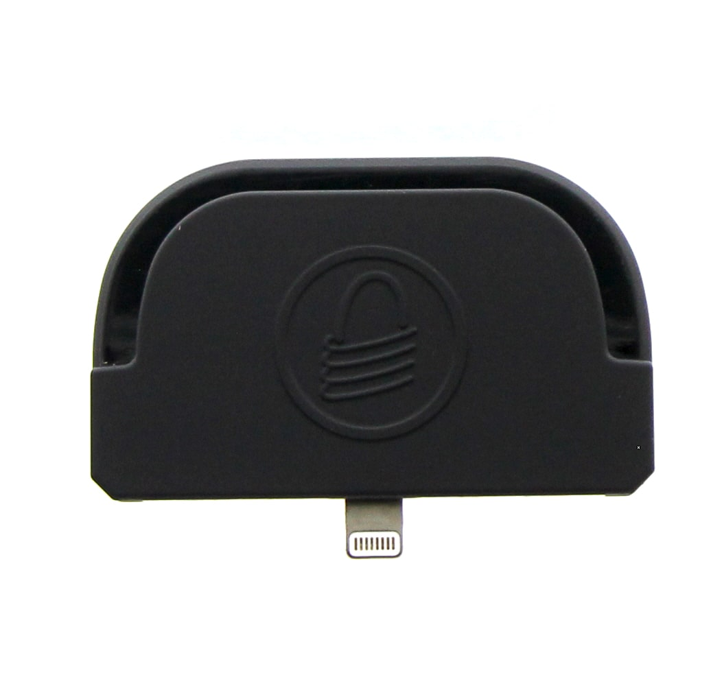

# iDynamo 5 Gen II

iDynamo 5 (Gen II) Secure card reader for mobile payments and digital transactions, built for iOS devices. Ready for curbside, drive-thru, and takeout payments. iDynamo 5 (Gen II) now uses a USB-C cable; see picture at bottom of page.

[Installation and Operation Manual](https://www.magtek.com/content/documentationfiles/d99875473.pdf)

[Programmer's Manual](https://www.magtek.com/content/documentationfiles/d998200309.pdf)