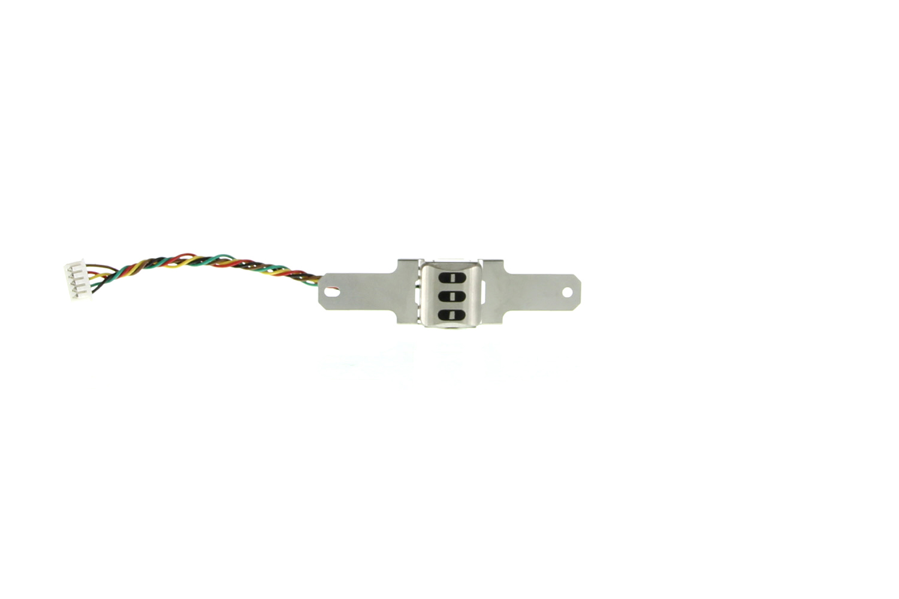

# mDynamo

MagneSafe® IntelliHead is the industry’s first magnetic sensing, media validating, tamper resistant security module. It is more than just a magnetic read head. Built into leading tablets, kiosks, and custom solutions.

[Technical Reference Manual](https://www.magtek.com/content/documentationfiles/d99875494.pdf)

[Programmer's Manual](https://www.magtek.com/content/documentationfiles/d99875258.pdf)