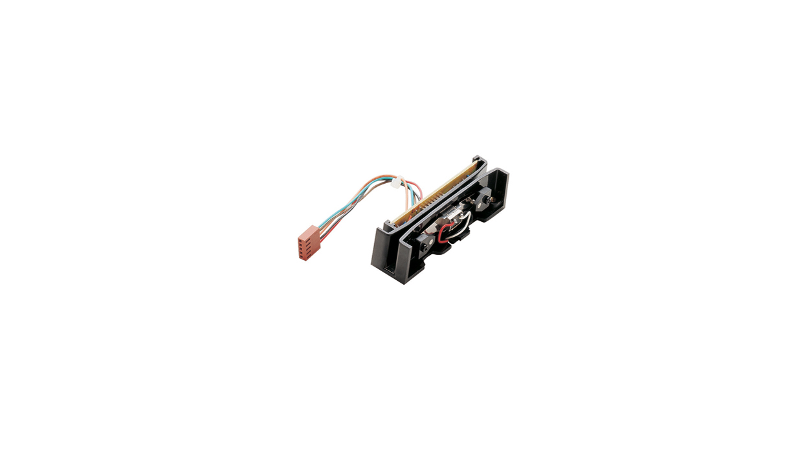

# mDynamo

mDynamo is made for OEM solutions and is an EMV module that connects via USB with two auxiliary ports (SPI and UART)

[Technical Reference Manual](https://www.magtek.com/content/documentationfiles/d99875494.pdf)

[Programmer's Manual](https://www.magtek.com/content/documentationfiles/d998200176.pdf)