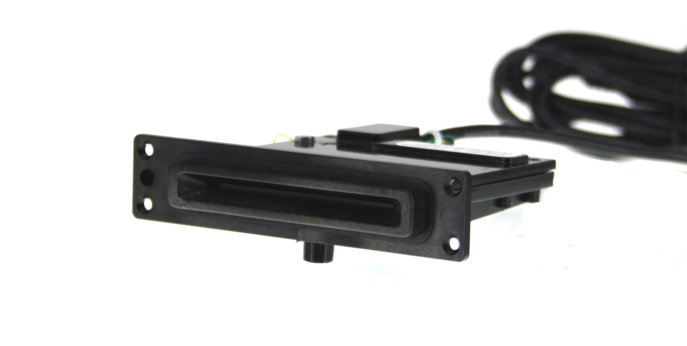

# mDynamo Outdoor Bezel

mDynamo with Outdoor Bezel is an IP34 rated EMV chip card module that is designed for integration into indoor and outdoor, unattended kiosks. (Cable is hardwire attached and included.)

[Installation and Operation Manual](https://www.magtek.com/content/documentationfiles/d998200657.pdf)

[Programmer's Manual](https://www.magtek.com/content/documentationfiles/d998200151.pdf)

