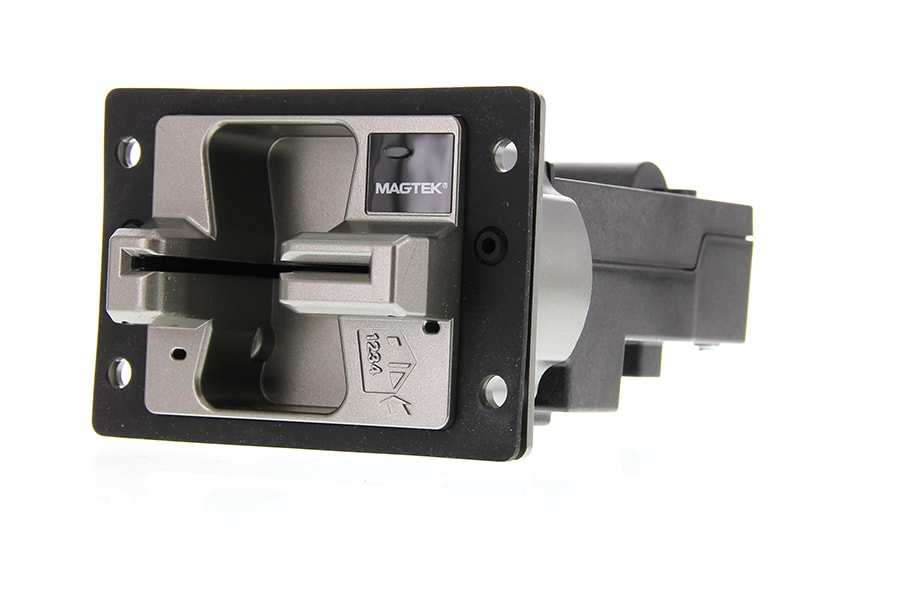

# oDynamo

oDynamo is a MagneSafe® Hybrid insertion secure card reader authenticator that is built for durability and flexibility. oDynamo allows for fast, reliable, and secure reading of magnetic stripe and EMV chip cards and is ready for petrol, kiosk, unattended, and vending applications.

[Installation and Operation Manual](https://www.magtek.com/content/documentationfiles/d998200149.pdf)

[Quick Installation Guide](https://www.magtek.com/content/documentationfiles/d998200307.pdf)

[Device Inspection](https://www.magtek.com/content/documentationfiles/d998200235.pdf)

[How to Clear Debris](https://www.magtek.com/content/documentationfiles/d998200366.pdf)