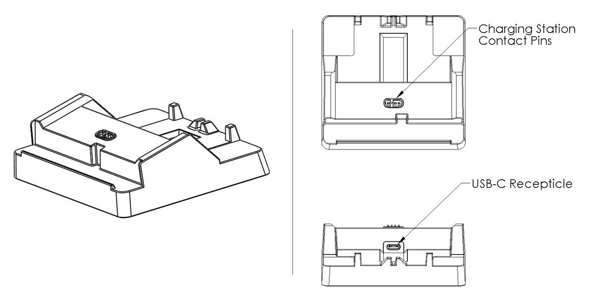
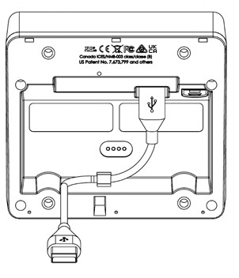
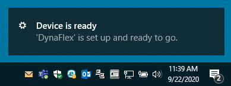

## **DynaFlex II Go Installation and Operation Manual**  
**Secure Card Reader Authenticator**  
### **Installation and Operation Manual**  
**July 2024**  
**Document Number:** D998200554-100  
**REGISTERED TO ISO 9001:2015**

---

# DynaFlex II Go Device Inspection Document

## Table of Contents

- [Introduction](#introduction)
- [Overall Form Factor](#overall-form-factor)
- [Top of Device](#top-of-device)
  - [Payment Methods](#payment-methods)
  - [Chip Card Insertion Slot](#chip-card-insertion-slot)
  - [Swipe Path](#swipe-path)
- [Front Face](#front-face)
  - [Contactless Landing Zone](#contactless-landing-zone)
  - [Barcode Reader (BCR)](#barcode-reader-bcr)
  - [LED Feedback](#led-feedback)
- [Bottom of Device](#bottom-of-device)
- [Right-Facing Side of Device](#right-facing-side-of-device)
- [Back Side of Device](#back-side-of-device)
- [Additional Details and Checklist](#additional-details-and-checklist)
- [Compliance](#compliance)
  - [FCC Information](#fcc-information)
  - [Canadian Declaration of Conformity](#canadian-declaration-of-conformity)
  - [EU Statement](#eu-statement)
  - [RoHS Statement](#rohs-statement)
  - [PCI Statement](#pci-statement)
  - [UKCA Statement](#ukca-statement)

# 1 Introduction

DynaFlex II is a secure card reader authenticator engineered for attended, unattended, and mobile payment environments. The reader features a magnetic stripe reader, EMV chip reader for both contact and contactless cards, an optional barcode reader, and support for NFC-enabled mobile wallets such as Samsung Pay®, Google Pay®, Apple Pay®, and Apple VAS. DynaFlex II communicates with host devices via USB or wireless local area network (WLAN) on pin entry devices (PED). DynaFlex II products are compatible with iOS, Android, and Windows operating systems.

For details on how to set up Google Wallet Smart Tap for DynaFlex II, see *D100006469 DYNAFLEX, DYNAPROX, DYNAFLEX II GO FAMILY - GOOGLE WALLET SMART TAP SETUP GUIDE*. For details on how to set up Apple VAS for DynaFlex II, see *D998200597 DYNAFLEX II GO PROGRAMMER'S MANUAL (COMMANDS)*.

## 1.1 About Terminology

In this document, DynaFlex II products are referred to as the device or inclusively as DynaFlex II products. They are designed to be connected to a host, which is a piece of general-purpose electronic equipment that sends commands and data to, and receives data from, the device. Host types include PC and Mac computers/laptops, tablets, and smartphones. The host must have software installed that communicates with the device and is capable of processing transactions. During a transaction, the host and its software interact with the operator, such as a customer service representative, while the device interacts with the cardholder (even if the cardholder is using a virtual representation of the card account, such as a smartphone).

Throughout this document:
- **DynaFlex II Product Family** refers to all devices in the DynaFlex II family, including all DynaFlex II models and DynaFlex II PED models.
- **DynaFlex II PED** refers to DynaFlex II PED products with a display, including those with a kiosk back cover and barcode reader.
- **DynaFlex II** refers to DynaFlex II devices that are not equipped with a touchscreen display, including those with a kiosk back cover and barcode reader.

## 1.2 Magensa Services

DynaFlex II products can be paired with Magensa Services to make the certification cycle easier and remove unencrypted data from the payment environment. A service representative will collaborate with you to determine if Magensa Decrypt, Magensa Decrypt and Forward, or the Magensa Payment Protection Gateway is best for you.

## 1.3 MagTek Support

MagTek offers developer tools, including free software developer kits with APIs. Support is available at [https://www.magtek.com/support](https://www.magtek.com/support). For faster development, use MagneFlex Prism, a suite of interface tools for browser and middleware applications that streamline the development process. Instead of creating multiple interfaces for the hardware device, POS application, and gateway, you can use MagneFlex. It drives the hardware, interfaces with the POS app, and handles data processing commands.

---

## 1.4 Available Models and Accessories

### Table 1-1 - Available Models and Options

| Part No.   | Description                                                        | Display       | Connection(s)        |
|------------|--------------------------------------------------------------------|---------------|----------------------|
| 21078307   | DYNAFLEX II, PCI, BLACK, USB                                       | None          | USB-C                |
| 21078309   | DYNAFLEX II PED, PCI, TOUCHSCREEN DISPLAY, BLACK, USB              | Touchscreen   | USB-C                |
| 21078311   | DYNAFLEX II PED, PCI, TOUCHSCREEN DISPLAY, BLACK, WLAN             | Touchscreen   | USB-C, Wireless LAN  |
| 21078314   | DYNAFLEX II KIOSK, PCI, BCR, BLACK, USB                            | None          | USB-C                |
| 21078321   | DYNAFLEX II PED, KIOSK, PCI, TOUCHSCREEN DISPLAY, BLACK, USB       | Touchscreen   | USB-C                |
| 21078322   | DYNAFLEX II, KIOSK, PCI, BLACK, USB                                | None          | USB-C                |
| 21078325   | DYNAFLEX II PED, KIOSK, PCI, TOUCHSCREEN DISPLAY, BLACK, WLAN      | Touchscreen   | USB-C, Wireless LAN  |
| 21078331   | DYNAFLEX II, PCI, BCR, BLACK, USB                                  | None          | USB-C                |
| 21078332   | DYNAFLEX II PED, PCI, TOUCHSCREEN DISPLAY, BCR, BLACK, WLAN        | Touchscreen   | USB-C, Wireless LAN  |
| 21078333   | DYNAFLEX II PED, PCI, TOUCHSCREEN DISPLAY, BCR, BLACK, USB         | Touchscreen   | USB-C                |
| 21078334   | DYNAFLEX II PED, KIOSK, PCI, TOUCHSCREEN DISPLAY, BCR, BLACK, USB  | Touchscreen   | USB-C                |

All models are black by default and have countertop, handheld, and custom mounting options.

### Table 1-2 – DynaFlex II Accessories

| Part #       | Description                                           | Accessory Notes                                  |
|--------------|-------------------------------------------------------|--------------------------------------------------|
| 1000006016   | CABLE, USB A - C, 6FT, DYNAFLEX                       | Included with DynaFlex products                  |
| 1000006017   | CABLE, USB C - C, 6FT, DYNAFLEX                       | Optional, specify in order                       |
| 21078006     | CHARGING STATION, DYNAFLEX                            | Optional, specify in order                       |
| 96700004     | CLEANING CARD, DOUBLE SIDED                           | Optional, specify in order                       |
| 1000008559   | FOOT, BACK, SIDE A, ADHESIVE MOUNTING STRIP, DYNAFLEX | Optional, specify 1 ea. for complete replacement |
| 1000008560   | FOOT, BACK, SIDE B, ADHESIVE MOUNTING STRIP, DYNAFLEX | Optional, specify 1 ea. for complete replacement |
| 1000008561   | FOOT, FRONT, ADHESIVE MOUNTING STRIP, DYNAFLEX        | Optional, specify 1 ea. For complete replacement |

### About DynaFlex II Components
The major components of the DynaFlex II product family are detailed in this section. For models without a touchscreen display (DynaFlex II and DynaFlex II Kiosk), the components are identical however, the touchscreen and its bezel are replaced with a faceplate displaying the contactless indicator logo at the optimal contactless landing zone (see Figure 1-1).

DynaFlex II PED models without a barcode reader are also identical however, the edge incorporating the barcode reader is a single straight line and there is no QR code marking on the face of the device (see Figure 1-2).

Figure 1-3 illustrates the major components of the optional charging station. Note, the charging station is only compatible with non-kiosk models of the device.

Figure 1-3 - Charging Station Major Components

# Inspection, Handling and Storage

Proper handling of the device throughout delivery, assembly, shipping, installation, usage, and maintenance is very important. Not  following the guidelines in this document could damage the device, render it inoperable, and/or violate the conditions of the warranty.

## 2.1 Inspection
Before unpacking the device, it is important to inspect its secure packaging to make sure it has not been tampered with in storage or in transit. MagTek provides details for inspecting the integrity of the device’s secure packaging in D998200524 DynaFlex II Family, 

Package Inspection

It is important to inspect a new device regularly and thoroughly before deployment and a device in live usage (including its immediate surroundings), to make sure malicious individuals have not tampered with it or its surroundings. MagTek recommends conducting inspection training for all device operators and an inspection schedule with checkpoints in place to make sure operators are performing inspections as specified and as scheduled. MagTek provides easy-to-follow device inspection references in D998200524 DynaFlex II PED Products, Device Inspection, D998200539- DynaFlex II PED Kiosk Products, Device Inspection, D998200563 DynaFlex II Products, Device Inspection, and D998200566 DynaFlex II Kiosk Products, Device Inspection.

## 2.2 Handling to Avoid Damage
Upon receiving the device, inspect it to make sure it originated from an authentic source and has not been tampered with. For details, see D998200524 DynaFlex II PED Products, Device Inspection, D998200539 DynaFlex II PED Kiosk Products, Device Inspection, D998200563 DynaFlex II Products, Device Inspection, and D998200566 DynaFlex II Kiosk Products, Device Inspection, available from MagTek.
From device delivery through assembly, shipping, installation, usage, and maintenance, the device must not be exposed to conditions outside the ratings in Appendix A Technical Specifications.

If the device is exposed to cold temperatures, adjust it to warmer temperatures gradually to avoid condensation, which can interfere with the operation of the device or cause permanent damage.

Do not drop or shake the device.
For information about ongoing maintenance of the device, such as cleaning, see section 5 Maintenance.

## Handling to Avoid Accidental Tamper
DynaFlex II products implement active tamper detection, which uses a small amount of electricity even when the device is completely powered off. The device primarily powers its active tamper detection circuitry using its rechargeable battery to back up the coin cell. Devices with a rechargeable battery ship with the battery charged to between 45% and 65%, which provides a shelf life of up to 10 years. However, if the rechargeable battery completely discharges or the device does not contain a rechargeable battery, the device continues to power its active tamper detection circuitry using its non-rechargeable backup battery, which provides an additional 5 years of backup shelf life across the entire life of the device but does not recharge. If the rechargeable battery and the backup battery are both allowed to completely discharge, the device’s tamper detection engages and locks down the device, and it must be returned to the manufacturer to reset.

To avoid accidental tamper events and to optimally condition the battery, follow these precautions:
- Temperature is the most critical factor in extending battery life and preserving battery charge. Store the device at the lowest reasonable temperatures within its specified storage temperature range (see Appendix A Technical Specifications). Storing below 77°F / 25°C is optimal.
- Fully charge the device immediately upon receipt to extend its shelf life (see section 4.6.3 How to Charge the Battery).
- Before storing the device, charge the battery to less than 100% (60% is optimal).
- Before storing the device, power it off completely. See section 4.6.4 How to Power On / Wake Up from Standby Mode / Power Off.
- When stored, charge the device for one hour every 6 months to keep the battery chemistry in optimal condition and to ensure it does not completely discharge.
- Do not drop or shake the device.

# Installation
Installing DynaFlex II products is straightforward: The manufacturer or acquirer configures the preferred settings, keys, terminal, and payment brand settings before deployment; end users need only set up a host with appropriate software, configure the software, and connect the device to the host. This section provides general information about inspecting, connecting, and installing DynaFlex II products.

## About Host Software
In any solution, DynaFlex II products are connected to a host, which must have software installed that can communicate with the device, and which is capable of processing transactions. To set up the host to work with DynaFlex II products, follow the installation and configuration instructions provided by the vendor of the host or the host software. For information about developing custom host software, see section 6 Developing Custom Software.

## Connecting to a Host

### About Connecting to a Host
The following sections provide information on how to connect DynaFlex II products to a host via USB.

### How to Connect DynaFlex II Products to a Host or Charger via USB
 
Figure 3-1 - Connecting to a USB Host or USB Charger. Left: Countertop Models. Right: Kiosk Models

To connect DynaFlex II products to a USB host or charger using the USB-C port, follow these steps (for reference see Figure 3-1 and section 1.5 About DynaFlex II Components):

### 
1. For best results, use the cable that is included with the device or another cable from Table 1-2 – DynaFlex II Accessories on page 
2. These cables are designed specifically for DynaFlex II products and include ferrite shielding at both ends of the cable to reduce emissions and interference. If the solution design requires an alternate cable, contact MagTek for assistance with ferrite selection and placement, and with connector overmold design.
3. Connect the USB-C end of the cable to DynaFlex II or DynaFlex II PED.
4. If you plan to route the cable out the back of the device, route the cable through the cable management clip to change its direction. Even if you are not routing out the back, you may use the cable clip for strain relief, to help stabilize the mechanical connection when cardholders or operators move the device or the cable.
5. Route the cable in the desired direction (e.g., out the back, left, right, down into the countertop, or into the mounting compartment of a kiosk).
6. Connect the other end of the USB cable to the charger or to the host’s USB port.
7. As soon as the device starts receiving power through USB, it automatically powers on.
8. If the specific device serial number you are connecting has not been connected to the host before, the device shows Welcome on the display, and the Windows system tray on the host reports it is Setting up a device (see Figure 3-2 - Setting Up a Device), When installation is complete (approximately 30 seconds later depending on the host), Windows reports Device is ready,(see Figure 3-3 - Device is Ready) and the device shows in Windows Device Manager under Human Interface Devices as two devices: HID-compliant vendor-defined device with VID 0801 and PID 2020, and USB Input Device.

Figure 3-2 - Setting Up a Device

Figure 3-3 - Device is Ready

### 8. Connecting to the Host Operating System via USB

After successfully connecting to the host operating system via USB, devices with a touchscreen display a screen or a customizable graphic.

The operating system may put the device into USB Suspend mode. See [Section 4.6.6: About USB Suspend](#4.6.6-about-usb-suspend).

---

### 3.3 Mounting

#### 3.3.1 About Mounting

The DynaFlex II product line offers versatile mounting solutions, including:

- **Integrated Slip-Resistant Adhesive Strips**:  
  The underside of the device features three adhesive mounting strips (see **Figure 3-4**) that provide secure attachment to any clean, non-porous surface. These strips come with a protective film that must be removed before installation.

  **Figure 3-4**: Adhesive Mounting Strip and Protective Film

- **Lanyard Mount Point**:  
  The integrated mount point allows the device to be hung or carried, making it easy to store and handle, particularly in grab-and-go payment environments (see **Figure 3-5**).

  **Figure 3-5**: Lanyard Mount Point

- **Charging Station Compatibility (Non-Kiosk Models)**:  
  Non-kiosk versions of the device can be placed in an optional charging station. This station can be used in conjunction with the lanyard mount point for quick access and easy drop-in charging between handheld uses.

  **Figure 3-6**: Charging Station Compatibility

- **Custom Mounting Options**:  
  DynaFlex II devices can be attached to custom mounting brackets or housed within an enclosure, enabling integration into larger system designs.

---

#### 3.3.2 How to Mount DynaFlex II

1. Verify that the protective film has been removed from the adhesive mounting strips located on the underside of the device (see **Figure 3-4**).
2. Mount DynaFlex II devices onto a smooth, flat, and non-porous surface by pressing the device firmly using the adhesive mounting strips (see **Figure 3-7**).

   **Figure 3-7**: Mounting DynaFlex onto a Nonporous Surface

3. Do not mount the device on rough, dirty, or uneven surfaces.
4. To uninstall the device, twist it to disengage the mounting feet from the mounting surface.

For instructions on using the optional charging station, refer to [Section 3.3.4: How to Mount the Charging Station](#3.3.4-how-to-mount-the-charging-station).

If your installation requires custom mounting brackets, contact your MagTek representative for design advice and assistance from MagTek’s Engineering team.

---

#### 3.3.3 How to Mount DynaFlex II Kiosk Models

This document describes how to use DynaFlex II Kiosk models securely. Using the device in any way other than the approved methods described in this document invalidates the PCI PTS POI approval of the device.

> **Note:** Not following the guidelines in this section could damage the device, render it inoperable, and/or violate the conditions of the warranty.

This section provides information and guidelines for designing the mechanical aspects of a solution that incorporates DynaFlex II Kiosk models. MagTek strongly recommends vetting and testing solution designs before finalizing and deploying them to ensure the design meets all requirements (e.g., functional, legal, security, certification, safety, and so on).

When designing the mechanical portions of a solution that incorporates DynaFlex II Kiosk models, consider the following:

- Review [Section 1.5: About DynaFlex II Components](#1.5-about-dynaflex-ii-components) for an introduction to the device’s physical features.
- Review **Appendix A: Technical Specifications**.
- Review the overall device dimensions and mounting hole locations detailed below.
- Determine device orientation. The device supports all four orientations.
- Review additional requirements from other agencies, such as PCI and EMV solution certification requirements.

---

**Figures and Tables for Reference:**

- **Figure 3-8**: DynaFlex II Kiosk Models Overall Dimensions
- **Figure 3-9**: Mounting Hole Locations
- **Figure 3-10**: Unobstructed View of Card Insertion Slot, Swipe Path, and Contactless Landing Zone
