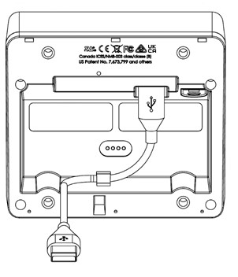

## **DynaFlex II Installation and Operation Manual**  
**Secure Card Reader Authenticator**  
### **Installation and Operation Manual**  
**July 2024**  
**Document Number:** D998200554-100  
**REGISTERED TO ISO 9001:2015**

---

# Introduction

DynaFlex II is a secure card reader authenticator engineered for attended, unattended, and mobile payment environments. The reader features a magnetic stripe reader, EMV chip reader for both contact and contactless cards, an optional barcode reader, and support for NFC-enabled mobile wallets such as Samsung Pay®, Google Pay®, Apple Pay®, and Apple VAS. DynaFlex II communicates with host devices via USB or wireless local area network (WLAN) on pin entry devices (PED). DynaFlex II products are compatible with iOS, Android, and Windows operating systems.

For details on how to set up Google Wallet Smart Tap for DynaFlex II, see D100006469 DYNAFLEX, DYNAPROX, DYNAFLEX II GO FAMILY - GOOGLE WALLET SMART TAP SETUP GUIDE. For

details on how to set up Apple VAS for DynaFlex II, see D998200597 DYNAFLEX II GO PROGRAMMER'S MANUAL (COMMANDS).

### About Terminology

In this document, DynaFlex II products are referred to as the device or inclusively as DynaFlex II products. They are designed to be connected to a host, which is a piece of general-purpose electronic equipment which sends commands and data to, and receives data from, the device. Host types include PC and Mac computers/laptops, tablets, and smartphones. The host must have software installed that communicates with the device and is capable of processing transactions. During a transaction, the host and its software interact with the operator, such as a customer service representative, while the device interacts with the cardholder (even if the cardholder is using a virtual representation of the card account, such as a smartphone).

Throughout this document:

DynaFlex II Product Family refers to all devices in the DynaFlex II family, including all DynaFlex II models and DynaFlex II PED models.

DynaFlex II PED refers to DynaFlex II PED products with a display, including those with a kiosk back cover and barcode reader.

DynaFlex II refers to DynaFlex II devices that are not equipped with a touchscreen display, including those with a kiosk back cover and barcode reader.

### Magensa Services

DynaFlex II products can be paired with Magensa Services to make the certification cycle easier and remove unencrypted data from the payment environment. A service representative will collaborate with you to determine if Magensa Decrypt, Magensa Decrypt and Forward, or the Magensa Payment Protection Gateway is best for you.

### MagTek Support

MagTek offers developer tools, including free software developer kits with APIs. Support is available at  For faster development, use MagneFlex Prism, a suite of interface tools for browser and middleware applications that streamline the development process. Instead of creating multiple interfaces for the hardware device, POS application, and gateway, you can use MagneFlex. It drives the hardware, interfaces with the POS app, and handles data processing commands.

### Available Models and Accessories

Table 1-1 - Available Models and Options

| Part No.  | Description                                               | Display     | Connection(s)      |
|-----------|-----------------------------------------------------------|-------------|--------------------|
| 21078307  | DYNAFLEX II, PCI, BLACK, USB                              | None        | USB-C              |
| 21078309  | DYNAFLEX II PED, PCI, TOUCHSCREEN DISPLAY, BLACK, USB     | Touchscreen | USB-C              |
| 21078311  | DYNAFLEX II PED, PCI, TOUCHSCREEN DISPLAY, BLACK, WLAN    | Touchscreen | USB-C, Wireless LAN|
| 21078314  | DYNAFLEX II KIOSK, PCI, BCR, BLACK, USB                   | None        | USB-C              |
| 21078321  | DYNAFLEX II PED, KIOSK, PCI, TOUCHSCREEN DISPLAY, BLACK, USB | Touchscreen | USB-C              |
| 21078322  | DYNAFLEX II, KIOSK, PCI, BLACK, USB                       | None        | USB-C              |
| 21078325  | DYNAFLEX II PED, KIOSK, PCI, TOUCHSCREEN DISPLAY, BLACK, WLAN | Touchscreen | USB-C, Wireless LAN|
| 21078331  | DYNAFLEX II, PCI, BCR, BLACK, USB                         | None        | USB-C              |
| 21078332  | DYNAFLEX II PED, PCI, TOUCHSCREEN DISPLAY, BCR, BLACK, WLAN | Touchscreen | USB-C, Wireless LAN|
| 21078333  | DYNAFLEX II PED, PCI, TOUCHSCREEN DISPLAY, BCR, BLACK, USB | Touchscreen | USB-C              |
| 21078334  | DYNAFLEX II PED, KIOSK, PCI, TOUCHSCREEN DISPLAY, BCR, BLACK, USB | Touchscreen | USB-C              |

**Note:** All models are black by default and have countertop, handheld, and custom mounting options.

Table 1-2 – DynaFlex II Accessories

| Part #       | Description                                               | Accessory Notes                               |
|--------------|-----------------------------------------------------------|-----------------------------------------------|
| 1000006016  | CABLE, USB A - C, 6FT, DYNAFLEX                          | Included with DynaFlex products              |
| 1000006017  | CABLE, USB C - C, 6FT, DYNAFLEX                          | Optional, specify in order                   |
| 21078006    | CHARGING STATION, DYNAFLEX                               | Optional, specify in order                   |
| 96700004    | CLEANING CARD, DOUBLE SIDED                              | Optional, specify in order                   |
| 1000008559  | FOOT, BACK, SIDE A, ADHESIVE MOUNTING STRIP, DYNAFLEX    | Optional, specify 1 ea. for complete replacement |
| 1000008560  | FOOT, BACK, SIDE B, ADHESIVE MOUNTING STRIP, DYNAFLEX    | Optional, specify 1 ea. for complete replacement |
| 1000008561  | FOOT, FRONT, ADHESIVE MOUNTING STRIP, DYNAFLEX           | Optional, specify 1 ea. For complete replacement |

### About DynaFlex II Components

The major components of the DynaFlex II product family are detailed in this section. For models without a touchscreen display (DynaFlex II and DynaFlex II Kiosk), the components are identical however, the touchscreen and its bezel are replaced with a faceplate displaying the contactless indicator logo at the optimal contactless landing zone (see ).

Figure 1-1 - DynaFlex II Major components

DynaFlex II PED models without a barcode reader are also identical however, the edge incorporating the barcode reader is a single straight line and there is no QR code marking on the face of the device (see ).

Figure 1-2 - DynaFlex II PED BCR Major Components

illustrates the major components of the optional charging station. Note, the charging station is only compatible with non-kiosk models of the device.

Figure 1-3 - Charging Station Major Components

### Inspection, Handling and Storage ###

## Inspection

Before unpacking the device, it is important to inspect its secure packaging to make sure it has not been tampered with in storage or in transit. MagTek provides details for inspecting the integrity of the device’s secure packaging in D998200524 DynaFlex II Family, Package Inspection

It is important to inspect a new device regularly and thoroughly before deployment and a device in live usage (including its immediate surroundings), to make sure malicious individuals have not tampered with it or its surroundings. MagTek recommends conducting inspection training for all device operators and an inspection schedule with checkpoints in place to make sure operators are performing inspections as specified and as scheduled. MagTek provides easy-to-follow device inspection references in D998200524 DynaFlex II PED Products, Device Inspection, D998200539- DynaFlex II PED Kiosk Products, Device Inspection, D998200563 DynaFlex II Products, Device Inspection, and D998200566 DynaFlex II Kiosk Products, Device Inspection.

## Handling to Avoid Damage

Upon receiving the device, inspect it to make sure it originated from an authentic source and has not been tampered with. For details, see D998200524 DynaFlex II PED Products, Device Inspection, D998200539 DynaFlex II PED Kiosk Products, Device Inspection, D998200563 DynaFlex II Products, Device Inspection, and D998200566 DynaFlex II Kiosk Products, Device Inspection, available from MagTek.

From device delivery through assembly, shipping, installation, usage, and maintenance, the device must not be exposed to conditions outside the ratings in  .

If the device is exposed to cold temperatures, adjust it to warmer temperatures gradually to avoid condensation, which can interfere with the operation of the device or cause permanent damage. Do not drop or shake the device.

For information about ongoing maintenance of the device, such as cleaning, see section  .

## Handling to Avoid Accidental Tamper

DynaFlex II products implement active tamper detection, which uses a small amount of electricity even when the device is completely powered off. The device primarily powers its active tamper detection circuitry using its rechargeable battery to back up the coin cell. Devices with a rechargeable battery ship with the battery charged to between 45% and 65%, which provides a shelf life of up to 10 years.

However, if the rechargeable battery completely discharges or the device does not contain a rechargeable battery, the device continues to power its active tamper detection circuitry using its non-rechargeable backup battery, which provides an additional 5 years of backup shelf life across the entire life of the device but does not recharge. If the rechargeable battery and the backup battery are both allowed to completely discharge, the device’s tamper detection engages and locks down the device, and it must be returned to the manufacturer to reset.

To avoid accidental tamper events and to optimally condition the battery, follow these precautions:

- Temperature is the most critical factor in extending battery life and preserving battery charge. Store the device at the lowest reasonable temperatures within its specified storage temperature range (see  ). Storing below 77°F / 25°C is optimal.
- Fully charge the device immediately upon receipt to extend its shelf life (see section   ).
- Before storing the device, charge the battery to less than 100% (60% is optimal).
- Before storing the device, power it off completely. See section   .
- When stored, charge the device for one hour every 6 months to keep the battery chemistry in optimal condition and to ensure it does not completely discharge.
- Do not drop or shake the device.

# Installation

Installing DynaFlex II products is straightforward: The manufacturer or acquirer configures the preferred settings, keys, terminal, and payment brand settings before deployment; end users need only set up a host with appropriate software, configure the software, and connect the device to the host. This section provides general information about inspecting, connecting, and installing DynaFlex II products.

## About Host Software

In any solution, DynaFlex II products are connected to a host, which must have software installed that can communicate with the device, and which is capable of processing transactions. To set up the host to work with DynaFlex II products, follow the installation and configuration instructions provided by the vendor of the host or the host software. For information about developing custom host software, see section.

## Connecting to a Host

#### About Connecting to a Host

The following sections provide information on how to connect DynaFlex II products to a host via USB.

#### How to Connect DynaFlex II Products to a Host or Charger via USB

 

Figure 3-1 - Connecting to a USB Host or USB Charger. Left: Countertop Models. Right: Kiosk Models

To connect DynaFlex II products to a USB host or charger using the USB-C port, follow these steps (for reference see  and section  ):

For best results, use the cable that is included with the device or another cable from   on page  These cables are designed specifically for DynaFlex II products and include ferrite shielding at both ends of the cable to reduce emissions and interference. If the solution design requires an alternate cable, contact MagTek for assistance with ferrite selection and placement, and with connector overmold design.

Connect the USB-C end of the cable to DynaFlex II or DynaFlex II PED.

If you plan to route the cable out the back of the device, route the cable through the cable management clip to change its direction. Even if you are not routing out the back, you may use the cable clip for strain relief, to help stabilize the mechanical connection when cardholders or operators move the device or the cable.

Route the cable in the desired direction (e.g., out the back, left, right, down into the countertop, or into the mounting compartment of a kiosk).

Connect the other end of the USB cable to the charger or to the host’s USB port.

As soon as the device starts receiving power through USB, it automatically powers on.

If the specific device serial number you are connecting has not been connected to the host before, the device shows on the display, and the Windows system tray on the host reports it is Setting up a device (see ), When installation is complete (approximately 30 seconds later depending on the host), Windows reports	,(see) and the device shows in Windows Device Manager under Human.

Figure 3-2 - Setting Up a Device

Figure 3-3 - Device is Ready

After successfully connecting to the host operating system via USB, devices with a touchscreen

display a	screen or a customizable graphic.

The operating system may put the device into USB Suspend mode. See section

### Mounting

#### About Mounting

The DynaFlex II product line offers versatile mounting solutions, including:

Integrated Slip-Resistant Adhesive Strips: The underside of the device features three adhesive mounting strips (see ) that provide secure attachment to any clean, non-porous surface. These strips come with a protective film that must be removed before installing onto a surface.

Figure 3-4 - Adhesive Mounting Strip and Protective Film

Lanyard Mount Point: The integrated mount point allows the device to be hung or carried, making it easy to store and handle, particularly in grab-and-go payment environments (see  ).

Figure 3-5 - Lanyard Mount Point

Charging Station Compatibility (Non-Kiosk Models): Non-kiosk versions of the device can be placed in an optional charging station. This station can be used in conjunction with the lanyard mount point for quick access and easy drop-in charging between handheld uses.

Figure 3-6 - Charging Station Compatibility

Custom Mounting Options: DynaFlex II devices can be attached to custom mounting brackets or housed within an enclosure, enabling integration into larger system designs.

#### How to mount DynaFlex II

Verify that the protective film has been removed from the adhesive mounting strips located on the underside of the device (see ).

Mount DynaFlex II devices onto a smooth, flat, and non-porous surface by pressing the device firmly using the adhesive mounting strips (see ).

Figure 3-7 - Mounting DynaFlex onto a Nonporous Surface

Do not mount the device on rough, dirty, or uneven surfaces.

To uninstall the device, twist it to disengage the mounting feet from the mounting surface.

For instructions on using the optional charging station, refer to Section

If your installation requires custom mounting brackets, contact your MagTek representative for design

advice and assistance from MagTek’s Engineering team.

#### How to Mount DynaFlex II Kiosk Models

This section provides information and guidelines for designing the mechanical aspects of a solution that incorporates DynaFlex II Kiosk models. MagTek strongly recommends vetting and testing solution designs before finalizing and deploying them to make sure the design meets all requirements (e.g., functional, legal, security, certification, safety, and so on).

When designing the mechanical portions of a solution that incorporates DynaFlex II Kiosk models, consider the following:

Review section   for an overall introduction to the device’s

physical features and what they are called.

##### Review  .

Review the information below about overall device dimensions and mounting hole locations and use.

Determine device orientation. The device supports all four orientations.

Review any additional requirements from other agencies, such as PCI and EMV solution certification requirements, safety ordinances, and so on, which may introduce additional constraints to the design.

Overall dimensions of the device are shown in  and  On request, MagTek can provide a 3D model of the device’s envelope to assist with the mechanical portion of solution design. MagTek strongly recommends building and testing prototypes with actual devices before finalizing the solution design.

Figure 3-8 – DynaFlex II Kiosk Models Overall Dimensions

The screw hole placement on the bottom of DynaFlex II Kiosk models is detailed in . The holes are designed to accommodate screw size M4 x 0.7mm and a maximum screw depth of 0.315 inches (8mm). The recommended torque range for installing the screws is 20 to 22 in-lbs. (2.3 to 2.5 N-m).

Figure 3-9 – DynaFlex II Kiosk Models Mounting Hole Locations

When designing an enclosure or mounting bracket, make sure there is adequate clearance for cardholders to swipe, insert, and tap. If the solution design includes metal objects anywhere near the device, including metal enclosures, ensure that at all points the metal is no further forward than 15mm below the top face of the device. Proximity to metal can adversely affect the device’s performance.

Figure 3-10 - Unobstructed View of Card Insertion Slot, Swipe Path and Contactless Landing Zone

As a security measure, the device must be installed such that cardholders have a full, unobstructed view of the housing around the card insertion slot opening (“entry zone”) and MSR swipe path prior to insertion or swipe (see

). This is to allow cardholders to easily detect suspicious objects in or around the swipe path and card slot entry, such as bugs / skimmers / tapping mechanisms, and their wires or antennas. Be sure to select an installation height and mounting angle that meet this requirement.

#### How to Mount the Charging Station

To mount the optional charging station to a countertop using the four adhesive mounting strips on the underside of the charging station (see ), follow these steps:

Determine where the charging station will be placed.

Remove the adhesive strip protective film, ensure the mounting surface is a clean, smooth, and flat surface. It is important to avoid rough, dirty, or uneven surfaces.

Consider the cable length, cardholder and operator ergonomics, and access for cleaning, maintenance, and repair.

If the charging station will be used for charging in handheld operations, unobstructed connection and disconnection of the device from the charging station is also a consideration.

Connect the charging station to a USB port or to a USB charger with a minimum of 1A current capability. For the best results, use the cable that is included with the device. It includes shielding at both ends of the cable to reduce interference.

To uninstall, twist the charging station to disengage the adhesive mounting strips from any surface.

Note: The adhesive mounting strips used to mount the charging station to a surface may become less effective if dust and or debris accumulate on them. If this occurs, wipe them down with a damp cloth to restore their adhesive properties.

Figure 3-11 - Charging Station Dimensions

Figure 3-12 - Charging Station Mounting Surfaces and Screw Holes

To mount the charging station to a countertop, table, or flat surface using the screw holes on the underside of the charging station (see ), follow these steps:

Determine where the charging station will be installed.

Mark the location of the screw holes by placing the device over the area where it is to be installed (see ).

Once the appropriate measurements have been taken and marked, drill the screw holes into the installation surface.

Using (2) M4 x 0.7mm thread pitch (not included) screws, screw up through the drilled holes in the mounting surface, see .

Connect the charging station to a USB port or to a USB charger with a minimum of 1A current capability. For the best results, use the cable that is included with the device. It includes shielding at both ends of the cable to reduce interference.

To uninstall, remove the screws from the underside of the charging station.

Figure 3-13 – Preparing a Flat Surface for Mounting the Charging Station

Figure 3-14 - Screw Installation

Figure 3-15 – Connecting DynaFlex II to the Optional Charging Station

# Operation

### About Operating Modes

While in use, the DynaFlex II family of products switch between distinct operating modes. It is crucial for operators to comprehend these modes to effectively operate the device:

Powered Off Mode is the shipping and storage mode of the device. Operators would not generally use this mode during a work shift or during off-shift recharging. It occurs when the operator holds the pushbutton for more than 8 seconds (or more than 12 seconds to force immediate power off without a proper shutdown sequence), or if the device’s battery is critically low and the device is not connected to a USB power source. In this mode, the device consumes practically no power. To move the device from Powered Off Mode to Active Mode, press the pushbutton for one second with the battery charged, or connect the device to USB power. If the device is already connected to USB power when it enters Powered Off Mode, it automatically powers back on.

Reset Mode is a transient mode where the device first transitions to Powered Off Mode, then automatically powers back on. It occurs when the operator presses the recessed switch, or the host sends the Reset Device command, or the device automatically performs a daily security reset.

USB Suspend Mode occurs when the USB host that is providing power to the device sends a USB Suspend control event to the device to conserve power. The device responds by powering off nearly all its modules including the display and listening for the USB host to send a USB Resume control event. To move the device from USB, Suspend Mode to Active Mode, the host software must open a USB connection to communicate with the device, which signals the operating system that the device is in active use and should be allowed to draw full power from the USB port. It is not necessary for the host software to send commands to the device at that time.

Active Mode is the device’s normal “awake” state when it is in use. In this mode, the touchscreen display and LEDs are powered on, and the device is ready to receive commands from the host. This mode can be divided into substates like Active/Host Not Connected, Active/Host Connected, Active/Host Communicating, Active/Armed for Read, Active/Reading, and so on. These substates differ in the amount of power they consume and are mostly under the control of the host software. To move the device from Active Mode to Powered Off mode, press and hold the pushbutton for 8 seconds. If the device does not respond, continue holding the pushbutton for longer than 12 seconds to force immediate power off without a proper shutdown sequence. To move the device from Active Mode to Reset Mode, press the recessed switch.

### Operation Overview

During normal operation, the operator initiates a transaction from the host, and the cardholder interacts with the device. Devices with a touchscreen display provide on-screen prompts and interactive features such as buttons and signature capture.

Transaction types may include sales, refunds, voids, authorization, new accounts, teller window applications, checking, savings, mortgages, retail transactions, or any other type of transaction where there is interaction between the cardholder and the operator. For each transaction type, the host software can direct the device to prompt the cardholder for any combination of magnetic stripe swipe, EMV contact card insertion, and/or contactless payment tap, and the transaction flow on the device may differ depending on what the host software specifies and what the cardholder does. Section    provides examples of the cardholder experience for each type of payment.  shows a typical point of sale (POS) transaction sequence.

If the device cannot read payment data, the host software may direct it to prompt the cardholder to repeat the action or request the cardholder revert to a different form of payment (such as using the magnetic stripe reader as a fallback instead of the chip card insertion slot).

Figure 4-1 - Typical Transaction Sequence

### About the Status LEDs

DynaFlex II provides four RGB LEDs directly below the chip card insertion slot (see section   ), numbered LED1 through LED4, which report the device’s current operating status.

The meaning of each LED depends on the device’s operating mode. See section    and   Most of the time, operators will check the device’s status using the LEDs when it is in Active Mode while the device is not performing a transaction.

LED colors have specific meanings, as described in . They are based on international conventions for traffic light colors, with additional colors reserved for unusual / special cases.

LED blinking patterns have specific meanings as well, as described in . A blinking LED means the device is actively doing something to change the state that the LED is indicating and solid indicates a persistent state that would require an operator or cardholder to take action to change. One major exception is a device-wide functional failure state, such as a tamper state, where all LEDs flash urgently to call the attention of an advanced operator to intervene.

In this manual, specific combinations of LED colors and blinking patterns are described in more detail in the sections where they are relevant and use the same icons in the tables below to indicate color and blinking patterns. For example, information about how the LEDs show the device’s connection status is in section  .

### Table 4-1 – DynaFlex II LED Allocation

| **In This Context**                        | **LED1**          | **LED2**         | **LED3**         | **LED4**           |
|--------------------------------------------|--------------------|-------------------|-------------------|---------------------|
| Active Mode: Not Armed for a Tap Transaction | Power             | Connection        | Reserved          | Card Read Result    |
| Active Mode: Armed for a Tap Transaction    | Armed for Tap      | Tap Read Progress | Tap Read Progress | Card Read Result    |
| Device-Wide Failure                         | During major failures (such as tamper), LED1-LED4 report the nature of the failure based on the steps required to resolve it. |

### Table 4-2 – DynaFlex II LED Colors

| **Color**       | **Means**                                                                                  |
|------------------|-------------------------------------------------------------------------------------------|
| **Red**         | Stop or stopped. Example: LED1 is red. Stop using the device: Battery is about to run out of charge. |
| **Yellow**      | Wait or waiting. Example: LED2 will show status for Access Point connection: Green connected, yellow waiting for connection. |
| **Green**       | Go, going, or went. Example: LED3 will show status for WebSocket connection: Green connected, yellow waiting for connection. |
| **Other Colors** | Reserved.                                                                                |

### Table 4-3 – DynaFlex II LED Patterns

| **Pattern**   | **Means**                                                                                                                        |
|---------------|----------------------------------------------------------------------------------------------------------------------------------|
| **Solid**      | Solid LEDs require an operator or cardholder to take action to change the state the LED is reporting.                            |
|               | *Example*: Host is connected. Cardholder or host would have to disconnect.                                                      |
|               | *Example*: Host is disconnected. Host would have to initiate connection.                                                        |
| **Blinking**   | Blinking LEDs indicate the device is in the process of doing/attempting something. Blink duty cycle and period show urgency or progress. |
|               | *Example*: Device is attempting to connect to the WLAN access point.                                                           |
| **Short Time** | LEDs sometimes illuminate briefly to indicate a process has ended (success or failure) and the device is transitioning to another state. |
|               | *Example*: Successful card read.                                                                                               |

### About the Touchscreen Display

This section applies only to DynaFlex II PED models, which are equipped with a display and touchscreen. When using a DynaFlex II model that does not have a display, the device reports ongoing status to the host, which must present any necessary prompts and status information to the operator and / or the cardholder.

#### Welcome Page / Active Idle Page

When the device is powered on, in Active mode, and idle (not performing a transaction or displaying

host-driven user interface prompts), it displays	or a custom graphic if it is configured to do so.

If the host software is designed to receive and respond to cardholder input messages, pressing any area on the touchscreen when it is idle may trigger the host to perform an operation, such as starting a transaction. For more information about custom graphics, see D998200383 DynaFlex and DynaFlex Pro Programmer’s Manual (COMMANDS).

WLAN enabled devices also report current status in a set of icons at the top of the	screen.

below shows the icons and describes their meanings. For example, in , the device is connected to a USB host and wireless access point, TLS is enabled, the battery level is OK, the device is charging, and it is idle, waiting for the host to initiate a transaction.

Table 4-4 – Status Icon Meaning

Figure 4-2 - Welcome Page Examples

The device may show text other than “Welcome” when it is Active / idle under certain conditions:

indicates the device has detected an attempt to tamper with it (for example, physical tampering, out-of-spec temperature range, electrical attack). If this occurs, remove the device from service and set it aside in a secure location for possible forensic analysis, and contact the manufacturer or your reseller for support. This mode can only be reset in the manufacturing facility.

indicates the device’s tamper detection system is not activated. The device is not configured properly. If this occurs, remove the device from service and contact the manufacturer or your reseller for support.

indicates the device’s data security features have not been activated. The device is not configured properly. If this occurs, remove the device from service and contact the manufacturer or your reseller for support.

indicates the device is ready to have keys injected. If this occurs, remove the device from service and contact the manufacturer or your reseller for support.

indicates the device cannot detect one or more of its installed modules. This may indicate a mechanical or electrical failure. If this occurs, remove the device from service and contact the manufacturer or your reseller for support.

indicates the device is missing one of the encryption keys that are critical to its data security systems. The device needs to have keys properly injected. If this occurs, remove the device from service and contact the manufacturer or your reseller for support.

without any clarifying text indicates the device is not ready for normal operation.

#### Device Information Page

While powering on, the touchscreen briefly displays a page of information about the device, including the installed firmware part numbers and versions and other identifying information. To determine a device’s PCI certification status, compare the contents of this screen to the device’s listing on  Approved PTS Devices. Note that in PCI listings, lowercase “x” is a wildcard meaning ‘any single character.

Figure 4-3 - Device Information Screen

To view details pertinent to the device’s PCI certification status on WLAN enabled devices - including the installed firmware part numbers and versions as well as other identifying information (see ) complete the following actions:

While on the

screen, press the

and hold for 3 beeps to access the

menu, then select Firmware and

to return to the

screen, select

and

Figure 4-4 - Device Information Screen for WLAN device

#### Connection Status Page

In addition to the icons at the top of the display, WLAN enabled devices have a

screen

that reports more details about the device’s 802.11 wireless (see ) connection. To access it,

while on the

screen, press the

and hold for three beeps to get to the

menu, then select Connection , and	, then select WLAN Status . To return to the

screen, select	and

Figure 4-5 - WLAN Status Screen

#### SoftAP Page

To configure WLAN enabled devices via SoftAP mode (see ) complete the following steps:

While on the

screen, press the

and hold for three beeps to get to the

​

​

​

To return to the	screen, select

Figure 4-6 – SoftAP Mode screen

### About Sounds

DynaFlex II products are equipped with an audio transducer (audible signal) that provides feedback to operators and cardholders about the internal state of the device:

The device sounds one short beep after it has successfully read a contactless tap, and the cardholder can safely remove the card or device from the contactless landing zone.

The device emits short beeps continuously when a transaction is complete, but the card is still present in the insertion slot.

The device emits two beeps when reading a card or contactless payment device to indicate that a read error has occurred.

The device sounds two beeps when an operator cancels a pending EMV transaction.

The device provides an internal setting the host can use to adjust the global system volume. The device does not provide an interface to change the volume setting directly via buttons or the touchscreen. If the device is too quiet or too loud:

Make sure the device is ordered from the manufacturer with the desired volume setting.

Check to see whether the host software you are using provides a feature to check and/or adjust the volume setting.

If the host software does not provide that feature, request help from the development team that built the host software to check / change the volume setting. For details, see D998200383 DYNAFLEX PRODUCTS PROGRAMMER’S MANUAL (COMMANDS).

#### How to Play a Sequence of Tones

DynaFlex II devices can play a customizable sequence of tones if configured to do so. To play a sequence of tones, follow these steps:

Make sure the device is in idle state.

Send a Buzzer command to the device to play a sequence of tones. For details, see D998200383 DYNAFLEX PRODUCTS PROGRAMMER’S MANUAL (COMMANDS).

### Power Management

#### About Power

This device incorporates a built-in Lithium-ion rechargeable battery, which requires little maintenance. It is not subject to “charge memory” and therefore does not require deep discharge cycles to restore its charge capacity like many other battery technologies.

When properly powered through its USB port, the device powers on automatically, remains powered on provided the host does not put it in USB Suspend mode, and draws power both for operation and for recharging the battery (see section  ). While charging, the device consumes more power from the USB connection than when the battery is fully charged. The device stops charging the battery when it determines it is optimally full, to prevent overcharging.

If the device is not connected to USB power, or if the USB connection does not provide enough power, the device powers itself using the rechargeable battery. When the battery discharges to a critically low level, the device powers down automatically. It is important to not allow the device’s main battery to remain completely discharged any longer than necessary. For information about how to prevent this from occurring during handling and storage, see section  . To prevent this from occurring during regular use:

Do not allow the device’s main battery to remain completely discharged for prolonged periods of time, and ideally do not allow it to ever reach 0%. Create a charging schedule that recharges the battery well before it is fully depleted.

When the device is not connected to USB power, preserve the battery’s charge when it is not in use by putting the device into Sleep mode or powering it off completely (see section   ).

The device’s rechargeable battery is designed to last hundreds of charging cycles, but with time and / or with use, its charge capacity will naturally degrade. Following the recommendations in this section will maintain the battery’s charge capacity for as long as possible.

#### How to Check Battery Level

When powered on, DynaFlex II starts in the idle / waiting state and shows a	page on the

touchscreen. See  . This page indicates battery level and charge status on the top right corner of the screen. See

Figure 4-7 Welcome Screen

The table of symbols below describes the various power level and charge status icons. See   Icons.

Table 4-5 - Battery Power Level and Charge Status Icons

#### How to Charge the Battery

DynaFlex II products have an onboard rechargeable battery to supply their own power when not powered through the USB-C port. The battery must be periodically recharged by connecting the device to the optional charging station, or to a USB port or stand-alone USB charger. Both the charging station and the device require a USB power supply that can provide at least 500mA @ 5V, optimally 1A @ 5V.

To charge the device without an optional charging station, connect it to a USB charger or a USB host as described in section   For best results, use the cable that is included with the device; it includes shielding at both ends to reduce interference. When charging, make sure the device is receiving enough power from the USB connection (the battery level should increase even when device is in use). A full recharge cycle for a completely drained battery depends on how it is being charged. From a host USB port at 500mA or dedicated wall charger, full charge takes approximately 7 hours. After connecting the device to a power source, make sure the LEDs indicate the device is charging (see section  ).

To charge the device in the optional charging station for power only (no USB communication):

Make sure the charging station is properly installed and is receiving USB power. See section

Place the device in the charging station with the charging contacts pointing into the charging station and the device’s face pointing toward the ceiling as shown in

Check the device’s LEDs to make sure it is charging.

For important information about the device’s power systems, optimal charging methods during regular use, optimal handling and storage, and other information about keeping the device’s power systems in the best possible condition, see section   and section

#### How to Power On / Wake Up from Standby Mode / Power Off

To power on the device, press and hold the	for one second, or connect the device to USB

power. After powering on, devices with touchscreens show a page of information about the device, then

transition to showing the	page or custom graphics, if they are configured to do so. For more

information about custom graphics, see D998200383 DynaFlex Products Programmer’s Manual

(COMMANDS).

To power off the device, disconnect the device from USB power. To reset the device, see section  .

If all LEDs are off, the device is in Powered Off mode, USB Suspend mode, or Standby mode. For details about reading the status of the device with LEDs, see section   and section

##### 

#### How to Force Reset

To force the device to reset, power it off then power it on again (see section   ). Alternatively, you may use a small tool such as a paperclip

to carefully press the	inside the small hole on the bottom of the device (see section

on page ). The host may also reset the device by sending the Reset Device command (see section  ).

The device also automatically powers off if the rechargeable battery reaches a level that is low enough to prevent the device from successfully completing a transaction.

#### About USB Suspend

When the device is connected to a host via USB (see section   ), the host and its operating system can use standard USB functions to put the device into USB Suspend mode to conserve power (see section   ). This occurs when there is no software running on the host that has an active USB connection with the device. When the device goes into USB Suspend mode, the device’s display and LEDs turn off. When the host wakes up the device from USB Suspend, the device returns to normal operation.

It is possible to configure a Windows host to not suspend the device by editing the registry. Open

, then

open the folder with the device’s serial number inside that folder and open the Device Parameters

folder inside that. Set the value of

the setting, physically disconnect and re-connect the device to the host.

equal to

. After changing

#### About Maintenance Reset

For security purposes, the device is designed to perform an automatic maintenance reset periodically to clear all data from memory. When the device has been on continuously for 23 hours, it terminates all current operations, stops responding to new commands, and immediately performs a full reset. At the end of the automatic maintenance reset, the device powers back on and returns to normal operation.

### How to Start a Handheld Transaction Using Wireless LAN

The operator uses the point of sale to start a transaction by following these steps and guidelines below:

Ensure that the device is powered on, see

Ensure that the device is connected to a wireless access point and has good signal strength (Refer to section

Start the transaction using the point of sale’s interface. Depending on how the host software is designed, the host sends various messages requesting that the cardholder or operator enter additional information, and the device requests payment as described in section

Should the device run out of battery or the device is disconnected from the network during a transaction, the operator should cancel the transaction on the point of sale, and proceed to repeat these steps to initiate the transaction again.

### Using the Reader

#### About Reading Cards

The steps for starting a transaction and reading a card or contactless payment device are different depending on the device’s configuration and on the design of the host software. Host software developers should see section   for implementation references. The solution developer should provide solution-specific instructions for operators to follow. A transaction follows this essential flow:

An advanced operator has already made sure DynaFlex II or DynaFlex II PED is configured properly and is connected to the host (see section  ). When the device is connected to the host via USB and powered by the USB-C connector, the host software may always keep a connection open to the device.

The operator makes sure DynaFlex II or DynaFlex II PED is receiving power either from its rechargeable battery or from the USB connection, and is awake and powered on (see section   and section   ).

The operator uses the host software’s user interface (for example, a point of sale) to finalize a transaction amount, then initiates a transaction. In solutions that are designed to respond to cardholder input events that occur when the device is idle, such as unprompted swiping, inserting, or tapping a card or electronic payment device, or pressing the touchscreen, the host software may respond to those inputs by notifying the host, and the host software may trigger other operations without being initiated by an operator (for example, the host software may immediately start a transaction, or alert the cardholder or operator to take action).

The host communicates with the device, and reports to the operator when the device is ready.

The operator guides and assists the cardholder in presenting payment.

The cardholder interacts with the device to present payment. The following sections provide additional details about presenting each of the available payment methods.

Devices with a touchscreen, display messages prompting the cardholder to perform certain actions. The host should also monitor the progress of the transaction, and when necessary, should report issues to the operator, who may need to relay the messages to the cardholder.

The device reports the success or failure of the transaction to the cardholder and to the host.

#### How to Swipe Magnetic Stripe Cards

To swipe magnetic stripe cards, follow these steps:

Wait for the device to display an action prompt, or, if the solution is designed to respond to cardholder actions that occur while the device is idle, such as swiping, inserting, or tapping a card or electronic payment device, or pressing the touchscreen, initiate the transaction by performing one of those actions instead of waiting. In these cases, the device may automatically and rapidly pass through several of the steps below without requiring cardholder interaction.

Devices with a display show on-screen text and buttons (see   for examples).

The device shows the transaction status using the LEDs. If the host has directed the device to enable the contactless interface, LED1 lights solid green and all other LEDs are off, per EMV standards, to indicate it is ready for a tap. If the host has directed the device to disable the contactless interface, the device continues to show idle statuses on LED1 and LED2.

All devices report detailed transaction status to the host, and host software may report that information to operators so they can guide cardholders through the transaction (for example, “swipe, insert, or tap your card now please”).

Locate the magnetic stripe reader swipe path on the face of the device.

Orient the card with the magnetic stripe facing away from the cardholder and the touchscreen or contactless landing zone, toward the LEDs and the chip card insertion slot as shown in .

Swipe the card through the magnetic stripe reader in either direction.

Look for a prompt that the device has successfully read the card:

The device turns LED4 green for a short time.

The device beeps once.

If the device has a display:

The device displays PROCESSING .

The device may display AUTHORIZING PLEASE WAIT .

If the transaction requires a signature, the device prompts for a signature (see section  ).

The device shows THANK YOU .

The device ends the transaction and reports the transaction status to the host.

If the device cannot read the card’s magnetic stripe data:

The device turns LED4 red for a brief time.

The device beeps twice.

The device ends the transaction.

Devices with a display show FAILED , then THANK YOU , then return to the idle page (see section ).

The device notifies the host that the transaction failed. If this occurs, the host software may choose to retry the transaction or revert to prompting the operator to enter card data manually (see section  ).

Immediately after the user swipes a magnetic stripe card, the device disables the option to use the contactless interface. If the cardholder needs to revert to a contactless card or device for payment while a transaction is in process, the operator should cancel the transaction and start again.

Figure 4-8 – Example Card Swipe Screens

Figure 4-9 – Swiping a Magnetic Stripe Card

#### How to Insert Contact Chip Cards

To insert contact chip cards, follow these steps:

Wait for the device to display an action prompt, or, if the solution is designed to respond to cardholder actions that occur while the device is idle, such as swiping, inserting, or tapping a card or electronic payment device, or pressing the touchscreen, initiate the transaction by performing one of those actions instead of waiting. In these cases, the device may automatically and rapidly pass through several of the steps below without requiring cardholder interaction.

Devices with a touchscreen display on-screen text and buttons (see   for examples).

Devices with or without a touchscreen show the transaction status using the LEDs. If the host has directed the device to enable the contactless interface, LED1 lights solid green and all other LEDs are off, per EMV standards, to indicate it is ready for a tap, swipe, or insert. If the host has directed the device to disable the contactless interface, the device continues to show idle statuses on LED1 and LED2.

All devices report detailed transaction status to the host, and host software may report that information to operators so they can guide cardholders through the transaction (for example, “swipe, insert, or tap your card now please”).

Locate the chip card insertion slot on the face of the device, as shown in .

Orient the chip card so the chip faces the cardholder, toward the touchscreen or contactless landing zone and the LEDs.

Insert the chip card into the slot, then push gently on the card until it stops. There should not be any substantial resistance until the chip card is fully inserted.

Wait for a prompt that the device has successfully read the card, then remove the card.

The device turns LED4 green for a brief time.

The device beeps once.

If the device has a display:

The device shows

The device shows	and/or AUTHORIZING PLEASE WAIT .

If the transaction requires a signature, the device prompts for a signature (see section  ).

The device shows REMOVE CARD .

The device shows THANK YOU .

The device ends the transaction and reports the transaction status to the host.

As a reminder to the cardholder to remove the card, the device beeps continuously until the card is removed.

If the device cannot communicate with the chip card:

The device illuminates LED4 red for a short time.

The device beeps twice.

Devices with a touchscreen display FAILED , then	if the card is still in the slot, then

THANK YOU , when the card is removed. The device then returns to the idle page (see section

##### ).

The device ends the transaction and notifies the host that the transaction failed. If this occurs, the host software may choose to retry the transaction (for example, with different payment types

enabled) or revert to prompting the operator to enter card data manually (see section   ).

As a reminder to the cardholder to remove the card, the device double-beeps continuously until the card is removed.

Immediately after the user inserts a chip card, the device disables the option to use the contactless interface. If the cardholder needs to revert to a contactless card or device for payment while a transaction is in process, the operator should cancel the transaction and start again.

Figure 4-10 – Example Card Insertion Screens

Figure 4-11 – Inserting a Chip Card

#### How to Tap Contactless Cards / Devices

To tap a contactless card or smartphone, follow these steps:

Wait for the device to display an action prompt, or, if the solution is designed to respond to cardholder actions that occur while the device is idle, such as swiping, inserting, or tapping a card or electronic payment device, or pressing the touchscreen, initiate the transaction by performing one of those actions instead of waiting. In these cases, the device may automatically and rapidly pass through several of the steps below without requiring cardholder interaction.

Devices with a touchscreen show on-screen text and buttons (see   for examples).

Devices with or without a touchscreen show the transaction status using the LEDs. LED1 lights solid green and all other LEDs are off, per EMV standards, to indicate it is ready for a tap (or swipe or insert, if the host has enabled those interfaces for this transaction).

All devices report detailed transaction status to the host, and host software may report that information to operators so they can guide cardholders through the transaction (for example, “please tap your card now”).

If the cardholder is using an electronic payment device, such as a smartphone, make sure the payment

device has

turned

and has a payment app configured to process transactions. For details, see

the documentation provided by the smartphone manufacturer and payment app publisher.

Briefly hold the card, smartphone, or other contactless payment device over the contactless landing zone, indicated by the EMVCo Contactless Indicator symbol on the device’s face (see ). Because each smartphone model may have its NFC antenna placed differently, the ideal tap position may vary by make and model. For example, Samsung users may need to center the phone on the contactless landing zone, while Apple users may need to tap the top of the phone on the contactless landing zone.

Wait for a prompt that the device has successfully read the card, smartphone, or other contactless payment device, then remove it from the contactless landing zone.

The device quickly lights the second LED green to show it is processing, then lights the third LED green to show it has successfully read the tap, then lights the fourth LED green to show the read is complete (see ).

The device beeps once.

If the device has a touchscreen:

The device may display PROCESSING .

The device displays REMOVE CARD .

If the transaction requires a signature, the device prompts for a signature (see section  ).

The device displays THANK YOU .

The device ends the transaction and reports the transaction status to the host.

If the device cannot communicate with the card, smartphone, or other contactless payment device:

The device ends the transaction.

The device illuminates LED4 red, for a brief time.

The device beeps twice.

Devices with a touchscreen display INSERT, SWIPE, OR TRY ANOTHER CARD , then

THANK YOU . The device then returns to the idle page (see section   ).

The device notifies the host that the transaction failed. If this occurs, the host software may choose to retry the transaction (for example, with different payment types enabled) or revert to prompting the operator to enter card data manually (see section   ).

Figure 4-12 – Example Contactless Transaction Screens

Figure 4-13 – Tapping a Contactless Card / Smartphone

##### Figure 4-14 – Tap Read Is Complete

#### How to Tap Contactless NFC Tags / MIFARE Classic / MIFARE DESFire Light Cards and Send Pass-through Commands

To tap a contactless NFC Tags / MIFARE Classic / MIFARE DESFire Light cards, follow these steps:

Wait for the device to display an action prompt. If the solution is designed to respond to cardholder actions that occur while the device is idle, such as swiping, inserting, or tapping a card or electronic payment device, or pressing the touchscreen, initiate the transaction by performing one of those actions instead of waiting. In these cases, the device may automatically and rapidly pass through several of the steps below without requiring cardholder interaction.

Devices with a touchscreen display on-screen text and buttons (see  for examples) via the host.

Devices with or without a touchscreen show the transaction status using the LEDs. LED1 illuminates solid green, and all other LEDs are off, per EMV standards, to indicate it is ready for a tap (or swipe / insert, if the host has enabled those interfaces for this transaction).

All devices report detailed transaction status to the host, and host software may report that information to operators so they can guide cardholders through the transaction (for example, “please tap your card now”).

Place the card over the device's designated contactless landing zone, marked by the EMVCo Contactless Indicator symbol on the front face of the device.

Wait for LED status:

Initially, LED 2 illuminates, signaling the device is processing. The device subsequently illuminates LED 3 and LED 4, indicating card detection. Notifications are then sent to identify the card type and UID.

The Host application can further interact with the NFC Tag using pass-through commands. For details, see D998200383 DynaFlex Products Programmer’s Manual (COMMANDS).

If the pass-through command is the last successful command, the device will end the transaction, emitting a single beep signaling a successful transaction. The user then needs to remove the card.

If an error is detected, the device will end the transaction and emit two beeps to signal the error. The user then needs to remove the card.

The device notifies the host that the transaction has ended with the NFC Tag removed.

#### How to Scan Barcodes

To scan a barcode, follow these steps:

Make sure you are using a DynaFlex II model that includes a barcode reader, indicated by QR code markings on the face of the device surrounding the barcode reader lens (see section   ).

If the barcode being scanned is not on a self-illuminated source such as a smartphone, make sure there is enough ambient light for the camera to read the barcode. In low light conditions, the barcode reader will only be able to read self-illuminated sources.

In some solutions, the operator may have to perform an operation in the host software to enable the barcode reader, or to start a transaction with the barcode reader enabled.

Wait for the device, the host, or the operator to prompt for a barcode read:

Devices with a touchscreen display the prompt SCAN BARCODE .

When the cardholder (or operator on devices without a touchscreen) presses SCAN BARCODE , the device illuminates the barcode reader indicator LED next to the barcode reader lens.

Hold the barcode in front of the barcode reader camera:

If possible, use the barcode reader's indicator LED light to align the barcode within its field of view. The barcode reader lens’ field of view spans 16 degrees above and below the lens, and 21 degrees to the left and right of a line perpendicular to the lens.

Hold the barcode as close as one inch from the barcode reader lens. For smaller barcodes, the device will read immediately. If it does not, gradually pull back up to 14 inches from the lens until the device reports a successful read. Larger barcodes must be far enough away from the device that the whole barcode is within the camera’s field of view; if a large barcode is too close, the barcode reader can only see a zoomed in portion of the barcode.

Do not tilt the barcode more than 60 degrees from parallel to the device’s face.

Wait for the device or the host to report the barcode has been read successfully:

Devices with a touchscreen will no longer display the prompt SCAN BARCODE .

The device beeps once.

The device turns off the barcode reader indicator LED.

Figure 4-15 – Scanning a Barcode

#### How to Enter Card Information Manually

Devices with touchscreen displays provide support for starting a transaction that immediately prompts the operator or cardholder to enter card data manually. Manual card entry can be useful in the following situations:

##### As a last resort form of transaction fallback:

The cardholder swiped during a transaction that had one or more card interfaces enabled, but the device could not read card data.

The cardholder inserted a chip card during a transaction that had one or more card interfaces enabled, but the device could not read card data and could not fall back to swipe.

In card not present transactions, including merchant locations where cardholders do not have their card, in telephone call centers, and so on. In these cases, the operator uses the device to keep sensitive data out of the merchant’s domain, for compliance and security reasons.

To enter card information manually, follow these steps. For every prompt below, press the	button

after entering data to move to the next step, or press the	button to delete data that has already

been entered but stay on the same step, or press the Cancel button to completely end the transaction:

The operator starts a transaction, specifying manual card entry, optionally specifying a transaction amount and cash back amount. If the solution is designed to respond to cardholder actions that occur while the device is idle, such as pressing the touchscreen, the operator may initiate the transaction by performing one of those actions instead of initiating the transaction from the host.

The device shows a numeric keypad and a prompt to enter	(see ). Enter

the card number and press the	button. If the device double-beeps when pressing the

button and does not proceed to the next step, the PAN is not valid. The device may be configured to enable MOD10 validation, which makes sure the card number passes a validity check to prevent errors during entry. It is also possible you have entered too many or too few PAN digits. Double-

check the card number and use the	button to correct any errors, then press Enter .

The device displays a numeric keypad and a prompt to enter	(see ).

Enter the expiration date on the card and press the	button.

The device shows a numeric keypad and a prompt to enter CVV/CVC/Card ID . Enter the card

verification code / value, then press the	button. This code is a 3- or 4- digit number printed on

the front or back of the card, and is also referred to as a security code, security validation value, CAV2, CVC2, CVV2, or CID, depending on which payment brand issued the card.

The device shows a summary of all the data that was entered during the transaction. If the operator specified a transaction amount when starting the transaction, the summary includes the total transaction amount (purchase amount plus cash back, if any).

Verify all the information is correct:

If it is correct, press the	button to proceed with the transaction.

If it is correct but the cardholder or operator wishes to stop the transaction, press the button to completely end the transaction.

If it is not correct, press the transaction again from the first step.

button to completely end the transaction, and start the

Figure 4-16 – Enter Card Number

Figure 4-17 – Enter Expiration Date

Figure 4-18 – Enter CVV/CVC/Card ID

#### How to Verify the Transaction Amount

When the device is processing a transaction using the EMV Transaction Flow (as opposed to the Quick Chip Transaction Flow), devices with a touchscreen display the amount of the transaction when they prompt the cardholder to swipe, dip, or tap a card or payment device, as shown in . The cardholder implicitly confirms / accepts the transaction amount by presenting payment.

Figure 4-19 - Example Transaction Amount Screens

#### How to Enter PINs

Devices with a touchscreen display provide support for requesting a PIN from the cardholder. The device

prompts the cardholder to	(see ) as required by the financial institution. The

device expects the PIN to be between 4 and 12 digits long. After entering the PIN, the cardholder must

press the	button.

Figure 4-20 – Enter PIN

If the double PIN entry option is enabled, the device prompts the cardholder to enter the PIN a second time (see ). The process for re-entry is identical to the process for the first entry.

Figure 4-21 – Enter PIN Again

#### How to Enter Tip

Devices with a touchscreen display provide support for requesting a Tip Entry from the cardholder. The

device prompts the cardholder to	(see ).

Figure 4-22 – Enter Tip

If the cardholder selects a Custom button, the device prompts a keypad for the cardholder to

(see ). After entering the Tip Amount, the cardholder must button.

Figure 4-23 – Enter Tip Amount

After finalizing the Tip, and pressing the	button, the device prompts the cardholder to present a

payment (see ). The on-screen prompt is different depending on which payment method(s) the host directed the device to enable for the transaction. If the Quick Chip flow is in effect, the prompt does not include the transaction amount. If the Full EMV flow is in effect, the prompt includes the transaction amount.

Figure 4-24 – Example Present Payment Screen

#### How to Enter Sale Amount

Devices with a touchscreen display and active connection to a Wireless Local Area Network (WLAN) Host provide support for entering a Sale Amount from the cardholder. The device prompts the cardholder

with the	button (see )

When the cardholder presses the

(see )

Figure 4-25 - Start Sale Screen

button, the device prompts the cardholder to

Figure 4-26 - Enter Sale Amount

After the cardholder enters the Sale Amount and presses Enter , the device prompts the cardholder to enter Tip (see section  )

#### How to Use Signature Capture

When a device with a touchscreen display prompts cardholders with a	page, (

) cardholders should use the tip of their finger to press and glide

against the screen to sign, then press the	button. To clear the current signature on the display and

start over, press the	button.

Figure 4-27 - Signature Capture Requested

Devices that do not have a touchscreen display cannot prompt for or collect a signature. When these devices are aware that a signature is required to complete a transaction, they send a notification message to the host that includes the status Signature Capture Requested. In this case, the solution design collects the cardholder’s signature via a different method.

# Maintenance

### Mechanical Maintenance

Periodic cleaning of the device’s exterior may be required. To clean the outside of DynaFlex II products, including the LCD display, wipe down the device with a soft, slightly damp cloth and then wipe dry with a lint-free cloth. The display can also be cleaned using a slightly damp specialty cleaning cloth, like those used to wipe lenses, monitors, and smartphone displays.

MagTek’s double-sided cleaning card 96700004 is designed to clean the magnetic read head in the MSR swipe path and the contact pins inside all chip card contact readers. Keeping both components clean is essential to the device’s functioning. MagTek recommends swiping and inserting a cleaning card once per week to avoid card misreads.

If the device’s micro-suction mounting feet lose their holding power over time, use a clean, damp, lint- free cloth to wipe the mounting feet and the mounting surface clean, then let both surfaces air dry. This should restore the mounting feet’s holding power. If the mounting feet are damaged and unusable, replacements are available. See section  .

### Updates to Firmware, Documentation, Security Guidance

In addition to the security guidance in the product manuals, MagTek may provide updates to this document, as well as supplemental security guidance or notices regarding vulnerabilities, at  MagTek advises checking the product’s home page periodically for the most up-to- date information.

Any firmware updates addressing product features, bugs, or security vulnerabilities are also posted to  or may be sent directly to affected customers. To update the device’s firmware:

Obtain the firmware image to install.

Download 1000007405 DynaFlex, DynaProx Firmware Upload Utility from the MagTek web site.

Follow the instructions in D100005288 DynaFlex, DynaProx Firmware Update Utility Manual

included in the firmware update utility’s	subfolder.

Note: 1000007406 DynaFlex, DynaProx Test Utility can be utilized to upload new or updated firmware to DynaFlex II devices.

# Developing Custom Software

Custom host software uses the same underlying device command set for all DynaFlex II product connection types. This section provides high-level information about communicating with the device via the various physical connection types in various software development frameworks, and provides pointers to available SDKs, which include sample code. Product documentation and SDKs are available for

download by searching for the product name on  and navigating to the	tab.

MagTek provides convenient SDKs and corresponding documentation for many programming languages and operating systems. The API libraries included in the SDKs wrap the details of the connection in an interface that conceptually parallels the device’s internal operation, freeing software developers to focus on the business logic, without having to deal with the complexities of platform APIs for connecting to the various available connection types, communicating using the various available protocols, and parsing the various available data formats. Information about using MagTek wrapper APIs is available in separate documentation, including:

D998200380 MagTek Universal SDK Programmer’s Manual (Microsoft .NET)

D998200381 MagTek Universal SDK Programmer’s Manual (Microsoft C++ )

D998200385 MagTek Universal SDK Programmer’s Manual (Java)

D998200387 MagTek Universal SDK Programmer’s Manual (Android)

The documentation is bundled with the SDKs themselves, which include:

1000007351 MagTek Universal SDK for MMS Devices (Windows)

1000007352 MagTek Universal SDK for MMS Devices (Android)

The SDKs and corresponding documentation include:

Functions for sending the direct commands described in this manual.

Wrappers for commonly used commands that further simplify development.

Sample source code to demonstrate how to communicate with the device using the direct commands described in this manual.

To download the SDKs and documentation, search  for “SDK” and select the SDK and documentation for the programming languages and platforms you need or contact MagTek Support Services for assistance.

In addition to the SDK API libraries, software developers also have the option to revert to direct communication with the device using libraries using the operating system’s native USB or TCP/IP. For example, custom software written in Visual Basic or Visual C++ may make API calls to the standard Windows USB HID driver. For more information about sending commands directly, see D998200383 DynaFlex Products Programmer’s Manual (COMMANDS).

For more information about developing custom applications that integrate with DynaFlex II, see the MagTek web site or contact your reseller or MagTek Support Services.

## FCC INFORMATION

This device complies with Part 15 of the FCC Rules. Operation is subject to the following two conditions:

(1) This device may not cause harmful interference, and (2) This device must accept any interference received, including interference that may cause undesired operation.

Note: This equipment has been tested and found to comply with the limits for a Class B digital device, pursuant to part 15 of the FCC Rules. These limits are designed to provide reasonable protection against harmful interference in a residential installation. This equipment generates, uses and can radiate radio frequency energy and, if not installed and used in accordance with the instructions, may cause harmful interference to radio communications. However, there is no guarantee that interference will not occur in a particular installation. If this equipment does cause harmful interference to radio or television reception, which can be determined by turning the equipment off and on, the user is encouraged to try to correct the interference by one or more of the following measures:

Reorient or relocate the receiving antenna.

Increase the separation between the equipment and receiver.

Connect the equipment into an outlet on a circuit different from that to which the receiver is connected.

Consult the dealer or an experienced radio/TV technician for help.

Caution: Changes or modifications not expressly approved by MagTek could void the

user’s authority to operate this equipment.

## CANADIAN DECLARATION OF CONFORMITY

This digital apparatus does not exceed the Class B limits for radio noise from digital apparatus set out in the Radio Interference Regulations of the Canadian Department of Communications.

Le présent appareil numérique n’émet pas de bruits radioélectriques dépassant les limites applicables aux appareils numériques de la classe B prescrites dans le Réglement sur le brouillage radioélectrique édicté par le ministère des Communications du Canada.

This Class B digital apparatus complies with Canadian ICES-003.

Cet appareil numérique de la classe B est conformé à la norme NMB-003 du Canada.

## INNOVATION, SCIENCE AND ECONOMIC DEVELOPEMENT CANADA (ISED)

This device complies with ISED Canada licence-exempt RSS standard(s). Operation is subject to the following two conditions: (1) This device may not cause interference, and (2) This device must accept any interference, including interference that may cause undesired operation of the device.

Le présent appareil est conforme aux CNR d'Industrie Canada applicables aux appareils radio exempts de licence. L'exploitation est autorisée aux deux conditions suivantes: (1) L'appareil ne doit pas produire de brouillage, et (2) L'utilisateur de l'appareil doit accepter tout brouillage radioélectrique subi, même si le brouillage est susceptible d'en compromettre le fonctionnement.

## CE STANDARDS

Testing for compliance with CE requirements was performed by an independent laboratory. The unit under test was found compliant with standards established for Class B devices.

## EU STATEMENT

Hereby, MagTek Inc. declares that the radio equipment types Wideband Transmission System (Wireless LAN and Bluetooth® Low Energy), and Non-Specific Short Range Device (contactless) are in compliance with Directive 2014/53/EU. The full text of the EU declarations of conformity is available at the following internet addresses:

- for DynaFlex with no display, USB connection

- for DynaFlex with no display, Bluetooth® LE connection

- for DynaFlex Pro with USB connection

- for DynaFlex Pro with Bluetooth® LE connection

- for DynaFlex Pro with WLAN connection

## UKCA STATEMENT

Hereby, MagTek Inc. declares that the radio equipment types Wideband Transmission System (Wireless LAN and Bluetooth Low Energy), and Non-Specific Short Range Device (contactless) are in compliance with Radio Equipment Regulations 2017 Directive S.I.2017:1206. The full text of the UKCA declarations of conformity is available at the following internet addresses:

- for DynaFlex with no display, USB connection

for DynaFlex with no display, Bluetooth® LE connection

for DynaFlex Pro with USB connection

for DynaFlex Pro with Bluetooth® LE connection

for DynaFlex Pro with WLAN connection

## AUSTRALIA / NEW ZEALAND STATEMENT

Testing for compliance with AS/NZS standards was performed by a registered and accredited laboratory. The unit under test was found compliant with standards established under AS/NZS CISPR 32 (2013), AS/NZS 4268 Table 1, Row 59 DTS 2400-2483MHz SRD (802.11), and AS/NZS 4268 (2017) Table 1,

Row 43 13.553-13.567MHz (contactless reader).

## UL/CSA

This product is recognized per UL 60950-1, 2nd Edition, 2011-12-19 (Information Technology Equipment - Safety - Part 1: General Requirements), CSA C22.2 No. 60950-1-07, 2nd Edition, 2011-12 (Information Technology Equipment - Safety - Part 1: General Requirements).

## ROHS STATEMENT

When ordered as RoHS compliant, this product meets the Electrical and Electronic Equipment (EEE) Reduction of Hazardous Substances (RoHS) Directive (EU) 2015/863 amending Annex II to Directive 2011/65/EU. The marking is clearly recognizable, either as written words like “Pb-free,” “lead-free,” or as another clear symbol (  ).

## PCI STATEMENT

PCI Security Standards Council, LLC (“PCI SSC”) has approved this PTS POI device (SCR class) to be

compliant with the PCI PTS POI Security Requirements v5.1.

When granted, PCI SSC approval is provided by PCI SSC to ensure certain security and operational characteristics important to the achievement of PCI SSC’s goals, but PCI SSC approval does not under any circumstances include any endorsement or warranty regarding the functionality, quality or performance of any particular product or service. PCI SSC does not warrant any products or services provided by third parties. PCI SSC approval does not under any circumstances include or imply any product warranties from PCI SSC, including, without limitation, any implied warranties of merchantability, fitness for purpose, or non-infringement, all of which are expressly disclaimed by PCI SSC. All rights and remedies regarding products and services which have received PCI SSC approval shall be provided by the party providing such products or services, and not by PCI SSC.