

<button class="btn js-toggle-dark-mode">Preview dark color scheme</button>

| [Reader Management System] [Windows] [Installation and Operation Manual]                   |
|-------------------------------------------------------------------------|
|                         |
| June 2025  Document Number: D998200581-412  REGISTERED TO ISO 9001:2015 |

Copyright © 2006 - 2025 MagTek, Inc.

Printed in the United States of America

INFORMATION IN THIS PUBLICATION IS SUBJECT TO CHANGE WITHOUT NOTICE. MAGTEK
CANNOT BE HELD LIABLE FOR ANY USE OF THE CONTENTS OF THIS DOCUMENT. ANY CHANGES
OR IMPROVEMENTS MADE TO THIS PRODUCT WILL BE INCLUDED IN THE NEXT PUBLICATION
RELEASE. IF YOU HAVE QUESTIONS ABOUT SPECIFIC FEATURES AND FUNCTIONS OR WHEN
THEY WILL BECOME AVAILABLE, PLEASE CONTACT YOUR MAGTEK REPRESENTATIVE.

MagTek®, MagnePrint®, and MagneSafe® are registered trademarks of MagTek, Inc.

Magensa™ is a trademark of MagTek, Inc.

DynaPro™ and DynaPro Mini™, are trademarks of MagTek, Inc.

AAMVA™ is a trademark of AAMVA.

American Express® and EXPRESSPAY FROM AMERICAN EXPRESS® are registered
trademarks of American Express Marketing & Development Corp.

D-PAYMENT APPLICATION SPECIFICATION® is a registered trademark to Discover
Financial Services CORPORATION

MasterCard® is a registered trademark and PayPass™ and Tap & Go™ are trademarks
of MasterCard International Incorporated.

Visa® and Visa payWave® are registered trademarks of Visa International Service
Association.

ANSI®, the ANSI logo, and numerous other identifiers containing "ANSI" are
registered trademarks, service marks, and accreditation marks of the American
National Standards Institute (ANSI).

ISO® is a registered trademark of the International Organization for
Standardization.

UL™ and the UL logo are trademarks of UL LLC.

PCI Security Standards Council® is a registered trademark of the PCI Security
Standards Council, LLC.

EMV® is a registered trademark in the U.S. and other countries and an
unregistered trademark elsewhere. The EMV trademark is owned by EMVCo, LLC. The
Contactless Indicator mark, consisting of four graduating arcs, is a trademark
owned by and used with permission of EMVCo, LLC.

The *Bluetooth*® word mark and logos are registered trademarks owned by
Bluetooth SIG, Inc. and any use of such marks by MagTek is under license.

Google Play™ store, Google Wallet™ payment service, and Android™ platform are
trademarks of Google Inc.

Apple Pay®, iPhone®, iPod®, Mac®, and OS X® are registered trademarks of Apple
Inc., registered in the U.S. and other countries. iPad™ is a trademark of Apple.
Inc. App StoreSM is a service mark of Apple Inc., registered in the U.S. and
other countries. IOS is a trademark or registered trademark of Cisco in the U.S.
and other countries and is used by Apple Inc. under license.

Microsoft®, Windows®, and .NET® are registered trademarks of Microsoft
Corporation.

All other system names and product names are the property of their respective
owners.

Table 01 - Revisions

| Rev Number | Date             | Notes                                                                                                                                                                                                                                                                                                                                       |
|------------|------------------|---------------------------------------------------------------------------------------------------------------------------------------------------------------------------------------------------------------------------------------------------------------------------------------------------------------------------------------------|
| 10         | May 2023         | Initial Release                                                                                                                                                                                                                                                                                                                             |
| 20         | June 2023        | Updated icon and content                                                                                                                                                                                                                                                                                                                    |
| 30         | June 2023        | Updated Instructions for iOS and Windows and added a Glossary of Terms                                                                                                                                                                                                                                                                      |
| 40         | October 2024     | Complete rewrite. Converted to Windows OS specific manual, All images replaced with new UI layout; Added Sections **3** and **4**                                                                                                                                                                                                           |
| 400        | October 31, 2024 | Add content to support MagneSafe V5 Products, Added **5 User Instructions (MagneSafe);** Updated **3.2.2 Utilities** to include Offline Mode and remove Test Mode, Added Log Output to **Utilities,** Added updated about screen image to **Help;** Added **Appendix B Related Documentation;** Updated Revision to new three digit scheme. |
| 410        | January 2, 2025  | Update Copyright Dates                                                                                                                                                                                                                                                                                                                      |
| 411        | June 11, 2025    | Updated **1.2.1 Windows System Requirements** to include V2 PN number and footnote to users recommending an upgrade to V2 if currently using V1; Updated **1.2.2 RMS Windows Application** to add a footnote alerting the reader to the availability of the available key loading feature.                                                  |
| 412        | June 23, 2025    | Add Footnote to **1.2.2 RMS Windows Application** alerting the reader that Key Loading is available as a feature upon request by the customer.                                                                                                                                                                                              |

# Table of Contents
- [Overview](#overview)
  - [Purpose](#purpose)
  - [Benefits](#benefits)
  - [Windows System Requirements](#windows-system-requirements)
  - [RMS Windows Application](#rms-windows-application)
- [Magensa Remote Services](#magensa-remote-services)
  - [Onboarding](#onboarding)
- [Installation and User Interface](#installation-and-user-interface)
  - [Installation](#installation)
  - [Tabs and Buttons](#tabs-and-buttons)
    - [File](#file)
    - [Utilities](#utilities)
    - [Help](#help)
- [User Instructions (DynaFlex/DynaProx)](#user-instructions-dynaflexdynaprox)
  - [Connect to a PC](#connect-to-a-pc)
    - [Open Device](#open-device)
    - [Device Output](#device-output)
  - [Profile Name](#profile-name)
    - [Check Configuration](#check-configuration)
  - [Updates](#updates)
    - [Updates Successful](#updates-successful)
  - [Commands](#commands)
    - [Valid Command](#valid-command)
  - [Exit](#exit)
- [User Instructions (MagneSafe)](#user-instructions-magnesafe)
  - [Connect to a PC](#connect-to-a-pc-1)
    - [Open Device](#open-device-1)
    - [Device Output](#device-output-1)
  - [Profile Name](#profile-name-1)
    - [Check Configuration](#check-configuration-1)
  - [Updates](#updates-1)
    - [Update Status](#update-status)
  - [Commands](#commands-1)
    - [Valid Command](#valid-command-1)
  - [Exit](#exit-1)
- [Glossary of Terms](#glossary-of-terms)
- [Related Documentation](#related-documentation)
- [Warranty and Software License](#warranty-and-software-license)

# Overview

The MagTek Reader Management System (RMS) is a comprehensive application with
specialized source code designed to streamline the configuration and update
process for MagTek readers in enterprise environments. Its primary functions
include firmware management, key injection, device configuration, and the
loading and management of terminal, application settings, and Certificate
Authority Public Keys (CAPKs) required for EMV contactless transactions.

## Purpose

The Reader Management System (RMS) application is designed to be compatible with
all DynaFlex, DynaProx, and MagneSafe products available from MagTek.

-   The main purpose of this app is to streamline the ability to load firmware,
    device configs, keys, Tags and CAPKs into a target reader or more
    importantly, a large quantity of geographically separated readers.
-   The target files are 100% MagTek managed (files managed at MagTek’s host) so
    the user is not able to load the wrong files by accident.
-   The app can auto execute or manually execute the update process which can
    include all of the above file options in a single action. This prevents the
    need to load individual files which is cumbersome and not practical for
    scale.
-   The source code can be used to integrate this functionality into 3rd party
    apps which makes it easier for developers to use Magensa Remote Services.

## Benefits

The MagTek Reader Management System (RMS) provides several key benefits for
merchants and businesses, these include:

1.  **Centralized Management**: RMS allows for the remote management and
    configuration of MagTek readers across multiple locations from a single
    platform. Merchants can update firmware, keys, terminal settings, and CAPKs
    without manual intervention, reducing time, cost, and effort.
2.  **Enhanced Security**: RMS supports compliance with industry standards, such
    as PCI DSS, by ensuring secure payment card transactions and protecting
    sensitive customer data. It enables a secure process for keeping readers up
    to date with the latest firmware and configurations.
3.  **Efficient Updates**: RMS automates firmware updates and maintenance,
    allowing merchants to push updates remotely. This ensures all devices run
    the latest firmware, enhancing system reliability and reducing the need for
    manual updates.
4.  **System Reporting**: RMS offers reporting capabilities to track firmware
    versions and device settings, providing detailed insights by serial number
    for firmware, terminal, and CAPK updates in both production and test
    environments.
5.  **Scalability and Flexibility**: RMS is scalable to meet the needs of
    businesses, whether for a single store or multiple locations. It supports
    both iOS, Android and Windows, allowing flexibility in device management.
    (*See each OS specific for further details*)
6.  **Cost Savings**: Automating reader management with RMS reduces the need for
    on-site visits, lowering maintenance costs and minimizing downtime.
    Centralized control streamlines administrative tasks, boosting operational
    efficiency.
7.  **Improved Customer Experience**: Efficiently managed payment readers reduce
    transaction errors and delays, improving customer satisfaction and loyalty,
    which positively impacts business reputation and revenue.

### Windows System Requirements

The RMS app is designed to work with Windows 10 or newer Operating Systems.

**Note:** Not all configuration options are available for all Secure Card Reader
Authenticators (SCRAs). The available configuration options depend on:

-   The specific SCRA model in use.
-   The configuration options provided by MagTek.

    **Important**: Some commands may require a device reset.

-   Refer to the Programmer's Manual for each device to see which commands are
    affected. See **Appendix B Related Documentation**.

### RMS Windows Application

-   Windows Application V1 (PN 1000009408)[^1]

    V2 (PN 1000009734)

-   Compatible with both USB and Bluetooth Low Energy (BLE) connected readers,
    as well as WLAN[^2] enabled readers.
-   Supports MagTek MagneSafe and DynaFlex/DynaProx readers.

[^1]: As of March 4, 2025, MagTek advises all current RMS V1 users to upgrade to
    V2 as soon as possible. While V1 is still supported, future firmware
    updates, EMV tags, and CAPKs will not be implemented on RMS V1.

[^2]: Key Loading is offered as a feature for iDynamo 5 Gen III devices if
    requested by the customer.

# Magensa Remote Services

A Remote Services (RS) account is required for billable services. An RS account
is NOT required for non-billable services. Billing is triggered by RS activity
(this middleware does not affect the billing mechanism within RS). Middleware
operates between Magensa RS and the client application.

The primary feature of this middleware is enabling developers or users to
auto-launch or perform single-click actions within their application to:

-   Load firmware for MagneSafe readers.
-   Load both Main Firmware (FW) and Bluetooth Low Energy (BLE) Firmware.
-   Load firmware by Device ID, allowing compatibility across multiple reader
    generations with different firmware versions.
-   Load terminal and application settings.
-   Load CAPKs (Certification Authority Public Keys).
-   Load encryption keys.
-   Load device configurations.

## Onboarding

MagTek will provide the necessary Profile configurations and Web API Keys if
requested.

# Installation and User Interface

## Installation

Begin by downloading the [MagTek Reader Management
System](https://rms.magensa.net/ReaderSupport/FirmwareUpdateClient/publish.htm).

Open the **MagTek Reader Management System** Windows app.

## Tabs and Buttons

The RMS application has three tabs available at the top of the window as
illustrated below. These include **File**, **Utilities** and **Help**.

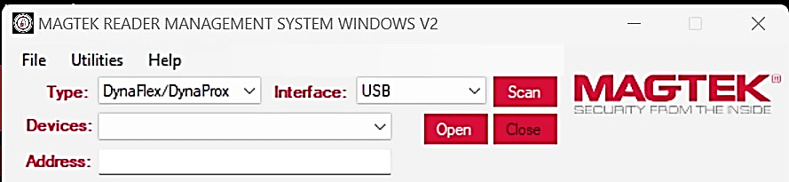

### File

The **File** tab has one button, **Exit**.

-   The **Exit** button closes the application and operates identically to the
    **Exit** button in the graphical user interface (GUI).

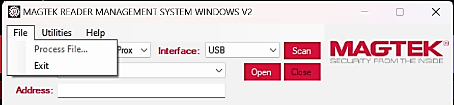

### Utilities

The Utilities tab has 9 active buttons for use with DynaFlex/DynaProx devices,
**Offline Mode** is reserved for use with MagneSafe
Devices.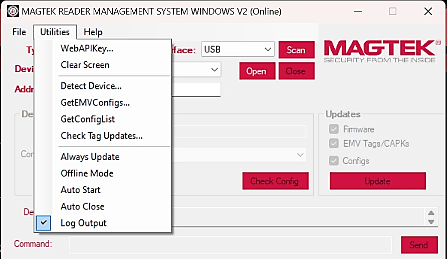

-   **Web API Key**: The customer will select this button if they have their own
    custom Web API Key. This information will be provided by Magensa during
    onboarding.
-   **Clear Screen**: This button removes all content from the Output field,
    performing the same function as the **Clear** button in the graphical user
    interface (GUI).

-   **Detect Device**: This button scans for devices connected to the PC used
    for interfacing. It operates identically to the **Scan** button in the
    graphical user interface (GUI), prioritizing the first detected USB
    connection.

    

-   **GetEMVConfigs**: This feature is only available on MagneSafe devices and
    is not supported on DynaFlex or DynaProx devices. It retrieves device
    information and logs the data.

    

-   **GetConfigList**: This button performs the same function as the **Check
    Config** button in the graphical user interface (GUI). It retrieves the
    device’s current configuration and populates all available configurations in
    the Configurations dropdown tab.

    

-   **Check Tag Updates**: this button will check if the current EMV Tags and
    CAPKs are up to date and report the results in the output log.

    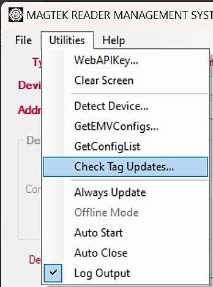

-   **Always Update**: When this button is selected, the device will
    automatically update if its configuration version is lower than the version
    indicated in the Version field in the GUI. Selecting this button will
    suppress the “Yes/No” popup dialog (see image below) when an update is
    available.

    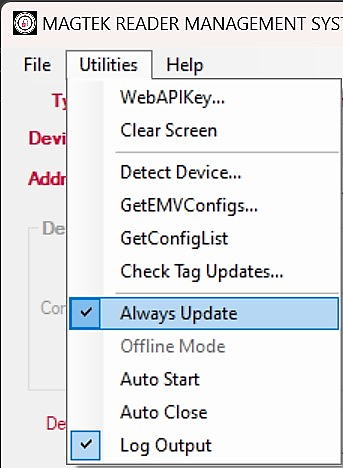

    The RMS application keeps track of configuration versions in the GUI by
    indicating a value in Version field as illustrated below. The user may enter
    0 in this field to force an update.

    

-   **  
    **
-   **Offline Mode (MagneSafe Devices Only)**: This button should be selected
    when the user **does not** want the RMS application to retrieve firmware or
    configuration data from external Online sources. The user must make prior
    arrangements with Magensa to obtain the relevant files and instructions
    needed for Offline Mode to work properly. This button does not work with
    DynaFlex/DynaProx devices.

    **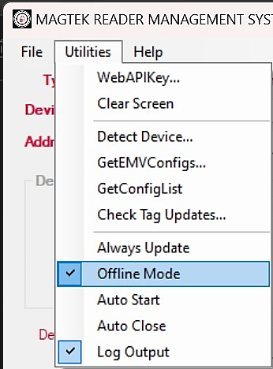**

-   **Auto Start**: When this button is selected, the RMS application will
    automatically start after launching the application.

    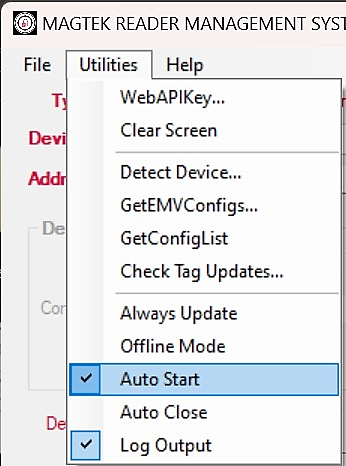

-   **Auto Close**: When this button is selected, the application will
    automatically close when all updates are complete.

    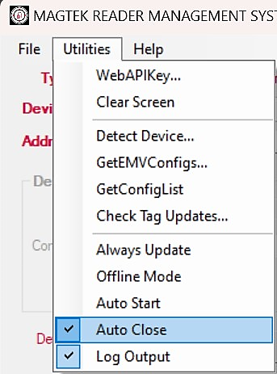

-   **Log Output**: When this button is selected, it will enable RMS to store
    output details in a log file. To see the Log, the user can go to **Help**
    tab and select the **Show Log** button. For more details about the Help tab,
    see **3.2.3 Help**.

    

### Help

The Help Tab contains the **About**, **FAQs** and **Show Log File** options.

-   **About**: this button displays a window with the name of the application,
    the version, and application PN number.

    

    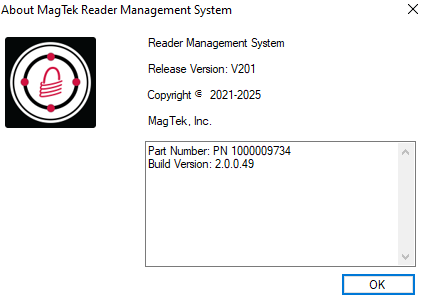

-   **FAQs**: this button takes the user to the MagTek.com support page.

    

-   **Show Log File**: this button displays txt file log of events only when a
    device is connected, and the Log Output button is checked in the Utilities
    Tab. This information is tied directly to the device serial number.

    

    

# User Instructions (DynaFlex/DynaProx)

## Connect to a PC

Select the device Type and Interface before connecting the device to your
Windows PC. This application has no auto scan feature, the user must click
**Scan** when ready to scan for devices.

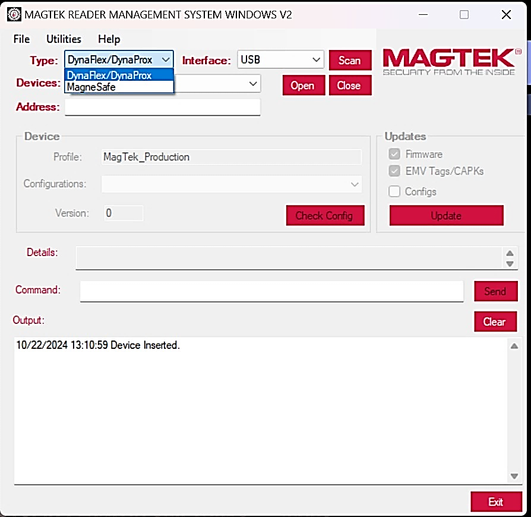

### Open Device

After scanning for a device is complete, click **Open**.

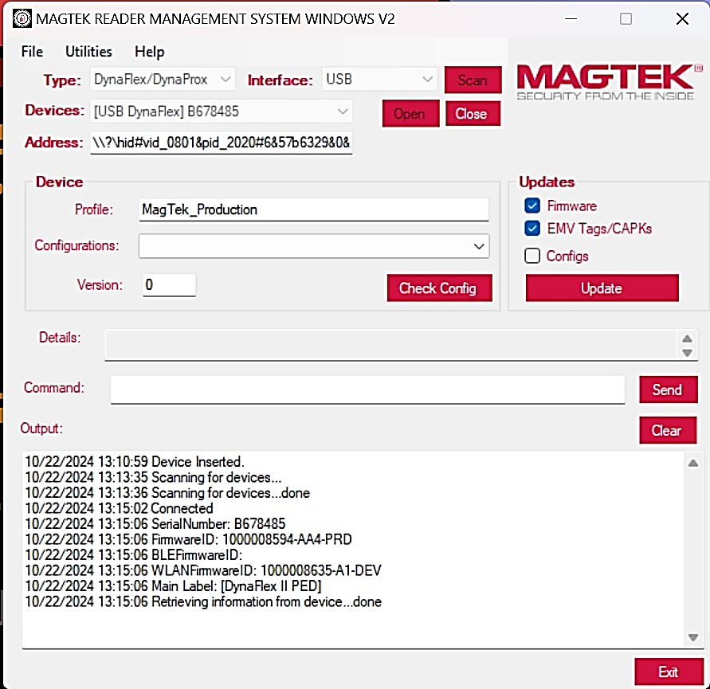

### Device Output

When successfully opened, the device will display data such as the serial number
and firmware ID number at the bottom of the window in the **Output** field. This
information will be necessary when contacting MagTek Support.

## Profile Name

Find the "Profile Name" field. The default Profile Name is set to "MagTekProd,"
for production devices. It controls access to files used in MagTek’s standard
production deployments.

**Note**: the examples provided in this document will use the “MagTekTest”
profile.

If you want to customize your RMS profile, you will need to contact your sales
representative to create a unique profile.

### Check Configuration

The RMS application allows users to check a device’s current configuration and
change it. The profile will dictate which configurations auto populate in the
dropdown Tab. To check the configuration of a device, click **Check Config.**

A list of available configurations will appear in the Details field.

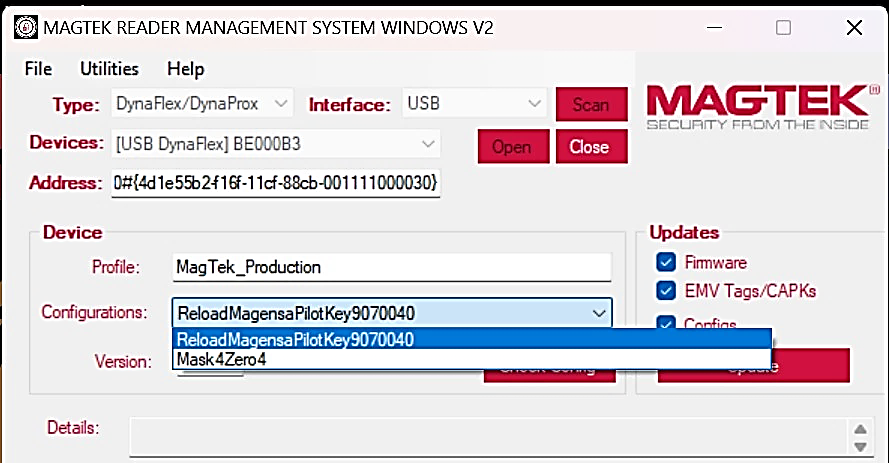

-   When working with a customer created Profile, the user should have knowledge
    of the configuration list. Their organization is involved in the Profile
    creation with Magensa. The end operator should be told ahead of time which
    configuration to select.
-   When working with a public MagTek Profile, the user may have to consult
    MagTek Support to determine the function of specific configurations.

## Updates

When a MagTek reader is connected, the user can press the **Update** button to
update the device's Firmware, EMV Tags and/or Certificate Authority Public Keys
(CAPKs).

The user can check which updates the device will receive. Once the updates have
been checked, press **Update**.

**Note**: Do not press **UI Buttons** or disconnect the device while firmware
updates are in progress.

The user will be prompted to click **Yes** or **NO** for each update that will
be performed.

### Updates Successful

When the update process is complete, the Details field will display: **…done**
indicating the update is successful.

**Note**: The Details and Output field will display both successful updates and
any failures when verifying update status.

## Commands

Navigate to the Command field to enter a command.

-   Please see the individual device’s Programmer’s Manual for a full list of
    Commands.

### Valid Command

When a valid command is entered, the Output field will return a response command
that can be cross-referenced with a known response command to verify
functionality. Command Request and Response examples can be found in the
individual device’s Programmer’s Manuals.

Be sure to enter a Valid HEX String with no spaces between the bits, the
application will not recognize Hex strings with spacing between bits.

## Exit

Press the **Exit** button to close the application.

# User Instructions (MagneSafe)

## Connect to a PC

Select the device Type and Interface before connecting the device to your
Windows PC. This application has no auto scan feature, the user must click
**Scan** when ready to scan for devices.

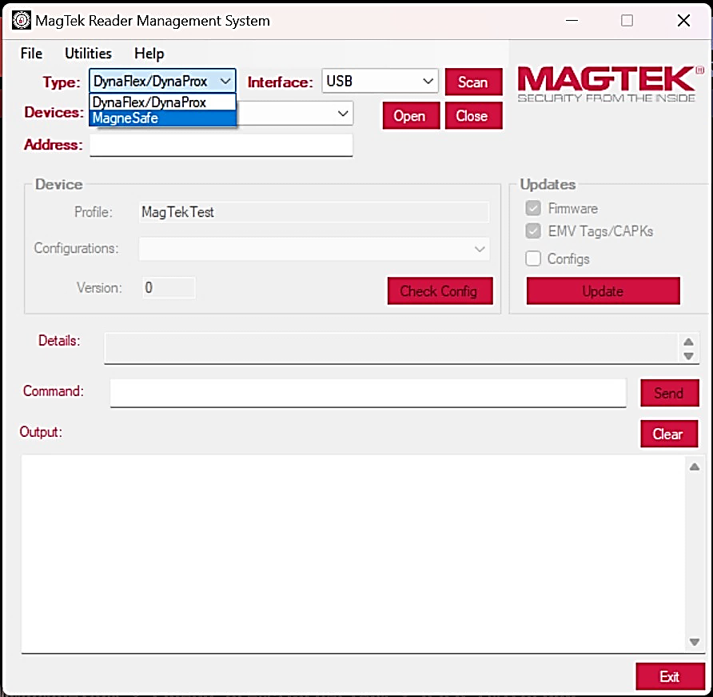

### Open Device

After scanning for a device is complete, click **Open**.

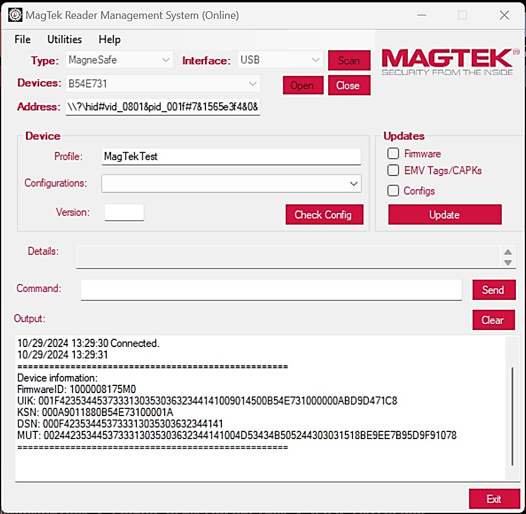

### Device Output

When successfully opened, the device will display data such as the serial number
and firmware ID number at the bottom of the window in the **Output** field. This
information will be necessary when contacting MagTek Support.

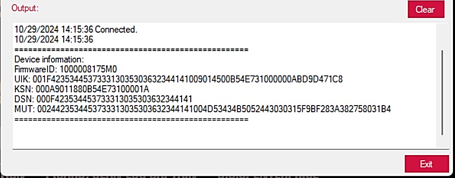

## Profile Name

Find the "Profile Name" field. The default Profile Name is set to "MagTekProd,"
for production devices. It controls access to files used in MagTek’s standard
production deployments.

**Note**: the examples provided in this document will use the “MagTekTest”
profile.

If you want to customize your RMS profile, you will need to contact your sales
representative to create a unique profile.

### Check Configuration

The RMS application allows users to check a device’s current configuration and
change it. The profile will dictate which configurations auto populate in the
dropdown Tab. To check the configuration of a device, click **Check Config.**

A list of available configurations will appear in the Details field.

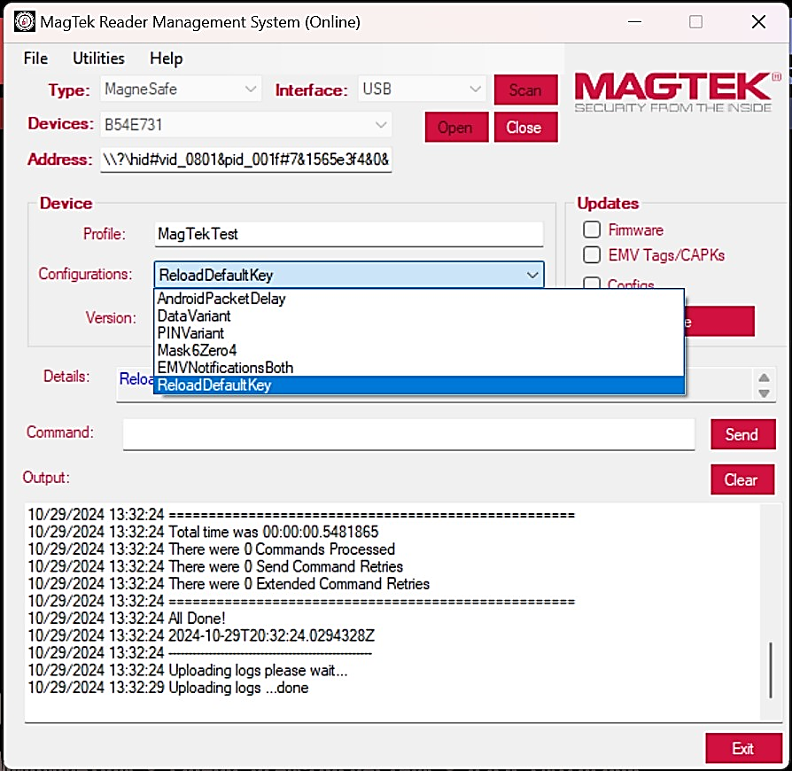

-   When working with a customer created Profile, the user should have knowledge
    of the configuration list. Their organization is involved in the Profile
    creation with Magensa. The end operator should be told ahead of time which
    configuration to select.
-   When working with a public MagTek Profile, the user may have to consult
    MagTek Support to determine the function of specific configurations.

## Updates

When a MagTek reader is connected, the user can press the **Update** button to
update the device's Firmware, EMV Tags and/or Certificate Authority Public Keys
(CAPKs).

The user can check which updates the device will receive. Once the updates have
been checked, press **Update**.

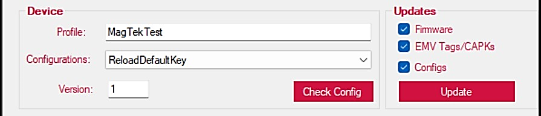

**Note**: Do not press **UI Buttons** or disconnect the device while firmware
updates are in progress.

### Update Status

When the update process is complete, the Details field will display: [Update]
**…is up to date** indicating the current configuration is up to date.

**Note**: The Details and Output field will display both successful updates and
any failures when verifying update status.

## Commands

Navigate to the Command field to enter a command.

-   Please see the individual device’s Programmer’s Manual for a full list of
    Commands, see **Appendix B Related Documentation**.

### Valid Command

When a valid command is entered, the Output field will return a response command
that can be cross-referenced with a known response command to verify
functionality. Command Request and Response examples can be found in the
individual device’s Programmer’s Manuals.

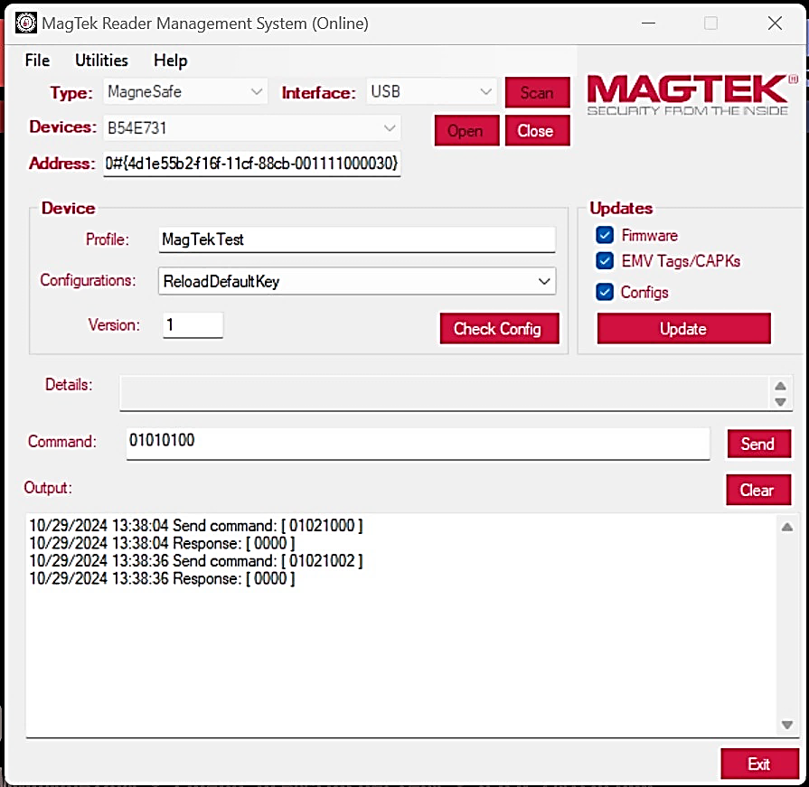

Be sure to enter a Valid HEX String with no spaces between the bits, the
application will not recognize Hex strings with spacing between bits.

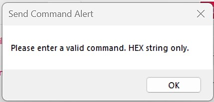

## Exit

Press the **Exit** button to close the application.

###### Glossary of Terms

-   API – Application Programming Interface
-   EMV –Europay, MasterCard® and Visa®
-   FAQs – Frequently Asked Questions
-   KSN - Key Serial Number
-   MUT - MagTek Update Token
-   SDK – Software Developer’s Kit
-   SN - Serial Number
-   UIK - Unique Identifier Key

###### Related Documentation

To view or download any of the documents mentioned in this manual, visit
<https://www.magtek.com/support>.

1.  Installation and Operation Manuals

**D99820020-DYNAMAG DUO INSTALLATION AND OPERATION MANUAL**

**D998200382- DYNAFLEX FAMILY OF PRODUCTS THREE-WAY SECURE CARD READER
AUTHENTICATORS INSTALLATION AND OPERATION MANUAL**

**D998200595- DYNAFLEX II GO SECURE CARD READER AUTHENTICATOR INSTALLATION AND
OPERATION MANUAL**

**D998200110- EDYNAMO INSTALLATION AND OPERATION MANUAL**

**D998200321- IDYNAMO 6 INSTALLATION AND OPERATION MANUAL**

**D998200614- IDYNAMO 5 GEN III SECURE CARD READER INSTALLATION AND OPERATION
MANUAL**

**D998200257- TDYNAMO INSTALLATION AND OPERATION MANUAL**

**D998200203- DYNAMAG DUO INSTALLATION AND OPERATION MANUAL**

**D998200104- DYNAPAD INSTALLATION AND OPERATION MANUAL**

**D998200265- DYNAWAVE INSTALLATION AND OPERATION MANUAL**

1.  Programmers Manuals

**D998200383-DYNAFLEX PRODUCTS THREE-WAY SECURE CARD READER AUTHENTICATORS
PROGRAMMER'S MANUAL (COMMANDS)**

**D998200489-DYNAPROX PRODUCTS EMV CONTACTLESS/NFC CARD READERS PROGRAMMER’S
MANUAL (COMMANDS)**

**D998200597-DYNAFLEX II GO SECURE CARD READER PROGRAMMER'S MANUAL (COMMANDS)**

**D998200115-EDYNAMO PROGRAMMER'S MANUAL (COMMANDS)**

**D998200324-IDYNAMO 6 PROGRAMMER'S MANUAL (COMMANDS)**

**D998200226-TDYNAMO PROGRAMMER'S MANUAL (COMMANDS)**

**D998200587-IDYNAMO 5 GEN III SECURE CARD READER PROGRAMMERS MANUAL
(COMMANDS)**

**D998200176-DYNAMAG / MAGNESAFE V5 INTELLIHEAD USB / MAGNESAFE V5 READERS USB
PROGRAMMER'S MANUAL (COMMANDS)**

**D998200173-DYNAPAD PROGRAMMER'S MANUAL (COMMANDS)**

**D998200215- DYNAWAVE PROGRAMMER'S MANUAL (COMMANDS)**

###### Warranty and Software License

1.  Limited Warranty

MagTek warrants that the products sold pursuant to this Agreement will perform
in accordance with MagTek’s published specifications. This warranty shall be
provided only for a period of one year from the date of the shipment of the
product from MagTek (the “Warranty Period”). This warranty shall apply only to
the “Buyer” (the original purchaser, unless that entity resells the product as
authorized by MagTek, in which event this warranty shall apply only to the first
repurchaser).

During the Warranty Period, should this product fail to conform to MagTek’s
specifications, MagTek will, at its option, repair or replace this product at no
additional charge except as set forth below. Repair parts and replacement
products will be furnished on an exchange basis and will be either reconditioned
or new. All replaced parts and products become the property of MagTek. This
limited warranty does not include service to repair damage to the product
resulting from accident, disaster, unreasonable use, misuse, abuse, negligence,
or modification of the product not authorized by MagTek. MagTek reserves the
right to examine the alleged defective goods to determine whether the warranty
is applicable.

Without limiting the generality of the foregoing, MagTek specifically disclaims
any liability or warranty for goods resold in other than MagTek’s original
packages, and for goods modified, altered, or treated without authorization by
MagTek.

Service may be obtained by delivering the product during the warranty period to
MagTek (1710 Apollo Court, Seal Beach, CA 90740). If this product is delivered
by mail or by an equivalent shipping carrier, the customer agrees to insure the
product or assume the risk of loss or damage in transit, to prepay shipping
charges to the warranty service location, and to use the original shipping
container or equivalent. MagTek will return the product, prepaid, via a three
(3) day shipping service. A Return Material Authorization (“RMA”) number must
accompany all returns. Buyers may obtain an RMA number by contacting MagTek
Support Services at support@magtek.com

**Each buyer understands that this MagTek product is offered as-is. MagTek makes
no other warranty, express or implied, and MagTek disclaims any warranty of any
other kind, including any warranty of merchantability or fitness for a
particular purpose.**

**If this product does not conform to MagTek’s specifications, the sole remedy
shall be repair or replacement as provided above. MagTek’s liability, if any,
shall in no event exceed the total amount paid to MagTek under this agreement.
In no event will MagTek be liable to the Buyer for any damages, including any
lost profits, lost savings, or other incidental or consequential damages arising
out of the use of, or inability to use, such product, even if MagTek has been
advised of the possibility of such damages, or for any claim by any other
party.**

Limitation On Liability

Except as provided in the sections relating to MagTek’s Limited Warranty,
MagTek’s liability under this agreement is limited to the contract price of this
product.

MagTek makes no other warranties with respect to the product, expressed or
implied, except as may be stated in this agreement, and MagTek disclaims any
implied warranty, including without limitation any implied warranty of
merchantability or fitness for a particular purpose.

MagTek shall not be liable for contingent, incidental, or consequential damages
to persons or property. MagTek further limits its liability of any kind with
respect to the product, including negligence on its part, to the contract price
for the goods.

MagTek’s sole liability and buyer’s exclusive remedies are stated in this
section and in the section relating to MagTek’s Limited Warranty.

1.  SOFTWARE LICENSE AGREEMENT

**IMPORTANT:** YOU SHOULD CAREFULLY READ ALL THE TERMS, CONDITIONS AND
RESTRICTIONS OF THIS LICENSE AGREEMENT BEFORE INSTALLING THE SOFTWARE PACKAGE.
YOUR INSTALLATION OF THE SOFTWARE PACKAGE PRESUMES YOUR ACCEPTANCE OF THE TERMS,
CONDITIONS, AND RESTRICTIONS CONTAINED IN THIS AGREEMENT. IF YOU DO NOT AGREE
WITH THESE TERMS, CONDITIONS, AND RESTRICTIONS, PROMPTLY RETURN THE SOFTWARE
PACKAGE AND ASSOCIATED DOCUMENTATION TO THE ADDRESS IN THIS DOCUMENT, ATTENTION:
CUSTOMER SUPPORT.

TERMS, CONDITIONS, AND RESTRICTIONS

MagTek, Incorporated (the "Licensor") owns and has the right to distribute the
described software and documentation, collectively referred to as the
"Software."

**LICENSE:** Licensor grants you (the "Licensee") the right to use the Software
in conjunction with MagTek products. LICENSEE MAY NOT COPY, MODIFY, OR TRANSFER
THE SOFTWARE IN WHOLE OR IN PART EXCEPT AS EXPRESSLY PROVIDED IN THIS AGREEMENT.
Licensee may not decompile, disassemble, or in any other manner attempt to
reverse engineer the Software. Licensee shall not tamper with, bypass, or alter
any security features of the software or attempt to do so.

**TRANSFER:** Licensee may not transfer the Software or license to the Software
to another party without the prior written authorization of the Licensor. If
Licensee transfers the Software without authorization, all rights granted under
this Agreement are automatically terminated.

**COPYRIGHT:** The Software is copyrighted. Licensee may not copy the Software
except for archival purposes or to load for execution purposes. All other copies
of the Software are in violation of this Agreement.

**TERM:** This Agreement is in effect as long as Licensee continues the use of
the Software. The Licensor also reserves the right to terminate this Agreement
if Licensee fails to comply with any of the terms, conditions, or restrictions
contained herein. Should Licensor terminate this Agreement due to Licensee's
failure to comply, Licensee agrees to return the Software to Licensor. Receipt
of returned Software by the Licensor shall mark the termination.

**LIMITED WARRANTY:** Licensor warrants to the Licensee that the disk(s) or
other media on which the Software is recorded are free from defects in material
or workmanship under normal use.

THE SOFTWARE IS PROVIDED AS IS. LICENSOR MAKES NO OTHER WARRANTY OF ANY KIND,
EITHER EXPRESS OR IMPLIED, INCLUDING, BUT NOT LIMITED TO, THE IMPLIED WARRANTIES
OF MERCHANTABILITY AND FITNESS FOR A PARTICULAR PURPOSE.

Because of the diversity of conditions and hardware under which the Software may
be used, Licensor does not warrant that the Software will meet Licensee
specifications or that the operation of the Software will be uninterrupted or
free of errors.

IN NO EVENT WILL LICENSOR BE LIABLE FOR ANY DAMAGES, INCLUDING ANY LOST PROFITS,
LOST SAVINGS, OR OTHER INCIDENTAL OR CONSEQUENTIAL DAMAGES ARISING OUT OF THE
USE, OR INABILITY TO USE THE SOFTWARE. Licensee's sole remedy in the event of a
defect in material or workmanship is expressly limited to replacement of the
Software disk(s) if applicable.

**GOVERNING LAW:** If any provision of this Agreement is found to be unlawful,
void, or unenforceable, that provision shall be removed from consideration under
this Agreement and will not affect the enforceability of any of the remaining
provisions. This Agreement shall be governed by the laws of the State of
California and shall inure to the benefit of MagTek, Incorporated, its
successors or assigns.

**ACKNOWLEDGMENT:** LICENSEE ACKNOWLEDGES THAT LICENSEE HAS READ THIS AGREEMENT,
UNDERSTANDS ALL OF ITS TERMS, CONDITIONS, AND RESTRICTIONS, AND AGREES TO BE
BOUND BY THEM. LICENSEE ALSO AGREES THAT THIS AGREEMENT SUPERSEDES ANY AND ALL
VERBAL AND WRITTEN COMMUNICATIONS BETWEEN LICENSOR AND LICENSEE OR THEIR ASSIGNS
RELATING TO THE SUBJECT MATTER OF THIS AGREEMENT.

QUESTIONS REGARDING THIS AGREEMENT SHOULD BE ADDRESSED IN WRITING TO MAGTEK,
INCORPORATED, ATTENTION: CUSTOMER SUPPORT, AT THE ADDRESS LISTED IN THIS
DOCUMENT, OR E-MAILED TO SUPPORT@MAGTEK.COM.

**DEMO SOFTWARE / SAMPLE CODE**: Unless otherwise stated, all demo software and
sample code are to be used by Licensee for demonstration purposes only and MAY
NOT BE incorporated into any production or live environment. The PIN Pad sample
implementation is for software PIN Pad test purposes only and is not PCI
compliant. To meet PCI compliance in production or live environments, a
third-party PCI compliant component (hardware or software-based) must be used.
