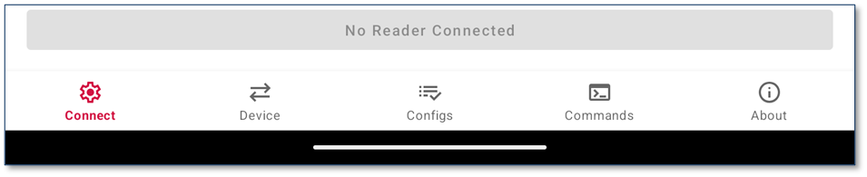
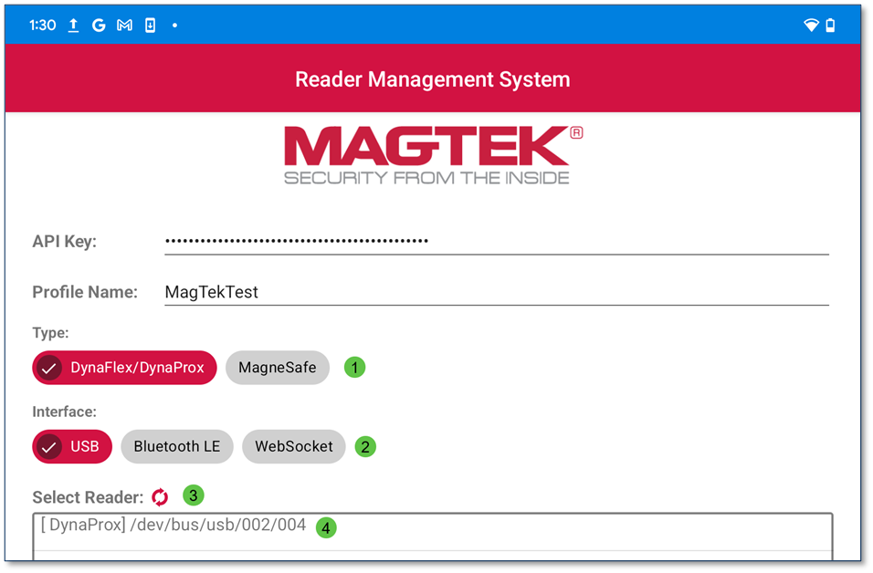
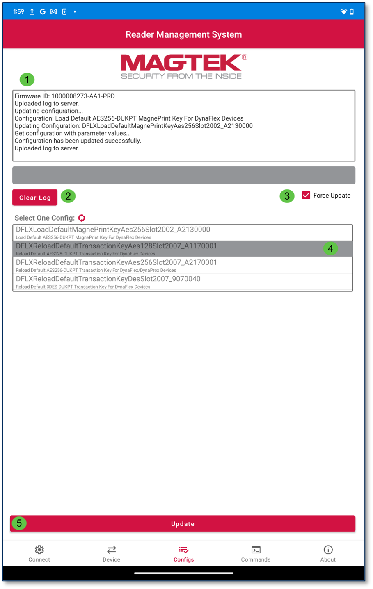
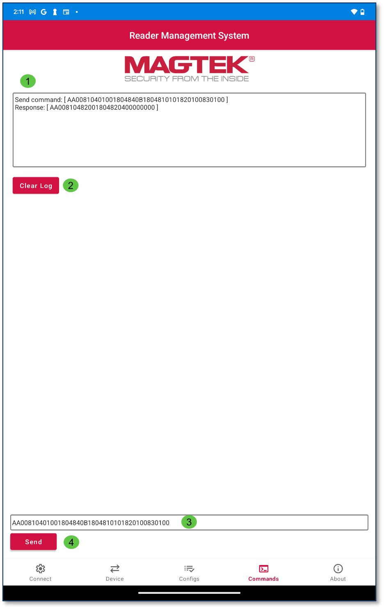
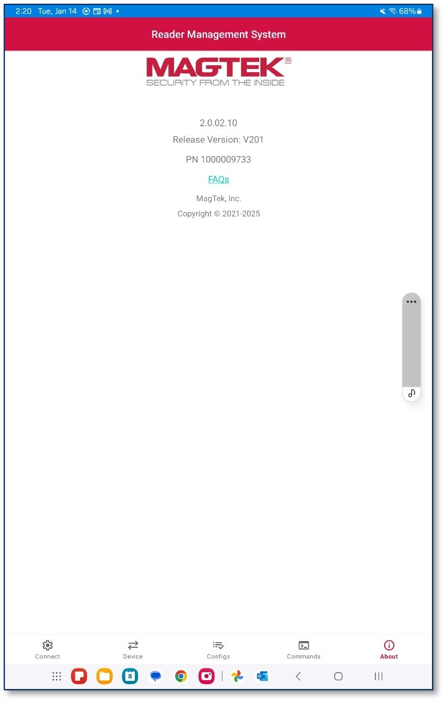

# Android

* Android Application (PN 1000009733)
* Compatible with both USB and Bluetooth Low Energy (BLE) connected readers, as well as WLAN enabled readers.
* Supports MagTek MagneSafe and DynaFlex/DynaProx readers.

## Android System Requirements

The RMS app is compatible with Android OS. 
Note: Not all configuration options are available for all Secure Card Reader Authenticators (SCRAs). The available configuration options depend on:
* The specific SCRA model in use.
* The configuration options provided by MagTek.

Important: Some commands may require a device reset.
* Refer to the Programmer's Manual for your particular device to see which commands are affected. (See Appendix B Related Documentation.)

## Installation

Begin by downloading the MagTek Reader Management System. 
[https://www.magtek.com/support/reader-management-system?tab=software](.)

## Tabs

The main User Interface consists of five tabs located at the bottom of the page. These tabs are labeled as follows:
* Connect
* Device
* Configs
* Commands
* About

The Active Tab icon will be highlighted red as illustrated above. 

### Connect

The Connect Tab will connect a device to the RMS app. The upper portion of the tab contains:

>1. API Key: This field is automatically populated when a device is connected, the characters are masked for security reasons. Although the field is editable, it is not recommended to alter the API Key field. 
>2. Profile Name: The Profile Name will be provided during onboarding. 
>3. Device Type: There are two device type options, DynaFlex/DynaProx and MagneSafe
>4. Interface Type: There are three interface types, USB, Bluetooth LE, and WebSocket for WLAN enabled devices.

The lower portion of the Connect Tab contains:
>5. Select Reader Refresh  : When connecting either USB or Bluetooth enabled devices, this button will refresh the list of available devices to connect to.
>6. Device Name: Tap on the Device Name to connect.
>7. No Reader Connected: This button becomes Disconnect after tapping on the device name to connect.
>8. Main UI Tab Bar: The main tabs for the RMS app are located at the bottom of the screen. The active tab is highlighted red. 

### Device
The Device Tab will update device Firmware and EMV Tags/CAPKS. 
>1. Log: The Device Tab contains a log of all events.
>2.	Clear Log: The Clear Log button will remove all log data until a new instance is provided by the reader.
>3.	Force Update: Enabling this option directs RMS to update Firmware, EMV Tags, and CAPKs regardless of their current version status. DynaFlex devices do not support forcing Firmware update.  Firmware option becomes unchecked and disabled; this feature is available only on MagneSafe devices.
>4.	Update Options: The Device Tab contains pre-selected options to update Firmware and EMV Tags/CAPKS. The user can deselect either option if needed. 
>5.	Update Button: The Update button loads the updates selected. 
>6.	A prompt will appear and ask the user if they would like to update Main firmware. The user can press No or Yes. 

### Configs

The Configs Tab will update the device’s configurations. 
>1. Log: The Configs Tab contains a log of all events.
>2. Clear Log: The Clear Log button will remove all log data until a new instance is provided by the reader. The Refresh   button will refresh the list of available configurations for the device connected. 
>3. Force Update: Enabling this option directs RMS to update Configs regardless of their current version status. DynaFlex devices do not support forcing Firmware update.  Firmware option becomes unchecked and disabled; this feature is available only on MagneSafe devices.
>4. Config List: Tap on the desired configuration to select.
>5. Update: Press the Update button to load the selected config.

### Commands

The Commands Tab allows users to send commands to a device. Responses are recorded in the Log.
>1. Log: The Commands Tab contains a log that will display the details of all commands entered and responses returned. 
>2. Clear Log: The Clear Log button will remove all log data until a new instance is provided by the reader.
>3.	Commands Field: This field allows the user to enter commands.
>4. Send: This button sends commands to the reader.

### About

The About Tab will display the App PN number, current version, and a link to FAQs available at MagTek.com.

***
