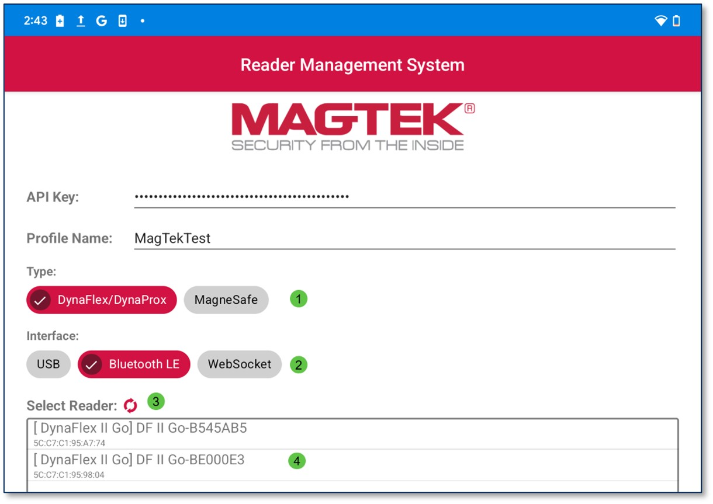
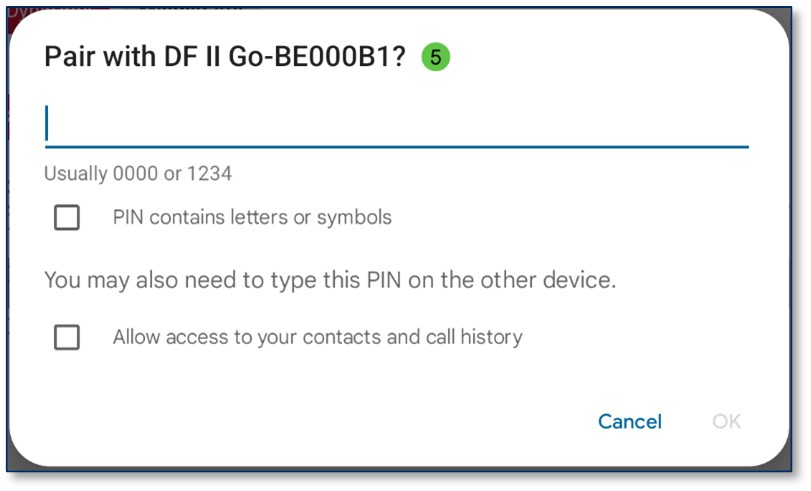

## Connect Via Bluetooth
To connect to a device via Bluetooth LE, open the Android app and follow the steps below. It is important to note that Bluetooth pairing will be done through the RMS app, not through Android device settings.
1.	Select the Device Type
2.	Select the Interface Type
3.	Press the Refresh   button if the device does not appear.
4.	Tap on the Device Name below.
5.	When connecting to a device via Bluetooth LE for the first time, a prompt will appear and require the user to enter the PIN.  Default is 000000.

