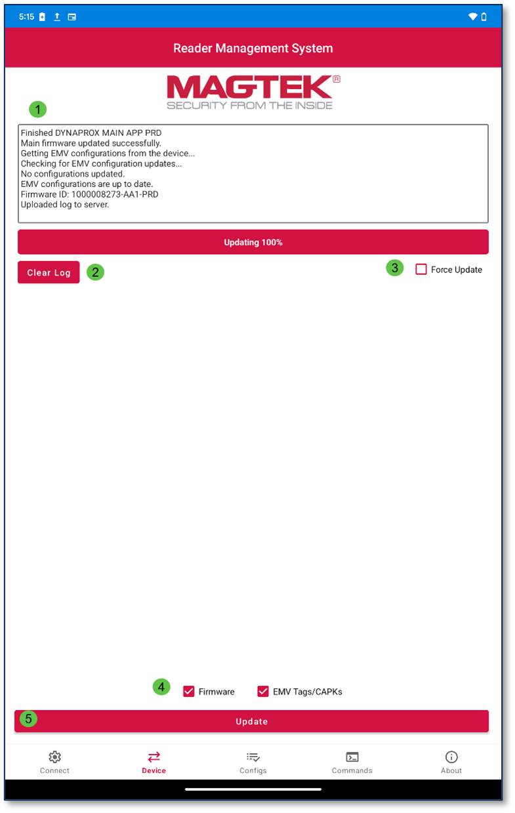
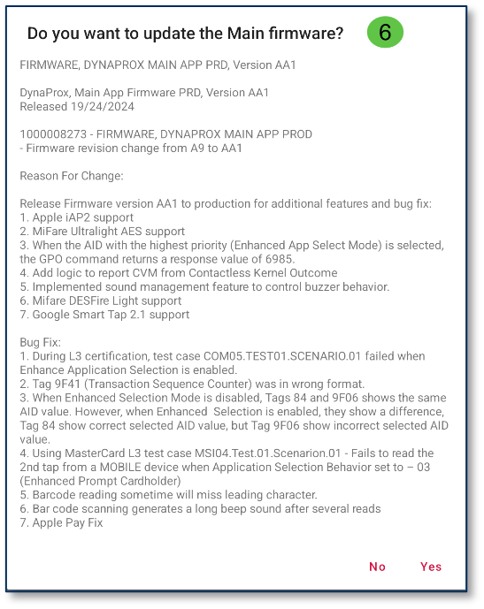

# Device Tab
The Device Tab will update device Firmware and EMV Tags/CAPKs.  
>1. Log: The Device Tab contains a log of all events.  
>2. Clear Log: The Clear Log button will remove all log data until a new instance is provided by the reader.  
>3. Force Update: Enabling this option directs RMS to update Firmware, EMV Tags, and CAPKs regardless of their current version status. DynaFlex devices do not support forcing Firmware update. Firmware option becomes unchecked and disabled; this feature is available only on MagneSafe devices.  
>4. Update Options: The Device Tab contains pre-selected options to update Firmware and EMV Tags/CAPKs. The user can deselect either option if needed.  
>5. Update Button: The Update button loads the updates selected.  
>6. A prompt will appear and ask the user if they would like to update Main firmware. The user can press No or Yes.  

  
