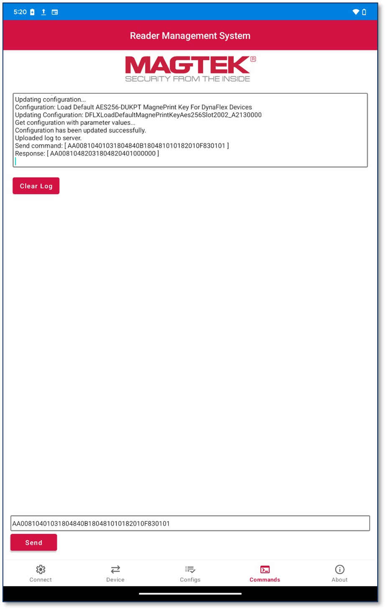

## Entering Commands Tab
To send a command to the device and receive a response:
* Enter a command in the Command Field and press Send.

In this example, the command entered was successfully sent and a response returned. This command turns on the device’s Bar Code Reader LED. The log indicates it was sent successfully, the response command matched the programmer’s manual and the LED illuminated. Refer to your device’s particular programmer’s manual for a full list of commands, see Appendix B Related Documentation. 
