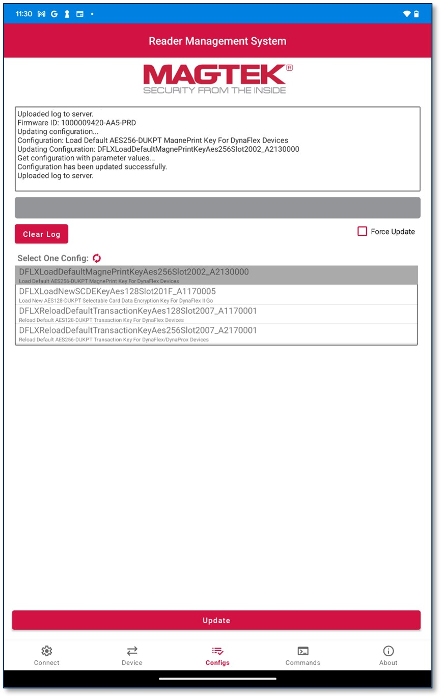

## Update Configs
To update or change your device’s configurations:
* Tap on desired configuration to select.
* Press the Update button to load the update.
* Press Clear Log to clear the log if needed.
* Press Refresh  to refresh the list of available configurations if none appear. 
The log will indicate if the configuration update is successful or if it has failed. 

