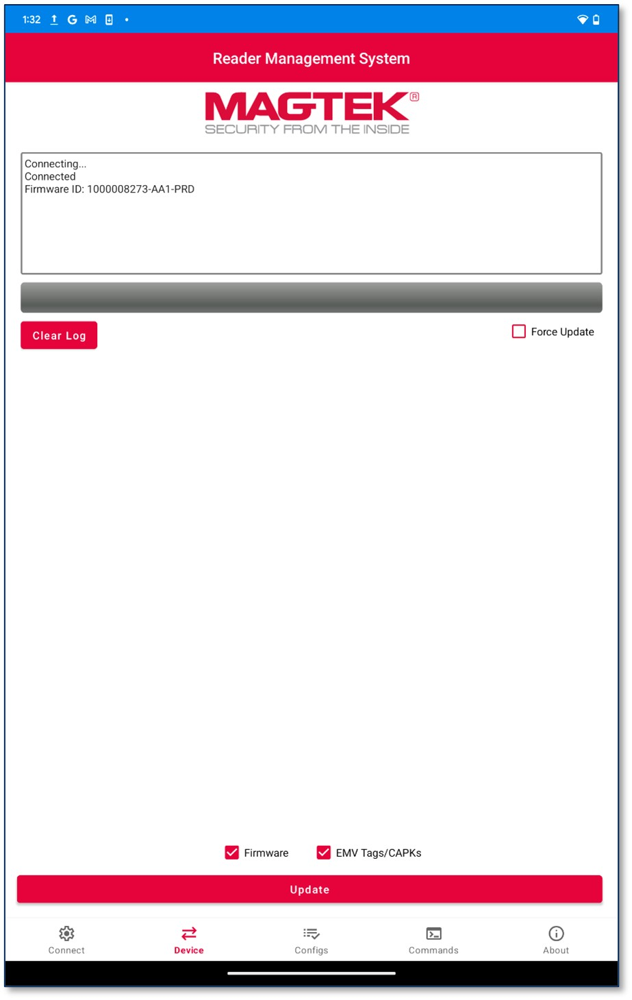
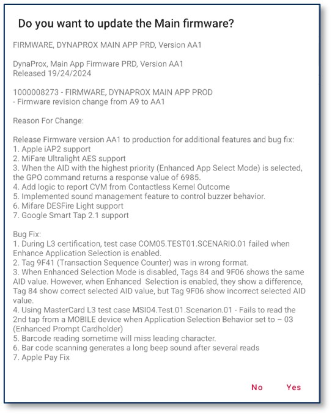
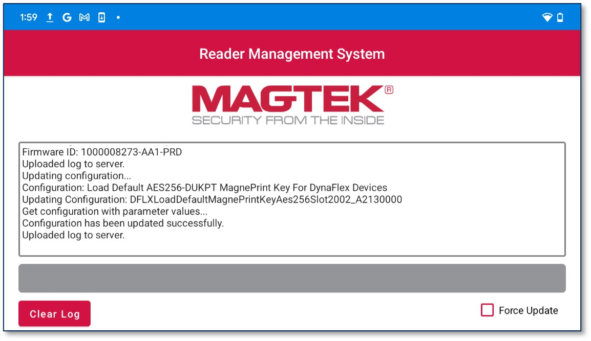

## Update Firmware and EMV Tags/CAPKS
To update device Firmware and EMV Tags/CAPKS, check the desired item to update and press the Update button. Only the updates that are selected will be loaded to the device. A prompt will appear asking the user it they would like to update Main firmware, press YES.

**Note:**

- The **Force Update** option will update both **Firmware** and **EMV Tags/CAPKs** regardless of their current versions.
- **DynaFlex** devices do not support forcing a **Firmware update**. 
- The **Firmware** option becomes unchecked and disabled for **DynaFlex** devices, and is available only for **MagneSafe** devices.

### Updates Results
The log will indicate:
* If current configurations are up to date,
* If updates have succeeded,
* If updates have failed

