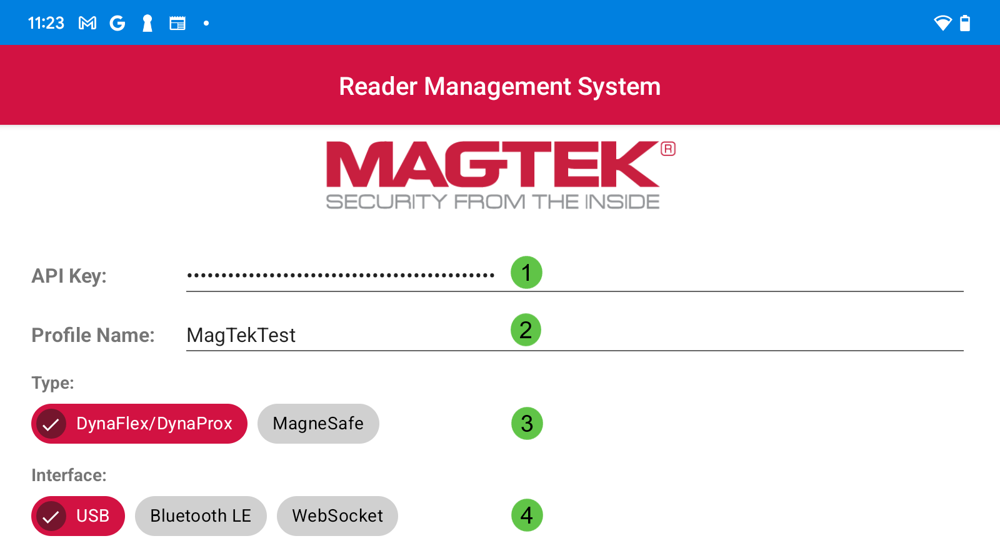
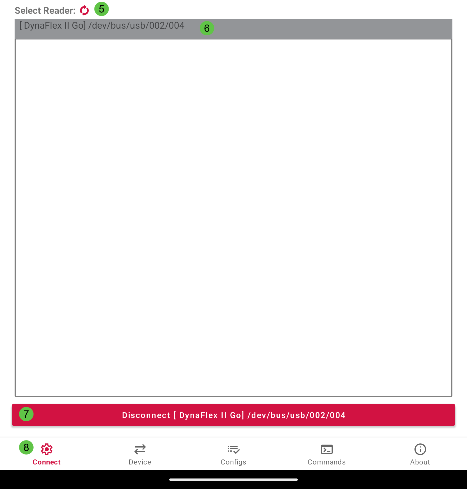
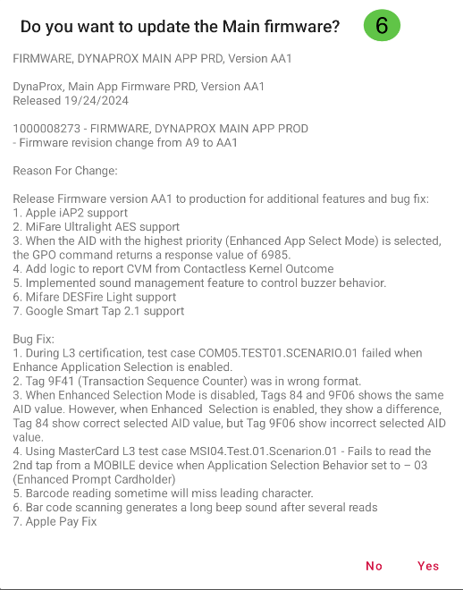
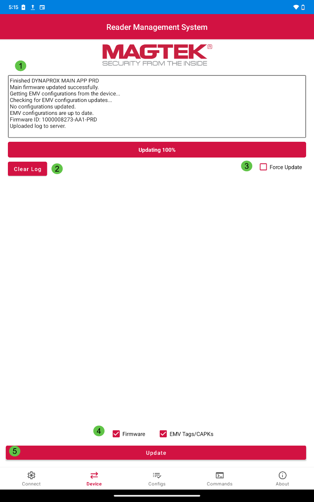
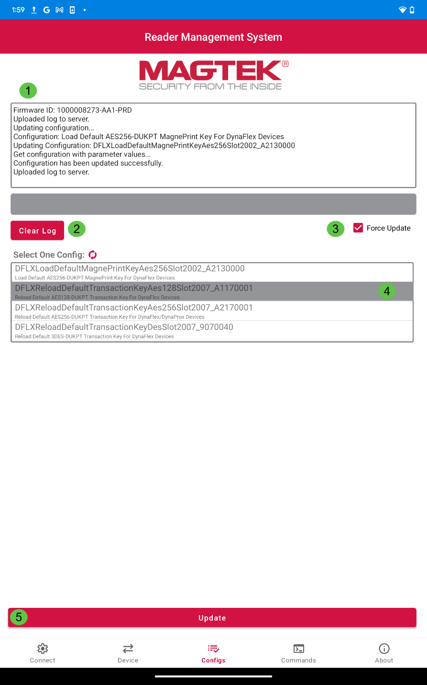
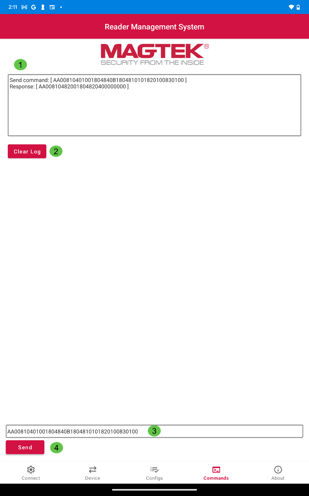
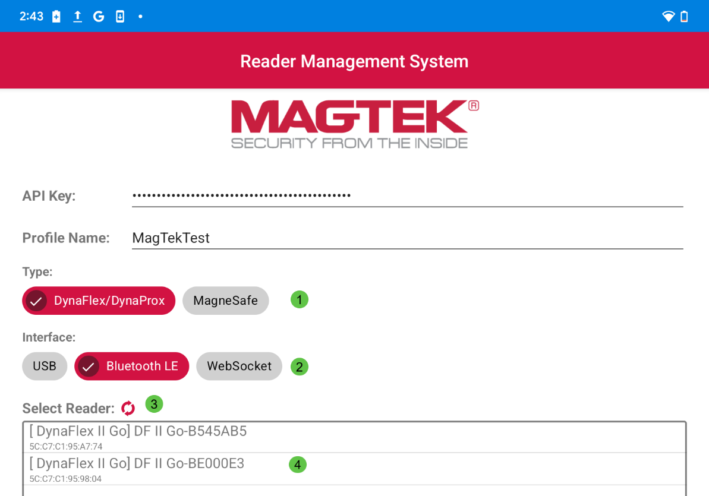
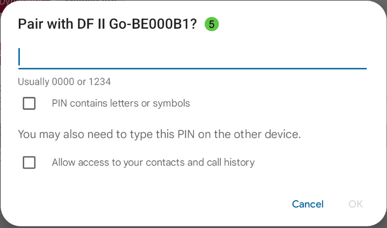
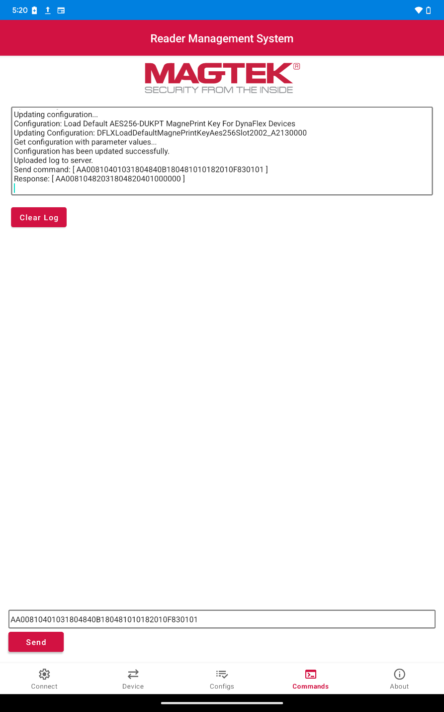

<button class="btn js-toggle-dark-mode">Preview dark color scheme</button>

| [Reader Management System] [Android] [Installation and Operation Manual]                      |
|----------------------------------------------------------------------------|
|                            |
| January 2025  Document Number: D998200685-110  REGISTERED TO ISO 9001:2015 |

Copyright © 2006 - 2025 MagTek, Inc.

Printed in the United States of America

INFORMATION IN THIS PUBLICATION IS SUBJECT TO CHANGE WITHOUT NOTICE. MAGTEK
CANNOT BE HELD LIABLE FOR ANY USE OF THE CONTENTS OF THIS DOCUMENT. ANY CHANGES
OR IMPROVEMENTS MADE TO THIS PRODUCT WILL BE INCLUDED IN THE NEXT PUBLICATION
RELEASE. IF YOU HAVE QUESTIONS ABOUT SPECIFIC FEATURES AND FUNCTIONS OR WHEN
THEY WILL BECOME AVAILABLE, PLEASE CONTACT YOUR MAGTEK REPRESENTATIVE.

MagTek®, MagnePrint®, and MagneSafe® are registered trademarks of MagTek, Inc.

Magensa™ is a trademark of MagTek, Inc.

DynaPro™ and DynaPro Mini™, are trademarks of MagTek, Inc.

AAMVA™ is a trademark of AAMVA.

American Express® and EXPRESSPAY FROM AMERICAN EXPRESS® are registered
trademarks of American Express Marketing & Development Corp.

D-PAYMENT APPLICATION SPECIFICATION® is a registered trademark to Discover
Financial Services CORPORATION

MasterCard® is a registered trademark and PayPass™ and Tap & Go™ are trademarks
of MasterCard International Incorporated.

Visa® and Visa payWave® are registered trademarks of Visa International Service
Association.

ANSI®, the ANSI logo, and numerous other identifiers containing "ANSI" are
registered trademarks, service marks, and accreditation marks of the American
National Standards Institute (ANSI).

ISO® is a registered trademark of the International Organization for
Standardization.

UL™ and the UL logo are trademarks of UL LLC.

PCI Security Standards Council® is a registered trademark of the PCI Security
Standards Council, LLC.

EMV® is a registered trademark in the U.S. and other countries and an
unregistered trademark elsewhere. The EMV trademark is owned by EMVCo, LLC. The
Contactless Indicator mark, consisting of four graduating arcs, is a trademark
owned by and used with permission of EMVCo, LLC.

The *Bluetooth*® word mark and logos are registered trademarks owned by
Bluetooth SIG, Inc. and any use of such marks by MagTek is under license.

Google Play™ store, Google Wallet™ payment service, and Android™ platform are
trademarks of Google Inc.

Apple Pay®, iPhone®, iPod®, Mac®, and OS X® are registered trademarks of Apple
Inc., registered in the U.S. and other countries. iPad™ is a trademark of Apple.
Inc. App StoreSM is a service mark of Apple Inc., registered in the U.S. and
other countries. iOS is a trademark or registered trademark of Cisco in the U.S.
and other countries and is used by Apple Inc. under license.

Microsoft®, Windows®, and .NET® are registered trademarks of Microsoft
Corporation.

All other system names and product names are the property of their respective
owners.

Table 01 - Revisions

| Rev Number | Date          | Notes                                                                              |
|------------|---------------|------------------------------------------------------------------------------------|
| 100        | December 2024 | Initial Release                                                                    |
| 110        | January 2025  | Update Copyright Dates throughout. Updated About Screen image in **3.2.5 About.**  |

# Table of Contents
- [Overview](#overview)
  - [Purpose](#purpose)
  - [Benefits](#benefits)
    - [Android System Requirements](#android-system-requirements)
    - [RMS Android Application](#rms-android-application)
- [Magensa Remote Services](#magensa-remote-services)
- [Installation and User Interface](#installation-and-user-interface)
  - [Installation](#installation)
  - [Tabs](#tabs)
    - [Connect](#connect)
    - [Device](#device)
    - [Configs](#configs)
    - [Commands](#commands)
    - [About](#about)
- [User Instructions](#user-instructions)
  - [Connect to an Android Device](#connect-to-an-android-device)
    - [USB Cable](#usb-cable)
    - [Bluetooth LE](#bluetooth-le)
    - [WebSocket](#websocket)
  - [Update Firmware and EMV Tags/CAPKS](#update-firmware-and-emv-tagscapks)
    - [Updates Successful](#updates-successful)
  - [Configurations](#configurations)
  - [Commands](#commands-1)
- [Glossary of Terms](#glossary-of-terms)
- [Related Documentation](#related-documentation)
- [Warranty and Software License](#warranty-and-software-license)

# Overview

The MagTek Reader Management System (RMS) is a comprehensive application with
specialized source code designed to streamline the configuration and update
process for MagTek readers in enterprise environments. Its primary functions
include firmware management, key injection, device configuration, and the
loading and management of terminal, application settings, and Certificate
Authority Public Keys (CAPKs) required for EMV contactless transactions.

## Purpose

The Reader Management System (RMS) application is designed to be compatible with
all DynaFlex, DynaProx, and MagneSafe products available from MagTek.

-   The main purpose of this app is to streamline the ability to load firmware,
    device configs, keys, Tags and CAPKs into a target reader or more
    importantly, a large quantity of geographically separated readers.
-   The target files are 100% MagTek managed (files managed at MagTek’s host) so
    the user is not able to load the wrong files by accident.
-   The app can auto execute or manually execute the update process which can
    include all of the above file options in a single action. This prevents the
    need to load individual files which is cumbersome and not practical for
    scale.
-   The source code can be used to integrate this functionality into 3rd party
    apps which makes it easier for developers to use Magensa Remote Services.

## Benefits

The MagTek Reader Management System (RMS) provides several key benefits for
merchants and businesses, these include:

1.  **Centralized Management**: RMS allows for the remote management and
    configuration of MagTek readers across multiple locations from a single
    platform. Merchants can update firmware, keys, terminal settings, and CAPKs
    without manual intervention, reducing time, cost, and effort.
2.  **Enhanced Security**: RMS supports compliance with industry standards, such
    as PCI DSS, by ensuring secure payment card transactions and protecting
    sensitive customer data. It enables a secure process for keeping readers up
    to date with the latest firmware and configurations.
3.  **Efficient Updates**: RMS automates firmware updates and maintenance,
    allowing merchants to push updates remotely. This ensures all devices run
    the latest firmware, enhancing system reliability and reducing the need for
    manual updates.
4.  **System Reporting**: RMS offers reporting capabilities to track firmware
    versions and device settings, providing detailed insights by serial number
    for firmware, terminal, and CAPK updates in both production and test
    environments.
5.  **Scalability and Flexibility**: RMS is scalable to meet the needs of
    businesses, whether for a single store or multiple locations. It supports
    both Android, iOS and Windows, allowing flexibility in device management.
    (*See each OS specific installation manual for further details*)
6.  **Cost Savings**: Automating reader management with RMS reduces the need for
    on-site visits, lowering maintenance costs and minimizing downtime.
    Centralized control streamlines administrative tasks, boosting operational
    efficiency.
7.  **Improved Customer Experience**: Efficiently managed payment readers reduce
    transaction errors and delays, improving customer satisfaction and loyalty,
    which positively impacts business reputation and revenue.

### Android System Requirements

The RMS app is compatible with Android OS

**Note:** Not all configuration options are available for all Secure Card Reader
Authenticators (SCRAs). The available configuration options depend on:

-   The specific SCRA model in use.
-   The configuration options provided by MagTek.

    **Important**: Some commands may require a device reset.

-   Refer to the Programmer's Manual for your particular device to see which
    commands are affected. (See **Appendix B Related Documentation**.)

### RMS Android Application

-   Android Application (PN 1000009733)
-   Compatible with both USB and Bluetooth Low Energy (BLE) connected readers,
    as well as WLAN enabled readers.
-   Supports MagTek MagneSafe and DynaFlex/DynaProx readers.

# Magensa Remote Services

-   Customer needs a Remote Services (RS) Account for billable services
-   Customer DOES NOT need an RS Account for non-billable services
-   Billing occurs upon RS activity (this middleware does NOT impact the billing
    mechanics with RS)
-   Middleware between Magensa RS and Client App

Its main differentiator is to allow a developer or user to auto-launch or
single-click within their app to perform:

1.  Loads Firmware for V5 readers
2.  Main FW and BLE FW
3.  By Device ID so blending readers across various generations with differing
    FW files
4.  Loads Terminal and Application Settings
5.  Loads CAPKs
6.  Loads keys
7.  Load Device Configs

# Installation and User Interface

## Installation

Begin by downloading the [MagTek Reader Management
System](https://www.magtek.com/support/reader-management-system?tab=software).

Open the **MagTek Reader Management System** Android app.

## Tabs

The main User Interface consists of five tabs located at the bottom of the page.
These tabs are labeled as follows:

-   Connect
-   Device
-   Configs
-   Commands
-   About

The Active Tab icon will be highlighted red as illustrated above.

### Connect

The **Connect Tab** will connect a device to the RMS app. The upper portion of
the tab contains:

1.  API Key: This field is automatically populated when a device is connected,
    the characters are masked for security reasons. Although the field is
    editable, it is not recommended to alter the API Key field.
2.  Profile Name: The Profile Name will be provided during onboarding.
3.  Device Type: There are two device type options, **DynaFlex/DynaProx** and
    **MagneSafe**
4.  Interface Type: There are three interface types, **USB**, **Bluetooth LE**,
    and **WebSocket** for WLAN enabled devices.

The lower portion of the **Connect Tab** contains:

5.  Select Reader Refresh : When
    connecting either USB or Bluetooth enabled devices, this button will refresh
    the list of available devices to connect to.
6.  Device Name: Tap on the **Device Name** to connect.
7.  No Reader Connected: This button becomes **Disconnect** after tapping on the
    device name to connect.
8.  Main UI **Tab Bar**: The main tabs for the RMS app are located at the bottom
    of the screen. The active tab is highlighted red.

### Device

The **Device Tab** will update device Firmware and EMV Tags/CAPKS.

1.  Log: The **Device Tab** contains a log of all events.
2.  **Clear Log**: The Clear Log button will remove all log data until a new
    instance is provided by the reader.
3.  Force Update: Enabling this option directs RMS to update Firmware, EMV Tags,
    and CAPKs regardless of their current version status. *DynaFlex devices do
    not support forcing Firmware update. Firmware option becomes unchecked and
    disabled; this feature is available only on MagneSafe devices.*
4.  Update Options: The **Device Tab** contains pre-selected options to update
    Firmware and EMV Tags/CAPKS. The user can deselect either option if needed.
5.  Update Button: The **Update** button loads the updates selected.
6.  A prompt will appear and ask the user if they would like to update Main
    firmware. The user can press **No** or **Yes**.

### Configs

The **Configs Tab** will update the device’s configurations.

1.  Log: The Configs Tab contains a log of all events.
2.  **Clear Log**: The Clear Log button will remove all log data until a new
    instance is provided by the reader. The Refresh
     button will refresh the
    list of available configurations for the device connected.
3.  Force Update: Enabling this option directs RMS to update Configs regardless
    of their current version status. *DynaFlex devices do not support forcing
    Firmware update. Firmware option becomes unchecked and disabled; this
    feature is available only on MagneSafe devices.*
4.  **Config List**: Tap on the desired configuration to select.
5.  Update: Press the **Update** button to load the selected config.

### Commands

The **Commands Tab** allows users to send commands to a device. Responses are
recorded in the Log.

1.  Log: The **Commands Tab** contains a log that will display the details of
    all commands entered and responses returned.
2.  **Clear Log**: The Clear Log button will remove all log data until a new
    instance is provided by the reader.
3.  Commands Field: This field allows the user to enter commands.
4.  **Send**: This button sends commands to the reader.

### About

The About Tab will display the App PN number, current version, and a link to
**FAQs** available at MagTek.com.

# User Instructions

## Connect to an Android Device

### USB Cable

To connect to a device via USB, plug the device into a compatible Android
device.

1.  Select the **Device Type**
2.  Select the **Interface Type**
3.  The Refresh  button will
    refresh the list of available devices.
4.  Tap on the **Device Name** to connect.

Press **OK** to allow RMS to access the device.

### Bluetooth LE

To connect to a device via Bluetooth LE, open the Android app and follow the
steps below. It is important to note that Bluetooth pairing will be done through
the RMS app, not through Android device settings.

1.  Select the **Device Type**
2.  Select the **Interface Type**
3.  Press the Refresh  button if
    the device does not appear.
4.  Tap on the **Device Name** below.
5.  When connecting to a device via Bluetooth LE for the first time, a prompt
    will appear and require the user to enter the PIN. Default is 000000,

### WebSocket

To connect to a device via WebSocket (WLAN), follow the instructions in the
device’s installation and operation manual, see **Appendix B Related
Documentation**.

-   Select the **Device Type** *(Only DynaFlex Products Support WLAN
    currently.)*
-   Select **WebSocket**
-   Enter the device IP address in the prompt. If connecting by TLS start the
    address with “wss://”. If connecting by mTLS start the address with
    “wss://”, press **File** to load the certificate from a file location, enter
    the password and press **OK**.

## Update Firmware and EMV Tags/CAPKS

To update device Firmware and EMV Tags/CAPKS, check the desired item to update
and press the **Update** button. Only the updates that are selected will be
loaded to the device. A prompt will appear asking the user it they would like to
update Main firmware, press **YES**.

Note: The Force Update option will update both Firmware and EMV Tags/CAPKs
regardless of their current versions. DynaFlex devices do not support forcing
Firmware update. Firmware option becomes unchecked and disabled, it is availble
MagneSafe devices only

#### Updates Successful

The log will indicate:

-   If current configurations are up to date,
-   If updates have succeeded,
-   If updates have failed

## Configurations

To update or change your device’s configurations:

-   Tap on desired configuration to select.
-   Press the **Update** button to load the update.
-   Press **Clear Log** to clear the log if needed.
-   Press **Refresh** to refresh
    the list of available configurations if none appear.

The log will indicate if the configuration update is successful or if it has
failed.

## Commands

To send a command to the device and receive a response:

-   Enter a command in the **Command Field** and press **Send**.

In this example, the command entered was successfully sent and a response
returned. This command turns on the device’s Bar Code Reader LED. The log
indicates it was sent successfully, the response command matched the
programmer’s manual and the LED illuminated. Refer to your device’s particular
programmer’s manual for a full list of commands, see **Appendix B Related
Documentation**.

###### Glossary of Terms

-   API – Application Programming Interface
-   EMV –Europay, MasterCard® and Visa®
-   FAQs – Frequently Asked Questions
-   KSN - Key Serial Number
-   MUT - MagTek Update Token
-   SDK – Software Developer’s Kit
-   SN - Serial Number
-   UIK - Unique Identifier Key

###### Related Documentation

To view or download any of the documents mentioned in this manual, visit
<https://www.magtek.com/support>.

1.  Installation and Operation Manuals

**D99820020-DYNAMAG DUO INSTALLATION AND OPERATION MANUAL**

**D998200382- DYNAFLEX FAMILY OF PRODUCTS THREE-WAY SECURE CARD READER
AUTHENTICATORS INSTALLATION AND OPERATION MANUAL**

**D998200595- DYNAFLEX II GO SECURE CARD READER AUTHENTICATOR INSTALLATION AND
OPERATION MANUAL**

**D998200110- EDYNAMO INSTALLATION AND OPERATION MANUAL**

**D998200321- IDYNAMO 6 INSTALLATION AND OPERATION MANUAL**

**D998200614- IDYNAMO 5 GEN III SECURE CARD READER INSTALLATION AND OPERATION
MANUAL**

**D998200257- TDYNAMO INSTALLATION AND OPERATION MANUAL**

**D998200203- DYNAMAG DUO INSTALLATION AND OPERATION MANUAL**

**D998200104- DYNAPAD INSTALLATION AND OPERATION MANUAL**

**D998200265- DYNAWAVE INSTALLATION AND OPERATION MANUAL**

1.  Programmers Manuals

**D998200383-DYNAFLEX PRODUCTS THREE-WAY SECURE CARD READER AUTHENTICATORS
PROGRAMMER'S MANUAL (COMMANDS)**

**D998200489-DYNAPROX PRODUCTS EMV CONTACTLESS/NFC CARD READERS PROGRAMMER’S
MANUAL (COMMANDS)**

**D998200597-DYNAFLEX II GO SECURE CARD READER PROGRAMMER'S MANUAL (COMMANDS)**

**D998200115-EDYNAMO PROGRAMMER'S MANUAL (COMMANDS)**

**D998200324-IDYNAMO 6 PROGRAMMER'S MANUAL (COMMANDS)**

**D998200226-TDYNAMO PROGRAMMER'S MANUAL (COMMANDS)**

**D998200587-IDYNAMO 5 GEN III SECURE CARD READER PROGRAMMERS MANUAL
(COMMANDS)**

**D998200176-DYNAMAG / MAGNESAFE V5 INTELLIHEAD USB / MAGNESAFE V5 READERS USB
PROGRAMMER'S MANUAL (COMMANDS)**

**D998200173-DYNAPAD PROGRAMMER'S MANUAL (COMMANDS)**

**D998200215- DYNAWAVE PROGRAMMER'S MANUAL (COMMANDS)**

###### Warranty and Software License

1.  Limited Warranty

MagTek warrants that the products sold pursuant to this Agreement will perform
in accordance with MagTek’s published specifications. This warranty shall be
provided only for a period of one year from the date of the shipment of the
product from MagTek (the “Warranty Period”). This warranty shall apply only to
the “Buyer” (the original purchaser, unless that entity resells the product as
authorized by MagTek, in which event this warranty shall apply only to the first
repurchaser).

During the Warranty Period, should this product fail to conform to MagTek’s
specifications, MagTek will, at its option, repair or replace this product at no
additional charge except as set forth below. Repair parts and replacement
products will be furnished on an exchange basis and will be either reconditioned
or new. All replaced parts and products become the property of MagTek. This
limited warranty does not include service to repair damage to the product
resulting from accident, disaster, unreasonable use, misuse, abuse, negligence,
or modification of the product not authorized by MagTek. MagTek reserves the
right to examine the alleged defective goods to determine whether the warranty
is applicable.

Without limiting the generality of the foregoing, MagTek specifically disclaims
any liability or warranty for goods resold in other than MagTek’s original
packages, and for goods modified, altered, or treated without authorization by
MagTek.

Service may be obtained by delivering the product during the warranty period to
MagTek (1710 Apollo Court, Seal Beach, CA 90740). If this product is delivered
by mail or by an equivalent shipping carrier, the customer agrees to insure the
product or assume the risk of loss or damage in transit, to prepay shipping
charges to the warranty service location, and to use the original shipping
container or equivalent. MagTek will return the product, prepaid, via a three
(3) day shipping service. A Return Material Authorization (“RMA”) number must
accompany all returns. Buyers may obtain an RMA number by contacting MagTek
Support Services at support@magtek.com

**Each buyer understands that this MagTek product is offered as-is. MagTek makes
no other warranty, express or implied, and MagTek disclaims any warranty of any
other kind, including any warranty of merchantability or fitness for a
particular purpose.**

**If this product does not conform to MagTek’s specifications, the sole remedy
shall be repair or replacement as provided above. MagTek’s liability, if any,
shall in no event exceed the total amount paid to MagTek under this agreement.
In no event will MagTek be liable to the Buyer for any damages, including any
lost profits, lost savings, or other incidental or consequential damages arising
out of the use of, or inability to use, such product, even if MagTek has been
advised of the possibility of such damages, or for any claim by any other
party.**

Limitation On Liability

Except as provided in the sections relating to MagTek’s Limited Warranty,
MagTek’s liability under this agreement is limited to the contract price of this
product.

MagTek makes no other warranties with respect to the product, expressed or
implied, except as may be stated in this agreement, and MagTek disclaims any
implied warranty, including without limitation any implied warranty of
merchantability or fitness for a particular purpose.

MagTek shall not be liable for contingent, incidental, or consequential damages
to persons or property. MagTek further limits its liability of any kind with
respect to the product, including negligence on its part, to the contract price
for the goods.

MagTek’s sole liability and buyer’s exclusive remedies are stated in this
section and in the section relating to MagTek’s Limited Warranty.

1.  SOFTWARE LICENSE AGREEMENT

**IMPORTANT:** YOU SHOULD CAREFULLY READ ALL THE TERMS, CONDITIONS AND
RESTRICTIONS OF THIS LICENSE AGREEMENT BEFORE INSTALLING THE SOFTWARE PACKAGE.
YOUR INSTALLATION OF THE SOFTWARE PACKAGE PRESUMES YOUR ACCEPTANCE OF THE TERMS,
CONDITIONS, AND RESTRICTIONS CONTAINED IN THIS AGREEMENT. IF YOU DO NOT AGREE
WITH THESE TERMS, CONDITIONS, AND RESTRICTIONS, PROMPTLY RETURN THE SOFTWARE
PACKAGE AND ASSOCIATED DOCUMENTATION TO THE ADDRESS IN THIS DOCUMENT, ATTENTION:
CUSTOMER SUPPORT.

TERMS, CONDITIONS, AND RESTRICTIONS

MagTek, Incorporated (the "Licensor") owns and has the right to distribute the
described software and documentation, collectively referred to as the
"Software."

**LICENSE:** Licensor grants you (the "Licensee") the right to use the Software
in conjunction with MagTek products. LICENSEE MAY NOT COPY, MODIFY, OR TRANSFER
THE SOFTWARE IN WHOLE OR IN PART EXCEPT AS EXPRESSLY PROVIDED IN THIS AGREEMENT.
Licensee may not decompile, disassemble, or in any other manner attempt to
reverse engineer the Software. Licensee shall not tamper with, bypass, or alter
any security features of the software or attempt to do so.

**TRANSFER:** Licensee may not transfer the Software or license to the Software
to another party without the prior written authorization of the Licensor. If
Licensee transfers the Software without authorization, all rights granted under
this Agreement are automatically terminated.

**COPYRIGHT:** The Software is copyrighted. Licensee may not copy the Software
except for archival purposes or to load for execution purposes. All other copies
of the Software are in violation of this Agreement.

**TERM:** This Agreement is in effect as long as Licensee continues the use of
the Software. The Licensor also reserves the right to terminate this Agreement
if Licensee fails to comply with any of the terms, conditions, or restrictions
contained herein. Should Licensor terminate this Agreement due to Licensee's
failure to comply, Licensee agrees to return the Software to Licensor. Receipt
of returned Software by the Licensor shall mark the termination.

**LIMITED WARRANTY:** Licensor warrants to the Licensee that the disk(s) or
other media on which the Software is recorded are free from defects in material
or workmanship under normal use.

THE SOFTWARE IS PROVIDED AS IS. LICENSOR MAKES NO OTHER WARRANTY OF ANY KIND,
EITHER EXPRESS OR IMPLIED, INCLUDING, BUT NOT LIMITED TO, THE IMPLIED WARRANTIES
OF MERCHANTABILITY AND FITNESS FOR A PARTICULAR PURPOSE.

Because of the diversity of conditions and hardware under which the Software may
be used, Licensor does not warrant that the Software will meet Licensee
specifications or that the operation of the Software will be uninterrupted or
free of errors.

IN NO EVENT WILL LICENSOR BE LIABLE FOR ANY DAMAGES, INCLUDING ANY LOST PROFITS,
LOST SAVINGS, OR OTHER INCIDENTAL OR CONSEQUENTIAL DAMAGES ARISING OUT OF THE
USE, OR INABILITY TO USE THE SOFTWARE. Licensee's sole remedy in the event of a
defect in material or workmanship is expressly limited to replacement of the
Software disk(s) if applicable.

**GOVERNING LAW:** If any provision of this Agreement is found to be unlawful,
void, or unenforceable, that provision shall be removed from consideration under
this Agreement and will not affect the enforceability of any of the remaining
provisions. This Agreement shall be governed by the laws of the State of
California and shall inure to the benefit of MagTek, Incorporated, its
successors or assigns.

**ACKNOWLEDGMENT:** LICENSEE ACKNOWLEDGES THAT LICENSEE HAS READ THIS AGREEMENT,
UNDERSTANDS ALL OF ITS TERMS, CONDITIONS, AND RESTRICTIONS, AND AGREES TO BE
BOUND BY THEM. LICENSEE ALSO AGREES THAT THIS AGREEMENT SUPERSEDES ANY AND ALL
VERBAL AND WRITTEN COMMUNICATIONS BETWEEN LICENSOR AND LICENSEE OR THEIR ASSIGNS
RELATING TO THE SUBJECT MATTER OF THIS AGREEMENT.

QUESTIONS REGARDING THIS AGREEMENT SHOULD BE ADDRESSED IN WRITING TO MAGTEK,
INCORPORATED, ATTENTION: CUSTOMER SUPPORT, AT THE ADDRESS LISTED IN THIS
DOCUMENT, OR E-MAILED TO SUPPORT@MAGTEK.COM.

**DEMO SOFTWARE / SAMPLE CODE**: Unless otherwise stated, all demo software and
sample code are to be used by Licensee for demonstration purposes only and MAY
NOT BE incorporated into any production or live environment. The PIN Pad sample
implementation is for software PIN Pad test purposes only and is not PCI
compliant. To meet PCI compliance in production or live environments, a
third-party PCI compliant component (hardware or software-based) must be used.
