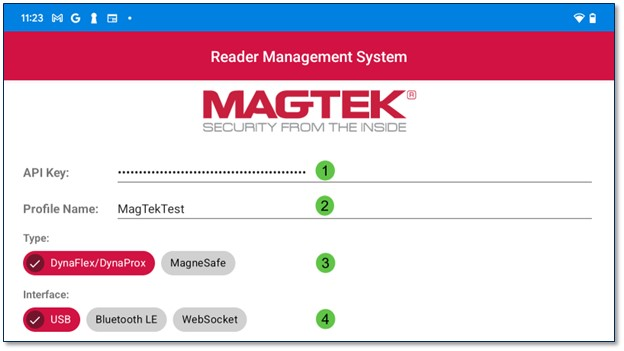

## Connect Tab
The Connect Tab will connect a device to the RMS app. The upper portion of the tab contains:

>1. API Key: This field is automatically populated when a device is connected, the characters are masked for security reasons. Although the field is editable, it is not recommended to alter the API Key field.  
>2. Profile Name: The Profile Name will be provided during onboarding.  
>3. Device Type: There are two device type options, DynaFlex/DynaProx and MagneSafe.  
>4. Interface Type: There are three interface types, USB, Bluetooth LE, and WebSocket for WLAN-enabled devices.  

