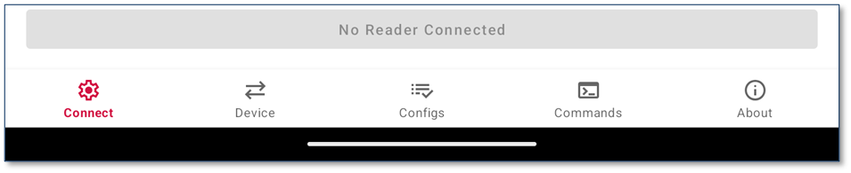

The main User Interface consists of five tabs located at the bottom of the page. These tabs are labeled as follows:  
* Connect  
* Device  
* Configs  
* Commands  
* About  

The Active Tab icon will be highlighted red as illustrated above.

