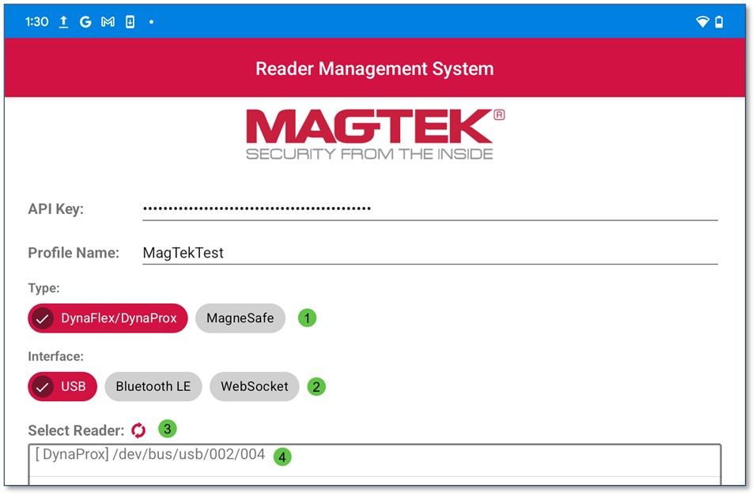
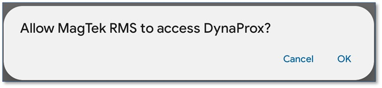

## Connect Via USB Cable
To connect to a device via USB, plug the device into a compatible Android device. 
1.	Select the Device Type
2.	Select the Interface Type
3.	The Refresh   button will refresh the list of available devices.
4.	Tap on the Device Name to connect.

Press OK to allow RMS to access the device. 

