

<button class="btn js-toggle-dark-mode">Preview dark color scheme</button>

| [DynaFlex II] [Product Family] [Document Installation and Operation Manual]                                                                                                                   |
|-------------------------------------------------------------------------------------------------------------------------------------------------------------------------|
| 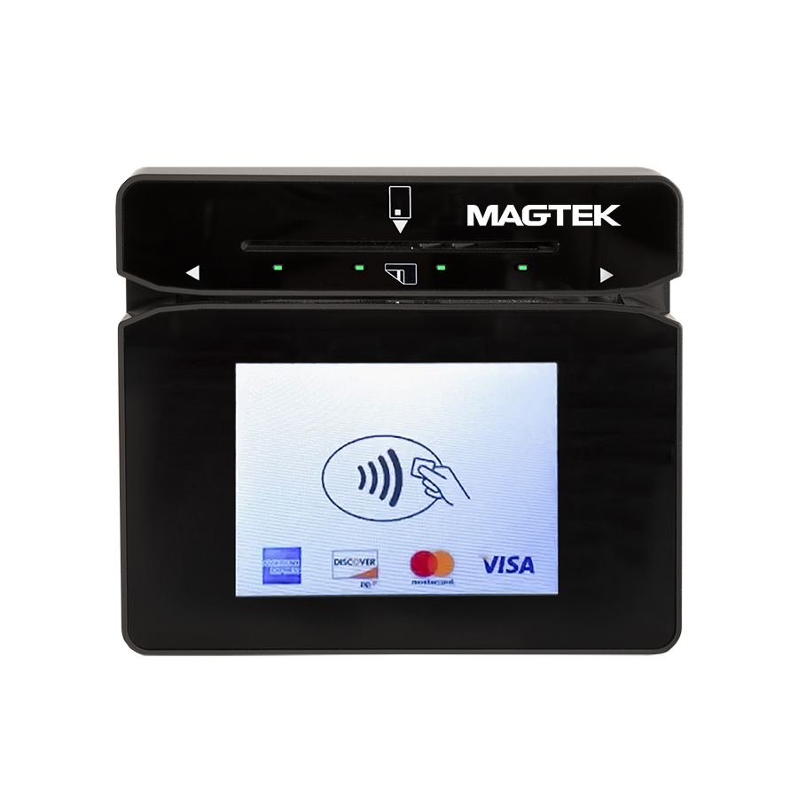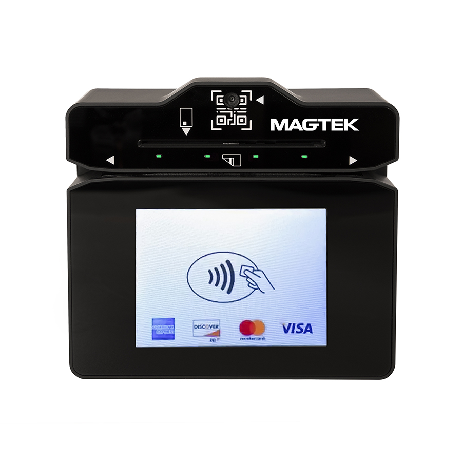 |
| June 2025  Document Number: D998200554-101 REGISTERED TO ISO 9001:2015                                                                                                  |

Copyright © 2006 - 2025 MagTek, Inc.

Printed in the United States of America

information in this publication is subject to change without notice. MagTek
cannot be held liable for any use of the contents of this document. Any changes
or improvements made to this product will be included in the next publication
release. If you have questions about specific features and functions or when
they will become available, please contact your MagTek representative.

MagTek®, MagnePrint®, and MagneSafe® are registered trademarks of MagTek, Inc.

Magensa™ is a trademark of MagTek, Inc.

AAMVA™ is a trademark of AAMVA.

American Express® and EXPRESSPAY FROM AMERICAN EXPRESS® are registered
trademarks of American Express Marketing & Development Corp.

D-PAYMENT APPLICATION SPECIFICATION® is a registered trademark of Discover
Financial Services CORPORATION

MasterCard® is a registered trademark and PayPass™ and Tap & Go™ are trademarks
of MasterCard International Incorporated.

Visa® and Visa payWave® are registered trademarks of Visa International Service
Association.

ANSI®, the ANSI logo, and numerous other identifiers containing "ANSI" are
registered trademarks, service marks, and accreditation marks of the American
National Standards Institute (ANSI).

ISO® is a registered trademark of the International Organization for
Standardization.

UL™ and the UL logo are trademarks of UL LLC.

PCI Security Standards Council® is a registered trademark of the PCI Security
Standards Council, LLC.

EMV® is a registered trademark in the U.S. and other countries and an
unregistered trademark elsewhere. The EMV trademark is owned by EMVCo, LLC. The
Contactless Indicator mark, consisting of four graduating arcs, is a trademark
owned by and used with permission of EMVCo, LLC.

The *Bluetooth*® word mark and logos are registered trademarks owned by
Bluetooth SIG, Inc. and any use of such marks by MagTek is under license.

Google Play™ store, Google Wallet™ payment service, and Android™ platform are
trademarks of Google LLC.

Apple Pay®, iPhone®, iPod®, Mac®, and OS X® are registered trademarks of Apple
Inc., registered in the U.S. and other countries. iPad™ is a trademark of Apple.
Inc. App StoreSM is a service mark of Apple Inc., registered in the U.S. and
other countries. IOS is a trademark or registered trademark of Cisco in the U.S.
and other countries and is used by Apple Inc. under license.

Microsoft®, Windows®, and .NET® are registered trademarks of Microsoft
Corporation.

MIFARE, the MIFARE logo, MIFARE Ultralight, MIFARE Plus, MIFARE Classic, MIFARE
FleX, DESFire, and MIFARE4Mobile are registered trademarks of NXP B.V.

All other system names and product names are the property of their respective
owners.

Table 1 - Revisions

| Rev Number | Date          | Notes                                                                                                                                                                                                                                                                                                                                |
|------------|---------------|--------------------------------------------------------------------------------------------------------------------------------------------------------------------------------------------------------------------------------------------------------------------------------------------------------------------------------------|
| 10         | Feb 21, 2023  | Initial release                                                                                                                                                                                                                                                                                                                      |
| 11         | Aug 08, 2023  | Change WebSocket connection UI from letter “C” to icons; misc. corrections and clarifications.                                                                                                                                                                                                                                       |
| 12         | Oct 05, 2023  | Add section **4.8.10 How to Enter Tip**; section **4.8.11 How to Enter Sale Amount**                                                                                                                                                                                                                                                 |
| 13         | Jan 23, 2024  | Add section **4.5.1 How to Play a Sequence of Tones;** Add references to GWST set up guide and Product Specific Programmer’s Manual to section **1 Introduction.**                                                                                                                                                                   |
| 100        | July 30, 2024 | Complete rewrite of sections **1 Introduction, 2 Inspection, Handling** and Storage**, 3 Installation, 4 Operation;** Updated coversheet photos with current device appearance                                                                                                                                                       |
| 101        | June 5, 2025  | Add MIFARE Plus, remove MIFARE Lite in **4.8.5 How to Tap Contactless NFC Tags / MIFARE Classic / MIFARE DESFire /MIFARE Plus Cards and Send Pass-through Commands;** Update **Appendix A Technical Specifications** storage and operating relative humidity values from 5% to 90% RH non-condensing to Up to 90% RH non-condensing. |

# Table of Contents

# Introduction

DynaFlex II is a secure card reader authenticator engineered for attended,
unattended, and mobile payment environments. The reader features a magnetic
stripe reader, EMV chip reader for both contact and contactless cards, an
optional barcode reader, and support for NFC-enabled mobile wallets such as
Samsung Pay®, Google Pay®, Apple Pay®, and Apple VAS. DynaFlex II communicates
with host devices via USB or wireless local area network (WLAN) on pin entry
devices (PED). DynaFlex II products are compatible with iOS, Android, and
Windows operating systems.

For details on how to set up Google Wallet Smart Tap for DynaFlex II, see
**D100006469** **DYNAFLEX, DYNAPROX, DYNAFLEX II GO FAMILY - GOOGLE WALLET SMART
TAP SETUP GUIDE.** For details on how to set up Apple VAS for DynaFlex II, see
**D998200597 DYNAFLEX II GO PROGRAMMER'S MANUAL (COMMANDS).**

## About Terminology

In this document, DynaFlex II products are referred to as the **device** or
inclusively as **DynaFlex II products**. They are designed to be connected to a
**host**, which is a piece of general-purpose electronic equipment which sends
commands and data to, and receives data from, the device. Host types include PC
and Mac computers/laptops, tablets, and smartphones. The host must have
**software** installed that communicates with the device and is capable of
processing transactions. During a transaction, the host and its software
interact with the **operator**, such as a customer service representative, while
the device interacts with the **cardholder** (even if the cardholder is using a
virtual representation of the card account, such as a smartphone).

Throughout this document:

-   **DynaFlex II Product Family** refers to all devices in the DynaFlex II
    family, including all DynaFlex II models and DynaFlex II PED models.
-   **DynaFlex II PED** refers to DynaFlex II PED products with a display,
    including those with a kiosk back cover and barcode reader.
-   **DynaFlex II** refers to DynaFlex II devices that are not equipped with a
    touchscreen display, including those with a kiosk back cover and barcode
    reader.

## Magensa Services

DynaFlex II products can be paired with Magensa Services to make the
certification cycle easier and remove unencrypted data from the payment
environment. A service representative will collaborate with you to determine if
Magensa Decrypt, Magensa Decrypt and Forward, or the Magensa Payment Protection
Gateway is best for you.

## MagTek Support

MagTek offers developer tools, including free software developer kits with APIs.
Support is available at <https://www.magtek.com/support>. For faster
development, use MagneFlex Prism, a suite of interface tools for browser and
middleware applications that streamline the development process. Instead of
creating multiple interfaces for the hardware device, POS application, and
gateway, you can use MagneFlex. It drives the hardware, interfaces with the POS
app, and handles data processing commands.

## Available Models and Accessories

Table 2 - Available Models and Options

| Part No.                                                                                    | Description                                                       | Display     | Connection(s)      |
|---------------------------------------------------------------------------------------------|-------------------------------------------------------------------|-------------|--------------------|
| 21078307                                                                                    | DYNAFLEX II, PCI, BLACK, USB                                      | None        | USB-C              |
| 21078309                                                                                    | DYNAFLEX II PED, PCI, TOUCHSCREEN DISPLAY, BLACK, USB             | Touchscreen | USB-C              |
| 21078311                                                                                    | DYNAFLEX II PED, PCI, TOUCHSCREEN DISPLAY, BLACK, WLAN            | Touchscreen | USB-C Wireless LAN |
| 21078314                                                                                    | DYNAFLEX II KIOSK, PCI, BCR, BLACK, USB                           | None        | USB-C              |
| 21078321                                                                                    | DYNAFLEX II PED, KIOSK, PCI, TOUCHSCREEN DISPLAY, BLACK, USB      | Touchscreen | USB-C              |
| 21078322                                                                                    | DYNAFLEX II, KIOSK, PCI, BLACK, USB                               | None        | USB-C              |
| 21078325                                                                                    | DYNAFLEX II PED, KIOSK, PCI, TOUCHSCREEN DISPLAY, BLACK, WLAN     | Touchscreen | USB-C Wireless LAN |
| 21078331                                                                                    | DYNAFLEX II, PCI, BCR, BLACK, USB                                 | None        | USB-C              |
| 21078332                                                                                    | DYNAFLEX II PED, PCI, TOUCHSCREEN DISPLAY, BCR, BLACK, WLAN       | Touchscreen | USB-C Wireless LAN |
| 21078333                                                                                    | DYNAFLEX II PED, PCI, TOUCHSCREEN DISPLAY, BCR, BLACK, USB        | Touchscreen | USB-C              |
| 21078334                                                                                    | DYNAFLEX II PED, KIOSK, PCI, TOUCHSCREEN DISPLAY, BCR, BLACK, USB | Touchscreen | USB-C              |
| All models are black by default and have countertop, handheld, and custom mounting options. |                                                                   |             |                    |

**Table 3 – DynaFlex II Accessories**

| Part \#    | Description                                           | Accessory Notes                                  |
|------------|-------------------------------------------------------|--------------------------------------------------|
| 1000006016 | CABLE, USB A - C, 6FT, DYNAFLEX                       | Included with DynaFlex products                  |
| 1000006017 | CABLE, USB C - C, 6FT, DYNAFLEX                       | Optional, specify in order                       |
| 21078006   | CHARGING STATION, DYNAFLEX                            | Optional, specify in order                       |
| 96700004   | CLEANING CARD, DOUBLE SIDED                           | Optional, specify in order                       |
| 1000008559 | FOOT, BACK, SIDE A, ADHESIVE MOUNTING STRIP, DYNAFLEX | Optional, specify 1 ea. for complete replacement |
| 1000008560 | FOOT, BACK, SIDE B, ADHESIVE MOUNTING STRIP, DYNAFLEX | Optional, specify 1 ea. for complete replacement |
| 1000008561 | FOOT, FRONT, ADHESIVE MOUNTING STRIP, DYNAFLEX        | Optional, specify 1 ea. For complete replacement |

## About DynaFlex II Components

The major components of the DynaFlex II product family are detailed in this
section. For models without a touchscreen display (DynaFlex II and DynaFlex II
Kiosk), the components are identical however, the touchscreen and its bezel are
replaced with a faceplate displaying the contactless indicator logo at the
optimal contactless landing zone (see Error! Reference source not found.).

Figure 1 - DynaFlex II Major components

DynaFlex II PED models without a barcode reader are also identical however, the
edge incorporating the barcode reader is a single straight line and there is no
QR code marking on the face of the device (see **Figure 2**).

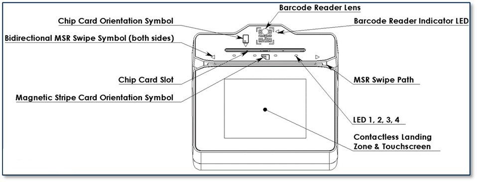

Figure 2 - DynaFlex II PED BCR Major Components

**Figure 3** illustrates the major components of the optional charging station.
Note, the charging station is only compatible with non-kiosk models of the
device.

Figure 3 - Charging Station Major Components

# Inspection, Handling and Storage

|                                                                                                                                                                                                                            |
|----------------------------------------------------------------------------------------------------------------------------------------------------------------------------------------------------------------------------------------------------------------------------|
| Proper handling of the device throughout delivery, assembly, shipping, installation, usage, and maintenance is very important. Not following the guidelines in this document could damage the device, render it inoperable, and/or violate the conditions of the warranty. |

## Inspection

Before unpacking the device, it is important to inspect its secure packaging to
make sure it has not been tampered with in storage or in transit. MagTek
provides details for inspecting the integrity of the device’s secure packaging
in **D998200524 DynaFlex II Family, Package Inspection**

It is important to inspect a new device regularly and thoroughly before
deployment and a device in live usage (including its immediate surroundings), to
make sure malicious individuals have not tampered with it or its surroundings.
MagTek recommends conducting inspection training for all device operators and an
inspection schedule with checkpoints in place to make sure operators are
performing inspections as specified and as scheduled. MagTek provides
easy-to-follow device inspection references in **D998200524 DynaFlex II PED
Products, Device Inspection**, **D998200539- DynaFlex II PED Kiosk Products,
Device Inspection**, *D***998200563 DynaFlex II Products, Device Inspection,**
*and* **D998200566** **DynaFlex II Kiosk Products, Device Inspection.**

## Handling to Avoid Damage

Upon receiving the device, inspect it to make sure it originated from an
authentic source and has not been tampered with. For details, see **D998200524
DynaFlex II PED Products, Device Inspection**, **D998200539 DynaFlex II PED
Kiosk Products, Device Inspection**, **D998200563 DynaFlex II Products, Device
Inspection,** *and* **D998200566** **DynaFlex II Kiosk Products, Device
Inspection,** available from MagTek.

From device delivery through assembly, shipping, installation, usage, and
maintenance, the device must not be exposed to conditions outside the ratings in
**Appendix A Technical Specifications**.

If the device is exposed to cold temperatures, adjust it to warmer temperatures
gradually to avoid condensation, which can interfere with the operation of the
device or cause permanent damage.

Do not drop or shake the device.

For information about ongoing maintenance of the device, such as cleaning, see
section **5 Maintenance.**

## Handling to Avoid Accidental Tamper

DynaFlex II products implement active tamper detection, which uses a small
amount of electricity even when the device is completely powered off. The device
primarily powers its active tamper detection circuitry using its rechargeable
battery to back up the coin cell. Devices with a rechargeable battery ship with
the battery charged to between 45% and 65%, which provides a shelf life of up to
10 years. However, if the rechargeable battery completely discharges or the
device does not contain a rechargeable battery, the device continues to power
its active tamper detection circuitry using its non-rechargeable backup battery,
which provides an additional 5 years of backup shelf life across the entire life
of the device but does not recharge. If the rechargeable battery and the backup
battery are both allowed to completely discharge, the device’s tamper detection
engages and locks down the device, and it must be returned to the manufacturer
to reset.

To avoid accidental tamper events and to optimally condition the battery, follow
these precautions:

-   Temperature is the most critical factor in extending battery life and
    preserving battery charge. Store the device at the lowest reasonable
    temperatures within its specified storage temperature range (see **Appendix
    A Technical Specifications**). Storing below 77°F / 25°C is optimal.
-   Fully charge the device immediately upon receipt to extend its shelf life
    (see section **4.6.3 How to Charge the Battery**).
-   Before storing the device, charge the battery to less than 100% (60% is
    optimal).
-   Before storing the device, power it off completely. See section **4.6.4 How
    to Power On / Wake Up from Standby Mode / Power Off**.
-   When stored, charge the device for one hour every 6 months to keep the
    battery chemistry in optimal condition and to ensure it does not completely
    discharge.
-   Do not drop or shake the device.

# Installation

Installing DynaFlex II products is straightforward: The manufacturer or acquirer
configures the preferred settings, keys, terminal, and payment brand settings
before deployment; end users need only set up a host with appropriate software,
configure the software, and connect the device to the host. This section
provides general information about inspecting, connecting, and installing
**DynaFlex II products**.

## About Host Software

In any solution, **DynaFlex II products** are connected to a host, which must
have software installed that can communicate with the device, and which is
capable of processing transactions. To set up the host to work with **DynaFlex
II products**, follow the installation and configuration instructions provided
by the vendor of the host or the host software. For information about developing
custom host software, see section **6 Developing Custom Software**.

## Connecting to a Host

### About Connecting to a Host

The following sections provide information on how to connect **DynaFlex II
products** to a host via USB.

### How to Connect DynaFlex II Products to a Host or Charger via USB

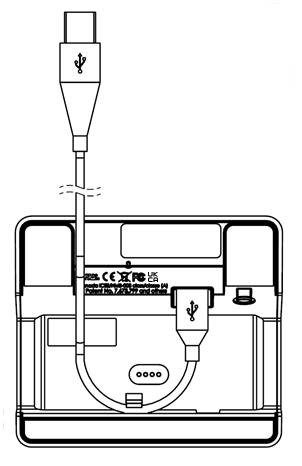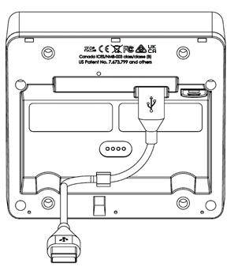

Figure 4 - Connecting to a USB Host or USB Charger. Left: Countertop Models.
Right: Kiosk Models

To connect **DynaFlex II products** to a USB host or charger using the USB-C
port, follow these steps (for reference see **Figure 4** and section **1.5 About
DynaFlex II Components**):

1.  For best results, use the cable that is included with the device or another
    cable from **Table 3 – DynaFlex II Accessories** on page **7**. These cables
    are designed specifically for DynaFlex II products and include ferrite
    shielding at both ends of the cable to reduce emissions and interference. If
    the solution design requires an alternate cable, contact MagTek for
    assistance with ferrite selection and placement, and with connector overmold
    design.
2.  Connect the USB-C end of the cable to DynaFlex II or DynaFlex II PED.
3.  If you plan to route the cable out the back of the device, route the cable
    through the cable management clip to change its direction. Even if you are
    not routing out the back, you may use the cable clip for strain relief, to
    help stabilize the mechanical connection when cardholders or operators move
    the device or the cable.
4.  Route the cable in the desired direction (e.g., out the back, left, right,
    down into the countertop, or into the mounting compartment of a kiosk).
5.  Connect the other end of the USB cable to the charger or to the host’s USB
    port.
6.  As soon as the device starts receiving power through USB, it automatically
    powers on.
7.  If the specific device serial number you are connecting has not been
    connected to the host before, the device shows **Welcome** on the display,
    and the Windows system tray on the host reports it is **Setting up a
    device** (see **Figure 5 - Setting Up a Device**), When installation is
    complete (approximately 30 seconds later depending on the host), Windows
    reports **Device is ready**,(see **Figure 6 - Device is Ready**) and the
    device shows in Windows Device Manager under **Human Interface Devices** as
    two devices: **HID-compliant vendor-defined device** with VID **0801** and
    PID **2020**, and **USB Input Device**.

Figure 5 - Setting Up a Device

Figure 6 - Device is Ready

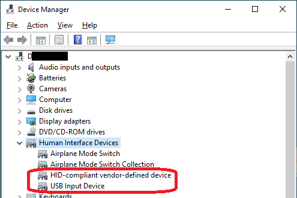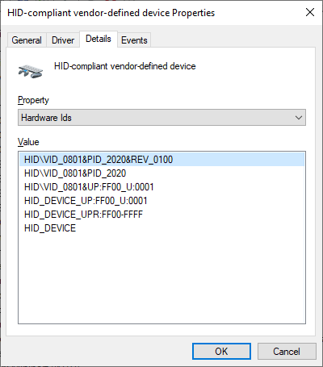

8.  After successfully connecting to the host operating system via USB, devices
    with a touchscreen display a **Welcome** screen or a customizable graphic.
9.  The operating system may put the device into **USB Suspend** mode. See
    section **4.6.6 About USB Suspend**.

## Mounting

### About Mounting

The DynaFlex II product line offers versatile mounting solutions, including:

-   **Integrated Slip-Resistant Adhesive Strips**: The underside of the device
    features three adhesive mounting strips (see **Figure 7**) that provide
    secure attachment to any clean, non-porous surface. These strips come with a
    protective film that must be removed before installing onto a surface.

Figure 7 - Adhesive Mounting Strip and Protective Film

-   **Lanyard Mount Point**: The integrated mount point allows the device to be
    hung or carried, making it easy to store and handle, particularly in
    grab-and-go payment environments (see **Figure 8**).

Figure 8 - Lanyard Mount Point

-   **Charging Station Compatibility (Non-Kiosk Models)**: Non-kiosk versions of
    the device can be placed in an optional charging station. This station can
    be used in conjunction with the lanyard mount point for quick access and
    easy drop-in charging between handheld uses.

Figure 9 - Charging Station Compatibility

-   **Custom Mounting Options**: DynaFlex II devices can be attached to custom
    mounting brackets or housed within an enclosure, enabling integration into
    larger system designs.

### How to mount DynaFlex II

1.  Verify that the protective film has been removed from the adhesive mounting
    strips located on the underside of the device (see **Figure 7**).
2.  Mount DynaFlex II devices onto a smooth, flat, and non-porous surface by
    pressing the device firmly using the adhesive mounting strips (see **Figure
    10**).

Figure 10 - Mounting DynaFlex onto a Nonporous Surface

3.  Do not mount the device on rough, dirty, or uneven surfaces.
4.  To uninstall the device, twist it to disengage the mounting feet from the
    mounting surface.

For instructions on using the optional charging station, refer to Section
**3.3.4 How to Mount the Charging Station**.

If your installation requires custom mounting brackets, contact your MagTek
representative for design advice and assistance from MagTek’s Engineering team.

### How to Mount DynaFlex II Kiosk Models

|                                                                                                                                                                                                                                                                                                              |
|--------------------------------------------------------------------------------------------------------------------------------------------------------------------------------------------------------------------------------------------------------------------------------------------------------------------------------------------------------------|
| This document describes how to use DynaFlex II Kiosk models securely. Using the device in any way other than the approved methods described in this document invalidates the PCI PTS POI approval of the device.  Not following the guidelines in this section could damage the device, render it inoperable, and/or violate the conditions of the warranty. |

This section provides information and guidelines for designing the mechanical
aspects of a solution that incorporates DynaFlex II Kiosk models. MagTek
strongly recommends vetting and testing solution designs before finalizing and
deploying them to make sure the design meets all requirements (e.g., functional,
legal, security, certification, safety, and so on).

When designing the mechanical portions of a solution that incorporates DynaFlex
II Kiosk models, consider the following:

-   Review section **1.5 About DynaFlex II** Components for an overall
    introduction to the device’s physical features and what they are called.
-   Review **Appendix A Technical Specifications**.
-   Review the information below about overall device dimensions and mounting
    hole locations and use.
-   Determine device orientation. The device supports all four orientations.
-   Review any additional requirements from other agencies, such as PCI and EMV
    solution certification requirements, safety ordinances, and so on, which may
    introduce additional constraints to the design.

Overall dimensions of the device are shown in **Figure 11** and **Figure 12**.
On request, MagTek can provide a 3D model of the device’s envelope to assist
with the mechanical portion of solution design. MagTek strongly recommends
building and testing prototypes with actual devices before finalizing the
solution design.

Figure 11 – DynaFlex II Kiosk Models Overall Dimensions

The screw hole placement on the bottom of DynaFlex II Kiosk models is detailed
in **Figure 12**. The holes are designed to accommodate screw size **M4 x
0.7mm** and a maximum screw depth of 0.315 inches (8mm). The recommended torque
range for installing the screws is 20 to 22 in-lbs. (2.3 to 2.5 N-m).

Figure 12 – DynaFlex II Kiosk Models Mounting Hole Locations

When designing an enclosure or mounting bracket, make sure there is adequate
clearance for cardholders to swipe, insert, and tap. If the solution design
includes metal objects anywhere near the device, including metal enclosures,
ensure that at all points the metal is no further forward than 15mm below the
top face of the device. Proximity to metal can adversely affect the device’s
performance.

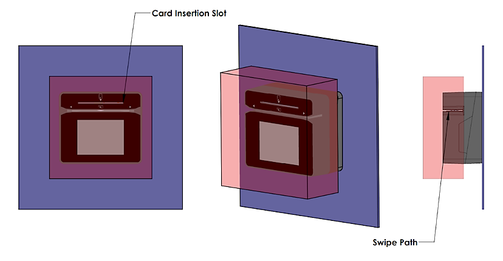

**Figure 13 - Unobstructed View of Card Insertion Slot, Swipe Path and
Contactless Landing Zone**

As a security measure, the device must be installed such that cardholders have a
full, unobstructed view of the housing around the card insertion slot opening
(“entry zone”) and MSR swipe path prior to insertion or swipe (see

**Figure 13**). This is to allow cardholders to easily detect suspicious objects
in or around the swipe path and card slot entry, such as bugs / skimmers /
tapping mechanisms, and their wires or antennas. Be sure to select an
installation height and mounting angle that meet this requirement.

### How to Mount the Charging Station

To mount the optional charging station to a countertop using the four adhesive
mounting strips on the underside of the charging station (see **Figure 15)**,
follow these steps:

1.  Determine where the charging station will be placed.
    1.  Remove the adhesive strip protective film, ensure the mounting surface
        is a clean, smooth, and flat surface. It is important to avoid rough,
        dirty, or uneven surfaces.
    2.  Consider the cable length, cardholder and operator ergonomics, and
        access for cleaning, maintenance, and repair.
    3.  If the charging station will be used for charging in handheld
        operations, unobstructed connection and disconnection of the device from
        the charging station is also a consideration.
2.  Connect the charging station to a USB port or to a USB charger with a
    minimum of 1A current capability. For the best results, use the cable that
    is included with the device. It includes shielding at both ends of the cable
    to reduce interference.
3.  To uninstall, twist the charging station to disengage the adhesive mounting
    strips from any surface.

**Note**: The adhesive mounting strips used to mount the charging station to a
surface may become less effective if dust and or debris accumulate on them. If
this occurs, wipe them down with a damp cloth to restore their adhesive
properties.

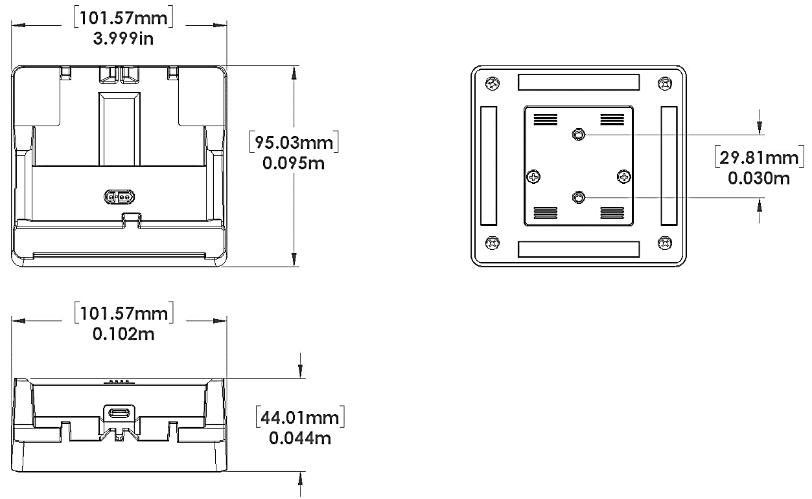

Figure 14 - Charging Station Dimensions

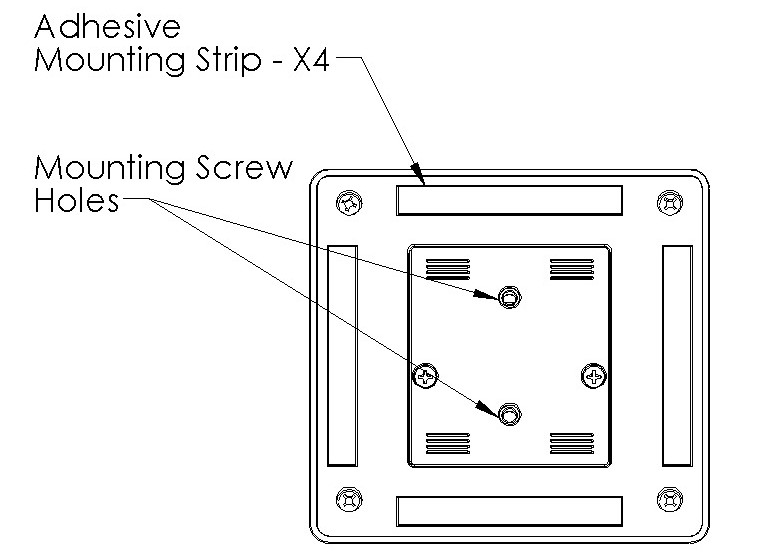

Figure 15 - Charging Station Mounting Surfaces and Screw Holes

To mount the charging station to a countertop, table, or flat surface using the
screw holes on the underside of the charging station (see **Figure 15**), follow
these steps:

1.  Determine where the charging station will be installed.
    1.  Mark the location of the screw holes by placing the device over the area
        where it is to be installed (see **Figure 16**).
    2.  Once the appropriate measurements have been taken and marked, drill the
        screw holes into the installation surface.
    3.  Using (2) M4 x 0.7mm thread pitch (not included) screws, screw up
        through the drilled holes in the mounting surface, see **Figure 17**.
2.  Connect the charging station to a USB port or to a USB charger with a
    minimum of 1A current capability. For the best results, use the cable that
    is included with the device. It includes shielding at both ends of the cable
    to reduce interference.
3.  To uninstall, remove the screws from the underside of the charging station.

Figure 16 – Preparing a Flat Surface for Mounting the Charging Station

Figure 17 - Screw Installation

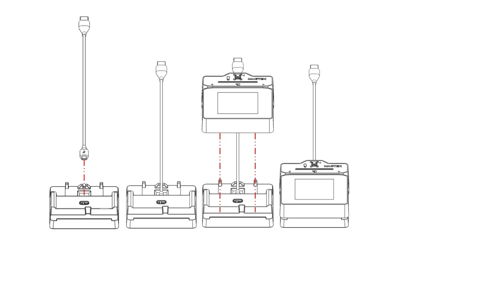

**Figure 18 – Connecting DynaFlex II to the Optional Charging Station**

# Operation

## About Operating Modes

While in use, the DynaFlex II family of products switch between distinct
operating modes. It is crucial for operators to comprehend these modes to
effectively operate the device:

-   **Powered Off Mode** is the shipping and storage mode of the device.
    Operators would not generally use this mode during a work shift or during
    off-shift recharging. It occurs when the operator holds the pushbutton for
    more than 8 seconds (or more than 12 seconds to force immediate power off
    without a proper shutdown sequence), or if the device’s battery is
    critically low and the device is not connected to a USB power source. In
    this mode, the device consumes practically no power. To move the device from
    Powered Off Mode to Active Mode, press the pushbutton for one second with
    the battery charged, or connect the device to USB power. If the device is
    already connected to USB power when it enters Powered Off Mode, it
    automatically powers back on.
-   **Reset Mode** is a transient mode where the device first transitions to
    Powered Off Mode, then automatically powers back on. It occurs when the
    operator presses the recessed switch, or the host sends the Reset Device
    command, or the device automatically performs a daily security reset.
-   **USB Suspend Mode** occurs when the USB host that is providing power to the
    device sends a **USB Suspend** control event to the device to conserve
    power. The device responds by powering off nearly all its modules including
    the display and listening for the USB host to send a **USB Resume** control
    event. To move the device from USB, Suspend Mode to Active Mode, the host
    software must open a USB connection to communicate with the device, which
    signals the operating system that the device is in active use and should be
    allowed to draw full power from the USB port. It is not necessary for the
    host software to send commands to the device at that time.
-   **Active Mode** is the device’s normal “awake” state when it is in use. In
    this mode, the touchscreen display and LEDs are powered on, and the device
    is ready to receive commands from the host. This mode can be divided into
    substates like Active/Host Not Connected, Active/Host Connected, Active/Host
    Communicating, Active/Armed for Read, Active/Reading, and so on. These
    substates differ in the amount of power they consume and are mostly under
    the control of the host software. To move the device from Active Mode to
    Powered Off mode, press and hold the pushbutton for 8 seconds. If the device
    does not respond, continue holding the pushbutton for longer than 12 seconds
    to force immediate power off without a proper shutdown sequence. To move the
    device from Active Mode to Reset Mode, press the recessed switch.

## Operation Overview

During normal operation, the operator initiates a transaction from the host, and
the cardholder interacts with the device. Devices with a touchscreen display
provide on-screen prompts and interactive features such as buttons and signature
capture.

Transaction types may include sales, refunds, voids, authorization, new
accounts, teller window applications, checking, savings, mortgages, retail
transactions, or any other type of transaction where there is interaction
between the cardholder and the operator. For each transaction type, the host
software can direct the device to prompt the cardholder for any combination of
magnetic stripe swipe, EMV contact card insertion, and/or contactless payment
tap, and the transaction flow on the device may differ depending on what the
host software specifies and what the cardholder does. Section **4.8 Using the
Reader** provides examples of the cardholder experience for each type of
payment. **Figure 19** shows a typical point of sale (POS) transaction sequence.

If the device cannot read payment data, the host software may direct it to
prompt the cardholder to repeat the action or request the cardholder revert to a
different form of payment (such as using the magnetic stripe reader as a
fallback instead of the chip card insertion slot).

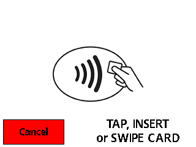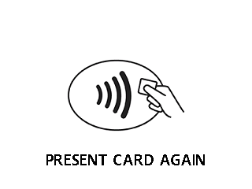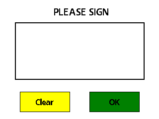

Figure 19 - Typical Transaction Sequence

## About the Status LEDs

DynaFlex II provides four RGB LEDs directly below the chip card insertion slot
(see section **1.5 About DynaFlex II Components**), numbered LED1 through LED4,
which report the device’s current operating status.

-   The meaning of each LED depends on the device’s operating mode. See section
    **4.1 About Operating Modes** and **Table 4 below**. Most of the time,
    operators will check the device’s status using the LEDs when it is in
    **Active Mode** while the device is not performing a transaction.
-   LED colors have specific meanings, as described in **Table 5**. They are
    based on international conventions for traffic light colors, with additional
    colors reserved for unusual / special cases.
-   LED blinking patterns have specific meanings as well, as described in
    **Table 6**. A blinking LED means the device is actively doing something to
    change the state that the LED is indicating and solid indicates a persistent
    state that would require an operator or cardholder to take action to change.
    One major exception is a device-wide functional failure state, such as a
    tamper state, where all LEDs flash urgently to call the attention of an
    advanced operator to intervene.

In this manual, specific combinations of LED colors and blinking patterns are
described in more detail in the sections where they are relevant and use the
same icons in the tables below to indicate color and blinking patterns. For
example, information about how the LEDs show the device’s connection status is
in section **3.2 Connecting to a Host**.

Table 4 – DynaFlex II LED Allocation

| In This Context                              | LED1                                                                                                                              | LED2              | LED3              | LED4             |
|----------------------------------------------|-----------------------------------------------------------------------------------------------------------------------------------|-------------------|-------------------|------------------|
| Active Mode: Not Armed for a Tap Transaction | Power                                                                                                                             | Connection        | Reserved          | Card Read Result |
| Active Mode: Armed for a Tap Transaction     | Armed for Tap                                                                                                                     | Tap Read Progress | Tap Read Progress | Card Read Result |
| Device-Wide Failure                          | During major failures (such as tamper), **LED1-LED4** report the nature of the failure based on the steps required to resolve it. |                   |                   |                  |

Table 5 – DynaFlex II LED Colors

| Color                                                   | Means                                                                                                                |
|---------------------------------------------------------|----------------------------------------------------------------------------------------------------------------------|
|  Red    | Stop or stopped  Example: LED1 is red. **Stop** using device: Battery is about to run out of charge.                 |
|  Yellow | Wait or waiting  LED2 will show status for Access Point connection: Green connected, yellow waiting for connection.  |
|  Green  | Go, going, or went. LED3 will show status for WebSocket connection: Green connected, yellow Waiting for connection.  |
| Other Colors                                            | Reserved                                                                                                             |

Table 6 – DynaFlex II LED Patterns

| Color                                                                                                                                                                                                        | Means                                                                                                                                                                                                                                                                      |
|--------------------------------------------------------------------------------------------------------------------------------------------------------------------------------------------------------------|----------------------------------------------------------------------------------------------------------------------------------------------------------------------------------------------------------------------------------------------------------------------------|
| Solid        | **Solid** LEDs require an operator or cardholder to take action to change the state the LED is reporting.  Example: Host is connected. Cardholder or host would have to disconnect. Example: Host is disconnected. Host would have to initiate connection.                 |
| Blinking     | **Blinking** LEDs indicate the device is in the process of doing / attempting something. Blink duty cycle and blink period are selected to show urgency or ongoing progress through a series of steps.  Example: Device is attempting to connect to the WLAN access point. |
| Short time   | LEDs sometimes illuminate for a **short time** to indicate a process has ended (success or failure) and the device is going to transition to another state soon.  Example: Successful card read.                                                                           |

## About the Touchscreen Display

This section applies only to **DynaFlex II PED** models, which are equipped with
a display and touchscreen. When using a DynaFlex II model that does not have a
display, the device reports ongoing status to the host, which must present any
necessary prompts and status information to the operator and / or the
cardholder.

### Welcome Page / Active Idle Page

When the device is powered on, in Active mode, and idle (not performing a
transaction or displaying host-driven user interface prompts), it displays
**Welcome** or a custom graphic if it is configured to do so. If the host
software is designed to receive and respond to cardholder input messages,
pressing any area on the touchscreen when it is idle may trigger the host to
perform an operation, such as starting a transaction. For more information about
custom graphics, see **D998200383 DynaFlex and DynaFlex Pro Programmer’s Manual
(COMMANDS)**.

WLAN enabled devices also report current status in a set of icons at the top of
the **Welcome** screen. **Table 7 below** shows the icons and describes their
meanings. For example, in **Figure 20**, the device is connected to a USB host
and wireless access point, TLS is enabled, the battery level is OK, the device
is charging, and it is idle, waiting for the host to initiate a transaction.

Table 7 – Status Icon Meaning

| Status Icon                                                                                                                            | Meaning                                                                                                                                                                                                                                                |
|----------------------------------------------------------------------------------------------------------------------------------------|--------------------------------------------------------------------------------------------------------------------------------------------------------------------------------------------------------------------------------------------------------|
|                                                                                        | Device’s Active Connection is set to USB, and the device has successfully established a USB communication connection with the host.                                                                                                                    |
|                                                                                        | WLAN is not configured                                                                                                                                                                                                                                 |
|                                                                                        | Blinking to show device is connecting to a wireless access point                                                                                                                                                                                       |
| ****                                                                                   | WebSocket is active or connected                                                                                                                                                                                                                       |
| ****                                                                                   | WebSocket is inactive or disconnected                                                                                                                                                                                                                  |
|                                                                                        | Device’s Active Connection is set to 802.11 wireless, and the device is connected to a wireless access point. The number of bars indicates the strength of the signal the device is receiving from the wireless access point (commonly known as RSSI). |
|  and                                   | TLS security on the 802.11 wireless connection is Disabled (red open padlock) TLS security on the 802.11 wireless connection is Enabled (black closed padlock)                                                                                         |
|         | Battery is fully charged.                                                                                                                                                                                                                              |
|              | Battery is OK, between 20% and 95% charged.                                                                                                                                                                                                            |
|        | Battery is low, between 10% and 20% charged.                                                                                                                                                                                                           |
|  | Battery is critically low, between 3% and 10% charged.                                                                                                                                                                                                 |
|             | Battery is empty, below 3% charged.                                                                                                                                                                                                                    |
|           | Battery is charging.                                                                                                                                                                                                                                   |

Figure 20 - Welcome Page Examples

The device may show text other than “Welcome” when it is Active / idle under
certain conditions:

-   **OFFLINE / Tampered** indicates the device has detected an attempt to
    tamper with it (for example, physical tampering, out-of-spec temperature
    range, electrical attack). If this occurs, remove the device from service
    and set it aside in a secure location for possible forensic analysis, and
    contact the manufacturer or your reseller for support. This mode can only be
    reset in the manufacturing facility.
-   **OFFLINE / Tamper not active** indicates the device’s tamper detection
    system is not activated. The device is not configured properly. If this
    occurs, remove the device from service and contact the manufacturer or your
    reseller for support.
-   **OFFLINE / Security not activated** indicates the device’s data security
    features have not been activated. The device is not configured properly. If
    this occurs, remove the device from service and contact the manufacturer or
    your reseller for support.
-   **OFFLINE / Security activated** indicates the device is ready to have keys
    injected. If this occurs, remove the device from service and contact the
    manufacturer or your reseller for support.
-   **OFFLINE / HW missing** indicates the device cannot detect one or more of
    its installed modules. This may indicate a mechanical or electrical failure.
    If this occurs, remove the device from service and contact the manufacturer
    or your reseller for support.
-   **OFFLINE / Keys missing** indicates the device is missing one of the
    encryption keys that are critical to its data security systems. The device
    needs to have keys properly injected. If this occurs, remove the device from
    service and contact the manufacturer or your reseller for support.
-   **OFFLINE** without any clarifying text indicates the device is not ready
    for normal operation.

### Device Information Page

While powering on, the touchscreen briefly displays a page of information about
the device, including the installed firmware part numbers and versions and other
identifying information. To determine a device’s PCI certification status,
compare the contents of this screen to the device’s listing on
[www.pcisecuritystandards.org](http://www.pcisecuritystandards.org), **Approved
PTS Devices**. Note that in PCI listings, lowercase “x” is a wildcard meaning
‘any single character.

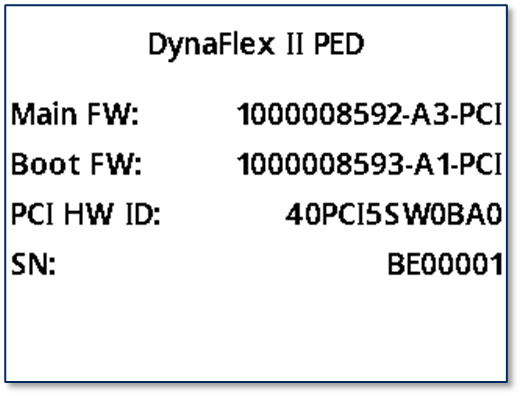

Figure 21 - Device Information Screen

To view details pertinent to the device’s PCI certification status on WLAN
enabled devices - including the installed firmware part numbers and versions as
well as other identifying information (see **Figure 22**) complete the following
actions:

While on the **Welcome** screen, press the **Pushbutton** and hold for 3 beeps
to access the **Settings** menu, then select **Firmware** and **Main** to return
to the **Welcome** screen, select **Back** and **Exit**

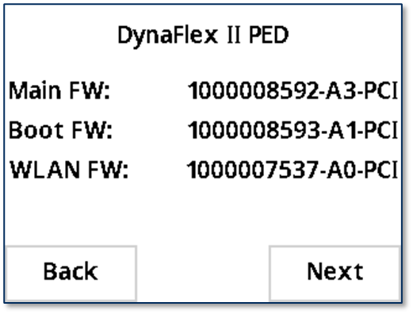
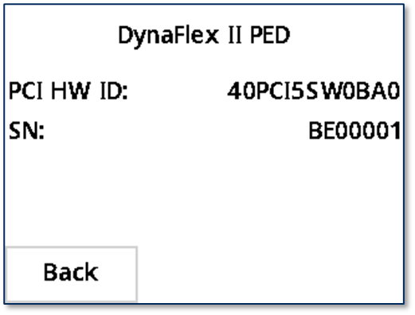

Figure 22 - Device Information Screen for WLAN device

### Connection Status Page

In addition to the icons at the top of the display, WLAN enabled devices have a
**WLAN Status** screen that reports more details about the device’s 802.11
wireless (see **Figure 23**) connection. To access it, while on the **Welcome**
screen, press the **Pushbutton** and hold for three beeps to get to the
**Settings** menu, then select **Connection**, and **WLAN Settings**, then
select **WLAN Status**. To return to the **Welcome** screen, select **Back** and
**Exit**

Figure 23 - WLAN Status Screen

### SoftAP Page

To configure WLAN enabled devices via SoftAP mode (see **Figure 24)** complete
the following steps:

1.  While on the **Welcome** screen, press the **Pushbutton** and hold for three
    beeps to get to the **Settings** menu.
2.  Press **Connection**
3.  Press **WLAN Settings**
4.  Press **SoftAP Mode**.

To return to the **Welcome** screen, select **Back** and **Exit**.

Figure 24 – SoftAP Mode screen

## About Sounds

DynaFlex II products are equipped with an audio transducer (audible signal) that
provides feedback to operators and cardholders about the internal state of the
device:

-   The device sounds one short beep after it has successfully read a
    contactless tap, and the cardholder can safely remove the card or device
    from the contactless landing zone.
-   The device emits short beeps continuously when a transaction is complete,
    but the card is still present in the insertion slot.
-   The device emits two beeps when reading a card or contactless payment device
    to indicate that a read error has occurred.
-   The device sounds two beeps when an operator cancels a pending EMV
    transaction.

The device provides an internal setting the host can use to adjust the global
system volume. The device does not provide an interface to change the volume
setting directly via buttons or the touchscreen. If the device is too quiet or
too loud:

-   Make sure the device is ordered from the manufacturer with the desired
    volume setting.
-   Check to see whether the host software you are using provides a feature to
    check and/or adjust the volume setting.
-   If the host software does not provide that feature, request help from the
    development team that built the host software to check / change the volume
    setting. For details, see **D998200383 DYNAFLEX PRODUCTS PROGRAMMER’S MANUAL
    (COMMANDS)**.

### How to Play a Sequence of Tones

DynaFlex II devices can play a customizable sequence of tones if configured to
do so. To play a sequence of tones, follow these steps:

1.  Make sure the device is in idle state.
2.  Send a Buzzer command to the device to play a sequence of tones. For
    details, see **D998200383 DYNAFLEX PRODUCTS PROGRAMMER’S MANUAL
    (COMMANDS)**.

## Power Management

### About Power

This device incorporates a built-in Lithium-ion rechargeable battery, which
requires little maintenance. It is not subject to “charge memory” and therefore
does not require deep discharge cycles to restore its charge capacity like many
other battery technologies.

When properly powered through its USB port, the device powers on automatically,
remains powered on provided the host does not put it in USB Suspend mode, and
draws power both for operation and for recharging the battery (see section
**4.6.3 How to Charge the Battery**). While charging, the device consumes more
power from the USB connection than when the battery is fully charged. The device
stops charging the battery when it determines it is optimally full, to prevent
overcharging.

If the device is not connected to USB power, or if the USB connection does not
provide enough power, the device powers itself using the rechargeable battery.
When the battery discharges to a critically low level, the device powers down
automatically. It is important to not allow the device’s main battery to remain
completely discharged any longer than necessary. For information about how to
prevent this from occurring during handling and storage, see section **2.3
Handling to Avoid Accidental Tamper**. To prevent this from occurring during
regular use:

-   Do not allow the device’s main battery to remain completely discharged for
    prolonged periods of time, and ideally do not allow it to ever reach 0%.
    Create a charging schedule that recharges the battery well before it is
    fully depleted.
-   When the device is not connected to USB power, preserve the battery’s charge
    when it is not in use by putting the device into Sleep mode or powering it
    off completely (see section **4.6.4 How to Power On / Wake Up from Standby
    Mode / Power Off**).

The device’s rechargeable battery is designed to last hundreds of charging
cycles, but with time and / or with use, its charge capacity will naturally
degrade. Following the recommendations in this section will maintain the
battery’s charge capacity for as long as possible.

### How to Check Battery Level

When powered on, DynaFlex II starts in the idle / waiting state and shows a
**Welcome** page on the touchscreen. See **4.6.4 How to Power On / Wake Up from
Standby Mode / Power Off.** This page indicates battery level and charge status
on the top right corner of the screen. See **Figure 25 Welcome Screen.**

Figure 25 Welcome Screen

The table of symbols below describes the various power level and charge status
icons. See **Table 8 - Battery Power Level and Charge Status Icons.**

Table 8 - Battery Power Level and Charge Status Icons

| Battery Power Level and Charge Status Icons                                                                                            |                                                        |
|----------------------------------------------------------------------------------------------------------------------------------------|--------------------------------------------------------|
|         | Battery is fully charged.                              |
|              | Battery is OK, between 20% and 95% charged.            |
|        | Battery is low, between 10% and 20% charged.           |
|  | Battery is critically low, between 3% and 10% charged. |
|             | Battery is empty, below 3% charged.                    |
|           | Battery is charging.                                   |

### How to Charge the Battery

|                                                                                            |
|--------------------------------------------------------------------------------------------------------------------------------------------|
| Per UL requirements, the device is designed to not recharge its internal battery when the external temperature is below 0°C or above 40°C. |

DynaFlex II products have an onboard rechargeable battery to supply their own
power when not powered through the USB-C port. The battery must be periodically
recharged by connecting the device to the optional charging station, or to a USB
port or stand-alone USB charger. Both the charging station and the device
require a USB power supply that can provide at least **500mA @ 5V**, optimally
**1A @ 5V**.

To charge the device without an optional charging station, connect it to a USB
charger or a USB host as described in section **3.2.2 How to Connect DynaFlex II
Products to a Host or Charger** via USB. For best results, use the cable that is
included with the device; it includes shielding at both ends to reduce
interference. When charging, make sure the device is receiving enough power from
the USB connection (the battery level should increase even when device is in
use). A full recharge cycle for a completely drained battery depends on how it
is being charged. From a host USB port at 500mA or dedicated wall charger, full
charge takes approximately 7 hours. After connecting the device to a power
source, make sure the LEDs indicate the device is charging (see section **4.3
About the Status LEDs**).

To charge the device in the optional charging station *for power only (no USB
communication)*:

1.  Make sure the charging station is properly installed and is receiving USB
    power. See section **3.3.4 How to Mount the Charging Station**.
2.  Place the device in the charging station with the charging contacts pointing
    into the charging station and the device’s face pointing toward the ceiling
    as shown in **Figure 18 – Connecting DynaFlex II to the Optional Charging
    Station**.
3.  Check the device’s LEDs to make sure it is charging.

For important information about the device’s power systems, optimal charging
methods during regular use, optimal handling and storage, and other information
about keeping the device’s power systems in the best possible condition, see
section **2.3 Handling to Avoid Accidental Tamper** and section **4.6.1 About
Power**.

### How to Power On / Wake Up from Standby Mode / Power Off

To power on the device, press and hold the **Pushbutton** for one second, or
connect the device to USB power. After powering on, devices with touchscreens
show a page of information about the device, then transition to showing the
**Welcome** page or custom graphics, if they are configured to do so. For more
information about custom graphics, see **D998200383 DynaFlex Products
Programmer’s Manual (COMMANDS)**.

To power off the device, disconnect the device from USB power.

To reset the device, see section **4.6.5 How to Force Reset**.

If all LEDs are off, the device is in Powered Off mode, USB Suspend mode, or
Standby mode. For details about reading the status of the device with LEDs, see
section **4.1 About Operating Modes** and section **4.3 About the Status LEDs**.

### How to Force Reset

To force the device to reset, power it off then power it on again (see section
**4.6.4 How to Power On / Wake Up from Standby Mode / Power Off**).
Alternatively, you may use a small tool such as a paperclip to carefully press
the **Recessed Switch** inside the small hole on the bottom of the device (see
section **1.5 About DynaFlex II** Components on page **8**). The host may also
reset the device by sending the **Reset Device** command (see section **6
Developing Custom Software**).

The device also automatically powers off if the rechargeable battery reaches a
level that is low enough to prevent the device from successfully completing a
transaction.

### About USB Suspend

When the device is connected to a host via USB (see section **3.2.2 How to
Connect DynaFlex II Products to a Host or Charger** via USB), the host and its
operating system can use standard USB functions to put the device into **USB
Suspend** mode to conserve power (see section **4.1 About Operating Modes**).
This occurs when there is no software running on the host that has an active USB
connection with the device. When the device goes into USB Suspend mode, the
device’s display and LEDs turn off. When the host wakes up the device from USB
Suspend, the device returns to normal operation.

It is possible to configure a Windows host to not suspend the device by editing
the registry. Open
**HKEY_LOCAL_MACHINE\\SYSTEM\\CurrentControlSet\\Enum\\USB\\VID_0801&PID_2020**,
then open the folder with the device’s serial number inside that folder and open
the **Device Parameters** folder inside that. Set the value of
**EnhancedPowerManagementEnabled** equal to **0**. After changing the setting,
physically disconnect and re-connect the device to the host.

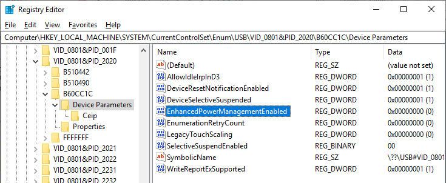

### About Maintenance Reset

For security purposes, the device is designed to perform an automatic
maintenance reset periodically to clear all data from memory. When the device
has been on continuously for 23 hours, it terminates all current operations,
stops responding to new commands, and immediately performs a full reset. At the
end of the automatic maintenance reset, the device powers back on and returns to
normal operation.

## How to Start a Handheld Transaction Using Wireless LAN

The operator uses the point of sale to start a transaction by following these
steps and guidelines below:

1.  Ensure that the device is powered on, see **4.6.4 How to Power On / Wake Up
    from Standby Mode / Power Off.**
2.  Ensure that the device is connected to a wireless access point and has good
    signal strength (Refer to section **4.4.3 Connection Status Page**.
3.  Start the transaction using the point of sale’s interface. Depending on how
    the host software is designed, the host sends various messages requesting
    that the cardholder or operator enter additional information, and the device
    requests payment as described in section **4.8 Using the Reader**
4.  Should the device run out of battery or the device is disconnected from the
    network during a transaction, the operator should cancel the transaction on
    the point of sale, and proceed to repeat these steps to initiate the
    transaction again.

## Using the Reader

### About Reading Cards

The steps for starting a transaction and reading a card or contactless payment
device are different depending on the device’s configuration and on the design
of the host software. Host software developers should see section **6 Developing
Custom Software** for implementation references. The solution developer should
provide solution-specific instructions for operators to follow. A transaction
follows this essential flow:

1.  An advanced operator has already made sure DynaFlex II or DynaFlex II PED is
    configured properly and is connected to the host (see section **3.2
    Connecting to a Host**). When the device is connected to the host via USB
    and powered by the USBC connector, the host software may always keep a
    connection open to the device.
2.  The operator makes sure DynaFlex II or DynaFlex II PED is receiving power
    either from its rechargeable battery or from the USB connection, and is
    awake and powered on (see section **4.6.4 How to Power On / Wake Up from
    Standby Mode / Power Off** and section **4.3 About the Status LEDs**).
3.  The operator uses the host software’s user interface (for example, a point
    of sale) to finalize a transaction amount, then initiates a transaction. In
    solutions that are designed to respond to cardholder input events that occur
    when the device is idle, such as unprompted swiping, inserting, or tapping a
    card or electronic payment device, or pressing the touchscreen, the host
    software may respond to those inputs by notifying the host, and the host
    software may trigger other operations without being initiated by an operator
    (for example, the host software may immediately start a transaction, or
    alert the cardholder or operator to take action).
4.  The host communicates with the device, and reports to the operator when the
    device is ready.
5.  The operator guides and assists the cardholder in presenting payment.
6.  The cardholder interacts with the device to present payment. The following
    sections provide additional details about presenting each of the available
    payment methods.
7.  Devices with a touchscreen, display messages prompting the cardholder to
    perform certain actions. The host should also monitor the progress of the
    transaction, and when necessary, should report issues to the operator, who
    may need to relay the messages to the cardholder.
8.  The device reports the success or failure of the transaction to the
    cardholder and to the host.

### How to Swipe Magnetic Stripe Cards

To swipe magnetic stripe cards, follow these steps:

1.  Wait for the device to display an action prompt, or, if the solution is
    designed to respond to cardholder actions that occur while the device is
    idle, such as swiping, inserting, or tapping a card or electronic payment
    device, or pressing the touchscreen, initiate the transaction by performing
    one of those actions instead of waiting. In these cases, the device may
    automatically and rapidly pass through several of the steps below without
    requiring cardholder interaction.
    1.  Devices with a display show on-screen text and buttons (see **Figure
        26** **below** for examples).
    2.  The device shows the transaction status using the LEDs. If the host has
        directed the device to enable the contactless interface, LED1 lights
        solid green and all other LEDs are off, per EMV standards, to indicate
        it is ready for a tap. If the host has directed the device to disable
        the contactless interface, the device continues to show idle statuses on
        LED1 and LED2.
    3.  All devices report detailed transaction status to the host, and host
        software may report that information to operators so they can guide
        cardholders through the transaction (for example, “swipe, insert, or tap
        your card now please”).
2.  Locate the magnetic stripe reader swipe path on the face of the device.
3.  Orient the card with the magnetic stripe facing away from the cardholder and
    the touchscreen or contactless landing zone, toward the LEDs and the chip
    card insertion slot as shown in **Figure 27**.
4.  Swipe the card through the magnetic stripe reader in either direction.
5.  Look for a prompt that the device has successfully read the card:
    1.  The device turns LED4 green for a short time.
    2.  The device beeps once.
    3.  If the device has a display:
        1.  The device displays **PROCESSING**.
        2.  The device may display **AUTHORIZING PLEASE WAIT**.
        3.  If the transaction requires a signature, the device prompts for a
            signature (see section **4.8.12 How to Use Signature Capture**).
        4.  The device shows **THANK YOU**.
    4.  The device ends the transaction and reports the transaction status to
        the host.
6.  If the device cannot read the card’s magnetic stripe data:
    1.  The device turns LED4 red for a brief time.
    2.  The device beeps twice.
    3.  The device ends the transaction.
    4.  Devices with a display show **FAILED**, then **THANK YOU**, then return
        to the idle page (see section **4.4.1Welcome Page / Active Idle Page**).
    5.  The device notifies the host that the transaction failed. If this
        occurs, the host software may choose to retry the transaction or revert
        to prompting the operator to enter card data manually (see section
        **4.8.7 How to Enter Card Information Manually)**.

Immediately after the user swipes a magnetic stripe card, the device disables
the option to use the contactless interface. If the cardholder needs to revert
to a contactless card or device for payment while a transaction is in process,
the operator should cancel the transaction and start again.

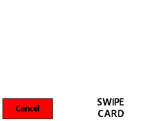

Figure 26 – Example Card Swipe Screens

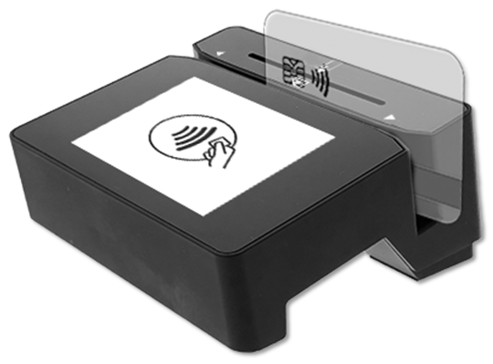

Figure 27 – Swiping a Magnetic Stripe Card

### How to Insert Contact Chip Cards

To insert contact chip cards, follow these steps:

1.  Wait for the device to display an action prompt, or, if the solution is
    designed to respond to cardholder actions that occur while the device is
    idle, such as swiping, inserting, or tapping a card or electronic payment
    device, or pressing the touchscreen, initiate the transaction by performing
    one of those actions instead of waiting. In these cases, the device may
    automatically and rapidly pass through several of the steps below without
    requiring cardholder interaction.
    1.  Devices with a touchscreen display on-screen text and buttons (see
        **Figure 28** **below** for examples).
    2.  Devices with or without a touchscreen show the transaction status using
        the LEDs. If the host has directed the device to enable the contactless
        interface, LED1 lights solid green and all other LEDs are off, per EMV
        standards, to indicate it is ready for a tap, swipe, or insert. If the
        host has directed the device to disable the contactless interface, the
        device continues to show idle statuses on LED1 and LED2.
    3.  All devices report detailed transaction status to the host, and host
        software may report that information to operators so they can guide
        cardholders through the transaction (for example, “swipe, insert, or tap
        your card now please”).
2.  Locate the chip card insertion slot on the face of the device, as shown in
    **Figure 29**.
3.  Orient the chip card so the chip faces the cardholder, toward the
    touchscreen or contactless landing zone and the LEDs.
4.  Insert the chip card into the slot, then push gently on the card until it
    stops. There should not be any substantial resistance until the chip card is
    fully inserted.
5.  Wait for a prompt that the device has successfully read the card, then
    remove the card.
    1.  The device turns LED4 green for a brief time.
    2.  The device beeps once.
    3.  If the device has a display:
        1.  The device shows **PROCESSING**.
        2.  The device shows **PLEASE WAIT** and/or **AUTHORIZING PLEASE WAIT**.
        3.  If the transaction requires a signature, the device prompts for a
            signature (see section **4.8.12 How to Use Signature Capture**).
        4.  The device shows **REMOVE CARD**.
        5.  The device shows **THANK YOU**.
    4.  The device ends the transaction and reports the transaction status to
        the host.
    5.  As a reminder to the cardholder to remove the card, the device beeps
        continuously until the card is removed.
6.  If the device cannot communicate with the chip card:
    1.  The device illuminates LED4 red for a short time.
    2.  The device beeps twice.
    3.  Devices with a touchscreen display **FAILED**, then **REMOVE** if the
        card is still in the slot, then **THANK YOU**, when the card is removed.
        The device then returns to the idle page (see section **4.4.1Welcome
        Page / Active Idle Page**).
    4.  The device ends the transaction and notifies the host that the
        transaction failed. If this occurs, the host software may choose to
        retry the transaction (for example, with different payment types
        enabled) or revert to prompting the operator to enter card data manually
        (see section **4.8.7 How to Enter Card Information Manually)**.
    5.  As a reminder to the cardholder to remove the card, the device
        double-beeps continuously until the card is removed.

Immediately after the user inserts a chip card, the device disables the option
to use the contactless interface. If the cardholder needs to revert to a
contactless card or device for payment while a transaction is in process, the
operator should cancel the transaction and start again.

Figure 28 – Example Card Insertion Screens

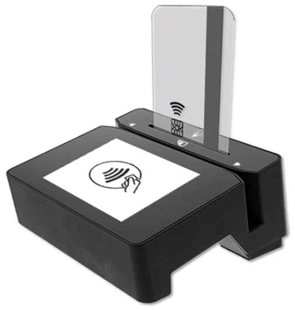

Figure 29 – Inserting a Chip Card

### How to Tap Contactless Cards / Devices

To tap a contactless card or smartphone, follow these steps:

1.  Wait for the device to display an action prompt, or, if the solution is
    designed to respond to cardholder actions that occur while the device is
    idle, such as swiping, inserting, or tapping a card or electronic payment
    device, or pressing the touchscreen, initiate the transaction by performing
    one of those actions instead of waiting. In these cases, the device may
    automatically and rapidly pass through several of the steps below without
    requiring cardholder interaction.
    1.  Devices with a touchscreen show on-screen text and buttons (see **Figure
        30** **below** for examples).
    2.  Devices with or without a touchscreen show the transaction status using
        the LEDs. LED1 lights solid green and all other LEDs are off, per EMV
        standards, to indicate it is ready for a tap (or swipe or insert, if the
        host has enabled those interfaces for this transaction).
    3.  All devices report detailed transaction status to the host, and host
        software may report that information to operators so they can guide
        cardholders through the transaction (for example, “please tap your card
        now”).
2.  If the cardholder is using an electronic payment device, such as a
    smartphone, make sure the payment device has **NFC** turned **On** and has a
    payment app configured to process transactions. For details, see the
    documentation provided by the smartphone manufacturer and payment app
    publisher.
3.  Briefly hold the card, smartphone, or other contactless payment device over
    the contactless landing zone, indicated by the EMVCo Contactless Indicator
    symbol on the device’s face (see **Figure 30**). Because each smartphone
    model may have its NFC antenna placed differently, the ideal tap position
    may vary by make and model. For example, Samsung users may need to center
    the phone on the contactless landing zone, while Apple users may need to tap
    the top of the phone on the contactless landing zone.
4.  Wait for a prompt that the device has successfully read the card,
    smartphone, or other contactless payment device, then remove it from the
    contactless landing zone.
    1.  The device quickly lights the second LED green to show it is processing,
        then lights the third LED green to show it has successfully read the
        tap, then lights the fourth LED green to show the read is complete (see
        **Figure 32**).
    2.  The device beeps once.
    3.  If the device has a touchscreen:
        1.  The device may display **PROCESSING**.
        2.  The device displays **REMOVE CARD**.
        3.  If the transaction requires a signature, the device prompts for a
            signature (see section **4.8.12 How to Use Signature Capture**).
        4.  The device displays **THANK YOU**.
    4.  The device ends the transaction and reports the transaction status to
        the host.
5.  If the device cannot communicate with the card, smartphone, or other
    contactless payment device:
    1.  The device ends the transaction.
    2.  The device illuminates LED4 red, for a brief time.
    3.  The device beeps twice.
    4.  Devices with a touchscreen display **INSERT, SWIPE, OR TRY ANOTHER
        CARD**, then **THANK YOU**. The device then returns to the idle page
        (see section **4.4.1 Welcome Page / Active Idle Page**).
    5.  The device notifies the host that the transaction failed. If this
        occurs, the host software may choose to retry the transaction (for
        example, with different payment types enabled) or revert to prompting
        the operator to enter card data manually (see section **4.8.7 How to
        Enter Card Information Manually)**.

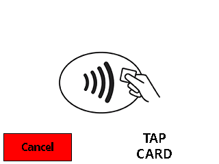

Figure 30 – Example Contactless Transaction Screens

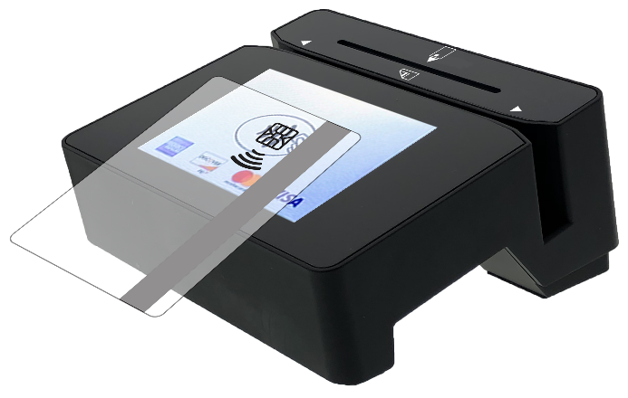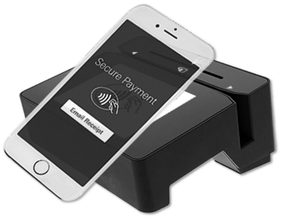

Figure 31 – Tapping a Contactless Card / Smartphone

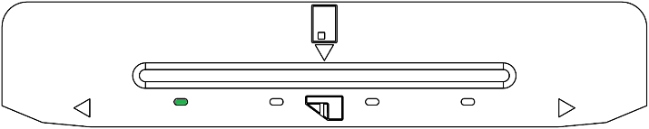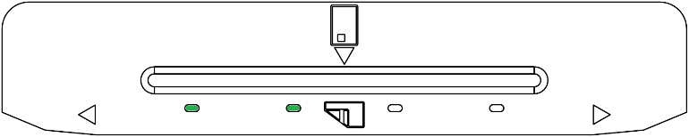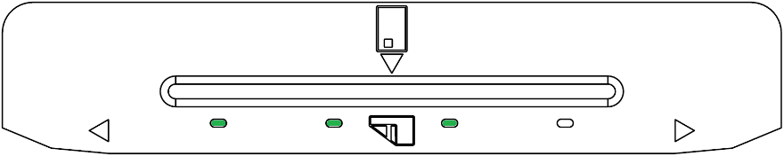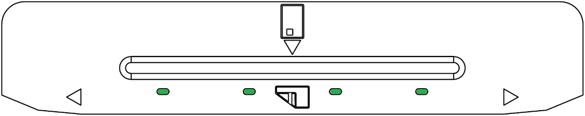

**Figure 32 – Tap Read Is Complete**

### How to Tap Contactless NFC Tags / MIFARE Classic / MIFARE DESFire /MIFARE Plus Cards and Send Pass-through Commands

To tap a contactless NFC Tags / MIFARE Classic / MIFARE DESFire /MIFARE Plus
cards, follow these steps:

1.  Wait for the device to display an action prompt. If the solution is designed
    to respond to cardholder actions that occur while the device is idle, such
    as swiping, inserting, or tapping a card or electronic payment device, or
    pressing the touchscreen, initiate the transaction by performing one of
    those actions instead of waiting. In these cases, the device may
    automatically and rapidly pass through several of the steps below without
    requiring cardholder interaction.
    1.  Devices with a touchscreen display on-screen text and buttons (see
        **Figure 30** for examples) via the host.
    2.  Devices with or without a touchscreen show the transaction status using
        the LEDs. LED1 illuminates solid green, and all other LEDs are off, per
        EMV standards, to indicate it is ready for a tap (or swipe / insert, if
        the host has enabled those interfaces for this transaction).
    3.  All devices report detailed transaction status to the host, and host
        software may report that information to operators so they can guide
        cardholders through the transaction (for example, “please tap your card
        now”).
2.  Place the card over the device's designated contactless landing zone, marked
    by the EMVCo Contactless Indicator symbol on the front face of the device.
3.  Wait for LED status:
    1.  Initially, LED 2 illuminates, signaling the device is processing. The
        device subsequently illuminates LED 3 and LED 4, indicating card
        detection. Notifications are then sent to identify the card type and
        UID.
    2.  The Host application can further interact with the NFC Tag using
        pass-through commands. For details, see **D998200383 DynaFlex Products
        Programmer’s Manual (COMMANDS).**
    3.  If the pass-through command is the last successful command, the device
        will end the transaction, emitting a single beep signaling a successful
        transaction. The user then needs to remove the card.
    4.  If an error is detected, the device will end the transaction and emit
        two beeps to signal the error. The user then needs to remove the card.
4.  The device notifies the host that the transaction has ended with the NFC Tag
    removed.

### How to Scan Barcodes

To scan a barcode, follow these steps:

1.  Make sure you are using a DynaFlex II model that includes a barcode reader,
    indicated by QR code markings on the face of the device surrounding the
    barcode reader lens (see section **1.5 About DynaFlex II** Components).
2.  If the barcode being scanned is not on a self-illuminated source such as a
    smartphone, make sure there is enough ambient light for the camera to read
    the barcode. *In low light conditions, the barcode reader will only be able
    to read self-illuminated sources*.
3.  In some solutions, the operator may have to perform an operation in the host
    software to enable the barcode reader, or to start a transaction with the
    barcode reader enabled.
4.  Wait for the device, the host, or the operator to prompt for a barcode read:
    1.  Devices with a touchscreen display the prompt **SCAN BARCODE**.
    2.  When the cardholder (or operator on devices without a touchscreen)
        presses **SCAN BARCODE**, the device illuminates the barcode reader
        indicator LED next to the barcode reader lens.
5.  Hold the barcode in front of the barcode reader camera:
    1.  If possible, use the barcode reader's indicator LED light to align the
        barcode within its field of view. The barcode reader lens’ field of view
        spans 16 degrees above and below the lens, and 21 degrees to the left
        and right of a line perpendicular to the lens.
    2.  Hold the barcode as close as one inch from the barcode reader lens. For
        smaller barcodes, the device will read immediately. If it does not,
        gradually pull back up to 14 inches from the lens until the device
        reports a successful read. Larger barcodes must be far enough away from
        the device that the whole barcode is within the camera’s field of view;
        if a large barcode is too close, the barcode reader can only see a
        zoomed in portion of the barcode.
    3.  Do not tilt the barcode more than 60 degrees from parallel to the
        device’s face.
6.  Wait for the device or the host to report the barcode has been read
    successfully:
    1.  Devices with a touchscreen will no longer display the prompt **SCAN
        BARCODE**.
    2.  The device beeps once.
    3.  The device turns off the barcode reader indicator LED.

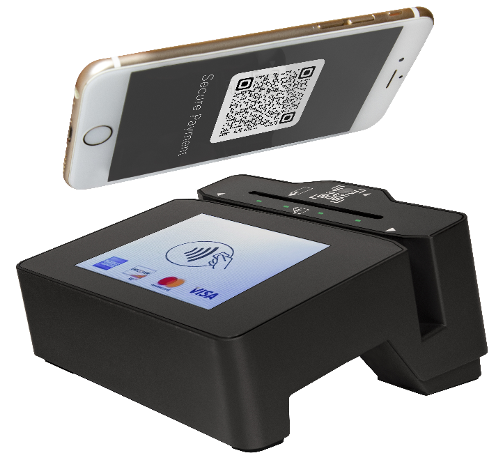

Figure 33 – Scanning a Barcode

### How to Enter Card Information Manually

Devices with touchscreen displays provide support for starting a transaction
that immediately prompts the operator or cardholder to enter card data manually.
Manual card entry can be useful in the following situations:

-   **As a last resort form of transaction fallback:**
    -   The cardholder swiped during a transaction that had one or more card
        interfaces enabled, but the device could not read card data.
    -   The cardholder inserted a chip card during a transaction that had one or
        more card interfaces enabled, but the device could not read card data
        and could not fall back to swipe.
-   **In card not present transactions**, including merchant locations where
    cardholders do not have their card, in telephone call centers, and so on. In
    these cases, the operator uses the device to keep sensitive data out of the
    merchant’s domain, for compliance and security reasons.

To enter card information manually, follow these steps. For every prompt below,
press the **Enter** button after entering data to move to the next step, or
press the **Backsp** button to delete data that has already been entered but
stay on the same step, or press the **Cancel** button to completely end the
transaction:

1.  The operator starts a transaction, specifying manual card entry, optionally
    specifying a transaction amount and cash back amount. If the solution is
    designed to respond to cardholder actions that occur while the device is
    idle, such as pressing the touchscreen, the operator may initiate the
    transaction by performing one of those actions instead of initiating the
    transaction from the host.
2.  The device shows a numeric keypad and a prompt to enter **Card Number** (see
    **Figure 34**). Enter the card number and press the **Enter** button. If the
    device double-beeps when pressing the **Enter** button and does not proceed
    to the next step, the PAN is not valid. The device may be configured to
    enable MOD10 validation, which makes sure the card number passes a validity
    check to prevent errors during entry. It is also possible you have entered
    too many or too few PAN digits. Double-check the card number and use the
    **Backsp** button to correct any errors, then press **Enter**.
3.  The device displays a numeric keypad and a prompt to enter **Exp Date
    (MMYY)** (see **Figure 35**). Enter the expiration date on the card and
    press the **Enter** button.
4.  The device shows a numeric keypad and a prompt to enter **CVV/CVC/Card ID**.
    Enter the card verification code / value, then press the **Enter** button.
    This code is a 3- or 4- digit number printed on the front or back of the
    card, and is also referred to as a security code, security validation value,
    CAV2, CVC2, CVV2, or CID, depending on which payment brand issued the card.
5.  The device shows a summary of all the data that was entered during the
    transaction. If the operator specified a transaction amount when starting
    the transaction, the summary includes the total transaction amount (purchase
    amount plus cash back, if any).
6.  Verify all the information is correct:
    1.  If it is correct, press the **Enter** button to proceed with the
        transaction.
    2.  If it is correct but the cardholder or operator wishes to stop the
        transaction, press the **Cancel** button to completely end the
        transaction.
    3.  If it is not correct, press the **Cancel** button to completely end the
        transaction, and start the transaction again from the first step.

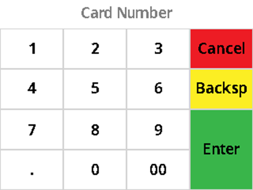

Figure 34 – Enter Card Number

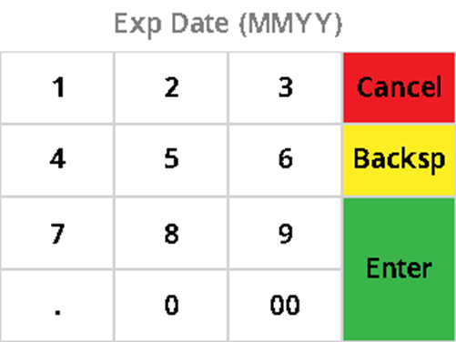

Figure 35 – Enter Expiration Date

Figure 36 – Enter CVV/CVC/Card ID

### How to Verify the Transaction Amount

When the device is processing a transaction using the EMV Transaction Flow (as
opposed to the Quick Chip Transaction Flow), devices with a touchscreen display
the amount of the transaction when they prompt the cardholder to swipe, dip, or
tap a card or payment device, as shown in **Figure 37.** The cardholder
implicitly confirms / accepts the transaction amount by presenting payment.

Figure 37 - Example Transaction Amount Screens

### How to Enter PINs

Devices with a touchscreen display provide support for requesting a PIN from the
cardholder. The device prompts the cardholder to **ENTER PIN** (see **Figure
38**) as required by the financial institution. The device expects the PIN to be
between 4 and 12 digits long. After entering the PIN, the cardholder must press
the **ENTER** button.

Figure 38 – Enter PIN

If the double PIN entry option is enabled, the device prompts the cardholder to
enter the PIN a second time (see **Figure 39**). *The process for re-entry is
identical to the process for the first entry*.

Figure 39 – Enter PIN Again

### How to Enter Tip

Devices with a touchscreen display provide support for requesting a Tip Entry
from the cardholder. The device prompts the cardholder to **Enter Tip** (see
**Figure 40** – Enter Tip).

Figure 40 – Enter Tip

If the cardholder selects a **Custom** button, the device prompts a keypad for
the cardholder to **Enter Tip Amount** (see Figure **41** – Enter Tip Amount).
After entering the Tip Amount, the cardholder must press the **Enter** button.

Figure 41 – Enter Tip Amount

After finalizing the Tip, and pressing the **Submit** button, the device prompts
the cardholder to present a payment (see **Figure 42**). The on-screen prompt is
different depending on which payment method(s) the host directed the device to
enable for the transaction. If the Quick Chip flow is in effect, the prompt does
not include the transaction amount. If the Full EMV flow is in effect, the
prompt includes the transaction amount.

Figure 42 – Example Present Payment Screen

### How to Enter Sale Amount

Devices with a touchscreen display and active connection to a Wireless Local
Area Network (WLAN) Host provide support for entering a Sale Amount from the
cardholder. The device prompts the cardholder with the **Start Sale** button
(see **Figure 43**)

Figure 43 - Start Sale Screen

When the cardholder presses the **Start Sale** button, the device prompts the
cardholder to **Enter Sale Amount** (see **Figure 44**)

Figure 44 - Enter Sale Amount

After the cardholder enters the Sale Amount and presses **Enter**, the device
prompts the cardholder to enter Tip (see section **4.8.10 How to Enter Tip**)

### How to Use Signature Capture

|                         |
|-------------------------------------------------------------------------------------------------------------------------------------------------------|
| Do not use a stylus or other hard object on the touchscreen. The touchscreen is designed for fingers only and can be scratched or damaged if misused. |

When a device with a touchscreen display prompts cardholders with a **PLEASE
SIGN** page, (**Figure 45 - Signature Capture Requested)** cardholders should
use the tip of their finger to *press and glide against the screen to sign*,
then press the **OK** button. To clear the current signature on the display and
start over, press the **Clear** button.

Figure 45 - Signature Capture Requested

Devices that do not have a touchscreen display cannot prompt for or collect a
signature. When these devices are aware that a signature is required to complete
a transaction, they send a notification message to the host that includes the
status **Signature Capture Requested**. In this case, the solution design
collects the cardholder’s signature via a different method.

# Maintenance

## Mechanical Maintenance

|                                                                                                                                                                                                                                                               |
|---------------------------------------------------------------------------------------------------------------------------------------------------------------------------------------------------------------------------------------------------------------------------------------------------------------|
| To avoid damaging the read head and contact block, only clean the MSR swipe path and insertion slot with approved cleaning cards.  DO NOT use liquid cleaning products or insert any other objects into the device.  DO NOT apply any liquid directly onto the device, to avoid seepage into the electronics. |

Periodic cleaning of the device’s exterior may be required. To clean the outside
of DynaFlex II products, including the LCD display, wipe down the device with a
soft, slightly damp cloth and then wipe dry with a lint-free cloth. The display
can also be cleaned using a slightly damp specialty cleaning cloth, like those
used to wipe lenses, monitors, and smartphone displays.

MagTek’s double-sided cleaning card **96700004** is designed to clean the
magnetic read head in the MSR swipe path and the contact pins inside all chip
card contact readers. Keeping both components clean is essential to the device’s
functioning. MagTek recommends swiping and inserting a cleaning card once per
week to avoid card misreads.

If the device’s micro-suction mounting feet lose their holding power over time,
use a clean, damp, lint-free cloth to wipe the mounting feet and the mounting
surface clean, then let both surfaces air dry. This should restore the mounting
feet’s holding power. If the mounting feet are damaged and unusable,
replacements are available. See section **1.4 Available Models and
Accessories**.

## Updates to Firmware, Documentation, Security Guidance

In addition to the security guidance in the product manuals, MagTek may provide
updates to this document, as well as supplemental security guidance or notices
regarding vulnerabilities, at [www.magtek.com](http://www.magtek.com). MagTek
advises checking the product’s home page periodically for the most up-to-date
information.

Any firmware updates addressing product features, bugs, or security
vulnerabilities are also posted to [www.magtek.com](http://www.magtek.com) or
may be sent directly to affected customers. To update the device’s firmware:

1.  Obtain the firmware image to install.
2.  Download **1000007405 DynaFlex, DynaProx Firmware Upload Utility** from the
    MagTek web site.
3.  Follow the instructions in **D100005288 DynaFlex, DynaProx Firmware Update
    Utility Manual** included in the firmware update utility’s **Document**
    subfolder.

Note: **1000007406** **DynaFlex, DynaProx Test Utility** can be utilized to
upload new or updated firmware to DynaFlex II devices.

# Developing Custom Software

Custom host software uses the same underlying device command set for all
DynaFlex II product connection types. This section provides high-level
information about communicating with the device via the various physical
connection types in various software development frameworks, and provides
pointers to available SDKs, which include sample code. Product documentation and
SDKs are available for download by searching for the product name on
[www.magtek.com](http://www.magtek.com) and navigating to the **Support** tab.

MagTek provides convenient SDKs and corresponding documentation for many
programming languages and operating systems. The API libraries included in the
SDKs wrap the details of the connection in an interface that conceptually
parallels the device’s internal operation, freeing software developers to focus
on the business logic, without having to deal with the complexities of platform
APIs for connecting to the various available connection types, communicating
using the various available protocols, and parsing the various available data
formats. Information about using MagTek wrapper APIs is available in separate
documentation, including:

-   **D998200380 MagTek Universal SDK Programmer’s Manual (Microsoft .NET)**
-   **D998200381 MagTek Universal SDK Programmer’s Manual (Microsoft C++ )**
-   **D998200385 MagTek Universal SDK Programmer’s Manual (Java)**
-   **D998200387 MagTek Universal SDK Programmer’s Manual (Android)**

The documentation is bundled with the SDKs themselves, which include:

-   **1000007351 MagTek Universal SDK for MMS Devices (Windows)**
-   **1000007352 MagTek Universal SDK for MMS Devices (Android)**

The SDKs and corresponding documentation include:

-   Functions for sending the direct commands described in this manual.
-   Wrappers for commonly used commands that further simplify development.
-   Sample source code to demonstrate how to communicate with the device using
    the direct commands described in this manual.

To download the SDKs and documentation, search
[www.magtek.com](http://www.magtek.com) for “SDK” and select the SDK and
documentation for the programming languages and platforms you need or contact
MagTek Support Services for assistance.

In addition to the SDK API libraries, software developers also have the option
to revert to direct communication with the device using libraries using the
operating system’s native USB or TCP/IP. For example, custom software written in
Visual Basic or Visual C++ may make API calls to the standard Windows USB HID
driver. For more information about sending commands directly, see **D998200383
DynaFlex Products Programmer’s Manual (COMMANDS).**

For more information about developing custom applications that integrate with
DynaFlex II, see the MagTek web site or contact your reseller or MagTek Support
Services.

###### Technical Specifications

| DynaFlex II Products Technical Specifications                                                                                                                                                                                                                                                                                                                                                                                                                                                                                                                                                                                                                                                                                                                                                                                                                                                                                                                                                                                                                                                                                                                                                                                                                                                                                                                                                                                                                                                                                                                                                                                                                                                                                             |                                                                                                                                                                                                                                                                                                                                               |
|-------------------------------------------------------------------------------------------------------------------------------------------------------------------------------------------------------------------------------------------------------------------------------------------------------------------------------------------------------------------------------------------------------------------------------------------------------------------------------------------------------------------------------------------------------------------------------------------------------------------------------------------------------------------------------------------------------------------------------------------------------------------------------------------------------------------------------------------------------------------------------------------------------------------------------------------------------------------------------------------------------------------------------------------------------------------------------------------------------------------------------------------------------------------------------------------------------------------------------------------------------------------------------------------------------------------------------------------------------------------------------------------------------------------------------------------------------------------------------------------------------------------------------------------------------------------------------------------------------------------------------------------------------------------------------------------------------------------------------------------|-----------------------------------------------------------------------------------------------------------------------------------------------------------------------------------------------------------------------------------------------------------------------------------------------------------------------------------------------|
| Reference Standards and Certifications                                                                                                                                                                                                                                                                                                                                                                                                                                                                                                                                                                                                                                                                                                                                                                                                                                                                                                                                                                                                                                                                                                                                                                                                                                                                                                                                                                                                                                                                                                                                                                                                                                                                                                    |                                                                                                                                                                                                                                                                                                                                               |
| ISO 7810, ISO 7811, AAMVA ISO/IEC 7816-1, 2, 3, & 4 Identification Cards Integrated Circuits with Contacts EMV ICC Specifications for Payment Systems Version 4.3, L1 Contact and L2 Contact EMV Contactless Level 1 Version 3.0 MasterCard TQM MCL v3.1.3, payWave v2.2, Expresspay 4.0.2, D-PAS Terminal Payment Application v1.0, D-PAS Terminal Application Specification Bulletins CL TAS-002 v1.1, CL TAS-003 v1.0, CL TAS-004 v1.0 PCI PTS POI v6.x PED PCI PTS POI v6.x SCR TDEA (3DES)-CBC using DUKPT FCC Part 15 Low Power Transceiver, RX verified per FCC Title 47 Part 15 Subclass C UL 60950 1, 2nd Edition, 2011 12 19 (Information Technology Equipment - Safety - Part 1: General Requirements), CSA C22.2 No. 60950 1 07, 2nd Edition, 2011 12 (Information Technology Equipment - Safety - Part 1: General Requirements) CE Certified UKCA Certified CE Safety: IEC 62368-1: 2014 UL/CSA 62368-1: 2nd Edition Canada ISED Certified Japan VCCI Certified (not applicable to WLAN models) Japan MIC Certified (not applicable to WLAN models) AS/NZS CISPR 32 (2013), AS/NZS 4268 Table 1, Row 59 DTS 2400-2483MHz SRD (WLAN), and AS/NZS 4268 (2017) Table 1, Row 43 13.553-13.567MHz (contactless reader) RoHS Compliant the Electrical and Electronic Equipment (EEE) Reduction of Hazardous Substances (RoHS) European Directive 2002/95/EC California Proposition 65 (California) IPC-A-610 Class II Assembly EU Directive Waste Electrical and Electronic Equipment (WEEE) EU Directive Restriction of Hazardous Substances (RoHS) Universal Serial Bus Specifications 1.1, 2.0 IEEE 802.11 b/g/n, IEEE 802.11i-2004 WPA2-PSK, TKIP, AES, SHA-256 TCP/IP secured by Transport Layer Security (TLS) Protocol v1.2 |                                                                                                                                                                                                                                                                                                                                               |
| Physical Characteristics                                                                                                                                                                                                                                                                                                                                                                                                                                                                                                                                                                                                                                                                                                                                                                                                                                                                                                                                                                                                                                                                                                                                                                                                                                                                                                                                                                                                                                                                                                                                                                                                                                                                                                                  |                                                                                                                                                                                                                                                                                                                                               |
| Dimensions (L x W x H):                                                                                                                                                                                                                                                                                                                                                                                                                                                                                                                                                                                                                                                                                                                                                                                                                                                                                                                                                                                                                                                                                                                                                                                                                                                                                                                                                                                                                                                                                                                                                                                                                                                                                                                   | DynaFlex II and DynaFlex II PED: 4.1 in. W x 3.7 in. L x 1.9 in. H (103.3mm x 95.1mm x 48.5mm)  DynaFlex II Kiosk and DynaFlex II PED Kiosk: 4.1 in. W x 3.7 in. L x 1.9 in. H (103.3mm x 95.1mm x 48.3mm)                                                                                                                                    |
| Weight                                                                                                                                                                                                                                                                                                                                                                                                                                                                                                                                                                                                                                                                                                                                                                                                                                                                                                                                                                                                                                                                                                                                                                                                                                                                                                                                                                                                                                                                                                                                                                                                                                                                                                                                    | DynaFlex II USB = 8.4 oz. (238g) DynaFlex II PED USB= 8.7 oz. (246g) DynaFlex II PED WLAN = 8.9 oz. (252g) Kiosk Models, add 1.1 oz. (30g) BCR Models, add 0.12 oz. (3.5g)                                                                                                                                                                    |
| Supported Mounting Options:                                                                                                                                                                                                                                                                                                                                                                                                                                                                                                                                                                                                                                                                                                                                                                                                                                                                                                                                                                                                                                                                                                                                                                                                                                                                                                                                                                                                                                                                                                                                                                                                                                                                                                               | Adhesive mounting strips on the underside of the device Lanyard mount point                                                                                                                                                                                                                                                                   |
| Reader Characteristics                                                                                                                                                                                                                                                                                                                                                                                                                                                                                                                                                                                                                                                                                                                                                                                                                                                                                                                                                                                                                                                                                                                                                                                                                                                                                                                                                                                                                                                                                                                                                                                                                                                                                                                    |                                                                                                                                                                                                                                                                                                                                               |
| Magnetic Stripe Reader:                                                                                                                                                                                                                                                                                                                                                                                                                                                                                                                                                                                                                                                                                                                                                                                                                                                                                                                                                                                                                                                                                                                                                                                                                                                                                                                                                                                                                                                                                                                                                                                                                                                                                                                   | Three track bidirectional encrypting reader with MagnePrint                                                                                                                                                                                                                                                                                   |
| Magnetic Stripe Decoding:                                                                                                                                                                                                                                                                                                                                                                                                                                                                                                                                                                                                                                                                                                                                                                                                                                                                                                                                                                                                                                                                                                                                                                                                                                                                                                                                                                                                                                                                                                                                                                                                                                                                                                                 | Financial (ISO Type B), AAMVA, or Other                                                                                                                                                                                                                                                                                                       |
| Magnetic Swipe Speeds:                                                                                                                                                                                                                                                                                                                                                                                                                                                                                                                                                                                                                                                                                                                                                                                                                                                                                                                                                                                                                                                                                                                                                                                                                                                                                                                                                                                                                                                                                                                                                                                                                                                                                                                    | 6 inches per second to 60 inches per second                                                                                                                                                                                                                                                                                                   |
| EMV Contact Reader:                                                                                                                                                                                                                                                                                                                                                                                                                                                                                                                                                                                                                                                                                                                                                                                                                                                                                                                                                                                                                                                                                                                                                                                                                                                                                                                                                                                                                                                                                                                                                                                                                                                                                                                       | EMVCo L1 and L2 Contact Reader                                                                                                                                                                                                                                                                                                                |
| EMV Contactless Reader:                                                                                                                                                                                                                                                                                                                                                                                                                                                                                                                                                                                                                                                                                                                                                                                                                                                                                                                                                                                                                                                                                                                                                                                                                                                                                                                                                                                                                                                                                                                                                                                                                                                                                                                   | EMVCo L1 and L2 Contactless Reader D-PAS, PayPass/MCL, payWave, Expresspay Mobile wallets including but not limited to Apple Pay, Google Pay, Samsung Pay                                                                                                                                                                                     |
| Barcode Reader:                                                                                                                                                                                                                                                                                                                                                                                                                                                                                                                                                                                                                                                                                                                                                                                                                                                                                                                                                                                                                                                                                                                                                                                                                                                                                                                                                                                                                                                                                                                                                                                                                                                                                                                           | Barcode Media: Labels, paper, smartphone / computer displays Barcode Types: QR Codes, Linear Barcodes, UPC-A, UPC-E, Code 128, PDF417 / Data Matrix, etc. Field Of View 31.5° total vertical sweep, 42° total horizontal sweep, perpendicular to device face Depth Of Field 1.2 in. (30mm) to 13.8 in. (350mm) Integrated white indicator LED |
| User Interface Characteristics                                                                                                                                                                                                                                                                                                                                                                                                                                                                                                                                                                                                                                                                                                                                                                                                                                                                                                                                                                                                                                                                                                                                                                                                                                                                                                                                                                                                                                                                                                                                                                                                                                                                                                            |                                                                                                                                                                                                                                                                                                                                               |
| Status Indicators:                                                                                                                                                                                                                                                                                                                                                                                                                                                                                                                                                                                                                                                                                                                                                                                                                                                                                                                                                                                                                                                                                                                                                                                                                                                                                                                                                                                                                                                                                                                                                                                                                                                                                                                        | 4 RGB LEDs                                                                                                                                                                                                                                                                                                                                    |
| Display Type:                                                                                                                                                                                                                                                                                                                                                                                                                                                                                                                                                                                                                                                                                                                                                                                                                                                                                                                                                                                                                                                                                                                                                                                                                                                                                                                                                                                                                                                                                                                                                                                                                                                                                                                             | TFT a-Si Active Matrix Color LCD with Touchscreen (Select Models)                                                                                                                                                                                                                                                                             |
| Display Size (viewable area):                                                                                                                                                                                                                                                                                                                                                                                                                                                                                                                                                                                                                                                                                                                                                                                                                                                                                                                                                                                                                                                                                                                                                                                                                                                                                                                                                                                                                                                                                                                                                                                                                                                                                                             | 2.3 in. x 1.7 in. (57.6mm x 43.2mm) (Select Models)                                                                                                                                                                                                                                                                                           |
| Display Resolution:                                                                                                                                                                                                                                                                                                                                                                                                                                                                                                                                                                                                                                                                                                                                                                                                                                                                                                                                                                                                                                                                                                                                                                                                                                                                                                                                                                                                                                                                                                                                                                                                                                                                                                                       | 320 x 240 px, 16-bit color depth (Select Models)                                                                                                                                                                                                                                                                                              |
| Keypad:                                                                                                                                                                                                                                                                                                                                                                                                                                                                                                                                                                                                                                                                                                                                                                                                                                                                                                                                                                                                                                                                                                                                                                                                                                                                                                                                                                                                                                                                                                                                                                                                                                                                                                                                   | Touchscreen                                                                                                                                                                                                                                                                                                                                   |
| Security Characteristics                                                                                                                                                                                                                                                                                                                                                                                                                                                                                                                                                                                                                                                                                                                                                                                                                                                                                                                                                                                                                                                                                                                                                                                                                                                                                                                                                                                                                                                                                                                                                                                                                                                                                                                  |                                                                                                                                                                                                                                                                                                                                               |
| Certifications:                                                                                                                                                                                                                                                                                                                                                                                                                                                                                                                                                                                                                                                                                                                                                                                                                                                                                                                                                                                                                                                                                                                                                                                                                                                                                                                                                                                                                                                                                                                                                                                                                                                                                                                           | PCI PTS POI 6.xPED PCI PTS POI 6.x SCR                                                                                                                                                                                                                                                                                                        |
| Tamper Protection:                                                                                                                                                                                                                                                                                                                                                                                                                                                                                                                                                                                                                                                                                                                                                                                                                                                                                                                                                                                                                                                                                                                                                                                                                                                                                                                                                                                                                                                                                                                                                                                                                                                                                                                        | The enclosure and associated electronics form a Tamper Resistant Security Module (TRSM) where attempts to penetrate or modify the unit cause all cryptographic keys to be cleared or rendered unusable.                                                                                                                                       |
| Electrical Characteristics                                                                                                                                                                                                                                                                                                                                                                                                                                                                                                                                                                                                                                                                                                                                                                                                                                                                                                                                                                                                                                                                                                                                                                                                                                                                                                                                                                                                                                                                                                                                                                                                                                                                                                                |                                                                                                                                                                                                                                                                                                                                               |
| Power Inputs:                                                                                                                                                                                                                                                                                                                                                                                                                                                                                                                                                                                                                                                                                                                                                                                                                                                                                                                                                                                                                                                                                                                                                                                                                                                                                                                                                                                                                                                                                                                                                                                                                                                                                                                             | USB powered via USB-C receptacle or charging station connectors                                                                                                                                                                                                                                                                               |
| Power Outputs:                                                                                                                                                                                                                                                                                                                                                                                                                                                                                                                                                                                                                                                                                                                                                                                                                                                                                                                                                                                                                                                                                                                                                                                                                                                                                                                                                                                                                                                                                                                                                                                                                                                                                                                            | None                                                                                                                                                                                                                                                                                                                                          |
| Battery Type:                                                                                                                                                                                                                                                                                                                                                                                                                                                                                                                                                                                                                                                                                                                                                                                                                                                                                                                                                                                                                                                                                                                                                                                                                                                                                                                                                                                                                                                                                                                                                                                                                                                                                                                             | Lithium Polymer rechargeable                                                                                                                                                                                                                                                                                                                  |
| Battery Capacity:                                                                                                                                                                                                                                                                                                                                                                                                                                                                                                                                                                                                                                                                                                                                                                                                                                                                                                                                                                                                                                                                                                                                                                                                                                                                                                                                                                                                                                                                                                                                                                                                                                                                                                                         |  2100 mAh nominal (rated)                                                                                                                                                                                                                                                                                                                     |
| Battery Charge Time:                                                                                                                                                                                                                                                                                                                                                                                                                                                                                                                                                                                                                                                                                                                                                                                                                                                                                                                                                                                                                                                                                                                                                                                                                                                                                                                                                                                                                                                                                                                                                                                                                                                                                                                      | \~7 hours connected to a 500mA host USB port                                                                                                                                                                                                                                                                                                  |
| Battery Time, Powered Off                                                                                                                                                                                                                                                                                                                                                                                                                                                                                                                                                                                                                                                                                                                                                                                                                                                                                                                                                                                                                                                                                                                                                                                                                                                                                                                                                                                                                                                                                                                                                                                                                                                                                                                 | 4 years or longer                                                                                                                                                                                                                                                                                                                             |
| Battery Time, Standby:                                                                                                                                                                                                                                                                                                                                                                                                                                                                                                                                                                                                                                                                                                                                                                                                                                                                                                                                                                                                                                                                                                                                                                                                                                                                                                                                                                                                                                                                                                                                                                                                                                                                                                                    | Wireless LAN: Reserved                                                                                                                                                                                                                                                                                                                        |
| Battery Time, Transactions:                                                                                                                                                                                                                                                                                                                                                                                                                                                                                                                                                                                                                                                                                                                                                                                                                                                                                                                                                                                                                                                                                                                                                                                                                                                                                                                                                                                                                                                                                                                                                                                                                                                                                                               | Reserved                                                                                                                                                                                                                                                                                                                                      |
| Voltage Requirements:                                                                                                                                                                                                                                                                                                                                                                                                                                                                                                                                                                                                                                                                                                                                                                                                                                                                                                                                                                                                                                                                                                                                                                                                                                                                                                                                                                                                                                                                                                                                                                                                                                                                                                                     | 5 VDC from USB port                                                                                                                                                                                                                                                                                                                           |
| Current Requirements:                                                                                                                                                                                                                                                                                                                                                                                                                                                                                                                                                                                                                                                                                                                                                                                                                                                                                                                                                                                                                                                                                                                                                                                                                                                                                                                                                                                                                                                                                                                                                                                                                                                                                                                     | 500mA from USB port                                                                                                                                                                                                                                                                                                                           |
| Data Storage:                                                                                                                                                                                                                                                                                                                                                                                                                                                                                                                                                                                                                                                                                                                                                                                                                                                                                                                                                                                                                                                                                                                                                                                                                                                                                                                                                                                                                                                                                                                                                                                                                                                                                                                             | Not Applicable                                                                                                                                                                                                                                                                                                                                |
| Communication Characteristics                                                                                                                                                                                                                                                                                                                                                                                                                                                                                                                                                                                                                                                                                                                                                                                                                                                                                                                                                                                                                                                                                                                                                                                                                                                                                                                                                                                                                                                                                                                                                                                                                                                                                                             |                                                                                                                                                                                                                                                                                                                                               |
| Wired Connection Types:                                                                                                                                                                                                                                                                                                                                                                                                                                                                                                                                                                                                                                                                                                                                                                                                                                                                                                                                                                                                                                                                                                                                                                                                                                                                                                                                                                                                                                                                                                                                                                                                                                                                                                                   | USB-C, compatible with USB 1.1, USB 2.0 Vendor-defined USB Human Interface Device (HID) data format                                                                                                                                                                                                                                           |
| Wireless Connection Types:                                                                                                                                                                                                                                                                                                                                                                                                                                                                                                                                                                                                                                                                                                                                                                                                                                                                                                                                                                                                                                                                                                                                                                                                                                                                                                                                                                                                                                                                                                                                                                                                                                                                                                                | TCP/IP over Wireless LAN (select models)                                                                                                                                                                                                                                                                                                      |
| Wireless Range:                                                                                                                                                                                                                                                                                                                                                                                                                                                                                                                                                                                                                                                                                                                                                                                                                                                                                                                                                                                                                                                                                                                                                                                                                                                                                                                                                                                                                                                                                                                                                                                                                                                                                                                           | WLAN: 100m in a typical environment                                                                                                                                                                                                                                                                                                           |
| Wireless Frequencies and Power:                                                                                                                                                                                                                                                                                                                                                                                                                                                                                                                                                                                                                                                                                                                                                                                                                                                                                                                                                                                                                                                                                                                                                                                                                                                                                                                                                                                                                                                                                                                                                                                                                                                                                                           | **Wireless LAN:** Frequency range = 2400 MHz to 2484 MHz Average power radiated = 0.80 mW (-0.97 dBm) **NFC:** Frequency range = 13.56 MHz Maximum power conducted = 794 mW (29 dBm)                                                                                                                                                          |
| RF Exposure:                                                                                                                                                                                                                                                                                                                                                                                                                                                                                                                                                                                                                                                                                                                                                                                                                                                                                                                                                                                                                                                                                                                                                                                                                                                                                                                                                                                                                                                                                                                                                                                                                                                                                                                              | Exempt from SAR requirements due to radiated power substantially below regulatory thresholds.                                                                                                                                                                                                                                                 |
| Software Characteristics                                                                                                                                                                                                                                                                                                                                                                                                                                                                                                                                                                                                                                                                                                                                                                                                                                                                                                                                                                                                                                                                                                                                                                                                                                                                                                                                                                                                                                                                                                                                                                                                                                                                                                                  |                                                                                                                                                                                                                                                                                                                                               |
| Tested Operating System(s):                                                                                                                                                                                                                                                                                                                                                                                                                                                                                                                                                                                                                                                                                                                                                                                                                                                                                                                                                                                                                                                                                                                                                                                                                                                                                                                                                                                                                                                                                                                                                                                                                                                                                                               | USB Hosts: Windows 10, Windows 11                                                                                                                                                                                                                                                                                                             |
| Environmental Resistance                                                                                                                                                                                                                                                                                                                                                                                                                                                                                                                                                                                                                                                                                                                                                                                                                                                                                                                                                                                                                                                                                                                                                                                                                                                                                                                                                                                                                                                                                                                                                                                                                                                                                                                  |                                                                                                                                                                                                                                                                                                                                               |
| Ingress Protection:                                                                                                                                                                                                                                                                                                                                                                                                                                                                                                                                                                                                                                                                                                                                                                                                                                                                                                                                                                                                                                                                                                                                                                                                                                                                                                                                                                                                                                                                                                                                                                                                                                                                                                                       | Splash Resistant                                                                                                                                                                                                                                                                                                                              |
| Operating Temperature:                                                                                                                                                                                                                                                                                                                                                                                                                                                                                                                                                                                                                                                                                                                                                                                                                                                                                                                                                                                                                                                                                                                                                                                                                                                                                                                                                                                                                                                                                                                                                                                                                                                                                                                    | 32°F to 113°F (0°C to 45°C)                                                                                                                                                                                                                                                                                                                   |
| Operating Relative Humidity:                                                                                                                                                                                                                                                                                                                                                                                                                                                                                                                                                                                                                                                                                                                                                                                                                                                                                                                                                                                                                                                                                                                                                                                                                                                                                                                                                                                                                                                                                                                                                                                                                                                                                                              | Up to 90% non-condensing                                                                                                                                                                                                                                                                                                                      |
| Storage Temperature:                                                                                                                                                                                                                                                                                                                                                                                                                                                                                                                                                                                                                                                                                                                                                                                                                                                                                                                                                                                                                                                                                                                                                                                                                                                                                                                                                                                                                                                                                                                                                                                                                                                                                                                      | 14°F to 140°F (-10°C to 60°C)                                                                                                                                                                                                                                                                                                                 |
| Storage Relative Humidity:                                                                                                                                                                                                                                                                                                                                                                                                                                                                                                                                                                                                                                                                                                                                                                                                                                                                                                                                                                                                                                                                                                                                                                                                                                                                                                                                                                                                                                                                                                                                                                                                                                                                                                                | Up to 90% non-condensing                                                                                                                                                                                                                                                                                                                      |
| Vibration Resistance:                                                                                                                                                                                                                                                                                                                                                                                                                                                                                                                                                                                                                                                                                                                                                                                                                                                                                                                                                                                                                                                                                                                                                                                                                                                                                                                                                                                                                                                                                                                                                                                                                                                                                                                     | 5Hz to 500Hz sinusoidal vibrations at 15g acceleration, all 3 axes                                                                                                                                                                                                                                                                            |
| Shock Resistance:                                                                                                                                                                                                                                                                                                                                                                                                                                                                                                                                                                                                                                                                                                                                                                                                                                                                                                                                                                                                                                                                                                                                                                                                                                                                                                                                                                                                                                                                                                                                                                                                                                                                                                                         | 30g 11ms terminal sawtooth shocks, all 3 axes                                                                                                                                                                                                                                                                                                 |
| ESD Tolerance (EMVCo):                                                                                                                                                                                                                                                                                                                                                                                                                                                                                                                                                                                                                                                                                                                                                                                                                                                                                                                                                                                                                                                                                                                                                                                                                                                                                                                                                                                                                                                                                                                                                                                                                                                                                                                    | ±10kV air discharge when device is properly earth grounded                                                                                                                                                                                                                                                                                    |
| ESD Tolerance (FCC/CE):                                                                                                                                                                                                                                                                                                                                                                                                                                                                                                                                                                                                                                                                                                                                                                                                                                                                                                                                                                                                                                                                                                                                                                                                                                                                                                                                                                                                                                                                                                                                                                                                                                                                                                                   | ±8kV contact discharge / ±12kV air discharge when properly grounded                                                                                                                                                                                                                                                                           |
| Vapor Resistance:                                                                                                                                                                                                                                                                                                                                                                                                                                                                                                                                                                                                                                                                                                                                                                                                                                                                                                                                                                                                                                                                                                                                                                                                                                                                                                                                                                                                                                                                                                                                                                                                                                                                                                                         | Not Applicable                                                                                                                                                                                                                                                                                                                                |
| Reliability                                                                                                                                                                                                                                                                                                                                                                                                                                                                                                                                                                                                                                                                                                                                                                                                                                                                                                                                                                                                                                                                                                                                                                                                                                                                                                                                                                                                                                                                                                                                                                                                                                                                                                                               |                                                                                                                                                                                                                                                                                                                                               |
| Shelf Life:                                                                                                                                                                                                                                                                                                                                                                                                                                                                                                                                                                                                                                                                                                                                                                                                                                                                                                                                                                                                                                                                                                                                                                                                                                                                                                                                                                                                                                                                                                                                                                                                                                                                                                                               | 24 months at 25°C nominal                                                                                                                                                                                                                                                                                                                     |
| Magnetic Read Head Life:                                                                                                                                                                                                                                                                                                                                                                                                                                                                                                                                                                                                                                                                                                                                                                                                                                                                                                                                                                                                                                                                                                                                                                                                                                                                                                                                                                                                                                                                                                                                                                                                                                                                                                                  | 1 million swipes                                                                                                                                                                                                                                                                                                                              |
| ICC Read Head Life:                                                                                                                                                                                                                                                                                                                                                                                                                                                                                                                                                                                                                                                                                                                                                                                                                                                                                                                                                                                                                                                                                                                                                                                                                                                                                                                                                                                                                                                                                                                                                                                                                                                                                                                       | 500,000 card insertions                                                                                                                                                                                                                                                                                                                       |
| Battery Shelf Life:                                                                                                                                                                                                                                                                                                                                                                                                                                                                                                                                                                                                                                                                                                                                                                                                                                                                                                                                                                                                                                                                                                                                                                                                                                                                                                                                                                                                                                                                                                                                                                                                                                                                                                                       | 5 years or longer (backup battery)                                                                                                                                                                                                                                                                                                            |
| Battery Cycle Life:                                                                                                                                                                                                                                                                                                                                                                                                                                                                                                                                                                                                                                                                                                                                                                                                                                                                                                                                                                                                                                                                                                                                                                                                                                                                                                                                                                                                                                                                                                                                                                                                                                                                                                                       | After 500 charge / discharge cycles, battery capacity remains above 80%.                                                                                                                                                                                                                                                                      |

###### Warranty, Standards, and Certifications

Limited Warranty

MagTek warrants that the products sold pursuant to this Agreement will perform
in accordance with MagTek’s published specifications. This warranty shall be
provided only for a period of one year from the date of the shipment of the
product from MagTek (the “Warranty Period”). This warranty shall apply only to
the “Buyer” (the original purchaser, unless that entity resells the product as
authorized by MagTek, in which event this warranty shall apply only to the first
repurchaser).

During the Warranty Period, should this product fail to conform to MagTek’s
specifications, MagTek will, at its option, repair or replace this product at no
additional charge except as set forth below. Repair parts and replacement
products will be furnished on an exchange basis and will be either reconditioned
or new. All replaced parts and products become the property of MagTek. This
limited warranty does not include service to repair damage to the product
resulting from accident, disaster, unreasonable use, misuse, abuse, negligence,
or modification of the product not authorized by MagTek. MagTek reserves the
right to examine the alleged defective goods to determine whether the warranty
is applicable.

Without limiting the generality of the foregoing, MagTek specifically disclaims
any liability or warranty for goods resold in other than MagTek’s original
packages, and for goods modified, altered, or treated without authorization by
MagTek.

Service may be obtained by delivering the product during the warranty period to
MagTek (1710 Apollo Court, Seal Beach, CA 90740). If this product is delivered
by mail or by an equivalent shipping carrier, the customer agrees to insure the
product or assume the risk of loss or damage in transit, to prepay shipping
charges to the warranty service location, and to use the original shipping
container or equivalent. MagTek will return the product, prepaid, via a three
(3) day shipping service. A Return Material Authorization (“RMA”) number must
accompany all returns. Buyers may obtain an RMA number by contacting MagTek
Support Services at (888) 624-8350.

**Each buyer understands that this MagTek product is offered as-is. MagTek makes
no other warranty, express or implied, and MagTek disclaims any warranty of any
other kind, including any warranty of merchantability or fitness for a
particular purpose.**

**If this product does not conform to MagTek’s specifications, the sole remedy
shall be repair or replacement as provided above. MagTek’s liability, if any,
shall in no event exceed the total amount paid to MagTek under this agreement.
In no event will MagTek be liable to the Buyer for any damages, including any
lost profits, lost savings, or other incidental or consequential damages arising
out of the use of, or inability to use, such product, even if MagTek has been
advised of the possibility of such damages, or for any claim by any other
party.**

Limitation On Liability

Except as provided in the sections relating to MagTek’s Limited Warranty,
MagTek’s liability under this agreement is limited to the contract price of this
product.

MagTek makes no other warranties with respect to the product, expressed or
implied, except as may be stated in this agreement, and MagTek disclaims any
implied warranty, including without limitation any implied warranty of
merchantability or fitness for a particular purpose.

MagTek shall not be liable for contingent, incidental, or consequential damages
to persons or property. MagTek further limits its liability of any kind with
respect to the product, including negligence on its part, to the contract price
for the goods.

MagTek’s sole liability and buyer’s exclusive remedies are stated in this
section and in the section relating to MagTek’s Limited Warranty.

FCC Information

This device complies with Part 15 of the FCC Rules. Operation is subject to the
following two conditions: (1) This device may not cause harmful interference,
and (2) This device must accept any interference received, including
interference that may cause undesired operation.

Note: This equipment has been tested and found to comply with the limits for a
Class B digital device, pursuant to part 15 of the FCC Rules. These limits are
designed to provide reasonable protection against harmful interference in a
residential installation. This equipment generates, uses and can radiate radio
frequency energy and, if not installed and used in accordance with the
instructions, may cause harmful interference to radio communications. However,
there is no guarantee that interference will not occur in a particular
installation. If this equipment does cause harmful interference to radio or
television reception, which can be determined by turning the equipment off and
on, the user is encouraged to try to correct the interference by one or more of
the following measures:

-   Reorient or relocate the receiving antenna.
-   Increase the separation between the equipment and receiver.
-   Connect the equipment into an outlet on a circuit different from that to
    which the receiver is connected.
-   Consult the dealer or an experienced radio/TV technician for help.

Caution: Changes or modifications not expressly approved by MagTek could void
the user’s authority to operate this equipment.

Canadian Declaration Of Conformity

This digital apparatus does not exceed the Class B limits for radio noise from
digital apparatus set out in the Radio Interference Regulations of the Canadian
Department of Communications.

Le présent appareil numérique n’émet pas de bruits radioélectriques dépassant
les limites applicables aux appareils numériques de la classe B prescrites dans
le Réglement sur le brouillage radioélectrique édicté par le ministère des
Communications du Canada.

This Class B digital apparatus complies with Canadian ICES-003.

Cet appareil numérique de la classe B est conformé à la norme NMB-003 du Canada.

Innovation, Science and Economic Developement Canada (ISED)

This device complies with ISED Canada licence-exempt RSS standard(s). Operation
is subject to the following two conditions: (1) This device may not cause
interference, and (2) This device must accept any interference, including
interference that may cause undesired operation of the device.

Le présent appareil est conforme aux CNR d'Industrie Canada applicables aux
appareils radio exempts de licence. L'exploitation est autorisée aux deux
conditions suivantes: (1) L'appareil ne doit pas produire de brouillage, et (2)
L'utilisateur de l'appareil doit accepter tout brouillage radioélectrique subi,
même si le brouillage est susceptible d'en compromettre le fonctionnement.

CE STANDARDS

Testing for compliance with CE requirements was performed by an independent
laboratory. The unit under test was found compliant with standards established
for Class B devices.

EU Statement

Hereby, MagTek Inc. declares that the radio equipment types **Wideband
Transmission System** (Wireless LAN and Bluetooth® Low Energy), and
**Non-Specific Short Range Device** (contactless) are in compliance with
**Directive 2014/53/EU**. The full text of the EU declarations of conformity is
available at the following internet addresses:

-   <https://www.magtek.com/Content/DocumentationFiles/D998200404.pdf> for
    DynaFlex with no display, USB connection
-   <https://www.magtek.com/Content/DocumentationFiles/D998200410.pdf> for
    DynaFlex with no display, Bluetooth® LE connection
-   <https://www.magtek.com/Content/DocumentationFiles/D998200411.pdf> for
    DynaFlex Pro with USB connection
-   <https://www.magtek.com/Content/DocumentationFiles/D998200412.pdf> for
    DynaFlex Pro with Bluetooth® LE connection
-   <https://www.magtek.com/Content/DocumentationFiles/D998200413.pdf> for
    DynaFlex Pro with WLAN connection

UKCA Statement

Hereby, MagTek Inc. declares that the radio equipment types **Wideband
Transmission System** (Wireless LAN and Bluetooth Low Energy), and
**Non-Specific Short Range Device** (contactless) are in compliance with Radio
Equipment Regulations 2017 **Directive S.I.2017:1206**. The full text of the
UKCA declarations of conformity is available at the following internet
addresses:

-   <https://www.magtek.com/Content/DocumentationFiles/D998200475.pdf> for
    DynaFlex with no display, USB connection
-   <https://www.magtek.com/Content/DocumentationFiles/D998200476.pdf> for
    DynaFlex with no display, Bluetooth® LE connection
-   <https://www.magtek.com/Content/DocumentationFiles/D998200477.pdf> for
    DynaFlex Pro with USB connection
-   <https://www.magtek.com/Content/DocumentationFiles/D998200478.pdf> for
    DynaFlex Pro with Bluetooth® LE connection
-   <https://www.magtek.com/Content/DocumentationFiles/D998200479.pdf> for
    DynaFlex Pro with WLAN connection

Australia / New Zealand Statement

Testing for compliance with AS/NZS standards was performed by a registered and
accredited laboratory. The unit under test was found compliant with standards
established under AS/NZS CISPR 32 (2013), AS/NZS 4268 Table 1, Row 59 DTS
2400-2483MHz SRD (802.11), and AS/NZS 4268 (2017) Table 1, Row 43
13.553-13.567MHz (contactless reader).

UL/CSA

This product is recognized per **UL 609501, 2nd Edition, 20111219** (Information
Technology Equipment - Safety - Part 1: General Requirements), **CSA C22.2 No.
60950107, 2nd Edition, 201112** (Information Technology Equipment - Safety -
Part 1: General Requirements).

RoHS STATEMENT

When ordered as RoHS compliant, this product meets the Electrical and Electronic
Equipment (EEE) Reduction of Hazardous Substances (RoHS) Directive (EU) 2015/863
amending Annex II to Directive 2011/65/EU. The marking is clearly recognizable,
either as written words like “Pb-free,” “lead-free,” or as another clear symbol
().

PCI Statement

PCI Security Standards Council, LLC (“PCI SSC”) has approved this PTS POI device
(SCR class) to be compliant with the PCI PTS POI Security Requirements v5.1.

When granted, PCI SSC approval is provided by PCI SSC to ensure certain security
and operational characteristics important to the achievement of PCI SSC’s goals,
but PCI SSC approval does not under any circumstances include any endorsement or
warranty regarding the functionality, quality or performance of any particular
product or service. PCI SSC does not warrant any products or services provided
by third parties. PCI SSC approval does not under any circumstances include or
imply any product warranties from PCI SSC, including, without limitation, any
implied warranties of merchantability, fitness for purpose, or non-infringement,
all of which are expressly disclaimed by PCI SSC. All rights and remedies
regarding products and services which have received PCI SSC approval shall be
provided by the party providing such products or services, and not by PCI SSC.

SOFTWARE LICENSE AGREEMENT

**IMPORTANT:** YOU SHOULD CAREFULLY READ ALL THE TERMS, CONDITIONS AND
RESTRICTIONS OF THIS LICENSE AGREEMENT BEFORE INSTALLING THE SOFTWARE PACKAGE.
YOUR INSTALLATION OF THE SOFTWARE PACKAGE PRESUMES YOUR ACCEPTANCE OF THE TERMS,
CONDITIONS, AND RESTRICTIONS CONTAINED IN THIS AGREEMENT. IF YOU DO NOT AGREE
WITH THESE TERMS, CONDITIONS, AND RESTRICTIONS, PROMPTLY RETURN THE SOFTWARE
PACKAGE AND ASSOCIATED DOCUMENTATION TO THE ADDRESS IN THIS DOCUMENT, ATTENTION:
CUSTOMER SUPPORT.

TERMS, CONDITIONS, AND RESTRICTIONS

MagTek, Incorporated (the "Licensor") owns and has the right to distribute the
described software and documentation, collectively referred to as the
"Software."

**LICENSE:** Licensor grants you (the "Licensee") the right to use the Software
in conjunction with MagTek products. LICENSEE MAY NOT COPY, MODIFY, OR TRANSFER
THE SOFTWARE IN WHOLE OR IN PART EXCEPT AS EXPRESSLY PROVIDED IN THIS AGREEMENT.
Licensee may not decompile, disassemble, or in any other manner attempt to
reverse engineer the Software. Licensee shall not tamper with, bypass, or alter
any security features of the software or attempt to do so.

**TRANSFER:** Licensee may not transfer the Software or license to the Software
to another party without the prior written authorization of the Licensor. If
Licensee transfers the Software without authorization, all rights granted under
this Agreement are automatically terminated.

**COPYRIGHT:** The Software is copyrighted. Licensee may not copy the Software
except for archival purposes or to load for execution purposes. All other copies
of the Software are in violation of this Agreement.

**TERM:** This Agreement is in effect as long as Licensee continues the use of
the Software. The Licensor also reserves the right to terminate this Agreement
if Licensee fails to comply with any of the terms, conditions, or restrictions
contained herein. Should Licensor terminate this Agreement due to Licensee's
failure to comply, Licensee agrees to return the Software to Licensor. Receipt
of returned Software by the Licensor shall mark the termination.

**LIMITED WARRANTY:** Licensor warrants to the Licensee that the disk(s) or
other media on which the Software is recorded are free from defects in material
or workmanship under normal use.

THE SOFTWARE IS PROVIDED AS IS. LICENSOR MAKES NO OTHER WARRANTY OF ANY KIND,
EITHER EXPRESS OR IMPLIED, INCLUDING, BUT NOT LIMITED TO, THE IMPLIED WARRANTIES
OF MERCHANTABILITY AND FITNESS FOR A PARTICULAR PURPOSE.

Because of the diversity of conditions and hardware under which the Software may
be used, Licensor does not warrant that the Software will meet Licensee
specifications or that the operation of the Software will be uninterrupted or
free of errors.

IN NO EVENT WILL the LICENSOR BE LIABLE FOR ANY DAMAGES, INCLUDING ANY LOST
PROFITS, LOST SAVINGS, OR OTHER INCIDENTAL OR CONSEQUENTIAL DAMAGES ARISING OUT
OF THE USE, OR INABILITY TO USE THE SOFTWARE. Licensee's sole remedy in the
event of a defect in material or workmanship is expressly limited to replacement
of the Software disk(s) if applicable.

**GOVERNING LAW:** If any provision of this Agreement is found to be unlawful,
void, or unenforceable, that provision shall be removed from consideration under
this Agreement and will not affect the enforceability of any of the remaining
provisions. This Agreement shall be governed by the laws of the State of
California and shall inure to the benefit of MagTek, Incorporated, its
successors or assigns.

**ACKNOWLEDGMENT:** LICENSEE ACKNOWLEDGES THAT LICENSEE HAS READ THIS AGREEMENT,
UNDERSTANDS ALL OF ITS TERMS, CONDITIONS, AND RESTRICTIONS, AND AGREES TO BE
BOUND BY THEM. LICENSEE ALSO AGREES THAT THIS AGREEMENT SUPERSEDES ANY AND ALL
VERBAL AND WRITTEN COMMUNICATIONS BETWEEN LICENSOR AND LICENSEE OR THEIR ASSIGNS
RELATING TO THE SUBJECT MATTER OF THIS AGREEMENT.

QUESTIONS REGARDING THIS AGREEMENT SHOULD BE ADDRESSED IN WRITING TO MAGTEK,
INCORPORATED, ATTENTION: CUSTOMER SUPPORT, AT THE ADDRESS LISTED IN THIS
DOCUMENT, OR E-MAILED TO SUPPORT@MAGTEK.COM.

**DEMO SOFTWARE / SAMPLE CODE**: Unless otherwise stated, all demo software and
sample code are to be used by Licensee for demonstration purposes only and MAY
NOT BE incorporated into any production or live environment. The PIN Pad sample
implementation is for software PIN Pad test purposes only and is not PCI
compliant. To meet PCI compliance in production or live environments, a
third-party PCI compliant component (hardware or software-based) must be used.
