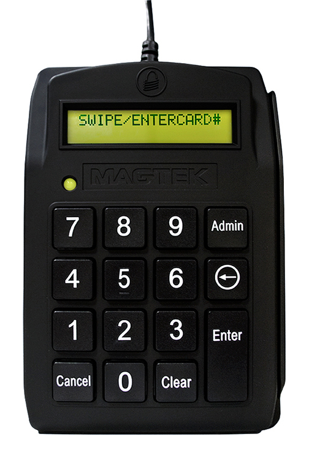

# DynaPAD

MagTek’s DynaPAD is a secure card reader authenticator (SCRA) combined with an easy-to-use keypad and a large 2-line x 15-digit liquid crystal display (LCD) allowing for either swipe card data or manual-entry of card data.

[Installation and Operation Manual](https://www.magtek.com/content/documentationfiles/d998200104.pdf)

[Programmer's Manual](https://www.magtek.com/content/documentationfiles/d998200173.pdf)