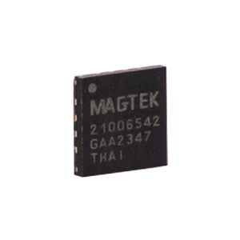

# ASICs

Qwantum ASIC delivers TDEA, AES 256-bit and AES 128-bit encryption and uses a unique key to encrypt within the ASIC before it even gets to the MCU for further encryption.

[Technical Reference Manual](https://www.magtek.com/content/documentationfiles/d99821002.pdf)

