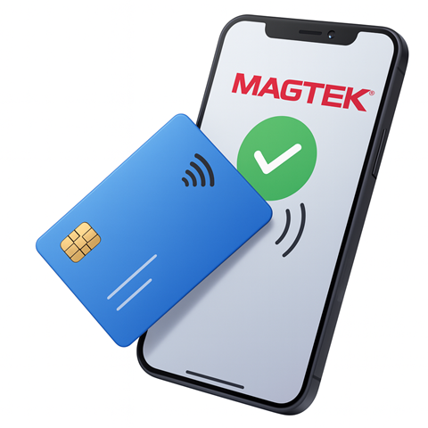
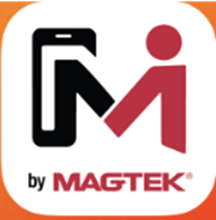
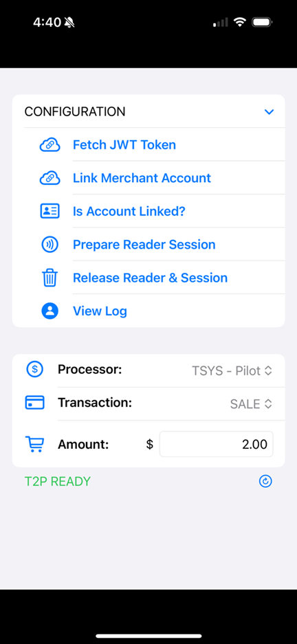
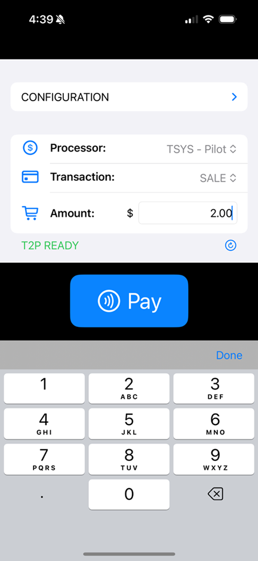
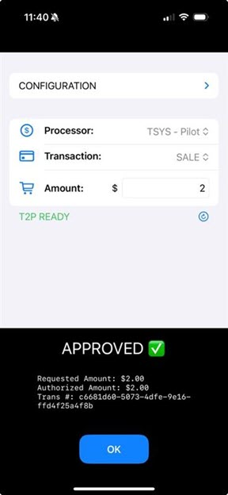
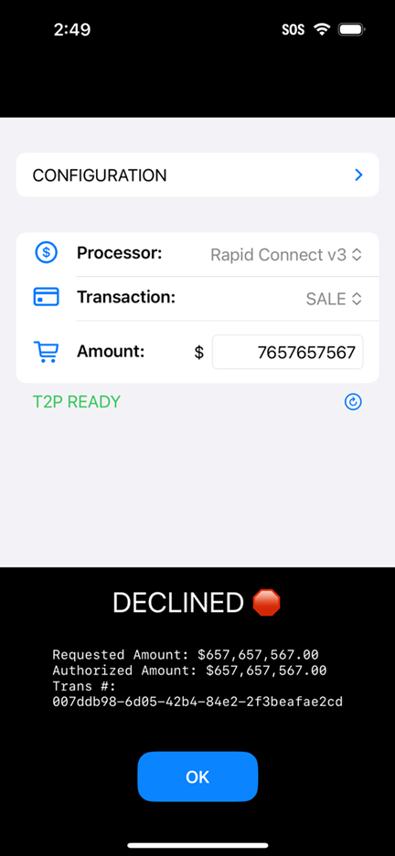
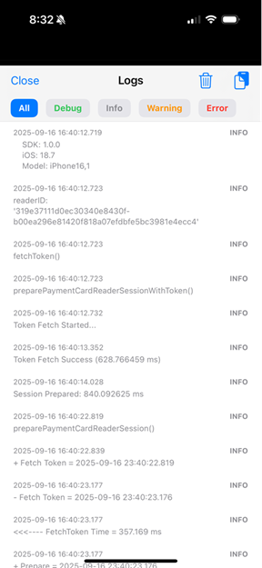

# MagTekVirtualReader iOS App — User Guide

The **MagTekVirtualReader** app enables Tap to Pay transactions on Apple iPhone devices using the **Magensa Payment Protection Gateway (MPPG)**. Use this guide to install the app and run test transactions.

---

**Figure 1.** Tap to Pay on iPhone using **MagTekVirtualReader** — present a contactless card or mobile device near the iPhone to initiate a secure transaction.

---

## Table of contents
- [MagTekVirtualReader iOS App — User Guide](#magtekvirtualreader-ios-app--user-guide)
  - [Table of contents](#table-of-contents)
  - [Overview](#overview)
  - [Requirements](#requirements)
  - [Install \& Open the App](#install--open-the-app)
  - [Configuration](#configuration)
  - [Run a Test Transaction](#run-a-test-transaction)
  - [Result States](#result-states)
  - [View Log](#view-log)
  - [Privacy \& Security Notes](#privacy--security-notes)
  - [Terms and Conditions](#terms-and-conditions)
  - [License](#license)
  - [Appendix A — Glossary](#appendix-a--glossary)
  - [Build](#build)

---

## Overview
This app is intended for **developers, testers, and pilot merchants**. It connects to Magensa (MPPG), verifies Tap to Pay capability on the device, and processes contactless payments on supported iPhones.

> ℹ️ This guide focuses on using the **app**. For SDK integration details, see the SDK readme/integration notes.

---

## Requirements
- **Device:** iPhone that supports **Tap to Pay on iPhone** (physical device required; simulator not supported)  
- **iOS:** 17.4 or later  
- **Account:** **Magensa** credentials (username & password)  
- **Network:** Internet access (Wi-Fi or cellular)

---

## Install & Open the App
⚠️ **Important Release Note**  
- The app is **not available on the Apple App Store**.  
- It will be distributed directly through **MagTek.com**.  
- At this time, there is **no public download link**, as the app has not yet been released.  
- Developers can open the demo source code and build it with **Xcode** if needed.  
- Once released, the download page will be available on MagTek.com:  
  👉 **[MagTek Virtual Reader Download (PLACEHOLDER – replace with final link when available)](https://www.magtek.com/downloads/virtualreader)**  
- The Build part number (PN) is **1000009873**.  

---

1. Once released, download the **Virtual Reader** app from the designated MagTek.com link (or TestFlight/enterprise distribution if provided).  
2. On your iPhone, locate the app icon and tap to open.

**Figure 2.** iOS **Virtual Reader** app icon.

---

## Configuration
Open the app and expand **CONFIGURATION**. The only item available is **View Log**, all other fields are preconfigured:

1. **Fetch JWT Token** – obtains a session token for Magensa.
2. **Link Merchant Account** – associates the device/session with the test merchant.
3. **Is Account Linked?** – verifies link status.
4. **Prepare Reader Session** – sets up Tap to Pay session on the device.
5. **Release Reader & Session** – cleanly tears down the session when finished.
6. **View Log** – shows verbose event logs (useful in testing).

> ℹ️ Configuration settings for the **app** are preconfigured and cannot be changed. For further details visit [MagTek Support](https://www.magtek.com/support).

---

**Figure 3.** **CONFIGURATION** panel with setup actions. These fields come preconfigured.

> **Tip:** After the session is prepared successfully, the status shows **T2P READY**.

---

## Run a Test Transaction
1. Ensure the status reads **T2P READY**.
2. In **Transaction**, select **SALE** (default).
3. Enter the **Amount** (e.g., `2.00`).
4. Tap **Pay**.
5. Present a contactless card/phone/watch near the top of the iPhone and follow on-screen prompts.

**Figure 4.** Enter an amount, confirm **Processor** and **Transaction** type, then tap **Pay** to start Tap to Pay.

---

## Result States
When the transaction completes, the app displays an **APPROVED** or **DECLINED** dialog with summary details.

**Figure 5.** **APPROVED** result showing `approvedAmount` and `transactionId`. Tap **OK** to return to the main screen.

**Figure 6.** **DECLINED** result with requested/authorized amounts and a transaction reference for support.

---

## View Log
Use **View Log** under **CONFIGURATION** to see detailed events from the VirtualReader layer and Magensa.  
- Helpful for QA and support.  
- Avoid sharing logs that include sensitive IDs outside your test org.

**Figure 6.** Example **View Log** output showing SDK version, iOS version, reader ID, and token fetch events.

---

## Privacy & Security Notes
- Treat device screenshots and logs as **confidential** if they contain transaction IDs or merchant info.
- Follow your organization’s security policies for handling payment data and artifacts.

---

## Terms and Conditions
[Terms and Conditions](https://www.magtek.com/about/policy?tab=terms)

## License
[License](https://www.magtek.com/about/policy?tab=software)

---

## Appendix A — Glossary
- **Tap to Pay on iPhone**: Apple feature enabling contactless acceptance without extra hardware on supported iPhones.  
- **Magensa (MPPG)**: MagTek’s Payment Protection Gateway for tokenization, routing, and processing.  
- **JWT**: JSON Web Token used to authenticate the app with backend services.  
- **Processor**: The host endpoint/profile used for transaction routing (e.g., **TSYS – Pilot**, **Rapid Connect v3**).  
- **T2P READY**: App state indicating the Tap to Pay session is initialized and ready to accept a tap.

---

## Build
PN1000009873
