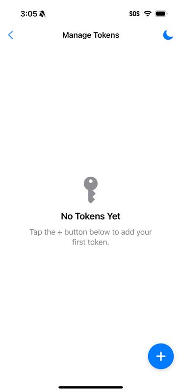

# Introduction

MagTek’s Qwantum Platform is a next-generation tokenization and authentication framework designed to replace outdated security models with real-time, user-initiated, and cryptographically secure authentication of Qwantum Tokens. Qwantum Tokens can be used in place of legacy credentials and used for a specific purpose, such as granting access to a facility, to a website, to loyalty points, even stored value.

The platform supports both card-present and digital environments, offering a mobile-first, yet flexible approach to eliminate static credentials that contain personally identifiable information (PII), prevent fraud, by strengthening and modernizing access and identity management.

The QMFA Wallet is available on iPhone and Apple Watch, serving as a secure repository for QWANTUM Tokens. By displaying these tokens as QR codes, the wallet enables quick, secure access to physical and digital systems through MagTek Dyna Devices equipped with barcode readers. Unlike traditional authentication methods, QMFA does not use usernames, passwords, or personally identifiable information (PII), which enhances privacy and reduces exposure to common security threats.

## System Overview

The Qwantum Platform is based on an extensive set of APIs, embedded circuits, hardware and services that have been integrated to generate powerful tokens including advanced delivery options, lifecycle management, and redemption services, all backed by powerful Qwantum Multi-Factor Authentication or QMFA.

The Qwantum Platform consists of three primary components: Qwantum Tokens, the QMFA Wallet mobile application, and QWANTUM APIs that facilitate secure token validation. Authentication occurs by creating tokens within the QMFA Wallet, displaying them as QR codes, and scanning them with a compatible QR Code reader or Dyna Device. For tokens that use Time-Based One-Time Passwords (TOTP), the app automatically generates and refreshes codes every 30 seconds. This system is designed to secure both physical and digital entry points, such as doors, portals, point-of-sale terminals and other forms of stored value and loyalty.

QMFA supports a variety of use cases, including corporate access control, multifactor authentication in the banking and credit union arena, secure retail checkout, healthcare facility, couponing, loyalty and stored value, etc.

# Token Types

QMFA supports several token types to meet a range of security and convenience requirements:

-   Simple Text: Basic strings of data stored for quick reference or entry.
-   SMS-Based One-Time Codes (OTC) or Timed Access Codes (TACs): Receive real-time generated codes via SMS.
-   Time-Based One-Time Passwords (TOTP): Rotating codes that refresh every 30–60 seconds and are generated locally on the device.
-   URLs: QR codes that launch web links instantly.
-   URLs with Integrated Data: Links that pre-fill token data or TOTP values into web forms for seamless authentication.

# Installation and Usage

Begin by downloading the latest version of the QWANTUM Multi-factor Authentication app, found [**Here**](https://apps.apple.com/id6479554567).

## iPhone

The QMFA Wallet app is available on the Apple App Store. After downloading the app, users should grant the necessary permissions, including camera access for QR code display and optional notifications for token-related alerts.

## Apple Watch

To use QMFA on an Apple Watch, the wallet must first be installed on the paired iPhone. Once installed, the companion Apple Watch app can be added through the Watch app on iPhone. Tokens automatically sync between the phone and watch, enabling quick wrist-based access.

## Using QWANTUM Multi-factor Authentication

### Using the QMFA iPhone App

Begin by downloading the latest version of the QWANTUM Multi-factor Authentication app, found [Here](https://apps.apple.com/id6479554567).

After the app is downloaded, a token will need to be added.

1.  Tap on the **cog icon** at the top right corner of the window to access the **Manage Tokens** window.
2.  Tap on the **Add** button at the bottom right corner of the window. This will display the **Add Token** screen.

### Adding, Viewing, Editing, and Deleting Tokens

#### Adding a Token

The Add Token Screen Fields appear as follows:

-   **Username**: Name associated with the token.
-   **Secret Key (optional)**: Used for TOTP generation; can be left blank.
-   **Token Data Field**: The encoded string used by the app to generate QR and TOTP.
-   **Token Use**: Label that identifies how the token is used (e.g., “DoorAccess”).
-   **Add Token Button**: Press this button when all relevant fields are entered.

    

#### Viewing a Token

Tokens can be viewed by tapping the **Cog** icon at the top righthand side of the screen. The app supports multiple tokens, allowing users to manage multiple credentials from one place. Tapping on the Token from the **Manage Tokens** screen will open the **Edit Token** screen. Pressing the **crescent moon** icon will activate or deactivate Dark Mode.

#### Editing a Token

Changes to a token can be made by modifying fields in the **Edit Token** screen. Press **Save Changes** when all desired changes have been made.

#### Deleting a Token

To delete a token, press the **Cog** icon at the top righthand side of the screen. From the Manage Tokens Screen, select the desired token to delete. Press **DELETE TOKEN**. This action permanently removes the token from the wallet.

#### Using a Token

From the home screen, swipe across the QR code (left or right) to select the desired token you wish to use. The token’s QR code will appear, ready to be scanned by a MagTek Dyna Device with barcode capability. For tokens with TOTP, the code will display in red beneath the QR image and refresh every 30 seconds.

Additional details:

-   When selecting a token, the screen shows:
-   QR code for scanning by Dyna Devices with BCR.
-   Username (left) and Token Use (right) above the QR.
-   TOTP in red numbers below the QR; updates every 30 seconds.
-   A countdown indicator icon shows time remaining until refresh.

#### Using the QMFA Apple Watch App

The Apple Watch companion app allows users to access their tokens directly from their wrist. By scrolling through the app, users can select a token and display its QR code for scanning with a Dyna Device. TOTP values are detected automatically during scanning, though users can scroll down to view the code manually if needed.

### Use Cases

QMFA is ideal for securing both physical and digital environments. In physical settings, tokens can unlock doors, gyms, and secure facilities. Digitally, they provide password-less login to services like the Magensa Merchant and Reseller Portals or access to loyalty and stored value. Industries such as healthcare, retail, car washes, laundry operators and private clubs benefit from QMFA’s ability to simplify authentication without compromising security.

# Integration & APIs

Developers can integrate QMFA into their systems using published APIs available through the Qwantum and Magensa gateway services. A Postman sandbox environment supports testing and development, allowing rapid proof-of-concept builds and seamless integration with existing workflows.

## Troubleshooting & FAQs

Common errors include QR codes not scanning, tokens appearing expired, or missing tokens after sync. These issues are typically resolved by adjusting screen brightness, refreshing the token, or ensuring the mobile device is properly paired with Apple Watch.

TOTP timing issues can occur if the device’s internal clock is out of sync. Confirm that system time is accurate for proper code generation.

## Support

For assistance, contact MagTek or Magensa support. Additional documentation and integration resources are available at **MAGENSA Developer Portal**.

###### Glossary of Terms

-   API – Application Programming Interface
-   EMV –Europay, MasterCard® and Visa®
-   FAQs – Frequently Asked Questions
-   KSN - Key Serial Number
-   MUT - MagTek Update Token
-   SDK – Software Developer’s Kit
-   SN - Serial Number
-   UIK - Unique Identifier Key
-   QMFA: Qwantum Multi-Factor Authentication
-   TOTP: Time-Based One-Time Password
-   OTC: One-Time Code (SMS-delivered)
-   TAC: Timed Access Code
-   BCR: Barcode Reader (on Dyna Devices)

###### Related Documentation

To view or download any of the documents mentioned in this manual, visit <https://www.magtek.com/support>.

## Terms and Conditions
[Terms and Conditions](https://www.magtek.com/about/policy?tab=terms)

## License
[License](https://www.magtek.com/about/policy?tab=software)
