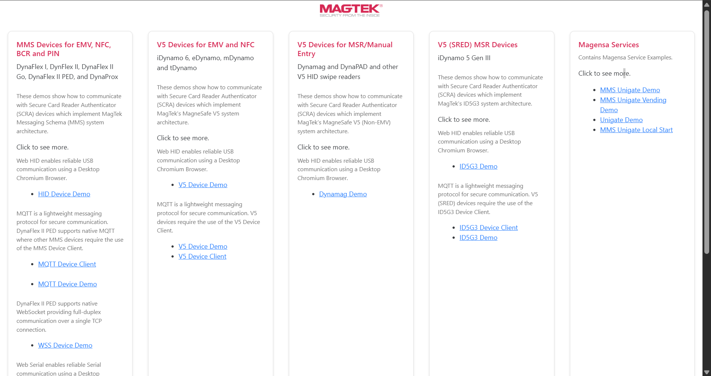
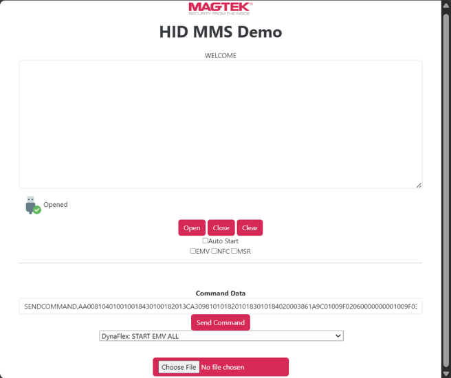
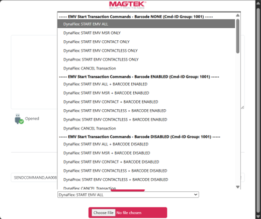
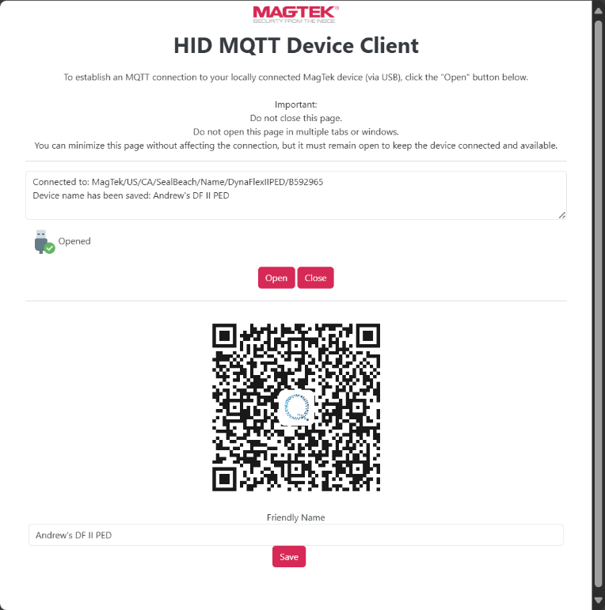
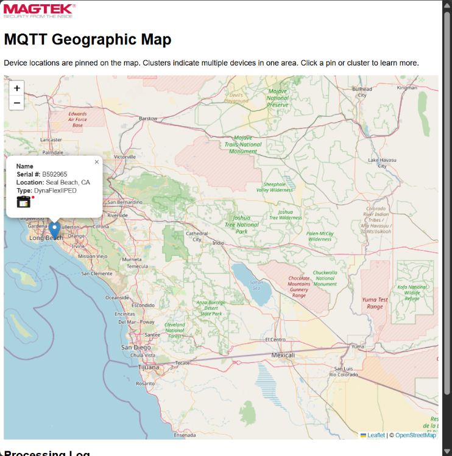
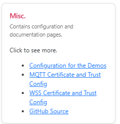
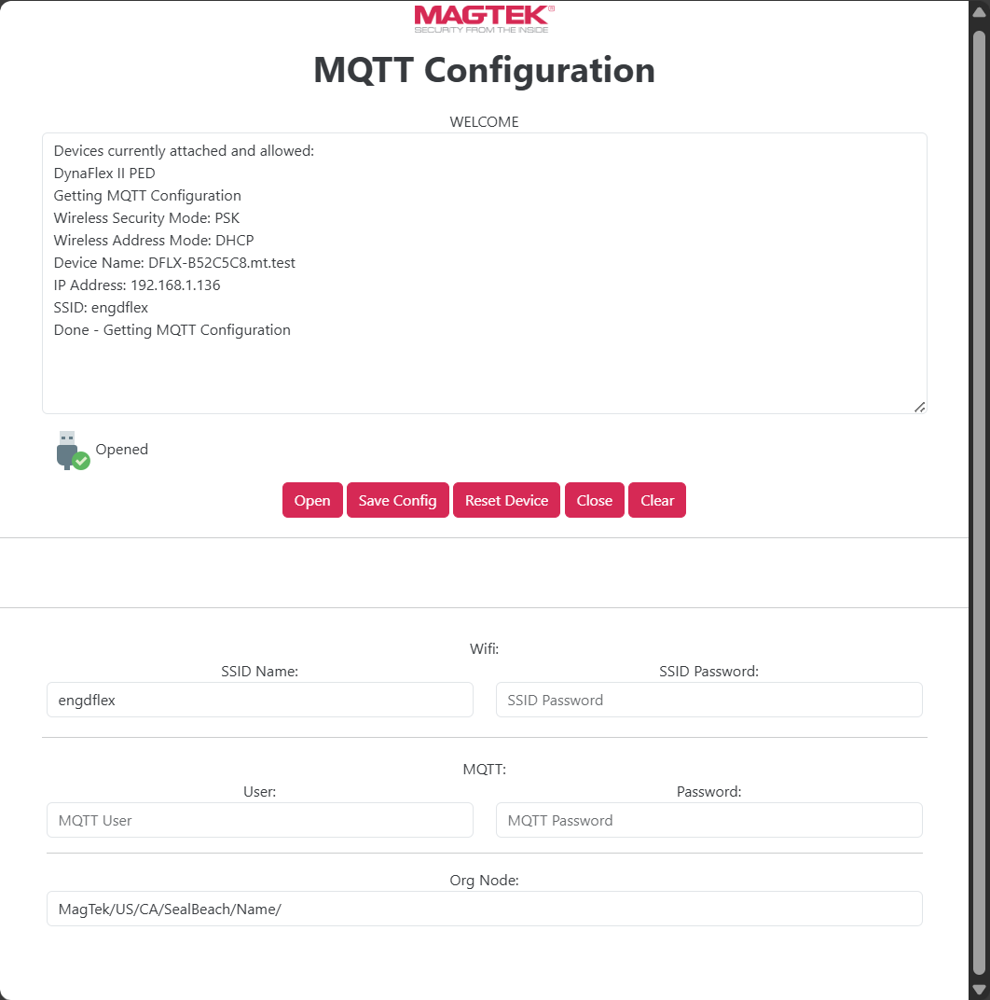
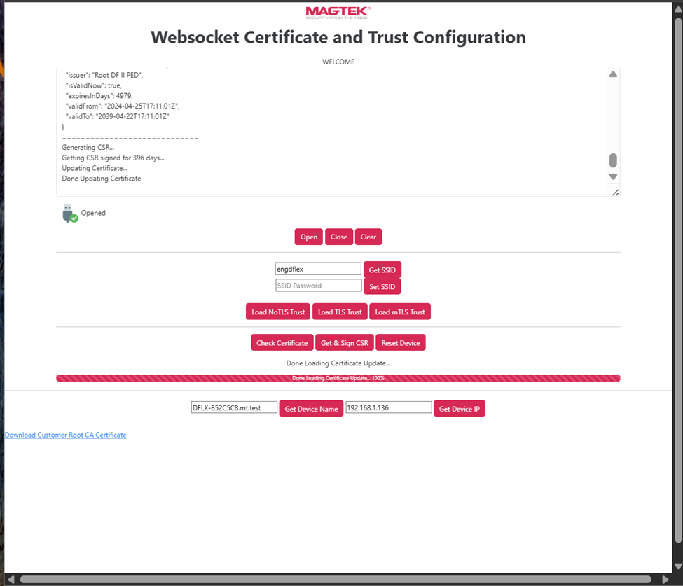
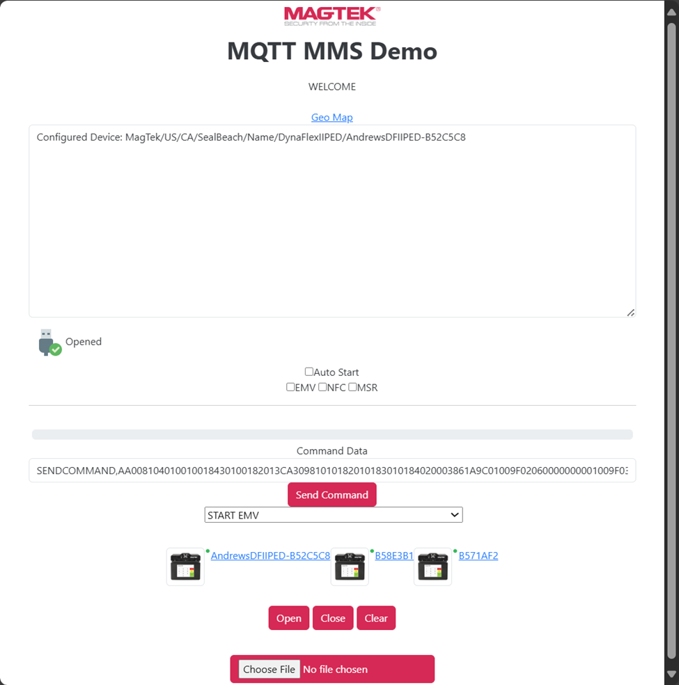

# Introduction

This document provides instructions for using the browser-based MagTek Demo Application to configure and evaluate MagTek MMS devices, including the DynaFlex family and DynaProx. The Demo Application enables testing of EMV chip and NFC transactions, barcode scanning, and PIN entry, and allows the user to review device responses in real time.

## Demo Application Home Page

Upon opening the Web HID Demo home page, the Main Page is displayed. This page serves as the central menu and is organized into the following categories:

-   **MMS Devices** – DynaFlex and DynaProx (EMV, NFC, Barcode, PIN)
-   **V5 Devices** – iDynamo, eDynamo, mDynamo, tDynamo (EMV, NFC)
-   **V5 MSR/Manual Entry** – swipe devices such as DynaMag and DynaPAD
-   **V5 (SRED) Devices** – iDynamo 5 Gen III
-   **Magensa Services** – secure services for transaction testing
-   **Miscellaneous** – configuration and GitHub source access

Each section provides a corresponding demo page with user interface elements for connecting a device, issuing commands, and reviewing results see **Figure 1.**

Figure 1 - Demo Application Home Page

## MMS Devices

The MMS product family includes the following devices:

-   DynaFlex
-   DynaFlex II PED
-   DynaFlex II GO
-   DynaProx

These devices support EMV, NFC, barcode, and PIN functionality. The Demo Application provides multiple connection methods (USB HID, WebSocket, MQTT, or BLE) depending on the device.

# HID MMS Demo

The **Human Interface Device (HID)** protocol is a USB communication standard originally designed for keyboards and mice. MagTek devices use HID to enable driverless, plug-and-play connectivity on desktop platforms.

To operate the **HID MMS Demo**:

1.  Ensure the device is powered on and connected via USB.
2.  From the Demo Application, select **Open**, and choose the appropriate device.
    -   A green check mark confirms that the device is successfully opened.
3.  From the command dropdown menu, select a command such as **Start EMV ALL**.
4.  Select **Send Command** to issue the command.
5.  Insert or tap a test card and monitor the transaction log for the response.
6.  To load custom scripts, use the **Choose File** button.

Figure 2 - HID MMS Demo

## MQTT

**Message Queuing Telemetry Transport (MQTT)** is a lightweight messaging protocol commonly used for Internet of Things (IoT) applications. It provides efficient, reliable communication between devices and applications, even in environments with limited connectivity.

Key characteristics include:

-   **Publish/Subscribe model** – Devices publish data to a central broker; applications subscribe to receive data.
-   **Low overhead** – Messages are compact and efficient, suitable for embedded systems.
-   **Real-time updates** – Events such as card insertions are transmitted immediately to the Demo Application.

Within the **HID MQTT Device Client** and **MQTT MMS Demo**, this protocol enables MagTek MMS devices (e.g., DynaFlex, DynaFlex II PED) to securely send transaction events while receiving commands.

## HID MQTT Device Client

The HID MQTT Device Client allows a MagTek MMS device to be connected over USB and accessed through MQTT transport.

Procedure:

1.  Power on and connect the device.
2.  Select **Open** within the HID MQTT Device Client.
3.  Scan the QR code or select the provided link to open the Demo Application.
4.  From the dropdown, select the required command, or use **Choose File** to upload a custom command script.
5.  Select **Send Command** to execute the command.

Figure 3 - HID MQTT Device Client

The **MQTT Geographic Map** displays device location and status for connected units, see **Figure 4**.

Figure 4 - MQTT Geographic Map

## Quick-Flow Summary

| **Step**                 | **Action**                                                                  |
|--------------------------|-----------------------------------------------------------------------------|
| 1. Prepare Device        | Power on the device and connect via USB, Wi-Fi, or BLE.                     |
| 2. Open Demo Application | Launch the Web HID Demo and select the appropriate demo type.               |
| 3. Configure Application | Enter RMS, WebSocket, MQTT, and Contactless parameters.                     |
| 4. Certificates & Trust  | Load TLS/mTLS, verify certificates, sign CSR, confirm IP.                   |
| 5. Open Session          | Select **Open** and confirm successful connection.                          |
| 6. Send Command          | Choose **Start EMV**, paste command data if necessary, and select **Send**. |
| 7. View Results          | Insert or tap a card, observe the transaction log, and close the session.   |

# Configuring the Demo Application

Figure 5 - Miscellaneous Configuration and Documentation Pages

Before using **MQTT** or **WebSocket (WSS)** transports, configuration is required. From the Demo Application Home Page, select **Miscellaneous → Configuration for the Demos**.

Configuration parameters include:

-   **RMS Options** – Enter the Magensa API key and service URL.
-   **WebSocket Options** – Provide the WebSocket server address.
-   **MQTT Options** – Specify the Org Node, broker address, client ID, and user credentials.
-   **Contactless Options** – Adjust timing parameters for NFC operations.

**Note:** Configuration values must be entered and saved prior to establishing a secure session. Connection attempts without proper configuration will fail.

## MQTT Configuration Page

The MQTT Configuration page provides controls and parameters necessary for device operation over MQTT.

-   **Device Status Panel** – Displays device information (model, name, IP address, SSID) and records configuration progress.
-   **Controls** – Includes **Open**, **Save Config**, **Reset Device**, **Close**, and **Clear**.
-   **Wi-Fi Settings** – SSID and password configuration.
-   **MQTT Credentials** – Org Node, username, and password for broker authentication.

Once configuration is complete and saved, the user may proceed to execute commands such as **Start EMV** or **Tap to Pay**. See **Figure 6 - MQTT Configuration.**

Figure 6 - MQTT Configuration

## WSS Certificate and Trust

This interface is used to configure secure communication with WebSocket transport using TLS or mTLS.

Functions include:

-   **Network Settings** – Configure DHCP, SSID, and device IP address.
-   **Wi-Fi Setup** – Retrieve or assign SSID and password credentials.
-   **Certificate and Trust Management** – Load TLS/mTLS certificates, verify certificates, and generate or sign Certificate Signing Requests (CSR).
-   **Controls** – **Open**, **Close**, **Clear**, and **Reset Device**.
-   **Device Identity** – Display or update the registered device name and IP address.
-   **Root CA Download** – Provides access to the root certificate authority file for verification.

**Error Condition:** If the status window displays *“OpenDevice No HID device selected or found”*, ensure the reader is connected via USB HID prior to attempting certificate operations.

Figure 7 - Websocket Certificate and Trust Configuration

# Demo Pages

These demo pages require configuration outlined in **Configuring the Demo Application.**

## MQTT MMS Demo

The MQTT MMS Demo serves as the control panel for MQTT-based device testing.

Figure 8 - MQTT MMS Demo

**Components:**

-   **Configured Device** – Identifies the active device.
-   **Status Indicator** – A green check mark indicates a successful connection.
-   **Options** – Auto Start, EMV, NFC, and MSR session checkboxes.
-   **Command Data** – Field for entering or pasting hexadecimal command data.
-   **Controls** – Dropdown for pre-defined commands (e.g., **START EMV**) and **Send Command** button.
-   **Device Instances** – Displays connected devices with selectable IDs.
-   **File Upload** – Allows uploading of command scripts or batch test files.

**Example Command Data (Hexadecimal):**

AA008104010010018430100182013CA30981010182010183010184020003861A9C01009F0206000000001009F0

The command above, and others can be selected from the pulldown menu. The Choose File button allows the user to upload custom commands from a file. This screen also confirms device recognition, command formatting, and connectivity prior to further testing.

## WSS Device Demo

This page confirms successful certificate signing and device trust configuration.

-   **Log Window** – Displays certificate details (issuer, validity, status) and CSR signing progress.
-   **Status Indicator** – A green check mark indicates the device is trusted and opened.
-   **Controls** – Certificate and trust management buttons remain available.
-   **Device Identity** – Confirms the device name and IP address.
-   **Root CA Certificate** – Link to download the certificate used for verification.

This page validates that the device has been provisioned for secure WebSocket communication.

